# Authentication in Snowflake

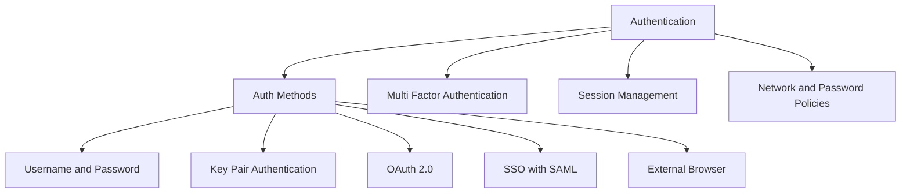

## Authentication Methods Overview

| Method | Setup Complexity | Security Level | Best For | Not Ideal For |
|--------|-----------------|---------------|----------|---------------|
| Username and Password | Low | Medium | Quick testing personal use learning | Production automation service accounts |
| Key Pair Authentication | Medium | High | Automation scripts ETL pipelines service accounts | Interactive users who need simple login |
| OAuth 2.0 | High | High | Enterprise apps short lived tokens API access | Simple one off scripts or personal use |
| SSO with SAML | High | High | Corporate users MFA integration centralized identity | External users without IdP access |
| External Browser | Low | Medium | Interactive login with MFA support | Headless automation or service accounts |

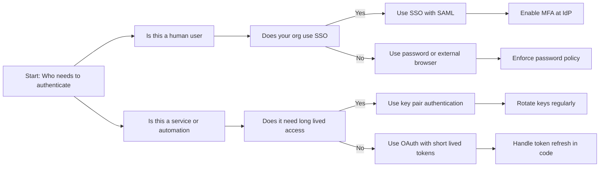

## Username and Password Authentication

### How It Works

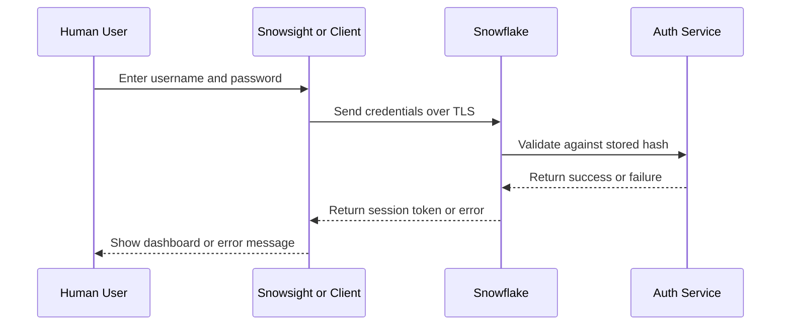

### Configuration and Policies

```sql
-- Create user with password
CREATE OR REPLACE USER analyst_jane
  PASSWORD = 'StrongP@ssw0rd123'
  MUST_CHANGE_PASSWORD = TRUE
  DEFAULT_ROLE = ANALYST_ROLE
  DEFAULT_WAREHOUSE = ANALYTICS_WH;

-- Set account level password policy
ALTER ACCOUNT SET
  MIN_PASSWORD_LENGTH = 12
  PASSWORD_HISTORY = 3
  LOCKOUT_TIME_MINS = 15
  MAX_FAILED_LOGIN_ATTEMPTS = 5
  MIN_UPPER_CASE_CHARS = 1
  MIN_LOWER_CASE_CHARS = 1
  MIN_NUMERIC_CHARS = 1
  MIN_SPECIAL_CHARS = 1;

-- Force password change on next login
ALTER USER analyst_jane SET MUST_CHANGE_PASSWORD = TRUE;
```

| Policy Setting | Recommended Value | Why |
|---------------|------------------|-----|
| MIN_PASSWORD_LENGTH | 12 or higher | Harder to brute force or guess |
| PASSWORD_HISTORY | 3 or more | Prevents reusing old compromised passwords |
| LOCKOUT_TIME_MINS | 15 | Slows down brute force attempts |
| MAX_FAILED_LOGIN_ATTEMPTS | 5 | Locks out attackers after a few tries |
| MIN_SPECIAL_CHARS | 1 | Increases password entropy |

### When To Use Password Auth

| Scenario | Use Password | Why |
|----------|-------------|-----|
| New user onboarding | Yes | Simple for first login then switch to SSO |
| Personal learning account | Yes | Low setup overhead for individual use |
| Temporary contractor access | Yes with expiration | Easy to create and disable quickly |
| Production ETL pipeline | No | Passwords in scripts are a security risk |
| Service account for API | No | Keys or tokens are more secure and rotatable |

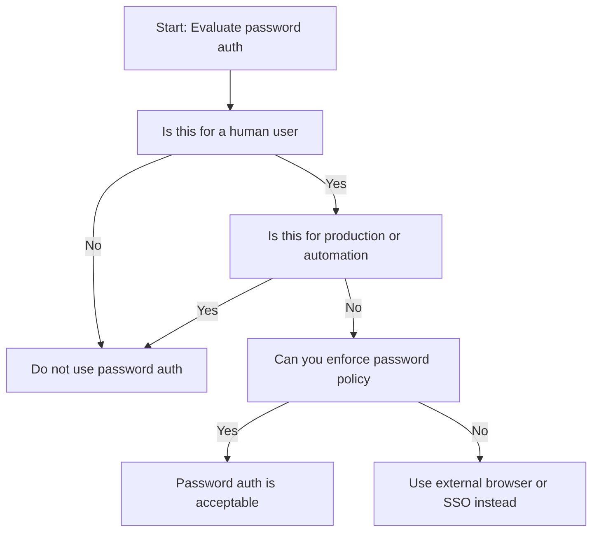

## Key Pair Authentication

### How It Works

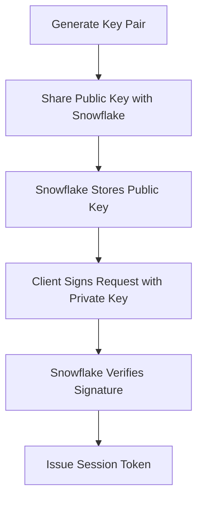

### Setup Steps

```bash
# Step 1: Generate RSA key pair (2048 or 4096 bit)
openssl genrsa -out rsa_key.pem 2048
openssl rsa -in rsa_key.pem -pubout -out rsa_key_pub.pem

# Step 2: Extract public key for Snowflake
# Remove headers and newlines to get single line
cat rsa_key_pub.pem | grep -v "BEGIN\|END" | tr -d '\n'

# Step 3: Assign public key to user
ALTER USER etl_service SET RSA_PUBLIC_KEY = 'MIIBIjANBgkq...';

# Step 4: Connect using private key
# With snowsql
snowsql -a myaccount -u etl_service --private-key-path rsa_key.pem

# With Python connector
import snowflake.connector
conn = snowflake.connector.connect(
    user='etl_service',
    account='myaccount',
    private_key_path='rsa_key.pem'
)
```

### Key Rotation Pattern

```sql
-- Step 1: Add new public key while keeping old one
ALTER USER etl_service SET RSA_PUBLIC_KEY_2 = 'NEW_PUBLIC_KEY_HERE';

-- Step 2: Update clients to use new private key
-- Deploy new key to automation systems

-- Step 3: Remove old key after confirmation
ALTER USER etl_service UNSET RSA_PUBLIC_KEY;
ALTER USER etl_service SET RSA_PUBLIC_KEY = RSA_PUBLIC_KEY_2;
ALTER USER etl_service UNSET RSA_PUBLIC_KEY_2;
```

| Practice | Why It Matters |
|----------|---------------|
| Use 2048 or 4096 bit keys | Shorter keys are vulnerable to brute force |
| Store private keys securely | Use vault or secrets manager not code repo |
| Rotate keys every 90 days | Limits exposure if a key is compromised |
| Use RSA_PUBLIC_KEY_2 for rotation | Enables zero downtime key updates |
| Audit key usage with LOGIN_HISTORY | Detect unusual authentication patterns |

### When To Use Key Pair Auth

| Scenario | Use Key Pair | Why |
|----------|-------------|-----|
| ETL pipeline running on schedule | Yes | No password to manage or expire |
| Service account for API access | Yes | Keys can be rotated without changing code logic |
| Automated deployment scripts | Yes | Secure and scriptable authentication |
| Interactive user login | No | Too complex for daily human use |
| Short lived temporary access | No | OAuth tokens are better for temporary needs |

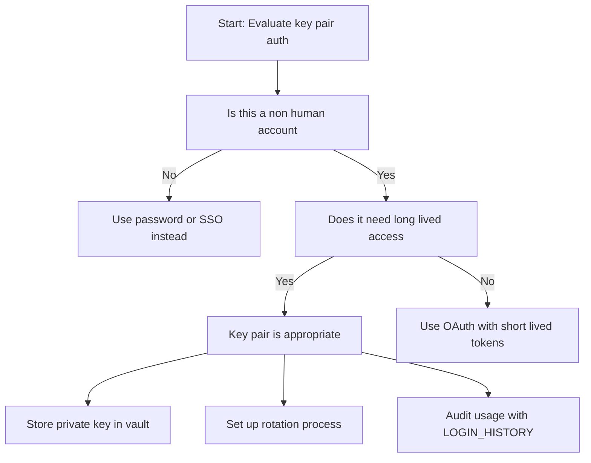

## OAuth 2.0 Authentication

### How It Works

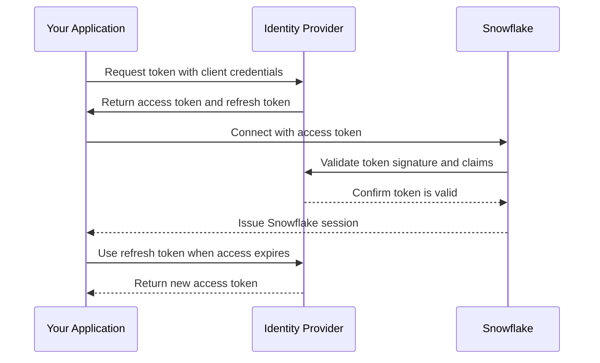

### Configuration Steps

```sql
-- Step 1: Create security integration for OAuth
CREATE OR REPLACE SECURITY INTEGRATION my_oauth_integration
  TYPE = OAUTH
  ENABLED = TRUE
  OAUTH_CLIENT = CUSTOM
  OAUTH_REDIRECT_URI = 'https://your-app.com/callback'
  OAUTH_ISSUE_REFRESH_TOKENS = TRUE
  OAUTH_REFRESH_TOKEN_VALIDITY = 7776000;  -- 90 days

-- Step 2: Get client credentials from Snowflake
SELECT SYSTEM$SHOW_OAUTH_CLIENT_SECRETS('my_oauth_integration');

-- Step 3: Configure your app to use the credentials
-- Use client_id and client_secret to request tokens from Snowflake

-- Step 4: Connect with token
import snowflake.connector
conn = snowflake.connector.connect(
    user='api_user',
    account='myaccount',
    authenticator='oauth',
    token='your_access_token_here'
)
```

### OAuth Flow Types

| Flow Type | When To Use | Key Characteristic |
|-----------|-------------|-------------------|
| Authorization Code | User interactive apps | Redirects user to IdP for login |
| Client Credentials | Service to service | App authenticates itself no user context |
| Refresh Token | Long running sessions | Use refresh token to get new access token |
| JWT Bearer | Assertion based auth | App signs JWT to prove identity |

### When To Use OAuth

| Scenario | Use OAuth | Why |
|----------|-----------|-----|
| Web app with user login | Yes | Standard flow for browser based apps |
| Mobile app connecting to Snowflake | Yes | Handles token refresh automatically |
| Microservice calling Snowflake API | Yes | Client credentials flow for service auth |
| One off script or ad hoc query | No | Overhead not justified for simple use |
| Internal tool with few users | Maybe | Password or key pair may be simpler |

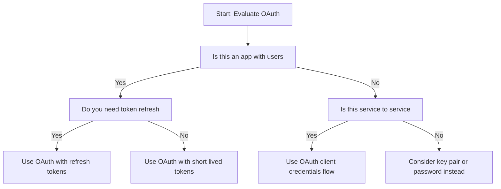

## SSO with SAML 2.0

### How It Works

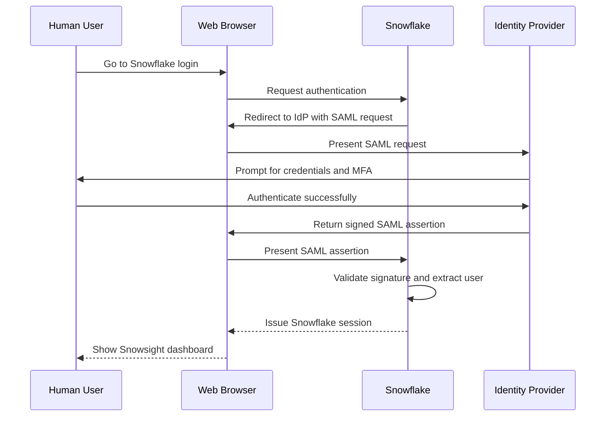

### Configuration Steps

```sql
-- Step 1: Create SAML security integration
CREATE OR REPLACE SECURITY INTEGRATION my_sso_integration
  TYPE = SAML2
  ENABLED = TRUE
  SAML2_ISSUER = 'https://idp.example.com/saml'
  SAML2_SSO_URL = 'https://idp.example.com/sso'
  SAML2_PROVIDER = 'CUSTOM'
  SAML2_X509_CERT = 'MIIDXTCCAkWgAwIBAgIJ...'
  SAML2_SP_ISSUER = 'snowflake_account';

-- Step 2: Get Snowflake metadata for IdP
SELECT SYSTEM$GENERATE_SAML_SP_METADATA('my_sso_integration');

-- Step 3: Configure IdP with Snowflake metadata
-- Upload metadata to your IdP like Okta Azure AD or Ping

-- Step 4: Test and enable
-- Use test user to verify SSO flow before rolling out
```

### User Mapping and Roles

```sql
-- Map SAML attributes to Snowflake user properties
ALTER USER jane_doe SET SAML2_DIGEST_AUTH_ONLY = FALSE;

-- Use SCIM provisioning to auto create users and assign roles
-- Configure IdP to send groups as Snowflake roles

-- Example: IdP sends group "analytics_team"
-- Snowflake maps to role ANALYST_ROLE via SCIM
```

| Attribute | Snowflake Field | Example Value |
|-----------|----------------|---------------|
| NameID | User login name | jane.doe@company.com |
| Email | User email | jane.doe@company.com |
| Groups | Roles to assign | analytics_team engineering_team |
| FirstName | User first name | Jane |
| LastName | User last name | Doe |

### When To Use SSO

| Scenario | Use SSO | Why |
|----------|---------|-----|
| Corporate employees with IdP | Yes | Centralized identity management and MFA |
| External contractors without IdP | No | They cannot authenticate via your IdP |
| Mixed internal and external users | Maybe | Use SSO for internal password for external |
| Compliance requiring MFA | Yes | MFA enforced at IdP level |
| Small team without IdP | No | Password or external browser is simpler |

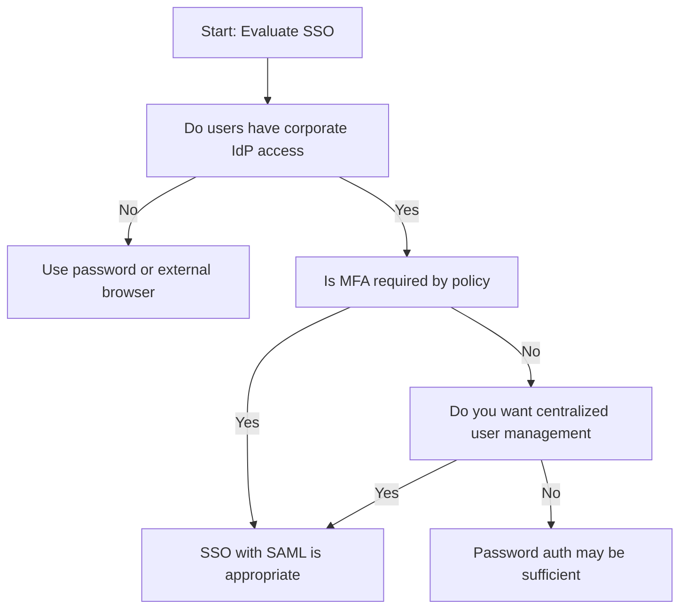

## External Browser Authentication

### How It Works

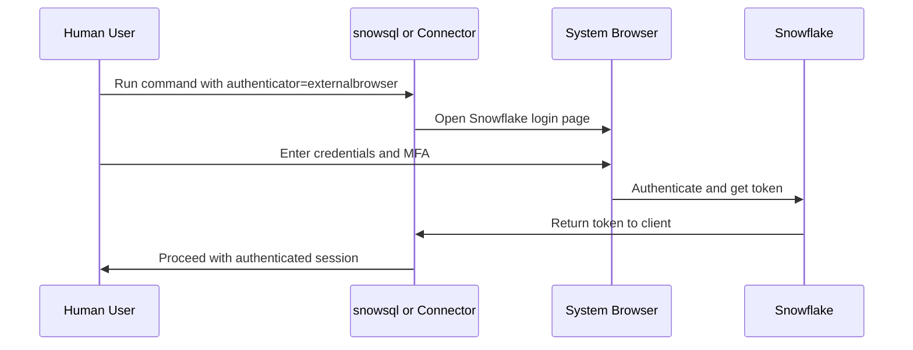

### Usage Example

```bash
# With snowsql
snowsql -a myaccount -u analyst_jane --authenticator externalbrowser

# With Python connector
import snowflake.connector
conn = snowflake.connector.connect(
    user='analyst_jane',
    account='myaccount',
    authenticator='externalbrowser'
)

# With JDBC URL
jdbc:snowflake://myaccount.snowflakecomputing.com/?authenticator=externalbrowser&user=analyst_jane
```

| Benefit | Why It Matters |
|---------|---------------|
| No password in config | Credentials entered interactively not stored |
| MFA support | Works with Snowflake native MFA |
| Simple setup | No IdP or key management required |
| Works with SSO | Can redirect to IdP if configured |

### When To Use External Browser

| Scenario | Use External Browser | Why |
|----------|---------------------|-----|
| Interactive CLI or notebook use | Yes | Simple secure login without config |
| Headless automation | No | Requires human interaction to authenticate |
| Users with MFA enabled | Yes | Supports MFA flow naturally |
| Quick testing or demos | Yes | Fast setup without complex config |
| Production scheduled jobs | No | Cannot run unattended |

## Multi Factor Authentication MFA

### MFA Options in Snowflake

| MFA Method | Setup | User Experience | Security Level |
|-----------|-------|----------------|---------------|
| Duo Push | Configure Duo integration | Push notification to phone | High |
| Okta Verify | Configure Okta as IdP | App notification or code | High |
| Google Authenticator | Enable in user profile | Time based code from app | Medium High |
| SMS code | Enable in user profile | Text message with code | Medium |
| Email code | Enable in user profile | Email with code | Low Medium |

### Enforcing MFA

```sql
-- Enable MFA caching control at account level
ALTER ACCOUNT SET ALLOW_CLIENT_MFA_CACHING = FALSE;

-- Require MFA for specific users
ALTER USER analyst_jane SET MFA_ENROLLMENT = REQUIRED;

-- Check MFA status for users
SELECT
  name,
  mfa_enrollment,
  last_success_login
FROM SNOWFLAKE.ACCOUNT_USAGE.USERS
WHERE mfa_enrollment IS NOT NULL;
```

### MFA Best Practices

| Practice | Why It Matters |
|----------|---------------|
| Require MFA for all interactive users | Prevents account takeover with stolen passwords |
| Do not cache MFA for sensitive roles | Forces re authentication for high privilege actions |
| Use app based MFA not SMS when possible | SMS can be intercepted via SIM swap |
| Monitor MFA failures in LOGIN_HISTORY | Detect brute force or credential stuffing attempts |
| Document MFA recovery process | Users need a path if they lose their device |

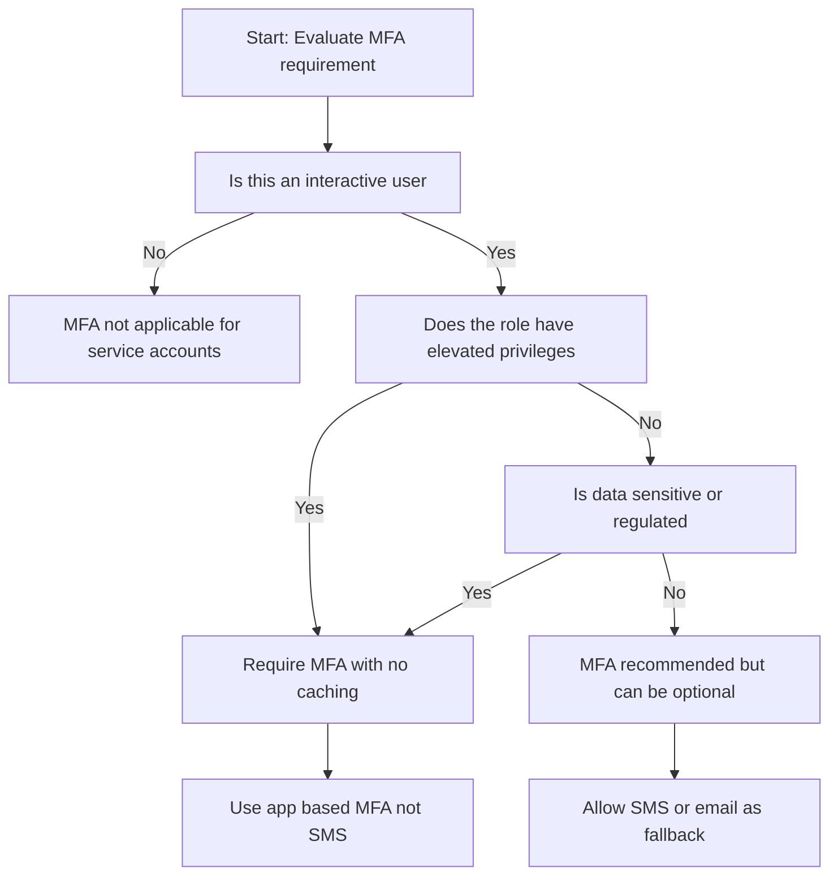

## Session Management and Security

### Session Parameters

| Parameter | Default | Recommended for Prod | Purpose |
|-----------|---------|---------------------|---------|
| SESSION_TIMEOUT_IN_SECONDS | 14400 4 hours | 3600 1 hour | Limits window for session hijacking |
| STATEMENT_TIMEOUT_IN_SECONDS | 0 unlimited | 300 5 minutes | Prevents runaway queries from holding session |
| CLIENT_SESSION_KEEP_ALIVE | FALSE | FALSE for security | Keeping session alive increases exposure |
| ALLOW_CLIENT_MFA_CACHING | TRUE | FALSE for sensitive roles | Forces re authentication for privileged actions |

```sql
-- Set session parameters at role level
ALTER ROLE ANALYST_ROLE SET
  SESSION_TIMEOUT_IN_SECONDS = 3600
  STATEMENT_TIMEOUT_IN_SECONDS = 300;

-- Set at user level for specific cases
ALTER USER etl_service SET
  STATEMENT_TIMEOUT_IN_SECONDS = 1800;  -- Longer for ETL jobs
```

### Monitoring Authentication Events

```sql
-- Find failed login attempts in last 24 hours
SELECT
  EVENT_TIMESTAMP,
  USER_NAME,
  CLIENT_IP,
  ERROR_MESSAGE,
  AUTHENTICATION_METHOD
FROM SNOWFLAKE.ACCOUNT_USAGE.LOGIN_HISTORY
WHERE SUCCESS = 'NO'
  AND EVENT_TIMESTAMP > DATEADD(hour, -24, CURRENT_TIMESTAMP)
ORDER BY EVENT_TIMESTAMP DESC;

-- Track MFA enrollment and usage
SELECT
  name as user_name,
  mfa_enrollment,
  last_success_login,
  disabled
FROM SNOWFLAKE.ACCOUNT_USAGE.USERS
WHERE mfa_enrollment IS NOT NULL
ORDER BY last_success_login DESC;
```

## Network Policies for Authentication Control

```sql
-- Create network policy to restrict login sources
CREATE OR REPLACE NETWORK POLICY corporate_access
  ALLOWED_IP_LIST = ('192.168.1.0/24', '10.0.0.0/8', '203.0.113.5/32')
  BLOCKED_IP_LIST = ('0.0.0.0/0')
  COMMENT = 'Allow only corporate VPN and approved partner IPs';

-- Apply to account level
ALTER ACCOUNT SET NETWORK_POLICY = corporate_access;

-- Apply to specific user for service accounts
ALTER USER etl_service SET NETWORK_POLICY = etl_server_policy;
```

| Policy Scope | When To Use | Example |
|-------------|-------------|---------|
| Account level | Restrict all logins to known networks | Corporate only access |
| User level | Restrict service accounts to specific IPs | ETL server can only connect from its IP |
| Role level | Not directly supported but can enforce via grants | Use user level policies for role members |

## Decision Framework for Authentication Method

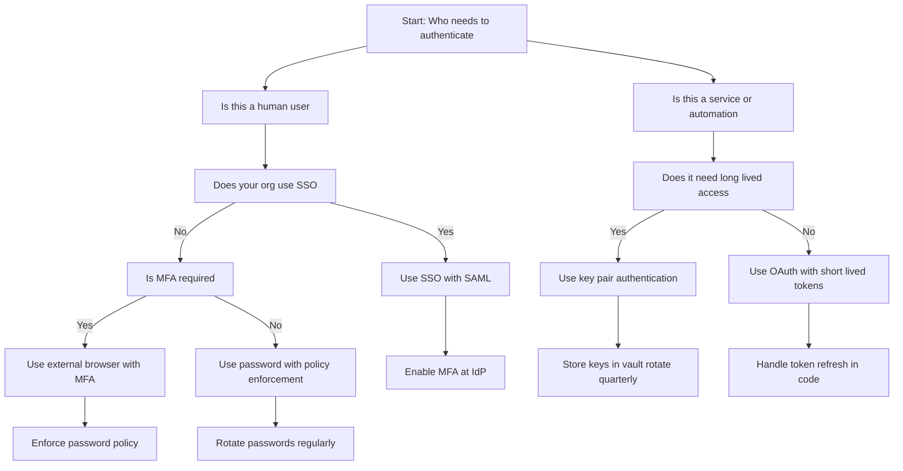

## Common Authentication Pitfalls

| Pitfall | What Happens | How To Fix |
|---------|--------------|------------|
| Storing passwords in scripts | Credentials leak via version control or logs | Use key pair or OAuth for automation |
| Not rotating keys | Compromised key grants long term access | Set 90 day rotation schedule use RSA_PUBLIC_KEY_2 |
| Allowing MFA caching for admin roles | Stolen session token grants prolonged access | Set ALLOW_CLIENT_MFA_CACHING = FALSE for privileged roles |
| Using SMS MFA for sensitive accounts | SIM swap attacks bypass SMS | Require app based MFA like Duo or Google Authenticator |
| Not monitoring LOGIN_HISTORY | Breaches go undetected | Set up alerts for failed logins or unusual IPs |
| Granting network policy too broadly | Attackers can connect from anywhere | Restrict to specific IP ranges or VPC endpoints |
| Forgetting to disable departed users | Former employees retain access | Automate user disable on HR offboarding trigger |

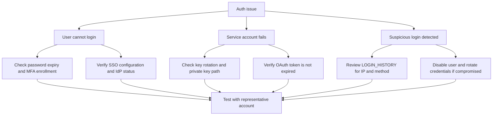

## Best Practices Summary

- Use SSO for corporate users. Centralized identity management reduces overhead and improves security
- Use key pair for service accounts. No passwords to manage keys can be rotated securely
- Use OAuth for apps. Standard protocol handles tokens and refresh automatically
- Enforce MFA for interactive users. App based MFA is more secure than SMS
- Set session timeouts. Limit the window for session hijacking
- Monitor LOGIN_HISTORY. Detect brute force or unusual patterns early
- Restrict by network policy. Limit login sources to known trusted IPs
- Document authentication choices. Future you needs to know why a method was selected
- Review access quarterly. Users change roles. Authentication methods should too
- Automate offboarding. Disable users and rotate keys when people leave

## Bottom Line

- Authentication is your first line of defense. Get it right or everything else is weaker
- Match the method to the user. Humans need simple. Services need secure. Apps need standard
- MFA is not optional for interactive access. Stolen passwords are too common
- Keys and tokens must rotate. Long lived credentials are high value targets
- Monitor and alert. You cannot fix what you do not see
- Document and review. Security is a practice not a one time setup

Think of authentication like keys to a building:
- Passwords are like simple keys. Easy to copy easy to lose
- Key pairs are like badge plus PIN. Two factors harder to fake
- OAuth is like a temporary guest pass. Expires automatically
- SSO is like a master badge from your employer. One login many doors
- MFA is like requiring a code from your phone. Even with the key you need the second factor

Pick the right key for the right door. Simple keys for low risk areas. Badges and codes for sensitive rooms. Temporary passes for visitors. And always check who used which key and when. That is how authentication works in Snowflake.
