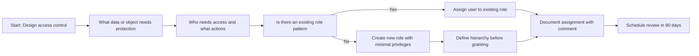
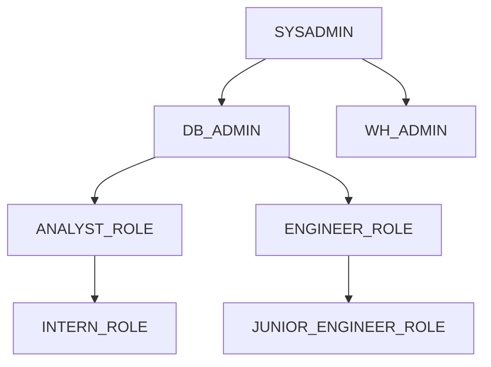
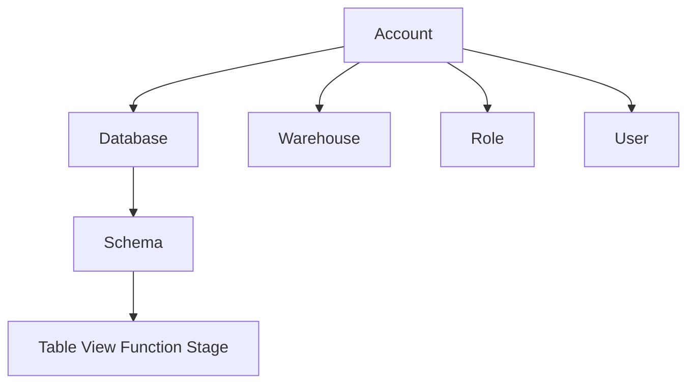
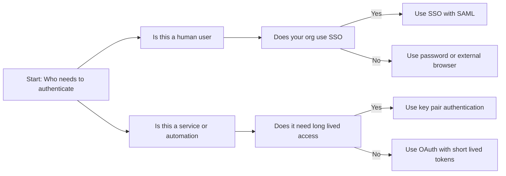
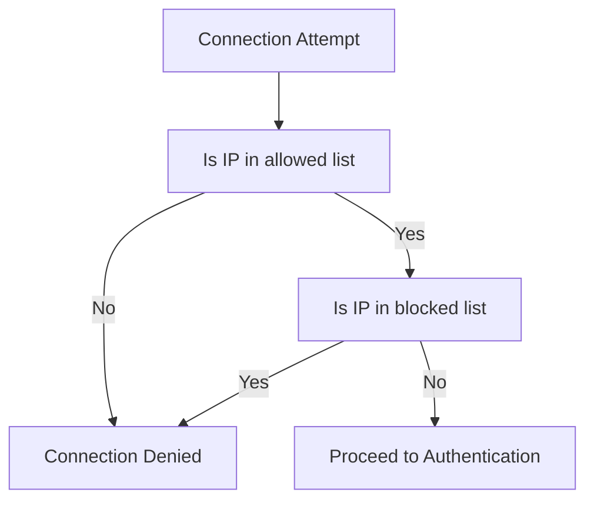
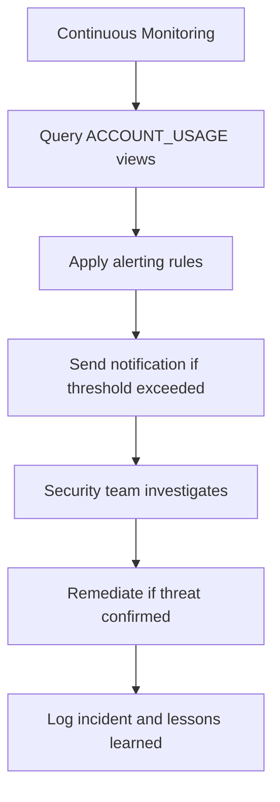
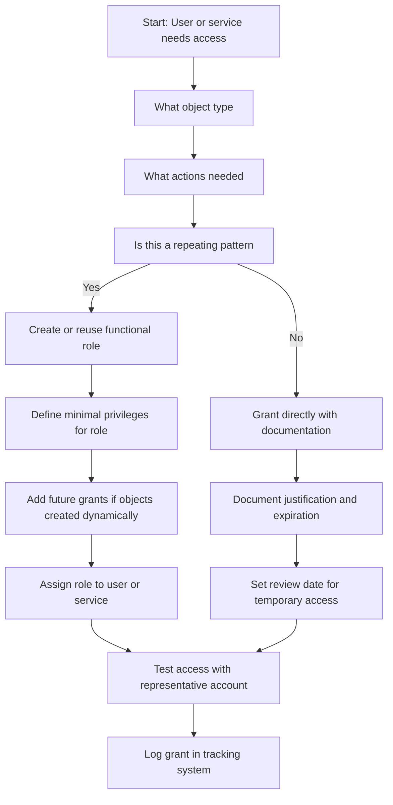
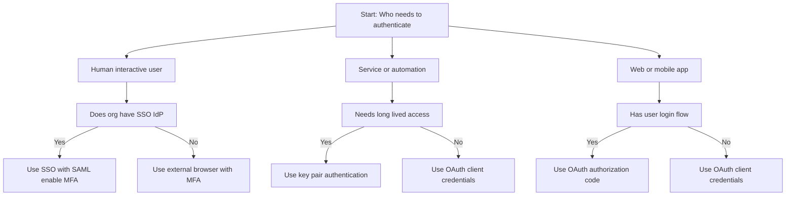

# Domain 2.1 Snowflake Security Model and Principles

```mermaid
graph TD
  SecurityModel[Security Model] --> AccessCtrl[Access Control]
  SecurityModel --> Auth[Authentication]
  SecurityModel --> Identifiers[Roles and Identifiers]
  SecurityModel --> Network[Network Controls]
  SecurityModel --> Audit[Logging and Monitoring]
  
  AccessCtrl --> DAC[Discretionary Access Control]
  AccessCtrl --> RBAC[Role Based Access Control]
  AccessCtrl --> Hierarchy[Securable Object Hierarchy]
  
  Auth --> Methods[Authentication Methods]
  Auth --> MFA[Multi Factor Authentication]
  Auth --> SSO[Single Sign On]
  Auth --> OAuth[OAuth 2.0]
  
  Identifiers --> SysRoles[System Defined Roles]
  Identifiers --> FuncRoles[Functional Roles]
  Identifiers --> AcctId[Account Identifiers]
  Identifiers --> Logging[Audit Logging]
  
  Network --> Policies[Network Policies]
  Network --> IPControl[IP Allowlists and Blocklists]
  
  Audit --> Views[ACCOUNT_USAGE Views]
  Audit --> Export[Log Export and Retention]
  Audit --> Alerts[Security Alerting]
```



## Core Security Principles

| Principle | What It Means | Why It Matters |
|-----------|--------------|----------------|
| Least privilege | Grant only what is required for the task | Reduces blast radius if credentials are compromised |
| Default deny | No access unless explicitly granted | Forces intentional permission decisions |
| Separate duties | Different roles for different functions | Prevents single person from having too much power |
| Grant to roles not users | Assign privileges to roles then assign roles to users | Easier to audit update and reuse access patterns |
| Inheritance flows down | Parent roles pass privileges to child roles | Simplifies management but requires careful design |
| Document everything | Comments and version control for all grants | Enables audits and future troubleshooting |
| Review regularly | Quarterly access reviews and role audits | Access drifts over time. Catch problems before incidents |



## Access Control Models

### Discretionary Access Control DAC

| Concept | What It Means in Snowflake | Simple Explanation |
|---------|---------------------------|------------------|
| Object owner | The role that created the object or was granted ownership | Whoever owns the table decides who can use it |
| Grant privilege | Owner can give access to other roles or users | Like lending your key to a trusted person |
| Grant option | Owner can let others grant access too | Like giving someone the power to lend your key |
| Revoke privilege | Owner can take back access anytime | Like changing the lock if you need to |

```sql
-- DAC pattern: Owner grants access to collaborators
CREATE ROLE project_alpha_owner;
SET ROLE = project_alpha_owner;
CREATE TABLE project_alpha.results (id NUMBER, metric FLOAT);

-- Owner grants to team members
GRANT SELECT ON TABLE project_alpha.results TO ROLE project_alpha_team;
GRANT INSERT ON TABLE project_alpha.results TO ROLE project_alpha_engineers;

-- Owner retains ultimate control
REVOKE SELECT ON TABLE project_alpha.results FROM ROLE project_alpha_team;
```

| When To Use DAC | Why |
|----------------|-----|
| Collaborative research projects | Owners can adapt access as analysis changes |
| External partnerships with trusted parties | Owners manage partner access without central bottleneck |
| Data domains owned by business teams | Domain experts best positioned to judge access needs |

| DAC Guardrails | Implementation |
|---------------|---------------|
| Document owner responsibilities | Require comments on GRANT statements |
| Review grants quarterly | Schedule TASK to query GRANTS and alert on stale access |
| Limit grant option delegation | One level maximum. Require central approval for further |
| Monitor with ACCOUNT_USAGE | Central security should have visibility into DAC grants |

### Role Based Access Control RBAC



| System Role | Purpose | Key Privileges | Who Should Have It |
|------------|---------|---------------|-------------------|
| ACCOUNTADMIN | Full account control including billing | All privileges ORGADMIN role management | 1 to 2 senior platform leads only |
| SYSADMIN | Create and manage databases schemas objects | CREATE DATABASE CREATE SCHEMA CREATE TABLE | Platform engineers data platform team |
| SECURITYADMIN | Manage users roles grants | CREATE ROLE GRANT ROLE CREATE USER | Security team identity administrators |
| USERADMIN | Manage user accounts and passwords | CREATE USER ALTER USER RESET PASSWORD | HR IT helpdesk user provisioning team |
| PUBLIC | Default role for all users | USAGE on public schema of each database | All users automatically. Grant minimal additional |

```sql
-- Functional role pattern with least privilege
CREATE ROLE ANALYST_READ_ONLY
  COMMENT = 'Read access to reporting schema for business analysts';

GRANT USAGE ON DATABASE analytics TO ROLE ANALYST_READ_ONLY;
GRANT USAGE ON SCHEMA analytics.reporting TO ROLE ANALYST_READ_ONLY;
GRANT SELECT ON ALL TABLES IN SCHEMA analytics.reporting TO ROLE ANALYST_READ_ONLY;
GRANT SELECT ON FUTURE TABLES IN SCHEMA analytics.reporting TO ROLE ANALYST_READ_ONLY;

GRANT ROLE ANALYST_READ_ONLY TO USER analyst_jane;
```

| RBAC Pattern | Structure | Use Case |
|-------------|-----------|----------|
| Function based | ANALYST_ROLE ENGINEER_ROLE SCIENTIST_ROLE | Team based access to specific data domains |
| Environment based | DEV_ROLE TEST_ROLE PROD_ROLE | Isolate access between development and production |
| Project based | PROJECT_ALPHA_ROLE with expiration | Short term initiatives with defined end dates |
| Data domain based | FINANCE_DATA_ROLE MARKETING_DATA_ROLE | Access control by business unit or data owner |

### Securable Object Hierarchy



| Level | Object Types | Key Privileges | Grant Scope |
|-------|-------------|---------------|-------------|
| Account | Account itself | CREATE DATABASE CREATE ROLE MONITOR USAGE | Account wide |
| Database | Database | USAGE CREATE SCHEMA MONITOR | All schemas in database |
| Schema | Schema | USAGE CREATE TABLE CREATE VIEW CREATE FUNCTION | All objects in schema |
| Object | Table View Function Stage | SELECT INSERT EXECUTE READ WRITE | Specific object only |

| Common Mistake | What Happens | How To Fix |
|---------------|--------------|------------|
| Granting SELECT on table without USAGE on parent | Query fails with access error | Always grant USAGE on database and schema first |
| Using ONLY FUTURE grants | Existing objects remain inaccessible | Add ALL grant before FUTURE grant |
| Granting at wrong schema level | Grants apply to wrong objects | Verify schema context before running grant |
| Forgetting warehouse USAGE | User can see data but cannot run queries | GRANT USAGE ON WAREHOUSE x TO ROLE y |

```sql
-- Correct grant pattern for table access
GRANT USAGE ON DATABASE analytics TO ROLE analyst_role;
GRANT USAGE ON SCHEMA analytics.reporting TO ROLE analyst_role;
GRANT SELECT ON TABLE analytics.reporting.sales TO ROLE analyst_role;

-- Or grant on all objects in schema at once
GRANT USAGE ON DATABASE analytics TO ROLE analyst_role;
GRANT USAGE ON SCHEMA analytics.reporting TO ROLE analyst_role;
GRANT SELECT ON ALL TABLES IN SCHEMA analytics.reporting TO ROLE analyst_role;
GRANT SELECT ON FUTURE TABLES IN SCHEMA analytics.reporting TO ROLE analyst_role;
```

## Authentication Methods

| Method | Setup Complexity | Security Level | Best For | Not Ideal For |
|--------|-----------------|---------------|----------|---------------|
| Username and Password | Low | Medium | Quick testing personal use learning | Production automation service accounts |
| Key Pair Authentication | Medium | High | Automation scripts ETL pipelines service accounts | Interactive users who need simple login |
| OAuth 2.0 | High | High | Enterprise apps short lived tokens API access | Simple one off scripts or personal use |
| SSO with SAML | High | High | Corporate users MFA integration centralized identity | External users without IdP access |
| External Browser | Low | Medium | Interactive CLI or notebook use | Headless automation or service accounts |



### Multi Factor Authentication

| MFA Method | Setup | User Experience | Security Level |
|-----------|-------|----------------|---------------|
| Duo Push | Configure Duo integration | Push notification to phone | High |
| Okta Verify | Configure Okta as IdP | App notification or code | High |
| Google Authenticator | Enable in user profile | Time based code from app | Medium High |
| SMS code | Enable in user profile | Text message with code | Medium |

```sql
-- Enforce MFA for interactive users
ALTER ACCOUNT SET ALLOW_CLIENT_MFA_CACHING = FALSE;
ALTER USER analyst_jane SET MFA_ENROLLMENT = REQUIRED;

-- Monitor MFA status
SELECT name, mfa_enrollment, last_success_login
FROM SNOWFLAKE.ACCOUNT_USAGE.USERS
WHERE mfa_enrollment IS NOT NULL;
```

### Key Pair Authentication Setup

```bash
# Generate RSA key pair
openssl genrsa -out rsa_key.pem 2048
openssl rsa -in rsa_key.pem -pubout -out rsa_key_pub.pem

# Extract public key for Snowflake
cat rsa_key_pub.pem | grep -v "BEGIN\|END" | tr -d '\n'

# Assign public key to user
ALTER USER etl_service SET RSA_PUBLIC_KEY = 'MIIBIjANBgkq...';

# Connect with private key
snowsql -a myaccount -u etl_service --private-key-path rsa_key.pem
```

| Key Rotation Pattern | Why It Matters |
|---------------------|---------------|
| Use RSA_PUBLIC_KEY_2 for zero downtime rotation | Enables key updates without service interruption |
| Rotate keys every 90 days | Limits exposure if a key is compromised |
| Store private keys in vault | Never commit keys to code repos |
| Audit key usage with LOGIN_HISTORY | Detect unusual authentication patterns |

### OAuth 2.0 Configuration

```sql
-- Create OAuth security integration
CREATE OR REPLACE SECURITY INTEGRATION my_oauth_integration
  TYPE = OAUTH
  ENABLED = TRUE
  OAUTH_CLIENT = CUSTOM
  OAUTH_REDIRECT_URI = 'https://your-app.com/callback'
  OAUTH_ISSUE_REFRESH_TOKENS = TRUE;

-- Get client credentials
SELECT SYSTEM$SHOW_OAUTH_CLIENT_SECRETS('my_oauth_integration');
```

| OAuth Flow | When To Use | Key Characteristic |
|-----------|-------------|-------------------|
| Authorization Code | User interactive web apps | Redirects user to IdP for login |
| Client Credentials | Service to service calls | App authenticates itself no user context |
| Refresh Token | Long running user sessions | Use refresh token to get new access token |

## Network Policies



| Policy Pattern | Example Allowed List | Use Case |
|---------------|---------------------|----------|
| Corporate only | 192.168.1.0/24 10.0.0.0/8 | Restrict access to known corporate networks |
| Service account isolation | 10.10.10.5/32 10.10.10.6/32 | ETL services can only connect from designated servers |
| Partner access with exceptions | 198.51.100.0/24 with blocked 198.51.100.200/32 | Allow partner network but block known bad actors |
| Dev vs Prod separation | Dev: 192.168.0.0/16 Prod: 10.10.10.0/24 | Different policies for different environments |

```sql
-- Create and apply network policy
CREATE OR REPLACE NETWORK POLICY corporate_access
  ALLOWED_IP_LIST = ('192.168.1.0/24', '10.0.0.0/8')
  COMMENT = 'Allow connections from corporate networks only';

ALTER ACCOUNT SET NETWORK_POLICY = corporate_access;

-- Apply to specific user for service accounts
ALTER USER etl_service SET NETWORK_POLICY = etl_server_policy;
```

| Policy Evaluation Rule | What Happens |
|----------------------|-------------|
| User policy exists | User policy overrides account policy completely |
| IP not in allowed list | Connection denied immediately |
| IP in allowed and blocked | Blocked list wins connection denied |
| No policy set | Any IP can attempt connection subject to auth |
| Empty allowed list | No IPs allowed policy effectively blocks all |

## Roles and Identifiers

### Identifier Case Sensitivity

| Aspect | Unquoted Identifier | Quoted Identifier |
|--------|-------------------|----------------|
| Syntax | my_table | "My Table" |
| Case handling | Converted to uppercase | Preserved exactly as written |
| Case sensitivity | Case insensitive | Case sensitive |
| Special characters | Only underscores allowed | Spaces dashes dots allowed |
| Reserved words | Cannot use without quotes | Can use with quotes |
| Recommended use | Most objects and names | When you need exact case or special chars |

```sql
-- Unquoted: all become uppercase internally
CREATE TABLE sales_data (id NUMBER, amount FLOAT);
-- Internally stored as SALES_DATA with columns ID and AMOUNT

-- These all refer to the same table
SELECT * FROM sales_data;
SELECT * FROM SALES_DATA;
SELECT * FROM Sales_Data;

-- Quoted: preserve exact case
CREATE TABLE "Sales Data" ("Order ID" NUMBER);
-- Must always use exact case and quotes to reference
SELECT * FROM "Sales Data";
SELECT "Order ID" FROM "Sales Data";
```

### Account Identifier Formats

| Format | Example | When Used |
|--------|---------|-----------|
| Legacy account only | myaccount | Old accounts before region awareness |
| Legacy with region | myaccount.us-east-1 | Accounts created after region support |
| Organization enabled | myorg-myaccount.aws.us-east-1 | Accounts in Snowflake organization |
| Account locator | xy12345.us-east-1 | Internal ID assigned by Snowflake |
| Full URL | myaccount.snowflakecomputing.com | Browser access and some connectors |

```sql
-- Find your account identifier
SELECT
  CURRENT_ACCOUNT() as account_locator,
  CURRENT_ORGANIZATION_NAME() as org_name,
  CURRENT_REGION() as region,
  CURRENT_CLOUD() as cloud_provider;
```

## Logging and Auditing

| Log Type | What It Tracks | Retention | Primary Use Case |
|----------|---------------|-----------|-----------------|
| LOGIN_HISTORY | Authentication attempts success failure MFA | 365 days | Security monitoring access audits |
| QUERY_HISTORY | All executed queries with details | 365 days | Performance tuning cost attribution debugging |
| ACCESS_HISTORY | Object level access by users and roles | 365 days | Data governance compliance audits |
| SESSIONS | User session start end and activity | 365 days | Session management usage patterns |
| GRANTS_TO_USERS | Role assignments to users | Until revoked | Access control audits role reviews |
| GRANTS_TO_ROLES | Privilege grants to roles | Until revoked | Permission audits security reviews |

```sql
-- Find failed login attempts in last 24 hours
SELECT
  EVENT_TIMESTAMP,
  USER_NAME,
  CLIENT_IP,
  ERROR_MESSAGE,
  AUTHENTICATION_METHOD
FROM SNOWFLAKE.ACCOUNT_USAGE.LOGIN_HISTORY
WHERE SUCCESS = 'NO'
  AND EVENT_TIMESTAMP > DATEADD(hour, -24, CURRENT_TIMESTAMP);

-- Track expensive queries for cost optimization
SELECT
  QUERY_ID,
  USER_NAME,
  WAREHOUSE_NAME,
  BYTES_SCANNED,
  CREDITS_USED,
  QUERY_TEXT
FROM SNOWFLAKE.ACCOUNT_USAGE.QUERY_HISTORY
WHERE BYTES_SCANNED > 100000000000
  AND START_TIME > DATEADD(day, -7, CURRENT_TIMESTAMP);

-- Audit access to sensitive tagged tables
SELECT
  a.USER_NAME,
  a.OBJECT_NAME,
  t.TAG_VALUE as sensitivity_level
FROM SNOWFLAKE.ACCOUNT_USAGE.ACCESS_HISTORY a
JOIN SNOWFLAKE.ACCOUNT_USAGE.TAG_REFERENCES t
  ON a.OBJECT_NAME = t.OBJECT_NAME
WHERE t.TAG_NAME = 'sensitivity'
  AND t.TAG_VALUE = 'restricted';
```

### Log Export for Long Term Retention

```sql
-- Create external stage for audit log export
CREATE OR REPLACE EXTERNAL STAGE audit_logs
  URL = 's3://my-audit-bucket/snowflake-logs/'
  CREDENTIALS = (AWS_KEY_ID = '***' AWS_SECRET_KEY = '***')
  FILE_FORMAT = (TYPE = PARQUET COMPRESSION = SNAPPY);

-- Export LOGIN_HISTORY daily
COPY INTO @audit_logs/login_history/
FROM SNOWFLAKE.ACCOUNT_USAGE.LOGIN_HISTORY
FILE_FORMAT = (TYPE = PARQUET);
```

| Retention Strategy | Implementation | Benefit |
|-------------------|---------------|---------|
| Default 365 days | No action required ACCOUNT_USAGE handles it | Simple meets most compliance needs |
| Extended via export | Copy to external storage with longer lifecycle | Meet regulatory requirements beyond 1 year |
| Tiered storage | Hot recent logs in Snowflake cold in S3 Glacier | Balance query performance with cost |

## Security Monitoring and Alerting



| Metric | Source View | Alert Threshold | Response Action |
|--------|------------|-----------------|----------------|
| Failed logins per user | LOGIN_HISTORY | 5+ failures in 15 minutes | Lock account investigate source IP |
| Logins from new country | LOGIN_HISTORY CLIENT_IP | First login from unexpected geo | Verify with user check for compromise |
| Queries scanning 100 GB+ | QUERY_HISTORY | Any query over threshold | Review query logic optimize or restrict |
| Access to restricted tables | ACCESS_HISTORY TAG_REFERENCES | Any access by non authorized role | Revoke access audit for data exposure |
| Grants to PUBLIC role | GRANTS_TO_ROLES | Any new grant to PUBLIC | Revoke immediately review change process |

```sql
-- Create task to alert on brute force attempts
CREATE OR REPLACE TASK alert_brute_force
  WAREHOUSE = admin_wh
  SCHEDULE = 'USING CRON */15 * * * *'
AS
  SELECT
    USER_NAME,
    CLIENT_IP,
    COUNT(*) as failed_attempts
  FROM SNOWFLAKE.ACCOUNT_USAGE.LOGIN_HISTORY
  WHERE SUCCESS = 'NO'
    AND EVENT_TIMESTAMP > DATEADD(minute, -15, CURRENT_TIMESTAMP)
  GROUP BY USER_NAME, CLIENT_IP
  HAVING COUNT(*) >= 5;
```

## Common Security Pitfalls

| Pitfall | What Happens | How To Fix |
|---------|--------------|------------|
| Granting to PUBLIC role | All users get unintended access including future users | Revoke sensitive grants from PUBLIC immediately |
| Using ACCOUNTADMIN for daily work | Too much power increases risk of accidental damage | Create limited operational roles for day to day tasks |
| Forgetting USAGE on parent objects | Grant SELECT on table but not USAGE on schema | Always grant USAGE on database and schema first |
| Storing passwords in scripts | Credentials leak via version control or logs | Use key pair or OAuth for automation |
| Not rotating keys | Compromised key grants long term access | Set 90 day rotation schedule use RSA_PUBLIC_KEY_2 |
| Using quoted identifiers unnecessarily | Must match exact case everywhere | Switch to unquoted for simplicity |
| Not documenting role purpose | Audit cannot determine why role exists | Add COMMENT to all role creation and grants |
| Assuming ACCOUNT_USAGE is real time | Queries show data with 45 minute delay | Account for latency in monitoring and alerting logic |

## Decision Frameworks

### Access Design Decision Flow



### Authentication Method Selection



## Best Practices Summary

### For Access Control

- Grant to roles not users. Roles are reusable. Users change. Roles persist.
- Start with least privilege. Grant only what is required. Revoke when no longer needed.
- Document every grant. Include who why and when in COMMENT fields.
- Test with real accounts. Assumptions about inheritance or case often fail in practice.
- Review quarterly. Access drifts over time. Catch problems before incidents.

### For Authentication

- Require MFA for all interactive users. App based MFA is more secure than SMS.
- Use key pair for service accounts. No passwords to manage. Keys can be rotated securely.
- Use OAuth for apps. Standard protocol handles tokens and refresh automatically.
- Rotate credentials regularly. Passwords every 90 days. Keys every 90 days. Tokens as designed.

### For Network Security

- Start narrow and expand only if needed. It is easier to add IPs than to remove access after a breach.
- Test policies before deploying. Use a pilot group to verify legitimate users can connect.
- Document every policy. Add COMMENT with business justification and owner.
- Monitor denied attempts. Set up alerts for repeated failures from same IP.

### For Logging and Auditing

- Query ACCOUNT_USAGE with time filters. Always limit to relevant time window to control cost.
- Export logs for long term retention. 365 days may not meet all compliance requirements.
- Tag queries for attribution. Set QUERY_TAG to enable cost and usage tracking by project.
- Automate alerting for security events. Do not rely on manual log review for threat detection.

## Key Principles to Remember

- Security is a process not a product. Configure once. Review continuously.
- Least privilege is the foundation. Start with nothing. Add only what is required.
- Documentation enables audits. Comments and version control make reviews possible.
- Monitoring catches problems early. You cannot fix what you do not see.
- Testing prevents surprises. Verify access patterns with real accounts not assumptions.
- Separation of duties reduces risk. No single person should control everything.

## Bottom Line

- Snowflake security is layered. Access control authentication network policies and auditing work together.
- RBAC is your primary access model. Design roles before granting privileges.
- DAC patterns work within RBAC for collaborative scenarios. Document owner responsibilities.
- Authentication method must match user type. Humans need simple. Services need secure. Apps need standard.
- Network policies control where not what. They restrict connection sources not data access.
- Logging provides evidence. ACCOUNT_USAGE views enable audits. Export for long term retention.
- Review and adjust regularly. Security requirements evolve. Your configuration should too.

Think of Snowflake security like securing a facility:
- Roles are your access badges. Each badge type opens specific doors.
- Authentication is your identity check. Passwords keys tokens or badges verify who you are.
- Network policies are your perimeter fence. Only approved locations can approach the building.
- Logging is your security camera. Records who entered where and when.
- Auditing is your periodic inspection. Verifies controls are working as intended.

Design security into your architecture. Do not add it as an afterthought. Protect what matters. Enable what is needed. Document your choices. Review and adapt as requirements change. That is how security works in Snowflake.
