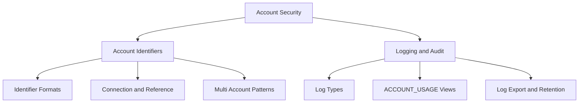
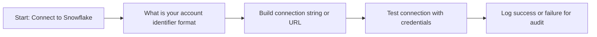
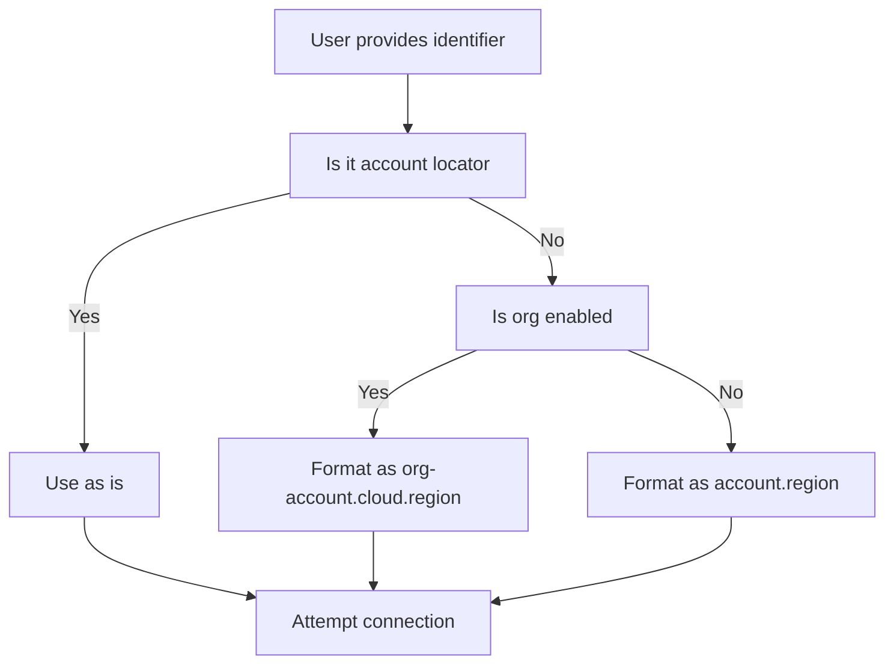
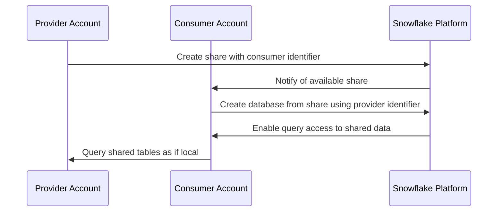
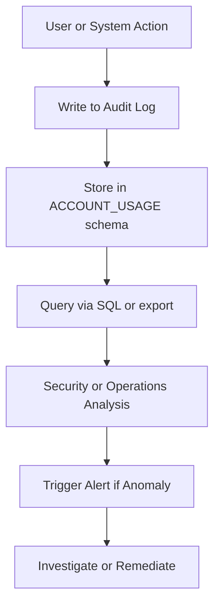
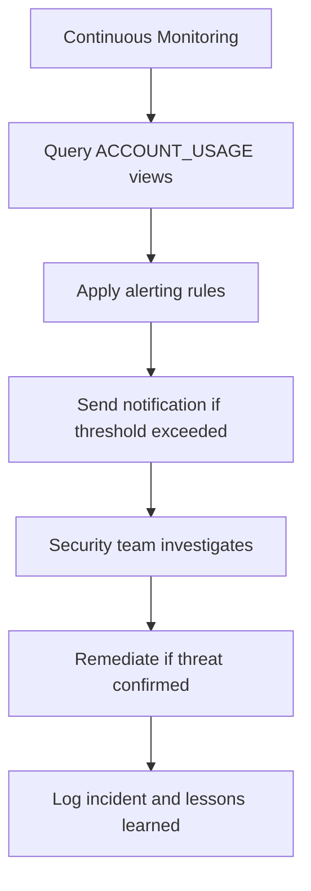
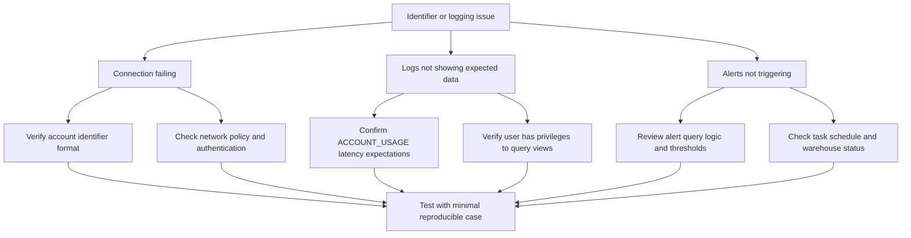
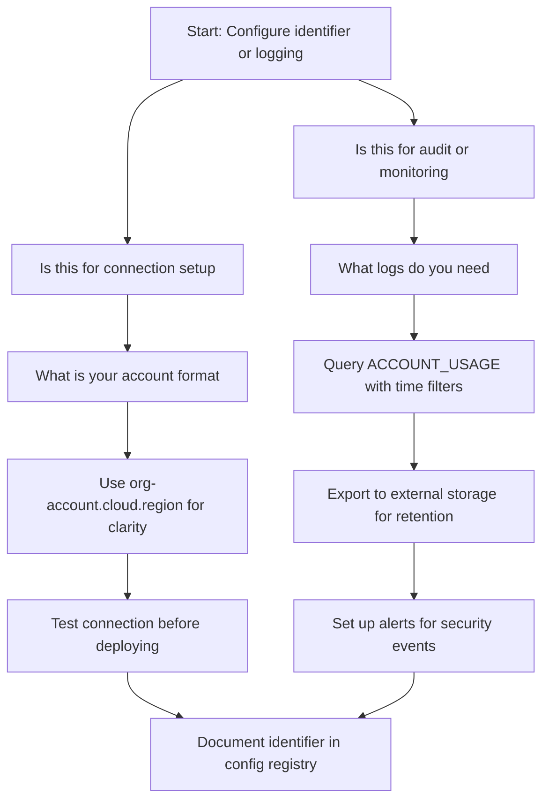

# Account Identifiers and Logging in Snowflake



## Account Identifiers Overview

| Term | Simple Explanation | Example |
|------|------------------|---------|
| Account identifier | Unique name that identifies your Snowflake account | myaccount, myaccount.us-east-1, myaccount.aws.us-east-1 |
| Account locator | Short internal ID assigned by Snowflake | xy12345.us-east-1 |
| Organization name | Name of your Snowflake organization | my-company-org |
| Region cloud prefix | Cloud and region where account lives | aws.us-east-1, azure.westus2, gcp.us-central1 |
| Connection string | Full URL or identifier used to connect | myaccount.snowflakecomputing.com |

- Account identifiers are how you tell Snowflake which account to connect to
- They appear in connection strings, URLs, API calls, and cross account references
- The format you use depends on your Snowflake edition and deployment type
- Getting the identifier wrong means connection fails. Getting it right is step one



## Account Identifier Formats

### Legacy Format

| Format | Example | When Used |
|--------|---------|-----------|
| Account only | myaccount | Old accounts before region awareness |
| Account with region | myaccount.us-east-1 | Accounts created after region support |
| Full URL | myaccount.snowflakecomputing.com | Browser access and some connectors |

```sql
-- Connection examples with legacy format
-- SnowSQL
snowsql -a myaccount.us-east-1 -u username

-- Python connector
import snowflake.connector
conn = snowflake.connector.connect(
    account='myaccount.us-east-1',
    user='username',
    password='***'
)

-- JDBC URL
jdbc:snowflake://myaccount.us-east-1.snowflakecomputing.com/
```

### Organization Enabled Format

| Format | Example | When Used |
|--------|---------|-----------|
| Org account | myorg-myaccount | Accounts in Snowflake organization |
| Org with region | myorg-myaccount.aws.us-east-1 | Organization accounts with cloud prefix |
| Full org URL | myorg-myaccount.snowflakecomputing.com | Browser access for org accounts |

```sql
-- Connection examples with organization format
-- SnowSQL
snowsql -a myorg-myaccount.aws.us-east-1 -u username

-- Python connector
conn = snowflake.connector.connect(
    account='myorg-myaccount.aws.us-east-1',
    user='username',
    password='***'
)
```

### Identifier Resolution Rules

| Input Format | Snowflake Resolves To | Notes |
|-------------|----------------------|-------|
| myaccount | myaccount.us-east-1 or org format | Depends on account configuration |
| myaccount.us-east-1 | Full identifier with region | Legacy region aware format |
| myaccount.aws.us-east-1 | Full identifier with cloud and region | Organization enabled format |
| xy12345.us-east-1 | Account locator format | Internal ID assigned by Snowflake |
| myaccount.snowflakecomputing.com | URL format for browser | Not used in programmatic connectors |



## Finding Your Account Identifier

```sql
-- Query current account information
SELECT
  CURRENT_ACCOUNT() as account_locator,
  CURRENT_ORGANIZATION_NAME() as org_name,
  CURRENT_REGION() as region,
  CURRENT_CLOUD() as cloud_provider;

-- View account parameters
SHOW PARAMETERS LIKE 'account%' IN ACCOUNT;

-- Check security integrations for SSO/OAuth configuration
SELECT
  name,
  type,
  enabled,
  comment
FROM SNOWFLAKE.ACCOUNT_USAGE.SECURITY_INTEGRATIONS
WHERE deleted_on IS NULL;
```

| Method | Where To Find | What It Shows |
|--------|--------------|---------------|
| Snowsight UI | Bottom left corner of interface | Account name and region |
| CURRENT_ACCOUNT() | SQL query | Account locator like xy12345.us-east-1 |
| CURRENT_ORGANIZATION_NAME() | SQL query | Organization name if enabled |
| SHOW ACCOUNTS | Organization admin context | All accounts in organization with identifiers |
| Connection logs | Client or connector logs | Identifier used in successful or failed attempts |

## Using Identifiers in Cross Account Operations

### Secure Data Sharing

```sql
-- Provider account: Create share and grant to consumer by identifier
CREATE SHARE partner_share;

GRANT USAGE ON DATABASE analytics TO SHARE partner_share;
GRANT SELECT ON TABLE analytics.shared.sales TO SHARE partner_share;

-- Add consumer account using their account identifier
ALTER SHARE partner_share ADD ACCOUNTS = consumerorg-consumer.aws.us-east-1;

-- Consumer account: Create database from share using provider identifier
CREATE DATABASE partner_sales FROM SHARE providerorg-provider.aws.us-east-1.partner_share;
```

### Replication and Failover

```sql
-- Primary account: Enable replication to secondary account identifier
ALTER ACCOUNT SET REPLICATION_ACCOUNTS = 'secondaryorg-secondary.aws.us-west-2';

-- Create replication group
CREATE FAILOVER GROUP prod_failover
  OBJECT_TYPES = DATABASES, INTEGRATIONS
  ALLOWED_ACCOUNTS = secondaryorg-secondary.aws.us-west-2
  REPLICATION_SCHEDULE = '1 MINUTE';

-- Add databases to replication group
ALTER FAILOVER GROUP prod_failover ADD DATABASES analytics, finance;
```

| Operation | Identifier Usage | Key Consideration |
|-----------|-----------------|-------------------|
| Secure sharing | Consumer account identifier in ADD ACCOUNTS | Must match exact format including org and cloud |
| Replication | Target account identifier in ALLOWED_ACCOUNTS | Both accounts must be in same organization or have org link |
| Reader accounts | Provider references reader account locator | Reader accounts have simplified identifiers |
| Marketplace | Provider lists account for data exchange | Marketplace handles identifier resolution |



## Logging in Snowflake Overview

| Log Type | What It Tracks | Retention | Primary Use Case |
|----------|---------------|-----------|-----------------|
| LOGIN_HISTORY | Authentication attempts success failure MFA | 365 days | Security monitoring access audits |
| QUERY_HISTORY | All executed queries with details | 365 days | Performance tuning cost attribution debugging |
| ACCESS_HISTORY | Object level access by users and roles | 365 days | Data governance compliance audits |
| SESSIONS | User session start end and activity | 365 days | Session management usage patterns |
| GRANTS_TO_USERS | Role assignments to users | Until revoked | Access control audits role reviews |
| GRANTS_TO_ROLES | Privilege grants to roles | Until revoked | Permission audits security reviews |
| NETWORK_POLICY_EVENTS | Network policy allow deny decisions | 365 days | Perimeter security monitoring |



## Key ACCOUNT_USAGE Views for Auditing

### LOGIN_HISTORY

```sql
-- Find failed login attempts in last 24 hours
SELECT
  EVENT_TIMESTAMP,
  USER_NAME,
  CLIENT_IP,
  ERROR_MESSAGE,
  AUTHENTICATION_METHOD,
  FIRST_AUTHENTICATION_FACTOR,
  SECOND_AUTHENTICATION_FACTOR
FROM SNOWFLAKE.ACCOUNT_USAGE.LOGIN_HISTORY
WHERE SUCCESS = 'NO'
  AND EVENT_TIMESTAMP > DATEADD(hour, -24, CURRENT_TIMESTAMP)
ORDER BY EVENT_TIMESTAMP DESC;

-- Track MFA enrollment and usage
SELECT
  name as user_name,
  mfa_enrollment,
  last_success_login,
  disabled
FROM SNOWFLAKE.ACCOUNT_USAGE.USERS
WHERE mfa_enrollment IS NOT NULL;
```

| Column | What It Shows | Why It Matters |
|--------|--------------|----------------|
| EVENT_TIMESTAMP | When the login attempt occurred | Correlate with other security events |
| USER_NAME | Which user attempted login | Identify targeted accounts |
| CLIENT_IP | Source IP of connection attempt | Detect unusual locations or brute force |
| ERROR_MESSAGE | Why login failed if unsuccessful | Diagnose auth issues or attack patterns |
| AUTHENTICATION_METHOD | Password key pair OAuth SSO | Verify expected auth methods are used |
| FIRST_AUTHENTICATION_FACTOR | Primary factor like password | Confirm MFA is being enforced |
| SECOND_AUTHENTICATION_FACTOR | Secondary factor like Duo | Verify MFA completion |

### QUERY_HISTORY

```sql
-- Find expensive queries that scanned over 100 GB
SELECT
  QUERY_ID,
  USER_NAME,
  WAREHOUSE_NAME,
  BYTES_SCANNED,
  CREDITS_USED_CLOUD_SERVICES,
  QUERY_TEXT,
  START_TIME,
  END_TIME
FROM SNOWFLAKE.ACCOUNT_USAGE.QUERY_HISTORY
WHERE BYTES_SCANNED > 100000000000
  AND START_TIME > DATEADD(day, -7, CURRENT_TIMESTAMP)
ORDER BY BYTES_SCANNED DESC;

-- Track queries by tagged project for cost attribution
SELECT
  QUERY_TAG,
  COUNT(*) as query_count,
  SUM(BYTES_SCANNED) as total_bytes,
  SUM(CREDITS_USED) as total_credits
FROM SNOWFLAKE.ACCOUNT_USAGE.QUERY_HISTORY
WHERE START_TIME > DATEADD(day, -30, CURRENT_TIMESTAMP)
GROUP BY QUERY_TAG
ORDER BY total_credits DESC;
```

| Column | What It Shows | Why It Matters |
|--------|--------------|----------------|
| QUERY_ID | Unique identifier for the query | Reference for support or debugging |
| USER_NAME | Who ran the query | Attribute cost and access to user |
| WAREHOUSE_NAME | Which compute resource was used | Track warehouse utilization and cost |
| BYTES_SCANNED | How much data was read | Identify inefficient queries for optimization |
| CREDITS_USED | Compute cost of the query | Attribute spend to team or project |
| QUERY_TEXT | The actual SQL executed | Audit for sensitive data access or injection |
| QUERY_TAG | Custom tag set by user or role | Enable cost attribution and filtering |

### ACCESS_HISTORY

```sql
-- Track who accessed sensitive tagged tables
SELECT
  a.USER_NAME,
  a.OBJECT_NAME,
  a.OBJECT_DOMAIN,
  a.QUERIES,
  a.SOURCES,
  t.TAG_VALUE as sensitivity_level
FROM SNOWFLAKE.ACCOUNT_USAGE.ACCESS_HISTORY a
JOIN SNOWFLAKE.ACCOUNT_USAGE.TAG_REFERENCES t
  ON a.OBJECT_NAME = t.OBJECT_NAME
WHERE t.TAG_NAME = 'sensitivity'
  AND t.TAG_VALUE = 'restricted'
  AND a.EVENT_TIMESTAMP > DATEADD(day, -7, CURRENT_TIMESTAMP);

-- Find unused grants by checking access patterns
SELECT
  g.GRANTEE_NAME,
  g.PRIVILEGE,
  g.NAME as object_name,
  MAX(a.EVENT_TIMESTAMP) as last_access
FROM SNOWFLAKE.ACCOUNT_USAGE.GRANTS_TO_ROLES g
LEFT JOIN SNOWFLAKE.ACCOUNT_USAGE.ACCESS_HISTORY a
  ON g.NAME = a.OBJECT_NAME
WHERE g.DELETED_ON IS NULL
GROUP BY g.GRANTEE_NAME, g.PRIVILEGE, g.NAME
HAVING MAX(a.EVENT_TIMESTAMP) IS NULL
   OR MAX(a.EVENT_TIMESTAMP) < DATEADD(day, -90, CURRENT_TIMESTAMP);
```

| Column | What It Shows | Why It Matters |
|--------|--------------|----------------|
| USER_NAME | Who accessed the object | Attribute access for compliance |
| OBJECT_NAME | Which table view or column was accessed | Track sensitive data exposure |
| OBJECT_DOMAIN | Type of object like TABLE VIEW COLUMN | Filter by object type in audits |
| QUERIES | List of query IDs that accessed the object | Drill into specific query details |
| SOURCES | Downstream objects that received data | Track data lineage and propagation |
| EVENT_TIMESTAMP | When access occurred | Correlate with other security events |

## Log Export and Retention Management

### Exporting Logs to External Storage

```sql
-- Create external stage for log export
CREATE OR REPLACE EXTERNAL STAGE audit_logs
  URL = 's3://my-audit-bucket/snowflake-logs/'
  CREDENTIALS = (AWS_KEY_ID = '***' AWS_SECRET_KEY = '***')
  FILE_FORMAT = (TYPE = PARQUET COMPRESSION = SNAPPY);

-- Export LOGIN_HISTORY daily
COPY INTO @audit_logs/login_history/
FROM SNOWFLAKE.ACCOUNT_USAGE.LOGIN_HISTORY
FILE_FORMAT = (TYPE = PARQUET)
MAX_FILE_SIZE = 1073741824;  -- 1 GB per file

-- Export QUERY_HISTORY with filtering for cost control
COPY INTO @audit_logs/query_history/
FROM SNOWFLAKE.ACCOUNT_USAGE.QUERY_HISTORY
WHERE START_TIME BETWEEN DATEADD(day, -1, CURRENT_TIMESTAMP) AND CURRENT_TIMESTAMP
FILE_FORMAT = (TYPE = PARQUET);
```

| Export Pattern | When To Use | Key Consideration |
|---------------|-------------|-------------------|
| Daily full export | Compliance requires complete audit trail | Ensure bucket has lifecycle policy for retention |
| Filtered export | Reduce storage cost by exporting only relevant logs | Test filters to avoid missing critical events |
| Real time streaming | Security monitoring needs immediate visibility | Use Snowpipe or external streaming integration |
| Encrypted export | Regulatory requirements for data at rest | Enable server side encryption on target bucket |

### Retention and Cleanup

```sql
-- ACCOUNT_USAGE views retain data for 365 days by default
-- Query retention status
SELECT
  'LOGIN_HISTORY' as view_name,
  365 as retention_days
UNION ALL
SELECT 'QUERY_HISTORY', 365
UNION ALL
SELECT 'ACCESS_HISTORY', 365;

-- For longer retention export to external storage then query from there
-- Create external table for long term audit access
CREATE EXTERNAL TABLE audit.login_history_longterm (
  event_timestamp TIMESTAMP_LTZ,
  user_name VARCHAR,
  client_ip VARCHAR,
  success VARCHAR,
  error_message VARCHAR
)
LOCATION = @audit_logs/login_history/
FILE_FORMAT = (TYPE = PARQUET)
AUTO_REFRESH = TRUE;
```

| Retention Strategy | Implementation | Benefit |
|-------------------|---------------|---------|
| Default 365 days | No action required ACCOUNT_USAGE handles it | Simple meets most compliance needs |
| Extended via export | Copy to external storage with longer lifecycle | Meet regulatory requirements beyond 1 year |
| Tiered storage | Hot recent logs in Snowflake cold in S3 Glacier | Balance query performance with cost |
| Automated cleanup | TASK to delete old exports from external stage | Control storage costs in external systems |

## Monitoring and Alerting on Account Activity

### Setting Up Alerts for Security Events

```sql
-- Create task to check for brute force attempts
CREATE OR REPLACE TASK alert_brute_force
  WAREHOUSE = admin_wh
  SCHEDULE = 'USING CRON */15 * * * *'  -- Every 15 minutes
AS
  SELECT
    USER_NAME,
    CLIENT_IP,
    COUNT(*) as failed_attempts
  FROM SNOWFLAKE.ACCOUNT_USAGE.LOGIN_HISTORY
  WHERE SUCCESS = 'NO'
    AND EVENT_TIMESTAMP > DATEADD(minute, -15, CURRENT_TIMESTAMP)
  GROUP BY USER_NAME, CLIENT_IP
  HAVING COUNT(*) >= 5;  -- Alert if 5+ failures in 15 minutes

-- Create task to alert on unusual query patterns
CREATE OR REPLACE TASK alert_expensive_queries
  WAREHOUSE = admin_wh
  SCHEDULE = 'USING CRON 0 */6 * * *'  -- Every 6 hours
AS
  SELECT
    USER_NAME,
    QUERY_ID,
    BYTES_SCANNED,
    CREDITS_USED
  FROM SNOWFLAKE.ACCOUNT_USAGE.QUERY_HISTORY
  WHERE BYTES_SCANNED > 500000000000  -- 500 GB
    AND START_TIME > DATEADD(hour, -6, CURRENT_TIMESTAMP);
```

### Key Metrics to Track

| Metric | Source View | Alert Threshold | Response Action |
|--------|------------|-----------------|----------------|
| Failed logins per user | LOGIN_HISTORY | 5+ failures in 15 minutes | Lock account investigate source IP |
| Logins from new country | LOGIN_HISTORY CLIENT_IP | First login from unexpected geo | Verify with user check for compromise |
| Queries scanning 100 GB+ | QUERY_HISTORY | Any query over threshold | Review query logic optimize or restrict |
| Access to restricted tables | ACCESS_HISTORY TAG_REFERENCES | Any access by non authorized role | Revoke access audit for data exposure |
| Grants to PUBLIC role | GRANTS_TO_ROLES | Any new grant to PUBLIC | Revoke immediately review change process |
| Network policy denials | NETWORK_POLICY_EVENTS | Spike in denied attempts | Investigate potential attack or misconfig |



## Common Identifier and Logging Pitfalls

| Pitfall | What Happens | How To Fix |
|---------|--------------|------------|
| Using wrong identifier format | Connection fails with account not found error | Verify identifier format matches your account configuration |
| Not including org prefix in cross account ops | Share or replication setup fails | Use full org-account.cloud.region format for external references |
| Assuming ACCOUNT_USAGE is real time | Queries show data with 45 minute delay | Account for latency in monitoring and alerting logic |
| Exporting logs without encryption | Audit data exposed if bucket is compromised | Enable server side encryption on external storage |
| Not testing alert thresholds | Too many false positives or missed events | Start with conservative thresholds tune based on baseline |
| Forgetting log retention limits | Historical data disappears after 365 days | Export to external storage for longer retention requirements |
| Querying ACCOUNT_USAGE without filtering | Queries scan large tables and cost credits | Always filter by time range and relevant columns |



## Best Practices for Account Identifiers

- Document your identifier format. Add to onboarding docs so new team members connect correctly
- Use organization enabled format when available. It is more explicit and less ambiguous
- Store identifiers in configuration not code. Use environment variables or secrets management
- Test cross account operations with exact identifiers. Do not assume format resolution
- Monitor connection failures by identifier. Detect misconfigurations before they impact users
- Keep a registry of account identifiers. Track which accounts exist and their purposes

## Best Practices for Logging and Auditing

- Query ACCOUNT_USAGE with time filters. Always limit to relevant time window to control cost
- Export logs for long term retention. 365 days may not meet all compliance requirements
- Tag queries for attribution. Set QUERY_TAG to enable cost and usage tracking by project
- Automate alerting for security events. Do not rely on manual log review for threat detection
- Review access patterns quarterly. Catch permission drift before it becomes a security incident
- Document your monitoring strategy. Future you needs to know what is tracked and why

```sql
-- Example: Well documented monitoring query
-- Purpose: Alert on failed logins indicating potential brute force
-- Owner: security_team
-- Review: Monthly to adjust thresholds
-- Alert: Send to security on call Slack channel

SELECT
  USER_NAME,
  CLIENT_IP,
  COUNT(*) as failed_attempts,
  MIN(EVENT_TIMESTAMP) as first_attempt,
  MAX(EVENT_TIMESTAMP) as last_attempt
FROM SNOWFLAKE.ACCOUNT_USAGE.LOGIN_HISTORY
WHERE SUCCESS = 'NO'
  AND EVENT_TIMESTAMP > DATEADD(minute, -15, CURRENT_TIMESTAMP)
GROUP BY USER_NAME, CLIENT_IP
HAVING COUNT(*) >= 5;  -- Threshold: 5 failures in 15 minutes
```

## Decision Framework



| Question | If Yes | If No |
|----------|--------|-------|
| Is this for cross account operations | Use full org-account.cloud.region format | Standard account.region may suffice |
| Do you need logs beyond 365 days | Export to external storage with lifecycle policy | ACCOUNT_USAGE default retention is sufficient |
| Is this for security monitoring | Set up automated alerts with conservative thresholds | Manual review may be sufficient for non critical |
| Are you attributing cost by project | Set QUERY_TAG at role or session level | Default attribution by user may be enough |

## Key Principles to Remember

- Account identifiers are not optional. You must use the correct format to connect or reference accounts
- Identifier format depends on your Snowflake setup. Check your configuration before assuming
- ACCOUNT_USAGE views have 45 minute latency. Do not expect real time data for monitoring
- Logs cost credits to query. Always filter by time and relevant columns to control spend
- Export for long term retention. 365 days may not meet your compliance requirements
- Alert on anomalies not everything. Tune thresholds to reduce false positives
- Document your choices. Future you needs to know why an identifier format or log strategy was selected

## Bottom Line

- Account identifiers are how Snowflake knows which account you mean. Get the format right or connections fail
- Logging in Snowflake is comprehensive but not free. Query ACCOUNT_USAGE wisely to control cost
- Use identifiers consistently across connections shares and replication. Ambiguity causes errors
- Export logs for compliance. Default retention may not meet your regulatory requirements
- Monitor for security events. Automated alerts catch threats faster than manual review
- Document everything. Identifiers and logging strategies should be clear to your future self and teammates

Think of account identifiers like addresses:
- A short name like myaccount works if everyone knows the neighborhood
- A full address like myorg-myaccount.aws.us-east-1 works everywhere no confusion
- Using the wrong format is like mailing a letter with an incomplete address. It does not arrive
- Logging is like a security camera. It records what happened so you can review later
- Exporting logs is like backing up camera footage. If the camera breaks you still have the record

Use the right address for the right purpose. Record what matters. Keep the records safe. And always know who tried to enter and when. That is how identifiers and logging work in Snowflake.
