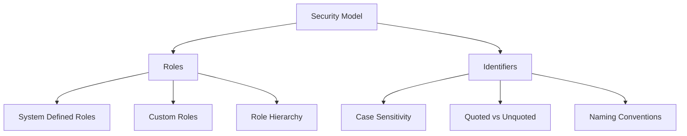
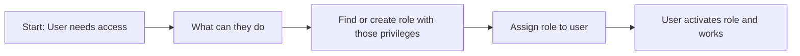
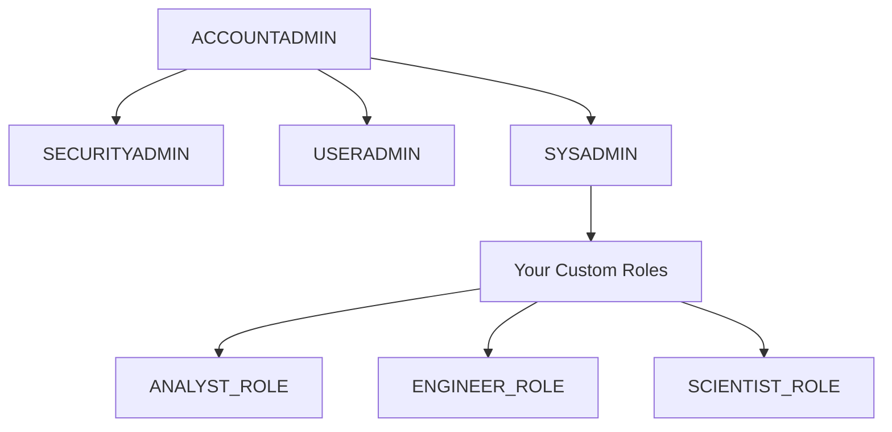
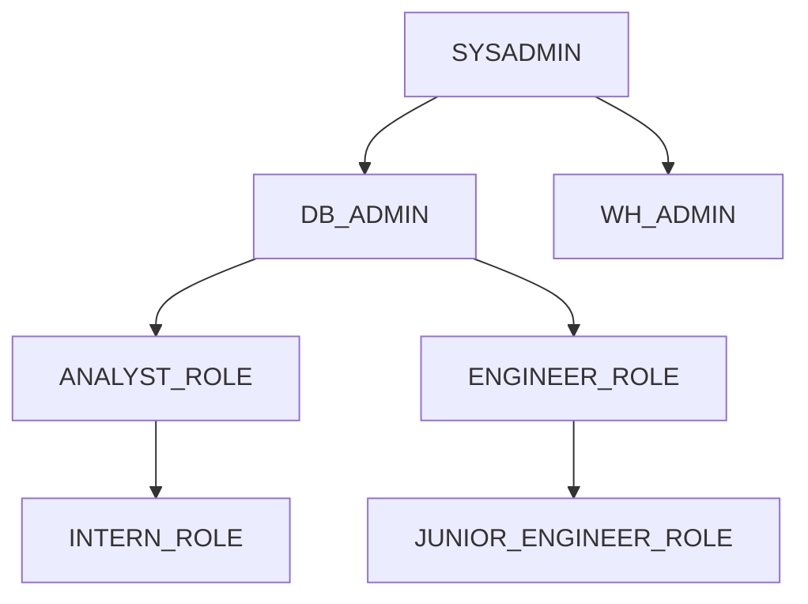
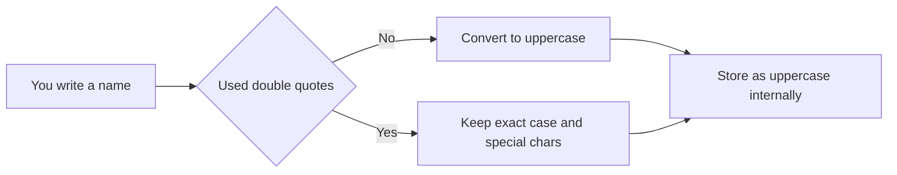
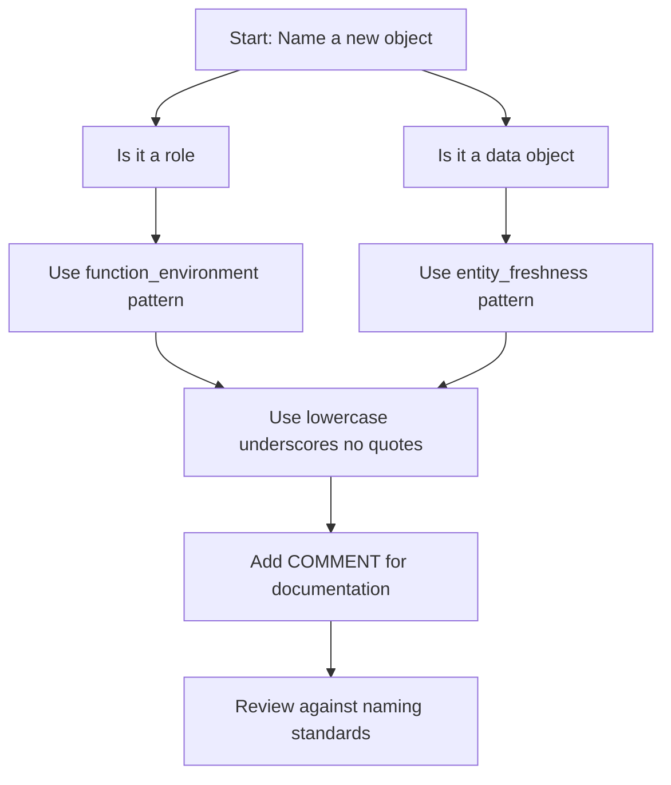
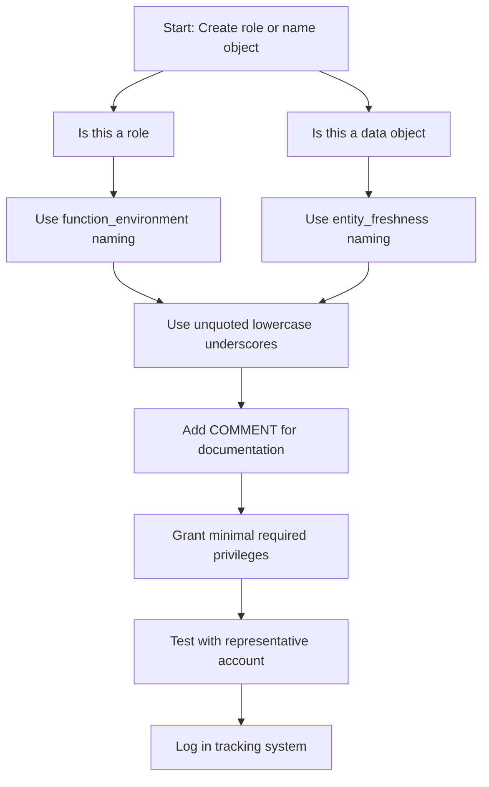
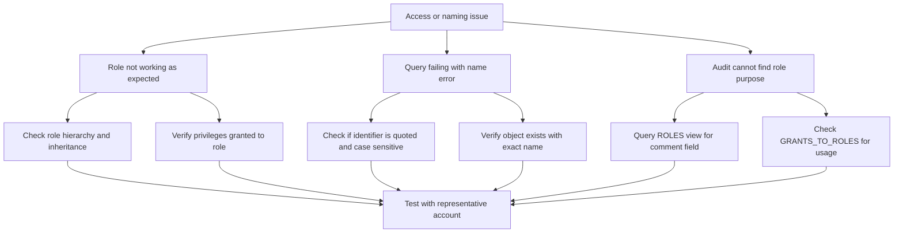

# Roles and Identifiers in Snowflake



## Roles Overview

| Concept | Simple Explanation |
|---------|------------------|
| Role | A collection of privileges that can be granted to users or other roles |
| System role | Pre built role created by Snowflake with specific purpose |
| Custom role | Role you create to match your organization structure |
| Role hierarchy | Parent child relationship where child inherits parent privileges |
| Active role | The role a user is currently using for a session |



## System Defined Roles

| Role | Purpose | Key Privileges | Who Should Have It |
|------|---------|---------------|-------------------|
| ACCOUNTADMIN | Full account access including billing | All privileges including ORGADMIN | Very limited senior admins only |
| SYSADMIN | Create and manage databases schemas objects | CREATE DATABASE CREATE SCHEMA CREATE TABLE | Platform engineers data platform team |
| SECURITYADMIN | Manage users roles grants | CREATE ROLE GRANT ROLE CREATE USER | Security team identity administrators |
| USERADMIN | Manage user accounts and passwords | CREATE USER ALTER USER RESET PASSWORD | HR IT helpdesk user provisioning team |
| PUBLIC | Default role for all users | USAGE on public schema of each database | All users automatically but grant minimal additional privileges |



| Common Mistake | What Happens | How To Fix |
|---------------|--------------|------------|
| Giving users ACCOUNTADMIN for daily work | Too much power increases risk of accidental damage | Create limited operational roles for day to day tasks |
| Leaving PUBLIC role with broad access | All users including future users get unintended access | Revoke unnecessary grants from PUBLIC immediately |
| Using SYSADMIN for everything | Too many users can create objects anywhere | Create functional roles with narrow scope |
| Not documenting system role usage | Audit cannot determine who has what access | Add comments to role assignments and review quarterly |

## Custom Role Design Patterns

### Functional Roles Pattern

```sql
-- Create role for business analysts
CREATE ROLE ANALYST_ROLE
  COMMENT = 'Read access to reporting schema for business analysts';

-- Grant minimal required privileges
GRANT USAGE ON DATABASE analytics TO ROLE ANALYST_ROLE;
GRANT USAGE ON SCHEMA analytics.reporting TO ROLE ANALYST_ROLE;
GRANT SELECT ON ALL TABLES IN SCHEMA analytics.reporting TO ROLE ANALYST_ROLE;
GRANT SELECT ON FUTURE TABLES IN SCHEMA analytics.reporting TO ROLE ANALYST_ROLE;

-- Assign role to users
GRANT ROLE ANALYST_ROLE TO USER analyst_jane;
GRANT ROLE ANALYST_ROLE TO USER analyst_bob;
```

| Role Name Pattern | Purpose | Example Grants |
|------------------|---------|---------------|
| ANALYST_ROLE | Read only access to reporting data | SELECT on tables and views |
| ENGINEER_ROLE | Read write access for data pipelines | SELECT INSERT UPDATE on staging tables |
| SCIENTIST_ROLE | Access for ML and exploration | SELECT on features EXECUTE on functions |
| ADMIN_ROLE | Operational tasks for a domain | USAGE MONITOR on warehouses and schemas |

### Environment Roles Pattern

```sql
-- Create environment specific roles
CREATE ROLE DEV_ROLE;
CREATE ROLE TEST_ROLE;
CREATE ROLE PROD_ROLE;

-- Grant access to respective environments
GRANT USAGE ON DATABASE analytics_dev TO ROLE DEV_ROLE;
GRANT USAGE ON DATABASE analytics_test TO ROLE TEST_ROLE;
GRANT USAGE ON DATABASE analytics_prod TO ROLE PROD_ROLE;

-- Prevent cross environment access
-- Do not grant PROD_ROLE to users who only need DEV_ROLE
```

| Environment | Role Pattern | Key Restriction |
|------------|-------------|----------------|
| Development | DEV_ROLE | Cannot access test or prod databases |
| Testing | TEST_ROLE | Can access dev for reference but not prod |
| Production | PROD_ROLE | Requires additional approval and MFA |
| Disaster Recovery | DR_ROLE | Read only access to prod replicas |

### Project Based Roles Pattern

```sql
-- Create role for specific project
CREATE ROLE PROJECT_ALPHA_ROLE
  COMMENT = 'Access for Project Alpha team expires 2024-12-31';

-- Grant time bound access
GRANT USAGE ON DATABASE project_alpha TO ROLE PROJECT_ALPHA_ROLE;
GRANT SELECT ON ALL TABLES IN SCHEMA project_alpha.raw TO ROLE PROJECT_ALPHA_ROLE;

-- Assign to project team members
GRANT ROLE PROJECT_ALPHA_ROLE TO USER alice;
GRANT ROLE PROJECT_ALPHA_ROLE TO USER bob;

-- Schedule review or automatic revocation
-- Use TASK or external scheduler to revoke after project end
```

| Use Case | Role Design | Governance Control |
|----------|------------|-------------------|
| Short term initiative | PROJECT_NAME_ROLE with expiration comment | Quarterly review or automatic revocation |
| External collaboration | PARTNER_NAME_ROLE with limited scope | Secure views and row access policies |
| Cross functional team | CROSS_FUNC_NAME_ROLE with union of privileges | Document which privileges come from which domain |

## Role Hierarchy and Inheritance



| Inheritance Rule | What Happens | Example |
|-----------------|--------------|---------|
| Role to role | Child role gets all privileges of parent | GRANT ROLE ANALYST_ROLE TO ROLE SENIOR_ANALYST_ROLE |
| Role to user | User gets all privileges of assigned role | GRANT ROLE ANALYST_ROLE TO USER analyst_jane |
| Multiple roles | User gets union of all assigned role privileges | User with ANALYST_ROLE and ENGINEER_ROLE gets both sets |
| Schema to object | Grants on schema do not auto apply to objects | Must grant on table separately or use future grants |
| Database to schema | USAGE on database does not grant USAGE on schemas | Must grant USAGE on each schema explicitly |

```sql
-- Example: Building a role hierarchy
CREATE ROLE DATA_USER_ROLE
  COMMENT = 'Base role for all data consumers';

GRANT USAGE ON DATABASE analytics TO ROLE DATA_USER_ROLE;
GRANT USAGE ON SCHEMA analytics.reporting TO ROLE DATA_USER_ROLE;
GRANT SELECT ON ALL TABLES IN SCHEMA analytics.reporting TO ROLE DATA_USER_ROLE;

CREATE ROLE SENIOR_ANALYST_ROLE
  COMMENT = 'Senior analysts with additional write access';

-- Inherit base privileges
GRANT ROLE DATA_USER_ROLE TO ROLE SENIOR_ANALYST_ROLE;

-- Add additional privileges
GRANT INSERT ON TABLE analytics.reporting.metrics TO ROLE SENIOR_ANALYST_ROLE;

-- Assign to users
GRANT ROLE SENIOR_ANALYST_ROLE TO USER senior_analyst_bob;
```

| Design Decision | Impact | Recommendation |
|----------------|--------|---------------|
| Deep hierarchy | Easier to manage but harder to audit | Limit to 3 levels maximum |
| Wide hierarchy | More roles but clearer separation | Use functional naming to avoid confusion |
| Cross inheritance | Role gets privileges from multiple parents | Document clearly and test with real accounts |
| Circular references | Role A grants to B and B grants to A | Avoid completely causes unpredictable behavior |

## Identifiers in Snowflake

### What Is an Identifier

| Term | Simple Explanation | Example |
|------|------------------|---------|
| Identifier | Name of any object in Snowflake | Table name column name role name database name |
| Unquoted identifier | Written without double quotes | my_table MY_TABLE my_Table all become MY_TABLE |
| Quoted identifier | Written with double quotes | "My Table" keeps exact case and spaces |
| Case sensitivity | Whether Snowflake treats ABC and abc as same | Unquoted are uppercase and case insensitive. Quoted preserve case and are case sensitive |



### Unquoted vs Quoted Identifiers

| Aspect | Unquoted Identifier | Quoted Identifier |
|--------|-------------------|----------------|
| Syntax | my_table | "My Table" |
| Case handling | Converted to uppercase | Preserved exactly as written |
| Case sensitivity | Case insensitive | Case sensitive |
| Special characters | Only underscores allowed | Spaces dashes dots allowed |
| Reserved words | Cannot use without quotes | Can use with quotes |
| Recommended use | Most objects and names | When you need exact case or special chars |

```sql
-- Unquoted identifiers: all become uppercase internally
CREATE TABLE sales_data (id NUMBER, amount FLOAT);
-- Internally stored as SALES_DATA with columns ID and AMOUNT

-- These all refer to the same table
SELECT * FROM sales_data;
SELECT * FROM SALES_DATA;
SELECT * FROM Sales_Data;

-- Quoted identifiers: preserve exact case
CREATE TABLE "Sales Data" ("Order ID" NUMBER, "Total Amount" FLOAT);
-- Must always use exact case and quotes to reference

-- These work
SELECT * FROM "Sales Data";
SELECT "Order ID" FROM "Sales Data";

-- These fail
SELECT * FROM Sales Data;  -- Error: syntax issue
SELECT * FROM "sales data";  -- Error: case mismatch
SELECT "Order ID" FROM Sales_Data;  -- Error: wrong table name
```

### Reserved Words and Identifiers

| Reserved Word | Using Unquoted | Using Quoted |
|--------------|---------------|--------------|
| USER | Cannot use as table name | CREATE TABLE "USER" works |
| ORDER | Cannot use as column name | CREATE TABLE t ("ORDER" INT) works |
| GROUP | Cannot use as schema name | CREATE SCHEMA "GROUP" works |
| SELECT | Cannot use as role name | CREATE ROLE "SELECT" works |

```sql
-- This fails: USER is a reserved word
CREATE TABLE user (id NUMBER);  -- Error

-- This works: quotes allow reserved words
CREATE TABLE "user" (id NUMBER);

-- Better approach: avoid reserved words entirely
CREATE TABLE app_user (id NUMBER);  -- Clear and safe
```

## Naming Conventions Best Practices

### Role Naming

| Pattern | Example | Why It Works |
|---------|---------|-------------|
| Function first | ANALYST_READ ENGINEER_WRITE | Clear what the role does at a glance |
| Environment suffix | _DEV _TEST _PROD | Prevents accidental cross environment access |
| Team prefix | FINANCE_ANALYST MARKETING_ENGINEER | Shows ownership without reading docs |
| No size in name | Do not use MEDIUM_ROLE | Sizes change names should not |
| Lowercase with underscores | analyst_read_only | Consistent easy to script and search |

```sql
-- Good role naming examples
CREATE ROLE finance_analyst_read;
CREATE ROLE engineering_etl_write;
CREATE ROLE marketing_dashboard_prod;

-- Avoid these patterns
CREATE ROLE Role123;  -- Unclear purpose
CREATE ROLE "Analyst Role";  -- Quoted with space hard to script
CREATE ROLE ANALYST_MEDIUM;  -- Size in name confusing when resized
```

### Object Naming

| Object Type | Naming Pattern | Example |
|------------|---------------|---------|
| Database | Business domain | analytics finance marketing |
| Schema | Data stage or function | raw cleaned reporting ml_features |
| Table | Entity plus freshness | customers_daily orders_hourly events_raw |
| View | Purpose plus output | active_customers monthly_revenue churn_risk |
| Column | Clear descriptive name | customer_id order_total created_at |

```sql
-- Good object naming
CREATE DATABASE analytics;
CREATE SCHEMA analytics.reporting;
CREATE TABLE analytics.reporting.customer_lifetime_value (
  customer_id NUMBER,
  region STRING,
  total_spend FLOAT,
  last_order_date DATE
);

-- Avoid these patterns
CREATE TABLE t1 (c1 NUMBER, c2 STRING);  -- Unclear what data this holds
CREATE TABLE "My Table" ("Col 1" NUMBER);  -- Quoted names hard to query
```

### Identifier Consistency Rules

| Rule | Implementation | Benefit |
|------|---------------|---------|
| Use unquoted when possible | Avoid quotes unless required | Easier to write query and script |
| Stick to lowercase with underscores | my_table not MyTable or MYTABLE | Consistent across tools and teams |
| Avoid reserved words | Use app_user not user | Prevents syntax errors and confusion |
| No spaces or special chars | customer_id not customer-id or customer id | Works everywhere without quoting |
| Document naming standards | Add to team wiki or style guide | New members learn patterns quickly |



## Managing Roles and Identifiers Together

### Role Assignment and Identifier Usage

```sql
-- Create role with clear naming
CREATE ROLE sales_analyst_prod
  COMMENT = 'Read access to production sales reporting data';

-- Grant using unquoted identifiers (converted to uppercase)
GRANT USAGE ON DATABASE analytics TO ROLE sales_analyst_prod;
GRANT USAGE ON SCHEMA analytics.reporting TO ROLE sales_analyst_prod;
GRANT SELECT ON ALL TABLES IN SCHEMA analytics.reporting TO ROLE sales_analyst_prod;

-- Assign to user
GRANT ROLE sales_analyst_prod TO USER jane_doe;

-- User activates role and queries with unquoted identifiers
USE ROLE sales_analyst_prod;
SELECT customer_id, total_spend FROM analytics.reporting.customer_summary;
```

### Common Identifier Pitfalls with Roles

| Mistake | What Happens | How To Fix |
|---------|--------------|------------|
| Creating role with quoted name | Must always use quotes to reference role | Use unquoted names for roles unless absolutely necessary |
| Mixing case in grants | GRANT SELECT ON TABLE MyTable fails if table is MY_TABLE | Use consistent uppercase or unquoted for all object references |
| Using reserved word as role name | CREATE ROLE USER fails | Choose non reserved names or use quotes consistently |
| Forgetting role is case sensitive when quoted | CREATE ROLE "Analyst" then GRANT ROLE analyst fails | Use unquoted or match exact case in all references |
| Not documenting identifier choices | Team cannot understand naming logic | Add COMMENT to roles and objects explaining naming |

```sql
-- Problem: quoted role name requires exact case everywhere
CREATE ROLE "Sales Analyst";  -- Quoted preserves case

-- This fails: case mismatch
GRANT ROLE "sales analyst" TO USER jane;  -- Error

-- This works: exact case match
GRANT ROLE "Sales Analyst" TO USER jane;

-- Better: use unquoted for simplicity
CREATE ROLE sales_analyst;  -- Becomes SALES_ANALYST internally

-- Now case does not matter in references
GRANT ROLE sales_analyst TO USER jane;
GRANT ROLE SALES_ANALYST TO USER jane;  -- Both work
```

## Querying Roles and Identifiers for Audits

```sql
-- List all roles with their comments and hierarchy
SELECT
  name as role_name,
  comment,
  owner,
  created_on,
  deleted_on
FROM SNOWFLAKE.ACCOUNT_USAGE.ROLES
WHERE deleted_on IS NULL
ORDER BY created_on DESC;

-- Find roles granted to a specific user
SELECT
  granted_role,
  granted_by,
  created_on
FROM SNOWFLAKE.ACCOUNT_USAGE.GRANTS_TO_USERS
WHERE grantee_name = 'JANE_DOE'
  AND deleted_on IS NULL;

-- Find all privileges granted to a role
SELECT
  privilege,
  granted_on,
  name as object_name,
  grantee_name
FROM SNOWFLAKE.ACCOUNT_USAGE.GRANTS_TO_ROLES
WHERE grantee_name = 'SALES_ANALYST'
  AND deleted_on IS NULL;

-- Check identifier case sensitivity issues
-- Query INFORMATION_SCHEMA to see actual stored names
SELECT
  table_schema,
  table_name,
  column_name
FROM INFORMATION_SCHEMA.COLUMNS
WHERE table_schema = 'REPORTING'
  AND table_name = 'CUSTOMER_SUMMARY';
```

| View | What It Shows | Key Use Case |
|------|--------------|--------------|
| ROLES | All roles with metadata | Audit role inventory and documentation |
| GRANTS_TO_USERS | Role assignments to users | Verify who has what roles |
| GRANTS_TO_ROLES | Privilege grants to roles | Review role permissions |
| TABLE_PRIVILEGES | Table level grants | Audit data access controls |
| IDENTIFIERS | Object names and case | Troubleshoot case sensitivity issues |

## Best Practices Summary

### For Roles

- Grant to roles not users. Roles are reusable. Users change. Roles persist.
- Use functional naming. ANALYST_READ is clearer than ROLE_12345.
- Limit hierarchy depth. Three levels maximum keeps audits manageable.
- Document with comments. Add COMMENT to every role explaining purpose.
- Review quarterly. Access drifts over time. Catch problems before incidents.

### For Identifiers

- Use unquoted when possible. Avoids case sensitivity headaches.
- Stick to lowercase with underscores. my_table is consistent and scriptable.
- Avoid reserved words. Use app_user not user to prevent syntax issues.
- No spaces or special characters. customer_id works everywhere.
- Document naming standards. New team members learn patterns quickly.

### For Both Together

- Test with real accounts. Assumptions about inheritance or case often fail.
- Version control your DDL. Store role and object creation in Git.
- Use consistent casing in scripts. Even if Snowflake converts to uppercase.
- Add comments to everything. Future you needs context for decisions.
- Monitor with ACCOUNT_USAGE views. Track role usage and identifier patterns.

```sql
-- Example: Well documented role and object creation
-- Purpose: Create sales analyst role and grant access to reporting schema
-- Owner: data_platform_team
-- Date: 2024-01-15
-- Review: Quarterly by security team

CREATE ROLE sales_analyst_prod
  COMMENT = 'Read access to production sales reporting. Owner: sales_ops. Review: quarterly';

GRANT USAGE ON DATABASE analytics TO ROLE sales_analyst_prod
  COMMENT = 'Database access for sales reporting';

GRANT USAGE ON SCHEMA analytics.reporting TO ROLE sales_analyst_prod
  COMMENT = 'Schema access for sales dashboards';

GRANT SELECT ON ALL TABLES IN SCHEMA analytics.reporting TO ROLE sales_analyst_prod
  COMMENT = 'Read access to existing reporting tables';

GRANT SELECT ON FUTURE TABLES IN SCHEMA analytics.reporting TO ROLE sales_analyst_prod
  COMMENT = 'Auto access to new tables created by pipelines';
```

## Decision Framework



| Question | If Yes | If No |
|----------|--------|-------|
| Is this a team or function | Create functional role | Consider direct grant with documentation |
| Will new objects be created | Add future grants | Grant on ALL existing objects |
| Does access cross environments | Create separate roles per environment | Single role may be sufficient |
| Is data sensitive | Apply masking or row policies | Standard grants may be sufficient |
| Is this for automation | Use service account with narrow role | Interactive user role pattern |

## Common Pitfalls and Fixes

| Pitfall | What Happens | How To Fix |
|---------|--------------|------------|
| Using quoted identifiers unnecessarily | Must match exact case everywhere | Switch to unquoted for simplicity |
| Creating roles without comments | Audit cannot determine role purpose | Add COMMENT to all role creation |
| Granting to PUBLIC role | All users get unintended access | Revoke sensitive grants from PUBLIC |
| Not testing role combinations | User with multiple roles gets unexpected access | Test with representative accounts |
| Mixing naming conventions | Team cannot predict object names | Document and enforce naming standards |
| Forgetting case sensitivity with quoted names | Queries fail due to case mismatch | Use unquoted or match exact case consistently |
| Not reviewing roles quarterly | Stale roles accumulate creating risk | Schedule automated review tasks |



## Key Principles to Remember

- Roles control what users can do. Identifiers control how you reference what they can do.
- Unquoted identifiers become uppercase and case insensitive. Quoted identifiers preserve case and are case sensitive.
- Grant to roles not users. Roles are reusable. Users change. Roles persist.
- Document everything. Comments and version control make audits and reviews possible.
- Test with real accounts. Assumptions about inheritance or case often fail in practice.
- Review quarterly. Roles accumulate. Naming drifts. Regular reviews catch problems early.
- Start simple. Add complexity only when your requirements force it.

## Bottom Line

- Roles are your access control building blocks. Design them before granting privileges.
- Identifiers are how you name and reference everything in Snowflake. Consistency prevents errors.
- Unquoted is simpler. Quoted gives control but requires exact case matching.
- Document roles and naming standards. Future you and your teammates need context.
- Test before you trust. Verify access and naming with real accounts not assumptions.
- Review regularly. Access and naming drift over time. Catch problems before they become incidents.

Think of roles and identifiers like organizing a workshop:
- Roles are your tool sets. Each set has specific tools for specific jobs.
- Identifiers are the labels on your tools. Clear labels help you find what you need.
- Unquoted labels are like simple tags. Easy to read and consistent.
- Quoted labels are like custom engraving. Precise but requires exact matching.
- Role hierarchy is like a master tool set. Contains all the tools of smaller sets plus more.

Label your tools clearly. Group tools by job. Keep your sets organized. And always check that the label matches the tool before you use it. That is how roles and identifiers work in Snowflake.
