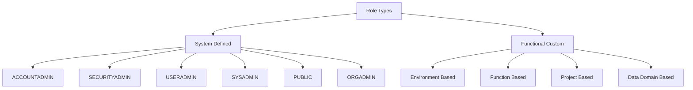
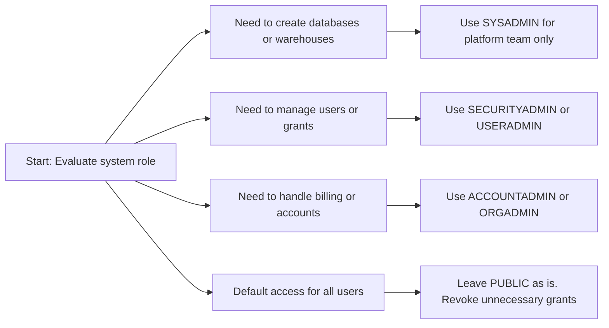
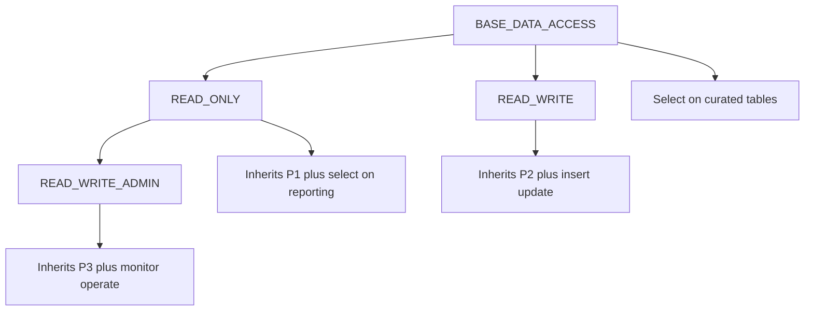
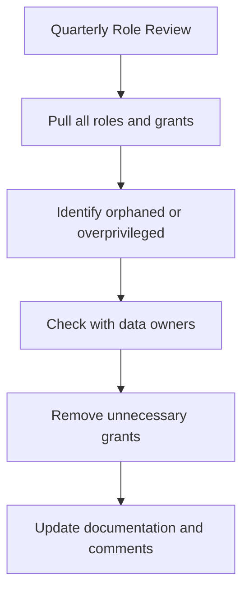
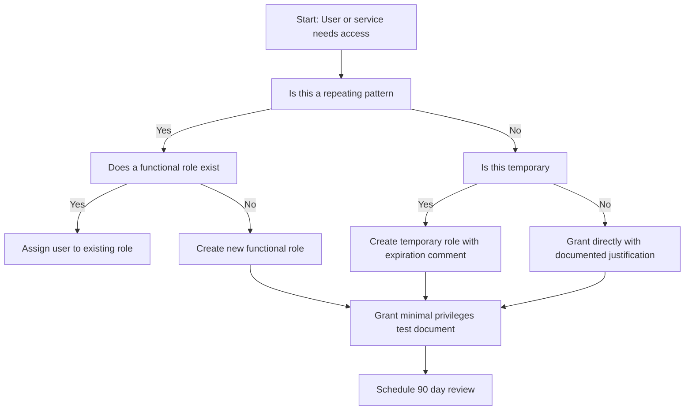

# System Defined and Functional Roles in Snowflake



## System Defined Roles

| Role | Purpose | Key Privileges | Who Should Have It | Common Misuse |
|------|---------|---------------|-------------------|---------------|
| ACCOUNTADMIN | Full account control including billing | All privileges ORGADMIN role management | 1 to 2 senior platform leads | Given to daily users or developers |
| SYSADMIN | Create and manage data and compute objects | CREATE DATABASE CREATE SCHEMA CREATE TABLE CREATE WAREHOUSE | Data engineers platform team | Used as default role for analysts |
| SECURITYADMIN | Manage users roles and grants | CREATE ROLE GRANT ROLE CREATE USER MANAGE GRANTS | Security team identity admins | Used for routine data access requests |
| USERADMIN | Manage user accounts and passwords | CREATE USER ALTER USER RESET PASSWORD ASSIGN ROLE | HR IT helpdesk provisioning team | Given to app service accounts |
| PUBLIC | Default role assigned to every user | USAGE on PUBLIC schema in each database | Every user automatically | Granted additional privileges by mistake |
| ORGADMIN | Manage organization level settings | CREATE ACCOUNT LIST ACCOUNTS manage org billing | Organization administrators only | Used for account level data tasks |

- System roles exist to separate duties. They are not meant for daily work
- PUBLIC role is the baseline. Every user gets it. Do not add sensitive grants to it
- ACCOUNTADMIN is the master key. Restrict it to break glass scenarios only
- SYSADMIN controls objects but not security. It is for builders not gatekeepers
- SECURITYADMIN controls access but not data. It is for auditors not developers



## Functional Role Design Patterns

| Pattern | Naming Convention | Scope | Example Grants |
|---------|------------------|-------|---------------|
| Function Based | team_function_level | Team wide | ANALYST_READ_ONLY ENGINEER_WRITE ADMIN_OPS |
| Environment Based | env_scope_action | Environment isolation | DEV_READ TEST_WRITE PROD_READ_ONLY |
| Project Based | project_name_access | Time bound work | PROJECT_ALPHA_ACCESS BETA_TEMP_READ |
| Data Domain Based | domain_data_access | Business unit | FINANCE_DATA MARKETING_REPORTING |

```sql
-- Function based role example
CREATE ROLE ANALYST_READ_ONLY
  COMMENT = 'Read access to reporting schemas for business analysts';

GRANT USAGE ON DATABASE analytics TO ROLE ANALYST_READ_ONLY;
GRANT USAGE ON SCHEMA analytics.reporting TO ROLE ANALYST_READ_ONLY;
GRANT SELECT ON ALL TABLES IN SCHEMA analytics.reporting TO ROLE ANALYST_READ_ONLY;
GRANT SELECT ON FUTURE TABLES IN SCHEMA analytics.reporting TO ROLE ANALYST_READ_ONLY;

-- Environment based role example
CREATE ROLE PROD_READ_ONLY
  COMMENT = 'Production read access for approved reporting tools';

GRANT USAGE ON DATABASE analytics_prod TO ROLE PROD_READ_ONLY;
GRANT USAGE ON SCHEMA analytics_prod.curated TO ROLE PROD_READ_ONLY;
GRANT SELECT ON ALL TABLES IN SCHEMA analytics_prod.curated TO ROLE PROD_READ_ONLY;
```

- Functional roles map to how your team actually works. They do not map to Snowflake defaults
- Name roles by what they allow not by who uses them. ANONYMOUS_USER_123 tells you nothing. REPORTING_READ_ONLY tells you everything
- Keep roles narrow. One role should do one job well. Do not combine read write and admin in one role
- Document the purpose in the COMMENT field. Future audits depend on it
- Test role combinations before assigning. Users often hold multiple roles. Privileges combine

## Role Hierarchy and Inheritance Rules

| Rule | What Happens | Example | Risk if Misused |
|------|-------------|---------|----------------|
| Parent to child | Child role gets all parent privileges | GRANT ROLE ANALYST_READ TO ROLE SENIOR_ANALYST | Child inherits unintended access |
| Multiple roles to user | User gets union of all role privileges | USER holds READ and WRITE roles | User gets both read and write |
| No automatic downward grant | Schema grants do not apply to tables automatically | GRANT USAGE ON SCHEMA does not grant SELECT ON TABLE | Queries fail with access errors |
| PUBLIC role inheritance | All roles inherit PUBLIC privileges by default | PUBLIC has USAGE on PUBLIC schema | Extra PUBLIC grants leak to everyone |
| Role assignment order | Last assigned role becomes active by default | GRANT ROLE X TO USER then GRANT ROLE Y TO USER | User may run queries with wrong role |



- Keep hierarchy depth to three levels maximum. Deeper trees become unmanageable
- Never create circular grants. Role A grants to B and B grants to A causes undefined behavior
- Document inheritance paths. Draw the tree before writing grants
- Test with a user that holds all roles in the chain. Verify exact privilege union
- Remove unused roles. Orphaned roles accumulate and obscure access reviews

## Grant Patterns That Work

| Pattern | SQL Structure | When To Use |
|---------|--------------|-------------|
| Full chain grant | GRANT USAGE ON DB GRANT USAGE ON SCHEMA GRANT SELECT ON TABLE | Initial setup for specific object access |
| Schema wide grant | GRANT SELECT ON ALL TABLES IN SCHEMA GRANT SELECT ON FUTURE TABLES | Team gets access to current and new tables |
| Warehouse grant | GRANT USAGE ON WAREHOUSE analytics_wh TO ROLE team_read | Allows queries to run on specific compute |
| Service account grant | GRANT USAGE ON DB GRANT USAGE ON SCHEMA GRANT INSERT ON TABLE GRANT USAGE ON WAREHOUSE | ETL pipelines need write access only |
| Revocation pattern | REVOKE SELECT ON TABLE x FROM ROLE y REVOKE USAGE ON SCHEMA z FROM ROLE y | Clean up access when project ends |

```sql
-- Correct grant sequence example
GRANT USAGE ON DATABASE finance TO ROLE FINANCE_ANALYST;
GRANT USAGE ON SCHEMA finance.reporting TO ROLE FINANCE_ANALYST;
GRANT SELECT ON ALL TABLES IN SCHEMA finance.reporting TO ROLE FINANCE_ANALYST;
GRANT SELECT ON FUTURE TABLES IN SCHEMA finance.reporting TO ROLE FINANCE_ANALYST;
GRANT USAGE ON WAREHOUSE ANALYTICS_WH TO ROLE FINANCE_ANALYST;
```

- Always grant USAGE on parent objects first. Database then schema then warehouse then object
- Use ALL and FUTURE together. Cover existing objects and new objects in one policy
- Grant to roles only. Never grant directly to users unless it is a temporary exception
- Add COMMENT to every grant statement. Include who why and when
- Revoke in reverse order. Remove object grants then schema then database then warehouse

## Monitoring and Auditing Roles

```sql
-- Find roles with no assigned users
SELECT name
FROM SNOWFLAKE.ACCOUNT_USAGE.ROLES
WHERE name NOT IN (
  SELECT DISTINCT granted_role
  FROM SNOWFLAKE.ACCOUNT_USAGE.GRANTS_TO_USERS
  WHERE deleted_on IS NULL
)
  AND name NOT IN ('SYSADMIN', 'SECURITYADMIN', 'USERADMIN', 'ACCOUNTADMIN', 'ORGADMIN', 'PUBLIC');

-- Find grants to PUBLIC role that exceed defaults
SELECT privilege, granted_on, name
FROM SNOWFLAKE.ACCOUNT_USAGE.GRANTS_TO_ROLES
WHERE grantee_name = 'PUBLIC'
  AND deleted_on IS NULL
  AND name != 'PUBLIC';

-- Find users with ACCOUNTADMIN or SYSADMIN who should not have it
SELECT grantee_name, granted_role
FROM SNOWFLAKE.ACCOUNT_USAGE.GRANTS_TO_USERS
WHERE granted_role IN ('ACCOUNTADMIN', 'SYSADMIN')
  AND deleted_on IS NULL
  AND grantee_name NOT IN ('ADMIN_LEAD_1', 'PLATFORM_ENGINEER_2');
```

| Metric | Where To Find | Alert Threshold |
|--------|--------------|-----------------|
| Orphaned roles | ROLES view minus GRANTS_TO_USERS | Any role unused for 90 days |
| PUBLIC overreach | GRANTS_TO_ROLES where grantee_name = PUBLIC | Any grant beyond default USAGE |
| System role sprawl | GRANTS_TO_USERS for ACCOUNTADMIN SYSADMIN | More than 3 users assigned |
| Role hierarchy depth | Manual review of GRANTS_TO_ROLES chain | More than 3 inheritance levels |
| Stale grants | ACCESS_HISTORY joined with GRANTS_TO_ROLES | Grant active but no query in 90 days |



## Common Pitfalls and Fixes

| Mistake | What Happens | How To Fix |
|---------|--------------|------------|
| Using SYSADMIN as default role for users | Users can create objects anywhere bypassing governance | Set user default role to functional role. Revoke SYSADMIN from humans |
| Granting sensitive privileges to PUBLIC | Every new user gets unintended access immediately | Revoke all non default grants from PUBLIC. Audit quarterly |
| Creating deep role hierarchies | Hard to audit. Inheritance becomes unpredictable | Flatten to maximum 3 levels. Document each parent child link |
| Granting to users instead of roles | Access scatters. Offboarding leaves orphaned permissions | Create functional role. Assign user to role. Manage access at role level |
| Forgetting USAGE on warehouse | User has table access but queries fail with suspended error | GRANT USAGE ON WAREHOUSE x TO ROLE y |
| Not documenting role purpose | Audit cannot determine why role exists or who owns it | Add COMMENT to CREATE ROLE and GRANT statements |
| Assuming FUTURE grants cover existing tables | New tables get access but old tables remain locked | Run GRANT ON ALL TABLES before GRANT ON FUTURE TABLES |

## Decision Framework



| Question | If Yes | If No |
|----------|--------|-------|
| Is this a team or function | Create functional role | Grant directly with documentation |
| Will new objects be created | Add ALL and FUTURE grants | Grant on specific existing objects |
| Does access cross environments | Create separate roles per environment | Single role may be sufficient |
| Is data sensitive | Apply masking or row policies | Standard grants may be sufficient |
| Is this for automation | Use service account with narrow role | Interactive user role pattern |

## Key Principles

- Roles are reusable access containers. Users change. Roles persist.
- System roles exist for separation of duties. Do not repurpose them for daily work.
- PUBLIC is the baseline. Grant nothing extra to it. Revoke if misconfigured.
- Least privilege is the rule. Start with zero. Add only what is required.
- Inheritance combines privileges. Test users with multiple roles before deployment.
- Documentation enables audits. Comments on roles and grants are non negotiable.
- Review quarterly. Access drifts. Orphaned roles accumulate. Clean them regularly.
- Grant to roles not users. Centralize control. Simplify offboarding.

## Bottom Line

- System defined roles handle platform security and object management. Restrict them to specialists.
- Functional roles handle daily work access. Design them around team functions not Snowflake defaults.
- Hierarchy simplifies management but obscures access if overused. Keep it shallow and documented.
- Grants must follow the chain: database schema warehouse object. Skipping steps breaks queries.
- Audit with ACCOUNT_USAGE views. Find orphaned roles PUBLIC overreach and system role sprawl.
- Test before you deploy. Verify privilege unions with real accounts. Assume nothing.
- Security is a process. Create roles. Grant access. Review access. Remove access. Repeat.
