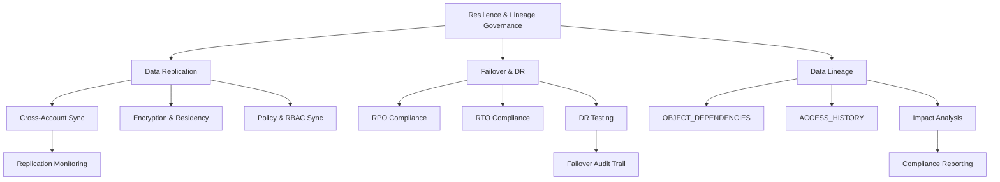
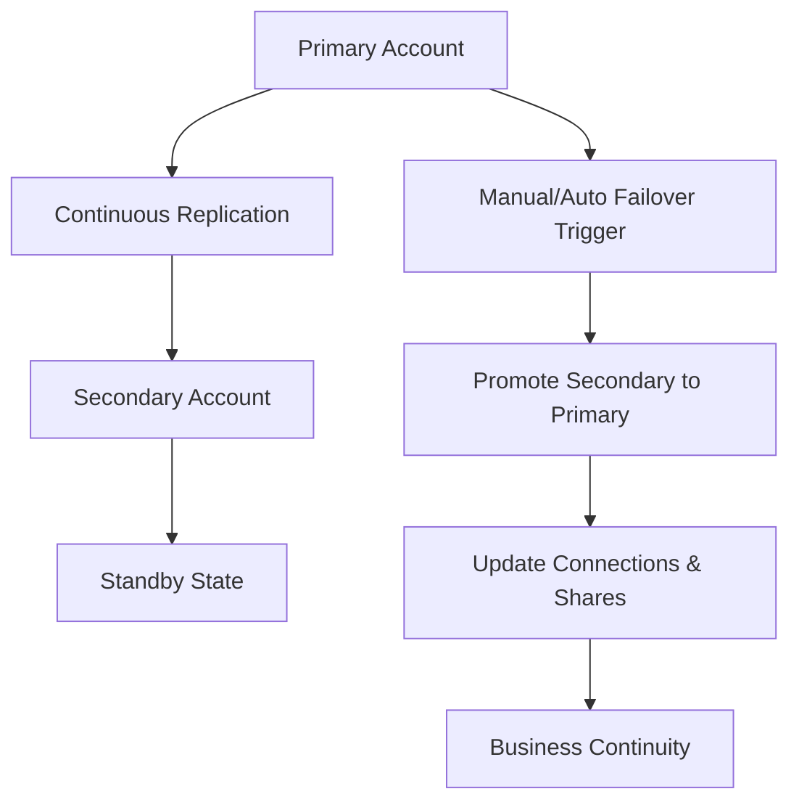
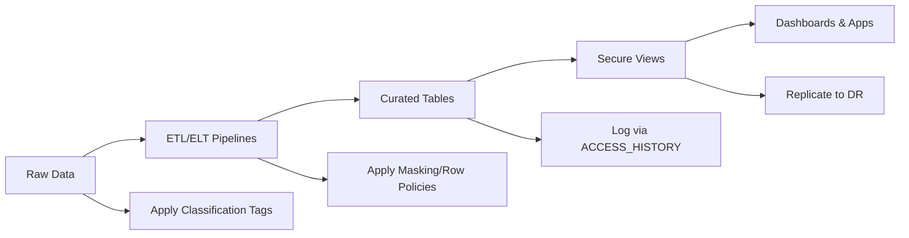
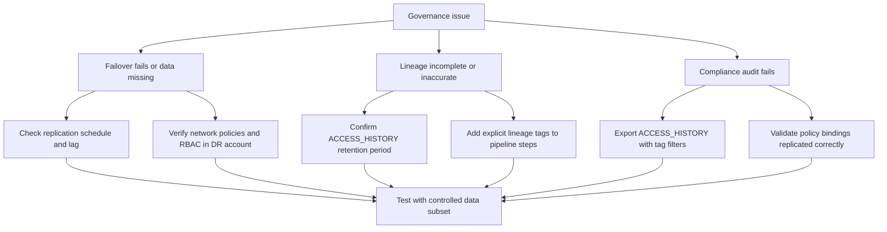
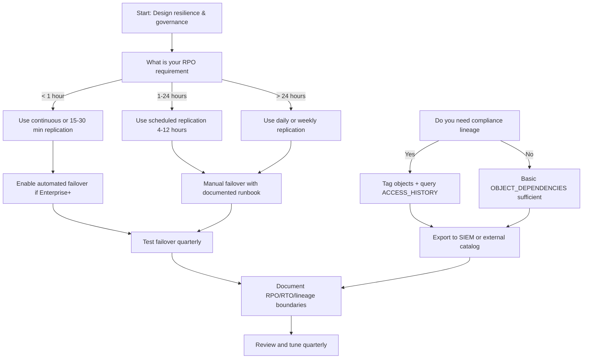

# Data Replication, Failover, and Lineage in Snowflake Governance



## Core Governance Principles

| Principle | What It Means | Why It Matters |
|-----------|--------------|----------------|
| Replicate data, not just bytes | Preserve grants, tags, policies, and metadata | Ensures security and governance travel with the data |
| Test failover, don't assume it works | DR plans fail silently if never validated | Compliance and business continuity require proof |
| Lineage is evidence, not decoration | Tracks who touched what, when, and why | Enables impact analysis, audit, and regulatory reporting |
| Security does not auto-replicate | Network policies, resource monitors, alerts stay in primary account | Cross-account governance requires explicit sync |
| Measure before you architect | RPO, RTO, and compliance needs drive configuration | Over-engineering wastes credits. Under-engineering risks downtime |

---

## Data Replication: Governance & Compliance

### What Replicates vs What Doesn't

| Object Type | Auto-Replicates | Governance Consideration |
|-------------|----------------|--------------------------|
| Databases, schemas, tables, views | Yes | Data residency laws may restrict cross-region replication |
| Tags and policy bindings | Yes | Tag definitions must exist in target account before replication |
| Grants and RBAC | Yes | Roles and users do not replicate; grants reference role names |
| Network policies | No | Must be recreated in secondary account |
| Resource monitors & alerts | No | Must be configured separately in DR account |
| Secure shares | No | Shares are account-bound; recreate or use marketplace |

### Replication Configuration Patterns

```sql
-- Create replication group for governed databases
CREATE REPLICATION GROUP prod_data_replication
  OBJECT_TYPES = DATABASES, SHARES, INTEGRATIONS
  ALLOWED_ACCOUNTS = myorg-secondary.aws.us-west-2
  REPLICATION_SCHEDULE = 'USING CRON 0 */6 * * *';  -- Every 6 hours

-- Add databases to replication group
ALTER REPLICATION GROUP prod_data_replication 
  ADD DATABASES analytics, finance, customer_360;

-- Enable replication (triggers initial sync)
ALTER DATABASE analytics ENABLE REPLICATION TO ACCOUNTS myorg-secondary.aws.us-west-2;
```

### Governance Controls for Replication

| Control | Implementation | Compliance Benefit |
|---------|---------------|-------------------|
| Data residency filtering | Replicate only non-restricted databases | Meets GDPR, HIPAA, or sovereign data rules |
| Encryption in transit & at rest | Enabled by default; verify customer managed keys | Satisfies PCI-DSS and SOC 2 encryption requirements |
| Replication schedule alignment | Match sync frequency to RPO requirements | Provides auditable data freshness guarantees |
| Tag preservation validation | Query TAG_REFERENCES in secondary account post-sync | Confirms governance policies travel with data |
| Cost monitoring | Query `REPLICATION_USAGE_HISTORY` view | Prevents surprise egress and compute charges |

```sql
-- Monitor replication usage and cost
SELECT
  replication_group_name,
  start_time,
  end_time,
  bytes_transferred,
  credits_used_cloud_services
FROM SNOWFLAKE.ACCOUNT_USAGE.REPLICATION_USAGE_HISTORY
WHERE start_time > DATEADD(day, -7, CURRENT_TIMESTAMP())
ORDER BY start_time DESC;

-- Verify tags replicated correctly
SELECT 
  object_name, 
  tag_name, 
  tag_value
FROM SNOWFLAKE.ACCOUNT_USAGE.TAG_REFERENCES
WHERE tag_name IN ('data_classification', 'data_owner')
ORDER BY object_name;
```

---

## Failover & Disaster Recovery: Governance & Continuity

### Failover Group Architecture



### Failover Configuration & Governance

```sql
-- Create failover group with DR databases
CREATE FAILOVER GROUP dr_failover_group
  OBJECT_TYPES = DATABASES, SHARES, INTEGRATIONS
  ALLOWED_ACCOUNTS = myorg-secondary.aws.us-west-2
  REPLICATION_SCHEDULE = 'USING CRON 0 */4 * * *';

-- Add replication databases to failover group
ALTER FAILOVER GROUP dr_failover_group ADD REPLICATION GROUP prod_data_replication;

-- Execute failover (requires ACCOUNTADMIN or ORGADMIN)
ALTER FAILOVER GROUP dr_failover_group FAILOVER TO myorg-secondary.aws.us-west-2;
```

### RPO, RTO, and Compliance Mapping

| Metric | Definition | Snowflake Capability | Governance Validation |
|--------|-----------|---------------------|----------------------|
| RPO (Recovery Point Objective) | Max acceptable data loss | Replication schedule (15 min to 24 hrs) | Document sync frequency; audit `REPLICATION_USAGE_HISTORY` |
| RTO (Recovery Time Objective) | Max acceptable downtime | Failover promotion (5-30 mins) | Run quarterly DR drills; measure actual promotion time |
| Data consistency | Post-failover query accuracy | Transactional sync guarantees | Validate row counts and referential integrity post-failover |
| Access continuity | RBAC and network policy availability | Grants replicate; network policies do not | Pre-stage network policies in DR account; test user access |

### Failover Testing & Audit Trail

```sql
-- Pre-failover validation query
SELECT 
  database_name, 
  last_replication_time,
  replication_state
FROM SNOWFLAKE.ACCOUNT_USAGE.REPLICATION_USAGE_HISTORY
WHERE database_name IN ('analytics', 'finance')
ORDER BY last_replication_time DESC LIMIT 1;

-- Post-failover governance verification
SELECT 
  r.name as role_name,
  COUNT(g.privilege) as granted_privileges,
  COUNT(DISTINCT g.granted_on) as objects_covered
FROM SNOWFLAKE.ACCOUNT_USAGE.ROLES r
LEFT JOIN SNOWFLAKE.ACCOUNT_USAGE.GRANTS_TO_ROLES g
  ON r.name = g.grantee_name AND g.deleted_on IS NULL
WHERE r.deleted_on IS NULL
GROUP BY r.name
ORDER BY granted_privileges DESC;
```

---

## Data Lineage: Governance & Audit

### Snowflake Lineage Sources

| View | What It Tracks | Governance Use Case |
|------|---------------|-------------------|
| `OBJECT_DEPENDENCIES` | Table → View → Function object relationships | Impact analysis before schema changes |
| `ACCESS_HISTORY` | Query-level data movement (source → target) | Compliance audits, access pattern analysis |
| `QUERY_HISTORY` | Execution details, bytes scanned, credits | Cost attribution, performance optimization |
| `TAG_REFERENCES` | Business classification metadata | Policy enforcement, data stewardship routing |
| `LINEAGE` (Preview/GA) | End-to-end pipeline lineage | Cross-tool lineage integration |

### Lineage Query Patterns for Governance

```sql
-- Pattern 1: Impact analysis before dropping a table
SELECT 
  dependent_object_database,
  dependent_object_schema,
  dependent_object_name,
  dependent_object_domain
FROM SNOWFLAKE.ACCOUNT_USAGE.OBJECT_DEPENDENCIES
WHERE referenced_object_name = 'customer_raw'
  AND referenced_object_domain = 'TABLE';

-- Pattern 2: Compliance audit for restricted data access
SELECT 
  ah.event_timestamp,
  ah.user_name,
  ah.object_name,
  ah.query_text,
  tr.tag_value as classification_level
FROM SNOWFLAKE.ACCOUNT_USAGE.ACCESS_HISTORY ah
JOIN SNOWFLAKE.ACCOUNT_USAGE.TAG_REFERENCES tr
  ON ah.object_name = tr.object_name
WHERE tr.tag_name = 'data_classification'
  AND tr.tag_value = 'restricted'
  AND ah.event_timestamp > DATEADD(month, -1, CURRENT_TIMESTAMP)
ORDER BY ah.event_timestamp DESC;

-- Pattern 3: Find orphaned tables with no downstream consumers
SELECT 
  table_catalog,
  table_schema,
  table_name,
  created,
  last_ddl
FROM INFORMATION_SCHEMA.TABLES t
LEFT JOIN SNOWFLAKE.ACCOUNT_USAGE.OBJECT_DEPENDENCIES d
  ON t.table_name = d.referenced_object_name
WHERE d.dependent_object_name IS NULL
  AND t.table_type = 'BASE TABLE'
  AND t.last_ddl < DATEADD(day, -90, CURRENT_TIMESTAMP());
```

### Lineage Integration with Governance Policies



| Governance Task | Lineage View Used | Action |
|----------------|------------------|--------|
| Change management | `OBJECT_DEPENDENCIES` | Block or approve schema changes based on downstream impact |
| Access review | `ACCESS_HISTORY` + `TAG_REFERENCES` | Revoke access to rarely used restricted tables |
| Cost attribution | `QUERY_HISTORY` + `WAREHOUSE_METERING_HISTORY` | Chargeback by pipeline or consumer team |
| Compliance reporting | `ACCESS_HISTORY` + `TAG_REFERENCES` | Generate GDPR/HIPAA data movement reports |
| DR validation | `REPLICATION_USAGE_HISTORY` + `TAG_REFERENCES` | Verify replicated objects retain governance tags |

---

## Cross-Cutting Governance Management

### What You Must Manage Manually Across Accounts

| Component | Replicates? | Governance Action Required |
|-----------|-------------|---------------------------|
| Database objects & grants | Yes | Verify post-sync; test with non-admin role |
| Tags & policy bindings | Yes | Ensure tag definitions exist in target first |
| Network policies | No | Recreate in secondary; match IP ranges |
| Resource monitors | No | Set up identical credit limits & alerts |
| Security integrations (SSO/OAuth) | No | Configure IdP trust for DR account |
| Alerts & tasks | No | Recreate or use cross-account orchestration |
| Users & roles | No | Use SCIM or automation to sync identities |

### Automated Governance Sync Pattern

```sql
-- Create procedure to validate replication governance
CREATE OR REPLACE PROCEDURE governance.validate_replication_integrity()
RETURNS STRING
LANGUAGE SQL
AS
$$
DECLARE
  missing_tags INT;
  missing_grants INT;
  msg STRING;
BEGIN
  -- Check for untagged replicated tables
  SELECT COUNT(*) INTO missing_tags
  FROM INFORMATION_SCHEMA.TABLES
  WHERE table_schema NOT IN ('INFORMATION_SCHEMA', 'SNOWFLAKE')
    AND table_name NOT IN (
      SELECT object_name FROM SNOWFLAKE.ACCOUNT_USAGE.TAG_REFERENCES
      WHERE tag_name = 'data_classification'
    );

  -- Check for missing critical role grants
  SELECT COUNT(*) INTO missing_grants
  FROM SNOWFLAKE.ACCOUNT_USAGE.ROLES
  WHERE name IN ('ANALYST_ROLE', 'ENGINEER_ROLE')
    AND name NOT IN (
      SELECT DISTINCT grantee_name FROM SNOWFLAKE.ACCOUNT_USAGE.GRANTS_TO_ROLES
    );

  msg := 'Missing tags: ' || missing_tags || ', Missing grants: ' || missing_grants;
  RETURN msg;
END;
$$;

-- Schedule governance validation weekly
CREATE OR REPLACE TASK governance.weekly_replication_check
  WAREHOUSE = governance_wh
  SCHEDULE = 'USING CRON 0 6 * * 1'
AS
  CALL governance.validate_replication_integrity();
```

---

## Best Practices & Common Pitfalls

| Practice | Why It Works | Pitfall to Avoid |
|----------|-------------|-----------------|
| Align replication schedule with RPO | Guarantees auditable data freshness | Assuming continuous sync when using hourly schedules |
| Pre-stage network policies in DR | Zero downtime during failover | Discovering blocked IPs after promotion |
| Test failover quarterly with real roles | Proves RBAC and connectivity work | Relying on untested DR runbooks |
| Tag all replicated objects | Enables lineage and policy tracking | Replicating data but losing classification context |
| Use `ACCESS_HISTORY` for compliance audits | Query-level proof of data movement | Relying on `QUERY_HISTORY` which lacks object-level flow |
| Sync SCIM or automate role creation | Maintains access consistency post-failover | Manual role recreation causing access gaps |
| Monitor replication credits & bytes | Prevents budget overruns | Ignoring cross-region egress costs |
| Document lineage boundaries | Clarifies where Snowflake stops and external tools begin | Assuming lineage covers all ETL platforms automatically |



---

## Decision Framework: Replication, Failover, and Lineage



| Requirement | Recommended Configuration | Governance Validation |
|------------|--------------------------|----------------------|
| RPO ≤ 15 mins | Continuous replication + Enterprise+ | Audit `REPLICATION_USAGE_HISTORY` lag |
| RPO ≤ 4 hours | `REPLICATION_SCHEDULE = 'USING CRON 0 */4 * * *'` | Validate sync completion logs |
| Zero RTO (auto failover) | `FAILOVER GROUP` with automated promotion | Test quarterly with real user roles |
| Manual RTO (≤ 2 hours) | Documented runbook + pre-staged policies | Run tabletop exercises biannually |
| Full lineage compliance | Tags + `ACCESS_HISTORY` + external export | Generate monthly audit reports |
| Impact analysis | `OBJECT_DEPENDENCIES` + change approval workflow | Block drops if dependencies exist |

---

## Key Principles to Remember

- Replication moves data. Governance moves with it only if you design it to.
- Failover is not a feature you turn on. It is a process you test, document, and validate.
- Lineage is evidence. `ACCESS_HISTORY` proves data flow. `OBJECT_DEPENDENCIES` proves object flow.
- Security policies do not auto-replicate. Network rules, resource monitors, and alerts require explicit sync.
- RPO and RTO are business contracts. Configure replication and failover to meet them, not the other way around.
- Measure what replicates, what fails over, and what lineage captures. Assumptions fail during audits.
- Document boundaries. Know where Snowflake's native coverage ends and external tooling begins.

## Bottom Line

- Data replication ensures your data exists elsewhere. Governance ensures it is protected the same way.
- Failover ensures continuity. Testing ensures it actually works when needed.
- Lineage ensures accountability. Query-level history and object dependencies provide audit-ready proof.
- Configure replication to meet RPO. Configure failover to meet RTO. Configure lineage to meet compliance.
- Pre-stage network policies, sync roles, and recreate alerts in DR accounts. Do not discover gaps during an outage.
- Test quarterly. Document runbooks. Export lineage for regulators. Review and adjust as requirements evolve.
- Resilience and governance are not separate. They are two sides of the same architecture. Design them together, or pay for it later.
