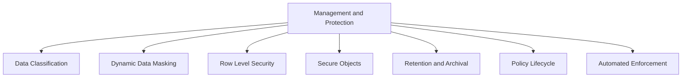
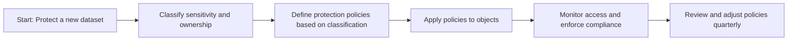
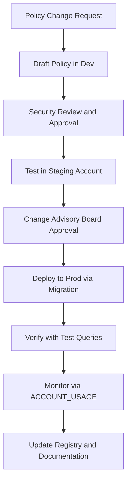
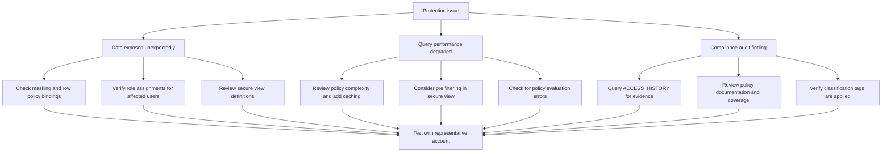
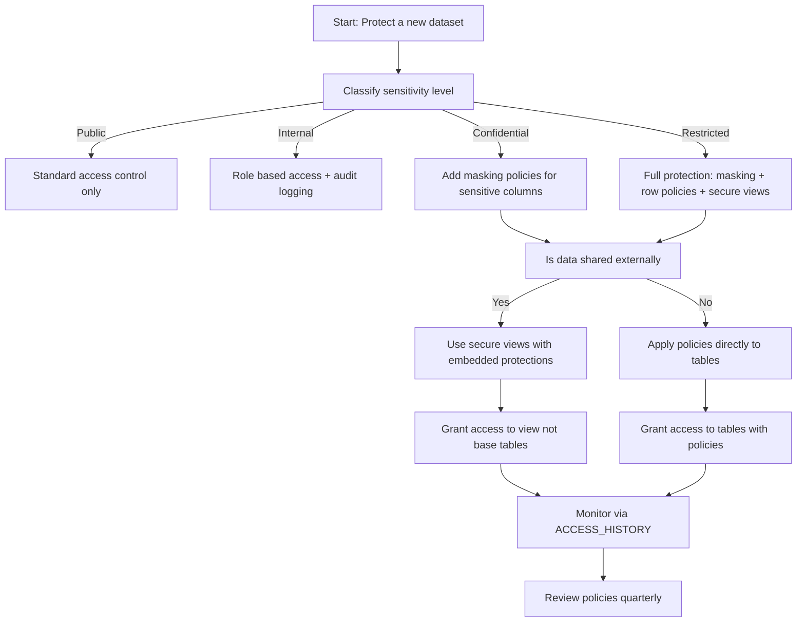

# Data Governance: Management and Protection in Snowflake



## Core Protection Principles

| Principle | What It Means | Why It Matters |
|-----------|--------------|----------------|
| Protect by design | Build security into data models not as an afterthought | Prevents gaps that attackers or accidents exploit |
| Classify to protect | You cannot secure what you have not identified | Tags drive automated policy application |
| Least privilege enforcement | Grant minimum access required for each role | Reduces blast radius of credential compromise |
| Defense in depth | Layer masking row security and secure views | Single control failure does not expose data |
| Automate enforcement | Manual reviews do not scale. Let the system enforce. | Reduces human error and ensures consistency |
| Audit everything | Log who accessed what when and why | Enables compliance forensics and continuous improvement |



## Data Classification for Protection

### Classification Framework

| Classification Level | Definition | Example Data | Required Protections |
|---------------------|------------|--------------|---------------------|
| Public | Safe for external disclosure | Marketing materials public reports | None beyond standard access control |
| Internal | For employees only | Internal metrics operational data | Role based access audit logging |
| Confidential | Sensitive business data | Customer lists pricing strategies | Masking row policies secure views |
| Restricted | Highly sensitive regulated data | PII PHI financial records payment data | Full masking row policies encryption audit |

```sql
-- Create classification tag with controlled values
CREATE OR REPLACE TAG data_classification
  COMMENT = 'Data sensitivity classification per security policy v3.0. Values: public internal confidential restricted. Owner: security_team. Review: quarterly.'
  ALLOWED_VALUES = ('public', 'internal', 'confidential', 'restricted');

-- Apply classification to objects at appropriate granularity
-- Column level for sensitive fields
ALTER TABLE customers MODIFY COLUMN ssn SET TAG data_classification = 'restricted';
ALTER TABLE customers MODIFY COLUMN email SET TAG data_classification = 'confidential';

-- Table level for overall sensitivity
ALTER TABLE customers SET TAG data_classification = 'confidential';

-- Database level for domain classification
ALTER DATABASE analytics SET TAG data_classification = 'internal';
```

### Automated Classification Patterns

| Pattern | Implementation | Use Case |
|---------|---------------|----------|
| Schema based classification | Tag all columns matching pattern like %ssn% %email% | Auto classify PII fields during ingestion |
| Source based classification | Tag tables from sensitive source systems | Apply protections to entire data pipelines |
| Content based classification | Use Snowflake functions to detect patterns | Auto tag columns containing email or phone patterns |
| Manual stewardship | Data owners assign tags via governance workflow | Handle edge cases and business context |

```sql
-- Example: Auto classify columns containing PII patterns
-- Run as part of ingestion pipeline
CREATE OR REPLACE PROCEDURE auto_classify_pii(database_name STRING, schema_name STRING)
RETURNS STRING
LANGUAGE SQL
AS
$$
DECLARE
  col_record RECORD;
  col_cursor CURSOR FOR
    SELECT column_name, data_type
    FROM INFORMATION_SCHEMA.COLUMNS
    WHERE table_schema = schema_name
      AND table_catalog = database_name;
BEGIN
  FOR col_record IN col_cursor DO
    -- Auto tag common PII column names
    IF UPPER(col_record.column_name) LIKE '%SSN%' OR
       UPPER(col_record.column_name) LIKE '%SOCIAL_SECURITY%' THEN
      EXECUTE IMMEDIATE 'ALTER TABLE ' || database_name || '.' || schema_name || '.' || col_record.table_name ||
                        ' MODIFY COLUMN ' || col_record.column_name ||
                        ' SET TAG data_classification = ''restricted''';
    ELSIF UPPER(col_record.column_name) LIKE '%EMAIL%' THEN
      EXECUTE IMMEDIATE 'ALTER TABLE ' || database_name || '.' || schema_name || '.' || col_record.table_name ||
                        ' MODIFY COLUMN ' || col_record.column_name ||
                        ' SET TAG data_classification = ''confidential''';
    END IF;
  END FOR;
  RETURN 'Classification complete';
END;
$$;

-- Execute classification after data load
CALL auto_classify_pii('raw', 'customer_data');
```

### Classification Governance

```sql
-- Query to audit classification coverage
SELECT
  table_schema,
  table_name,
  column_name,
  COALESCE(tr.tag_value, 'UNCLASSIFIED') as classification,
  CASE
    WHEN tr.tag_value = 'restricted' AND mp.policy_name IS NULL THEN 'MISSING_MASKING'
    WHEN tr.tag_value = 'confidential' AND mp.policy_name IS NULL THEN 'REVIEW_RECOMMENDED'
    ELSE 'COMPLIANT'
  END as compliance_status
FROM INFORMATION_SCHEMA.COLUMNS c
LEFT JOIN SNOWFLAKE.ACCOUNT_USAGE.TAG_REFERENCES tr
  ON c.table_name = tr.object_name
  AND c.column_name = tr.column_name
  AND tr.tag_name = 'data_classification'
LEFT JOIN SNOWFLAKE.ACCOUNT_USAGE.MASKING_POLICIES mp
  ON c.column_name = mp.column_name
WHERE c.table_schema = 'customer_data'
ORDER BY compliance_status, table_name, column_name;
```

| Governance Task | Frequency | Automation Approach |
|----------------|-----------|-------------------|
| Classify new columns | On ingestion | Auto classification procedure |
| Review unclassified objects | Weekly | TASK querying TAG_REFERENCES |
| Audit policy coverage | Monthly | Dashboard query with compliance status |
| Update classification rules | Quarterly | Version controlled policy updates |
| Report to compliance team | Quarterly | Export ACCESS_HISTORY with classification |

## Dynamic Data Masking

### Masking Policy Design Patterns

| Pattern | Policy Logic | When To Use |
|---------|-------------|-------------|
| Full hide | Return '***' for unauthorized roles | Highly sensitive fields like SSN health info |
| Partial reveal | Show last N characters for limited roles | Phone numbers account IDs for support teams |
| Hash for analytics | Return SHA1 or MD5 for authorized analytics roles | Enable grouping without exposing raw values |
| Format preserving | Keep data type and format while masking | Applications expect specific formats like credit cards |
| Conditional masking | Different masks for different roles or contexts | Tiered access model with multiple clearance levels |

```sql
-- Pattern: Full hide for restricted data
CREATE OR REPLACE MASKING POLICY mask_restricted AS (val STRING) RETURNS STRING ->
  CASE
    WHEN CURRENT_ROLE() IN ('ADMIN_ROLE', 'SECURITY_ROLE') THEN val
    ELSE '***'
  END;

-- Pattern: Partial reveal for support teams
CREATE OR REPLACE MASKING POLICY mask_phone_partial AS (val STRING) RETURNS STRING ->
  CASE
    WHEN CURRENT_ROLE() IN ('ADMIN_ROLE', 'SUPPORT_ROLE') THEN
      REGEXP_REPLACE(val, '(\\d{3}-\\d{3}-)\\d{4}', '\\1****')
    ELSE '***-***-****'
  END;

-- Pattern: Hash for analytics without raw exposure
CREATE OR REPLACE MASKING POLICY mask_email_hash AS (val STRING) RETURNS STRING ->
  CASE
    WHEN CURRENT_ROLE() IN ('ADMIN_ROLE') THEN val
    WHEN CURRENT_ROLE() IN ('ANALYTICS_ROLE') THEN SHA1(val)
    ELSE '***'
  END;

-- Pattern: Format preserving for credit cards
CREATE OR REPLACE MASKING POLICY mask_cc_format AS (val STRING) RETURNS STRING ->
  CASE
    WHEN CURRENT_ROLE() IN ('ADMIN_ROLE', 'FINANCE_ROLE') THEN val
    ELSE REGEXP_REPLACE(val, '(\\d{4}-\\d{4}-\\d{4}-)\\d{4}', '\\1****')
  END;
```

### Binding Masking Policies at Scale

```sql
-- Method 1: Manual binding for specific columns
ALTER TABLE customers MODIFY COLUMN ssn SET MASKING POLICY mask_restricted;
ALTER TABLE customers MODIFY COLUMN email SET MASKING POLICY mask_email_hash;

-- Method 2: Bulk binding via script for all tagged columns
-- Generate and execute binding statements dynamically
CREATE OR REPLACE PROCEDURE apply_masking_by_tag()
RETURNS STRING
LANGUAGE SQL
AS
$$
DECLARE
  tag_record RECORD;
  tag_cursor CURSOR FOR
    SELECT object_name, column_name, tag_value
    FROM SNOWFLAKE.ACCOUNT_USAGE.TAG_REFERENCES
    WHERE tag_name = 'data_classification'
      AND column_name IS NOT NULL;
BEGIN
  FOR tag_record IN tag_cursor DO
    CASE tag_record.tag_value
      WHEN 'restricted' THEN
        EXECUTE IMMEDIATE 'ALTER TABLE ' || tag_record.object_name ||
                          ' MODIFY COLUMN ' || tag_record.column_name ||
                          ' SET MASKING POLICY mask_restricted';
      WHEN 'confidential' THEN
        EXECUTE IMMEDIATE 'ALTER TABLE ' || tag_record.object_name ||
                          ' MODIFY COLUMN ' || tag_record.column_name ||
                          ' SET MASKING POLICY mask_email_hash';
    END CASE;
  END FOR;
  RETURN 'Masking policies applied';
END;
$$;

-- Execute bulk binding
CALL apply_masking_by_tag();
```

### Testing Masking Policies

```sql
-- Test masking behavior with different roles
-- Step 1: Create test roles if they do not exist
CREATE ROLE IF NOT EXISTS test_admin;
CREATE ROLE IF NOT EXISTS test_analyst;
CREATE ROLE IF NOT EXISTS test_external;

-- Step 2: Grant roles to test user
GRANT ROLE test_admin TO USER test_user;
GRANT ROLE test_analyst TO USER test_user;
GRANT ROLE test_external TO USER test_user;

-- Step 3: Test as each role
-- As admin: should see full values
USE ROLE test_admin;
SELECT ssn, email FROM customers LIMIT 1;

-- As analyst: should see hashed email
USE ROLE test_analyst;
SELECT ssn, email FROM customers LIMIT 1;

-- As external: should see fully masked values
USE ROLE test_external;
SELECT ssn, email FROM customers LIMIT 1;

-- Step 4: Clean up test roles
REVOKE ROLE test_admin FROM USER test_user;
REVOKE ROLE test_analyst FROM USER test_user;
REVOKE ROLE test_external FROM USER test_user;
```

| Test Scenario | Expected Result | Verification Method |
|--------------|----------------|-------------------|
| Admin role queries restricted column | Full value returned | Compare output to source data |
| Analyst role queries confidential column | Hashed value returned | Verify SHA1 format matches |
| External role queries any sensitive column | Masked value returned | Confirm '***' or partial format |
| Query with multiple roles active | Union of privileges applied | Test with user holding multiple roles |
| Policy updated after binding | New logic applies immediately | Update policy and re query |

## Row Level Security Implementation

### Row Access Policy Patterns

| Pattern | Policy Logic | Use Case |
|---------|-------------|----------|
| Role based filtering | CURRENT_ROLE() IN allowed_roles | Different teams see different regional data |
| Attribute based | Join to user metadata for department region | Filter by user attributes stored centrally |
| Time based | CURRENT_DATE() BETWEEN valid_start AND valid_end | Restrict access to recent data only |
| Account based | CURRENT_ACCOUNT() = allowed_account | Control access in multi account sharing |
| Combination | Role AND attribute AND time conditions | Complex access rules for regulated data |

```sql
-- Pattern: Role based regional filtering
CREATE OR REPLACE ROW ACCESS POLICY regional_filter AS (region STRING) RETURNS BOOLEAN ->
  CASE
    WHEN CURRENT_ROLE() IN ('ADMIN_ROLE', 'EXEC_ROLE') THEN TRUE
    WHEN CURRENT_ROLE() = 'SALES_NORTH_ROLE' THEN region = 'North'
    WHEN CURRENT_ROLE() = 'SALES_SOUTH_ROLE' THEN region = 'South'
    WHEN CURRENT_ROLE() = 'PARTNER_ROLE' THEN region IN ('North', 'South')
    ELSE FALSE
  END;

-- Pattern: Attribute based using user metadata table
CREATE OR REPLACE ROW ACCESS POLICY dept_filter AS (dept_id NUMBER) RETURNS BOOLEAN ->
  EXISTS (
    SELECT 1
    FROM security.user_departments ud
    WHERE ud.user_name = CURRENT_USER()
      AND ud.dept_id = dept_id
      AND ud.active = TRUE
      AND ud.valid_until >= CURRENT_DATE()
  );

-- Pattern: Time based for recent data only
CREATE OR REPLACE ROW ACCESS POLICY recent_only AS (created_date DATE) RETURNS BOOLEAN ->
  created_date >= DATEADD(month, -12, CURRENT_DATE());

-- Pattern: Combined complex access rule
CREATE OR REPLACE ROW ACCESS POLICY complex_access AS (
  region STRING,
  created_date DATE,
  data_owner STRING
) RETURNS BOOLEAN ->
  -- Admins see everything
  CURRENT_ROLE() = 'ADMIN_ROLE'
  -- Analysts see recent data in their region
  OR (CURRENT_ROLE() = 'ANALYST_ROLE'
      AND region = CURRENT_USER_REGION()
      AND created_date >= DATEADD(year, -2, CURRENT_DATE()))
  -- Partners see only approved regions and recent data
  OR (CURRENT_ROLE() = 'PARTNER_ROLE'
      AND region IN ('North', 'South')
      AND created_date >= DATEADD(month, -6, CURRENT_DATE())
      AND data_owner = 'partner_approved');
```

### Binding Row Access Policies

```sql
-- Bind policy to table column that determines filtering
ALTER TABLE sales ADD ROW ACCESS POLICY regional_filter ON (region);

-- Bind multiple policies to different columns for layered security
ALTER TABLE customer_data
  ADD ROW ACCESS POLICY dept_filter ON (dept_id),
  ADD ROW ACCESS POLICY recent_only ON (created_date);

-- Bind policy to view for additional abstraction layer
CREATE SECURE VIEW reporting.regional_sales AS
SELECT region, SUM(revenue) as total
FROM raw.sales
GROUP BY region;

ALTER VIEW reporting.regional_sales ADD ROW ACCESS POLICY regional_filter ON (region);
```

### Testing Row Access Policies

```sql
-- Test policy behavior with different roles
-- Setup test data
CREATE OR REPLACE TABLE test.sales_test (
  region STRING,
  amount NUMBER,
  created_date DATE
);

INSERT INTO test.sales_test VALUES
  ('North', 1000, CURRENT_DATE()),
  ('South', 2000, CURRENT_DATE()),
  ('North', 1500, DATEADD(year, -3, CURRENT_DATE()));  -- Old data

-- Apply policy
ALTER TABLE test.sales_test ADD ROW ACCESS POLICY complex_access ON (region, created_date);

-- Test as different roles
USE ROLE test_admin;
SELECT * FROM test.sales_test;  -- Should see all 3 rows

USE ROLE test_analyst;
SELECT * FROM test.sales_test;  -- Should see only North recent rows

USE ROLE test_external;
SELECT * FROM test.sales_test;  -- Should see no rows or filtered subset

-- Cleanup
DROP TABLE test.sales_test;
```

| Test Scenario | Expected Result | Verification Query |
|--------------|----------------|-------------------|
| Admin queries table with regional policy | All rows returned regardless of region | COUNT(*) matches source |
| Regional role queries same table | Only rows matching region returned | Filtered COUNT matches expectation |
| Query with time based policy | Only recent rows returned | MIN(created_date) >= threshold |
| Combined policies | Intersection of all conditions applied | Verify each filter condition |
| Policy updated after binding | New logic applies to subsequent queries | Update policy and re query |

## Secure Objects for Protection

### Secure Views Patterns

| Pattern | Implementation | Use Case |
|---------|---------------|----------|
| Aggregation view | Pre aggregate sensitive details | Share summaries without exposing individual records |
| Column projection | Expose only approved columns | Limit data exposure without masking each column |
| Row filtering in view | Include WHERE clause for access control | Enforce access rules at view layer |
| Logic encapsulation | Hide complex business logic | Protect proprietary algorithms from exposure |
| Data transformation | Apply masking or tokenization in view | Centralize transformation logic for consistency |

```sql
-- Pattern: Aggregation view for external sharing
CREATE SECURE VIEW shared.customer_metrics AS
SELECT
  customer_id,
  region,
  COUNT(order_id) as order_count,
  SUM(order_total) as lifetime_value,
  AVG(order_total) as avg_order_value
FROM raw.orders
WHERE order_date >= DATEADD(year, -2, CURRENT_DATE)
GROUP BY customer_id, region;

-- Grant access to view not base table
GRANT SELECT ON VIEW shared.customer_metrics TO ROLE partner_role;

-- Pattern: Column projection with embedded masking
CREATE SECURE VIEW reporting.employee_summary AS
SELECT
  employee_id,
  department,
  title,
  -- Mask sensitive fields inline
  CASE WHEN CURRENT_ROLE() = 'HR_ROLE' THEN salary ELSE NULL END as salary,
  CASE WHEN CURRENT_ROLE() IN ('HR_ROLE', 'MANAGER_ROLE') THEN email ELSE '***@***.***' END as email
FROM raw.employees;

-- Pattern: Row filtering with dynamic context
CREATE SECURE VIEW analytics.my_team_data AS
SELECT *
FROM raw.project_data
WHERE team_lead = CURRENT_USER()
   OR CURRENT_ROLE() = 'ADMIN_ROLE';
```

### Secure UDFs for Protected Logic

```sql
-- Pattern: Secure UDF with hidden proprietary logic
CREATE SECURE FUNCTION analytics.calculate_credit_score (
  income FLOAT,
  debt_ratio FLOAT,
  payment_history INT
)
RETURNS FLOAT
LANGUAGE SQL
COMMENT = 'Proprietary credit scoring algorithm - do not expose logic'
AS $$
  -- Complex logic hidden from users without ownership
  CASE
    WHEN payment_history < 60 THEN 300
    WHEN debt_ratio > 0.8 THEN 400
    ELSE 500 + (income / 1000) * 10 + payment_history * 2 - debt_ratio * 100
  END
$$;

-- Grant execute without exposing definition
GRANT USAGE ON FUNCTION analytics.calculate_credit_score(FLOAT, FLOAT, INT) TO ROLE underwriting_role;

-- Users can call function but cannot see implementation
SELECT customer_id, analytics.calculate_credit_score(income, debt_ratio, payment_history) as score
FROM raw.applications;
```

### Testing Secure Objects

```sql
-- Verify secure view definition is hidden
-- As owner: can see definition
USE ROLE view_owner;
SHOW VIEWS LIKE 'customer_metrics' IN SCHEMA shared;
-- Result includes view definition in 'text' column

-- As non owner: cannot see definition
USE ROLE partner_role;
SHOW VIEWS LIKE 'customer_metrics' IN SCHEMA shared;
-- Result shows view exists but 'text' column is null or restricted

-- Verify secure UDF logic is hidden
SHOW FUNCTIONS LIKE 'calculate_credit_score' IN SCHEMA analytics;
-- Non owners see function exists but cannot view AS clause

-- Verify query results are correct
USE ROLE partner_role;
SELECT COUNT(*) FROM shared.customer_metrics;  -- Should return expected count
SELECT * FROM shared.customer_metrics LIMIT 1;  -- Should return aggregated not raw data
```

## Retention and Archival Policies

### Retention Classification

```sql
-- Create retention policy tag
CREATE OR REPLACE TAG retention_policy
  COMMENT = 'Data retention schedule per legal policy. Values: 30d 90d 1y 3y 7y permanent. Owner: legal_team.'
  ALLOWED_VALUES = ('30d', '90d', '1y', '3y', '7y', 'permanent');

-- Apply retention tags to objects
ALTER TABLE raw.web_logs SET TAG retention_policy = '90d';
ALTER TABLE analytics.customer_facts SET TAG retention_policy = '7y';
ALTER TABLE compliance.audit_trail SET TAG retention_policy = 'permanent';
```

### Automated Archival Patterns

| Pattern | Implementation | Use Case |
|---------|---------------|----------|
| Time based archival | TASK that moves data older than threshold to archive schema | Comply with retention policies automatically |
| Usage based archival | Archive tables with no ACCESS_HISTORY in N days | Reduce storage cost for unused data |
| Classification based | Archive based on retention_policy tag value | Centralized retention management |
| External archival | COPY to S3 Glacier then DROP from Snowflake | Move cold data to cheaper storage |

```sql
-- Pattern: Time based archival task
CREATE OR REPLACE TASK governance.archive_old_logs
  WAREHOUSE = admin_wh
  SCHEDULE = 'USING CRON 0 2 * * *'  -- Daily at 2 AM
AS
  -- Move logs older than 90 days to archive schema
  INSERT INTO archive.web_logs_90d
  SELECT * FROM raw.web_logs
  WHERE event_timestamp < DATEADD(day, -90, CURRENT_TIMESTAMP);
  
  -- Delete archived data from source
  DELETE FROM raw.web_logs
  WHERE event_timestamp < DATEADD(day, -90, CURRENT_TIMESTAMP);

-- Pattern: Classification based archival procedure
CREATE OR REPLACE PROCEDURE governance.apply_retention_policies()
RETURNS STRING
LANGUAGE SQL
AS
$$
DECLARE
  retention_record RECORD;
  retention_cursor CURSOR FOR
    SELECT object_name, tag_value
    FROM SNOWFLAKE.ACCOUNT_USAGE.TAG_REFERENCES
    WHERE tag_name = 'retention_policy'
      AND object_domain = 'TABLE';
BEGIN
  FOR retention_record IN retention_cursor DO
    CASE retention_record.tag_value
      WHEN '30d' THEN
        EXECUTE IMMEDIATE 'DELETE FROM ' || retention_record.object_name ||
                          ' WHERE created_date < DATEADD(day, -30, CURRENT_DATE)';
      WHEN '90d' THEN
        EXECUTE IMMEDIATE 'DELETE FROM ' || retention_record.object_name ||
                          ' WHERE created_date < DATEADD(day, -90, CURRENT_DATE)';
      WHEN '1y' THEN
        EXECUTE IMMEDIATE 'DELETE FROM ' || retention_record.object_name ||
                          ' WHERE created_date < DATEADD(year, -1, CURRENT_DATE)';
      -- Add more cases as needed
    END CASE;
  END FOR;
  RETURN 'Retention policies applied';
END;
$$;

-- Schedule procedure to run weekly
CREATE OR REPLACE TASK governance.weekly_retention_enforcement
  WAREHOUSE = admin_wh
  SCHEDULE = 'USING CRON 0 3 * * 1'  -- Monday at 3 AM
AS
  CALL governance.apply_retention_policies();
```

### External Archival to Cloud Storage

```sql
-- Create external stage for archival storage
CREATE OR REPLACE EXTERNAL STAGE archive_storage
  URL = 's3://company-archive-bucket/snowflake/'
  CREDENTIALS = (AWS_KEY_ID = '***' AWS_SECRET_KEY = '***')
  FILE_FORMAT = (TYPE = PARQUET COMPRESSION = SNAPPY);

-- Archive table to external storage then drop
COPY INTO @archive_storage/customer_facts/
FROM analytics.customer_facts
WHERE last_updated < DATEADD(year, -7, CURRENT_DATE)
FILE_FORMAT = (TYPE = PARQUET);

-- Verify archival completed
LIST @archive_storage/customer_facts/;

-- Drop archived data from Snowflake
DELETE FROM analytics.customer_facts
WHERE last_updated < DATEADD(year, -7, CURRENT_DATE);

-- Optional: Create external table for historical query access
CREATE EXTERNAL TABLE archive.customer_facts_historical (
  customer_id NUMBER,
  lifetime_value FLOAT,
  last_updated DATE
)
LOCATION = @archive_storage/customer_facts/
FILE_FORMAT = (TYPE = PARQUET)
AUTO_REFRESH = TRUE;
```

## Policy Lifecycle Management

### Policy Registry and Documentation

```sql
-- Create central policy registry schema
CREATE SCHEMA IF NOT EXISTS governance.policy_registry
  COMMENT = 'Central registry for all data protection policies';

-- Create policy definition table
CREATE TABLE IF NOT EXISTS governance.policy_registry.definitions (
  policy_name STRING NOT NULL,
  policy_type STRING NOT NULL,  -- MASKING ROW_ACCESS SECURE_VIEW RETENTION
  description STRING,
  owner_role STRING,
  classification_scope STRING,  -- Which tag values this policy applies to
  created_date TIMESTAMP DEFAULT CURRENT_TIMESTAMP(),
  created_by STRING DEFAULT CURRENT_USER(),
  last_modified_date TIMESTAMP,
  last_modified_by STRING,
  status STRING DEFAULT 'ACTIVE',  -- ACTIVE DEPRECATED DRAFT
  next_review_date DATE,
  rollback_script STRING,  -- Path to rollback migration
  test_cases STRING,  -- JSON of test scenarios
  CONSTRAINT pk_policy PRIMARY KEY (policy_name)
);

-- Register a new masking policy
INSERT INTO governance.policy_registry.definitions (
  policy_name, policy_type, description, owner_role, classification_scope,
  next_review_date, test_cases
) VALUES (
  'mask_email_hash',
  'MASKING',
  'Hash email addresses for analytics roles. Full value for admin only.',
  'SECURITYADMIN',
  'confidential',
  DATEADD(month, 3, CURRENT_DATE()),
  '[{"role":"ADMIN_ROLE","expected":"full"},{"role":"ANALYTICS_ROLE","expected":"hash"}]'
);
```

### Policy Change Management Workflow



```sql
-- Example: Migration script for policy deployment
-- File: 025_deploy_email_mask_policy.sql
-- Owner: security_team
-- Review: security_review_2024_Q2
-- Rollback: 025_rollback_email_mask_policy.sql
-- JIRA: GOV-1234

-- Create or replace policy
CREATE OR REPLACE MASKING POLICY mask_email_hash AS (val STRING) RETURNS STRING ->
  CASE
    WHEN CURRENT_ROLE() IN ('ADMIN_ROLE') THEN val
    WHEN CURRENT_ROLE() IN ('ANALYTICS_ROLE') THEN SHA1(val)
    ELSE '***'
  END;

-- Apply to all email columns tagged as confidential
-- This would be generated by automation querying TAG_REFERENCES
ALTER TABLE customers MODIFY COLUMN email SET MASKING POLICY mask_email_hash;
ALTER TABLE users MODIFY COLUMN contact_email SET MASKING POLICY mask_email_hash;

-- Update policy registry
UPDATE governance.policy_registry.definitions
SET
  last_modified_date = CURRENT_TIMESTAMP(),
  last_modified_by = CURRENT_USER(),
  status = 'ACTIVE'
WHERE policy_name = 'mask_email_hash';

-- Log deployment for audit
INSERT INTO governance.policy_registry.deployment_log (
  policy_name, deployed_to, deployed_by, deployment_time
) VALUES (
  'mask_email_hash', 'PROD', CURRENT_USER(), CURRENT_TIMESTAMP()
);
```

### Policy Review and Retirement

```sql
-- Query to identify policies needing review
SELECT
  policy_name,
  policy_type,
  owner_role,
  next_review_date,
  DATEDIFF(day, CURRENT_DATE(), next_review_date) as days_until_review,
  status
FROM governance.policy_registry.definitions
WHERE status = 'ACTIVE'
  AND next_review_date <= DATEADD(month, 1, CURRENT_DATE())
ORDER BY next_review_date;

-- Query to identify unused policies for retirement consideration
SELECT
  d.policy_name,
  d.policy_type,
  COUNT(DISTINCT ah.object_name) as objects_using_policy,
  MAX(ah.start_time) as last_access_time
FROM governance.policy_registry.definitions d
LEFT JOIN SNOWFLAKE.ACCOUNT_USAGE.MASKING_POLICIES mp
  ON d.policy_name = mp.policy_name
LEFT JOIN SNOWFLAKE.ACCOUNT_USAGE.ACCESS_HISTORY ah
  ON mp.column_name = ah.object_name
WHERE d.status = 'ACTIVE'
GROUP BY d.policy_name, d.policy_type
HAVING COUNT(DISTINCT ah.object_name) = 0
   OR MAX(ah.start_time) < DATEADD(month, -6, CURRENT_DATE());

-- Retire a policy (soft delete)
UPDATE governance.policy_registry.definitions
SET
  status = 'DEPRECATED',
  last_modified_date = CURRENT_TIMESTAMP(),
  last_modified_by = CURRENT_USER()
WHERE policy_name = 'legacy_mask_policy';

-- Execute rollback script before deactivation
-- EXECUTE IMMEDIATE FROM @migrations/025_rollback_email_mask_policy.sql;
```

## Automated Enforcement and Monitoring

### Compliance Monitoring Queries

```sql
-- Monitor 1: Unmasked restricted columns
CREATE OR REPLACE VIEW governance.monitor.unmasked_restricted AS
SELECT
  c.table_schema,
  c.table_name,
  c.column_name,
  c.data_type,
  tr.tag_value as classification,
  'MISSING_MASKING_POLICY' as issue,
  CURRENT_TIMESTAMP() as detected_at
FROM INFORMATION_SCHEMA.COLUMNS c
JOIN SNOWFLAKE.ACCOUNT_USAGE.TAG_REFERENCES tr
  ON c.table_name = tr.object_name
  AND c.column_name = tr.column_name
  AND tr.tag_name = 'data_classification'
LEFT JOIN SNOWFLAKE.ACCOUNT_USAGE.MASKING_POLICIES mp
  ON c.column_name = mp.column_name
WHERE tr.tag_value IN ('confidential', 'restricted')
  AND mp.policy_name IS NULL;

-- Monitor 2: Unauthorized access attempts to restricted data
CREATE OR REPLACE VIEW governance.monitor.unauthorized_access AS
SELECT
  ah.user_name,
  ah.object_name,
  ah.query_text,
  ah.start_time,
  tr.tag_value as data_classification,
  'ATTEMPTED_ACCESS_TO_RESTRICTED' as issue
FROM SNOWFLAKE.ACCOUNT_USAGE.ACCESS_HISTORY ah
JOIN SNOWFLAKE.ACCOUNT_USAGE.TAG_REFERENCES tr
  ON ah.object_name = tr.object_name
WHERE tr.tag_value = 'restricted'
  AND ah.start_time > DATEADD(day, -7, CURRENT_TIMESTAMP)
  AND ah.user_name NOT IN (
    SELECT grantee_name
    FROM SNOWFLAKE.ACCOUNT_USAGE.GRANTS_TO_ROLES
    WHERE privilege = 'SELECT'
      AND name IN (
        SELECT object_name
        FROM SNOWFLAKE.ACCOUNT_USAGE.TAG_REFERENCES
        WHERE tag_value = 'restricted'
      )
  );

-- Monitor 3: Policy evaluation errors
CREATE OR REPLACE VIEW governance.monitor.policy_errors AS
SELECT
  query_id,
  user_name,
  error_message,
  start_time,
  'POLICY_EVALUATION_ERROR' as issue
FROM SNOWFLAKE.ACCOUNT_USAGE.QUERY_HISTORY
WHERE error_message ILIKE '%masking policy%'
   OR error_message ILIKE '%row access policy%'
   OR error_message ILIKE '%privilege%'
  AND start_time > DATEADD(day, -1, CURRENT_TIMESTAMP);
```

### Automated Alerting

```sql
-- Alert: Unmasked restricted data detected
CREATE OR REPLACE ALERT governance.alert_unmasked_restricted
  WAREHOUSE = admin_wh
  SCHEDULE = 'USING CRON 0 8 * * 1-5'  -- Weekdays at 8 AM
  CONDITION = (SELECT COUNT(*) FROM governance.monitor.unmasked_restricted) > 0
  ACTION = (
    SYSTEM$SEND_EMAIL(
      'security-team@company.com',
      'Alert: Unmasked restricted data detected',
      'Review the following columns that lack masking policies: ' ||
      (SELECT LISTAGG(table_schema || '.' || table_name || '.' || column_name, ', ')
       FROM governance.monitor.unmasked_restricted)
    )
  );

-- Alert: Suspicious access patterns
CREATE OR REPLACE ALERT governance.alert_suspicious_access
  WAREHOUSE = admin_wh
  SCHEDULE = 'USING CRON */30 * * * *'  -- Every 30 minutes
  CONDITION = (
    SELECT COUNT(DISTINCT user_name)
    FROM governance.monitor.unauthorized_access
    WHERE start_time > DATEADD(hour, -1, CURRENT_TIMESTAMP())
  ) >= 3
  ACTION = (
    SYSTEM$SEND_SLACK_MESSAGE(
      'https://hooks.slack.com/services/XXX',
      '🚨 Suspicious access to restricted data detected. Investigate immediately.'
    )
  );
```

### Governance Dashboard Queries

```sql
-- Dashboard: Policy coverage by classification level
SELECT
  tr.tag_value as classification,
  COUNT(DISTINCT tr.object_name) as total_columns,
  COUNT(DISTINCT mp.policy_name) as columns_with_masking,
  COUNT(DISTINCT rp.policy_name) as tables_with_row_access,
  ROUND(100.0 * COUNT(DISTINCT mp.policy_name) / NULLIF(COUNT(DISTINCT tr.object_name), 0), 2) as masking_coverage_pct,
  ROUND(100.0 * COUNT(DISTINCT rp.policy_name) / NULLIF(COUNT(DISTINCT tr.object_name), 0), 2) as row_access_coverage_pct
FROM SNOWFLAKE.ACCOUNT_USAGE.TAG_REFERENCES tr
LEFT JOIN SNOWFLAKE.ACCOUNT_USAGE.MASKING_POLICIES mp
  ON tr.column_name = mp.column_name
LEFT JOIN SNOWFLAKE.ACCOUNT_USAGE.ROW_ACCESS_POLICIES rp
  ON tr.object_name = rp.table_name
WHERE tr.tag_name = 'data_classification'
GROUP BY tr.tag_value
ORDER BY tr.tag_value;

-- Dashboard: Access patterns for restricted data
SELECT
  DATE_TRUNC('day', ah.start_time) as access_date,
  COUNT(DISTINCT ah.user_name) as unique_users,
  COUNT(DISTINCT ah.object_name) as unique_objects,
  COUNT(*) as total_queries,
  SUM(ah.bytes_scanned) as total_bytes_scanned
FROM SNOWFLAKE.ACCOUNT_USAGE.ACCESS_HISTORY ah
JOIN SNOWFLAKE.ACCOUNT_USAGE.TAG_REFERENCES tr
  ON ah.object_name = tr.object_name
WHERE tr.tag_value = 'restricted'
  AND ah.start_time > DATEADD(month, -1, CURRENT_TIMESTAMP)
GROUP BY DATE_TRUNC('day', ah.start_time)
ORDER BY access_date DESC;

-- Dashboard: Policy review status
SELECT
  status,
  COUNT(*) as policy_count,
  LISTAGG(policy_name, ', ') within group (order by policy_name) as policy_names
FROM governance.policy_registry.definitions
GROUP BY status
ORDER BY status;
```

## Integration with External Governance Tools

### Export for External Catalogs

```sql
-- Export classification metadata for external catalog integration
CREATE OR REPLACE EXTERNAL STAGE governance_exports
  URL = 's3://governance-bucket/exports/'
  CREDENTIALS = (AWS_KEY_ID = '***' AWS_SECRET_KEY = '***')
  FILE_FORMAT = (TYPE = JSON);

-- Export tag references for catalog ingestion
COPY INTO @governance_exports/classification_metadata/
FROM (
  SELECT
    object_database,
    object_schema,
    object_name,
    object_domain,
    column_name,
    tag_name,
    tag_value,
    tag_owner,
    CURRENT_TIMESTAMP() as export_timestamp
  FROM SNOWFLAKE.ACCOUNT_USAGE.TAG_REFERENCES
  WHERE tag_name IN ('data_classification', 'data_owner', 'retention_policy')
)
FILE_FORMAT = (TYPE = JSON);

-- Export policy definitions for catalog integration
COPY INTO @governance_exports/policy_definitions/
FROM governance.policy_registry.definitions
FILE_FORMAT = (TYPE = JSON);
```

### SCIM Integration for User Attribute Based Policies

```sql
-- Configure SCIM integration for user metadata sync
CREATE OR REPLACE SECURITY INTEGRATION scim_user_sync
  TYPE = SCIM
  ENABLED = TRUE
  SCIM_CLIENT = 'CUSTOM'
  RUN_AS_ROLE = 'SECURITYADMIN';

-- User metadata table populated by SCIM sync
CREATE OR REPLACE TABLE security.user_attributes (
  user_name STRING,
  department STRING,
  region STRING,
  clearance_level STRING,
  valid_from DATE,
  valid_until DATE,
  last_synced TIMESTAMP
);

-- Row access policy using SCIM synced attributes
CREATE OR REPLACE ROW ACCESS POLICY scim_dept_filter AS (dept_id NUMBER) RETURNS BOOLEAN ->
  EXISTS (
    SELECT 1
    FROM security.user_attributes ua
    WHERE ua.user_name = CURRENT_USER()
      AND ua.department = (SELECT department_name FROM departments WHERE dept_id = dept_id)
      AND ua.clearance_level IN ('standard', 'elevated')
      AND ua.valid_until >= CURRENT_DATE()
  );
```

### Integration with Data Quality and Lineage Tools

```sql
-- Export lineage data for external lineage tool
COPY INTO @governance_exports/lineage/
FROM (
  SELECT
    dependent_object_database,
    dependent_object_schema,
    dependent_object_name,
    dependent_object_domain,
    referenced_object_database,
    referenced_object_schema,
    referenced_object_name,
    referenced_object_domain,
    dependency_type
  FROM SNOWFLAKE.ACCOUNT_USAGE.OBJECT_DEPENDENCIES
  WHERE referenced_object_domain IN ('TABLE', 'VIEW')
)
FILE_FORMAT = (TYPE = JSON);

-- Export access history for compliance reporting
COPY INTO @governance_exports/access_audit/
FROM (
  SELECT
    event_timestamp,
    user_name,
    object_database,
    object_schema,
    object_name,
    object_domain,
    query_text,
    bytes_scanned,
    query_tag
  FROM SNOWFLAKE.ACCOUNT_USAGE.ACCESS_HISTORY
  WHERE event_timestamp > DATEADD(month, -1, CURRENT_TIMESTAMP)
)
FILE_FORMAT = (TYPE = PARQUET COMPRESSION = SNAPPY);
```

## Common Protection Pitfalls

| Pitfall | What Happens | How To Fix |
|---------|--------------|------------|
| Tagging without enforcement | Tags exist but do not drive any policies | Build automation that uses tags to apply masking and row policies |
| Over masking sensitive columns | Masking everything makes data useless for analytics | Apply masking only to truly sensitive fields; use hash for analytics |
| Complex policy logic | Nested CASE statements are hard to audit and debug | Keep policies simple. Use secure views for complex transformations |
| Not testing with real roles | Policies behave differently than expected in production | Test with representative roles and data before deploying |
| Forgetting to review policies | Policies become stale as business rules change | Schedule quarterly policy reviews with documented owners |
| Sharing raw data externally | Consumers see more than intended | Always share secure views with masking and row policies applied |
| Ignoring performance impact | Policies add latency to queries | Monitor query performance and optimize policy logic; cache results where possible |
| Not documenting policy rationale | Audits cannot determine why protection exists | Add COMMENT to all policies with business justification |



## Decision Framework for Protection Design



| Question | If Yes | If No |
|----------|--------|-------|
| Is data regulated or highly sensitive | Apply full protection stack | Standard access controls may suffice |
| Is data shared externally | Use secure views with embedded policies | Direct table access with policies may work |
| Do multiple teams need different access | Create functional roles with layered policies | Single role with policies may be sufficient |
| Is data lineage important for compliance | Tag objects and monitor dependencies | Basic tagging may be sufficient |
| Do protection rules change frequently | Use policy as code with version control | Manual policy updates may be acceptable |

## Key Principles to Remember

- Classify before you protect. Tags drive automated policy application and audit reporting.
- Least privilege is the foundation. Start with no access. Add only what is required.
- Layer protections for defense in depth. Masking + row policies + secure views together.
- Test with real roles and data. Assumptions about policy behavior often fail in practice.
- Automate enforcement. Manual reviews do not scale. Let the system enforce rules.
- Document everything. Future audits depend on clear policy documentation and rationale.
- Monitor continuously. ACCESS_HISTORY and policy error logs catch issues early.
- Review quarterly. Business rules and regulations evolve. Your protections should too.

## Bottom Line

- Data protection in Snowflake is policy driven. Classification tags drive automated enforcement.
- Start with classification. You cannot protect what you have not identified and tagged.
- Use masking policies for column level protection. Use row access policies for row level filtering.
- Secure views let you share insights without exposing source logic or raw sensitive data.
- Retention policies automate archival and deletion to comply with legal requirements.
- Policy lifecycle management ensures protections evolve with business needs.
- Automated monitoring catches policy gaps and suspicious access before they become incidents.
- Integration with external tools extends governance beyond Snowflake boundaries.

Think of data protection like securing a museum:
- Classification tags are like artifact labels. They tell you what each piece is and how valuable it is.
- Masking policies are like display cases. Some visitors see the full artifact. Others see only a replica.
- Row access policies are like restricted galleries. Only authorized patrons can enter certain rooms.
- Secure views are like curated tours. Visitors see selected highlights not the entire collection.
- Retention policies are like conservation schedules. Some artifacts are preserved forever. Others are rotated out.
- Policy automation is like the security system. Enforcing rules consistently so guards do not have to.
- Monitoring is like the camera system. Recording who viewed what and when for audit and improvement.

Classify your artifacts. Protect what matters. Enable what is needed. Document your rules. Review regularly. That is how protection works in Snowflake.
