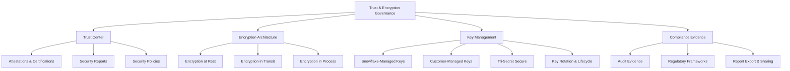
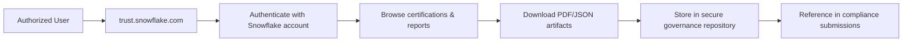
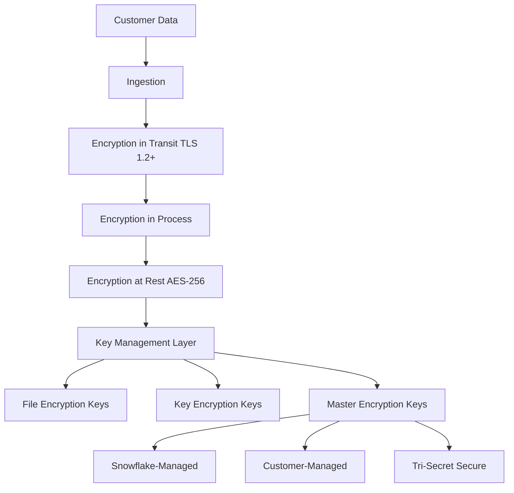
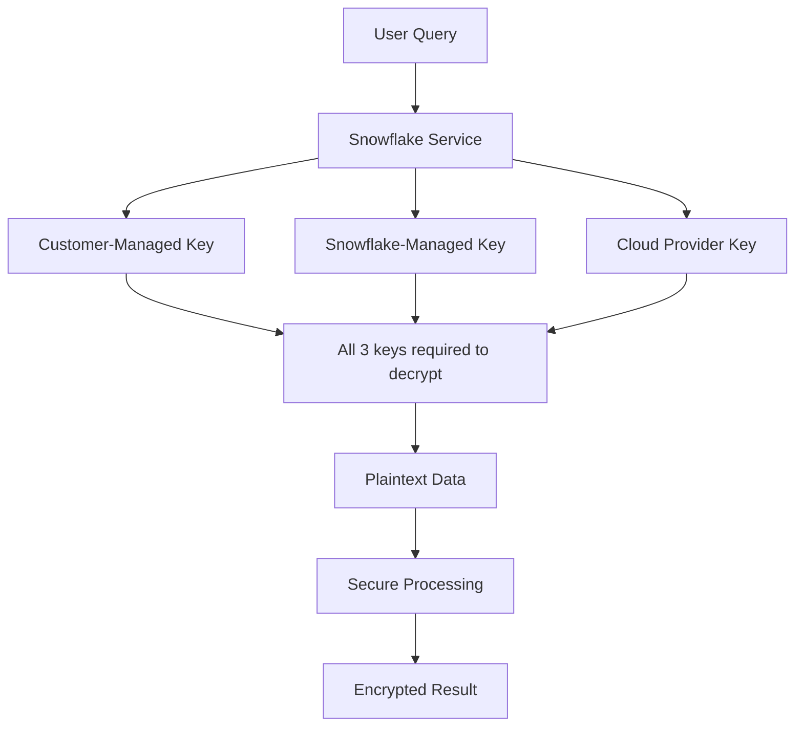
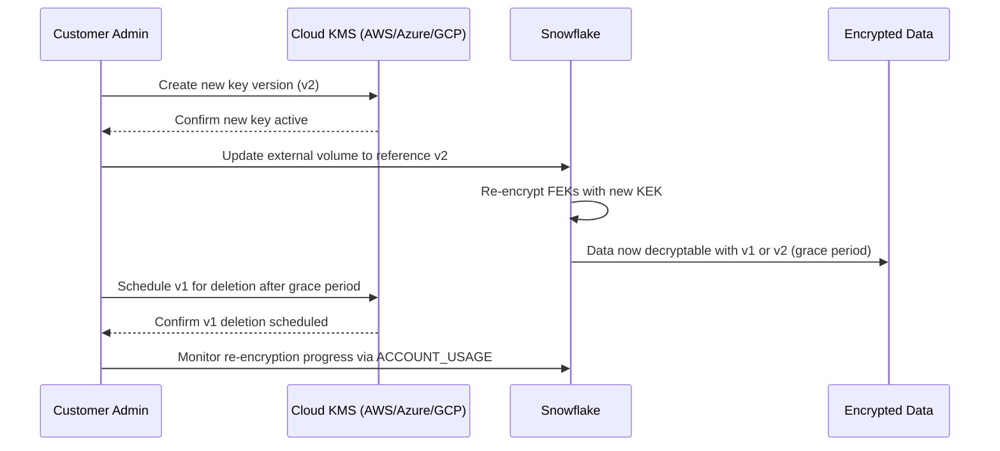
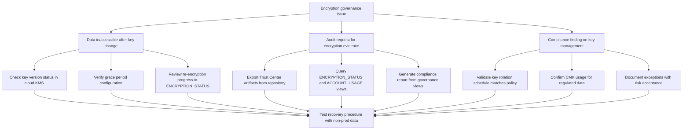
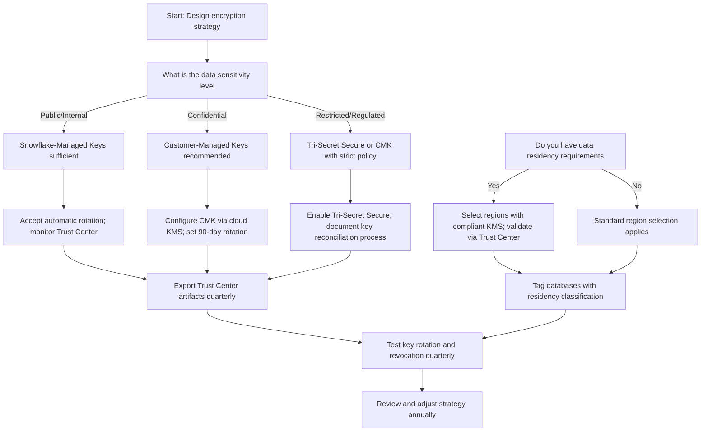

# Trust Center and Encryption Management in Snowflake Governance



## Core Governance Principles

| Principle | What It Means | Why It Matters |
|-----------|--------------|----------------|
| Trust is verified, not assumed | Use Trust Center artifacts to validate Snowflake's security posture | Enables informed risk decisions and compliance evidence |
| Encryption is layered | Data protected at rest, in transit, and in process | Defense in depth reduces single-point failure risk |
| Key ownership determines control | Who manages keys determines who can access plaintext | Critical for regulatory compliance and data sovereignty |
| Rotation is mandatory, not optional | Keys must rotate per policy to limit exposure window | Reduces blast radius of potential key compromise |
| Evidence must be exportable | Compliance requires auditable, shareable artifacts | Enables third-party audits and regulatory submissions |


## Snowflake Trust Center: Governance & Assurance

### What Is the Trust Center

| Component | Description | Governance Use Case |
|-----------|-------------|-------------------|
| Security certifications | SOC 2, ISO 27001, PCI-DSS, HIPAA, FedRAMP artifacts | Provide evidence to auditors and regulators |
| Compliance reports | Third-party audit reports, penetration test summaries | Support internal risk assessments and due diligence |
| Security policies | Snowflake's internal security controls documentation | Validate alignment with organizational security standards |
| Subprocessor list | Third parties that process customer data | Assess supply chain risk and data flow boundaries |
| Incident history | Historical security incident disclosures | Evaluate Snowflake's transparency and response practices |
| Data residency map | Regions and availability zones where data can reside | Verify compliance with data sovereignty requirements |

### Accessing Trust Center Artifacts



| Artifact Type | Format | Typical Audience | Retention Guidance |
|--------------|--------|-----------------|-------------------|
| SOC 2 Type II report | PDF (under NDA) | Internal audit, external auditors | Retain for 7 years or per regulatory requirement |
| ISO 27001 certificate | PDF (public) | Procurement, risk management | Retain current + 2 prior versions |
| PCI-DSS AOC | PDF (under NDA) | Payment card compliance teams | Retain per PCI Council guidance |
| Penetration test summary | PDF (redacted) | Security architects, CISO office | Retain for 3 years |
| Subprocessor list | JSON/CSV (public) | Legal, privacy officers | Track changes quarterly |
| Incident disclosures | Web page (public) | All stakeholders | Archive historically for trend analysis |

### Integrating Trust Center into Governance Workflows

```sql
-- Example: Track Trust Center artifact versions in governance registry
CREATE OR REPLACE TABLE governance.trust_artifacts (
  artifact_name STRING NOT NULL,
  artifact_type STRING NOT NULL,  -- CERTIFICATION, REPORT, POLICY
  version STRING,
  effective_date DATE,
  expiration_date DATE,
  download_url STRING,
  last_validated_date TIMESTAMP_LTZ,
  validated_by STRING,
  compliance_frameworks ARRAY,  -- ['SOC2', 'ISO27001', 'HIPAA']
  notes STRING,
  CONSTRAINT pk_artifact PRIMARY KEY (artifact_name, version)
);

-- Register a new SOC 2 report
INSERT INTO governance.trust_artifacts VALUES (
  'SOC 2 Type II Report',
  'REPORT',
  '2024-Q1',
  '2024-03-31',
  '2025-03-31',
  'https://trust.snowflake.com/reports/soc2-2024-q1.pdf',
  CURRENT_TIMESTAMP(),
  CURRENT_USER(),
  ['SOC2', 'ISO27001'],
  'Validated controls for logical access, change management, and incident response'
);

-- Alert when artifacts near expiration
CREATE OR REPLACE ALERT governance.trust_artifact_expiring
  WAREHOUSE = governance_wh
  SCHEDULE = 'USING CRON 0 9 * * 1'  -- Weekly on Monday
  CONDITION = (
    SELECT COUNT(*)
    FROM governance.trust_artifacts
    WHERE expiration_date BETWEEN CURRENT_DATE() AND DATEADD(day, 30, CURRENT_DATE())
      AND status = 'ACTIVE'
  ) > 0
  ACTION = (
    SYSTEM$SEND_EMAIL(
      'compliance-team@company.com',
      'Alert: Trust Center artifacts expiring soon',
      'Review and renew: ' || 
      (SELECT LISTAGG(artifact_name || ' (' || version || ')', ', ')
       FROM governance.trust_artifacts
       WHERE expiration_date BETWEEN CURRENT_DATE() AND DATEADD(day, 30, CURRENT_DATE()))
    )
  );
```


## Encryption Architecture in Snowflake

### Encryption Layers Overview



| Encryption Layer | Technology | Governance Control Point |
|-----------------|------------|-------------------------|
| In transit | TLS 1.2+ with strong ciphers | Enforce minimum TLS version via client config |
| At rest | AES-256 encryption per micro-partition | Choose key management model (SF-managed vs CMK) |
| In process | Memory encryption, secure enclaves (region-dependent) | Select regions with enhanced processing protections |
| Key hierarchy | FEK → KEK → MEK → Root | Define key rotation policy and ownership model |

### Encryption at Rest: Technical Details

```sql
-- Verify encryption status for your account
-- Note: Encryption is always enabled; this confirms configuration
SHOW PARAMETERS LIKE 'encryption%' IN ACCOUNT;

-- Query storage encryption metadata (limited visibility by design)
SELECT
  database_name,
  schema_name,
  table_name,
  bytes,
  -- All Snowflake tables are encrypted at rest by default
  'AES-256' as encryption_algorithm,
  CURRENT_TIMESTAMP() as verification_time
FROM SNOWFLAKE.ACCOUNT_USAGE.TABLE_STORAGE_METRICS
WHERE deleted_on IS NULL
LIMIT 100;
```

| Data Type | Encryption Scope | Key Scope |
|-----------|-----------------|-----------|
| Table data (micro-partitions) | Per micro-partition | Unique FEK per micro-partition |
| Internal stages | Per file | Unique FEK per file |
| Query results cache | Per result set | Unique FEK per cache entry |
| Time Travel & Fail-Safe | Same as source data | Inherits source data key hierarchy |
| Backup & disaster recovery | Same as source data | Inherits source data key hierarchy |


## Key Management Models

### Model Comparison: Governance Implications

| Model | Key Ownership | Rotation Control | Compliance Fit | Operational Complexity |
|-------|--------------|-----------------|---------------|----------------------|
| Snowflake-Managed Keys | Snowflake | Snowflake (automatic) | Standard compliance (SOC 2, ISO) | Low |
| Customer-Managed Keys (CMK) | Customer via cloud KMS | Customer-defined schedule | Enhanced compliance (HIPAA, PCI, GDPR) | Medium |
| Tri-Secret Secure | Customer + Snowflake + Cloud Provider | Customer-defined with multi-party approval | Highest assurance (FedRAMP, financial) | High |
| Bring Your Own Key (BYOK) | Customer via external HSM | Customer-controlled | Sovereign data, strict key sovereignty | Very High |

### Customer-Managed Keys (CMK) Configuration

```sql
-- Prerequisite: Create cloud KMS key (AWS KMS, Azure Key Vault, GCP KMS)
-- Then configure Snowflake security integration

-- AWS KMS example
CREATE OR REPLACE SECURITY INTEGRATION aws_kms_integration
  TYPE = EXTERNAL_OAUTH
  ENABLED = TRUE
  EXTERNAL_OAUTH_TYPE = AWS_NACL
  EXTERNAL_OAUTH_AWS_ROLE_ARN = 'arn:aws:iam::123456789012:role/snowflake-kms-role'
  EXTERNAL_OAUTH_ISSUER = 'https://sts.amazonaws.com';

-- Create customer-managed key in Snowflake
CREATE OR REPLACE EXTERNAL VOLUME cmk_volume
  STORAGE_LOCATIONS = (
    (
      NAME = 'my-kms-key',
      STORAGE_PROVIDER = 'S3',
      STORAGE_BASE_URL = 's3://my-bucket/snowflake-cmk/',
      STORAGE_AWS_ROLE_ARN = 'arn:aws:iam::123456789012:role/snowflake-kms-role',
      STORAGE_AWS_EXTERNAL_ID = 'snowflake-external-id',
      ENCRYPTION = (
        TYPE = 'AWS_SSE_KMS',
        KMS_KEY_ID = 'arn:aws:kms:us-east-1:123456789012:key/12345678-1234-1234-1234-123456789012'
      )
    )
  );

-- Apply CMK to a database (requires Enterprise+ edition)
ALTER DATABASE sensitive_data SET EXTERNAL_VOLUME = cmk_volume;
```

### Tri-Secret Secure Architecture



| Component | Role in Tri-Secret Secure | Governance Control |
|-----------|--------------------------|-------------------|
| Customer-Managed Key | First factor of decryption | Customer controls creation, rotation, revocation |
| Snowflake-Managed Key | Second factor of decryption | Snowflake manages per security policy |
| Cloud Provider Key | Third factor of decryption | Cloud provider manages per regional compliance |
| Key reconciliation | All 3 keys required for decryption | No single party can access plaintext alone |
| Key revocation | Revoking any key renders data inaccessible | Customer can unilaterally revoke access |

```sql
-- Enable Tri-Secret Secure for a database (Business Critical edition required)
-- This is typically configured via Snowflake UI or API, not direct SQL
-- Example conceptual flow:

-- 1. Create external volume with customer KMS reference
CREATE OR REPLACE EXTERNAL VOLUME tri_sec_volume
  STORAGE_LOCATIONS = (
    (
      NAME = 'tri-sec-key',
      STORAGE_PROVIDER = 'S3',
      STORAGE_BASE_URL = 's3://my-secure-bucket/tri-sec/',
      ENCRYPTION = (
        TYPE = 'TRI_SECRET_SECURE',
        KMS_KEY_ID = 'arn:aws:kms:us-east-1:123456789012:key/xxx'
      )
    )
  );

-- 2. Apply to sensitive database
ALTER DATABASE highly_sensitive_data 
  SET EXTERNAL_VOLUME = tri_sec_volume,
      DATA_RETENTION_TIME_IN_DAYS = 90;  -- Max retention for compliance

-- 3. Verify configuration
SHOW DATABASES LIKE 'highly_sensitive_data';
-- Check ENCRYPTION column shows TRI_SECRET_SECURE
```


## Key Rotation & Lifecycle Management

### Rotation Policies by Model

| Key Model | Default Rotation | Customer-Configurable | Governance Recommendation |
|-----------|-----------------|----------------------|-------------------------|
| Snowflake-Managed | Automatic, ~90 days | No | Accept for standard workloads |
| Customer-Managed (CMK) | Per cloud KMS policy | Yes, via cloud console | Set 90-day rotation for compliance |
| Tri-Secret Secure | Customer-defined for CMK component | Yes, for customer key portion | Align with internal key policy, document exceptions |
| BYOK/HSM | Per HSM policy | Fully customer-controlled | Document rotation procedure in runbook |

### CMK Rotation Workflow



```sql
-- Monitor CMK re-encryption progress
SELECT
  database_name,
  encryption_status,
  reencryption_progress_pct,
  last_reencryption_time
FROM SNOWFLAKE.ACCOUNT_USAGE.ENCRYPTION_STATUS
WHERE database_name = 'sensitive_data'
ORDER BY last_reencryption_time DESC;

-- Alert if re-encryption stalls
CREATE OR REPLACE ALERT governance.cmk_reencryption_stalled
  WAREHOUSE = governance_wh
  SCHEDULE = 'USING CRON 0 8 * * 1-5'
  CONDITION = (
    SELECT COUNT(*)
    FROM SNOWFLAKE.ACCOUNT_USAGE.ENCRYPTION_STATUS
    WHERE encryption_status = 'REENCRYPTING'
      AND reencryption_progress_pct < 100
      AND last_reencryption_time < DATEADD(hour, -24, CURRENT_TIMESTAMP())
  ) > 0
  ACTION = (
    SYSTEM$SEND_EMAIL(
      'security-team@company.com',
      'Alert: CMK re-encryption stalled',
      'Review ENCRYPTION_STATUS view for databases with progress < 100%'
    )
  );
```

### Key Revocation & Emergency Access

| Scenario | Revocation Method | Impact | Mitigation |
|----------|------------------|--------|-----------|
| Suspected key compromise | Disable key in cloud KMS | Immediate data inaccessibility | Maintain backup key version with restricted access |
| Employee departure | Revoke IAM role permissions | Prevents future key operations | Use least-privilege IAM roles, audit key access logs |
| Compliance requirement | Rotate key per policy | Temporary performance impact during re-encryption | Schedule rotations during maintenance windows |
| Account termination | Delete external volume reference | Data becomes permanently inaccessible | Export critical data before key deletion; document retention policy |

```sql
-- Audit key access via cloud provider logs (example: AWS CloudTrail)
-- This query would run against CloudTrail logs, not Snowflake
-- Conceptual Snowflake-side validation:

SELECT
  event_name,
  event_time,
  user_identity,
  request_parameters
FROM external_table.aws_cloudtrail_logs
WHERE event_source = 'kms.amazonaws.com'
  AND event_name IN ('Decrypt', 'GenerateDataKey', 'DisableKey')
  AND request_parameters LIKE '%snowflake%'
  AND event_time > DATEADD(day, -7, CURRENT_TIMESTAMP())
ORDER BY event_time DESC;
```


## Compliance Frameworks & Audit Evidence

### Mapping Encryption to Regulatory Requirements

| Framework | Encryption Requirement | Snowflake Capability | Evidence Source |
|-----------|----------------------|---------------------|----------------|
| GDPR | Pseudonymization, encryption of personal data | AES-256 at rest, CMK option, Tri-Secret Secure | Trust Center reports, ENCRYPTION_STATUS view |
| HIPAA | Encryption of ePHI at rest and in transit | TLS 1.2+, AES-256, BA agreement, audit logs | BAA, LOGIN_HISTORY, ACCESS_HISTORY |
| PCI-DSS | Strong cryptography for cardholder data | CMK, key rotation, access controls | PCI AOC, KEY_USAGE_HISTORY (via cloud KMS) |
| FedRAMP | FIPS 140-2 validated cryptography, key management | FIPS endpoints, CMK, Tri-Secret Secure | FedRAMP authorization package, key policy docs |
| SOC 2 | Logical access controls, encryption | RBAC, encryption at rest/in transit, audit logs | SOC 2 report, ACCOUNT_USAGE views |

### Exporting Compliance Evidence

```sql
-- Export encryption configuration for audit
COPY INTO @compliance_exports/encryption_config/
FROM (
  SELECT
    'Account Level' as scope,
    parameter_name,
    parameter_value,
    CURRENT_TIMESTAMP() as export_time
  FROM TABLE(RESULT_SCAN(LAST_QUERY_ID()))
  WHERE parameter_name LIKE '%encryption%'
)
FILE_FORMAT = (TYPE = JSON);

-- Export key management metadata (requires appropriate privileges)
COPY INTO @compliance_exports/key_metadata/
FROM (
  SELECT
    database_name,
    schema_name,
    encryption_status,
    external_volume_name,
    last_reencryption_time
  FROM SNOWFLAKE.ACCOUNT_USAGE.ENCRYPTION_STATUS
  WHERE deleted_on IS NULL
)
FILE_FORMAT = (TYPE = PARQUET COMPRESSION = SNAPPY);

-- Export access logs for encryption-related operations
COPY INTO @compliance_exports/encryption_audit/
FROM (
  SELECT
    event_timestamp,
    user_name,
    query_text,
    object_name,
    query_tag
  FROM SNOWFLAKE.ACCOUNT_USAGE.QUERY_HISTORY
  WHERE query_text ILIKE '%ENCRYPTION%'
     OR query_text ILIKE '%EXTERNAL_VOLUME%'
     OR query_text ILIKE '%KMS%'
    AND start_time > DATEADD(month, -3, CURRENT_TIMESTAMP())
)
FILE_FORMAT = (TYPE = JSON);
```

### Automated Compliance Reporting

```sql
-- Create compliance dashboard view
CREATE OR REPLACE VIEW governance.compliance_encryption_summary AS
SELECT
  'Encryption at Rest' as control_area,
  'AES-256' as implementation,
  COUNT(DISTINCT database_name) as covered_databases,
  COUNT(DISTINCT CASE WHEN encryption_status = 'ENCRYPTED' THEN database_name END) as compliant_databases,
  ROUND(100.0 * COUNT(DISTINCT CASE WHEN encryption_status = 'ENCRYPTED' THEN database_name END) / 
        NULLIF(COUNT(DISTINCT database_name), 0), 2) as compliance_pct,
  CURRENT_TIMESTAMP() as report_time
FROM SNOWFLAKE.ACCOUNT_USAGE.ENCRYPTION_STATUS
WHERE deleted_on IS NULL

UNION ALL

SELECT
  'Key Management' as control_area,
  CASE 
    WHEN COUNT(DISTINCT external_volume_name) > 0 THEN 'Customer-Managed Keys'
    ELSE 'Snowflake-Managed Keys'
  END as implementation,
  COUNT(DISTINCT database_name) as covered_databases,
  COUNT(DISTINCT CASE WHEN external_volume_name IS NOT NULL THEN database_name END) as cmk_databases,
  ROUND(100.0 * COUNT(DISTINCT CASE WHEN external_volume_name IS NOT NULL THEN database_name END) / 
        NULLIF(COUNT(DISTINCT database_name), 0), 2) as cmk_adoption_pct,
  CURRENT_TIMESTAMP() as report_time
FROM SNOWFLAKE.ACCOUNT_USAGE.ENCRYPTION_STATUS
WHERE deleted_on IS NULL;

-- Schedule monthly compliance report export
CREATE OR REPLACE TASK governance.monthly_compliance_report
  WAREHOUSE = governance_wh
  SCHEDULE = 'USING CRON 0 9 1 * *'  -- First of month at 9 AM
AS
  COPY INTO @compliance_exports/monthly_reports/
  FROM governance.compliance_encryption_summary
  FILE_FORMAT = (TYPE = CSV HEADER = TRUE);
```


## Best Practices & Common Pitfalls

### Encryption Governance Best Practices

| Practice | Implementation | Benefit |
|----------|---------------|---------|
| Document key ownership model | Maintain registry of which databases use SF-managed vs CMK vs Tri-Secret | Clear accountability during audits and incidents |
| Align rotation with policy | Set CMK rotation to match internal key policy (e.g., 90 days) | Consistent compliance posture across systems |
| Test key revocation | Quarterly drill: disable test CMK, verify data inaccessibility, restore | Proves emergency procedures work before real incident |
| Monitor re-encryption progress | Alert if CMK rotation stalls > 24 hours | Prevents extended exposure windows during key changes |
| Export Trust Center artifacts | Automate download of SOC 2, ISO certs to secure repository | Ensures evidence is available for audits without manual effort |
| Tag sensitive databases | Apply `encryption_level = cmk` or `tri_secret` tags | Enables policy enforcement and reporting by classification |

```sql
-- Example: Tag databases by encryption model for governance reporting
ALTER DATABASE financial_data SET TAG encryption_model = 'tri_secret';
ALTER DATABASE analytics SET TAG encryption_model = 'snowflake_managed';
ALTER DATABASE customer_pii SET TAG encryption_model = 'customer_managed';

-- Query encryption coverage by classification
SELECT
  tr.tag_value as data_classification,
  COUNT(DISTINCT es.database_name) as total_databases,
  COUNT(DISTINCT CASE WHEN es.encryption_status = 'ENCRYPTED' THEN es.database_name END) as encrypted_databases,
  COUNT(DISTINCT CASE WHEN es.external_volume_name IS NOT NULL THEN es.database_name END) as cmk_databases
FROM SNOWFLAKE.ACCOUNT_USAGE.ENCRYPTION_STATUS es
LEFT JOIN SNOWFLAKE.ACCOUNT_USAGE.TAG_REFERENCES tr
  ON es.database_name = tr.object_name
  AND tr.tag_name = 'data_classification'
WHERE es.deleted_on IS NULL
GROUP BY tr.tag_value
ORDER BY tr.tag_value;
```

### Common Pitfalls & Mitigations

| Pitfall | What Happens | How To Fix |
|---------|--------------|------------|
| Assuming encryption = compliance | Encryption is necessary but not sufficient for GDPR/HIPAA | Combine encryption with access controls, audit logging, and policies |
| Not testing CMK rotation | Re-encryption fails during production rotation window | Test rotation in non-prod first; monitor progress views |
| Revoking CMK without backup | Data becomes permanently inaccessible | Maintain grace period with old key version; document recovery procedure |
| Ignoring regional key requirements | Data stored in region with non-compliant key management | Use region-specific CMK configurations; validate via Trust Center |
| Overusing Tri-Secret Secure | Unnecessary complexity and cost for non-sensitive data | Reserve Tri-Secret for highest-sensitivity workloads; use CMK for others |
| Not exporting Trust Center artifacts | Manual scramble during audit requests | Automate artifact download and storage in governance repository |
| Forgetting that network policies don't replicate | DR account has different network access rules | Pre-stage network policies in secondary accounts; test failover access |




## Decision Framework: Encryption & Trust Strategy



| Requirement | Recommended Approach | Validation Method |
|------------|---------------------|------------------|
| Standard compliance (SOC 2, ISO) | Snowflake-Managed Keys | Trust Center reports; ACCOUNT_USAGE views |
| Enhanced compliance (HIPAA, PCI) | Customer-Managed Keys | CMK configuration audit; key rotation logs |
| Highest assurance (FedRAMP, financial) | Tri-Secret Secure | Key reconciliation test; multi-party approval workflow |
| Data sovereignty | Region-specific CMK + residency tags | Trust Center data map; ENCRYPTION_STATUS by region |
| Emergency revocation capability | CMK with documented grace period | Quarterly revocation drill; recovery runbook |
| Audit evidence automation | Automated Trust Center export + governance views | Scheduled compliance report generation |


## Key Principles to Remember

- Trust is earned through evidence. Use the Trust Center to validate, not assume, Snowflake's security posture.
- Encryption is necessary but not sufficient. Combine with access controls, auditing, and policies for full compliance.
- Key ownership determines control. Choose CMK or Tri-Secret when regulatory or business requirements demand customer control.
- Rotation is risk management. Regular key rotation limits exposure; test the process before you need it.
- Evidence must be accessible. Automate export of Trust Center artifacts and governance views for audit readiness.
- Document boundaries. Know where Snowflake's encryption ends and your responsibilities begin.
- Test failover and revocation. Procedures that work in theory often fail in practice without validation.

## Bottom Line

- The Trust Center is your source of truth for Snowflake's security posture. Use it to validate compliance and inform risk decisions.
- Encryption in Snowflake is layered: in transit (TLS), at rest (AES-256), and in process (region-dependent protections).
- Key management models range from Snowflake-managed (simple) to Tri-Secret Secure (maximum control). Choose based on compliance needs, not fear.
- Customer-Managed Keys give you control over rotation and revocation but add operational complexity. Document and test your procedures.
- Compliance evidence must be exportable. Automate the collection of Trust Center artifacts and governance view exports.
- Test key rotation, revocation, and failover quarterly. What works in documentation may fail in execution.
- Governance is continuous. Review your encryption strategy annually as regulations, threats, and business needs evolve.

Think of encryption governance like securing a vault:
- The Trust Center is the independent inspector's report. It verifies the vault meets standards.
- Encryption is the vault door. Strong, but only as good as the key management.
- Key management is who holds the keys. Snowflake-managed is like a bank vault. CMK is like a safety deposit box where you hold one key.
- Tri-Secret Secure is a three-key system. No single party can open it alone.
- Rotation is changing the locks regularly. Necessary, but test the new key before discarding the old.
- Audit evidence is the access log. Who opened the vault, when, and why.

Secure what matters. Verify what you trust. Document what you control. Test what you depend on. That is how encryption and trust work in Snowflake governance.
