# Domain 2.2 Data Governance Features in Snowflake

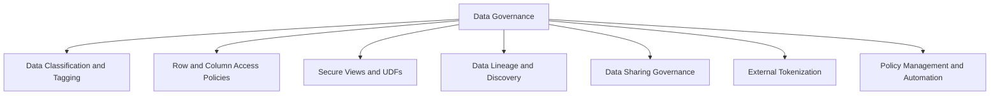

## Core Governance Principles

| Principle | What It Means | Why It Matters |
|-----------|--------------|----------------|
| Data is an asset | Treat data like any valuable resource with ownership and stewardship | Enables accountability and clear decision rights |
| Classify before you protect | You cannot secure what you have not identified | Tags drive policy enforcement and audit reporting |
| Policy as code | Define governance rules in version controlled SQL | Enables review testing and reproducible deployments |
| Least privilege by default | No access unless explicitly granted and justified | Reduces risk of accidental or malicious data exposure |
| Audit everything | Log who accessed what when and why | Enables compliance forensics and continuous improvement |
| Automate enforcement | Manual reviews do not scale. Let the system enforce rules | Reduces human error and ensures consistent application |

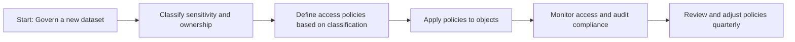

## Data Classification and Tagging

### What Tags Do

| Concept | Simple Explanation | Example |
|---------|------------------|---------|
| Tag definition | A named label with allowed values you create | sensitivity: public internal confidential restricted |
| Tag assignment | Applying a tag to a database schema table column or role | ALTER TABLE customers SET TAG sensitivity = restricted |
| Tag inheritance | Tags on parent objects do not automatically apply to children | Must explicitly tag each level you want to track |
| Tag reference | Querying which objects have which tags via ACCOUNT_USAGE | Find all columns tagged sensitivity = restricted |
| Policy enforcement | Using tag values to drive masking row access or audit rules | Apply masking policy where tag sensitivity != public |

```sql
-- Create tag definition
CREATE OR REPLACE TAG sensitivity
  COMMENT = 'Data classification for access control and audit';

CREATE OR REPLACE TAG data_owner
  COMMENT = 'Business owner responsible for this data';

CREATE OR REPLACE TAG retention_policy
  COMMENT = 'How long to retain this data before archival';

-- Apply tags to objects
ALTER TABLE customers MODIFY COLUMN ssn SET TAG sensitivity = 'restricted';
ALTER TABLE customers SET TAG data_owner = 'finance_team';
ALTER TABLE customers SET TAG retention_policy = '7_years';

-- Query tagged objects for audit or policy enforcement
SELECT
  object_name,
  object_domain,
  tag_name,
  tag_value
FROM SNOWFLAKE.ACCOUNT_USAGE.TAG_REFERENCES
WHERE tag_name = 'sensitivity'
  AND tag_value = 'restricted';
```

### Tag Governance Patterns

| Pattern | Implementation | Use Case |
|---------|---------------|----------|
| Sensitivity classification | Tag values: public internal confidential restricted | Drive masking policies and audit focus |
| Data ownership | Tag values: team_name or individual owner | Route access requests and accountability |
| Retention scheduling | Tag values: 30d 1y 7y permanent | Automate archival or deletion workflows |
| Compliance scope | Tag values: hipaa pci gdpr soc2 | Apply additional controls for regulated data |
| Cost attribution | Tag values: cost_center project_id environment | Attribute storage and compute spend |

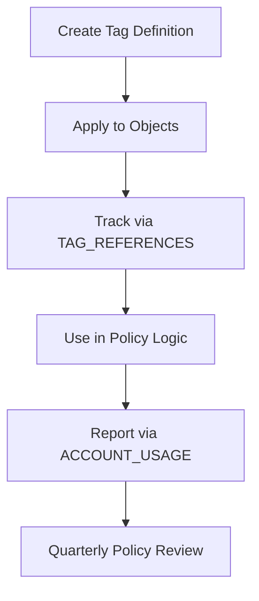

### Best Practices for Tagging

- Define tags centrally. Do not let each team invent their own classification scheme.
- Use controlled vocabularies. Tag values should be predefined not free text.
- Tag at the most granular level needed. Column level for sensitivity. Table level for ownership.
- Document tag meanings. Add COMMENT to tag definitions so future users understand intent.
- Automate tag application. Use Terraform or migration scripts to apply tags consistently.
- Review tag assignments quarterly. Tags drift as schemas evolve. Catch misclassifications early.

```sql
-- Example: Well documented tag definition
CREATE OR REPLACE TAG sensitivity
  COMMENT = 'Data classification per company policy v2.1. Values: public internal confidential restricted. Owner: security_team. Review: quarterly.';

-- Example: Automated tag application via migration script
-- File: 003_apply_sensitivity_tags.sql
ALTER TABLE raw.pii_data MODIFY COLUMN email SET TAG sensitivity = 'confidential';
ALTER TABLE raw.pii_data MODIFY COLUMN phone SET TAG sensitivity = 'confidential';
ALTER TABLE raw.pii_data MODIFY COLUMN customer_id SET TAG sensitivity = 'internal';
```

## Row Access Policies

### What Row Access Policies Do

| Concept | Simple Explanation | Example |
|---------|------------------|---------|
| Row access policy | A function that returns TRUE or FALSE to control which rows a user can see | Users in sales role see only their region rows |
| Policy evaluation | Happens at query time based on caller role context | Same query returns different rows for different roles |
| Policy binding | Attach policy to a table column that determines row filtering | Bind regional_access policy to region column |
| Policy composition | Combine multiple conditions with AND OR logic | Role based AND time based AND attribute based |

```sql
-- Create row access policy based on role
CREATE OR REPLACE ROW ACCESS POLICY regional_access AS (region STRING) RETURNS BOOLEAN ->
  CASE
    WHEN CURRENT_ROLE() IN ('ADMIN_ROLE', 'EXEC_ROLE') THEN TRUE
    WHEN CURRENT_ROLE() = 'SALES_ROLE' THEN region = CURRENT_USER_REGION()
    WHEN CURRENT_ROLE() = 'PARTNER_ROLE' THEN region IN ('North', 'South')
    ELSE FALSE
  END;

-- Apply policy to table
ALTER TABLE sales ADD ROW ACCESS POLICY regional_access ON (region);

-- Policy evaluates at query time
-- Admin sees all rows sales rep sees only their region
SELECT * FROM sales;  -- Returns different results based on caller role
```

### Row Access Policy Patterns

| Pattern | Policy Logic | Use Case |
|---------|-------------|----------|
| Role based filtering | CURRENT_ROLE() IN allowed_roles | Different teams see different data subsets |
| Attribute based | Join to user metadata table for department region | Filter by user attributes stored centrally |
| Time based | CURRENT_DATE() BETWEEN valid_start AND valid_end | Restrict access to recent data only |
| Combination | Role AND attribute AND time conditions | Complex access rules for regulated data |
| Dynamic context | Use CURRENT_USER() SESSION_CONTEXT() | Personalize access based on session state |

```sql
-- Example: Attribute based policy using user metadata
CREATE OR REPLACE ROW ACCESS POLICY dept_access AS (dept_id NUMBER) RETURNS BOOLEAN ->
  EXISTS (
    SELECT 1
    FROM security.user_departments ud
    WHERE ud.user_name = CURRENT_USER()
      AND ud.dept_id = dept_id
      AND ud.active = TRUE
  );

-- Example: Time based policy for recent data only
CREATE OR REPLACE ROW ACCESS POLICY recent_data_only AS (created_date DATE) RETURNS BOOLEAN ->
  created_date >= DATEADD(month, -12, CURRENT_DATE());

-- Example: Combined policy with multiple conditions
CREATE OR REPLACE ROW ACCESS POLICY complex_access AS (region STRING created_date DATE) RETURNS BOOLEAN ->
  CURRENT_ROLE() IN ('ADMIN_ROLE')
  OR (CURRENT_ROLE() = 'ANALYST_ROLE' AND region IN ('North', 'South') AND created_date >= DATEADD(year, -2, CURRENT_DATE()));
```

### Best Practices for Row Access Policies

- Keep policy logic simple. Complex CASE statements are hard to audit and debug.
- Test with representative roles. Verify policy behavior for each role before deploying.
- Document policy purpose and owner. Add COMMENT explaining why the policy exists.
- Monitor policy evaluation performance. Complex policies can slow queries.
- Review policies quarterly. Business rules change. Policies should too.
- Use secure views for additional abstraction when policy logic is complex.

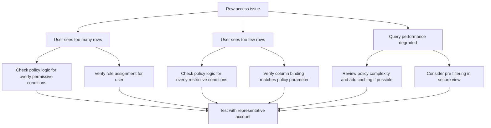

## Column Masking Policies

### What Masking Policies Do

| Concept | Simple Explanation | Example |
|---------|------------------|---------|
| Masking policy | A function that transforms column values based on caller role | Show last 4 digits of SSN for non HR roles |
| Policy evaluation | Happens at query time before results return to user | Same column returns different values for different roles |
| Policy binding | Attach policy to a column of compatible data type | Bind email_mask policy to VARCHAR columns |
| Policy reuse | One policy can be bound to many columns across tables | Consistent masking logic across all email columns |

```sql
-- Create masking policy for email
CREATE OR REPLACE MASKING POLICY email_mask AS (val STRING) RETURNS STRING ->
  CASE
    WHEN CURRENT_ROLE() IN ('HR_ROLE', 'ADMIN_ROLE') THEN val
    WHEN CURRENT_ROLE() = 'SUPPORT_ROLE' THEN REGEXP_REPLACE(val, '.+@', '***@')
    ELSE '***@***.***'
  END;

-- Apply policy to multiple columns
ALTER TABLE customers MODIFY COLUMN email SET MASKING POLICY email_mask;
ALTER TABLE users MODIFY COLUMN contact_email SET MASKING POLICY email_mask;

-- Policy evaluates at query time
-- HR sees full email support sees partial others see fully masked
SELECT email FROM customers;  -- Returns different values based on caller role
```

### Masking Policy Patterns

| Pattern | Policy Logic | Use Case |
|---------|-------------|----------|
| Full hide | Return '***' for unauthorized roles | Highly sensitive data like SSN health info |
| Partial mask | Show last 4 digits of phone or account | Data needed for identification but not full exposure |
| Hash or token | Return hash of value for analytics | Enable grouping without exposing raw values |
| Conditional | Different mask levels for different roles | Tiered access model with multiple clearance levels |
| Format preserving | Keep data type and format while masking | Applications expect specific formats like phone numbers |

```sql
-- Example: Partial mask for phone numbers
CREATE OR REPLACE MASKING POLICY phone_mask AS (val STRING) RETURNS STRING ->
  CASE
    WHEN CURRENT_ROLE() IN ('HR_ROLE', 'ADMIN_ROLE') THEN val
    ELSE REGEXP_REPLACE(val, '(\\d{3}-\\d{3}-)\\d{4}', '\\1****')
  END;

-- Example: Hash for analytics without exposing raw values
CREATE OR REPLACE MASKING POLICY email_hash AS (val STRING) RETURNS STRING ->
  CASE
    WHEN CURRENT_ROLE() IN ('ANALYTICS_ROLE') THEN SHA1(val)
    ELSE '***'
  END;

-- Example: Format preserving mask for credit cards
CREATE OR REPLACE MASKING POLICY cc_mask AS (val STRING) RETURNS STRING ->
  CASE
    WHEN CURRENT_ROLE() IN ('FINANCE_ROLE', 'ADMIN_ROLE') THEN val
    ELSE REGEXP_REPLACE(val, '(\\d{4}-\\d{4}-\\d{4}-)\\d{4}', '\\1****')
  END;
```

### Best Practices for Masking Policies

- Design policies for reuse. One policy per data type pattern not per column.
- Test masking with all relevant roles. Verify output matches expectations.
- Document policy behavior. Add COMMENT explaining what each role sees.
- Monitor policy performance. Complex regex or hashing can slow queries.
- Review masking rules quarterly. Business needs and regulations change.
- Combine with row access policies for defense in depth.

```sql
-- Example: Well documented masking policy
CREATE OR REPLACE MASKING POLICY ssn_mask
  COMMENT = 'Mask SSN for non HR roles. HR and ADMIN see full value. SUPPORT sees last 4 digits. Others see ***. Owner: security_team. Review: quarterly.'
  AS (val STRING) RETURNS STRING ->
  CASE
    WHEN CURRENT_ROLE() IN ('HR_ROLE', 'ADMIN_ROLE') THEN val
    WHEN CURRENT_ROLE() = 'SUPPORT_ROLE' THEN '***-**-' || RIGHT(val, 4)
    ELSE '***-**-****'
  END;
```

## Secure Views and Secure UDFs

### What Secure Objects Do

| Concept | Simple Explanation | Example |
|---------|------------------|---------|
| Secure view | A view whose definition is hidden from users without ownership | Share aggregated results without exposing source logic |
| Secure UDF | A function whose code is hidden from users without ownership | Share computation logic without exposing proprietary algorithms |
| Definition hiding | Users can query the object but cannot see how it is built | Protects business logic and sensitive join conditions |
| Access control | Grant SELECT on secure view not underlying tables | Users cannot bypass the view to access raw data |

```sql
-- Create secure view that hides underlying logic
CREATE SECURE VIEW analytics.customer_summary AS
SELECT
  customer_id,
  region,
  SUM(order_total) as lifetime_value,
  COUNT(order_id) as order_count
FROM raw.orders
GROUP BY customer_id, region;

-- Grant access to the view not the base table
GRANT SELECT ON VIEW analytics.customer_summary TO ROLE ANALYST_ROLE;

-- Users can query the view but cannot:
-- 1. See the underlying raw.orders table structure
-- 2. See the aggregation logic in the view definition
-- 3. Bypass the view to access raw order details
```

### Secure Object Patterns

| Pattern | Implementation | Use Case |
|---------|---------------|----------|
| Aggregation view | Pre aggregate sensitive details in secure view | Users see summaries not individual records |
| Column projection | Expose only selected columns in secure view | Limit data exposure without masking each column |
| Row filtering | Include WHERE clause in secure view for row level security | Enforce access rules at the view layer |
| Logic encapsulation | Hide complex business logic in secure UDF | Protect proprietary algorithms from exposure |
| Data transformation | Apply masking or tokenization in secure view | Centralize transformation logic for consistency |

```sql
-- Example: Secure view with row filtering and aggregation
CREATE SECURE VIEW reporting.regional_sales AS
SELECT
  region,
  DATE_TRUNC('month', order_date) as month,
  SUM(order_total) as total_revenue,
  COUNT(DISTINCT customer_id) as unique_customers
FROM raw.orders
WHERE order_date >= DATEADD(year, -2, CURRENT_DATE)
GROUP BY region, DATE_TRUNC('month', order_date);

-- Example: Secure UDF with hidden logic
CREATE SECURE FUNCTION analytics.calculate_risk_score (
  transaction_amount FLOAT,
  customer_tenure_months INT,
  fraud_flags INT
)
RETURNS FLOAT
LANGUAGE SQL
AS $$
  -- Proprietary risk calculation logic hidden from users
  CASE
    WHEN fraud_flags > 3 THEN 0.95
    WHEN transaction_amount > 10000 AND customer_tenure_months < 6 THEN 0.75
    ELSE transaction_amount / 10000 * 0.1 + customer_tenure_months / 120 * 0.2
  END
$$;
```

### Best Practices for Secure Objects

- Use secure views for external sharing. Prevent consumers from seeing source logic.
- Keep view logic simple. Complex secure views are hard to debug and maintain.
- Document view purpose and output schema. Users need to know what they are querying.
- Test secure view performance. Hidden logic can still impact query planning.
- Review secure object access quarterly. Ensure grants align with current business needs.
- Combine with masking policies for additional protection on sensitive columns.

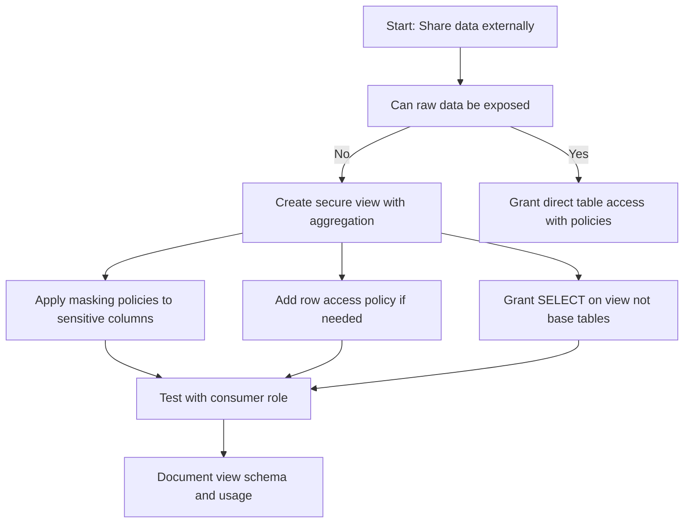

## Data Lineage and Discovery

### Lineage Tracking Capabilities

| Capability | What It Provides | Where To Find It |
|-----------|-----------------|-----------------|
| Object dependencies | Which tables views functions depend on which objects | SNOWFLAKE.ACCOUNT_USAGE.OBJECT_DEPENDENCIES |
| Query history | Who ran what query against which objects | SNOWFLAKE.ACCOUNT_USAGE.QUERY_HISTORY |
| Access history | Which users roles accessed which objects | SNOWFLAKE.ACCOUNT_USAGE.ACCESS_HISTORY |
| Tag references | Which objects have which tags applied | SNOWFLAKE.ACCOUNT_USAGE.TAG_REFERENCES |
| Storage metrics | Size and growth of tables and databases | SNOWFLAKE.ACCOUNT_USAGE.TABLE_STORAGE_METRICS |

```sql
-- Find all tables that depend on a source table
SELECT *
FROM SNOWFLAKE.ACCOUNT_USAGE.OBJECT_DEPENDENCIES
WHERE REFERENCED_OBJECT_NAME = 'raw_events'
  AND REFERENCED_OBJECT_DOMAIN = 'TABLE';

-- Track who accessed sensitive data last week
SELECT
  user_name,
  object_name,
  query_text,
  start_time
FROM SNOWFLAKE.ACCOUNT_USAGE.ACCESS_HISTORY
WHERE object_name IN (
  SELECT object_name
  FROM SNOWFLAKE.ACCOUNT_USAGE.TAG_REFERENCES
  WHERE tag_name = 'sensitivity' AND tag_value = 'restricted'
)
  AND start_time > DATEADD(day, -7, CURRENT_TIMESTAMP);

-- Find unused tagged objects for cleanup
SELECT
  t.object_name,
  t.tag_name,
  t.tag_value,
  MAX(a.start_time) as last_access
FROM SNOWFLAKE.ACCOUNT_USAGE.TAG_REFERENCES t
LEFT JOIN SNOWFLAKE.ACCOUNT_USAGE.ACCESS_HISTORY a
  ON t.object_name = a.object_name
WHERE t.tag_name = 'sensitivity'
GROUP BY t.object_name, t.tag_name, t.tag_value
HAVING MAX(a.start_time) IS NULL
   OR MAX(a.start_time) < DATEADD(month, -6, CURRENT_TIMESTAMP);
```

### Discovery and Catalog Patterns

| Pattern | Implementation | Use Case |
|---------|---------------|----------|
| Tag based search | Query TAG_REFERENCES to find objects by classification | Find all restricted data for audit or policy review |
| Lineage impact analysis | Query OBJECT_DEPENDENCIES to find downstream consumers | Assess impact before changing a source table |
| Access pattern analysis | Query ACCESS_HISTORY to identify hot vs cold data | Optimize storage tiering or archival strategies |
| Ownership reporting | Join TAG_REFERENCES with USERS to find data stewards | Route access requests or policy questions |
| Compliance reporting | Filter ACCESS_HISTORY by compliance tags | Generate audit reports for GDPR HIPAA PCI |

```sql
-- Example: Impact analysis before schema change
-- Find all views and tables that depend on customers.email
SELECT
  dependent_object_name,
  dependent_object_domain,
  referenced_object_name,
  referenced_object_domain
FROM SNOWFLAKE.ACCOUNT_USAGE.OBJECT_DEPENDENCIES
WHERE referenced_object_name = 'customers'
  AND referenced_object_domain = 'TABLE';

-- Example: Compliance report for restricted data access
SELECT
  ah.user_name,
  ah.object_name,
  ah.query_text,
  ah.start_time,
  tr.tag_value as sensitivity_level
FROM SNOWFLAKE.ACCOUNT_USAGE.ACCESS_HISTORY ah
JOIN SNOWFLAKE.ACCOUNT_USAGE.TAG_REFERENCES tr
  ON ah.object_name = tr.object_name
WHERE tr.tag_name = 'sensitivity'
  AND tr.tag_value = 'restricted'
  AND ah.start_time > DATEADD(month, -1, CURRENT_TIMESTAMP)
ORDER BY ah.start_time DESC;
```

### Best Practices for Lineage and Discovery

- Tag objects consistently. Lineage queries rely on tags for classification.
- Query ACCOUNT_USAGE with time filters. These views are large and cost credits to scan.
- Build discovery dashboards. Make lineage and access data visible to data stewards.
- Automate impact analysis. Run dependency checks before deploying schema changes.
- Export lineage data for external catalog tools. Integrate with Collibra Alation or custom solutions.
- Review access patterns quarterly. Identify unused objects for archival or deletion.

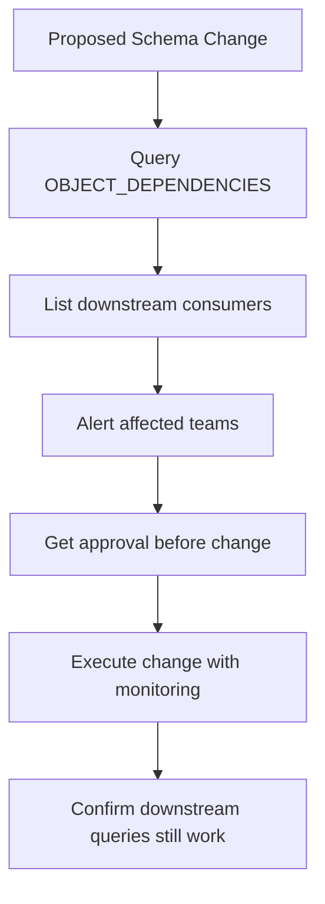

## Data Sharing Governance

### Secure Data Sharing Controls

| Control | What It Does | Use Case |
|---------|-------------|----------|
| Share object | Define which objects to share and with which accounts | Share curated datasets with partners or subsidiaries |
| Row access policies on shared data | Filter rows based on consumer account or role | Share regional subsets with regional partners |
| Masking policies on shared data | Mask sensitive columns for external consumers | Share data while protecting PII or confidential fields |
| Secure views for sharing | Expose aggregated or transformed data not raw tables | Share insights without exposing source logic |
| Reader accounts | Share with accounts that have no Snowflake subscription | Provide access to customers who do not have Snowflake |

```sql
-- Provider: Create share with governance controls
CREATE SHARE partner_analytics_share
  COMMENT = 'Curated analytics data for partner consumption';

-- Apply masking policy to sensitive columns before sharing
ALTER TABLE analytics.customer_metrics MODIFY COLUMN email SET MASKING POLICY email_mask;

-- Apply row access policy for regional filtering
ALTER TABLE analytics.customer_metrics ADD ROW ACCESS POLICY regional_access ON (region);

-- Create secure view for external consumption
CREATE SECURE VIEW shared.partner_summary AS
SELECT
  customer_id,
  region,
  lifetime_value,
  order_count
FROM analytics.customer_metrics
WHERE region IN ('North', 'South');  -- Only share approved regions

-- Grant share access
GRANT USAGE ON DATABASE analytics TO SHARE partner_analytics_share;
GRANT SELECT ON VIEW shared.partner_summary TO SHARE partner_analytics_share;
ALTER SHARE partner_analytics_share ADD ACCOUNTS = partner_org_partner.aws.us-east-1;
```

### Sharing Governance Patterns

| Pattern | Implementation | Use Case |
|---------|---------------|----------|
| Curated share | Share secure views not raw tables | Control exactly what external consumers can see |
| Regional segmentation | Apply row access policies by region | Share data with regional partners without cross region exposure |
| Tiered access | Create multiple shares with different data subsets | Offer basic and premium data products |
| Time bound sharing | Include date filters in shared views | Share only recent data or limit historical access |
| Audit sharing usage | Query ACCESS_HISTORY for shared object access | Monitor how partners use shared data |

```sql
-- Example: Tiered sharing with multiple share objects
-- Basic share: aggregated metrics only
CREATE SHARE partner_basic_share;
GRANT SELECT ON VIEW shared.basic_metrics TO SHARE partner_basic_share;

-- Premium share: detailed metrics with masking
CREATE SHARE partner_premium_share;
GRANT SELECT ON VIEW shared.detailed_metrics TO SHARE partner_premium_share;

-- Example: Audit shared data usage
SELECT
  consumer_account,
  object_name,
  query_text,
  start_time
FROM SNOWFLAKE.ACCOUNT_USAGE.ACCESS_HISTORY
WHERE object_name IN (
  SELECT name
  FROM SNOWFLAKE.ACCOUNT_USAGE.SHARES
  WHERE share_type = 'OUTBOUND'
)
  AND start_time > DATEADD(day, -30, CURRENT_TIMESTAMP);
```

### Best Practices for Data Sharing Governance

- Share views not tables. Views let you control exactly what is exposed.
- Apply masking and row policies before sharing. Do not rely on consumer compliance.
- Document share contents and usage terms. Add COMMENT with business context.
- Monitor share usage via ACCESS_HISTORY. Detect unusual access patterns.
- Review share grants quarterly. Remove access for inactive partners.
- Test sharing with a pilot consumer before broad rollout.

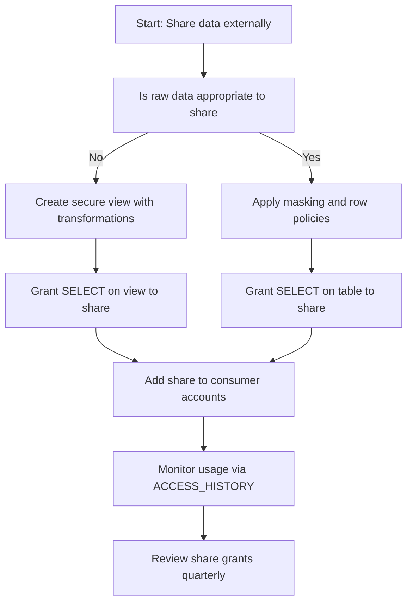

## External Tokenization

### What External Tokenization Does

| Concept | Simple Explanation | Example |
|---------|------------------|---------|
| External tokenization | Replace sensitive values with tokens managed by external service | Replace credit card numbers with tokens from a vault |
| Detokenization | Convert tokens back to original values via secure API | Only authorized roles can call detokenization service |
| Token mapping | External service maintains mapping between tokens and real values | Snowflake never stores the actual sensitive values |
| Policy integration | Use masking policies to control when detokenization occurs | Only detokenize for authorized roles or contexts |

```sql
-- Example: External function for tokenization
CREATE OR REPLACE EXTERNAL FUNCTION tokenize_value (val STRING)
RETURNS STRING
API_INTEGRATION = tokenization_api
AS 'https://token-vault.example.com/tokenize';

-- Example: External function for detokenization
CREATE OR REPLACE EXTERNAL FUNCTION detokenize_value (token STRING)
RETURNS STRING
API_INTEGRATION = tokenization_api
AS 'https://token-vault.example.com/detokenize';

-- Example: Masking policy that detokenizes for authorized roles
CREATE OR REPLACE MASKING POLICY cc_detokenize AS (val STRING) RETURNS STRING ->
  CASE
    WHEN CURRENT_ROLE() IN ('FINANCE_ROLE', 'ADMIN_ROLE') THEN detokenize_value(val)
    ELSE val  -- Return token for unauthorized roles
  END;

-- Apply to credit card column
ALTER TABLE payments MODIFY COLUMN cc_token SET MASKING POLICY cc_detokenize;
```

### Tokenization Patterns

| Pattern | Implementation | Use Case |
|---------|---------------|----------|
| Format preserving tokens | Tokens maintain original data format | Applications expect specific formats like phone numbers |
| Deterministic tokens | Same input always produces same token | Enable joins and grouping on tokenized data |
| Non deterministic tokens | Same input produces different tokens | Maximum security for highly sensitive data |
| Role based detokenization | Only authorized roles can see real values | Compliance with least privilege principles |
| Audit detokenization calls | Log all detokenization requests | Meet regulatory requirements for sensitive data access |

### Best Practices for External Tokenization

- Never store raw sensitive values in Snowflake. Tokenize before ingestion.
- Use external functions for detokenization. Keep token mapping outside Snowflake.
- Apply masking policies to control detokenization. Only authorized roles see real values.
- Monitor external function usage. Track detokenization calls for audit.
- Test tokenization performance. External calls add latency to queries.
- Document tokenization logic. Future audits need to understand the flow.

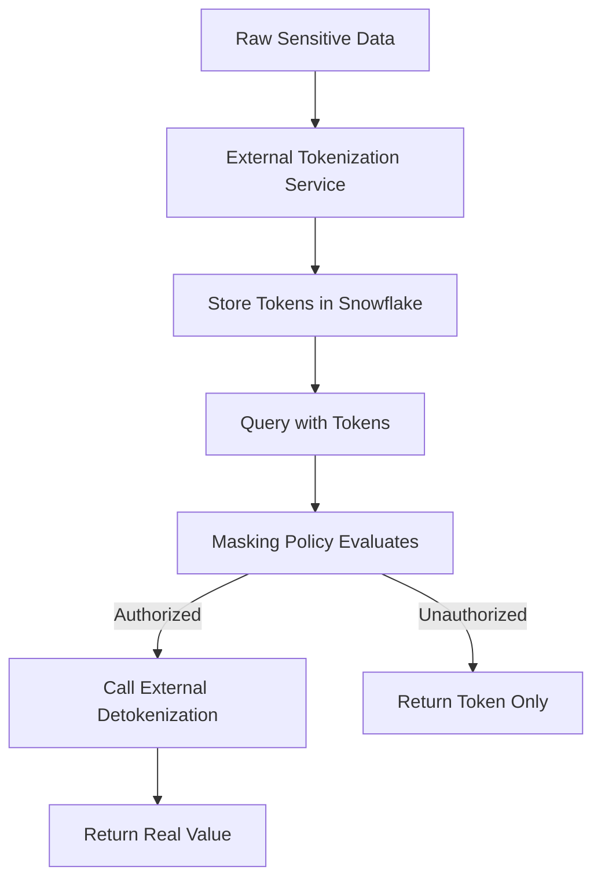

## Policy Management and Automation

### Centralized Policy Registry

```sql
-- Create schema for policy definitions
CREATE SCHEMA governance.policies
  COMMENT = 'Central registry for all data governance policies';

-- Store policy definitions as documentation
CREATE TABLE governance.policies.registry (
  policy_name STRING,
  policy_type STRING,  -- MASKING ROW_ACCESS SECURE_VIEW
  description STRING,
  owner_role STRING,
  created_date TIMESTAMP,
  last_reviewed_date TIMESTAMP,
  next_review_date DATE,
  status STRING  -- ACTIVE DEPRECATED DRAFT
);

-- Example policy registration
INSERT INTO governance.policies.registry VALUES (
  'email_mask',
  'MASKING',
  'Mask email addresses for non HR roles',
  'SECURITYADMIN',
  CURRENT_TIMESTAMP(),
  CURRENT_TIMESTAMP(),
  DATEADD(month, 3, CURRENT_DATE()),
  'ACTIVE'
);
```

### Automated Policy Enforcement

```sql
-- Create task to review policy compliance weekly
CREATE OR REPLACE TASK governance.review_policy_compliance
  WAREHOUSE = admin_wh
  SCHEDULE = 'USING CRON 0 9 * * 1'  -- Every Monday at 9 AM
AS
  -- Find restricted columns without masking policies
  SELECT
    table_schema,
    table_name,
    column_name
  FROM SNOWFLAKE.ACCOUNT_USAGE.TAG_REFERENCES tr
  JOIN INFORMATION_SCHEMA.COLUMNS c
    ON tr.object_name = c.table_name
  WHERE tr.tag_name = 'sensitivity'
    AND tr.tag_value = 'restricted'
    AND c.column_name NOT IN (
      SELECT column_name
      FROM SNOWFLAKE.ACCOUNT_USAGE.MASKING_POLICIES
    );

-- Create alert for policy violations
CREATE OR REPLACE ALERT governance.alert_unmasked_restricted_data
  WAREHOUSE = admin_wh
  SCHEDULE = 'USING CRON 0 12 * * *'
  CONDITION = (
    SELECT COUNT(*)
    FROM SNOWFLAKE.ACCOUNT_USAGE.TAG_REFERENCES tr
    JOIN INFORMATION_SCHEMA.COLUMNS c
      ON tr.object_name = c.table_name
    WHERE tr.tag_name = 'sensitivity'
      AND tr.tag_value = 'restricted'
      AND c.column_name NOT IN (
        SELECT column_name
        FROM SNOWFLAKE.ACCOUNT_USAGE.MASKING_POLICIES
      )
  ) > 0
  ACTION = (
    SYSTEM$SEND_EMAIL(
      'security@company.com',
      'Alert: Unmasked restricted data detected',
      'Review tagged columns without masking policies'
    )
  );
```

### Policy as Code Workflow

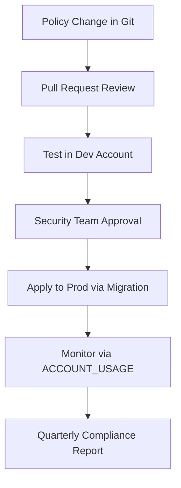

```sql
-- Example: Migration script for policy deployment
-- File: 010_apply_email_mask_policy.sql
-- Owner: security_team
-- Review: security_review_2024_01
-- Rollback: 010_rollback_email_mask_policy.sql

-- Create policy if not exists
CREATE OR REPLACE MASKING POLICY email_mask AS (val STRING) RETURNS STRING ->
  CASE
    WHEN CURRENT_ROLE() IN ('HR_ROLE', 'ADMIN_ROLE') THEN val
    ELSE '***@***.***'
  END;

-- Apply to all email columns tagged as confidential
-- This would be generated by a script that queries TAG_REFERENCES
ALTER TABLE customers MODIFY COLUMN email SET MASKING POLICY email_mask;
ALTER TABLE users MODIFY COLUMN contact_email SET MASKING POLICY email_mask;

-- Register policy in central registry
INSERT INTO governance.policies.registry (
  policy_name, policy_type, description, owner_role, status
) VALUES (
  'email_mask', 'MASKING', 'Mask email for non HR roles', 'SECURITYADMIN', 'ACTIVE'
);
```

### Best Practices for Policy Automation

- Store policies in version control. Treat governance code like application code.
- Use migration scripts for policy deployment. Enable rollback and audit trail.
- Automate compliance checks. Use TASK and ALERT to detect policy gaps.
- Centralize policy documentation. One registry for all governance rules.
- Review policies quarterly. Business rules and regulations change.
- Test policies in dev before prod. Verify behavior with representative data.

## Governance Monitoring and Reporting

### Key Governance Metrics

| Metric | Source View | Alert Threshold | Response Action |
|--------|------------|-----------------|----------------|
| Unmasked restricted columns | TAG_REFERENCES minus MASKING_POLICIES | Any restricted column without mask | Apply masking policy immediately |
| Unused tagged objects | TAG_REFERENCES with no ACCESS_HISTORY | No access in 180 days | Review for archival or deletion |
| Policy evaluation errors | QUERY_HISTORY with policy errors | Any error in policy logic | Fix policy and retest |
| Unauthorized access attempts | ACCESS_HISTORY with denied rows | Repeated denied access by user | Investigate potential misuse |
| Share usage anomalies | ACCESS_HISTORY for shared objects | Spike in external consumer queries | Review share terms and access |

```sql
-- Example: Governance dashboard query
-- Find policy coverage by sensitivity level
SELECT
  tr.tag_value as sensitivity_level,
  COUNT(DISTINCT tr.object_name) as total_objects,
  COUNT(DISTINCT mp.policy_name) as objects_with_masking,
  COUNT(DISTINCT rp.policy_name) as objects_with_row_access,
  ROUND(100.0 * COUNT(DISTINCT mp.policy_name) / COUNT(DISTINCT tr.object_name), 2) as masking_coverage_pct
FROM SNOWFLAKE.ACCOUNT_USAGE.TAG_REFERENCES tr
LEFT JOIN SNOWFLAKE.ACCOUNT_USAGE.MASKING_POLICIES mp
  ON tr.object_name = mp.column_name
LEFT JOIN SNOWFLAKE.ACCOUNT_USAGE.ROW_ACCESS_POLICIES rp
  ON tr.object_name = rp.table_name
WHERE tr.tag_name = 'sensitivity'
GROUP BY tr.tag_value
ORDER BY tr.tag_value;
```

### Compliance Reporting Patterns

| Report Type | Key Queries | Use Case |
|------------|------------|----------|
| Access audit report | ACCESS_HISTORY filtered by sensitivity tags | Demonstrate compliance with GDPR HIPAA PCI |
| Policy coverage report | TAG_REFERENCES joined with policy views | Show what percentage of sensitive data is protected |
| Data owner report | TAG_REFERENCES for data_owner tag | Identify stewards for access requests |
| Retention compliance | TAG_REFERENCES for retention_policy tag | Verify archival or deletion schedules |
| Sharing audit report | ACCESS_HISTORY for shared objects | Monitor how external consumers use shared data |

```sql
-- Example: GDPR compliance report for restricted data
SELECT
  ah.event_timestamp,
  ah.user_name,
  ah.object_name,
  ah.query_text,
  tr.tag_value as data_classification,
  CASE
    WHEN ah.query_text ILIKE '%DELETE%' OR ah.query_text ILIKE '%UPDATE%' THEN 'MODIFICATION'
    WHEN ah.query_text ILIKE '%SELECT%' THEN 'READ'
    ELSE 'OTHER'
  END as access_type
FROM SNOWFLAKE.ACCOUNT_USAGE.ACCESS_HISTORY ah
JOIN SNOWFLAKE.ACCOUNT_USAGE.TAG_REFERENCES tr
  ON ah.object_name = tr.object_name
WHERE tr.tag_name = 'sensitivity'
  AND tr.tag_value IN ('confidential', 'restricted')
  AND ah.start_time > DATEADD(month, -1, CURRENT_TIMESTAMP)
ORDER BY ah.event_timestamp DESC;
```

## Common Governance Pitfalls

| Pitfall | What Happens | How To Fix |
|---------|--------------|------------|
| Tagging without enforcement | Tags exist but do not drive any policies | Build automation that uses tags to apply policies |
| Over masking | Masking everything makes data useless for analytics | Apply masking only to truly sensitive columns |
| Complex policy logic | Policies with nested CASE statements are hard to audit | Keep policies simple. Use secure views for complex logic |
| Not testing policies | Policies behave differently than expected in production | Test with representative roles and data before deploying |
| Forgetting to review | Policies become stale as business rules change | Schedule quarterly policy reviews with owners |
| Sharing raw data externally | Consumers see more than intended | Always share secure views with masking and row policies |
| Ignoring performance impact | Policies add latency to queries | Monitor query performance and optimize policy logic |

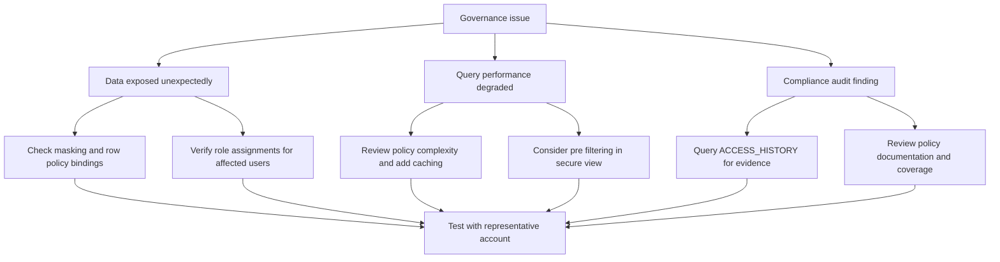

## Decision Framework for Governance Design

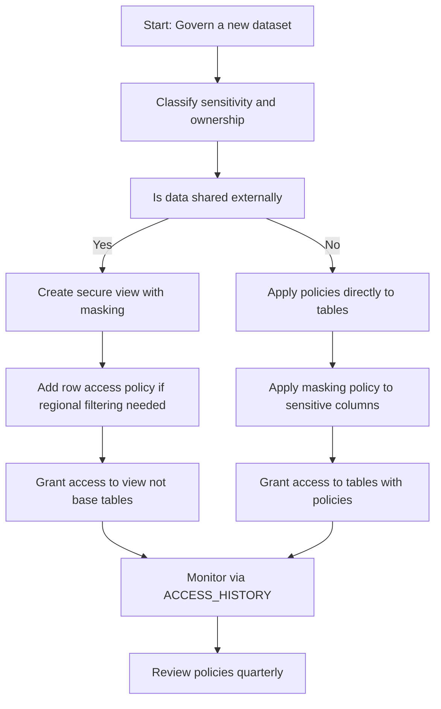

| Question | If Yes | If No |
|----------|--------|-------|
| Is data regulated or highly sensitive | Apply masking and row policies | Standard access controls may suffice |
| Is data shared externally | Use secure views with policies | Direct table access with policies may work |
| Do multiple teams need different access | Create functional roles with policies | Single role with policies may be sufficient |
| Is data lineage important for compliance | Tag objects and monitor dependencies | Basic tagging may be sufficient |
| Do policies need to change frequently | Use policy as code with version control | Manual policy updates may be acceptable |

## Key Principles to Remember

- Classify before you protect. Tags drive policy enforcement and audit reporting.
- Policy as code enables review and reproducibility. Store governance logic in version control.
- Least privilege by default. No access unless explicitly granted and justified.
- Test policies with real roles and data. Assumptions about policy behavior often fail.
- Monitor and review quarterly. Governance requirements evolve. Your policies should too.
- Automate what you can. Manual reviews do not scale. Let the system enforce rules.
- Document everything. Future audits depend on clear policy documentation.

## Bottom Line

- Data governance in Snowflake is policy driven. Tags classify. Policies enforce. Logs audit.
- Start with classification. You cannot protect what you have not identified.
- Use masking policies for column level protection. Use row access policies for row level filtering.
- Secure views let you share insights without exposing source logic or raw data.
- Lineage tracking via ACCOUNT_USAGE enables impact analysis and compliance reporting.
- External tokenization keeps sensitive values outside Snowflake while enabling analytics.
- Automate policy enforcement and monitoring. Manual processes do not scale.
- Review and adjust regularly. Business rules change. Regulations evolve. Your governance should too.

Think of data governance like managing a library:
- Tags are like the catalog system. They tell you what each book contains and who should read it.
- Masking policies are like redacted pages. Some readers see the full text. Others see only what they need.
- Row access policies are like restricted sections. Only authorized patrons can enter certain areas.
- Secure views are like curated reading lists. Patrons see recommended content not the entire collection.
- Lineage tracking is like the checkout log. You know who read what and when.
- Policy automation is like the librarian. Enforcing rules consistently so you do not have to.

Classify your books. Protect what matters. Enable what is needed. Document your rules. Review regularly. That is how governance works in Snowflake.
