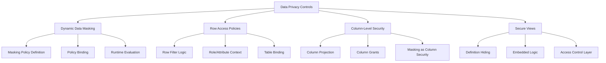
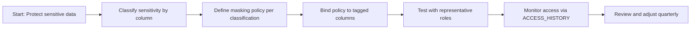
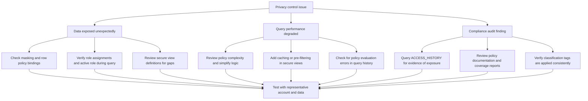
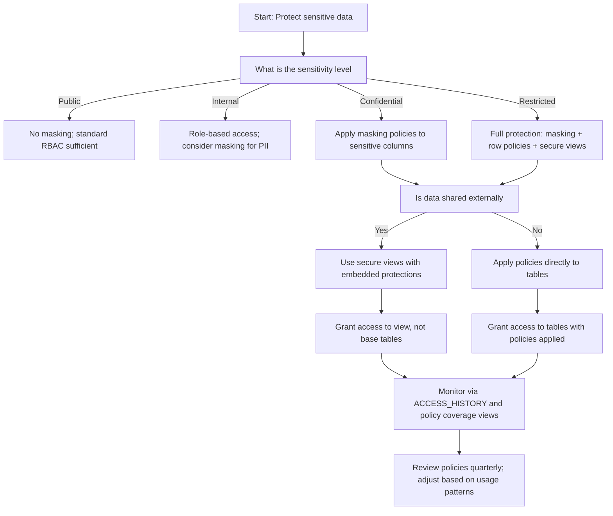

# Data Masking and Row/Column Security in Snowflake



## Core Privacy Principles

| Principle | What It Means | Why It Matters |
|-----------|--------------|----------------|
| Protect data, not just tables | Security must follow the data, not just the object | Columns within a table have different sensitivity levels |
| Policy as code, not configuration | Define masking and row rules in version-controlled SQL | Enables review, testing, and reproducible deployments |
| Evaluate at query time, not storage time | Transform or filter when data is accessed, not when stored | Same data can serve multiple security contexts without duplication |
| Least privilege by column and row | Grant minimum access at the most granular level needed | Reduces blast radius if credentials or roles are compromised |
| Audit what was seen, not just what was queried | Log the actual values returned to users, not just the SQL executed | Compliance requires proof of what data was exposed, not just accessed |



---

## Dynamic Data Masking: Concepts and Implementation

### What Dynamic Data Masking Does

| Concept | Simple Explanation | Example |
|---------|------------------|---------|
| Masking policy | A SQL function that transforms column values based on caller context | Show full email to HR, partial to support, masked to others |
| Policy evaluation | Happens at query time, after authorization, before results return | Same query returns different values for different roles |
| Policy binding | Attach a policy to a column of compatible data type | Bind `email_mask` policy to all `VARCHAR` email columns |
| Policy reuse | One policy definition can protect many columns across tables | Consistent masking logic without repeating code |
| Context awareness | Policy logic can reference `CURRENT_ROLE()`, `CURRENT_USER()`, session variables | Personalize masking based on who is asking and why |

```sql
-- Create a masking policy for email addresses
CREATE OR REPLACE MASKING POLICY email_mask
  COMMENT = 'Mask email for non-HR roles. HR sees full, support sees partial, others see ***. Owner: security_team.'
  AS (val STRING) RETURNS STRING ->
  CASE
    WHEN CURRENT_ROLE() IN ('HR_ROLE', 'SECURITY_ADMIN') THEN val
    WHEN CURRENT_ROLE() = 'SUPPORT_ROLE' THEN REGEXP_REPLACE(val, '^.+@', '***@')
    ELSE '***@***.***'
  END;

-- Bind policy to columns
ALTER TABLE customers MODIFY COLUMN email SET MASKING POLICY email_mask;
ALTER TABLE users MODIFY COLUMN contact_email SET MASKING POLICY email_mask;
ALTER TABLE leads MODIFY COLUMN work_email SET MASKING POLICY email_mask;

-- Query returns different results based on caller role
USE ROLE hr_role;
SELECT email FROM customers LIMIT 1;  -- Returns: jane.doe@company.com

USE ROLE support_role;
SELECT email FROM customers LIMIT 1;  -- Returns: ***@company.com

USE ROLE analyst_role;
SELECT email FROM customers LIMIT 1;  -- Returns: ***@***.***
```

### Masking Policy Design Patterns

| Pattern | Policy Logic | Use Case | When To Use |
|---------|-------------|----------|-------------|
| Full hide | Return `'***'` for unauthorized roles | SSN, health info, passwords | Highly sensitive data with no business need for partial exposure |
| Partial reveal | Show last N characters or specific format | Phone numbers, account IDs, credit cards | Data needed for identification or support but not full exposure |
| Hash for analytics | Return `SHA1(val)` or `MD5(val)` for authorized roles | Enable grouping/joining without exposing raw values | Analytics use cases where exact values are not required |
| Format-preserving mask | Keep data type and format while masking | Applications expect specific formats like `XXX-XX-1234` | Legacy systems or integrations that validate format |
| Conditional masking | Different masks for different roles or session contexts | Tiered access model with multiple clearance levels | Complex organizations with nuanced access requirements |
| Tokenization passthrough | Return token from external vault for unauthorized roles | Integrate with external tokenization service | When tokens must be consistent across systems |

```sql
-- Pattern: Partial reveal for phone numbers
CREATE OR REPLACE MASKING POLICY phone_mask
  AS (val STRING) RETURNS STRING ->
  CASE
    WHEN CURRENT_ROLE() IN ('HR_ROLE', 'ADMIN_ROLE') THEN val
    WHEN CURRENT_ROLE() = 'SUPPORT_ROLE' THEN 
      REGEXP_REPLACE(val, '(\\d{3}-\\d{3}-)\\d{4}', '\\1****')
    ELSE '***-***-****'
  END;

-- Pattern: Hash for analytics without raw exposure
CREATE OR REPLACE MASKING POLICY email_hash_analytics
  AS (val STRING) RETURNS STRING ->
  CASE
    WHEN CURRENT_ROLE() IN ('ADMIN_ROLE') THEN val
    WHEN CURRENT_ROLE() IN ('ANALYTICS_ROLE', 'DATA_SCIENCE_ROLE') THEN SHA1(val)
    ELSE '***'
  END;

-- Pattern: Format-preserving mask for credit cards (Luhn-valid structure)
CREATE OR REPLACE MASKING POLICY cc_mask_format
  AS (val STRING) RETURNS STRING ->
  CASE
    WHEN CURRENT_ROLE() IN ('FINANCE_ROLE', 'ADMIN_ROLE') THEN val
    ELSE REGEXP_REPLACE(val, '(\\d{4}-\\d{4}-\\d{4}-)\\d{4}', '\\1****')
  END;

-- Pattern: Conditional masking with session context
CREATE OR REPLACE MASKING POLICY contextual_salary_mask
  AS (val NUMBER) RETURNS STRING ->
  CASE
    WHEN CURRENT_ROLE() = 'HR_ROLE' THEN TO_VARCHAR(val)
    WHEN SESSION_CONTEXT('access_level') = 'manager' THEN 
      CASE 
        WHEN val < 50000 THEN '<50K'
        WHEN val < 100000 THEN '50K-100K'
        ELSE '100K+'
      END
    ELSE '***'
  END;
```

### Binding Masking Policies at Scale

```sql
-- Method 1: Manual binding for specific columns (precise but tedious)
ALTER TABLE customers MODIFY COLUMN ssn SET MASKING POLICY ssn_mask;
ALTER TABLE customers MODIFY COLUMN email SET MASKING POLICY email_mask;
ALTER TABLE employees MODIFY COLUMN salary SET MASKING POLICY salary_mask;

-- Method 2: Bulk binding via stored procedure using tags (scalable)
CREATE OR REPLACE PROCEDURE governance.apply_masking_by_classification()
RETURNS STRING
LANGUAGE SQL
AS
$$
DECLARE
  col_record RECORD;
  col_cursor CURSOR FOR
    SELECT 
      object_database,
      object_schema,
      object_name,
      column_name,
      tag_value
    FROM SNOWFLAKE.ACCOUNT_USAGE.TAG_REFERENCES
    WHERE tag_name = 'data_classification'
      AND column_name IS NOT NULL
      AND tag_value IN ('confidential', 'restricted');
BEGIN
  FOR col_record IN col_cursor DO
    CASE col_record.tag_value
      WHEN 'restricted' THEN
        EXECUTE IMMEDIATE 'ALTER TABLE ' || 
          col_record.object_database || '.' || 
          col_record.object_schema || '.' || 
          col_record.object_name ||
          ' MODIFY COLUMN ' || col_record.column_name ||
          ' SET MASKING POLICY mask_restricted';
      WHEN 'confidential' THEN
        EXECUTE IMMEDIATE 'ALTER TABLE ' || 
          col_record.object_database || '.' || 
          col_record.object_schema || '.' || 
          col_record.object_name ||
          ' MODIFY COLUMN ' || col_record.column_name ||
          ' SET MASKING POLICY mask_confidential';
    END CASE;
  END FOR;
  RETURN 'Masking policies applied to ' || 
    (SELECT COUNT(*) FROM TABLE(RESULT_SCAN(LAST_QUERY_ID()))) || ' columns';
END;
$$;

-- Execute bulk binding
CALL governance.apply_masking_by_classification();
```

### Testing Masking Policies

```sql
-- Step 1: Create test roles if they do not exist
CREATE ROLE IF NOT EXISTS test_hr;
CREATE ROLE IF NOT EXISTS test_support;
CREATE ROLE IF NOT EXISTS test_analyst;

-- Step 2: Grant roles to a test user
GRANT ROLE test_hr TO USER test_user;
GRANT ROLE test_support TO USER test_user;
GRANT ROLE test_analyst TO USER test_user;

-- Step 3: Test masking behavior with each role
-- As HR: should see full values
USE ROLE test_hr;
SELECT ssn, email, phone FROM customers WHERE customer_id = 12345;
-- Expected: 123-45-6789, jane.doe@company.com, 555-123-4567

-- As Support: should see partial values
USE ROLE test_support;
SELECT ssn, email, phone FROM customers WHERE customer_id = 12345;
-- Expected: ***-**-6789, ***@company.com, 555-123-****

-- As Analyst: should see fully masked values
USE ROLE test_analyst;
SELECT ssn, email, phone FROM customers WHERE customer_id = 12345;
-- Expected: ***-**-****, ***@***.***, ***-***-****

-- Step 4: Test with multiple roles active (union of privileges)
-- Grant multiple roles to user and test combined access
GRANT ROLE test_hr TO USER test_user;  -- Already has analyst
USE ROLE test_analyst;  -- Active role is analyst
-- But user also has HR role - masking evaluates based on active role only
-- This is intentional: masking uses CURRENT_ROLE(), not all assigned roles

-- Step 5: Clean up test artifacts
REVOKE ROLE test_hr FROM USER test_user;
REVOKE ROLE test_support FROM USER test_user;
REVOKE ROLE test_analyst FROM USER test_user;
DROP ROLE IF EXISTS test_hr;
DROP ROLE IF EXISTS test_support;
DROP ROLE IF EXISTS test_analyst;
```

| Test Scenario | Expected Result | Verification Method |
|--------------|----------------|-------------------|
| Admin role queries restricted column | Full value returned | Compare output to source data in raw schema |
| Analyst role queries confidential column | Hashed or masked value returned | Verify SHA1 format or `***` pattern matches policy |
| External role queries any sensitive column | Fully masked value returned | Confirm output matches least-privilege expectation |
| Query with UNION of roles active | Masking evaluates based on CURRENT_ROLE() only | Test with user holding multiple roles, verify active role drives output |
| Policy updated after binding | New logic applies to subsequent queries immediately | Update policy definition, re-run query, verify output changes |
| Column with no policy bound | Raw value returned (no masking) | Query untagged column, verify no transformation |

---

## Row Access Policies: Row-Level Security Implementation

### What Row Access Policies Do

| Concept | Simple Explanation | Example |
|---------|------------------|---------|
| Row access policy | A SQL function that returns TRUE/FALSE to control which rows a user can see | Sales reps see only their region; managers see all regions |
| Policy evaluation | Happens at query time, after authorization, before results return | Same `SELECT * FROM sales` returns different rows for different roles |
| Policy binding | Attach policy to a table column that determines row filtering | Bind `regional_access` policy to the `region` column |
| Multi-column policies | Policy function can accept multiple columns for complex logic | Filter by region AND date AND department simultaneously |
| Context awareness | Policy logic can reference `CURRENT_ROLE()`, `CURRENT_USER()`, session variables, or join to metadata tables | Personalize access based on user attributes stored centrally |

```sql
-- Create a row access policy based on role and region
CREATE OR REPLACE ROW ACCESS POLICY regional_access
  COMMENT = 'Filter rows by region based on caller role. Admins see all, sales see their region, partners see approved regions.'
  AS (region STRING, created_date DATE) RETURNS BOOLEAN ->
  CASE
    -- Admins and executives see everything
    WHEN CURRENT_ROLE() IN ('ADMIN_ROLE', 'EXEC_ROLE') THEN TRUE
    
    -- Sales roles see only their assigned region
    WHEN CURRENT_ROLE() = 'SALES_NORTH_ROLE' AND region = 'North' THEN TRUE
    WHEN CURRENT_ROLE() = 'SALES_SOUTH_ROLE' AND region = 'South' THEN TRUE
    
    -- Partners see only approved regions and recent data
    WHEN CURRENT_ROLE() = 'PARTNER_ROLE' 
      AND region IN ('North', 'South') 
      AND created_date >= DATEADD(month, -6, CURRENT_DATE()) THEN TRUE
    
    -- Default deny
    ELSE FALSE
  END;

-- Bind policy to table columns that drive filtering
ALTER TABLE sales ADD ROW ACCESS POLICY regional_access ON (region, created_date);

-- Query returns different rows based on caller role
USE ROLE admin_role;
SELECT COUNT(*) FROM sales;  -- Returns: 1,000,000 rows

USE ROLE sales_north_role;
SELECT COUNT(*) FROM sales;  -- Returns: ~250,000 rows (North region only)

USE ROLE partner_role;
SELECT COUNT(*) FROM sales;  -- Returns: ~100,000 rows (North+South, last 6 months)
```

### Row Access Policy Design Patterns

| Pattern | Policy Logic | Use Case | Implementation Notes |
|---------|-------------|----------|---------------------|
| Role-based filtering | `CURRENT_ROLE() IN (allowed_roles)` | Different teams see different regional or departmental data | Simple, fast, easy to audit; but inflexible for dynamic attributes |
| Attribute-based filtering | Join to user metadata table for department, region, clearance | Filter by user attributes stored in a central identity system | More flexible; requires join performance consideration |
| Time-based filtering | `created_date >= DATEADD(...)` or `valid_until >= CURRENT_DATE()` | Restrict access to recent data only or time-bound access | Combine with role logic for temporal access control |
| Account-based filtering | `CURRENT_ACCOUNT() = allowed_account` | Control access in multi-account sharing or replication scenarios | Critical for cross-account governance |
| Combination logic | Role AND attribute AND time conditions | Complex access rules for regulated or highly sensitive data | Keep logic simple; use secure views for complex transformations |
| Dynamic context | Use `SESSION_CONTEXT()`, `CURRENT_USER()`, or custom functions | Personalize access based on session state or user metadata | Powerful but harder to test; document thoroughly |

```sql
-- Pattern: Attribute-based using user metadata table
CREATE OR REPLACE ROW ACCESS POLICY dept_access
  AS (dept_id NUMBER) RETURNS BOOLEAN ->
  EXISTS (
    SELECT 1
    FROM security.user_departments ud
    WHERE ud.user_name = CURRENT_USER()
      AND ud.dept_id = dept_id
      AND ud.active = TRUE
      AND ud.valid_until >= CURRENT_DATE()
  );

-- Pattern: Time-based for recent data only
CREATE OR REPLACE ROW ACCESS POLICY recent_data_only
  AS (created_date DATE, last_modified_date DATE) RETURNS BOOLEAN ->
  GREATEST(created_date, COALESCE(last_modified_date, created_date)) 
    >= DATEADD(month, -12, CURRENT_DATE());

-- Pattern: Combined complex access rule
CREATE OR REPLACE ROW ACCESS POLICY complex_financial_access
  AS (
    region STRING,
    amount NUMBER,
    created_date DATE,
    data_owner STRING
  ) RETURNS BOOLEAN ->
  -- Admins see everything
  CURRENT_ROLE() = 'ADMIN_ROLE'
  
  -- Finance analysts see recent data in their region, under threshold
  OR (
    CURRENT_ROLE() = 'FINANCE_ANALYST_ROLE'
    AND region = CURRENT_USER_REGION()  -- Custom function or session context
    AND amount < 100000
    AND created_date >= DATEADD(year, -2, CURRENT_DATE())
  )
  
  -- Auditors see all historical data but only approved owners
  OR (
    CURRENT_ROLE() = 'AUDIT_ROLE'
    AND data_owner IN ('finance', 'compliance', 'legal')
  );
```

### Binding Row Access Policies

```sql
-- Bind policy to table columns that determine filtering logic
ALTER TABLE sales ADD ROW ACCESS POLICY regional_access ON (region, created_date);

-- Bind multiple policies to different columns for layered security
ALTER TABLE customer_data
  ADD ROW ACCESS POLICY dept_access ON (dept_id),
  ADD ROW ACCESS POLICY recent_only ON (created_date);

-- Bind policy to view for additional abstraction layer
CREATE SECURE VIEW reporting.regional_sales_summary AS
SELECT 
  region, 
  DATE_TRUNC('month', sale_date) as month,
  SUM(amount) as total_revenue,
  COUNT(DISTINCT customer_id) as unique_customers
FROM raw.sales
GROUP BY region, DATE_TRUNC('month', sale_date);

ALTER VIEW reporting.regional_sales_summary 
  ADD ROW ACCESS POLICY regional_access ON (region);

-- Grant access to view, not base table
GRANT SELECT ON VIEW reporting.regional_sales_summary TO ROLE partner_role;
```

### Testing Row Access Policies

```sql
-- Step 1: Create test data
CREATE OR REPLACE TABLE test.sales_policy_test (
  sale_id NUMBER,
  region STRING,
  amount NUMBER,
  sale_date DATE,
  data_owner STRING
);

INSERT INTO test.sales_policy_test VALUES
  (1, 'North', 50000, CURRENT_DATE(), 'finance'),
  (2, 'South', 75000, CURRENT_DATE(), 'finance'),
  (3, 'North', 150000, CURRENT_DATE(), 'finance'),  -- Over threshold
  (4, 'East', 25000, DATEADD(year, -3, CURRENT_DATE()), 'finance'),  -- Old data
  (5, 'North', 30000, CURRENT_DATE(), 'legal');  -- Different owner;

-- Step 2: Apply policy
ALTER TABLE test.sales_policy_test 
  ADD ROW ACCESS POLICY complex_financial_access ON (region, amount, sale_date, data_owner);

-- Step 3: Test with different roles
USE ROLE admin_role;
SELECT COUNT(*) FROM test.sales_policy_test;  -- Expected: 5 rows (all)

USE ROLE finance_analyst_role;
SELECT COUNT(*) FROM test.sales_policy_test;  
-- Expected: 2 rows (North region, amount < 100K, recent)
-- Rows 1 and 5 qualify; Row 3 exceeds amount threshold

USE ROLE audit_role;
SELECT COUNT(*) FROM test.sales_policy_test;
-- Expected: 4 rows (all where data_owner IN ('finance', 'compliance', 'legal'))
-- Row 5 qualifies (legal owner); Rows 1-4 qualify (finance owner)

-- Step 4: Verify actual row content matches expectations
USE ROLE finance_analyst_role;
SELECT sale_id, region, amount FROM test.sales_policy_test;
-- Should return only rows 1 and 5 with correct values

-- Step 5: Clean up
DROP TABLE IF EXISTS test.sales_policy_test;
```

| Test Scenario | Expected Result | Verification Query |
|--------------|----------------|-------------------|
| Admin queries table with regional policy | All rows returned regardless of filter columns | `COUNT(*)` matches source data |
| Regional role queries same table | Only rows matching region condition returned | Filtered `COUNT(*)` matches expectation |
| Query with time-based policy | Only rows within time window returned | `MIN(created_date)` >= threshold |
| Combined policies applied | Intersection of all conditions applied | Verify each filter condition independently, then combined |
| Policy updated after binding | New logic applies to subsequent queries immediately | Update policy definition, re-query, verify row set changes |
| Policy bound to wrong column | Policy evaluates but returns unexpected results | Confirm policy parameter order matches binding column order |


## Column-Level Security Approaches

### Understanding Column Security in Snowflake

| Approach | What It Controls | When To Use | Limitations |
|----------|-----------------|-------------|------------|
| Column masking policies | Transform column values at query time based on role | Sensitive columns that need different visibility per role | Does not prevent column access; only transforms output |
| Column-level grants (`GRANT SELECT (col1, col2)`) | Control which columns a role can reference in queries | When some columns should be completely invisible to certain roles | Does not transform values; all-or-nothing access per column |
| Secure views with column projection | Expose only approved columns through a view | When you want to completely hide sensitive columns from certain consumers | Requires maintaining view definitions; adds abstraction layer |
| Combination: masking + grants + views | Layered protection for highly sensitive data | Regulated data with complex access requirements | More complex to manage; requires thorough testing |

```sql
-- Approach 1: Column masking (transform but do not hide)
CREATE OR REPLACE MASKING POLICY ssn_mask
  AS (val STRING) RETURNS STRING ->
  CASE
    WHEN CURRENT_ROLE() IN ('HR_ROLE', 'ADMIN_ROLE') THEN val
    ELSE '***-**-****'
  END;

ALTER TABLE employees MODIFY COLUMN ssn SET MASKING POLICY ssn_mask;
-- Users can still SELECT ssn, but see masked values based on role

-- Approach 2: Column-level grants (hide completely)
-- Grant access to specific columns only
GRANT SELECT (employee_id, first_name, last_name, department) 
  ON TABLE employees TO ROLE analyst_role;
-- analyst_role cannot reference ssn, salary, or other restricted columns in queries

-- Attempting to query restricted column fails:
USE ROLE analyst_role;
SELECT employee_id, ssn FROM employees;  -- Error: unauthorized column access

-- Approach 3: Secure view with column projection
CREATE SECURE VIEW hr.employee_directory AS
SELECT 
  employee_id,
  first_name,
  last_name,
  department,
  title,
  work_email  -- Only approved columns exposed
FROM raw.employees;
-- ssn, salary, home_address, etc. are completely hidden

GRANT SELECT ON VIEW hr.employee_directory TO ROLE analyst_role;
-- Analysts can query the view but cannot see or reference hidden columns

-- Approach 4: Layered protection for maximum security
-- Step 1: Apply masking to sensitive columns
ALTER TABLE employees MODIFY COLUMN ssn SET MASKING POLICY ssn_mask;
ALTER TABLE employees MODIFY COLUMN salary SET MASKING POLICY salary_mask;

-- Step 2: Restrict column grants for non-HR roles
REVOKE SELECT (ssn, salary, home_address) ON TABLE employees FROM ROLE analyst_role;

-- Step 3: Create secure view for external consumption
CREATE SECURE VIEW external.employee_summary AS
SELECT 
  employee_id,
  first_name,
  last_name,
  department,
  CASE WHEN CURRENT_ROLE() = 'MANAGER_ROLE' THEN salary ELSE NULL END as salary_visible
FROM raw.employees;

GRANT SELECT ON VIEW external.employee_summary TO ROLE partner_role;
```

### When To Use Each Column Security Approach

| Scenario | Recommended Approach | Why |
|----------|---------------------|-----|
| PII that needs partial exposure (e.g., last 4 of SSN) | Masking policy | Transforms values while keeping column accessible |
| Highly sensitive columns that should never be queried by certain roles | Column-level grants | Prevents any reference to the column in queries |
| External consumers who should see only curated columns | Secure view with projection | Completely hides unapproved columns and logic |
| Regulated data with tiered access (full/partial/none) | Layered: masking + grants + views | Defense in depth; meets complex compliance requirements |
| Analytics use cases needing grouping on sensitive values | Masking with hash function | Enables `GROUP BY hashed_email` without exposing raw values |
| Legacy applications expecting specific column formats | Format-preserving masking | Maintains application compatibility while protecting data |

```sql
-- Example: Analytics-friendly masking with hash for grouping
CREATE OR REPLACE MASKING POLICY email_hash_analytics
  AS (val STRING) RETURNS STRING ->
  CASE
    WHEN CURRENT_ROLE() IN ('ADMIN_ROLE') THEN val
    WHEN CURRENT_ROLE() IN ('ANALYTICS_ROLE') THEN SHA1(val)  -- Consistent hash for grouping
    ELSE '***'
  END;

ALTER TABLE customers MODIFY COLUMN email SET MASKING POLICY email_hash_analytics;

-- Analytics query: group by hashed email without exposing raw values
USE ROLE analytics_role;
SELECT 
  email_hash_analytics(email) as email_group,  -- Returns SHA1 hash
  COUNT(*) as customer_count,
  AVG(order_total) as avg_spend
FROM customers
GROUP BY email_hash_analytics(email);  -- Can group on consistent hash
```


## Secure Views: Hiding Logic and Data

### What Secure Views Do

| Concept | Simple Explanation | Example |
|---------|------------------|---------|
| Secure view | A view whose definition is hidden from users without ownership | Share aggregated results without exposing source tables or join logic |
| Definition hiding | Users can query the view but cannot see `SHOW VIEW` definition or underlying tables | Protects business logic, proprietary algorithms, and sensitive join conditions |
| Access control layer | Grant `SELECT` on view, not base tables; users cannot bypass view to access raw data | Enforces masking, row policies, and column projection at the view layer |
| Embedded transformations | Apply masking, aggregation, or filtering logic inside the view definition | Centralize protection logic; consumers cannot accidentally bypass it |

```sql
-- Create a secure view that hides underlying logic and sensitive columns
CREATE SECURE VIEW analytics.customer_lifetime_summary
  COMMENT = 'Aggregated customer metrics for external partners. Hides raw order details and PII.'
AS
SELECT 
  c.customer_id,
  c.region,
  COUNT(o.order_id) as total_orders,
  SUM(o.order_total) as lifetime_value,
  AVG(o.order_total) as avg_order_value,
  MAX(o.order_date) as last_order_date
FROM raw.customers c
LEFT JOIN raw.orders o ON c.customer_id = o.customer_id
WHERE c.status = 'active'  -- Filter applied in view
  AND o.order_date >= DATEADD(year, -2, CURRENT_DATE())  -- Recent data only
GROUP BY c.customer_id, c.region;

-- Grant access to view, not base tables
GRANT SELECT ON VIEW analytics.customer_lifetime_summary TO ROLE partner_role;

-- Partner can query the view but cannot:
-- 1. See the underlying raw.customers or raw.orders table structures
-- 2. See the aggregation logic, filters, or join conditions in the view definition
-- 3. Bypass the view to access raw order details or PII columns
-- 4. See columns that were not projected (e.g., customer email, address, phone)

-- Attempting to view definition fails for non-owners:
USE ROLE partner_role;
SHOW VIEWS LIKE 'customer_lifetime_summary' IN SCHEMA analytics;
-- Result shows view exists but 'text' column (definition) is null or restricted
```

### Secure View Design Patterns

| Pattern | Implementation | Use Case |
|---------|---------------|----------|
| Aggregation view | Pre-aggregate sensitive details; expose only summaries | Share metrics with external partners without exposing individual records |
| Column projection | Select only approved columns; omit sensitive fields entirely | Limit data exposure without needing per-column masking policies |
| Row filtering in view | Include `WHERE` clause to enforce row-level access at view layer | Combine with row access policies for defense in depth |
| Embedded masking | Apply masking functions directly in view `SELECT` list | Centralize transformation logic; consumers cannot bypass |
| Logic encapsulation | Hide complex business rules, calculations, or proprietary algorithms | Protect intellectual property while enabling data consumption |
| Multi-source abstraction | Join multiple tables but expose only curated result set | Simplify consumer queries while protecting source complexity |

```sql
-- Pattern: Aggregation view with embedded masking
CREATE SECURE VIEW reporting.regional_performance AS
SELECT 
  region,
  DATE_TRUNC('month', sale_date) as month,
  COUNT(DISTINCT customer_id) as unique_customers,
  SUM(CASE WHEN amount < 10000 THEN amount ELSE 10000 END) as capped_revenue,  -- Cap large values
  AVG(CASE WHEN CURRENT_ROLE() = 'MANAGER_ROLE' THEN amount ELSE NULL END) as manager_avg  -- Conditional aggregation
FROM raw.sales
WHERE sale_date >= DATEADD(year, -1, CURRENT_DATE())
GROUP BY region, DATE_TRUNC('month', sale_date);

-- Pattern: Column projection with conditional logic
CREATE SECURE VIEW hr.employee_compensation_summary AS
SELECT 
  employee_id,
  department,
  title,
  -- Salary visible only to HR and managers; others see range
  CASE 
    WHEN CURRENT_ROLE() IN ('HR_ROLE', 'ADMIN_ROLE') THEN salary
    WHEN CURRENT_ROLE() = 'MANAGER_ROLE' THEN 
      CASE 
        WHEN salary < 50000 THEN '<50K'
        WHEN salary < 100000 THEN '50K-100K'
        ELSE '100K+'
      END
    ELSE NULL  -- Completely hidden for others
  END as salary_visibility,
  -- Bonus always hidden from non-HR
  CASE WHEN CURRENT_ROLE() = 'HR_ROLE' THEN bonus ELSE NULL END as bonus
FROM raw.employees;

-- Pattern: Multi-source abstraction with embedded row filtering
CREATE SECURE VIEW analytics.my_team_projects AS
SELECT 
  p.project_id,
  p.project_name,
  p.status,
  p.budget,
  t.task_name,
  t.assigned_to
FROM raw.projects p
LEFT JOIN raw.tasks t ON p.project_id = t.project_id
WHERE 
  -- Row filtering: users see only projects they own or are assigned to
  p.owner = CURRENT_USER()
  OR t.assigned_to = CURRENT_USER()
  OR CURRENT_ROLE() = 'ADMIN_ROLE'
  -- Additional filter: only active projects
  AND p.status IN ('active', 'planning');
```

### Testing Secure Views

```sql
-- Step 1: Verify view definition is hidden from non-owners
-- As view owner: can see definition
USE ROLE view_owner_role;
SHOW VIEWS LIKE 'customer_lifetime_summary' IN SCHEMA analytics;
-- Result includes view definition in 'text' column

-- As non-owner: cannot see definition
USE ROLE partner_role;
SHOW VIEWS LIKE 'customer_lifetime_summary' IN SCHEMA analytics;
-- Result shows view exists but 'text' column is null or access denied

-- Step 2: Verify query results are correct and protected
USE ROLE partner_role;
SELECT COUNT(*) FROM analytics.customer_lifetime_summary;  -- Should return expected count
SELECT * FROM analytics.customer_lifetime_summary LIMIT 1;  -- Should return aggregated, not raw data

-- Step 3: Verify base tables are not accessible
USE ROLE partner_role;
SELECT COUNT(*) FROM raw.customers;  -- Should fail: unauthorized access
SELECT COUNT(*) FROM raw.orders;  -- Should fail: unauthorized access

-- Step 4: Verify masking and filtering logic works
-- Insert test data with known values
INSERT INTO raw.customers (customer_id, region, email, status) VALUES 
  (99999, 'North', 'test@example.com', 'active');
INSERT INTO raw.orders (order_id, customer_id, order_total, order_date) VALUES 
  (88888, 99999, 150.00, CURRENT_DATE());

-- Query via secure view as partner role
USE ROLE partner_role;
SELECT * FROM analytics.customer_lifetime_summary WHERE customer_id = 99999;
-- Should return aggregated row; email should not appear (not projected)

-- Step 5: Clean up test data
DELETE FROM raw.orders WHERE order_id = 88888;
DELETE FROM raw.customers WHERE customer_id = 99999;
```

| Test Scenario | Expected Result | Verification Method |
|--------------|----------------|-------------------|
| Non-owner queries `SHOW VIEW` | View definition is hidden or access denied | Check `text` column in `SHOW VIEWS` result |
| Consumer queries secure view | Returns aggregated/filtered results, not raw data | Compare output to source tables; verify transformations applied |
| Consumer attempts to access base tables | Query fails with unauthorized access error | Attempt `SELECT FROM raw.table`; verify permission denied |
| Masking logic embedded in view | Sensitive columns transformed per policy | Query view with different roles; verify output matches masking rules |
| Row filtering in view | Only authorized rows returned | Insert test row with known attributes; query with different roles |
| View updated after deployment | New logic applies to subsequent queries | Modify view definition; re-query; verify output changes |


## Integrating Masking, Row Security, and Classification

### Tag-Driven Policy Automation

```sql
-- Step 1: Create classification tags with controlled values
CREATE OR REPLACE TAG data_classification
  COMMENT = 'Data sensitivity classification per security policy v3.0. Values: public, internal, confidential, restricted. Owner: security_team.'
  ALLOWED_VALUES = ('public', 'internal', 'confidential', 'restricted');

CREATE OR REPLACE TAG masking_rule
  COMMENT = 'Masking behavior for classified columns. Values: full_hide, partial_reveal, hash_analytics, format_preserve. Owner: security_team.';

-- Step 2: Apply tags to columns at ingestion or via governance workflow
ALTER TABLE customers MODIFY COLUMN ssn 
  SET TAG data_classification = 'restricted',
  SET TAG masking_rule = 'full_hide';

ALTER TABLE customers MODIFY COLUMN email 
  SET TAG data_classification = 'confidential',
  SET TAG masking_rule = 'partial_reveal';

ALTER TABLE customers MODIFY COLUMN phone 
  SET TAG data_classification = 'confidential',
  SET TAG masking_rule = 'format_preserve';

-- Step 3: Create policy registry mapping tags to policy names
CREATE OR REPLACE TABLE governance.policy_mappings (
  classification_value STRING,
  masking_rule_value STRING,
  masking_policy_name STRING,
  row_policy_name STRING,
  effective_date DATE,
  owner_role STRING
);

INSERT INTO governance.policy_mappings VALUES
  ('restricted', 'full_hide', 'mask_restricted', NULL, CURRENT_DATE(), 'SECURITYADMIN'),
  ('confidential', 'partial_reveal', 'mask_partial', NULL, CURRENT_DATE(), 'SECURITYADMIN'),
  ('confidential', 'format_preserve', 'mask_format_preserve', NULL, CURRENT_DATE(), 'SECURITYADMIN'),
  ('internal', NULL, NULL, 'row_internal_access', CURRENT_DATE(), 'SECURITYADMIN');

-- Step 4: Automated policy binding procedure
CREATE OR REPLACE PROCEDURE governance.apply_policies_by_tags()
RETURNS STRING
LANGUAGE SQL
AS
$$
DECLARE
  col_record RECORD;
  col_cursor CURSOR FOR
    SELECT 
      object_database,
      object_schema,
      object_name,
      column_name,
      tr1.tag_value as classification,
      tr2.tag_value as masking_rule
    FROM SNOWFLAKE.ACCOUNT_USAGE.TAG_REFERENCES tr1
    JOIN SNOWFLAKE.ACCOUNT_USAGE.TAG_REFERENCES tr2
      ON tr1.object_database = tr2.object_database
      AND tr1.object_schema = tr2.object_schema
      AND tr1.object_name = tr2.object_name
      AND tr1.column_name = tr2.column_name
    WHERE tr1.tag_name = 'data_classification'
      AND tr2.tag_name = 'masking_rule'
      AND tr1.column_name IS NOT NULL;
BEGIN
  FOR col_record IN col_cursor DO
    -- Lookup policy name from registry
    LET policy_name := (
      SELECT masking_policy_name 
      FROM governance.policy_mappings 
      WHERE classification_value = col_record.classification
        AND masking_rule_value = col_record.masking_rule
        AND effective_date <= CURRENT_DATE()
      LIMIT 1
    );
    
    IF policy_name IS NOT NULL THEN
      EXECUTE IMMEDIATE 'ALTER TABLE ' || 
        col_record.object_database || '.' || 
        col_record.object_schema || '.' || 
        col_record.object_name ||
        ' MODIFY COLUMN ' || col_record.column_name ||
        ' SET MASKING POLICY ' || policy_name;
    END IF;
  END FOR;
  RETURN 'Policies applied successfully';
END;
$$;

-- Execute automated binding
CALL governance.apply_policies_by_tags();
```

### Monitoring Policy Coverage and Gaps

```sql
-- View 1: Columns with classification tags but no masking policy
CREATE OR REPLACE VIEW governance.monitor.unmasked_classified AS
SELECT
  c.table_catalog,
  c.table_schema,
  c.table_name,
  c.column_name,
  c.data_type,
  tr.tag_value as classification,
  'MISSING_MASKING_POLICY' as issue,
  CURRENT_TIMESTAMP() as detected_at
FROM INFORMATION_SCHEMA.COLUMNS c
JOIN SNOWFLAKE.ACCOUNT_USAGE.TAG_REFERENCES tr
  ON c.table_name = tr.object_name
  AND c.column_name = tr.column_name
  AND tr.tag_name = 'data_classification'
LEFT JOIN SNOWFLAKE.ACCOUNT_USAGE.MASKING_POLICIES mp
  ON c.column_name = mp.column_name
WHERE tr.tag_value IN ('confidential', 'restricted')
  AND mp.policy_name IS NULL;

-- View 2: Tables with row-level classification but no row access policy
CREATE OR REPLACE VIEW governance.monitor.unprotected_row_data AS
SELECT
  t.table_catalog,
  t.table_schema,
  t.table_name,
  tr.tag_value as classification,
  'MISSING_ROW_ACCESS_POLICY' as issue,
  CURRENT_TIMESTAMP() as detected_at
FROM INFORMATION_SCHEMA.TABLES t
JOIN SNOWFLAKE.ACCOUNT_USAGE.TAG_REFERENCES tr
  ON t.table_name = tr.object_name
  AND tr.tag_name = 'data_classification'
  AND tr.column_name IS NULL  -- Table-level tag
LEFT JOIN SNOWFLAKE.ACCOUNT_USAGE.ROW_ACCESS_POLICIES rap
  ON t.table_name = rap.table_name
WHERE tr.tag_value = 'restricted'
  AND rap.policy_name IS NULL;

-- View 3: Secure views without underlying policy protection
CREATE OR REPLACE VIEW governance.monitor.unprotected_secure_views AS
SELECT
  v.table_schema,
  v.table_name as view_name,
  v.comment,
  'SECURE_VIEW_WITHOUT_BASE_PROTECTION' as issue,
  CURRENT_TIMESTAMP() as detected_at
FROM INFORMATION_SCHEMA.VIEWS v
WHERE v.is_secure = 'YES'
  AND NOT EXISTS (
    SELECT 1
    FROM SNOWFLAKE.ACCOUNT_USAGE.TAG_REFERENCES tr
    WHERE tr.object_name = v.table_name
      AND tr.tag_name = 'data_classification'
  );

-- Dashboard query: Policy coverage by classification level
SELECT
  tr.tag_value as classification,
  COUNT(DISTINCT tr.object_name || '.' || tr.column_name) as total_classified_columns,
  COUNT(DISTINCT CASE WHEN mp.policy_name IS NOT NULL THEN tr.object_name || '.' || tr.column_name END) as columns_with_masking,
  COUNT(DISTINCT CASE WHEN rap.policy_name IS NOT NULL THEN tr.object_name END) as tables_with_row_policy,
  ROUND(100.0 * COUNT(DISTINCT CASE WHEN mp.policy_name IS NOT NULL THEN tr.object_name || '.' || tr.column_name END) / 
        NULLIF(COUNT(DISTINCT tr.object_name || '.' || tr.column_name), 0), 2) as masking_coverage_pct
FROM SNOWFLAKE.ACCOUNT_USAGE.TAG_REFERENCES tr
LEFT JOIN SNOWFLAKE.ACCOUNT_USAGE.MASKING_POLICIES mp
  ON tr.column_name = mp.column_name
LEFT JOIN SNOWFLAKE.ACCOUNT_USAGE.ROW_ACCESS_POLICIES rap
  ON tr.object_name = rap.table_name
WHERE tr.tag_name = 'data_classification'
  AND tr.column_name IS NOT NULL
GROUP BY tr.tag_value
ORDER BY tr.tag_value;
```

### Automated Alerting for Policy Gaps

```sql
-- Alert: Unmasked restricted columns detected
CREATE OR REPLACE ALERT governance.alert_unmasked_restricted
  WAREHOUSE = governance_wh
  SCHEDULE = 'USING CRON 0 8 * * 1-5'  -- Weekdays at 8 AM
  CONDITION = (
    SELECT COUNT(*) FROM governance.monitor.unmasked_classified
  ) > 0
  ACTION = (
    SYSTEM$SEND_EMAIL(
      'security-team@company.com',
      'Alert: ' || (SELECT COUNT(*) FROM governance.monitor.unmasked_classified) || ' unmasked restricted columns detected',
      'Columns requiring masking: ' || 
      (SELECT LISTAGG(table_schema || '.' || table_name || '.' || column_name, '\n')
       FROM governance.monitor.unmasked_classified) ||
      '\n\nReview in Snowflake or respond to this email.'
    )
  );

-- Alert: Row access policy gaps for restricted tables
CREATE OR REPLACE ALERT governance.alert_unprotected_row_data
  WAREHOUSE = governance_wh
  SCHEDULE = 'USING CRON 0 9 * * 1'  -- Weekly on Monday
  CONDITION = (
    SELECT COUNT(*) FROM governance.monitor.unprotected_row_data
  ) > 0
  ACTION = (
    SYSTEM$SEND_SLACK_MESSAGE(
      'https://hooks.slack.com/services/XXX',
      '⚠️ Restricted tables without row access policies: ' || 
      (SELECT COUNT(*) FROM governance.monitor.unprotected_row_data) || 
      '\nReview: ' || 
      (SELECT LISTAGG(table_schema || '.' || table_name, ', ') 
       FROM governance.monitor.unprotected_row_data)
    )
  );
```


## Testing and Validation Framework

### Comprehensive Policy Test Script

```sql
-- File: test_data_privacy_policies.sql
-- Purpose: Validate masking, row access, and secure view behavior
-- Owner: security_team
-- Run: Quarterly or after policy changes

-- Step 1: Create test roles and user
CREATE ROLE IF NOT EXISTS test_admin;
CREATE ROLE IF NOT EXISTS test_hr;
CREATE ROLE IF NOT EXISTS test_analyst;
CREATE ROLE IF NOT EXISTS test_external;

CREATE USER IF NOT EXISTS test_privacy_user 
  PASSWORD = 'TempP@ss123!'
  MUST_CHANGE_PASSWORD = TRUE;

GRANT ROLE test_admin TO USER test_privacy_user;
GRANT ROLE test_hr TO USER test_privacy_user;
GRANT ROLE test_analyst TO USER test_privacy_user;
GRANT ROLE test_external TO USER test_privacy_user;

-- Step 2: Create test data with known sensitive values
CREATE OR REPLACE TABLE test.privacy_test_data (
  id NUMBER,
  ssn STRING,
  email STRING,
  phone STRING,
  region STRING,
  salary NUMBER,
  created_date DATE
);

INSERT INTO test.privacy_test_data VALUES
  (1, '123-45-6789', 'alice@example.com', '555-123-4567', 'North', 75000, CURRENT_DATE()),
  (2, '987-65-4321', 'bob@example.com', '555-987-6543', 'South', 95000, CURRENT_DATE()),
  (3, '111-22-3333', 'carol@example.com', '555-111-2222', 'North', 120000, DATEADD(year, -1, CURRENT_DATE()));

-- Step 3: Apply policies to test data
-- Masking policies
ALTER TABLE test.privacy_test_data MODIFY COLUMN ssn SET MASKING POLICY mask_restricted;
ALTER TABLE test.privacy_test_data MODIFY COLUMN email SET MASKING POLICY mask_partial;
ALTER TABLE test.privacy_test_data MODIFY COLUMN phone SET MASKING POLICY mask_format_preserve;
ALTER TABLE test.privacy_test_data MODIFY COLUMN salary SET MASKING POLICY mask_salary;

-- Row access policy
ALTER TABLE test.privacy_test_data ADD ROW ACCESS POLICY regional_access ON (region);

-- Step 4: Test masking behavior by role
-- Admin: should see all values unmasked
USE ROLE test_admin;
SELECT id, ssn, email, phone, salary FROM test.privacy_test_data WHERE id = 1;
-- Expected: 123-45-6789, alice@example.com, 555-123-4567, 75000

-- HR: should see full values for PII
USE ROLE test_hr;
SELECT id, ssn, email, phone, salary FROM test.privacy_test_data WHERE id = 1;
-- Expected: 123-45-6789, alice@example.com, 555-123-4567, 75000

-- Analyst: should see masked/partial values
USE ROLE test_analyst;
SELECT id, ssn, email, phone, salary FROM test.privacy_test_data WHERE id = 1;
-- Expected: ***-**-6789, ***@example.com, 555-123-****, *** (or hashed)

-- External: should see fully masked values
USE ROLE test_external;
SELECT id, ssn, email, phone, salary FROM test.privacy_test_data WHERE id = 1;
-- Expected: ***-**-****, ***@***.***, ***-***-****, ***

-- Step 5: Test row access policy by role
-- Admin: should see all regions
USE ROLE test_admin;
SELECT COUNT(DISTINCT region) FROM test.privacy_test_data;  -- Expected: 2 (North, South)

-- Analyst with North role: should see only North rows
USE ROLE test_analyst;  -- Assuming policy binds region = 'North' for this role
SELECT COUNT(*) FROM test.privacy_test_data;  -- Expected: 2 (ids 1 and 3)

-- External: should see no rows or filtered subset
USE ROLE test_external;
SELECT COUNT(*) FROM test.privacy_test_data;  -- Expected: 0 or filtered per policy

-- Step 6: Test secure view protection
CREATE OR REPLACE SECURE VIEW test.privacy_summary AS
SELECT 
  region,
  COUNT(*) as customer_count,
  AVG(salary) as avg_salary
FROM test.privacy_test_data
GROUP BY region;

GRANT SELECT ON VIEW test.privacy_summary TO ROLE test_external;

USE ROLE test_external;
SELECT * FROM test.privacy_summary;  -- Should return aggregated data only
SELECT * FROM test.privacy_test_data;  -- Should fail: unauthorized access to base table

-- Step 7: Log test results
CREATE OR REPLACE TABLE governance.privacy_test_results (
  test_name STRING,
  test_date TIMESTAMP_LTZ,
  role_tested STRING,
  expected_result STRING,
  actual_result STRING,
  passed BOOLEAN,
  notes STRING
);

INSERT INTO governance.privacy_test_results VALUES
  ('masking_admin_ssn', CURRENT_TIMESTAMP(), 'test_admin', '123-45-6789', 
   (SELECT ssn FROM test.privacy_test_data WHERE id = 1), 
   (SELECT ssn FROM test.privacy_test_data WHERE id = 1) = '123-45-6789',
   'Admin should see full SSN'),
  ('masking_analyst_ssn', CURRENT_TIMESTAMP(), 'test_analyst', '***-**-6789',
   (SELECT ssn FROM test.privacy_test_data WHERE id = 1),
   (SELECT ssn FROM test.privacy_test_data WHERE id = 1) LIKE '***-**-6789',
   'Analyst should see partially masked SSN');

-- Step 8: Clean up test artifacts
DROP TABLE IF EXISTS test.privacy_test_data;
DROP VIEW IF EXISTS test.privacy_summary;
REVOKE ROLE test_admin FROM USER test_privacy_user;
REVOKE ROLE test_hr FROM USER test_privacy_user;
REVOKE ROLE test_analyst FROM USER test_privacy_user;
REVOKE ROLE test_external FROM USER test_privacy_user;
DROP USER IF EXISTS test_privacy_user;
DROP ROLE IF EXISTS test_admin;
DROP ROLE IF EXISTS test_hr;
DROP ROLE IF EXISTS test_analyst;
DROP ROLE IF EXISTS test_external;
```

### Policy Performance Testing

```sql
-- Measure masking policy overhead
-- Step 1: Query without masking (baseline)
USE ROLE admin_role;
SELECT COUNT(*), AVG(amount) FROM raw.large_sales_table;

-- Step 2: Query with masking applied
-- Apply masking policy to a non-sensitive column for testing only
ALTER TABLE raw.large_sales_table MODIFY COLUMN customer_id SET MASKING POLICY mask_test;

-- Re-run query with masking
SELECT COUNT(*), AVG(amount) FROM raw.large_sales_table;

-- Step 3: Compare execution times and credits
SELECT 
  query_id,
  start_time,
  end_time,
  DATEDIFF(seconds, start_time, end_time) as execution_seconds,
  credits_used,
  bytes_scanned
FROM SNOWFLAKE.ACCOUNT_USAGE.QUERY_HISTORY
WHERE query_text ILIKE '%large_sales_table%'
  AND start_time > DATEADD(hour, -1, CURRENT_TIMESTAMP())
ORDER BY start_time DESC;

-- Step 4: Remove test policy
ALTER TABLE raw.large_sales_table MODIFY COLUMN customer_id UNSET MASKING POLICY;
```

| Metric | Acceptable Threshold | Action If Exceeded |
|--------|---------------------|-------------------|
| Masking overhead | < 10% increase in execution time | Review policy logic; simplify regex or conditions |
| Row policy join cost | < 20% increase for attribute-based policies | Add indexes to metadata tables; cache user attributes |
| Secure view abstraction | < 5% increase vs direct table query | Ensure view logic is optimized; avoid unnecessary subqueries |
| Credits per query | No significant increase post-policy | If credits spike, review policy complexity and data volume |


## Common Pitfalls and Mitigations

| Pitfall | What Happens | How To Fix |
|---------|--------------|------------|
| Over-masking sensitive columns | Masking everything makes data useless for analytics | Apply masking only to truly sensitive fields; use hash for analytics use cases |
| Complex policy logic | Nested CASE statements are hard to audit, debug, and maintain | Keep policies simple; use secure views for complex transformations |
| Not testing with real roles | Policies behave differently than expected in production | Test with representative roles and data before deploying; use test script framework |
| Forgetting to review policies | Policies become stale as business rules change | Schedule quarterly policy reviews with documented owners and change logs |
| Binding policy to wrong column | Policy evaluates but returns unexpected results | Confirm policy parameter order matches binding column order; test thoroughly |
| Assuming masking prevents column access | Users can still reference masked columns in queries | Combine masking with column-level grants for complete protection |
| Ignoring performance impact | Policies add latency to queries, especially at scale | Monitor query performance; optimize policy logic; cache results where possible |
| Not documenting policy rationale | Audits cannot determine why protection exists or who approved it | Add COMMENT to all policies with business justification, owner, and review date |
| Replicating data without policies | DR or shared accounts lack masking/row policies | Pre-stage policies in target accounts; automate policy sync via governance workflow |
| Using CURRENT_ROLE() without understanding union behavior | Users with multiple roles get unexpected access | Document that masking evaluates based on active role only; train users on role switching |




## Decision Framework: Choosing Privacy Controls



| Question | If Yes | If No |
|----------|--------|-------|
| Is data regulated or highly sensitive | Apply full protection stack: masking + row policies + secure views | Standard RBAC with selective masking may suffice |
| Is data shared externally | Use secure views with embedded protections; never share raw tables | Direct table access with policies may work for internal consumers |
| Do multiple teams need different views of same data | Create secure views per consumer type with tailored projections | Single table with masking policies may be sufficient |
| Is analytics use case important | Use hash-based masking to enable grouping without raw exposure | Full masking or column grants may be appropriate |
| Do protection rules change frequently | Use tag-driven policy automation for scalable management | Manual policy updates may be acceptable for stable requirements |


## Key Principles to Remember

- Classify before you protect. Tags drive automated policy application and audit reporting.
- Least privilege is the foundation. Start with no access. Add only what is required for the task.
- Layer protections for defense in depth. Masking + row policies + secure views together reduce single-point failure risk.
- Test with real roles and data. Assumptions about policy behavior often fail in practice.
- Automate enforcement where possible. Manual reviews do not scale; let the system apply policies consistently.
- Document everything. Future audits depend on clear policy documentation, rationale, and ownership.
- Monitor continuously. `ACCESS_HISTORY` and policy coverage views catch gaps before they become incidents.
- Review quarterly. Business rules, regulations, and threats evolve. Your protections should too.

## Bottom Line

- Data privacy in Snowflake is policy-driven. Classification tags drive automated masking and row access enforcement.
- Start with classification. You cannot protect what you have not identified and tagged.
- Use masking policies for column-level transformation. Use row access policies for row-level filtering. Use secure views for abstraction and logic hiding.
- Combine approaches for defense in depth. No single control is sufficient for highly sensitive or regulated data.
- Test before you deploy. Verify policy behavior with representative roles, data, and query patterns.
- Monitor coverage and gaps. Automated alerts catch unmasked classified columns or unprotected restricted tables.
- Review and adjust regularly. Privacy requirements evolve. Your policies should evolve with them.

Think of data privacy controls like securing a library:
- Classification tags are like the catalog system. They tell you what each book contains and who should read it.
- Masking policies are like redacted pages. Some readers see the full text. Others see only what they need.
- Row access policies are like restricted sections. Only authorized patrons can enter certain areas.
- Secure views are like curated reading lists. Patrons see recommended content, not the entire collection.
- Testing is like a trial checkout. Verify the right patrons get the right access before opening to all.
- Monitoring is like the librarian's log. You know who read what and when, and can spot unusual patterns.

Classify your books. Protect what matters. Enable what is needed. Document your rules. Review regularly. That is how privacy works in Snowflake.
