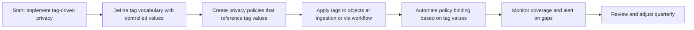
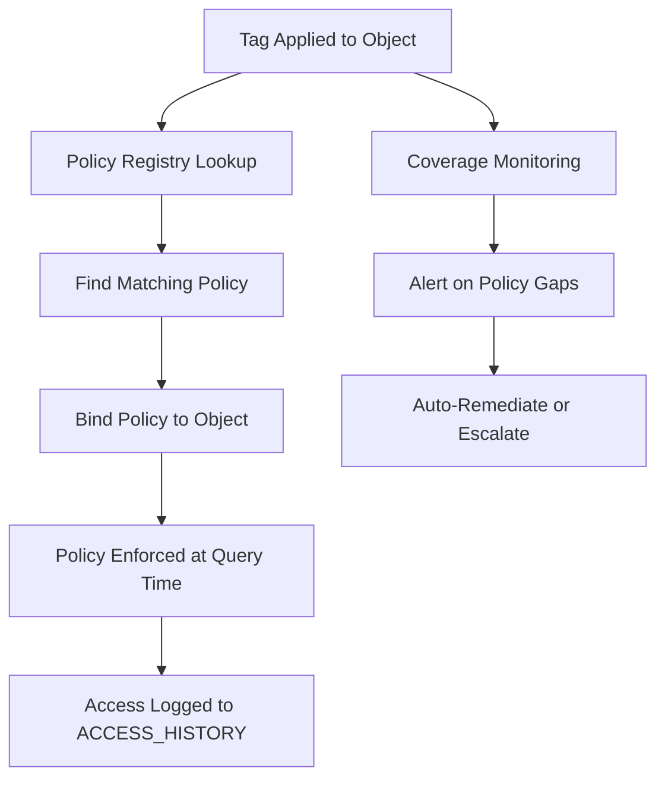
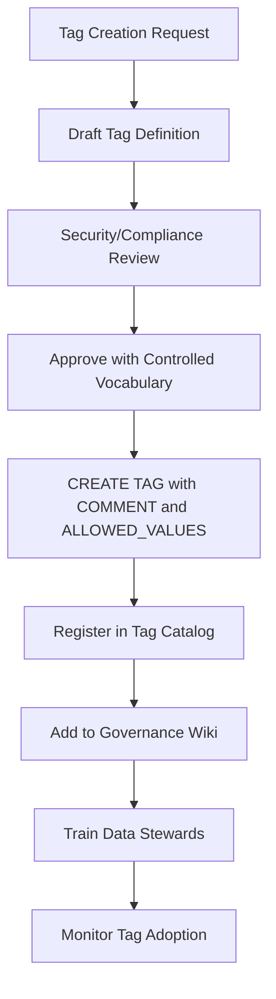
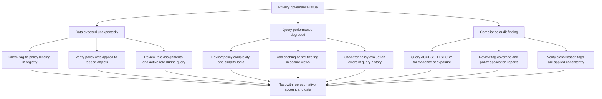
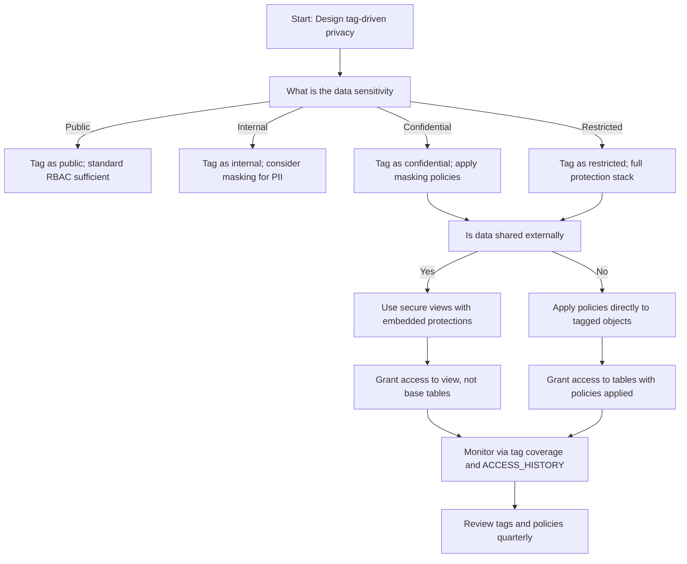

# Object Tagging and Privacy Policies in Snowflake

```mermaid
graph TD
  PrivacyGov[Object Tagging & Privacy Policies] --> Tags[Object Tagging Framework]
  PrivacyGov --> Policies[Privacy Policy Engine]
  PrivacyGov --> Lifecycle[Tag Lifecycle Management]
  PrivacyGov --> Automation[Policy Automation]
  
  Tags --> Def[Tag Definition]
  Tags --> Apply[Tag Application]
  Tags --> Query[Tag Discovery]
  Tags --> Inherit[Tag Inheritance Rules]
  
  Policies --> Mask[Masking Policy Integration]
  Policies --> RowSec[Row Access Policy Integration]
  Policies --> SecureView[Secure View Integration]
  Policies --> Audit[Privacy Audit Trail]
  
  Lifecycle --> Create[Tag Creation & Governance]
  Lifecycle --> Review[Tag Review & Certification]
  Lifecycle --> Deprecate[Tag Deprecation & Cleanup]
  
  Automation --> AutoApply[Automated Policy Binding]
  Automation --> Alert[Policy Gap Alerting]
  Automation --> Report[Compliance Reporting]
```



## Core Principles of Tag-Driven Privacy

| Principle | What It Means | Why It Matters |
|-----------|--------------|----------------|
| Tags are metadata, not access controls | Tags classify data; policies enforce protection | Separation of concerns enables flexible, auditable governance |
| Policy as code, driven by tags | Define privacy rules in SQL that reference tag values | Enables version control, testing, and reproducible deployments |
| Classify once, enforce everywhere | Apply tags at ingestion; policies automatically follow | Reduces manual effort and prevents protection gaps |
| Tags travel with data | Replicated, shared, or cloned objects retain tags | Ensures privacy controls persist across account boundaries |
| Audit tag usage, not just policy application | Track which tags drive which protections | Enables compliance evidence and continuous improvement |




## Object Tagging Framework

### What Are Tags in Snowflake

| Concept | Simple Explanation | Example |
|---------|------------------|---------|
| Tag definition | A named label with allowed values that you create | `data_classification`: public, internal, confidential, restricted |
| Tag application | Assigning a tag to a database, schema, table, column, or role | `ALTER TABLE customers MODIFY COLUMN ssn SET TAG data_classification = 'restricted'` |
| Tag inheritance | Tags on parent objects do NOT automatically apply to children | Must explicitly tag each level you want to track |
| Tag reference | Querying which objects have which tags via `TAG_REFERENCES` view | Find all columns tagged `data_classification = 'restricted'` |
| Tag-driven policy | Using tag values to automatically apply masking, row access, or other protections | Apply `mask_restricted` policy where `data_classification = 'restricted'` |

```sql
-- Create tag definition with controlled vocabulary
CREATE OR REPLACE TAG data_classification
  COMMENT = 'Data sensitivity classification per security policy v3.1. Values: public, internal, confidential, restricted. Owner: security_team. Review: quarterly.'
  ALLOWED_VALUES = ('public', 'internal', 'confidential', 'restricted');

CREATE OR REPLACE TAG data_owner
  COMMENT = 'Business owner responsible for this data. Format: team_name or individual@company.com. Owner: governance_team.';

CREATE OR REPLACE TAG retention_policy
  COMMENT = 'Data retention schedule per legal policy. Values: 30d, 90d, 1y, 3y, 7y, permanent. Owner: legal_team.';

CREATE OR REPLACE TAG compliance_scope
  COMMENT = 'Regulatory frameworks applicable to this data. Values: gdpr, hipaa, pci, soc2, none. Owner: compliance_team.';
```

### Tag Application Patterns

| Pattern | Implementation | Use Case |
|---------|---------------|----------|
| Column-level tagging | Tag individual columns for fine-grained classification | PII fields like SSN, email, phone within a table |
| Table-level tagging | Tag entire table when all columns share same sensitivity | Tables containing only public or only restricted data |
| Schema-level tagging | Tag schema to indicate domain-level classification | `raw` schema = internal; `reporting` schema = public |
| Database-level tagging | Tag database for broad business unit classification | `finance_db` = confidential; `marketing_db` = internal |
| Role-level tagging | Tag roles to indicate access level or clearance | Tag `analyst_role` with `clearance_level = 'standard'` |

```sql
-- Column-level: Tag sensitive PII fields
ALTER TABLE customers MODIFY COLUMN ssn 
  SET TAG data_classification = 'restricted',
  SET TAG compliance_scope = 'gdpr,hipaa',
  SET TAG data_owner = 'privacy_team@company.com';

ALTER TABLE customers MODIFY COLUMN email 
  SET TAG data_classification = 'confidential',
  SET TAG compliance_scope = 'gdpr',
  SET TAG data_owner = 'marketing_team@company.com';

-- Table-level: Tag entire table when uniformly sensitive
ALTER TABLE financial_transactions 
  SET TAG data_classification = 'restricted',
  SET TAG compliance_scope = 'pci,soc2',
  SET TAG retention_policy = '7y';

-- Schema-level: Tag schema for domain classification
ALTER SCHEMA raw.customer_data 
  SET TAG data_classification = 'internal',
  SET TAG data_owner = 'data_engineering_team';

-- Database-level: Tag database for business unit classification
ALTER DATABASE finance 
  SET TAG data_classification = 'confidential',
  SET TAG compliance_scope = 'soc2',
  SET TAG data_owner = 'cfo_office@company.com';
```

### Querying Tags for Discovery and Governance

```sql
-- Find all columns tagged as restricted
SELECT
  object_database,
  object_schema,
  object_name,
  column_name,
  tag_value,
  tag_owner,
  created_on
FROM SNOWFLAKE.ACCOUNT_USAGE.TAG_REFERENCES
WHERE tag_name = 'data_classification'
  AND tag_value = 'restricted'
  AND column_name IS NOT NULL  -- Column-level tags only
ORDER BY object_database, object_schema, object_name;

-- Find tables with missing retention policy tags
SELECT
  t.table_catalog,
  t.table_schema,
  t.table_name,
  t.created,
  'MISSING_RETENTION_TAG' as issue
FROM INFORMATION_SCHEMA.TABLES t
LEFT JOIN SNOWFLAKE.ACCOUNT_USAGE.TAG_REFERENCES tr
  ON t.table_name = tr.object_name
  AND tr.tag_name = 'retention_policy'
  AND tr.column_name IS NULL  -- Table-level tag
WHERE t.table_schema NOT IN ('INFORMATION_SCHEMA', 'SNOWFLAKE')
  AND tr.object_name IS NULL  -- No tag found
ORDER BY t.created DESC;

-- Find all objects owned by a specific team
SELECT
  tr.object_domain,
  tr.object_name,
  tr.column_name,
  tr.tag_value as owner,
  tr.created_on
FROM SNOWFLAKE.ACCOUNT_USAGE.TAG_REFERENCES tr
WHERE tr.tag_name = 'data_owner'
  AND tr.tag_value = 'finance_team@company.com'
ORDER BY tr.object_domain, tr.object_name;

-- Compliance report: Count objects by classification and framework
SELECT
  dc.tag_value as classification,
  cs.tag_value as compliance_framework,
  COUNT(DISTINCT dc.object_name || '.' || dc.column_name) as object_count
FROM SNOWFLAKE.ACCOUNT_USAGE.TAG_REFERENCES dc
LEFT JOIN SNOWFLAKE.ACCOUNT_USAGE.TAG_REFERENCES cs
  ON dc.object_database = cs.object_database
  AND dc.object_schema = cs.object_schema
  AND dc.object_name = cs.object_name
  AND dc.column_name = cs.column_name
  AND cs.tag_name = 'compliance_scope'
WHERE dc.tag_name = 'data_classification'
GROUP BY dc.tag_value, cs.tag_value
ORDER BY classification, compliance_framework;
```

### Tag Inheritance and Scope Rules

| Rule | What Happens | Example |
|------|-------------|---------|
| No automatic downward inheritance | Tag on database does NOT apply to schemas or tables | Tag `finance` DB as `confidential`; tables inside remain untagged unless explicitly tagged |
| No automatic upward inheritance | Tag on column does NOT apply to table or schema | Tag `ssn` column as `restricted`; table remains untagged for reporting purposes |
| Tag binding is explicit | Each object level requires separate tag application | Tag database, then schema, then table, then column as needed |
| Tag values are case-sensitive | `Restricted` != `restricted` | Use controlled vocabulary and validation to prevent inconsistencies |
| Tag definitions are account-scoped | Tags created in one account do not exist in another | Recreate tag definitions in DR or shared accounts before applying tags |

```sql
-- Verify tag application at each level
SELECT
  'Database' as level,
  database_name as object_name,
  NULL as column_name,
  tr.tag_name,
  tr.tag_value
FROM INFORMATION_SCHEMA.DATABASES d
LEFT JOIN SNOWFLAKE.ACCOUNT_USAGE.TAG_REFERENCES tr
  ON d.database_name = tr.object_name
  AND tr.object_domain = 'DATABASE'
WHERE d.database_name = 'finance'

UNION ALL

SELECT
  'Schema' as level,
  schema_name as object_name,
  NULL as column_name,
  tr.tag_name,
  tr.tag_value
FROM INFORMATION_SCHEMA.SCHEMATA s
LEFT JOIN SNOWFLAKE.ACCOUNT_USAGE.TAG_REFERENCES tr
  ON s.schema_name = tr.object_name
  AND tr.object_domain = 'SCHEMA'
WHERE s.schema_name = 'customer_data'

UNION ALL

SELECT
  'Table' as level,
  table_name as object_name,
  NULL as column_name,
  tr.tag_name,
  tr.tag_value
FROM INFORMATION_SCHEMA.TABLES t
LEFT JOIN SNOWFLAKE.ACCOUNT_USAGE.TAG_REFERENCES tr
  ON t.table_name = tr.object_name
  AND tr.object_domain = 'TABLE'
WHERE t.table_name = 'customers'

UNION ALL

SELECT
  'Column' as level,
  table_name as object_name,
  column_name,
  tr.tag_name,
  tr.tag_value
FROM INFORMATION_SCHEMA.COLUMNS c
LEFT JOIN SNOWFLAKE.ACCOUNT_USAGE.TAG_REFERENCES tr
  ON c.table_name = tr.object_name
  AND c.column_name = tr.column_name
WHERE c.table_name = 'customers'
  AND c.column_name IN ('ssn', 'email');
```


## Privacy Policy Engine: Tags Driving Protection

### Tag-to-Policy Mapping Architecture



### Policy Registry Design

```sql
-- Create central policy registry schema
CREATE SCHEMA IF NOT EXISTS governance.policy_registry
  COMMENT = 'Central registry mapping tags to privacy policies';

-- Create policy mapping table
CREATE TABLE IF NOT EXISTS governance.policy_registry.tag_to_policy (
  tag_name STRING NOT NULL,
  tag_value STRING NOT NULL,
  object_domain STRING NOT NULL,  -- TABLE, COLUMN, SCHEMA, DATABASE
  policy_type STRING NOT NULL,    -- MASKING, ROW_ACCESS, SECURE_VIEW
  policy_name STRING,             -- Name of policy to apply
  priority NUMBER DEFAULT 1,      -- For resolving conflicts
  effective_date DATE NOT NULL,
  expiration_date DATE,
  owner_role STRING NOT NULL,
  description STRING,
  test_cases STRING,              -- JSON of validation scenarios
  CONSTRAINT pk_tag_policy PRIMARY KEY (tag_name, tag_value, object_domain, policy_type)
);

-- Register masking policy mappings
INSERT INTO governance.policy_registry.tag_to_policy VALUES
  ('data_classification', 'restricted', 'COLUMN', 'MASKING', 'mask_restricted', 1, CURRENT_DATE(), NULL, 'SECURITYADMIN', 'Full hide for restricted columns', '[{"role":"ADMIN","expected":"full"},{"role":"ANALYST","expected":"masked"}]'),
  ('data_classification', 'confidential', 'COLUMN', 'MASKING', 'mask_confidential', 1, CURRENT_DATE(), NULL, 'SECURITYADMIN', 'Partial reveal for confidential columns', '[{"role":"SUPPORT","expected":"partial"},{"role":"EXTERNAL","expected":"masked"}]'),
  ('compliance_scope', 'gdpr', 'TABLE', 'ROW_ACCESS', 'row_gdpr_filter', 1, CURRENT_DATE(), NULL, 'COMPLIANCE_TEAM', 'Filter rows per GDPR data subject rights', NULL);

-- Register row access policy mappings
INSERT INTO governance.policy_registry.tag_to_policy VALUES
  ('data_owner', 'finance_team@company.com', 'TABLE', 'ROW_ACCESS', 'row_finance_access', 1, CURRENT_DATE(), NULL, 'FINANCE_ADMIN', 'Finance team row-level access control', NULL),
  ('retention_policy', '7y', 'TABLE', 'ROW_ACCESS', 'row_retention_filter', 1, CURRENT_DATE(), NULL, 'LEGAL_TEAM', 'Filter rows older than retention period', NULL);
```

### Automated Policy Binding Procedure

```sql
-- Create procedure to bind policies based on tag-to-policy registry
CREATE OR REPLACE PROCEDURE governance.apply_privacy_policies_by_tags()
RETURNS STRING
LANGUAGE SQL
AS
$$
DECLARE
  mapping_record RECORD;
  mapping_cursor CURSOR FOR
    SELECT 
      tr.object_database,
      tr.object_schema,
      tr.object_name,
      tr.column_name,
      tr.object_domain,
      tr.tag_name,
      tr.tag_value,
      tp.policy_type,
      tp.policy_name,
      tp.priority
    FROM SNOWFLAKE.ACCOUNT_USAGE.TAG_REFERENCES tr
    JOIN governance.policy_registry.tag_to_policy tp
      ON tr.tag_name = tp.tag_name
      AND tr.tag_value = tp.tag_value
      AND tr.object_domain = tp.object_domain
    WHERE tp.effective_date <= CURRENT_DATE()
      AND (tp.expiration_date IS NULL OR tp.expiration_date >= CURRENT_DATE())
      AND tr.deleted_on IS NULL;
  
  applied_count NUMBER := 0;
  error_log ARRAY := [];
BEGIN
  FOR mapping_record IN mapping_cursor DO
    BEGIN
      CASE mapping_record.policy_type
        WHEN 'MASKING' THEN
          IF mapping_record.column_name IS NOT NULL THEN
            EXECUTE IMMEDIATE 'ALTER TABLE ' || 
              mapping_record.object_database || '.' || 
              mapping_record.object_schema || '.' || 
              mapping_record.object_name ||
              ' MODIFY COLUMN ' || mapping_record.column_name ||
              ' SET MASKING POLICY ' || mapping_record.policy_name;
            applied_count := applied_count + 1;
          END IF;
          
        WHEN 'ROW_ACCESS' THEN
          -- Row policies bind to table, may use multiple columns
          EXECUTE IMMEDIATE 'ALTER TABLE ' || 
            mapping_record.object_database || '.' || 
            mapping_record.object_schema || '.' || 
            mapping_record.object_name ||
            ' ADD ROW ACCESS POLICY ' || mapping_record.policy_name ||
            ' ON (' || mapping_record.column_name || ')';
          applied_count := applied_count + 1;
          
        WHEN 'SECURE_VIEW' THEN
          -- Secure views are created separately; this logs the requirement
          INSERT INTO governance.policy_registry.secure_view_requirements
            (source_table, required_view_name, tag_context, created_date)
          VALUES
            (mapping_record.object_name, 
             'secure_' || mapping_record.object_name,
             mapping_record.tag_name || '=' || mapping_record.tag_value,
             CURRENT_TIMESTAMP());
      END CASE;
      
    EXCEPTION WHEN OTHER THEN
      error_log := ARRAY_APPEND(error_log, 
        'Error applying ' || mapping_record.policy_name || ' to ' || 
        mapping_record.object_name || ': ' || SQLERRM);
    END;
  END FOR;
  
  -- Log execution summary
  INSERT INTO governance.policy_registry.policy_application_log
    (execution_time, policies_applied, errors_encountered, executed_by)
  VALUES
    (CURRENT_TIMESTAMP(), applied_count, ARRAY_SIZE(error_log), CURRENT_USER());
  
  RETURN 'Applied ' || applied_count || ' policies. Errors: ' || ARRAY_SIZE(error_log);
END;
$$;

-- Execute automated policy binding
CALL governance.apply_privacy_policies_by_tags();
```

### Privacy Policy Types and Examples

#### Masking Policies Driven by Tags

```sql
-- Policy: Full hide for restricted classification
CREATE OR REPLACE MASKING POLICY mask_restricted
  COMMENT = 'Full hide for restricted data. Only ADMIN and SECURITY roles see full values. Owner: security_team.'
  AS (val STRING) RETURNS STRING ->
  CASE
    WHEN CURRENT_ROLE() IN ('ADMIN_ROLE', 'SECURITY_ADMIN') THEN val
    ELSE '***'
  END;

-- Policy: Partial reveal for confidential classification
CREATE OR REPLACE MASKING POLICY mask_confidential
  COMMENT = 'Partial reveal for confidential data. Support sees last 4 chars; others see masked. Owner: security_team.'
  AS (val STRING) RETURNS STRING ->
  CASE
    WHEN CURRENT_ROLE() IN ('ADMIN_ROLE', 'SECURITY_ADMIN') THEN val
    WHEN CURRENT_ROLE() = 'SUPPORT_ROLE' THEN 
      CASE 
        WHEN LENGTH(val) <= 4 THEN val
        ELSE '***' || RIGHT(val, 4)
      END
    ELSE '***'
  END;

-- Policy: Hash for analytics on confidential data
CREATE OR REPLACE MASKING POLICY mask_confidential_hash
  COMMENT = 'Hash confidential data for analytics roles. Enables grouping without raw exposure. Owner: data_governance_team.'
  AS (val STRING) RETURNS STRING ->
  CASE
    WHEN CURRENT_ROLE() IN ('ADMIN_ROLE') THEN val
    WHEN CURRENT_ROLE() IN ('ANALYTICS_ROLE', 'DATA_SCIENCE_ROLE') THEN SHA1(val)
    ELSE '***'
  END;
```

#### Row Access Policies Driven by Tags

```sql
-- Policy: GDPR data subject filtering
CREATE OR REPLACE ROW ACCESS POLICY row_gdpr_filter
  COMMENT = 'Filter rows per GDPR data subject rights. Only authorized roles can query EU resident data. Owner: compliance_team.'
  AS (resident_region STRING, data_subject_consent BOOLEAN) RETURNS BOOLEAN ->
  CASE
    -- Admins and compliance can see all
    WHEN CURRENT_ROLE() IN ('ADMIN_ROLE', 'COMPLIANCE_ROLE') THEN TRUE
    
    -- Analytics can see only consented EU data or non-EU data
    WHEN CURRENT_ROLE() = 'ANALYTICS_ROLE' THEN
      (resident_region != 'EU') OR (data_subject_consent = TRUE)
    
    -- Default deny for other roles
    ELSE FALSE
  END;

-- Policy: Retention-based row filtering
CREATE OR REPLACE ROW ACCESS POLICY row_retention_filter
  COMMENT = 'Filter rows older than retention period. Only archive_role can access expired data. Owner: legal_team.'
  AS (created_date DATE, retention_policy_tag STRING) RETURNS BOOLEAN ->
  CASE
    WHEN CURRENT_ROLE() = 'ARCHIVE_ROLE' THEN TRUE
    WHEN retention_policy_tag = 'permanent' THEN TRUE
    WHEN retention_policy_tag = '7y' AND created_date >= DATEADD(year, -7, CURRENT_DATE()) THEN TRUE
    WHEN retention_policy_tag = '1y' AND created_date >= DATEADD(year, -1, CURRENT_DATE()) THEN TRUE
    WHEN retention_policy_tag = '90d' AND created_date >= DATEADD(day, -90, CURRENT_DATE()) THEN TRUE
    ELSE FALSE
  END;
```

#### Secure View Requirements Driven by Tags

```sql
-- Create table to track secure view requirements from tag mappings
CREATE OR REPLACE TABLE governance.policy_registry.secure_view_requirements (
  requirement_id NUMBER AUTOINCREMENT,
  source_table STRING NOT NULL,
  required_view_name STRING NOT NULL,
  tag_context STRING NOT NULL,  -- e.g., "data_classification=restricted"
  projection_columns ARRAY,     -- Columns to include in view
  filter_conditions STRING,     -- WHERE clause logic
  created_date TIMESTAMP_LTZ DEFAULT CURRENT_TIMESTAMP(),
  created_by STRING DEFAULT CURRENT_USER(),
  status STRING DEFAULT 'PENDING',  -- PENDING, IMPLEMENTED, DEFERRED
  implemented_view_name STRING,
  notes STRING,
  CONSTRAINT pk_view_req PRIMARY KEY (requirement_id)
);

-- Example: Auto-generated requirement from tag mapping
INSERT INTO governance.policy_registry.secure_view_requirements
  (source_table, required_view_name, tag_context, projection_columns, filter_conditions)
VALUES
  ('raw.customer_pii', 'secure.customer_summary', 'data_classification=restricted', 
   ['customer_id', 'region', 'lifetime_value'], 
   'created_date >= DATEADD(year, -2, CURRENT_DATE())');

-- Procedure to generate secure view skeletons from requirements
CREATE OR REPLACE PROCEDURE governance.generate_secure_view_skeletons()
RETURNS STRING
LANGUAGE SQL
AS
$$
DECLARE
  req_record RECORD;
  req_cursor CURSOR FOR
    SELECT * FROM governance.policy_registry.secure_view_requirements
    WHERE status = 'PENDING';
BEGIN
  FOR req_record IN req_cursor DO
    -- Generate view DDL (simplified example)
    LET view_ddl := 'CREATE SECURE VIEW ' || req_record.required_view_name || ' AS\n' ||
                   'SELECT\n  ' || ARRAY_TO_STRING(req_record.projection_columns, ',\n  ') || '\n' ||
                   'FROM ' || req_record.source_table || '\n' ||
                   'WHERE ' || req_record.filter_conditions || ';\n\n' ||
                   '-- Grant access to approved roles only\n' ||
                   '-- GRANT SELECT ON VIEW ' || req_record.required_view_name || ' TO ROLE <approved_role>;\n\n' ||
                   '-- Owner: ' || CURRENT_USER() || '\n' ||
                   '-- Review date: ' || DATEADD(month, 3, CURRENT_DATE());
    
    -- Log the generated DDL for review
    INSERT INTO governance.policy_registry.secure_view_generated
      (requirement_id, generated_ddl, generated_date)
    VALUES
      (req_record.requirement_id, view_ddl, CURRENT_TIMESTAMP());
    
    -- Update requirement status
    UPDATE governance.policy_registry.secure_view_requirements
    SET status = 'IMPLEMENTED',
        implemented_view_name = req_record.required_view_name
    WHERE requirement_id = req_record.requirement_id;
  END FOR;
  
  RETURN 'Generated secure view skeletons for pending requirements';
END;
$$;
```


## Tag Lifecycle Management

### Tag Creation and Governance Workflow



```sql
-- Example: Tag creation with full governance documentation
CREATE OR REPLACE TAG data_classification
  COMMENT = 'Data sensitivity classification per security policy v3.1. 
  Values: 
  - public: Safe for external disclosure (marketing materials, public reports)
  - internal: For employees only (internal metrics, operational data)
  - confidential: Sensitive business data (customer lists, pricing strategies)
  - restricted: Highly sensitive regulated data (PII, PHI, financial records)
  
  Owner: security_team@company.com
  Review cycle: quarterly
  Policy mappings: See governance.policy_registry.tag_to_policy
  Last updated: ' || CURRENT_DATE()
  ALLOWED_VALUES = ('public', 'internal', 'confidential', 'restricted');

-- Register tag in central catalog
INSERT INTO governance.tag_catalog.definitions
  (tag_name, description, allowed_values, owner_role, created_date, next_review_date)
VALUES
  ('data_classification', 
   'Data sensitivity classification for privacy policy enforcement',
   'public,internal,confidential,restricted',
   'SECURITYADMIN',
   CURRENT_TIMESTAMP(),
   DATEADD(month, 3, CURRENT_DATE()));
```

### Tag Application Workflow

| Stage | Action | Automation Option |
|-------|--------|------------------|
| Ingestion | Apply tags during ETL/ELT based on source system or column name | Stored procedure that tags columns matching patterns like `%ssn%`, `%email%` |
| Schema change | Apply tags when new tables/columns are created | DDL trigger or post-deployment script that queries INFORMATION_SCHEMA |
| Manual stewardship | Data owners apply tags via governance portal or SQL | Self-service UI with approval workflow |
| Bulk classification | Apply tags to existing untagged objects | Scheduled procedure that uses heuristics or ML to suggest tags |

```sql
-- Example: Auto-tag PII columns during ingestion
CREATE OR REPLACE PROCEDURE ingestion.auto_tag_pii_columns(database_name STRING, schema_name STRING)
RETURNS STRING
LANGUAGE SQL
AS
$$
DECLARE
  col_record RECORD;
  col_cursor CURSOR FOR
    SELECT column_name, data_type, table_name
    FROM INFORMATION_SCHEMA.COLUMNS
    WHERE table_catalog = database_name
      AND table_schema = schema_name
      AND column_name IS NOT NULL;
BEGIN
  FOR col_record IN col_cursor DO
    -- Auto-tag common PII patterns
    IF UPPER(col_record.column_name) LIKE '%SSN%' OR
       UPPER(col_record.column_name) LIKE '%SOCIAL_SECURITY%' OR
       UPPER(col_record.column_name) LIKE '%TAX_ID%' THEN
      EXECUTE IMMEDIATE 'ALTER TABLE ' || database_name || '.' || schema_name || '.' || col_record.table_name ||
                        ' MODIFY COLUMN ' || col_record.column_name ||
                        ' SET TAG data_classification = ''restricted'', ' ||
                        ' SET TAG compliance_scope = ''gdpr,hipaa''';
                        
    ELSIF UPPER(col_record.column_name) LIKE '%EMAIL%' OR
          UPPER(col_record.column_name) LIKE '%E_MAIL%' THEN
      EXECUTE IMMEDIATE 'ALTER TABLE ' || database_name || '.' || schema_name || '.' || col_record.table_name ||
                        ' MODIFY COLUMN ' || col_record.column_name ||
                        ' SET TAG data_classification = ''confidential'', ' ||
                        ' SET TAG compliance_scope = ''gdpr''';
                        
    ELSIF UPPER(col_record.column_name) LIKE '%PHONE%' OR
          UPPER(col_record.column_name) LIKE '%MOBILE%' OR
          UPPER(col_record.column_name) LIKE '%TELEPHONE%' THEN
      EXECUTE IMMEDIATE 'ALTER TABLE ' || database_name || '.' || schema_name || '.' || col_record.table_name ||
                        ' MODIFY COLUMN ' || col_record.column_name ||
                        ' SET TAG data_classification = ''confidential''';
    END IF;
  END FOR;
  RETURN 'Auto-tagging complete for ' || database_name || '.' || schema_name;
END;
$$;

-- Execute after data load
CALL ingestion.auto_tag_pii_columns('raw', 'customer_data');
```

### Tag Review and Certification

```sql
-- Query to identify tags needing review
SELECT
  tag_name,
  owner_role,
  next_review_date,
  DATEDIFF(day, CURRENT_DATE(), next_review_date) as days_until_review,
  (SELECT COUNT(*) FROM SNOWFLAKE.ACCOUNT_USAGE.TAG_REFERENCES 
   WHERE tag_name = td.tag_name) as usage_count
FROM governance.tag_catalog.definitions td
WHERE next_review_date <= DATEADD(month, 1, CURRENT_DATE())
ORDER BY next_review_date;

-- Query to identify unused tags for deprecation consideration
SELECT
  td.tag_name,
  td.created_date,
  COUNT(tr.object_name) as objects_tagged,
  MAX(tr.created_on) as last_tag_applied
FROM governance.tag_catalog.definitions td
LEFT JOIN SNOWFLAKE.ACCOUNT_USAGE.TAG_REFERENCES tr
  ON td.tag_name = tr.tag_name
WHERE td.status = 'ACTIVE'
GROUP BY td.tag_name, td.created_date
HAVING COUNT(tr.object_name) = 0
   OR MAX(tr.created_on) < DATEADD(month, -12, CURRENT_TIMESTAMP());

-- Deprecate a tag (soft delete)
UPDATE governance.tag_catalog.definitions
SET
  status = 'DEPRECATED',
  deprecated_date = CURRENT_TIMESTAMP(),
  deprecated_by = CURRENT_USER(),
  notes = 'Replaced by data_classification_v2 with expanded vocabulary'
WHERE tag_name = 'legacy_sensitivity_tag';

-- Alert when tags near review date
CREATE OR REPLACE ALERT governance.tag_review_due
  WAREHOUSE = governance_wh
  SCHEDULE = 'USING CRON 0 9 * * 1'  -- Weekly on Monday
  CONDITION = (
    SELECT COUNT(*)
    FROM governance.tag_catalog.definitions
    WHERE status = 'ACTIVE'
      AND next_review_date BETWEEN CURRENT_DATE() AND DATEADD(day, 30, CURRENT_DATE())
  ) > 0
  ACTION = (
    SYSTEM$SEND_EMAIL(
      'governance-team@company.com',
      'Alert: Tags due for review',
      'Review the following tags: ' ||
      (SELECT LISTAGG(tag_name, ', ') 
       FROM governance.tag_catalog.definitions
       WHERE status = 'ACTIVE'
         AND next_review_date BETWEEN CURRENT_DATE() AND DATEADD(day, 30, CURRENT_DATE()))
    )
  );
```


## Privacy Policy Automation and Monitoring

### Policy Coverage Monitoring Views

```sql
-- View 1: Columns with classification tags but no masking policy
CREATE OR REPLACE VIEW governance.monitor.unmasked_classified_columns AS
SELECT
  tr.object_database,
  tr.object_schema,
  tr.object_name,
  tr.column_name,
  tr.tag_value as classification,
  'MISSING_MASKING_POLICY' as issue,
  CURRENT_TIMESTAMP() as detected_at,
  'Apply masking policy per tag_to_policy registry' as remediation
FROM SNOWFLAKE.ACCOUNT_USAGE.TAG_REFERENCES tr
LEFT JOIN SNOWFLAKE.ACCOUNT_USAGE.MASKING_POLICIES mp
  ON tr.column_name = mp.column_name
  AND tr.object_name = mp.table_name
WHERE tr.tag_name = 'data_classification'
  AND tr.tag_value IN ('confidential', 'restricted')
  AND tr.column_name IS NOT NULL
  AND mp.policy_name IS NULL;

-- View 2: Tables with restricted classification but no row access policy
CREATE OR REPLACE VIEW governance.monitor.unprotected_restricted_tables AS
SELECT
  tr.object_database,
  tr.object_schema,
  tr.object_name,
  tr.tag_value as classification,
  'MISSING_ROW_ACCESS_POLICY' as issue,
  CURRENT_TIMESTAMP() as detected_at,
  'Apply row access policy per tag_to_policy registry' as remediation
FROM SNOWFLAKE.ACCOUNT_USAGE.TAG_REFERENCES tr
LEFT JOIN SNOWFLAKE.ACCOUNT_USAGE.ROW_ACCESS_POLICIES rap
  ON tr.object_name = rap.table_name
WHERE tr.tag_name = 'data_classification'
  AND tr.tag_value = 'restricted'
  AND tr.column_name IS NULL  -- Table-level tag
  AND rap.policy_name IS NULL;

-- View 3: Compliance framework coverage gaps
CREATE OR REPLACE VIEW governance.monitor.compliance_coverage_gaps AS
SELECT
  cs.tag_value as compliance_framework,
  COUNT(DISTINCT cs.object_name || '.' || cs.column_name) as total_objects_in_scope,
  COUNT(DISTINCT CASE WHEN mp.policy_name IS NOT NULL OR rap.policy_name IS NOT NULL 
    THEN cs.object_name || '.' || cs.column_name END) as objects_with_protection,
  ROUND(100.0 * COUNT(DISTINCT CASE WHEN mp.policy_name IS NOT NULL OR rap.policy_name IS NOT NULL 
    THEN cs.object_name || '.' || cs.column_name END) / 
    NULLIF(COUNT(DISTINCT cs.object_name || '.' || cs.column_name), 0), 2) as protection_coverage_pct
FROM SNOWFLAKE.ACCOUNT_USAGE.TAG_REFERENCES cs
LEFT JOIN SNOWFLAKE.ACCOUNT_USAGE.MASKING_POLICIES mp
  ON cs.column_name = mp.column_name
LEFT JOIN SNOWFLAKE.ACCOUNT_USAGE.ROW_ACCESS_POLICIES rap
  ON cs.object_name = rap.table_name
WHERE cs.tag_name = 'compliance_scope'
GROUP BY cs.tag_value
HAVING protection_coverage_pct < 100;
```

### Automated Alerting for Policy Gaps

```sql
-- Alert: Unmasked restricted columns detected
CREATE OR REPLACE ALERT governance.alert_unmasked_restricted
  WAREHOUSE = governance_wh
  SCHEDULE = 'USING CRON 0 8 * * 1-5'  -- Weekdays at 8 AM
  CONDITION = (
    SELECT COUNT(*) FROM governance.monitor.unmasked_classified_columns
  ) > 0
  ACTION = (
    -- Log to audit table first
    INSERT INTO governance.alert_audit
      (alert_name, triggered_at, issue_count, details)
    SELECT
      'unmasked_restricted_alert',
      CURRENT_TIMESTAMP(),
      COUNT(*),
      LISTAGG(object_schema || '.' || object_name || '.' || column_name, ', ')
    FROM governance.monitor.unmasked_classified_columns;
    
    -- Send notification
    SYSTEM$SEND_EMAIL(
      'security-team@company.com',
      'Alert: ' || (SELECT COUNT(*) FROM governance.monitor.unmasked_classified_columns) || ' unmasked restricted columns',
      'Columns requiring masking: ' || 
      (SELECT LISTAGG(object_schema || '.' || object_name || '.' || column_name, '\n')
       FROM governance.monitor.unmasked_classified_columns) ||
      '\n\nReview in Snowflake or respond to this email.'
    )
  );

-- Alert: Compliance coverage below threshold
CREATE OR REPLACE ALERT governance.alert_compliance_coverage_low
  WAREHOUSE = governance_wh
  SCHEDULE = 'USING CRON 0 10 * * 1'  -- Weekly on Monday
  CONDITION = (
    SELECT COUNT(*)
    FROM governance.monitor.compliance_coverage_gaps
    WHERE protection_coverage_pct < 95  -- Alert if below 95% coverage
  ) > 0
  ACTION = (
    SYSTEM$SEND_SLACK_MESSAGE(
      'https://hooks.slack.com/services/XXX',
      '⚠️ Compliance coverage below threshold:\n' ||
      (SELECT LISTAGG(compliance_framework || ': ' || protection_coverage_pct || '%', '\n')
       FROM governance.monitor.compliance_coverage_gaps
       WHERE protection_coverage_pct < 95) ||
      '\n\nReview governance.monitor.compliance_coverage_gaps'
    )
  );
```

### Compliance Reporting Queries

```sql
-- Report 1: Privacy policy coverage by classification level
SELECT
  tr.tag_value as classification,
  COUNT(DISTINCT tr.object_name || '.' || tr.column_name) as total_classified_columns,
  COUNT(DISTINCT CASE WHEN mp.policy_name IS NOT NULL THEN tr.object_name || '.' || tr.column_name END) as columns_with_masking,
  COUNT(DISTINCT CASE WHEN rap.policy_name IS NOT NULL THEN tr.object_name END) as tables_with_row_policy,
  ROUND(100.0 * COUNT(DISTINCT CASE WHEN mp.policy_name IS NOT NULL THEN tr.object_name || '.' || tr.column_name END) / 
        NULLIF(COUNT(DISTINCT tr.object_name || '.' || tr.column_name), 0), 2) as masking_coverage_pct,
  CURRENT_TIMESTAMP() as report_time
FROM SNOWFLAKE.ACCOUNT_USAGE.TAG_REFERENCES tr
LEFT JOIN SNOWFLAKE.ACCOUNT_USAGE.MASKING_POLICIES mp
  ON tr.column_name = mp.column_name
LEFT JOIN SNOWFLAKE.ACCOUNT_USAGE.ROW_ACCESS_POLICIES rap
  ON tr.object_name = rap.table_name
WHERE tr.tag_name = 'data_classification'
GROUP BY tr.tag_value
ORDER BY tr.tag_value;

-- Report 2: GDPR compliance evidence
SELECT
  'GDPR Data Subjects' as metric,
  COUNT(DISTINCT CASE WHEN tr.tag_value = 'restricted' THEN tr.object_name || '.' || tr.column_name END) as restricted_pii_columns,
  COUNT(DISTINCT CASE WHEN mp.policy_name IS NOT NULL AND tr.tag_value = 'restricted' THEN tr.object_name || '.' || tr.column_name END) as protected_pii_columns,
  ROUND(100.0 * COUNT(DISTINCT CASE WHEN mp.policy_name IS NOT NULL AND tr.tag_value = 'restricted' THEN tr.object_name || '.' || tr.column_name END) / 
        NULLIF(COUNT(DISTINCT CASE WHEN tr.tag_value = 'restricted' THEN tr.object_name || '.' || tr.column_name END), 0), 2) as protection_pct
FROM SNOWFLAKE.ACCOUNT_USAGE.TAG_REFERENCES tr
LEFT JOIN SNOWFLAKE.ACCOUNT_USAGE.MASKING_POLICIES mp
  ON tr.column_name = mp.column_name
WHERE tr.tag_name IN ('data_classification', 'compliance_scope')
  AND (tr.tag_value = 'restricted' OR tr.tag_value = 'gdpr');

-- Report 3: Tag adoption by team
SELECT
  tr.tag_value as data_owner,
  COUNT(DISTINCT tr.object_name) as tables_tagged,
  COUNT(DISTINCT tr.column_name) as columns_tagged,
  COUNT(DISTINCT CASE WHEN mp.policy_name IS NOT NULL THEN tr.object_name || '.' || tr.column_name END) as protected_objects,
  CURRENT_TIMESTAMP() as report_time
FROM SNOWFLAKE.ACCOUNT_USAGE.TAG_REFERENCES tr
LEFT JOIN SNOWFLAKE.ACCOUNT_USAGE.MASKING_POLICIES mp
  ON tr.column_name = mp.column_name
WHERE tr.tag_name = 'data_owner'
GROUP BY tr.tag_value
ORDER BY tables_tagged DESC;
```


## Best Practices and Common Pitfalls

### Tagging Best Practices

| Practice | Implementation | Benefit |
|----------|---------------|---------|
| Define controlled vocabularies | Use `ALLOWED_VALUES` on tag definitions | Prevents inconsistent tag values like `Restricted` vs `restricted` |
| Tag at the most granular level needed | Column-level for PII; table-level for uniform sensitivity | Enables precise policy application without over-tagging |
| Document tag semantics in COMMENT | Include definition, values, owner, review cycle | Enables self-service understanding and audit readiness |
| Automate tag application at ingestion | Use stored procedures to tag columns matching patterns | Reduces manual effort and prevents classification gaps |
| Register tags in central catalog | Maintain `governance.tag_catalog.definitions` table | Enables discovery, review scheduling, and impact analysis |
| Review tags quarterly | Schedule TASK to alert on tags near review date | Ensures tags stay relevant as business and regulations evolve |

### Privacy Policy Best Practices

| Practice | Implementation | Benefit |
|----------|---------------|---------|
| Map tags to policies in registry | Use `governance.policy_registry.tag_to_policy` table | Enables automated, auditable policy binding |
| Keep policy logic simple | Avoid nested CASE statements; use secure views for complex logic | Easier to test, audit, and maintain |
| Test policies with representative roles | Create test script that validates behavior per role | Catches misconfigurations before production deployment |
| Monitor policy coverage continuously | Use monitoring views and automated alerts | Detects gaps before they become compliance incidents |
| Document policy rationale | Add COMMENT to policies with business justification | Enables audits to understand why protections exist |
| Review policies quarterly | Schedule TASK to alert on policies near review date | Ensures policies stay aligned with evolving requirements |

### Common Pitfalls and Mitigations

| Pitfall | What Happens | How To Fix |
|---------|--------------|------------|
| Tagging without policy enforcement | Tags exist but do not drive any protections | Build automation that uses tag_to_policy registry to bind policies |
| Over-tagging with free-text values | Inconsistent values like `confidential`, `Confidential`, `CONF` break policy matching | Use `ALLOWED_VALUES` and validate at application time |
| Assuming tag inheritance | Expecting database tag to apply to tables; it does not | Explicitly tag each object level; document inheritance rules |
| Complex policy logic | Nested CASE statements are hard to audit and debug | Keep policies simple; use secure views for complex transformations |
| Not testing with real roles | Policies behave differently than expected in production | Test with representative roles and data before deploying |
| Forgetting to review tags/policies | Tags and policies become stale as business rules change | Schedule quarterly reviews with documented owners and change logs |
| Replicating data without tags | DR or shared accounts lack classification context | Pre-stage tag definitions and apply tags during replication workflow |
| Ignoring performance impact | Policies add latency to queries, especially at scale | Monitor query performance; optimize policy logic; cache results where possible |




## Decision Framework: Tag-Driven Privacy Design



| Question | If Yes | If No |
|----------|--------|-------|
| Is data regulated or highly sensitive | Tag as restricted; apply full protection stack | Tag as internal/confidential; selective masking may suffice |
| Is data shared externally | Use secure views with embedded protections; never share raw tagged tables | Direct table access with policies may work for internal consumers |
| Do multiple teams need different views | Create secure views per consumer type with tailored projections | Single table with masking policies may be sufficient |
| Is analytics use case important | Use hash-based masking to enable grouping without raw exposure | Full masking or column grants may be appropriate |
| Do protection rules change frequently | Use tag-driven policy automation for scalable management | Manual policy updates may be acceptable for stable requirements |


## Key Principles to Remember

- Tags classify; policies protect. Keep these concerns separate for flexibility and auditability.
- Controlled vocabularies prevent inconsistency. Use `ALLOWED_VALUES` and validate at application.
- Automate policy binding. Manual application does not scale and invites gaps.
- Test before you deploy. Verify policy behavior with representative roles and data.
- Monitor coverage continuously. Automated alerts catch gaps before they become incidents.
- Document everything. Tags, policies, and mappings need clear rationale for audits.
- Review quarterly. Tags and policies must evolve with business and regulatory changes.

## Bottom Line

- Object tagging in Snowflake is your metadata foundation for privacy governance.
- Tags classify data sensitivity, ownership, retention, and compliance scope.
- Privacy policies (masking, row access, secure views) are driven by tag values via a central registry.
- Automation binds policies to tagged objects, monitors coverage, and alerts on gaps.
- Testing and documentation ensure policies work as intended and stand up to audit.
- Review and adjust regularly. Privacy requirements evolve; your tag-driven system should too.

Think of tag-driven privacy like a museum catalog system:
- Tags are the catalog cards. They tell you what each artifact is, who owns it, and how it should be handled.
- Policies are the display rules. Some artifacts go behind glass. Some are redacted. Some are restricted to curators only.
- The registry is the master index. It maps catalog values to display rules consistently.
- Automation is the robotic arm. It applies the right display rule to each artifact based on its catalog card.
- Monitoring is the security camera. It watches for artifacts that are misclassified or unprotected.
- Review is the conservation schedule. Catalog cards and display rules are updated as artifacts age or regulations change.

Catalog your artifacts. Protect what matters. Enable what is needed. Document your rules. Review regularly. That is how tag-driven privacy works in Snowflake.
