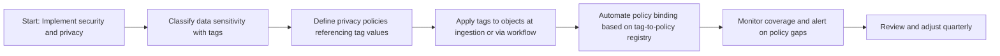
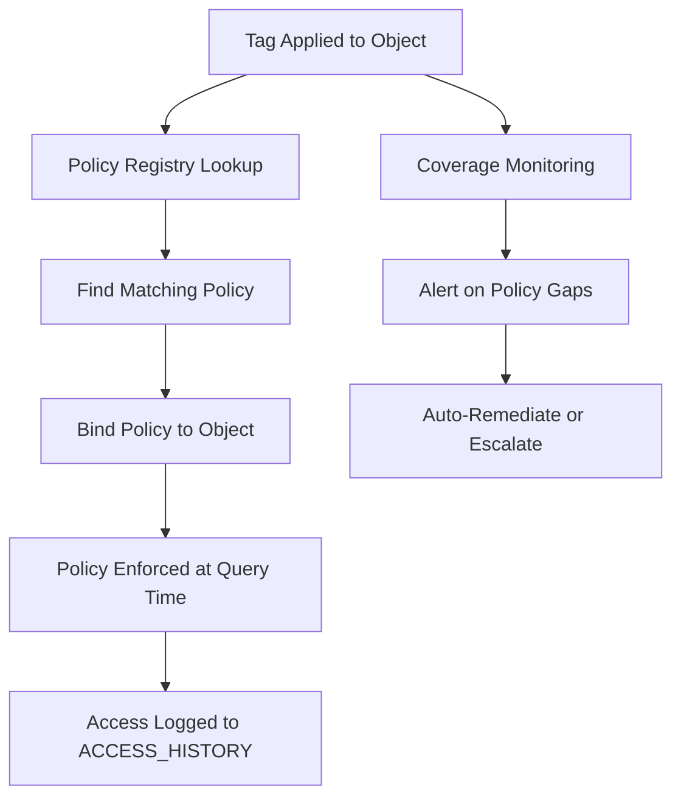
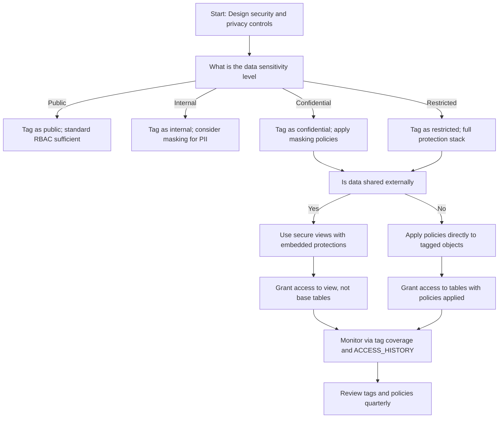

# Domain 2.2: Security and Privacy in Snowflake Data Governance

```mermaid
graph TD
  SecPrivacy[Security and Privacy] --> Mask[Dynamic Data Masking]
  SecPrivacy --> RowSec[Row Access Policies]
  SecPrivacy --> ColSec[Column-Level Security]
  SecPrivacy --> SecureView[Secure Views]
  SecPrivacy --> Tags[Object Tagging Framework]
  SecPrivacy --> Policy[Privacy Policy Automation]
  SecPrivacy --> Audit[Privacy Audit and Monitoring]
  
  Mask --> Def[Policy Definition]
  Mask --> Bind[Column Binding]
  Mask --> Eval[Runtime Evaluation]
  
  RowSec --> Filter[Row Filter Logic]
  RowSec --> Context[Role/Attribute Context]
  RowSec --> BindRow[Table Binding]
  
  Tags --> Classify[Classification Tags]
  Tags --> Owner[Ownership Tags]
  Tags --> Retention[Retention Tags]
  Tags --> Compliance[Compliance Tags]
  
  Policy --> AutoBind[Automated Policy Binding]
  Policy --> GapAlert[Policy Gap Alerting]
  Policy --> Report[Compliance Reporting]
  
  Audit --> AccessHist[ACCESS_HISTORY]
  Audit --> TagRef[TAG_REFERENCES]
  Audit --> QueryHist[QUERY_HISTORY]
```



## Core Security and Privacy Principles

| Principle | What It Means | Why It Matters |
|-----------|--------------|----------------|
| Protect data, not just objects | Security must follow the data at column and row level | Tables contain fields with different sensitivity; one-size-fits-all access is insufficient |
| Classify before you protect | Tags identify what needs protection; policies enforce it | You cannot secure what you have not identified and classified |
| Policy as code, not configuration | Define masking and row rules in version-controlled SQL | Enables review, testing, reproducible deployments, and audit trails |
| Evaluate at query time, not storage time | Transform or filter when data is accessed, not when stored | Same data can serve multiple security contexts without duplication |
| Least privilege by column and row | Grant minimum access at the most granular level needed | Reduces blast radius if credentials or roles are compromised |
| Audit what was seen, not just queried | Log actual values returned to users, not just SQL executed | Compliance requires proof of data exposure, not just access attempts |
| Tags travel with data | Replicated, shared, or cloned objects retain classification | Ensures privacy controls persist across account boundaries and use cases |




## Dynamic Data Masking

### What Dynamic Data Masking Does

| Concept | Simple Explanation | Example |
|---------|------------------|---------|
| Masking policy | A SQL function that transforms column values based on caller context | Show full email to HR, partial to support, masked to others |
| Policy evaluation | Happens at query time, after authorization, before results return | Same query returns different values for different roles |
| Policy binding | Attach a policy to a column of compatible data type | Bind `email_mask` policy to all `VARCHAR` email columns |
| Policy reuse | One policy definition can protect many columns across tables | Consistent masking logic without repeating code |
| Context awareness | Policy logic can reference `CURRENT_ROLE()`, `CURRENT_USER()`, session variables | Personalize masking based on who is asking and why |

```sql
-- Create a masking policy for email addresses
CREATE OR REPLACE MASKING POLICY email_mask
  COMMENT = 'Mask email for non-HR roles. HR sees full, support sees partial, others see ***. Owner: security_team.'
  AS (val STRING) RETURNS STRING ->
  CASE
    WHEN CURRENT_ROLE() IN ('HR_ROLE', 'SECURITY_ADMIN') THEN val
    WHEN CURRENT_ROLE() = 'SUPPORT_ROLE' THEN REGEXP_REPLACE(val, '^.+@', '***@')
    ELSE '***@***.***'
  END;

-- Bind policy to columns across tables
ALTER TABLE customers MODIFY COLUMN email SET MASKING POLICY email_mask;
ALTER TABLE users MODIFY COLUMN contact_email SET MASKING POLICY email_mask;
ALTER TABLE leads MODIFY COLUMN work_email SET MASKING POLICY email_mask;

-- Query returns different results based on caller role
USE ROLE hr_role;
SELECT email FROM customers LIMIT 1;  -- Returns: jane.doe@company.com

USE ROLE support_role;
SELECT email FROM customers LIMIT 1;  -- Returns: ***@company.com

USE ROLE analyst_role;
SELECT email FROM customers LIMIT 1;  -- Returns: ***@***.***
```

### Masking Policy Design Patterns

| Pattern | Policy Logic | Use Case | When To Use |
|---------|-------------|----------|-------------|
| Full hide | Return `'***'` for unauthorized roles | SSN, health info, passwords | Highly sensitive data with no business need for partial exposure |
| Partial reveal | Show last N characters or specific format | Phone numbers, account IDs, credit cards | Data needed for identification or support but not full exposure |
| Hash for analytics | Return `SHA1(val)` or `MD5(val)` for authorized roles | Enable grouping/joining without exposing raw values | Analytics use cases where exact values are not required |
| Format-preserving mask | Keep data type and format while masking | Applications expect specific formats like `XXX-XX-1234` | Legacy systems or integrations that validate format |
| Conditional masking | Different masks for different roles or session contexts | Tiered access model with multiple clearance levels | Complex organizations with nuanced access requirements |
| Tokenization passthrough | Return token from external vault for unauthorized roles | Integrate with external tokenization service | When tokens must be consistent across systems |

```sql
-- Pattern: Partial reveal for phone numbers
CREATE OR REPLACE MASKING POLICY phone_mask
  AS (val STRING) RETURNS STRING ->
  CASE
    WHEN CURRENT_ROLE() IN ('HR_ROLE', 'ADMIN_ROLE') THEN val
    WHEN CURRENT_ROLE() = 'SUPPORT_ROLE' THEN 
      REGEXP_REPLACE(val, '(\\d{3}-\\d{3}-)\\d{4}', '\\1****')
    ELSE '***-***-****'
  END;

-- Pattern: Hash for analytics without raw exposure
CREATE OR REPLACE MASKING POLICY email_hash_analytics
  AS (val STRING) RETURNS STRING ->
  CASE
    WHEN CURRENT_ROLE() IN ('ADMIN_ROLE') THEN val
    WHEN CURRENT_ROLE() IN ('ANALYTICS_ROLE', 'DATA_SCIENCE_ROLE') THEN SHA1(val)
    ELSE '***'
  END;

-- Pattern: Format-preserving mask for credit cards
CREATE OR REPLACE MASKING POLICY cc_mask_format
  AS (val STRING) RETURNS STRING ->
  CASE
    WHEN CURRENT_ROLE() IN ('FINANCE_ROLE', 'ADMIN_ROLE') THEN val
    ELSE REGEXP_REPLACE(val, '(\\d{4}-\\d{4}-\\d{4}-)\\d{4}', '\\1****')
  END;
```

### Binding Masking Policies at Scale

```sql
-- Method 1: Manual binding for specific columns (precise but tedious)
ALTER TABLE customers MODIFY COLUMN ssn SET MASKING POLICY ssn_mask;
ALTER TABLE customers MODIFY COLUMN email SET MASKING POLICY email_mask;

-- Method 2: Bulk binding via stored procedure using tags (scalable)
CREATE OR REPLACE PROCEDURE governance.apply_masking_by_classification()
RETURNS STRING
LANGUAGE SQL
AS
$$
DECLARE
  col_record RECORD;
  col_cursor CURSOR FOR
    SELECT 
      object_database, object_schema, object_name, column_name, tag_value
    FROM SNOWFLAKE.ACCOUNT_USAGE.TAG_REFERENCES
    WHERE tag_name = 'data_classification'
      AND column_name IS NOT NULL
      AND tag_value IN ('confidential', 'restricted');
BEGIN
  FOR col_record IN col_cursor DO
    CASE col_record.tag_value
      WHEN 'restricted' THEN
        EXECUTE IMMEDIATE 'ALTER TABLE ' || 
          col_record.object_database || '.' || col_record.object_schema || '.' || col_record.object_name ||
          ' MODIFY COLUMN ' || col_record.column_name ||
          ' SET MASKING POLICY mask_restricted';
      WHEN 'confidential' THEN
        EXECUTE IMMEDIATE 'ALTER TABLE ' || 
          col_record.object_database || '.' || col_record.object_schema || '.' || col_record.object_name ||
          ' MODIFY COLUMN ' || col_record.column_name ||
          ' SET MASKING POLICY mask_confidential';
    END CASE;
  END FOR;
  RETURN 'Masking policies applied successfully';
END;
$$;

-- Execute bulk binding
CALL governance.apply_masking_by_classification();
```


## Row Access Policies: Row-Level Security

### What Row Access Policies Do

| Concept | Simple Explanation | Example |
|---------|------------------|---------|
| Row access policy | A SQL function that returns TRUE/FALSE to control which rows a user can see | Sales reps see only their region; managers see all regions |
| Policy evaluation | Happens at query time, after authorization, before results return | Same `SELECT * FROM sales` returns different rows for different roles |
| Policy binding | Attach policy to a table column that determines row filtering | Bind `regional_access` policy to the `region` column |
| Multi-column policies | Policy function can accept multiple columns for complex logic | Filter by region AND date AND department simultaneously |
| Context awareness | Policy logic can reference roles, users, session variables, or metadata tables | Personalize access based on user attributes stored centrally |

```sql
-- Create a row access policy based on role and region
CREATE OR REPLACE ROW ACCESS POLICY regional_access
  COMMENT = 'Filter rows by region based on caller role. Admins see all, sales see their region, partners see approved regions.'
  AS (region STRING, created_date DATE) RETURNS BOOLEAN ->
  CASE
    WHEN CURRENT_ROLE() IN ('ADMIN_ROLE', 'EXEC_ROLE') THEN TRUE
    WHEN CURRENT_ROLE() = 'SALES_NORTH_ROLE' AND region = 'North' THEN TRUE
    WHEN CURRENT_ROLE() = 'SALES_SOUTH_ROLE' AND region = 'South' THEN TRUE
    WHEN CURRENT_ROLE() = 'PARTNER_ROLE' 
      AND region IN ('North', 'South') 
      AND created_date >= DATEADD(month, -6, CURRENT_DATE()) THEN TRUE
    ELSE FALSE
  END;

-- Bind policy to table columns that drive filtering logic
ALTER TABLE sales ADD ROW ACCESS POLICY regional_access ON (region, created_date);

-- Query returns different rows based on caller role
USE ROLE admin_role;
SELECT COUNT(*) FROM sales;  -- Returns: 1,000,000 rows

USE ROLE sales_north_role;
SELECT COUNT(*) FROM sales;  -- Returns: ~250,000 rows (North region only)

USE ROLE partner_role;
SELECT COUNT(*) FROM sales;  -- Returns: ~100,000 rows (North+South, last 6 months)
```

### Row Access Policy Design Patterns

| Pattern | Policy Logic | Use Case | Implementation Notes |
|---------|-------------|----------|---------------------|
| Role-based filtering | `CURRENT_ROLE() IN (allowed_roles)` | Different teams see different regional or departmental data | Simple, fast, easy to audit; but inflexible for dynamic attributes |
| Attribute-based filtering | Join to user metadata table for department, region, clearance | Filter by user attributes stored in a central identity system | More flexible; requires join performance consideration |
| Time-based filtering | `created_date >= DATEADD(...)` or `valid_until >= CURRENT_DATE()` | Restrict access to recent data only or time-bound access | Combine with role logic for temporal access control |
| Account-based filtering | `CURRENT_ACCOUNT() = allowed_account` | Control access in multi-account sharing or replication scenarios | Critical for cross-account governance |
| Combination logic | Role AND attribute AND time conditions | Complex access rules for regulated or highly sensitive data | Keep logic simple; use secure views for complex transformations |

```sql
-- Pattern: Attribute-based using user metadata table
CREATE OR REPLACE ROW ACCESS POLICY dept_access
  AS (dept_id NUMBER) RETURNS BOOLEAN ->
  EXISTS (
    SELECT 1
    FROM security.user_departments ud
    WHERE ud.user_name = CURRENT_USER()
      AND ud.dept_id = dept_id
      AND ud.active = TRUE
      AND ud.valid_until >= CURRENT_DATE()
  );

-- Pattern: Time-based for recent data only
CREATE OR REPLACE ROW ACCESS POLICY recent_data_only
  AS (created_date DATE, last_modified_date DATE) RETURNS BOOLEAN ->
  GREATEST(created_date, COALESCE(last_modified_date, created_date)) 
    >= DATEADD(month, -12, CURRENT_DATE());
```


## Column-Level Security Approaches

### Understanding Column Security in Snowflake

| Approach | What It Controls | When To Use | Limitations |
|----------|-----------------|-------------|------------|
| Column masking policies | Transform column values at query time based on role | Sensitive columns that need different visibility per role | Does not prevent column access; only transforms output |
| Column-level grants (`GRANT SELECT (col1, col2)`) | Control which columns a role can reference in queries | When some columns should be completely invisible to certain roles | Does not transform values; all-or-nothing access per column |
| Secure views with column projection | Expose only approved columns through a view | When you want to completely hide sensitive columns from certain consumers | Requires maintaining view definitions; adds abstraction layer |
| Combination: masking + grants + views | Layered protection for highly sensitive data | Regulated data with complex access requirements | More complex to manage; requires thorough testing |

```sql
-- Approach 1: Column masking (transform but do not hide)
CREATE OR REPLACE MASKING POLICY ssn_mask
  AS (val STRING) RETURNS STRING ->
  CASE
    WHEN CURRENT_ROLE() IN ('HR_ROLE', 'ADMIN_ROLE') THEN val
    ELSE '***-**-****'
  END;
ALTER TABLE employees MODIFY COLUMN ssn SET MASKING POLICY ssn_mask;
-- Users can still SELECT ssn, but see masked values based on role

-- Approach 2: Column-level grants (hide completely)
GRANT SELECT (employee_id, first_name, last_name, department) 
  ON TABLE employees TO ROLE analyst_role;
-- analyst_role cannot reference ssn, salary, or other restricted columns in queries

-- Approach 3: Secure view with column projection
CREATE SECURE VIEW hr.employee_directory AS
SELECT employee_id, first_name, last_name, department, title, work_email
FROM raw.employees;
-- ssn, salary, home_address, etc. are completely hidden
GRANT SELECT ON VIEW hr.employee_directory TO ROLE analyst_role;
```

### When To Use Each Column Security Approach

| Scenario | Recommended Approach | Why |
|----------|---------------------|-----|
| PII that needs partial exposure (e.g., last 4 of SSN) | Masking policy | Transforms values while keeping column accessible |
| Highly sensitive columns that should never be queried by certain roles | Column-level grants | Prevents any reference to the column in queries |
| External consumers who should see only curated columns | Secure view with projection | Completely hides unapproved columns and logic |
| Regulated data with tiered access (full/partial/none) | Layered: masking + grants + views | Defense in depth; meets complex compliance requirements |
| Analytics use cases needing grouping on sensitive values | Masking with hash function | Enables `GROUP BY hashed_email` without exposing raw values |
| Legacy applications expecting specific column formats | Format-preserving masking | Maintains application compatibility while protecting data |


## Secure Views: Hiding Logic and Data

### What Secure Views Do

| Concept | Simple Explanation | Example |
|---------|------------------|---------|
| Secure view | A view whose definition is hidden from users without ownership | Share aggregated results without exposing source tables or join logic |
| Definition hiding | Users can query the view but cannot see `SHOW VIEW` definition or underlying tables | Protects business logic, proprietary algorithms, and sensitive join conditions |
| Access control layer | Grant `SELECT` on view, not base tables; users cannot bypass view to access raw data | Enforces masking, row policies, and column projection at the view layer |
| Embedded transformations | Apply masking, aggregation, or filtering logic inside the view definition | Centralize protection logic; consumers cannot accidentally bypass it |

```sql
-- Create a secure view that hides underlying logic and sensitive columns
CREATE SECURE VIEW analytics.customer_lifetime_summary
  COMMENT = 'Aggregated customer metrics for external partners. Hides raw order details and PII.'
AS
SELECT 
  c.customer_id, c.region,
  COUNT(o.order_id) as total_orders,
  SUM(o.order_total) as lifetime_value,
  AVG(o.order_total) as avg_order_value,
  MAX(o.order_date) as last_order_date
FROM raw.customers c
LEFT JOIN raw.orders o ON c.customer_id = o.customer_id
WHERE c.status = 'active'
  AND o.order_date >= DATEADD(year, -2, CURRENT_DATE())
GROUP BY c.customer_id, c.region;

-- Grant access to view, not base tables
GRANT SELECT ON VIEW analytics.customer_lifetime_summary TO ROLE partner_role;

-- Partner can query the view but cannot:
-- 1. See the underlying raw.customers or raw.orders table structures
-- 2. See the aggregation logic, filters, or join conditions in the view definition
-- 3. Bypass the view to access raw order details or PII columns
-- 4. See columns that were not projected (e.g., customer email, address, phone)
```

### Secure View Design Patterns

| Pattern | Implementation | Use Case |
|---------|---------------|----------|
| Aggregation view | Pre-aggregate sensitive details; expose only summaries | Share metrics with external partners without exposing individual records |
| Column projection | Select only approved columns; omit sensitive fields entirely | Limit data exposure without needing per-column masking policies |
| Row filtering in view | Include `WHERE` clause to enforce row-level access at view layer | Combine with row access policies for defense in depth |
| Embedded masking | Apply masking functions directly in view `SELECT` list | Centralize transformation logic; consumers cannot bypass |
| Logic encapsulation | Hide complex business rules, calculations, or proprietary algorithms | Protect intellectual property while enabling data consumption |
| Multi-source abstraction | Join multiple tables but expose only curated result set | Simplify consumer queries while protecting source complexity |


## Object Tagging Framework for Classification

### What Are Tags in Snowflake

| Concept | Simple Explanation | Example |
|---------|------------------|---------|
| Tag definition | A named label with allowed values that you create | `data_classification`: public, internal, confidential, restricted |
| Tag application | Assigning a tag to a database, schema, table, column, or role | `ALTER TABLE customers MODIFY COLUMN ssn SET TAG data_classification = 'restricted'` |
| Tag inheritance | Tags on parent objects do NOT automatically apply to children | Must explicitly tag each level you want to track |
| Tag reference | Querying which objects have which tags via `TAG_REFERENCES` view | Find all columns tagged `data_classification = 'restricted'` |
| Tag-driven policy | Using tag values to automatically apply masking, row access, or other protections | Apply `mask_restricted` policy where `data_classification = 'restricted'` |

```sql
-- Create tag definitions with controlled vocabulary
CREATE OR REPLACE TAG data_classification
  COMMENT = 'Data sensitivity classification per security policy v3.1. Values: public, internal, confidential, restricted. Owner: security_team.'
  ALLOWED_VALUES = ('public', 'internal', 'confidential', 'restricted');

CREATE OR REPLACE TAG data_owner
  COMMENT = 'Business owner responsible for this data. Format: team_name or individual@company.com. Owner: governance_team.';

CREATE OR REPLACE TAG retention_policy
  COMMENT = 'Data retention schedule per legal policy. Values: 30d, 90d, 1y, 3y, 7y, permanent. Owner: legal_team.';

CREATE OR REPLACE TAG compliance_scope
  COMMENT = 'Regulatory frameworks applicable to this data. Values: gdpr, hipaa, pci, soc2, none. Owner: compliance_team.';
```

### Tag Application Patterns

| Pattern | Implementation | Use Case |
|---------|---------------|----------|
| Column-level tagging | Tag individual columns for fine-grained classification | PII fields like SSN, email, phone within a table |
| Table-level tagging | Tag entire table when all columns share same sensitivity | Tables containing only public or only restricted data |
| Schema-level tagging | Tag schema to indicate domain-level classification | `raw` schema = internal; `reporting` schema = public |
| Database-level tagging | Tag database for broad business unit classification | `finance_db` = confidential; `marketing_db` = internal |
| Role-level tagging | Tag roles to indicate access level or clearance | Tag `analyst_role` with `clearance_level = 'standard'` |

```sql
-- Column-level: Tag sensitive PII fields
ALTER TABLE customers MODIFY COLUMN ssn 
  SET TAG data_classification = 'restricted',
  SET TAG compliance_scope = 'gdpr,hipaa',
  SET TAG data_owner = 'privacy_team@company.com';

-- Table-level: Tag entire table when uniformly sensitive
ALTER TABLE financial_transactions 
  SET TAG data_classification = 'restricted',
  SET TAG compliance_scope = 'pci,soc2',
  SET TAG retention_policy = '7y';

-- Schema-level: Tag schema for domain classification
ALTER SCHEMA raw.customer_data 
  SET TAG data_classification = 'internal',
  SET TAG data_owner = 'data_engineering_team';
```

### Querying Tags for Discovery and Governance

```sql
-- Find all columns tagged as restricted
SELECT
  object_database, object_schema, object_name, column_name,
  tag_value, tag_owner, created_on
FROM SNOWFLAKE.ACCOUNT_USAGE.TAG_REFERENCES
WHERE tag_name = 'data_classification'
  AND tag_value = 'restricted'
  AND column_name IS NOT NULL
ORDER BY object_database, object_schema, object_name;

-- Find tables with missing retention policy tags
SELECT
  t.table_catalog, t.table_schema, t.table_name, t.created,
  'MISSING_RETENTION_TAG' as issue
FROM INFORMATION_SCHEMA.TABLES t
LEFT JOIN SNOWFLAKE.ACCOUNT_USAGE.TAG_REFERENCES tr
  ON t.table_name = tr.object_name
  AND tr.tag_name = 'retention_policy'
  AND tr.column_name IS NULL
WHERE t.table_schema NOT IN ('INFORMATION_SCHEMA', 'SNOWFLAKE')
  AND tr.object_name IS NULL
ORDER BY t.created DESC;

-- Compliance report: Count objects by classification and framework
SELECT
  dc.tag_value as classification,
  cs.tag_value as compliance_framework,
  COUNT(DISTINCT dc.object_name || '.' || dc.column_name) as object_count
FROM SNOWFLAKE.ACCOUNT_USAGE.TAG_REFERENCES dc
LEFT JOIN SNOWFLAKE.ACCOUNT_USAGE.TAG_REFERENCES cs
  ON dc.object_database = cs.object_database
  AND dc.object_schema = cs.object_schema
  AND dc.object_name = cs.object_name
  AND dc.column_name = cs.column_name
  AND cs.tag_name = 'compliance_scope'
WHERE dc.tag_name = 'data_classification'
GROUP BY dc.tag_value, cs.tag_value
ORDER BY classification, compliance_framework;
```


## Privacy Policy Automation Driven by Tags

### Tag-to-Policy Mapping Architecture



### Policy Registry Design

```sql
-- Create central policy registry schema
CREATE SCHEMA IF NOT EXISTS governance.policy_registry
  COMMENT = 'Central registry mapping tags to privacy policies';

-- Create policy mapping table
CREATE TABLE IF NOT EXISTS governance.policy_registry.tag_to_policy (
  tag_name STRING NOT NULL,
  tag_value STRING NOT NULL,
  object_domain STRING NOT NULL,  -- TABLE, COLUMN, SCHEMA, DATABASE
  policy_type STRING NOT NULL,    -- MASKING, ROW_ACCESS, SECURE_VIEW
  policy_name STRING,
  priority NUMBER DEFAULT 1,
  effective_date DATE NOT NULL,
  expiration_date DATE,
  owner_role STRING NOT NULL,
  description STRING,
  test_cases STRING,
  CONSTRAINT pk_tag_policy PRIMARY KEY (tag_name, tag_value, object_domain, policy_type)
);

-- Register masking policy mappings
INSERT INTO governance.policy_registry.tag_to_policy VALUES
  ('data_classification', 'restricted', 'COLUMN', 'MASKING', 'mask_restricted', 1, CURRENT_DATE(), NULL, 'SECURITYADMIN', 'Full hide for restricted columns', '[{"role":"ADMIN","expected":"full"},{"role":"ANALYST","expected":"masked"}]'),
  ('data_classification', 'confidential', 'COLUMN', 'MASKING', 'mask_confidential', 1, CURRENT_DATE(), NULL, 'SECURITYADMIN', 'Partial reveal for confidential columns', '[{"role":"SUPPORT","expected":"partial"},{"role":"EXTERNAL","expected":"masked"}]');
```

### Automated Policy Binding Procedure

```sql
-- Create procedure to bind policies based on tag-to-policy registry
CREATE OR REPLACE PROCEDURE governance.apply_privacy_policies_by_tags()
RETURNS STRING
LANGUAGE SQL
AS
$$
DECLARE
  mapping_record RECORD;
  mapping_cursor CURSOR FOR
    SELECT 
      tr.object_database, tr.object_schema, tr.object_name, tr.column_name,
      tr.object_domain, tr.tag_name, tr.tag_value,
      tp.policy_type, tp.policy_name, tp.priority
    FROM SNOWFLAKE.ACCOUNT_USAGE.TAG_REFERENCES tr
    JOIN governance.policy_registry.tag_to_policy tp
      ON tr.tag_name = tp.tag_name
      AND tr.tag_value = tp.tag_value
      AND tr.object_domain = tp.object_domain
    WHERE tp.effective_date <= CURRENT_DATE()
      AND (tp.expiration_date IS NULL OR tp.expiration_date >= CURRENT_DATE())
      AND tr.deleted_on IS NULL;
  
  applied_count NUMBER := 0;
BEGIN
  FOR mapping_record IN mapping_cursor DO
    CASE mapping_record.policy_type
      WHEN 'MASKING' THEN
        IF mapping_record.column_name IS NOT NULL THEN
          EXECUTE IMMEDIATE 'ALTER TABLE ' || 
            mapping_record.object_database || '.' || mapping_record.object_schema || '.' || mapping_record.object_name ||
            ' MODIFY COLUMN ' || mapping_record.column_name ||
            ' SET MASKING POLICY ' || mapping_record.policy_name;
          applied_count := applied_count + 1;
        END IF;
      WHEN 'ROW_ACCESS' THEN
        EXECUTE IMMEDIATE 'ALTER TABLE ' || 
          mapping_record.object_database || '.' || mapping_record.object_schema || '.' || mapping_record.object_name ||
          ' ADD ROW ACCESS POLICY ' || mapping_record.policy_name ||
          ' ON (' || mapping_record.column_name || ')';
        applied_count := applied_count + 1;
    END CASE;
  END FOR;
  RETURN 'Applied ' || applied_count || ' policies successfully';
END;
$$;

-- Execute automated policy binding
CALL governance.apply_privacy_policies_by_tags();
```


## Privacy Audit and Monitoring

### Monitoring Policy Coverage and Gaps

```sql
-- View 1: Columns with classification tags but no masking policy
CREATE OR REPLACE VIEW governance.monitor.unmasked_classified_columns AS
SELECT
  tr.object_database, tr.object_schema, tr.object_name, tr.column_name,
  tr.tag_value as classification,
  'MISSING_MASKING_POLICY' as issue,
  CURRENT_TIMESTAMP() as detected_at,
  'Apply masking policy per tag_to_policy registry' as remediation
FROM SNOWFLAKE.ACCOUNT_USAGE.TAG_REFERENCES tr
LEFT JOIN SNOWFLAKE.ACCOUNT_USAGE.MASKING_POLICIES mp
  ON tr.column_name = mp.column_name AND tr.object_name = mp.table_name
WHERE tr.tag_name = 'data_classification'
  AND tr.tag_value IN ('confidential', 'restricted')
  AND tr.column_name IS NOT NULL
  AND mp.policy_name IS NULL;

-- View 2: Tables with restricted classification but no row access policy
CREATE OR REPLACE VIEW governance.monitor.unprotected_restricted_tables AS
SELECT
  tr.object_database, tr.object_schema, tr.object_name,
  tr.tag_value as classification,
  'MISSING_ROW_ACCESS_POLICY' as issue,
  CURRENT_TIMESTAMP() as detected_at
FROM SNOWFLAKE.ACCOUNT_USAGE.TAG_REFERENCES tr
LEFT JOIN SNOWFLAKE.ACCOUNT_USAGE.ROW_ACCESS_POLICIES rap
  ON tr.object_name = rap.table_name
WHERE tr.tag_name = 'data_classification'
  AND tr.tag_value = 'restricted'
  AND tr.column_name IS NULL
  AND rap.policy_name IS NULL;

-- Dashboard query: Policy coverage by classification level
SELECT
  tr.tag_value as classification,
  COUNT(DISTINCT tr.object_name || '.' || tr.column_name) as total_classified_columns,
  COUNT(DISTINCT CASE WHEN mp.policy_name IS NOT NULL THEN tr.object_name || '.' || tr.column_name END) as columns_with_masking,
  ROUND(100.0 * COUNT(DISTINCT CASE WHEN mp.policy_name IS NOT NULL THEN tr.object_name || '.' || tr.column_name END) / 
        NULLIF(COUNT(DISTINCT tr.object_name || '.' || tr.column_name), 0), 2) as masking_coverage_pct
FROM SNOWFLAKE.ACCOUNT_USAGE.TAG_REFERENCES tr
LEFT JOIN SNOWFLAKE.ACCOUNT_USAGE.MASKING_POLICIES mp ON tr.column_name = mp.column_name
WHERE tr.tag_name = 'data_classification'
GROUP BY tr.tag_value
ORDER BY tr.tag_value;
```

### Automated Alerting for Policy Gaps

```sql
-- Alert: Unmasked restricted columns detected
CREATE OR REPLACE ALERT governance.alert_unmasked_restricted
  WAREHOUSE = governance_wh
  SCHEDULE = 'USING CRON 0 8 * * 1-5'
  CONDITION = (SELECT COUNT(*) FROM governance.monitor.unmasked_classified_columns) > 0
  ACTION = (
    SYSTEM$SEND_EMAIL(
      'security-team@company.com',
      'Alert: Unmasked restricted columns detected',
      'Columns requiring masking: ' || 
      (SELECT LISTAGG(object_schema || '.' || object_name || '.' || column_name, '\n')
       FROM governance.monitor.unmasked_classified_columns)
    )
  );

-- Alert: Compliance coverage below threshold
CREATE OR REPLACE ALERT governance.alert_compliance_coverage_low
  WAREHOUSE = governance_wh
  SCHEDULE = 'USING CRON 0 10 * * 1'
  CONDITION = (
    SELECT COUNT(*) FROM governance.monitor.compliance_coverage_gaps
    WHERE protection_coverage_pct < 95
  ) > 0
  ACTION = (
    SYSTEM$SEND_SLACK_MESSAGE(
      'https://hooks.slack.com/services/XXX',
      '⚠️ Compliance coverage below threshold - review governance.monitor.compliance_coverage_gaps'
    )
  );
```

### Compliance Reporting Queries

```sql
-- Report: Privacy policy coverage by classification level
SELECT
  tr.tag_value as classification,
  COUNT(DISTINCT tr.object_name || '.' || tr.column_name) as total_classified_columns,
  COUNT(DISTINCT CASE WHEN mp.policy_name IS NOT NULL THEN tr.object_name || '.' || tr.column_name END) as columns_with_masking,
  ROUND(100.0 * COUNT(DISTINCT CASE WHEN mp.policy_name IS NOT NULL THEN tr.object_name || '.' || tr.column_name END) / 
        NULLIF(COUNT(DISTINCT tr.object_name || '.' || tr.column_name), 0), 2) as masking_coverage_pct,
  CURRENT_TIMESTAMP() as report_time
FROM SNOWFLAKE.ACCOUNT_USAGE.TAG_REFERENCES tr
LEFT JOIN SNOWFLAKE.ACCOUNT_USAGE.MASKING_POLICIES mp ON tr.column_name = mp.column_name
WHERE tr.tag_name = 'data_classification'
GROUP BY tr.tag_value;

-- Report: GDPR compliance evidence
SELECT
  'GDPR Data Subjects' as metric,
  COUNT(DISTINCT CASE WHEN tr.tag_value = 'restricted' THEN tr.object_name || '.' || tr.column_name END) as restricted_pii_columns,
  COUNT(DISTINCT CASE WHEN mp.policy_name IS NOT NULL AND tr.tag_value = 'restricted' THEN tr.object_name || '.' || tr.column_name END) as protected_pii_columns,
  ROUND(100.0 * COUNT(DISTINCT CASE WHEN mp.policy_name IS NOT NULL AND tr.tag_value = 'restricted' THEN tr.object_name || '.' || tr.column_name END) / 
        NULLIF(COUNT(DISTINCT CASE WHEN tr.tag_value = 'restricted' THEN tr.object_name || '.' || tr.column_name END), 0), 2) as protection_pct
FROM SNOWFLAKE.ACCOUNT_USAGE.TAG_REFERENCES tr
LEFT JOIN SNOWFLAKE.ACCOUNT_USAGE.MASKING_POLICIES mp ON tr.column_name = mp.column_name
WHERE tr.tag_name IN ('data_classification', 'compliance_scope')
  AND (tr.tag_value = 'restricted' OR tr.tag_value = 'gdpr');
```


## Integration with Compliance Frameworks

### Mapping Controls to Regulatory Requirements

| Framework | Encryption Requirement | Access Control Requirement | Audit Requirement | Snowflake Capability |
|-----------|----------------------|---------------------------|------------------|---------------------|
| GDPR | Pseudonymization, encryption of personal data | Role-based access, consent-based filtering | Record of processing activities, data subject access logs | Masking policies, row access policies, ACCESS_HISTORY, TAG_REFERENCES |
| HIPAA | Encryption of ePHI at rest and in transit | Minimum necessary access, audit controls | Audit logs of ePHI access and modifications | RBAC, masking, ACCESS_HISTORY, QUERY_HISTORY |
| PCI-DSS | Strong cryptography for cardholder data | Restrict access to cardholder data by need-to-know | Track and monitor all access to network resources and cardholder data | Column masking, secure views, ACCESS_HISTORY |
| SOC 2 | Logical access controls, encryption | Role-based access, segregation of duties | System monitoring and logging | RBAC, masking policies, ACCOUNT_USAGE views |
| FedRAMP | FIPS 140-2 validated cryptography | Multi-factor authentication, least privilege | Comprehensive audit logging | FIPS endpoints, MFA, ACCESS_HISTORY, QUERY_HISTORY |

### Exporting Compliance Evidence

```sql
-- Export masking policy coverage for audit
COPY INTO @compliance_exports/masking_coverage/
FROM (
  SELECT
    tr.object_database, tr.object_schema, tr.object_name, tr.column_name,
    tr.tag_value as classification,
    mp.policy_name as applied_masking_policy,
    CASE WHEN mp.policy_name IS NOT NULL THEN 'PROTECTED' ELSE 'UNPROTECTED' END as protection_status
  FROM SNOWFLAKE.ACCOUNT_USAGE.TAG_REFERENCES tr
  LEFT JOIN SNOWFLAKE.ACCOUNT_USAGE.MASKING_POLICIES mp
    ON tr.column_name = mp.column_name AND tr.object_name = mp.table_name
  WHERE tr.tag_name = 'data_classification'
    AND tr.tag_value IN ('confidential', 'restricted')
)
FILE_FORMAT = (TYPE = CSV HEADER = TRUE);

-- Export access history for restricted data
COPY INTO @compliance_exports/restricted_access_audit/
FROM (
  SELECT
    ah.event_timestamp, ah.user_name, ah.object_name, ah.query_text,
    tr.tag_value as data_classification,
    ah.bytes_scanned, ah.credits_used
  FROM SNOWFLAKE.ACCOUNT_USAGE.ACCESS_HISTORY ah
  JOIN SNOWFLAKE.ACCOUNT_USAGE.TAG_REFERENCES tr
    ON ah.object_name = tr.object_name
  WHERE tr.tag_name = 'data_classification'
    AND tr.tag_value = 'restricted'
    AND ah.start_time > DATEADD(month, -3, CURRENT_TIMESTAMP())
)
FILE_FORMAT = (TYPE = PARQUET COMPRESSION = SNAPPY);
```


## Best Practices and Common Pitfalls

### Security and Privacy Best Practices

| Practice | Implementation | Benefit |
|----------|---------------|---------|
| Classify before you protect | Apply tags at ingestion; policies follow automatically | Prevents protection gaps; enables automated governance |
| Use controlled vocabularies for tags | Define `ALLOWED_VALUES` on tag definitions | Prevents inconsistent values that break policy matching |
| Keep policy logic simple | Avoid nested CASE statements; use secure views for complex logic | Easier to test, audit, and maintain |
| Test policies with representative roles | Create test script that validates behavior per role | Catches misconfigurations before production deployment |
| Monitor coverage continuously | Use monitoring views and automated alerts | Detects gaps before they become compliance incidents |
| Document policy rationale | Add COMMENT to policies with business justification | Enables audits to understand why protections exist |
| Review quarterly | Schedule TASK to alert on tags/policies near review date | Ensures controls stay aligned with evolving requirements |

### Common Pitfalls and Mitigations

| Pitfall | What Happens | How To Fix |
|---------|--------------|------------|
| Tagging without policy enforcement | Tags exist but do not drive any protections | Build automation that uses tag_to_policy registry to bind policies |
| Over-tagging with free-text values | Inconsistent values like `confidential`, `Confidential`, `CONF` break policy matching | Use `ALLOWED_VALUES` and validate at application time |
| Assuming tag inheritance | Expecting database tag to apply to tables; it does not | Explicitly tag each object level; document inheritance rules |
| Complex policy logic | Nested CASE statements are hard to audit and debug | Keep policies simple; use secure views for complex transformations |
| Not testing with real roles | Policies behave differently than expected in production | Test with representative roles and data before deploying |
| Forgetting to review tags/policies | Tags and policies become stale as business rules change | Schedule quarterly reviews with documented owners and change logs |
| Replicating data without tags | DR or shared accounts lack classification context | Pre-stage tag definitions and apply tags during replication workflow |
| Ignoring performance impact | Policies add latency to queries, especially at scale | Monitor query performance; optimize policy logic; cache results where possible |


## Decision Framework: Security and Privacy Design



| Question | If Yes | If No |
|----------|--------|-------|
| Is data regulated or highly sensitive | Tag as restricted; apply full protection stack: masking + row policies + secure views | Tag as internal/confidential; selective masking may suffice |
| Is data shared externally | Use secure views with embedded protections; never share raw tagged tables | Direct table access with policies may work for internal consumers |
| Do multiple teams need different views | Create secure views per consumer type with tailored projections | Single table with masking policies may be sufficient |
| Is analytics use case important | Use hash-based masking to enable grouping without raw exposure | Full masking or column grants may be appropriate |
| Do protection rules change frequently | Use tag-driven policy automation for scalable management | Manual policy updates may be acceptable for stable requirements |


## Key Principles to Remember

- **Tags classify; policies protect.** Keep these concerns separate for flexibility and auditability.
- **Controlled vocabularies prevent inconsistency.** Use `ALLOWED_VALUES` and validate at application.
- **Automate policy binding.** Manual application does not scale and invites gaps.
- **Test before you deploy.** Verify policy behavior with representative roles and data.
- **Monitor coverage continuously.** Automated alerts catch gaps before they become incidents.
- **Document everything.** Tags, policies, and mappings need clear rationale for audits.
- **Review quarterly.** Tags and policies must evolve with business and regulatory changes.

## Bottom Line

- Security and privacy in Snowflake is policy-driven and tag-enabled. Classification tags drive automated masking, row access, and secure view enforcement.
- Start with classification. You cannot protect what you have not identified and tagged.
- Use masking policies for column-level transformation. Use row access policies for row-level filtering. Use secure views for abstraction and logic hiding.
- Combine approaches for defense in depth. No single control is sufficient for highly sensitive or regulated data.
- Test before you deploy. Verify policy behavior with representative roles, data, and query patterns.
- Monitor coverage and gaps. Automated alerts catch unmasked classified columns or unprotected restricted tables.
- Review and adjust regularly. Privacy requirements evolve. Your policies should evolve with them.

Think of security and privacy like securing a museum:
- **Tags are the catalog cards.** They tell you what each artifact is, who owns it, and how it should be handled.
- **Masking policies are like redacted displays.** Some visitors see the full artifact. Others see only what they need.
- **Row access policies are like restricted galleries.** Only authorized patrons can enter certain rooms.
- **Secure views are like curated tours.** Visitors see selected highlights, not the entire collection.
- **Monitoring is like the security camera system.** It watches for artifacts that are misclassified or unprotected.
- **Review is like the conservation schedule.** Catalog cards and display rules are updated as artifacts age or regulations change.

Classify your artifacts. Protect what matters. Enable what is needed. Document your rules. Review regularly. That is how security and privacy work in Snowflake.
