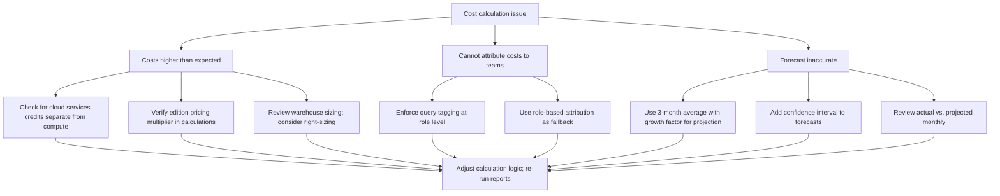
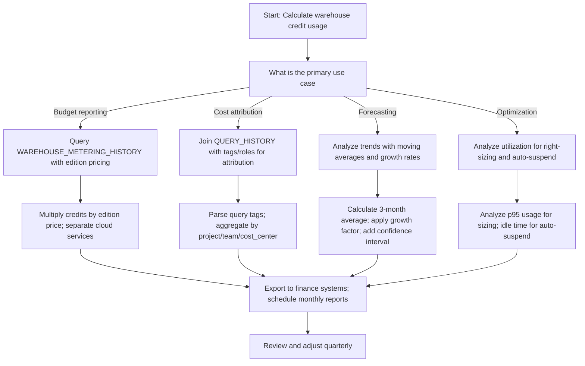

# Calculating Virtual Warehouse Credit Usage in Snowflake

```mermaid
graph TD
  CreditCalc[Credit Usage Calculation] --> Pricing[Warehouse Pricing Model]
  CreditCalc --> Metering[WAREHOUSE_METERING_HISTORY]
  CreditCalc --> Attribution[Cost Attribution]
  CreditCalc --> Forecasting[Usage Forecasting]
  CreditCalc --> Optimization[Credit Optimization]
  
  Pricing --> Size[Warehouse Size Multipliers]
  Pricing --> Edition[Edition Pricing Tiers]
  Pricing --> Region[Regional Pricing Variations]
  
  Metering --> Query[Querying Credit History]
  Metering --> Aggregate[Aggregating by Time Period]
  Metering --> Filter[Filtering by Warehouse/User/Tag]
  
  Attribution --> Tags[Query Tag Attribution]
  Attribution --> Roles[Role-Based Attribution]
  Attribution --> Projects[Project-Based Chargeback]
  
  Forecasting --> Trends[Historical Trend Analysis]
  Forecasting --> Projection[Usage Projection]
  Forecasting --> Budget[Budget Planning]
  
  Optimization --> RightSize[Warehouse Right-Sizing]
  Optimization --> AutoSuspend[Auto-Suspend Configuration]
  Optimization --> QueryTune[Query Optimization]
```



## Understanding Warehouse Credit Pricing

### How Credits Work

| Concept | Simple Explanation | Example |
|---------|------------------|---------|
| Credit | Unit of compute billing in Snowflake | 1 credit = 1 hour of XSmall warehouse usage |
| Warehouse size | Multiplier that determines credits per hour | XSmall = 1 credit/hr, Large = 8 credits/hr |
| Billing granularity | Credits billed per second, minimum 60 seconds | 30-second query on Large warehouse = 8 credits × (30/3600) = 0.067 credits |
| Edition multiplier | Higher editions cost more per credit | Standard = $2.00/credit, Enterprise = $3.00/credit (US East AWS) |
| Region variation | Pricing varies by cloud provider and region | us-east-1 may differ from eu-west-1 |

### Warehouse Size Credit Multipliers

| Warehouse Size | Credits Per Hour | Compute Power | Best For |
|---------------|-----------------|---------------|----------|
| XSmall | 1 | 1x baseline | Learning, testing, tiny queries |
| Small | 2 | 2x baseline | Light analytics, development |
| Medium | 4 | 4x baseline | Regular reporting, moderate data |
| Large | 8 | 8x baseline | Complex transforms, bigger datasets |
| XLarge | 16 | 16x baseline | Heavy ETL, concurrent dashboards |
| 2XLarge | 32 | 32x baseline | Enterprise batch workloads |
| 3XLarge | 64 | 64x baseline | Massive parallel processing |
| 4XLarge | 96 | 96x baseline | Very large-scale analytics |
| 5XLarge | 128 | 128x baseline | Maximum compute workloads |
| 6XLarge | 192 | 192x baseline | Extreme-scale parallel workloads |

```sql
-- Reference: Warehouse size to credit mapping
CREATE OR REPLACE TABLE governance.warehouse_size_credits (
  warehouse_size STRING,
  credits_per_hour NUMBER,
  compute_multiplier NUMBER,
  description STRING
);

INSERT INTO governance.warehouse_size_credits VALUES
  ('X-SMALL', 1, 1, 'Learning, testing, tiny queries'),
  ('SMALL', 2, 2, 'Light analytics, development'),
  ('MEDIUM', 4, 4, 'Regular reporting, moderate data'),
  ('LARGE', 8, 8, 'Complex transforms, bigger datasets'),
  ('X-LARGE', 16, 16, 'Heavy ETL, concurrent dashboards'),
  ('2X-LARGE', 32, 32, 'Enterprise batch workloads'),
  ('3X-LARGE', 64, 64, 'Massive parallel processing'),
  ('4X-LARGE', 96, 96, 'Very large-scale analytics'),
  ('5X-LARGE', 128, 128, 'Maximum compute workloads'),
  ('6X-LARGE', 192, 192, 'Extreme-scale parallel workloads');
```

### Edition and Regional Pricing

| Edition | US East (AWS) | US West (AWS) | EU West (Azure) | Notes |
|---------|--------------|---------------|-----------------|-------|
| Standard | $2.00/credit | $2.00/credit | €1.85/credit | Base edition |
| Enterprise | $3.00/credit | $3.00/credit | €2.78/credit | +50% over Standard |
| Business Critical | $4.00/credit | $4.00/credit | €3.70/credit | +100% over Standard |
| VPS | Contact sales | Contact sales | Contact sales | Dedicated hardware |

```sql
-- Reference: Edition pricing by region (example values; verify with Snowflake)
CREATE OR REPLACE TABLE governance.edition_pricing (
  edition STRING,
  region STRING,
  cloud_provider STRING,
  price_per_credit_usd NUMBER,
  currency STRING,
  effective_date DATE
);

INSERT INTO governance.edition_pricing VALUES
  ('Standard', 'us-east-1', 'AWS', 2.00, 'USD', '2024-01-01'),
  ('Enterprise', 'us-east-1', 'AWS', 3.00, 'USD', '2024-01-01'),
  ('Business Critical', 'us-east-1', 'AWS', 4.00, 'USD', '2024-01-01'),
  ('Standard', 'eu-west-1', 'Azure', 1.85, 'EUR', '2024-01-01'),
  ('Enterprise', 'eu-west-1', 'Azure', 2.78, 'EUR', '2024-01-01');
```

---

## Querying Credit Usage from ACCOUNT_USAGE

### WAREHOUSE_METERING_HISTORY View

| Column | Description | Example Use |
|--------|-------------|-------------|
| `WAREHOUSE_NAME` | Name of the warehouse | Filter by specific warehouse |
| `START_TIME` / `END_TIME` | Time window for credit usage | Aggregate by hour/day/month |
| `CREDITS_USED` | Total credits consumed in window | Calculate costs |
| `CREDITS_USED_CLOUD_SERVICES` | Cloud services credits (separate from compute) | Separate compute vs. cloud services costs |

```sql
-- Basic query: Credit usage by warehouse over last 30 days
SELECT
  warehouse_name,
  DATE_TRUNC('day', start_time) as usage_date,
  SUM(credits_used) as daily_credits,
  SUM(credits_used_cloud_services) as cloud_services_credits,
  COUNT(DISTINCT query_id) as query_count
FROM SNOWFLAKE.ACCOUNT_USAGE.WAREHOUSE_METERING_HISTORY
WHERE start_time > DATEADD(day, -30, CURRENT_TIMESTAMP())
GROUP BY warehouse_name, DATE_TRUNC('day', start_time)
ORDER BY usage_date DESC, daily_credits DESC;

-- Calculate estimated cost based on edition pricing
SELECT
  warehouse_name,
  DATE_TRUNC('day', start_time) as usage_date,
  SUM(credits_used) as daily_credits,
  -- Multiply by edition price (adjust for your edition)
  SUM(credits_used) * 3.00 as estimated_cost_usd,  -- Enterprise edition rate
  SUM(credits_used_cloud_services) * 3.00 as cloud_services_cost_usd
FROM SNOWFLAKE.ACCOUNT_USAGE.WAREHOUSE_METERING_HISTORY
WHERE start_time > DATEADD(day, -30, CURRENT_TIMESTAMP())
GROUP BY warehouse_name, DATE_TRUNC('day', start_time)
ORDER BY usage_date DESC;
```

### CREDIT_USAGE View: Service-Level Breakdown

```sql
-- Credit usage by service type (warehouses, cloud services, serverless)
SELECT
  DATE_TRUNC('day', start_time) as usage_date,
  service_type,
  SUM(credits_used) as service_credits,
  ROUND(100.0 * SUM(credits_used) / SUM(SUM(credits_used)) OVER (PARTITION BY usage_date), 2) as pct_of_daily_total,
  SUM(credits_used) * 3.00 as estimated_cost_usd
FROM SNOWFLAKE.ACCOUNT_USAGE.CREDIT_USAGE
WHERE start_time > DATEADD(month, -1, CURRENT_TIMESTAMP())
GROUP BY DATE_TRUNC('day', start_time), service_type
ORDER BY usage_date DESC, service_credits DESC;

-- Service types include:
-- 'Virtual Warehouse' = compute warehouses
-- 'Cloud Services' = query optimization, metadata, security
-- 'Serverless' = Snowpark, tasks, pipes, materialized view refreshes
-- 'Storage' = data storage (billed separately, not in credits)
```

### Calculating Costs with Dynamic Pricing

```sql
-- Create view that calculates costs using dynamic edition/region pricing
CREATE OR REPLACE VIEW governance.credit_cost_calculator AS
SELECT
  cu.start_time,
  cu.end_time,
  cu.service_type,
  cu.credits_used,
  -- Join to pricing table for dynamic cost calculation
  ep.price_per_credit_usd,
  cu.credits_used * ep.price_per_credit_usd as estimated_cost_usd,
  cu.currency
FROM SNOWFLAKE.ACCOUNT_USAGE.CREDIT_USAGE cu
JOIN governance.edition_pricing ep
  ON ep.edition = CURRENT_EDITION()  -- Pseudo-function; replace with actual edition detection
  AND ep.region = CURRENT_REGION()
  AND ep.cloud_provider = CURRENT_CLOUD()
  AND cu.start_time >= ep.effective_date
WHERE cu.start_time > DATEADD(month, -3, CURRENT_TIMESTAMP());

-- Query the cost calculator view
SELECT
  DATE_TRUNC('month', start_time) as billing_month,
  service_type,
  SUM(credits_used) as total_credits,
  SUM(estimated_cost_usd) as total_cost_usd,
  ROUND(AVG(price_per_credit_usd), 2) as avg_price_per_credit
FROM governance.credit_cost_calculator
GROUP BY DATE_TRUNC('month', start_time), service_type
ORDER BY billing_month DESC;
```

---

## Cost Attribution: Tagging and Allocation

### Query Tag-Based Attribution

```sql
-- Enforce query tagging at role level for consistent attribution
ALTER ROLE ANALYST_ROLE SET QUERY_TAG = 'team=analytics,project=sales_dashboard,env=prod';
ALTER ROLE ENGINEER_ROLE SET QUERY_TAG = 'team=engineering,project=data_pipeline,env=prod';

-- Attribute warehouse credits to query tags
SELECT
  DATE_TRUNC('month', qh.start_time) as billing_month,
  NULLIF(SPLIT_PART(REGEXP_SUBSTR(qh.query_tag, 'project=[^,]+'), '=', 2), '') as project,
  NULLIF(SPLIT_PART(REGEXP_SUBSTR(qh.query_tag, 'team=[^,]+'), '=', 2), '') as team,
  NULLIF(SPLIT_PART(REGEXP_SUBSTR(qh.query_tag, 'env=[^,]+'), '=', 2), '') as environment,
  SUM(wmh.credits_used) as total_credits,
  COUNT(DISTINCT qh.query_id) as query_count,
  SUM(wmh.credits_used) * 3.00 as estimated_cost_usd  -- Enterprise rate
FROM SNOWFLAKE.ACCOUNT_USAGE.QUERY_HISTORY qh
JOIN SNOWFLAKE.ACCOUNT_USAGE.WAREHOUSE_METERING_HISTORY wmh
  ON qh.warehouse_name = wmh.warehouse_name
  AND qh.start_time BETWEEN wmh.start_time AND wmh.end_time
WHERE qh.start_time > DATEADD(month, -1, CURRENT_TIMESTAMP())
  AND qh.query_tag IS NOT NULL
  AND qh.query_tag != ''
GROUP BY 
  DATE_TRUNC('month', qh.start_time),
  NULLIF(SPLIT_PART(REGEXP_SUBSTR(qh.query_tag, 'project=[^,]+'), '=', 2), ''),
  NULLIF(SPLIT_PART(REGEXP_SUBSTR(qh.query_tag, 'team=[^,]+'), '=', 2), ''),
  NULLIF(SPLIT_PART(REGEXP_SUBSTR(qh.query_tag, 'env=[^,]+'), '=', 2), '')
ORDER BY total_credits DESC;
```

### Role-Based Attribution

```sql
-- Attribute costs to roles for team-level chargeback
CREATE OR REPLACE VIEW governance.role_cost_attribution AS
SELECT
  DATE_TRUNC('month', qh.start_time) as billing_month,
  r.name as role_name,
  SUM(wmh.credits_used) as total_credits,
  COUNT(DISTINCT qh.query_id) as query_count,
  SUM(wmh.credits_used) * 3.00 as estimated_cost_usd,  -- Enterprise rate
  ROUND(100.0 * SUM(wmh.credits_used) / 
    SUM(SUM(wmh.credits_used)) OVER (PARTITION BY DATE_TRUNC('month', qh.start_time)), 2) as pct_of_monthly_total
FROM SNOWFLAKE.ACCOUNT_USAGE.QUERY_HISTORY qh
JOIN SNOWFLAKE.ACCOUNT_USAGE.GRANTS_TO_USERS g
  ON qh.user_name = g.grantee_name
JOIN SNOWFLAKE.ACCOUNT_USAGE.ROLES r
  ON g.granted_role = r.name
JOIN SNOWFLAKE.ACCOUNT_USAGE.WAREHOUSE_METERING_HISTORY wmh
  ON qh.warehouse_name = wmh.warehouse_name
  AND qh.start_time BETWEEN wmh.start_time AND wmh.end_time
WHERE qh.start_time > DATEADD(month, -3, CURRENT_TIMESTAMP())
  AND r.deleted_on IS NULL
GROUP BY DATE_TRUNC('month', qh.start_time), r.name;

-- Generate monthly chargeback report
SELECT
  billing_month,
  role_name,
  total_credits,
  estimated_cost_usd,
  pct_of_monthly_total
FROM governance.role_cost_attribution
WHERE billing_month = DATE_TRUNC('month', CURRENT_DATE())
ORDER BY estimated_cost_usd DESC;
```

### Export Attribution for External Billing Systems

```sql
-- Export tag-based attribution to external stage for finance integration
COPY INTO @finance_exports/chargeback/query_credits/
FROM (
  SELECT
    DATE_TRUNC('month', qh.start_time) as billing_month,
    NULLIF(SPLIT_PART(REGEXP_SUBSTR(qh.query_tag, 'project=[^,]+'), '=', 2), '') as project,
    NULLIF(SPLIT_PART(REGEXP_SUBSTR(qh.query_tag, 'team=[^,]+'), '=', 2), '') as team,
    NULLIF(SPLIT_PART(REGEXP_SUBSTR(qh.query_tag, 'cost_center=[^,]+'), '=', 2), '') as cost_center,
    SUM(wmh.credits_used) as credits,
    SUM(wmh.credits_used) * 3.00 as cost_usd,
    COUNT(DISTINCT qh.query_id) as query_count
  FROM SNOWFLAKE.ACCOUNT_USAGE.QUERY_HISTORY qh
  JOIN SNOWFLAKE.ACCOUNT_USAGE.WAREHOUSE_METERING_HISTORY wmh
    ON qh.warehouse_name = wmh.warehouse_name
    AND qh.start_time BETWEEN wmh.start_time AND wmh.end_time
  WHERE qh.start_time > DATEADD(month, -2, CURRENT_TIMESTAMP())
    AND qh.query_tag IS NOT NULL
  GROUP BY 
    DATE_TRUNC('month', qh.start_time),
    NULLIF(SPLIT_PART(REGEXP_SUBSTR(qh.query_tag, 'project=[^,]+'), '=', 2), ''),
    NULLIF(SPLIT_PART(REGEXP_SUBSTR(qh.query_tag, 'team=[^,]+'), '=', 2), ''),
    NULLIF(SPLIT_PART(REGEXP_SUBSTR(qh.query_tag, 'cost_center=[^,]+'), '=', 2), '')
)
FILE_FORMAT = (TYPE = CSV HEADER = TRUE);
```

---

## Forecasting and Budget Planning

### Historical Trend Analysis

```sql
-- Analyze credit usage trends over time
CREATE OR REPLACE VIEW governance.credit_usage_trends AS
SELECT
  DATE_TRUNC('week', start_time) as week_start,
  warehouse_name,
  SUM(credits_used) as weekly_credits,
  -- Calculate week-over-week change
  LAG(SUM(credits_used), 1) OVER (PARTITION BY warehouse_name ORDER BY DATE_TRUNC('week', start_time)) as prev_week_credits,
  ROUND(100.0 * (SUM(credits_used) - LAG(SUM(credits_used), 1) OVER (PARTITION BY warehouse_name ORDER BY DATE_TRUNC('week', start_time))) / 
    NULLIF(LAG(SUM(credits_used), 1) OVER (PARTITION BY warehouse_name ORDER BY DATE_TRUNC('week', start_time)), 0), 2) as wow_change_pct,
  -- Calculate 4-week moving average
  AVG(SUM(credits_used)) OVER (
    PARTITION BY warehouse_name 
    ORDER BY DATE_TRUNC('week', start_time) 
    ROWS BETWEEN 3 PRECEDING AND CURRENT ROW
  ) as four_week_avg
FROM SNOWFLAKE.ACCOUNT_USAGE.WAREHOUSE_METERING_HISTORY
WHERE start_time > DATEADD(month, -3, CURRENT_TIMESTAMP())
GROUP BY DATE_TRUNC('week', start_time), warehouse_name;

-- Query trends for forecasting
SELECT
  week_start,
  warehouse_name,
  weekly_credits,
  wow_change_pct,
  four_week_avg,
  -- Simple linear projection: next week = current + (current - 4-week avg)
  weekly_credits + (weekly_credits - four_week_avg) as projected_next_week
FROM governance.credit_usage_trends
WHERE week_start >= DATEADD(week, -4, CURRENT_DATE())
ORDER BY warehouse_name, week_start;
```

### Budget Projection Query

```sql
-- Project monthly credit usage based on current trends
CREATE OR REPLACE VIEW governance.monthly_budget_projection AS
WITH recent_usage AS (
  SELECT
    warehouse_name,
    DATE_TRUNC('month', start_time) as usage_month,
    SUM(credits_used) as monthly_credits
  FROM SNOWFLAKE.ACCOUNT_USAGE.WAREHOUSE_METERING_HISTORY
  WHERE start_time > DATEADD(month, -3, CURRENT_TIMESTAMP())
  GROUP BY warehouse_name, DATE_TRUNC('month', start_time)
),
growth_rate AS (
  SELECT
    warehouse_name,
    usage_month,
    monthly_credits,
    LAG(monthly_credits, 1) OVER (PARTITION BY warehouse_name ORDER BY usage_month) as prev_month_credits,
    CASE 
      WHEN LAG(monthly_credits, 1) OVER (PARTITION BY warehouse_name ORDER BY usage_month) > 0 
      THEN monthly_credits * 1.0 / LAG(monthly_credits, 1) OVER (PARTITION BY warehouse_name ORDER BY usage_month)
      ELSE 1.0 
    END as month_over_month_growth
  FROM recent_usage
),
current_projection AS (
  SELECT
    warehouse_name,
    usage_month,
    monthly_credits,
    month_over_month_growth,
    -- Project next month: current * average growth rate
    monthly_credits * AVG(month_over_month_growth) OVER (
      PARTITION BY warehouse_name 
      ORDER BY usage_month 
      ROWS BETWEEN 2 PRECEDING AND CURRENT ROW
    ) as projected_next_month
  FROM growth_rate
)
SELECT
  warehouse_name,
  usage_month as current_month,
  monthly_credits as actual_credits,
  ROUND(monthly_credits * 3.00, 2) as actual_cost_usd,
  DATEADD(month, 1, usage_month) as projected_month,
  ROUND(projected_next_month, 2) as projected_credits,
  ROUND(projected_next_month * 3.00, 2) as projected_cost_usd,
  -- Flag if projected to exceed typical budget thresholds
  CASE 
    WHEN projected_next_month > 2000 THEN 'HIGH_RISK'
    WHEN projected_next_month > 1000 THEN 'MEDIUM_RISK'
    ELSE 'LOW_RISK'
  END as budget_risk_level
FROM current_projection
WHERE usage_month = DATE_TRUNC('month', CURRENT_DATE())
ORDER BY projected_credits DESC;
```

### Resource Monitor Alignment with Budget

```sql
-- Align resource monitor quotas with projected usage
SELECT
  rm.name as monitor_name,
  rm.credit_quota as configured_quota,
  COALESCE(proj.projected_credits, 0) as projected_usage,
  ROUND(100.0 * COALESCE(proj.projected_credits, 0) / rm.credit_quota, 2) as projected_usage_pct,
  CASE
    WHEN proj.projected_credits > rm.credit_quota * 1.2 THEN 'QUOTA_TOO_LOW'
    WHEN proj.projected_credits < rm.credit_quota * 0.3 THEN 'QUOTA_TOO_HIGH'
    ELSE 'QUOTA_APPROPRIATE'
  END as quota_recommendation,
  -- Suggested quota adjustment
  CASE
    WHEN proj.projected_credits > rm.credit_quota * 1.2 THEN CEIL(proj.projected_credits * 1.2 / 100) * 100
    WHEN proj.projected_credits < rm.credit_quota * 0.3 THEN CEIL(proj.projected_credits * 1.5 / 100) * 100
    ELSE rm.credit_quota
  END as suggested_quota
FROM SNOWFLAKE.ACCOUNT_USAGE.RESOURCE_MONITORS rm
LEFT JOIN governance.monthly_budget_projection proj
  ON rm.name LIKE '%' || proj.warehouse_name || '%'  -- Simplified matching
WHERE rm.deleted_on IS NULL
ORDER BY projected_usage_pct DESC;
```

---

## Credit Optimization Strategies

### Warehouse Right-Sizing Analysis

```sql
-- Analyze warehouse utilization to identify right-sizing opportunities
CREATE OR REPLACE VIEW governance.warehouse_utilization_analysis AS
SELECT
  wmh.warehouse_name,
  w.size as current_size,
  wsc.credits_per_hour as current_credits_per_hour,
  AVG(wmh.credits_used) as avg_credits_per_hour,
  MAX(wmh.credits_used) as peak_credits_per_hour,
  PERCENTILE_CONT(0.95) WITHIN GROUP (ORDER BY wmh.credits_used) as p95_credits,
  COUNT(DISTINCT qh.query_id) as query_count_30d,
  AVG(qh.execution_time) as avg_query_duration_seconds,
  -- Recommend size based on p95 usage
  CASE
    WHEN p95_credits < 1 THEN 'X-SMALL'
    WHEN p95_credits < 2 THEN 'SMALL'
    WHEN p95_credits < 4 THEN 'MEDIUM'
    WHEN p95_credits < 8 THEN 'LARGE'
    WHEN p95_credits < 16 THEN 'X-LARGE'
    ELSE 'Consider scaling up or optimizing queries'
  END as recommended_size,
  -- Calculate potential savings
  CASE
    WHEN p95_credits < wsc.credits_per_hour THEN 
      (wsc.credits_per_hour - 
        CASE
          WHEN p95_credits < 1 THEN 1
          WHEN p95_credits < 2 THEN 2
          WHEN p95_credits < 4 THEN 4
          WHEN p95_credits < 8 THEN 8
          WHEN p95_credits < 16 THEN 16
          ELSE wsc.credits_per_hour
        END
      ) * 720 * 3.00  -- Monthly hours * price per credit
    ELSE 0
  END as estimated_monthly_savings_usd
FROM SNOWFLAKE.ACCOUNT_USAGE.WAREHOUSE_METERING_HISTORY wmh
JOIN INFORMATION_SCHEMA.WAREHOUSES w ON wmh.warehouse_name = w.name
JOIN governance.warehouse_size_credits wsc ON w.size = wsc.warehouse_size
LEFT JOIN SNOWFLAKE.ACCOUNT_USAGE.QUERY_HISTORY qh
  ON wmh.warehouse_name = qh.warehouse_name
  AND qh.start_time > DATEADD(month, -1, CURRENT_TIMESTAMP())
WHERE wmh.start_time > DATEADD(month, -1, CURRENT_TIMESTAMP())
GROUP BY wmh.warehouse_name, w.size, wsc.credits_per_hour;

-- Query for right-sizing recommendations
SELECT
  warehouse_name,
  current_size,
  recommended_size,
  avg_credits_per_hour,
  p95_credits,
  estimated_monthly_savings_usd,
  CASE
    WHEN estimated_monthly_savings_usd > 100 THEN 'HIGH_PRIORITY'
    WHEN estimated_monthly_savings_usd > 50 THEN 'MEDIUM_PRIORITY'
    ELSE 'LOW_PRIORITY'
  END as optimization_priority
FROM governance.warehouse_utilization_analysis
WHERE recommended_size != current_size
  AND recommended_size != 'Consider scaling up or optimizing queries'
ORDER BY estimated_monthly_savings_usd DESC;
```

### Auto-Suspend Optimization

```sql
-- Analyze warehouse idle time to optimize auto-suspend settings
CREATE OR REPLACE VIEW governance.warehouse_idle_analysis AS
SELECT
  wmh.warehouse_name,
  w.auto_suspend as current_auto_suspend,
  COUNT(DISTINCT CASE WHEN wmh.credits_used > 0 THEN wmh.start_time END) as active_hours,
  COUNT(DISTINCT wmh.start_time) as total_tracked_hours,
  ROUND(100.0 * COUNT(DISTINCT CASE WHEN wmh.credits_used > 0 THEN wmh.start_time END) / 
    NULLIF(COUNT(DISTINCT wmh.start_time), 0), 2) as utilization_pct,
  -- Calculate wasted credits from idle time
  SUM(CASE 
    WHEN wmh.credits_used < wsc.credits_per_hour * 0.1 THEN wmh.credits_used  -- Less than 10% of max = likely idle
    ELSE 0 
  END) as estimated_idle_credits,
  -- Recommend auto-suspend based on usage pattern
  CASE
    WHEN COUNT(DISTINCT CASE WHEN wmh.credits_used > 0 THEN wmh.start_time END) * 1.0 / 
         COUNT(DISTINCT wmh.start_time) < 0.3 THEN 60  -- Low utilization: 60s suspend
    WHEN COUNT(DISTINCT CASE WHEN wmh.credits_used > 0 THEN wmh.start_time END) * 1.0 / 
         COUNT(DISTINCT wmh.start_time) < 0.7 THEN 300  -- Medium: 5min suspend
    ELSE 0  -- High utilization: disable auto-suspend
  END as recommended_auto_suspend_seconds
FROM SNOWFLAKE.ACCOUNT_USAGE.WAREHOUSE_METERING_HISTORY wmh
JOIN INFORMATION_SCHEMA.WAREHOUSES w ON wmh.warehouse_name = w.name
JOIN governance.warehouse_size_credits wsc ON w.size = wsc.warehouse_size
WHERE wmh.start_time > DATEADD(week, -1, CURRENT_TIMESTAMP())
GROUP BY wmh.warehouse_name, w.auto_suspend;

-- Generate auto-suspend recommendations
SELECT
  warehouse_name,
  current_auto_suspend,
  recommended_auto_suspend_seconds,
  utilization_pct,
  estimated_idle_credits,
  ROUND(estimated_idle_credits * 3.00, 2) as estimated_idle_cost_usd,
  CASE
    WHEN current_auto_suspend != recommended_auto_suspend_seconds THEN 'CHANGE_RECOMMENDED'
    ELSE 'CONFIGURATION_OPTIMAL'
  END as recommendation_status
FROM governance.warehouse_idle_analysis
ORDER BY estimated_idle_cost_usd DESC;
```

### Query Optimization for Credit Reduction

```sql
-- Identify expensive queries for optimization targeting
CREATE OR REPLACE VIEW governance.expensive_queries AS
SELECT
  qh.query_id,
  qh.user_name,
  qh.warehouse_name,
  qh.query_text,
  qh.start_time,
  qh.execution_time,
  qh.bytes_scanned,
  qh.credits_used,
  qh.query_tag,
  -- Flag queries that scan > 100 GB or use > 10 credits
  CASE 
    WHEN qh.bytes_scanned > 100000000000 THEN 'HIGH_SCAN'
    WHEN qh.credits_used > 10 THEN 'HIGH_COST'
    ELSE 'NORMAL'
  END as cost_category,
  -- Suggest optimization strategies
  CASE
    WHEN qh.bytes_scanned > 100000000000 AND qh.query_text ILIKE '%WHERE%' THEN 'Consider clustering on filter columns'
    WHEN qh.execution_time > 1800 AND qh.query_text ILIKE '%JOIN%' THEN 'Review join strategy; consider materializing intermediate results'
    WHEN qh.bytes_scanned > 100000000000 AND qh.query_text NOT ILIKE '%LIMIT%' THEN 'Add LIMIT clause if full result set not needed'
    ELSE 'Review query plan for optimization opportunities'
  END as optimization_suggestion
FROM SNOWFLAKE.ACCOUNT_USAGE.QUERY_HISTORY qh
WHERE qh.start_time > DATEADD(day, -7, CURRENT_TIMESTAMP())
  AND (qh.bytes_scanned > 10000000000 OR qh.credits_used > 5)
ORDER BY qh.credits_used DESC;

-- Query for optimization prioritization
SELECT
  cost_category,
  COUNT(*) as query_count,
  SUM(credits_used) as total_credits,
  ROUND(SUM(credits_used) * 3.00, 2) as total_cost_usd,
  AVG(execution_time) as avg_execution_seconds,
  LISTAGG(DISTINCT optimization_suggestion, '; ') as common_suggestions
FROM governance.expensive_queries
GROUP BY cost_category
ORDER BY total_credits DESC;
```

---

## Practical Calculation Examples

### Example 1: Calculate Monthly Warehouse Cost

```sql
-- Calculate total cost for a specific warehouse last month
SELECT
  warehouse_name,
  DATE_TRUNC('month', start_time) as billing_month,
  SUM(credits_used) as total_credits,
  SUM(credits_used_cloud_services) as cloud_services_credits,
  -- Calculate compute cost (warehouse credits * edition price)
  SUM(credits_used) * 3.00 as compute_cost_usd,
  -- Calculate cloud services cost (separate billing)
  SUM(credits_used_cloud_services) * 3.00 as cloud_services_cost_usd,
  -- Total cost
  (SUM(credits_used) + SUM(credits_used_cloud_services)) * 3.00 as total_cost_usd
FROM SNOWFLAKE.ACCOUNT_USAGE.WAREHOUSE_METERING_HISTORY
WHERE warehouse_name = 'REPORTING_WH'
  AND start_time >= DATEADD(month, -1, DATE_TRUNC('month', CURRENT_DATE()))
  AND start_time < DATE_TRUNC('month', CURRENT_DATE())
GROUP BY warehouse_name, DATE_TRUNC('month', start_time);
```

### Example 2: Calculate Cost by Query Tag

```sql
-- Attribute costs to projects using query tags
SELECT
  NULLIF(SPLIT_PART(REGEXP_SUBSTR(query_tag, 'project=[^,]+'), '=', 2), '') as project,
  NULLIF(SPLIT_PART(REGEXP_SUBSTR(query_tag, 'team=[^,]+'), '=', 2), '') as team,
  SUM(credits_used) as total_credits,
  COUNT(DISTINCT query_id) as query_count,
  ROUND(SUM(credits_used) * 3.00, 2) as estimated_cost_usd,
  ROUND(AVG(credits_used), 2) as avg_credits_per_query
FROM SNOWFLAKE.ACCOUNT_USAGE.QUERY_HISTORY
WHERE start_time > DATEADD(month, -1, CURRENT_TIMESTAMP())
  AND query_tag IS NOT NULL
  AND query_tag != ''
GROUP BY 
  NULLIF(SPLIT_PART(REGEXP_SUBSTR(query_tag, 'project=[^,]+'), '=', 2), ''),
  NULLIF(SPLIT_PART(REGEXP_SUBSTR(query_tag, 'team=[^,]+'), '=', 2), '')
ORDER BY total_credits DESC;
```

### Example 3: Forecast Next Month's Budget

```sql
-- Simple forecast: average of last 3 months * growth factor
WITH monthly_usage AS (
  SELECT
    DATE_TRUNC('month', start_time) as usage_month,
    SUM(credits_used) as monthly_credits
  FROM SNOWFLAKE.ACCOUNT_USAGE.WAREHOUSE_METERING_HISTORY
  WHERE start_time > DATEADD(month, -4, CURRENT_TIMESTAMP())
    AND warehouse_name = 'PROD_WH'
  GROUP BY DATE_TRUNC('month', start_time)
),
growth_calc AS (
  SELECT
    usage_month,
    monthly_credits,
    LAG(monthly_credits, 1) OVER (ORDER BY usage_month) as prev_month,
    CASE 
      WHEN LAG(monthly_credits, 1) OVER (ORDER BY usage_month) > 0 
      THEN monthly_credits * 1.0 / LAG(monthly_credits, 1) OVER (ORDER BY usage_month)
      ELSE 1.0 
    END as growth_rate
  FROM monthly_usage
)
SELECT
  DATEADD(month, 1, MAX(usage_month)) as forecast_month,
  ROUND(AVG(monthly_credits) * AVG(growth_rate), 2) as projected_credits,
  ROUND(AVG(monthly_credits) * AVG(growth_rate) * 3.00, 2) as projected_cost_usd,
  -- Confidence interval (simple: ±20%)
  ROUND(AVG(monthly_credits) * AVG(growth_rate) * 0.8 * 3.00, 2) as low_estimate_usd,
  ROUND(AVG(monthly_credits) * AVG(growth_rate) * 1.2 * 3.00, 2) as high_estimate_usd
FROM growth_calc
WHERE usage_month >= DATEADD(month, -3, CURRENT_DATE());
```

---

## Best Practices for Credit Calculation and Management

### Calculation Best Practices

| Practice | Implementation | Benefit |
|----------|---------------|---------|
| Account for billing granularity | Remember minimum 60-second billing; short queries still cost 1 minute | Avoid underestimating costs for many short queries |
| Separate compute vs. cloud services | Track `credits_used` vs `credits_used_cloud_services` separately | Enables targeted optimization (compute vs. metadata operations) |
| Use edition-specific pricing | Multiply credits by your edition's price per credit | Accurate cost reporting for finance |
| Include regional variations | Pricing differs by cloud provider and region | Accurate multi-region cost allocation |
| Buffer for ACCOUNT_USAGE latency | Views have ~45-minute delay; use historical windows | Prevents missing recent usage in reports |

### Attribution Best Practices

| Practice | Implementation | Benefit |
|----------|---------------|---------|
| Enforce query tagging via role settings | `ALTER ROLE X SET QUERY_TAG = '...'` | Ensures consistent attribution without relying on user discipline |
| Use structured key=value format | `project=X,team=Y,env=Z` | Enables easy parsing and filtering in reports |
| Include environment in tag | Always add `env=prod/dev/test` | Enables environment-specific cost analysis |
| Validate tags in CI/CD | Check for required tags in deployment pipelines | Catches missing attribution before production |

### Optimization Best Practices

| Practice | Implementation | Benefit |
|----------|---------------|---------|
| Right-size warehouses based on p95 usage | Analyze `WAREHOUSE_METERING_HISTORY`; size for 95th percentile, not peak | Reduces costs without impacting performance |
| Configure auto-suspend based on usage pattern | 60s for batch, 300s for interactive, 0 for always-on | Eliminates idle billing while maintaining responsiveness |
| Optimize expensive queries first | Target queries with high bytes_scanned or credits_used | Maximum impact for optimization effort |
| Review quarterly | Usage patterns evolve; re-analyze regularly | Catches drift before it becomes significant cost impact |

---

## Common Pitfalls and Mitigations

| Pitfall | What Happens | How To Fix |
|---------|--------------|------------|
| Forgetting minimum 60-second billing | Underestimating cost of many short queries | Remember: each query costs at least 1 minute of warehouse time |
| Not separating cloud services credits | Attributing all credits to compute; missing optimization opportunities | Track `credits_used_cloud_services` separately; optimize metadata-heavy queries |
| Using wrong edition price in calculations | Cost reports inaccurate for finance | Maintain pricing table; join dynamically based on account edition |
| Ignoring ACCOUNT_USAGE latency | Real-time dashboards show incomplete data | Add buffer window to queries; use for batch analysis not real-time |
| Not enforcing query tagging | Cannot attribute costs to projects or teams | Enforce tagging via role settings or governance policy |
| Right-sizing based on average, not p95 | Warehouse too small for peak usage; performance issues | Size for 95th percentile usage; monitor query queue times |
| Disabling auto-suspend for all warehouses | Paying for idle compute 24/7 | Set auto-suspend based on workload pattern; disable only for always-on APIs |



---

## Decision Framework: Credit Calculation Strategy



| Requirement | Recommended Approach | Key Query/View |
|------------|---------------------|---------------|
| Monthly budget reporting | WAREHOUSE_METERING_HISTORY + edition pricing | `SUM(credits_used) * price_per_credit` |
| Project/team attribution | QUERY_HISTORY + query tags + WAREHOUSE_METERING_HISTORY | Parse tags; join on warehouse/time |
| Usage forecasting | Historical trends + growth rate analysis | Moving averages; month-over-month growth |
| Warehouse optimization | Utilization analysis + p95 sizing | `PERCENTILE_CONT(0.95)` on credits_used |
| Idle cost reduction | Auto-suspend analysis + idle credit calculation | Filter low-utilization hours; estimate waste |

---

## Key Principles to Remember

- **Credits are billed per second, minimum 60 seconds.** Many short queries can cost more than expected due to the minimum billing window.
- **Separate compute from cloud services.** `credits_used` is warehouse compute; `credits_used_cloud_services` is metadata, optimization, security.
- **Edition pricing matters.** Multiply credits by your edition's price per credit for accurate cost reporting.
- **Attribution requires tagging.** Enforce structured query tags to enable project/team cost allocation.
- **Right-size for p95, not average or peak.** Size warehouses for 95th percentile usage to balance cost and performance.
- **Auto-suspend eliminates idle waste.** Configure based on workload pattern: 60s for batch, 300s for interactive.
- **Forecast with buffers.** Use historical averages with growth factors and confidence intervals for budget planning.
- **Review quarterly.** Usage patterns evolve; re-analyze sizing, attribution, and forecasts regularly.

## Bottom Line

- Virtual warehouse credits are Snowflake's unit of compute billing. Understand the size multipliers and edition pricing to calculate costs accurately.
- Query `WAREHOUSE_METERING_HISTORY` for credit usage; join with `QUERY_HISTORY` for attribution; multiply by edition price for USD costs.
- Enforce query tagging to enable project/team chargeback. Parse structured tags for flexible reporting.
- Optimize costs by right-sizing warehouses (p95 usage), configuring auto-suspend appropriately, and optimizing expensive queries.
- Forecast usage using historical trends with growth factors and confidence intervals for realistic budget planning.
- Separate compute credits from cloud services credits for targeted optimization opportunities.
- Review and adjust quarterly. Workloads evolve; your cost management strategy should too.

Think of warehouse credits like electricity usage in a building:
- **Warehouse size is your appliance rating.** A small lamp (XSmall) uses 1 unit/hour; a large AC unit (6XLarge) uses 192 units/hour.
- **Billing granularity is your meter precision.** You pay per second of usage, but there is a minimum 60-second charge per "appliance turn-on."
- **Edition pricing is your utility rate plan.** Standard, Enterprise, Business Critical have different rates per unit.
- **Query tagging is your sub-metering.** It shows which department or project used which electricity.
- **Right-sizing is choosing the right appliance.** Do not use industrial AC for a small office; do not use a lamp to heat a warehouse.
- **Auto-suspend is turning off lights when you leave the room.** Eliminates waste without impacting functionality.
- **Forecasting is your budget planning.** Look at last quarter's usage, apply growth, add buffer for surprises.

Measure your usage accurately. Attribute costs fairly. Optimize what you can. Plan for what you cannot. Review and adjust regularly. That is how warehouse credit calculation and management works in Snowflake.
