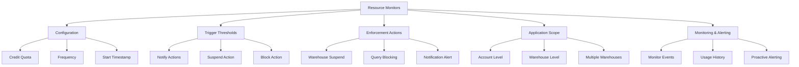
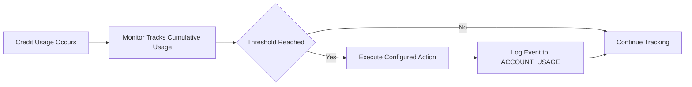
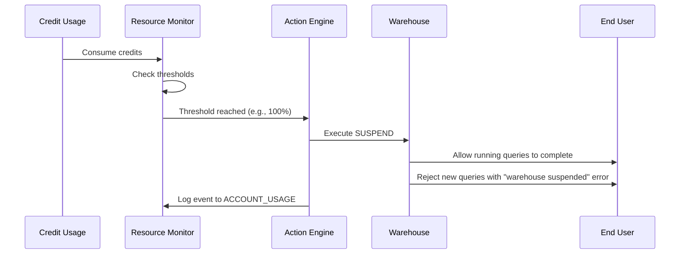
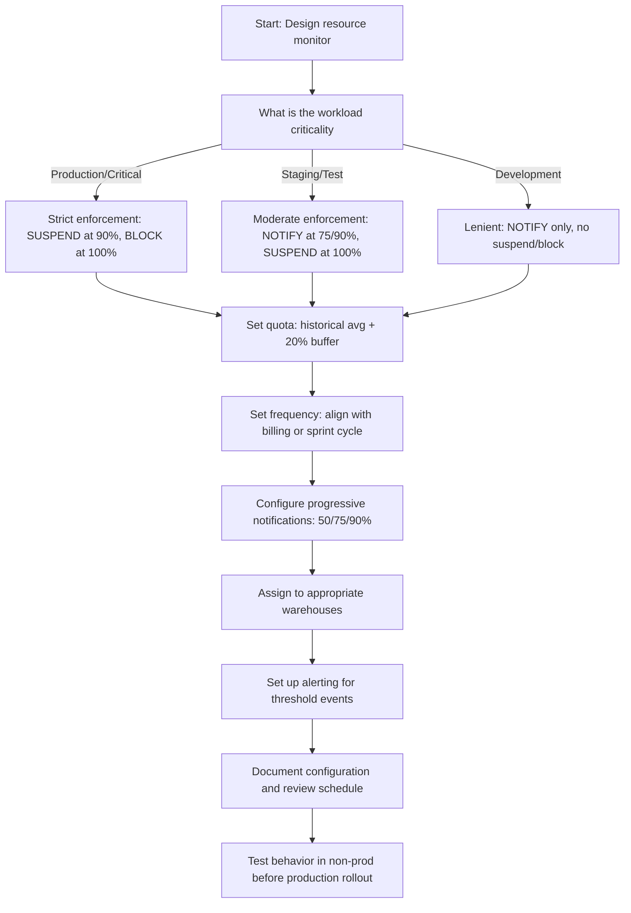

# Resource Monitoring in Snowflake



## What Are Resource Monitors

| Concept | Simple Explanation | Example |
|---------|------------------|---------|
| Resource monitor | A budget guardrail that tracks credit usage and triggers actions at defined thresholds | "Suspend warehouse if it uses 1000 credits in a month" |
| Credit quota | Maximum credits allowed per frequency period | 1000 credits per month |
| Frequency | How often the quota resets | MONTHLY, WEEKLY, DAILY, or NEVER |
| Trigger threshold | Percentage of quota that triggers an action | Notify at 50%, 75%, 90%; Suspend at 100% |
| Action | What happens when threshold is reached | NOTIFY, SUSPEND, or BLOCK |

- Resource monitors do not prevent queries from running. They react after credits are consumed.
- Actions execute within minutes of threshold breach, not instantly.
- Monitors track credits across all services: warehouses, cloud services, serverless features.
- A warehouse can have only one resource monitor, but a monitor can apply to multiple warehouses.
- Monitor events are logged and queryable for audit and alerting purposes.




## Resource Monitor Configuration

### Basic Resource Monitor Creation

```sql
-- Create a resource monitor for production workloads
CREATE OR REPLACE RESOURCE MONITOR prod_budget_monitor
  COMMENT = 'Monthly budget monitor for production warehouses. Owner: finance_team. Review: quarterly.'
  WITH CREDIT_QUOTA = 1000          -- Monthly credit budget
  FREQUENCY = MONTHLY               -- Reset quota monthly
  START_TIMESTAMP = IMMEDIATELY     -- Start tracking now
  TRIGGERS
    ON 50 PERCENT DO NOTIFY,        -- Alert at 50% usage
    ON 75 PERCENT DO NOTIFY,        -- Alert at 75% usage
    ON 90 PERCENT DO NOTIFY,        -- Alert at 90% usage
    ON 100 PERCENT DO SUSPEND;      -- Suspend warehouses at 100%

-- Attach monitor to production warehouses
ALTER WAREHOUSE reporting_wh SET RESOURCE_MONITOR = prod_budget_monitor;
ALTER WAREHOUSE etl_wh SET RESOURCE_MONITOR = prod_budget_monitor;
ALTER WAREHOUSE api_wh SET RESOURCE_MONITOR = prod_budget_monitor;
```

### Configuration Options Reference

| Setting | Allowed Values | Default | Recommended Practice |
|---------|---------------|---------|---------------------|
| `CREDIT_QUOTA` | Positive number | Required | Base on historical usage + 20% buffer |
| `FREQUENCY` | MONTHLY, WEEKLY, DAILY, NEVER | MONTHLY | Align with billing or sprint cycles |
| `START_TIMESTAMP` | IMMEDIATELY, timestamp, or 'NEXT_DAY/MONTH' | IMMEDIATELY | Use NEXT_MONTH for clean billing alignment |
| `ON X PERCENT DO` | NOTIFY, SUSPEND, BLOCK | None | NOTIFY at 50/75/90; SUSPEND at 100 for prod |
| `NOTIFY_USERS` | List of role names | None | Include finance and platform admin roles |

```sql
-- Create monitor with weekly frequency for sprint-based teams
CREATE OR REPLACE RESOURCE MONITOR sprint_monitor
  WITH CREDIT_QUOTA = 250           -- Weekly sprint budget
  FREQUENCY = WEEKLY                -- Reset every week
  START_TIMESTAMP = 'NEXT_MONDAY'   -- Start at beginning of next sprint
  TRIGGERS
    ON 60 PERCENT DO NOTIFY,
    ON 85 PERCENT DO NOTIFY,
    ON 100 PERCENT DO SUSPEND;

-- Create development monitor with lenient enforcement
CREATE OR REPLACE RESOURCE MONITOR dev_monitor
  WITH CREDIT_QUOTA = 100
  FREQUENCY = MONTHLY
  START_TIMESTAMP = IMMEDIATELY
  TRIGGERS
    ON 80 PERCENT DO NOTIFY,
    ON 100 PERCENT DO NOTIFY;       -- Notify but do not suspend dev work

-- Apply to development warehouses
ALTER WAREHOUSE dev_wh SET RESOURCE_MONITOR = dev_monitor;
ALTER WAREHOUSE sandbox_wh SET RESOURCE_MONITOR = dev_monitor;
```

### Advanced Configuration: Multiple Actions and Notifications

```sql
-- Monitor with multiple notification recipients and actions
CREATE OR REPLACE RESOURCE MONITOR enterprise_monitor
  COMMENT = 'Enterprise-grade monitor with escalation path. Owner: platform_team.'
  WITH CREDIT_QUOTA = 5000
  FREQUENCY = MONTHLY
  START_TIMESTAMP = 'NEXT_MONTH'
  TRIGGERS
    ON 50 PERCENT DO NOTIFY,
    ON 75 PERCENT DO NOTIFY,
    ON 90 PERCENT DO SUSPEND,       -- Suspend at 90% for early intervention
    ON 100 PERCENT DO BLOCK;        -- Block new queries at hard limit

-- Specify which roles receive notifications
ALTER RESOURCE MONITOR enterprise_monitor SET NOTIFY_USERS = (finance_admin, platform_oncall, cto_office);
```

| Action Type | What It Does | When To Use |
|------------|-------------|-------------|
| `NOTIFY` | Sends notification to specified users/roles | Early warning thresholds (50%, 75%, 90%) |
| `SUSPEND` | Suspends attached warehouses immediately | Hard limit for production (90% or 100%) |
| `BLOCK` | Blocks new queries but allows running queries to complete | Absolute hard limit with graceful degradation |


## Trigger Thresholds and Actions Deep Dive

### Threshold Strategy by Environment

| Environment | 50% | 75% | 90% | 100% | Rationale |
|------------|-----|-----|-----|------|-----------|
| Production | NOTIFY | NOTIFY | SUSPEND | BLOCK | Protect budget while allowing graceful degradation |
| Staging | NOTIFY | NOTIFY | NOTIFY | SUSPEND | Allow testing flexibility with hard stop at limit |
| Development | NOTIFY | NOTIFY | NOTIFY | NOTIFY | Maximize flexibility; rely on team discipline |
| Shared/Pool | NOTIFY | NOTIFY | SUSPEND | SUSPEND | Protect shared budget from runaway workloads |

```sql
-- Production: Aggressive protection
CREATE OR REPLACE RESOURCE MONITOR prod_strict
  WITH CREDIT_QUOTA = 2000
  FREQUENCY = MONTHLY
  TRIGGERS
    ON 50 PERCENT DO NOTIFY,
    ON 75 PERCENT DO NOTIFY,
    ON 90 PERCENT DO SUSPEND,
    ON 100 PERCENT DO BLOCK;

-- Development: Lenient monitoring
CREATE OR REPLACE RESOURCE MONITOR dev_flexible
  WITH CREDIT_QUOTA = 200
  FREQUENCY = MONTHLY
  TRIGGERS
    ON 80 PERCENT DO NOTIFY,
    ON 100 PERCENT DO NOTIFY;  -- No suspend or block
```

### Understanding Action Timing and Behavior

| Action | Execution Timing | Impact on Running Queries | Impact on New Queries |
|--------|-----------------|--------------------------|----------------------|
| `NOTIFY` | Within ~5 minutes of threshold | No impact | No impact |
| `SUSPEND` | Within ~5 minutes of threshold | Running queries complete; warehouse stops accepting new queries | Blocked until monitor reset or manual resume |
| `BLOCK` | Within ~5 minutes of threshold | Running queries complete; new queries return error immediately | Blocked until monitor reset or manual intervention |



### Setting Up Notifications

```sql
-- Specify notification recipients when creating monitor
CREATE OR REPLACE RESOURCE MONITOR notified_monitor
  WITH CREDIT_QUOTA = 500
  FREQUENCY = WEEKLY
  TRIGGERS
    ON 75 PERCENT DO NOTIFY,
    ON 100 PERCENT DO SUSPEND;

-- Add notification recipients (must be roles with MONITOR privilege)
ALTER RESOURCE MONITOR notified_monitor SET NOTIFY_USERS = (finance_team, platform_admins);

-- Verify notification configuration
SHOW RESOURCE MONITORS LIKE 'notified_monitor';
-- Check the 'notification_users' column in results
```

| Notification Recipient Requirements | Details |
|-----------------------------------|---------|
| Must be a role, not a user | Use `NOTIFY_USERS = (role_name)` not individual users |
| Role must have MONITOR privilege | On the account or specific warehouses |
| Users in role receive email | Via their registered email in Snowflake |
| Multiple roles supported | Comma-separated list: `(role1, role2, role3)` |


## Applying Resource Monitors to Warehouses

### Single Warehouse Assignment

```sql
-- Assign monitor to a single warehouse
ALTER WAREHOUSE analytics_wh SET RESOURCE_MONITOR = prod_budget_monitor;

-- Verify assignment
SHOW WAREHOUSES LIKE 'analytics_wh';
-- Check the 'resource_monitor' column in results
```

### Multiple Warehouse Assignment

```sql
-- Assign same monitor to multiple warehouses (e.g., all production)
ALTER WAREHOUSE reporting_wh SET RESOURCE_MONITOR = prod_budget_monitor;
ALTER WAREHOUSE etl_wh SET RESOURCE_MONITOR = prod_budget_monitor;
ALTER WAREHOUSE ml_wh SET RESOURCE_MONITOR = prod_budget_monitor;

-- Or use a script to apply to all warehouses matching a pattern
-- (Execute via SnowSQL or automation tool)
```

### Removing or Changing Monitor Assignment

```sql
-- Remove monitor from warehouse (no budget guardrail)
ALTER WAREHOUSE analytics_wh UNSET RESOURCE_MONITOR;

-- Change to different monitor
ALTER WAREHOUSE analytics_wh SET RESOURCE_MONITOR = dev_monitor;

-- Important: Changing monitors does not reset usage tracking
-- The new monitor starts tracking from current usage, not zero
```

| Scenario | Recommended Approach |
|----------|---------------------|
| New warehouse creation | Assign appropriate monitor during CREATE WAREHOUSE |
| Environment promotion (dev→prod) | Reassign from dev_monitor to prod_monitor during promotion |
| Temporary budget increase | Create new monitor with higher quota; reassign temporarily |
| Monitor decommissioning | Reassign warehouses to alternative monitor before dropping |

```sql
-- Example: Promote warehouse from dev to prod with monitor change
-- Step 1: Create production monitor if not exists
CREATE OR REPLACE RESOURCE MONITOR prod_q2_monitor
  WITH CREDIT_QUOTA = 1500
  FREQUENCY = MONTHLY
  TRIGGERS
    ON 50 PERCENT DO NOTIFY
    ON 75 PERCENT DO NOTIFY
    ON 90 PERCENT DO SUSPEND
    ON 100 PERCENT DO BLOCK;

-- Step 2: Reassign warehouse during promotion window
ALTER WAREHOUSE new_feature_wh SET RESOURCE_MONITOR = prod_q2_monitor;

-- Step 3: Optionally resize warehouse for production workload
ALTER WAREHOUSE new_feature_wh SET WAREHOUSE_SIZE = LARGE;
```


## Monitoring Resource Monitor Events and Usage

### Querying Monitor Events

```sql
-- View resource monitor usage and events
SELECT
  rm.name as monitor_name,
  rm.credit_quota,
  rm.frequency,
  rm.start_timestamp,
  cu.start_time,
  cu.credits_used,
  cu.overage,  -- Credits used beyond quota (if any)
  CASE
    WHEN cu.credits_used / rm.credit_quota >= 1.0 THEN '100%+'
    WHEN cu.credits_used / rm.credit_quota >= 0.9 THEN '90-99%'
    WHEN cu.credits_used / rm.credit_quota >= 0.75 THEN '75-89%'
    WHEN cu.credits_used / rm.credit_quota >= 0.5 THEN '50-74%'
    ELSE '<50%'
  END as usage_band
FROM SNOWFLAKE.ACCOUNT_USAGE.CREDIT_USAGE cu
JOIN SNOWFLAKE.ACCOUNT_USAGE.RESOURCE_MONITORS rm
  ON cu.resource_monitor_name = rm.name
WHERE cu.start_time > DATEADD(month, -1, CURRENT_TIMESTAMP())
ORDER BY cu.start_time DESC;
```

### Tracking Trigger Events and Actions

```sql
-- Query resource monitor events (notifications, suspends, blocks)
SELECT
  event_timestamp,
  resource_monitor_name,
  event_type,  -- NOTIFY, SUSPEND, BLOCK
  threshold_percent,
  credit_quota,
  credits_used,
  warehouse_name,  -- If action targeted specific warehouse
  notified_users   -- Roles that received notification
FROM SNOWFLAKE.ACCOUNT_USAGE.RESOURCE_MONITOR_EVENTS
WHERE event_timestamp > DATEADD(month, -1, CURRENT_TIMESTAMP())
ORDER BY event_timestamp DESC;

-- Identify warehouses suspended by resource monitor
SELECT
  w.name as warehouse_name,
  w.state,
  w.resource_monitor,
  rme.event_timestamp as suspend_time,
  rme.threshold_percent,
  rme.credits_used
FROM INFORMATION_SCHEMA.WAREHOUSES w
LEFT JOIN SNOWFLAKE.ACCOUNT_USAGE.RESOURCE_MONITOR_EVENTS rme
  ON w.resource_monitor = rme.resource_monitor_name
  AND rme.event_type = 'SUSPEND'
WHERE w.state = 'SUSPENDED'
  AND w.resource_monitor IS NOT NULL
ORDER BY rme.event_timestamp DESC;
```

### Creating Alerts for Monitor Events

```sql
-- Alert: Resource monitor threshold reached
CREATE OR REPLACE ALERT cost.monitor_threshold_alert
  WAREHOUSE = admin_wh
  SCHEDULE = 'USING CRON */15 * * * *'  -- Every 15 minutes
  CONDITION = (
    SELECT COUNT(*)
    FROM SNOWFLAKE.ACCOUNT_USAGE.RESOURCE_MONITOR_EVENTS
    WHERE event_timestamp > DATEADD(minute, -15, CURRENT_TIMESTAMP())
      AND event_type IN ('NOTIFY', 'SUSPEND', 'BLOCK')
  ) > 0
  ACTION = (
    SYSTEM$SEND_EMAIL(
      'finance-team@company.com',
      'Alert: Resource monitor threshold triggered',
      (SELECT LISTAGG(
        'Monitor: ' || resource_monitor_name || 
        ' | Event: ' || event_type || 
        ' | Threshold: ' || threshold_percent || '%' || 
        ' | Credits: ' || credits_used || '/' || credit_quota,
        '\n')
       FROM SNOWFLAKE.ACCOUNT_USAGE.RESOURCE_MONITOR_EVENTS
       WHERE event_timestamp > DATEADD(minute, -15, CURRENT_TIMESTAMP())
         AND event_type IN ('NOTIFY', 'SUSPEND', 'BLOCK'))
    )
  );

-- Alert: Warehouse suspended by resource monitor
CREATE OR REPLACE ALERT ops.wh_suspended_alert
  WAREHOUSE = admin_wh
  SCHEDULE = 'USING CRON */30 * * * *'
  CONDITION = (
    SELECT COUNT(*)
    FROM SNOWFLAKE.ACCOUNT_USAGE.RESOURCE_MONITOR_EVENTS
    WHERE event_type = 'SUSPEND'
      AND event_timestamp > DATEADD(minute, -30, CURRENT_TIMESTAMP())
  ) > 0
  ACTION = (
    SYSTEM$SEND_SLACK_MESSAGE(
      'https://hooks.slack.com/services/XXX',
      '🚨 *Warehouse Suspended by Resource Monitor*\n' ||
      (SELECT LISTAGG(
        '• ' || COALESCE(warehouse_name, 'All attached warehouses') || 
        ' suspended at ' || threshold_percent || '% quota',
        '\n')
       FROM SNOWFLAKE.ACCOUNT_USAGE.RESOURCE_MONITOR_EVENTS
       WHERE event_type = 'SUSPEND'
         AND event_timestamp > DATEADD(minute, -30, CURRENT_TIMESTAMP())) ||
      '\n\nReview and resume if appropriate.'
    )
  );
```

### Dashboard Query: Monitor Health Overview

```sql
-- Create view for resource monitor dashboard
CREATE OR REPLACE VIEW governance.resource_monitor_dashboard AS
SELECT
  rm.name as monitor_name,
  rm.credit_quota,
  rm.frequency,
  rm.next_credit_reset_time,
  COALESCE(SUM(cu.credits_used), 0) as credits_used_current_period,
  ROUND(100.0 * COALESCE(SUM(cu.credits_used), 0) / rm.credit_quota, 2) as usage_pct,
  COUNT(DISTINCT CASE WHEN rme.event_type = 'NOTIFY' THEN rme.event_id END) as notify_count,
  COUNT(DISTINCT CASE WHEN rme.event_type = 'SUSPEND' THEN rme.event_id END) as suspend_count,
  COUNT(DISTINCT CASE WHEN rme.event_type = 'BLOCK' THEN rme.event_id END) as block_count,
  LISTAGG(DISTINCT w.name, ', ') as attached_warehouses
FROM SNOWFLAKE.ACCOUNT_USAGE.RESOURCE_MONITORS rm
LEFT JOIN SNOWFLAKE.ACCOUNT_USAGE.CREDIT_USAGE cu
  ON rm.name = cu.resource_monitor_name
  AND cu.start_time >= rm.next_credit_reset_time - 
      CASE rm.frequency
        WHEN 'MONTHLY' THEN INTERVAL '1 month'
        WHEN 'WEEKLY' THEN INTERVAL '1 week'
        WHEN 'DAILY' THEN INTERVAL '1 day'
        ELSE INTERVAL '1 year'
      END
LEFT JOIN SNOWFLAKE.ACCOUNT_USAGE.RESOURCE_MONITOR_EVENTS rme
  ON rm.name = rme.resource_monitor_name
  AND rme.event_timestamp >= rm.next_credit_reset_time - 
      CASE rm.frequency
        WHEN 'MONTHLY' THEN INTERVAL '1 month'
        WHEN 'WEEKLY' THEN INTERVAL '1 week'
        WHEN 'DAILY' THEN INTERVAL '1 day'
        ELSE INTERVAL '1 year'
      END
LEFT JOIN INFORMATION_SCHEMA.WAREHOUSES w
  ON rm.name = w.resource_monitor
WHERE rm.deleted_on IS NULL
GROUP BY rm.name, rm.credit_quota, rm.frequency, rm.next_credit_reset_time;

-- Query dashboard view
SELECT * FROM governance.resource_monitor_dashboard
ORDER BY usage_pct DESC;
```


## Best Practices for Resource Monitor Configuration

### Setting Credit Quotas

| Practice | Implementation | Why It Matters |
|----------|---------------|----------------|
| Base quota on historical usage | Query `WAREHOUSE_METERING_HISTORY` for past 3 months; add 20% buffer | Prevents unnecessary suspensions while controlling runaway spend |
| Separate monitors by environment | Prod, staging, dev get different quotas and enforcement | Aligns guardrails with business criticality |
| Align frequency with billing cycle | MONTHLY for monthly bills; WEEKLY for sprint teams | Simplifies budget tracking and forecasting |
| Document quota rationale | Add COMMENT with calculation method and review date | Enables audits and future adjustments |

```sql
-- Calculate recommended quota based on historical usage
SELECT
  warehouse_name,
  AVG(credits_used) as avg_monthly_credits,
  MAX(credits_used) as peak_monthly_credits,
  -- Recommend quota: average + 20% buffer, rounded up to nearest 100
  CEIL((AVG(credits_used) * 1.2) / 100) * 100 as recommended_quota
FROM SNOWFLAKE.ACCOUNT_USAGE.WAREHOUSE_METERING_HISTORY
WHERE start_time > DATEADD(month, -3, CURRENT_TIMESTAMP())
GROUP BY warehouse_name
ORDER BY recommended_quota DESC;
```

### Configuring Trigger Thresholds

| Practice | Implementation | Why It Matters |
|----------|---------------|----------------|
| Use progressive notifications | NOTIFY at 50%, 75%, 90% before hard action | Gives teams time to optimize before suspension |
| Suspend before block for production | SUSPEND at 90%, BLOCK at 100% | Allows graceful degradation vs abrupt failure |
| Lenient thresholds for dev | NOTIFY only, no suspend/block | Maximizes flexibility for experimentation |
| Document threshold rationale | Include in monitor COMMENT | Explains enforcement strategy to stakeholders |

```sql
-- Example: Well-documented monitor configuration
CREATE OR REPLACE RESOURCE MONITOR prod_analytics_monitor
  COMMENT = 'Production analytics budget guardrail.
  Quota: 1500 credits/month (based on 3-month avg of 1200 + 25% buffer).
  Thresholds: 50/75/90% NOTIFY for proactive optimization; 100% BLOCK to prevent overage.
  Owner: finance_team@company.com. Review: quarterly.
  Last adjusted: 2024-01-15 for Q1 budget.'
  WITH CREDIT_QUOTA = 1500
  FREQUENCY = MONTHLY
  START_TIMESTAMP = 'NEXT_MONTH'
  TRIGGERS
    ON 50 PERCENT DO NOTIFY
    ON 75 PERCENT DO NOTIFY
    ON 90 PERCENT DO NOTIFY
    ON 100 PERCENT DO BLOCK;
```

### Managing Monitor Lifecycle

| Practice | Implementation | Why It Matters |
|----------|---------------|----------------|
| Review monitors quarterly | Query usage and adjust quotas/thresholds | Keeps guardrails aligned with evolving workloads |
| Test monitor behavior in non-prod | Simulate threshold breach to verify actions | Ensures suspends/blocks work as expected before prod impact |
| Document monitor dependencies | Track which warehouses use which monitors | Prevents accidental removal of critical guardrails |
| Archive unused monitors | Drop or rename decommissioned monitors | Reduces configuration clutter and confusion |

```sql
-- Quarterly review query: Identify monitors needing adjustment
SELECT
  rm.name as monitor_name,
  rm.credit_quota,
  rm.frequency,
  COALESCE(SUM(cu.credits_used), 0) as credits_used_current_period,
  ROUND(100.0 * COALESCE(SUM(cu.credits_used), 0) / rm.credit_quota, 2) as usage_pct,
  CASE
    WHEN usage_pct > 100 THEN 'Quota too low - consider increase'
    WHEN usage_pct < 30 THEN 'Quota too high - consider reduction'
    WHEN usage_pct BETWEEN 90 AND 100 THEN 'Monitor working as intended'
    ELSE 'Monitor working; continue monitoring'
  END as recommendation,
  rm.comment as current_documentation
FROM SNOWFLAKE.ACCOUNT_USAGE.RESOURCE_MONITORS rm
LEFT JOIN SNOWFLAKE.ACCOUNT_USAGE.CREDIT_USAGE cu
  ON rm.name = cu.resource_monitor_name
  AND cu.start_time >= DATEADD(month, -1, CURRENT_TIMESTAMP())
WHERE rm.deleted_on IS NULL
GROUP BY rm.name, rm.credit_quota, rm.frequency, rm.comment
ORDER BY usage_pct DESC;
```


## Common Pitfalls and Mitigations

| Pitfall | What Happens | How To Fix |
|---------|--------------|------------|
| Setting quota too low | Warehouses suspend unexpectedly, disrupting business | Base quota on historical usage + buffer; test in non-prod first |
| Not aligning frequency with billing | Confusion about when quota resets; budget tracking errors | Set FREQUENCY to match financial or sprint cycles |
| Using SUSPEND for development | Dev work halted unexpectedly; productivity impact | Use NOTIFY-only for dev; reserve SUSPEND/BLOCK for production |
| Forgetting to assign monitor to new warehouses | New warehouses have no budget guardrails | Include monitor assignment in warehouse provisioning automation |
| Ignoring monitor events | Threshold breaches go unnoticed until budget overrun | Set up ALERT objects or external monitoring for monitor events |
| Not documenting quota rationale | Future team cannot understand or adjust quotas appropriately | Add detailed COMMENT with calculation method and review date |
| Assuming actions are instantaneous | Queries continue for minutes after threshold breach | Design applications to handle "warehouse suspended" errors gracefully |
| Not testing suspend/block behavior | Surprise when warehouses stop accepting queries | Test monitor actions in staging environment before production deployment |

```mermaid
flowchart TD
  Prob[Resource monitor issue] --> Q1[Warehouse suspended unexpectedly]
  Prob --> Q2[Budget exceeded despite monitor]
  Prob --> Q3[Notifications not received]
  
  Q1 --> A[Check RESOURCE_MONITOR_EVENTS for trigger details]
  Q1 --> B[Verify quota and threshold configuration]
  Q1 --> C[Review recent usage spikes in WAREHOUSE_METERING_HISTORY]
  
  Q2 --> D[Confirm monitor is assigned to all relevant warehouses]
  Q2 --> E[Check for credits from non-warehouse services (cloud services, serverless)]
  Q2 --> F[Verify monitor frequency and reset timing]
  
  Q3 --> G[Verify NOTIFY_USERS roles have MONITOR privilege]
  Q3 --> H[Check user email configuration in Snowflake]
  Q3 --> I[Review notification delivery logs if available]
  
  A --> J[Adjust quota or thresholds; document change]
  B --> J
  C --> J
  D --> J
  E --> J
  F --> J
  G --> J
  H --> J
  I --> J
```


## Integration with Broader Cost Management

### Resource Monitors + Query Tagging

```sql
-- Combine resource monitors with query tagging for granular attribution
-- Step 1: Enforce query tagging via role setting
ALTER ROLE ANALYST_ROLE SET QUERY_TAG = 'team=analytics,project=sales_dashboard';

-- Step 2: Create monitor that tracks tagged usage
-- (Monitors track all credits; tagging enables attribution within that)

-- Step 3: Query attribution within monitor quota
SELECT
  SPLIT_PART(qh.query_tag, ',', 1) as project,
  SUM(qh.credits_used) as credits_used,
  rm.credit_quota,
  ROUND(100.0 * SUM(qh.credits_used) / rm.credit_quota, 2) as pct_of_monitor_quota
FROM SNOWFLAKE.ACCOUNT_USAGE.QUERY_HISTORY qh
JOIN SNOWFLAKE.ACCOUNT_USAGE.RESOURCE_MONITORS rm
  ON qh.warehouse_name IN (
    SELECT name FROM INFORMATION_SCHEMA.WAREHOUSES 
    WHERE resource_monitor = rm.name
  )
WHERE qh.start_time > DATEADD(month, -1, CURRENT_TIMESTAMP())
  AND qh.query_tag IS NOT NULL
GROUP BY SPLIT_PART(qh.query_tag, ',', 1), rm.credit_quota
ORDER BY credits_used DESC;
```

### Resource Monitors + Auto-Suspend

| Strategy | Implementation | Benefit |
|----------|---------------|---------|
| Layered cost controls | Resource monitor (budget) + auto-suspend (idle elimination) | Prevents both runaway usage and idle waste |
| Environment-specific tuning | Prod: monitor + 300s auto-suspend; Dev: monitor + 60s auto-suspend | Aligns controls with workload patterns |
| Monitor before suspend | Resource monitor triggers at 90%; auto-suspend handles idle between thresholds | Proactive budget protection + reactive idle elimination |

```sql
-- Example: Layered configuration for production warehouse
-- Step 1: Configure resource monitor for budget protection
CREATE OR REPLACE RESOURCE MONITOR prod_layered_monitor
  WITH CREDIT_QUOTA = 2000
  FREQUENCY = MONTHLY
  TRIGGERS
    ON 50 PERCENT DO NOTIFY
    ON 75 PERCENT DO NOTIFY
    ON 90 PERCENT DO SUSPEND
    ON 100 PERCENT DO BLOCK;

-- Step 2: Configure auto-suspend for idle elimination
ALTER WAREHOUSE prod_analytics_wh
  SET RESOURCE_MONITOR = prod_layered_monitor,
      AUTO_SUSPEND = 300,    -- 5 minutes idle before suspend
      AUTO_RESUME = TRUE;    -- Auto-resume for user experience
```

### Resource Monitors + Alerting Automation

```sql
-- Create automated alerting for monitor threshold events
CREATE OR REPLACE TASK governance.monitor_threshold_digest
  WAREHOUSE = admin_wh
  SCHEDULE = 'USING CRON 0 9 * * 1-5'  -- Weekdays at 9 AM
AS
  -- Generate daily summary of monitor events
  SYSTEM$SEND_EMAIL(
    'finance-team@company.com',
    'Daily Resource Monitor Summary',
    (SELECT 
      'Monitors with activity in last 24h:\n' ||
      LISTAGG(
        '• ' || resource_monitor_name || ': ' || event_type || 
        ' at ' || threshold_percent || '% (' || credits_used || '/' || credit_quota || ' credits)',
        '\n')
     FROM SNOWFLAKE.ACCOUNT_USAGE.RESOURCE_MONITOR_EVENTS
     WHERE event_timestamp > DATEADD(day, -1, CURRENT_TIMESTAMP())
     ORDER BY event_timestamp DESC)
  );

-- Alert on repeated threshold breaches (potential runaway workload)
CREATE OR REPLACE ALERT cost.repeated_threshold_alert
  WAREHOUSE = admin_wh
  SCHEDULE = 'USING CRON 0 */6 * * *'
  CONDITION = (
    SELECT COUNT(DISTINCT resource_monitor_name)
    FROM SNOWFLAKE.ACCOUNT_USAGE.RESOURCE_MONITOR_EVENTS
    WHERE event_timestamp > DATEADD(hour, -6, CURRENT_TIMESTAMP())
      AND event_type IN ('NOTIFY', 'SUSPEND', 'BLOCK')
    GROUP BY resource_monitor_name
    HAVING COUNT(*) >= 3  -- Same monitor triggered 3+ times in 6 hours
  ) IS NOT NULL
  ACTION = (
    SYSTEM$SEND_EMAIL(
      'platform-team@company.com',
      'Alert: Repeated resource monitor thresholds',
      'A monitor has triggered multiple times in 6 hours. Investigate potential runaway workload.'
    )
  );
```


## Decision Framework: Resource Monitor Design



| Question | If Yes | If No |
|----------|--------|-------|
| Is this for production workloads | Use SUSPEND at 90%, BLOCK at 100% | Use NOTIFY-only or lenient thresholds |
| Does workload have predictable usage | Set quota based on historical + buffer | Start conservative; adjust after monitoring |
| Is budget approval required for overages | Use BLOCK at 100% to prevent overage | Use SUSPEND at 100% for graceful degradation |
| Do multiple teams share the warehouse | Create separate monitors per team or use tagging for attribution | Single monitor may suffice with clear ownership |
| Is real-time budget visibility critical | Set up ALERT objects for threshold events | Periodic dashboard review may suffice |


## Key Principles to Remember

- **Resource monitors react, they do not prevent.** Actions execute after credits are consumed, typically within minutes.
- **Quotas should be data-driven.** Base on historical usage with buffer, not arbitrary numbers.
- **Thresholds should be progressive.** NOTIFY early for optimization; SUSPEND/BLOCK late for protection.
- **Environment matters.** Production needs strict enforcement; development needs flexibility.
- **Document everything.** Quota rationale, threshold strategy, and review schedule enable future maintenance.
- **Test before production.** Verify suspend/block behavior in staging to avoid surprise outages.
- **Monitor the monitors.** Track threshold events and adjust configuration as workloads evolve.

## Bottom Line

- Resource monitors are your budget guardrails in Snowflake. They track credit usage and trigger actions at defined thresholds.
- Configure quotas based on historical usage plus buffer. Align frequency with billing or sprint cycles.
- Use progressive thresholds: NOTIFY at 50/75/90% for proactive optimization; SUSPEND/BLOCK at 90/100% for protection.
- Assign monitors to warehouses based on environment criticality: strict for production, lenient for development.
- Monitor monitor events via `RESOURCE_MONITOR_EVENTS` view. Set up alerts for threshold breaches.
- Integrate with query tagging for attribution, auto-suspend for idle elimination, and alerting for proactive response.
- Review and adjust quarterly. Workloads evolve; your guardrails should too.

Think of resource monitors like a smart circuit breaker for your Snowflake spending:
- **Credit quota is your amperage limit.** It defines the maximum load before protection kicks in.
- **Thresholds are your warning lights.** They illuminate at 50%, 75%, 90% to give you time to reduce load.
- **Suspend is your breaker trip.** It cuts power to prevent damage when limits are exceeded.
- **Block is your lockout/tagout.** It prevents re-energizing until the issue is resolved.
- **Notifications are your alarm panel.** They alert the right people when thresholds are reached.
- **Monitoring events is your maintenance log.** It records every trip and warning for analysis.

Set your limits based on actual load. Warn early. Trip decisively. Log everything. Review and adjust regularly. That is how resource monitoring works in Snowflake.
