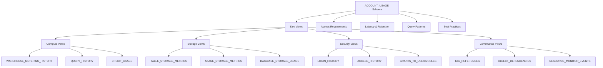
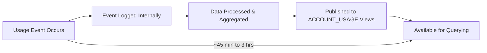
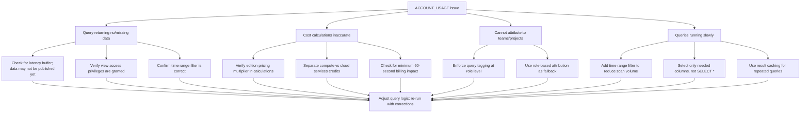
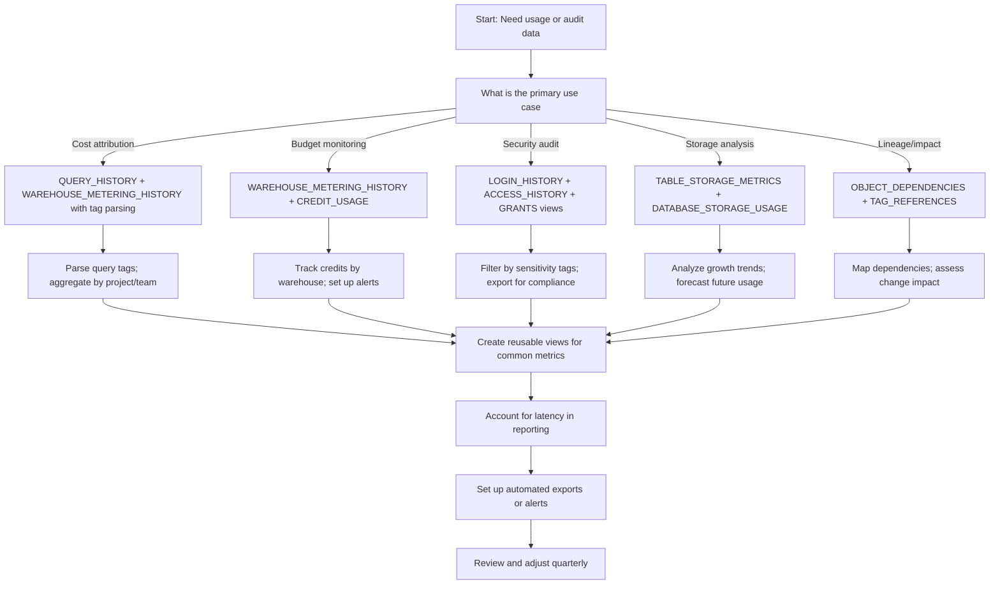

# Account Usage Schema in Snowflake



## What Is the ACCOUNT_USAGE Schema

| Concept | Simple Explanation | Example |
|---------|------------------|---------|
| ACCOUNT_USAGE schema | A read-only schema containing historical usage and metadata views for the entire account | `SNOWFLAKE.ACCOUNT_USAGE.QUERY_HISTORY` |
| View vs table | Views are virtual tables that query underlying system data; not user-created tables | `SELECT * FROM SNOWFLAKE.ACCOUNT_USAGE.QUERY_HISTORY` |
| Account-wide scope | Views contain data for the entire Snowflake account, not just current database/schema | Query any warehouse, user, or object in the account |
| Historical retention | Most views retain data for 365 days (1 year) from event occurrence | Query usage from up to 1 year ago |
| Latency | Data is not real-time; typical delay is 45 minutes to 3 hours | Recent activity may not appear immediately |



### ACCOUNT_USAGE vs INFORMATION_SCHEMA

| Aspect | ACCOUNT_USAGE | INFORMATION_SCHEMA |
|--------|--------------|-------------------|
| **Scope** | Account-wide historical data | Current database/schema metadata |
| **Retention** | 365 days for most views | Real-time; no historical retention |
| **Latency** | ~45 minutes to 3 hours | Near real-time |
| **Use Case** | Auditing, cost analysis, compliance, trend analysis | Schema discovery, object metadata, current state |
| **Access** | Requires `MONITOR` or `USAGE` privilege on `SNOWFLAKE` database | Requires privileges on specific objects |
| **Performance** | Optimized for large historical queries; may be slower | Optimized for metadata lookups; very fast |

```sql
-- INFORMATION_SCHEMA: Current state of warehouses
SELECT name, state, size, auto_suspend
FROM INFORMATION_SCHEMA.WAREHOUSES
WHERE name = 'REPORTING_WH';

-- ACCOUNT_USAGE: Historical credit usage for same warehouse
SELECT 
  DATE_TRUNC('day', start_time) as usage_date,
  SUM(credits_used) as daily_credits
FROM SNOWFLAKE.ACCOUNT_USAGE.WAREHOUSE_METERING_HISTORY
WHERE warehouse_name = 'REPORTING_WH'
  AND start_time > DATEADD(month, -1, CURRENT_TIMESTAMP())
GROUP BY DATE_TRUNC('day', start_time)
ORDER BY usage_date DESC;
```


## Access Requirements and Privileges

### Required Privileges

| Privilege | Scope | Purpose |
|-----------|-------|---------|
| `USAGE` on `SNOWFLAKE` database | Account level | Allows querying ACCOUNT_USAGE views |
| `MONITOR` on specific objects | Object level (optional) | Enables access to object-specific usage data |
| `MONITOR EXECUTION` | Account level | Required for QUERY_HISTORY and ACCESS_HISTORY |
| `MONITOR SECURITY` | Account level | Required for LOGIN_HISTORY and security-related views |

```sql
-- Grant access to ACCOUNT_USAGE schema for analytics team
GRANT USAGE ON DATABASE SNOWFLAKE TO ROLE ANALYTICS_ROLE;
GRANT USAGE ON SCHEMA SNOWFLAKE.ACCOUNT_USAGE TO ROLE ANALYTICS_ROLE;

-- Grant specific view access if needed (more restrictive)
GRANT SELECT ON VIEW SNOWFLAKE.ACCOUNT_USAGE.QUERY_HISTORY TO ROLE ANALYTICS_ROLE;
GRANT SELECT ON VIEW SNOWFLAKE.ACCOUNT_USAGE.WAREHOUSE_METERING_HISTORY TO ROLE ANALYTICS_ROLE;

-- Verify granted privileges
SHOW GRANTS ON SCHEMA SNOWFLAKE.ACCOUNT_USAGE;
```

### Role-Based Access Pattern

```sql
-- Create dedicated role for usage analytics
CREATE ROLE USAGE_ANALYTICS_ROLE
  COMMENT = 'Role for querying ACCOUNT_USAGE views for cost and usage analysis';

-- Grant minimal required privileges
GRANT USAGE ON DATABASE SNOWFLAKE TO ROLE USAGE_ANALYTICS_ROLE;
GRANT USAGE ON SCHEMA SNOWFLAKE.ACCOUNT_USAGE TO ROLE USAGE_ANALYTICS_ROLE;

-- Grant access to specific views based on need
GRANT SELECT ON VIEW SNOWFLAKE.ACCOUNT_USAGE.QUERY_HISTORY TO ROLE USAGE_ANALYTICS_ROLE;
GRANT SELECT ON VIEW SNOWFLAKE.ACCOUNT_USAGE.WAREHOUSE_METERING_HISTORY TO ROLE USAGE_ANALYTICS_ROLE;
GRANT SELECT ON VIEW SNOWFLAKE.ACCOUNT_USAGE.TABLE_STORAGE_METRICS TO ROLE USAGE_ANALYTICS_ROLE;
GRANT SELECT ON VIEW SNOWFLAKE.ACCOUNT_USAGE.CREDIT_USAGE TO ROLE USAGE_ANALYTICS_ROLE;

-- Assign role to users
GRANT ROLE USAGE_ANALYTICS_ROLE TO USER finance_analyst;
GRANT ROLE USAGE_ANALYTICS_ROLE TO USER platform_engineer;
```

| Role Type | Recommended Views | Purpose |
|-----------|------------------|---------|
| Finance/Chargeback | `WAREHOUSE_METERING_HISTORY`, `CREDIT_USAGE`, `TABLE_STORAGE_METRICS` | Cost attribution, budget tracking, chargeback reporting |
| Platform Engineering | `QUERY_HISTORY`, `WAREHOUSE_METERING_HISTORY`, `RESOURCE_MONITOR_EVENTS` | Performance optimization, capacity planning, incident investigation |
| Security/Compliance | `LOGIN_HISTORY`, `ACCESS_HISTORY`, `GRANTS_TO_USERS`, `QUERY_HISTORY` | Audit trails, access reviews, compliance reporting |
| Data Governance | `TAG_REFERENCES`, `OBJECT_DEPENDENCIES`, `ACCESS_HISTORY` | Lineage tracking, policy enforcement, data discovery |


## Key Views by Category

### Compute Usage Views

| View | What It Tracks | Retention | Key Columns | Primary Use Cases |
|------|---------------|-----------|-------------|------------------|
| `WAREHOUSE_METERING_HISTORY` | Credit usage by warehouse over time | 365 days | `WAREHOUSE_NAME`, `START_TIME`, `CREDITS_USED`, `CREDITS_USED_CLOUD_SERVICES` | Warehouse cost analysis, right-sizing, budget tracking |
| `QUERY_HISTORY` | Individual query execution details | 365 days | `QUERY_ID`, `USER_NAME`, `WAREHOUSE_NAME`, `CREDITS_USED`, `BYTES_SCANNED`, `EXECUTION_TIME`, `QUERY_TEXT` | Query attribution, optimization targeting, debugging |
| `CREDIT_USAGE` | Credit consumption by service type | 365 days | `SERVICE_TYPE`, `START_TIME`, `CREDITS_USED` | Overall budget tracking, service-level cost allocation |
| `MATERIALIZED_VIEW_REFRESH_HISTORY` | MV refresh timing and credit usage | 365 days | `MATERIALIZED_VIEW_NAME`, `REFRESH_VERSION`, `CREDITS_USED`, `REFRESH_ELAPSED_TIME` | MV optimization, refresh cost analysis |
| `TASK_HISTORY` | Task execution details and credit usage | 365 days | `TASK_NAME`, `STATE`, `QUERY_TEXT`, `CREDITS_USED` | Pipeline monitoring, ETL cost attribution |

```sql
-- Example: Daily warehouse credit usage with cost calculation
SELECT
  warehouse_name,
  DATE_TRUNC('day', start_time) as usage_date,
  SUM(credits_used) as compute_credits,
  SUM(credits_used_cloud_services) as cloud_services_credits,
  COUNT(DISTINCT query_id) as query_count,
  -- Calculate estimated cost (Enterprise edition: $3.00/credit)
  ROUND(SUM(credits_used) * 3.00, 2) as compute_cost_usd,
  ROUND(SUM(credits_used_cloud_services) * 3.00, 2) as cloud_services_cost_usd
FROM SNOWFLAKE.ACCOUNT_USAGE.WAREHOUSE_METERING_HISTORY
WHERE start_time > DATEADD(month, -1, CURRENT_TIMESTAMP())
GROUP BY warehouse_name, DATE_TRUNC('day', start_time)
ORDER BY usage_date DESC, compute_credits DESC;

-- Example: Identify expensive queries for optimization
SELECT
  query_id,
  user_name,
  warehouse_name,
  query_text,
  start_time,
  execution_time,
  bytes_scanned,
  credits_used,
  query_tag,
  CASE
    WHEN bytes_scanned > 100000000000 THEN 'HIGH_SCAN'  -- >100GB
    WHEN credits_used > 10 THEN 'HIGH_COST'
    WHEN execution_time > 1800 THEN 'LONG_RUNNING'  -- >30min
    ELSE 'NORMAL'
  END as optimization_priority
FROM SNOWFLAKE.ACCOUNT_USAGE.QUERY_HISTORY
WHERE start_time > DATEADD(day, -7, CURRENT_TIMESTAMP())
  AND (bytes_scanned > 10000000000 OR credits_used > 5)
ORDER BY credits_used DESC
LIMIT 100;
```

### Storage Usage Views

| View | What It Tracks | Retention | Key Columns | Primary Use Cases |
|------|---------------|-----------|-------------|------------------|
| `TABLE_STORAGE_METRICS` | Storage usage by table over time | 365 days | `TABLE_SCHEMA`, `TABLE_NAME`, `ACTIVE_BYTES`, `TIME_TRAVEL_BYTES`, `FAILSAFE_BYTES`, `LAST_UPDATED` | Table-level storage cost analysis, archival decisions |
| `DATABASE_STORAGE_USAGE` | Aggregated storage by database | 365 days | `DATABASE_NAME`, `ACTIVE_BYTES`, `TIME_TRAVEL_BYTES`, `FAILSAFE_BYTES` | Database-level budget tracking, growth monitoring |
| `STAGE_STORAGE_METRICS` | Internal stage storage usage | 365 days | `STAGE_NAME`, `STAGE_SCHEMA`, `STAGE_CATALOG`, `TOTAL_BYTES`, `FILE_COUNT` | Stage cleanup, file lifecycle management |
| `MATERIALIZED_VIEW_STORAGE_USAGE` | MV storage consumption | 365 days | `MATERIALIZED_VIEW_NAME`, `ACTIVE_BYTES`, `TIME_TRAVEL_BYTES` | MV cost-benefit analysis |

```sql
-- Example: Current storage by table with cost estimation
SELECT
  table_schema,
  table_name,
  active_bytes / POWER(1024, 3) as active_gb,
  time_travel_bytes / POWER(1024, 3) as time_travel_gb,
  failsafe_bytes / POWER(1024, 3) as failsafe_gb,
  (active_bytes + time_travel_bytes + failsafe_bytes) / POWER(1024, 3) as total_gb,
  TO_VARCHAR(last_updated, 'YYYY-MM-DD') as last_updated,
  -- Estimate monthly cost: $23/TB/month for storage
  ROUND((active_bytes + time_travel_bytes + failsafe_bytes) / POWER(1024, 4) * 23.00, 2) as estimated_monthly_cost_usd
FROM SNOWFLAKE.ACCOUNT_USAGE.TABLE_STORAGE_METRICS
WHERE deleted_on IS NULL
  AND table_schema NOT IN ('INFORMATION_SCHEMA', 'SNOWFLAKE')
ORDER BY total_gb DESC
LIMIT 50;

-- Example: Storage growth trends over time
SELECT
  table_schema,
  table_name,
  DATE_TRUNC('week', last_updated) as week_start,
  AVG(active_bytes) / POWER(1024, 3) as avg_active_gb,
  AVG(time_travel_bytes) / POWER(1024, 3) as avg_time_travel_gb,
  -- Calculate week-over-week growth
  LAG(AVG(active_bytes), 1) OVER (
    PARTITION BY table_schema, table_name 
    ORDER BY DATE_TRUNC('week', last_updated)
  ) as prev_week_bytes,
  ROUND(100.0 * (AVG(active_bytes) - 
    LAG(AVG(active_bytes), 1) OVER (
      PARTITION BY table_schema, table_name 
      ORDER BY DATE_TRUNC('week', last_updated)
    )) / NULLIF(LAG(AVG(active_bytes), 1) OVER (
      PARTITION BY table_schema, table_name 
      ORDER BY DATE_TRUNC('week', last_updated)
    ), 0), 2) as wow_growth_pct
FROM SNOWFLAKE.ACCOUNT_USAGE.TABLE_STORAGE_METRICS
WHERE deleted_on IS NULL
  AND last_updated > DATEADD(month, -3, CURRENT_TIMESTAMP())
  AND table_schema NOT IN ('INFORMATION_SCHEMA', 'SNOWFLAKE')
GROUP BY table_schema, table_name, DATE_TRUNC('week', last_updated)
ORDER BY table_name, week_start;
```

### Security and Access Views

| View | What It Tracks | Retention | Key Columns | Primary Use Cases |
|------|---------------|-----------|-------------|------------------|
| `LOGIN_HISTORY` | Authentication attempts and outcomes | 365 days | `EVENT_TIMESTAMP`, `USER_NAME`, `CLIENT_IP`, `SUCCESS`, `ERROR_MESSAGE`, `AUTHENTICATION_METHOD` | Security monitoring, access audits, brute force detection |
| `ACCESS_HISTORY` | Object-level access by users and roles | 365 days | `EVENT_TIMESTAMP`, `USER_NAME`, `OBJECT_NAME`, `OBJECT_DOMAIN`, `QUERIES`, `SOURCES` | Data governance, compliance audits, access pattern analysis |
| `GRANTS_TO_USERS` | Role assignments to users | Until revoked | `CREATED_ON`, `DELETED_ON`, `GRANTEE_NAME`, `GRANTED_ROLE` | Access control audits, role reviews, offboarding verification |
| `GRANTS_TO_ROLES` | Privilege grants to roles | Until revoked | `CREATED_ON`, `DELETED_ON`, `GRANTEE_NAME`, `PRIVILEGE`, `GRANTED_ON` | Permission audits, security reviews, least privilege validation |
| `NETWORK_POLICY_EVENTS` | Network policy allow/deny decisions | 365 days | `EVENT_TIMESTAMP`, `POLICY_NAME`, `IP_ADDRESS`, `ACTION` | Perimeter security monitoring, incident investigation |

```sql
-- Example: Failed login attempts for security monitoring
SELECT
  EVENT_TIMESTAMP,
  USER_NAME,
  CLIENT_IP,
  ERROR_MESSAGE,
  AUTHENTICATION_METHOD,
  FIRST_AUTHENTICATION_FACTOR,
  SECOND_AUTHENTICATION_FACTOR
FROM SNOWFLAKE.ACCOUNT_USAGE.LOGIN_HISTORY
WHERE SUCCESS = 'NO'
  AND EVENT_TIMESTAMP > DATEADD(hour, -24, CURRENT_TIMESTAMP())
ORDER BY EVENT_TIMESTAMP DESC;

-- Example: Access to sensitive tagged objects
SELECT
  ah.event_timestamp,
  ah.user_name,
  ah.object_name,
  ah.object_domain,
  ah.queries,
  tr.tag_value as sensitivity_level
FROM SNOWFLAKE.ACCOUNT_USAGE.ACCESS_HISTORY ah
JOIN SNOWFLAKE.ACCOUNT_USAGE.TAG_REFERENCES tr
  ON ah.object_name = tr.object_name
WHERE tr.tag_name = 'data_classification'
  AND tr.tag_value = 'restricted'
  AND ah.event_timestamp > DATEADD(day, -7, CURRENT_TIMESTAMP())
ORDER BY ah.event_timestamp DESC;

-- Example: Users with privileged roles for access review
SELECT
  grantee_name as user_name,
  granted_role,
  created_on as granted_date,
  deleted_on as revoked_date
FROM SNOWFLAKE.ACCOUNT_USAGE.GRANTS_TO_USERS
WHERE granted_role IN ('ACCOUNTADMIN', 'SECURITYADMIN', 'SYSADMIN')
  AND deleted_on IS NULL  -- Currently active grants
ORDER BY granted_role, grantee_name;
```

### Governance and Metadata Views

| View | What It Tracks | Retention | Key Columns | Primary Use Cases |
|------|---------------|-----------|-------------|------------------|
| `TAG_REFERENCES` | Tag assignments to objects | Until tag removed | `OBJECT_NAME`, `OBJECT_DOMAIN`, `COLUMN_NAME`, `TAG_NAME`, `TAG_VALUE`, `TAG_OWNER` | Policy enforcement, compliance reporting, data discovery |
| `OBJECT_DEPENDENCIES` | Table/view/function dependencies | 365 days | `DEPENDENT_OBJECT_NAME`, `REFERENCED_OBJECT_NAME`, `DEPENDENCY_TYPE` | Impact analysis, change management, lineage tracking |
| `RESOURCE_MONITOR_EVENTS` | Resource monitor threshold events | 365 days | `EVENT_TIMESTAMP`, `RESOURCE_MONITOR_NAME`, `EVENT_TYPE`, `THRESHOLD_PERCENT`, `CREDITS_USED` | Budget guardrail auditing, incident investigation |
| `REPLICATION_USAGE_HISTORY` | Cross-account replication usage | 365 days | `REPLICATION_GROUP_NAME`, `SOURCE_ACCOUNT`, `TARGET_ACCOUNT`, `BYTES_TRANSFERRED`, `CREDITS_USED` | DR cost tracking, replication monitoring |
| `COPY_HISTORY` | Data load/unload operations | 365 days | `FILE_NAME`, `TABLE_NAME`, `PIPE_NAME`, `STATUS`, `ROW_COUNT`, `FILE_SIZE` | ETL monitoring, data pipeline auditing, egress cost tracking |

```sql
-- Example: Find all tables that depend on a source table
SELECT
  dependent_object_database,
  dependent_object_schema,
  dependent_object_name,
  dependent_object_domain,
  dependency_type
FROM SNOWFLAKE.ACCOUNT_USAGE.OBJECT_DEPENDENCIES
WHERE referenced_object_name = 'raw_events'
  AND referenced_object_domain = 'TABLE'
ORDER BY dependent_object_domain, dependent_object_name;

-- Example: Resource monitor threshold events for audit
SELECT
  event_timestamp,
  resource_monitor_name,
  event_type,  -- NOTIFY, SUSPEND, BLOCK
  threshold_percent,
  credit_quota,
  credits_used,
  warehouse_name,
  notified_users
FROM SNOWFLAKE.ACCOUNT_USAGE.RESOURCE_MONITOR_EVENTS
WHERE event_timestamp > DATEADD(month, -1, CURRENT_TIMESTAMP())
ORDER BY event_timestamp DESC;

-- Example: Tag coverage report for compliance
SELECT
  tr.tag_name,
  tr.tag_value,
  COUNT(DISTINCT tr.object_name || '.' || tr.column_name) as tagged_objects,
  COUNT(DISTINCT CASE WHEN mp.policy_name IS NOT NULL THEN tr.object_name || '.' || tr.column_name END) as protected_objects,
  ROUND(100.0 * COUNT(DISTINCT CASE WHEN mp.policy_name IS NOT NULL THEN tr.object_name || '.' || tr.column_name END) / 
        NULLIF(COUNT(DISTINCT tr.object_name || '.' || tr.column_name), 0), 2) as protection_pct
FROM SNOWFLAKE.ACCOUNT_USAGE.TAG_REFERENCES tr
LEFT JOIN SNOWFLAKE.ACCOUNT_USAGE.MASKING_POLICIES mp
  ON tr.column_name = mp.column_name
WHERE tr.tag_name = 'data_classification'
GROUP BY tr.tag_name, tr.tag_value
ORDER BY tr.tag_name, tr.tag_value;
```


## Latency and Retention Considerations

### View Latency Guidelines

| View Category | Typical Latency | Impact on Usage |
|--------------|----------------|----------------|
| `QUERY_HISTORY`, `WAREHOUSE_METERING_HISTORY`, `CREDIT_USAGE` | ~45 minutes | Not suitable for real-time alerting; use for batch analysis |
| `ACCESS_HISTORY`, `LOGIN_HISTORY` | ~45 minutes to 3 hours | Compliance audits should use historical windows, not real-time |
| `TABLE_STORAGE_METRICS`, `DATABASE_STORAGE_USAGE` | ~3 hours | Storage reports should account for delay |
| `RESOURCE_MONITOR_EVENTS` | ~5-15 minutes | More timely for threshold breach alerts |
| `GRANTS_TO_USERS`, `GRANTS_TO_ROLES` | Near real-time | Suitable for access reviews and audits |

```sql
-- Account for latency in monitoring queries
-- Use a buffer window to ensure data is available
SELECT
  warehouse_name,
  SUM(credits_used) as credits_last_hour
FROM SNOWFLAKE.ACCOUNT_USAGE.WAREHOUSE_METERING_HISTORY
WHERE start_time BETWEEN 
  DATEADD(hour, -2, CURRENT_TIMESTAMP())  -- Buffer for latency
  AND DATEADD(hour, -1, CURRENT_TIMESTAMP())
GROUP BY warehouse_name;

-- For real-time needs, supplement with INFORMATION_SCHEMA
-- INFORMATION_SCHEMA has near real-time warehouse state
SELECT
  name as warehouse_name,
  state,
  currently_executing_queries,
  queued_queries
FROM INFORMATION_SCHEMA.WAREHOUSES
WHERE state != 'SUSPENDED';
```

### Data Retention by View

| View | Retention Period | Notes |
|------|-----------------|-------|
| Most views (`QUERY_HISTORY`, `WAREHOUSE_METERING_HISTORY`, etc.) | 365 days (1 year) | Standard retention for audit and analysis |
| `GRANTS_TO_USERS`, `GRANTS_TO_ROLES` | Until revoked | Historical grant records persist after revocation |
| `TAG_REFERENCES` | Until tag removed | Tag assignments persist while tag exists |
| `OBJECT_DEPENDENCIES` | 365 days | Dependency history for impact analysis |
| `LOGIN_HISTORY` | 365 days | Security audit trail |

```sql
-- Query data at the edge of retention to verify availability
SELECT
  MIN(start_time) as earliest_available,
  MAX(start_time) as latest_available,
  COUNT(*) as total_records
FROM SNOWFLAKE.ACCOUNT_USAGE.QUERY_HISTORY
WHERE start_time BETWEEN 
  DATEADD(day, -366, CURRENT_TIMESTAMP()) 
  AND DATEADD(day, -364, CURRENT_TIMESTAMP());

-- Export historical data before retention expires
COPY INTO @archive_exports/query_history_archive/
FROM SNOWFLAKE.ACCOUNT_USAGE.QUERY_HISTORY
WHERE start_time < DATEADD(day, -330, CURRENT_TIMESTAMP())  -- Export data older than 330 days
FILE_FORMAT = (TYPE = PARQUET COMPRESSION = SNAPPY);
```


## Query Patterns and Best Practices

### Performance Optimization for ACCOUNT_USAGE Queries

| Practice | Implementation | Benefit |
|----------|---------------|---------|
| Filter by time range first | Always include `WHERE start_time > DATEADD(...)` | Reduces scan volume; improves query performance |
| Use appropriate date truncation | `DATE_TRUNC('day', start_time)` for daily aggregates | Enables efficient grouping and indexing |
| Avoid SELECT * | Select only needed columns | Reduces data transfer and processing time |
| Use result caching | Re-run identical queries within 24 hours | Leverages Snowflake's result cache for faster response |
| Limit result sets | Use `LIMIT` for exploratory queries | Prevents overwhelming output; faster iteration |

```sql
-- Efficient query pattern: Filter first, then aggregate
SELECT
  DATE_TRUNC('day', start_time) as usage_date,
  warehouse_name,
  SUM(credits_used) as daily_credits
FROM SNOWFLAKE.ACCOUNT_USAGE.WAREHOUSE_METERING_HISTORY
WHERE start_time > DATEADD(month, -1, CURRENT_TIMESTAMP())  -- Filter first
  AND warehouse_name = 'REPORTING_WH'  -- Narrow scope
GROUP BY DATE_TRUNC('day', start_time), warehouse_name  -- Then aggregate
ORDER BY usage_date DESC;

-- Inefficient pattern: Select all, then filter (avoid this)
SELECT *  -- Avoid SELECT *
FROM SNOWFLAKE.ACCOUNT_USAGE.WAREHOUSE_METERING_HISTORY
WHERE warehouse_name = 'REPORTING_WH'  -- Filter after scanning all columns
  AND start_time > DATEADD(month, -1, CURRENT_TIMESTAMP());
```

### Common Query Patterns

#### Pattern 1: Cost Attribution by Project

```sql
-- Attribute compute costs to projects using query tags
SELECT
  DATE_TRUNC('month', qh.start_time) as billing_month,
  NULLIF(SPLIT_PART(REGEXP_SUBSTR(qh.query_tag, 'project=[^,]+'), '=', 2), '') as project,
  SUM(qh.credits_used) as total_credits,
  COUNT(DISTINCT qh.query_id) as query_count,
  ROUND(SUM(qh.credits_used) * 3.00, 2) as estimated_cost_usd
FROM SNOWFLAKE.ACCOUNT_USAGE.QUERY_HISTORY qh
WHERE qh.start_time > DATEADD(month, -1, CURRENT_TIMESTAMP())
  AND qh.query_tag IS NOT NULL
  AND qh.query_tag != ''
GROUP BY 
  DATE_TRUNC('month', qh.start_time),
  NULLIF(SPLIT_PART(REGEXP_SUBSTR(qh.query_tag, 'project=[^,]+'), '=', 2), '')
ORDER BY billing_month DESC, total_credits DESC;
```

#### Pattern 2: Warehouse Right-Sizing Analysis

```sql
-- Analyze warehouse utilization to identify right-sizing opportunities
SELECT
  wmh.warehouse_name,
  w.size as current_size,
  AVG(wmh.credits_used) as avg_credits_per_hour,
  PERCENTILE_CONT(0.95) WITHIN GROUP (ORDER BY wmh.credits_used) as p95_credits,
  COUNT(DISTINCT qh.query_id) as query_count_30d,
  CASE
    WHEN p95_credits < 1 THEN 'X-SMALL'
    WHEN p95_credits < 2 THEN 'SMALL'
    WHEN p95_credits < 4 THEN 'MEDIUM'
    WHEN p95_credits < 8 THEN 'LARGE'
    ELSE 'Consider scaling up or optimizing queries'
  END as recommended_size
FROM SNOWFLAKE.ACCOUNT_USAGE.WAREHOUSE_METERING_HISTORY wmh
JOIN INFORMATION_SCHEMA.WAREHOUSES w ON wmh.warehouse_name = w.name
LEFT JOIN SNOWFLAKE.ACCOUNT_USAGE.QUERY_HISTORY qh
  ON wmh.warehouse_name = qh.warehouse_name
  AND qh.start_time > DATEADD(month, -1, CURRENT_TIMESTAMP())
WHERE wmh.start_time > DATEADD(month, -1, CURRENT_TIMESTAMP())
GROUP BY wmh.warehouse_name, w.size
ORDER BY avg_credits_per_hour DESC;
```

#### Pattern 3: Security Audit for Sensitive Data Access

```sql
-- Audit access to restricted data for compliance reporting
SELECT
  ah.event_timestamp,
  ah.user_name,
  ah.object_name,
  ah.object_domain,
  ah.queries,
  tr.tag_value as sensitivity_level,
  qh.query_text
FROM SNOWFLAKE.ACCOUNT_USAGE.ACCESS_HISTORY ah
JOIN SNOWFLAKE.ACCOUNT_USAGE.TAG_REFERENCES tr
  ON ah.object_name = tr.object_name
LEFT JOIN SNOWFLAKE.ACCOUNT_USAGE.QUERY_HISTORY qh
  ON ah.query_id = qh.query_id
WHERE tr.tag_name = 'data_classification'
  AND tr.tag_value = 'restricted'
  AND ah.event_timestamp > DATEADD(month, -1, CURRENT_TIMESTAMP())
ORDER BY ah.event_timestamp DESC;
```

#### Pattern 4: Storage Growth Forecasting

```sql
-- Forecast storage growth based on historical trends
WITH monthly_storage AS (
  SELECT
    DATE_TRUNC('month', last_updated) as usage_month,
    table_schema,
    table_name,
    SUM(active_bytes) as monthly_active_bytes
  FROM SNOWFLAKE.ACCOUNT_USAGE.TABLE_STORAGE_METRICS
  WHERE deleted_on IS NULL
    AND last_updated > DATEADD(month, -6, CURRENT_TIMESTAMP())
  GROUP BY DATE_TRUNC('month', last_updated), table_schema, table_name
),
growth_rates AS (
  SELECT
    table_schema,
    table_name,
    usage_month,
    monthly_active_bytes,
    LAG(monthly_active_bytes, 1) OVER (
      PARTITION BY table_schema, table_name 
      ORDER BY usage_month
    ) as prev_month_bytes,
    CASE 
      WHEN LAG(monthly_active_bytes, 1) OVER (
        PARTITION BY table_schema, table_name 
        ORDER BY usage_month
      ) > 0 
      THEN monthly_active_bytes * 1.0 / LAG(monthly_active_bytes, 1) OVER (
        PARTITION BY table_schema, table_name 
        ORDER BY usage_month
      )
      ELSE 1.0 
    END as month_over_month_growth
  FROM monthly_storage
)
SELECT
  table_schema,
  table_name,
  usage_month as current_month,
  monthly_active_bytes / POWER(1024, 3) as current_gb,
  ROUND(AVG(month_over_month_growth), 2) as avg_growth_rate,
  -- Project next month: current * average growth rate
  ROUND(monthly_active_bytes * AVG(month_over_month_growth), 2) / POWER(1024, 3) as projected_next_month_gb
FROM growth_rates
WHERE usage_month = DATE_TRUNC('month', CURRENT_DATE())
GROUP BY table_schema, table_name, usage_month, monthly_active_bytes
ORDER BY projected_next_month_gb DESC;
```


## Integration Patterns

### Exporting ACCOUNT_USAGE Data to External Systems

```sql
-- Create external stage for exports
CREATE OR REPLACE EXTERNAL STAGE usage_exports
  URL = 's3://company-usage-exports/snowflake/'
  CREDENTIALS = (AWS_KEY_ID = '***' AWS_SECRET_KEY = '***')
  FILE_FORMAT = (TYPE = PARQUET COMPRESSION = SNAPPY);

-- Export query history for external BI tool
COPY INTO @usage_exports/query_history/
FROM (
  SELECT
    query_id,
    user_name,
    warehouse_name,
    start_time,
    end_time,
    execution_time,
    credits_used,
    bytes_scanned,
    query_tag,
    query_text
  FROM SNOWFLAKE.ACCOUNT_USAGE.QUERY_HISTORY
  WHERE start_time > DATEADD(month, -1, CURRENT_TIMESTAMP())
)
FILE_FORMAT = (TYPE = PARQUET);

-- Export storage metrics for finance integration
COPY INTO @usage_exports/storage_metrics/
FROM (
  SELECT
    table_catalog as database_name,
    table_schema,
    table_name,
    last_updated,
    active_bytes,
    time_travel_bytes,
    failsafe_bytes,
    (active_bytes + time_travel_bytes + failsafe_bytes) as total_bytes
  FROM SNOWFLAKE.ACCOUNT_USAGE.TABLE_STORAGE_METRICS
  WHERE deleted_on IS NULL
    AND last_updated > DATEADD(month, -1, CURRENT_TIMESTAMP())
)
FILE_FORMAT = (TYPE = PARQUET);
```

### Creating Reusable Views for Common Metrics

```sql
-- Create standardized view for query tag parsing
CREATE OR REPLACE VIEW governance.query_tag_parsed AS
SELECT
  query_id,
  user_name,
  warehouse_name,
  start_time,
  credits_used,
  bytes_scanned,
  query_tag,
  -- Parse structured tags: project=X,team=Y,env=Z,cost_center=W
  NULLIF(SPLIT_PART(REGEXP_SUBSTR(query_tag, 'project=[^,]+'), '=', 2), '') as project,
  NULLIF(SPLIT_PART(REGEXP_SUBSTR(query_tag, 'team=[^,]+'), '=', 2), '') as team,
  NULLIF(SPLIT_PART(REGEXP_SUBSTR(query_tag, 'env=[^,]+'), '=', 2), '') as environment,
  NULLIF(SPLIT_PART(REGEXP_SUBSTR(query_tag, 'cost_center=[^,]+'), '=', 2), '') as cost_center
FROM SNOWFLAKE.ACCOUNT_USAGE.QUERY_HISTORY
WHERE query_tag IS NOT NULL AND query_tag != '';

-- Create view for warehouse cost attribution
CREATE OR REPLACE VIEW governance.warehouse_cost_attribution AS
SELECT
  DATE_TRUNC('month', wmh.start_time) as billing_month,
  wmh.warehouse_name,
  w.size as warehouse_size,
  SUM(wmh.credits_used) as total_credits,
  SUM(wmh.credits_used_cloud_services) as cloud_services_credits,
  COUNT(DISTINCT qh.query_id) as query_count,
  -- Calculate costs using edition pricing
  SUM(wmh.credits_used) * 3.00 as compute_cost_usd,
  SUM(wmh.credits_used_cloud_services) * 3.00 as cloud_services_cost_usd
FROM SNOWFLAKE.ACCOUNT_USAGE.WAREHOUSE_METERING_HISTORY wmh
JOIN INFORMATION_SCHEMA.WAREHOUSES w ON wmh.warehouse_name = w.name
LEFT JOIN SNOWFLAKE.ACCOUNT_USAGE.QUERY_HISTORY qh
  ON wmh.warehouse_name = qh.warehouse_name
  AND qh.start_time BETWEEN wmh.start_time AND wmh.end_time
WHERE wmh.start_time > DATEADD(month, -3, CURRENT_TIMESTAMP())
GROUP BY DATE_TRUNC('month', wmh.start_time), wmh.warehouse_name, w.size;
```

### Automating Reports with Tasks

```sql
-- Task: Generate weekly usage summary
CREATE OR REPLACE TASK governance.weekly_usage_report
  WAREHOUSE = admin_wh
  SCHEDULE = 'USING CRON 0 9 * * 1'  -- Mondays at 9 AM
AS
  SYSTEM$SEND_EMAIL(
    'finance-team@company.com',
    'Weekly Snowflake Usage Report',
    (SELECT 
      'Total Credits: ' || SUM(credits_used) || '\n' ||
      'Estimated Cost: $' || ROUND(SUM(credits_used) * 3.00, 2) || '\n' ||
      'Top Warehouse: ' || 
        (SELECT warehouse_name FROM SNOWFLAKE.ACCOUNT_USAGE.WAREHOUSE_METERING_HISTORY 
         WHERE start_time > DATEADD(week, -1, CURRENT_TIMESTAMP())
         GROUP BY warehouse_name ORDER BY SUM(credits_used) DESC LIMIT 1)
     FROM SNOWFLAKE.ACCOUNT_USAGE.CREDIT_USAGE
     WHERE start_time > DATEADD(week, -1, CURRENT_TIMESTAMP()))
  );

-- Task: Alert on storage growth anomalies
CREATE OR REPLACE TASK governance.storage_growth_alert
  WAREHOUSE = admin_wh
  SCHEDULE = 'USING CRON 0 10 * * 1'
  WHEN (
    SELECT COUNT(*)
    FROM SNOWFLAKE.ACCOUNT_USAGE.TABLE_STORAGE_METRICS
    WHERE active_bytes > 
      (SELECT AVG(active_bytes) * 1.5
       FROM SNOWFLAKE.ACCOUNT_USAGE.TABLE_STORAGE_METRICS
       WHERE table_name = tsm.table_name
         AND last_updated > DATEADD(month, -1, CURRENT_TIMESTAMP()))
      AND last_updated > DATEADD(day, -7, CURRENT_TIMESTAMP())
  ) > 0
AS
  SYSTEM$SEND_EMAIL(
    'data-eng-team@company.com',
    'Alert: Unusual storage growth detected',
    'Review tables with >50% storage growth in the last week'
  );
```


## Common Pitfalls and Mitigations

| Pitfall | What Happens | How To Fix |
|---------|--------------|------------|
| Not accounting for latency | Real-time dashboards show incomplete data | Add buffer window to queries; use for batch analysis not real-time |
| Forgetting minimum 60-second billing | Underestimating cost of many short queries | Remember: each query costs at least 1 minute of warehouse time |
| Not separating cloud services credits | Attributing all credits to compute; missing optimization opportunities | Track `credits_used_cloud_services` separately; optimize metadata-heavy queries |
| Using wrong edition price in calculations | Cost reports inaccurate for finance | Maintain pricing table; join dynamically based on account edition |
| Not enforcing query tagging | Cannot attribute costs to projects or teams | Enforce tagging via role settings or governance policy |
| Querying without time filters | Queries scan entire 365-day history; slow and expensive | Always include `WHERE start_time > DATEADD(...)` |
| Ignoring view access privileges | Queries fail with permission errors | Grant `USAGE` on `SNOWFLAKE` database and `ACCOUNT_USAGE` schema |
| Assuming data is complete for current day | Today's usage appears incomplete due to latency | Exclude current day from reports or add latency disclaimer |




## Best Practices Summary

### Access and Security

| Practice | Implementation | Benefit |
|----------|---------------|---------|
| Grant minimal required privileges | `USAGE` on `SNOWFLAKE.ACCOUNT_USAGE`, not `MONITOR` on all objects | Follows least privilege principle; reduces security risk |
| Create dedicated analytics roles | `USAGE_ANALYTICS_ROLE` with specific view access | Enables clean access management and auditing |
| Document view access rationale | Add comments to grants explaining business need | Enables audits and future access reviews |
| Review access quarterly | Query `GRANTS_TO_USERS` for ACCOUNT_USAGE access | Catches unused or excessive privileges |

### Query Performance

| Practice | Implementation | Benefit |
|----------|---------------|---------|
| Always filter by time range | `WHERE start_time > DATEADD(month, -1, CURRENT_TIMESTAMP())` | Reduces scan volume; improves performance |
| Use appropriate date truncation | `DATE_TRUNC('day', start_time)` for daily aggregates | Enables efficient grouping and potential pruning |
| Avoid SELECT * | Select only needed columns | Reduces data transfer and processing time |
| Leverage result caching | Re-run identical queries within 24 hours | Faster response for repeated analysis |

### Data Quality and Attribution

| Practice | Implementation | Benefit |
|----------|---------------|---------|
| Enforce structured query tagging | `ALTER ROLE X SET QUERY_TAG = 'project=A,team=B'` | Enables consistent, parseable attribution |
| Validate tags in CI/CD | Check for required tags before deployment | Catches missing attribution before production |
| Document tag schema centrally | Maintain wiki with allowed keys and values | Prevents inconsistent tagging across teams |
| Parse tags in reusable views | `governance.query_tag_parsed` view | Simplifies attribution queries; ensures consistency |

### Reporting and Alerting

| Practice | Implementation | Benefit |
|----------|---------------|---------|
| Account for latency in reports | Add buffer window or exclude current day | Prevents misleading incomplete data in reports |
| Alert on anomalies, not absolutes | Compare to baselines; alert on deviations | Reduces alert fatigue while catching real issues |
| Export to external systems for finance | `COPY INTO @external_stage/...` | Enables chargeback and budget planning in existing tools |
| Schedule reports aligned with billing cycles | Monthly reports on 1st; weekly on Mondays | Matches finance reporting rhythms |


## Decision Framework: Using ACCOUNT_USAGE Views



| Requirement | Recommended Views | Key Query Pattern |
|------------|------------------|-----------------|
| Project/team cost attribution | `QUERY_HISTORY` + `WAREHOUSE_METERING_HISTORY` | Parse tags; join on warehouse/time; aggregate by project |
| Warehouse budget monitoring | `WAREHOUSE_METERING_HISTORY` + `CREDIT_USAGE` | `SUM(credits_used) BY warehouse, day` |
| Security access audit | `ACCESS_HISTORY` + `TAG_REFERENCES` + `LOGIN_HISTORY` | Filter by sensitivity tags; join for user context |
| Storage cost analysis | `TABLE_STORAGE_METRICS` + `DATABASE_STORAGE_USAGE` | `active_bytes + time_travel_bytes + failsafe_bytes` |
| Query optimization targeting | `QUERY_HISTORY` filtered by `bytes_scanned`/`credits_used` | `WHERE bytes_scanned > 100GB OR credits_used > 10` |
| Compliance reporting | `ACCESS_HISTORY` + `GRANTS_TO_USERS` + exports | Filter by compliance tags; export to external system |


## Key Principles to Remember

- **ACCOUNT_USAGE is historical, not real-time.** Account for ~45 minute to 3 hour latency in reporting and alerting.
- **Filter by time range first.** Always include `WHERE start_time > DATEADD(...)` to improve performance and reduce cost.
- **Separate compute from cloud services.** Track `credits_used` vs `credits_used_cloud_services` for targeted optimization.
- **Enforce structured tagging for attribution.** Parse consistent tag formats to enable project/team cost allocation.
- **Create reusable views for common metrics.** Simplifies queries and ensures consistency across reports.
- **Export for external integration.** Use `COPY INTO` to send data to finance, BI, or compliance systems.
- **Review access and queries quarterly.** Usage patterns evolve; your tracking strategy should too.

## Bottom Line

- The ACCOUNT_USAGE schema is Snowflake's comprehensive audit and usage tracking system, with 365-day retention for most views.
- Key views include `QUERY_HISTORY` for query attribution, `WAREHOUSE_METERING_HISTORY` for compute costs, `TABLE_STORAGE_METRICS` for storage analysis, and `ACCESS_HISTORY` for security auditing.
- Account for latency (~45 minutes to 3 hours) in reporting; these views are not suitable for real-time monitoring.
- Enforce structured query tagging to enable project/team cost attribution; parse tags in reusable views for consistency.
- Filter by time range first in queries to improve performance; avoid `SELECT *` to reduce data transfer.
- Export data to external systems for finance integration, compliance reporting, or BI dashboard consumption.
- Review access privileges and query patterns quarterly to ensure tracking remains relevant and efficient.

Think of ACCOUNT_USAGE like a building's utility and security logs:
- **WAREHOUSE_METERING_HISTORY is your electricity meter log.** It shows which department used how much power and when.
- **TABLE_STORAGE_METRICS is your water/gas meter log.** It tracks storage consumption by table or database.
- **QUERY_HISTORY is your appliance-level usage log.** It identifies which specific queries are using the most resources.
- **ACCESS_HISTORY is your security badge log.** It records who accessed which rooms (objects) and when.
- **LOGIN_HISTORY is your entry/exit log.** It tracks authentication attempts for security monitoring.
- **TAG_REFERENCES is your asset classification log.** It shows which items are labeled as sensitive or regulated.

Query the logs with time filters. Parse structured labels for attribution. Export for external reporting. Alert on anomalies. Review and adjust regularly. That is how the ACCOUNT_USAGE schema works in Snowflake.
