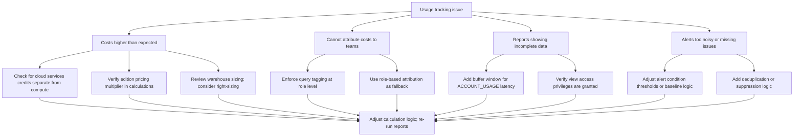
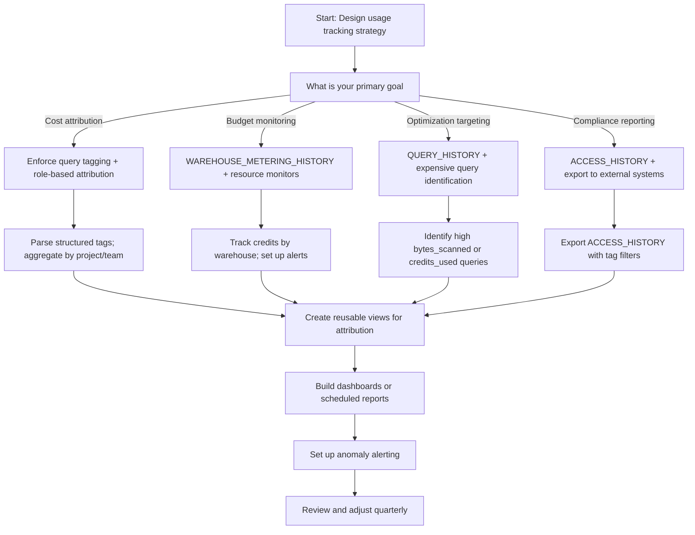

# Usage Tracking in Snowflake

```mermaid
graph TD
  UsageTrack[Usage Tracking] --> Compute[Compute Usage]
  UsageTrack --> Storage[Storage Usage]
  UsageTrack --> Transfer[Data Transfer Usage]
  UsageTrack --> Attribution[Usage Attribution]
  UsageTrack --> Reporting[Reporting & Dashboards]
  
  Compute --> WhMeter[WAREHOUSE_METERING_HISTORY]
  Compute --> QueryHist[QUERY_HISTORY]
  Compute --> CreditUsage[CREDIT_USAGE]
  
  Storage --> TableMetrics[TABLE_STORAGE_METRICS]
  Storage --> StageMetrics[STAGE_STORAGE_METRICS]
  Storage --> DbStorage[DATABASE_STORAGE_USAGE]
  
  Transfer --> Egress[Data Egress Tracking]
  Transfer --> Ingress[Data Ingress Tracking]
  Transfer --> CrossRegion[Cross-Region Transfer]
  
  Attribution --> Tags[Query Tag Attribution]
  Attribution --> Roles[Role-Based Attribution]
  Attribution --> Users[User-Based Attribution]
  Attribution --> Projects[Project-Based Chargeback]
  
  Reporting --> Dashboards[BI Dashboard Integration]
  Reporting --> Alerts[Automated Alerting]
  Reporting --> Exports[External System Exports]
```



## Core Usage Tracking Principles

| Principle | What It Means | Why It Matters |
|-----------|--------------|----------------|
| Track everything, attribute selectively | Capture all usage data; attribute only what matters for decisions | Enables comprehensive visibility without analysis paralysis |
| Use native views first, export when needed | Leverage `ACCOUNT_USAGE` and `INFORMATION_SCHEMA` before building custom tracking | Reduces development overhead and ensures data accuracy |
| Attribute at the right granularity | Tag queries, assign roles, track warehouses based on business needs | Enables meaningful chargeback and optimization ownership |
| Monitor trends, not just totals | Track usage over time to identify patterns and anomalies | Enables proactive optimization before costs escalate |
| Automate reporting, manual for analysis | Schedule routine reports; reserve manual queries for deep dives | Balances consistency with flexibility |
| Review and adjust tracking strategy | Usage patterns evolve; your tracking should too | Ensures tracking remains relevant and actionable |

```mermaid
flowchart LR
  Q1[Start: Implement usage tracking]
  Q1 --> Q2[Enable ACCOUNT_USAGE views access]
  Q2 --> Q3[Define attribution strategy (tags/roles/warehouses)]
  Q3 --> Q4[Build baseline queries for compute/storage/transfer]
  Q4 --> Q5[Create dashboards or scheduled reports]
  Q5 --> Q6[Set up alerts for anomalies]
  Q6 --> Q7[Review and refine quarterly]
```

---

## Compute Usage Tracking

### Key Views for Compute Tracking

| View | What It Tracks | Retention | Primary Use Cases |
|------|---------------|-----------|-----------------|
| `WAREHOUSE_METERING_HISTORY` | Credit usage by warehouse over time | 365 days | Warehouse cost analysis, right-sizing, budget tracking |
| `QUERY_HISTORY` | Individual query execution details | 365 days | Query-level attribution, optimization targeting, debugging |
| `CREDIT_USAGE` | Credit consumption by service type | 365 days | Overall budget tracking, service-level cost allocation |
| `MATERIALIZED_VIEW_REFRESH_HISTORY` | MV refresh timing and credit usage | 365 days | MV optimization, refresh cost analysis |
| `TASK_HISTORY` | Task execution details and credit usage | 365 days | Pipeline monitoring, ETL cost attribution |

### Querying Warehouse Credit Usage

```sql
-- Basic: Daily credit usage by warehouse
SELECT
  warehouse_name,
  DATE_TRUNC('day', start_time) as usage_date,
  SUM(credits_used) as daily_credits,
  SUM(credits_used_cloud_services) as cloud_services_credits,
  COUNT(DISTINCT query_id) as query_count,
  ROUND(AVG(credits_used), 2) as avg_credits_per_query
FROM SNOWFLAKE.ACCOUNT_USAGE.WAREHOUSE_METERING_HISTORY
WHERE start_time > DATEADD(month, -1, CURRENT_TIMESTAMP())
GROUP BY warehouse_name, DATE_TRUNC('day', start_time)
ORDER BY usage_date DESC, daily_credits DESC;

-- Advanced: Hourly usage with utilization metrics
SELECT
  warehouse_name,
  DATE_TRUNC('hour', start_time) as usage_hour,
  SUM(credits_used) as hourly_credits,
  -- Calculate utilization: actual credits / max possible credits for size
  ROUND(100.0 * SUM(credits_used) / 
    (COUNT(*) * 
      CASE 
        WHEN (SELECT size FROM INFORMATION_SCHEMA.WAREHOUSES WHERE name = warehouse_name) = 'X-SMALL' THEN 1
        WHEN (SELECT size FROM INFORMATION_SCHEMA.WAREHOUSES WHERE name = warehouse_name) = 'SMALL' THEN 2
        WHEN (SELECT size FROM INFORMATION_SCHEMA.WAREHOUSES WHERE name = warehouse_name) = 'MEDIUM' THEN 4
        WHEN (SELECT size FROM INFORMATION_SCHEMA.WAREHOUSES WHERE name = warehouse_name) = 'LARGE' THEN 8
        ELSE 16  -- Default to XLarge for simplicity
      END
    ), 2) as utilization_pct
FROM SNOWFLAKE.ACCOUNT_USAGE.WAREHOUSE_METERING_HISTORY
WHERE start_time > DATEADD(week, -1, CURRENT_TIMESTAMP())
GROUP BY warehouse_name, DATE_TRUNC('hour', start_time)
ORDER BY usage_hour DESC, hourly_credits DESC;
```

### Query-Level Attribution

```sql
-- Attribute query credits to query tags
SELECT
  DATE_TRUNC('day', qh.start_time) as usage_date,
  NULLIF(SPLIT_PART(REGEXP_SUBSTR(qh.query_tag, 'project=[^,]+'), '=', 2), '') as project,
  NULLIF(SPLIT_PART(REGEXP_SUBSTR(qh.query_tag, 'team=[^,]+'), '=', 2), '') as team,
  qh.warehouse_name,
  COUNT(*) as query_count,
  SUM(qh.credits_used) as total_credits,
  SUM(qh.bytes_scanned) as total_bytes_scanned,
  ROUND(AVG(qh.execution_time), 2) as avg_execution_seconds
FROM SNOWFLAKE.ACCOUNT_USAGE.QUERY_HISTORY qh
WHERE qh.start_time > DATEADD(month, -1, CURRENT_TIMESTAMP())
  AND qh.query_tag IS NOT NULL
  AND qh.query_tag != ''
GROUP BY 
  DATE_TRUNC('day', qh.start_time),
  NULLIF(SPLIT_PART(REGEXP_SUBSTR(qh.query_tag, 'project=[^,]+'), '=', 2), ''),
  NULLIF(SPLIT_PART(REGEXP_SUBSTR(qh.query_tag, 'team=[^,]+'), '=', 2), ''),
  qh.warehouse_name
ORDER BY usage_date DESC, total_credits DESC;

-- Identify expensive queries for optimization
SELECT
  qh.query_id,
  qh.user_name,
  qh.warehouse_name,
  qh.query_text,
  qh.start_time,
  qh.execution_time,
  qh.bytes_scanned,
  qh.credits_used,
  qh.query_tag,
  -- Flag for optimization priority
  CASE
    WHEN qh.bytes_scanned > 100000000000 THEN 'HIGH_SCAN'  -- >100GB
    WHEN qh.credits_used > 10 THEN 'HIGH_COST'
    WHEN qh.execution_time > 1800 THEN 'LONG_RUNNING'  -- >30min
    ELSE 'NORMAL'
  END as optimization_priority
FROM SNOWFLAKE.ACCOUNT_USAGE.QUERY_HISTORY qh
WHERE qh.start_time > DATEADD(day, -7, CURRENT_TIMESTAMP())
  AND (qh.bytes_scanned > 10000000000 OR qh.credits_used > 5)
ORDER BY qh.credits_used DESC
LIMIT 100;
```

### Service-Level Credit Breakdown

```sql
-- Track credits by service type (warehouse, cloud services, serverless)
SELECT
  DATE_TRUNC('day', start_time) as usage_date,
  service_type,
  SUM(credits_used) as service_credits,
  ROUND(100.0 * SUM(credits_used) / SUM(SUM(credits_used)) OVER (PARTITION BY DATE_TRUNC('day', start_time)), 2) as pct_of_daily_total,
  SUM(credits_used) * 3.00 as estimated_cost_usd  -- Enterprise edition rate
FROM SNOWFLAKE.ACCOUNT_USAGE.CREDIT_USAGE
WHERE start_time > DATEADD(month, -1, CURRENT_TIMESTAMP())
GROUP BY DATE_TRUNC('day', start_time), service_type
ORDER BY usage_date DESC, service_credits DESC;

-- Service types include:
-- 'Virtual Warehouse' = compute warehouse credits
-- 'Cloud Services' = query optimization, metadata, security operations
-- 'Serverless' = Snowpark, tasks, pipes, materialized view refreshes
-- 'Storage' = data storage (billed separately, not in credit system)
```

---

## Storage Usage Tracking

### Key Views for Storage Tracking

| View | What It Tracks | Retention | Primary Use Cases |
|------|---------------|-----------|-----------------|
| `TABLE_STORAGE_METRICS` | Storage usage by table over time | 365 days | Table-level storage cost analysis, archival decisions |
| `DATABASE_STORAGE_USAGE` | Aggregated storage by database | 365 days | Database-level budget tracking, growth monitoring |
| `STAGE_STORAGE_METRICS` | Internal stage storage usage | 365 days | Stage cleanup, file lifecycle management |
| `MATERIALIZED_VIEW_STORAGE_USAGE` | MV storage consumption | 365 days | MV cost-benefit analysis |

### Querying Table Storage Metrics

```sql
-- Basic: Current storage by table
SELECT
  table_schema,
  table_name,
  active_bytes / POWER(1024, 3) as active_gb,
  time_travel_bytes / POWER(1024, 3) as time_travel_gb,
  failsafe_bytes / POWER(1024, 3) as failsafe_gb,
  (active_bytes + time_travel_bytes + failsafe_bytes) / POWER(1024, 3) as total_gb,
  TO_VARCHAR(last_updated, 'YYYY-MM-DD') as last_updated,
  -- Estimate monthly cost: $23/TB/month for storage
  ROUND((active_bytes + time_travel_bytes + failsafe_bytes) / POWER(1024, 4) * 23.00, 2) as estimated_monthly_cost_usd
FROM SNOWFLAKE.ACCOUNT_USAGE.TABLE_STORAGE_METRICS
WHERE deleted_on IS NULL
  AND table_schema NOT IN ('INFORMATION_SCHEMA', 'SNOWFLAKE')
ORDER BY total_gb DESC
LIMIT 50;

-- Advanced: Storage growth trends over time
SELECT
  table_schema,
  table_name,
  DATE_TRUNC('week', last_updated) as week_start,
  AVG(active_bytes) / POWER(1024, 3) as avg_active_gb,
  AVG(time_travel_bytes) / POWER(1024, 3) as avg_time_travel_gb,
  -- Calculate week-over-week growth
  LAG(AVG(active_bytes), 1) OVER (
    PARTITION BY table_schema, table_name 
    ORDER BY DATE_TRUNC('week', last_updated)
  ) as prev_week_bytes,
  ROUND(100.0 * (AVG(active_bytes) - 
    LAG(AVG(active_bytes), 1) OVER (
      PARTITION BY table_schema, table_name 
      ORDER BY DATE_TRUNC('week', last_updated)
    )) / NULLIF(LAG(AVG(active_bytes), 1) OVER (
      PARTITION BY table_schema, table_name 
      ORDER BY DATE_TRUNC('week', last_updated)
    ), 0), 2) as wow_growth_pct
FROM SNOWFLAKE.ACCOUNT_USAGE.TABLE_STORAGE_METRICS
WHERE deleted_on IS NULL
  AND last_updated > DATEADD(month, -3, CURRENT_TIMESTAMP())
  AND table_schema NOT IN ('INFORMATION_SCHEMA', 'SNOWFLAKE')
GROUP BY table_schema, table_name, DATE_TRUNC('week', last_updated)
ORDER BY table_name, week_start;
```

### Time Travel and Fail-Safe Cost Analysis

```sql
-- Analyze Time Travel cost by table
CREATE OR REPLACE VIEW governance.time_travel_cost_analysis AS
SELECT
  table_schema,
  table_name,
  active_bytes / POWER(1024, 3) as active_gb,
  time_travel_bytes / POWER(1024, 3) as time_travel_gb,
  failsafe_bytes / POWER(1024, 3) as failsafe_gb,
  ROUND(100.0 * time_travel_bytes / NULLIF(active_bytes, 0), 2) as time_travel_pct,
  -- Estimate potential savings if Time Travel reduced
  time_travel_bytes / POWER(1024, 3) * 23.00 / 1024 * 0.9 as potential_monthly_savings_usd,
  -- Recommend retention based on usage patterns
  CASE
    WHEN last_updated < DATEADD(month, -6, CURRENT_TIMESTAMP()) THEN 'Consider reducing to 1 day'
    WHEN time_travel_pct > 50 THEN 'Review if 90-day retention is needed'
    ELSE 'Current retention may be appropriate'
  END as retention_recommendation
FROM SNOWFLAKE.ACCOUNT_USAGE.TABLE_STORAGE_METRICS
WHERE deleted_on IS NULL
  AND table_schema NOT IN ('INFORMATION_SCHEMA', 'SNOWFLAKE')
  AND time_travel_bytes > 0;

-- Query for optimization opportunities
SELECT
  table_schema,
  table_name,
  active_gb,
  time_travel_gb,
  time_travel_pct,
  potential_monthly_savings_usd,
  retention_recommendation
FROM governance.time_travel_cost_analysis
WHERE potential_monthly_savings_usd > 10  -- Focus on meaningful savings
ORDER BY potential_monthly_savings_usd DESC;
```

### Database-Level Storage Aggregation

```sql
-- Aggregate storage by database for budget tracking
SELECT
  table_catalog as database_name,
  COUNT(DISTINCT table_schema) as schema_count,
  COUNT(DISTINCT table_name) as table_count,
  SUM(active_bytes) / POWER(1024, 3) as total_active_gb,
  SUM(time_travel_bytes) / POWER(1024, 3) as total_time_travel_gb,
  SUM(failsafe_bytes) / POWER(1024, 3) as total_failsafe_gb,
  (SUM(active_bytes) + SUM(time_travel_bytes) + SUM(failsafe_bytes)) / POWER(1024, 3) as total_storage_gb,
  -- Estimate monthly cost
  ROUND((SUM(active_bytes) + SUM(time_travel_bytes) + SUM(failsafe_bytes)) / POWER(1024, 4) * 23.00, 2) as estimated_monthly_cost_usd,
  -- Calculate growth vs last month
  LAG(SUM(active_bytes), 1) OVER (
    ORDER BY DATE_TRUNC('month', last_updated)
  ) as prev_month_bytes,
  ROUND(100.0 * (SUM(active_bytes) - 
    LAG(SUM(active_bytes), 1) OVER (ORDER BY DATE_TRUNC('month', last_updated))) / 
    NULLIF(LAG(SUM(active_bytes), 1) OVER (ORDER BY DATE_TRUNC('month', last_updated)), 0), 2) as mom_growth_pct
FROM SNOWFLAKE.ACCOUNT_USAGE.TABLE_STORAGE_METRICS
WHERE deleted_on IS NULL
  AND table_catalog NOT IN ('SNOWFLAKE')
GROUP BY table_catalog, DATE_TRUNC('month', last_updated)
ORDER BY total_storage_gb DESC;
```


## Data Transfer Usage Tracking

### Understanding Data Transfer Costs

| Transfer Type | What It Is | Billing Model | Tracking Method |
|--------------|-----------|--------------|----------------|
| Data egress | Data moved out of Snowflake to external destinations | Per GB, varies by cloud provider/region | `COPY INTO` history, external stage logs |
| Data ingress | Data loaded into Snowflake from external sources | Typically free, but may incur cloud provider charges | `COPY INTO` history, external stage logs |
| Cross-region replication | Data replicated between Snowflake accounts in different regions | Per GB transferred + compute for replication | `REPLICATION_USAGE_HISTORY` view |
| Marketplace data exchange | Data shared via Snowflake Marketplace | May incur egress charges depending on configuration | `SHARE_USAGE_HISTORY` (if available) |

### Tracking Data Egress via COPY INTO

```sql
-- Track data egress via COPY INTO external stages
SELECT
  DATE_TRUNC('day', start_time) as export_date,
  pipe_name,
  table_name,
  SUM(row_count) as total_rows_exported,
  SUM(file_size) / POWER(1024, 3) as total_gb_exported,
  -- Estimate egress cost (varies by cloud provider; example: AWS $0.09/GB)
  SUM(file_size) / POWER(1024, 3) * 0.09 as estimated_egress_cost_usd,
  COUNT(DISTINCT file_name) as file_count
FROM SNOWFLAKE.ACCOUNT_USAGE.COPY_HISTORY
WHERE status = 'LOADED'
  AND direction = 'UNLOAD'  -- Data moving out of Snowflake
  AND start_time > DATEADD(month, -1, CURRENT_TIMESTAMP())
GROUP BY DATE_TRUNC('day', start_time), pipe_name, table_name
ORDER BY export_date DESC, total_gb_exported DESC;

-- Identify large exports for cost optimization
SELECT
  pipe_name,
  table_name,
  COUNT(*) as export_count,
  SUM(file_size) / POWER(1024, 3) as total_gb_exported,
  AVG(file_size) / POWER(1024, 6) as avg_file_size_tb,
  MAX(file_size) / POWER(1024, 3) as largest_export_gb,
  -- Flag for review if exporting >100GB/month
  CASE WHEN SUM(file_size) / POWER(1024, 3) > 100 THEN 'REVIEW_NEEDED' ELSE 'NORMAL' END as review_flag
FROM SNOWFLAKE.ACCOUNT_USAGE.COPY_HISTORY
WHERE status = 'LOADED'
  AND direction = 'UNLOAD'
  AND start_time > DATEADD(month, -1, CURRENT_TIMESTAMP())
GROUP BY pipe_name, table_name
HAVING SUM(file_size) / POWER(1024, 3) > 10  -- Focus on exports >10GB
ORDER BY total_gb_exported DESC;
```

### Cross-Region Replication Tracking

```sql
-- Track replication usage and costs
SELECT
  replication_group_name,
  source_account_name,
  target_account_name,
  DATE_TRUNC('day', start_time) as replication_date,
  SUM(bytes_transferred) / POWER(1024, 3) as gb_transferred,
  SUM(credits_used) as replication_credits,
  -- Estimate total cost: transfer cost + compute cost
  SUM(bytes_transferred) / POWER(1024, 3) * 0.02 +  -- Example: $0.02/GB cross-region
  SUM(credits_used) * 3.00 as estimated_total_cost_usd
FROM SNOWFLAKE.ACCOUNT_USAGE.REPLICATION_USAGE_HISTORY
WHERE start_time > DATEADD(month, -1, CURRENT_TIMESTAMP())
GROUP BY replication_group_name, source_account_name, target_account_name, DATE_TRUNC('day', start_time)
ORDER BY replication_date DESC, gb_transferred DESC;

-- Monitor replication lag for DR planning
SELECT
  database_name,
  replication_state,
  last_replication_time,
  DATEDIFF(minute, last_replication_time, CURRENT_TIMESTAMP()) as replication_lag_minutes,
  CASE
    WHEN DATEDIFF(minute, last_replication_time, CURRENT_TIMESTAMP()) > 60 THEN 'HIGH_LAG'
    WHEN DATEDIFF(minute, last_replication_time, CURRENT_TIMESTAMP()) > 15 THEN 'MEDIUM_LAG'
    ELSE 'LOW_LAG'
  END as lag_status
FROM SNOWFLAKE.ACCOUNT_USAGE.REPLICATION_USAGE_HISTORY
WHERE replication_state = 'REPLICATING'
ORDER BY replication_lag_minutes DESC;
```


## Usage Attribution Methods

### Query Tag-Based Attribution

```sql
-- Create standardized view for query tag parsing
CREATE OR REPLACE VIEW governance.query_tag_parsed AS
SELECT
  query_id,
  user_name,
  warehouse_name,
  start_time,
  end_time,
  execution_time,
  credits_used,
  bytes_scanned,
  query_tag,
  -- Parse structured tags: project=X,team=Y,env=Z,cost_center=W
  NULLIF(SPLIT_PART(REGEXP_SUBSTR(query_tag, 'project=[^,]+'), '=', 2), '') as project,
  NULLIF(SPLIT_PART(REGEXP_SUBSTR(query_tag, 'team=[^,]+'), '=', 2), '') as team,
  NULLIF(SPLIT_PART(REGEXP_SUBSTR(query_tag, 'env=[^,]+'), '=', 2), '') as environment,
  NULLIF(SPLIT_PART(REGEXP_SUBSTR(query_tag, 'cost_center=[^,]+'), '=', 2), '') as cost_center,
  NULLIF(SPLIT_PART(REGEXP_SUBSTR(query_tag, 'owner=[^,]+'), '=', 2), '') as owner
FROM SNOWFLAKE.ACCOUNT_USAGE.QUERY_HISTORY
WHERE query_tag IS NOT NULL AND query_tag != '';

-- Attribute compute costs by project and team
SELECT
  DATE_TRUNC('month', start_time) as billing_month,
  COALESCE(project, 'UNTAGGED') as project,
  COALESCE(team, 'UNTAGGED') as team,
  COALESCE(environment, 'UNTAGGED') as environment,
  COUNT(DISTINCT query_id) as query_count,
  SUM(credits_used) as total_credits,
  SUM(bytes_scanned) / POWER(1024, 3) as total_gb_scanned,
  ROUND(SUM(credits_used) * 3.00, 2) as estimated_cost_usd,  -- Enterprise rate
  ROUND(100.0 * SUM(credits_used) / 
    SUM(SUM(credits_used)) OVER (PARTITION BY DATE_TRUNC('month', start_time)), 2) as pct_of_monthly_total
FROM governance.query_tag_parsed
WHERE start_time > DATEADD(month, -1, CURRENT_TIMESTAMP())
GROUP BY 
  DATE_TRUNC('month', start_time),
  COALESCE(project, 'UNTAGGED'),
  COALESCE(team, 'UNTAGGED'),
  COALESCE(environment, 'UNTAGGED')
ORDER BY billing_month DESC, estimated_cost_usd DESC;
```

### Role-Based Attribution

```sql
-- Attribute costs to roles for team-level chargeback
CREATE OR REPLACE VIEW governance.role_cost_attribution AS
SELECT
  DATE_TRUNC('month', qh.start_time) as billing_month,
  r.name as role_name,
  COUNT(DISTINCT qh.query_id) as query_count,
  SUM(qh.credits_used) as total_credits,
  SUM(qh.bytes_scanned) as total_bytes_scanned,
  SUM(qh.execution_time) as total_execution_seconds,
  ROUND(SUM(qh.credits_used) * 3.00, 2) as estimated_cost_usd,
  ROUND(100.0 * SUM(qh.credits_used) / 
    SUM(SUM(qh.credits_used)) OVER (PARTITION BY DATE_TRUNC('month', qh.start_time)), 2) as pct_of_monthly_total
FROM SNOWFLAKE.ACCOUNT_USAGE.QUERY_HISTORY qh
JOIN SNOWFLAKE.ACCOUNT_USAGE.GRANTS_TO_USERS g
  ON qh.user_name = g.grantee_name
JOIN SNOWFLAKE.ACCOUNT_USAGE.ROLES r
  ON g.granted_role = r.name
WHERE qh.start_time > DATEADD(month, -3, CURRENT_TIMESTAMP())
  AND r.deleted_on IS NULL
GROUP BY DATE_TRUNC('month', qh.start_time), r.name;

-- Generate monthly chargeback report
SELECT
  billing_month,
  role_name,
  query_count,
  total_credits,
  estimated_cost_usd,
  pct_of_monthly_total,
  -- Flag roles with unusual usage patterns
  CASE
    WHEN pct_of_monthly_total > 50 THEN 'HIGH_USAGE'
    WHEN pct_of_monthly_total > 25 THEN 'MEDIUM_USAGE'
    ELSE 'LOW_USAGE'
  END as usage_category
FROM governance.role_cost_attribution
WHERE billing_month = DATE_TRUNC('month', CURRENT_DATE())
ORDER BY estimated_cost_usd DESC;
```

### User-Based Attribution with Activity Metrics

```sql
-- Track usage by individual users for accountability
CREATE OR REPLACE VIEW governance.user_usage_metrics AS
SELECT
  DATE_TRUNC('month', qh.start_time) as billing_month,
  qh.user_name,
  COUNT(DISTINCT qh.query_id) as query_count,
  COUNT(DISTINCT qh.warehouse_name) as warehouses_used,
  SUM(qh.credits_used) as total_credits,
  SUM(qh.bytes_scanned) as total_bytes_scanned,
  ROUND(AVG(qh.execution_time), 2) as avg_query_duration_seconds,
  ROUND(SUM(qh.credits_used) * 3.00, 2) as estimated_cost_usd,
  -- Identify power users vs occasional users
  CASE
    WHEN COUNT(DISTINCT qh.query_id) > 1000 THEN 'POWER_USER'
    WHEN COUNT(DISTINCT qh.query_id) > 100 THEN 'ACTIVE_USER'
    WHEN COUNT(DISTINCT qh.query_id) > 10 THEN 'OCCASIONAL_USER'
    ELSE 'MINIMAL_USER'
  END as user_category
FROM SNOWFLAKE.ACCOUNT_USAGE.QUERY_HISTORY qh
WHERE qh.start_time > DATEADD(month, -1, CURRENT_TIMESTAMP())
GROUP BY DATE_TRUNC('month', qh.start_time), qh.user_name;

-- Query for user usage review
SELECT
  billing_month,
  user_name,
  user_category,
  query_count,
  total_credits,
  estimated_cost_usd,
  avg_query_duration_seconds
FROM governance.user_usage_metrics
WHERE billing_month = DATE_TRUNC('month', CURRENT_DATE())
ORDER BY estimated_cost_usd DESC
LIMIT 50;
```

### Project-Based Chargeback Export

```sql
-- Export attribution data for external billing systems
COPY INTO @finance_exports/chargeback/compute_credits/
FROM (
  SELECT
    DATE_TRUNC('month', qh.start_time) as billing_month,
    NULLIF(SPLIT_PART(REGEXP_SUBSTR(qh.query_tag, 'project=[^,]+'), '=', 2), '') as project,
    NULLIF(SPLIT_PART(REGEXP_SUBSTR(qh.query_tag, 'cost_center=[^,]+'), '=', 2), '') as cost_center,
    qh.warehouse_name,
    COUNT(DISTINCT qh.query_id) as query_count,
    SUM(qh.credits_used) as credits,
    SUM(qh.bytes_scanned) as bytes_scanned,
    ROUND(SUM(qh.credits_used) * 3.00, 2) as cost_usd
  FROM SNOWFLAKE.ACCOUNT_USAGE.QUERY_HISTORY qh
  WHERE qh.start_time > DATEADD(month, -2, CURRENT_TIMESTAMP())
    AND qh.query_tag IS NOT NULL
  GROUP BY 
    DATE_TRUNC('month', qh.start_time),
    NULLIF(SPLIT_PART(REGEXP_SUBSTR(qh.query_tag, 'project=[^,]+'), '=', 2), ''),
    NULLIF(SPLIT_PART(REGEXP_SUBSTR(qh.query_tag, 'cost_center=[^,]+'), '=', 2), ''),
    qh.warehouse_name
)
FILE_FORMAT = (TYPE = CSV HEADER = TRUE);

-- Export storage attribution
COPY INTO @finance_exports/chargeback/storage_costs/
FROM (
  SELECT
    DATE_TRUNC('month', last_updated) as billing_month,
    COALESCE(tr.tag_value, 'UNTAGGED') as cost_center,
    tsm.table_schema,
    tsm.table_name,
    (tsm.active_bytes + tsm.time_travel_bytes + tsm.failsafe_bytes) / POWER(1024, 3) as total_gb,
    ROUND((tsm.active_bytes + tsm.time_travel_bytes + tsm.failsafe_bytes) / POWER(1024, 4) * 23.00, 2) as cost_usd
  FROM SNOWFLAKE.ACCOUNT_USAGE.TABLE_STORAGE_METRICS tsm
  LEFT JOIN SNOWFLAKE.ACCOUNT_USAGE.TAG_REFERENCES tr
    ON tsm.table_name = tr.object_name
    AND tr.tag_name = 'cost_center'
    AND tr.column_name IS NULL
  WHERE tsm.deleted_on IS NULL
    AND tsm.table_schema NOT IN ('INFORMATION_SCHEMA', 'SNOWFLAKE')
    AND last_updated > DATEADD(month, -1, CURRENT_TIMESTAMP())
)
FILE_FORMAT = (TYPE = CSV HEADER = TRUE);
```


## Reporting and Dashboard Integration

### Creating Usage Dashboards with Streamlit

```python
# Example: Streamlit dashboard for usage tracking
import streamlit as st
import snowflake.snowpark as snowpark
import pandas as pd

def main(session: snowpark.Session):
    st.set_page_config(page_title="Snowflake Usage Dashboard", layout="wide")
    st.title("📊 Snowflake Usage Tracking Dashboard")
    
    # Date range selector
    date_range = st.date_input(
        "Select date range",
        value=(pd.Timestamp.now() - pd.Timedelta(days=30), pd.Timestamp.now())
    )
    
    # Fetch warehouse usage data
    warehouse_query = f"""
    SELECT
        warehouse_name,
        DATE_TRUNC('day', start_time) as usage_date,
        SUM(credits_used) as daily_credits,
        SUM(credits_used) * 3.00 as daily_cost_usd
    FROM SNOWFLAKE.ACCOUNT_USAGE.WAREHOUSE_METERING_HISTORY
    WHERE start_time BETWEEN '{date_range[0]}' AND '{date_range[1]}'
    GROUP BY warehouse_name, DATE_TRUNC('day', start_time)
    ORDER BY usage_date DESC
    """
    warehouse_df = session.sql(warehouse_query).to_pandas()
    
    # Display summary metrics
    col1, col2, col3 = st.columns(3)
    with col1:
        st.metric("Total Credits", f"{warehouse_df['daily_credits'].sum():,.0f}")
    with col2:
        st.metric("Estimated Cost", f"${warehouse_df['daily_cost_usd'].sum():,.2f}")
    with col3:
        st.metric("Active Warehouses", warehouse_df['warehouse_name'].nunique())
    
    # Chart: Daily credit usage by warehouse
    st.subheader("Daily Credit Usage by Warehouse")
    chart_data = warehouse_df.pivot_table(
        index='usage_date', 
        columns='warehouse_name', 
        values='daily_credits',
        aggfunc='sum'
    ).fillna(0)
    st.line_chart(chart_data)
    
    # Table: Top expensive queries
    st.subheader("Top Expensive Queries")
    query_df = session.sql("""
    SELECT
        query_id,
        user_name,
        warehouse_name,
        credits_used,
        bytes_scanned / POWER(1024, 3) as gb_scanned,
        execution_time,
        LEFT(query_tag, 100) as query_tag
    FROM SNOWFLAKE.ACCOUNT_USAGE.QUERY_HISTORY
    WHERE start_time > DATEADD(day, -7, CURRENT_TIMESTAMP())
    ORDER BY credits_used DESC
    LIMIT 20
    """).to_pandas()
    st.dataframe(query_df)

# Deploy with: snow app run --streamlit
```

### Scheduled Reports via Tasks

```sql
-- Task: Generate weekly usage summary report
CREATE OR REPLACE TASK governance.weekly_usage_report
  WAREHOUSE = admin_wh
  SCHEDULE = 'USING CRON 0 9 * * 1'  -- Mondays at 9 AM
AS
  SYSTEM$SEND_EMAIL(
    'finance-team@company.com, platform-team@company.com',
    'Weekly Snowflake Usage Report - Week of ' || TO_VARCHAR(DATEADD(week, -1, CURRENT_DATE()), 'YYYY-MM-DD'),
    (SELECT 
      '=== COMPUTE USAGE ===\n' ||
      'Total Credits: ' || SUM(credits_used) || '\n' ||
      'Estimated Cost: $' || ROUND(SUM(credits_used) * 3.00, 2) || '\n' ||
      'Top Warehouse: ' || 
        (SELECT warehouse_name FROM SNOWFLAKE.ACCOUNT_USAGE.WAREHOUSE_METERING_HISTORY 
         WHERE start_time > DATEADD(week, -1, CURRENT_TIMESTAMP())
         GROUP BY warehouse_name ORDER BY SUM(credits_used) DESC LIMIT 1) || '\n\n' ||
      
      '=== STORAGE USAGE ===\n' ||
      'Total Storage: ' || 
        ROUND(SUM(active_bytes + time_travel_bytes + failsafe_bytes) / POWER(1024, 4), 2) || ' TB\n' ||
      'Estimated Cost: $' || 
        ROUND(SUM(active_bytes + time_travel_bytes + failsafe_bytes) / POWER(1024, 4) * 23.00, 2) || '\n\n' ||
      
      '=== TOP PROJECTS BY CREDITS ===\n' ||
      (SELECT LISTAGG(
        '• ' || COALESCE(NULLIF(SPLIT_PART(REGEXP_SUBSTR(query_tag, ''project=[^,]+''), ''='', 2), ''''), ''UNTAGGED'') || 
        ': ' || SUM(credits_used) || ' credits',
        '\n')
       FROM SNOWFLAKE.ACCOUNT_USAGE.QUERY_HISTORY
       WHERE start_time > DATEADD(week, -1, CURRENT_TIMESTAMP())
         AND query_tag IS NOT NULL
       GROUP BY COALESCE(NULLIF(SPLIT_PART(REGEXP_SUBSTR(query_tag, ''project=[^,]+''), ''='', 2), ''''), ''UNTAGGED'')
       ORDER BY SUM(credits_used) DESC
       LIMIT 5) || '\n\n' ||
      
      '🔗 View detailed dashboard: https://your-bi-tool.com/snowflake-usage'
     FROM SNOWFLAKE.ACCOUNT_USAGE.CREDIT_USAGE
     WHERE start_time > DATEADD(week, -1, CURRENT_TIMESTAMP()))
  );

-- Task: Alert on usage anomalies
CREATE OR REPLACE TASK governance.usage_anomaly_alert
  WAREHOUSE = admin_wh
  SCHEDULE = 'USING CRON 0 */6 * * *'  -- Every 6 hours
  WHEN (
    -- Alert if current 6-hour usage exceeds 2x the 7-day average
    SELECT SUM(credits_used)
    FROM SNOWFLAKE.ACCOUNT_USAGE.WAREHOUSE_METERING_HISTORY
    WHERE start_time > DATEADD(hour, -6, CURRENT_TIMESTAMP())
  ) > (
    SELECT AVG(six_hour_credits) * 2
    FROM (
      SELECT 
        DATE_TRUNC('hour', start_time) as hour_bucket,
        SUM(credits_used) as six_hour_credits
      FROM SNOWFLAKE.ACCOUNT_USAGE.WAREHOUSE_METERING_HISTORY
      WHERE start_time > DATEADD(day, -7, CURRENT_TIMESTAMP())
      GROUP BY DATE_TRUNC('hour', start_time)
    )
  )
AS
  SYSTEM$SEND_EMAIL(
    'platform-oncall@company.com',
    'Alert: Unusual Snowflake usage detected',
    'Current 6-hour credit usage exceeds 2x the 7-day average.\n\n' ||
    'Current: ' || (SELECT SUM(credits_used) FROM SNOWFLAKE.ACCOUNT_USAGE.WAREHOUSE_METERING_HISTORY WHERE start_time > DATEADD(hour, -6, CURRENT_TIMESTAMP())) || ' credits\n' ||
    '7-day average: ' || (SELECT AVG(six_hour_credits) * 2 FROM (SELECT DATE_TRUNC(''hour'', start_time) as hour_bucket, SUM(credits_used) as six_hour_credits FROM SNOWFLAKE.ACCOUNT_USAGE.WAREHOUSE_METERING_HISTORY WHERE start_time > DATEADD(day, -7, CURRENT_TIMESTAMP()) GROUP BY DATE_TRUNC(''hour'', start_time))) || ' credits\n\n' ||
    'Investigate immediately.'
  );
```

### BI Tool Integration Examples

```sql
-- Create view optimized for Tableau/Power BI consumption
CREATE OR REPLACE VIEW governance.usage_dashboard_source AS
SELECT
  -- Time dimension
  DATE_TRUNC('day', COALESCE(wmh.start_time, qh.start_time, tsm.last_updated)) as usage_date,
  DATE_TRUNC('week', COALESCE(wmh.start_time, qh.start_time, tsm.last_updated)) as usage_week,
  DATE_TRUNC('month', COALESCE(wmh.start_time, qh.start_time, tsm.last_updated)) as usage_month,
  
  -- Compute metrics
  COALESCE(wmh.warehouse_name, qh.warehouse_name) as warehouse_name,
  COALESCE(wmh.credits_used, qh.credits_used) as credits_used,
  COALESCE(wmh.credits_used_cloud_services, 0) as cloud_services_credits,
  
  -- Query metrics
  qh.query_id,
  qh.user_name,
  qh.query_tag,
  qh.bytes_scanned,
  qh.execution_time,
  
  -- Storage metrics
  tsm.table_schema,
  tsm.table_name,
  tsm.active_bytes,
  tsm.time_travel_bytes,
  tsm.failsafe_bytes,
  
  -- Attribution fields (parsed from tags)
  NULLIF(SPLIT_PART(REGEXP_SUBSTR(qh.query_tag, 'project=[^,]+'), '=', 2), '') as project,
  NULLIF(SPLIT_PART(REGEXP_SUBSTR(qh.query_tag, 'team=[^,]+'), '=', 2), '') as team,
  NULLIF(SPLIT_PART(REGEXP_SUBSTR(qh.query_tag, 'cost_center=[^,]+'), '=', 2), '') as cost_center,
  
  -- Cost calculations
  COALESCE(wmh.credits_used, qh.credits_used) * 3.00 as compute_cost_usd,
  (COALESCE(tsm.active_bytes, 0) + COALESCE(tsm.time_travel_bytes, 0) + COALESCE(tsm.failsafe_bytes, 0)) / POWER(1024, 4) * 23.00 as storage_cost_usd

FROM SNOWFLAKE.ACCOUNT_USAGE.WAREHOUSE_METERING_HISTORY wmh
FULL OUTER JOIN SNOWFLAKE.ACCOUNT_USAGE.QUERY_HISTORY qh
  ON wmh.warehouse_name = qh.warehouse_name
  AND qh.start_time BETWEEN wmh.start_time AND wmh.end_time
FULL OUTER JOIN SNOWFLAKE.ACCOUNT_USAGE.TABLE_STORAGE_METRICS tsm
  ON DATE_TRUNC('day', tsm.last_updated) = DATE_TRUNC('day', COALESCE(wmh.start_time, qh.start_time))
WHERE COALESCE(wmh.start_time, qh.start_time, tsm.last_updated) > DATEADD(month, -3, CURRENT_TIMESTAMP());
```


## Best Practices for Usage Tracking

### Data Collection Best Practices

| Practice | Implementation | Benefit |
|----------|---------------|---------|
| Enable ACCOUNT_USAGE view access | Grant `MONITOR` privilege to analytics roles | Ensures comprehensive visibility into usage patterns |
| Account for view latency | Add buffer windows to queries (~45 min delay) | Prevents missing recent usage in reports |
| Use consistent time zones | Standardize on UTC or business timezone | Enables accurate time-based aggregation and comparison |
| Track both credits and bytes | Monitor `credits_used` and `bytes_scanned` together | Enables optimization targeting (cost vs. data volume) |
| Separate service types | Track warehouse, cloud services, serverless separately | Enables targeted optimization by service type |

### Attribution Best Practices

| Practice | Implementation | Benefit |
|----------|---------------|---------|
| Enforce query tagging via role settings | `ALTER ROLE X SET QUERY_TAG = '...'` | Ensures consistent attribution without relying on user discipline |
| Use structured key=value format | `project=X,team=Y,env=Z` | Enables easy parsing and filtering in reports |
| Include environment in tags | Always add `env=prod/dev/test` | Enables environment-specific cost analysis and optimization |
| Validate tags in CI/CD pipelines | Check for required tags before deployment | Catches missing attribution before production impact |
| Document tag schema centrally | Maintain wiki with allowed keys and values | Prevents inconsistent tagging across teams |

### Reporting Best Practices

| Practice | Implementation | Benefit |
|----------|---------------|---------|
| Create reusable views for common metrics | `governance.query_tag_parsed`, `governance.role_cost_attribution` | Reduces query complexity and ensures consistency |
| Schedule reports aligned with billing cycles | Monthly reports on 1st; weekly on Mondays | Matches finance reporting rhythms |
| Include trend analysis, not just totals | Show week-over-week, month-over-month changes | Enables proactive identification of usage patterns |
| Export to external systems for finance integration | `COPY INTO @finance_exports/...` | Enables chargeback and budget planning in existing tools |
| Set up alerts for anomalies, not absolutes | Compare to baselines; alert on deviations | Reduces alert fatigue while catching real issues |


## Common Pitfalls and Mitigations

| Pitfall | What Happens | How To Fix |
|---------|--------------|------------|
| Not accounting for ACCOUNT_USAGE latency | Real-time dashboards show incomplete data | Add buffer window to queries; use for batch analysis not real-time |
| Forgetting minimum 60-second billing | Underestimating cost of many short queries | Remember: each query costs at least 1 minute of warehouse time |
| Not separating cloud services credits | Attributing all credits to compute; missing optimization opportunities | Track `credits_used_cloud_services` separately; optimize metadata-heavy queries |
| Using wrong edition price in calculations | Cost reports inaccurate for finance | Maintain pricing table; join dynamically based on account edition |
| Not enforcing query tagging | Cannot attribute costs to projects or teams | Enforce tagging via role settings or governance policy |
| Tracking everything without attribution strategy | Data overload; cannot identify optimization ownership | Define attribution strategy first; track only what matters for decisions |
| Ignoring storage growth trends | Surprise bills from uncontrolled data growth | Set up alerts on `TABLE_STORAGE_METRICS`; archive cold data proactively |
| Not reviewing tracking strategy quarterly | Tracking becomes outdated as workloads evolve | Schedule quarterly reviews of attribution, reports, and alerts |




## Decision Framework: Usage Tracking Implementation



| Requirement | Recommended Approach | Key View/Query |
|------------|---------------------|---------------|
| Project/team cost attribution | Query tagging + parsed attribution view | `governance.query_tag_parsed` |
| Warehouse budget monitoring | WAREHOUSE_METERING_HISTORY + resource monitors | `SUM(credits_used) BY warehouse` |
| Query optimization targeting | QUERY_HISTORY filtered by bytes_scanned/credits | `WHERE bytes_scanned > 100GB OR credits_used > 10` |
| Storage cost analysis | TABLE_STORAGE_METRICS + Time Travel analysis | `active_bytes + time_travel_bytes + failsafe_bytes` |
| Compliance audit reporting | ACCESS_HISTORY + TAG_REFERENCES join | Filter by sensitivity tags; export to external system |
| Real-time anomaly detection | ALERT objects with baseline comparison | Compare current usage to 7-day average |


## Key Principles to Remember

- **Track comprehensively, attribute selectively.** Capture all usage data; attribute only what matters for business decisions.
- **Use native views first.** Leverage `ACCOUNT_USAGE` and `INFORMATION_SCHEMA` before building custom tracking.
- **Attribute at the right granularity.** Tag queries, assign roles, track warehouses based on actual business needs.
- **Monitor trends, not just totals.** Track usage over time to identify patterns and anomalies before they escalate.
- **Automate routine reporting, reserve manual for analysis.** Schedule consistent reports; use ad-hoc queries for deep dives.
- **Review and adjust tracking strategy quarterly.** Usage patterns evolve; your tracking should evolve too.
- **Document your attribution logic.** Future you and your team need context for how costs are allocated.

## Bottom Line

- Usage tracking in Snowflake starts with `ACCOUNT_USAGE` views: `WAREHOUSE_METERING_HISTORY` for compute, `TABLE_STORAGE_METRICS` for storage, `QUERY_HISTORY` for attribution.
- Enforce query tagging to enable project/team cost attribution. Parse structured tags for flexible reporting.
- Separate compute credits from cloud services credits for targeted optimization opportunities.
- Create reusable views for common metrics; schedule reports aligned with billing cycles.
- Set up alerts for anomalies, not absolutes. Compare to baselines to reduce noise while catching real issues.
- Export attribution data to external finance systems for chargeback and budget planning.
- Review and adjust your tracking strategy quarterly. Workloads evolve; your visibility should too.

Think of usage tracking like monitoring utilities in a large building:
- **WAREHOUSE_METERING_HISTORY is your electricity meter.** It shows which department used how much power and when.
- **TABLE_STORAGE_METRICS is your water/gas meter.** It tracks storage consumption by table or database.
- **Query tags are your sub-metering system.** They show which project or team incurred which costs.
- **QUERY_HISTORY is your appliance-level monitoring.** It identifies which specific queries are using the most resources.
- **Scheduled reports are your monthly utility bills.** They provide consistent, auditable records for finance.
- **Alerts are your leak detectors.** They warn you when usage is unusual before it becomes a problem.

Measure everything. Attribute what matters. Report consistently. Alert on anomalies. Review and adjust regularly. That is how usage tracking works in Snowflake.
