# Domain 2.0 Account Management and Data Governance

```mermaid
graph TD
  Domain2[Domain 2.0] --> AcctMgmt[2.1 Account Management]
  Domain2 --> DataGov[2.2 Data Governance]
  Domain2 --> Security[2.3 Security Features]
  Domain2 --> Compliance[2.4 Compliance and Auditing]
  
  AcctMgmt --> Users[User Management]
  AcctMgmt --> Roles[Role Based Access Control]
  AcctMgmt --> Auth[Authentication and SSO]
  AcctMgmt --> Resources[Resource Monitors]
  
  DataGov --> Tags[Data Classification and Tagging]
  DataGov --> RLS[Row and Column Security]
  DataGov --> Sharing[Secure Data Sharing]
  DataGov --> Lineage[Data Lineage and Discovery]
  
  Security --> Encrypt[Encryption and Keys]
  Security --> Network[Network Policies]
  Security --> MFA[Multi Factor Authentication]
  Security --> Private[Private Connectivity]
  
  Compliance --> Audit[Audit Logging]
  Compliance --> Views[ACCOUNT_USAGE Views]
  Compliance --> Frameworks[Compliance Frameworks]
  Compliance --> Retention[Data Retention Policies]
```

## 2.1 Account Management

### Account Structure and Hierarchy

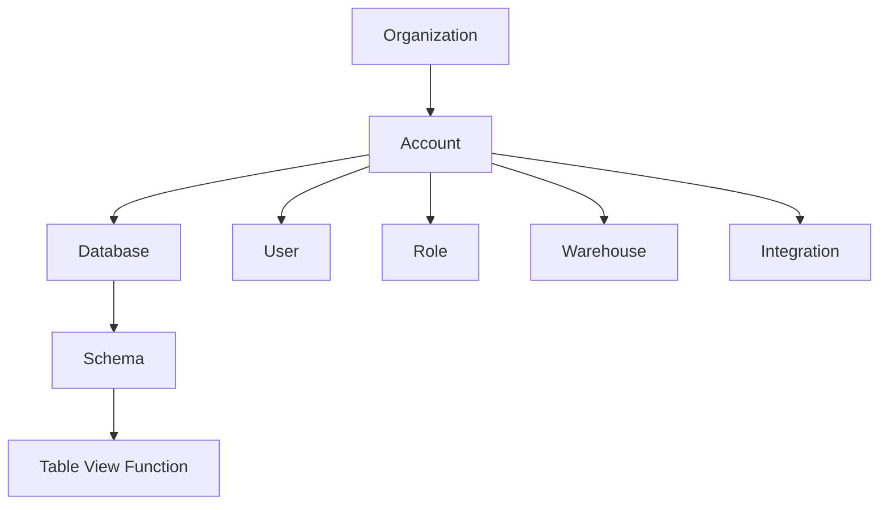

| Level | Scope | Management Responsibility |
|-------|-------|-------------------------|
| Organization | Multiple accounts | Org admin: provisioning billing SSO policies |
| Account | Isolated Snowflake environment | Account admin: users roles warehouses databases |
| Database | Logical data container | DB owner: schemas tables views access control |
| Schema | Namespace for objects | Schema owner: object creation and grants |
| Object | Table view function stage | Object owner: data content and object level grants |

### User Management

| User Property | Description | Configuration Example |
|--------------|-------------|---------------------|
| Login name | Unique identifier for authentication | CREATE USER analyst_jane PASSWORD = '***' |
| Default role | Role assumed on login | ALTER USER analyst_jane SET DEFAULT_ROLE = ANALYST_ROLE |
| Default warehouse | Warehouse used for ad hoc queries | ALTER USER analyst_jane SET DEFAULT_WAREHOUSE = ANALYTICS_WH |
| Authentication type | Password key pair OAuth SSO | ALTER USER analyst_jane SET AUTHENTICATION_METHOD = KEY_PAIR |
| Status | ACTIVE or DISABLED | ALTER USER analyst_jane SET DISABLED = TRUE |
| MFA enforcement | Require multi factor authentication | ALTER ACCOUNT SET ALLOW_CLIENT_MFA_CACHING = FALSE |

```sql
-- Create user with key pair authentication
CREATE OR REPLACE USER etl_service
  PASSWORD = '***'
  DEFAULT_ROLE = ETL_ROLE
  DEFAULT_WAREHOUSE = ETL_WH
  MUST_CHANGE_PASSWORD = FALSE
  DISABLED = FALSE;

-- Grant role to user
GRANT ROLE ETL_ROLE TO USER etl_service;
```

### Role Based Access Control RBAC

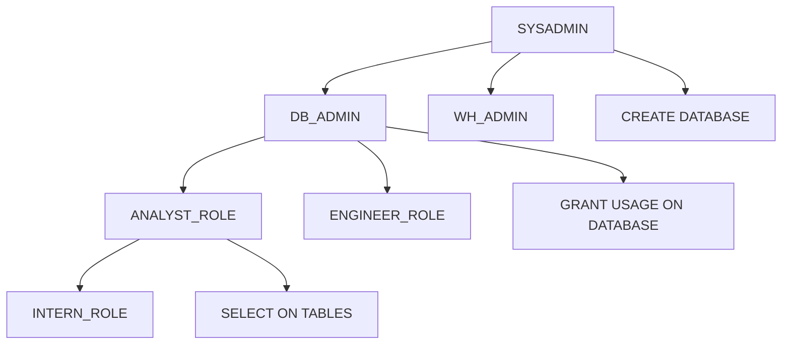

| Role Pattern | Purpose | Example Grants |
|-------------|---------|---------------|
| SYSADMIN | Create and manage databases schemas objects | CREATE DATABASE GRANT ON DATABASE |
| SECURITYADMIN | Manage users roles grants | CREATE ROLE GRANT ROLE |
| USERADMIN | Manage user accounts and passwords | CREATE USER ALTER USER |
| Functional role | Team based data access | GRANT SELECT ON SCHEMA TO ROLE ANALYST_ROLE |
| Environment role | Isolate dev test prod access | GRANT USAGE ON WAREHOUSE DEV_WH TO ROLE DEV_ROLE |

```sql
-- Create functional role with least privilege
CREATE ROLE ANALYST_ROLE;

-- Grant access to specific schema
GRANT USAGE ON DATABASE analytics TO ROLE ANALYST_ROLE;
GRANT USAGE ON SCHEMA analytics.reporting TO ROLE ANALYST_ROLE;
GRANT SELECT ON ALL TABLES IN SCHEMA analytics.reporting TO ROLE ANALYST_ROLE;
GRANT SELECT ON FUTURE TABLES IN SCHEMA analytics.reporting TO ROLE ANALYST_ROLE;

-- Grant role to user
GRANT ROLE ANALYST_ROLE TO USER analyst_jane;
```

### Authentication Methods

| Method | Setup Complexity | Security Level | Best For |
|--------|-----------------|---------------|----------|
| Username and password | Low | Medium | Quick testing personal use |
| Key pair authentication | Medium | High | Automation service accounts production scripts |
| OAuth 2.0 | High | High | Enterprise SSO short lived tokens |
| SSO with SAML | High | High | Corporate identity providers MFA integration |
| External browser | Low | Medium | Interactive login with MFA support |

```sql
-- Configure key pair authentication
-- Step 1: Generate key pair externally
-- Step 2: Assign public key to user
ALTER USER etl_service SET RSA_PUBLIC_KEY = 'MIIBIjANBgkq...';

-- Step 3: Connect with private key
-- snowsql -a myaccount -u etl_service --private-key-path rsa_key.p8
```

### Resource Monitors and Cost Controls

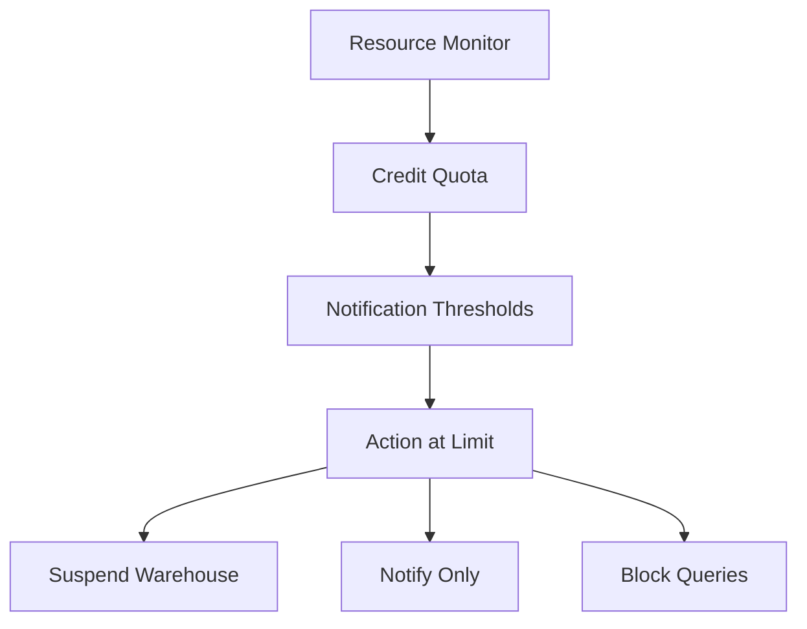

| Property | Description | Recommended Setting |
|----------|-------------|-------------------|
| Credit quota | Maximum credits per period | Set based on budget and historical usage |
| Frequency | Monthly or weekly reset | Match to billing cycle or sprint cadence |
| Notify at 50 percent | Alert when half quota used | Gives team time to adjust spending |
| Notify at 75 percent | Alert when three quarters used | Warning before hard limit |
| Notify at 90 percent | Alert when near limit | Final warning before action |
| Action at 100 percent | Suspend or block when quota exceeded | Suspend for dev block for prod with on call alert |

```sql
-- Create resource monitor for production warehouse
CREATE OR REPLACE RESOURCE MONITOR prod_monitor
  WITH CREDIT_QUOTA = 1000
  FREQUENCY = MONTHLY
  START_TIMESTAMP = IMMEDIATELY
  TRIGGERS
    ON 50 PERCENT DO NOTIFY
    ON 75 PERCENT DO NOTIFY
    ON 90 PERCENT DO NOTIFY
    ON 100 PERCENT DO SUSPEND;

-- Attach monitor to warehouse
ALTER WAREHOUSE REPORTING_WH SET RESOURCE_MONITOR = prod_monitor;
```

### Session Policies and Parameters

| Parameter | Scope | Default | Recommended for Dev | Recommended for Prod |
|-----------|-------|---------|-------------------|-------------------|
| STATEMENT_TIMEOUT_IN_SECONDS | Session | 0 unlimited | 300 | 600 |
| QUERY_TAG | Session | null | Set to project name | Set to project and environment |
| TIMEZONE | Session | UTC | UTC | Match business timezone |
| BINARY_OUTPUT_FORMAT | Session | HEX | HEX | BASE64 if needed |
| JSON_INDENT | Session | 0 | 2 for readability | 0 for production |
| ABORT_DETACHED_QUERY | Session | FALSE | TRUE for dev | FALSE for prod |

```sql
-- Set session parameters at role level
ALTER ROLE ANALYST_ROLE SET
  STATEMENT_TIMEOUT_IN_SECONDS = 300
  QUERY_TAG = 'project=sales_dashboard,env=prod';
```

## 2.2 Data Governance

### Data Classification and Tagging

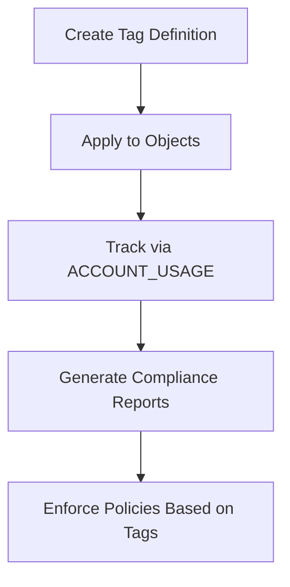

| Tag Use Case | Example Tag Key | Example Tag Values | Enforcement Action |
|-------------|----------------|-------------------|-------------------|
| Data sensitivity | sensitivity | public internal confidential restricted | Apply masking policies based on value |
| Data owner | owner | team_finance team_marketing team_engineering | Route access requests to owner |
| Retention policy | retention | 30d 1y 7y permanent | Automate archival or deletion |
| Compliance scope | compliance | hipaa pci gdpr soc2 | Apply additional audit logging |
| Cost center | cost_center | CC_12345 CC_67890 | Attribute storage and compute costs |

```sql
-- Create tag definition
CREATE OR REPLACE TAG sensitivity
  COMMENT = 'Data classification for access control';

-- Apply tag to table column
ALTER TABLE customers MODIFY COLUMN ssn SET TAG sensitivity = 'restricted';

-- Query tagged objects
SELECT *
FROM SNOWFLAKE.ACCOUNT_USAGE.TAG_REFERENCES
WHERE TAG_NAME = 'sensitivity'
  AND TAG_VALUE = 'restricted';
```

### Row Level Security and Column Masking

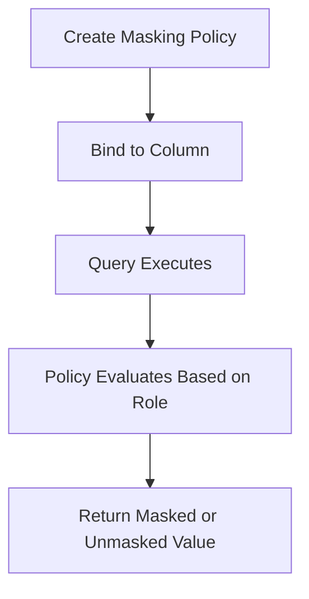

| Security Feature | What It Controls | Example Use Case |
|-----------------|-----------------|-----------------|
| Row Access Policy | Filter rows based on role or context | Sales reps see only their region data |
| Column Masking Policy | Transform column values based on role | Show last 4 digits of SSN for non HR roles |
| Dynamic Data Masking | Apply masking at query time not storage | Same table serves multiple security levels |
| Secure Views | Hide underlying table structure and logic | Share aggregated results without exposing source |

```sql
-- Create column masking policy for email
CREATE OR REPLACE MASKING POLICY email_mask AS (val STRING) RETURNS STRING ->
  CASE
    WHEN CURRENT_ROLE() IN ('HR_ROLE', 'ADMIN_ROLE') THEN val
    ELSE REGEXP_REPLACE(val, '.+@', '***@')
  END;

-- Apply policy to column
ALTER TABLE customers MODIFY COLUMN email SET MASKING POLICY email_mask;

-- Create row access policy for regional data
CREATE OR REPLACE ROW ACCESS POLICY regional_access AS (region STRING) RETURNS BOOLEAN ->
  CASE
    WHEN CURRENT_ROLE() = 'ADMIN_ROLE' THEN TRUE
    WHEN CURRENT_ROLE() = 'SALES_ROLE' THEN region = CURRENT_USER_REGION()
    ELSE FALSE
  END;

-- Apply policy to table
ALTER TABLE sales ADD ROW ACCESS POLICY regional_access ON (region);
```

### Secure Data Sharing

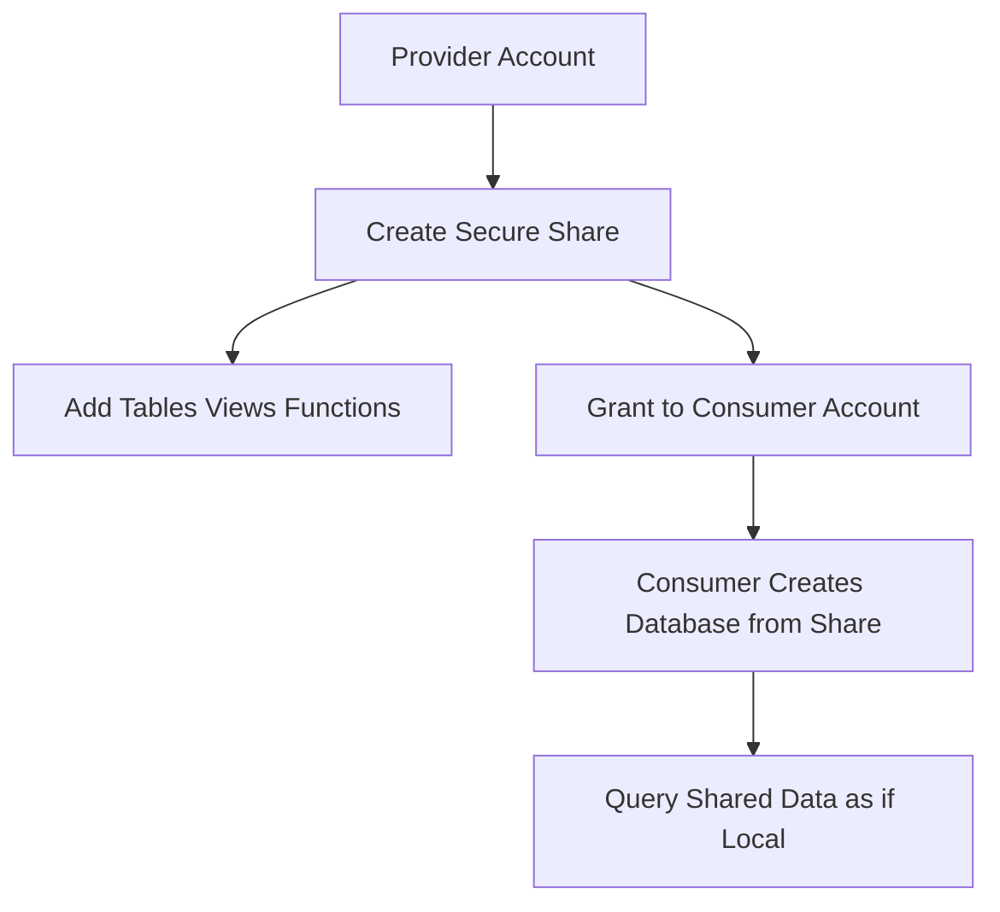

| Sharing Pattern | Use Case | Key Consideration |
|----------------|----------|------------------|
| Internal sharing | Share data across teams in same org | Use roles and grants for access control |
| External sharing | Share with partner or customer accounts | Consumer pays for compute on shared data |
| Marketplace listing | Publish data for public discovery | Set pricing and terms via Snowflake Marketplace |
| Reader account | Share with account that has no Snowflake subscription | Provider pays for consumer compute costs |

```sql
-- Provider: Create and populate share
CREATE OR REPLACE SHARE partner_sales_share
  COMMENT = 'Sales data for partner analytics';

GRANT USAGE ON DATABASE analytics TO SHARE partner_sales_share;
GRANT USAGE ON SCHEMA analytics.shared TO SHARE partner_sales_share;
GRANT SELECT ON TABLE analytics.shared.monthly_sales TO SHARE partner_sales_share;

-- Provider: Add consumer account
ALTER SHARE partner_sales_share ADD ACCOUNTS = consumer_account_locator;

-- Consumer: Create database from share
CREATE DATABASE partner_sales FROM SHARE provider_account.partner_sales_share;

-- Consumer: Query shared data
SELECT * FROM partner_sales.shared.monthly_sales WHERE region = 'North';
```

### Data Lineage and Discovery

| Capability | What It Provides | Where To Find It |
|-----------|-----------------|-----------------|
| Object dependencies | Which tables views functions depend on which objects | SNOWFLAKE.ACCOUNT_USAGE.OBJECT_DEPENDENCIES |
| Query history | Who ran what query against which objects | SNOWFLAKE.ACCOUNT_USAGE.QUERY_HISTORY |
| Access history | Which users roles accessed which objects | SNOWFLAKE.ACCOUNT_USAGE.ACCESS_HISTORY |
| Storage metrics | Size and growth of tables and databases | SNOWFLAKE.ACCOUNT_USAGE.TABLE_STORAGE_METRICS |
| Tag references | Which objects have which tags applied | SNOWFLAKE.ACCOUNT_USAGE.TAG_REFERENCES |

```sql
-- Find all tables that depend on a source table
SELECT *
FROM SNOWFLAKE.ACCOUNT_USAGE.OBJECT_DEPENDENCIES
WHERE REFERENCED_OBJECT_NAME = 'raw_events'
  AND REFERENCED_OBJECT_DOMAIN = 'TABLE';

-- Track who accessed sensitive data last week
SELECT
  user_name,
  object_name,
  query_text,
  start_time
FROM SNOWFLAKE.ACCOUNT_USAGE.ACCESS_HISTORY
WHERE object_name IN (
  SELECT object_name
  FROM SNOWFLAKE.ACCOUNT_USAGE.TAG_REFERENCES
  WHERE tag_name = 'sensitivity' AND tag_value = 'restricted'
)
  AND start_time > DATEADD(day, -7, CURRENT_TIMESTAMP);
```

## 2.3 Security Features

### Encryption and Key Management

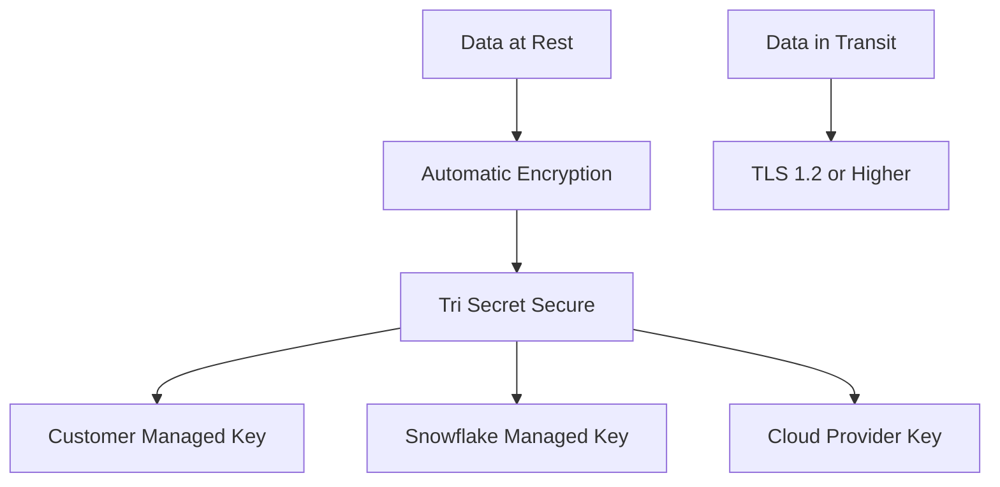

| Encryption Feature | Description | Configuration |
|-------------------|-------------|--------------|
| Automatic encryption | All data encrypted at rest by default | No action required enabled for all accounts |
| Tri Secret Secure | Combine Snowflake cloud and customer keys | Requires Business Critical edition |
| Customer managed keys | Use your own key management system | Configure via AWS KMS Azure Key Vault or GCP KMS |
| Key rotation | Automatic or manual key rotation | Set rotation policy in cloud provider or Snowflake |
| Column level encryption | Encrypt specific columns with your key | Use ENCRYPT and DECRYPT functions with customer key |

```sql
-- Enable customer managed key for Business Critical account
-- This is configured via Snowflake UI or API not SQL
-- Example: Link AWS KMS key to Snowflake account

-- Use column level encryption in queries
INSERT INTO sensitive_data (ssn_encrypted)
VALUES (ENCRYPT('123-45-6789', 'my_key_name'));

SELECT DECRYPT(ssn_encrypted, 'my_key_name') FROM sensitive_data;
```

### Network Policies and IP Allowlists

| Policy Type | What It Controls | Example Use Case |
|------------|-----------------|-----------------|
| Account network policy | Restrict which IPs can connect to account | Allow only corporate VPN and approved partners |
| User network policy | Restrict IPs for specific users | Limit service accounts to known infrastructure |
| VPC peering | Private network connection to Snowflake | Secure data transfer without public internet |
| PrivateLink AWS or Private Endpoint Azure GCP | Private connectivity from VPC to Snowflake | Meet compliance requirements for private networks |

```sql
-- Create account network policy
CREATE OR REPLACE NETWORK POLICY corporate_access
  ALLOWED_IP_LIST = ('192.168.1.0/24', '10.0.0.0/8')
  BLOCKED_IP_LIST = ('0.0.0.0/0')
  COMMENT = 'Allow only corporate network access';

-- Apply policy to account
ALTER ACCOUNT SET NETWORK_POLICY = corporate_access;

-- Create user specific network policy
CREATE OR REPLACE NETWORK POLICY etl_access
  ALLOWED_IP_LIST = ('10.10.10.5/32')
  COMMENT = 'Allow only ETL server IP';

-- Apply policy to service account
ALTER USER etl_service SET NETWORK_POLICY = etl_access;
```

### Multi Factor Authentication and SSO

| Authentication Feature | Setup Steps | Security Benefit |
|----------------------|-------------|-----------------|
| MFA enforcement | Enable at account or user level | Prevents account takeover with stolen credentials |
| SSO with SAML | Configure identity provider in Snowflake | Centralized user management and MFA |
| OAuth for API access | Register client application with IdP | Short lived tokens reduce credential exposure |
| Session timeout | Set MAX_SESSION_IDLE_TIME | Limits window for session hijacking |
| Password policies | Set MIN_PASSWORD_LENGTH PASSWORD_HISTORY | Enforces strong credential practices |

```sql
-- Enable MFA for all users
ALTER ACCOUNT SET ALLOW_CLIENT_MFA_CACHING = FALSE;

-- Configure SSO with SAML
-- This is done via Snowflake UI or API
-- Example parameters:
-- SAML2_IDENTITY_PROVIDER = 'https://idp.example.com/saml'
-- SAML2_ISSUER = 'snowflake_account'
-- SAML2_SSO_URL = 'https://idp.example.com/sso'
-- SAML2_PROVIDER = 'CUSTOM'

-- Set password policy
ALTER ACCOUNT SET
  MIN_PASSWORD_LENGTH = 12
  PASSWORD_HISTORY = 3
  LOCKOUT_TIME_MINS = 15
  MAX_FAILED_LOGIN_ATTEMPTS = 5;
```

### Private Connectivity Options

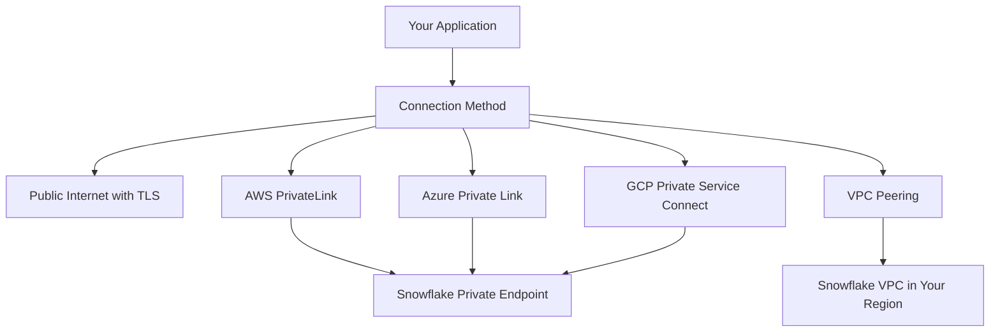

| Connectivity Option | Cloud Provider | Setup Complexity | Best For |
|-------------------|---------------|-----------------|----------|
| Public internet with TLS | All | Low | Development testing non sensitive workloads |
| AWS PrivateLink | AWS | Medium | Production workloads requiring private network |
| Azure Private Link | Azure | Medium | Production workloads requiring private network |
| GCP Private Service Connect | GCP | Medium | Production workloads requiring private network |
| VPC Peering | All | High | Multi account architectures with strict isolation |

## 2.4 Compliance and Auditing

### Audit Logging with ACCOUNT_USAGE Views

| View | What It Tracks | Retention | Key Columns |
|------|---------------|-----------|-------------|
| LOGIN_HISTORY | User login attempts and outcomes | 365 days | EVENT_TIMESTAMP USER_NAME CLIENT_IP SUCCESS |
| QUERY_HISTORY | All executed queries with details | 365 days | QUERY_TEXT WAREHOUSE_NAME BYTES_SCANNED |
| ACCESS_HISTORY | Object level access by users roles | 365 days | OBJECT_NAME OBJECT_TYPE USER_NAME GRANTED_ROLE |
| GRANTS_TO_USERS | Role and privilege grants to users | Until revoked | CREATED_ON GRANTEE_NAME GRANTED_ROLE |
| TABLE_STORAGE_METRICS | Storage usage by table over time | 365 days | TABLE_NAME ACTIVE_BYTES TIME_TRAVEL_BYTES |
| TAG_REFERENCES | Tag assignments to objects | Until tag removed | OBJECT_NAME TAG_NAME TAG_VALUE |

```sql
-- Audit failed login attempts in last 24 hours
SELECT
  EVENT_TIMESTAMP,
  USER_NAME,
  CLIENT_IP,
  ERROR_MESSAGE
FROM SNOWFLAKE.ACCOUNT_USAGE.LOGIN_HISTORY
WHERE SUCCESS = 'NO'
  AND EVENT_TIMESTAMP > DATEADD(hour, -24, CURRENT_TIMESTAMP)
ORDER BY EVENT_TIMESTAMP DESC;

-- Track expensive queries that scanned over 100 GB
SELECT
  QUERY_ID,
  USER_NAME,
  WAREHOUSE_NAME,
  BYTES_SCANNED,
  CREDITS_USED_CLOUD_SERVICES,
  QUERY_TEXT
FROM SNOWFLAKE.ACCOUNT_USAGE.QUERY_HISTORY
WHERE BYTES_SCANNED > 100000000000  -- 100 GB
  AND START_TIME > DATEADD(day, -7, CURRENT_TIMESTAMP)
ORDER BY BYTES_SCANNED DESC;
```

### Compliance Framework Support

| Framework | Snowflake Feature | Configuration Requirement |
|-----------|------------------|-------------------------|
| HIPAA | Business Critical edition encryption audit logging | Sign BAA enable Tri Secret Secure configure audit exports |
| PCI DSS | Encryption network policies access controls | Isolate cardholder data enable MFA restrict network access |
| FedRAMP | FedRAMP authorized Snowflake deployment | Use FedRAMP region follow federal access policies |
| GDPR | Data masking right to be forgotten audit trails | Implement masking policies enable time travel for deletion |
| SOC 2 | Access controls change management monitoring | Document RBAC enable resource monitors export audit logs |

```sql
-- Export audit logs for compliance reporting
-- Use Snowflake external stages to write to secure storage
COPY INTO s3://compliance-bucket/audit_logs/
FROM SNOWFLAKE.ACCOUNT_USAGE.ACCESS_HISTORY
FILE_FORMAT = (TYPE = PARQUET COMPRESSION = SNAPPY)
CREDENTIALS = (AWS_KEY_ID = '***' AWS_SECRET_KEY = '***');
```

### Data Retention and Archival Policies

| Policy Type | Implementation | Use Case |
|------------|---------------|----------|
| Time Travel retention | Set DATA_RETENTION_TIME_IN_DAYS per database or table | Meet regulatory requirements for data recovery |
| Fail Safe | Automatic 7 day protected period after Time Travel | Emergency recovery for compliance scenarios |
| Transient tables | CREATE TRANSIENT TABLE to skip Fail Safe | Temporary data that does not need long term recovery |
| External archival | COPY to external stage then DROP from Snowflake | Move cold data to cheaper storage while keeping metadata |
| Automated deletion | Use Tasks with DELETE statements based on date | Implement right to be forgotten or data lifecycle policies |

```sql
-- Set retention policy for compliance database
ALTER DATABASE compliance_db SET DATA_RETENTION_TIME_IN_DAYS = 2555;  -- 7 years

-- Create transient table for temporary processing
CREATE TRANSIENT TABLE etl.staging_load (
  load_id NUMBER,
  raw_data VARIANT,
  loaded_at TIMESTAMP
);

-- Archive old data to external storage then drop
COPY INTO s3://archive-bucket/sales/2023/
FROM sales_2023
FILE_FORMAT = (TYPE = PARQUET);

DROP TABLE sales_2023;
```

## Cross Domain Best Practices

### Account Management Checklist

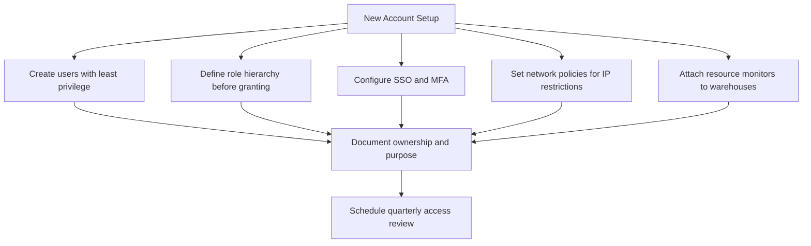

| Practice | Implementation | Why It Matters |
|----------|---------------|----------------|
| Create users with least privilege | Grant only required roles not SYSADMIN | Reduces blast radius of compromised credentials |
| Define role hierarchy upfront | Map teams to roles before granting access | Prevents permission sprawl and simplifies audits |
| Enforce MFA for all interactive users | Set ALLOW_CLIENT_MFA_CACHING = FALSE | Prevents account takeover with stolen passwords |
| Restrict network access by IP | Create and apply network policies | Limits attack surface to known trusted networks |
| Attach resource monitors to all warehouses | Set credit quotas and alert thresholds | Prevents unexpected cost spikes from runaway queries |
| Document role purpose and ownership | Add comments to roles and grants | Enables future audits and access reviews |

### Data Governance Checklist

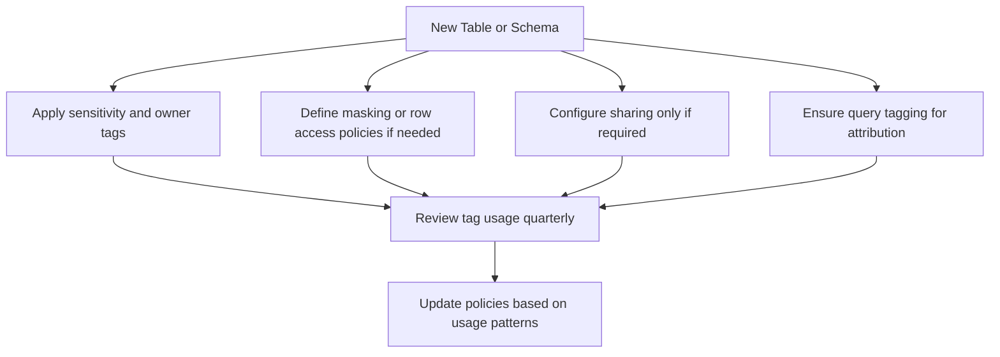

| Practice | Implementation | Why It Matters |
|----------|---------------|----------------|
| Tag all tables with sensitivity and owner | Use CREATE TAG and apply at table or column level | Enables automated policy enforcement and cost attribution |
| Apply masking policies to sensitive columns | Define policies once bind to multiple columns | Consistent protection without repeating logic |
| Use secure views for external sharing | Create views that filter or aggregate before sharing | Share insights without exposing raw sensitive data |
| Set query tags for all workloads | Configure QUERY_TAG at role or session level | Track cost and usage by project team or environment |
| Review access patterns monthly | Query ACCESS_HISTORY for unusual activity | Detect misconfigurations or unauthorized access early |

### Security Hardening Checklist

| Area | Action | Verification |
|------|--------|-------------|
| Authentication | Enable MFA for all interactive users | Query LOGIN_HISTORY for MFA usage |
| Authorization | Audit grants with GRANTS_TO_USERS view | Confirm no user has unnecessary SYSADMIN |
| Encryption | Verify Tri Secret Secure for sensitive data | Check account edition and key configuration |
| Network | Apply network policies to service accounts | Test connection from unauthorized IP fails |
| Session | Set reasonable statement timeouts | Confirm long running queries are intentional |
| Audit | Export ACCOUNT_USAGE views to secure storage | Verify logs are complete and tamper evident |

### Compliance Readiness Checklist

| Requirement | Snowflake Capability | Implementation Step |
|------------|---------------------|-------------------|
| Data encryption at rest | Automatic encryption Tri Secret Secure | Enable Business Critical edition configure customer keys |
| Access logging | ACCOUNT_USAGE views external stage export | Schedule daily COPY of audit views to secure storage |
| User access reviews | GRANTS_TO_USERS ACCESS_HISTORY queries | Build report showing who has access to what |
| Data retention policies | Time Travel configuration transient tables | Set retention per database based on regulatory needs |
| Incident response | Query history access history network logs | Document process to investigate suspicious activity |
| Change management | Version control for SQL Git integration | Store all DDL in repo require pull requests for changes |

## Decision Frameworks

### User Access Request Flow

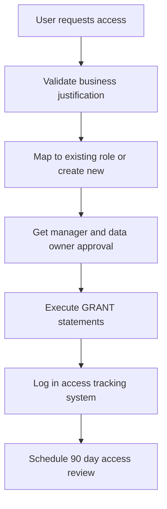

### Data Sharing Approval Process

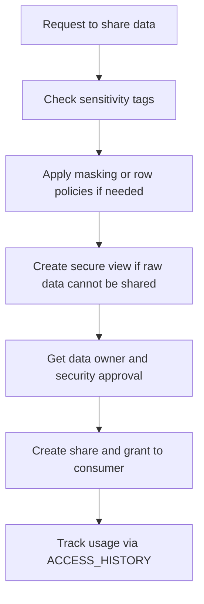

### Incident Response Workflow

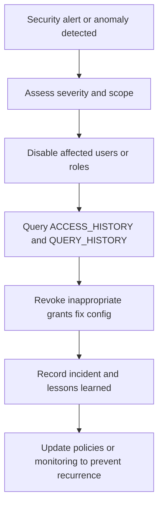

## Key Principles

- Least privilege is not optional. Grant only what is required for the task. Revoke when no longer needed.
- Tags are your governance foundation. Apply them consistently. Use them to automate policy enforcement.
- Audit logs are your evidence. Export them. Protect them. Review them regularly.
- Network restrictions reduce attack surface. Apply them to service accounts and interactive users.
- MFA prevents account takeover. Enforce it for all interactive access. Use key pairs for automation.
- Resource monitors prevent cost surprises. Attach them to all production warehouses.
- Data sharing requires explicit approval. Document the why. Track the usage.
- Compliance is a configuration not a certification. Implement controls continuously not just for audits.

## Bottom Line

- Account management controls who can do what. RBAC is your primary tool. Document and review regularly.
- Data governance controls what data users can see. Tags masking and policies enforce your rules.
- Security features protect data at rest and in transit. Encryption and network policies are baseline.
- Compliance requires evidence. ACCOUNT_USAGE views provide the audit trail. Export and protect it.
- Start with least privilege. Add access only when justified. Remove access when no longer needed.
- Automate what you can. Tags policies and monitors reduce manual overhead and human error.
- Measure before you scale. One week of audit data beats guessing about access patterns.
- Security is a process not a product. Review and adjust as your organization and threats evolve.

Think of account management and governance like building security for a facility:
- Users are your employees. Give each person only the keys they need.
- Roles are your access badges. Group permissions logically. Update when roles change.
- Tags are your classification labels. Mark what is sensitive. Enforce handling rules.
- Policies are your security rules. Define once. Apply consistently. Audit compliance.
- Audit logs are your security cameras. Record who accessed what. Review for anomalies.
- Network policies are your perimeter fence. Restrict entry to trusted locations.
- Resource monitors are your budget alarms. Alert before you overspend.

Build security into your design. Do not add it as an afterthought. Protect what matters. Enable what is needed. Document your choices. Review and adapt as requirements change.
