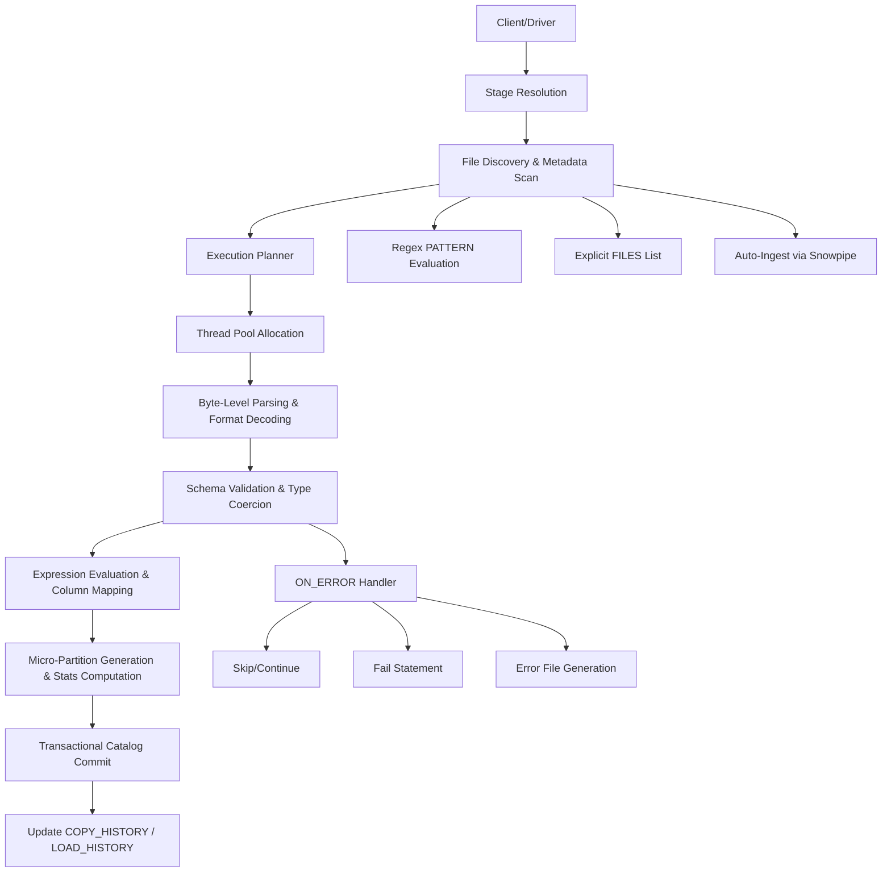
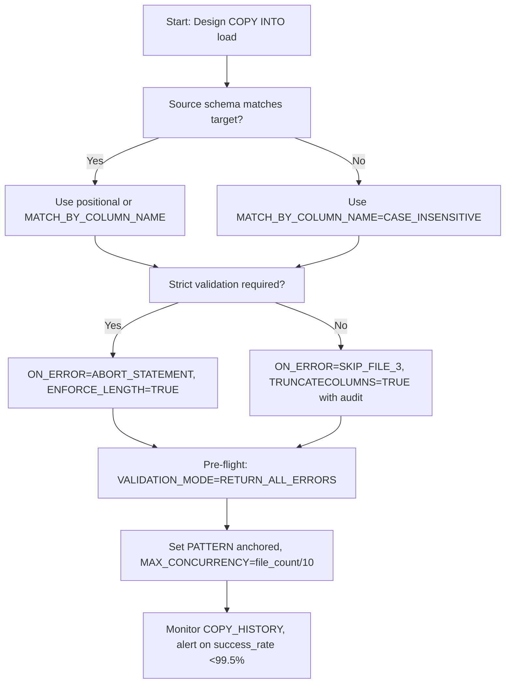

# Domain 3.1: `COPY INTO` Command
**Production Engineering Guide: Architecture, Execution Internals, Operational Tuning, and Troubleshooting**



---

## 3.1.1 Execution Architecture & Thread Model

`COPY INTO` is a **distributed, parallelized, transactional load engine**. It does not stream rows sequentially; it materializes data directly into Snowflake's columnar micro-partition storage using a strict multi-phase execution pipeline.

### Phase Breakdown
| Phase | Internal Operation | Technical Detail |
|-------|-------------------|------------------|
| **1. Discovery** | Cloud provider API enumeration or stage metadata scan | Resolves `PATTERN`, `FILES`, or `DIRECTORY()` calls. Computes `(file_path, size, last_modified, checksum)` tuples. Skips files already in `COPY_HISTORY` unless `FORCE=TRUE`. |
| **2. Partitioning** | File-to-thread assignment | Snowflake creates one processing thread per file (capped by `MAX_CONCURRENCY` and warehouse node count). Threads operate independently; no inter-thread coordination until commit. |
| **3. Parsing & Coercion** | Byte-level deserialization | Decodes compression, applies delimiter/quote rules, handles encoding. Evaluates type coercion rules per target column. Generates in-memory row batches. |
| **4. Validation & Error Handling** | Row-level constraint checking | Checks precision, length, nullability, format rules. Applies `ON_ERROR` logic. Routes invalid rows to error files or skips based on threshold. |
| **5. Materialization** | Columnar encoding & micro-partition write | Applies dictionary encoding (low cardinality), RLE (sorted sequences), ZSTD/LZ4 (general). Computes per-micro-partition statistics: `MIN`, `MAX`, `NULL_COUNT`, `NDV`, `DISTINCT_COUNT`. |
| **6. Commit** | Transactional metadata registration | Registers micro-partition IDs in Snowflake's global catalog. Updates `COPY_HISTORY` and `LOAD_HISTORY`. Triggers time-travel versioning. Atomic per file; partial failures do not corrupt target table. |

**Critical Execution Constraints:**
- **File Granularity:** 1 file = 1 thread. If `file_count < thread_capacity`, warehouse cores sit idle. If `file_count > thread_capacity`, files queue.
- **Memory Bound:** Parsing occurs in warehouse node memory. Spill-to-disk occurs if `MAX_CONCURRENCY` × file size exceeds node memory, causing severe performance degradation.
- **Idempotency Key:** Snowflake tracks loaded files via deterministic hash: `SHA256(stage_path + file_name + last_modified + file_size)`. Changing any component triggers reprocessing.
- **Post-Load Immutability:** Once committed, micro-partitions are immutable. `UPDATE`/`DELETE`/`MERGE` create new partitions; originals persist for `DATA_RETENTION_TIME_IN_DAYS`.

---

## 3.1.2 Syntax Variants & Parameter Internals

### Core Variants
| Variant | Purpose | Execution Context |
|---------|---------|------------------|
| `COPY INTO <target_table> FROM <stage>` | Bulk data ingestion | Compute warehouse parses files, writes micro-partitions |
| `COPY INTO <stage_location> FROM (<SELECT>)` | Data unloading | Compute serializes result set, applies format, writes to external/internal stage |
| `COPY INTO <stage> FROM <table>` | Stage staging/prep | Copies table data to stage for downstream processing |

### Critical Parameter Mechanics (`COPY INTO <table>`)
| Parameter | Internal Behavior | Operational Impact |
|-----------|------------------|-------------------|
| `PATTERN` | Regex applied to stage paths during discovery | Use anchored patterns: `^events/2024-01-.*\.gz$`. Greedy `.*` on large buckets causes O(N) API scan latency. |
| `FILES` | Explicit file list override | Bypasses pattern scan. Ideal for targeted reprocessing, idempotent retries, or debug loads. |
| `ON_ERROR` | Determines failure threshold & handling | `'CONTINUE'` logs errors, loads valid rows. `'SKIP_FILE'` aborts file on first error. `'SKIP_FILE_n'` aborts if errors > n. `'ABORT_STATEMENT'` fails entire load. |
| `FORCE` | Bypasses `COPY_HISTORY` hash check | Forces reprocessing of already-loaded files. Use with `RETURN_FAILED_ONLY=TRUE` for audit or re-ingestion. |
| `PURGE` | Deletes source files after successful commit | Reduces stage storage. Requires `OWNERSHIP` on stage. Transactional per file; failed loads are not purged. |
| `MATCH_BY_COLUMN_NAME` | Maps source → target by name, not position | `CASE_SENSITIVE`: Exact match. `CASE_INSENSITIVE`: Lowercase match. Handles schema evolution. Requires identical column names in source/target. |
| `SIZE_LIMIT` | Stops ingestion after X bytes processed | Enables phased migration, quota enforcement, or testing without full bucket scan. |
| `RETURN_FAILED_ONLY` | Outputs only failed rows/files to result set | Debugging error patterns without loading success data. Useful for dry-run validation. |
| `ENFORCE_LENGTH` | Fails on string overflow | Default `TRUE`. Critical for compliance. Disable only with explicit audit logging. |
| `TRUNCATECOLUMNS` | Truncates oversized strings instead of failing | Data loss risk. Use only for tolerant ETL pipelines with downstream validation. |

### Expression-Based Transformation During Load
```sql
-- Column reordering & type casting during load
COPY INTO analytics.events (event_id, occurred_at, payload, region)
FROM (
  SELECT 
    $1::STRING,
    $2::TIMESTAMP_NTZ,
    PARSE_JSON($3),
    UPPER($4)
  FROM @s3_raw_stage/events/
)
FILE_FORMAT = (FORMAT_NAME = csv_load_fmt)
ON_ERROR = 'SKIP_FILE_3';
```
- Expressions (`$1`, `$2`, etc.) are evaluated **in-memory per thread** before micro-partition write.
- Heavy transformations (`PARSE_JSON`, complex `CASE`, regex) increase CPU utilization and memory pressure.
- Use `MATCH_BY_COLUMN_NAME` instead of positional mapping when source schema drifts.


## 3.1.3 File Format Integration & Type Coercion

Snowflake's parser decodes files according to `FILE_FORMAT` definitions. Misconfiguration causes parse failures, silent corruption, or performance cliffs.

### CSV/TSV Parsing Rules
| Parameter | Byte-Level Behavior | Edge Case Handling |
|-----------|-------------------|-------------------|
| `FIELD_DELIMITER` | Single/multi-byte separator detection | Fails if embedded in quoted fields without `ESCAPE`. Supports `|||`, `^`, etc. |
| `RECORD_DELIMITER` | Line boundary detection | Defaults to `\n`. Handles `\r\n` automatically. `SKIP_BLANK_LINES=TRUE` ignores empty rows. |
| `FIELD_OPTIONALLY_ENCLOSED_BY` | Quote stripping at field boundaries | Removes quotes only at start/end. `""` becomes `"`. Fails if mismatched. |
| `ESCAPE` / `ESCAPE_UNENCLOSED_FIELD` | Character escape resolution | `ESCAPE=NONE` disables. `ESCAPE_UNENCLOSED_FIELD` handles delimiters inside unquoted fields. |
| `DATE_FORMAT`, `TIME_FORMAT`, `TIMESTAMP_FORMAT` | Strict parsing rules | Invalid formats trigger `PARSE_ERROR`. Supports `TZ` specifiers: `TZH:TZM`. |

### Semi-Structured Parsing (JSON/Avro/Parquet)
| Parameter | Internal Behavior | Optimization Impact |
|-----------|------------------|-------------------|
| `STRIP_OUTER_ARRAY` | Removes top-level JSON array wrapper | Required for `COPY INTO` to treat each array element as a row. |
| `STRIP_NULL_VALUES` | Omits `null` keys during ingestion | Reduces `VARIANT` storage size by ~15–30%. |
| `ALLOW_DUPLICATE` | Permits duplicate JSON keys | Last occurrence wins. Set `FALSE` to catch malformed payloads. |
| `BINARY_AS_TEXT` (Parquet) | Decodes binary columns as UTF-8 strings | Enable for legacy compatibility. Disable for native `BINARY` type. |
| `COMPRESSION` | Decompression engine selection | `SNAPPY` (fast, low CPU), `ZSTD` (best ratio), `GZIP` (universal, high CPU). |

**Type Coercion Matrix:**
| Source Type | Target Type | Coercion Rule | Failure Condition |
|-------------|------------|---------------|------------------|
| String | `NUMBER(p,s)` | Decimal parsing, scale rounding | `ENFORCE_LENGTH=TRUE` on overflow |
| String | `BOOLEAN` | `'true','1','yes'`→`TRUE`; `'false','0','no'`→`FALSE` | Case-sensitive parsing unless `IGNORE_UTF8_ERRORS=TRUE` |
| String | `TIMESTAMP_NTZ` | Strict format match | Invalid TZ specifiers or malformed strings fail |
| JSON/Parquet | `VARIANT` | Self-describing binary encoding with type tags | Exceeds 16MB per-row limit (configurable up to 2GB) |


## 3.1.4 Parallelism, Concurrency & Resource Allocation

### Thread Allocation Model
1. **File Discovery:** Resolves target files, computes total count & byte size.
2. **Thread Pool Sizing:** Warehouse spawns up to `MAX_CONCURRENCY` threads (default `8`). Threads are hash-assigned to files.
3. **Execution:** Each thread parses, validates, transforms, and writes micro-partitions independently.
4. **Commit:** Atomic registration per file. Failed files logged; successful files committed.

```sql
-- Optimize concurrency for high-file-count loads
ALTER SESSION SET MAX_CONCURRENCY = 16;  -- Cap to prevent node saturation
ALTER SESSION SET STATEMENT_TIMEOUT_IN_SECONDS = 7200;  -- 2-hour window

COPY INTO analytics.events_raw
FROM @s3_raw_stage/events/
FILE_FORMAT = (FORMAT_NAME = parquet_load_fmt)
PATTERN = '.*\.parquet$'
ON_ERROR = 'SKIP_FILE_3'
SIZE_LIMIT = 50000000000;
```

**Performance Rules:**
| Rule | Implementation | Impact |
|------|---------------|--------|
| **Optimal File Size** | 10–100 MB uncompressed | Maximizes parallelism; avoids tiny file overhead |
| **Compression** | Pre-compress (GZIP/ZSTD/SNAPPY) | Reduces network transfer, storage, and parse time |
| **Warehouse Sizing** | Match size to file count/volume | XSmall for <50 files; Large/XLarge for 10k+ files |
| `MAX_CONCURRENCY` | Cap at `file_count / 10` | Prevents warehouse queueing; aligns with thread pool |
| **Avoid `SINGLE=TRUE`** | Forces serial execution | Disables parallelism; kills throughput |

### Memory & Spill Behavior
- Each thread allocates memory for parsing buffers, row batches, and micro-partition staging.
- If `total_files × avg_file_size > warehouse_node_memory × 0.7`, Snowflake spills to local disk.
- **Spill impact:** 3–10x latency increase, I/O wait dominates CPU, potential OOM if disk fills.
- **Mitigation:** Reduce `MAX_CONCURRENCY`, increase warehouse size, consolidate tiny files upstream.


## 3.1.5 Error Handling, Validation & Data Quality Controls

### `ON_ERROR` Modes
| Mode | Behavior | Use Case |
|------|----------|----------|
| `CONTINUE` | Skips invalid rows, logs errors, continues load | High-volume tolerant pipelines, error table reconciliation |
| `SKIP_FILE` | Aborts entire file on first error | Strict validation, prevents partial file contamination |
| `SKIP_FILE_n` | Aborts file if errors > n | Threshold-based quality gates (e.g., `SKIP_FILE_3`) |
| `ABORT_STATEMENT` | Fails entire `COPY INTO` | Critical financial/compliance data, zero-tolerance policies |

### Pre-Flight Validation (`VALIDATION_MODE`)
```sql
-- Validate 100 rows without writing
COPY INTO analytics.events_raw
FROM @s3_raw_stage/events/
VALIDATION_MODE = 'RETURN_100_ROWS';

-- Validate entire file set, return only errors
COPY INTO analytics.events_raw
FROM @s3_raw_stage/events/
VALIDATION_MODE = 'RETURN_ALL_ERRORS';
```
- `VALIDATION_MODE` executes **parse & validate only**; zero micro-partitions written.
- Essential for CI/CD pipeline checks before production deployment.
- Returns structured error table: `LINE_NUMBER`, `START_POSITION`, `ERROR_CODE`, `ERROR_MESSAGE`, `FILE_NAME`.

### Error File Generation
- Stored in stage as `<file_name>_error.csv`
- Contains: `line_number`, `column_position`, `error_code`, `error_message`, `rejected_value`
- Parseable via `COPY INTO error_table FROM @stage PATTERN='.*_error.csv'`
- **Compliance Note:** Silent truncation via `TRUNCATECOLUMNS=TRUE` breaks auditability. Always log truncation events.


## 3.1.6 Performance Tuning & Operational Optimization

### Warehouse Sizing Guidelines
| Workload | Files/Volume | Recommended Size | Thread Capacity |
|----------|-------------|------------------|----------------|
| Small bulk (<50 files) | <1 GB | `X-SMALL` / `SMALL` | 1–4 threads |
| Medium bulk (50–5k files) | 1–50 GB | `MEDIUM` / `LARGE` | 4–16 threads |
| Large bulk (>5k files) | 50+ GB | `X-LARGE` / `2X-LARGE` | 16–64 threads |
| Streaming/Snowpipe | Event-driven | Serverless / `SMALL` | Auto-scaled |

### Diagnostic Tools & Query Profiling
| Tool | Usage | Output |
|------|-------|--------|
| `EXPLAIN COPY INTO` | Pre-execution plan | File count, thread estimate, format parsing cost |
| `SYSTEM$LAST_QUERY_PROFILE()` | Post-execution profile | Memory usage, I/O wait, compression ratio, error distribution |
| `COPY_HISTORY` | Load tracking | `FILE_NAME`, `STATUS`, `ROW_COUNT`, `ERROR_COUNT`, `FIRST_ERROR_MESSAGE` |
| `LOAD_HISTORY` | End-to-end lineage | `FILE_NAME`, `TABLE_SCHEMA`, `TABLE_NAME`, `STAGE_NAME` |

**Anti-Patterns & Fixes:**
| Anti-Pattern | Consequence | Fix |
|--------------|-------------|-----|
| Millions of <1MB files | Metadata overhead, slow load, high cost | Consolidate upstream or use `SIZE_LIMIT` |
| `ON_ERROR='CONTINUE'` blindly | Silent data corruption, compliance failure | Use `'SKIP_FILE_3'` + audit error table |
| Disabling compression | 3–5x network/storage cost, slower load | Pre-compress or use `COMPRESSION='AUTO'` |
| Oversized warehouse for small loads | Wasted credits, no performance gain | Right-size based on `COPY_HISTORY` file count |
| Ignoring `ENFORCE_LENGTH` | Silent truncation, data integrity loss | Enable for production, log violations |


## 3.1.7 Monitoring, Troubleshooting & Runbooks

### Core Monitoring Queries
```sql
-- Real-time load success rate (last 1 hour)
SELECT 
  table_schema || '.' || table_name as target_table,
  COUNT(*) as total_files,
  COUNT_IF(status = 'LOADED') as successful_files,
  COUNT_IF(status = 'LOAD_FAILED') as failed_files,
  ROUND(100.0 * COUNT_IF(status = 'LOADED') / NULLIF(COUNT(*), 0), 2) as success_rate_pct,
  MAX(first_error_message) as latest_error
FROM TABLE(INFORMATION_SCHEMA.COPY_HISTORY(
  START_TIME => DATEADD(hour, -1, CURRENT_TIMESTAMP())
))
GROUP BY table_schema, table_name
HAVING COUNT(*) > 0
ORDER BY success_rate_pct ASC;

-- Error pattern categorization for triage
SELECT 
  CASE 
    WHEN first_error_message ILIKE '%numeric value out of bounds%' THEN 'NUMERIC_OVERFLOW'
    WHEN first_error_message ILIKE '%string too long%' THEN 'STRING_TRUNCATION'
    WHEN first_error_message ILIKE '%field not found%' THEN 'SCHEMA_MISMATCH'
    WHEN first_error_message ILIKE '%permission denied%' THEN 'PERMISSION_ERROR'
    WHEN first_error_message ILIKE '%parsing error%' THEN 'PARSE_ERROR'
    ELSE 'OTHER'
  END as error_category,
  COUNT(*) as error_count,
  COUNT(DISTINCT file_name) as affected_files
FROM TABLE(INFORMATION_SCHEMA.COPY_HISTORY(
  START_TIME => DATEADD(hour, -6, CURRENT_TIMESTAMP())
))
WHERE status = 'LOAD_FAILED'
GROUP BY error_category
ORDER BY error_count DESC;
```

### Incident Response: Failed File Reprocessing
```sql
-- Step 1: Identify failed files
CREATE OR REPLACE TEMP TABLE failed_files AS
SELECT file_name, table_schema, table_name, stage_name, loading_history_id
FROM TABLE(INFORMATION_SCHEMA.COPY_HISTORY(START_TIME => DATEADD(hour, -24, CURRENT_TIMESTAMP())))
WHERE status = 'LOAD_FAILED';

-- Step 2: Generate retry script
SELECT 
  'COPY INTO ' || table_schema || '.' || table_name || 
  ' FROM @' || stage_name || '/' || file_name ||
  ' FILE_FORMAT = (FORMAT_NAME = parquet_load_fmt) FORCE = TRUE ON_ERROR = ''SKIP_FILE_3'';' 
FROM failed_files;

-- Step 3: Execute & verify
-- Step 4: Monitor success rate for 30 minutes post-recovery
```

### Snowpipe Backfill Procedure
```sql
ALTER PIPE raw_events_pipe SET PIPE_EXECUTION_PAUSED = TRUE;
ALTER PIPE raw_events_pipe REFRESH;
-- Monitor: SELECT SYSTEM$PIPE_STATUS('raw_events_pipe');
ALTER PIPE raw_events_pipe SET PIPE_EXECUTION_PAUSED = FALSE;
```


## 3.1.8 Security, Compliance & Audit Integration

| Control | Implementation | Audit Evidence |
|---------|---------------|----------------|
| **Encryption in Transit** | TLS 1.2+ enforced. No downgrade. | Connection metadata, network logs |
| **Encryption at Rest** | AES-256. CMK/Tri-Secret available. | `ENCRYPTION_STATUS` view |
| **Stage Permissions** | `USAGE` on stage, `OWNERSHIP` for purge | `GRANTS_TO_ROLES`, `DIRECTORY()` access logs |
| **Network Policies** | IP allow/block lists, PrivateLink | `NETWORK_POLICY_EVENTS` |
| **Data Lineage** | `COPY_HISTORY` (14d), `LOAD_HISTORY` (365d) | File-to-table mapping, user/role attribution |
| **Compliance Validation** | `VALIDATION_MODE`, `ENFORCE_LENGTH`, `ON_ERROR` | Error files, audit logs, schema drift reports |

**Critical Security Notes:**
- `COPY INTO` executes with **caller's role**. Privileges are checked at parse time.
- `PURGE=TRUE` requires `OWNERSHIP` on stage, not just `USAGE`.
- Error files inherit stage permissions. Secure error stages for compliance pipelines.
- Cross-account stage access requires `STORAGE_INTEGRATION` with explicit IAM trust.


## 3.1.9 Cost Management & Attribution

### Credit Calculation Model
- `Credits = (Warehouse_Size_Multiplier × Execution_Time_Hours) + Cloud_Services_Overhead`
- File count drives parallelism; execution time drives cost.
- **Optimization Levers:** Right-size warehouse, consolidate files, use compression, enable `PURGE`.

### Cost Attribution Pattern
```sql
-- Attribute load costs to pipeline via query tagging
CREATE OR REPLACE VIEW governance.load_cost_attribution AS
SELECT
  DATE_TRUNC('day', qh.start_time) as load_date,
  NULLIF(SPLIT_PART(REGEXP_SUBSTR(qh.query_tag, 'pipeline=[^,]+'), '=', 2), '') as pipeline_name,
  qh.warehouse_name,
  SUM(qh.credits_used) as pipeline_credits,
  COUNT(DISTINCT ch.file_name) as files_loaded,
  ROUND(SUM(qh.credits_used) * 3.00, 2) as estimated_cost_usd
FROM SNOWFLAKE.ACCOUNT_USAGE.QUERY_HISTORY qh
JOIN TABLE(INFORMATION_SCHEMA.COPY_HISTORY(
  START_TIME => DATEADD(day, -1, CURRENT_TIMESTAMP())
)) ch ON qh.query_id = ch.query_id
WHERE qh.query_tag ILIKE '%pipeline=%'
GROUP BY 
  DATE_TRUNC('day', qh.start_time),
  NULLIF(SPLIT_PART(REGEXP_SUBSTR(qh.query_tag, 'pipeline=[^,]+'), '=', 2), ''),
  qh.warehouse_name;
```


## 3.1.10 Decision Matrix & Quick Reference

### Parameter Selection Flow


### Quick Syntax Cheat Sheet
```sql
COPY INTO <target_table>
FROM <@stage/path>
FILE_FORMAT = (TYPE = 'PARQUET' COMPRESSION = 'ZSTD')
PATTERN = '^data/2024-.*\.parquet$'
ON_ERROR = 'SKIP_FILE_3'
FORCE = FALSE
PURGE = TRUE
MATCH_BY_COLUMN_NAME = 'CASE_INSENSITIVE'
SIZE_LIMIT = 100000000000;  -- 100GB
```

### Common Error Codes & Resolutions
| Code | Message | Resolution |
|------|---------|------------|
| `100035` | `Numeric value out of bounds` | Increase precision or `TRUNCATECOLUMNS=TRUE` |
| `100076` | `Field not found` | Verify delimiter, enable `SKIP_BLANK_LINES`, check encoding |
| `300001` | `Network policy blocked IP` | Update `ALLOWED_IP_LIST` or use PrivateLink |
| `300004` | `Warehouse suspended` | Enable `AUTO_RESUME=TRUE` or increase timeout |
| `400001` | `Insufficient privileges` | Grant `USAGE` on stage/integration, verify IAM trust |


## Key Engineering Principles

1. **File size dictates parallelism.** 10–100 MB uncompressed per file maximizes thread utilization. Tiny files serialize execution; huge files underutilize clusters.
2. **`COPY INTO` is transactional per file.** Partial failures do not corrupt tables. Use `FORCE=TRUE` for idempotent retries.
3. **Validation is non-negotiable.** Use `VALIDATION_MODE` pre-flight. `ON_ERROR` modes are business logic, not technical defaults.
4. **Compute follows file count.** Right-size warehouse to file volume. Monitor `COPY_HISTORY` for throughput baselines.
5. **Security is layered.** Stage permissions → Cloud integration → Network policies → RBAC → Audit trails. Each layer must be verified.
6. **Cost follows design.** Consolidate files, compress upstream, attach resource monitors, attribute via `QUERY_TAG`.
7. **Observability prevents outages.** `COPY_HISTORY`, query profiles, and error categorization enable deterministic triage.

## Bottom Line
- `COPY INTO` is Snowflake's high-throughput, parallelized ingestion engine. It converts flat/semi-structured bytes into columnar micro-partitions with strict validation, error handling, and transactional guarantees.
- **Architecture:** File discovery → thread allocation → parsing/validation → micro-partition generation → catalog commit. Each phase is optimized for distributed execution.
- **Parameters:** `ON_ERROR`, `MATCH_BY_COLUMN_NAME`, `FORCE`, `PURGE`, `VALIDATION_MODE`, and `PATTERN` define load behavior, data quality boundaries, and idempotency.
- **Performance:** Match warehouse size to file count. Enforce 10–100 MB file sizes. Use ZSTD/SNAPPY. Cap `MAX_CONCURRENCY` to prevent spill.
- **Operations:** Monitor `COPY_HISTORY`/`LOAD_HISTORY`. Triage errors via pattern categorization. Reprocess with `FORCE=TRUE`. Backfill Snowpipe with `REFRESH`.
- **Security & Compliance:** Enforce `ENFORCE_LENGTH`, log errors, secure error stages, track lineage, rotate credentials, validate IAM trust.
- **Cost:** Compute credits scale with execution time × warehouse size. Optimize via file consolidation, compression, right-sizing, and resource monitors.

Engineer `COPY INTO` with deterministic validation, idempotent reprocessing, and continuous observability. Measure file volumes, size compute appropriately, enforce security boundaries, monitor continuously, and adjust quarterly. That is how production-grade data loading operates at scale in Snowflake.
