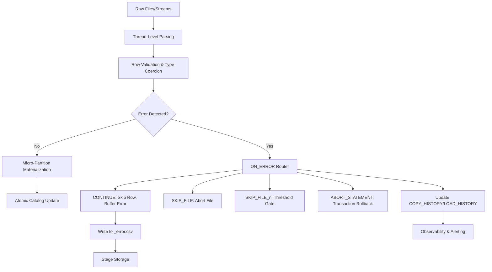

# Domain 3.1: Error Handling Options in Snowflake Data Loading
**Technical Architecture, Execution Semantics, Operational Tuning, and Production Triage**



---

## 3.1.1 Execution Semantics & Transactional Boundaries

Snowflake's error handling operates at **two distinct granularities**: row-level (`CONTINUE`) and file-level (`SKIP_FILE`, `SKIP_FILE_n`, `ABORT_STATEMENT`). Understanding the transactional boundary is critical for pipeline design.

| Mode | Granularity | Transactional Scope | Commit Behavior | Rollback Behavior |
|------|-------------|-------------------|-----------------|-------------------|
| `CONTINUE` | Row | Per file | Commits valid rows per file. Invalid rows buffered → error file. | No rollback. Already-committed files remain. |
| `SKIP_FILE` | File | Per file | Aborts current file on first error. Continues with remaining files. | Commits previously successful files. |
| `SKIP_FILE_n` | File (threshold) | Per file | Aborts file when error count > n. Continues with remaining files. | Commits previously successful files. |
| `ABORT_STATEMENT` | Statement | Entire `COPY INTO` | Zero-commit. Fails atomically. | Rolls back all files in the statement, including partially processed ones. |

**Critical Execution Internals:**
- Error evaluation occurs **in-memory per thread** before micro-partition flush.
- `ABORT_STATEMENT` uses Snowflake's **two-phase commit**. If any thread reports a fatal error, the coordinator triggers rollback across all participating threads.
- Error file generation is **asynchronous**. Threads write to temporary buffers, flush to stage after commit, and update `COPY_HISTORY`.
- `ON_ERROR` does **not** affect `PURGE`. Only successfully loaded files are purged. Failed files remain in stage for manual triage.

---

## 3.1.2 Core `ON_ERROR` Options: Technical Deep Dive

### `CONTINUE`
- **Behavior:** Skips invalid rows, logs structured error metadata, continues loading valid rows.
- **Error Threshold:** Unlimited. Can process millions of rows with high error rates.
- **Performance Impact:** 
  - CPU: ~5–15% overhead for error buffering & CSV serialization.
  - I/O: Error files consume stage storage. High error rates (>5%) can become I/O bound.
- **Use Case:** Tolerant ingestion pipelines, raw zone landing, post-load data quality testing.
- **Compliance Risk:** Silent data loss. Requires explicit audit logging and downstream reconciliation.

### `SKIP_FILE`
- **Behavior:** Aborts entire file on first validation failure. Continues with next file.
- **Error Threshold:** 1 error = file rejection.
- **Performance Impact:** Fastest failure path. Zero error file I/O. Minimal CPU overhead.
- **Use Case:** Strict schema validation, compliance-critical tables, file-level atomicity requirements.
- **Operational Note:** High rejection rates indicate upstream data quality issues. Monitor `SKIP_FILE` count as a leading indicator.

### `SKIP_FILE_n`
- **Behavior:** Aborts file when error count exceeds `n` (1 ≤ n ≤ 1,000,000).
- **Error Threshold:** Configurable. Example: `SKIP_FILE_3` allows ≤3 bad rows per file.
- **Performance Impact:** Similar to `SKIP_FILE` until threshold breached. Error buffer memory scales with `n`.
- **Use Case:** Pragmatic quality gates, allows minor formatting drift without rejecting entire payloads.
- **Memory Implication:** Each thread buffers up to `n` error records before flush. Large `n` values increase node memory pressure.

### `ABORT_STATEMENT`
- **Behavior:** Fails entire `COPY INTO` statement. Rolls back all files, including successfully processed ones.
- **Error Threshold:** 1 error = full rollback.
- **Performance Impact:** Highest overhead for large loads due to rollback coordination. Zero error files generated.
- **Use Case:** Financial ledgers, regulatory reporting, zero-tolerance data pipelines, idempotent retry workflows.
- **Idempotency Requirement:** Must be paired with `FORCE=TRUE` and explicit retry logic to avoid duplicate processing.


## 3.1.3 Pre-Flight Validation: `VALIDATION_MODE`

`VALIDATION_MODE` executes the **parse + validate** phase without micro-partition materialization. Zero storage writes. Zero `COPY_HISTORY` updates.

| Mode | Behavior | Output | Use Case |
|------|----------|--------|----------|
| `RETURN_n_ROWS` | Validates first N rows. Returns valid rows. | Result set of valid rows. | Dry-run format testing, schema alignment checks. |
| `RETURN_ALL_ERRORS` | Validates entire file set. Returns only invalid rows. | Structured error table: `FILE_NAME`, `ROW_NUMBER`, `ERROR_CODE`, `ERROR_MESSAGE`, `REJECTED_VALUE`. | CI/CD pipeline validation, upstream data quality enforcement. |
| `RETURN_n_ERRORS` | Validates until N errors found. Returns those errors. | Same error structure, capped at N rows. | Quick triage, format debugging. |

**Execution Internals:**
- Reuses the same parsing engine as `COPY INTO`. Identical type coercion, delimiter handling, and encoding resolution.
- **No warehouse spill-to-disk.** Runs entirely in memory. Fails fast if memory exceeds node limits.
- **Does not consume credits for storage writes.** Only compute credits for parsing/validation.
- **Deterministic:** Same input → same output. Safe for automated testing.

```sql
-- Pre-flight validation: Catch schema drift before production deploy
COPY INTO analytics.events_raw
FROM @s3_raw_stage/events/test/
FILE_FORMAT = (FORMAT_NAME = parquet_load_fmt_v2)
VALIDATION_MODE = 'RETURN_ALL_ERRORS';

-- Result structure:
-- FILE_NAME | ROW_NUMBER | START_POSITION | ERROR_CODE | ERROR_MESSAGE | REJECTED_VALUE
```


## 3.1.4 Error File Generation & Stage I/O Mechanics

When `ON_ERROR = 'CONTINUE'` or validation errors occur, Snowflake generates CSV error files in the source stage.

### Error File Naming & Location
```
<s3_path>/events/
├── payload_001.parquet          ← Source file
├── payload_001_error.csv        ← Error metadata
└── payload_002.parquet
```
- Suffix: `_error.csv` (immutable, appended per file)
- Location: Same stage directory as source file. Cannot be redirected natively.
- Lifecycle: Persists until manually purged via `REMOVE`. Not governed by stage retention policies.

### Error File Schema (Strict CSV)
| Column | Data Type | Description |
|--------|-----------|-------------|
| `FILE_NAME` | STRING | Source file path |
| `ROW_NUMBER` | NUMBER | 1-based row index in source file |
| `START_POSITION` | NUMBER | Byte offset of rejected row |
| `ERROR_CODE` | STRING | Snowflake error code (e.g., `100035`, `100076`) |
| `ERROR_MESSAGE` | STRING | Human-readable validation failure |
| `COLUMN_NAME` | STRING | Target column that failed validation |
| `REJECTED_VALUE` | STRING | Raw value that caused failure |

**I/O & Storage Implications:**
- Error files are **compressed** (GZIP) if stage `COMPRESSION` is enabled.
- High error rates (>10%) generate massive error files. Can exceed stage storage quotas.
- Error file parsing is **sequential**. Loading error tables back into Snowflake requires single-threaded `COPY INTO` or external processing.
- **Compliance Note:** Error files contain raw PII. Must be secured with stage-level encryption, RBAC, and audit logging.


## 3.1.5 Historical Tracking & Observability

Snowflake provides two retention-bound views for load error auditing:

### `INFORMATION_SCHEMA.COPY_HISTORY` (14 days)
```sql
SELECT 
  file_name,
  status,
  row_count,
  error_count,
  first_error_code,
  first_error_message,
  rejected_record_count,
  loading_history_id
FROM TABLE(INFORMATION_SCHEMA.COPY_HISTORY(
  TABLE_NAME => 'analytics.events_raw',
  START_TIME => DATEADD(hour, -24, CURRENT_TIMESTAMP())
));
```
- **Transactional granularity:** One row per file.
- `status`: `'LOADED'`, `'LOAD_FAILED'`, `'PARTIALLY_LOADED'` (only with `CONTINUE`)
- `error_count`: Total row-level errors in file.
- `first_error_code/message`: First failure encountered (not aggregate).

### `SNOWFLAKE.ACCOUNT_USAGE.LOAD_HISTORY` (365 days)
```sql
SELECT 
  file_name,
  table_schema,
  table_name,
  stage_name,
  file_size,
  file_format,
  copy_history_view_name
FROM SNOWFLAKE.ACCOUNT_USAGE.LOAD_HISTORY
WHERE file_name LIKE '%2024-01%'
  AND last_updated > DATEADD(day, -30, CURRENT_TIMESTAMP());
```
- **Lineage scope:** Maps file → table → stage → format.
- Does not contain error counts. Joins with `COPY_HISTORY` for full audit trail.

### Error Trend Monitoring
```sql
-- Daily error rate by pipeline
SELECT 
  DATE_TRUNC('day', start_time) as load_date,
  table_schema || '.' || table_name as target_table,
  SUM(row_count) as total_rows,
  SUM(error_count) as total_errors,
  ROUND(100.0 * SUM(error_count) / NULLIF(SUM(row_count), 0), 2) as error_rate_pct,
  COUNT_IF(status = 'LOAD_FAILED') as rejected_files
FROM TABLE(INFORMATION_SCHEMA.COPY_HISTORY(
  START_TIME => DATEADD(day, -7, CURRENT_TIMESTAMP())
))
GROUP BY DATE_TRUNC('day', start_time), table_schema, table_name
HAVING SUM(error_count) > 0
ORDER BY error_rate_pct DESC;
```


## 3.1.6 Performance & Resource Implications

| Parameter | CPU Impact | Memory Impact | I/O Impact | Throughput Impact |
|-----------|------------|---------------|------------|-------------------|
| `CONTINUE` | +5–15% (error parsing) | +10–30% (error buffer) | High (error file writes) | -10–40% at >5% error rate |
| `SKIP_FILE` | Minimal | Minimal | None | Fast fail; optimal for strict validation |
| `SKIP_FILE_n` | Scales with `n` | Scales with `n` | Moderate (buffered error flush) | Degrades when threshold breached |
| `ABORT_STATEMENT` | High (rollback coordination) | Low | None | Zero throughput on failure; safe for compliance |
| `VALIDATION_MODE` | Moderate (parse only) | High (in-memory validation) | None | No storage writes; ideal for CI/CD |

**Spill & Memory Warnings:**
- Error buffers reside in warehouse node memory. If `error_count × avg_error_size > node_memory × 0.2`, Snowflake spills to local disk.
- Spill triggers I/O wait, 3–10x latency increase, potential OOM if disk fills.
- **Mitigation:** Reduce `MAX_CONCURRENCY`, increase warehouse size, or switch to `SKIP_FILE` for high-error datasets.


## 3.1.7 Advanced Error Handling Patterns

### Custom Dead-Letter Queue (DLQ) via `RETURN_FAILED_ONLY`
```sql
-- Step 1: Run load with RETURN_FAILED_ONLY
COPY INTO analytics.events_raw
FROM @s3_raw_stage/events/
FILE_FORMAT = (FORMAT_NAME = parquet_load_fmt)
ON_ERROR = 'CONTINUE'
RETURN_FAILED_ONLY = TRUE;

-- Step 2: Route failed rows to error table
COPY INTO governance.load_error_dlq
FROM @s3_raw_stage/events/
PATTERN = '.*_error\.csv$'
FILE_FORMAT = (TYPE = CSV FIELD_DELIMITER = ',' SKIP_HEADER = 1);

-- Step 3: Automated reconciliation task
CREATE OR REPLACE TASK ops.reconcile_dlq
  WAREHOUSE = admin_wh
  SCHEDULE = 'USING CRON 0 */6 * * *'
AS
  -- Apply corrective transforms, retry via Snowpipe Streaming API
  CALL ops.retry_failed_records('governance.load_error_dlq');
```

### Snowpipe Streaming API Error Semantics
- **Offset Tokens:** Idempotent keys. Re-sending same token → no-op. Missing token → duplicate risk.
- **Validation Errors:** Returned synchronously in `InsertValidationResponse`. Rows rejected at channel level, not written to storage.
- **Retry Policy:** Exponential backoff with jitter. Max retries configurable. Failed rows routed to application DLQ.
- **Memory Bound:** JVM heap limits apply. High error rates cause channel throttling. Implement backpressure via `BufferedChannelBuilder`.

### Kafka Connector Error Handling
- **Exactly-Once:** Relies on Snowflake transactional commits + Kafka offset tracking. Network failures trigger retry; offsets not advanced until commit succeeds.
- **DLQ Configuration:** `snowflake.topic2table.map` + `buffer.count.errors`. Exceeds threshold → connector pauses, publishes to Kafka DLQ topic.
- **Schema Evolution Errors:** Avro schema mismatch → connector fails fast. Requires schema registry compatibility mode (`BACKWARD`/`FORWARD`).


## 3.1.8 Operational Triage & Runbooks

### Error Pattern Classification
| Pattern | Root Cause | Operational Fix |
|---------|------------|----------------|
| `100035` Numeric Overflow | Source exceeds `NUMBER(p,s)` | Increase precision, enable `TRUNCATECOLUMNS`, or pre-filter upstream |
| `100076` Field Not Found | Delimiter mismatch, encoding drift | Verify `FIELD_DELIMITER`, enable `TRIM_SPACE`, check UTF-8 vs Latin1 |
| `PARSE_ERROR` Timestamp/Date | Format mismatch, invalid TZ | Align `DATE_FORMAT`/`TIMESTAMP_FORMAT` with source, handle `NULL` gracefully |
| `PERMISSION_DENIED` Stage/Integration | Missing `USAGE`, expired IAM token | Re-grant privileges, refresh cloud credentials, verify `STORAGE_INTEGRATION` |
| `SCHEMA_MISMATCH` Column Count | Source drift, missing/extra fields | Use `MATCH_BY_COLUMN_NAME`, add flexible `VARIANT` catch-all column |

### Automated Alerting Thresholds
```sql
-- Task: Alert on error rate spike
CREATE OR REPLACE TASK ops.load_error_spike_alert
  WAREHOUSE = admin_wh
  SCHEDULE = 'USING CRON */30 * * * *'
WHEN (
  SELECT SUM(error_count)
  FROM TABLE(INFORMATION_SCHEMA.COPY_HISTORY(START_TIME => DATEADD(hour, -1, CURRENT_TIMESTAMP())))
) > (
  SELECT AVG(error_count) * 3
  FROM TABLE(INFORMATION_SCHEMA.COPY_HISTORY(START_TIME => DATEADD(day, -7, CURRENT_TIMESTAMP())))
)
AS
  SYSTEM$SEND_SLACK_MESSAGE('https://hooks.slack.com/services/XXX', 
    '🚨 Load error rate spike detected. Investigate COPY_HISTORY for error patterns.');
```

### Recovery Procedure
1. **Isolate:** Query `COPY_HISTORY` for failed files. Export `first_error_message`.
2. **Diagnose:** Categorize errors. Check upstream source system logs.
3. **Fix:** Update `FILE_FORMAT`, adjust target DDL, or apply upstream transformation.
4. **Reprocess:** Run `COPY INTO ... FORCE = TRUE ON_ERROR = 'SKIP_FILE_3'`.
5. **Verify:** Monitor `error_rate_pct` for 1 hour. Clear alert if <0.1%.


## 3.1.9 Decision Matrix: Selecting Error Handling Strategy

| Business Requirement | Recommended `ON_ERROR` | Validation Mode | DLQ Strategy | Monitoring Focus |
|---------------------|----------------------|----------------|-------------|-----------------|
| Zero-tolerance compliance | `ABORT_STATEMENT` | `RETURN_ALL_ERRORS` | Application-level retry | Transaction success rate |
| High-volume tolerant ingestion | `CONTINUE` | `RETURN_n_ROWS` (test) | Stage error table + reconciliation task | `error_rate_pct`, error file growth |
| File-level atomicity | `SKIP_FILE` | `RETURN_ALL_ERRORS` | Retry entire file via `FORCE` | Rejected file count, root cause |
| Pragmatic quality gate | `SKIP_FILE_3` | `RETURN_n_ERRORS` | Threshold-based alerting | Error count per file, trend |
| CI/CD pipeline validation | N/A (no load) | `RETURN_ALL_ERRORS` | Fail build on error count > 0 | Validation time, error categories |


## Key Engineering Principles

1. **Error handling is business logic, not a technical default.** `ON_ERROR` modes define data quality boundaries. Document and test each mode against compliance requirements.
2. `ABORT_STATEMENT` provides transactional safety but kills throughput. Use for critical paths only.
3. `CONTINUE` maximizes ingestion velocity but shifts data quality downstream. Always pair with reconciliation DLQs.
4. Error files are I/O-bound. High error rates (>5%) degrade performance. Switch to `SKIP_FILE` or fix upstream.
5. `VALIDATION_MODE` is mandatory for CI/CD. Zero storage writes, deterministic output, identical parsing engine.
6. `COPY_HISTORY` retention is 14 days. Export to external storage or `LOAD_HISTORY` for long-term audit.
7. Idempotency requires `FORCE=TRUE` + explicit retry logic. Never assume partial loads are safe to resume.

## Bottom Line
- Snowflake's error handling options (`CONTINUE`, `SKIP_FILE`, `SKIP_FILE_n`, `ABORT_STATEMENT`) operate at different granularities with distinct transactional, performance, and compliance implications.
- `VALIDATION_MODE` enables zero-storage pre-flight checks critical for pipeline safety.
- Error files are structured CSV artifacts with strict schemas; they consume stage storage and require I/O optimization.
- Historical tracking via `COPY_HISTORY` (14d) and `LOAD_HISTORY` (365d) enables deterministic triage and compliance auditing.
- Performance degrades linearly with error rate; monitor memory spill, switch modes when thresholds breach.
- Advanced patterns (DLQs, Streaming API offsets, Kafka retry policies) extend error handling beyond batch loads.
- Operational excellence requires automated alerting, categorized error runbooks, and idempotent recovery procedures.

Engineer error handling as a first-class control plane. Validate before load. Route failures deterministically. Monitor error rates continuously. Recover idempotently. That is how production-grade data loading maintains integrity, performance, and compliance at scale.
