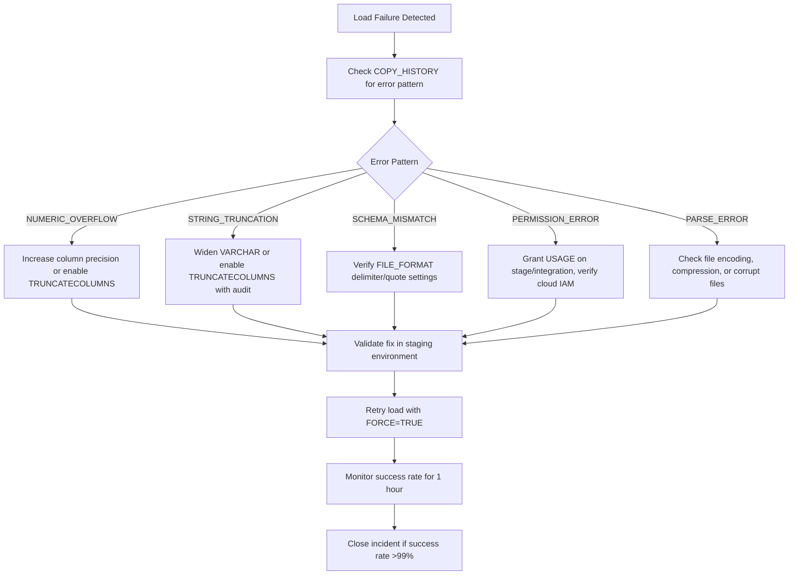

# Domain 3.1: Data Loading and Unloading Operations
**Production Engineering, Observability, and Operational Runbooks**

```mermaid
graph TD
  Ops[Operational Framework] --> Monitor[Observability & Telemetry]
  Ops --> Incident[Incident Response]
  Ops --> Automate[Operational Automation]
  Ops --> Capacity[Capacity & Resource Management]
  Ops --> Change[Change Management]
  Ops --> Cost[Operational Cost Control]
  Ops --> Security[Operational Security]
  Ops --> SLA[SLA/SLO Management]
  
  Monitor --> Views[ACCOUNT_USAGE Views]
  Monitor --> Profiling[Query Profiling]
  Monitor --> Metrics[Custom Metrics Export]
  
  Incident --> Triage[Error Pattern Analysis]
  Incident --> Recovery[Recovery Procedures]
  Incident --> PostMortem[Root Cause Analysis]
  
  Automate --> Tasks[Scheduled Tasks]
  Automate --> Alerts[ALERT Objects]
  Automate --> Procedures[Stored Procedures]
  
  Capacity --> Scaling[Warehouse Auto-Scaling]
  Capacity --> Concurrency[Concurrency Tuning]
  Capacity --> Queue[Queue Management]
  
  Change --> Versioning[Pipeline Version Control]
  Change --> Testing[Staging Validation]
  Change --> Rollback[Rollback Procedures]
  
  Cost --> Monitors[Resource Monitors]
  Cost --> Attribution[Cost Attribution]
  Cost --> Optimization[Credit Optimization]
  
  Security --> Rotation[Credential Rotation]
  Security --> Network[Network Policy Updates]
  Security --> Audit[Audit Trail Maintenance]
  
  SLA --> Targets[Latency/Throughput Targets]
  SLA --> Budgets[Error Budgets]
  SLA --> Reporting[Operational Reporting]
```



---

## 3.1.1 Operational Observability & Telemetry

### Core Monitoring Views & Retention
| View | Retention | Key Operational Columns | Primary Use Case |
|------|-----------|------------------------|------------------|
| `COPY_HISTORY` | 14 days | `FILE_NAME`, `STATUS`, `ROW_COUNT`, `ERROR_COUNT`, `FIRST_ERROR_MESSAGE`, `LOADING_HISTORY_ID` | Real-time load success/failure tracking, error pattern analysis |
| `PIPE_HISTORY` | 365 days | `PIPE_NAME`, `CREDITS_USED`, `NUM_FILES_PROCESSED`, `NUM_BYTES_INSERTED`, `EXECUTION_STATUS` | Snowpipe performance, cost attribution, throughput trending |
| `LOAD_HISTORY` | 1 year | `FILE_NAME`, `TABLE_SCHEMA`, `TABLE_NAME`, `STAGE_NAME`, `COPY_HISTORY_VIEW_NAME` | End-to-end load lineage, audit compliance, cross-pipeline correlation |
| `WAREHOUSE_METERING_HISTORY` | 365 days | `WAREHOUSE_NAME`, `CREDITS_USED`, `CREDITS_USED_CLOUD_SERVICES`, `START_TIME` | Compute cost attribution, capacity planning, right-sizing analysis |
| `QUERY_HISTORY` | 365 days | `QUERY_ID`, `EXECUTION_TIME`, `BYTES_SCANNED`, `CREDITS_USED`, `QUERY_TEXT` | Query-level performance debugging, optimization targeting |
| `RESOURCE_MONITOR_EVENTS` | 365 days | `EVENT_TIMESTAMP`, `RESOURCE_MONITOR_NAME`, `EVENT_TYPE`, `THRESHOLD_PERCENT` | Budget guardrail auditing, incident investigation |

### Operational Query Patterns

#### Real-Time Load Health Dashboard
```sql
-- Load success rate by table (last 1 hour)
SELECT 
  table_schema || '.' || table_name as target_table,
  COUNT(*) as total_files,
  COUNT_IF(status = 'LOADED') as successful_files,
  COUNT_IF(status = 'LOAD_FAILED') as failed_files,
  ROUND(100.0 * COUNT_IF(status = 'LOADED') / NULLIF(COUNT(*), 0), 2) as success_rate_pct,
  SUM(row_count) as total_rows_loaded,
  SUM(error_count) as total_errors,
  MAX(first_error_message) as latest_error
FROM TABLE(INFORMATION_SCHEMA.COPY_HISTORY(
  START_TIME => DATEADD(hour, -1, CURRENT_TIMESTAMP())
))
GROUP BY table_schema, table_name
HAVING COUNT(*) > 0
ORDER BY success_rate_pct ASC, total_files DESC;
```

#### Snowpipe Throughput & Cost Analysis
```sql
-- Hourly pipe performance with cost efficiency
SELECT 
  pipe_name,
  DATE_TRUNC('hour', start_time) as hour_bucket,
  SUM(num_files_processed) as files_loaded,
  SUM(num_bytes_inserted) / POWER(1024, 3) as gb_loaded,
  SUM(credits_used) as credits_consumed,
  ROUND(SUM(num_bytes_inserted) / NULLIF(SUM(credits_used), 0) / POWER(1024, 3), 2) as gb_per_credit,
  AVG(execution_time) as avg_execution_seconds,
  MAX(execution_time) as p99_execution_seconds
FROM SNOWFLAKE.ACCOUNT_USAGE.PIPE_HISTORY
WHERE start_time > DATEADD(day, -7, CURRENT_TIMESTAMP())
  AND execution_status = 'SUCCEEDED'
GROUP BY pipe_name, DATE_TRUNC('hour', start_time)
ORDER BY hour_bucket DESC, credits_consumed DESC;
```

#### Error Pattern Analysis for Triage
```sql
-- Categorize load errors by type and frequency
SELECT 
  CASE 
    WHEN first_error_message ILIKE '%numeric value out of bounds%' THEN 'NUMERIC_OVERFLOW'
    WHEN first_error_message ILIKE '%string too long%' THEN 'STRING_TRUNCATION'
    WHEN first_error_message ILIKE '%field not found%' THEN 'SCHEMA_MISMATCH'
    WHEN first_error_message ILIKE '%permission denied%' THEN 'PERMISSION_ERROR'
    WHEN first_error_message ILIKE '%parsing error%' THEN 'PARSE_ERROR'
    ELSE 'OTHER'
  END as error_category,
  COUNT(*) as error_count,
  COUNT(DISTINCT file_name) as affected_files,
  COUNT(DISTINCT table_schema || '.' || table_name) as affected_tables,
  LISTAGG(DISTINCT first_error_message, '; ') within group (order by first_error_message) as sample_errors
FROM TABLE(INFORMATION_SCHEMA.COPY_HISTORY(
  START_TIME => DATEADD(hour, -6, CURRENT_TIMESTAMP())
))
WHERE status = 'LOAD_FAILED'
GROUP BY error_category
ORDER BY error_count DESC;
```

### Query Profiling for Load Optimization
```sql
-- Analyze COPY INTO execution profile
SELECT 
  query_id,
  execution_time,
  compilation_time,
  bytes_scanned,
  bytes_written,
  credits_used,
  warehouse_size,
  query_text,
  -- Extract file format and stage info
  REGEXP_SUBSTR(query_text, 'FROM\\s+(@[^\\s]+)', 1, 1, 'i') as source_stage,
  REGEXP_SUBSTR(query_text, 'FILE_FORMAT\\s*=\\s*\\([^)]+\\)', 1, 1, 'i') as file_format_clause
FROM SNOWFLAKE.ACCOUNT_USAGE.QUERY_HISTORY
WHERE query_text ILIKE 'COPY INTO%'
  AND start_time > DATEADD(hour, -24, CURRENT_TIMESTAMP())
  AND execution_time > 300  -- Focus on slow loads >5min
ORDER BY execution_time DESC
LIMIT 50;
```

**Key Profile Metrics:**
- `compilation_time`: High values indicate complex file format parsing or large file lists
- `bytes_scanned`: Should match source file size; significant deviation indicates compression ratio issues
- `bytes_written`: Should be 3–10x smaller than `bytes_scanned` due to columnar compression
- `credits_used`: Compare to warehouse size × execution time to identify inefficiencies

---

## 3.1.2 Incident Response & Troubleshooting Runbooks

### Load Failure Triage Decision Tree


### Common Error Codes & Operational Resolutions
| Error Code | Message Pattern | Root Cause | Operational Resolution |
|------------|----------------|------------|----------------------|
| `100035` | `Numeric value out of bounds` | Source exceeds target `NUMBER(p,s)` precision | 1. Increase precision: `ALTER TABLE ... MODIFY COLUMN ... NUMBER(38,10)`<br>2. Enable `TRUNCATECOLUMNS=TRUE` with audit logging<br>3. Pre-filter source data upstream |
| `100076` | `Field not found` | Column count mismatch, delimiter misconfiguration | 1. Verify `FIELD_DELIMITER`, `RECORD_DELIMITER`<br>2. Enable `SKIP_BLANK_LINES=TRUE`, `TRIM_SPACE=TRUE`<br>3. Check file encoding (UTF-8 vs Latin1) |
| `200003` | `Invalid OAuth token` | Token expiry, client credential rotation | 1. Refresh OAuth token via IdP<br>2. Rotate client secrets in integration config<br>3. Verify token scope includes `warehouse:usage` |
| `300001` | `Network policy blocked IP` | Connection from unauthorized IP/subnet | 1. Update `ALLOWED_IP_LIST` in `NETWORK_POLICY`<br>2. Verify client egress IP matches policy<br>3. Use PrivateLink to bypass public IP restrictions |
| `300004` | `Warehouse suspended` | Auto-suspend triggered during load | 1. Enable `AUTO_RESUME=TRUE` on warehouse<br>2. Increase `AUTO_SUSPEND` timeout for long loads<br>3. Attach dedicated warehouse to Snowpipe |
| `400001` | `Insufficient privileges` | Missing `USAGE` on stage/integration | 1. `GRANT USAGE ON STAGE <name> TO ROLE <role>`<br>2. Verify cloud IAM role trust policy includes Snowflake external ID<br>3. Revoke and re-grant integration privileges |

### Recovery Procedures

#### Failed File Reprocessing
```sql
-- Step 1: Identify failed files from last 24 hours
CREATE OR REPLACE TEMP TABLE failed_files AS
SELECT 
  file_name,
  table_schema,
  table_name,
  stage_name,
  first_error_message,
  loading_history_id
FROM TABLE(INFORMATION_SCHEMA.COPY_HISTORY(
  START_TIME => DATEADD(hour, -24, CURRENT_TIMESTAMP())
))
WHERE status = 'LOAD_FAILED';

-- Step 2: Generate retry script with FORCE=TRUE
SELECT 
  'COPY INTO ' || table_schema || '.' || table_name || 
  ' FROM @' || stage_name || '/' || file_name ||
  ' FILE_FORMAT = (FORMAT_NAME = parquet_load_fmt)' ||
  ' FORCE = TRUE' ||
  ' ON_ERROR = ''SKIP_FILE_3'';' as retry_statement
FROM failed_files;

-- Step 3: Execute retry (manual or via Task)
-- Step 4: Verify success in COPY_HISTORY
SELECT 
  file_name,
  status,
  row_count,
  error_count
FROM TABLE(INFORMATION_SCHEMA.COPY_HISTORY(
  START_TIME => DATEADD(hour, -1, CURRENT_TIMESTAMP())
))
WHERE loading_history_id IN (SELECT loading_history_id FROM failed_files);
```

#### Snowpipe Backfill & Reprocessing
```sql
-- Step 1: Pause pipe to prevent new events during backfill
ALTER PIPE raw_events_pipe SET PIPE_EXECUTION_PAUSED = TRUE;

-- Step 2: Refresh pipe to reprocess unacknowledged events
ALTER PIPE raw_events_pipe REFRESH;

-- Step 3: Monitor refresh progress
SELECT 
  pipe_name,
  pending_file_count,
  num_outstanding_messages_on_pipe,
  last_received_message_timestamp
FROM TABLE(INFORMATION_SCHEMA.PIPE_STATUS('raw_events_pipe'));

-- Step 4: Resume pipe after backfill completes
ALTER PIPE raw_events_pipe SET PIPE_EXECUTION_PAUSED = FALSE;

-- Step 5: Verify no duplicate rows (if using offset tokens)
SELECT 
  event_id,
  COUNT(*) as occurrence_count
FROM analytics.events_raw
WHERE loaded_timestamp > DATEADD(hour, -2, CURRENT_TIMESTAMP())
GROUP BY event_id
HAVING COUNT(*) > 1;
```

#### Stage Cleanup & Storage Management
```sql
-- Step 1: Identify loaded files eligible for purge
SELECT 
  file_name,
  file_size,
  last_modified
FROM DIRECTORY(@s3_raw_stage)
WHERE relative_path LIKE 'events/%'
  AND last_modified < DATEADD(day, -7, CURRENT_TIMESTAMP())
  AND file_name IN (
    SELECT file_name 
    FROM TABLE(INFORMATION_SCHEMA.COPY_HISTORY(
      START_TIME => DATEADD(day, -30, CURRENT_TIMESTAMP())
    ))
    WHERE status = 'LOADED'
  );

-- Step 2: Purge files (requires OWNERSHIP on stage)
REMOVE @s3_raw_stage/events/ PATTERN = '.*2024-01-.*\.parquet$';

-- Step 3: Verify purge success
SELECT COUNT(*) as remaining_files
FROM DIRECTORY(@s3_raw_stage)
WHERE relative_path LIKE 'events/2024-01/%';
```


## 3.1.3 Operational Automation Framework

### Task-Based Operational Workflows

#### Automated Load Health Monitoring
```sql
-- Task: Hourly load health check with alerting
CREATE OR REPLACE TASK ops.load_health_monitor
  WAREHOUSE = admin_wh
  SCHEDULE = 'USING CRON 0 * * * *'  -- Every hour
WHEN (
  SELECT COUNT(*)
  FROM TABLE(INFORMATION_SCHEMA.COPY_HISTORY(
    START_TIME => DATEADD(hour, -1, CURRENT_TIMESTAMP())
  ))
  WHERE status = 'LOAD_FAILED'
) > 0
AS
  -- Log to operational audit table
  INSERT INTO governance.operational_incidents
    (incident_type, severity, description, detected_at, affected_objects)
  SELECT
    'LOAD_FAILURE',
    CASE 
      WHEN COUNT(*) > 10 THEN 'CRITICAL'
      WHEN COUNT(*) > 5 THEN 'HIGH'
      ELSE 'MEDIUM'
    END,
    'Load failures detected: ' || COUNT(*) || ' files',
    CURRENT_TIMESTAMP(),
    LISTAGG(DISTINCT table_schema || '.' || table_name, ', ')
  FROM TABLE(INFORMATION_SCHEMA.COPY_HISTORY(
    START_TIME => DATEADD(hour, -1, CURRENT_TIMESTAMP())
  ))
  WHERE status = 'LOAD_FAILED'
  
  -- Send alert to on-call channel
  SYSTEM$SEND_SLACK_MESSAGE(
    'https://hooks.slack.com/services/XXX',
    '🚨 *Snowflake Load Failure Alert*\n' ||
    '• Time: ' || TO_VARCHAR(CURRENT_TIMESTAMP(), 'YYYY-MM-DD HH24:MI') || '\n' ||
    '• Failed Files: ' || (SELECT COUNT(*) FROM TABLE(INFORMATION_SCHEMA.COPY_HISTORY(START_TIME => DATEADD(hour, -1, CURRENT_TIMESTAMP()))) WHERE status = 'LOAD_FAILED') || '\n' ||
    '• Affected Tables: ' || (SELECT LISTAGG(DISTINCT table_schema || '.' || table_name, ', ') FROM TABLE(INFORMATION_SCHEMA.COPY_HISTORY(START_TIME => DATEADD(hour, -1, CURRENT_TIMESTAMP()))) WHERE status = 'LOAD_FAILED') || '\n' ||
    '• Runbook: https://wiki.company.com/snowflake-load-failure'
  );
```

#### Automated Pipe Status Monitoring
```sql
-- Task: Monitor Snowpipe backlog and alert on delays
CREATE OR REPLACE TASK ops.pipe_backlog_monitor
  WAREHOUSE = admin_wh
  SCHEDULE = 'USING CRON */15 * * * *'  -- Every 15 minutes
WHEN (
  SELECT SUM(pending_file_count)
  FROM TABLE(INFORMATION_SCHEMA.PIPE_STATUS('raw_events_pipe'))
) > 1000
AS
  SYSTEM$SEND_EMAIL(
    'data-eng-oncall@company.com',
    'Alert: Snowpipe backlog exceeding threshold',
    'Pipe: raw_events_pipe\n' ||
    'Pending Files: ' || (SELECT pending_file_count FROM TABLE(INFORMATION_SCHEMA.PIPE_STATUS('raw_events_pipe'))) || '\n' ||
    'Last Message: ' || (SELECT last_received_message_timestamp FROM TABLE(INFORMATION_SCHEMA.PIPE_STATUS('raw_events_pipe'))) || '\n\n' ||
    'Actions:\n' ||
    '1. Check cloud event notification configuration\n' ||
    '2. Verify Snowpipe serverless compute availability\n' ||
    '3. Review COPY_HISTORY for error patterns'
  );
```

### Stored Procedures for Operational Tasks

#### Dynamic File Consolidation for Small Files
```sql
CREATE OR REPLACE PROCEDURE ops.consolidate_small_files(
  stage_name STRING,
  source_prefix STRING,
  target_prefix STRING,
  min_file_size_mb NUMBER DEFAULT 10,
  max_consolidated_size_mb NUMBER DEFAULT 100
)
RETURNS STRING
LANGUAGE SQL
AS
$$
DECLARE
  small_files ARRAY;
  consolidated_count NUMBER := 0;
BEGIN
  -- Identify files smaller than threshold
  small_files := (
    SELECT ARRAY_AGG(relative_path)
    FROM DIRECTORY(IDENTIFIER('@' || stage_name))
    WHERE relative_path LIKE source_prefix || '%'
      AND file_size < min_file_size_mb * POWER(1024, 2)
      AND last_modified < DATEADD(hour, -1, CURRENT_TIMESTAMP())
  );
  
  IF ARRAY_SIZE(small_files) < 10 THEN
    RETURN 'No consolidation needed: ' || ARRAY_SIZE(small_files) || ' small files';
  END IF;
  
  -- Consolidate files in batches (simplified example)
  FOR i IN 0 TO FLOOR(ARRAY_SIZE(small_files) / 10) - 1 DO
    LET batch := ARRAY_SLICE(small_files, i * 10, (i + 1) * 10);
    
    -- Create consolidated file via external transformation (e.g., Glue, Airflow)
    -- This is a placeholder; actual implementation would trigger external job
    INSERT INTO ops.consolidation_jobs
      (job_id, source_files, target_path, status, created_at)
    VALUES
      (UUID_STRING(), batch, target_prefix || '/consolidated_' || i || '.parquet', 'PENDING', CURRENT_TIMESTAMP());
    
    consolidated_count := consolidated_count + 1;
  END FOR;
  
  RETURN 'Consolidation jobs created: ' || consolidated_count || ' batches from ' || ARRAY_SIZE(small_files) || ' files';
END;
$$;

-- Schedule consolidation task
CREATE OR REPLACE TASK ops.daily_consolidation
  WAREHOUSE = etl_wh
  SCHEDULE = 'USING CRON 0 3 * * *'  -- Daily at 3 AM
AS
  CALL ops.consolidate_small_files('s3_raw_stage', 'events/raw/', 'events/consolidated/');
```

#### Automated Error File Reconciliation
```sql
CREATE OR REPLACE PROCEDURE ops.reconcile_load_errors(
  error_stage STRING,
  error_table STRING,
  max_retries NUMBER DEFAULT 3
)
RETURNS STRING
LANGUAGE SQL
AS
$$
DECLARE
  error_records RECORD;
  error_cursor CURSOR FOR
    SELECT file_name, line_number, error_code, error_message
    FROM IDENTIFIER(error_table)
    WHERE retry_count < max_retries
      AND last_retry_at < DATEADD(hour, -1, CURRENT_TIMESTAMP());
BEGIN
  FOR error_records IN error_cursor DO
    -- Attempt to re-parse and load individual error row
    -- This is a simplified example; actual implementation would:
    -- 1. Extract the specific row from source file
    -- 2. Apply corrective transformation
    -- 3. Retry load via Snowpipe Streaming API or temporary table
    
    UPDATE IDENTIFIER(error_table)
    SET 
      retry_count = retry_count + 1,
      last_retry_at = CURRENT_TIMESTAMP(),
      status = CASE WHEN retry_count + 1 >= max_retries THEN 'EXHAUSTED' ELSE 'RETRYING' END
    WHERE file_name = error_records.file_name
      AND line_number = error_records.line_number;
  END FOR;
  
  RETURN 'Error reconciliation completed';
END;
$$;
```


## 3.1.4 Capacity Planning & Resource Management

### Warehouse Scaling Strategies for Loading Workloads

| Workload Pattern | Scaling Strategy | Configuration | Monitoring Metric |
|-----------------|-----------------|---------------|------------------|
| **Predictable batch** (daily ETL) | Fixed-size warehouse with auto-suspend | `WAREHOUSE_SIZE=LARGE`, `AUTO_SUSPEND=300` | `WAREHOUSE_METERING_HISTORY.credits_used` vs baseline |
| **Bursty ingestion** (event-driven) | Multi-cluster warehouse with economy scaling | `MIN_CLUSTER_COUNT=1`, `MAX_CLUSTER_COUNT=4`, `SCALING_POLICY=ECONOMY` | `WAREHOUSE_LOAD_HISTORY.queued_loads` |
| **Continuous streaming** (Snowpipe) | Serverless Snowpipe or dedicated small warehouse | `AUTO_INGEST=TRUE`, no warehouse attachment | `PIPE_HISTORY.credits_used`, `pending_file_count` |
| **Large one-time migration** | Temporary XLarge warehouse with resource monitor | `WAREHOUSE_SIZE=2X-LARGE`, attach `RESOURCE_MONITOR` | `COPY_HISTORY.bytes_loaded` per hour |

### Concurrency Tuning Parameters
| Parameter | Scope | Default | Production Recommendation | Impact |
|-----------|-------|---------|--------------------------|--------|
| `MAX_CONCURRENCY` | Session | 8 | Match to file count / 10 (e.g., 16 for 160 files) | Controls parallel threads per COPY INTO |
| `STATEMENT_TIMEOUT_IN_SECONDS` | Session | 0 (infinite) | 3600 for bulk loads, 300 for interactive | Prevents runaway queries from holding resources |
| `QUERY_TAG` | Session | NULL | `'load_job=events_daily,env=prod,owner=team_x'` | Enables cost attribution and filtering in monitoring |
| `ENABLE_QUERY_RESULT_CACHE` | Session | TRUE | FALSE for load operations | Prevents cache pollution from one-time loads |

### Queue Management & Backpressure
```sql
-- Monitor warehouse queue depth
SELECT 
  warehouse_name,
  state,
  currently_executing_queries,
  queued_loads,
  queued_provisioning,
  queued_repairs
FROM INFORMATION_SCHEMA.WAREHOUSE_LOAD_HISTORY
WHERE start_time > DATEADD(hour, -1, CURRENT_TIMESTAMP())
ORDER BY queued_loads DESC;

-- Alert on sustained queue depth > 5
CREATE OR REPLACE ALERT ops.warehouse_queue_alert
  WAREHOUSE = admin_wh
  SCHEDULE = 'USING CRON */10 * * * *'
  CONDITION = (
    SELECT COUNT(*)
    FROM INFORMATION_SCHEMA.WAREHOUSE_LOAD_HISTORY
    WHERE queued_loads > 5
      AND start_time > DATEADD(minute, -10, CURRENT_TIMESTAMP())
  ) > 0
  ACTION = (
    SYSTEM$SEND_EMAIL(
      'platform-team@company.com',
      'Alert: Warehouse queue depth exceeding threshold',
      'Warehouse(s) with queued loads > 5 in last 10 minutes:\n' ||
      (SELECT LISTAGG(warehouse_name || ': ' || queued_loads || ' queued', '\n')
       FROM INFORMATION_SCHEMA.WAREHOUSE_LOAD_HISTORY
       WHERE queued_loads > 5
         AND start_time > DATEADD(minute, -10, CURRENT_TIMESTAMP()))
    )
  );
```


## 3.1.5 Change Management for Loading Pipelines

### Pipeline Versioning Strategy
```sql
-- Version control for file formats
CREATE OR REPLACE FILE FORMAT parquet_load_fmt_v2
  TYPE = PARQUET
  COMPRESSION = 'ZSTD'  -- Upgraded from SNAPPY
  BINARY_AS_TEXT = FALSE;

-- Deploy via migration script with rollback capability
-- File: 005_upgrade_parquet_format.sql
-- Rollback: 005_rollback_parquet_format.sql

-- Update pipe to use new format (atomic)
ALTER PIPE raw_events_pipe SET 
  COPY_STATEMENT = 'COPY INTO analytics.events_raw FROM @s3_raw_stage/events/ FILE_FORMAT = (FORMAT_NAME = parquet_load_fmt_v2)';

-- Verify before full rollout
ALTER PIPE raw_events_pipe SET PIPE_EXECUTION_PAUSED = TRUE;
-- Test with subset of files
ALTER PIPE raw_events_pipe REFRESH PATTERN = '.*test_.*\.parquet$';
-- Monitor COPY_HISTORY for errors
-- If successful: ALTER PIPE raw_events_pipe SET PIPE_EXECUTION_PAUSED = FALSE;
```

### Staging Environment Validation Checklist
```sql
-- Pre-deployment validation script
-- File: validate_load_pipeline.sql

-- 1. Validate file format parsing
COPY INTO staging.events_validation
FROM @s3_raw_stage/events/test/
FILE_FORMAT = (FORMAT_NAME = parquet_load_fmt_v2)
VALIDATION_MODE = 'RETURN_ALL_ERRORS';

-- 2. Validate schema compatibility
SELECT 
  column_name,
  data_type,
  is_nullable,
  numeric_precision,
  character_maximum_length
FROM INFORMATION_SCHEMA.COLUMNS
WHERE table_schema = 'STAGING' AND table_name = 'EVENTS_VALIDATION'
EXCEPT
SELECT 
  column_name,
  data_type,
  is_nullable,
  numeric_precision,
  character_maximum_length
FROM INFORMATION_SCHEMA.COLUMNS
WHERE table_schema = 'ANALYTICS' AND table_name = 'EVENTS_RAW';

-- 3. Validate error handling behavior
COPY INTO staging.events_validation
FROM @s3_raw_stage/events/test_invalid/
FILE_FORMAT = (FORMAT_NAME = parquet_load_fmt_v2)
ON_ERROR = 'SKIP_FILE_3'
RETURN_FAILED_ONLY = TRUE;

-- 4. Validate performance baseline
SELECT 
  AVG(execution_time) as avg_load_time_seconds,
  PERCENTILE_CONT(0.95) WITHIN GROUP (ORDER BY execution_time) as p95_load_time
FROM TABLE(INFORMATION_SCHEMA.COPY_HISTORY(
  TABLE_NAME => 'STAGING.EVENTS_VALIDATION',
  START_TIME => DATEADD(hour, -1, CURRENT_TIMESTAMP())
));
```

### Rollback Procedures
```sql
-- Rollback file format change
ALTER PIPE raw_events_pipe SET 
  COPY_STATEMENT = 'COPY INTO analytics.events_raw FROM @s3_raw_stage/events/ FILE_FORMAT = (FORMAT_NAME = parquet_load_fmt)';

-- Rollback pipe configuration
ALTER PIPE raw_events_pipe SET 
  AUTO_INGEST = TRUE,
  INTEGRATION = s3_ext_int;

-- Re-process files loaded with new format (if needed)
COPY INTO analytics.events_raw
FROM @s3_raw_stage/events/
FILE_FORMAT = (FORMAT_NAME = parquet_load_fmt)  -- Revert to old format
FORCE = TRUE
FILES = (SELECT file_name FROM governance.deployment_log WHERE deployment_id = 'deploy_20240115');
```


## 3.1.6 Operational Cost Control

### Resource Monitor Configuration for Loading Workloads
```sql
-- Create resource monitor for ETL warehouse
CREATE OR REPLACE RESOURCE MONITOR etl_budget_monitor
  COMMENT = 'Monthly budget guardrail for ETL workloads. Owner: finance_team. Review: quarterly.'
  WITH CREDIT_QUOTA = 1500  -- Monthly credit budget
  FREQUENCY = MONTHLY
  START_TIMESTAMP = 'NEXT_MONTH'
  TRIGGERS
    ON 50 PERCENT DO NOTIFY,
    ON 75 PERCENT DO NOTIFY,
    ON 90 PERCENT DO SUSPEND,  -- Suspend at 90% to prevent overage
    ON 100 PERCENT DO BLOCK;

-- Attach to ETL warehouse
ALTER WAREHOUSE etl_wh SET RESOURCE_MONITOR = etl_budget_monitor;

-- Monitor budget consumption
SELECT 
  rm.name as monitor_name,
  rm.credit_quota,
  COALESCE(SUM(cu.credits_used), 0) as credits_used,
  ROUND(100.0 * COALESCE(SUM(cu.credits_used), 0) / rm.credit_quota, 2) as usage_pct,
  rm.next_credit_reset_time
FROM SNOWFLAKE.ACCOUNT_USAGE.RESOURCE_MONITORS rm
LEFT JOIN SNOWFLAKE.ACCOUNT_USAGE.CREDIT_USAGE cu
  ON rm.name = cu.resource_monitor_name
  AND cu.start_time >= DATEADD(month, -1, CURRENT_TIMESTAMP())
WHERE rm.name = 'etl_budget_monitor'
GROUP BY rm.name, rm.credit_quota, rm.next_credit_reset_time;
```

### Cost Attribution for Loading Operations
```sql
-- Attribute load costs to pipeline via query tagging
CREATE OR REPLACE VIEW governance.load_cost_attribution AS
SELECT
  DATE_TRUNC('day', qh.start_time) as load_date,
  NULLIF(SPLIT_PART(REGEXP_SUBSTR(qh.query_tag, 'pipeline=[^,]+'), '=', 2), '') as pipeline_name,
  qh.warehouse_name,
  SUM(qh.credits_used) as pipeline_credits,
  COUNT(DISTINCT ch.file_name) as files_loaded,
  SUM(ch.row_count) as rows_loaded,
  ROUND(SUM(qh.credits_used) * 3.00, 2) as estimated_cost_usd
FROM SNOWFLAKE.ACCOUNT_USAGE.QUERY_HISTORY qh
JOIN TABLE(INFORMATION_SCHEMA.COPY_HISTORY(
  START_TIME => DATEADD(day, -1, CURRENT_TIMESTAMP())
)) ch ON qh.query_id = ch.query_id
WHERE qh.query_tag ILIKE '%pipeline=%'
  AND qh.start_time > DATEADD(month, -1, CURRENT_TIMESTAMP())
GROUP BY 
  DATE_TRUNC('day', qh.start_time),
  NULLIF(SPLIT_PART(REGEXP_SUBSTR(qh.query_tag, 'pipeline=[^,]+'), '=', 2), ''),
  qh.warehouse_name;

-- Export for finance chargeback
COPY INTO @finance_exports/load_costs/
FROM governance.load_cost_attribution
WHERE load_date = DATEADD(day, -1, CURRENT_DATE())
FILE_FORMAT = (TYPE = CSV HEADER = TRUE);
```

### Credit Optimization Strategies
| Strategy | Implementation | Expected Savings |
|----------|---------------|-----------------|
| **File consolidation** | Aggregate <10MB files upstream via Glue/Airflow | 20–40% reduction in parse overhead |
| **Compression tuning** | Use ZSTD instead of GZIP for PARQUET | 10–15% reduction in network/storage I/O |
| **Warehouse right-sizing** | Analyze `WAREHOUSE_METERING_HISTORY` p95 usage | 30–60% credit savings via optimal sizing |
| **Auto-suspend tuning** | Set `AUTO_SUSPEND=60` for batch, `300` for interactive | Eliminate idle billing without impacting SLA |
| **Snowpipe serverless** | Use serverless for sporadic loads, warehouse for predictable | 20–40% cost reduction vs. always-on warehouse |


## 3.1.7 Operational Security Maintenance

### Credential Rotation Runbook
```sql
-- Step 1: Generate new RSA key pair
-- openssl genrsa -out snowflake_key_new.pem 2048
-- openssl rsa -in snowflake_key_new.pem -pubout -out snowflake_key_new.pub

-- Step 2: Update user with new public key (dual-key rotation)
ALTER USER etl_svc SET RSA_PUBLIC_KEY_2 = 'MIIBIjANBgkq...';  -- New key

-- Step 3: Update application configuration to use new private key
-- Deploy via CI/CD with feature flag

-- Step 4: Verify new key works
-- Test connection with new key in staging environment

-- Step 5: Promote new key to primary
ALTER USER etl_svc SET RSA_PUBLIC_KEY = RSA_PUBLIC_KEY_2;
ALTER USER etl_svc UNSET RSA_PUBLIC_KEY_2;

-- Step 6: Revoke old key after 24-hour validation window
ALTER USER etl_svc UNSET RSA_PUBLIC_KEY;

-- Step 7: Audit rotation success
SELECT 
  user_name,
  last_success_login,
  disabled
FROM SNOWFLAKE.ACCOUNT_USAGE.USERS
WHERE name = 'ETL_SVC';
```

### Network Policy Update Procedure
```sql
-- Step 1: Create new policy with updated IP ranges
CREATE OR REPLACE NETWORK POLICY corp_access_v2
  ALLOWED_IP_LIST = ('192.168.1.0/24', '10.0.0.0/8', '203.0.113.0/24')  -- Added new partner subnet
  BLOCKED_IP_LIST = ('198.51.100.0/24')
  COMMENT = 'Updated 2024-01-15: Added partner subnet 203.0.113.0/24';

-- Step 2: Test policy with non-production user
ALTER USER test_user SET NETWORK_POLICY = corp_access_v2;
-- Verify connectivity from new IP range

-- Step 3: Apply to production users (staged rollout)
ALTER USER etl_svc SET NETWORK_POLICY = corp_access_v2;
ALTER USER analytics_svc SET NETWORK_POLICY = corp_access_v2;

-- Step 4: Monitor for connection failures
SELECT 
  EVENT_TIMESTAMP,
  USER_NAME,
  CLIENT_IP,
  ERROR_MESSAGE
FROM SNOWFLAKE.ACCOUNT_USAGE.LOGIN_HISTORY
WHERE ERROR_MESSAGE ILIKE '%network policy%'
  AND EVENT_TIMESTAMP > DATEADD(hour, -1, CURRENT_TIMESTAMP());

-- Step 5: Deprecate old policy after 24-hour validation
DROP NETWORK POLICY corp_access;
```

### Audit Trail Maintenance
```sql
-- Export audit logs for compliance retention
COPY INTO @compliance_exports/load_audit/
FROM (
  SELECT 
    'COPY_HISTORY' as log_source,
    file_name,
    status,
    row_count,
    error_count,
    first_error_message,
    loading_history_id,
    CURRENT_TIMESTAMP() as exported_at
  FROM TABLE(INFORMATION_SCHEMA.COPY_HISTORY(
    START_TIME => DATEADD(month, -1, CURRENT_TIMESTAMP())
  ))
  
  UNION ALL
  
  SELECT 
    'PIPE_HISTORY' as log_source,
    pipe_name as file_name,
    execution_status as status,
    num_bytes_inserted as row_count,
    NULL as error_count,
    NULL as first_error_message,
    NULL as loading_history_id,
    CURRENT_TIMESTAMP() as exported_at
  FROM SNOWFLAKE.ACCOUNT_USAGE.PIPE_HISTORY
  WHERE start_time > DATEADD(month, -1, CURRENT_TIMESTAMP())
)
FILE_FORMAT = (TYPE = PARQUET COMPRESSION = 'ZSTD');

-- Verify export completeness
SELECT 
  log_source,
  COUNT(*) as records_exported,
  MIN(exported_at) as first_export,
  MAX(exported_at) as last_export
FROM @compliance_exports/load_audit/
GROUP BY log_source;
```


## 3.1.8 SLA/SLO Management & Operational Reporting

### Defining Operational SLOs for Loading Pipelines
| Metric | SLO Target | Measurement Method | Alert Threshold |
|--------|-----------|-------------------|----------------|
| **Load latency** | 95% of files loaded within 15 minutes of arrival | `PIPE_HISTORY.start_time` vs cloud event timestamp | >30 minutes for >5% of files |
| **Load success rate** | 99.9% of files loaded successfully | `COPY_HISTORY.status = 'LOADED'` | <99.5% success rate in 1-hour window |
| **Data freshness** | 99% of rows queryable within 5 minutes of load | `MAX(loaded_timestamp)` vs `CURRENT_TIMESTAMP()` | >10 minutes lag for critical tables |
| **Error resolution time** | 95% of load errors resolved within 1 hour | Time from `COPY_HISTORY.error_timestamp` to `ops.reconcile_load_errors` completion | >2 hours for critical pipelines |

### Operational Reporting Dashboard Queries
```sql
-- Daily operational summary for leadership
CREATE OR REPLACE VIEW governance.daily_load_summary AS
SELECT
  DATE_TRUNC('day', ch.start_time) as report_date,
  COUNT(DISTINCT ch.file_name) as total_files_processed,
  COUNT_IF(ch.status = 'LOADED') as successful_files,
  COUNT_IF(ch.status = 'LOAD_FAILED') as failed_files,
  ROUND(100.0 * COUNT_IF(ch.status = 'LOADED') / NULLIF(COUNT(*), 0), 3) as success_rate_pct,
  SUM(ch.row_count) as total_rows_loaded,
  SUM(ch.error_count) as total_errors,
  SUM(ph.credits_used) as total_credits_consumed,
  ROUND(SUM(ph.credits_used) * 3.00, 2) as estimated_cost_usd
FROM TABLE(INFORMATION_SCHEMA.COPY_HISTORY(
  START_TIME => DATEADD(day, -1, CURRENT_TIMESTAMP())
)) ch
LEFT JOIN SNOWFLAKE.ACCOUNT_USAGE.PIPE_HISTORY ph
  ON ch.loading_history_id = ph.loading_history_id
GROUP BY DATE_TRUNC('day', ch.start_time);

-- Weekly pipeline health report
SELECT
  report_date,
  success_rate_pct,
  CASE 
    WHEN success_rate_pct >= 99.9 THEN '✅ HEALTHY'
    WHEN success_rate_pct >= 99.5 THEN '⚠️ DEGRADED'
    ELSE '🚨 CRITICAL'
  END as health_status,
  total_credits_consumed,
  estimated_cost_usd,
  -- Week-over-week trend
  LAG(success_rate_pct, 1) OVER (ORDER BY report_date) as prev_week_rate,
  ROUND(success_rate_pct - LAG(success_rate_pct, 1) OVER (ORDER BY report_date), 3) as wow_change
FROM governance.daily_load_summary
WHERE report_date >= DATEADD(week, -4, CURRENT_DATE())
ORDER BY report_date DESC;
```

### Error Budget Management
```sql
-- Track error budget consumption for critical pipelines
CREATE OR REPLACE TABLE governance.error_budget_tracking (
  pipeline_name STRING,
  report_date DATE,
  allowed_error_rate DECIMAL(5,4) DEFAULT 0.001,  -- 0.1% error budget
  actual_error_rate DECIMAL(5,4),
  budget_remaining DECIMAL(5,4),
  budget_status STRING,  -- HEALTHY, WARNING, EXHAUSTED
  last_updated TIMESTAMP_LTZ DEFAULT CURRENT_TIMESTAMP()
);

-- Daily error budget calculation task
CREATE OR REPLACE TASK governance.update_error_budget
  WAREHOUSE = admin_wh
  SCHEDULE = 'USING CRON 0 6 * * *'  -- Daily at 6 AM
AS
  INSERT INTO governance.error_budget_tracking
  SELECT
    NULLIF(SPLIT_PART(REGEXP_SUBSTR(query_tag, 'pipeline=[^,]+'), '=', 2), '') as pipeline_name,
    DATE_TRUNC('day', start_time) as report_date,
    0.001 as allowed_error_rate,  -- 0.1% budget
    ROUND(1.0 - (COUNT_IF(status = 'LOADED') * 1.0 / NULLIF(COUNT(*), 0)), 4) as actual_error_rate,
    ROUND(0.001 - (1.0 - (COUNT_IF(status = 'LOADED') * 1.0 / NULLIF(COUNT(*), 0))), 4) as budget_remaining,
    CASE 
      WHEN (1.0 - (COUNT_IF(status = 'LOADED') * 1.0 / NULLIF(COUNT(*), 0))) <= 0.001 THEN 'HEALTHY'
      WHEN (1.0 - (COUNT_IF(status = 'LOADED') * 1.0 / NULLIF(COUNT(*), 0))) <= 0.002 THEN 'WARNING'
      ELSE 'EXHAUSTED'
    END as budget_status
  FROM TABLE(INFORMATION_SCHEMA.COPY_HISTORY(
    START_TIME => DATEADD(day, -1, CURRENT_TIMESTAMP())
  ))
  WHERE query_tag ILIKE '%pipeline=%'
  GROUP BY 
    NULLIF(SPLIT_PART(REGEXP_SUBSTR(query_tag, 'pipeline=[^,]+'), '=', 2), ''),
    DATE_TRUNC('day', start_time)
  HAVING COUNT(*) > 0;

-- Alert on exhausted error budgets
CREATE OR REPLACE ALERT ops.error_budget_exhausted
  WAREHOUSE = admin_wh
  SCHEDULE = 'USING CRON 0 7 * * *'
  CONDITION = (
    SELECT COUNT(*)
    FROM governance.error_budget_tracking
    WHERE report_date = DATEADD(day, -1, CURRENT_DATE())
      AND budget_status = 'EXHAUSTED'
  ) > 0
  ACTION = (
    SYSTEM$SEND_EMAIL(
      'engineering-leads@company.com',
      'Alert: Error budget exhausted for critical pipelines',
      (SELECT LISTAGG(pipeline_name || ': ' || actual_error_rate * 100 || '% error rate (budget: 0.1%)', '\n')
       FROM governance.error_budget_tracking
       WHERE report_date = DATEADD(day, -1, CURRENT_DATE())
         AND budget_status = 'EXHAUSTED')
    )
  );
```


## Operational Runbook Templates

### Runbook: Load Failure Triage
```markdown
# Load Failure Triage Runbook
**Owner**: Data Engineering On-Call  
**Severity**: P2 (High) if >5% failure rate; P1 (Critical) if >20%  
**SLA**: Initial response <15 min; resolution <2 hours  

## Step 1: Immediate Assessment (0–5 min)
1. Query `COPY_HISTORY` for failures in last 1 hour:
   ```sql
   SELECT * FROM TABLE(INFORMATION_SCHEMA.COPY_HISTORY(START_TIME => DATEADD(hour, -1, CURRENT_TIMESTAMP()))) WHERE status = 'LOAD_FAILED';
   ```
2. Categorize errors using error pattern query (see Section 3.1.2)
3. Check `PIPE_HISTORY` for Snowpipe-specific issues

## Step 2: Containment (5–15 min)
- If `PERMISSION_ERROR`: Verify stage/integration privileges
- If `SCHEMA_MISMATCH`: Pause pipe, validate file format config
- If `NUMERIC_OVERFLOW`: Enable `TRUNCATECOLUMNS` with audit logging
- If network-related: Check `NETWORK_POLICY_EVENTS`

## Step 3: Recovery (15–60 min)
- Reprocess failed files using `FORCE=TRUE`
- For Snowpipe: `ALTER PIPE ... REFRESH` with pattern filter
- Monitor success rate for 30 minutes post-recovery

## Step 4: Post-Mortem (Within 24 hours)
- Document root cause in incident tracker
- Update validation rules or file format config
- Add automated alert for recurrence prevention
```

### Runbook: Snowpipe Backlog Resolution
```markdown
# Snowpipe Backlog Resolution Runbook
**Owner**: Platform Engineering  
**Trigger**: `pending_file_count > 1000` or `last_received_message_timestamp > 1 hour ago`  

## Step 1: Diagnose Root Cause (0–10 min)
1. Check cloud event notification configuration:
   - AWS: Verify SQS queue policy allows Snowflake account ID
   - Azure: Verify Event Grid subscription active
   - GCP: Verify PubSub subscription acknowledgment deadline
2. Check Snowpipe status:
   ```sql
   SELECT SYSTEM$PIPE_STATUS('raw_events_pipe');
   ```
3. Review `PIPE_HISTORY` for recent errors

## Step 2: Mitigation (10–30 min)
- If event notification broken: Re-create subscription with correct permissions
- If Snowpipe compute constrained: Switch to warehouse-managed mode temporarily
- If source system backlog: Coordinate with upstream team on emission rate

## Step 3: Recovery (30–60 min)
- Pause pipe: `ALTER PIPE ... SET PIPE_EXECUTION_PAUSED = TRUE`
- Refresh with pattern filter: `ALTER PIPE ... REFRESH PATTERN = '.*critical_.*'`
- Monitor `PIPE_HISTORY` for throughput recovery
- Resume pipe: `ALTER PIPE ... SET PIPE_EXECUTION_PAUSED = FALSE`

## Step 4: Prevention
- Add alert for `pending_file_count > 500`
- Implement dead-letter queue for unprocessable events
- Document runbook in central knowledge base
```


## Key Operational Principles

1. **Observability before automation.** Instrument pipelines with `QUERY_TAG`, monitor `COPY_HISTORY`/`PIPE_HISTORY`, and establish baselines before automating responses.
2. **Idempotency is non-negotiable.** Design loads to be re-runnable with `FORCE=TRUE` without data duplication. Use offset tokens for streaming.
3. **Error handling defines data quality.** `ON_ERROR` modes are business logic, not technical details. Document and test each mode.
4. **Capacity planning is continuous.** Monitor `WAREHOUSE_METERING_HISTORY` weekly; right-size based on p95 usage, not peak.
5. **Security is operational.** Credential rotation, network policy updates, and audit exports are recurring tasks, not one-time setups.
6. **Cost follows design.** File sizing, compression, and warehouse allocation decisions directly impact credit consumption. Measure and optimize.
7. **SLAs require measurement.** Define SLOs for latency, success rate, and freshness. Track error budgets. Alert on exhaustion.

## Bottom Line
- **Monitoring** is your operational nervous system. `COPY_HISTORY`, `PIPE_HISTORY`, and query profiles provide deterministic visibility into load health.
- **Incident response** requires runbooks, not heroics. Document error patterns, recovery steps, and prevention measures.
- **Automation** scales operations but requires guardrails. Use Tasks, Alerts, and stored procedures with explicit failure handling.
- **Capacity planning** is data-driven. Right-size warehouses based on historical usage, not guesswork.
- **Change management** prevents outages. Version file formats, test in staging, and maintain rollback procedures.
- **Cost control** is continuous. Attach resource monitors, attribute costs via tags, and optimize file sizing/compression.
- **Security operations** are recurring. Rotate credentials, update network policies, and export audit trails on schedule.
- **SLAs** require measurement and accountability. Define targets, track error budgets, and report transparently.

Operational excellence in Snowflake data movement is not about avoiding failures—it is about detecting them faster, recovering reliably, and preventing recurrence. Measure everything. Automate wisely. Document thoroughly. Review quarterly. That is how Domain 3.1 operations succeed at scale.
