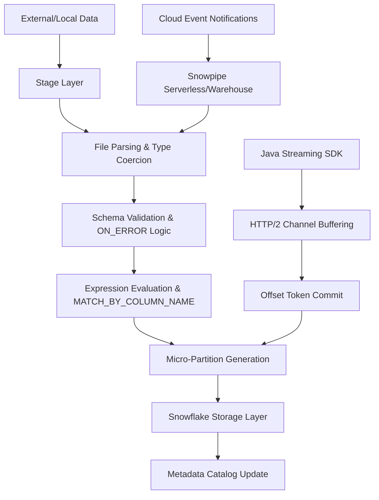

# Domain 3.1: Data Loading and Unloading in Snowflake
**Technical Architecture, Execution Internals, and Production Engineering Guide**



---

## 3.1.1 Internal Loading Architecture & Micro-Partition Generation

Snowflake does not append rows to a file-based storage system. It ingests flat or semi-structured data and materializes it as **immutable columnar micro-partitions** (50–500 MB uncompressed). The loading pipeline executes in strict phases:

| Phase | Internal Operation | Technical Detail |
|-------|-------------------|------------------|
| **Discovery** | Cloud provider API enumeration or stage metadata scan | Resolves `PATTERN`, `FILES`, or auto-ingest notifications. Computes file paths, sizes, and last-modified timestamps. |
| **Validation** | Schema alignment & type coercion check | Maps source columns to target DDL. Evaluates `ENFORCE_LENGTH`, `TRUNCATECOLUMNS`, `MATCH_BY_COLUMN_NAME`. Pre-computes error thresholds. |
| **Parsing** | Byte-level deserialization per file format | Decodes compression (GZIP/ZSTD/SNAPPY), applies delimiter/quote rules, handles encoding (UTF-8/UTF-16/Latin1). For JSON/Avro/Parquet, extracts structural metadata. |
| **Transformation** | Expression evaluation & column mapping | Applies `COPY INTO` SELECT list, casts types, evaluates default expressions, handles `NULL_IF`/`EMPTY_FIELD_AS_NULL`. |
| **Materialization** | Columnar compression & micro-partition write | Applies per-column encoding: Dictionary (low cardinality), RLE (sorted), ZSTD/LZ4 (general). Computes statistics: `MIN`, `MAX`, `NULL_COUNT`, `DISTINCT_COUNT`, `NDV`. |
| **Catalog Update** | Transactional metadata commit | Registers micro-partition IDs in Snowflake's global catalog. Updates `COPY_HISTORY` and `LOAD_HISTORY`. Triggers time-trail versioning. |

**Key Technical Constraints:**
- Micro-partitions are **immutable**. `UPDATE`/`DELETE`/`MERGE` create new micro-partitions; old versions are retained for `DATA_RETENTION_TIME_IN_DAYS`.
- Compression ratios typically **3:1 to 10:1** depending on data distribution, sort order, and encoding.
- Statistics are computed **at load time**. `ANALYZE TABLE` is unnecessary for fresh loads; pruning works immediately.
- `COPY INTO` is **transactional per file**. Partial failures do not corrupt target tables; failed files remain in stage (unless `PURGE=TRUE` and `ON_ERROR=CONTINUE` with partial success).

---

## 3.1.2 Stage Architecture & Cloud Integration Mechanics

Stages are the bridge between external storage and Snowflake's compute engine. Authentication and access control are enforced via **Cloud Integrations**, not embedded credentials.

### Internal Stage Hierarchy
| Type | Scope | Storage Location | Access Control |
|------|-------|------------------|----------------|
| `@~` (User Stage) | Per user, isolated | Encrypted in Snowflake storage | Owner-only. Cannot be shared or queried by others. |
| `@%<table>` (Table Stage) | Per table | Encrypted in Snowflake storage | Requires `OWNERSHIP` or `USAGE` on table. Used by `COPY INTO table FROM @%table`. |
| `@<named_stage>` | Schema-scoped | Encrypted in Snowflake storage | `GRANT USAGE` required. Supports lifecycle policies, tagging, and cross-user sharing. |

### External Stage & Cloud Integration Mechanics
External stages point to cloud storage. Authentication is delegated to cloud IAM via `STORAGE_INTEGRATION`.

| Cloud | Integration Object | Authentication Flow | Trust Policy Requirement |
|-------|-------------------|---------------------|--------------------------|
| **AWS** | `STORAGE_INTEGRATION` | Snowflake assumes IAM role via STS | `sts:ExternalId` + Snowflake account ID + `sts:AssumeRole` permission |
| **Azure** | `STORAGE_INTEGRATION` | Azure AD token exchange via Managed Identity/SP | `Microsoft.Storage/storageAccounts/blobServices/containers/*` + `Blob Data Contributor` |
| **GCP** | `STORAGE_INTEGRATION` | Workload Identity Federation + SA impersonation | `roles/storage.objectViewer` + `storage.objects.list` + `storage.objects.get` |

```sql
-- AWS External Stage with STS External ID
CREATE OR REPLACE STORAGE INTEGRATION s3_ext_int
  TYPE = EXTERNAL_STAGE
  STORAGE_PROVIDER = 'S3'
  ENABLED = TRUE
  STORAGE_AWS_ROLE_ARN = 'arn:aws:iam::123456789012:role/snowflake-ingest'
  STORAGE_ALLOWED_LOCATIONS = ('s3://my-bucket/raw/', 's3://my-bucket/staged/');

-- Retrieve External ID for IAM Trust Policy
DESC STORAGE INTEGRATION s3_ext_int;
-- Output: STORAGE_AWS_IAM_USER_ARN, STORAGE_AWS_EXTERNAL_ID
```

**Critical Security Notes:**
- `STORAGE_ALLOWED_LOCATIONS` acts as a **prefix allowlist**. Paths outside are rejected at the integration layer.
- Cloud providers do **not** allow wildcard bucket access. Prefixes must be explicit.
- Temporary credentials are generated via `GET_PRESIGNED_URL()` for direct client access. Tokens expire in 1–2 hours.

---

## 3.1.3 File Format Parsing & Encoding Internals

File formats define the byte-level deserialization rules. Misconfiguration is the #1 cause of load failures and silent data corruption.

### CSV/TSV Parsing Mechanics
| Parameter | Internal Behavior | Edge Case Handling |
|-----------|------------------|-------------------|
| `FIELD_DELIMITER` | Byte separator detection | Supports multi-char delimiters (e.g., `|||`). Fails if embedded in quoted fields without escaping. |
| `RECORD_DELIMITER` | Line boundary detection | Defaults to `\n`. Handles `\r\n` automatically. `SKIP_BLANK_LINES=TRUE` ignores empty rows. |
| `FIELD_OPTIONALLY_ENCLOSED_BY` | Quote stripping logic | Removes quotes only at field boundaries. Escaped quotes (`""`) become single `"`. |
| `ESCAPE` / `ESCAPE_UNENCLOSED_FIELD` | Character escape resolution | `ESCAPE=NONE` disables escaping. `ESCAPE_UNENCLOSED_FIELD` handles delimiters inside unquoted fields. |
| `DATE_FORMAT`, `TIME_FORMAT`, `TIMESTAMP_FORMAT` | Type coercion rules | Uses `STRICT` parsing. Invalid formats trigger `PARSE_ERROR` unless `ERROR_ON_COLUMN_COUNT_MISMATCH=FALSE`. |

### Semi-Structured Parsing (JSON/Avro/Parquet)
| Parameter | Internal Behavior | Optimization Impact |
|-----------|------------------|-------------------|
| `STRIP_OUTER_ARRAY` | Removes top-level JSON array wrapper | Required for `COPY INTO` to treat each array element as a row. |
| `STRIP_NULL_VALUES` | Omits `null` keys during ingestion | Reduces `VARIANT` storage size by ~15–30%. |
| `ALLOW_DUPLICATE` | Permits duplicate JSON keys | Last occurrence wins. Set `FALSE` to catch malformed payloads. |
| `BINARY_AS_TEXT` (Parquet) | Decodes binary columns as UTF-8 strings | Enable for legacy compatibility. Disable for native `BINARY` type. |
| `COMPRESSION` | Decompression engine | `SNAPPY` (fast, low CPU), `ZSTD` (best ratio), `GZIP` (universal, high CPU). |

**Type Coercion Rules:**
- Numeric strings → `NUMBER(p,s)` based on target column precision.
- Invalid booleans (`'true'`, `'1'`, `'yes'`) → `TRUE`/`FALSE` per `PARSE_JSON` rules.
- `VARIANT` storage: Uses **self-describing binary format** with type tags, length prefixes, and inline dictionary references.

---

## 3.1.4 COPY INTO Execution Engine & Parallelism Model

`COPY INTO` is a distributed, parallel execution engine. Performance is deterministic when file sizing and warehouse allocation align.

### Parallelism Architecture
1. **File Discovery**: Snowflake resolves `PATTERN` or `FILES` list. Computes total file count and byte size.
2. **Thread Allocation**: Each warehouse node spawns up to `MAX_CONCURRENCY` threads (default: session-level `8`). Threads are assigned files using **hash-based partitioning**.
3. **Execution**: Each thread processes one file independently. Parsing, validation, and micro-partition generation occur in memory.
4. **Commit**: All successful files are committed atomically. Failed files are logged to error table/stage.

```sql
-- Optimal parallelism configuration for 10k files
ALTER SESSION SET MAX_CONCURRENCY = 16;  -- Cap threads to prevent queueing
ALTER SESSION SET STATEMENT_TIMEOUT_IN_SECONDS = 7200;  -- 2-hour window

COPY INTO analytics.events_raw
FROM @s3_raw_stage/events/
FILE_FORMAT = (FORMAT_NAME = parquet_load_fmt)
PATTERN = '.*\.parquet$'
ON_ERROR = 'SKIP_FILE_3'
SIZE_LIMIT = 50000000000;  -- 50 GB test window
```

### Critical Parameter Mechanics
| Parameter | Execution Behavior | Production Use Case |
|-----------|-------------------|---------------------|
| `PATTERN` | Regex applied to file paths at cloud provider or client | Use anchored patterns: `^events/2024-01-.*\.gz$`. Avoid `.*` on large buckets. |
| `FILES` | Explicit file list override | Debugging, targeted reprocessing, idempotent retries. |
| `FORCE` | Bypasses `COPY_HISTORY` tracking | Forces reprocessing of already-loaded files. Use with `RETURN_FAILED_ONLY=TRUE`. |
| `PURGE` | Deletes source files after commit | Reduces stage storage. Requires `OWNERSHIP` on stage. Transactional per file. |
| `MATCH_BY_COLUMN_NAME` | Maps source → target by name, not position | `CASE_SENSITIVE`: Exact match. `CASE_INSENSITIVE`: Lowercase match. Handles schema evolution. |
| `SIZE_LIMIT` | Stops ingestion after X bytes | Testing, quota enforcement, phased migration. |
| `RETURN_FAILED_ONLY` | Outputs only failed rows/files | Debugging error patterns without loading success data. |

**Copy History Tracking:**
Snowflake tracks processed files using a **deterministic hash**: `(stage_path + file_name + last_modified_timestamp + file_size)`. Modifying any component triggers reprocessing.

---

## 3.1.5 Error Handling, Validation & Data Quality Controls

Snowflake provides granular error handling to balance throughput with data integrity.

### ON_ERROR Modes
| Mode | Behavior | When To Use |
|------|----------|-------------|
| `CONTINUE` | Skips invalid rows, logs errors, continues load | High-volume tolerant pipelines, error table reconciliation |
| `SKIP_FILE` | Aborts entire file on first error | Strict validation, prevents partial file contamination |
| `SKIP_FILE_n` | Aborts file if errors > n | Threshold-based quality gates |
| `ABORT_STATEMENT` | Fails entire `COPY INTO` | Critical financial/compliance data, zero-tolerance policies |

### Pre-Flight Validation
```sql
-- Validate 100 rows without writing
COPY INTO analytics.events_raw
FROM @s3_raw_stage/events/
FILE_FORMAT = (FORMAT_NAME = parquet_load_fmt)
VALIDATION_MODE = 'RETURN_100_ROWS';

-- Validate entire file set, return only errors
COPY INTO analytics.events_raw
FROM @s3_raw_stage/events/
VALIDATION_MODE = 'RETURN_ALL_ERRORS';
```

### Error File Generation
- Stored in stage as `<file_name>_error.csv`
- Contains: `line_number`, `start_position`, `error_code`, `error_message`, `file_name`
- Parseable via `COPY INTO error_table FROM @stage PATTERN='.*_error.csv'`
- **Do not disable** `ENFORCE_LENGTH` or `TRUNCATECOLUMNS` without audit logging. Silent truncation breaks compliance.

---

## 3.1.6 Continuous Ingestion: Snowpipe & Streaming API Internals

### Snowpipe Auto-Ingest Architecture
1. Cloud storage emits event → SNS/SQS, Event Grid, or PubSub
2. Snowflake polls message queue (every 1–5 seconds)
3. Serverless compute auto-provisions (or uses attached warehouse)
4. Executes `COPY INTO` with `ON_ERROR=CONTINUE`
5. Commits successful files, updates `PIPE_HISTORY`, acknowledges queue

```sql
CREATE OR REPLACE PIPE raw_events_pipe
  AUTO_INGEST = TRUE
  INTEGRATION = s3_ext_int
  AS
  COPY INTO analytics.events_raw
  FROM @s3_raw_stage/events/
  FILE_FORMAT = (FORMAT_NAME = parquet_load_fmt)
  ON_ERROR = 'SKIP_FILE';

-- Monitor pipe status
SELECT SYSTEM$PIPE_STATUS('raw_events_pipe');
-- Returns: executionState, pendingFileCount, numOutstandingMessagesOnPipe, lastReceivedMessageTimestamp

-- Manual refresh for backfill
ALTER PIPE raw_events_pipe REFRESH;
```

**Billing & Performance:**
- Serverless Snowpipe: Billed per credit consumed by auto-scaled compute + cloud services. No warehouse required.
- Warehouse-managed: Billed at warehouse rate. Better for predictable, high-throughput pipelines.
- `COPY_HISTORY` tracks `PIPE_NAME`, `CREDITS_USED`, `NUM_FILES_PROCESSED`, `ERROR_COUNT`.

### Snowpipe Streaming API (Java SDK)
Direct row ingestion via HTTP/2. Exactly-once semantics via offset tokens.

```java
SnowflakeStreamingIngestChannel channel = client.openChannel("ch1", "raw_events_pipe");
InsertValidationResponse response = channel.insertRow(row, "offset_token_123");
if (response.hasErrors()) {
    // Handle duplicate key, type mismatch, or channel throttling
}
client.flush(true);  // Force commit pending rows
```

**Internals:**
- Buffer accumulates rows in memory. Flushes on interval (default 1–10s) or row count threshold.
- Offset tokens are **idempotent keys**. Re-sending same token results in no-op.
- Channel-level throttling: ~10k rows/sec/channel. Scale horizontally with multiple channels.
- Memory-constrained: JVM heap limits apply. Use `BufferedChannelBuilder` for backpressure.

---

## 3.1.7 Data Unloading Mechanics & Partitioned Export Architecture

`COPY INTO <location>` serializes result sets, applies file format, partitions rows, and writes to external/internal stage.

### Partitioning Internals
```sql
COPY INTO 's3://archive/exported/'
FROM (SELECT * FROM analytics.events WHERE created_date >= '2023-01-01')
FILE_FORMAT = (TYPE = PARQUET COMPRESSION = 'SNAPPY')
PARTITION BY (DATE_PART('YEAR', created_date), DATE_PART('MONTH', created_date), region)
MAX_FILE_SIZE = 67108864;
```
- `PARTITION BY` evaluates expression per row, generates directory structure, routes rows via hash + range partitioning.
- `MAX_FILE_SIZE` controls split behavior. Snowflake spawns threads to meet target size.
- File naming: `data_0_0_0.parquet`, `data_1_0_1.parquet`, etc. Deterministic per partition.

### Unload Optimization Matrix
| Scenario | Configuration | Rationale |
|----------|---------------|-----------|
| Data Lake Archival | `PARQUET`, `SNAPPY/ZSTD`, `MAX_FILE_SIZE=128MB` | Optimized for Spark/Presto, cost-effective |
| BI Consumption | `CSV`, `HEADER=TRUE`, `FIELD_OPTIONALLY_ENCLOSED_BY='"'` | Human-readable, tool-compatible |
| Partitioned Export | `PARTITION BY`, `MAX_FILE_SIZE=64MB` | Downstream filtering efficiency |
| Single File Export | `SINGLE=TRUE`, `MAX_FILE_SIZE=0` | Disables parallelism. Use only for small datasets. |

**Egress Cost Management:**
- Snowflake charges **$0** for same-region egress. Cross-region/cloud incurs standard provider rates.
- Use **VPC endpoints / PrivateLink** to keep traffic within cloud backbone.
- Schedule large unloads during off-peak hours. Monitor `COPY_HISTORY` for `BYTES_UNLOADED`.

---

## 3.1.8 Performance Tuning, Resource Allocation & Diagnostics

### Warehouse Sizing Guidelines
| Workload | Files/Volume | Recommended Size | Parallelism |
|----------|-------------|------------------|-------------|
| Small bulk (<50 files) | <1 GB | `X-SMALL` / `SMALL` | 1–4 threads |
| Medium bulk (50–5k files) | 1–50 GB | `MEDIUM` / `LARGE` | 4–16 threads |
| Large bulk (>5k files) | 50+ GB | `X-LARGE` / `2X-LARGE` | 16–64 threads |
| Streaming/Snowpipe | Event-driven | Serverless / `SMALL` | Auto-scaled |

### Diagnostic Tools
| Tool | Usage | Output |
|------|-------|--------|
| `EXPLAIN COPY INTO` | Pre-execution plan | File count, thread estimate, format parsing cost |
| `SYSTEM$LAST_QUERY_PROFILE()` | Post-execution profile | Memory usage, I/O wait, compression ratio, error distribution |
| `COPY_HISTORY` | Load tracking | `FILE_NAME`, `STATUS`, `ROW_COUNT`, `ERROR_COUNT`, `FIRST_ERROR_MESSAGE` |
| `PIPE_HISTORY` | Snowpipe metrics | `CREDITS_USED`, `NUM_FILES_PROCESSED`, `NUM_BYTES_INSERTED` |

**Anti-Patterns & Fixes:**
- Millions of <1MB files → Consolidate upstream or use `SIZE_LIMIT`. Metadata overhead dominates parse time.
- `ON_ERROR='CONTINUE'` without audit → Silent corruption. Use `SKIP_FILE_3` + error table reconciliation.
- Oversized warehouse for small loads → Wasted credits. Right-size based on `COPY_HISTORY` file count.
- Disabling compression → 3–5x network/storage cost. Pre-compress or use `COMPRESSION='AUTO'`.

---

## 3.1.9 Security, Compliance & Audit Trails for Data Movement

| Control | Implementation | Audit Evidence |
|---------|---------------|----------------|
| Encryption in Transit | TLS 1.2+ enforced. No downgrade allowed. | `NETWORK_POLICY` logs, connection metadata |
| Encryption at Rest | AES-256. CMK/Tri-Secret available. | `ENCRYPTION_STATUS` view, key rotation logs |
| Network Isolation | IP allow/block lists, PrivateLink | `NETWORK_POLICY_EVENTS` view |
| Data Lineage | `COPY_HISTORY`, `LOAD_HISTORY`, `ACCESS_HISTORY` | File-to-table mapping, user/role attribution |
| Compliance Validation | `VALIDATION_MODE`, `ENFORCE_LENGTH`, `ON_ERROR` | Error files, audit logs, schema drift reports |
| Data Residency | Region-locked stages, explicit replication config | `REGION` parameter, cross-region transfer logs |

---

## Key Engineering Principles

1. **File size dictates parallelism.** 10–100 MB uncompressed per file maximizes thread utilization. Tiny files serialize execution; huge files underutilize cluster.
2. **Stages are ephemeral bridges.** Use external stages for pipeline automation, internal for ad-hoc, purge after commit. Track with `COPY_HISTORY`.
3. **Snowpipe scales automatically.** Serverless billing aligns cost with ingestion volume. Monitor `PIPE_HISTORY` and `SYSTEM$PIPE_STATUS`.
4. **Validation is non-negotiable.** Use `VALIDATION_MODE` for pre-flight checks. `ON_ERROR` modes define data quality boundaries.
5. **Unloading requires explicit partitioning.** `PARTITION BY` generates directory structures; `MAX_FILE_SIZE` controls downstream usability.
6. **Security is layered.** Network policies → Cloud integrations → RBAC → Encryption → Audit trails. Each layer must be verified.
7. **Diagnostics are built-in.** `EXPLAIN`, query profiles, `COPY_HISTORY`, and `PIPE_HISTORY` provide deterministic visibility.

## Bottom Line
- **Loading** is a deterministic, parallelized transformation from flat/semi-structured bytes to columnar micro-partitions. Optimize file sizing, enforce strict validation, and right-size compute.
- **Unloading** is a controlled serialization process. Partition explicitly, compress efficiently, and track egress costs. Avoid `SINGLE=TRUE` for large datasets.
- **Continuous ingestion** trades staging simplicity for latency reduction. Implement exactly-once semantics via offset tokens, monitor pipe status, and scale channels horizontally.
- **Monitoring & Compliance** are foundational. `COPY_HISTORY`, `LOAD_HISTORY`, and validation modes provide auditable data movement trails. Enforce encryption, network policies, and access controls at every stage.
- **Architecture decisions dictate cost and performance.** Measure file volumes, size compute appropriately, enforce security boundaries, monitor continuously, and adjust quarterly. That is how Domain 3.1 operates at production scale.
