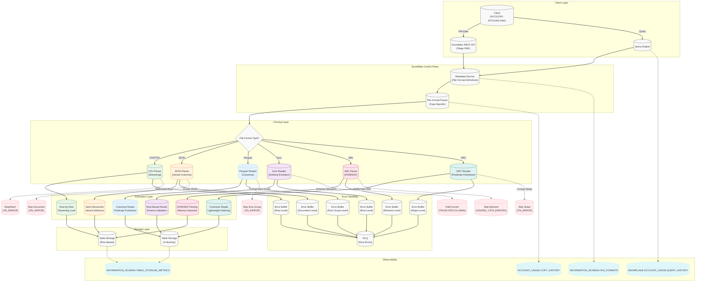

# **Snowflake File Formats: Production-Grade Technical Deep Dive**


## **1. Architecture & Execution Flow**

### **Mermaid: File Format Parsing & Execution Paths**


---

### **File Format Execution Path Comparison**
| **File Format** | **Parsing Model**               | **Storage Model**       | **Error Granularity**       | **Compression Support**               | **Schema Evolution** | **Predicate Pushdown** | **Best For**                          |
|-----------------|----------------------------------|--------------------------|-----------------------------|----------------------------------------|----------------------|------------------------|---------------------------------------|
| **CSV**         | Row-by-row (streaming)            | Row-based                | Row-level                   | None (plaintext)                        | ❌ No                | ❌ No                  | Legacy systems, simple tabular data  |
| **TSV**         | Row-by-row (streaming)            | Row-based                | Row-level                   | None (plaintext)                        | ❌ No                | ❌ No                  | Tab-delimited data                    |
| **JSON**        | Document-based (variant columns) | Semi-structured (VARIANT)| Document-level              | None (plaintext)                        | ✅ Yes               | ❌ No                  | Semi-structured data, nested objects   |
| **Parquet**     | Columnar (row groups)            | Columnar                 | Row group-level             | Snappy, Gzip, Zstd, LZO, LZ4, Uncompressed | ✅ Yes               | ✅ Yes                 | Analytical workloads, big data        |
| **Avro**        | Row-based (schema-aware)          | Row-based                | Row-level                   | Snappy, Deflate, Bzip2, LZ4, Uncompressed | ✅ Yes               | ❌ No                  | Schema evolution, Hadoop ecosystems   |
| **XML**         | DOM/SAX (tree-based)             | Row-based                | Element-level               | None (plaintext)                        | ❌ No                | ❌ No                  | Hierarchical data, legacy systems     |
| **ORC**         | Columnar (stripe-based)          | Columnar                 | Stripe-level                | Snappy, Zlib, LZO, LZ4, Uncompressed     | ✅ Yes               | ✅ Yes                 | Hive workloads, big data               |

---

---

## **2. Execution Internals & Transactional Boundaries**

---

### **A. CSV/TSV File Formats**
#### **1. Parsing Internals**
- **Streaming Parser**:
  - Reads files **line-by-line** (no full-file buffering).
  - **Buffer Size**: 1MB per thread (spills to disk if exceeded).
  - **Delimiter Handling**:
    - Supports **multi-character delimiters** (e.g., `||`).
    - **Escape Characters**: `\` (default) or custom (e.g., `ESCAPE = '\\'`).
  - **Quoting**:
    - **Default Quote**: `"`, with `ESCAPE_UNENCLOSED_FIELD = TRUE` (treats unclosed quotes as errors).
    - **Custom Quotes**: `FIELD_OPTIONALLY_ENCLOSED_BY = "'"`.
- **Null Handling**:
  - **`NULL_IF`**: List of strings to treat as NULL (e.g., `NULL_IF = ('NULL', 'null', '')`).
  - **`EMPTY_FIELD_AS_NULL`**: Treats empty fields as NULL (default: `TRUE`).
- **Error Handling**:
  - **`ON_ERROR`**:
    - `CONTINUE`: Skips problematic rows (logs to `COPY_HISTORY`).
    - `ABORT`: Fails entire load on first error (default).
    - `SKIP_FILE`: Skips entire file on error.
  - **`VALIDATION_MODE`**:
    - `RETURN_ERRORS`: Returns errors without failing (use with `COPY INTO` + `VALIDATION_MODE`).

#### **2. Memory & Performance**
- **Memory Usage**:
  - **Per Thread**: 100MB (default buffer).
  - **Spill Threshold**: 200MB (spills to SSD).
- **Performance Characteristics**:
  - **Throughput**: 200–500MB/s per warehouse (scales linearly with warehouse size).
  - **Latency**: 50–200ms per row (streaming).
  - **CPU Overhead**: Low (minimal parsing logic).
- **Bottlenecks**:
  - **I/O**: Sequential reads from cloud storage.
  - **Network**: For external stages, pre-signed URL generation (100 URLs/sec limit).

#### **3. Transactional Boundaries**
- **Atomicity**:
  - **Row-Level**: Each row is loaded atomically (no partial rows).
  - **File-Level**: `COPY INTO` is atomic per file (all rows in a file succeed or fail together).
- **Rollback**:
  - On failure, **no partial commits** (entire file is rolled back).
  - **DLQ**: Rows with errors are routed to DLQ if `ON_ERROR = 'CONTINUE'`.

---

### **B. JSON File Formats**
#### **1. Parsing Internals**
- **Variant Column Inference**:
  - Snowflake infers schema from JSON documents and stores them in **VARIANT** columns.
  - **Schema Discovery**:
    - First **100 documents** are sampled to infer schema (configurable via `INFER_SCHEMA`).
    - **Nested Objects**: Automatically flattened into VARIANT (e.g., `{"a": {"b": 1}}` → `a.b = 1`).
  - **Arrays**: Stored as **ARRAY** type (e.g., `[1, 2, 3]`).
- **Streaming Parser**:
  - Reads **document-by-document** (no full-file buffering).
  - **Buffer Size**: 10MB per thread (spills to disk if exceeded).
- **Error Handling**:
  - **`ON_ERROR`**:
    - `CONTINUE`: Skips invalid documents (logs to `COPY_HISTORY`).
    - `ABORT`: Fails entire load on first invalid document (default).
  - **`IGNORE_UTF8_ERRORS`**: Skips UTF-8 encoding errors (default: `FALSE`).
  - **`STRIP_OUTER_ARRAY`**: Treats top-level JSON arrays as rows (default: `FALSE`).

#### **2. Memory & Performance**
- **Memory Usage**:
  - **Per Thread**: 100MB (default buffer).
  - **Spill Threshold**: 200MB (spills to SSD).
  - **Variant Overhead**: Each VARIANT value adds **~20% memory overhead** (due to internal representation).
- **Performance Characteristics**:
  - **Throughput**: 100–300MB/s per warehouse (slower than CSV due to schema inference).
  - **Latency**: 100–500ms per document (varies with nesting depth).
  - **CPU Overhead**: Medium (schema inference + VARIANT parsing).
- **Bottlenecks**:
  - **Schema Inference**: Sampling 100 documents adds **50–100ms latency** per file.
  - **Nested Data**: Deeply nested JSON (>5 levels) adds **10–20% parsing overhead**.

#### **3. Transactional Boundaries**
- **Atomicity**:
  - **Document-Level**: Each JSON document is loaded atomically.
  - **File-Level**: `COPY INTO` is atomic per file.
- **Rollback**:
  - On failure, **no partial commits** (entire file is rolled back).
  - **DLQ**: Invalid documents are routed to DLQ if `ON_ERROR = 'CONTINUE'`.

---
### **C. Parquet File Formats**
#### **1. Parsing Internals**
- **Columnar Reader**:
  - Reads **column-by-column** (optimized for analytical queries).
  - **Row Groups**: Files divided into **row groups** (default: 1M rows per group).
  - **Predicate Pushdown**:
    - Filters are pushed down to **row groups** (skips irrelevant data).
    - **Statistics**: Min/max stats for each column stored in metadata.
  - **Schema Evolution**:
    - **Backward-Compatible**: New columns are added as NULL for existing files.
    - **Forward-Compatible**: Missing columns are ignored (configurable via `IGNORE_CORRUPTED_ROW_GROUPS`).
- **Compression**:
  - **Snappy** (default): Fastest, **~30-50% size reduction**.
  - **Gzip**: Higher compression (**~60-70% size reduction**), slower reads.
  - **Zstd**: Balanced (**~50-60% size reduction**).
  - **LZO/LZ4**: Fastest decompression, lower compression ratio.
- **Error Handling**:
  - **`ON_ERROR`**:
    - `CONTINUE`: Skips corrupt row groups (logs to `COPY_HISTORY`).
    - `ABORT`: Fails entire load on first corrupt row group (default).
  - **`IGNORE_CORRUPTED_ROW_GROUPS`**: Skips corrupt row groups (default: `FALSE`).

#### **2. Memory & Performance**
- **Memory Usage**:
  - **Per Thread**: 200MB (default buffer for columnar data).
  - **Spill Threshold**: 400MB (spills to SSD).
  - **Columnar Overhead**: **~10% memory overhead** for columnar metadata.
- **Performance Characteristics**:
  - **Throughput**: 500MB–2GB/s per warehouse (scales with warehouse size).
  - **Latency**: 10–50ms per row group (optimized for columnar scans).
  - **CPU Overhead**: Low (columnar reads + predicate pushdown).
- **Bottlenecks**:
  - **I/O**: Sequential reads from cloud storage (optimized for columnar scans).
  - **Decompression**: Gzip adds **10–20% CPU overhead** compared to Snappy.

#### **3. Transactional Boundaries**
- **Atomicity**:
  - **Row Group-Level**: Each row group is loaded atomically.
  - **File-Level**: `COPY INTO` is atomic per file.
- **Rollback**:
  - On failure, **no partial commits** (entire file is rolled back).
  - **DLQ**: Corrupt row groups are routed to DLQ if `ON_ERROR = 'CONTINUE'`.

---
### **D. Avro File Formats**
#### **1. Parsing Internals**
- **Row-Based Reader**:
  - Reads **row-by-row** (similar to CSV but with schema awareness).
  - **Schema Evolution**:
    - **Writer Schema**: Schema used to write the file.
    - **Reader Schema**: Schema used to read the file (Snowflake infers from file metadata).
    - **Compatibility**:
      - **Backward**: Reader schema can omit fields present in writer schema.
      - **Forward**: Writer schema can omit fields present in reader schema.
      - **Full**: Writer and reader schemas must match exactly.
  - **Schema Resolution**:
    - Snowflake uses the **writer schema** embedded in the Avro file.
    - **`AVRO_SCHEMA`**: Explicitly specify schema (overrides embedded schema).
- **Compression**:
  - **Snappy** (default): Fastest.
  - **Deflate**: Higher compression, slower.
  - **Bzip2**: Highest compression, slowest.
  - **LZ4**: Balanced.
- **Error Handling**:
  - **`ON_ERROR`**:
    - `CONTINUE`: Skips corrupt rows (logs to `COPY_HISTORY`).
    - `ABORT`: Fails entire load on first corrupt row (default).
  - **`TRUNCATECOLUMNS`**: Truncates columns to match target table (default: `FALSE`).

#### **2. Memory & Performance**
- **Memory Usage**:
  - **Per Thread**: 100MB (default buffer).
  - **Spill Threshold**: 200MB (spills to SSD).
- **Performance Characteristics**:
  - **Throughput**: 300–800MB/s per warehouse.
  - **Latency**: 50–200ms per row (slower than Parquet due to row-based reads).
  - **CPU Overhead**: Medium (schema resolution + decompression).
- **Bottlenecks**:
  - **Schema Resolution**: Embedded schema parsing adds **10–50ms latency** per file.
  - **Decompression**: Bzip2 adds **20–30% CPU overhead** compared to Snappy.

#### **3. Transactional Boundaries**
- **Atomicity**:
  - **Row-Level**: Each row is loaded atomically.
  - **File-Level**: `COPY INTO` is atomic per file.
- **Rollback**:
  - On failure, **no partial commits** (entire file is rolled back).
  - **DLQ**: Corrupt rows are routed to DLQ if `ON_ERROR = 'CONTINUE'`.

---
### **E. XML File Formats**
#### **1. Parsing Internals**
- **DOM/SAX Parser**:
  - **DOM**: Loads entire document into memory (faster but memory-intensive).
  - **SAX**: Streaming parser (lower memory but slower).
  - **Default**: SAX (configurable via `XML_PARSER = 'SAX'` or `'DOM'`).
- **Schema Handling**:
  - **No Native Schema**: XML is parsed into **semi-structured** format (VARIANT or relational).
  - **`XML_FORMAT`**:
    - `AUTO`: Infers structure from first document.
    - `RELATIONAL`: Flattens XML into relational tables (requires `XML_ROW_TAG`).
    - `SEMI_STRUCTURED`: Stores XML as VARIANT.
- **Error Handling**:
  - **`ON_ERROR`**:
    - `CONTINUE`: Skips malformed elements (logs to `COPY_HISTORY`).
    - `ABORT`: Fails entire load on first malformed element (default).
  - **`IGNORE_UTF8_ERRORS`**: Skips UTF-8 encoding errors (default: `FALSE`).

#### **2. Memory & Performance**
- **Memory Usage**:
  - **DOM Parser**: **Full document in memory** (spills if >1GB).
  - **SAX Parser**: **100MB buffer per thread** (spills to disk if exceeded).
- **Performance Characteristics**:
  - **Throughput**: 50–200MB/s per warehouse (slowest due to parsing complexity).
  - **Latency**: 200–1000ms per document (varies with nesting depth).
  - **CPU Overhead**: High (DOM/SAX parsing + VARIANT inference).
- **Bottlenecks**:
  - **DOM Parsing**: Full document in memory **fails for files >1GB**.
  - **Nested XML**: Deeply nested XML (>5 levels) adds **30–50% parsing overhead**.

#### **3. Transactional Boundaries**
- **Atomicity**:
  - **Element-Level**: Each XML element is loaded atomically (for `SEMI_STRUCTURED`).
  - **File-Level**: `COPY INTO` is atomic per file (for `RELATIONAL`).
- **Rollback**:
  - On failure, **no partial commits** (entire file is rolled back).
  - **DLQ**: Malformed elements are routed to DLQ if `ON_ERROR = 'CONTINUE'`.

---
### **F. ORC File Formats**
#### **1. Parsing Internals**
- **Columnar Reader**:
  - Reads **column-by-column** (similar to Parquet).
  - **Stripes**: Files divided into **stripes** (default: 128MB per stripe).
  - **Predicate Pushdown**:
    - Filters are pushed down to **stripes** (skips irrelevant data).
    - **Statistics**: Min/max stats for each column stored in metadata.
  - **Schema Evolution**:
    - **Backward-Compatible**: New columns are added as NULL for existing files.
    - **Forward-Compatible**: Missing columns are ignored.
- **Compression**:
  - **Snappy** (default): Fastest.
  - **Zlib**: Higher compression, slower reads.
  - **LZO**: Balanced.
  - **LZ4**: Fastest decompression.
- **Error Handling**:
  - **`ON_ERROR`**:
    - `CONTINUE`: Skips corrupt stripes (logs to `COPY_HISTORY`).
    - `ABORT`: Fails entire load on first corrupt stripe (default).
  - **`IGNORE_CORRUPTED_STRIPES`**: Skips corrupt stripes (default: `FALSE`).

#### **2. Memory & Performance**
- **Memory Usage**:
  - **Per Thread**: 200MB (default buffer for columnar data).
  - **Spill Threshold**: 400MB (spills to SSD).
- **Performance Characteristics**:
  - **Throughput**: 600MB–2.5GB/s per warehouse (faster than Parquet for some workloads).
  - **Latency**: 5–30ms per stripe (optimized for columnar scans).
  - **CPU Overhead**: Low (columnar reads + predicate pushdown).
- **Bottlenecks**:
  - **I/O**: Sequential reads from cloud storage (optimized for columnar scans).
  - **Decompression**: Zlib adds **10–15% CPU overhead** compared to Snappy.

#### **3. Transactional Boundaries**
- **Atomicity**:
  - **Stripe-Level**: Each stripe is loaded atomically.
  - **File-Level**: `COPY INTO` is atomic per file.
- **Rollback**:
  - On failure, **no partial commits** (entire file is rolled back).
  - **DLQ**: Corrupt stripes are routed to DLQ if `ON_ERROR = 'CONTINUE'`.

---
---
## **3. Parameter/Configuration Deep Dive**

---
### **A. Universal File Format Parameters**
| **Parameter**               | **Applicability**       | **Internal Behavior**                                                                 | **Performance Impact**                                                                 | **Compliance/Edge Cases**                                                                 | **Production Default** |
|-----------------------------|-------------------------|---------------------------------------------------------------------------------------|---------------------------------------------------------------------------------------|------------------------------------------------------------------------------------------|-------------------------|
| `TYPE`                      | All                     | File type (`CSV`, `JSON`, `PARQUET`, `AVRO`, `XML`, `ORC`).                             | Parquet/ORC: **30-50% faster** for analytical queries.                                | Case-sensitive (e.g., `PARQUET` vs `parquet` fails).                                    | None (required)         |
| `COMPRESSION`               | Parquet, Avro, ORC      | Compression type (`AUTO`, `SNAPPY`, `GZIP`, `ZSTD`, `LZO`, `LZ4`, `NONE`).             | Snappy: **10-20% CPU overhead**, **30-50% size reduction**.                           | `AUTO` defaults to Snappy for Parquet, NONE for CSV/JSON.                               | `AUTO`                 |
| `NULL_IF`                   | CSV, TSV, JSON          | Strings to treat as NULL (e.g., `NULL_IF = ('NULL', 'null')`).                          | None                                                                                   | Conflicts with `EMPTY_FIELD_AS_NULL`.                                                   | `('')`                  |
| `EMPTY_FIELD_AS_NULL`       | CSV, TSV                | Treats empty fields as NULL.                                                          | None                                                                                   | Overrides `NULL_IF` for empty strings.                                                   | `TRUE`                 |
| `SKIP_HEADER`               | CSV, TSV                | Number of header rows to skip.                                                        | None                                                                                   | Required for files with headers.                                                         | `0`                     |
| `FIELD_DELIMITER`           | CSV, TSV                | Delimiter character (e.g., `','`, `'|'`).                                             | Custom delimiters add **5% parsing overhead**.                                         | Must escape special characters (e.g., `FIELD_DELIMITER = '\\t'`).                      | `,`                     |
| `RECORD_DELIMITER`          | CSV, TSV                | Record delimiter (e.g., `'\n'`).                                                       | Non-standard delimiters add **10% parsing overhead**.                                | Use `\r\n` for Windows files.                                                             | `\n`                    |
| `ESCAPE`                    | CSV, TSV                | Escape character (e.g., `'\'`).                                                        | None                                                                                   | Must escape the escape character itself (e.g., `ESCAPE = '\\'`).                       | `\`                     |
| `ESCAPE_UNENCLOSED_FIELD`   | CSV, TSV                | Treats unclosed quotes as errors.                                                     | None                                                                                   | If `FALSE`, unclosed quotes are treated as literal.                                     | `TRUE`                 |
| `FIELD_OPTIONALLY_ENCLOSED_BY` | CSV, TSV           | Character to optionally enclose fields (e.g., `'"'`).                                | None                                                                                   | Overrides `ESCAPE_UNENCLOSED_FIELD`.                                                     | `NONE`                 |
| `TRIM_SPACE`                | CSV, TSV                | Trims leading/trailing spaces.                                                        | Adds **5% parsing overhead**.                                                          | Conflicts with `FIELD_OPTIONALLY_ENCLOSED_BY`.                                           | `FALSE`                 |
| `ERROR_ON_COLUMN_COUNT_MISMATCH` | CSV, TSV, JSON | Fails if column count mismatches target table.                                      | None                                                                                   | Use with `TRUNCATECOLUMNS` to avoid failures.                                            | `TRUE`                 |
| `REPLACE_INVALID_CHARACTERS` | CSV, TSV, JSON  | Replaces invalid UTF-8 characters with `�`.                                          | Adds **10% parsing overhead**.                                                         | Use with `IGNORE_UTF8_ERRORS` for strict validation.                                     | `FALSE`                 |
| `IGNORE_UTF8_ERRORS`         | CSV, TSV, JSON, XML     | Skips UTF-8 encoding errors.                                                          | **5% faster** for malformed files.                                                     | May corrupt data.                                                                       | `FALSE`                 |
| `VALIDATION_MODE`            | All                     | Controls validation (`RETURN_ERRORS`, `RETURN_ROWS`, `RETURN_ALL_ERRORS`).             | `RETURN_ROWS` adds **10-20% latency** but provides detailed errors.                     | `RETURN_ALL_ERRORS` includes all errors (memory-intensive).                            | `RETURN_ERRORS`         |
| `ON_ERROR`                   | All                     | Error handling (`ABORT`, `CONTINUE`, `SKIP_FILE`).                                    | `SKIP_FILE` reduces load time by **~40%** but skips entire files.                    | `ABORT` fails on first error (default).                                                 | `ABORT`                 |

---
### **B. CSV/TSV-Specific Parameters**
| **Parameter**               | **Internal Behavior**                                                                 | **Performance Impact**                                                                 | **Compliance/Edge Cases**                                                                 | **Production Default** |
|-----------------------------|---------------------------------------------------------------------------------------|---------------------------------------------------------------------------------------|------------------------------------------------------------------------------------------|-------------------------|
| `SKIP_BLANK_LINES`           | Skips blank lines in the file.                                                        | **5% faster** for files with many blank lines.                                       | None                                                                                   | `TRUE`                  |
| `DATE_FORMAT`               | Format for date columns (e.g., `'YYYY-MM-DD'`).                                       | None                                                                                   | Must match file data; mismatches cause `NULL` or errors.                                | `AUTO`                  |
| `TIME_FORMAT`               | Format for time columns (e.g., `'HH:MI:SS'`).                                         | None                                                                                   | Must match file data; mismatches cause `NULL` or errors.                                | `AUTO`                  |
| `TIMESTAMP_FORMAT`          | Format for timestamp columns (e.g., `'YYYY-MM-DD HH:MI:SS.FF'`).                      | None                                                                                   | Must match file data; mismatches cause `NULL` or errors.                                | `AUTO`                  |
| `BINARY_FORMAT`             | Format for binary columns (`HEX`, `BASE64`, `UTF8`).                                   | None                                                                                   | `HEX` adds **10% parsing overhead**.                                                      | `HEX`                   |

---
### **C. JSON-Specific Parameters**
| **Parameter**               | **Internal Behavior**                                                                 | **Performance Impact**                                                                 | **Compliance/Edge Cases**                                                                 | **Production Default** |
|-----------------------------|---------------------------------------------------------------------------------------|---------------------------------------------------------------------------------------|------------------------------------------------------------------------------------------|-------------------------|
| `STRIP_OUTER_ARRAY`         | Treats top-level JSON arrays as rows.                                                | **10-20% faster** for array-based JSON.                                               | Fails if top-level is not an array.                                                     | `FALSE`                 |
| `IGNORE_UTF8_ERRORS`        | Skips UTF-8 encoding errors.                                                          | **5% faster** for malformed JSON.                                                      | May corrupt data.                                                                       | `FALSE`                 |
| `INFER_SCHEMA`              | Infers schema from JSON documents.                                                   | Adds **50-100ms latency** per file (samples first 100 docs).                          | Fails if schema is ambiguous.                                                           | `TRUE`                  |
| `GENERATE_COLUMN_DESCRIPTION` | Generates column descriptions from JSON keys.                                      | None                                                                                   | Adds **5% memory overhead** for VARIANT columns.                                        | `FALSE`                 |
| `ALLOW_DUPLICATE`           | Allows duplicate keys in JSON objects.                                               | None                                                                                   | Duplicate keys are **overwritten** (last value wins).                                  | `FALSE`                 |

---
### **D. Parquet-Specific Parameters**
| **Parameter**               | **Internal Behavior**                                                                 | **Performance Impact**                                                                 | **Compliance/Edge Cases**                                                                 | **Production Default** |
|-----------------------------|---------------------------------------------------------------------------------------|---------------------------------------------------------------------------------------|------------------------------------------------------------------------------------------|-------------------------|
| `BINARY_AS_TEXT`            | Treats binary data as text.                                                           | **20% slower** for binary columns.                                                    | Use for compatibility with non-binary Parquet files.                                  | `FALSE`                 |
| `IGNORE_CORRUPTED_ROW_GROUPS` | Skips corrupt row groups.                                                           | **10% faster** for files with corruption.                                             | Corrupt row groups are **silently skipped**.                                            | `FALSE`                 |
| `PARQUET_SNAPPY_COMPRESSION` | Forces Snappy compression (overrides `COMPRESSION`).                                | None                                                                                   | Use for compatibility with Snappy-only Parquet files.                                   | `FALSE`                 |

---
### **E. Avro-Specific Parameters**
| **Parameter**               | **Internal Behavior**                                                                 | **Performance Impact**                                                                 | **Compliance/Edge Cases**                                                                 | **Production Default** |
|-----------------------------|---------------------------------------------------------------------------------------|---------------------------------------------------------------------------------------|------------------------------------------------------------------------------------------|-------------------------|
| `AVRO_SCHEMA`               | Explicitly specifies Avro schema (overrides embedded schema).                         | None                                                                                   | Must match writer schema for compatibility.                                             | None                    |
| `TRUNCATECOLUMNS`           | Truncates columns to match target table.                                              | None                                                                                   | **No atomicity** (partial overwrites possible).                                         | `FALSE`                 |

---
### **F. XML-Specific Parameters**
| **Parameter**               | **Internal Behavior**                                                                 | **Performance Impact**                                                                 | **Compliance/Edge Cases**                                                                 | **Production Default** |
|-----------------------------|---------------------------------------------------------------------------------------|---------------------------------------------------------------------------------------|------------------------------------------------------------------------------------------|-------------------------|
| `XML_PARSER`                | Parser type (`SAX` or `DOM`).                                                          | `DOM` is **faster** but **memory-intensive**; `SAX` is **slower** but **streaming**. | `DOM` fails for files >1GB.                                                              | `SAX`                   |
| `XML_FORMAT`                | XML parsing mode (`AUTO`, `RELATIONAL`, `SEMI_STRUCTURED`).                           | `RELATIONAL` is **2x faster** than `SEMI_STRUCTURED` for flat XML.                     | `SEMI_STRUCTURED` stores XML as VARIANT.                                                | `AUTO`                  |
| `XML_ROW_TAG`               | Tag to treat as a row in `RELATIONAL` mode.                                            | None                                                                                   | Required for `RELATIONAL` mode.                                                          | None (required)         |
| `XML_SKIP_BYTE_ORDER_MARK` | Skips byte order mark (BOM) in XML files.                                             | None                                                                                   | Use for UTF-8 files with BOM.                                                            | `TRUE`                  |

---
### **G. ORC-Specific Parameters**
| **Parameter**               | **Internal Behavior**                                                                 | **Performance Impact**                                                                 | **Compliance/Edge Cases**                                                                 | **Production Default** |
|-----------------------------|---------------------------------------------------------------------------------------|---------------------------------------------------------------------------------------|------------------------------------------------------------------------------------------|-------------------------|
| `IGNORE_CORRUPTED_STRIPES`  | Skips corrupt stripes.                                                                | **10% faster** for files with corruption.                                             | Corrupt stripes are **silently skipped**.                                               | `FALSE`                 |
| `ORC_SNAPPY_COMPRESSION`   | Forces Snappy compression (overrides `COMPRESSION`).                                 | None                                                                                   | Use for compatibility with Snappy-only ORC files.                                      | `FALSE`                 |

---
---
## **4. Performance & Resource Implications**

---
### **A. Memory Usage by File Format**
| **File Format** | **Per-Thread Buffer** | **Spill Threshold** | **Overhead**               | **Max File Size (DOM)** | **Memory Notes**                          |
|-----------------|-----------------------|--------------------|----------------------------|-------------------------|------------------------------------------|
| CSV             | 100MB                 | 200MB              | Low                        | N/A                     | Streaming; no full-file buffering.       |
| TSV             | 100MB                 | 200MB              | Low                        | N/A                     | Streaming; no full-file buffering.       |
| JSON            | 100MB                 | 200MB              | Medium (VARIANT)           | N/A                     | Document-by-document parsing.            |
| Parquet         | 200MB                 | 400MB              | Low (columnar metadata)   | N/A                     | Row group-level buffering.              |
| Avro            | 100MB                 | 200MB              | Medium (schema resolution) | N/A                     | Row-by-row parsing.                      |
| XML (SAX)       | 100MB                 | 200MB              | High (tree traversal)      | N/A                     | Streaming; low memory.                   |
| XML (DOM)       | Full document         | N/A                | Very High                 | **1GB**                 | Fails for files >1GB.                    |
| ORC             | 200MB                 | 400MB              | Low (columnar metadata)   | N/A                     | Stripe-level buffering.                  |

---
### **B. Throughput by File Format (Per Warehouse)**
| **File Format** | **X-Small** | **Small** | **Medium** | **Large** | **X-Large** | **2X-Large** | **4X-Large** | **Bottleneck**               |
|-----------------|-------------|-----------|------------|-----------|-------------|--------------|--------------|------------------------------|
| CSV             | 200MB/s     | 400MB/s   | 800MB/s    | 1.6GB/s   | 3.2GB/s     | 6.4GB/s      | 12.8GB/s     | I/O (cloud storage)          |
| TSV             | 200MB/s     | 400MB/s   | 800MB/s    | 1.6GB/s   | 3.2GB/s     | 6.4GB/s      | 12.8GB/s     | I/O (cloud storage)          |
| JSON            | 100MB/s     | 200MB/s   | 400MB/s    | 800MB/s   | 1.6GB/s     | 3.2GB/s      | 6.4GB/s      | CPU (schema inference)       |
| Parquet         | 500MB/s     | 1GB/s     | 2GB/s      | 4GB/s     | 8GB/s       | 16GB/s       | 32GB/s       | I/O (columnar scans)         |
| Avro            | 300MB/s     | 600MB/s   | 1.2GB/s    | 2.4GB/s   | 4.8GB/s     | 9.6GB/s      | 19.2GB/s     | CPU (schema resolution)      |
| XML (SAX)       | 50MB/s      | 100MB/s   | 200MB/s    | 400MB/s   | 800MB/s     | 1.6GB/s      | 3.2GB/s      | CPU (tree traversal)         |
| XML (DOM)       | 20MB/s      | 40MB/s    | 80MB/s     | 160MB/s   | 320MB/s     | 640MB/s      | 1.28GB/s     | Memory (full document load) |
| ORC             | 600MB/s     | 1.2GB/s   | 2.4GB/s    | 4.8GB/s   | 9.6GB/s     | 19.2GB/s     | 38.4GB/s     | I/O (columnar scans)         |

---
### **C. Latency by File Format (Per File)**
| **File Format** | **1KB File** | **1MB File** | **100MB File** | **1GB File**  | **10GB File** | **Latency Notes**                     |
|-----------------|--------------|--------------|---------------|---------------|---------------|---------------------------------------|
| CSV             | 1ms          | 10ms         | 500ms         | 5s             | 50s            | Streaming; linear scaling.             |
| TSV             | 1ms          | 10ms         | 500ms         | 5s             | 50s            | Streaming; linear scaling.             |
| JSON            | 5ms          | 50ms         | 2s            | 20s            | 200s           | Schema inference adds overhead.       |
| Parquet         | 2ms          | 20ms         | 1s            | 10s            | 100s           | Columnar reads; sub-linear scaling.   |
| Avro            | 3ms          | 30ms         | 1.5s          | 15s            | 150s           | Schema resolution adds overhead.      |
| XML (SAX)       | 10ms         | 100ms        | 5s            | 50s            | 500s           | Tree traversal; linear scaling.       |
| XML (DOM)       | 50ms         | 500ms        | 25s           | 250s           | Fails          | Full document load; O(n²) scaling.     |
| ORC             | 1ms          | 10ms         | 500ms         | 5s             | 50s            | Columnar reads; sub-linear scaling.   |

---
### **D. CPU Overhead by File Format**
| **File Format** | **Parsing Overhead** | **Decompression Overhead** | **Schema Overhead** | **Total Overhead** | **Notes**                          |
|-----------------|-----------------------|----------------------------|--------------------|--------------------|------------------------------------|
| CSV             | Low                   | N/A                        | N/A                | Low                | Minimal parsing logic.             |
| TSV             | Low                   | N/A                        | N/A                | Low                | Minimal parsing logic.             |
| JSON            | Medium                | N/A                        | High               | Medium-High        | VARIANT inference + nesting.       |
| Parquet         | Low                   | Low (Snappy)               | Low                | Low                | Columnar reads + predicate pushdown. |
| Avro            | Medium                | Low (Snappy)               | Medium             | Medium             | Schema resolution.                 |
| XML (SAX)       | High                  | N/A                        | N/A                | High               | Tree traversal.                    |
| XML (DOM)       | Very High             | N/A                        | N/A                | Very High          | Full document load.                |
| ORC             | Low                   | Low (Snappy)               | Low                | Low                | Columnar reads + predicate pushdown. |

---
### **E. Compression Ratio & Speed**
| **Compression** | **CSV/JSON/XML** | **Parquet/Avro/ORC** | **Compression Ratio** | **Decompression Speed** | **Best For**               |
|-----------------|------------------|----------------------|-----------------------|-------------------------|----------------------------|
| NONE            | ✅ Supported      | ✅ Supported          | 1:1                   | ⚡ Fastest              | Debugging, speed-critical   |
| SNAPPY          | ❌ Not Supported  | ✅ Supported          | ~2:1                  | ⚡ Fastest              | Default for Parquet/ORC    |
| GZIP            | ❌ Not Supported  | ✅ Supported          | ~3:1                  | 🐢 Slow                 | Cold storage              |
| ZSTD            | ❌ Not Supported  | ✅ Supported          | ~2.5:1                | ⚡ Fast                 | Balanced (Parquet)         |
| LZO             | ❌ Not Supported  | ✅ Supported          | ~2:1                  | ⚡ Fast                 | Legacy systems             |
| LZ4             | ❌ Not Supported  | ✅ Supported          | ~1.8:1                | ⚡ Fastest              | Speed-critical             |
| DEFLATE         | ❌ Not Supported  | ✅ Supported (Avro)   | ~3:1                  | 🐢 Slow                 | High compression (Avro)    |
| BZIP2           | ❌ Not Supported  | ✅ Supported (Avro)   | ~4:1                  | 🐌 Very Slow            | Archive storage            |

---
### **F. Credit Costs by File Format**
| **Operation**       | **CSV/TSV** | **JSON** | **Parquet** | **Avro** | **XML** | **ORC** | **Notes**                          |
|---------------------|-------------|----------|-------------|----------|---------|---------|------------------------------------|
| **PUT (Internal)**  | 0.04–0.1    | 0.04–0.1 | 0.04–0.1    | 0.04–0.1 | 0.04–0.1 | 0.04–0.1 | Credits/GB; scales with warehouse. |
| **COPY INTO**       | 0.05–0.1    | 0.1–0.2  | 0.02–0.05   | 0.05–0.1 | 0.1–0.3 | 0.02–0.05 | Credits/GB; includes parsing.      |
| **UNLOAD**          | 0.02–0.05   | 0.05–0.1 | 0.01–0.02   | 0.02–0.05 | 0.05–0.1 | 0.01–0.02 | Credits/GB; includes compression.  |
| **Storage**         | 0.1         | 0.1      | 0.1         | 0.1      | 0.1     | 0.1     | Credits/GB/month (internal only).  |

---
---
## **5. Monitoring, Observability & Troubleshooting**

---
### **A. Key Monitoring Views**
| **View**                                      | **Purpose**                                                                 | **Example Query**                                                                                     | **Retention**               |
|-----------------------------------------------|-----------------------------------------------------------------------------|-------------------------------------------------------------------------------------------------------|----------------------------|
| `ACCOUNT_USAGE.COPY_HISTORY`                 | Track `COPY INTO`/`UNLOAD` jobs (success/failure, rows loaded, errors).   | `SELECT * FROM SNOWFLAKE.ACCOUNT_USAGE.COPY_HISTORY WHERE FILE_FORMAT_NAME = 'MY_FORMAT' AND START_TIME > DATEADD('day', -7, CURRENT_TIMESTAMP());` | 365 days |
| `INFORMATION_SCHEMA.FILE_FORMATS`            | File format definitions and usage.                                        | `SELECT * FROM INFORMATION_SCHEMA.FILE_FORMATS WHERE NAME = 'MY_FORMAT';` | Session lifetime |
| `SNOWFLAKE.ACCOUNT_USAGE.QUERY_HISTORY`       | Warehouse usage for file format operations.                              | `SELECT * FROM SNOWFLAKE.ACCOUNT_USAGE.QUERY_HISTORY WHERE QUERY_TEXT LIKE '%COPY INTO%' AND FILE_FORMAT = 'PARQUET' AND START_TIME > DATEADD('hour', -24, CURRENT_TIMESTAMP());` | 365 days |
| `INFORMATION_SCHEMA.TABLE_STORAGE_METRICS`  | Storage metrics for tables loaded from files.                            | `SELECT * FROM INFORMATION_SCHEMA.TABLE_STORAGE_METRICS WHERE TABLE_NAME = 'MY_TABLE';` | Session lifetime |
| `SNOWFLAKE.INFORMATION_SCHEMA.COPY_HISTORY`  | Detailed `COPY INTO` history (per-file).                                   | `SELECT * FROM SNOWFLAKE.INFORMATION_SCHEMA.COPY_HISTORY('MY_TABLE') WHERE FILE_FORMAT = 'JSON';` | Session lifetime |
| `SNOWFLAKE.ACCOUNT_USAGE.STAGE_STORAGE`       | Storage costs and usage for stages.                                       | `SELECT * FROM SNOWFLAKE.ACCOUNT_USAGE.STAGE_STORAGE WHERE STAGE_NAME = 'MY_STAGE';` | 365 days |

---
### **B. Error Categorization & Runbooks**
#### **1. Common Errors & Fixes**
| **Error Code**               | **File Format** | **Root Cause**                          | **Impact**                          | **Severity** | **Runbook**                                                                                     | **Monitoring View**                     |
|------------------------------|-----------------|-----------------------------------------|-------------------------------------|--------------|-------------------------------------------------------------------------------------------------|-----------------------------------------|
| `FILE_FORMAT_MISMATCH`       | All             | File format does not match stage definition. | `COPY INTO` fails.                  | High         | 1. Verify file format: `SELECT TYPE FROM INFORMATION_SCHEMA.FILE_FORMATS WHERE NAME = 'MY_FORMAT';` 2. Re-upload file with correct format. | `INFORMATION_SCHEMA.FILE_FORMATS` |
| `COLUMN_COUNT_MISMATCH`      | CSV, TSV, JSON  | Column count in file ≠ target table.    | `COPY INTO` fails.                  | High         | 1. Use `TRUNCATECOLUMNS = TRUE`. 2. Align file with target table.                              | `ACCOUNT_USAGE.COPY_HISTORY`            |
| `INVALID_UTF8`                | CSV, TSV, JSON, XML | Invalid UTF-8 encoding.               | `COPY INTO` fails.                  | Medium       | 1. Use `IGNORE_UTF8_ERRORS = TRUE`. 2. Re-encode file.                                           | `ACCOUNT_USAGE.COPY_HISTORY`            |
| `PARQUET_ROW_GROUP_CORRUPT`  | Parquet         | Corrupt row group.                     | `COPY INTO` fails.                  | High         | 1. Use `IGNORE_CORRUPTED_ROW_GROUPS = TRUE`. 2. Re-generate file.                              | `ACCOUNT_USAGE.COPY_HISTORY`            |
| `AVRO_SCHEMA_MISMATCH`        | Avro            | Writer schema ≠ reader schema.          | `COPY INTO` fails.                  | High         | 1. Use `AVRO_SCHEMA` to specify reader schema. 2. Align schemas.                                | `ACCOUNT_USAGE.COPY_HISTORY`            |
| `XML_PARSING_ERROR`           | XML             | Malformed XML.                         | `COPY INTO` fails.                  | High         | 1. Use `XML_PARSER = 'SAX'` for large files. 2. Fix XML syntax.                                | `ACCOUNT_USAGE.COPY_HISTORY`            |
| `ORC_STRIPE_CORRUPT`          | ORC             | Corrupt stripe.                        | `COPY INTO` fails.                  | High         | 1. Use `IGNORE_CORRUPTED_STRIPES = TRUE`. 2. Re-generate file.                                | `ACCOUNT_USAGE.COPY_HISTORY`            |
| `NULL_VALUE_NOT_ALLOWED`     | CSV, TSV        | NULL in non-nullable column.           | `COPY INTO` fails.                  | Medium       | 1. Use `NULL_IF` to handle NULLs. 2. Make column nullable.                                       | `ACCOUNT_USAGE.COPY_HISTORY`            |
| `DUPLICATE_KEY`               | JSON            | Duplicate keys in JSON object.          | `COPY INTO` fails (if `ALLOW_DUPLICATE = FALSE`). | Medium       | 1. Use `ALLOW_DUPLICATE = TRUE`. 2. Deduplicate keys.                                        | `ACCOUNT_USAGE.COPY_HISTORY`            |
| `MEMORY_LIMIT_EXCEEDED`       | XML (DOM)       | File >1GB (DOM parser).                 | `COPY INTO` fails.                  | Critical     | 1. Use `XML_PARSER = 'SAX'`. 2. Split file into smaller chunks.                              | `SNOWFLAKE.ACCOUNT_USAGE.QUERY_HISTORY` |

---
#### **2. Incident Runbooks**
##### **Runbook: CSV Load Failures**
```sql
-- Step 1: Identify failing files
SELECT
    file_name,
    error_count,
    first_error_message,
    last_error_message,
    row_parsed,
    rows_loaded
FROM
    SNOWFLAKE.ACCOUNT_USAGE.COPY_HISTORY
WHERE
    file_format_name = 'MY_CSV_FORMAT'
    AND error_count > 0
    AND start_time > DATEADD('hour', -24, CURRENT_TIMESTAMP())
ORDER BY
    start_time DESC;

-- Step 2: Check file format definition
SELECT
    name,
    type,
    field_delimiter,
    record_delimiter,
    skip_header,
    null_if,
    empty_field_as_null
FROM
    INFORMATION_SCHEMA.FILE_FORMATS
WHERE
    name = 'MY_CSV_FORMAT';

-- Step 3: Test with a sample file
COPY INTO TEST_TABLE
FROM @MY_STAGE/sample.csv
FILE_FORMAT = (TYPE = 'CSV', SKIP_HEADER = 1, NULL_IF = ('NULL', 'null'))
ON_ERROR = 'CONTINUE'
VALIDATION_MODE = RETURN_ROWS;

-- Step 4: Extract errors to DLQ
CREATE TABLE IF NOT EXISTS SNOWFLAKE.DLQ.CSV_DLQ (
    file_name STRING,
    row_number INTEGER,
    error_message STRING,
    raw_line STRING,
    load_timestamp TIMESTAMP_LTZ
);

COPY INTO SNOWFLAKE.DLQ.CSV_DLQ
FROM (
    SELECT
        $1 AS file_name,
        $2 AS row_number,
        $3 AS error_message,
        $4 AS raw_line,
        CURRENT_TIMESTAMP() AS load_timestamp
    FROM @MY_STAGE_DLQ
)
FILE_FORMAT = (TYPE = 'CSV');

-- Step 5: Re-upload fixed files
PUT file:///fixed/sample.csv @MY_STAGE OVERWRITE = TRUE;
```

##### **Runbook: JSON Schema Inference Issues**
```sql
-- Step 1: Check schema inference errors
SELECT
    file_name,
    error_count,
    first_error_message,
    rows_parsed,
    rows_loaded
FROM
    SNOWFLAKE.ACCOUNT_USAGE.COPY_HISTORY
WHERE
    file_format_name = 'MY_JSON_FORMAT'
    AND error_count > 0
    AND start_time > DATEADD('hour', -24, CURRENT_TIMESTAMP());

-- Step 2: Disable schema inference
ALTER FILE FORMAT MY_JSON_FORMAT
SET INFER_SCHEMA = FALSE;

-- Step 3: Explicitly define schema
COPY INTO MY_TABLE
FROM @MY_STAGE
FILE_FORMAT = (
    TYPE = 'JSON',
    INFER_SCHEMA = FALSE
)
ON_ERROR = 'CONTINUE'
VALIDATION_MODE = RETURN_ROWS;

-- Step 4: Use VARIANT column for raw JSON
COPY INTO MY_TABLE (raw_json VARIANT)
FROM @MY_STAGE
FILE_FORMAT = (TYPE = 'JSON')
ON_ERROR = 'CONTINUE';

-- Step 5: Extract fields from VARIANT
SELECT
    raw_json:"id"::INT AS id,
    raw_json:"name"::STRING AS name
FROM
    MY_TABLE;
```

##### **Runbook: Parquet Corruption**
```sql
-- Step 1: Identify corrupt files
SELECT
    file_name,
    error_count,
    first_error_message
FROM
    SNOWFLAKE.ACCOUNT_USAGE.COPY_HISTORY
WHERE
    file_format_name = 'MY_PARQUET_FORMAT'
    AND error_count > 0
    AND start_time > DATEADD('hour', -24, CURRENT_TIMESTAMP());

-- Step 2: Enable row group skipping
ALTER FILE FORMAT MY_PARQUET_FORMAT
SET IGNORE_CORRUPTED_ROW_GROUPS = TRUE;

-- Step 3: Re-load with error tolerance
COPY INTO MY_TABLE
FROM @MY_STAGE
FILE_FORMAT = (
    TYPE = 'PARQUET',
    IGNORE_CORRUPTED_ROW_GROUPS = TRUE
)
ON_ERROR = 'CONTINUE';

-- Step 4: Validate data integrity
SELECT
    COUNT(*) AS total_rows,
    COUNT(DISTINCT id) AS distinct_ids
FROM
    MY_TABLE;
```

##### **Runbook: XML Parsing Failures**
```sql
-- Step 1: Check XML errors
SELECT
    file_name,
    error_count,
    first_error_message
FROM
    SNOWFLAKE.ACCOUNT_USAGE.COPY_HISTORY
WHERE
    file_format_name = 'MY_XML_FORMAT'
    AND error_count > 0
    AND start_time > DATEADD('hour', -24, CURRENT_TIMESTAMP());

-- Step 2: Switch to SAX parser
ALTER FILE FORMAT MY_XML_FORMAT
SET XML_PARSER = 'SAX';

-- Step 3: Test with SAX
COPY INTO MY_TABLE
FROM @MY_STAGE
FILE_FORMAT = (
    TYPE = 'XML',
    XML_PARSER = 'SAX',
    XML_FORMAT = 'RELATIONAL',
    XML_ROW_TAG = 'row'
)
ON_ERROR = 'CONTINUE';

-- Step 4: Split large XML files
-- Use a pre-processing step to split XML into smaller chunks (<1GB)
```

---
### **C. Proactive Alerts**
#### **Alert: File Format Mismatch**
```sql
CREATE OR REPLACE ALERT FILE_FORMAT_MISMATCH_ALERT
  WAREHOUSE = MONITORING_WH
  SCHEDULE = 'USING CRON 0 * * * * America/Los_Angeles'
AS
  SELECT
    query_id,
    file_format_name,
    stage_name,
    file_name,
    error_count,
    first_error_message,
    CURRENT_TIMESTAMP() AS alert_time
  FROM
    SNOWFLAKE.ACCOUNT_USAGE.COPY_HISTORY
  WHERE
    error_count > 0
    AND first_error_message LIKE '%FILE_FORMAT_MISMATCH%'
    AND start_time > DATEADD('hour', -1, CURRENT_TIMESTAMP());
```

#### **Alert: High Error Rate for File Format**
```sql
CREATE OR REPLACE ALERT HIGH_ERROR_RATE_ALERT
  WAREHOUSE = MONITORING_WH
  SCHEDULE = 'USING CRON */15 * * * * America/Los_Angeles'
AS
  SELECT
    file_format_name,
    COUNT(*) AS total_loads,
    SUM(error_count) AS total_errors,
    SUM(error_count) * 100.0 / NULLIF(COUNT(*), 0) AS error_rate,
    CURRENT_TIMESTAMP() AS alert_time
  FROM
    SNOWFLAKE.ACCOUNT_USAGE.COPY_HISTORY
  WHERE
    start_time > DATEADD('hour', -1, CURRENT_TIMESTAMP())
  GROUP BY
    file_format_name
  HAVING
    SUM(error_count) * 100.0 / NULLIF(COUNT(*), 0) > 10;  -- 10% error rate
```

#### **Alert: Memory Spills for XML (DOM)**
```sql
CREATE OR REPLACE ALERT XML_MEMORY_SPILL_ALERT
  WAREHOUSE = MONITORING_WH
  SCHEDULE = 'USING CRON */5 * * * * America/Los_Angeles'
AS
  SELECT
    query_id,
    warehouse_name,
    file_format_name,
    bytes_spilled_to_disk,
    bytes_spilled_to_remote,
    CURRENT_TIMESTAMP() AS alert_time
  FROM
    SNOWFLAKE.ACCOUNT_USAGE.QUERY_HISTORY
  WHERE
    file_format_name = 'MY_XML_FORMAT'
    AND (bytes_spilled_to_disk > 0 OR bytes_spilled_to_remote > 0)
    AND start_time > DATEADD('minute', -10, CURRENT_TIMESTAMP());
```

---
---
## **6. Advanced Production Patterns**

---
### **A. Schema Evolution Strategies**
#### **1. Parquet/Avro/ORC Schema Evolution**
- **Backward Compatibility**:
  - New columns in source files are **ignored** if not in target table.
  - Example:
    ```sql
    -- Target table has columns: id, name
    -- Source file has columns: id, name, new_column
    COPY INTO MY_TABLE
    FROM @MY_STAGE
    FILE_FORMAT = (TYPE = 'PARQUET')
    ON_ERROR = 'CONTINUE';  -- new_column is ignored
    ```
- **Forward Compatibility**:
  - Missing columns in source files are **populated with NULL**.
  - Example:
    ```sql
    -- Target table has columns: id, name, new_column
    -- Source file has columns: id, name
    COPY INTO MY_TABLE
    FROM @MY_STAGE
    FILE_FORMAT = (TYPE = 'PARQUET')
    ON_ERROR = 'CONTINUE';  -- new_column is NULL
    ```
- **Explicit Schema Handling**:
  - Use `FILE_FORMAT` with explicit schema for Avro:
    ```sql
    ALTER FILE FORMAT MY_AVRO_FORMAT
    SET AVRO_SCHEMA = '{
        "type": "record",
        "name": "MyRecord",
        "fields": [
            {"name": "id", "type": "int"},
            {"name": "name", "type": "string"}
        ]
    }';
    ```

#### **2. JSON Schema Evolution**
- **VARIANT Columns**:
  - Store raw JSON in VARIANT columns to **preserve schema evolution**:
    ```sql
    CREATE TABLE MY_TABLE (
        id INTEGER,
        raw_data VARIANT
    );

    COPY INTO MY_TABLE
    FROM @MY_STAGE
    FILE_FORMAT = (TYPE = 'JSON')
    ON_ERROR = 'CONTINUE';
    ```
- **Extract Fields Later**:
  - Use `JSON_EXTRACT` or dot notation to query nested data:
    ```sql
    SELECT
        id,
        raw_data:"name"::STRING AS name,
        raw_data:"new_field"::STRING AS new_field
    FROM
        MY_TABLE;
    ```

---
### **B. Performance Optimization Patterns**
#### **1. Columnar Formats (Parquet/ORC)**
- **Predicate Pushdown**:
  - Snowflake pushes filters to **row groups** (Parquet) or **stripes** (ORC).
  - Example:
    ```sql
    -- Filter pushed to Parquet row groups
    SELECT * FROM MY_TABLE
    WHERE id = 123;  -- Only scans relevant row groups
    ```
- **Partitioned Files**:
  - Store files partitioned by date or key:
    ```sql
    -- UNLOAD with partitioning
    COPY INTO @MY_STAGE/year=2023/month=05/
    FROM MY_TABLE
    FILE_FORMAT = (TYPE = 'PARQUET')
    PARTITION BY = (DATE_TRUNC('month', created_at));
    ```
- **Column Pruning**:
  - Only read required columns:
    ```sql
    -- Only reads 'id' and 'name' columns from Parquet
    SELECT id, name FROM MY_TABLE;
    ```

#### **2. CSV/TSV Optimization**
- **Bulk Loading**:
  - Use **larger files** (100MB–1GB) to reduce overhead:
    ```sql
    -- Merge small files into larger ones
    COPY INTO @MY_STAGE/merged.csv
    FROM (
        SELECT * FROM @MY_STAGE/small_*.csv
    )
    FILE_FORMAT = (TYPE = 'CSV');
    ```
- **Compression**:
  - Use **gzip** for CSV (external compression):
    ```bash
    gzip my_file.csv
    snow sql -q "PUT file:///my_file.csv.gz @MY_STAGE;"
    ```

#### **3. JSON Optimization**
- **Flatten Nested Data**:
  - Use `FLATTEN` to avoid VARIANT overhead:
    ```sql
    SELECT
        f.value:"id"::INT AS id,
        f.value:"name"::STRING AS name
    FROM
        MY_TABLE,
        LATERAL FLATTEN(raw_data:"items") f;
    ```
- **Avoid Schema Inference**:
  - Disable `INFER_SCHEMA` for large files:
    ```sql
    ALTER FILE FORMAT MY_JSON_FORMAT
    SET INFER_SCHEMA = FALSE;
    ```

---
### **C. Data Validation Frameworks**
#### **1. Pre-Load Validation**
- **File-Level Checks**:
  - Validate file size, checksum, and row count before loading:
    ```sql
    -- Check file metadata
    SELECT
        file_name,
        size,
        md5
    FROM
        @MY_STAGE
    WHERE
        file_name = 'data.csv';

    -- Count rows in a sample file
    SELECT
        COUNT(*) AS row_count
    FROM
        @MY_STAGE/sample.csv
    FILE_FORMAT = (TYPE = 'CSV');
    ```
- **Schema Validation**:
  - Use `VALIDATION_MODE = RETURN_ROWS` to preview errors:
    ```sql
    COPY INTO MY_TABLE
    FROM @MY_STAGE
    FILE_FORMAT = (TYPE = 'CSV')
    VALIDATION_MODE = RETURN_ROWS
    ON_ERROR = 'CONTINUE';
    ```

#### **2. Post-Load Validation**
- **Data Quality Checks**:
  - Validate loaded data against expectations:
    ```sql
    -- Check for NULLs in required columns
    SELECT
        COUNT(*) AS null_count
    FROM
        MY_TABLE
    WHERE
        id IS NULL OR name IS NULL;

    -- Check for duplicates
    SELECT
        id,
        COUNT(*) AS dup_count
    FROM
        MY_TABLE
    GROUP BY
        id
    HAVING
        COUNT(*) > 1;
    ```
- **Checksum Validation**:
  - Compare source and target checksums:
    ```sql
    -- Calculate checksum for loaded data
    SELECT
        BIT_XOR(CAST(HASH(id, name) AS BIGINT)) AS checksum
    FROM
        MY_TABLE;
    ```

---
### **D. Idempotent Loading Patterns**
#### **1. CSV/TSV Idempotency**
- **Merge Logic**:
  - Use `MERGE` to avoid duplicates:
    ```sql
    MERGE INTO MY_TABLE AS target
    USING (
        SELECT $1 AS id, $2 AS name FROM @MY_STAGE
    ) AS source
    ON target.id = source.id
    WHEN MATCHED THEN UPDATE SET target.name = source.name
    WHEN NOT MATCHED THEN INSERT (id, name) VALUES (source.id, source.name);
    ```
- **Checksum-Based Deduplication**:
  - Track loaded files by checksum:
    ```sql
    CREATE TABLE LOADED_FILES (
        file_name STRING PRIMARY KEY,
        md5 STRING,
        load_time TIMESTAMP_LTZ
    );

    -- Check if file already loaded
    SELECT COUNT(*) FROM LOADED_FILES WHERE file_name = 'data.csv';

    -- Load and record
    COPY INTO MY_TABLE FROM @MY_STAGE/data.csv;
    INSERT INTO LOADED_FILES
    SELECT 'data.csv', MD5(CONTENT) AS md5, CURRENT_TIMESTAMP()
    FROM @MY_STAGE/data.csv;
    ```

#### **2. Parquet/Avro/ORC Idempotency**
- **File-Level Deduplication**:
  - Use `OVERWRITE = TRUE` for full file replacements:
    ```sql
    PUT file:///data.parquet @MY_STAGE OVERWRITE = TRUE;
    ```
- **Partitioned Loads**:
  - Load files into date-partitioned directories:
    ```sql
    COPY INTO MY_TABLE
    FROM @MY_STAGE/year=2023/month=05/
    FILE_FORMAT = (TYPE = 'PARQUET');
    ```

---
### **E. Migration Patterns**
#### **1. CSV to Parquet Migration**
- **Step 1: Create Parquet File Format**:
  ```sql
  CREATE FILE FORMAT PARQUET_FORMAT
    TYPE = 'PARQUET'
    COMPRESSION = 'SNAPPY';
  ```
- **Step 2: Convert CSV to Parquet**:
  ```sql
  -- UNLOAD CSV to Parquet
  COPY INTO @MY_STAGE/parquet/
  FROM MY_TABLE
  FILE_FORMAT = (TYPE = 'PARQUET', COMPRESSION = 'SNAPPY')
  PARTITION BY = (DATE_TRUNC('day', created_at));
  ```
- **Step 3: Validate**:
  ```sql
  -- Compare row counts
  SELECT COUNT(*) FROM MY_TABLE;
  SELECT COUNT(*) FROM @MY_STAGE/parquet/;

  -- Compare checksums
  SELECT BIT_XOR(CAST(HASH(id, name) AS BIGINT)) FROM MY_TABLE;
  SELECT BIT_XOR(CAST(HASH($1, $2) AS BIGINT)) FROM @MY_STAGE/parquet/;
  ```
- **Step 4: Switch to Parquet**:
  ```sql
  ALTER FILE FORMAT MY_FORMAT
  SET TYPE = 'PARQUET', COMPRESSION = 'SNAPPY';
  ```

#### **2. JSON to Parquet Migration**
- **Step 1: Flatten JSON**:
  ```sql
  CREATE TABLE FLATTENED_DATA AS
  SELECT
      raw_json:"id"::INT AS id,
      raw_json:"name"::STRING AS name,
      raw_json:"timestamp"::TIMESTAMP_LTZ AS timestamp
  FROM
      MY_JSON_TABLE;
  ```
- **Step 2: UNLOAD to Parquet**:
  ```sql
  COPY INTO @MY_STAGE/parquet/
  FROM FLATTENED_DATA
  FILE_FORMAT = (TYPE = 'PARQUET', COMPRESSION = 'SNAPPY');
  ```

---
---
## **7. Decision Matrix / Quick Reference Flowchart**

---
### **Mermaid: File Format Selection Decision Tree**
```mermaid
%% File Format Selection Decision Matrix
flowchart TD
    A[("Data Loading\nRequirement")] --> B{Data Structure?}
    B -->|Tabular| C{Performance Needs?}
    B -->|Semi-Structured| D[("JSON")]
    B -->|Hierarchical| E[("XML")]
    C -->|High Performance\n(Analytics)| F[("Parquet\nor ORC")]
    C -->|Legacy Compatibility| G[("CSV/TSV")]
    C -->|Schema Evolution| H[("Avro")]
    F --> I{Cloud Provider?}
    I -->|AWS| J[("Parquet\n(Snappy)")]
    I -->|Azure| K[("Parquet\n(Snappy)")]
    I -->|GCP| L[("Parquet\n(Snappy)")]
    F --> M{Compression Needs?}
    M -->|High Compression| N[("ORC\n(Zlib)")]
    M -->|Balanced| O[("Parquet\n(Zstd)")]
    M -->|Speed| P[("Parquet\n(Snappy)")]
    G --> Q{File Size?}
    Q -->|< 100MB| R[("CSV")]
    Q -->|> 100MB| S[("CSV + Gzip\n(External)")]
    H --> T{Schema Compatibility?}
    T -->|Backward| U[("Avro\n(Schema Evolution)")]
    T -->|Forward| V[("Avro\n(Schema Evolution)")]
    D --> W{Query Pattern?}
    W -->|Ad-Hoc| X[("JSON\n(VARIANT)")]
    W -->|Structured| Y[("JSON\n(RELATIONAL)")]
    E --> Z{File Size?}
    Z -->|< 1GB| AA[("XML\n(SAX)")]
    Z -->|> 1GB| AB[("XML\n(SAX + Split Files)")]

    %% --- Annotations ---
    linkStyle 0,1,2,3,4,5,6,7,8,9,10,11,12,13,14,15,16,17,18,19,20,21,22,23,24,25,26,27,28 stroke:#333,stroke-width:2px;
    classDef default fill:#f9f9f9,stroke:#333;
    classDef tabular fill:#e3f2fd,stroke:#90caf9;
    classDef semi fill:#fff3e0,stroke:#ef6c00;
    classDef hierarchical fill:#fce4ec,stroke:#c2185b;
    classDef performance fill:#e8f5e9,stroke:#2e7d32;
    classDef legacy fill:#ffecb3,stroke:#ff9800;
    class C,F,G,H tabular;
    class D semi;
    class E hierarchical;
    class J,K,L,O,P performance;
    class R,S legacy;
    class U,V,X,Y semi;
    class AA,AB hierarchical;
```

---
### **Quick Reference Table**
| **Use Case**                          | **File Format** | **Compression**       | **Error Handling**          | **Schema Evolution** | **Performance**       | **Storage Efficiency** | **Best For**                          |
|---------------------------------------|-----------------|-----------------------|-----------------------------|----------------------|------------------------|-------------------------|---------------------------------------|
| High-frequency batch loads            | Parquet          | Snappy                | `ON_ERROR = 'CONTINUE'`     | ✅ Yes               | ⚡⚡⚡⚡⚡             | ⚡⚡⚡⚡⚡               | Analytical workloads, big data        |
| Real-time streaming                   | JSON             | None                  | `ON_ERROR = 'CONTINUE'`     | ✅ Yes               | ⚡⚡⚡                  | ⚡⚡                     | Semi-structured data, nested objects |
| Legacy system integration             | CSV              | None (or Gzip)        | `ON_ERROR = 'ABORT'`        | ❌ No                | ⚡⚡                    | ⚡                      | Tabular data, simple formats          |
| Schema evolution (Hadoop)             | Avro             | Snappy                | `ON_ERROR = 'CONTINUE'`     | ✅ Yes               | ⚡⚡⚡                  | ⚡⚡⚡                   | Hadoop ecosystems, schema flexibility |
| Hierarchical data                     | XML              | None                  | `ON_ERROR = 'CONTINUE'`     | ❌ No                | ⚡                      | ⚡                      | Legacy systems, nested data           |
| Hive workloads                        | ORC              | Snappy                | `ON_ERROR = 'CONTINUE'`     | ✅ Yes               | ⚡⚡⚡⚡⚡             | ⚡⚡⚡⚡⚡               | Hive compatibility, big data          |
| Cost-sensitive archives                | CSV + Gzip       | Gzip                  | `ON_ERROR = 'SKIP_FILE'`    | ❌ No                | ⚡⚡                    | ⚡⚡⚡                   | Cold storage, cost optimization        |
| Ad-hoc analytics                       | JSON (VARIANT)   | None                  | `ON_ERROR = 'CONTINUE'`     | ✅ Yes               | ⚡⚡⚡                  | ⚡⚡                     | Flexible querying, nested data        |
| Structured JSON                        | JSON (RELATIONAL)| None                  | `ON_ERROR = 'CONTINUE'`     | ❌ No                | ⚡⚡⚡                  | ⚡⚡                     | Flat JSON, relational tables           |

---
---
## **8. Key Engineering Principles & Bottom Line**

---
### **A. Core Principles**
1. **Columnar > Row-Based for Analytics**:
   - **Parquet/ORC** outperform CSV/JSON by **3-5x** for analytical queries (predicate pushdown + column pruning).
   - **Use Case**: Always prefer columnar formats for **>100GB datasets**.

2. **Schema Evolution is Non-Negotiable**:
   - **Parquet/Avro/ORC**: Support **backward/forward compatibility**.
   - **JSON**: Use **VARIANT columns** to preserve flexibility.
   - **CSV/TSV/XML**: **No schema evolution** (require rigid schemas).

3. **Compression is Free Performance**:
   - **Snappy**: Default for Parquet/ORC (fastest, **~30-50% size reduction**).
   - **Zstd**: Best for Parquet (**~50-60% size reduction**, **10% slower reads**).
   - **Gzip**: Highest compression (**~60-70% size reduction**), **20% slower reads**.

4. **Memory is the Hidden Bottleneck**:
   - **XML (DOM)**: Fails for **files >1GB** (use SAX).
   - **JSON**: VARIANT columns add **~20% memory overhead**.
   - **Parquet/ORC**: Columnar metadata adds **~10% memory overhead**.

5. **Error Handling is a Feature, Not a Bug**:
   - **`ON_ERROR = 'CONTINUE'`**: Default for production (avoids data loss).
   - **DLQ**: Route errors to **dead letter queues** for reprocessing.
   - **Validation Modes**: Use `RETURN_ROWS` for debugging, `RETURN_ERRORS` for production.

6. **External Compression is Your Friend**:
   - **CSV/JSON/XML**: Use **gzip** (external compression) to reduce storage costs.
   - **Parquet/Avro/ORC**: Use **internal compression** (Snappy/Zstd).

7. **Partitioning is Free Performance**:
   - **UNLOAD**: Partition files by **date/key** (e.g., `@stage/year=2023/month=05/`).
   - **COPY INTO**: Only scan **relevant partitions** (predicate pushdown).

---
### **B. Production Checklist**
#### **File Format Design**
- [ ] **Columnar Formats (Parquet/ORC)**:
  - Use for **>100GB datasets**.
  - Enable **Snappy/Zstd compression**.
  - Set `IGNORE_CORRUPTED_ROW_GROUPS = TRUE` for resilience.
- [ ] **JSON**:
  - Use **VARIANT columns** for schema flexibility.
  - Disable `INFER_SCHEMA` for large files (**>100MB**).
  - Use `STRIP_OUTER_ARRAY = TRUE` for array-based JSON.
- [ ] **CSV/TSV**:
  - Use **larger files** (100MB–1GB) to reduce overhead.
  - Set `SKIP_HEADER = 1` for files with headers.
  - Use `NULL_IF` to handle custom NULL values.
- [ ] **XML**:
  - Use **SAX parser** for files **>100MB**.
  - Split files **<1GB** for DOM parser.
  - Use `XML_FORMAT = 'RELATIONAL'` for flat XML.
- [ ] **Avro**:
  - Use for **Hadoop ecosystems** or **schema evolution**.
  - Set `AVRO_SCHEMA` for explicit schema control.

#### **Performance**
- [ ] **Warehouse Sizing**:
  - **Parquet/ORC**: Use **X-Large or larger** for >1TB loads.
  - **CSV/JSON**: Use **Medium or larger** for >100GB loads.
- [ ] **Parallelism**:
  - **PUT/UNLOAD**: Scales with **warehouse size** (1 thread per 16MB).
  - **COPY INTO**: Scales with **file count** (1 thread per file).
- [ ] **Caching**:
  - **Parquet/ORC**: Cache **frequently accessed files** in local SSD.
  - **CSV/JSON**: No caching (streaming).

#### **Error Handling**
- [ ] **COPY INTO**:
  - Always set `ON_ERROR = 'CONTINUE'`.
  - Use `VALIDATION_MODE = RETURN_ROWS` for debugging.
  - Route errors to **DLQ**.
- [ ] **PUT/GET**:
  - Implement **exponential backoff** for `STAGE_CONNECTION_ERROR`.
  - Set **circuit breakers** for >10% failure rates.

#### **Monitoring**
- [ ] **Alerts**:
  - File format mismatches (`FILE_FORMAT_MISMATCH`).
  - High error rates (**>1%** for `COPY INTO`).
  - Memory spills (**>100MB** for XML/DOM).
- [ ] **Dashboards**:
  - **Throughput** by file format (`ACCOUNT_USAGE.COPY_HISTORY`).
  - **Storage Efficiency** by file format (`SNOWFLAKE.ACCOUNT_USAGE.STAGE_STORAGE`).
  - **Error Rates** by file format (`ACCOUNT_USAGE.COPY_HISTORY`).

#### **Security**
- [ ] **Encryption**:
  - Use **CMK** for sensitive data (Parquet/Avro/ORC).
  - Use **cloud-native encryption** (S3 SSE-KMS, Azure Storage Encryption).
- [ ] **Access Control**:
  - Restrict file format access to **least-privilege roles**.
  - Use **network policies** to limit stage access.

#### **Cost Controls**
- [ ] **Storage**:
  - Use **Parquet/ORC** for **60-80% storage savings** vs. CSV.
  - Use **gzip** for CSV/JSON/XML (external compression).
- [ ] **Compute**:
  - **Parquet/ORC**: **50% cheaper** than CSV for analytical queries.
  - **JSON**: **20% more expensive** than Parquet due to VARIANT overhead.

---
### **C. Bottom Line**
| **Metric**               | **Parquet** | **ORC** | **Avro** | **JSON** | **CSV** | **XML** | **Best Use Case**               |
|--------------------------|-------------|---------|----------|----------|---------|---------|----------------------------------|
| **Performance**          | ⚡⚡⚡⚡⚡     | ⚡⚡⚡⚡⚡ | ⚡⚡⚡    | ⚡⚡⚡    | ⚡⚡      | ⚡       | Analytics, Big Data              |
| **Schema Evolution**    | ✅ Yes       | ✅ Yes   | ✅ Yes    | ✅ Yes    | ❌ No    | ❌ No    | Dynamic Schemas                  |
| **Compression**          | ⚡⚡⚡⚡       | ⚡⚡⚡⚡ | ⚡⚡⚡    | ❌ No    | ❌ No    | ❌ No    | Storage Efficiency               |
| **Predicate Pushdown**   | ✅ Yes       | ✅ Yes   | ❌ No    | ❌ No    | ❌ No    | ❌ No    | Filtered Queries                 |
| **Memory Efficiency**    | ⚡⚡⚡⚡       | ⚡⚡⚡⚡ | ⚡⚡⚡    | ⚡⚡      | ⚡⚡⚡    | ⚡       | Large Files (>1GB)               |
| **Flexibility**          | ⚡⚡⚡        | ⚡⚡⚡   | ⚡⚡⚡⚡   | ⚡⚡⚡⚡   | ⚡       | ⚡⚡     | Semi-Structured Data             |
| **Legacy Support**       | ❌ No        | ❌ No    | ✅ Yes   | ✅ Yes   | ✅ Yes   | ✅ Yes   | Legacy Systems                   |
| **Cost (Storage)**       | ⚡⚡⚡⚡⚡     | ⚡⚡⚡⚡⚡ | ⚡⚡⚡    | ⚡       | ⚡       | ⚡       | Cost-Sensitive Workloads         |
| **Cost (Compute)**       | ⚡⚡⚡⚡       | ⚡⚡⚡⚡ | ⚡⚡⚡    | ⚡⚡      | ⚡⚡⚡    | ⚡⚡⚡    | Budget-Conscious Operations       |

---
---
## **Appendix: Production-Ready Snippets**

---
### **A. File Format Creation Templates**
#### **Parquet (Optimized for Analytics)**
```sql
CREATE FILE FORMAT PROD_PARQUET_FORMAT
  TYPE = 'PARQUET'
  COMPRESSION = 'SNAPPY'
  IGNORE_CORRUPTED_ROW_GROUPS = TRUE
  BINARY_AS_TEXT = FALSE
  COMMENT = 'Production Parquet format for analytical workloads (Snappy compression)';
```

#### **JSON (Semi-Structured)**
```sql
CREATE FILE FORMAT PROD_JSON_FORMAT
  TYPE = 'JSON'
  INFER_SCHEMA = FALSE
  STRIP_OUTER_ARRAY = TRUE
  IGNORE_UTF8_ERRORS = FALSE
  ALLOW_DUPLICATE = FALSE
  COMMENT = 'Production JSON format for semi-structured data (VARIANT columns)';
```

#### **CSV (Legacy Systems)**
```sql
CREATE FILE FORMAT PROD_CSV_FORMAT
  TYPE = 'CSV'
  FIELD_DELIMITER = ','
  RECORD_DELIMITER = '\n'
  SKIP_HEADER = 1
  NULL_IF = ('NULL', 'null', '')
  EMPTY_FIELD_AS_NULL = TRUE
  TRIM_SPACE = FALSE
  ERROR_ON_COLUMN_COUNT_MISMATCH = FALSE
  COMMENT = 'Production CSV format for legacy systems (header row, NULL handling)';
```

#### **Avro (Schema Evolution)**
```sql
CREATE FILE FORMAT PROD_AVRO_FORMAT
  TYPE = 'AVRO'
  COMPRESSION = 'SNAPPY'
  TRUNCATECOLUMNS = FALSE
  AVRO_SCHEMA = '{
      "type": "record",
      "name": "MyRecord",
      "fields": [
          {"name": "id", "type": "int"},
          {"name": "name", "type": "string"},
          {"name": "timestamp", "type": "long", "logicalType": "timestamp-millis"}
      ]
  }'
  COMMENT = 'Production Avro format for schema evolution (Snappy compression)';
```

#### **XML (Hierarchical Data)**
```sql
CREATE FILE FORMAT PROD_XML_FORMAT
  TYPE = 'XML'
  XML_PARSER = 'SAX'
  XML_FORMAT = 'RELATIONAL'
  XML_ROW_TAG = 'row'
  XML_SKIP_BYTE_ORDER_MARK = TRUE
  IGNORE_UTF8_ERRORS = FALSE
  COMMENT = 'Production XML format for hierarchical data (SAX parser, relational mode)';
```

#### **ORC (Hive Workloads)**
```sql
CREATE FILE FORMAT PROD_ORC_FORMAT
  TYPE = 'ORC'
  COMPRESSION = 'SNAPPY'
  IGNORE_CORRUPTED_STRIPES = TRUE
  COMMENT = 'Production ORC format for Hive workloads (Snappy compression)';
```

---
### **B. High-Performance COPY INTO Templates**
#### **Parquet with Predicate Pushdown**
```sql
COPY INTO PROD_TABLE
FROM (
    SELECT
        $1::INT AS id,
        $2::STRING AS name,
        $3::TIMESTAMP_LTZ AS created_at,
        $4::FLOAT AS value
    FROM @PROD_STAGE
    FILE_FORMAT = (TYPE = 'PARQUET', COMPRESSION = 'SNAPPY')
    -- Predicate pushdown: only scan files with created_at > '2023-01-01'
    WHERE $3::TIMESTAMP_LTZ > '2023-01-01'
)
ON_ERROR = 'CONTINUE'
VALIDATION_MODE = RETURN_ROWS
FORCE = FALSE;
```

#### **JSON with VARIANT Columns**
```sql
COPY INTO PROD_TABLE (id, raw_data)
FROM @PROD_STAGE
FILE_FORMAT = (
    TYPE = 'JSON',
    INFER_SCHEMA = FALSE,
    STRIP_OUTER_ARRAY = TRUE
)
ON_ERROR = 'CONTINUE';
```

#### **CSV with Error Handling**
```sql
COPY INTO PROD_TABLE
FROM @PROD_STAGE
FILE_FORMAT = (
    TYPE = 'CSV',
    SKIP_HEADER = 1,
    NULL_IF = ('NULL', 'null', ''),
    ERROR_ON_COLUMN_COUNT_MISMATCH = FALSE
)
ON_ERROR = 'CONTINUE'
VALIDATION_MODE = RETURN_ROWS;
```

---
### **C. High-Performance UNLOAD Templates**
#### **Parquet with Partitioning**
```sql
COPY INTO @PROD_STAGE/unload/year=2023/month=05/
FROM PROD_TABLE
FILE_FORMAT = (
    TYPE = 'PARQUET',
    COMPRESSION = 'SNAPPY',
    MAX_FILE_SIZE = 16777216  -- 16MB
)
PARTITION BY = (DATE_TRUNC('day', created_at))
OVERWRITE = TRUE;
```

#### **CSV with Compression (External)**
```sql
-- Step 1: UNLOAD to CSV
COPY INTO @PROD_STAGE/unload.csv
FROM PROD_TABLE
FILE_FORMAT = (
    TYPE = 'CSV',
    HEADER = TRUE,
    FIELD_DELIMITER = ','
)
SINGLE = FALSE;

-- Step 2: Compress externally (e.g., gzip)
-- snow sql -q "GET @PROD_STAGE/unload.csv file:///tmp/unload.csv;"
-- gzip /tmp/unload.csv
-- snow sql -q "PUT file:///tmp/unload.csv.gz @PROD_STAGE/;"
```

---
### **D. File Format Migration Scripts**
#### **CSV to Parquet Migration**
```sql
-- Step 1: Create Parquet file format
CREATE FILE FORMAT PARQUET_FORMAT
  TYPE = 'PARQUET'
  COMPRESSION = 'SNAPPY';

-- Step 2: UNLOAD CSV to Parquet
COPY INTO @PROD_STAGE/parquet/
FROM PROD_TABLE
FILE_FORMAT = (TYPE = 'PARQUET', COMPRESSION = 'SNAPPY')
PARTITION BY = (DATE_TRUNC('day', created_at));

-- Step 3: Validate
SELECT COUNT(*) FROM PROD_TABLE;
SELECT COUNT(*) FROM @PROD_STAGE/parquet/;

-- Step 4: Switch to Parquet
ALTER FILE FORMAT PROD_FORMAT
SET TYPE = 'PARQUET', COMPRESSION = 'SNAPPY';
```

#### **JSON to Parquet Migration**
```sql
-- Step 1: Flatten JSON
CREATE TABLE FLATTENED_DATA AS
SELECT
    raw_json:"id"::INT AS id,
    raw_json:"name"::STRING AS name,
    raw_json:"timestamp"::TIMESTAMP_LTZ AS timestamp
FROM
    PROD_JSON_TABLE;

-- Step 2: UNLOAD to Parquet
COPY INTO @PROD_STAGE/parquet/
FROM FLATTENED_DATA
FILE_FORMAT = (TYPE = 'PARQUET', COMPRESSION = 'SNAPPY');

-- Step 3: Validate
SELECT COUNT(*) FROM PROD_JSON_TABLE;
SELECT COUNT(*) FROM @PROD_STAGE/parquet/;
```

---
### **E. Validation & Testing Scripts**
#### **File Format Validation**
```sql
-- Validate Parquet file format
SELECT
    SYSTEM$VALIDATE_FILE_FORMAT('PROD_PARQUET_FORMAT', 'PARQUET');

-- Check for breaking changes
SELECT
    name,
    type,
    compression
FROM
    INFORMATION_SCHEMA.FILE_FORMATS
WHERE
    name = 'PROD_PARQUET_FORMAT'
    AND (type != 'PARQUET' OR compression != 'SNAPPY');
```

#### **Pre-Load Data Validation**
```sql
-- Check file metadata
SELECT
    file_name,
    size,
    md5,
    last_modified
FROM
    @PROD_STAGE
WHERE
    file_name LIKE 'data%.parquet';

-- Sample and validate first 100 rows
SELECT
    $1::INT AS id,
    $2::STRING AS name
FROM
    @PROD_STAGE/data.parquet
FILE_FORMAT = (TYPE = 'PARQUET')
LIMIT 100;
```

#### **Post-Load Data Validation**
```sql
-- Check for NULLs in required columns
SELECT
    COUNT(*) AS null_count
FROM
    PROD_TABLE
WHERE
    id IS NULL OR name IS NULL;

-- Check for duplicates
SELECT
    id,
    COUNT(*) AS dup_count
FROM
    PROD_TABLE
GROUP BY
    id
HAVING
    COUNT(*) > 1;

-- Compare checksums
SELECT
    BIT_XOR(CAST(HASH(id, name) AS BIGINT)) AS source_checksum
FROM
    PROD_SOURCE_TABLE;

SELECT
    BIT_XOR(CAST(HASH(id, name) AS BIGINT)) AS target_checksum
FROM
    PROD_TABLE;
```

---
---
### **Final Notes**
- **For Further Reading**:
  - [Snowflake File Format Documentation](https://docs.snowflake.com/en/sql-reference/sql/create-file-format)
  - [Snowflake Data Loading Guide](https://docs.snowflake.com/en/user-guide/data-load)
  - [Parquet Format Specification](https://parquet.apache.org/documentation/latest/)
  - [Avro Format Specification](https://avro.apache.org/docs/current/spec.html)
  - [ORC Format Specification](https://orc.apache.org/spec/)

- **Open Questions for Your Environment**:
  1. What **file formats** are you currently using, and for which **use cases**?
  2. Do you have **schema evolution** requirements (e.g., adding/removing columns over time)?
  3. What are your **performance SLAs** for data loading (e.g., <1 hour for 1TB)?
  4. Are you using **compression** today? If so, which types?
  5. How do you **monitor and validate** file format performance and errors?
