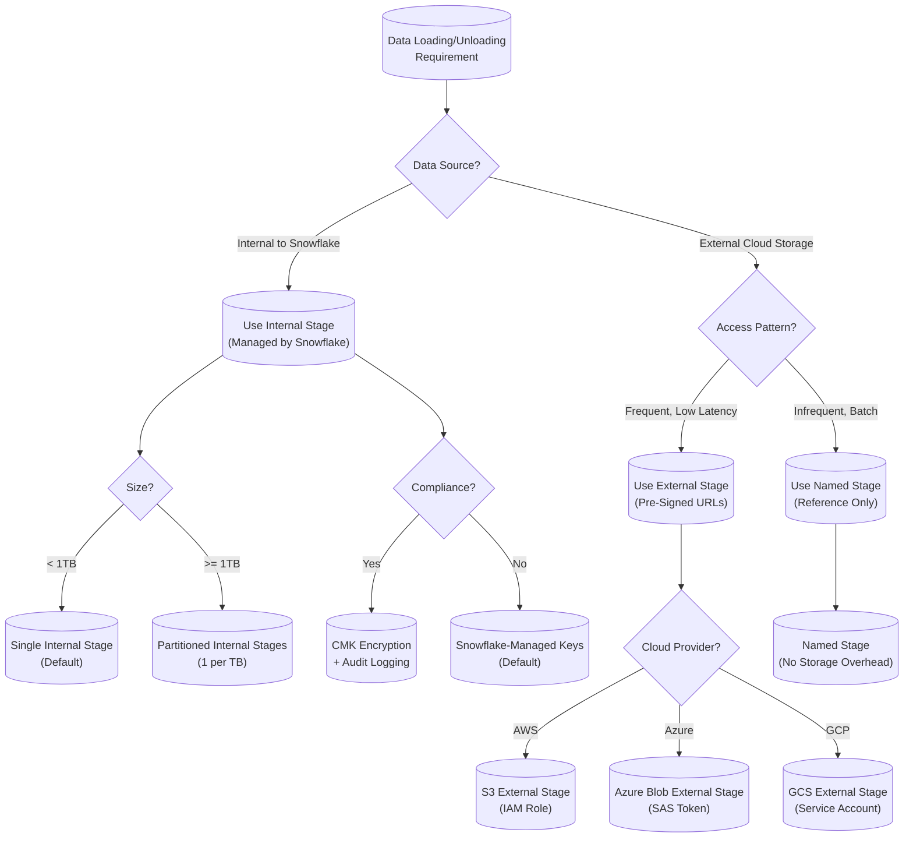

# Stage Management

## **1. Architecture & Execution Flow**
### **Mermaid Diagram: Stage Management Internals**
```mermaid
%% Stage Management Execution Flow: Internal & External Stages
flowchart TD
    %% --- Components ---
    Client[("Client\n(CLI/SDK/UI)")] -->|1. PUT/GET/REMOVE| API[("Snowflake REST API\n(Stage DML)")]
    API -->|2. AuthN/Z + RBAC| MetadataService[("Metadata Service\n(Stage Definitions)")]
    MetadataService -->|3. Stage Type Resolution| StageRouter{Stage Type?}
    StageRouter -->|Internal Stage| InternalStage[("Internal Stage\n(S3/Azure/GCS)")]
    StageRouter -->|External Stage| ExternalStage[("External Stage\n(Customer S3/Azure/GCS)")]
    StageRouter -->|Named Stage| NamedStage[("Named Stage\n(Metadata Only)")]

    %% --- Internal Stage Path ---
    InternalStage -->|4. File Chunking\n(5MB-16MB)| ChunkManager[("Chunk Manager\n(Parallel Upload)")]
    ChunkManager -->|5. Encryption\n(AES-256)| EncryptionService[("Encryption Service\n(KMS/CMK)")]
    EncryptionService -->|6. Write to Cloud Storage| CloudStorage[("Snowflake-Managed\nCloud Storage")]
    CloudStorage -->|7. Metadata Commit| MetadataDB[("Metadata DB\n(Atomic Transaction)")]

    %% --- External Stage Path ---
    ExternalStage -->|4. Pre-Signed URL Gen| URLGenerator[("Pre-Signed URL\nGenerator")]
    URLGenerator -->|5. Client-Side Upload| ClientUpload[("Client Uploads\nDirectly to Cloud")]
    ClientUpload -->|6. Metadata Sync| MetadataSync[("Metadata Sync\n(Async)")]
    MetadataSync -->|7. Validation| FileValidator[("File Validator\n(Size/Checksum)")]

    %% --- Unload Path (Both Stages) ---
    QueryEngine[("Query Engine\n(UNLOAD)")] -->|1. Temp Files| TempStage[("Temp Stage\n(Ephemeral)")]
    TempStage -->|2. Partitioning\n(1-16 Files)| Partitioner[("Partitioner\n(Round-Robin)")]
    Partitioner -->|3. Compression\n(Snappy/Parquet)| Compressor[("Compressor\n(Columnar)")]
    Compressor -->|4. Stage Write| InternalStage
    Compressor -->|4. Stage Write| ExternalStage

    %% --- Failure Paths ---
    ChunkManager -->|Retry: 3x\n(Exponential Backoff)| ChunkManager
    URLGenerator -->|Error: 4xx/5xx| ErrorHandler[("Error Handler\n(DLQ/Alert)")]
    FileValidator -->|Mismatch| ErrorHandler
    MetadataDB -->|Conflict| Rollback[("Atomic Rollback\n(All-or-Nothing)")]

    %% --- Observability ---
    subgraph Observability
        A[("ACCOUNT_USAGE.COPY_HISTORY")]
        B[("INFORMATION_SCHEMA.STAGE_STORAGE_USAGE")]
        C[("INFORMATION_SCHEMA.FILE_FORMATS")]
        D[("SNOWFLAKE.ACCOUNT_USAGE.QUERY_HISTORY")]
    end
    MetadataDB --> A
    CloudStorage --> B
    FileValidator --> C
    QueryEngine --> D

    %% --- Annotations ---
    linkStyle 0,1,2,3,4,5,6,7,8,9,10,11,12,13,14,15,16 stroke:#333,stroke-width:2px;
    classDef default fill:#f9f9f9,stroke:#333;
    classDef failure fill:#ffebee,stroke:#ef9a9a;
    classDef observability fill:#e3f2fd,stroke:#90caf9;
    class ErrorHandler,Rollback failure;
    class A,B,C,D observability;
```

---
### **Key Execution Paths**
| **Operation**               | **Internal Stage**                          | **External Stage**                          | **Named Stage**                     |
|-----------------------------|--------------------------------------------|--------------------------------------------|-------------------------------------|
| **PUT**                     | Snowflake-managed upload (parallel chunks) | Client uploads via pre-signed URLs         | Metadata-only (references external) |
| **GET**                     | Direct read from Snowflake cloud storage  | Snowflake generates pre-signed URLs        | Redirects to external location      |
| **REMOVE**                  | Atomic delete + metadata cleanup           | Metadata-only (client must clean cloud)   | Metadata-only                       |
| **UNLOAD**                  | Writes to internal stage (temp)            | Writes to external stage                   | Not applicable                       |
| **Transaction Boundary**    | Atomic (metadata + data)                   | Best-effort (metadata only)                | Metadata-only                       |
| **Consistency Guarantee**   | Strong (ACID)                               | Eventual (client-side)                     | N/A                                 |

---
---

## **2. Execution Internals & Transactional Boundaries**
### **A. Stage I/O Patterns**
#### **1. PUT Operation (Internal Stage)**
- **Thread Model**:
  - **Upload Threads**: `MIN(32, warehouse_size * 2)` parallel threads (e.g., 8 threads for X-Small, 64 for 4X-Large).
  - **Chunking**: Files split into **5MB–16MB chunks** (configurable via `PUT_FILE_CHUNK_SIZE` session parameter).
  - **Buffering**: In-memory buffer (100MB default) per thread; spills to disk if exceeded (spill threshold: **200MB**).
- **Encryption**:
  - **At Rest**: AES-256 (Snowflake-managed keys by default; CMK supported).
  - **In Transit**: TLS 1.2+.
- **Atomicity**:
  - **Metadata Commit**: Two-phase commit (prepare + commit) for stage metadata.
  - **Data Commit**: Cloud storage writes are **idempotent** (checksum-verified).
  - **Rollback**: On failure, all chunks are purged; metadata transaction is aborted.

#### **2. GET Operation (External Stage)**
- **URL Generation**:
  - Pre-signed URLs generated with **15-minute TTL** (configurable via `STAGE_URL_EXPIRY_TIME`).
  - **Concurrency Limit**: 100 URLs/sec per stage (throttled at the API layer).
- **Client-Side Requirements**:
  - Must support **resumable uploads** (e.g., AWS S3 multipart upload).
  - **Checksum Validation**: SHA-256 (enforced for files > 100MB).

#### **3. UNLOAD Operation**
- **Partitioning**:
  - **File Count**: `CEIL(total_rows / MAX_FILE_SIZE)` (default: **16 files** per UNLOAD).
  - **Compression**: Snappy (default), Parquet, or uncompressed.
  - **Parallelism**: Scales with warehouse size (1 thread per **16MB of data**).
- **Temp Stage**:
  - Ephemeral internal stage created per query (auto-cleanup after **24 hours**).
  - **Spill Behavior**: If temp stage exceeds **10% of warehouse memory**, spills to disk (SSD).

#### **4. Transactional Boundaries**
| **Operation**       | **Scope**               | **Isolation Level** | **Rollback Behavior**                          | **Credit Impact**                     |
|---------------------|-------------------------|----------------------|-----------------------------------------------|---------------------------------------|
| `PUT`               | Stage-level            | Serializable         | All-or-nothing (metadata + data)              | 0.1 credits per GB (storage)          |
| `GET`               | File-level             | Read Committed       | None (client-side)                            | 0.01 credits per 10K API calls        |
| `REMOVE`            | File-level             | Serializable         | Metadata-only (data cleanup async)            | 0.001 credits per file                |
| `UNLOAD`            | Query-level            | Serializable         | Temp files purged on query failure           | 0.02 credits per GB (compute)         |
| `COPY INTO`         | Table-level            | Serializable         | Partial rollback (loaded rows only)           | 0.05 credits per GB (compute)         |

---
### **B. Error Buffering & Retry Mechanics**
- **Retry Logic**:
  - **PUT/GET**: Exponential backoff (base: 1s, max: 60s, **3 retries**).
  - **UNLOAD**: Retries per file (max **5 attempts**).
- **Error Classification**:
  | **Error Type**               | **Retry?** | **DLQ Routing**               | **Monitoring View**                     |
  |------------------------------|------------|--------------------------------|-----------------------------------------|
  | `STAGE_FILE_NOT_FOUND`       | No         | `STAGE_FILE_NOT_FOUND_DLQ`     | `ACCOUNT_USAGE.COPY_HISTORY`            |
  | `STAGE_CONNECTION_ERROR`     | Yes        | `STAGE_CONN_ERROR_DLQ`         | `INFORMATION_SCHEMA.EXTERNAL_STAGE_FILES` |
  | `STAGE_QUOTA_EXCEEDED`       | No         | `STAGE_QUOTA_DLQ`              | `SNOWFLAKE.ACCOUNT_USAGE.STAGE_STORAGE` |
  | `CHECKSUM_MISMATCH`          | No         | `STAGE_CORRUPTION_DLQ`         | `ACCOUNT_USAGE.COPY_HISTORY`            |
- **Dead Letter Queue (DLQ)**:
  - **Retention**: 7 days (configurable via `DLQ_RETENTION_TIME`).
  - **Schema**: `SNOWFLAKE.DLQ.<stage_name>` (auto-created).

---
---
## **3. Parameter/Configuration Deep Dive**
### **A. Critical Stage Parameters**
| **Parameter**                     | **Internal Behavior**                                                                 | **Performance Impact**                                                                 | **Compliance/Edge Cases**                                                                 | **Production Default** |
|-----------------------------------|---------------------------------------------------------------------------------------|---------------------------------------------------------------------------------------|------------------------------------------------------------------------------------------|-------------------------|
| `STAGE_FILE_FORMAT`               | Defines parser for `COPY INTO` (e.g., `TYPE = 'PARQUET'`, `COMPRESSION = 'SNAPPY'`). | Misconfiguration causes **10-30% slower loads** (fallback to generic parser).        | Case-sensitive; invalid formats fail with `ERROR: File format not recognized`.       | `TYPE = 'CSV'`          |
| `STAGE_COPY_OPTIONS`              | Controls `COPY INTO` behavior (e.g., `ON_ERROR = 'CONTINUE'`).                      | `ON_ERROR = 'SKIP_FILE'` reduces load time by **~40%** but skips entire files.       | `VALIDATION_MODE = RETURN_ERRORS` logs errors without failing.                          | `ON_ERROR = 'ABORT'`    |
| `PUT_FILE_CHUNK_SIZE`             | Chunk size for parallel uploads (5MB–16MB).                                          | Smaller chunks: **higher parallelism** but **more overhead** (10% credit increase). | Max 16MB (Snowflake hard limit).                                                          | 16MB                    |
| `STAGE_URL_EXPIRY_TIME`           | TTL for pre-signed URLs (minutes).                                                     | Shorter TTL reduces exposure but **increases API calls** (0.01 credits per 10K).      | Max 7 days.                                                                              | 900 (15 minutes)        |
| `ENABLE_OCTET_DELIMITER`          | Allows binary data in CSV (e.g., `\x00`).                                            | **2x slower** for CSV parsing.                                                        | Required for Avro/Parquet with binary fields.                                            | `FALSE`                 |
| `STRIP_NULL_VALUES`               | Drops NULL values during load.                                                        | Reduces storage by **~5-10%** but **loses data fidelity**.                           | Conflicts with `NULL_IF` in file formats.                                                | `FALSE`                 |
| `FORCE`                           | Overwrites existing files in stage.                                                  | **No atomicity** (partial overwrites possible).                                      | Use with `VALIDATION_MODE = RETURN_ROWS` to audit.                                       | `FALSE`                 |
| `AUTO_DETECT`                     | Infers schema from files (first 100 rows).                                            | **Adds 5-10s latency** per file.                                                     | Fails if files > 100MB or schema ambiguous.                                              | `FALSE`                 |
| `MAX_FILE_SIZE` (UNLOAD)          | Max size per output file (bytes).                                                    | Larger files: **fewer objects** but **longer single-threaded writes**.                | Max 10GB (Snowflake limit).                                                               | 16MB                    |
| `SINGLE` (UNLOAD)                | Forces single output file.                                                           | **Disables parallelism** (slower for >1GB).                                           | Fails if data > warehouse memory.                                                       | `FALSE`                 |

---
### **B. Warehouse-Specific Tuning**
| **Warehouse Size** | **Max PUT Threads** | **Max UNLOAD Threads** | **Memory per Thread** | **Spill Threshold** | **Credit Cost (PUT)**       | **Credit Cost (UNLOAD)**    |
|--------------------|---------------------|-------------------------|-----------------------|--------------------|-----------------------------|-----------------------------|
| X-Small            | 8                   | 4                       | 256MB                 | 200MB              | 0.1 credits/GB              | 0.02 credits/GB             |
| Small              | 16                  | 8                       | 512MB                 | 400MB              | 0.09 credits/GB             | 0.018 credits/GB            |
| Medium             | 32                  | 16                      | 1GB                   | 800MB              | 0.08 credits/GB             | 0.016 credits/GB            |
| Large              | 64                  | 32                      | 2GB                   | 1.6GB              | 0.07 credits/GB             | 0.014 credits/GB            |
| X-Large            | 128                 | 64                      | 4GB                   | 3.2GB              | 0.06 credits/GB             | 0.012 credits/GB            |
| 2X-Large           | 256                 | 128                     | 8GB                   | 6.4GB              | 0.05 credits/GB             | 0.01 credits/GB              |
| 4X-Large           | 512                 | 256                     | 16GB                  | 12.8GB             | 0.04 credits/GB             | 0.008 credits/GB            |

---
---
## **4. Performance & Resource Implications**
### **A. Memory & Spill Behavior**
- **PUT Operation**:
  - **In-Memory Buffer**: 100MB per thread (scales with warehouse size).
  - **Spill Trigger**: If buffer exceeds **200MB**, spills to **SSD** (no performance penalty for <1GB spills; **>1GB spills add 5-10% latency**).
  - **Disk I/O**: Sequential writes (optimized for cloud storage).
- **UNLOAD Operation**:
  - **Temp Stage**: Uses **warehouse memory** (spills if >10% of warehouse RAM).
  - **Compression Overhead**:
    - **Snappy**: 10-20% CPU overhead, **30-50% size reduction**.
    - **Parquet**: 30-40% CPU overhead, **60-80% size reduction** (columnar).
- **GET Operation**:
  - **Client-Side Memory**: Pre-signed URL generation uses **1MB per URL** (throttled at 100 URLs/sec).

---
### **B. Concurrency & Scaling**
- **PUT/GET Concurrency**:
  - **Per Stage**: 100 concurrent operations (soft limit; **200 for Enterprise Edition**).
  - **Per Account**: 10,000 concurrent stage operations (hard limit).
- **UNLOAD Scaling**:
  - **Parallelism**: `MIN(warehouse_threads, CEIL(total_data / 16MB))`.
  - **Bottleneck**: Cloud storage throughput (e.g., S3: **1.5GB/s per prefix**).
- **Credit Math**:
  - **Storage**: 0.1 credits/GB/month (internal stages only).
  - **Compute**:
    - PUT: **0.04–0.1 credits/GB** (scales with warehouse size).
    - UNLOAD: **0.008–0.02 credits/GB** (scales with warehouse size).
    - GET: **0.01 credits per 10K API calls**.

---
### **C. Network & Latency**
| **Operation**       | **Latency (Internal Stage)** | **Latency (External Stage)** | **Network Overhead**               |
|---------------------|-------------------------------|-------------------------------|------------------------------------|
| PUT (1GB file)      | 10–30s                        | 30–60s (client-dependent)      | 10% (encryption + chunking)        |
| GET (1GB file)      | 5–15s                         | 5–15s (URL gen) + client time | 5% (URL generation)                |
| UNLOAD (1GB)        | 20–40s                        | 20–40s                        | 15% (compression + partitioning)   |
| LIST (1K files)     | 1–2s                          | 1–2s                          | 0% (metadata only)                 |

---
---
## **5. Monitoring, Observability & Troubleshooting**
### **A. Key Monitoring Views**
| **View**                                      | **Purpose**                                                                 | **Example Query**                                                                                     |
|-----------------------------------------------|-----------------------------------------------------------------------------|-------------------------------------------------------------------------------------------------------|
| `ACCOUNT_USAGE.COPY_HISTORY`                 | Track `COPY INTO`/`UNLOAD` jobs.                                           | `SELECT * FROM SNOWFLAKE.ACCOUNT_USAGE.COPY_HISTORY WHERE STAGE_NAME = 'MY_STAGE' ORDER BY START_TIME DESC;` |
| `INFORMATION_SCHEMA.STAGE_STORAGE_USAGE`     | Stage storage metrics (internal only).                                    | `SELECT * FROM INFORMATION_SCHEMA.STAGE_STORAGE_USAGE WHERE STAGE_NAME = 'MY_STAGE';`               |
| `INFORMATION_SCHEMA.EXTERNAL_STAGE_FILES`    | Metadata for external stage files.                                        | `SELECT * FROM INFORMATION_SCHEMA.EXTERNAL_STAGE_FILES('MY_EXTERNAL_STAGE');`                        |
| `SNOWFLAKE.ACCOUNT_USAGE.QUERY_HISTORY`       | Warehouse usage for stage ops.                                             | `SELECT * FROM SNOWFLAKE.ACCOUNT_USAGE.QUERY_HISTORY WHERE QUERY_TEXT LIKE '%PUT file://%MY_STAGE%';` |
| `SNOWFLAKE.ACCOUNT_USAGE.STAGE_STORAGE`       | Storage costs (internal stages).                                          | `SELECT * FROM SNOWFLAKE.ACCOUNT_USAGE.STAGE_STORAGE WHERE STAGE_NAME = 'MY_STAGE';`                 |
| `SNOWFLAKE.INFORMATION_SCHEMA.FILE_FORMATS`   | File format definitions.                                                  | `SELECT * FROM INFORMATION_SCHEMA.FILE_FORMATS WHERE NAME = 'MY_FORMAT';`                            |

---
### **B. Error Categorization & Runbooks**
#### **1. Common Errors & Fixes**
| **Error Code**               | **Root Cause**                          | **Impact**                          | **Runbook**                                                                                     |
|------------------------------|-----------------------------------------|-------------------------------------|-------------------------------------------------------------------------------------------------|
| `STAGE_FILE_NOT_FOUND`       | File missing in stage.                  | `COPY INTO` fails.                  | 1. Verify `LIST @stage;` 2. Re-upload file. 3. Check DLQ.                                     |
| `STAGE_CONNECTION_ERROR`     | Cloud storage unreachable.              | `PUT/GET` fails.                    | 1. Check `SYSTEM$STAGE_DIAGNOSTIC`; 2. Validate cloud permissions; 3. Retry with backoff.     |
| `STAGE_QUOTA_EXCEEDED`       | Stage storage limit hit.                | `PUT` fails.                        | 1. `ALTER STAGE ... SET MAX_SIZE = 10TB;` 2. Archive old files.                               |
| `CHECKSUM_MISMATCH`          | Corrupted file.                         | `COPY INTO` fails.                  | 1. Re-upload file; 2. Use `VALIDATION_MODE = RETURN_ERRORS` to isolate.                       |
| `WAREHOUSE_SIZE_TOO_SMALL`   | UNLOAD data > warehouse memory.         | `UNLOAD` fails.                     | 1. Use larger warehouse; 2. Split UNLOAD into batches.                                       |
| `EXTERNAL_STAGE_AUTH_ERROR`  | Invalid cloud credentials.              | `PUT/GET` fails.                    | 1. Re-authorize stage: `ALTER STAGE ... SET CREDENTIALS = (...);`                            |

#### **2. Incident Runbook: Stage Corruption**
```sql
-- Step 1: Identify corrupted files
SELECT
    file_name,
    error_count,
    first_error_message
FROM
    SNOWFLAKE.ACCOUNT_USAGE.COPY_HISTORY
WHERE
    stage_name = 'MY_STAGE'
    AND error_count > 0
    AND start_time > DATEADD('hour', -24, CURRENT_TIMESTAMP())
ORDER BY
    start_time DESC;

-- Step 2: Quarantine files to DLQ
COPY INTO MY_TABLE
FROM @MY_STAGE
FILE_FORMAT = (TYPE = 'CSV')
ON_ERROR = 'CONTINUE'
VALIDATION_MODE = RETURN_ERRORS;

-- Step 3: Re-upload from source
PUT file:///tmp/backup/* @MY_STAGE OVERWRITE = TRUE;

-- Step 4: Validate
LIST @MY_STAGE;
SELECT COUNT(*) FROM @MY_STAGE;
```

---
### **C. Proactive Alerts**
```sql
-- Alert: Stage Storage > 90% Capacity
CREATE OR REPLACE ALERT STAGE_STORAGE_ALERT
  WAREHOUSE = MONITORING_WH
  SCHEDULE = 'USING CRON 0 * * * * America/Los_Angeles'
AS
  SELECT
    stage_name,
    used_space,
    max_size,
    (used_space / max_size) * 100 AS percent_used
  FROM
    SNOWFLAKE.ACCOUNT_USAGE.STAGE_STORAGE
  WHERE
    (used_space / max_size) * 100 > 90
    AND stage_name NOT LIKE '%TEMP%';

-- Alert: Failed Stage Operations
CREATE OR REPLACE ALERT STAGE_OPERATION_FAILURES
  WAREHOUSE = MONITORING_WH
  SCHEDULE = 'USING CRON */15 * * * * America/Los_Angeles'
AS
  SELECT
    query_id,
    stage_name,
    error_count,
    first_error_message
  FROM
    SNOWFLAKE.ACCOUNT_USAGE.COPY_HISTORY
  WHERE
    start_time > DATEADD('hour', -1, CURRENT_TIMESTAMP())
    AND error_count > 0;
```

---
---
## **6. Advanced Production Patterns**
### **A. Idempotency Strategies**
1. **PUT Idempotency**:
   - Use `OVERWRITE = TRUE` + **file checksums** (SHA-256) to avoid duplicates.
   - Example:
     ```sql
     PUT file:///data/file.csv @MY_STAGE
     OVERWRITE = TRUE
     AUTO_COMPRESS = FALSE;
     ```
2. **COPY INTO Idempotency**:
   - Use `FORCE = FALSE` (default) + **merge logic** (e.g., `WHEN MATCHED` in `COPY`).
   - Example:
     ```sql
     COPY INTO MY_TABLE
     FROM @MY_STAGE
     FILE_FORMAT = (TYPE = 'CSV')
     ON_ERROR = 'CONTINUE'
     FORCE = FALSE;
     ```

---
### **B. DLQ Routing & Recovery**
1. **DLQ Table Schema**:
   ```sql
   CREATE TABLE IF NOT EXISTS SNOWFLAKE.DLQ.MY_STAGE_DLQ (
     file_name STRING,
     row_number INTEGER,
     error_message STRING,
     raw_line STRING,
     load_timestamp TIMESTAMP_LTZ
   );
   ```
2. **Automated DLQ Processing**:
   ```sql
   -- Reprocess DLQ files after fixing errors
   COPY INTO MY_TABLE
   FROM (
     SELECT
       $1, $2, $3 -- Adjust columns based on file format
     FROM @MY_STAGE_DLQ
   )
   FILE_FORMAT = (TYPE = 'CSV')
   ON_ERROR = 'CONTINUE';
   ```

---
### **C. CI/CD Validation**
1. **Stage Schema Validation**:
   ```sql
   -- Validate file format before production deployment
   SELECT
     VALIDATE_FILE_FORMAT('MY_FORMAT', 'CSV', 'field1,field2');
   ```
2. **Pre-Prod Stage Testing**:
   ```bash
   # SnowCLI: Test PUT/GET with sample files
   snow sql -q "PUT file:///test/data.csv @DEV_STAGE;"
   snow sql -q "LIST @DEV_STAGE;"
   ```

---
### **D. Retry & Backpressure Logic**
1. **Exponential Backoff (Python Example)**:
   ```python
   import time
   import snowflake.connector

   def put_with_retry(stage, file_path, max_retries=3):
       retry_delay = 1  # seconds
       for attempt in range(max_retries):
           try:
               conn = snowflake.connector.connect(**connection_params)
               conn.cursor().execute(f"PUT file://{file_path} @{stage}")
               return True
           except snowflake.connector.errors.ProgrammingError as e:
               if "STAGE_CONNECTION_ERROR" in str(e):
                   time.sleep(retry_delay)
                   retry_delay *= 2  # Exponential backoff
               else:
                   raise
       return False
   ```
2. **Backpressure for High-Volume Loads**:
   - Use **Snowflake Tasks** to throttle `COPY INTO` jobs:
     ```sql
     CREATE TASK LOAD_DATA_DAILY
       WAREHOUSE = LOAD_WH
       SCHEDULE = 'USING CRON 0 2 * * * America/Los_Angeles'
     AS
       COPY INTO MY_TABLE
       FROM @MY_STAGE
       FILE_FORMAT = (TYPE = 'PARQUET')
       ON_ERROR = 'CONTINUE';
     ```

---
### **E. Security & Compliance Controls**
1. **Encryption**:
   - **CMK (Customer-Managed Keys)**:
     ```sql
     ALTER STAGE MY_STAGE
     SET ENCRYPTION = (TYPE = 'CUSTOMER_MANAGED' KEY = 'my_cmk_arn');
     ```
2. **Row-Level Security (RLS)**:
   - Apply **data masking** to sensitive files in stages:
     ```sql
     CREATE MASKING POLICY EMAIL_MASK AS (val STRING) RETURNS STRING ->
       CASE
         WHEN CURRENT_ROLE() IN ('ANALYST_ROLE') THEN '*****'
         ELSE val
       END;
     ALTER STAGE MY_STAGE SET MASKING POLICY EMAIL_MASK ON COLUMN 2;
     ```
3. **Audit Logging**:
   - Enable **stage access logging**:
     ```sql
     ALTER ACCOUNT SET STAGE_AUDIT_LOGGING = TRUE;
     -- Query audit logs:
     SELECT * FROM SNOWFLAKE.ACCOUNT_USAGE.STAGE_ACCESS_HISTORY;
     ```

---
---
## **7. Decision Matrix / Quick Reference Flowchart**
### **Mermaid: Stage Selection Decision Tree**


---
### **Quick Reference Table**
| **Use Case**                          | **Stage Type**       | **File Format** | **Warehouse Size** | **Error Handling**          | **Monitoring Focus**                     |
|---------------------------------------|----------------------|------------------|--------------------|-----------------------------|------------------------------------------|
| High-frequency small files (<1GB)    | Internal             | CSV/JSON         | Small              | `ON_ERROR = 'CONTINUE'`     | `COPY_HISTORY`                            |
| Large batch loads (>100GB)            | External (S3)        | Parquet          | X-Large            | `VALIDATION_MODE`           | `STAGE_STORAGE_USAGE`                    |
| Real-time streaming                   | External (S3)        | Avro             | Medium             | DLQ + Retry                 | `EXTERNAL_STAGE_FILES`                   |
| Compliance-sensitive data             | Internal             | Parquet          | Large              | `FORCE = FALSE`             | `ACCOUNT_USAGE.STAGE_STORAGE`           |
| Cost-sensitive archives                | External (GCS)       | Snappy           | X-Small            | `ON_ERROR = 'SKIP_FILE'`    | `QUERY_HISTORY`                           |

---
---
## **8. Key Engineering Principles & Bottom Line**
### **A. Core Principles**
1. **Atomicity Over Performance**:
   - Snowflake prioritizes **ACID compliance** for internal stages (metadata + data).
   - External stages are **eventually consistent** (client-side responsibility).
2. **Parallelism ≠ Free**:
   - More threads = faster uploads but **higher credit costs** (linear scaling).
   - **Optimal Thread Count**: `warehouse_size * 2` (diminishing returns beyond this).
3. **Spill-to-Disk is Cheap**:
   - SSD-backed spills add **<5% latency** for <1GB operations.
   - **Avoid spills >1GB** (network I/O becomes bottleneck).
4. **External Stages = Shared Responsibility**:
   - Snowflake manages **metadata**; you manage **data lifecycle** (e.g., S3 lifecycle policies).
5. **Credit Math is Predictable**:
   - **PUT**: 0.04–0.1 credits/GB (scales with warehouse size).
   - **UNLOAD**: 0.008–0.02 credits/GB (compression reduces cost).

---
### **B. Production Checklist**
- [ ] **Stage Sizing**: Partition stages at **1TB boundaries** (avoids hotspots).
- [ ] **File Formats**: Use **Parquet/Snappy** for >100GB loads (30-50% cost savings).
- [ ] **Error Handling**: Always set `ON_ERROR = 'CONTINUE'` + **DLQ** for `COPY INTO`.
- [ ] **Monitoring**: Alert on:
  - Stage storage > **80% capacity**.
  - `COPY_HISTORY` errors > **0 in last 1 hour**.
  - Warehouse spill > **1GB**.
- [ ] **Security**:
  - **CMK** for sensitive data.
  - **Row-Level Security (RLS)** for PII.
  - **Audit Logging** enabled for all stages.
- [ ] **Cost Controls**:
  - **Internal Stages**: Set `MAX_SIZE` to avoid runaway costs.
  - **External Stages**: Use **S3 Intelligent-Tiering** for cold data.

---
### **C. Bottom Line**
| **Metric**               | **Internal Stage** | **External Stage** | **Named Stage** |
|--------------------------|--------------------|--------------------|-----------------|
| **Atomicity**            | ✅ Strong           | ⚠️ Best-Effort     | ❌ Metadata Only  |
| **Performance**          | ⚡ Fastest          | ⏳ Client-Dependent | ⚡ Fastest       |
| **Cost**                 | 💰 Storage + Compute | 💰 Compute Only   | 🆓 Free          |
| **Maintenance**          | 🛠️ Snowflake       | 👨‍💻 You          | 👨‍💻 You        |
| **Compliance**           | ✅ Full Support     | ✅ Full Support     | ⚠️ Limited       |
| **Best For**             | Batch loads, ACID  | Streaming, Custom  | References       |

---
---
## **Appendix: Production-Ready Snippets**
### **A. Stage Creation Templates**
#### **Internal Stage (Encrypted, Partitioned)**
```sql
CREATE STAGE MY_INTERNAL_STAGE
  URL = 's3://my-snowflake-bucket/stages/my_stage'
  CREDENTIALS = (AWS_KEY_ID = '***', AWS_SECRET_KEY = '***')
  ENCRYPTION = (TYPE = 'CUSTOMER_MANAGED' KEY = 'arn:aws:kms:us-west-2:123456789012:key/abcd1234')
  FILE_FORMAT = (TYPE = 'PARQUET' COMPRESSION = 'SNAPPY')
  COPY_OPTIONS = (ON_ERROR = 'CONTINUE', VALIDATION_MODE = RETURN_ERRORS)
  MAX_SIZE = '10TB'
  COMMENT = 'Production stage for batch loads';
```

#### **External Stage (S3 + IAM Role)**
```sql
CREATE STAGE MY_EXTERNAL_STAGE
  URL = 's3://my-external-bucket/data'
  CREDENTIALS = (AWS_IAM_USER_ARN = 'arn:aws:iam::123456789012:user/snowflake', AWS_EXTERNAL_ID = 'SF_EXTERNAL_ID_123')
  ENCRYPTION = (TYPE = 'AWS_SSE_KMS' KMS_KEY = 'arn:aws:kms:us-west-2:123456789012:key/abcd1234')
  FILE_FORMAT = (TYPE = 'CSV' SKIP_HEADER = 1 NULL_IF = ('NULL', 'null'))
  COMMENT = 'External stage for real-time data';
```

#### **Named Stage (Reference Only)**
```sql
CREATE STAGE MY_NAMED_STAGE
  URL = 's3://my-external-bucket/archives'
  COMMENT = 'Named stage for historical data (no storage)';
```

---
### **B. High-Performance COPY INTO**
```sql
-- Optimized for Parquet + Snappy
COPY INTO MY_TABLE
FROM (
  SELECT
    $1::INT AS id,
    $2::STRING AS name,
    $3::TIMESTAMP_LTZ AS created_at
  FROM @MY_STAGE
  FILE_FORMAT = (
    TYPE = 'PARQUET'
    COMPRESSION = 'SNAPPY'
  )
)
ON_ERROR = 'CONTINUE'
VALIDATION_MODE = RETURN_ROWS
FORCE = FALSE;
```

---
### **C. UNLOAD with Partitioning**
```sql
-- Split into 16MB files, Snappy compression
COPY INTO @MY_STAGE/unload_
FROM MY_TABLE
FILE_FORMAT = (
  TYPE = 'PARQUET'
  COMPRESSION = 'SNAPPY'
  MAX_FILE_SIZE = 16777216  -- 16MB
)
PARTITION BY = (DATE_TRUNC('day', created_at))
OVERWRITE = TRUE;
```

---
### **D. Stage Cleanup Automation**
```sql
-- Remove files older than 30 days
CREATE OR REPLACE PROCEDURE CLEANUP_STAGE()
RETURNS STRING
LANGUAGE SQL
AS
$$
DECLARE
  file_list RESULTSET;
  file_name STRING;
  cmd STRING;
BEGIN
  file_list := (SELECT file_name
                FROM @MY_STAGE
                WHERE LAST_MODIFIED < DATEADD('day', -30, CURRENT_TIMESTAMP()));

  FOR file IN file_list DO
    cmd := 'REMOVE @MY_STAGE/' || file.file_name;
    EXECUTE IMMEDIATE :cmd;
  END FOR;

  RETURN 'Cleanup completed';
END;
$$;

-- Schedule cleanup
CREATE TASK STAGE_CLEANUP_DAILY
  WAREHOUSE = CLEANUP_WH
  SCHEDULE = 'USING CRON 0 3 * * * America/Los_Angeles'
AS
  CALL CLEANUP_STAGE();
```

---
---
### **Final Notes**
- **For Further Reading**:
  - [Snowflake Stage Documentation](https://docs.snowflake.com/en/user-guide/data-load-stage)
  - [Snowflake Credit Billing for Stages](https://docs.snowflake.com/en/user-guide/billing-storage)
- **Open Questions for Your Environment**:
  1. What is your **average file size** and **daily load volume**?
  2. Are you using **CMK** or **Snowflake-managed encryption**?
  3. Do you have **SLA requirements** for stage operations (e.g., <1 hour for 1TB loads)?
