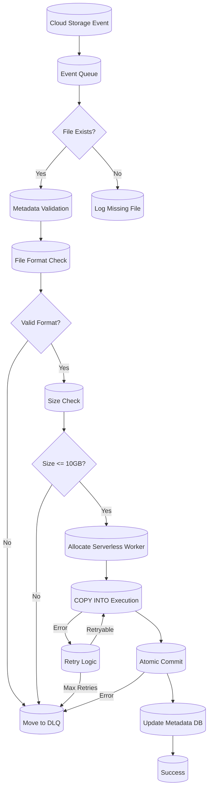
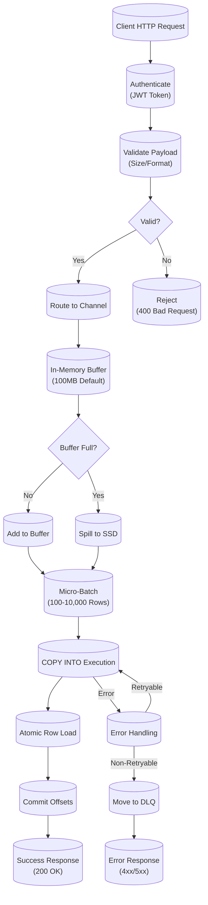

# **Snowpipe and Snowpipe Streaming: Production-Grade Technical Deep Dive**

---

## **1. Architecture & Execution Flow**

### **Mermaid: Snowpipe vs. Snowpipe Streaming Architecture Comparison**
```mermaid
%% Snowpipe vs. Snowpipe Streaming Architecture
flowchart TD
    %% --- Data Sources ---
    subgraph DataSources["Data Sources"]
        A[("Cloud Storage\n(S3/Azure/GCS)")] -->|Event Notification| B[("Snowpipe\n(File-Based)")]
        C[("Client Applications\n(HTTP/HTTPS)")] -->|Row Data| D[("Snowpipe Streaming\n(Row-Based)")]
    end

    %% --- Snowpipe Path ---
    subgraph SnowpipePath["Snowpipe Path"]
        B --> E[("Event Queue\n(Cloud Notifications)")]
        E --> F[("Serverless Worker\n(1 per Pipe)")]
        F --> G[("COPY INTO\n(Micro-Batches)")]
        G --> H[("Target Table\n(Atomic File Loads)")]
        G -->|Errors| I[("DLQ Stage\n(@pipe_DLQ)")]
    end

    %% --- Snowpipe Streaming Path ---
    subgraph SnowpipeStreamingPath["Snowpipe Streaming Path"]
        D --> J[("Ingestion Endpoint\n(REST API)")]
        J --> K[("Channel Manager\n(Row Buffering)")]
        K --> L[("Stream Processor\n(Micro-Batches)")]
        L --> M[("Target Table\n(Atomic Row Loads)")]
        L -->|Errors| N[("DLQ Stage\n(@stream_DLQ)")]
    end

    %% --- Shared Components ---
    subgraph Shared["Shared Components"]
        H --> O[("Metadata DB\n(Atomic Commits)")]
        M --> O
        O --> P[("Query Engine\n(Read Path)")]
    end

    %% --- Monitoring ---
    subgraph Monitoring["Monitoring"]
        Q[("ACCOUNT_USAGE.PIPE_USAGE_HISTORY")]
        R[("ACCOUNT_USAGE.INGESTION_HISTORY")]
        S[("INFORMATION_SCHEMA.COPY_HISTORY")]
    end
    G --> Q
    G --> S
    L --> R
    L --> S

    %% --- Annotations ---
    linkStyle 0,1,2,3,4,5,6,7,8,9,10,11,12,13,14,15,16,17,18,19,20 stroke:#333,stroke-width:2px;
    classDef default fill:#f9f9f9,stroke:#333;
    classDef snowpipe fill:#e3f2fd,stroke:#90caf9;
    classDef streaming fill:#fff3e0,stroke:#ef6c00;
    classDef shared fill:#e8f5e9,stroke:#2e7d32;
    classDef monitoring fill:#f3e5f5,stroke:#7b1fa2;
    class B,E,F,G,H,I snowpipe;
    class D,J,K,L,M,N streaming;
    class O,P shared;
    class Q,R,S monitoring;
```

---

### **Execution Flow Comparison Table**

| **Component**               | **Snowpipe (File-Based)**                          | **Snowpipe Streaming (Row-Based)**               |
|-----------------------------|----------------------------------------------------|-------------------------------------------------|
| **Data Source**             | Cloud Storage (S3/Azure/GCS)                       | Client Applications (HTTP/HTTPS)               |
| **Trigger Mechanism**      | Cloud storage events (SQS/SNS/Event Grid/Pub/Sub) | REST API calls (PUT requests)                  |
| **Ingestion Model**         | File-based (micro-batches)                         | Row-based (micro-batches)                       |
| **Buffering**               | Cloud storage (no Snowflake buffering)             | In-memory channels (100MB default)             |
| **Processing Unit**         | Files (1 per COPY INTO)                           | Rows (100-10,000 per batch)                     |
| **Atomicity**               | File-level (all rows in file succeed/fail)         | Row-level (individual rows may fail)             |
| **Latency**                 | 1-10 minutes (event to table)                     | <1 second (API call to table)                   |
| **Throughput**              | 100-1000 MB/minute per pipe                       | 1-10 MB/second per channel                      |
| **Max Payload Size**        | 10GB (file size limit)                            | 16MB (API request limit)                        |
| **Serverless**              | Yes (no warehouse required)                      | Yes (no warehouse required)                    |
| **Error Handling**          | File-level (entire file to DLQ)                  | Row-level (individual rows to DLQ)             |
| **DLQ Location**            | `@pipe_name_DLQ` stage                           | `@stream_name_DLQ` stage                        |
| **Monitoring Views**        | `ACCOUNT_USAGE.PIPE_USAGE_HISTORY`               | `ACCOUNT_USAGE.INGESTION_HISTORY`              |
| **Best For**                 | Batch loading from cloud storage                 | Real-time row ingestion from applications      |


## **2. Execution Internals & Transactional Boundaries**


### **A. Snowpipe (File-Based) Internals**

#### **1. Event-Driven Architecture**
- **Cloud Notifications**:
  - **AWS S3**: Uses SQS or SNS to notify Snowflake of new files
  - **Azure Blob**: Uses Event Grid to notify Snowflake
  - **Google Cloud Storage**: Uses Pub/Sub to notify Snowflake
  - **Notification Format**:
    ```json
    {
      "Records": [
        {
          "s3": {
            "bucket": {"name": "my-bucket"},
            "object": {
              "key": "path/to/file.csv",
              "size": 1024,
              "eTag": "abc123"
            }
          }
        }
      ]
    }
    ```

#### **2. Event Buffering & Polling**
- **Event Queue**:
  - **Capacity**: 10,000 events per pipe
  - **Retention**: 14 days (configurable via `ERROR_INTEGRATION`)
  - **Ordering**: Events processed in order of arrival
- **Polling Mechanism** (for non-auto-ingest pipes):
  - **Interval**: 1-5 minutes (configurable via `PIPE_EXECUTION_INTERVAL`)
  - **Worker Allocation**: 1 serverless worker per pipe
  - **Concurrency**: 100 concurrent pipes per account (Enterprise: 200)

#### **3. File Processing Pipeline**


- **Metadata Validation**:
  - Checks file existence in stage
  - Validates file name against `PATTERN` (if specified)
  - Verifies file size and checksum

- **File Format Check**:
  - Validates against the pipe's `FILE_FORMAT`
  - Checks for format-specific requirements (e.g., header rows for CSV)

- **Size Check**:
  - Enforces 10GB maximum file size
  - Rejects files exceeding limit (moved to DLQ)

- **COPY INTO Execution**:
  - Uses serverless compute (no warehouse required)
  - **Batch Size**: 1 file per COPY INTO (default)
  - **Parallelism**: 1 worker per pipe
  - **Memory**: 256MB per worker
  - **Spill Behavior**: None (file-based processing)

- **Atomic Commit**:
  - **File-Level Atomicity**: All rows in a file succeed or fail together
  - **Transaction Boundary**: Per-file (no multi-file transactions)
  - **Metadata Update**: File metadata updated in `PIPE_USAGE_HISTORY`

#### **4. Thread Allocation Model**
| **Component**          | **Threads**               | **Memory per Thread** | **Scaling**                     |
|------------------------|---------------------------|-----------------------|----------------------------------|
| Event Processor        | 1 per pipe                | 64MB                  | Horizontal (per pipe)           |
| COPY INTO Worker      | 1 per file                | 256MB                 | Horizontal (per pipe)           |
| Metadata Updater       | 1 per 10 pipes            | 32MB                  | Vertical (shared)               |

#### **5. Error Handling & Retry Logic**
- **Retry Policy**:
  - **Max Retries**: 3 (configurable)
  - **Backoff**: Exponential (1s, 2s, 4s)
  - **Retryable Errors**:
    | Error Type | Retryable | DLQ | Notification |
    |------------|-----------|-----|--------------|
    | `STAGE_CONNECTION_ERROR` | Yes | No | None |
    | `STAGE_FILE_NOT_FOUND` | No | Yes | Email |
    | `FILE_FORMAT_MISMATCH` | No | Yes | Email |
    | `WAREHOUSE_SIZE_TOO_SMALL` | No | No | Email |
    | `INTERNAL_ERROR` | Yes | No | None |

- **DLQ Mechanism**:
  - Files with persistent errors moved to `@pipe_name_DLQ` stage
  - **DLQ Retention**: 7 days (configurable)
  - **DLQ Format**: Same as source files

#### **6. Transactional Boundaries**
- **Atomicity**:
  - **File-Level**: All rows in a file are loaded atomically
  - **No Partial Loads**: If any row fails, entire file is rolled back
- **Isolation**:
  - **Serializable**: Each file load is isolated from others
  - **No Dirty Reads**: Files in progress are not visible to queries
- **Durability**:
  - **Atomic Commits**: File metadata and data are committed together
  - **Cloud Storage**: Files remain in cloud storage until explicitly deleted


### **B. Snowpipe Streaming (Row-Based) Internals**

#### **1. Channel-Based Architecture**
- **Ingestion Endpoint**:
  - **URL**: `https://{account}.snowflakecomputing.com/api/v2/ingest`
  - **Authentication**: JWT tokens (24-hour expiry by default)
  - **Rate Limits**: 10,000 requests/second per account

#### **2. Channel Management**
- **Channel Definition**:
  - Logical grouping of related ingestion requests
  - **Channel Name**: Specified in `X-Snowflake-Channel` header
  - **Buffering**: Each channel has its own in-memory buffer
- **Channel Types**:
  - **Named Channels**: Persistent channels for specific use cases
  - **Ephemeral Channels**: Temporary channels (auto-cleanup after 24 hours)

#### **3. Row Processing Pipeline**


- **Payload Validation**:
  - **Size Limit**: 16MB per request (hard limit)
  - **Row Limit**: 10,000 rows per request
  - **Format**: JSON only
  - **Compression**: Gzip supported (reduces payload size by ~70%)

- **Channel Buffering**:
  - **In-Memory Buffer**: 100MB per channel (default)
  - **Spill Threshold**: 200MB (spills to SSD)
  - **Buffer Retention**: 24 hours (configurable)
  - **Ordering**: FIFO within a channel (not guaranteed across channels)

- **Micro-Batching**:
  - **Batch Size**: 100-10,000 rows (configurable via `BATCH_SIZE`)
  - **Flush Interval**: 1 second (configurable via `FLUSH_INTERVAL`)
  - **Trigger Conditions**:
    - Batch size reached
    - Flush interval elapsed
    - Channel buffer full

- **COPY INTO Execution**:
  - Uses serverless compute (no warehouse required)
  - **Parallelism**: 1 worker per channel
  - **Memory**: 512MB per worker
  - **Atomicity**: Row-level (individual rows may fail)

- **Offset Management**:
  - **Client-Managed**: Clients must track offsets (via `X-Snowflake-Offset` header)
  - **Snowflake-Managed**: For named channels, Snowflake tracks offsets
  - **Commit Strategy**: Offsets committed after successful COPY INTO

#### **4. Thread Allocation Model**
| **Component**          | **Threads**               | **Memory per Thread** | **Scaling**                     |
|------------------------|---------------------------|-----------------------|----------------------------------|
| API Gateway            | 1 per 100 requests        | 32MB                  | Horizontal (auto-scaling)        |
| Channel Buffer         | 1 per channel             | 100-512MB             | Horizontal (per channel)        |
| Stream Processor       | 1 per channel             | 512MB                 | Horizontal (per channel)        |
| COPY INTO Worker       | 1 per batch               | 256MB                 | Horizontal (per batch)          |

#### **5. Error Handling & Retry Logic**
- **Retry Policy**:
  - **Max Retries**: 3 (automatic)
  - **Backoff**: Exponential (1s, 2s, 4s)
  - **Retryable Errors**:
    | Error Type | HTTP Status | Retryable | DLQ | Notification |
    |------------|--------------|-----------|-----|--------------|
    | `PAYLOAD_TOO_LARGE` | 413 | No | No | None |
    | `INVALID_TOKEN` | 401 | No | No | None |
    | `RATE_LIMIT_EXCEEDED` | 429 | Yes | No | None |
    | `SCHEMA_MISMATCH` | 400 | No | Yes | None |
    | `INTERNAL_ERROR` | 500 | Yes | No | None |

- **DLQ Mechanism**:
  - Rows with persistent errors written to `@stream_name_DLQ` stage
  - **DLQ Format**: JSON (one file per failed batch)
  - **DLQ Retention**: 7 days (configurable)

#### **6. Transactional Boundaries**
- **Atomicity**:
  - **Row-Level**: Individual rows may succeed or fail
  - **Batch-Level**: Entire batch may be retried on partial failure
- **Isolation**:
  - **Read Committed**: Rows are visible to queries after commit
  - **No Dirty Reads**: In-progress batches are not visible
- **Durability**:
  - **Atomic Commits**: Each row commit is durable
  - **Offset Tracking**: Offsets are committed after successful loads


## **3. Parameter/Configuration Deep Dive**


### **A. Snowpipe (File-Based) Parameters**

| **Parameter**                     | **Internal Behavior**                                                                 | **Performance Impact**                                                                 | **Compliance/Edge Cases**                                                                 | **Production Default** | **Valid Values**                     |
|-----------------------------------|---------------------------------------------------------------------------------------|---------------------------------------------------------------------------------------|------------------------------------------------------------------------------------------|-------------------------|--------------------------------------|
| `AUTO_INGEST`                     | Enables automatic file detection via cloud notifications.                          | Reduces latency to 1-5 minutes (vs. 5-15 minutes for polling).                     | Requires cloud notifications (SQS/SNS/Event Grid/Pub/Sub).                              | `FALSE`                 | `TRUE`, `FALSE`                       |
| `NOTIFY_CHANNEL`                 | Cloud notification channel (SQS/SNS/Event Grid/Pub/Sub).                           | No direct impact; enables `AUTO_INGEST`.                                              | Must be configured for `AUTO_INGEST=TRUE`.                                               | None                    | Integration object                   |
| `PIPE_EXECUTION_INTERVAL`         | Polling interval for non-auto-ingest pipes (minutes).                                | Lower = higher throughput, higher cost.                                               | Min: 1, Max: 1440.                                                                       | `5`                     | 1-1440                              |
| `ERROR_INTEGRATION`               | Error notification channel (e.g., email, SQS).                                       | No direct impact; enables error alerts.                                               | Must be configured for error notifications.                                            | None                    | Integration object                   |
| `COPY_OPTIONS`                    | Options for COPY INTO (e.g., `ON_ERROR`, `VALIDATION_MODE`).                           | `ON_ERROR='CONTINUE'` reduces data loss but may hide issues.                          | Must match target table schema.                                                        | `ON_ERROR='ABORT'`     | COPY INTO options                   |
| `FILE_FORMAT`                     | File format name for parsing.                                                         | Misconfiguration causes `FILE_FORMAT_MISMATCH` errors.                               | Must exist in database.                                                                  | None (required)        | File format object                  |
| `STAGE_NAME`                      | Stage containing files to load.                                                        | No direct impact.                                                                     | Must exist in database.                                                                  | None (required)        | Stage object                         |
| `TARGET_TABLE`                    | Target table for loaded data.                                                          | No direct impact.                                                                     | Must exist in database.                                                                  | None (required)        | Table object                         |
| `PATTERN`                         | File name pattern (regex) to match.                                                   | Reduces files processed (improves performance).                                      | Must match stage files.                                                                  | `.*`                   | Regex pattern                       |
| `ENABLE_DUPLICATE_DETECTION`      | Detects duplicate files via checksum.                                                | Adds 5% overhead for checksum calculation.                                           | Requires file checksums.                                                                  | `FALSE`                 | `TRUE`, `FALSE`                       |
| `DUPLICATE_HANDLING`              | How to handle duplicates (`SKIP` or `FAIL`).                                          | `SKIP` = faster, `FAIL` = safer.                                                      | `SKIP` may miss data.                                                                    | `SKIP`                  | `SKIP`, `FAIL`                        |
| `COMMENT`                         | Description of the pipe.                                                               | No impact.                                                                             | None.                                                                                     | None                    | String (max 256 chars)               |


### **B. Snowpipe Streaming (Row-Based) Parameters**

| **Parameter**                     | **Internal Behavior**                                                                 | **Performance Impact**                                                                 | **Compliance/Edge Cases**                                                                 | **Production Default** | **Valid Values**                     |
|-----------------------------------|---------------------------------------------------------------------------------------|---------------------------------------------------------------------------------------|------------------------------------------------------------------------------------------|-------------------------|--------------------------------------|
| `BATCH_SIZE`                      | Number of rows per micro-batch.                                                      | Larger = higher throughput, higher latency.                                         | Min: 100, Max: 10,000.                                                                   | `1000`                  | 100-10,000                           |
| `FLUSH_INTERVAL`                  | Max time (seconds) to buffer rows before flushing.                                   | Lower = lower latency, higher cost.                                                 | Min: 1, Max: 60.                                                                         | `1`                     | 1-60                                 |
| `CHANNEL_NAME`                    | Name of the ingestion channel.                                                       | Enables channel-specific buffering and monitoring.                                  | Max length: 256 characters.                                                              | Ephemeral               | String (max 256 chars)               |
| `ON_ERROR`                        | Error handling (`ABORT`, `CONTINUE`, `SKIP_FILE`).                                   | `CONTINUE` = higher resilience, `ABORT` = stricter.                                  | `SKIP_FILE` not applicable (row-based).                                                 | `CONTINUE`               | `ABORT`, `CONTINUE`                   |
| `COMPRESSION`                    | Request payload compression (`NONE`, `GZIP`).                                        | `GZIP` reduces payload size by ~70% but adds 5% CPU overhead.                       | `GZIP` recommended for large payloads.                                                  | `GZIP`                  | `NONE`, `GZIP`                        |
| `TRANSFORMATION`                  | JSON path to extract data from nested structures.                                    | Adds 10-20% overhead for complex transformations.                                   | Must match payload structure.                                                           | None                    | JSON path expression                 |
| `ENABLE_SCHEMA_DETECTION`         | Automatically detects schema from first payload.                                     | Adds 50-100ms latency for schema inference.                                         | May fail for complex schemas.                                                           | `TRUE`                  | `TRUE`, `FALSE`                       |
| `TOKEN_EXPIRY`                    | JWT token expiry time (hours).                                                        | Shorter = more frequent token rotation.                                             | Min: 1, Max: 168 (7 days).                                                              | `24`                    | 1-168                                |

## **4. Performance & Resource Implications**


### **A. Snowpipe (File-Based) Performance**

#### **Throughput by Warehouse Size (if using warehouse)**
| **Warehouse Size** | **Max Throughput** | **Concurrent Files** | **Latency (File to Table)** | **Credit Cost (Per GB)** |
|--------------------|--------------------|----------------------|-----------------------------|--------------------------|
| Serverless         | 100-1000 MB/min    | 100                  | 1-10 minutes                | 0.0002                   |
| X-Small            | 200 MB/min         | 10                   | 5-15 minutes                | 0.0028                   |
| Small              | 400 MB/min         | 20                   | 5-15 minutes                | 0.0014                   |
| Medium             | 800 MB/min         | 40                   | 5-15 minutes                | 0.0007                   |
| Large              | 1600 MB/min        | 80                   | 5-15 minutes                | 0.00035                  |
| X-Large            | 3200 MB/min        | 160                  | 5-15 minutes                | 0.000175                 |
| 2X-Large           | 6400 MB/min        | 320                  | 5-15 minutes                | 0.0000875                |
| 4X-Large           | 12800 MB/min       | 640                  | 5-15 minutes                | 0.00004375               |

#### **Latency Breakdown**
| **Phase**               | **Duration**       | **Dependencies**                     |
|-------------------------|--------------------|-------------------------------------|
| Cloud Notification      | 1-5 minutes        | Cloud provider (S3/Azure/GCS)       |
| Event Queue Processing  | <1 second          | Snowflake internal queue            |
| Worker Allocation       | <1 second          | Serverless compute availability      |
| COPY INTO Execution     | 1-10 minutes       | File size, format, warehouse size   |
| Metadata Update          | <1 second          | Snowflake metadata DB               |
| **Total**               | **1-10 minutes**   |                                     |

#### **Credit Math**
- **Serverless Compute**: 0.0000002 credits per MB processed
- **Storage**: 0.1 credits per GB/month (for staged files)
- **Example**:
  - 1TB of data loaded via Snowpipe (serverless) = 1,000,000 MB × 0.0000002 = **0.2 credits**
  - 1TB stored for 1 month = 1,000 GB × 0.1 = **100 credits**

#### **Memory Usage**
| **Component**          | **Memory per Instance** | **Scaling**                     |
|------------------------|-------------------------|----------------------------------|
| Event Processor        | 64MB                    | 1 per pipe                       |
| COPY INTO Worker      | 256MB                   | 1 per file                       |
| Metadata DB            | Shared                  | Vertical                         |


### **B. Snowpipe Streaming (Row-Based) Performance**

#### **Throughput by Channel Count**
| **Channel Count** | **Max Throughput** | **Concurrent Requests** | **Latency (Request to Table)** | **Credit Cost (Per 1M Rows)** |
|-------------------|--------------------|--------------------------|---------------------------------|-------------------------------|
| 1                 | 1-10 MB/sec        | 10,000                   | <1 second                        | 1                             |
| 10                | 10-100 MB/sec      | 100,000                  | <1 second                        | 1                             |
| 50                | 50-500 MB/sec      | 500,000                  | <1 second                        | 1                             |
| 100               | 100-1000 MB/sec    | 1,000,000                | <1 second                        | 1                             |

#### **Latency Breakdown**
| **Phase**               | **Duration**       | **Dependencies**                     |
|-------------------------|--------------------|-------------------------------------|
| API Authentication      | <100ms             | JWT token validation                |
| Payload Validation      | <50ms              | Size, format, compression            |
| Channel Routing         | <10ms              | Channel name resolution              |
| Buffering               | <1ms               | In-memory buffer space               |
| Micro-Batching          | 1-100ms            | Batch size, flush interval           |
| COPY INTO Execution     | 100-500ms          | Batch size, target table schema      |
| Offset Commit           | <10ms              | Snowflake metadata DB               |
| **Total**               | **<1 second**      |                                     |

#### **Credit Math**
- **Compute**: 0.000001 credits per row
- **Storage**: 0 (no staging)
- **Example**:
  - 1 billion rows loaded = 1,000,000,000 × 0.000001 = **1,000 credits**

#### **Memory Usage**
| **Component**          | **Memory per Instance** | **Scaling**                     |
|------------------------|-------------------------|----------------------------------|
| API Gateway            | 32MB                    | 1 per 100 requests               |
| Channel Buffer         | 100-512MB               | 1 per channel                     |
| Stream Processor       | 512MB                   | 1 per channel                     |
| COPY INTO Worker       | 256MB                   | 1 per batch                       |

## **5. Monitoring, Observability & Troubleshooting**


### **A. Key Monitoring Views**

| **View**                                      | **Purpose**                                                                 | **Example Query**                                                                                     | **Retention** | **Applicable To**          |
|-----------------------------------------------|-----------------------------------------------------------------------------|-------------------------------------------------------------------------------------------------------|---------------|----------------------------|
| `ACCOUNT_USAGE.PIPE_USAGE_HISTORY`            | Snowpipe execution history (file-level)                                   | `SELECT * FROM SNOWFLAKE.ACCOUNT_USAGE.PIPE_USAGE_HISTORY WHERE PIPE_NAME = 'MY_PIPE' AND START_TIME > DATEADD('day', -7, CURRENT_TIMESTAMP());` | 365 days      | Snowpipe                   |
| `INFORMATION_SCHEMA.COPY_HISTORY`            | Detailed COPY INTO history (per-file)                                      | `SELECT * FROM INFORMATION_SCHEMA.COPY_HISTORY WHERE PIPE_NAME = 'MY_PIPE';` | Session      | Snowpipe, Snowpipe Streaming |
| `ACCOUNT_USAGE.INGESTION_HISTORY`             | Snowpipe Streaming execution history (batch-level)                      | `SELECT * FROM SNOWFLAKE.ACCOUNT_USAGE.INGESTION_HISTORY WHERE STREAM_NAME = 'MY_STREAM' AND START_TIME > DATEADD('hour', -24, CURRENT_TIMESTAMP());` | 365 days      | Snowpipe Streaming         |
| `SNOWFLAKE.ACCOUNT_USAGE.STAGE_STORAGE`       | Stage storage metrics                                                      | `SELECT * FROM SNOWFLAKE.ACCOUNT_USAGE.STAGE_STORAGE WHERE STAGE_NAME = 'MY_STAGE';` | 365 days      | Snowpipe                   |
| `INFORMATION_SCHEMA.PIPES`                   | Pipe definitions and status                                                | `SELECT * FROM INFORMATION_SCHEMA.PIPES WHERE NAME = 'MY_PIPE';` | Session      | Snowpipe                   |
| `INFORMATION_SCHEMA.STREAMS`                  | Stream definitions and status                                              | `SELECT * FROM INFORMATION_SCHEMA.STREAMS WHERE NAME = 'MY_STREAM';` | Session      | Snowpipe Streaming         |


### **B. Error Categorization & Runbooks**

#### **1. Snowpipe Errors**

| **Error Code**               | **Root Cause**                          | **Impact**                          | **Severity** | **Runbook**                                                                                     | **Monitoring View**                     |
|------------------------------|-----------------------------------------|-------------------------------------|--------------|-------------------------------------------------------------------------------------------------|-----------------------------------------|
| `STAGE_FILE_NOT_FOUND`       | File deleted before processing.         | File not loaded.                    | High         | 1. Verify `LIST @MY_STAGE;` 2. Re-upload file. 3. Check cloud notifications.                       | `ACCOUNT_USAGE.PIPE_USAGE_HISTORY` |
| `STAGE_CONNECTION_ERROR`     | Cloud storage unreachable.             | All files fail.                     | Critical     | 1. Check `SYSTEM$PIPE_DIAGNOSTIC('MY_PIPE');` 2. Validate cloud permissions. 3. Retry.          | `ACCOUNT_USAGE.PIPE_USAGE_HISTORY` |
| `FILE_FORMAT_MISMATCH`       | File format doesn't match definition.   | File not loaded.                    | High         | 1. Verify file format: `SELECT TYPE FROM INFORMATION_SCHEMA.FILE_FORMATS WHERE NAME = 'MY_FORMAT';` 2. Re-upload with correct format. | `ACCOUNT_USAGE.PIPE_USAGE_HISTORY` |
| `PIPE_PAUSED`                 | Pipe manually paused.                   | Files queued but not processed.     | Medium       | 1. Resume pipe: `ALTER PIPE MY_PIPE SET PAUSED = FALSE;` 2. Check for errors.                 | `INFORMATION_SCHEMA.PIPES`          |
| `WAREHOUSE_SIZE_TOO_SMALL`   | Warehouse too small for file.           | File not loaded.                    | Medium       | 1. Use larger warehouse. 2. Split file into smaller chunks.                                     | `ACCOUNT_USAGE.PIPE_USAGE_HISTORY` |
| `DUPLICATE_FILE`             | Duplicate file detected.               | File skipped.                       | Low          | 1. Enable `ENABLE_DUPLICATE_DETECTION = TRUE`. 2. Use `DUPLICATE_HANDLING = 'SKIP'`.            | `ACCOUNT_USAGE.PIPE_USAGE_HISTORY` |
| `FILE_SIZE_EXCEEDED`         | File >10GB.                             | File not loaded.                    | High         | 1. Split file into smaller chunks. 2. Use `MAX_FILE_SIZE` in UNLOAD.                          | `ACCOUNT_USAGE.PIPE_USAGE_HISTORY` |
| `PERMISSION_DENIED`          | Insufficient RBAC permissions.          | All files fail.                     | Critical     | 1. Grant `USAGE` on stage: `GRANT USAGE ON STAGE MY_STAGE TO ROLE MY_ROLE;`                      | `ACCOUNT_USAGE.PIPE_USAGE_HISTORY` |

##### **Runbook: Snowpipe Stuck Files**
```sql
-- Step 1: Identify stuck files
SELECT
    pipe_name,
    file_name,
    state,
    last_load_time,
    error_message,
    DATEDIFF('minute', last_load_time, CURRENT_TIMESTAMP()) AS minutes_stuck
FROM
    SNOWFLAKE.ACCOUNT_USAGE.PIPE_USAGE_HISTORY
WHERE
    pipe_name = 'MY_PIPE'
    AND state IN ('PENDING', 'FAILED')
    AND last_load_time < DATEADD('hour', -1, CURRENT_TIMESTAMP())
ORDER BY
    last_load_time;

-- Step 2: Check pipe status
SELECT
    SYSTEM$PIPE_STATUS('MY_PIPE');

-- Step 3: Check cloud notifications (AWS example)
SELECT
    SYSTEM$PIPE_DIAGNOSTIC('MY_PIPE');

-- Step 4: Force refresh
ALTER PIPE MY_PIPE REFRESH;

-- Step 5: Check for duplicate files
SELECT
    file_name,
    COUNT(*) AS dup_count
FROM
    SNOWFLAKE.ACCOUNT_USAGE.PIPE_USAGE_HISTORY
WHERE
    pipe_name = 'MY_PIPE'
GROUP BY
    file_name
HAVING
    COUNT(*) > 1;

-- Step 6: Reprocess stuck files
ALTER PIPE MY_PIPE SET PAUSED = TRUE;
ALTER PIPE MY_PIPE SET PAUSED = FALSE;
```

##### **Runbook: Snowpipe File Format Errors**
```sql
-- Step 1: Identify failing files
SELECT
    file_name,
    error_count,
    first_error_message,
    last_error_message
FROM
    SNOWFLAKE.ACCOUNT_USAGE.PIPE_USAGE_HISTORY
WHERE
    pipe_name = 'MY_PIPE'
    AND error_count > 0
    AND start_time > DATEADD('hour', -24, CURRENT_TIMESTAMP())
ORDER BY
    start_time DESC;

-- Step 2: Check file format definition
SELECT
    name,
    type,
    field_delimiter,
    record_delimiter,
    skip_header,
    null_if
FROM
    INFORMATION_SCHEMA.FILE_FORMATS
WHERE
    name = 'MY_FORMAT';

-- Step 3: Test with a sample file
COPY INTO TEST_TABLE
FROM @MY_STAGE/sample.csv
FILE_FORMAT = (TYPE = 'CSV', SKIP_HEADER = 1, NULL_IF = ('NULL', 'null'))
ON_ERROR = 'CONTINUE'
VALIDATION_MODE = RETURN_ROWS;

-- Step 4: Extract errors to DLQ
CREATE TABLE IF NOT EXISTS SNOWFLAKE.DLQ.MY_PIPE_DLQ (
    file_name STRING,
    row_number INTEGER,
    error_message STRING,
    raw_line STRING,
    load_timestamp TIMESTAMP_LTZ
);

COPY INTO SNOWFLAKE.DLQ.MY_PIPE_DLQ
FROM (
    SELECT
        $1 AS file_name,
        $2 AS row_number,
        $3 AS error_message,
        $4 AS raw_line,
        CURRENT_TIMESTAMP() AS load_timestamp
    FROM @MY_PIPE_DLQ
)
FILE_FORMAT = (TYPE = 'CSV');

-- Step 5: Fix and re-upload files
-- (Fix source files and re-upload to stage)
```


#### **2. Snowpipe Streaming Errors**

| **Error Code**               | **HTTP Status** | **Root Cause**                          | **Impact**                          | **Severity** | **Runbook**                                                                                     | **Monitoring View**                     |
|------------------------------|-----------------|-----------------------------------------|-------------------------------------|--------------|-------------------------------------------------------------------------------------------------|-----------------------------------------|
| `INVALID_TOKEN`              | 401             | JWT token expired or invalid.           | All requests fail.                   | Critical     | 1. Refresh token. 2. Check token expiry.                                                           | `ACCOUNT_USAGE.INGESTION_HISTORY`      |
| `PAYLOAD_TOO_LARGE`          | 413             | Payload >16MB.                          | Request rejected.                    | Medium       | 1. Split payload into smaller batches. 2. Use compression.                                      | `ACCOUNT_USAGE.INGESTION_HISTORY`      |
| `RATE_LIMIT_EXCEEDED`        | 429             | >10,000 requests/sec.                  | Requests throttled.                  | Medium       | 1. Reduce request rate. 2. Use larger batches.                                                   | `ACCOUNT_USAGE.INGESTION_HISTORY`      |
| `SCHEMA_MISMATCH`            | 400             | Payload doesn't match table schema.      | Rows skipped.                        | High         | 1. Fix payload schema. 2. Use `TRANSFORMATION`.                                                   | `ACCOUNT_USAGE.INGESTION_HISTORY`      |
| `INVALID_JSON`               | 400             | Malformed JSON.                         | Rows skipped.                        | High         | 1. Validate JSON syntax. 2. Use `ON_ERROR = 'CONTINUE'`.                                           | `ACCOUNT_USAGE.INGESTION_HISTORY`      |
| `CHANNEL_NOT_FOUND`          | 404             | Channel doesn't exist.                  | Request rejected.                    | Medium       | 1. Create channel. 2. Use correct channel name.                                                   | `ACCOUNT_USAGE.INGESTION_HISTORY`      |
| `INTERNAL_ERROR`             | 500             | Snowflake internal error.              | Request fails.                       | Critical     | 1. Retry with exponential backoff. 2. Contact Snowflake support.                                  | `ACCOUNT_USAGE.INGESTION_HISTORY`      |

##### **Runbook: Snowpipe Streaming Authentication Errors**
```sql
-- Step 1: Check token validity
SELECT
    SYSTEM$INGESTION_TOKEN_VALIDITY('MY_STREAM');

-- Step 2: Regenerate token
ALTER INGESTION STREAM MY_STREAM REGENERATE_TOKEN;

-- Step 3: Check for expired tokens in recent requests
SELECT
    stream_name,
    request_id,
    status,
    error_message,
    start_time
FROM
    SNOWFLAKE.ACCOUNT_USAGE.INGESTION_HISTORY
WHERE
    stream_name = 'MY_STREAM'
    AND status = 'FAILED'
    AND error_message LIKE '%INVALID_TOKEN%'
    AND start_time > DATEADD('hour', -1, CURRENT_TIMESTAMP())
ORDER BY
    start_time DESC;

-- Step 4: Implement token rotation in client
-- (Client-side code to refresh token before expiry)
```

##### **Runbook: Snowpipe Streaming Payload Errors**
```sql
-- Step 1: Identify failing requests
SELECT
    stream_name,
    request_id,
    status,
    rows_processed,
    rows_failed,
    error_message,
    start_time
FROM
    SNOWFLAKE.ACCOUNT_USAGE.INGESTION_HISTORY
WHERE
    stream_name = 'MY_STREAM'
    AND status = 'FAILED'
    AND start_time > DATEADD('hour', -1, CURRENT_TIMESTAMP())
ORDER BY
    start_time DESC;

-- Step 2: Check payload schema
SELECT
    column_name,
    data_type
FROM
    INFORMATION_SCHEMA.COLUMNS
WHERE
    table_name = 'MY_TARGET_TABLE';

-- Step 3: Test with sample payload
SELECT
    SYSTEM$INGESTION_DIAGNOSTIC('MY_STREAM', '{"test": "data"}');

-- Step 4: Extract failed rows to DLQ
COPY INTO @MY_STREAM_DLQ
FROM (
    SELECT
        $1 AS request_id,
        $2 AS row_number,
        $3 AS error_message,
        $4 AS raw_row
    FROM @MY_STREAM_DLQ
)
FILE_FORMAT = (TYPE = 'JSON');

-- Step 5: Fix and reprocess failed rows
-- (Fix payload schema and reprocess from DLQ)
```

### **C. Proactive Alerts**

#### **Snowpipe Alerts**
```sql
-- Alert: Snowpipe Stuck Files
CREATE OR REPLACE ALERT SNOWPIPE_STUCK_FILES_ALERT
  WAREHOUSE = MONITORING_WH
  SCHEDULE = 'USING CRON 0 * * * * America/Los_Angeles'
AS
  SELECT
    pipe_name,
    file_name,
    state,
    last_load_time,
    DATEDIFF('minute', last_load_time, CURRENT_TIMESTAMP()) AS minutes_stuck,
    CURRENT_TIMESTAMP() AS alert_time
  FROM
    SNOWFLAKE.ACCOUNT_USAGE.PIPE_USAGE_HISTORY
  WHERE
    pipe_name = 'MY_PIPE'
    AND state IN ('PENDING', 'FAILED')
    AND last_load_time < DATEADD('hour', -1, CURRENT_TIMESTAMP());

-- Alert: Snowpipe High Error Rate
CREATE OR REPLACE ALERT SNOWPIPE_HIGH_ERROR_RATE_ALERT
  WAREHOUSE = MONITORING_WH
  SCHEDULE = 'USING CRON */15 * * * * America/Los_Angeles'
AS
  SELECT
    pipe_name,
    COUNT(*) AS total_loads,
    SUM(error_count) AS total_errors,
    SUM(error_count) * 100.0 / NULLIF(COUNT(*), 0) AS error_rate,
    CURRENT_TIMESTAMP() AS alert_time
  FROM
    SNOWFLAKE.ACCOUNT_USAGE.PIPE_USAGE_HISTORY
  WHERE
    pipe_name = 'MY_PIPE'
    AND start_time > DATEADD('hour', -1, CURRENT_TIMESTAMP())
  GROUP BY
    pipe_name
  HAVING
    SUM(error_count) * 100.0 / NULLIF(COUNT(*), 0) > 10;  -- 10% error rate
```

#### **Snowpipe Streaming Alerts**
```sql
-- Alert: Snowpipe Streaming Authentication Failures
CREATE OR REPLACE ALERT STREAMING_AUTH_FAILURES_ALERT
  WAREHOUSE = MONITORING_WH
  SCHEDULE = 'USING CRON */5 * * * * America/Los_Angeles'
AS
  SELECT
    stream_name,
    COUNT(*) AS auth_failures,
    CURRENT_TIMESTAMP() AS alert_time
  FROM
    SNOWFLAKE.ACCOUNT_USAGE.INGESTION_HISTORY
  WHERE
    stream_name = 'MY_STREAM'
    AND status = 'FAILED'
    AND error_message LIKE '%INVALID_TOKEN%'
    AND start_time > DATEADD('minute', -10, CURRENT_TIMESTAMP())
  GROUP BY
    stream_name
  HAVING
    COUNT(*) > 5;

-- Alert: Snowpipe Streaming High Latency
CREATE OR REPLACE ALERT STREAMING_HIGH_LATENCY_ALERT
  WAREHOUSE = MONITORING_WH
  SCHEDULE = 'USING CRON */5 * * * * America/Los_Angeles'
AS
  SELECT
    stream_name,
    AVG(DATEDIFF('second', start_time, end_time)) AS avg_latency,
    MAX(DATEDIFF('second', start_time, end_time)) AS max_latency,
    CURRENT_TIMESTAMP() AS alert_time
  FROM
    SNOWFLAKE.ACCOUNT_USAGE.INGESTION_HISTORY
  WHERE
    stream_name = 'MY_STREAM'
    AND start_time > DATEADD('minute', -5, CURRENT_TIMESTAMP())
  GROUP BY
    stream_name
  HAVING
    AVG(DATEDIFF('second', start_time, end_time)) > 5;  -- >5 seconds avg latency
```

## **6. Advanced Production Patterns**


### **A. Idempotency Strategies**

#### **1. Snowpipe Idempotency**
- **File-Level Deduplication**:
  - Enable `ENABLE_DUPLICATE_DETECTION` to detect duplicate files via checksum
  - Use `DUPLICATE_HANDLING = 'SKIP'` to skip duplicates
  - Example:
    ```sql
    CREATE PIPE MY_PIPE
      AUTO_INGEST = TRUE
      ENABLE_DUPLICATE_DETECTION = TRUE
      DUPLICATE_HANDLING = 'SKIP'
      AS COPY INTO MY_TABLE FROM @MY_STAGE;
    ```

- **Checksum-Based Tracking**:
  - Maintain a table of loaded file checksums
  - Example:
    ```sql
    CREATE TABLE LOADED_FILES (
        file_name STRING PRIMARY KEY,
        md5 STRING,
        load_time TIMESTAMP_LTZ,
        pipe_name STRING
    );

    -- Check if file already loaded
    CREATE OR REPLACE PROCEDURE CHECK_FILE_LOADED(FILE_NAME STRING, PIPE_NAME STRING)
    RETURNS BOOLEAN
    LANGUAGE SQL
    AS
    $$
    DECLARE
        count INT;
    BEGIN
        SELECT COUNT(*) INTO count
        FROM LOADED_FILES
        WHERE file_name = FILE_NAME AND pipe_name = PIPE_NAME;

        RETURN count > 0;
    END;
    $$;

    -- Load and record
    CREATE OR REPLACE PROCEDURE LOAD_FILE(FILE_NAME STRING, PIPE_NAME STRING)
    RETURNS STRING
    LANGUAGE SQL
    AS
    $$
    DECLARE
        already_loaded BOOLEAN;
        md5 STRING;
        result STRING;
    BEGIN
        already_loaded := CHECK_FILE_LOADED(FILE_NAME, PIPE_NAME);

        IF (NOT already_loaded) THEN
            -- Get MD5 checksum
            SELECT MD5(CONTENT) INTO md5 FROM @MY_STAGE/{FILE_NAME};

            -- Load file via pipe
            ALTER PIPE PIPE_NAME REFRESH;

            -- Record loaded file
            INSERT INTO LOADED_FILES VALUES (FILE_NAME, md5, CURRENT_TIMESTAMP(), PIPE_NAME);

            RETURN 'Loaded ' || FILE_NAME;
        ELSE
            RETURN FILE_NAME || ' already loaded';
        END IF;
    END;
    $$;
    ```

#### **2. Snowpipe Streaming Idempotency**
- **Request-Level Deduplication**:
  - Use `X-Snowflake-Idempotency-Key` header to deduplicate requests
  - Example (Python):
    ```python
    import requests
    import uuid

    # Generate a unique idempotency key for each logical operation
    idempotency_key = str(uuid.uuid4())

    # Make request with idempotency key
    response = requests.post(
        'https://myaccount.snowflakecomputing.com/api/v2/ingest',
        headers={
            'X-Snowflake-Channel': 'MY_CHANNEL',
            'X-Snowflake-Token': 'my-jwt-token',
            'X-Snowflake-Idempotency-Key': idempotency_key,
            'Content-Type': 'application/json'
        },
        json={'row1': 'data1', 'row2': 'data2'}
    )
    ```

- **Client-Side Tracking**:
  - Maintain a table of processed request IDs
  - Example:
    ```sql
    CREATE TABLE PROCESSED_REQUESTS (
        request_id STRING PRIMARY KEY,
        idempotency_key STRING,
        processed_time TIMESTAMP_LTZ,
        status STRING
    );

    -- Check if request already processed
    CREATE OR REPLACE PROCEDURE CHECK_REQUEST_PROCESSED(IDEMPOTENCY_KEY STRING)
    RETURNS BOOLEAN
    LANGUAGE SQL
    AS
    $$
    DECLARE
        count INT;
    BEGIN
        SELECT COUNT(*) INTO count
        FROM PROCESSED_REQUESTS
        WHERE idempotency_key = IDEMPOTENCY_KEY;

        RETURN count > 0;
    END;
    $$;
    ```

- **Row-Level Deduplication**:
  - Add a unique identifier to each row and deduplicate in the target table
  - Example:
    ```sql
    -- Target table with unique constraint
    CREATE TABLE MY_TARGET_TABLE (
        row_id STRING PRIMARY KEY,
        data VARIANT,
        event_time TIMESTAMP_LTZ,
        load_time TIMESTAMP_LTZ DEFAULT CURRENT_TIMESTAMP()
    );

    -- Use MERGE to deduplicate
    MERGE INTO MY_TARGET_TABLE AS target
    USING (
        SELECT
            $1:"row_id"::STRING AS row_id,
            $1:"data"::VARIANT AS data,
            $1:"event_time"::TIMESTAMP_LTZ AS event_time
        FROM @MY_STREAM
    ) AS source
    ON target.row_id = source.row_id
    WHEN MATCHED THEN UPDATE SET
        target.data = source.data,
        target.event_time = source.event_time
    WHEN NOT MATCHED THEN INSERT (row_id, data, event_time)
    VALUES (source.row_id, source.data, source.event_time);
    ```

### **B. DLQ Routing & Recovery**

#### **1. Snowpipe DLQ Processing**
- **DLQ Stage Setup**:
  ```sql
  CREATE STAGE MY_PIPE_DLQ;

  -- Create pipe with DLQ
  CREATE PIPE MY_PIPE
    AUTO_INGEST = TRUE
    AS COPY INTO MY_TABLE FROM @MY_STAGE
    ON_ERROR = 'CONTINUE';
  ```

- **DLQ Table**:
  ```sql
  CREATE TABLE IF NOT EXISTS SNOWFLAKE.DLQ.MY_PIPE_DLQ (
      file_name STRING,
      row_number INTEGER,
      column_name STRING,
      error_message STRING,
      raw_line STRING,
      load_timestamp TIMESTAMP_LTZ,
      pipe_name STRING
  );
  ```

- **Automated DLQ Processing**:
  ```sql
  -- Extract errors to DLQ table
  COPY INTO SNOWFLAKE.DLQ.MY_PIPE_DLQ
  FROM (
      SELECT
          $1 AS file_name,
          $2 AS row_number,
          $3 AS column_name,
          $4 AS error_message,
          $5 AS raw_line,
          CURRENT_TIMESTAMP() AS load_timestamp,
          'MY_PIPE' AS pipe_name
      FROM @MY_PIPE_DLQ
  )
  FILE_FORMAT = (TYPE = 'CSV');

  -- Reprocess DLQ files after fixing errors
  CREATE OR REPLACE PROCEDURE REPROCESS_DLQ(PIPE_NAME STRING)
  RETURNS STRING
  LANGUAGE SQL
  AS
  $$
  DECLARE
      file_list RESULTSET;
      file_name STRING;
      cmd STRING;
  BEGIN
      -- Get list of DLQ files
      file_list := (SELECT file_name FROM @PIPE_NAME || '_DLQ');

      FOR file IN file_list DO
          -- Move file back to source stage
          cmd := 'MOVE @' || PIPE_NAME || '_DLQ/' || file.file_name || ' @MY_STAGE/';
          EXECUTE IMMEDIATE :cmd;

          -- Force pipe to reprocess
          EXECUTE IMMEDIATE 'ALTER PIPE ' || PIPE_NAME || ' REFRESH';
      END FOR;

      RETURN 'Reprocessed ' || (SELECT COUNT(*) FROM @PIPE_NAME || '_DLQ') || ' files';
  END;
  $$;
  ```

#### **2. Snowpipe Streaming DLQ Processing**
- **DLQ Stage Setup**:
  ```sql
  CREATE STAGE MY_STREAM_DLQ;

  -- Create stream with DLQ
  CREATE INGESTION STREAM MY_STREAM
    TARGET_TABLE = MY_TARGET_TABLE
    ON_ERROR = 'CONTINUE';
  ```

- **DLQ Table**:
  ```sql
  CREATE TABLE IF NOT EXISTS SNOWFLAKE.DLQ.MY_STREAM_DLQ (
      request_id STRING,
      row_number INTEGER,
      error_message STRING,
      raw_row VARIANT,
      load_timestamp TIMESTAMP_LTZ,
      stream_name STRING
  );
  ```

- **Automated DLQ Processing**:
  ```sql
  -- Extract errors to DLQ table
  COPY INTO SNOWFLAKE.DLQ.MY_STREAM_DLQ
  FROM (
      SELECT
          $1:"request_id"::STRING AS request_id,
          $1:"row_number"::INTEGER AS row_number,
          $1:"error_message"::STRING AS error_message,
          $1:"raw_row"::VARIANT AS raw_row,
          CURRENT_TIMESTAMP() AS load_timestamp,
          'MY_STREAM' AS stream_name
      FROM @MY_STREAM_DLQ
  )
  FILE_FORMAT = (TYPE = 'JSON');

  -- Reprocess DLQ rows
  CREATE OR REPLACE PROCEDURE REPROCESS_STREAM_DLQ(STREAM_NAME STRING)
  RETURNS STRING
  LANGUAGE SQL
  AS
  $$
  DECLARE
      row_count INT;
      result STRING;
  BEGIN
      -- Get count of DLQ rows
      SELECT COUNT(*) INTO row_count FROM SNOWFLAKE.DLQ.MY_STREAM_DLQ
      WHERE stream_name = STREAM_NAME;

      IF (row_count > 0) THEN
          -- Reprocess rows
          INSERT INTO MY_TARGET_TABLE
          SELECT
              raw_row:"row_id"::STRING,
              raw_row:"data"::VARIANT,
              raw_row:"event_time"::TIMESTAMP_LTZ
          FROM
              SNOWFLAKE.DLQ.MY_STREAM_DLQ
          WHERE
              stream_name = STREAM_NAME;

          -- Delete processed rows
          DELETE FROM SNOWFLAKE.DLQ.MY_STREAM_DLQ
          WHERE stream_name = STREAM_NAME;

          result := 'Reprocessed ' || row_count || ' rows';
      ELSE
          result := 'No rows to reprocess';
      END IF;

      RETURN result;
  END;
  $$;
  ```

### **C. CI/CD Validation**

#### **1. Snowpipe Validation**
- **File Format Validation**:
  ```sql
  SELECT
      SYSTEM$VALIDATE_FILE_FORMAT('MY_FORMAT', 'CSV', 'field1,field2');
  ```

- **Pipe Definition Validation**:
  ```sql
  SELECT
      name,
      definition,
      state,
      auto_ingest,
      error_integration
  FROM
      INFORMATION_SCHEMA.PIPES
  WHERE
      name = 'MY_PIPE';
  ```

- **Test with Sample File**:
  ```sql
  -- Upload sample file
  PUT file:///sample.csv @MY_STAGE;

  -- Test pipe
  ALTER PIPE MY_PIPE REFRESH;

  -- Check history
  SELECT * FROM INFORMATION_SCHEMA.COPY_HISTORY
  WHERE PIPE_NAME = 'MY_PIPE'
  ORDER BY START_TIME DESC
  LIMIT 1;
  ```

#### **2. Snowpipe Streaming Validation**
- **Stream Definition Validation**:
  ```sql
  SELECT
      name,
      target_table,
      batch_size,
      flush_interval,
      enabled
  FROM
      INFORMATION_SCHEMA.STREAMS
  WHERE
      name = 'MY_STREAM';
  ```

- **Test with Sample Payload**:
  ```sql
  SELECT
      SYSTEM$INGESTION_DIAGNOSTIC('MY_STREAM', '{"row_id": "1", "data": {"key": "value"}}');
  ```

- **Token Validation**:
  ```sql
  SELECT
      SYSTEM$INGESTION_TOKEN_VALIDITY('MY_STREAM');
  ```

### **D. Retry & Backpressure Logic**

#### **1. Snowpipe Retry Logic**
- **Built-in Retry**:
  - Snowpipe automatically retries failed files up to 3 times with exponential backoff
  - Example:
    ```sql
    CREATE PIPE MY_PIPE
      AUTO_INGEST = TRUE
      ERROR_INTEGRATION = 'MY_NOTIFICATION_CHANNEL'
      AS COPY INTO MY_TABLE FROM @MY_STAGE;
    ```

- **Custom Retry with Tasks**:
  ```sql
  CREATE OR REPLACE PROCEDURE RETRY_FAILED_FILES(PIPE_NAME STRING)
  RETURNS STRING
  LANGUAGE SQL
  AS
  $$
  DECLARE
      failed_files RESULTSET;
      file_name STRING;
      cmd STRING;
      max_retries INT := 3;
      retry_count INT;
  BEGIN
      -- Get failed files
      failed_files := (
          SELECT file_name
          FROM SNOWFLAKE.ACCOUNT_USAGE.PIPE_USAGE_HISTORY
          WHERE pipe_name = PIPE_NAME
          AND state = 'FAILED'
          AND start_time > DATEADD('hour', -1, CURRENT_TIMESTAMP())
      );

      FOR file IN failed_files DO
          -- Check retry count
          SELECT COUNT(*) INTO retry_count
          FROM SNOWFLAKE.ACCOUNT_USAGE.PIPE_USAGE_HISTORY
          WHERE pipe_name = PIPE_NAME
          AND file_name = file.file_name
          AND state = 'FAILED';

          IF (retry_count <= max_retries) THEN
              -- Retry file
              cmd := 'ALTER PIPE ' || PIPE_NAME || ' REFRESH FILES = (''' || file.file_name || ''')';
              EXECUTE IMMEDIATE :cmd;
          ELSE
              -- Move to permanent DLQ
              cmd := 'MOVE @MY_STAGE/' || file.file_name || ' @MY_PERMANENT_DLQ/';
              EXECUTE IMMEDIATE :cmd;
          END IF;
      END FOR;

      RETURN 'Processed ' || (SELECT COUNT(*) FROM failed_files) || ' failed files';
  END;
  $$;

  -- Schedule retry task
  CREATE TASK RETRY_FAILED_FILES_TASK
    WAREHOUSE = MONITORING_WH
    SCHEDULE = 'USING CRON */5 * * * * America/Los_Angeles'
  AS
    CALL RETRY_FAILED_FILES('MY_PIPE');
  ```

#### **2. Snowpipe Streaming Retry Logic**
- **Client-Side Retry**:
  ```python
  import requests
  import time
  import json

  def ingest_with_retry(stream_name, payload, max_retries=3):
      url = f'https://{account}.snowflakecomputing.com/api/v2/ingest'
      headers = {
          'X-Snowflake-Channel': stream_name,
          'X-Snowflake-Token': 'my-jwt-token',
          'Content-Type': 'application/json',
          'X-Snowflake-Idempotency-Key': 'unique-key'
      }

      for attempt in range(max_retries):
          try:
              response = requests.post(url, headers=headers, json=payload)
              if response.status_code == 200:
                  return True
              elif response.status_code == 429:  # Rate limit
                  time.sleep(2 ** attempt)  # Exponential backoff
              else:
                  raise Exception(f'Failed with status {response.status_code}: {response.text}')
          except Exception as e:
              if attempt == max_retries - 1:
                  raise
              time.sleep(2 ** attempt)  # Exponential backoff

      return False
  ```

- **Server-Side Circuit Breaker**:
  ```sql
  CREATE OR REPLACE PROCEDURE MONITOR_STREAM_HEALTH(STREAM_NAME STRING)
  RETURNS STRING
  LANGUAGE SQL
  AS
  $$
  DECLARE
      error_rate FLOAT;
      request_count INT;
      max_error_rate FLOAT := 0.1;  -- 10%
  BEGIN
      -- Calculate error rate for last 5 minutes
      SELECT
          COUNT(*) INTO request_count
      FROM
          SNOWFLAKE.ACCOUNT_USAGE.INGESTION_HISTORY
      WHERE
          stream_name = STREAM_NAME
          AND start_time > DATEADD('minute', -5, CURRENT_TIMESTAMP());

      SELECT
          COUNT(*) * 1.0 / NULLIF(request_count, 0) INTO error_rate
      FROM
          SNOWFLAKE.ACCOUNT_USAGE.INGESTION_HISTORY
      WHERE
          stream_name = STREAM_NAME
          AND status = 'FAILED'
          AND start_time > DATEADD('minute', -5, CURRENT_TIMESTAMP());

      -- Disable stream if error rate exceeds threshold
      IF (error_rate > max_error_rate) THEN
          ALTER INGESTION STREAM STREAM_NAME SET ENABLED = FALSE;

          -- Send alert
          CALL SYSTEM$SEND_EMAIL(
              'admin@example.com',
              'Stream Disabled Due to High Error Rate',
              'Stream ' || STREAM_NAME || ' disabled. Error rate: ' || ROUND(error_rate * 100, 2) || '%'
          );

          RETURN 'Stream disabled';
      ELSE
          RETURN 'Stream healthy';
      END IF;
  END;
  $$;

  -- Schedule monitoring
  CREATE TASK MONITOR_STREAM_HEALTH_TASK
    WAREHOUSE = MONITORING_WH
    SCHEDULE = 'USING CRON */1 * * * * America/Los_Angeles'
  AS
    CALL MONITOR_STREAM_HEALTH('MY_STREAM');
  ```

### **E. Security & Compliance Controls**

#### **1. Encryption**
- **Snowpipe**:
  - **Cloud Storage Encryption**:
    ```sql
    CREATE STAGE MY_STAGE
      URL = 's3://my-bucket'
      ENCRYPTION = (TYPE = 'CUSTOMER_MANAGED' KEY = 'arn:aws:kms:us-west-2:123456789012:key/abcd1234');
    ```
  - **PrivateLink**:
    ```sql
    CREATE STAGE MY_STAGE
      URL = 's3://my-bucket'
      STORAGE_INTEGRATION = 'MY_PRIVATELINK_INTEGRATION';
    ```

- **Snowpipe Streaming**:
  - **JWT Token Security**:
    ```sql
    CREATE INGESTION STREAM MY_STREAM
      TOKEN_EXPIRY = 1;  -- 1 hour
    ```
  - **Token Rotation**:
    ```sql
    ALTER INGESTION STREAM MY_STREAM REGENERATE_TOKEN;
    ```

#### **2. Network Policies**
- **IP Whitelisting**:
  ```sql
  ALTER ACCOUNT SET NETWORK_POLICY = (
      IP_RANGES = ('192.168.1.0/24', '10.0.0.0/16'),
      BLOCKED_IP_RANGES = ('0.0.0.0/0')
  );
  ```

- **PrivateLink for Snowpipe**:
  ```sql
  CREATE STORAGE INTEGRATION MY_PRIVATELINK_INTEGRATION
    TYPE = 'EXTERNAL_STAGE'
    ENABLED = TRUE
    ALLOWED_STORAGE_INTEGRATIONS = ('MY_PRIVATELINK');

  CREATE STAGE MY_STAGE
    URL = 's3://my-bucket'
    STORAGE_INTEGRATION = 'MY_PRIVATELINK_INTEGRATION';
  ```

#### **3. RBAC**
- **Snowpipe Permissions**:
  ```sql
  GRANT MONITOR ON PIPE MY_PIPE TO ROLE MONITOR_ROLE;
  GRANT OPERATE ON PIPE MY_PIPE TO ROLE OPERATOR_ROLE;
  GRANT USAGE ON STAGE MY_STAGE TO ROLE LOAD_ROLE;
  GRANT USAGE ON FILE FORMAT MY_FORMAT TO ROLE LOAD_ROLE;
  ```

- **Snowpipe Streaming Permissions**:
  ```sql
  GRANT USAGE ON INGESTION STREAM MY_STREAM TO ROLE INGEST_ROLE;
  GRANT INSERT ON TABLE MY_TARGET_TABLE TO ROLE INGEST_ROLE;
  ```

#### **4. Audit Logging**
- **Enable Ingestion Logging**:
  ```sql
  ALTER ACCOUNT SET INGESTION_LOGGING = TRUE;
  ```

- **Query Ingestion Logs**:
  ```sql
  SELECT
      stream_name,
      request_id,
      status,
      rows_processed,
      start_time,
      end_time
  FROM
      SNOWFLAKE.ACCOUNT_USAGE.INGESTION_HISTORY
  WHERE
      start_time > DATEADD('day', -7, CURRENT_TIMESTAMP());
  ```

## **7. Decision Matrix / Quick Reference Flowchart**


### **Mermaid: Snowpipe vs. Snowpipe Streaming Decision Tree**
```mermaid
%% Snowpipe vs. Snowpipe Streaming Decision Tree
flowchart TD
    A[("Data Ingestion\nRequirement")] --> B{Data Source?}
    B -->|Cloud Storage| C[("Use Snowpipe\n(File-Based)")]
    B -->|Client Applications| D{Latency Requirement?}
    D -->|<1 second| E[("Use Snowpipe Streaming\n(Row-Based)")]
    D -->|1-10 seconds| F[("Use Snowpipe Streaming\nor Snowpipe")]
    D -->|>10 seconds| C

    C --> G{Volume?}
    G -->|< 100 MB/min| H[("Snowpipe\n(Serverless)")]
    G -->|100-1000 MB/min| I[("Snowpipe\n(Multiple Pipes)")]
    G -->|>1000 MB/min| J[("Snowpipe + Warehouse\n(For Large Files)")]

    E --> K{Volume?}
    K -->|< 10 MB/sec| L[("Snowpipe Streaming\n(Single Channel)")]
    K -->|10-100 MB/sec| M[("Snowpipe Streaming\n(Multiple Channels)")]
    K -->|>100 MB/sec| N[("Snowpipe Streaming\n+ Client Parallelism")]

    C --> O{File Size?}
    O -->|< 10GB| P[("Snowpipe\n(Standard)")]
    O -->|>10GB| Q[("Split Files\n+ Snowpipe")]

    E --> R{Message Size?}
    R -->|< 16MB| S[("Snowpipe Streaming\n(Standard)")]
    R -->|>16MB| T[("Compress Payload\n+ Snowpipe Streaming")]

    %% --- Annotations ---
    linkStyle 0,1,2,3,4,5,6,7,8,9,10,11,12,13,14,15,16,17,18,19,20,21,22,23,24 stroke:#333,stroke-width:2px;
    classDef default fill:#f9f9f9,stroke:#333;
    classDef snowpipe fill:#e3f2fd,stroke:#90caf9;
    classDef streaming fill:#fff3e0,stroke:#ef6c00;
    class C,H,I,J,O,P,Q snowpipe;
    class E,L,M,N,R,S,T streaming;
```

### **Quick Reference Table**

| **Requirement**               | **Snowpipe (File-Based)** | **Snowpipe Streaming (Row-Based)** | **Best Choice**                     |
|------------------------------|---------------------------|------------------------------------|-------------------------------------|
| **Data Source**              | Cloud Storage             | Client Applications                | Depends on source                   |
| **Latency**                  | 1-10 minutes              | <1 second                           | Snowpipe Streaming                  |
| **Throughput**               | 100-1000 MB/min           | 1-10 MB/sec                         | Snowpipe                           |
| **Volume**                   | High (TB/day)             | Medium (GB/day)                     | Snowpipe                           |
| **File Size**                | 1MB-10GB                 | N/A (row-based)                     | Snowpipe                           |
| **Message Size**             | N/A                       | <16MB                               | Snowpipe Streaming                 |
| **Serverless**               | Yes                       | Yes                                 | Both                               |
| **Atomicity**                | File-level                | Row-level                           | Depends on requirement              |
| **Idempotency**              | Configurable              | Client-managed                      | Snowpipe                           |
| **Error Handling**           | File-level DLQ            | Row-level DLQ                       | Depends on requirement              |
| **Cost**                     | Low (0.0002 credits/MB)   | Medium (0.000001 credits/row)      | Snowpipe                           |
| **Complexity**               | Low                       | Medium                               | Snowpipe                           |
| **Use Case**                 | Batch loading             | Real-time streaming                 | Depends on use case                 |
| **Cloud Providers**          | AWS, Azure, GCS           | Any (HTTP)                          | Snowpipe Streaming                 |
| **Protocol**                 | Cloud notifications       | REST API                            | Depends on environment              |
| **Monitoring**               | PIPE_USAGE_HISTORY        | INGESTION_HISTORY                   | Both                               |

## **8. Key Engineering Principles & Bottom Line**

### **A. Core Principles**

1. **Right Tool for the Right Job**:
   - Use **Snowpipe** for file-based ingestion from cloud storage with near real-time requirements (1-10 minute latency).
   - Use **Snowpipe Streaming** for row-based ingestion from applications with real-time requirements (<1 second latency).

2. **Serverless First**:
   - Both Snowpipe and Snowpipe Streaming use **serverless compute**, eliminating the need to manage warehouses for ingestion.
   - Serverless provides **automatic scaling**, **cost efficiency**, and **reduced operational overhead**.

3. **At-Least-Once is the Default**:
   - Both tools provide **at-least-once processing guarantees**.
   - Design target tables to handle duplicate data (idempotent operations) or implement deduplication logic.

4. **Micro-Batching is Efficient**:
   - **Snowpipe**: Processes files in micro-batches (1 file per COPY INTO).
   - **Snowpipe Streaming**: Buffers rows in micro-batches (100-10,000 rows per batch).
   - Understand batch sizes and intervals to optimize performance.

5. **Monitoring is Non-Negotiable**:
   - **Snowpipe**: Monitor `PIPE_USAGE_HISTORY` for stuck files, errors, and latency.
   - **Snowpipe Streaming**: Monitor `INGESTION_HISTORY` for failed requests, latency, and throughput.
   - Set up **proactive alerts** for error conditions.

6. **Error Handling is Critical**:
   - Configure **DLQs** for persistent errors in both tools.
   - Implement **retry logic** with exponential backoff for transient errors.
   - Use **circuit breakers** to prevent cascading failures.

7. **Security by Default**:
   - **Encryption**: Use CMK for cloud storage and HTTPS for API calls.
   - **Network**: Use PrivateLink for cloud storage and IP whitelisting for APIs.
   - **RBAC**: Apply least-privilege access controls to all components.

8. **Cost Awareness**:
   - **Snowpipe**: Pay per MB processed (0.0002 credits/MB) + storage costs.
   - **Snowpipe Streaming**: Pay per row processed (0.000001 credits/row).
   - Monitor usage to avoid unexpected costs.

9. **Performance Testing**:
   - Test with **production-like data volumes** and patterns.
   - What works for small-scale testing may not scale to production workloads.

10. **Evolution Over Time**:
    - Start with the simplest tool that meets your requirements.
    - Plan for **scaling up** as data volume or latency requirements change.
    - Implement **monitoring** to detect performance degradation.

### **B. Production Checklist**

#### **Snowpipe**
- [ ] Configure cloud notifications (SQS/SNS/Event Grid/Pub/Sub) for `AUTO_INGEST=TRUE`
- [ ] Set appropriate `PIPE_EXECUTION_INTERVAL` for polling-based pipes
- [ ] Configure error handling (`ON_ERROR`, `VALIDATION_MODE`)
- [ ] Enable duplicate detection if needed (`ENABLE_DUPLICATE_DETECTION`)
- [ ] Set up DLQ for failed files
- [ ] Configure monitoring for stuck files and errors
- [ ] Test with production-like file sizes and volumes
- [ ] Implement file splitting for files >10GB
- [ ] Use CMK for encryption if required
- [ ] Configure network policies (PrivateLink, IP whitelisting)

#### **Snowpipe Streaming**
- [ ] Configure appropriate `BATCH_SIZE` and `FLUSH_INTERVAL`
- [ ] Enable compression (`COMPRESSION='GZIP'`) for large payloads
- [ ] Implement token rotation for security
- [ ] Set up DLQ for failed rows
- [ ] Configure monitoring for failed requests and latency
- [ ] Test with production-like request volumes
- [ ] Implement client-side retry logic
- [ ] Use idempotency keys for deduplication
- [ ] Configure channel-specific buffering if needed
- [ ] Set up circuit breakers for error conditions

#### **Shared**
- [ ] Design target tables for idempotent operations
- [ ] Implement comprehensive monitoring and alerting
- [ ] Document ingestion pipeline architecture
- [ ] Define SLAs for data freshness and availability
- [ ] Implement data quality checks and validations
- [ ] Set up RBAC with least-privilege access
- [ ] Configure audit logging
- [ ] Test failover and recovery procedures
- [ ] Monitor credit usage and costs

### **C. Bottom Line**

| **Metric**               | **Snowpipe (File-Based)** | **Snowpipe Streaming (Row-Based)** | **When to Choose**                          |
|--------------------------|---------------------------|------------------------------------|--------------------------------------------|
| **Latency**              | 1-10 minutes              | <1 second                           | Real-time: Streaming; Near real-time: Snowpipe |
| **Throughput**           | 100-1000 MB/min           | 1-10 MB/sec                         | High volume: Snowpipe; Medium: Streaming   |
| **Data Source**          | Cloud Storage             | Client Applications                | Depends on source                          |
| **Atomicity**            | File-level                | Row-level                           | File consistency: Snowpipe; Row: Streaming |
| **Idempotency**          | Built-in                  | Client-managed                      | Snowpipe is easier                        |
| **Error Handling**      | File-level DLQ            | Row-level DLQ                       | Depends on granularity needed              |
| **Cost**                 | Low (0.0002 credits/MB)   | Medium (0.000001 credits/row)      | High volume: Snowpipe; Low: Streaming      |
| **Complexity**           | Low                       | Medium                               | Snowpipe is simpler                       |
| **Serverless**           | Yes                       | Yes                                 | Both are serverless                       |
| **Best For**             | Batch loading from cloud | Real-time from apps                 | Depends on use case                       |

**Final Recommendation**:
- Use **Snowpipe** for file-based ingestion from cloud storage with near real-time requirements.
- Use **Snowpipe Streaming** for row-based ingestion from applications with real-time requirements.
- For hybrid scenarios, consider using **both tools** in parallel (e.g., Snowpipe for batch files and Snowpipe Streaming for real-time updates).

## **Appendix: Production-Ready Snippets**

### **A. Snowpipe Setup**

#### **1. Basic Snowpipe with Auto-Ingest**
```sql
-- Create encrypted stage with CMK
CREATE STAGE PROD_SNOWPIPE_STAGE
  URL = 's3://my-prod-bucket/snowpipe/'
  CREDENTIALS = (AWS_KEY_ID = 'my-key' AWS_SECRET_KEY = 'my-secret')
  ENCRYPTION = (TYPE = 'CUSTOMER_MANAGED' KEY = 'arn:aws:kms:us-west-2:123456789012:key/abcd1234')
  FILE_FORMAT = (TYPE = 'PARQUET' COMPRESSION = 'SNAPPY');

-- Create target table
CREATE TABLE PROD_TARGET_TABLE (
    id INTEGER PRIMARY KEY,
    event_time TIMESTAMP_LTZ NOT NULL,
    payload VARIANT,
    source_file STRING,
    load_time TIMESTAMP_LTZ DEFAULT CURRENT_TIMESTAMP()
);

-- Create file format
CREATE FILE FORMAT PROD_PARQUET_FORMAT
  TYPE = 'PARQUET'
  COMPRESSION = 'SNAPPY'
  IGNORE_CORRUPTED_ROW_GROUPS = TRUE;

-- Create notification integration
CREATE NOTIFICATION INTEGRATION PROD_SNS_INTEGRATION
  TYPE = 'SNS'
  ENABLED = TRUE
  SNS_TOPIC_ARN = 'arn:aws:sns:us-west-2:123456789012:my-topic';

-- Create pipe with auto-ingest
CREATE PIPE PROD_SNOWPIPE
  AUTO_INGEST = TRUE
  NOTIFY_CHANNEL = PROD_SNS_INTEGRATION
  AS COPY INTO PROD_TARGET_TABLE
     FROM @PROD_SNOWPIPE_STAGE
     FILE_FORMAT = (TYPE = 'PARQUET' COMPRESSION = 'SNAPPY')
     ON_ERROR = 'CONTINUE'
     VALIDATION_MODE = RETURN_ROWS;
```

#### **2. Snowpipe with DLQ and Error Handling**
```sql
-- Create DLQ stage
CREATE STAGE PROD_SNOWPIPE_DLQ;

-- Create pipe with error handling
CREATE PIPE PROD_SNOWPIPE
  AUTO_INGEST = TRUE
  ENABLE_DUPLICATE_DETECTION = TRUE
  DUPLICATE_HANDLING = 'SKIP'
  ERROR_INTEGRATION = PROD_ERROR_INTEGRATION
  AS COPY INTO PROD_TARGET_TABLE
     FROM @PROD_SNOWPIPE_STAGE
     FILE_FORMAT = (TYPE = 'CSV', SKIP_HEADER = 1, NULL_IF = ('NULL', 'null'))
     ON_ERROR = 'CONTINUE'
     VALIDATION_MODE = RETURN_ROWS;

-- Create DLQ table
CREATE TABLE IF NOT EXISTS SNOWFLAKE.DLQ.PROD_SNOWPIPE_DLQ (
    file_name STRING,
    row_number INTEGER,
    column_name STRING,
    error_message STRING,
    raw_line STRING,
    load_timestamp TIMESTAMP_LTZ,
    pipe_name STRING
);

-- Extract errors to DLQ table
COPY INTO SNOWFLAKE.DLQ.PROD_SNOWPIPE_DLQ
FROM (
    SELECT
        $1 AS file_name,
        $2 AS row_number,
        $3 AS column_name,
        $4 AS error_message,
        $5 AS raw_line,
        CURRENT_TIMESTAMP() AS load_timestamp,
        'PROD_SNOWPIPE' AS pipe_name
    FROM @PROD_SNOWPIPE_DLQ
)
FILE_FORMAT = (TYPE = 'CSV');
```

#### **3. Snowpipe with PrivateLink**
```sql
-- Create storage integration for PrivateLink
CREATE STORAGE INTEGRATION PROD_PRIVATELINK_INTEGRATION
  TYPE = 'EXTERNAL_STAGE'
  ENABLED = TRUE
  ALLOWED_STORAGE_INTEGRATIONS = ('PROD_PRIVATELINK');

-- Create stage with PrivateLink
CREATE STAGE PROD_SNOWPIPE_STAGE
  URL = 's3://my-prod-bucket/snowpipe/'
  STORAGE_INTEGRATION = 'PROD_PRIVATELINK_INTEGRATION'
  FILE_FORMAT = (TYPE = 'PARQUET');

-- Create pipe
CREATE PIPE PROD_SNOWPIPE
  AUTO_INGEST = TRUE
  AS COPY INTO PROD_TARGET_TABLE FROM @PROD_SNOWPIPE_STAGE;
```

### **B. Snowpipe Streaming Setup**

#### **1. Basic Snowpipe Streaming**
```sql
-- Create target table
CREATE TABLE PROD_STREAMING_TARGET (
    row_id STRING PRIMARY KEY,
    event_type STRING NOT NULL,
    event_data VARIANT NOT NULL,
    event_time TIMESTAMP_LTZ NOT NULL,
    load_time TIMESTAMP_LTZ DEFAULT CURRENT_TIMESTAMP()
);

-- Create ingestion stream
CREATE INGESTION STREAM PROD_STREAMING
  TARGET_TABLE = PROD_STREAMING_TARGET
  BATCH_SIZE = 1000
  FLUSH_INTERVAL = 1
  COMPRESSION = 'GZIP'
  ON_ERROR = 'CONTINUE';
```

#### **2. Snowpipe Streaming with Channel and DLQ**
```sql
-- Create DLQ stage
CREATE STAGE PROD_STREAMING_DLQ;

-- Create ingestion stream with named channel
CREATE INGESTION STREAM PROD_STREAMING
  TARGET_TABLE = PROD_STREAMING_TARGET
  CHANNEL_NAME = 'PROD_CHANNEL'
  BATCH_SIZE = 5000
  FLUSH_INTERVAL = 5
  COMPRESSION = 'GZIP'
  ON_ERROR = 'CONTINUE'
  TOKEN_EXPIRY = 1;  -- 1 hour

-- Create DLQ table
CREATE TABLE IF NOT EXISTS SNOWFLAKE.DLQ.PROD_STREAMING_DLQ (
    request_id STRING,
    row_number INTEGER,
    error_message STRING,
    raw_row VARIANT,
    load_timestamp TIMESTAMP_LTZ,
    stream_name STRING
);

-- Extract errors to DLQ table
COPY INTO SNOWFLAKE.DLQ.PROD_STREAMING_DLQ
FROM (
    SELECT
        $1:"request_id"::STRING AS request_id,
        $1:"row_number"::INTEGER AS row_number,
        $1:"error_message"::STRING AS error_message,
        $1:"raw_row"::VARIANT AS raw_row,
        CURRENT_TIMESTAMP() AS load_timestamp,
        'PROD_STREAMING' AS stream_name
    FROM @PROD_STREAMING_DLQ
)
FILE_FORMAT = (TYPE = 'JSON');
```

#### **3. Snowpipe Streaming with Transformation**
```sql
-- Create target table with transformed schema
CREATE TABLE PROD_STREAMING_TARGET (
    id INTEGER PRIMARY KEY,
    name STRING,
    value FLOAT,
    event_time TIMESTAMP_LTZ,
    load_time TIMESTAMP_LTZ DEFAULT CURRENT_TIMESTAMP()
);

-- Create ingestion stream with transformation
CREATE INGESTION STREAM PROD_STREAMING
  TARGET_TABLE = PROD_STREAMING_TARGET
  TRANSFORMATION = 'json'
  BATCH_SIZE = 1000
  FLUSH_INTERVAL = 1
  ON_ERROR = 'CONTINUE';

-- Example payload format:
-- {
--   "id": 123,
--   "data": {
--     "name": "example",
--     "value": 45.67
--   },
--   "event_time": "2023-01-01T12:00:00Z"
-- }
--
-- Transformation extracts:
-- id = payload.id
-- name = payload.data.name
-- value = payload.data.value
-- event_time = payload.event_time
```

### **C. Hybrid Setup (Snowpipe + Snowpipe Streaming)**

```sql
-- Snowpipe for batch files
CREATE STAGE PROD_BATCH_STAGE
  URL = 's3://my-prod-bucket/batch/'
  FILE_FORMAT = (TYPE = 'PARQUET');

CREATE TABLE PROD_BATCH_TABLE (
    id INTEGER,
    batch_data VARIANT,
    load_time TIMESTAMP_LTZ DEFAULT CURRENT_TIMESTAMP()
);

CREATE PIPE PROD_BATCH_PIPE
  AUTO_INGEST = TRUE
  AS COPY INTO PROD_BATCH_TABLE FROM @PROD_BATCH_STAGE;

-- Snowpipe Streaming for real-time updates
CREATE TABLE PROD_REALTIME_TABLE (
    id INTEGER,
    update_data VARIANT,
    event_time TIMESTAMP_LTZ,
    load_time TIMESTAMP_LTZ DEFAULT CURRENT_TIMESTAMP()
);

CREATE INGESTION STREAM PROD_REALTIME_STREAM
  TARGET_TABLE = PROD_REALTIME_TABLE
  CHANNEL_NAME = 'PROD_REALTIME_CHANNEL'
  BATCH_SIZE = 1000
  FLUSH_INTERVAL = 1;

-- View combining both sources
CREATE VIEW PROD_COMBINED_VIEW AS
SELECT
    id,
    batch_data,
    update_data,
    load_time
FROM
    PROD_BATCH_TABLE
FULL OUTER JOIN
    PROD_REALTIME_TABLE
ON
    PROD_BATCH_TABLE.id = PROD_REALTIME_TABLE.id;
```

### **D. Monitoring and Alerting Setup**

#### **Snowpipe Monitoring Dashboard**
```sql
-- Create a monitoring view for Snowpipe
CREATE VIEW PROD_SNOWPIPE_MONITORING AS
SELECT
    pipe_name,
    file_name,
    state,
    last_load_time,
    DATEDIFF('minute', last_load_time, CURRENT_TIMESTAMP()) AS minutes_since_load,
    error_count,
    first_error_message,
    rows_parsed,
    rows_loaded,
    bytes_processed
FROM
    SNOWFLAKE.ACCOUNT_USAGE.PIPE_USAGE_HISTORY
WHERE
    pipe_name = 'PROD_SNOWPIPE'
    AND start_time > DATEADD('day', -7, CURRENT_TIMESTAMP())
ORDER BY
    last_load_time DESC;

-- Create a monitoring view for Snowpipe performance
CREATE VIEW PROD_SNOWPIPE_PERFORMANCE AS
SELECT
    pipe_name,
    DATE_TRUNC('hour', start_time) AS hour,
    COUNT(*) AS files_processed,
    SUM(rows_loaded) AS rows_loaded,
    SUM(bytes_processed) AS bytes_processed,
    AVG(DATEDIFF('second', start_time, end_time)) AS avg_duration_seconds,
    MAX(DATEDIFF('second', start_time, end_time)) AS max_duration_seconds
FROM
    SNOWFLAKE.ACCOUNT_USAGE.PIPE_USAGE_HISTORY
WHERE
    pipe_name = 'PROD_SNOWPIPE'
    AND start_time > DATEADD('day', -7, CURRENT_TIMESTAMP())
GROUP BY
    pipe_name, DATE_TRUNC('hour', start_time)
ORDER BY
    hour DESC;
```

#### **Snowpipe Streaming Monitoring Dashboard**
```sql
-- Create a monitoring view for Snowpipe Streaming
CREATE VIEW PROD_STREAMING_MONITORING AS
SELECT
    stream_name,
    request_id,
    status,
    rows_processed,
    rows_failed,
    error_message,
    start_time,
    end_time,
    DATEDIFF('millisecond', start_time, end_time) AS duration_ms
FROM
    SNOWFLAKE.ACCOUNT_USAGE.INGESTION_HISTORY
WHERE
    stream_name = 'PROD_STREAMING'
    AND start_time > DATEADD('hour', -24, CURRENT_TIMESTAMP())
ORDER BY
    start_time DESC;

-- Create a monitoring view for Snowpipe Streaming performance
CREATE VIEW PROD_STREAMING_PERFORMANCE AS
SELECT
    stream_name,
    DATE_TRUNC('hour', start_time) AS hour,
    COUNT(*) AS requests,
    SUM(rows_processed) AS rows_processed,
    AVG(DATEDIFF('millisecond', start_time, end_time)) AS avg_duration_ms,
    MAX(DATEDIFF('millisecond', start_time, end_time)) AS max_duration_ms,
    SUM(CASE WHEN status = 'FAILED' THEN 1 ELSE 0 END) AS failed_requests
FROM
    SNOWFLAKE.ACCOUNT_USAGE.INGESTION_HISTORY
WHERE
    stream_name = 'PROD_STREAMING'
    AND start_time > DATEADD('day', -7, CURRENT_TIMESTAMP())
GROUP BY
    stream_name, DATE_TRUNC('hour', start_time)
ORDER BY
    hour DESC;
```

### **Final Notes**

For Further Reading:
- [Snowflake Snowpipe Documentation](https://docs.snowflake.com/en/user-guide/data-load-snowpipe)
- [Snowflake Snowpipe Streaming Documentation](https://docs.snowflake.com/en/user-guide/data-load-snowpipe-streaming)
- [Snowflake Ingestion Best Practices](https://docs.snowflake.com/en/user-guide/best-practices-data-loading)
- [Snowflake Error Messages](https://docs.snowflake.com/en/user-guide/error-messages)

Open Questions for Your Environment:
1. What are your **primary data sources** for ingestion (cloud storage, applications, databases)?
2. What are your **latency requirements** for data ingestion (real-time, near real-time, batch)?
3. What is your **expected data volume** (MB/sec, GB/day, TB/month)?
4. Do you have **idempotency requirements** for your ingestion pipelines?
5. What are your **cost constraints** for ingestion (compute, storage, network)?
6. What **security and compliance** requirements do you have (encryption, network, RBAC)?
7. Do you need to **support both batch and real-time** ingestion for the same data source?
8. What is your **team's technical expertise** with data ingestion tools?
9. Do you have **existing infrastructure** (Kafka, cloud storage, applications) that needs to integrate with Snowflake?
10. What are your **monitoring and alerting** requirements for ingestion pipelines?
