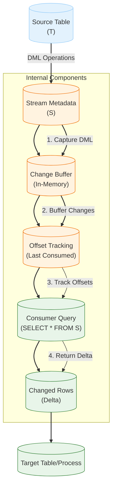

# **Snowflake Streams and Tasks: Production-Grade Technical Deep Dive**


## **1. Architecture & Execution Flow**

### **Mermaid: Streams vs. Tasks Architecture Comparison**
```mermaid
%% Streams vs. Tasks Architecture
flowchart TD
    %% --- Data Sources ---
    subgraph DataSources["Data Sources"]
        A[("Source Tables\n(Changes)")] -->|CDC| B[("Streams\n(Change Tracking)")]
        C[("Any SQL/Stored Proc")] -->|Schedule| D[("Tasks\n(Scheduled Execution)")]
    end

    %% --- Streams Path ---
    subgraph StreamsPath["Streams Path"]
        B --> E[("Change Metadata\n(Offset Tracking)")]
        E --> F[("Consumer Queries\n(Change Data)")]
        F --> G[("Target Tables/Views")]
        B -->|Metadata| H[("Metadata DB\n(Stream State)")]
    end

    %% --- Tasks Path ---
    subgraph TasksPath["Tasks Path"]
        D --> I[("Task Scheduler\n(Cron/Interval)")]
        I --> J[("Warehouse Allocation")]
        J --> K[("SQL/Stored Proc\n(Execution)")]
        K --> L[("Target Tables/Views")]
        D -->|Metadata| M[("Metadata DB\n(Task State)")]
    end

    %% --- Shared Components ---
    subgraph Shared["Shared Components"]
        G --> N[("Query Engine")]
        L --> N
        H --> O[("Account Usage Views")]
        M --> O
    end

    %% --- Monitoring ---
    subgraph Monitoring["Monitoring"]
        P[("ACCOUNT_USAGE.STREAMS")]
        Q[("ACCOUNT_USAGE.TASK_HISTORY")]
        R[("INFORMATION_SCHEMA.STREAMS")]
        S[("INFORMATION_SCHEMA.TASK_HISTORY")]
    end
    B --> P
    B --> R
    D --> Q
    D --> S

    %% --- Annotations ---
    linkStyle 0,1,2,3,4,5,6,7,8,9,10,11,12,13,14,15,16,17,18,19,20,21,22,23,24 stroke:#333,stroke-width:2px;
    classDef default fill:#f9f9f9,stroke:#333;
    classDef streams fill:#e3f2fd,stroke:#90caf9;
    classDef tasks fill:#fff3e0,stroke:#ef6c00;
    classDef shared fill:#e8f5e9,stroke:#2e7d32;
    classDef monitoring fill:#f3e5f5,stroke:#7b1fa2;
    class B,E,F,G,H streams;
    class C,D,I,J,K,L,M tasks;
    class N,O shared;
    class P,Q,R,S monitoring;
```

### **Execution Flow Comparison Table**

| **Component**               | **Streams (CDC)**                          | **Tasks (Scheduled)**                     |
|-----------------------------|-------------------------------------------|------------------------------------------|
| **Purpose**                 | Track and consume changes to source tables | Execute SQL or stored procedures on schedule |
| **Trigger**                 | Data changes (INSERT/UPDATE/DELETE)       | Time-based (CRON or interval)            |
| **Execution Model**         | Event-driven (change tracking)            | Time-driven (scheduled)                  |
| **Data Flow**               | Pull-based (consumers query changes)      | Push-based (tasks execute SQL)          |
| **Atomicity**               | Row-level (individual changes)            | Task-level (entire execution)           |
| **Latency**                 | Near real-time (seconds)                  | Scheduled (minutes to hours)             |
| **Throughput**              | Limited by consumer queries               | Limited by warehouse size                |
| **State Management**       | Offset-based (tracked by Snowflake)       | Execution history (tracked by Snowflake) |
| **Warehouse Requirement**   | Required for consumer queries              | Required for task execution              |
| **Serverless Option**       | No (requires warehouse for queries)       | No (requires warehouse for execution)    |
| **Best For**                 | Change Data Capture, real-time pipelines   | Batch processing, scheduled workflows    |


## **2. Execution Internals & Transactional Boundaries**


### **A. Streams (Change Data Capture) Internals**

#### **1. Stream Architecture**
Streams are Snowflake objects that track changes (INSERTs, UPDATEs, DELETEs) to source tables, allowing consumers to query only the changed data. They are **not** a data ingestion mechanism but rather a **change tracking** mechanism that enables CDC patterns.



#### **2. Change Capture Mechanism**
- **DML Operations Tracked**:
  - **INSERT**: New rows added to source table
  - **UPDATE**: Modified rows in source table (before and after values)
  - **DELETE**: Rows removed from source table
  - **TRUNCATE**: All rows removed (tracked as a special event)

- **Capture Process**:
  1. **Transaction Commit**: When a transaction commits on the source table, changes are captured
  2. **Metadata Update**: Stream metadata is updated with new changes
  3. **Buffer Population**: Changes are buffered in memory (100MB per stream)
  4. **Offset Tracking**: Snowflake tracks the last consumed offset for each consumer

- **Change Buffer**:
  - **In-Memory Storage**: Changes buffered for **24 hours** (configurable via `RETENTION_TIME`)
  - **Spill to Storage**: If buffer exceeds **200MB**, spills to SSD
  - **Retention**: Changes available for **24-168 hours** (1-7 days, configurable)

#### **3. Offset Tracking**
- **Offset Definition**:
  - A **monotonically increasing value** that identifies a point in the stream
  - Format: `<timestamp>_<sequence>` (e.g., `1672531200000_0`)
  - **Timestamp**: Unix epoch time in milliseconds
  - **Sequence**: Incremental counter for changes at the same timestamp

- **Offset Management**:
  - **Consumer Offsets**: Each consumer maintains its own offset
  - **Offset Storage**: Stored in Snowflake metadata (not in the stream itself)
  - **Offset Types**:
    | Offset Type | Description | Use Case |
    |-------------|-------------|----------|
    | `BEGIN` | Start of stream | Initial load |
    | `END` | Current end of stream | Catch up to latest |
    | `<timestamp>_<sequence>` | Specific point in stream | Resume from last position |
    | `TIMESTAMP => <time>` | All changes after a timestamp | Time-based consumption |

- **Offset Advancement**:
  - Offsets advance **automatically** when consumers query the stream
  - **Manual Override**: Consumers can specify any valid offset

#### **4. Stream Types**
| **Stream Type** | **Description** | **Use Case** | **Example** |
|-----------------|-----------------|--------------|-------------|
| **Standard** | Tracks all changes to a source table | General CDC | `CREATE STREAM MY_STREAM ON TABLE MY_TABLE` |
| **Append-Only** | Tracks only INSERTs (no UPDATEs/DELETEs) | Append-only tables | `CREATE STREAM MY_STREAM ON TABLE MY_TABLE APPEND_ONLY = TRUE` |
| **Insert-Only** | Tracks only INSERTs (ignores UPDATEs/DELETEs) | Insert-only workflows | `CREATE STREAM MY_STREAM ON TABLE MY_TABLE INSERT_ONLY = TRUE` |

#### **5. Consumer Queries**
- **Basic Query**:
  ```sql
  SELECT * FROM MY_STREAM;
  ```
  - Returns all changes since the last consumed offset (per session)

- **Offset-Based Query**:
  ```sql
  SELECT * FROM MY_STREAM
  WHERE SYSTEM$STREAM_HAS_DATA('MY_STREAM');
  ```
  - Returns changes and advances the offset

- **Time-Based Query**:
  ```sql
  SELECT * FROM MY_STREAM
  WHERE METADATA$ROW_ID > '1672531200000_0';
  ```
  - Returns changes after a specific offset

- **Change Metadata**:
  | Column | Type | Description |
  |--------|------|-------------|
  | `METADATA$ROW_ID` | STRING | Unique identifier for the change (offset) |
  | `METADATA$ROW_TYPE` | STRING | Type of change: `INSERT`, `UPDATE`, `DELETE` |
  | `METADATA$ISUPDATE` | BOOLEAN | `TRUE` if this is an UPDATE (for UPDATEs, two rows are returned: before and after) |
  | `METADATA$CHANGE_TIMESTAMP` | TIMESTAMP_LTZ | When the change occurred |
  | All source table columns | - | Values of the row at the time of change |

#### **6. Transactional Boundaries**
- **Atomicity**:
  - **Row-Level**: Each row change is tracked atomically
  - **Transaction-Level**: Changes from a single transaction are grouped together (same `METADATA$ROW_ID` prefix)
- **Isolation**:
  - **Read Committed**: Consumers see committed changes only
  - **No Dirty Reads**: Uncommitted transactions are not visible in streams
- **Durability**:
  - **24-168 Hours**: Changes are retained in the stream for the configured retention period
  - **After Retention**: Changes are purged and cannot be recovered

#### **7. Performance Characteristics**
| **Warehouse Size** | **Max Throughput (Changes/sec)** | **Latency (Change to Query)** | **Concurrent Consumers** |
|--------------------|----------------------------------|-----------------------------|---------------------------|
| X-Small | 100-500 | <1 second | 5 |
| Small | 500-2000 | <1 second | 10 |
| Medium | 2000-5000 | <1 second | 20 |
| Large | 5000-10000 | <1 second | 50 |
| X-Large | 10000-20000 | <1 second | 100 |
| 2X-Large | 20000-40000 | <1 second | 200 |
| 4X-Large | 40000-100000 | <1 second | 500 |

#### **8. Memory & Resource Usage**
| **Component** | **Memory per Stream** | **Scaling** | **Spill Behavior** |
|---------------|------------------------|-------------|--------------------|
| Change Buffer | 100MB | Per stream | Spills to SSD at 200MB |
| Offset Tracking | 1MB | Per consumer | None |
| Metadata | Shared | Vertical | None |

### **B. Tasks Internals**

#### **1. Task Architecture**
Tasks enable scheduled execution of SQL statements or stored procedures in Snowflake. They are the primary mechanism for implementing **scheduled workflows**, **ETL pipelines**, and **batch processing**.

```mermaid
%% Task Execution Internals
flowchart TD
    A[("Task Definition\n(CREATE TASK)")] --> B[("Task Scheduler\n(Cron/Interval)")]
    B --> C{Trigger Time?}
    C -->|Yes| D[("Warehouse Allocation")]
    C -->|No| E[("Wait")]
    D --> F[("Session Initialization")]
    F --> G[("SQL/Stored Proc\n(Execution)")]
    G --> H{Success?}
    H -->|Yes| I[("Commit\n(Atomic)")]
    H -->|No| J[("Retry Logic")]
    J -->|Max Retries| K[("Fail\n(Final)")]
    J -->|Retryable| G
    I --> L[("Update Task History")]
    K --> L
    L --> E

    %% --- Annotations ---
    linkStyle 0,1,2,3,4,5,6,7,8,9,10,11,12,13,14 stroke:#333,stroke-width:2px;
    classDef default fill:#f9f9f9,stroke:#333;
    classDef definition fill:#e3f2fd,stroke:#90caf9;
    classDef scheduler fill:#fff3e0,stroke:#ef6c00;
    classDef execution fill:#e8f5e9,stroke:#2e7d32;
    classDef result fill:#fce4ec,stroke:#c2185b;
    class A definition;
    class B,C,E scheduler;
    class D,F,G execution;
    class H,I,J,K,L result;
```

#### **2. Task Scheduling**
- **Schedule Types**:
  - **CRON**: Unix-style cron expressions (e.g., `0 0 * * *` for daily at midnight)
  - **Interval**: Fixed intervals in minutes (e.g., `60` for hourly)
- **CRON Syntax**:
  ```
  ┌───────────── minute (0 - 59)
  │ ┌───────────── hour (0 - 23)
  │ │ ┌───────────── day of month (1 - 31)
  │ │ │ ┌───────────── month (1 - 12)
  │ │ │ │ ┌───────────── day of week (0 - 6) (Sunday to Saturday)
  │ │ │ │ │
  ```
- **Examples**:
  | Description | CRON Expression | Interval Equivalent |
  |-------------|------------------|----------------------|
  | Every minute | `* * * * *` | 1 |
  | Every 5 minutes | `*/5 * * * *` | 5 |
  | Hourly | `0 * * * *` | 60 |
  | Daily at midnight | `0 0 * * *` | 1440 |
  | Weekly on Monday at 3 AM | `0 3 * * 1` | N/A |

#### **3. Task Execution Pipeline**
1. **Trigger**:
   - Task scheduler checks if current time matches the task's schedule
   - For **CRON**: Evaluates cron expression against current time
   - For **Interval**: Checks if interval has elapsed since last execution

2. **Warehouse Allocation**:
   - **Dedicated Warehouse**: If task has a dedicated warehouse, it is started
   - **Shared Warehouse**: If using a shared warehouse, checks for availability
   - **Warehouse Size**: Uses the size specified in the task definition

3. **Session Initialization**:
   - **Session Parameters**: Inherits from task definition or uses defaults
   - **Timeout**: Default 8 days (configurable via `USER_TASK_TIMEOUT_MS`)
   - **Isolation**: Runs in a separate session from other tasks/queries

4. **SQL Execution**:
   - Executes the SQL statement or stored procedure defined in the task
   - **Atomicity**: Entire SQL statement is atomic (for single statements)
   - **Transactions**: Supports multi-statement transactions if explicitly defined

5. **Result Handling**:
   - **Success**: Commits changes and updates `TASK_HISTORY` with success status
   - **Failure**: Rolls back changes and updates `TASK_HISTORY` with error details
   - **Retry**: If configured, retries the task with exponential backoff

6. **State Update**:
   - Updates task state in metadata (`LAST_EXECUTION_TIME`, `NEXT_SCHEDULED_TIME`, etc.)
   - Logs execution details in `TASK_HISTORY`

#### **4. Task Dependencies**
- **Dependency Types**:
  - **Single Task**: `DEPENDENCY = TASK1` (runs after TASK1 completes)
  - **Multiple Tasks**: `DEPENDENCY = TASK1, TASK2` (runs after both complete)
  - **Conditional**: `WHEN SYSTEM$STREAM_HAS_DATA('MY_STREAM')` (runs when stream has data)

- **Dependency Behavior**:
  - **Success Required**: Task only runs if all dependencies complete successfully
  - **Failure Propagation**: If a dependency fails, dependent tasks are **skipped** (not failed)
  - **Execution Order**: Dependencies run in the order they are specified

- **Dependency Graph**:
  ```mermaid
  %% Task Dependency Graph
  flowchart TD
      A[("TASK_A\n(Load Data)")] --> B[("TASK_B\n(Transform)")]
      A --> C[("TASK_C\n(Validate)")]
      B --> D[("TASK_D\n(Load to Target)")]
      C --> D
      D --> E[("TASK_E\n(Notify)")]

      %% --- Annotations ---
      linkStyle 0,1,2,3,4 stroke:#333,stroke-width:2px;
      classDef default fill:#f9f9f9,stroke:#333;
      classDef task fill:#e3f2fd,stroke:#90caf9;
      class A,B,C,D,E task;
  ```

#### **5. Retry Logic**
- **Retry Configuration**:
  - **RETRY_COUNT**: Number of retry attempts (default: 0, max: 10)
  - **RETRY_DELAY**: Delay between retries in seconds (default: 1, max: 3600)
  - **Backoff**: Exponential backoff (delay doubles after each retry)

- **Retry Behavior**:
  - **Retryable Errors**: Transient errors (e.g., warehouse unavailable, network issues)
  - **Non-Retryable Errors**: Permanent errors (e.g., syntax errors, permission issues)
  - **Final Failure**: After max retries, task is marked as failed

- **Retry Example**:
  ```sql
  CREATE TASK MY_TASK
    WAREHOUSE = MY_WH
    SCHEDULE = 'USING CRON 0 * * * * America/Los_Angeles'
    RETRY_COUNT = 3
    RETRY_DELAY = 60
    AS
      INSERT INTO MY_TABLE SELECT * FROM MY_SOURCE;
  ```
  - If the task fails, it will retry after 60 seconds, then 120 seconds, then 240 seconds

#### **6. Task State Management**
- **Task States**:
  | State | Description | Transition To |
  |-------|-------------|---------------|
  | `STARTED` | Task is running | `SUCCESS`, `FAILED` |
  | `SUCCESS` | Task completed successfully | `STARTED` (next run) |
  | `FAILED` | Task failed after retries | `STARTED` (next run) |
  | `PAUSED` | Task is manually paused | `STARTED` (when resumed) |
  | `SKIPPED` | Task was skipped (dependency failed) | `STARTED` (next run) |

- **State Transitions**:
  ```mermaid
  %% Task State Transitions
  stateDiagram-v2
      [*] --> STARTED: Scheduled
      STARTED --> SUCCESS: SQL Success
      STARTED --> FAILED: SQL Failed + Max Retries
      STARTED --> SKIPPED: Dependency Failed
      SUCCESS --> STARTED: Next Schedule
      FAILED --> STARTED: Next Schedule
      SKIPPED --> STARTED: Next Schedule
      STARTED --> PAUSED: Manual Pause
      PAUSED --> STARTED: Manual Resume
  ```

#### **7. Transactional Boundaries**
- **Atomicity**:
  - **Single Statement**: Entire SQL statement is atomic
  - **Multi-Statement**: Each statement is atomic unless wrapped in a transaction
  - **Stored Procedures**: Atomicity depends on procedure implementation

- **Isolation**:
  - **Session-Level**: Each task runs in its own session
  - **No Interference**: Tasks do not interfere with each other or other queries

- **Durability**:
  - **Committed Changes**: Durable after task success
  - **Rolled Back Changes**: Not durable if task fails

#### **8. Performance Characteristics**
| **Warehouse Size** | **Max Concurrent Tasks** | **Throughput (Rows/sec)** | **Latency (Start to Finish)** |
|--------------------|--------------------------|---------------------------|---------------------------------|
| X-Small | 1 | 100-500 | 1-60 minutes (depends on SQL) |
| Small | 2 | 500-2000 | 1-60 minutes |
| Medium | 4 | 2000-5000 | 1-60 minutes |
| Large | 8 | 5000-10000 | 1-60 minutes |
| X-Large | 16 | 10000-20000 | 1-60 minutes |
| 2X-Large | 32 | 20000-40000 | 1-60 minutes |
| 4X-Large | 64 | 40000-100000 | 1-60 minutes |

#### **9. Memory & Resource Usage**
| **Component** | **Memory per Task** | **Scaling** | **Spill Behavior** |
|---------------|---------------------|-------------|--------------------|
| Task Session | Warehouse-dependent | Per task | Spills to SSD |
| SQL Execution | Warehouse-dependent | Per task | Spills to SSD |
| Metadata | Shared | Vertical | None |

## **3. Parameter/Configuration Deep Dive**


### **A. Streams Parameters**

| **Parameter** | **Description** | **Internal Behavior** | **Performance Impact** | **Compliance/Edge Cases** | **Production Default** | **Valid Values** |
|---------------|-----------------|-----------------------|-----------------------|--------------------------|-------------------------|-----------------|
| `ON TABLE` | Source table for the stream | Tracks changes to the specified table | No direct impact | Table must exist; cannot be a view | None (required) | Table name |
| `APPEND_ONLY` | Only track INSERTs | Ignores UPDATEs and DELETEs | Reduces change volume by ~50-70% | Cannot track updates/deletes | `FALSE` | `TRUE`, `FALSE` |
| `INSERT_ONLY` | Only track INSERTs (ignore UPDATEs/DELETEs) | Tracks INSERTs but ignores UPDATEs and DELETEs | Reduces change volume by ~30-50% | Cannot track updates/deletes | `FALSE` | `TRUE`, `FALSE` |
| `RETENTION_TIME` | Retention period for changes (hours) | Changes older than this are purged | Longer retention = higher storage costs | Min: 24, Max: 168 (7 days) | `24` | 24-168 |
| `COMMENT` | Description of the stream | No functional impact | No impact | Max length: 256 characters | None | String |

#### **Stream Creation Examples**
```sql
-- Standard stream (tracks all changes)
CREATE STREAM MY_STREAM ON TABLE MY_SOURCE_TABLE;

-- Append-only stream (tracks only INSERTs)
CREATE STREAM MY_APPEND_STREAM ON TABLE MY_SOURCE_TABLE APPEND_ONLY = TRUE;

-- Stream with custom retention
CREATE STREAM MY_STREAM ON TABLE MY_SOURCE_TABLE RETENTION_TIME = 168;  -- 7 days

-- Stream with comment
CREATE STREAM MY_STREAM ON TABLE MY_SOURCE_TABLE COMMENT = 'Tracks changes for ETL pipeline';
```

### **B. Tasks Parameters**

| **Parameter** | **Description** | **Internal Behavior** | **Performance Impact** | **Compliance/Edge Cases** | **Production Default** | **Valid Values** |
|---------------|-----------------|-----------------------|-----------------------|--------------------------|-------------------------|-----------------|
| `WAREHOUSE` | Warehouse for task execution | Uses specified warehouse for execution | Larger warehouse = higher throughput | Must exist; affects cost | None (required) | Warehouse name |
| `SCHEDULE` | Task schedule (CRON or interval) | Determines when task runs | More frequent = higher cost | Min interval: 1 minute | None (required) | CRON expression or interval (minutes) |
| `WHEN` | Conditional execution | Task runs only if condition is true | Reduces unnecessary executions | Must be valid SQL boolean expression | `TRUE` | SQL boolean expression |
| `ALLOW_OVERLAPPING_EXECUTION` | Allow concurrent runs | If `TRUE`, multiple instances can run simultaneously | `TRUE` = higher throughput, potential resource contention | Can cause data inconsistencies | `FALSE` | `TRUE`, `FALSE` |
| `RETRY_COUNT` | Number of retry attempts | Retries on transient failures | Higher = more resilience, higher cost | Max: 10 | `0` | 0-10 |
| `RETRY_DELAY` | Delay between retries (seconds) | Exponential backoff between retries | Higher = lower resource usage | Min: 1, Max: 3600 | `1` | 1-3600 |
| `USER_TASK_TIMEOUT_MS` | Task timeout (milliseconds) | Maximum runtime for task | Shorter = faster failure detection | Min: 1000, Max: 691200000 (8 days) | `86400000` (24 hours) | 1000-691200000 |
| `SESSION_TIMEOUT` | Session timeout (minutes) | Maximum idle time for session | Shorter = faster cleanup | Min: 1, Max: 11520 (8 days) | `60` | 1-11520 |
| `DEPENDENCY` | Task dependencies | Task runs only after dependencies complete | Can reduce concurrency | Max: 10 dependencies | None | Task name(s) |
| `ENABLED` | Task is active | If `FALSE`, task is paused | No impact when `FALSE` | Can be toggled | `TRUE` | `TRUE`, `FALSE` |
| `COMMENT` | Description of the task | No functional impact | No impact | Max length: 256 characters | None | String |

#### **Task Creation Examples**
```sql
-- Basic task with CRON schedule
CREATE TASK MY_TASK
  WAREHOUSE = MY_WH
  SCHEDULE = 'USING CRON 0 0 * * * America/Los_Angeles'
  AS
    INSERT INTO MY_TARGET SELECT * FROM MY_SOURCE;

-- Task with interval schedule
CREATE TASK MY_TASK
  WAREHOUSE = MY_WH
  SCHEDULE = '60 MINUTE'
  AS
    INSERT INTO MY_TARGET SELECT * FROM MY_SOURCE;

-- Task with retry logic
CREATE TASK MY_TASK
  WAREHOUSE = MY_WH
  SCHEDULE = 'USING CRON 0 * * * * America/Los_Angeles'
  RETRY_COUNT = 3
  RETRY_DELAY = 60
  AS
    INSERT INTO MY_TARGET SELECT * FROM MY_SOURCE;

-- Task with dependency
CREATE TASK MY_DEPENDENT_TASK
  WAREHOUSE = MY_WH
  SCHEDULE = 'USING CRON 0 1 * * * America/Los_Angeles'
  DEPENDENCY = MY_TASK
  AS
    UPDATE MY_TARGET SET processed = TRUE;

-- Task with conditional execution
CREATE TASK MY_CONDITIONAL_TASK
  WAREHOUSE = MY_WH
  SCHEDULE = 'USING CRON */5 * * * * America/Los_Angeles'
  WHEN SYSTEM$STREAM_HAS_DATA('MY_STREAM')
  AS
    MERGE INTO MY_TARGET T
    USING MY_STREAM S
    ON T.id = S.id
    WHEN MATCHED THEN UPDATE SET T.data = S.data
    WHEN NOT MATCHED THEN INSERT (id, data) VALUES (S.id, S.data);

-- Task with custom timeout
CREATE TASK MY_LONG_RUNNING_TASK
  WAREHOUSE = MY_WH
  SCHEDULE = 'USING CRON 0 0 * * * America/Los_Angeles'
  USER_TASK_TIMEOUT_MS = 3600000  -- 1 hour
  AS
    CALL MY_LONG_RUNNING_PROCEDURE();
```

## **4. Performance & Resource Implications**

### **A. Streams Performance**

#### **Throughput by Warehouse Size**
| **Warehouse Size** | **Max Changes/sec** | **Max Concurrent Consumers** | **Latency (Change to Query)** | **Memory per Consumer** |
|--------------------|---------------------|-------------------------------|-------------------------------|-------------------------|
| X-Small | 100-500 | 5 | <1 second | 64MB |
| Small | 500-2000 | 10 | <1 second | 128MB |
| Medium | 2000-5000 | 20 | <1 second | 256MB |
| Large | 5000-10000 | 50 | <1 second | 512MB |
| X-Large | 10000-20000 | 100 | <1 second | 1GB |
| 2X-Large | 20000-40000 | 200 | <1 second | 2GB |
| 4X-Large | 40000-100000 | 500 | <1 second | 4GB |

#### **Latency Breakdown**
| **Phase** | **Duration** | **Dependencies** |
|-----------|-------------|-----------------|
| Change Capture | <100ms | Transaction commit |
| Buffer Population | <10ms | Change volume |
| Offset Update | <1ms | Consumer query |
| Query Execution | <1 second | Warehouse size, query complexity |
| **Total** | **<1 second** | |

#### **Credit Costs**
- **Compute**: Standard warehouse pricing (based on consumer query duration)
- **Storage**: 0.1 credits per GB/month for retained changes
- **Example**:
  - 1 million changes/day, 24-hour retention = ~0.01 GB × 0.1 = **0.001 credits/day**
  - Consumer queries: 100 queries/day, 1 second each, X-Small warehouse = 100 × (0.00028 credits/sec) = **0.028 credits/day**

#### **Memory Usage**
| **Component** | **Memory per Stream** | **Memory per Consumer** | **Spill Behavior** |
|---------------|------------------------|-------------------------|--------------------|
| Change Buffer | 100MB | N/A | Spills to SSD at 200MB |
| Offset Tracking | 1MB | 1KB | None |
| Metadata | Shared | Shared | None |

### **B. Tasks Performance**

#### **Throughput by Warehouse Size**
| **Warehouse Size** | **Max Concurrent Tasks** | **Throughput (Rows/sec)** | **Latency (Start to Finish)** | **Credit Cost (Per Hour)** |
|--------------------|--------------------------|---------------------------|---------------------------------|-----------------------------|
| X-Small | 1 | 100-500 | 1-60 minutes | 0.28 |
| Small | 2 | 500-2000 | 1-60 minutes | 0.56 |
| Medium | 4 | 2000-5000 | 1-60 minutes | 1.12 |
| Large | 8 | 5000-10000 | 1-60 minutes | 2.24 |
| X-Large | 16 | 10000-20000 | 1-60 minutes | 4.48 |
| 2X-Large | 32 | 20000-40000 | 1-60 minutes | 8.96 |
| 4X-Large | 64 | 40000-100000 | 1-60 minutes | 17.92 |

#### **Latency Breakdown**
| **Phase** | **Duration** | **Dependencies** |
|-----------|-------------|-----------------|
| Schedule Check | <10ms | Scheduler |
| Warehouse Allocation | 10-100ms | Warehouse availability |
| Session Initialization | 100-500ms | Warehouse size |
| SQL Execution | Variable | SQL complexity, data volume |
| Result Handling | <100ms | Success/failure |
| **Total** | **1-60 minutes** | |

#### **Credit Costs**
- **Compute**: Standard warehouse pricing (based on runtime)
- **Storage**: Standard storage pricing (if data is staged)
- **Example**:
  - Task runs for 5 minutes on X-Small warehouse = 5 × 60 × 0.00028 = **0.084 credits**
  - Task runs for 1 hour on Medium warehouse = 1 × 60 × 60 × 0.0007 = **2.52 credits**

#### **Memory Usage**
| **Component** | **Memory** | **Scaling** | **Spill Behavior** |
|---------------|------------|-------------|--------------------|
| Task Session | Warehouse-dependent | Per task | Spills to SSD |
| SQL Execution | Warehouse-dependent | Per task | Spills to SSD |
| Metadata | Shared | Vertical | None |

## **5. Monitoring, Observability & Troubleshooting**

### **A. Key Monitoring Views**

| **View** | **Purpose** | **Example Query** | **Retention** | **Applicable To** |
|----------|-------------|-------------------|---------------|-------------------|
| `ACCOUNT_USAGE.STREAMS` | Stream definitions and status | `SELECT * FROM SNOWFLAKE.ACCOUNT_USAGE.STREAMS WHERE NAME = 'MY_STREAM';` | 365 days | Streams |
| `INFORMATION_SCHEMA.STREAMS` | Stream metadata (session-scoped) | `SELECT * FROM INFORMATION_SCHEMA.STREAMS WHERE NAME = 'MY_STREAM';` | Session | Streams |
| `ACCOUNT_USAGE.TASK_HISTORY` | Task execution history | `SELECT * FROM SNOWFLAKE.ACCOUNT_USAGE.TASK_HISTORY WHERE NAME = 'MY_TASK' AND SCHEDULED_TIME > DATEADD('day', -7, CURRENT_TIMESTAMP());` | 365 days | Tasks |
| `INFORMATION_SCHEMA.TASK_HISTORY` | Task execution history (session-scoped) | `SELECT * FROM INFORMATION_SCHEMA.TASK_HISTORY WHERE NAME = 'MY_TASK';` | Session | Tasks |
| `TABLE(INFORMATION_SCHEMA.STREAM_HAS_DATA('stream_name'))` | Check if stream has data | `SELECT SYSTEM$STREAM_HAS_DATA('MY_STREAM');` | N/A | Streams |
| `SNOWFLAKE.ACCOUNT_USAGE.TASK_EXECUTIONS` | Detailed task execution metrics | `SELECT * FROM SNOWFLAKE.ACCOUNT_USAGE.TASK_EXECUTIONS WHERE TASK_NAME = 'MY_TASK';` | 365 days | Tasks |

### **B. Error Categorization & Runbooks**

#### **1. Streams Errors**

| **Error Code** | **Root Cause** | **Impact** | **Severity** | **Runbook** | **Monitoring View** |
|---------------|----------------|------------|--------------|-------------|---------------------|
| `STREAM_SOURCE_TABLE_DROPPED` | Source table was dropped | Stream becomes invalid | Critical | 1. Recreate stream. 2. Check table existence. | `ACCOUNT_USAGE.STREAMS` |
| `STREAM_SOURCE_TABLE_ALTERED` | Source table schema changed | Stream may miss changes | High | 1. Recreate stream. 2. Validate schema compatibility. | `ACCOUNT_USAGE.STREAMS` |
| `STREAM_RETENTION_EXCEEDED` | Changes older than retention period | Data loss | Medium | 1. Increase `RETENTION_TIME`. 2. Consume data more frequently. | N/A |
| `STREAM_OFFSET_INVALID` | Invalid offset specified | Query fails | Medium | 1. Use valid offset (e.g., `BEGIN`, `END`). 2. Check `METADATA$ROW_ID` values. | N/A |
| `STREAM_NO_DATA` | No changes since last offset | Query returns empty | Low | 1. Wait for changes. 2. Use `SYSTEM$STREAM_HAS_DATA`. | N/A |
| `STREAM_CONSUMER_LAG` | Consumer falling behind | Data not processed | High | 1. Increase consumer frequency. 2. Scale warehouse. | Custom monitoring |

##### **Runbook: Stream Consumer Lag**
```sql
-- Step 1: Check stream status
SELECT
    name,
    source_table,
    last_change_time,
    creation_time,
    RETENTION_TIME
FROM
    SNOWFLAKE.ACCOUNT_USAGE.STREAMS
WHERE
    name = 'MY_STREAM';

-- Step 2: Check for lagging consumers
SELECT
    SYSTEM$STREAM_HAS_DATA('MY_STREAM') AS has_data,
    SYSTEM$STREAM_LAST_CHANGE_TIME('MY_STREAM') AS last_change_time,
    SYSTEM$STREAM_LAST_CONSUMED_OFFSET('MY_STREAM') AS last_consumed_offset;

-- Step 3: Monitor consumer offset
CREATE OR REPLACE VIEW STREAM_CONSUMER_MONITORING AS
SELECT
    'MY_STREAM' AS stream_name,
    SYSTEM$STREAM_LAST_CHANGE_TIME('MY_STREAM') AS last_change_time,
    SYSTEM$STREAM_LAST_CONSUMED_OFFSET('MY_STREAM') AS last_consumed_offset,
    DATEDIFF('second', SYSTEM$STREAM_LAST_CONSUMED_OFFSET('MY_STREAM'), SYSTEM$STREAM_LAST_CHANGE_TIME('MY_STREAM')) AS lag_seconds,
    CURRENT_TIMESTAMP() AS monitoring_time;

-- Step 4: Alert on high lag
CREATE OR REPLACE ALERT STREAM_LAG_ALERT
  WAREHOUSE = MONITORING_WH
  SCHEDULE = 'USING CRON */5 * * * * America/Los_Angeles'
AS
  SELECT
    stream_name,
    lag_seconds,
    CURRENT_TIMESTAMP() AS alert_time
  FROM
    STREAM_CONSUMER_MONITORING
  WHERE
    lag_seconds > 300;  -- 5 minutes
```

##### **Runbook: Stream Schema Change**
```sql
-- Step 1: Identify schema changes
SELECT
    change_time,
    change_type,
    changed_object
FROM
    SNOWFLAKE.ACCOUNT_USAGE.STREAM_CHANGES
WHERE
    stream_name = 'MY_STREAM'
    AND change_time > DATEADD('day', -7, CURRENT_TIMESTAMP())
ORDER BY
    change_time DESC;

-- Step 2: Check current schema
SELECT
    column_name,
    data_type
FROM
    INFORMATION_SCHEMA.COLUMNS
WHERE
    table_name = 'MY_SOURCE_TABLE';

-- Step 3: Recreate stream with new schema
CREATE OR REPLACE STREAM MY_STREAM ON TABLE MY_SOURCE_TABLE;

-- Step 4: Reprocess missed changes (if needed)
-- (Use initial load + CDC from last known good offset)
```

#### **2. Tasks Errors**

| **Error Code** | **Root Cause** | **Impact** | **Severity** | **Runbook** | **Monitoring View** |
|---------------|----------------|------------|--------------|-------------|---------------------|
| `TASK_WAREHOUSE_UNAVAILABLE` | Warehouse suspended/overloaded | Task fails | Medium | 1. Resume warehouse: `ALTER WAREHOUSE MY_WH RESUME;` 2. Use larger warehouse. | `ACCOUNT_USAGE.TASK_HISTORY` |
| `TASK_SQL_ERROR` | SQL syntax or runtime error | Task fails | High | 1. Check `ERROR_MESSAGE` in `TASK_HISTORY`. 2. Fix SQL. | `ACCOUNT_USAGE.TASK_HISTORY` |
| `TASK_TIMEOUT` | Task exceeded `USER_TASK_TIMEOUT_MS` | Task fails | Medium | 1. Increase `USER_TASK_TIMEOUT_MS`. 2. Optimize SQL. | `ACCOUNT_USAGE.TASK_HISTORY` |
| `TASK_DEPENDENCY_FAILED` | Dependency task failed | Task skipped | Medium | 1. Check dependency task status. 2. Fix dependency. | `ACCOUNT_USAGE.TASK_HISTORY` |
| `TASK_CONDITION_NOT_MET` | `WHEN` condition false | Task skipped | Low | 1. Check `WHEN` condition. 2. Update condition. | `ACCOUNT_USAGE.TASK_HISTORY` |
| `TASK_RETRY_LIMIT_EXCEEDED` | Max retries reached | Task fails | Medium | 1. Increase `RETRY_COUNT`. 2. Fix root cause. | `ACCOUNT_USAGE.TASK_HISTORY` |
| `TASK_PERMISSION_DENIED` | Insufficient RBAC permissions | Task fails | Critical | 1. Grant required permissions. 2. Check task owner role. | `ACCOUNT_USAGE.TASK_HISTORY` |

##### **Runbook: Task SQL Errors**
```sql
-- Step 1: Identify failing tasks
SELECT
    name,
    scheduled_time,
    start_time,
    end_time,
    state,
    return_code,
    error_message
FROM
    SNOWFLAKE.ACCOUNT_USAGE.TASK_HISTORY
WHERE
    state = 'FAILED'
    AND scheduled_time > DATEADD('day', -7, CURRENT_TIMESTAMP())
ORDER BY
    scheduled_time DESC;

-- Step 2: Check task definition
SELECT
    name,
    warehouse,
    schedule,
    state,
    definition
FROM
    INFORMATION_SCHEMA.TASKS
WHERE
    name = 'MY_TASK';

-- Step 3: Test task SQL manually
-- Extract SQL from task definition and run in a warehouse
-- Example:
ALTER SESSION SET WAREHOUSE = MY_WH;
INSERT INTO MY_TARGET SELECT * FROM MY_SOURCE;

-- Step 4: Fix and retry task
ALTER TASK MY_TASK RESUME;
```

##### **Runbook: Task Warehouse Issues**
```sql
-- Step 1: Check warehouse status
SELECT
    name,
    state,
    size,
    running_queries,
    queued_queries
FROM
    SNOWFLAKE.ACCOUNT_USAGE.WAREHOUSES
WHERE
    name = 'MY_WH';

-- Step 2: Check warehouse utilization
SELECT
    warehouse_name,
    query_id,
    user_name,
    role_name,
    start_time,
    end_time,
    total_elapsed_time,
    bytes_scanned,
    credit_used
FROM
    SNOWFLAKE.ACCOUNT_USAGE.QUERY_HISTORY
WHERE
    warehouse_name = 'MY_WH'
    AND start_time > DATEADD('hour', -1, CURRENT_TIMESTAMP())
ORDER BY
    start_time DESC;

-- Step 3: Resume warehouse if suspended
ALTER WAREHOUSE MY_WH RESUME;

-- Step 4: Scale warehouse if overloaded
ALTER WAREHOUSE MY_WH SET WAREHOUSE_SIZE = 'LARGE';
```

##### **Runbook: Task Dependency Failures**
```sql
-- Step 1: Check dependency status
SELECT
    name,
    state,
    last_execution_time,
    next_scheduled_time
FROM
    INFORMATION_SCHEMA.TASKS
WHERE
    name IN ('MY_TASK', 'DEPENDENCY_TASK');

-- Step 2: Check dependency history
SELECT
    name,
    scheduled_time,
    start_time,
    end_time,
    state,
    error_message
FROM
    SNOWFLAKE.ACCOUNT_USAGE.TASK_HISTORY
WHERE
    name = 'DEPENDENCY_TASK'
    AND scheduled_time > DATEADD('day', -1, CURRENT_TIMESTAMP())
ORDER BY
    scheduled_time DESC;

-- Step 3: Fix dependency task
-- (Follow runbook for dependency task's error)

-- Step 4: Manually run dependent task
ALTER TASK MY_TASK EXECUTE;
```

### **C. Proactive Alerts**

#### **Streams Alerts**
```sql
-- Alert: Stream Source Table Dropped
CREATE OR REPLACE ALERT STREAM_SOURCE_DROPPED_ALERT
  WAREHOUSE = MONITORING_WH
  SCHEDULE = 'USING CRON 0 * * * * America/Los_Angeles'
AS
  SELECT
    name,
    source_table,
    CURRENT_TIMESTAMP() AS alert_time
  FROM
    SNOWFLAKE.ACCOUNT_USAGE.STREAMS
  WHERE
    source_table NOT IN (
        SELECT table_name
        FROM INFORMATION_SCHEMA.TABLES
    );

-- Alert: Stream Lagging
CREATE OR REPLACE ALERT STREAM_LAGGING_ALERT
  WAREHOUSE = MONITORING_WH
  SCHEDULE = 'USING CRON */5 * * * * America/Los_Angeles'
AS
  SELECT
    'MY_STREAM' AS stream_name,
    DATEDIFF('minute', SYSTEM$STREAM_LAST_CONSUMED_OFFSET('MY_STREAM'), SYSTEM$STREAM_LAST_CHANGE_TIME('MY_STREAM')) AS lag_minutes,
    CURRENT_TIMESTAMP() AS alert_time
  WHERE
    DATEDIFF('minute', SYSTEM$STREAM_LAST_CONSUMED_OFFSET('MY_STREAM'), SYSTEM$STREAM_LAST_CHANGE_TIME('MY_STREAM')) > 5;
```

#### **Tasks Alerts**
```sql
-- Alert: Task Execution Failures
CREATE OR REPLACE ALERT TASK_FAILURES_ALERT
  WAREHOUSE = MONITORING_WH
  SCHEDULE = 'USING CRON */15 * * * * America/Los_Angeles'
AS
  SELECT
    name,
    scheduled_time,
    state,
    return_code,
    error_message,
    CURRENT_TIMESTAMP() AS alert_time
  FROM
    SNOWFLAKE.ACCOUNT_USAGE.TASK_HISTORY
  WHERE
    state = 'FAILED'
    AND scheduled_time > DATEADD('hour', -1, CURRENT_TIMESTAMP());

-- Alert: Task Skipped Due to Dependency
CREATE OR REPLACE ALERT TASK_SKIPPED_ALERT
  WAREHOUSE = MONITORING_WH
  SCHEDULE = 'USING CRON 0 * * * * America/Los_Angeles'
AS
  SELECT
    name,
    scheduled_time,
    state,
    CURRENT_TIMESTAMP() AS alert_time
  FROM
    SNOWFLAKE.ACCOUNT_USAGE.TASK_HISTORY
  WHERE
    state = 'SKIPPED'
    AND scheduled_time > DATEADD('day', -1, CURRENT_TIMESTAMP());

-- Alert: Long-Running Tasks
CREATE OR REPLACE ALERT LONG_RUNNING_TASKS_ALERT
  WAREHOUSE = MONITORING_WH
  SCHEDULE = 'USING CRON 0 * * * * America/Los_Angeles'
AS
  SELECT
    name,
    scheduled_time,
    start_time,
    DATEDIFF('minute', start_time, CURRENT_TIMESTAMP()) AS duration_minutes,
    CURRENT_TIMESTAMP() AS alert_time
  FROM
    SNOWFLAKE.ACCOUNT_USAGE.TASK_HISTORY
  WHERE
    state = 'STARTED'
    AND start_time < DATEADD('hour', -1, CURRENT_TIMESTAMP())
    AND DATEDIFF('minute', start_time, CURRENT_TIMESTAMP()) > 60;  -- >1 hour
```

## **6. Advanced Production Patterns**

### **A. CDC Pipelines with Streams**

#### **1. Basic CDC Pipeline**
```mermaid
%% Basic CDC Pipeline with Streams
flowchart TD
    A[("Source Table\n(OLTP)")] -->|DML| B[("Stream\n(CDC)")]
    B -->|Changes| C[("Staging Table\n(Changed Data)")]
    C -->|ETL| D[("Target Table\n(Data Warehouse)")]
    B -->|Monitoring| E[("Lag Monitoring")]
    E -->|Alerts| F[("Alerting System")]

    %% --- Annotations ---
    linkStyle 0,1,2,3,4,5 stroke:#333,stroke-width:2px;
    classDef default fill:#f9f9f9,stroke:#333;
    classDef source fill:#e3f2fd,stroke:#90caf9;
    classDef stream fill:#fff3e0,stroke:#ef6c00;
    classDef staging fill:#e8f5e9,stroke:#2e7d32;
    classDef target fill:#f3e5f5,stroke:#7b1fa2;
    classDef monitoring fill:#ffebee,stroke:#ef9a9a;
    class A source;
    class B stream;
    class C staging;
    class D target;
    class E,F monitoring;
```

- **Implementation**:
  ```sql
  -- Step 1: Create stream on source table
  CREATE STREAM MY_CDC_STREAM ON TABLE MY_SOURCE_TABLE;

  -- Step 2: Create staging table
  CREATE TABLE MY_STAGING_TABLE (
      id INTEGER,
      data VARIANT,
      metadata$row_id STRING,
      metadata$row_type STRING,
      metadata$change_timestamp TIMESTAMP_LTZ,
      processed BOOLEAN DEFAULT FALSE
  );

  -- Step 3: Load changes to staging
  CREATE OR REPLACE PROCEDURE LOAD_CDC_TO_STAGING()
  RETURNS STRING
  LANGUAGE SQL
  AS
  $$
  BEGIN
      -- Load new changes
      INSERT INTO MY_STAGING_TABLE
      SELECT
          id,
          data,
          METADATA$ROW_ID,
          METADATA$ROW_TYPE,
          METADATA$CHANGE_TIMESTAMP,
          FALSE
      FROM
          MY_CDC_STREAM
      WHERE
          SYSTEM$STREAM_HAS_DATA('MY_CDC_STREAM');

      RETURN 'Loaded ' || SQLROWCOUNT || ' changes to staging';
  END;
  $$;

  -- Step 4: Process staging to target
  CREATE OR REPLACE PROCEDURE PROCESS_STAGING_TO_TARGET()
  RETURNS STRING
  LANGUAGE SQL
  AS
  $$
  DECLARE
      rows_processed INT;
  BEGIN
      -- Process INSERTs
      INSERT INTO MY_TARGET_TABLE
      SELECT
          id,
          data,
          METADATA$CHANGE_TIMESTAMP AS created_at,
          METADATA$CHANGE_TIMESTAMP AS updated_at
      FROM
          MY_STAGING_TABLE
      WHERE
          processed = FALSE
          AND METADATA$ROW_TYPE = 'INSERT';

      -- Process UPDATEs
      UPDATE MY_TARGET_TABLE T
      SET
          data = S.data,
          updated_at = S.METADATA$CHANGE_TIMESTAMP
      FROM
          MY_STAGING_TABLE S
      WHERE
          T.id = S.id
          AND S.processed = FALSE
          AND S.METADATA$ROW_TYPE = 'UPDATE';

      -- Process DELETEs
      DELETE FROM MY_TARGET_TABLE T
      WHERE
          T.id IN (
              SELECT id
              FROM MY_STAGING_TABLE S
              WHERE
                  processed = FALSE
                  AND METADATA$ROW_TYPE = 'DELETE'
          );

      -- Mark as processed
      UPDATE MY_STAGING_TABLE
      SET processed = TRUE
      WHERE processed = FALSE;

      SELECT ROW_COUNT() INTO rows_processed;

      RETURN 'Processed ' || rows_processed || ' changes to target';
  END;
  $$;

  -- Step 5: Schedule tasks
  CREATE TASK LOAD_CDC_TASK
    WAREHOUSE = MY_WH
    SCHEDULE = 'USING CRON */5 * * * * America/Los_Angeles'
  AS
    CALL LOAD_CDC_TO_STAGING();

  CREATE TASK PROCESS_CDC_TASK
    WAREHOUSE = MY_WH
    SCHEDULE = 'USING CRON */5 * * * * America/Los_Angeles'
    DEPENDENCY = LOAD_CDC_TASK
  AS
    CALL PROCESS_STAGING_TO_TARGET();
  ```

#### **2. Real-Time CDC with Low Latency**
```sql
-- Step 1: Create stream with minimal retention
CREATE STREAM MY_REALTIME_STREAM ON TABLE MY_SOURCE_TABLE RETENTION_TIME = 24;

-- Step 2: Create target table with CDC metadata
CREATE TABLE MY_REALTIME_TARGET (
    id INTEGER PRIMARY KEY,
    data VARIANT,
    created_at TIMESTAMP_LTZ,
    updated_at TIMESTAMP_LTZ,
    deleted_at TIMESTAMP_LTZ,
    cdc_operation STRING,
    cdc_timestamp TIMESTAMP_LTZ
);

-- Step 3: Create a procedure to process changes in real-time
CREATE OR REPLACE PROCEDURE PROCESS_REALTIME_CDC()
RETURNS STRING
LANGUAGE SQL
AS
$$
DECLARE
    changes_exist BOOLEAN;
BEGIN
    -- Check if stream has data
    changes_exist := SYSTEM$STREAM_HAS_DATA('MY_REALTIME_STREAM');

    IF (changes_exist) THEN
        -- Process changes directly (no staging)
        MERGE INTO MY_REALTIME_TARGET T
        USING (
            SELECT
                id,
                data,
                METADATA$ROW_TYPE AS cdc_operation,
                METADATA$CHANGE_TIMESTAMP AS cdc_timestamp
            FROM
                MY_REALTIME_STREAM
        ) AS S
        ON T.id = S.id
        WHEN MATCHED AND S.cdc_operation = 'DELETE' THEN
            UPDATE SET
                T.deleted_at = S.cdc_timestamp,
                T.cdc_operation = S.cdc_operation,
                T.cdc_timestamp = S.cdc_timestamp
        WHEN MATCHED THEN
            UPDATE SET
                T.data = S.data,
                T.updated_at = S.cdc_timestamp,
                T.cdc_operation = S.cdc_operation,
                T.cdc_timestamp = S.cdc_timestamp
        WHEN NOT MATCHED THEN
            INSERT (id, data, created_at, updated_at, cdc_operation, cdc_timestamp)
            VALUES (S.id, S.data, S.cdc_timestamp, S.cdc_timestamp, S.cdc_operation, S.cdc_timestamp);

        RETURN 'Processed real-time changes';
    ELSE
        RETURN 'No changes to process';
    END IF;
END;
$$;

-- Step 4: Create a task to run frequently
CREATE TASK PROCESS_REALTIME_TASK
  WAREHOUSE = MY_WH
  SCHEDULE = 'USING CRON */1 * * * * America/Los_Angeles'  -- Every minute
  AS
    CALL PROCESS_REALTIME_CDC();
```

#### **3. Append-Only CDC Pipeline**
```sql
-- Step 1: Create append-only stream
CREATE STREAM MY_APPEND_STREAM ON TABLE MY_APPEND_TABLE APPEND_ONLY = TRUE;

-- Step 2: Create target table
CREATE TABLE MY_APPEND_TARGET (
    id INTEGER,
    data VARIANT,
    created_at TIMESTAMP_LTZ DEFAULT CURRENT_TIMESTAMP()
);

-- Step 3: Process new rows
CREATE OR REPLACE PROCEDURE PROCESS_APPEND_ONLY_CDC()
RETURNS STRING
LANGUAGE SQL
AS
$$
BEGIN
    INSERT INTO MY_APPEND_TARGET
    SELECT
        id,
        data,
        METADATA$CHANGE_TIMESTAMP
    FROM
        MY_APPEND_STREAM
    WHERE
        SYSTEM$STREAM_HAS_DATA('MY_APPEND_STREAM');

    RETURN 'Processed ' || SQLROWCOUNT || ' new rows';
END;
$$;

-- Step 4: Schedule task
CREATE TASK PROCESS_APPEND_TASK
  WAREHOUSE = MY_WH
  SCHEDULE = 'USING CRON */5 * * * * America/Los_Angeles'
  AS
    CALL PROCESS_APPEND_ONLY_CDC();
```

### **B. Task-Based Workflows**

#### **1. ETL Pipeline with Dependencies**
```mermaid
%% ETL Pipeline with Task Dependencies
flowchart TD
    A[("Extract Task\n(Load Raw Data)")] --> B[("Transform Task\n(Clean/Enrich)")]
    B --> C[("Load Task\n(Load to Target)")]
    C --> D[("Validate Task\n(Data Quality)")]
    D --> E[("Notify Task\n(Alert on Success/Failure)")]

    %% --- Annotations ---
    linkStyle 0,1,2,3,4 stroke:#333,stroke-width:2px;
    classDef default fill:#f9f9f9,stroke:#333;
    classDef task fill:#e3f2fd,stroke:#90caf9;
    class A,B,C,D,E task;
```

- **Implementation**:
  ```sql
  -- Step 1: Extract task (load raw data from stage)
  CREATE TASK EXTRACT_TASK
    WAREHOUSE = ETL_WH
    SCHEDULE = 'USING CRON 0 2 * * * America/Los_Angeles'  -- Daily at 2 AM
  AS
    COPY INTO RAW_DATA
    FROM @RAW_DATA_STAGE
    FILE_FORMAT = (TYPE = 'CSV' SKIP_HEADER = 1);

  -- Step 2: Transform task (clean and enrich data)
  CREATE TASK TRANSFORM_TASK
    WAREHOUSE = ETL_WH
    SCHEDULE = 'USING CRON 0 3 * * * America/Los_Angeles'
    DEPENDENCY = EXTRACT_TASK
  AS
    INSERT INTO CLEANED_DATA
    SELECT
        id,
        UPPER(name) AS name,
        CAST(value AS FLOAT) AS value,
        CURRENT_TIMESTAMP() AS processed_at
    FROM
        RAW_DATA
    WHERE
        load_date = CURRENT_DATE();

  -- Step 3: Load task (load to target tables)
  CREATE TASK LOAD_TASK
    WAREHOUSE = ETL_WH
    SCHEDULE = 'USING CRON 0 4 * * * America/Los_Angeles'
    DEPENDENCY = TRANSFORM_TASK
  AS
    MERGE INTO TARGET_TABLE T
    USING CLEANED_DATA S
    ON T.id = S.id
    WHEN MATCHED THEN
        UPDATE SET
            T.name = S.name,
            T.value = S.value,
            T.updated_at = S.processed_at
    WHEN NOT MATCHED THEN
        INSERT (id, name, value, created_at)
        VALUES (S.id, S.name, S.value, S.processed_at);

  -- Step 4: Validate task (data quality checks)
  CREATE TASK VALIDATE_TASK
    WAREHOUSE = ETL_WH
    SCHEDULE = 'USING CRON 0 5 * * * America/Los_Angeles'
    DEPENDENCY = LOAD_TASK
  AS
    -- Check for NULLs in required columns
    INSERT INTO DATA_QUALITY_ISSUES
    SELECT
        'NULL_VALUE' AS issue_type,
        'TARGET_TABLE' AS table_name,
        column_name,
        COUNT(*) AS issue_count
    FROM
        TARGET_TABLE
    WHERE
        (name IS NULL OR value IS NULL)
        AND load_date = CURRENT_DATE()
    GROUP BY
        column_name;

    -- Check for duplicates
    INSERT INTO DATA_QUALITY_ISSUES
    SELECT
        'DUPLICATE' AS issue_type,
        'TARGET_TABLE' AS table_name,
        'id' AS column_name,
        COUNT(*) AS issue_count
    FROM
        TARGET_TABLE
    WHERE
        load_date = CURRENT_DATE()
    GROUP BY
        id
    HAVING
        COUNT(*) > 1;

  -- Step 5: Notify task (alert on success/failure)
  CREATE TASK NOTIFY_TASK
    WAREHOUSE = ETL_WH
    SCHEDULE = 'USING CRON 0 6 * * * America/Los_Angeles'
    DEPENDENCY = VALIDATE_TASK
  AS
    -- Check if any issues were found
    DECLARE
        issue_count INT;
    BEGIN
        SELECT COUNT(*) INTO issue_count FROM DATA_QUALITY_ISSUES
        WHERE issue_date = CURRENT_DATE();

        IF (issue_count > 0) THEN
            -- Send failure notification
            CALL SYSTEM$SEND_EMAIL(
                'etl-team@example.com',
                'ETL Pipeline Failed: Data Quality Issues',
                'ETL pipeline detected ' || issue_count || ' data quality issues. Check DATA_QUALITY_ISSUES table.'
            );
        ELSE
            -- Send success notification
            CALL SYSTEM$SEND_EMAIL(
                'etl-team@example.com',
                'ETL Pipeline Succeeded',
                'ETL pipeline completed successfully for ' || CURRENT_DATE() || '.'
            );
        END IF;
    END;
  ```

#### **2. Incremental Loading with Tasks and Streams**
```sql
-- Step 1: Create stream on source table
CREATE STREAM MY_INCREMENTAL_STREAM ON TABLE MY_SOURCE_TABLE;

-- Step 2: Create target table with watermark
CREATE TABLE MY_INCREMENTAL_TARGET (
    id INTEGER PRIMARY KEY,
    data VARIANT,
    watermark TIMESTAMP_LTZ,
    created_at TIMESTAMP_LTZ DEFAULT CURRENT_TIMESTAMP()
);

-- Step 3: Create initial load task
CREATE TASK INITIAL_LOAD_TASK
  WAREHOUSE = ETL_WH
  SCHEDULE = 'USING CRON 0 0 * * * America/Los_Angeles'  -- Daily at midnight
  WHEN NOT SYSTEM$STREAM_HAS_DATA('MY_INCREMENTAL_STREAM')
  AS
    -- Full refresh if no changes
    TRUNCATE TABLE MY_INCREMENTAL_TARGET;
    INSERT INTO MY_INCREMENTAL_TARGET
    SELECT id, data, CURRENT_TIMESTAMP() AS watermark FROM MY_SOURCE_TABLE;

-- Step 4: Create incremental load task
CREATE TASK INCREMENTAL_LOAD_TASK
  WAREHOUSE = ETL_WH
  SCHEDULE = 'USING CRON */5 * * * * America/Los_Angeles'  -- Every 5 minutes
  WHEN SYSTEM$STREAM_HAS_DATA('MY_INCREMENTAL_STREAM')
  AS
    -- Get last watermark
    DECLARE
        last_watermark TIMESTAMP_LTZ;
    BEGIN
        SELECT MAX(watermark) INTO last_watermark FROM MY_INCREMENTAL_TARGET;

        -- Load new/updated rows
        MERGE INTO MY_INCREMENTAL_TARGET T
        USING (
            SELECT
                id,
                data,
                METADATA$CHANGE_TIMESTAMP AS watermark
            FROM
                MY_INCREMENTAL_STREAM
            WHERE
                METADATA$CHANGE_TIMESTAMP > last_watermark
        ) AS S
        ON T.id = S.id
        WHEN MATCHED THEN
            UPDATE SET
                T.data = S.data,
                T.watermark = S.watermark
        WHEN NOT MATCHED THEN
            INSERT (id, data, watermark)
            VALUES (S.id, S.data, S.watermark);
    END;
  ```

#### **3. Task Chaining with Error Handling**
```sql
-- Step 1: Create error tracking table
CREATE TABLE TASK_ERRORS (
    task_name STRING,
    execution_time TIMESTAMP_LTZ,
    error_message STRING,
    error_count INT,
    resolved BOOLEAN DEFAULT FALSE
);

-- Step 2: Create a procedure to log errors
CREATE OR REPLACE PROCEDURE LOG_TASK_ERROR(TASK_NAME STRING, ERROR_MESSAGE STRING)
RETURNS STRING
LANGUAGE SQL
AS
$$
BEGIN
    INSERT INTO TASK_ERRORS
    SELECT
        TASK_NAME,
        CURRENT_TIMESTAMP(),
        ERROR_MESSAGE,
        1,
        FALSE;

    RETURN 'Logged error for ' || TASK_NAME;
END;
$$;

-- Step 3: Create tasks with error handling
CREATE TASK TASK_1
  WAREHOUSE = ETL_WH
  SCHEDULE = 'USING CRON 0 0 * * * America/Los_Angeles'
  RETRY_COUNT = 3
  RETRY_DELAY = 60
  AS
  BEGIN
      -- Task 1 logic
      INSERT INTO TABLE_1 SELECT * FROM SOURCE_1;

      -- On error, log and re-raise
      EXCEPTION WHEN OTHER THEN
          CALL LOG_TASK_ERROR('TASK_1', SQLERRM);
          RAISE;
  END;

CREATE TASK TASK_2
  WAREHOUSE = ETL_WH
  SCHEDULE = 'USING CRON 0 1 * * * America/Los_Angeles'
  DEPENDENCY = TASK_1
  RETRY_COUNT = 3
  RETRY_DELAY = 60
  AS
  BEGIN
      -- Task 2 logic
      INSERT INTO TABLE_2 SELECT * FROM TABLE_1;

      -- On error, log and re-raise
      EXCEPTION WHEN OTHER THEN
          CALL LOG_TASK_ERROR('TASK_2', SQLERRM);
          RAISE;
  END;

-- Step 4: Create a recovery task
CREATE TASK RECOVERY_TASK
  WAREHOUSE = ETL_WH
  SCHEDULE = 'USING CRON */15 * * * * America/Los_Angeles'  -- Every 15 minutes
  WHEN EXISTS (SELECT 1 FROM TASK_ERRORS WHERE resolved = FALSE)
  AS
  BEGIN
      -- Get unresolved errors
      DECLARE
          error_list RESULTSET;
          error RECORD;
      BEGIN
          error_list := (SELECT * FROM TASK_ERRORS WHERE resolved = FALSE LIMIT 10);

          FOR error IN error_list DO
              -- Attempt to recover
              BEGIN
                  IF (error.task_name = 'TASK_1') THEN
                      EXECUTE IMMEDIATE 'ALTER TASK TASK_1 EXECUTE';
                  ELSIF (error.task_name = 'TASK_2') THEN
                      EXECUTE IMMEDIATE 'ALTER TASK TASK_2 EXECUTE';
                  END IF;

                  -- Mark as resolved
                  UPDATE TASK_ERRORS
                  SET resolved = TRUE
                  WHERE task_name = error.task_name
                  AND execution_time = error.execution_time;
              EXCEPTION WHEN OTHER THEN
                  -- Log recovery failure
                  INSERT INTO TASK_ERRORS
                  VALUES ('RECOVERY_TASK', CURRENT_TIMESTAMP(), SQLERRM, 1, FALSE);
              END;
          END FOR;
      END;
  END;
  ```

### **C. Hybrid Patterns (Streams + Tasks)**

#### **1. Stream-Triggered Tasks**
```sql
-- Step 1: Create stream on source table
CREATE STREAM MY_HYBRID_STREAM ON TABLE MY_SOURCE_TABLE;

-- Step 2: Create a task that runs when stream has data
CREATE TASK MY_HYBRID_TASK
  WAREHOUSE = ETL_WH
  SCHEDULE = 'USING CRON */5 * * * * America/Los_Angeles'  -- Every 5 minutes
  WHEN SYSTEM$STREAM_HAS_DATA('MY_HYBRID_STREAM')
  AS
  BEGIN
      -- Process changes from stream
      INSERT INTO MY_TARGET_TABLE
      SELECT
          id,
          data,
          METADATA$CHANGE_TIMESTAMP AS event_time
      FROM
          MY_HYBRID_STREAM;

      -- Log processing
      INSERT INTO TASK_LOGS
      VALUES ('MY_HYBRID_TASK', CURRENT_TIMESTAMP(), 'Processed ' || SQLROWCOUNT || ' changes');
  END;
```

#### **2. Batch + CDC Pipeline**
```mermaid
%% Batch + CDC Pipeline
flowchart TD
    A[("Initial Load Task\n(Full Refresh)")] --> B[("CDC Stream\n(Change Tracking)")]
    B --> C[("Incremental Load Task\n(Apply Changes)")]
    C --> D[("Target Table\n(Combined Data)")]

    %% --- Annotations ---
    linkStyle 0,1,2,3 stroke:#333,stroke-width:2px;
    classDef default fill:#f9f9f9,stroke:#333;
    classDef task fill:#e3f2fd,stroke:#90caf9;
    classDef stream fill:#fff3e0,stroke:#ef6c00;
    classDef target fill:#e8f5e9,stroke:#2e7d32;
    class A,C task;
    class B stream;
    class D target;
```

- **Implementation**:
  ```sql
  -- Step 1: Create stream on source table
  CREATE STREAM MY_CDC_STREAM ON TABLE MY_SOURCE_TABLE;

  -- Step 2: Create target table
  CREATE TABLE MY_TARGET_TABLE (
      id INTEGER PRIMARY KEY,
      data VARIANT,
      batch_id STRING,
      created_at TIMESTAMP_LTZ,
      updated_at TIMESTAMP_LTZ
  );

  -- Step 3: Initial load task (full refresh)
  CREATE TASK INITIAL_LOAD_TASK
    WAREHOUSE = ETL_WH
    SCHEDULE = 'USING CRON 0 0 * * * America/Los_Angeles'  -- Daily at midnight
  AS
  BEGIN
      -- Generate batch ID
      DECLARE
          batch_id STRING := 'BATCH_' || TO_CHAR(CURRENT_TIMESTAMP(), 'YYYYMMDDHH24MISS');

      -- Full refresh
      TRUNCATE TABLE MY_TARGET_TABLE;
      INSERT INTO MY_TARGET_TABLE
      SELECT
          id,
          data,
          batch_id,
          CURRENT_TIMESTAMP(),
          CURRENT_TIMESTAMP()
      FROM
          MY_SOURCE_TABLE;

      -- Log batch
      INSERT INTO BATCH_LOGS
      VALUES (batch_id, CURRENT_TIMESTAMP(), 'INITIAL_LOAD', SQLROWCOUNT);
  END;

  -- Step 4: Incremental load task (CDC)
  CREATE TASK INCREMENTAL_LOAD_TASK
    WAREHOUSE = ETL_WH
    SCHEDULE = 'USING CRON */5 * * * * America/Los_Angeles'  -- Every 5 minutes
    WHEN SYSTEM$STREAM_HAS_DATA('MY_CDC_STREAM')
  AS
  BEGIN
      -- Get last batch ID
      DECLARE
          last_batch_id STRING;
          batch_id STRING := 'BATCH_' || TO_CHAR(CURRENT_TIMESTAMP(), 'YYYYMMDDHH24MISS');
      BEGIN
          SELECT MAX(batch_id) INTO last_batch_id FROM MY_TARGET_TABLE;

          -- Apply changes
          MERGE INTO MY_TARGET_TABLE T
          USING (
              SELECT
                  id,
                  data,
                  METADATA$ROW_TYPE AS change_type,
                  METADATA$CHANGE_TIMESTAMP AS change_time
              FROM
                  MY_CDC_STREAM
          ) AS S
          ON T.id = S.id
          WHEN MATCHED AND S.change_type = 'DELETE' THEN
              UPDATE SET
                  T.updated_at = S.change_time,
                  T.batch_id = batch_id
          WHEN MATCHED THEN
              UPDATE SET
                  T.data = S.data,
                  T.updated_at = S.change_time,
                  T.batch_id = batch_id
          WHEN NOT MATCHED THEN
              INSERT (id, data, batch_id, created_at, updated_at)
              VALUES (S.id, S.data, batch_id, S.change_time, S.change_time);

          -- Log batch
          INSERT INTO BATCH_LOGS
          VALUES (batch_id, CURRENT_TIMESTAMP(), 'INCREMENTAL_LOAD', SQLROWCOUNT);
      END;
  END;
  ```

#### **3. Multi-Table CDC with Task Orchestration**
```sql
-- Step 1: Create streams on source tables
CREATE STREAM STREAM_CUSTOMERS ON TABLE CUSTOMERS;
CREATE STREAM STREAM_ORDERS ON TABLE ORDERS;
CREATE STREAM STREAM_PRODUCTS ON TABLE PRODUCTS;

-- Step 2: Create target tables
CREATE TABLE TARGET_CUSTOMERS (LIKE CUSTOMERS);
CREATE TABLE TARGET_ORDERS (LIKE ORDERS);
CREATE TABLE TARGET_PRODUCTS (LIKE PRODUCTS);

-- Step 3: Create a task to process each stream
CREATE TASK PROCESS_CUSTOMERS_TASK
  WAREHOUSE = ETL_WH
  SCHEDULE = 'USING CRON */5 * * * * America/Los_Angeles'
  WHEN SYSTEM$STREAM_HAS_DATA('STREAM_CUSTOMERS')
  AS
    MERGE INTO TARGET_CUSTOMERS T
    USING STREAM_CUSTOMERS S
    ON T.id = S.id
    WHEN MATCHED THEN UPDATE SET T.data = S.data
    WHEN NOT MATCHED THEN INSERT (id, data) VALUES (S.id, S.data);

CREATE TASK PROCESS_ORDERS_TASK
  WAREHOUSE = ETL_WH
  SCHEDULE = 'USING CRON */5 * * * * America/Los_Angeles'
  WHEN SYSTEM$STREAM_HAS_DATA('STREAM_ORDERS')
  AS
    MERGE INTO TARGET_ORDERS T
    USING STREAM_ORDERS S
    ON T.id = S.id
    WHEN MATCHED THEN UPDATE SET T.data = S.data
    WHEN NOT MATCHED THEN INSERT (id, data) VALUES (S.id, S.data);

CREATE TASK PROCESS_PRODUCTS_TASK
  WAREHOUSE = ETL_WH
  SCHEDULE = 'USING CRON */5 * * * * America/Los_Angeles'
  WHEN SYSTEM$STREAM_HAS_DATA('STREAM_PRODUCTS')
  AS
    MERGE INTO TARGET_PRODUCTS T
    USING STREAM_PRODUCTS S
    ON T.id = S.id
    WHEN MATCHED THEN UPDATE SET T.data = S.data
    WHEN NOT MATCHED THEN INSERT (id, data) VALUES (S.id, S.data);

-- Step 4: Create a master task to coordinate
CREATE TASK MASTER_CDC_TASK
  WAREHOUSE = ETL_WH
  SCHEDULE = 'USING CRON */5 * * * * America/Los_Angeles'
  AS
  BEGIN
      -- Process all streams in parallel
      EXECUTE TASK PROCESS_CUSTOMERS_TASK;
      EXECUTE TASK PROCESS_ORDERS_TASK;
      EXECUTE TASK PROCESS_PRODUCTS_TASK;

      -- Log coordination
      INSERT INTO TASK_COORDINATION_LOGS
      VALUES ('MASTER_CDC_TASK', CURRENT_TIMESTAMP(), 'Processed all CDC streams');
  END;
```

## **7. Decision Matrix / Quick Reference Flowchart**

### **Mermaid: Streams vs. Tasks Decision Tree**
```mermaid
%% Streams vs. Tasks Decision Tree
flowchart TD
    A[("Automation\nRequirement")] --> B{Data Change Pattern?}
    B -->|Continuous Changes| C[("Use Streams\n(CDC)")]
    B -->|Scheduled Processing| D[("Use Tasks\n(Scheduled)")]
    B -->|Both| E[("Use Both\n(Hybrid)")]

    C --> F{Use Case?}
    F -->|Real-Time Processing| G[("Streams + Tasks\n(Low Latency)")]
    F -->|Data Replication| H[("Streams + MERGE\n(CDC Pipeline)")]
    F -->|Audit Logging| I[("Streams + Logging Table\n(Audit Trail)")]

    D --> J{Complexity?}
    J -->|Simple| K[("Single Task\n(Basic)")]
    J -->|Multi-Step| L[("Task Dependencies\n(ETL Pipeline)")]
    J -->|Conditional| M[("Task WHEN Clause\n(Conditional)")]

    E --> N{Primary Use Case?}
    N -->|Real-Time + Batch| O[("Streams + Tasks\n(Batch + CDC)")]
    N -->|Scheduled + Event-Driven| P[("Tasks + Streams\n(Triggered)")]

    %% --- Annotations ---
    linkStyle 0,1,2,3,4,5,6,7,8,9,10,11,12,13,14,15,16,17,18 stroke:#333,stroke-width:2px;
    classDef default fill:#f9f9f9,stroke:#333;
    classDef streams fill:#e3f2fd,stroke:#90caf9;
    classDef tasks fill:#fff3e0,stroke:#ef6c00;
    classDef hybrid fill:#e8f5e9,stroke:#2e7d32;
    class C,G,H,I streams;
    class D,K,L,M tasks;
    class E,O,P hybrid;
```

### **Quick Reference Table**

| **Requirement** | **Streams (CDC)** | **Tasks (Scheduled)** | **Hybrid (Streams + Tasks)** | **Best Choice** |
|---------------|-------------------|----------------------|-------------------------------|-----------------|
| **Data Change Pattern** | Continuous changes | Scheduled batches | Both | Depends on pattern |
| **Latency** | Near real-time (seconds) | Scheduled (minutes-hours) | Near real-time + Scheduled | Streams for real-time |
| **Use Case** | Change Data Capture, real-time pipelines | Batch processing, ETL workflows | Batch + CDC, event-driven | Depends on use case |
| **Trigger** | Data changes | Time-based | Both | Depends on trigger |
| **Atomicity** | Row-level | Task-level | Both | Depends on requirement |
| **Warehouse Requirement** | Required for queries | Required for execution | Required | Both require warehouse |
| **Serverless** | No | No | No | Neither is serverless |
| **Error Handling** | Consumer-managed | Built-in retry | Both | Tasks have better retry |
| **Monitoring** | Stream-specific views | Task-specific views | Both | Both have good monitoring |
| **Best For** | Real-time CDC, audit logging | Scheduled ETL, batch processing | Batch + CDC, event-driven | Depends on requirements |

## **8. Key Engineering Principles & Bottom Line**

### **A. Core Principles**

1. **Streams are for Change Tracking, Not Ingestion**:
   - Streams **track changes** to source tables but do not **ingest** data.
   - Use streams for **Change Data Capture (CDC)** patterns where you need to process changes incrementally.

2. **Tasks are for Scheduled Execution**:
   - Tasks **execute SQL or stored procedures** on a schedule.
   - Use tasks for **batch processing**, **ETL workflows**, and **scheduled maintenance**.

3. **Streams + Tasks = Powerful CDC Pipelines**:
   - Combine streams (for change tracking) with tasks (for scheduled processing) to build **real-time + batch** pipelines.
   - Example: Use streams to track changes and tasks to process them on a schedule.

4. **Offset Management is Critical for Streams**:
   - Streams use **offsets** to track consumption progress.
   - **Advance offsets** only after successful processing to avoid data loss.
   - Use `SYSTEM$STREAM_HAS_DATA` to check for new changes.

5. **Task Dependencies Enable Workflows**:
   - Use **dependencies** to chain tasks together (e.g., Extract → Transform → Load).
   - Dependencies ensure tasks run in the correct order.

6. **Error Handling is Non-Negotiable**:
   - **Streams**: Implement consumer-side error handling (e.g., DLQ for failed changes).
   - **Tasks**: Use `RETRY_COUNT` and `RETRY_DELAY` for transient errors.
   - Always **log errors** for debugging and recovery.

7. **Monitoring is Essential**:
   - **Streams**: Monitor `ACCOUNT_USAGE.STREAMS` for lag and errors.
   - **Tasks**: Monitor `ACCOUNT_USAGE.TASK_HISTORY` for failures and performance.
   - Set up **proactive alerts** for critical issues.

8. **Warehouse Sizing Matters**:
   - **Streams**: Warehouse size affects **consumer query performance**.
   - **Tasks**: Warehouse size affects **execution speed**.
   - Choose the right size for your workload.

9. **Retention Periods Impact Storage Costs**:
   - **Streams**: Longer `RETENTION_TIME` = higher storage costs.
   - Balance retention with consumption frequency.

10. **Idempotency is Key for Reliability**:
    - Design **idempotent operations** to handle duplicates (e.g., from retries or manual runs).
    - Use **MERGE** or **UPSERT** patterns for target tables.

### **B. Production Checklist**

#### **Streams**
- [ ] Create streams on **source tables** that need change tracking
- [ ] Set appropriate `RETENTION_TIME` (24-168 hours)
- [ ] Use `APPEND_ONLY` or `INSERT_ONLY` for tables with specific change patterns
- [ ] Implement **consumer queries** with proper offset management
- [ ] Monitor **stream lag** and set up alerts for high latency
- [ ] Test **schema changes** and their impact on streams
- [ ] Document **stream usage** and consumer responsibilities
- [ ] Set up **audit logging** for stream consumption

#### **Tasks**
- [ ] Define **clear schedules** (CRON or interval) for tasks
- [ ] Choose **appropriate warehouse sizes** for task workloads
- [ ] Configure **retry logic** (`RETRY_COUNT`, `RETRY_DELAY`)
- [ ] Set **timeouts** (`USER_TASK_TIMEOUT_MS`, `SESSION_TIMEOUT`)
- [ ] Use **dependencies** to chain tasks together
- [ ] Implement **conditional execution** (`WHEN` clause)
- [ ] Monitor **task failures** and set up alerts
- [ ] Document **task workflows** and dependencies
- [ ] Test **task recovery** and failover procedures

#### **Hybrid (Streams + Tasks)**
- [ ] Use streams to **track changes** to source tables
- [ ] Use tasks to **process changes** on a schedule
- [ ] Combine **real-time** (streams) and **batch** (tasks) processing
- [ ] Implement **offset management** for streams
- [ ] Set up **monitoring** for both streams and tasks
- [ ] Test **end-to-end workflows** (stream → task → target)
- [ ] Document **data flow** and error handling

### **C. Bottom Line**

| **Metric** | **Streams (CDC)** | **Tasks (Scheduled)** | **When to Use** |
|------------|-------------------|----------------------|-----------------|
| **Purpose** | Change tracking | Scheduled execution | Streams for CDC, Tasks for batch |
| **Latency** | Near real-time | Scheduled | Streams for real-time |
| **Throughput** | Limited by consumers | Limited by warehouse | Depends on workload |
| **Atomicity** | Row-level | Task-level | Streams for fine-grained, Tasks for coarse-grained |
| **Error Handling** | Consumer-managed | Built-in retry | Tasks for better retry |
| **Monitoring** | Stream-specific | Task-specific | Both have good monitoring |
| **Warehouse Requirement** | Required for queries | Required for execution | Both require warehouse |
| **Best For** | CDC, real-time pipelines | ETL, batch processing | Streams + Tasks for hybrid |

**Final Recommendations**:
- Use **Streams** when you need to **track and process changes** to source tables in near real-time.
- Use **Tasks** when you need to **execute SQL or stored procedures** on a schedule.
- Use **Both** when you need **real-time change processing** combined with **scheduled workflows**.
- Always **monitor**, **log errors**, and **test failover** for production pipelines.

## **Appendix: Production-Ready Snippets**

### **A. Streams Setup**

#### **1. Basic Stream Creation**
```sql
-- Create a stream on a source table
CREATE STREAM MY_STREAM ON TABLE MY_SOURCE_TABLE;

-- Verify stream creation
SELECT
    name,
    source_table,
    creation_time,
    RETENTION_TIME,
    state
FROM
    SNOWFLAKE.ACCOUNT_USAGE.STREAMS
WHERE
    name = 'MY_STREAM';
```

#### **2. Stream with Custom Retention**
```sql
-- Create a stream with 7-day retention
CREATE STREAM MY_STREAM ON TABLE MY_SOURCE_TABLE RETENTION_TIME = 168;

-- Check retention
SELECT
    name,
    RETENTION_TIME
FROM
    INFORMATION_SCHEMA.STREAMS
WHERE
    name = 'MY_STREAM';
```

#### **3. Append-Only Stream**
```sql
-- Create an append-only stream
CREATE STREAM MY_APPEND_STREAM ON TABLE MY_APPEND_TABLE APPEND_ONLY = TRUE;

-- Verify append-only setting
SELECT
    name,
    is_append_only
FROM
    INFORMATION_SCHEMA.STREAMS
WHERE
    name = 'MY_APPEND_STREAM';
```

#### **4. Stream Consumer with Offset Tracking**
```sql
-- Create a table to track consumer offsets
CREATE TABLE STREAM_CONSUMERS (
    consumer_name STRING PRIMARY KEY,
    stream_name STRING,
    last_offset STRING,
    last_processed_time TIMESTAMP_LTZ
);

-- Create a procedure to process changes
CREATE OR REPLACE PROCEDURE PROCESS_STREAM_CHANGES(CONSUMER_NAME STRING, STREAM_NAME STRING)
RETURNS STRING
LANGUAGE SQL
AS
$$
DECLARE
    last_offset STRING;
    rows_processed INT;
BEGIN
    -- Get last offset for consumer
    SELECT last_offset INTO last_offset
    FROM STREAM_CONSUMERS
    WHERE consumer_name = CONSUMER_NAME
    AND stream_name = STREAM_NAME;

    -- Process changes since last offset
    IF (last_offset IS NULL) THEN
        -- First run: process all changes
        INSERT INTO MY_TARGET_TABLE
        SELECT
            id,
            data,
            METADATA$ROW_TYPE AS change_type,
            METADATA$CHANGE_TIMESTAMP AS change_time
        FROM
            IDENTIFIER(STREAM_NAME)
        WHERE
            SYSTEM$STREAM_HAS_DATA(STREAM_NAME);

        -- Update last offset
        UPDATE STREAM_CONSUMERS
        SET last_offset = SYSTEM$STREAM_LAST_CHANGE_TIME(STREAM_NAME)
        WHERE consumer_name = CONSUMER_NAME
        AND stream_name = STREAM_NAME;
    ELSE
        -- Subsequent runs: process changes since last offset
        INSERT INTO MY_TARGET_TABLE
        SELECT
            id,
            data,
            METADATA$ROW_TYPE AS change_type,
            METADATA$CHANGE_TIMESTAMP AS change_time
        FROM
            IDENTIFIER(STREAM_NAME)
        WHERE
            METADATA$ROW_ID > last_offset
        AND
            SYSTEM$STREAM_HAS_DATA(STREAM_NAME);

        -- Update last offset
        UPDATE STREAM_CONSUMERS
        SET last_offset = SYSTEM$STREAM_LAST_CHANGE_TIME(STREAM_NAME)
        WHERE consumer_name = CONSUMER_NAME
        AND stream_name = STREAM_NAME;
    END IF;

    SELECT ROW_COUNT() INTO rows_processed;
    RETURN 'Processed ' || rows_processed || ' changes for ' || CONSUMER_NAME;
END;
$$;

-- Register consumer
INSERT INTO STREAM_CONSUMERS
VALUES ('MY_CONSUMER', 'MY_STREAM', NULL, NULL);

-- Process changes
CALL PROCESS_STREAM_CHANGES('MY_CONSUMER', 'MY_STREAM');
```

### **B. Tasks Setup**

#### **1. Basic Task Creation**
```sql
-- Create a basic task
CREATE TASK MY_TASK
  WAREHOUSE = MY_WH
  SCHEDULE = 'USING CRON 0 0 * * * America/Los_Angeles'
  AS
    INSERT INTO MY_TARGET SELECT * FROM MY_SOURCE;

-- Verify task creation
SELECT
    name,
    warehouse,
    schedule,
    state,
    created_on
FROM
    INFORMATION_SCHEMA.TASKS
WHERE
    name = 'MY_TASK';
```

#### **2. Task with Retry Logic**
```sql
-- Create a task with retry
CREATE TASK MY_TASK
  WAREHOUSE = MY_WH
  SCHEDULE = 'USING CRON 0 * * * * America/Los_Angeles'
  RETRY_COUNT = 3
  RETRY_DELAY = 60
  AS
    INSERT INTO MY_TARGET SELECT * FROM MY_SOURCE;
```

#### **3. Task with Dependencies**
```sql
-- Create dependent tasks
CREATE TASK TASK_1
  WAREHOUSE = MY_WH
  SCHEDULE = 'USING CRON 0 0 * * * America/Los_Angeles'
  AS
    INSERT INTO TABLE_1 SELECT * FROM SOURCE_1;

CREATE TASK TASK_2
  WAREHOUSE = MY_WH
  SCHEDULE = 'USING CRON 0 1 * * * America/Los_Angeles'
  DEPENDENCY = TASK_1
  AS
    INSERT INTO TABLE_2 SELECT * FROM TABLE_1;
```

#### **4. Task with Conditional Execution**
```sql
-- Create a task with conditional execution
CREATE TASK MY_CONDITIONAL_TASK
  WAREHOUSE = MY_WH
  SCHEDULE = 'USING CRON */5 * * * * America/Los_Angeles'
  WHEN SYSTEM$STREAM_HAS_DATA('MY_STREAM')
  AS
    INSERT INTO MY_TARGET
    SELECT * FROM MY_STREAM;
```

#### **5. Task with Custom Timeout**
```sql
-- Create a task with custom timeout
CREATE TASK MY_LONG_RUNNING_TASK
  WAREHOUSE = MY_WH
  SCHEDULE = 'USING CRON 0 0 * * * America/Los_Angeles'
  USER_TASK_TIMEOUT_MS = 3600000  -- 1 hour
  AS
    CALL MY_LONG_RUNNING_PROCEDURE();
```

### **C. Hybrid Setup (Streams + Tasks)**

#### **1. Stream-Triggered Task**
```sql
-- Create a stream
CREATE STREAM MY_STREAM ON TABLE MY_SOURCE_TABLE;

-- Create a task that runs when stream has data
CREATE TASK MY_STREAM_TASK
  WAREHOUSE = MY_WH
  SCHEDULE = 'USING CRON */5 * * * * America/Los_Angeles'
  WHEN SYSTEM$STREAM_HAS_DATA('MY_STREAM')
  AS
  BEGIN
      -- Process changes
      INSERT INTO MY_TARGET_TABLE
      SELECT * FROM MY_STREAM;

      -- Log processing
      INSERT INTO TASK_LOGS
      VALUES ('MY_STREAM_TASK', CURRENT_TIMESTAMP(), 'Processed ' || SQLROWCOUNT || ' changes');
  END;
```

#### **2. Batch + CDC Pipeline**
```sql
-- Create stream on source table
CREATE STREAM MY_CDC_STREAM ON TABLE MY_SOURCE_TABLE;

-- Create target table
CREATE TABLE MY_TARGET_TABLE (
    id INTEGER PRIMARY KEY,
    data VARIANT,
    batch_id STRING,
    created_at TIMESTAMP_LTZ,
    updated_at TIMESTAMP_LTZ
);

-- Create initial load task
CREATE TASK INITIAL_LOAD_TASK
  WAREHOUSE = ETL_WH
  SCHEDULE = 'USING CRON 0 0 * * * America/Los_Angeles'
  AS
  BEGIN
      DECLARE
          batch_id STRING := 'BATCH_' || TO_CHAR(CURRENT_TIMESTAMP(), 'YYYYMMDDHH24MISS');

      TRUNCATE TABLE MY_TARGET_TABLE;
      INSERT INTO MY_TARGET_TABLE
      SELECT
          id,
          data,
          batch_id,
          CURRENT_TIMESTAMP(),
          CURRENT_TIMESTAMP()
      FROM
          MY_SOURCE_TABLE;
  END;

-- Create incremental load task
CREATE TASK INCREMENTAL_LOAD_TASK
  WAREHOUSE = ETL_WH
  SCHEDULE = 'USING CRON */5 * * * * America/Los_Angeles'
  WHEN SYSTEM$STREAM_HAS_DATA('MY_CDC_STREAM')
  AS
  BEGIN
      DECLARE
          batch_id STRING := 'BATCH_' || TO_CHAR(CURRENT_TIMESTAMP(), 'YYYYMMDDHH24MISS');

      MERGE INTO MY_TARGET_TABLE T
      USING MY_CDC_STREAM S
      ON T.id = S.id
      WHEN MATCHED THEN
          UPDATE SET
              T.data = S.data,
              T.updated_at = S.METADATA$CHANGE_TIMESTAMP,
              T.batch_id = batch_id
      WHEN NOT MATCHED THEN
          INSERT (id, data, batch_id, created_at, updated_at)
          VALUES (S.id, S.data, batch_id, S.METADATA$CHANGE_TIMESTAMP, S.METADATA$CHANGE_TIMESTAMP);
  END;
```

### **D. Monitoring and Alerting Setup**

#### **1. Streams Monitoring Dashboard**
```sql
-- Create a monitoring view for streams
CREATE VIEW STREAM_MONITORING AS
SELECT
    s.name AS stream_name,
    s.source_table,
    s.creation_time,
    s.RETENTION_TIME,
    s.state,
    SYSTEM$STREAM_LAST_CHANGE_TIME(s.name) AS last_change_time,
    SYSTEM$STREAM_LAST_CONSUMED_OFFSET(s.name) AS last_consumed_offset,
    DATEDIFF('minute', SYSTEM$STREAM_LAST_CONSUMED_OFFSET(s.name), SYSTEM$STREAM_LAST_CHANGE_TIME(s.name)) AS lag_minutes,
    CURRENT_TIMESTAMP() AS monitoring_time
FROM
    SNOWFLAKE.ACCOUNT_USAGE.STREAMS s;

-- Create a performance view for streams
CREATE VIEW STREAM_PERFORMANCE AS
SELECT
    stream_name,
    DATE_TRUNC('hour', monitoring_time) AS hour,
    COUNT(*) AS monitoring_checks,
    AVG(lag_minutes) AS avg_lag_minutes,
    MAX(lag_minutes) AS max_lag_minutes
FROM
    STREAM_MONITORING
WHERE
    monitoring_time > DATEADD('day', -7, CURRENT_TIMESTAMP())
GROUP BY
    stream_name, DATE_TRUNC('hour', monitoring_time)
ORDER BY
    hour DESC;
```

#### **2. Tasks Monitoring Dashboard**
```sql
-- Create a monitoring view for tasks
CREATE VIEW TASK_MONITORING AS
SELECT
    name AS task_name,
    warehouse,
    schedule,
    state,
    last_execution_time,
    next_scheduled_time,
    last_error_message,
    last_return_code,
    DATEDIFF('minute', last_execution_time, CURRENT_TIMESTAMP()) AS minutes_since_last_run,
    CURRENT_TIMESTAMP() AS monitoring_time
FROM
    INFORMATION_SCHEMA.TASKS;

-- Create a performance view for tasks
CREATE VIEW TASK_PERFORMANCE AS
SELECT
    task_name,
    DATE_TRUNC('hour', scheduled_time) AS hour,
    COUNT(*) AS executions,
    SUM(CASE WHEN state = 'SUCCESS' THEN 1 ELSE 0 END) AS success_count,
    SUM(CASE WHEN state = 'FAILED' THEN 1 ELSE 0 END) AS failure_count,
    AVG(DATEDIFF('second', scheduled_time, end_time)) AS avg_duration_seconds,
    MAX(DATEDIFF('second', scheduled_time, end_time)) AS max_duration_seconds
FROM
    SNOWFLAKE.ACCOUNT_USAGE.TASK_HISTORY
WHERE
    scheduled_time > DATEADD('day', -7, CURRENT_TIMESTAMP())
GROUP BY
    task_name, DATE_TRUNC('hour', scheduled_time)
ORDER BY
    hour DESC;
```

### **Final Notes**

For Further Reading:
- [Snowflake Streams Documentation](https://docs.snowflake.com/en/user-guide/streams)
- [Snowflake Tasks Documentation](https://docs.snowflake.com/en/user-guide/tasks)
- [Snowflake CDC Best Practices](https://docs.snowflake.com/en/user-guide/streams-cdc)
- [Snowflake Task Dependencies](https://docs.snowflake.com/en/user-guide/tasks-dependencies)
- [Snowflake Error Messages](https://docs.snowflake.com/en/user-guide/error-messages)

Open Questions for Your Environment:
1. What **data change patterns** do you need to track (continuous, batch, both)?
2. What **latency requirements** do you have for processing changes?
3. What **volume of changes** do you expect (changes/sec, changes/day)?
4. Do you need **real-time processing**, **batch processing**, or both?
5. What **error handling requirements** do you have (retry, DLQ, alerts)?
6. What **monitoring and alerting** requirements do you have?
7. What **warehouse sizes** are appropriate for your workloads?
8. Do you need to **integrate with external systems** (e.g., notifications, logging)?
9. What **security and compliance** requirements do you have (RBAC, encryption)?
10. What **recovery procedures** do you need for failed tasks or streams?
