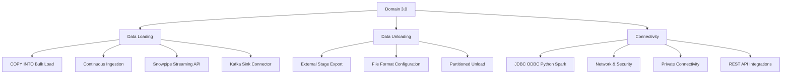
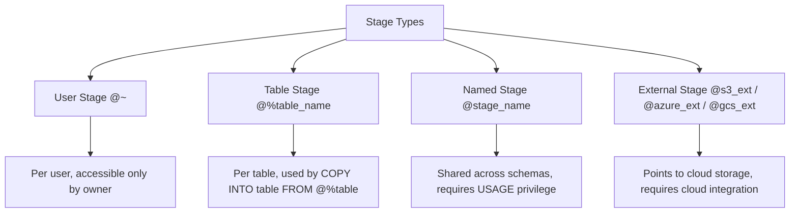
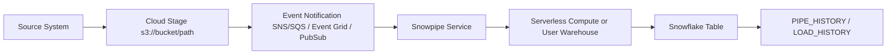
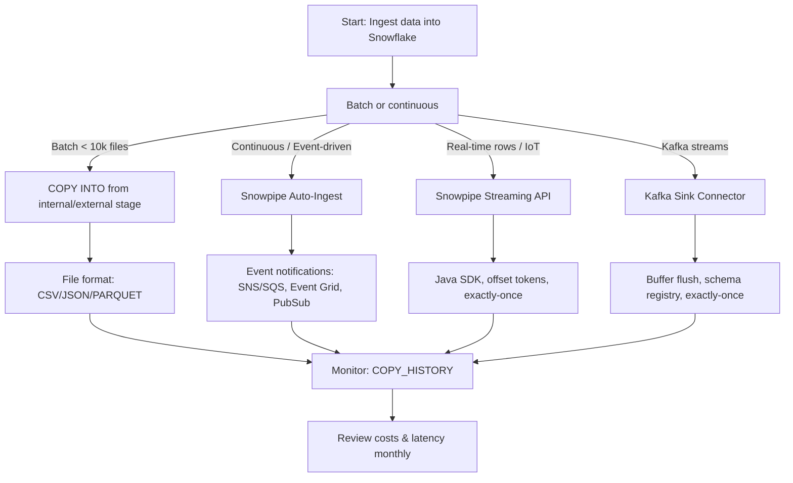

# Domain 3.0: Data Loading, Unloading, and Connectivity in Snowflake



---

## 1. Data Loading Architecture & Fundamentals

### Core Loading Philosophy
Snowflake decouples compute from storage. Data loading does not transform storage architecture; it writes **micro-partitions** (50–500 MB uncompressed, columnar, compressed) directly into Snowflake's managed storage. Compute (virtual warehouse) is only consumed during the parsing, validation, and write phase. Once loaded, data is immutable and queryable instantly.

### Loading Pipeline Components
| Component | Purpose | Key Configuration |
|-----------|---------|-------------------|
| **Stage** | Temporary holding area for files before loading | Internal (`@~`, `@%table`, `@named`) or External (`s3://`, `azure://`, `gcs://`) |
| **File Format** | Defines parsing rules, compression, encoding | `TYPE`, `FIELD_DELIMITER`, `COMPRESSION`, `STRIP_OUTER_ARRAY`, `SKIP_HEADER` |
| **COPY INTO** | Executes bulk data movement from stage to table | Parallel execution, error handling, validation, purge |
| **Snowpipe** | Continuous auto-ingest triggered by cloud events | Serverless or warehouse-managed, event notifications |
| **Snowpipe Streaming** | Direct row ingestion via API | Java SDK, offset tokens, exactly-once semantics, no staging |

### Stage Hierarchy & Scope


### Cloud Integration Architecture
External stages require a **Cloud Integration** object to authenticate securely without hardcoding credentials.

| Cloud | Integration Type | Authentication Mechanism |
|-------|-----------------|--------------------------|
| AWS | `STORAGE_INTEGRATION` | IAM Role + External ID + Trust Policy |
| Azure | `STORAGE_INTEGRATION` | Managed Identity / Service Principal + Tenant ID |
| GCP | `STORAGE_INTEGRATION` | Service Account + Workload Identity Federation |

```sql
-- AWS Integration Example
CREATE OR REPLACE STORAGE INTEGRATION s3_integration
  TYPE = EXTERNAL_STAGE
  STORAGE_PROVIDER = 'S3'
  ENABLED = TRUE
  STORAGE_AWS_ROLE_ARN = 'arn:aws:iam::123456789012:role/snowflake-ingest-role'
  STORAGE_ALLOWED_LOCATIONS = ('s3://my-bucket/raw/', 's3://my-bucket/staged/');

-- External Stage Creation
CREATE OR REPLACE EXTERNAL STAGE s3_raw_stage
  URL = 's3://my-bucket/raw/'
  STORAGE_INTEGRATION = s3_integration
  FILE_FORMAT = (TYPE = PARQUET);
```

---

## 2. Bulk Data Loading (COPY INTO)

### Core Syntax & Parameters
```sql
COPY INTO <target_table>
FROM '<stage_path>'
FILE_FORMAT = (FORMAT_NAME = '<format>' OR (TYPE = 'CSV' COMPRESSION = 'AUTO'))
PATTERN = '.*\.gz$'
FILES = ('file1.csv', 'file2.csv')
ON_ERROR = 'CONTINUE' | 'SKIP_FILE' | 'SKIP_FILE_5' | 'ABORT_STATEMENT'
FORCE = TRUE | FALSE
PURGE = TRUE | FALSE
ENFORCE_LENGTH = TRUE | FALSE
TRUNCATECOLUMNS = TRUE | FALSE
MATCH_BY_COLUMN_NAME = CASE_SENSITIVE | CASE_INSENSITIVE | NONE
SIZE_LIMIT = <bytes>
RETURN_FAILED_ONLY = TRUE | FALSE;
```

### Critical Parameter Behavior
| Parameter | Behavior | When To Use |
|-----------|----------|-------------|
| `ON_ERROR` | Determines load failure handling | `'SKIP_FILE'` for dirty data, `'ABORT_STATEMENT'` for strict validation |
| `FORCE` | Reloads already-loaded files | Debugging, reprocessing, idempotent reloads |
| `PURGE` | Deletes source files after successful load | Reduces stage storage, requires stage ownership |
| `ENFORCE_LENGTH` | Fails on string length overflow | Target columns have strict `VARCHAR(n)` |
| `TRUNCATECOLUMNS` | Truncates oversized strings instead of failing | Acceptable data loss for ETL tolerance |
| `MATCH_BY_COLUMN_NAME` | Maps source columns to target by name, not position | Schema evolution, flexible ingestion pipelines |
| `SIZE_LIMIT` | Stops load after processing X bytes | Testing, quota enforcement, phased loads |

### File Format Optimization for Loading
```sql
-- CSV with header skip and null handling
CREATE OR REPLACE FILE FORMAT csv_load_fmt
  TYPE = CSV
  FIELD_DELIMITER = ','
  RECORD_DELIMITER = '\n'
  SKIP_HEADER = 1
  EMPTY_FIELD_AS_NULL = TRUE
  TRIM_SPACE = TRUE
  ENFORCE_LENGTH = FALSE;

-- JSON with outer array stripping
CREATE OR REPLACE FILE FORMAT json_load_fmt
  TYPE = JSON
  COMPRESSION = 'AUTO'
  STRIP_OUTER_ARRAY = TRUE
  STRIP_NULL_VALUES = TRUE
  ALLOW_DUPLICATE = FALSE
  ENABLE_OCTAL = FALSE;

-- PARQUET (recommended for large volumes)
CREATE OR REPLACE FILE_FORMAT parquet_load_fmt
  TYPE = PARQUET
  COMPRESSION = 'SNAPPY'
  BINARY_AS_TEXT = FALSE;
```

### Performance Tuning Rules
| Rule | Implementation | Impact |
|------|---------------|--------|
| **Optimal File Size** | 10–100 MB uncompressed per file | Maximizes parallelism; avoids tiny file overhead |
| **Parallelism** | Scale warehouse size; Snowflake auto-parallelizes per file | 1 file = 1 thread; 100 files = up to 100 threads |
| **Compression** | Pre-compress source files (GZIP, SNAPPY) | Reduces network transfer, storage, and parse time |
| **Warehouse Sizing** | Match warehouse to file count/volume | XSmall for <50 files; Large/XLarge for 10k+ files |
| `MAX_CONCURRENCY` | Session parameter to cap parallel threads | Prevents warehouse saturation during bulk loads |

```sql
-- High-throughput load session
ALTER SESSION SET MAX_CONCURRENCY = 10;
ALTER SESSION SET STATEMENT_TIMEOUT_IN_SECONDS = 3600;

COPY INTO analytics.events_raw
FROM @s3_raw_stage/events/
FILE_FORMAT = (FORMAT_NAME = parquet_load_fmt)
PATTERN = '.*\.parquet$'
ON_ERROR = 'SKIP_FILE_3'
PURGE = FALSE;
```

### Common COPY INTO Errors & Resolutions
| Error Code | Cause | Resolution |
|------------|-------|------------|
| `Numeric value out of bounds` | Source exceeds target column precision | Use `TRUNCATECOLUMNS = TRUE` or increase precision |
| `String too long` | VARCHAR overflow | Use `TRUNCATECOLUMNS` or widen column |
| `Field not found` | Column count mismatch or missing delimiter | Verify `FIELD_DELIMITER`, use `SKIP_BLANK_LINES = TRUE` |
| `Missing column` | `ENFORCE_LENGTH = TRUE` with NULL mismatch | Set `EMPTY_FIELD_AS_NULL = TRUE`, disable enforcement |
| `Permission denied` | Missing stage USAGE or integration privilege | `GRANT USAGE ON STAGE TO ROLE`, verify cloud IAM |


## 3. Continuous & Streaming Data Ingestion

### Snowpipe (Event-Driven Auto-Ingest)
Snowpipe triggers `COPY INTO` automatically when cloud storage emits file arrival events.



#### Snowpipe Configuration
```sql
-- Serverless Snowpipe (recommended for most workloads)
CREATE OR REPLACE PIPE raw_events_pipe
  AUTO_INGEST = TRUE
  INTEGRATION = s3_integration
  AS
  COPY INTO analytics.events_raw
  FROM @s3_raw_stage/events/
  FILE_FORMAT = (FORMAT_NAME = parquet_load_fmt)
  ON_ERROR = 'CONTINUE';

-- Grant pipe privileges
GRANT USAGE ON INTEGRATION s3_integration TO ROLE pipe_role;
GRANT OWNERSHIP ON PIPE raw_events_pipe TO ROLE pipe_role REVOKE CURRENT GRANTS;
```

#### Cloud Event Notification Setup (AWS Example)
1. SQS Queue Policy allows Snowflake account ID to `sqs:SendMessage`
2. S3 Bucket Notification → SQS Queue on `s3:ObjectCreated:*`
3. `ALTER PIPE raw_events_pipe REFRESH;` (initial load)
4. Snowflake auto-polls SQS, parses notifications, executes `COPY INTO`

#### Snowpipe Billing Model
- **Serverless**: Billed per credit consumed by Snowflake-managed compute + cloud services. Scales automatically. No warehouse required.
- **Warehouse-Managed**: Attaches to user warehouse. Billed at warehouse rate. Better for predictable, high-volume loads where you control compute.

```sql
-- Switch to warehouse-managed
CREATE OR REPLACE PIPE raw_events_pipe_wh
  AUTO_INGEST = TRUE
  INTEGRATION = s3_integration
  AS
  COPY INTO analytics.events_raw
  FROM @s3_raw_stage/events/
  FILE_FORMAT = (FORMAT_NAME = parquet_load_fmt);

ALTER PIPE raw_events_pipe_wh SET PIPE_EXECUTION_PAUSED = FALSE;
-- Attach to warehouse during COPY execution (automatic)
```

### Snowpipe Streaming API
Direct row ingestion bypassing staging. Java SDK only. Exactly-once semantics via offset tokens.

```java
// Java SDK Example (Conceptual)
SnowflakeStreamingIngestClient client = new SnowflakeStreamingIngestClient("client_config.json");
SnowflakeStreamingIngestChannel channel = client.openChannel("channel1", "raw_events_pipe_stream");

Map<String, Object> row = new HashMap<>();
row.put("event_id", UUID.randomUUID().toString());
row.put("timestamp", Instant.now().getEpochSecond());
row.put("payload", "{\"action\":\"click\",\"page\":\"home\"}");

InsertValidationResponse response = channel.insertRow(row, "offset_token_123");
if (response.hasErrors()) {
    // Handle duplicate or validation failure
}
client.close();
```

#### Streaming API Characteristics
| Feature | Behavior |
|---------|----------|
| **No Staging Required** | Rows sent directly via HTTP/2 to Snowflake |
| **Exactly-Once** | Offset tokens prevent duplicates; idempotent retries |
| **Latency** | Sub-second to few seconds depending on flush interval |
| **Use Cases** | IoT telemetry, clickstream, real-time fraud detection, change data capture |
| **Limitations** | Java SDK only, no DDL during ingestion, channel-level throttling applies |

### Kafka Sink Connector
Official `snowflake.kafka.connector` for exactly-once or at-least-once ingestion.

```properties
# connector.properties
connector.class=com.snowflake.kafka.connector.SnowflakeSinkConnector
tasks.max=4
topics=events,orders,users
snowflake.topic2table.map=events:analytics.events_raw,orders:analytics.orders_raw
buffer.count.records=10000
buffer.flush.time=60
snowflake.url.name=<account>.<region>.snowflakecomputing.com
snowflake.user.name=kafka_svc
snowflake.private.key=<path_to_pem>
snowflake.database.name=RAW_DB
snowflake.schema.name=KAFKA_INGEST
key.converter=org.apache.kafka.connect.storage.StringConverter
value.converter=io.confluent.connect.avro.AvroConverter
value.converter.schema.registry.url=http://schema-registry:8081
```

#### Kafka Connector Guarantees
- **Exactly-Once**: Enabled by `buffer.count.records` + `buffer.flush.time` + Snowflake transactional commits
- **Offset Management**: Connector tracks Kafka offsets in Snowflake metadata table
- **Schema Evolution**: Avro/Protobuf schema registry integration; `VARIANT` column auto-handles structural changes


## 4. Data Unloading & External Export

### Core COPY INTO <location> Syntax
```sql
COPY INTO '<external_stage_or_s3_path>'
FROM (SELECT * FROM <source_table>)
FILE_FORMAT = (TYPE = 'PARQUET' COMPRESSION = 'SNAPPY')
MAX_FILE_SIZE = 100000000  -- 100 MB
HEADER = TRUE
NULL_IF = ('NULL', 'null', '')
SINGLE = FALSE
INCLUDE_QUERY_ID = FALSE
OVERWRITE = FALSE
DETAILED_OUTPUT = FALSE;
```

### Unload Configuration Matrix
| Scenario | Recommended Settings | Rationale |
|----------|---------------------|-----------|
| Data Lake Archival | `TYPE = PARQUET`, `COMPRESSION = SNAPPY`, `MAX_FILE_SIZE = 128MB` | Optimized for Spark/Presto, cost-effective storage |
| External BI Consumption | `TYPE = CSV`, `HEADER = TRUE`, `FIELD_OPTIONALLY_ENCLOSED_BY = '"'` | Human-readable, BI tool compatible |
| Partitioned Export | `PARTITION BY (DATE_TRUNC('month', created_date), region)` | Enables efficient downstream filtering |
| Semi-Structured Export | `TYPE = JSON`, `COMPRESSION = GZIP`, `STRIP_NULL_VALUES = TRUE` | Preserves schema flexibility |

### Partitioned Unload Example
```sql
COPY INTO 's3://analytics-archive/exported/'
FROM (
  SELECT 
    event_id,
    event_type,
    payload,
    created_date,
    region
  FROM analytics.events
  WHERE created_date >= '2023-01-01'
)
FILE_FORMAT = (TYPE = PARQUET)
PARTITION BY (DATE_PART('YEAR', created_date), DATE_PART('MONTH', created_date), region)
MAX_FILE_SIZE = 67108864;  -- 64 MB
```
**Resulting Structure:**
```
s3://analytics-archive/exported/
├── YEAR=2023/MONTH=01/region=US/file1_0_0.parquet
├── YEAR=2023/MONTH=01/region=EU/file2_0_0.parquet
└── YEAR=2023/MONTH=02/region=US/file3_0_0.parquet
```

### Unload Performance Rules
| Rule | Implementation | Impact |
|------|---------------|--------|
| **Parallel Unload** | Scale warehouse size; Snowflake splits result set automatically | Larger warehouses = faster export |
| **File Size Tuning** | `MAX_FILE_SIZE` between 10–256 MB | Avoids tiny files; matches downstream processing expectations |
| **Compression** | Use `SNAPPY` or `ZSTD` | Reduces egress cost and storage footprint |
| `INCLUDE_QUERY_ID = TRUE` | Adds query ID to unloaded files for traceability | Critical for audit and reconciliation |
| `SINGLE = FALSE` | Ensures parallel file creation | Required for large exports |

### Egress Cost Management
- Snowflake **does not charge** for data egress to the same cloud provider region.
- Cross-region or cross-cloud egress incurs standard cloud provider rates ($0.02–$0.12/GB).
- Use **VPC endpoints / PrivateLink** to keep traffic within cloud backbone and reduce costs/latency.
- Schedule large unloads during off-peak hours; monitor `COPY_HISTORY` for bytes unloaded.


## 5. Connectivity & Integration Architecture

### Client Connectivity Matrix
| Connector | Language/Framework | Primary Use Case | Key Parameters |
|-----------|-------------------|------------------|----------------|
| **JDBC** | Java, Scala, BI Tools | Enterprise apps, ETL, Spark | `truncatetimestampcolumns`, `querytag`, `loginTimeout` |
| **ODBC** | C/C++, Excel, Power BI, Tableau | Desktop BI, legacy systems | `Driver=SnowflakeDSIIDriver`, `Authenticator=SNOWFLAKE_JWT` |
| **Python Connector** | Python, Pandas, Airflow | Data science, orchestration, Snowpark | `warehouse`, `role`, `private_key_file`, `autocommit` |
| **Spark Connector** | Apache Spark, Databricks | Distributed processing, Delta Lake sync | `sfURL`, `sfUser`, `sfWarehouse`, `dbtable`, `query` |
| **Node.js** | JavaScript, Serverless | Web apps, API backends | `account`, `username`, `password`, `region` |
| **.NET** | C#, ASP.NET, Power Apps | Windows enterprise, internal tools | `Snowflake.Data`, `ConnectionString`, `Pooling` |

### Connection String Architecture
```text
jdbc:snowflake://<account_locator>.<region>.snowflakecomputing.com/?
  warehouse=COMPUTE_WH&
  db=ANALYTICS&
  schema=PUBLIC&
  role=ANALYST_ROLE&
  authenticator=oauth&
  token=<oauth_token>&
  client_session_keep_alive=false&
  query_timeout=300
```

**Account Locator Format:**
- `account` (legacy): `xy12345.us-east-1`
- `organization-account` (modern): `myorg-myaccount.aws.us-east-1`
- Always use fully qualified account name in production to prevent routing ambiguity.

### Connection Pooling & Session Management
| Parameter | Default | Recommended Production Setting | Rationale |
|-----------|---------|-------------------------------|-----------|
| `client_session_keep_alive` | `false` | `false` (for stateless), `true` (for long notebooks) | Prevents session hijacking; reduces idle warehouse time |
| `loginTimeout` | 30s | 10–15s | Fails fast on network issues; avoids thread exhaustion |
| `queryTimeout` / `STATEMENT_TIMEOUT_IN_SECONDS` | 0 (infinite) | 300–600 | Prevents runaway queries from holding warehouse resources |
| `warehouse` | None | Explicit per connection | Prevents accidental execution on default warehouse |
| `role` | User default | Least-privilege role per app | Enforces RBAC at connection layer |

### Partner Connect Ecosystem
| Category | Tools | Integration Pattern |
|----------|-------|---------------------|
| **Ingestion** | Fivetran, Stitch, Airbyte, Qlik Replicate | OAuth/S3 staging → Snowpipe → Auto-schema evolution |
| **Transformation** | dbt, Coalesce, Dataform | Git-integrated, warehouse-managed execution, Snowflake-native |
| **BI/Visualization** | Tableau, Looker, Power BI, Sigma | ODBC/JDBC, semantic layer pushdown, query caching |
| **Orchestration** | Airflow, Prefect, Dagster, Matillion | Python connector, task-level warehouse scaling, error handling |
| **ML/Data Science** | Databricks, SageMaker, Vertex AI | Spark connector, Snowpark Python, external function APIs |


## 6. Security, Network & Private Connectivity

### Network Policies
Restrict access by IP at account or user level.

```sql
-- Create network policy
CREATE OR REPLACE NETWORK POLICY corp_access
  ALLOWED_IP_LIST = ('192.168.1.0/24', '10.0.0.0/8', '203.0.113.50/32')
  BLOCKED_IP_LIST = ('198.51.100.0/24')
  COMMENT = 'Corporate and approved partner IPs only';

-- Apply to account
ALTER ACCOUNT SET NETWORK_POLICY = corp_access;

-- Apply to specific user
ALTER USER etl_service SET NETWORK_POLICY = corp_access;
```

**Evaluation Order:** `BLOCKED_IP_LIST` takes precedence over `ALLOWED_IP_LIST`. If IP matches blocked, connection denied immediately.

### Private Connectivity Options
| Technology | Cloud Provider | Architecture | Use Case |
|------------|---------------|--------------|----------|
| **AWS PrivateLink** | AWS | VPC Endpoint → Snowflake Private Endpoint | Keep traffic within AWS backbone; zero public internet exposure |
| **Azure Private Link** | Azure | Private Endpoint → Snowflake PaaS | Azure VNet isolation; compliance with data residency |
| **GCP Private Service Connect** | GCP | PSC Endpoint → Snowflake Service Attachment | Google Cloud VPC isolation; low-latency analytics |
| **VPC Peering** | All | Direct VPC-to-VPC routing | Multi-account architectures; legacy network topologies |

**Setup Requirements:**
1. Enable Private Connectivity in Snowflake UI (requires ACCOUNTADMIN)
2. Create cloud provider endpoint (VPC Endpoint / Private Link / PSC)
3. Update DNS to resolve to private endpoint
4. Test connectivity from private subnet; verify no public IP exposure

### Authentication Methods for Connectivity
| Method | Setup Complexity | Security Level | Best For |
|--------|-----------------|---------------|----------|
| **Username/Password** | Low | Medium | Quick tests, personal use |
| **Key Pair (RSA)** | Medium | High | Automation, ETL, CI/CD pipelines |
| **OAuth 2.0** | High | High | Web apps, mobile, short-lived tokens |
| **SAML SSO** | High | High | Corporate IdP integration, MFA enforcement |
| **External Browser** | Low | Medium | Interactive CLI, notebook access with MFA |

```python
# Python Connector with Key Pair Authentication
import snowflake.connector
import os

ctx = snowflake.connector.connect(
    user='etl_svc',
    account='myorg-myaccount.aws.us-east-1',
    private_key_path=os.environ['SNOWFLAKE_PRIVATE_KEY'],
    warehouse='ETL_WH',
    role='ETL_LOADER',
    client_session_keep_alive=False
)
```

### Compliance & Data Residency
- **TLS 1.2+ enforced** for all client connections.
- **Data at rest**: AES-256 encryption; Tri-Secret Secure available for highest compliance tiers.
- **Cross-region replication**: Explicitly configured; data never leaves region without failover/replication group.
- **GDPR/HIPAA/PCI**: Use `COPY INTO` with `ENFORCE_LENGTH`, `ON_ERROR = 'ABORT_STATEMENT'`, audit via `COPY_HISTORY` and `ACCESS_HISTORY`.
- **Zero-copy cloning**: Preserves data lineage; does not duplicate physical storage.


## 7. Performance Optimization & Best Practices

### File Sizing & Parallelism Rules
| Metric | Optimal Range | Impact of Deviation |
|--------|--------------|---------------------|
| **Uncompressed file size** | 10–100 MB | <10 MB = thread overhead; >100 MB = under-parallelized |
| **Files per load** | 100–10,000 | Too few = serial bottleneck; too many = metadata overhead |
| **Compression ratio** | 3:1 to 5:1 | High compression reduces network/storage but adds CPU parse cost |
| `MAX_CONCURRENCY` | Match to file count / 10 | Prevents warehouse queueing; aligns with thread pool |

### Warehouse Sizing for Loading/Unloading
| Workload | Recommended Size | Auto-Suspend | Rationale |
|----------|-----------------|--------------|-----------|
| **Small bulk (<50 files)** | XSmall or Small | 60s | Quick parse, low cost |
| **Medium bulk (50–5k files)** | Medium or Large | 120s | Balanced parallelism |
| **Large bulk (>5k files)** | XLarge or 2XLarge | 180s | Maximize thread allocation |
| **Streaming/Snowpipe** | Serverless or Small | N/A | Event-driven; scales automatically |
| **Unload to external** | Medium or Large | 300s | Result set materialization requires memory |

### Semi-Structured Data Optimization
```sql
-- Flatten JSON efficiently
SELECT 
  src:customer_id::NUMBER as customer_id,
  src:events[0].action::STRING as first_action,
  src:metadata.region::STRING as region
FROM raw.events_json,
LATERAL FLATTEN(input => src:events) f;

-- Index VARIANT columns for query performance
ALTER TABLE raw.events_json ADD SEARCH OPTIMIZATION ON EQUALITY(src:customer_id);
```

**Best Practices:**
- Use `STRIP_OUTER_ARRAY = TRUE` for JSON arrays
- Enable `ENABLE_OCTAL = FALSE` to prevent parsing overhead
- Store semi-structured data in `VARIANT`, not flattened tables unless queried heavily
- Use `SEARCH OPTIMIZATION` on frequently filtered VARIANT paths

### Anti-Patterns to Avoid
| Anti-Pattern | Consequence | Fix |
|--------------|-------------|-----|
| Loading millions of <1MB files | Metadata overhead, slow load, high cost | Consolidate files upstream or use `SIZE_LIMIT` |
| Using `ON_ERROR = 'CONTINUE'` blindly | Silent data corruption, compliance failure | Use `'SKIP_FILE_3'` + audit error table |
| Disabling compression | 3–5x network/storage cost, slower load | Pre-compress or use `COMPRESSION = 'AUTO'` |
| Oversizing warehouse for small loads | Wasted credits, no performance gain | Right-size based on file count/volume |
| Ignoring `ENFORCE_LENGTH` | Silent truncation, data integrity loss | Enable for production, log violations |


## 8. Monitoring, Troubleshooting & Cost Management

### Key Monitoring Views
| View | Retention | Key Columns | Use Case |
|------|-----------|-------------|----------|
| `COPY_HISTORY` | 14 days | `FILE_NAME`, `STATUS`, `ROW_COUNT`, `ERROR_COUNT`, `FIRST_ERROR_MESSAGE` | Track load success/failure, error analysis |
| `PIPE_HISTORY` | 365 days | `PIPE_NAME`, `CREDITS_USED`, `NUM_FILES_PROCESSED`, `NUM_BYTES_INSERTED` | Snowpipe performance & cost tracking |
| `LOAD_HISTORY` | 1 year | `FILE_NAME`, `TABLE_SCHEMA`, `TABLE_NAME`, `STAGE_NAME`, `COPY_HISTORY_VIEW_NAME` | End-to-end load lineage |
| `WAREHOUSE_METERING_HISTORY` | 365 days | `WAREHOUSE_NAME`, `CREDITS_USED`, `CREDITS_USED_CLOUD_SERVICES` | Compute cost attribution |
| `DATABASE_STORAGE_USAGE` | 365 days | `DATABASE_NAME`, `ACTIVE_BYTES`, `TIME_TRAVEL_BYTES` | Storage growth tracking |

### Querying Load History
```sql
-- Failed files in last 24 hours
SELECT 
  file_name,
  status,
  error_count,
  first_error_message,
  table_schema || '.' || table_name as target_table
FROM TABLE(INFORMATION_SCHEMA.COPY_HISTORY(
  TABLE_NAME => 'analytics.events_raw',
  START_TIME => DATEADD(hour, -24, CURRENT_TIMESTAMP())
))
WHERE status = 'LOAD_FAILED'
ORDER BY error_count DESC;

-- Snowpipe cost & throughput
SELECT 
  pipe_name,
  DATE_TRUNC('hour', start_time) as hour_bucket,
  SUM(credits_used) as credits_used,
  SUM(num_files_processed) as files_loaded,
  SUM(num_bytes_inserted) / POWER(1024, 3) as gb_loaded
FROM SNOWFLAKE.ACCOUNT_USAGE.PIPE_HISTORY
WHERE start_time > DATEADD(day, -7, CURRENT_TIMESTAMP())
GROUP BY pipe_name, DATE_TRUNC('hour', start_time)
ORDER BY hour_bucket DESC, credits_used DESC;
```

### Cost Management Strategies
| Strategy | Implementation | Savings Impact |
|----------|---------------|----------------|
| **Snowpipe Serverless vs Warehouse** | Use serverless for sporadic loads; warehouse for predictable high volume | 20–40% cost reduction |
| **File Consolidation** | Aggregate small files pre-load via Glue, Airflow, or Fivetran | 15–30% compute reduction |
| `PURGE = TRUE` | Remove loaded files from stage automatically | Reduces storage cost, prevents duplicate loads |
| **Right-Sized Warehouses** | Scale based on `PIPE_HISTORY` and `COPY_HISTORY` metrics | 30–60% credit savings |
| **Resource Monitors** | Attach to loading warehouses with `ON 90% DO SUSPEND` | Prevents budget overruns |

### Alerting for Load Failures
```sql
-- Task to alert on failed COPY loads
CREATE OR REPLACE TASK governance.copy_failure_alert
  WAREHOUSE = admin_wh
  SCHEDULE = 'USING CRON */30 * * * *'
WHEN (
  SELECT COUNT(*)
  FROM TABLE(INFORMATION_SCHEMA.COPY_HISTORY(
    TABLE_NAME => 'analytics.events_raw',
    START_TIME => DATEADD(hour, -1, CURRENT_TIMESTAMP())
  )) > 0
)
AS
  SYSTEM$SEND_EMAIL(
    'data-eng-oncall@company.com',
    'Snowflake Load Failure Alert',
    (SELECT LISTAGG(file_name || ': ' || first_error_message, '\n')
     FROM TABLE(INFORMATION_SCHEMA.COPY_HISTORY(
       TABLE_NAME => 'analytics.events_raw',
       START_TIME => DATEADD(hour, -1, CURRENT_TIMESTAMP())
     ))
     WHERE status = 'LOAD_FAILED')
  );
```


## 9. Decision Frameworks & Quick Reference

### Data Loading Method Selection


### File Format Selection Matrix
| Data Type | Recommended Format | Compression | Parsing Overhead | Query Performance |
|-----------|-------------------|-------------|------------------|-------------------|
| Tabular, fixed schema | PARQUET | SNAPPY/ZSTD | Low | Excellent (columnar) |
| Semi-structured, flexible | JSON | GZIP | Medium | Good (VARIANT + FLATTEN) |
| Legacy CSV/TSV | CSV/TSV | GZIP | High | Moderate (requires parsing) |
| Binary/Avro/Protobuf | AVRO/ORC | SNAPPY | Low-Medium | Good (type preservation) |
| Archival/Compliance | PARQUET | ZSTD | Low | Excellent |

### Connectivity Quick Syntax
```text
# JDBC
jdbc:snowflake://<account>.<region>.snowflakecomputing.com/?warehouse=WH&role=ROLE&authenticator=oauth

# Python
import snowflake.connector
ctx = snowflake.connector.connect(user='u', account='acct', warehouse='wh', role='r')

# Spark (Scala)
val df = spark.read.format("snowflake")
  .option("sfURL", url)
  .option("sfUser", user)
  .option("sfWarehouse", wh)
  .option("dbtable", "db.schema.table")
  .load()

# ODBC (DSN-less)
DRIVER={SnowflakeDSIIDriver};SERVER=<account>.<region>.snowflakecomputing.com;UID=user;PWD=pass;WAREHOUSE=wh;ROLE=r
```

### Common Error Codes & Resolutions
| Code | Message | Resolution |
|------|---------|------------|
| `100035` | `Numeric value out of bounds` | Increase column precision or use `TRUNCATECOLUMNS` |
| `100076` | `Field not found` | Verify delimiter, enable `SKIP_BLANK_LINES`, check file encoding |
| `200003` | `Invalid OAuth token` | Refresh token, verify client credentials, check expiry |
| `300001` | `Network policy blocked IP` | Update `ALLOWED_IP_LIST` or connect from allowed subnet |
| `300004` | `Warehouse suspended` | Enable `AUTO_RESUME = TRUE` or manually resume |
| `400001` | `Insufficient privileges` | Grant `USAGE` on stage/integration, verify role context |


## Key Principles to Remember
1. **File size dictates parallelism.** 10–100 MB uncompressed per file maximizes Snowflake's multi-threaded load engine.
2. **Stages are temporary.** Use internal stages for ad-hoc loads, external stages for pipeline automation, purge after load.
3. **Snowpipe scales automatically.** Serverless billing aligns cost with actual ingestion volume; monitor `PIPE_HISTORY`.
4. **Connectivity requires explicit context.** Always specify `warehouse`, `role`, and `database` in connection strings or session parameters.
5. **Security is layered.** Network policies → Authentication → RBAC → Row/Column masking → Audit logging.
6. **Monitor everything.** `COPY_HISTORY`, `PIPE_HISTORY`, `LOAD_HISTORY`, and `WAREHOUSE_METERING_HISTORY` are your source of truth.
7. **Cost follows design.** Right-size warehouses, consolidate files, enable compression, attach resource monitors.

## Bottom Line
- **Loading** is parallelized by file count and warehouse size. Optimize upstream file sizing, use appropriate formats, and enforce strict error handling.
- **Unloading** requires explicit partitioning, size limits, and compression tuning to minimize egress cost and maximize downstream usability.
- **Connectivity** demands explicit authentication, network isolation, and session parameter governance to ensure security and performance.
- **Streaming** (Snowpipe, Kafka, Streaming API) trades staging simplicity for latency reduction; implement exactly-once semantics via offset management.
- **Monitoring & Cost Management** are non-negotiable. Track `COPY_HISTORY`, attach resource monitors, right-size compute, and archive cold data.
- **Documentation & Automation** prevent drift. Store file formats, pipe definitions, network policies, and connection configs in version-controlled infrastructure-as-code.

Snowflake's data movement layer is highly optimized, but it requires deliberate architecture. Measure file volumes, size compute appropriately, enforce security boundaries, monitor continuously, and adjust quarterly. That is how Domain 3.0 operates in production at scale.
