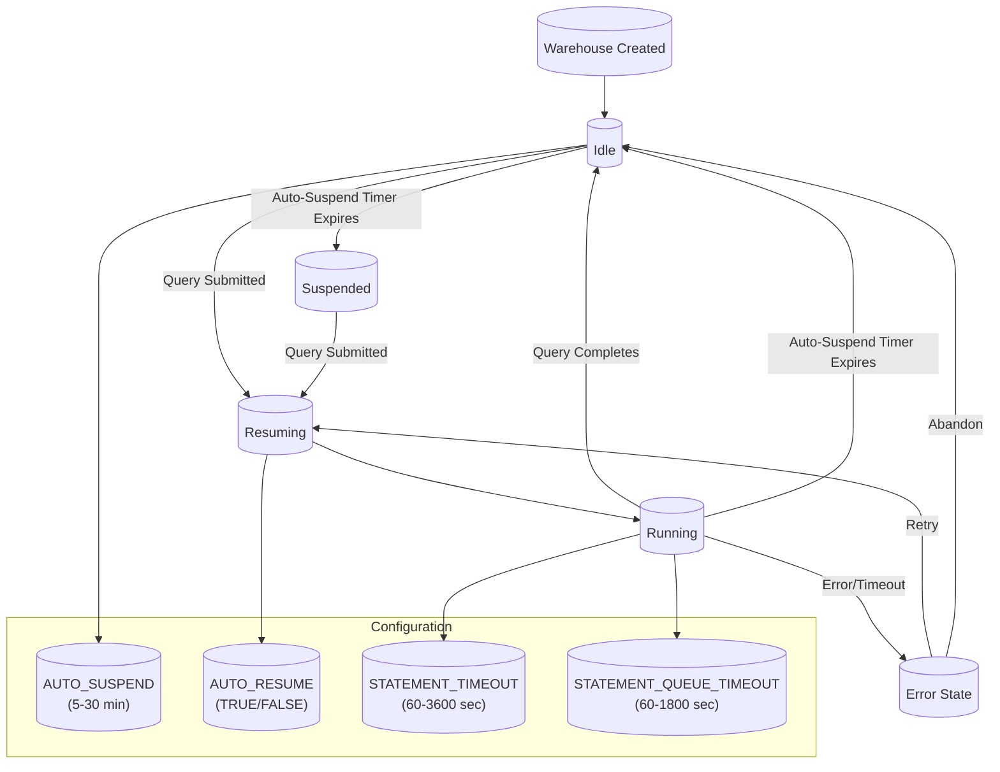

# **Snowflake Workload Management Best Practices: Production-Grade Guide**

---

## **📌 Table of Contents**
1. [Introduction to Workload Management Best Practices](#1-introduction-to-workload-management-best-practices)
2. [Warehouse Configuration Best Practices](#2-warehouse-configuration-best-practices)
3. [Resource Monitor Best Practices](#3-resource-monitor-best-practices)
4. [Query Prioritization Best Practices](#4-query-prioritization-best-practices)
5. [Workload Isolation Best Practices](#5-workload-isolation-best-practices)
6. [Monitoring and Alerting Best Practices](#6-monitoring-and-alerting-best-practices)
7. [Cost Optimization Best Practices](#7-cost-optimization-best-practices)
8. [Performance Optimization Best Practices](#8-performance-optimization-best-practices)
9. [Troubleshooting Best Practices](#9-troubleshooting-best-practices)
10. [Decision Matrix: Workload Management Strategies](#10-decision-matrix-workload-management-strategies)
11. [Production Checklist](#11-production-checklist)
12. [Production-Ready Code Snippets](#12-production-ready-code-snippets)
13. [Real-World Examples](#13-real-world-examples)
14. [Final Recommendations](#14-final-recommendations)

---


## **1. Introduction to Workload Management Best Practices**

### **🎯 Why Workload Management Matters in Snowflake**
Effective workload management in Snowflake ensures:
✅ **Performance Consistency** – Prevents "noisy neighbor" problems where one workload degrades others
✅ **Cost Control** – Limits credit usage to stay within budget and prevents bill shocks
✅ **Resource Allocation** – Prioritizes critical workloads (production ETL over ad-hoc queries)
✅ **SLA Compliance** – Meets performance SLAs for different user groups
✅ **Scalability** – Handles concurrent workloads without manual intervention
✅ **Operational Excellence** – Provides visibility and control over data platform operations


### **🏗️ Core Principles of Workload Management**

| **Principle** | **Description** | **Implementation** |
|--------------|----------------|-------------------|
| **Isolation** | Separate critical workloads to prevent interference | Use separate warehouses for production vs. development |
| **Right-Sizing** | Use the smallest warehouse that meets performance requirements | Start with Small/Medium, monitor, and scale as needed |
| **Auto-Scaling** | Automatically adjust resources based on demand | Use multi-cluster warehouses with appropriate scaling policies |
| **Cost Awareness** | Monitor and limit credit usage | Implement resource monitors with quotas and thresholds |
| **Prioritization** | Ensure critical queries get resources first | Use query prioritization (HIGH/MEDIUM/LOW) |
| **Observability** | Monitor all aspects of workload performance | Set up comprehensive monitoring and alerting |
| **Automation** | Automate routine workload management tasks | Use stored procedures, tasks, and scripts |
| **Documentation** | Document workload policies and configurations | Maintain runbooks and architecture diagrams |


### **📊 Workload Management Maturity Model**

| **Maturity Level** | **Characteristics** | **Capabilities** | **Best For** |
|-------------------|-------------------|-----------------|-------------|
| **Level 1: Ad Hoc** | No formal workload management | Manual warehouse management, no monitoring | Small teams, development environments |
| **Level 2: Basic** | Basic warehouse separation | Separate warehouses for dev/prod, simple monitoring | Small to medium teams, growing workloads |
| **Level 3: Managed** | Resource monitors + prioritization | Credit quotas, query prioritization, basic alerts | Medium to large teams, production environments |
| **Level 4: Optimized** | Multi-cluster + advanced monitoring | Auto-scaling, comprehensive monitoring, cost optimization | Large teams, complex workloads |
| **Level 5: Autonomous** | Full automation + AI optimization | Automated scaling, predictive workload management, self-healing | Enterprise-scale, mission-critical workloads |

**Current State Assessment:**
- [ ] We have separate warehouses for different workload types
- [ ] We use resource monitors to control costs
- [ ] We implement query prioritization
- [ ] We monitor warehouse performance and usage
- [ ] We use multi-cluster warehouses for high concurrency
- [ ] We have automated workload management processes


## **2. Warehouse Configuration Best Practices**


### **🏭 Warehouse Types and Use Cases**

| **Warehouse Type** | **Use Case** | **When to Use** | **When NOT to Use** | **Cost** | **Concurrency** |
|-------------------|------------|----------------|-------------------|---------|----------------|
| **Standard (Single-Cluster)** | General-purpose queries, development, testing, ad-hoc analysis | Low concurrency (<8 queries), small to medium workloads, cost-sensitive environments | High concurrency workloads, production ETL, large complex queries | Low-Medium | Low (1-8 queries) |
| **Multi-Cluster** | High concurrency workloads, production ETL, reporting dashboards | High concurrency (>8 queries), variable workloads, production environments | Low concurrency workloads, development environments, cost-sensitive workloads | Medium-High | High (10-100+ queries) |
| **Serverless** | Snowpipe, Ingestion Service, Replication, Search Optimization | File ingestion, row ingestion, data replication, search operations | Traditional query workloads, interactive queries | Pay-per-use | Very High (1000+ operations) |


### **📈 Warehouse Sizing Guidelines**

#### **Warehouse Size Selection Matrix**

| **Workload Type** | **Recommended Size** | **Max Concurrent Queries** | **Credit Cost/Hour** | **Memory** | **Best Practices** |
|------------------|---------------------|----------------------------|----------------------|-----------|-------------------|
| **Development/Testing** | X-Small | 1 | $0.28 | 16 GB | Use for small queries, development work |
| **Ad-Hoc Queries** | Small | 2 | $0.56 | 32 GB | Use for medium queries, low concurrency |
| **Small ETL Jobs** | Medium | 4 | $1.12 | 64 GB | Use for small to medium workloads |
| **Medium ETL Jobs** | Large | 8 | $2.24 | 128 GB | Use for medium workloads, moderate concurrency |
| **Large ETL Jobs** | X-Large | 16 | $4.48 | 256 GB | Use for large workloads, high concurrency |
| **Production ETL** | 2X-Large | 32 | $8.96 | 512 GB | Use for very large workloads, very high concurrency |
| **Production Reporting** | 3X-Large | 64 | $17.92 | 1024 GB | Use for massive workloads, highest concurrency |
| **Critical Production** | 4X-Large | 128 | $35.84 | 2048 GB | Use for largest workloads, highest SLAs |

**💡 Pro Tip:**
> **Start Small and Scale Up:** Begin with a smaller warehouse (e.g., Small or Medium) and monitor performance. Only increase size if you observe:
> - High queue times (>10 seconds)
> - Slow query execution (> expected SLA)
> - Memory pressure (spill to disk/remote)
> - High CPU utilization (>80%)


### **⚙️ Warehouse Configuration Best Practices**

#### **1. Auto-Suspend Settings**
| **Environment** | **Recommended Auto-Suspend** | **Rationale** | **Example** |
|----------------|-----------------------------|--------------|-------------|
| **Development** | 300 seconds (5 minutes) | Frequent idle periods, cost-sensitive | `ALTER WAREHOUSE dev_wh SET AUTO_SUSPEND = 300` |
| **Testing** | 600 seconds (10 minutes) | Moderate idle periods | `ALTER WAREHOUSE test_wh SET AUTO_SUSPEND = 600` |
| **Production (Interactive)** | 1800 seconds (30 minutes) | Balances cost and user experience | `ALTER WAREHOUSE prod_wh SET AUTO_SUSPEND = 1800` |
| **Production (Batch)** | 3600 seconds (1 hour) | Long-running batch jobs | `ALTER WAREHOUSE batch_wh SET AUTO_SUSPEND = 3600` |
| **Always-On** | NULL (disabled) | 24/7 operations, mission-critical | `ALTER WAREHOUSE always_on_wh SET AUTO_SUSPEND = NULL` |

**🚨 Warning:**
> **Avoid Frequent Suspend/Resume Cycles:** If a warehouse is suspended and resumed frequently (e.g., every few minutes), the overhead of resuming can negate the cost savings. In such cases, consider:
> - Increasing the auto-suspend time
> - Using a smaller warehouse size
> - Implementing query scheduling to batch operations


#### **2. Auto-Resume Settings**
| **Workload Type** | **Recommended Auto-Resume** | **Rationale** | **Example** |
|------------------|----------------------------|--------------|-------------|
| **Interactive (BI Tools, Ad-Hoc)** | TRUE | Users expect immediate response | `ALTER WAREHOUSE interactive_wh SET AUTO_RESUME = TRUE` |
| **Batch (ETL, Scheduled Jobs)** | FALSE | Prevents unnecessary resumes | `ALTER WAREHOUSE batch_wh SET AUTO_RESUME = FALSE` |
| **Mixed Workloads** | TRUE | Balances user experience and cost | `ALTER WAREHOUSE mixed_wh SET AUTO_RESUME = TRUE` |

**💡 Pro Tip:**
> **Combine with Query Prioritization:** For mixed workloads, enable auto-resume but use query prioritization to ensure critical queries get resources first.


#### **3. Multi-Cluster Warehouse Configuration**

##### **Scaling Policy Comparison**

| **Policy** | **Behavior** | **Use Case** | **Pros** | **Cons** | **Example** |
|------------|-------------|--------------|----------|----------|-------------|
| **STANDARD** | Aggressively adds clusters to meet demand | Performance-critical workloads, production ETL, real-time analytics | ⬆️ Faster response times, ⬆️ Better SLA compliance | ⬇️ Higher costs, ⬇️ More clusters may be idle | `ALTER WAREHOUSE prod_wh SET SCALING_POLICY = 'STANDARD'` |
| **ECONOMY** | Conservatively adds clusters to save costs | Cost-sensitive workloads, development, testing | ⬆️ Lower costs, ⬆️ Fewer idle clusters | ⬇️ Slower response times, ⬇️ May not meet SLAs | `ALTER WAREHOUSE dev_wh SET SCALING_POLICY = 'ECONOMY'` |

##### **Max Cluster Count Guidelines**

| **Concurrency Level** | **Recommended MAX_CLUSTER_COUNT** | **Warehouse Size** | **Use Case** | **Example** |
|-----------------------|-----------------------------------|--------------------|--------------|-------------|
| **Low (1-5 queries)** | 1 | Any | Development, testing | `MAX_CLUSTER_COUNT = 1` |
| **Medium (5-20 queries)** | 2-4 | Medium-Large | Small production workloads | `MAX_CLUSTER_COUNT = 4` |
| **High (20-50 queries)** | 4-8 | Large-X-Large | Production ETL, reporting | `MAX_CLUSTER_COUNT = 8` |
| **Very High (50-100+ queries)** | 8-10 | X-Large-2X-Large | Large-scale production, dashboards | `MAX_CLUSTER_COUNT = 10` |

**💡 Pro Tip:**
> **Start with MAX_CLUSTER_COUNT = 2:** Test with 2 clusters before scaling up. Monitor `WAREHOUSE_LOAD_HISTORY` to determine if more clusters are needed.

##### **Min Cluster Count Guidelines**

| **Workload Type** | **Recommended MIN_CLUSTER_COUNT** | **Rationale** | **Example** |
|------------------|-----------------------------------|--------------|-------------|
| **Variable Workloads** | 1 | Cost-effective, scales down when idle | `MIN_CLUSTER_COUNT = 1` |
| **Consistent High Load** | 2-4 | Avoids scaling overhead, maintains performance | `MIN_CLUSTER_COUNT = 2` |
| **Critical Workloads** | 2-8 | Ensures resources are always available | `MIN_CLUSTER_COUNT = 4` |

**🚨 Warning:**
> **Avoid Over-Provisioning:** Setting `MIN_CLUSTER_COUNT` too high can lead to unnecessary costs. Only increase if you have consistent workloads that require the extra capacity.


#### **4. Query Timeout Settings**

| **Query Type** | **Recommended Timeout** | **Rationale** | **Example** |
|---------------|-------------------------|--------------|-------------|
| **Interactive (BI Tools, Dashboards)** | 60-300 seconds | Users expect quick responses | `ALTER WAREHOUSE interactive_wh SET STATEMENT_TIMEOUT_IN_SECONDS = 120` |
| **Ad-Hoc Queries** | 300-600 seconds | Balance between responsiveness and completion | `ALTER WAREHOUSE adhoc_wh SET STATEMENT_TIMEOUT_IN_SECONDS = 300` |
| **ETL Jobs** | 3600-7200 seconds | Long-running batch processes | `ALTER WAREHOUSE etl_wh SET STATEMENT_TIMEOUT_IN_SECONDS = 3600` |
| **Critical Production Queries** | 1800-3600 seconds | Important but not infinite | `ALTER WAREHOUSE prod_wh SET STATEMENT_TIMEOUT_IN_SECONDS = 1800` |
| **No Timeout** | 0 or NULL | Mission-critical, must complete | `ALTER WAREHOUSE critical_wh SET STATEMENT_TIMEOUT_IN_SECONDS = 0` |

**💡 Pro Tip:**
> **Combine with Query Prioritization:** Set shorter timeouts for LOW priority queries and longer timeouts for HIGH priority queries.

#### **5. Queue Timeout Settings**

| **Workload Type** | **Recommended Queue Timeout** | **Rationale** | **Example** |
|------------------|-------------------------------|--------------|-------------|
| **Interactive** | 60-120 seconds | Users expect quick responses | `ALTER WAREHOUSE interactive_wh SET STATEMENT_QUEUE_TIMEOUT_IN_SECONDS = 60` |
| **Ad-Hoc** | 300-600 seconds | Balance between responsiveness and fairness | `ALTER WAREHOUSE adhoc_wh SET STATEMENT_QUEUE_TIMEOUT_IN_SECONDS = 300` |
| **Batch** | 1800-3600 seconds | Long-running jobs can wait longer | `ALTER WAREHOUSE batch_wh SET STATEMENT_QUEUE_TIMEOUT_IN_SECONDS = 1800` |
| **No Queue Timeout** | 0 or NULL | Critical queries must eventually run | `ALTER WAREHOUSE critical_wh SET STATEMENT_QUEUE_TIMEOUT_IN_SECONDS = 0` |

**🚨 Warning:**
> **Avoid Indefinite Queueing:** Setting queue timeout to 0 (no timeout) can lead to queries waiting indefinitely if the warehouse is overloaded. Use with caution.


### **🔄 Warehouse Lifecycle Management**



**Best Practices for Warehouse Lifecycle:**
1. **Set Appropriate Auto-Suspend Times** based on workload patterns
2. **Enable Auto-Resume for Interactive Workloads** but disable for batch
3. **Set Statement Timeouts** to prevent runaway queries
4. **Set Queue Timeouts** to prevent indefinite waiting
5. **Monitor Warehouse State** using `WAREHOUSE_MONITOR`


### **📋 Warehouse Configuration Checklist**

- [ ] **Right-Size Warehouses**: Use the smallest size that meets performance requirements
- [ ] **Set Auto-Suspend**: Configure based on workload type (5-30 minutes for most workloads)
- [ ] **Set Auto-Resume**: Enable for interactive workloads, disable for batch
- [ ] **Configure Multi-Cluster**: For high concurrency, set `MAX_CLUSTER_COUNT` and `SCALING_POLICY`
- [ ] **Set MIN_CLUSTER_COUNT**: Start with 1, increase only if workload is consistently high
- [ ] **Set Statement Timeout**: Configure based on query type (60-3600 seconds)
- [ ] **Set Queue Timeout**: Configure based on workload type (60-1800 seconds)
- [ ] **Assign Resource Monitor**: Limit credit usage for cost control
- [ ] **Set Query Priority**: Configure default priority based on workload importance
- [ ] **Document Configuration**: Maintain a record of all warehouse configurations


## **3. Resource Monitor Best Practices**


### **💰 Resource Monitor Overview**

**Resource Monitors** are the primary mechanism for **cost control** in Snowflake. They:
- Track **credit usage** in real-time
- Send **notifications** when thresholds are reached
- **Suspend warehouses** when credit limits are exceeded
- Support **daily, weekly, monthly, or custom** quota periods


### **🎯 Resource Monitor Use Cases**

| **Use Case** | **Monitor Type** | **Quota Period** | **Credit Quota** | **Thresholds** | **Notifications** |
|-------------|-----------------|-----------------|-----------------|----------------|------------------|
| **Account-Level Budget Control** | Account | Monthly | 50,000-100,000 | 80% warn, 100% suspend | Email + Slack |
| **Departmental Chargeback** | Warehouse | Daily | 1,000-10,000 | 70% warn, 90% suspend | Email |
| **Production Protection** | Warehouse | Daily | 5,000-20,000 | 80% warn, 100% suspend | Email + PagerDuty |
| **Development Cost Control** | Warehouse | Daily | 100-1,000 | 50% warn, 80% suspend | Email |
| **User-Level Limits** | User | Daily | 10-100 | 50% warn, 100% suspend | Email |
| **Project-Based Budgeting** | Warehouse | Custom (project timeline) | Varies | 75% warn, 95% suspend | Email + Slack |


### **⚙️ Resource Monitor Configuration Best Practices**

#### **1. Credit Quota Settings**

| **Workload Type** | **Recommended Quota** | **Quota Period** | **Rationale** |
|------------------|----------------------|-----------------|--------------|
| **Development** | 100-1,000 credits/day | Daily | Low cost, experimental workloads |
| **Testing** | 1,000-5,000 credits/day | Daily | Moderate cost, validation workloads |
| **Production (Small)** | 5,000-10,000 credits/day | Daily | Small production workloads |
| **Production (Medium)** | 10,000-50,000 credits/day | Daily | Medium production workloads |
| **Production (Large)** | 50,000-100,000+ credits/day | Daily/Weekly | Large production workloads |
| **Departmental** | Varies by department | Monthly | Departmental chargeback |
| **Project-Based** | Varies by project | Custom | Project-specific budgeting |

**💡 Pro Tip:**
> **Start with a Conservative Quota:** Begin with a quota slightly above your expected usage, then adjust based on actual consumption. Use the `ACCOUNT_USAGE.QUERY_HISTORY` view to analyze historical usage.

#### **2. Threshold Settings**

| **Threshold** | **Recommended Value** | **Purpose** | **Action** |
|--------------|----------------------|-------------|------------|
| **NOTIFY_THRESHOLD** | 70-80% | Early warning | Notify admins to investigate |
| **SUSPEND_THRESHOLD** | 90-100% | Hard limit | Suspend warehouses to prevent overages |
| **SUSPEND_IMMEDIATELY** | FALSE | Grace period | Allow current queries to complete |

**Best Practices for Thresholds:**
- Set **NOTIFY_THRESHOLD at 70-80%** to get early warnings
- Set **SUSPEND_THRESHOLD at 90-100%** to prevent overages
- Set **SUSPEND_IMMEDIATELY = FALSE** to allow current queries to complete
- **Test thresholds** in a non-production environment

#### **3. Notification Configuration**

| **Notification Method** | **Use Case** | **Recipients** | **Example** |
|------------------------|-------------|---------------|-------------|
| **Email** | General notifications | Admins, team leads | `NOTIFY_USERS = ('admin@company.com', 'team@company.com')` |
| **Slack** | Real-time alerts | DevOps, data teams | Webhook to Slack channel |
| **PagerDuty** | Critical alerts | On-call engineers | Webhook to PagerDuty |
| **Microsoft Teams** | Team collaboration | Data teams | Webhook to Teams |
| **Custom Webhook** | Integration with internal systems | Monitoring systems | Webhook to custom endpoint |

**Best Practices for Notifications:**
- **Use multiple notification methods** for critical monitors (e.g., email + Slack)
- **Notify the right people** (e.g., ETL team for ETL monitor, reporting team for reporting monitor)
- **Include relevant information** in notifications (monitor name, current usage, quota, threshold)
- **Test notifications** regularly to ensure they're working

#### **4. Quota Period Selection**

| **Quota Period** | **Use Case** | **Pros** | **Cons** | **Example** |
|-----------------|-------------|----------|----------|-------------|
| **Daily** | Most workloads, granular control | ✅ Fine-grained control, ✅ Easy to adjust | ❌ Requires daily monitoring | `FREQUENCY = DAILY` |
| **Weekly** | Workloads with weekly cycles | ✅ Less frequent monitoring | ❌ Less granular control | `FREQUENCY = WEEKLY` |
| **Monthly** | Departmental chargeback | ✅ Aligns with budget cycles | ❌ Less granular control, ❌ Harder to adjust | `FREQUENCY = MONTHLY` |
| **Custom** | Project-based, fiscal periods | ✅ Flexible, ✅ Aligns with business cycles | ❌ Complex to manage | `FREQUENCY = CUSTOM, START_TIMESTAMP = '2026-04-01', END_TIMESTAMP = '2026-06-30'` |

**💡 Pro Tip:**
> **Align with Budget Cycles:** For departmental chargeback, use **monthly** quotas to align with budget periods. For project-based workloads, use **custom** quotas to match project timelines.

### **📊 Resource Monitor Implementation Patterns**

#### **Pattern 1: Account-Level Budget Control**
```sql
-- Create an account-level resource monitor
CREATE RESOURCE MONITOR account_monthly_monitor
  WITH CREDIT_QUOTA = 100000  -- 100,000 credits/month
  FREQUENCY = MONTHLY
  START_TIMESTAMP = DATE_TRUNC('MONTH', CURRENT_TIMESTAMP())
  NOTIFY_USERS = (
      SELECT user_name
      FROM SNOWFLAKE.ACCOUNT_USAGE.USERS
      WHERE role_name = 'ACCOUNTADMIN'
  )
  NOTIFY_THRESHOLD = 80
  SUSPEND_THRESHOLD = 100
  SUSPEND_IMMEDIATELY = FALSE;

-- Assign to account
ALTER ACCOUNT SET RESOURCE_MONITOR = account_monthly_monitor;
```

**Use Case:** Global budget control for the entire Snowflake account.

#### **Pattern 2: Departmental Chargeback**
```sql
-- Create resource monitors for each department
CREATE RESOURCE MONITOR data_engineering_monitor
  WITH CREDIT_QUOTA = 20000  -- 20,000 credits/month
  FREQUENCY = MONTHLY
  NOTIFY_USERS = ('data-eng-lead@company.com', 'finance@company.com')
  NOTIFY_THRESHOLD = 75
  SUSPEND_THRESHOLD = 95;

CREATE RESOURCE MONITOR analytics_monitor
  WITH CREDIT_QUOTA = 15000  -- 15,000 credits/month
  FREQUENCY = MONTHLY
  NOTIFY_USERS = ('analytics-lead@company.com', 'finance@company.com')
  NOTIFY_THRESHOLD = 75
  SUSPEND_THRESHOLD = 95;

CREATE RESOURCE MONITOR marketing_monitor
  WITH CREDIT_QUOTA = 5000  -- 5,000 credits/month
  FREQUENCY = MONTHLY
  NOTIFY_USERS = ('marketing-lead@company.com', 'finance@company.com')
  NOTIFY_THRESHOLD = 75
  SUSPEND_THRESHOLD = 95;

-- Assign monitors to departmental warehouses
ALTER WAREHOUSE data_eng_wh SET RESOURCE_MONITOR = data_engineering_monitor;
ALTER WAREHOUSE analytics_wh SET RESOURCE_MONITOR = analytics_monitor;
ALTER WAREHOUSE marketing_wh SET RESOURCE_MONITOR = marketing_monitor;
```

**Use Case:** Allocate costs to specific departments and enforce budget limits.

#### **Pattern 3: Environment-Based Isolation**
```sql
-- Production resource monitor
CREATE RESOURCE MONITOR prod_monitor
  WITH CREDIT_QUOTA = 50000  -- 50,000 credits/day
  FREQUENCY = DAILY
  NOTIFY_USERS = ('prod-admin@company.com', 'oncall@company.com')
  NOTIFY_THRESHOLD = 80
  SUSPEND_THRESHOLD = 95;

-- Development resource monitor
CREATE RESOURCE MONITOR dev_monitor
  WITH CREDIT_QUOTA = 5000  -- 5,000 credits/day
  FREQUENCY = DAILY
  NOTIFY_USERS = ('dev-admin@company.com')
  NOTIFY_THRESHOLD = 70
  SUSPEND_THRESHOLD = 90;

-- Testing resource monitor
CREATE RESOURCE MONITOR test_monitor
  WITH CREDIT_QUOTA = 2000  -- 2,000 credits/day
  FREQUENCY = DAILY
  NOTIFY_USERS = ('test-admin@company.com')
  NOTIFY_THRESHOLD = 70
  SUSPEND_THRESHOLD = 90;

-- Assign monitors to environment warehouses
ALTER WAREHOUSE prod_etl_wh SET RESOURCE_MONITOR = prod_monitor;
ALTER WAREHOUSE prod_reporting_wh SET RESOURCE_MONITOR = prod_monitor;
ALTER WAREHOUSE dev_wh SET RESOURCE_MONITOR = dev_monitor;
ALTER WAREHOUSE test_wh SET RESOURCE_MONITOR = test_monitor;
```

**Use Case:** Separate budgets for production, development, and testing environments.

#### **Pattern 4: Workload-Type Isolation**
```sql
-- ETL resource monitor
CREATE RESOURCE MONITOR etl_monitor
  WITH CREDIT_QUOTA = 30000  -- 30,000 credits/day
  FREQUENCY = DAILY
  NOTIFY_USERS = ('etl-team@company.com', 'data-ops@company.com')
  NOTIFY_THRESHOLD = 70
  SUSPEND_THRESHOLD = 90;

-- Reporting resource monitor
CREATE RESOURCE MONITOR reporting_monitor
  WITH CREDIT_QUOTA = 15000  -- 15,000 credits/day
  FREQUENCY = DAILY
  NOTIFY_USERS = ('reporting-team@company.com')
  NOTIFY_THRESHOLD = 80
  SUSPEND_THRESHOLD = 95;

-- Ad-Hoc resource monitor
CREATE RESOURCE MONITOR adhoc_monitor
  WITH CREDIT_QUOTA = 5000  -- 5,000 credits/day
  FREQUENCY = DAILY
  NOTIFY_USERS = ('analysts@company.com')
  NOTIFY_THRESHOLD = 80
  SUSPEND_THRESHOLD = 100;

-- Assign monitors to workload-type warehouses
ALTER WAREHOUSE etl_wh SET RESOURCE_MONITOR = etl_monitor;
ALTER WAREHOUSE reporting_wh SET RESOURCE_MONITOR = reporting_monitor;
ALTER WAREHOUSE adhoc_wh SET RESOURCE_MONITOR = adhoc_monitor;
```

**Use Case:** Separate budgets and controls for different types of workloads (ETL, reporting, ad-hoc).

#### **Pattern 5: User-Level Limits**
```sql
-- Create user-level resource monitors
CREATE RESOURCE MONITOR user1_monitor
  WITH CREDIT_QUOTA = 100  -- 100 credits/day
  FREQUENCY = DAILY
  NOTIFY_USERS = ('user1@company.com', 'manager@company.com')
  NOTIFY_THRESHOLD = 50
  SUSPEND_THRESHOLD = 100;

CREATE RESOURCE MONITOR user2_monitor
  WITH CREDIT_QUOTA = 200  -- 200 credits/day
  FREQUENCY = DAILY
  NOTIFY_USERS = ('user2@company.com', 'manager@company.com')
  NOTIFY_THRESHOLD = 50
  SUSPEND_THRESHOLD = 100;

-- Assign monitors to users
ALTER USER user1 SET RESOURCE_MONITOR = user1_monitor;
ALTER USER user2 SET RESOURCE_MONITOR = user2_monitor;
```

**Use Case:** Limit individual user credit usage to prevent runaway queries.

### **🔍 Resource Monitor Monitoring Best Practices**

#### **1. Monitor Resource Monitor Usage**
```sql
-- Check current usage for all monitors
SELECT
    monitor_name,
    monitor_type,
    credit_quota,
    used_credits,
    remaining_credits,
    used_credits * 100.0 / NULLIF(credit_quota, 0) AS percent_used,
    start_time,
    end_time,
    frequency
FROM
    SNOWFLAKE.ACCOUNT_USAGE.RESOURCE_MONITORS
ORDER BY
    percent_used DESC;

-- Check usage for a specific monitor
SELECT
    monitor_name,
    credit_quota,
    used_credits,
    remaining_credits,
    used_credits * 100.0 / credit_quota AS percent_used
FROM
    SNOWFLAKE.ACCOUNT_USAGE.RESOURCE_MONITORS
WHERE
    monitor_name = 'prod_monitor';
```

#### **2. Monitor Resource Monitor History**
```sql
-- Check notification history for all monitors
SELECT
    monitor_name,
    notification_time,
    notification_type,
    threshold_reached,
    current_usage,
    credit_quota
FROM
    SNOWFLAKE.ACCOUNT_USAGE.RESOURCE_MONITOR_HISTORY
WHERE
    notification_time > DATEADD('day', -7, CURRENT_TIMESTAMP())
ORDER BY
    notification_time DESC;

-- Check notification history for a specific monitor
SELECT
    monitor_name,
    notification_time,
    notification_type,
    threshold_reached,
    current_usage,
    credit_quota
FROM
    SNOWFLAKE.ACCOUNT_USAGE.RESOURCE_MONITOR_HISTORY
WHERE
    monitor_name = 'prod_monitor'
    AND notification_time > DATEADD('day', -7, CURRENT_TIMESTAMP())
ORDER BY
    notification_time DESC;
```

#### **3. Monitor Warehouses Assigned to Monitors**
```sql
-- Check which warehouses are assigned to each monitor
SELECT
    resource_monitor,
    warehouse_name,
    warehouse_size,
    max_cluster_count,
    scaling_policy
FROM
    SNOWFLAKE.ACCOUNT_USAGE.WAREHOUSES
WHERE
    resource_monitor IS NOT NULL
ORDER BY
    resource_monitor;
```

### **⚠️ Resource Monitor Anti-Patterns**

| **Anti-Pattern** | **Description** | **Impact** | **Solution** |
|-----------------|----------------|------------|--------------|
| **No Resource Monitors** | No credit limits are set | ❌ Risk of bill shock, ❌ No cost control | Create at least an account-level monitor |
| **Overly Permissive Quotas** | Quotas set too high | ❌ No effective cost control, ❌ No early warnings | Set quotas based on historical usage + buffer |
| **Too Many Monitors** | Excessive number of monitors | ❌ Complex to manage, ❌ Hard to track | Consolidate monitors where possible |
| **No Notifications** | Notifications not configured | ❌ No visibility into usage, ❌ No alerts | Configure email/Slack/webhook notifications |
| **SUSPEND_IMMEDIATELY = TRUE** | Warehouses suspended immediately at limit | ❌ Queries fail abruptly, ❌ Poor user experience | Set `SUSPEND_IMMEDIATELY = FALSE` to allow current queries to complete |
| **Daily Quotas for Batch Workloads** | Daily quotas for workloads that run weekly | ❌ Unused credits at end of day, ❌ Inflexible | Use weekly or custom quotas for batch workloads |
| **No Historical Analysis** | Not analyzing historical usage | ❌ Quotas not based on actual usage, ❌ Frequent adjustments needed | Analyze `QUERY_HISTORY` to set realistic quotas |

### **📋 Resource Monitor Checklist**

- [ ] **Create Resource Monitors** for all production workloads
- [ ] **Set Realistic Credit Quotas** based on historical usage + buffer
- [ ] **Configure Thresholds** (70-80% for warnings, 90-100% for suspension)
- [ ] **Set Up Notifications** (email, Slack, PagerDuty)
- [ ] **Assign Monitors to Warehouses** for cost control
- [ ] **Test Suspension Behavior** in a non-production environment
- [ ] **Monitor Usage Regularly** (daily/weekly)
- [ ] **Adjust Quotas Based on Usage** (monthly review)
- [ ] **Document Monitor Configurations** and policies
- [ ] **Implement Webhook Notifications** for real-time alerts


## **4. Query Prioritization Best Practices**


### **🚦 Query Prioritization Overview**

Snowflake supports **three priority levels** for queries:
- **HIGH**: Runs before MEDIUM and LOW priority queries
- **MEDIUM**: Default priority, runs after HIGH, before LOW
- **LOW**: Runs after HIGH and MEDIUM priority queries

**Prioritization Order:**
1. **HIGH** priority queries
2. **MEDIUM** priority queries (default)
3. **LOW** priority queries

Within each priority level, queries are executed in **FIFO (First-In-First-Out)** order.


### **🎯 Query Prioritization Use Cases**

| **Priority** | **Use Case** | **Example Workloads** | **Warehouse Configuration** |
|-------------|-------------|----------------------|-----------------------------|
| **HIGH** | Mission-critical queries, SLAs | Production ETL, customer-facing dashboards, real-time analytics | `ALTER WAREHOUSE prod_wh SET QUERY_PRIORITY = 'HIGH'` |
| **MEDIUM** | General production queries | Reporting, ad-hoc analysis, internal dashboards | Default |
| **LOW** | Non-critical queries | Development, testing, background jobs | `ALTER WAREHOUSE dev_wh SET QUERY_PRIORITY = 'LOW'` |

### **⚙️ Query Prioritization Configuration Best Practices**

#### **1. Warehouse-Level Priority**
```sql
-- Set default priority for a warehouse
ALTER WAREHOUSE prod_etl_wh SET QUERY_PRIORITY = 'HIGH';
ALTER WAREHOUSE prod_reporting_wh SET QUERY_PRIORITY = 'MEDIUM';
ALTER WAREHOUSE dev_wh SET QUERY_PRIORITY = 'LOW';
```

**Best Practices:**
- Set **HIGH priority** for **production ETL warehouses**
- Set **MEDIUM priority** for **production reporting warehouses**
- Set **LOW priority** for **development and testing warehouses**

#### **2. Session-Level Priority**
```sql
-- Set priority for the current session
ALTER SESSION SET QUERY_PRIORITY = 'HIGH';

-- Example: Set priority for a BI tool session
-- In your BI tool connection settings, include:
-- QUERY_PRIORITY = HIGH
```

**Best Practices:**
- Use session-level priority for **specific users or applications** that need temporary priority boosts
- Override warehouse-level priority when needed for **specific workloads**

#### **3. Query-Level Priority (Hint)**
```sql
-- Set priority for a specific query using hint
SELECT * FROM large_table /*+ PRIORITY(HIGH) */
WHERE complex_filter = true;

-- Example: Critical report query
SELECT
    customer_id,
    SUM(revenue) AS total_revenue
FROM
    sales /*+ PRIORITY(HIGH) */
WHERE
    date BETWEEN '2026-01-01' AND '2026-01-31'
GROUP BY
    customer_id;
```

**Best Practices:**
- Use query-level priority for **individual critical queries** within a session
- Combine with **query tagging** for better tracking

#### **4. Role-Level Priority**
```sql
-- Create a role with high priority
CREATE ROLE high_priority_role;
ALTER ROLE high_priority_role SET QUERY_PRIORITY = 'HIGH';

-- Grant the role to users
GRANT ROLE high_priority_role TO USER etl_user1, etl_user2;

-- Create a role with low priority
CREATE ROLE low_priority_role;
ALTER ROLE low_priority_role SET QUERY_PRIORITY = 'LOW';

-- Grant the role to users
GRANT ROLE low_priority_role TO USER analyst1, analyst2;
```

**Best Practices:**
- Use role-level priority for **user groups** with consistent priority needs
- Combine with **warehouse assignments** for comprehensive workload management

### **📊 Query Prioritization Implementation Patterns**

#### **Pattern 1: Production vs. Development Prioritization**
```sql
-- Production warehouses (HIGH priority)
ALTER WAREHOUSE prod_etl_wh SET QUERY_PRIORITY = 'HIGH';
ALTER WAREHOUSE prod_reporting_wh SET QUERY_PRIORITY = 'HIGH';

-- Development warehouses (LOW priority)
ALTER WAREHOUSE dev_wh SET QUERY_PRIORITY = 'LOW';
ALTER WAREHOUSE test_wh SET QUERY_PRIORITY = 'LOW';
```

**Use Case:** Ensure production workloads always have priority over development workloads.

#### **Pattern 2: Workload-Type Prioritization**
```sql
-- ETL warehouse (HIGH priority)
ALTER WAREHOUSE etl_wh SET QUERY_PRIORITY = 'HIGH';

-- Reporting warehouse (MEDIUM priority)
ALTER WAREHOUSE reporting_wh SET QUERY_PRIORITY = 'MEDIUM';

-- Ad-Hoc warehouse (LOW priority)
ALTER WAREHOUSE adhoc_wh SET QUERY_PRIORITY = 'LOW';
```

**Use Case:** Prioritize ETL workloads over reporting and ad-hoc queries.

#### **Pattern 3: Time-Based Prioritization**
```sql
-- Create a stored procedure to adjust priority based on time
CREATE OR REPLACE PROCEDURE set_time_based_priority()
RETURNS STRING
LANGUAGE JAVASCRIPT
AS
$$
  const now = new Date();
  const hours = now.getHours();

  // Business hours (8 AM - 6 PM): HIGH priority
  if (hours >= 8 && hours < 18) {
    snowflake.execute({sqlText: `ALTER WAREHOUSE prod_wh SET QUERY_PRIORITY = 'HIGH'`});
    return 'Set priority to HIGH for business hours';
  }
  // Off-hours (6 PM - 8 AM): MEDIUM priority
  else {
    snowflake.execute({sqlText: `ALTER WAREHOUSE prod_wh SET QUERY_PRIORITY = 'MEDIUM'`});
    return 'Set priority to MEDIUM for off-hours';
  }
$$;

-- Schedule the procedure to run hourly
CREATE TASK set_priority_task
  WAREHOUSE = admin_wh
  SCHEDULE = 'USING CRON 0 * * * * America/Los_Angeles'
AS
  CALL set_time_based_priority();
```

**Use Case:** Adjust priority based on time of day (HIGH during business hours, MEDIUM during off-hours).

#### **Pattern 4: User-Group Prioritization**
```sql
-- Create roles for different user groups
CREATE ROLE etl_team;
CREATE ROLE reporting_team;
CREATE ROLE analyst_team;

-- Set priority for each role
ALTER ROLE etl_team SET QUERY_PRIORITY = 'HIGH';
ALTER ROLE reporting_team SET QUERY_PRIORITY = 'MEDIUM';
ALTER ROLE analyst_team SET QUERY_PRIORITY = 'LOW';

-- Grant roles to users
GRANT ROLE etl_team TO USER etl_user1, etl_user2;
GRANT ROLE reporting_team TO USER reporting_user1, reporting_user2;
GRANT ROLE analyst_team TO USER analyst1, analyst2, analyst3;

-- Grant warehouse access
GRANT USAGE ON WAREHOUSE prod_etl_wh TO ROLE etl_team;
GRANT USAGE ON WAREHOUSE prod_reporting_wh TO ROLE reporting_team;
GRANT USAGE ON WAREHOUSE adhoc_wh TO ROLE analyst_team;
```

**Use Case:** Prioritize queries based on user groups (ETL team > Reporting team > Analysts).

### **🔍 Query Prioritization Monitoring Best Practices**

#### **1. Monitor Query Priority**
```sql
-- Check current query priority
SELECT
    query_id,
    query_text,
    warehouse_name,
    priority,
    start_time,
    execution_status
FROM
    SNOWFLAKE.ACCOUNT_USAGE.QUERY_HISTORY
WHERE
    start_time > DATEADD('hour', -1, CURRENT_TIMESTAMP())
ORDER BY
    start_time DESC;

-- Check priority distribution
SELECT
    priority,
    COUNT(*) AS query_count,
    AVG(execution_time) AS avg_execution_time,
    AVG(queue_time) AS avg_queue_time
FROM
    SNOWFLAKE.ACCOUNT_USAGE.QUERY_HISTORY
WHERE
    start_time > DATEADD('day', -7, CURRENT_TIMESTAMP())
GROUP BY
    priority
ORDER BY
    query_count DESC;
```

#### **2. Monitor Queue Performance**
```sql
-- Check queued queries by priority
SELECT
    priority,
    COUNT(*) AS queued_count,
    AVG(queue_time) AS avg_queue_time,
    MAX(queue_time) AS max_queue_time
FROM
    SNOWFLAKE.ACCOUNT_USAGE.QUERY_HISTORY
WHERE
    execution_status = 'QUEUED'
    AND start_time > DATEADD('hour', -1, CURRENT_TIMESTAMP())
GROUP BY
    priority
ORDER BY
    queued_count DESC;

-- Check warehouse queue status
SELECT
    warehouse_name,
    priority,
    running_queries,
    queued_queries
FROM
    SNOWFLAKE.INFORMATION_SCHEMA.WAREHOUSE_MONITOR;
```

#### **3. Monitor Priority Inversion**
```sql
-- Check for priority inversion (LOW priority queries running before HIGH)
SELECT
    q1.query_id AS high_priority_query,
    q1.start_time AS high_priority_start,
    q2.query_id AS low_priority_query,
    q2.start_time AS low_priority_start,
    q1.warehouse_name
FROM
    SNOWFLAKE.ACCOUNT_USAGE.QUERY_HISTORY q1
JOIN
    SNOWFLAKE.ACCOUNT_USAGE.QUERY_HISTORY q2
    ON q1.warehouse_name = q2.warehouse_name
    AND q1.priority = 'HIGH'
    AND q2.priority = 'LOW'
    AND q2.start_time < q1.start_time
    AND q1.start_time < DATEADD('minute', 5, q2.start_time)
WHERE
    q1.start_time > DATEADD('hour', -1, CURRENT_TIMESTAMP())
ORDER BY
    q1.start_time DESC;
```

### **⚠️ Query Prioritization Anti-Patterns**

| **Anti-Pattern** | **Description** | **Impact** | **Solution** |
|-----------------|----------------|------------|--------------|
| **All HIGH Priority** | All queries set to HIGH priority | ❌ No prioritization, ❌ All queries compete equally | Use a mix of priorities based on workload importance |
| **No Priority Configuration** | Using default MEDIUM priority for all | ❌ No differentiation between workloads | Configure priority based on workload type |
| **Frequent Priority Changes** | Changing priority frequently | ❌ Complex to manage, ❌ Hard to predict performance | Set stable priority levels based on workload patterns |
| **Priority Without Isolation** | Using priority in shared warehouses without isolation | ❌ Priority conflicts, ❌ Noisy neighbor problems | Combine priority with warehouse isolation |
| **Ignoring Queue Times** | Not monitoring queue times for LOW priority queries | ❌ LOW priority queries may never run | Monitor queue times and adjust priorities as needed |
| **No Queue Timeout for LOW Priority** | No timeout for LOW priority queries | ❌ LOW priority queries may wait indefinitely | Set `STATEMENT_QUEUE_TIMEOUT_IN_SECONDS` for LOW priority queries |

### **📋 Query Prioritization Checklist**

- [ ] **Set Warehouse-Level Priority** based on workload type
- [ ] **Use Session-Level Priority** for specific users/applications
- [ ] **Use Query-Level Priority** for individual critical queries
- [ ] **Use Role-Level Priority** for user groups with consistent needs
- [ ] **Monitor Query Priority Distribution** regularly
- [ ] **Monitor Queue Times** by priority level
- [ ] **Set Queue Timeouts** for LOW priority queries
- [ ] **Combine with Warehouse Isolation** for better control
- [ ] **Document Priority Policies** and communicate to users
- [ ] **Test Priority Changes** in non-production first


## **5. Workload Isolation Best Practices**


### **🏝️ Workload Isolation Overview**

**Workload Isolation** is the practice of **separating different types of workloads** to:
- Prevent **resource contention** (noisy neighbor problems)
- Ensure **performance consistency** (meet SLAs)
- Enable **cost control** (allocate costs to specific workloads)
- Simplify **troubleshooting** (isolate issues to specific workloads)
- Improve **security** (limit access to sensitive workloads)

### **🎯 Workload Isolation Strategies**

| **Strategy** | **Description** | **Isolation Level** | **Complexity** | **Cost** | **Best For** |
|-------------|----------------|---------------------|----------------|---------|-------------|
| **Separate Warehouses** | Dedicated warehouses for each workload type | ⭐⭐⭐⭐⭐ Full | Medium | Medium-High | Production workloads, critical SLAs |
| **Multi-Cluster Warehouses** | Single warehouse with multiple clusters | ⭐⭐⭐⭐ Partial | High | Medium | High concurrency workloads |
| **Resource Monitors** | Credit limits per workload | ⭐⭐ Cost | Low | Low | Cost control, departmental chargeback |
| **Query Prioritization** | Prioritize queries within a warehouse | ⭐⭐⭐ Partial | Low | Low | Mixed workloads in shared warehouses |
| **Query Tagging** | Tag queries for monitoring and cost allocation | ⭐ Information | Low | Low | Cost allocation, monitoring |
| **Serverless Operations** | Use serverless for specific workloads | ⭐⭐⭐⭐ Full | Low | Pay-per-use | File ingestion, row ingestion |

### **🏗️ Workload Isolation Architecture**

```mermaid
%% Workload Isolation Architecture
flowchart TD
    subgraph Production["Production Environment"]
        A[("ETL Warehouse\n(X-Large, Multi-Cluster)")] -->|Resource Monitor| B[("ETL Monitor\n(20,000 Credits/Day)")]
        C[("Reporting Warehouse\n(Large, Multi-Cluster)")] -->|Resource Monitor| D[("Reporting Monitor\n(10,000 Credits/Day)")]
        E[("Ad-Hoc Warehouse\n(Medium)")] -->|Resource Monitor| F[("Ad-Hoc Monitor\n(5,000 Credits/Day)")]
    end

    subgraph Development["Development Environment"]
        G[("Dev ETL Warehouse\n(Medium)")] -->|Resource Monitor| H[("Dev ETL Monitor\n(1,000 Credits/Day)")]
        I[("Dev Reporting Warehouse\n(Small)")] -->|Resource Monitor| J[("Dev Reporting Monitor\n(500 Credits/Day)")]
    end

    subgraph Users["User Groups"]
        K[("ETL Team")] --> A
        L[("Reporting Team")] --> C
        M[("Analysts")] --> E
        N[("Developers")] --> G
        O[("Testers")] --> I
    end

    subgraph Serverless["Serverless Operations"]
        P[("Snowpipe\n(Serverless)")] --> Q[("No Warehouse Needed")]
        R[("Ingestion Service\n(Serverless)")] --> Q
    end

    subgraph Monitoring["Monitoring & Alerting"]
        S[("Warehouse Load History")]
        T[("Query History")]
        U[("Resource Monitor History")]
    end
    A --> S
    C --> S
    E --> S
    G --> S
    I --> S
    A --> T
    C --> T
    E --> T
    G --> T
    I --> T
    B --> U
    D --> U
    F --> U
    H --> U
    J --> U

    %% --- Annotations ---
    linkStyle 0,1,2,3,4,5,6,7,8,9,10,11,12,13,14,15,16,17,18,19,20,21,22,23,24,25,26,27,28,29,30,31,32,33,34,35,36,37,38,39,40,41,42,43,44,45,46,47,48,49,50,51,52,53,54,55,56,57,58,59,60,61,62,63,64,65,66,67,68,69,70,71,72,73,74,75,76,77,78,79,80 stroke:#333,stroke-width:2px;
    classDef default fill:#f9f9f9,stroke:#333;
    classDef production fill:#4285f4,stroke:#1976d2;
    classDef development fill:#ff9800,stroke:#f57c00;
    classDef users fill:#4caf50,stroke:#2e7d32;
    classDef serverless fill:#e91e63,stroke:#c2185b;
    classDef monitoring fill:#9c27b0,stroke:#7b1fa2;
    class A,C,E production;
    class G,I development;
    class K,L,M,N,O users;
    class P,R serverless;
    class B,D,F,H,J monitoring;
    class Q serverless;
    class S,T,U monitoring;
```

### **📊 Workload Isolation Implementation Patterns**

#### **Pattern 1: Environment-Based Isolation**
```sql
-- Production warehouses
CREATE WAREHOUSE prod_etl_wh
  WAREHOUSE_SIZE = 'X-LARGE'
  MAX_CLUSTER_COUNT = 4
  SCALING_POLICY = 'STANDARD'
  AUTO_SUSPEND = 1800
  AUTO_RESUME = TRUE
  QUERY_PRIORITY = 'HIGH'
  RESOURCE_MONITOR = prod_etl_monitor;

CREATE WAREHOUSE prod_reporting_wh
  WAREHOUSE_SIZE = 'LARGE'
  MAX_CLUSTER_COUNT = 8
  SCALING_POLICY = 'ECONOMY'
  AUTO_SUSPEND = 1800
  AUTO_RESUME = TRUE
  QUERY_PRIORITY = 'MEDIUM'
  RESOURCE_MONITOR = prod_reporting_monitor;

-- Development warehouses
CREATE WAREHOUSE dev_wh
  WAREHOUSE_SIZE = 'MEDIUM'
  AUTO_SUSPEND = 600
  AUTO_RESUME = TRUE
  QUERY_PRIORITY = 'LOW'
  RESOURCE_MONITOR = dev_monitor;

CREATE WAREHOUSE test_wh
  WAREHOUSE_SIZE = 'MEDIUM'
  AUTO_SUSPEND = 600
  AUTO_RESUME = TRUE
  QUERY_PRIORITY = 'LOW'
  RESOURCE_MONITOR = test_monitor;

-- Resource monitors
CREATE RESOURCE MONITOR prod_etl_monitor
  WITH CREDIT_QUOTA = 20000
  FREQUENCY = DAILY
  NOTIFY_USERS = ('etl-admin@company.com')
  NOTIFY_THRESHOLD = 80
  SUSPEND_THRESHOLD = 95;

CREATE RESOURCE MONITOR prod_reporting_monitor
  WITH CREDIT_QUOTA = 10000
  FREQUENCY = DAILY
  NOTIFY_USERS = ('reporting-admin@company.com')
  NOTIFY_THRESHOLD = 80
  SUSPEND_THRESHOLD = 95;

CREATE RESOURCE MONITOR dev_monitor
  WITH CREDIT_QUOTA = 1000
  FREQUENCY = DAILY
  NOTIFY_USERS = ('dev-admin@company.com')
  NOTIFY_THRESHOLD = 70
  SUSPEND_THRESHOLD = 90;

CREATE RESOURCE MONITOR test_monitor
  WITH CREDIT_QUOTA = 1000
  FREQUENCY = DAILY
  NOTIFY_USERS = ('test-admin@company.com')
  NOTIFY_THRESHOLD = 70
  SUSPEND_THRESHOLD = 90;
```

**Use Case:** Complete separation between production and development environments.

#### **Pattern 2: Workload-Type Isolation**
```sql
-- ETL warehouse
CREATE WAREHOUSE etl_wh
  WAREHOUSE_SIZE = 'X-LARGE'
  MAX_CLUSTER_COUNT = 4
  SCALING_POLICY = 'STANDARD'
  AUTO_SUSPEND = 1800
  AUTO_RESUME = FALSE  -- ETL jobs are scheduled, no need for auto-resume
  QUERY_PRIORITY = 'HIGH'
  RESOURCE_MONITOR = etl_monitor;

-- Reporting warehouse
CREATE WAREHOUSE reporting_wh
  WAREHOUSE_SIZE = 'LARGE'
  MAX_CLUSTER_COUNT = 8
  SCALING_POLICY = 'ECONOMY'
  AUTO_SUSPEND = 1800
  AUTO_RESUME = TRUE
  QUERY_PRIORITY = 'MEDIUM'
  RESOURCE_MONITOR = reporting_monitor;

-- Ad-Hoc warehouse
CREATE WAREHOUSE adhoc_wh
  WAREHOUSE_SIZE = 'MEDIUM'
  AUTO_SUSPEND = 600
  AUTO_RESUME = TRUE
  QUERY_PRIORITY = 'LOW'
  RESOURCE_MONITOR = adhoc_monitor;

-- Resource monitors
CREATE RESOURCE MONITOR etl_monitor
  WITH CREDIT_QUOTA = 30000
  FREQUENCY = DAILY
  NOTIFY_USERS = ('etl-team@company.com')
  NOTIFY_THRESHOLD = 70
  SUSPEND_THRESHOLD = 90;

CREATE RESOURCE MONITOR reporting_monitor
  WITH CREDIT_QUOTA = 15000
  FREQUENCY = DAILY
  NOTIFY_USERS = ('reporting-team@company.com')
  NOTIFY_THRESHOLD = 80
  SUSPEND_THRESHOLD = 95;

CREATE RESOURCE MONITOR adhoc_monitor
  WITH CREDIT_QUOTA = 5000
  FREQUENCY = DAILY
  NOTIFY_USERS = ('analysts@company.com')
  NOTIFY_THRESHOLD = 80
  SUSPEND_THRESHOLD = 100;
```

**Use Case:** Separate warehouses for different types of workloads (ETL, reporting, ad-hoc).

#### **Pattern 3: Team-Based Isolation**
```sql
-- Data Engineering warehouse
CREATE WAREHOUSE data_eng_wh
  WAREHOUSE_SIZE = 'X-LARGE'
  MAX_CLUSTER_COUNT = 4
  SCALING_POLICY = 'STANDARD'
  AUTO_SUSPEND = 1800
  AUTO_RESUME = TRUE
  QUERY_PRIORITY = 'HIGH'
  RESOURCE_MONITOR = data_eng_monitor;

-- Analytics warehouse
CREATE WAREHOUSE analytics_wh
  WAREHOUSE_SIZE = 'LARGE'
  MAX_CLUSTER_COUNT = 2
  SCALING_POLICY = 'ECONOMY'
  AUTO_SUSPEND = 1800
  AUTO_RESUME = TRUE
  QUERY_PRIORITY = 'MEDIUM'
  RESOURCE_MONITOR = analytics_monitor;

-- Marketing warehouse
CREATE WAREHOUSE marketing_wh
  WAREHOUSE_SIZE = 'MEDIUM'
  AUTO_SUSPEND = 600
  AUTO_RESUME = TRUE
  QUERY_PRIORITY = 'MEDIUM'
  RESOURCE_MONITOR = marketing_monitor;

-- Resource monitors
CREATE RESOURCE MONITOR data_eng_monitor
  WITH CREDIT_QUOTA = 20000
  FREQUENCY = DAILY
  NOTIFY_USERS = ('data-eng-lead@company.com', 'finance@company.com')
  NOTIFY_THRESHOLD = 75
  SUSPEND_THRESHOLD = 90;

CREATE RESOURCE MONITOR analytics_monitor
  WITH CREDIT_QUOTA = 10000
  FREQUENCY = DAILY
  NOTIFY_USERS = ('analytics-lead@company.com', 'finance@company.com')
  NOTIFY_THRESHOLD = 80
  SUSPEND_THRESHOLD = 95;

CREATE RESOURCE MONITOR marketing_monitor
  WITH CREDIT_QUOTA = 5000
  FREQUENCY = DAILY
  NOTIFY_USERS = ('marketing-lead@company.com', 'finance@company.com')
  NOTIFY_THRESHOLD = 80
  SUSPEND_THRESHOLD = 95;

-- User assignments
GRANT USAGE ON WAREHOUSE data_eng_wh TO ROLE data_eng_role;
GRANT USAGE ON WAREHOUSE analytics_wh TO ROLE analytics_role;
GRANT USAGE ON WAREHOUSE marketing_wh TO ROLE marketing_role;
```

**Use Case:** Dedicated warehouses for each team with separate budgets.

#### **Pattern 4: Hybrid Isolation (Warehouses + Multi-Cluster)**
```sql
-- Production warehouse (multi-cluster for high concurrency)
CREATE WAREHOUSE prod_wh
  WAREHOUSE_SIZE = 'X-LARGE'
  MAX_CLUSTER_COUNT = 8
  MIN_CLUSTER_COUNT = 2
  SCALING_POLICY = 'STANDARD'
  AUTO_SUSPEND = 1800
  AUTO_RESUME = TRUE
  RESOURCE_MONITOR = prod_monitor;

-- Development warehouse (single-cluster for cost control)
CREATE WAREHOUSE dev_wh
  WAREHOUSE_SIZE = 'MEDIUM'
  AUTO_SUSPEND = 600
  AUTO_RESUME = TRUE
  RESOURCE_MONITOR = dev_monitor;

-- Resource monitors
CREATE RESOURCE MONITOR prod_monitor
  WITH CREDIT_QUOTA = 50000
  FREQUENCY = DAILY
  NOTIFY_USERS = ('prod-admin@company.com')
  NOTIFY_THRESHOLD = 80
  SUSPEND_THRESHOLD = 95;

CREATE RESOURCE MONITOR dev_monitor
  WITH CREDIT_QUOTA = 2000
  FREQUENCY = DAILY
  NOTIFY_USERS = ('dev-admin@company.com')
  NOTIFY_THRESHOLD = 70
  SUSPEND_THRESHOLD = 90;

-- Use query prioritization within the production warehouse
ALTER WAREHOUSE prod_wh SET QUERY_PRIORITY = 'MEDIUM';

-- Set HIGH priority for critical ETL queries
CREATE ROLE etl_high_priority;
ALTER ROLE etl_high_priority SET QUERY_PRIORITY = 'HIGH';
GRANT USAGE ON WAREHOUSE prod_wh TO ROLE etl_high_priority;
GRANT ROLE etl_high_priority TO USER etl_user1, etl_user2;
```

**Use Case:** Multi-cluster warehouse for production with query prioritization for critical workloads, separate warehouse for development.

#### **Pattern 5: Serverless + Warehouse Isolation**
```sql
-- Production warehouse for traditional queries
CREATE WAREHOUSE prod_wh
  WAREHOUSE_SIZE = 'X-LARGE'
  MAX_CLUSTER_COUNT = 4
  SCALING_POLICY = 'STANDARD'
  AUTO_SUSPEND = 1800
  AUTO_RESUME = TRUE
  RESOURCE_MONITOR = prod_monitor;

-- Snowpipe (serverless)
CREATE STAGE my_s3_stage URL = 's3://my-bucket/snowpipe/';
CREATE PIPE my_pipe
  AUTO_INGEST = TRUE
  AS COPY INTO my_table FROM @my_s3_stage;

-- Ingestion Service (serverless)
-- No warehouse configuration needed; uses serverless compute

-- Resource monitor for traditional queries
CREATE RESOURCE MONITOR prod_monitor
  WITH CREDIT_QUOTA = 20000
  FREQUENCY = DAILY
  NOTIFY_USERS = ('prod-admin@company.com')
  NOTIFY_THRESHOLD = 80
  SUSPEND_THRESHOLD = 95;
```

**Use Case:** Traditional query workloads on dedicated warehouses, serverless operations for ingestion.

### **🔍 Workload Isolation Monitoring Best Practices**

#### **1. Monitor Warehouse Performance by Workload**
```sql
-- Warehouse performance by workload type
SELECT
    warehouse_name,
    query_tag,
    COUNT(*) AS query_count,
    AVG(execution_time) AS avg_execution_time,
    AVG(queue_time) AS avg_queue_time,
    AVG(credits_used) AS avg_credits_used,
    AVG(bytes_scanned) AS avg_bytes_scanned
FROM
    SNOWFLAKE.ACCOUNT_USAGE.QUERY_HISTORY
WHERE
    start_time > DATEADD('day', -7, CURRENT_TIMESTAMP())
    AND query_tag IS NOT NULL
GROUP BY
    warehouse_name, query_tag
ORDER BY
    warehouse_name, query_count DESC;
```

#### **2. Monitor Resource Usage by Workload**
```sql
-- Resource usage by workload type
SELECT
    warehouse_name,
    resource_monitor,
    COUNT(*) AS query_count,
    SUM(credits_used) AS total_credits_used,
    AVG(credits_used) AS avg_credits_per_query,
    SUM(credits_used) * 0.028 AS estimated_cost_usd  -- Assuming $0.028 per credit
FROM
    SNOWFLAKE.ACCOUNT_USAGE.QUERY_HISTORY
WHERE
    start_time > DATEADD('month', -1, CURRENT_TIMESTAMP())
GROUP BY
    warehouse_name, resource_monitor
ORDER BY
    estimated_cost_usd DESC;
```

#### **3. Monitor Isolation Effectiveness**
```sql
-- Check for resource contention (high queue times)
SELECT
    warehouse_name,
    priority,
    COUNT(*) AS query_count,
    AVG(queue_time) AS avg_queue_time,
    MAX(queue_time) AS max_queue_time,
    SUM(queue_time) AS total_queue_time
FROM
    SNOWFLAKE.ACCOUNT_USAGE.QUERY_HISTORY
WHERE
    queue_time > 0
    AND start_time > DATEADD('day', -7, CURRENT_TIMESTAMP())
GROUP BY
    warehouse_name, priority
ORDER BY
    total_queue_time DESC;

-- Check for performance degradation (high execution times)
SELECT
    warehouse_name,
    priority,
    COUNT(*) AS query_count,
    AVG(execution_time) AS avg_execution_time,
    MAX(execution_time) AS max_execution_time
FROM
    SNOWFLAKE.ACCOUNT_USAGE.QUERY_HISTORY
WHERE
    execution_time > 10000  -- >10 seconds
    AND start_time > DATEADD('day', -7, CURRENT_TIMESTAMP())
GROUP BY
    warehouse_name, priority
ORDER BY
    avg_execution_time DESC;
```

### **⚠️ Workload Isolation Anti-Patterns**

| **Anti-Pattern** | **Description** | **Impact** | **Solution** |
|-----------------|----------------|------------|--------------|
| **Single Warehouse for All Workloads** | All workloads share one warehouse | ❌ Resource contention, ❌ Noisy neighbor problems, ❌ Poor performance | Use separate warehouses for different workload types |
| **No Resource Monitors** | No credit limits on warehouses | ❌ Risk of bill shock, ❌ No cost control | Implement resource monitors for all production workloads |
| **Overly Complex Isolation** | Too many warehouses and monitors | ❌ Hard to manage, ❌ High overhead | Consolidate where possible, use multi-cluster warehouses |
| **Ignoring Serverless Options** | Not using serverless for eligible workloads | ❌ Higher costs, ❌ Manual management | Use Snowpipe and Ingestion Service for file/row ingestion |
| **No Monitoring** | Not monitoring workload performance | ❌ No visibility into issues, ❌ Reactive troubleshooting | Implement comprehensive monitoring and alerting |
| **Static Configurations** | Not adjusting configurations based on usage | ❌ Inefficient resource usage, ❌ Poor performance | Regularly review and adjust configurations |
| **No Documentation** | Not documenting workload configurations | ❌ Hard to troubleshoot, ❌ Knowledge loss | Document all warehouse and monitor configurations |

### **📋 Workload Isolation Checklist**

- [ ] **Identify Workload Types** (ETL, reporting, ad-hoc, development, etc.)
- [ ] **Assess Performance Requirements** (SLA, concurrency, data volume)
- [ ] **Assess Cost Requirements** (budget, chargeback)
- [ ] **Choose Isolation Strategy** (separate warehouses, multi-cluster, resource monitors, etc.)
- [ ] **Create Dedicated Warehouses** for each workload type
- [ ] **Configure Multi-Cluster Warehouses** for high concurrency workloads
- [ ] **Set Up Resource Monitors** for cost control
- [ ] **Configure Query Prioritization** within shared warehouses
- [ ] **Implement Query Tagging** for monitoring and cost allocation
- [ ] **Use Serverless for Eligible Workloads** (Snowpipe, Ingestion Service)
- [ ] **Monitor Workload Performance** regularly
- [ ] **Set Up Alerts** for performance issues and cost overruns
- [ ] **Document Workload Configurations** and policies
- [ ] **Review and Adjust Configurations** monthly


## **6. Monitoring and Alerting Best Practices**


### **📊 Monitoring Overview**

Effective **monitoring** is critical for:
✅ **Performance Optimization** – Identify and resolve bottlenecks
✅ **Cost Control** – Track and limit credit usage
✅ **Capacity Planning** – Forecast future resource needs
✅ **Troubleshooting** – Quickly identify and resolve issues
✅ **SLA Compliance** – Ensure performance meets agreed-upon SLAs
✅ **Security** – Detect and investigate suspicious activity

### **🎯 Monitoring Strategy**

#### **1. What to Monitor**
| **Category** | **Metrics** | **Tools** | **Frequency** |
|-------------|------------|-----------|---------------|
| **Warehouse Performance** | Running queries, queued queries, cluster count, credit usage | `WAREHOUSE_MONITOR`, `WAREHOUSE_LOAD_HISTORY` | Real-time |
| **Query Performance** | Execution time, queue time, bytes scanned, credits used | `QUERY_HISTORY`, `QUERY_PROFILE` | Real-time |
| **Resource Usage** | Credit usage, storage usage, file storage | `RESOURCE_MONITORS`, `TABLE_STORAGE_METRICS` | Daily |
| **Workload Isolation** | Query priority, queue times, resource contention | `QUERY_HISTORY`, `WAREHOUSE_MONITOR` | Real-time |
| **Cost** | Daily credit usage, monthly spend, cost by warehouse | `WAREHOUSE_METERING_HISTORY`, `ACCOUNT_USAGE` | Daily |
| **Security** | Login attempts, failed authentications, RBAC changes | `LOGIN_HISTORY`, `ACCOUNT_USAGE` | Real-time |

#### **2. Monitoring Tools**
| **Tool** | **Purpose** | **Use Case** | **Example** |
|----------|------------|--------------|-------------|
| **Snowsight** | Web-based monitoring and alerting | Ad-hoc monitoring, dashboards | Snowflake UI |
| **Account Usage Views** | Historical monitoring data | Cost analysis, usage trends | `SNOWFLAKE.ACCOUNT_USAGE.QUERY_HISTORY` |
| **Information Schema Views** | Current state monitoring | Real-time monitoring | `SNOWFLAKE.INFORMATION_SCHEMA.WAREHOUSE_MONITOR` |
| **Alerts** | Proactive notifications | Performance issues, cost overruns | `CREATE ALERT` |
| **Third-Party Tools** | Advanced monitoring and visualization | Enterprise monitoring, dashboards | Datadog, Grafana, New Relic |
| **Custom Scripts** | Custom monitoring and automation | Tailored monitoring, automation | Python, Bash, etc. |

### **📈 Key Monitoring Views**

#### **1. Warehouse Monitoring**
```sql
-- Current warehouse status
SELECT
    warehouse_name,
    size,
    state,
    running_queries,
    queued_queries,
    total_queries,
    cluster_number,
    total_clusters,
    credit_usage
FROM
    SNOWFLAKE.INFORMATION_SCHEMA.WAREHOUSE_MONITOR
ORDER BY
    warehouse_name;

-- Historical warehouse load
SELECT
    warehouse_name,
    start_time,
    end_time,
    running_queries,
    queued_queries,
    credit_usage,
    DATEDIFF('second', start_time, end_time) AS duration_seconds
FROM
    SNOWFLAKE.ACCOUNT_USAGE.WAREHOUSE_LOAD_HISTORY
WHERE
    start_time > DATEADD('day', -7, CURRENT_TIMESTAMP())
ORDER BY
    start_time DESC;

-- Warehouse metering history
SELECT
    warehouse_name,
    start_time,
    end_time,
    credits_used,
    query_type,
    DATEDIFF('second', start_time, end_time) AS duration_seconds
FROM
    SNOWFLAKE.ACCOUNT_USAGE.WAREHOUSE_METERING_HISTORY
WHERE
    start_time > DATEADD('day', -7, CURRENT_TIMESTAMP())
ORDER BY
    start_time DESC;
```

#### **2. Query Monitoring**
```sql
-- Recent query history
SELECT
    query_id,
    query_text,
    warehouse_name,
    user_name,
    role_name,
    start_time,
    end_time,
    execution_time,
    queue_time,
    bytes_scanned,
    partitions_scanned,
    rows_produced,
    credits_used,
    execution_status,
    priority,
    query_tag
FROM
    SNOWFLAKE.ACCOUNT_USAGE.QUERY_HISTORY
WHERE
    start_time > DATEADD('hour', -1, CURRENT_TIMESTAMP())
ORDER BY
    start_time DESC;

-- Slow queries
SELECT
    query_id,
    query_text,
    warehouse_name,
    execution_time,
    queue_time,
    bytes_scanned,
    credits_used,
    start_time
FROM
    SNOWFLAKE.ACCOUNT_USAGE.QUERY_HISTORY
WHERE
    execution_time > 10000  -- >10 seconds
    AND start_time > DATEADD('day', -7, CURRENT_TIMESTAMP())
ORDER BY
    execution_time DESC;

-- Queued queries
SELECT
    query_id,
    query_text,
    warehouse_name,
    queue_time,
    priority,
    start_time
FROM
    SNOWFLAKE.ACCOUNT_USAGE.QUERY_HISTORY
WHERE
    queue_time > 0
    AND start_time > DATEADD('hour', -1, CURRENT_TIMESTAMP())
ORDER BY
    queue_time DESC;
```

#### **3. Resource Monitor Monitoring**
```sql
-- Current resource monitor usage
SELECT
    monitor_name,
    monitor_type,
    credit_quota,
    used_credits,
    remaining_credits,
    used_credits * 100.0 / NULLIF(credit_quota, 0) AS percent_used,
    start_time,
    end_time,
    frequency
FROM
    SNOWFLAKE.ACCOUNT_USAGE.RESOURCE_MONITORS
ORDER BY
    percent_used DESC;

-- Resource monitor notification history
SELECT
    monitor_name,
    notification_time,
    notification_type,
    threshold_reached,
    current_usage,
    credit_quota
FROM
    SNOWFLAKE.ACCOUNT_USAGE.RESOURCE_MONITOR_HISTORY
WHERE
    notification_time > DATEADD('day', -7, CURRENT_TIMESTAMP())
ORDER BY
    notification_time DESC;
```

#### **4. Cost Monitoring**
```sql
-- Daily credit usage by warehouse
SELECT
    warehouse_name,
    DATE_TRUNC('DAY', start_time) AS day,
    SUM(credits_used) AS daily_credits,
    COUNT(*) AS query_count,
    SUM(credits_used) * 0.028 AS estimated_daily_cost_usd  -- Assuming $0.028 per credit
FROM
    SNOWFLAKE.ACCOUNT_USAGE.WAREHOUSE_METERING_HISTORY
WHERE
    start_time > DATEADD('month', -1, CURRENT_TIMESTAMP())
GROUP BY
    warehouse_name, DATE_TRUNC('DAY', start_time)
ORDER BY
    day DESC, warehouse_name;

-- Monthly credit usage by user
SELECT
    user_name,
    SUM(credits_used) AS monthly_credits,
    COUNT(*) AS query_count,
    SUM(credits_used) * 0.028 AS estimated_monthly_cost_usd
FROM
    SNOWFLAKE.ACCOUNT_USAGE.QUERY_HISTORY
WHERE
    start_time > DATEADD('month', -1, CURRENT_TIMESTAMP())
GROUP BY
    user_name
ORDER BY
    monthly_credits DESC;

-- Cost by query tag
SELECT
    query_tag,
    SUM(credits_used) AS total_credits,
    COUNT(*) AS query_count,
    SUM(credits_used) * 0.028 AS estimated_cost_usd
FROM
    SNOWFLAKE.ACCOUNT_USAGE.QUERY_HISTORY
WHERE
    query_tag IS NOT NULL
    AND start_time > DATEADD('month', -1, CURRENT_TIMESTAMP())
GROUP BY
    query_tag
ORDER BY
    estimated_cost_usd DESC;
```

#### **5. Performance Monitoring**
```sql
-- Performance by warehouse
SELECT
    warehouse_name,
    AVG(execution_time) AS avg_execution_time,
    AVG(queue_time) AS avg_queue_time,
    AVG(bytes_scanned) AS avg_bytes_scanned,
    AVG(credits_used) AS avg_credits_used,
    COUNT(*) AS query_count
FROM
    SNOWFLAKE.ACCOUNT_USAGE.QUERY_HISTORY
WHERE
    start_time > DATEADD('day', -7, CURRENT_TIMESTAMP())
GROUP BY
    warehouse_name
ORDER BY
    avg_execution_time DESC;

-- Performance by query type
SELECT
    CASE
        WHEN query_text LIKE '%SELECT%' THEN 'SELECT'
        WHEN query_text LIKE '%INSERT%' THEN 'INSERT'
        WHEN query_text LIKE '%UPDATE%' THEN 'UPDATE'
        WHEN query_text LIKE '%DELETE%' THEN 'DELETE'
        WHEN query_text LIKE '%CREATE%' THEN 'CREATE'
        WHEN query_text LIKE '%ALTER%' THEN 'ALTER'
        ELSE 'OTHER'
    END AS query_type,
    AVG(execution_time) AS avg_execution_time,
    AVG(queue_time) AS avg_queue_time,
    COUNT(*) AS query_count
FROM
    SNOWFLAKE.ACCOUNT_USAGE.QUERY_HISTORY
WHERE
    start_time > DATEADD('day', -7, CURRENT_TIMESTAMP())
GROUP BY
    query_type
ORDER BY
    avg_execution_time DESC;

-- Performance by time of day
SELECT
    HOUR(start_time) AS hour_of_day,
    AVG(execution_time) AS avg_execution_time,
    AVG(queue_time) AS avg_queue_time,
    COUNT(*) AS query_count
FROM
    SNOWFLAKE.ACCOUNT_USAGE.QUERY_HISTORY
WHERE
    start_time > DATEADD('day', -7, CURRENT_TIMESTAMP())
GROUP BY
    HOUR(start_time)
ORDER BY
    hour_of_day;
```

### **🔔 Alerting Best Practices**

#### **1. Alert Types and Thresholds**

| **Alert Type** | **Threshold** | **Severity** | **Notification Method** | **Frequency** | **Example** |
|---------------|---------------|--------------|------------------------|---------------|-------------|
| **Warehouse Overloaded** | Queued queries > 0 OR running_queries = total_clusters | High | Email + Slack + PagerDuty | Every 5 minutes | `queued_queries > 0` |
| **Resource Monitor Warning** | Used credits > 80% of quota | Medium | Email + Slack | Every 5 minutes | `used_credits > credit_quota * 0.8` |
| **Resource Monitor Limit Reached** | Used credits >= quota | Critical | Email + Slack + PagerDuty | Every 5 minutes | `used_credits >= credit_quota` |
| **Long-Running Query** | Execution time > 5 minutes | Medium | Email + Slack | Every 5 minutes | `execution_time > 300` |
| **High Queue Time** | Queue time > 1 minute | Medium | Email + Slack | Every 5 minutes | `queue_time > 60` |
| **High Credit Usage** | Daily credit usage > budget | High | Email + Slack | Daily | `SUM(credits_used) > 10000` |
| **Spill to Disk/Remote** | Spill to disk > 0 OR spill to remote > 0 | High | Email + Slack | Every 5 minutes | `spill_to_disk > 0 OR spill_to_remote > 0` |
| **Failed Logins** | Failed login attempts > 5 in 5 minutes | High | Email + Slack + PagerDuty | Every 5 minutes | `status = 'FAILED' AND event_type = 'LOGIN'` |
| **Warehouse Suspended** | Warehouse state = 'SUSPENDED' | Critical | Email + Slack + PagerDuty | Every 5 minutes | `state = 'SUSPENDED'` |

#### **2. Alert Implementation Examples**

##### **Warehouse Overloaded Alert**
```sql
CREATE OR REPLACE ALERT WAREHOUSE_OVERLOADED_ALERT
  WAREHOUSE = MONITORING_WH
  SCHEDULE = 'USING CRON */5 * * * * America/Los_Angeles'
AS
  SELECT
    warehouse_name,
    running_queries,
    queued_queries,
    cluster_number,
    total_clusters,
    CURRENT_TIMESTAMP() AS alert_time
  FROM
    SNOWFLAKE.INFORMATION_SCHEMA.WAREHOUSE_MONITOR
  WHERE
    queued_queries > 0
    OR running_queries = total_clusters * 10  -- All clusters are busy
  AND
    warehouse_name IN ('prod_etl_wh', 'prod_reporting_wh');
```

##### **Resource Monitor Warning Alert**
```sql
CREATE OR REPLACE ALERT RESOURCE_MONITOR_WARNING_ALERT
  WAREHOUSE = MONITORING_WH
  SCHEDULE = 'USING CRON */5 * * * * America/Los_Angeles'
AS
  SELECT
    monitor_name,
    credit_quota,
    used_credits,
    remaining_credits,
    used_credits * 100.0 / credit_quota AS percent_used,
    CURRENT_TIMESTAMP() AS alert_time
  FROM
    SNOWFLAKE.ACCOUNT_USAGE.RESOURCE_MONITORS
  WHERE
    used_credits * 100.0 / credit_quota > 80  -- >80% used
    AND monitor_name IN ('prod_etl_monitor', 'prod_reporting_monitor');
```

##### **Resource Monitor Limit Alert**
```sql
CREATE OR REPLACE ALERT RESOURCE_MONITOR_LIMIT_ALERT
  WAREHOUSE = MONITORING_WH
  SCHEDULE = 'USING CRON */5 * * * * America/Los_Angeles'
AS
  SELECT
    monitor_name,
    credit_quota,
    used_credits,
    remaining_credits,
    CURRENT_TIMESTAMP() AS alert_time
  FROM
    SNOWFLAKE.ACCOUNT_USAGE.RESOURCE_MONITORS
  WHERE
    used_credits >= credit_quota  -- Limit reached
    AND monitor_name IN ('prod_etl_monitor', 'prod_reporting_monitor');
```

##### **Long-Running Query Alert**
```sql
CREATE OR REPLACE ALERT LONG_RUNNING_QUERY_ALERT
  WAREHOUSE = MONITORING_WH
  SCHEDULE = 'USING CRON */5 * * * * America/Los_Angeles'
AS
  SELECT
    query_id,
    query_text,
    warehouse_name,
    execution_time,
    start_time,
    CURRENT_TIMESTAMP() AS alert_time
  FROM
    SNOWFLAKE.ACCOUNT_USAGE.QUERY_HISTORY
  WHERE
    execution_time > 300  -- >5 minutes
    AND execution_status = 'RUNNING'
    AND start_time > DATEADD('hour', -1, CURRENT_TIMESTAMP())
    AND warehouse_name IN ('prod_etl_wh', 'prod_reporting_wh');
```

##### **High Queue Time Alert**
```sql
CREATE OR REPLACE ALERT HIGH_QUEUE_TIME_ALERT
  WAREHOUSE = MONITORING_WH
  SCHEDULE = 'USING CRON */5 * * * * America/Los_Angeles'
AS
  SELECT
    query_id,
    query_text,
    warehouse_name,
    queue_time,
    priority,
    start_time,
    CURRENT_TIMESTAMP() AS alert_time
  FROM
    SNOWFLAKE.ACCOUNT_USAGE.QUERY_HISTORY
  WHERE
    queue_time > 60  -- >1 minute
    AND start_time > DATEADD('hour', -1, CURRENT_TIMESTAMP())
    AND warehouse_name IN ('prod_etl_wh', 'prod_reporting_wh');
```

##### **Daily Cost Alert**
```sql
CREATE OR REPLACE ALERT DAILY_COST_ALERT
  WAREHOUSE = MONITORING_WH
  SCHEDULE = 'USING CRON 0 9 * * * America/Los_Angeles'  -- 9 AM daily
AS
  SELECT
    DATE_TRUNC('DAY', start_time) AS day,
    SUM(credits_used) AS daily_credits,
    SUM(credits_used) * 0.028 AS estimated_daily_cost_usd,
    CURRENT_TIMESTAMP() AS alert_time
  FROM
    SNOWFLAKE.ACCOUNT_USAGE.WAREHOUSE_METERING_HISTORY
  WHERE
    DATE_TRUNC('DAY', start_time) = DATE_TRUNC('DAY', CURRENT_TIMESTAMP()) - 1  -- Yesterday
  GROUP BY
    DATE_TRUNC('DAY', start_time)
  HAVING
    SUM(credits_used) * 0.028 > 1000;  -- >$1000/day
```

##### **Spill Alert**
```sql
CREATE OR REPLACE ALERT SPILL_ALERT
  WAREHOUSE = MONITORING_WH
  SCHEDULE = 'USING CRON */5 * * * * America/Los_Angeles'
AS
  SELECT
    query_id,
    warehouse_name,
    spill_to_disk,
    spill_to_remote,
    start_time,
    CURRENT_TIMESTAMP() AS alert_time
  FROM
    SNOWFLAKE.ACCOUNT_USAGE.QUERY_HISTORY
  WHERE
    spill_to_disk > 0 OR spill_to_remote > 0
    AND start_time > DATEADD('hour', -1, CURRENT_TIMESTAMP());
```

#### **3. Alert Management Best Practices**

| **Best Practice** | **Description** | **Example** |
|-------------------|----------------|-------------|
| **Use Multiple Notification Methods** | Ensure alerts are seen by the right people | Email + Slack + PagerDuty |
| **Set Appropriate Thresholds** | Avoid alert fatigue by setting meaningful thresholds | 80% for warnings, 95% for critical |
| **Include Relevant Information** | Provide context for troubleshooting | Query ID, warehouse, usage, thresholds |
| **Test Alerts Regularly** | Ensure alerts are working as expected | Trigger test alerts periodically |
| **Document Alert Policies** | Define what each alert means and how to respond | Runbook for each alert type |
| **Escalate Critical Alerts** | Ensure critical alerts reach the right people | PagerDuty for production issues |
| **Review Alert History** | Analyze alert patterns to identify recurring issues | `SELECT * FROM SNOWFLAKE.ACCOUNT_USAGE.ALERT_HISTORY` |
| **Adjust Alerts Based on Usage** | Update thresholds as workloads change | Monthly review of alert configurations |
| **Use Alert Suppression** | Avoid duplicate alerts for the same issue | Suppress alerts for known issues |
| **Integrate with Incident Management** | Connect alerts to incident management tools | PagerDuty, Opsgenie, etc. |

### **📊 Monitoring Dashboard Examples**

#### **1. Workload Management Dashboard**
```sql
CREATE VIEW WORKLOAD_MANAGEMENT_DASHBOARD AS
SELECT
    -- Warehouse Info
    w.name AS warehouse_name,
    w.size AS warehouse_size,
    w.max_cluster_count,
    w.scaling_policy,
    w.auto_suspend,
    w.auto_resume,

    -- Resource Monitor Info
    rm.name AS resource_monitor_name,
    rm.credit_quota,
    rm.used_credits,
    rm.remaining_credits,
    rm.used_credits * 100.0 / NULLIF(rm.credit_quota, 0) AS percent_used,

    -- Current Load
    wm.running_queries,
    wm.queued_queries,
    wm.total_queries,
    wm.cluster_number,
    wm.total_clusters,

    -- Recent Credit Usage
    wh.credits_used AS recent_credits_used,
    wh.start_time AS recent_usage_start,
    wh.end_time AS recent_usage_end,

    -- Recent Query Performance
    qh.avg_execution_time,
    qh.avg_queue_time,
    qh.avg_bytes_scanned,
    qh.query_count,

    -- Alerts
    a.alert_name,
    a.last_triggered,
    a.state
FROM
    SNOWFLAKE.ACCOUNT_USAGE.WAREHOUSES w
LEFT JOIN
    SNOWFLAKE.ACCOUNT_USAGE.RESOURCE_MONITORS rm
    ON w.resource_monitor = rm.name
LEFT JOIN
    SNOWFLAKE.INFORMATION_SCHEMA.WAREHOUSE_MONITOR wm
    ON w.name = wm.warehouse_name
LEFT JOIN (
    SELECT
        warehouse_name,
        SUM(credits_used) AS credits_used,
        MIN(start_time) AS start_time,
        MAX(end_time) AS end_time
    FROM
        SNOWFLAKE.ACCOUNT_USAGE.WAREHOUSE_METERING_HISTORY
    WHERE
        start_time > DATEADD('hour', -1, CURRENT_TIMESTAMP())
    GROUP BY
        warehouse_name
) wh ON w.name = wh.warehouse_name
LEFT JOIN (
    SELECT
        warehouse_name,
        AVG(execution_time) AS avg_execution_time,
        AVG(queue_time) AS avg_queue_time,
        AVG(bytes_scanned) AS avg_bytes_scanned,
        COUNT(*) AS query_count
    FROM
        SNOWFLAKE.ACCOUNT_USAGE.QUERY_HISTORY
    WHERE
        start_time > DATEADD('hour', -1, CURRENT_TIMESTAMP())
    GROUP BY
        warehouse_name
) qh ON w.name = qh.warehouse_name
LEFT JOIN (
    SELECT
        name AS alert_name,
        last_execution_time AS last_triggered,
        state
    FROM
        SNOWFLAKE.ACCOUNT_USAGE.ALERTS
) a ON 1=1  -- Join condition would depend on your alert naming convention
ORDER BY
    w.name;
```

#### **2. Cost Monitoring Dashboard**
```sql
CREATE VIEW COST_MONITORING_DASHBOARD AS
SELECT
    -- Daily cost by warehouse
    warehouse_name,
    DATE_TRUNC('DAY', start_time) AS day,
    SUM(credits_used) AS daily_credits,
    SUM(credits_used) * 0.028 AS estimated_daily_cost_usd,

    -- Monthly cost by warehouse
    DATE_TRUNC('MONTH', start_time) AS month,
    SUM(SUM(credits_used)) OVER (PARTITION BY warehouse_name, DATE_TRUNC('MONTH', start_time)) AS monthly_credits,
    SUM(SUM(credits_used)) OVER (PARTITION BY warehouse_name, DATE_TRUNC('MONTH', start_time)) * 0.028 AS estimated_monthly_cost_usd,

    -- Year-to-date cost by warehouse
    DATE_TRUNC('YEAR', start_time) AS year,
    SUM(SUM(credits_used)) OVER (PARTITION BY warehouse_name, DATE_TRUNC('YEAR', start_time)) AS ytd_credits,
    SUM(SUM(credits_used)) OVER (PARTITION BY warehouse_name, DATE_TRUNC('YEAR', start_time)) * 0.028 AS estimated_ytd_cost_usd,

    -- Cost trend
    LAG(SUM(credits_used) * 0.028, 1) OVER (PARTITION BY warehouse_name ORDER BY DATE_TRUNC('DAY', start_time)) AS previous_day_cost,
    (SUM(credits_used) * 0.028 - LAG(SUM(credits_used) * 0.028, 1) OVER (PARTITION BY warehouse_name ORDER BY DATE_TRUNC('DAY', start_time))) /
        NULLIF(LAG(SUM(credits_used) * 0.028, 1) OVER (PARTITION BY warehouse_name ORDER BY DATE_TRUNC('DAY', start_time)), 0) * 100 AS day_over_day_change_percent
FROM
    SNOWFLAKE.ACCOUNT_USAGE.WAREHOUSE_METERING_HISTORY
WHERE
    start_time > DATEADD('month', -3, CURRENT_TIMESTAMP())
GROUP BY
    warehouse_name, DATE_TRUNC('DAY', start_time), DATE_TRUNC('MONTH', start_time), DATE_TRUNC('YEAR', start_time)
ORDER BY
    day DESC, warehouse_name;
```

#### **3. Performance Monitoring Dashboard**
```sql
CREATE VIEW PERFORMANCE_MONITORING_DASHBOARD AS
SELECT
    -- Warehouse performance
    warehouse_name,
    AVG(execution_time) AS avg_execution_time,
    PERCENTILE_CONT(0.95) WITHIN GROUP (ORDER BY execution_time) AS p95_execution_time,
    AVG(queue_time) AS avg_queue_time,
    PERCENTILE_CONT(0.95) WITHIN GROUP (ORDER BY queue_time) AS p95_queue_time,
    AVG(bytes_scanned) AS avg_bytes_scanned,
    AVG(credits_used) AS avg_credits_used,

    -- Query performance by type
    CASE
        WHEN query_text LIKE '%SELECT%' THEN 'SELECT'
        WHEN query_text LIKE '%INSERT%' THEN 'INSERT'
        WHEN query_text LIKE '%UPDATE%' THEN 'UPDATE'
        WHEN query_text LIKE '%DELETE%' THEN 'DELETE'
        WHEN query_text LIKE '%CREATE%' THEN 'CREATE'
        WHEN query_text LIKE '%ALTER%' THEN 'ALTER'
        ELSE 'OTHER'
    END AS query_type,

    -- Performance by priority
    priority,

    -- Performance by time of day
    HOUR(start_time) AS hour_of_day,

    -- Performance by day of week
    DAYNAME(start_time) AS day_of_week,

    -- Query count
    COUNT(*) AS query_count
FROM
    SNOWFLAKE.ACCOUNT_USAGE.QUERY_HISTORY
WHERE
    start_time > DATEADD('month', -1, CURRENT_TIMESTAMP())
GROUP BY
    warehouse_name, query_type, priority, HOUR(start_time), DAYNAME(start_time)
ORDER BY
    warehouse_name, avg_execution_time DESC;
```

### **⚠️ Monitoring Anti-Patterns**

| **Anti-Pattern** | **Description** | **Impact** | **Solution** |
|-----------------|----------------|------------|--------------|
| **No Monitoring** | Not monitoring workloads at all | ❌ No visibility into issues, ❌ Reactive troubleshooting | Implement basic monitoring for all production workloads |
| **Monitoring Overload** | Monitoring too many metrics | ❌ Hard to focus on important issues, ❌ Alert fatigue | Focus on key metrics (performance, cost, availability) |
| **No Alerts** | Not setting up alerts | ❌ Issues not detected until too late | Set up alerts for critical issues |
| **Too Many Alerts** | Alerting on every minor issue | ❌ Alert fatigue, ❌ Important alerts ignored | Set meaningful thresholds, use severity levels |
| **No Historical Data** | Not retaining monitoring data | ❌ Cannot analyze trends, ❌ Hard to capacity plan | Use `ACCOUNT_USAGE` views (365-day retention) |
| **No Cost Monitoring** | Not tracking credit usage | ❌ Bill shocks, ❌ No cost control | Implement resource monitors and cost dashboards |
| **No Performance Baselines** | Not establishing performance baselines | ❌ Cannot detect performance degradation | Establish baselines for key metrics |
| **Ignoring Warnings** | Not acting on warning alerts | ❌ Issues escalate to critical | Investigate warnings before they become critical |
| **No Documentation** | Not documenting monitoring setup | ❌ Hard to maintain, ❌ Knowledge loss | Document all monitoring configurations |

### **📋 Monitoring and Alerting Checklist**

- [ ] **Set Up Basic Monitoring** for all production warehouses
- [ ] **Monitor Key Metrics**:
  - Warehouse performance (running/queued queries, cluster count)
  - Query performance (execution time, queue time, bytes scanned)
  - Resource usage (credit usage, storage usage)
  - Cost (daily/monthly spend)
- [ ] **Set Up Alerts** for:
  - Warehouse overloaded (queued queries > 0)
  - Resource monitor warnings (80% of quota)
  - Resource monitor limits reached (100% of quota)
  - Long-running queries (>5 minutes)
  - High queue times (>1 minute)
  - High credit usage (daily > budget)
  - Spill to disk/remote
  - Failed logins
  - Warehouse suspended
- [ ] **Configure Notification Methods**:
  - Email for general alerts
  - Slack for team alerts
  - PagerDuty for critical alerts
- [ ] **Test Alerts Regularly** to ensure they're working
- [ ] **Document Alert Policies** (what each alert means, how to respond)
- [ ] **Create Dashboards** for:
  - Workload management overview
  - Cost monitoring
  - Performance monitoring
- [ ] **Review Monitoring Data** daily/weekly
- [ ] **Adjust Monitoring Configurations** monthly based on usage patterns
- [ ] **Integrate with Incident Management** (PagerDuty, Opsgenie, etc.)
- [ ] **Set Up Historical Data Retention** (use `ACCOUNT_USAGE` views)


## **7. Cost Optimization Best Practices**


### **💰 Cost Optimization Overview**

Snowflake's **consumption-based pricing** model means you pay for:
- **Compute**: Credits consumed by warehouses (1 credit = 1 second of X-Small warehouse)
- **Storage**: $23/TB/month for active storage, $11/TB/month for fail-safe storage
- **Cloud Services**: ~10-20% of compute costs for metadata, optimization, etc.

**Cost Optimization Goal**: **Maximize performance while minimizing costs**

### **🎯 Cost Optimization Strategies**

| **Strategy** | **Description** | **Impact** | **Implementation** | **Best For** |
|-------------|----------------|------------|-------------------|-------------|
| **Right-Size Warehouses** | Use the smallest warehouse that meets performance requirements | ⭐⭐⭐⭐⭐ | Start with Small/Medium, monitor, scale as needed | All workloads |
| **Use Auto-Suspend** | Suspend warehouses when idle | ⭐⭐⭐⭐⭐ | Set AUTO_SUSPEND based on workload patterns | All warehouses |
| **Use Multi-Cluster Warehouses** | Scale out for high concurrency | ⭐⭐⭐⭐ | Use for workloads with >8 concurrent queries | High concurrency workloads |
| **Use ECONOMY Scaling** | Conservatively add clusters | ⭐⭐⭐⭐ | Set SCALING_POLICY = 'ECONOMY' | Cost-sensitive workloads |
| **Use Resource Monitors** | Limit credit usage | ⭐⭐⭐⭐⭐ | Set credit quotas and thresholds | All production workloads |
| **Use Query Timeouts** | Prevent long-running queries | ⭐⭐⭐⭐ | Set STATEMENT_TIMEOUT_IN_SECONDS | All warehouses |
| **Use Result Caching** | Cache query results | ⭐⭐⭐⭐ | Enable USE_CACHED_RESULTS | Repetitive queries |
| **Use Clustering** | Reduce bytes scanned | ⭐⭐⭐⭐ | Cluster tables on frequently filtered columns | Large tables with repetitive queries |
| **Use Materialized Views** | Pre-compute expensive queries | ⭐⭐⭐ | Create MVs for repetitive, expensive queries | Repetitive aggregations, joins |
| **Optimize Queries** | Reduce bytes scanned and execution time | ⭐⭐⭐⭐⭐ | Rewrite queries, add filters, use proper joins | All queries |
| **Use Serverless** | Use serverless for eligible workloads | ⭐⭐⭐⭐⭐ | Use Snowpipe, Ingestion Service | File ingestion, row ingestion |
| **Compress Data** | Reduce storage costs | ⭐⭐⭐ | Use compression for external stages | Cloud storage integration |
| **Archive Old Data** | Move old data to cheaper storage | ⭐⭐⭐ | Use time travel, fail-safe, or external archiving | Historical data |
| **Use Spot Instances** | Use spot instances for non-critical workloads | ⭐⭐ | Not applicable in Snowflake | N/A |

### **📊 Cost Optimization Implementation Patterns**

#### **Pattern 1: Right-Sizing Warehouses**
```sql
-- Step 1: Identify underutilized warehouses
SELECT
    warehouse_name,
    warehouse_size,
    AVG(running_queries) AS avg_running_queries,
    AVG(queued_queries) AS avg_queued_queries,
    AVG(credit_usage) AS avg_credit_usage,
    COUNT(*) AS sample_count
FROM
    SNOWFLAKE.ACCOUNT_USAGE.WAREHOUSE_LOAD_HISTORY
WHERE
    start_time > DATEADD('day', -7, CURRENT_TIMESTAMP())
GROUP BY
    warehouse_name, warehouse_size
HAVING
    AVG(running_queries) < 2  -- Warehouse rarely has >1 query
    AND warehouse_size NOT IN ('XSMALL', 'SMALL')
ORDER BY
    avg_credit_usage DESC;

-- Step 2: Downsize underutilized warehouses
ALTER WAREHOUSE underutilized_wh SET WAREHOUSE_SIZE = 'MEDIUM';

-- Step 3: Monitor after downsizing
SELECT
    warehouse_name,
    execution_time,
    queue_time
FROM
    SNOWFLAKE.ACCOUNT_USAGE.QUERY_HISTORY
WHERE
    warehouse_name = 'underutilized_wh'
    AND start_time > DATEADD('day', -1, CURRENT_TIMESTAMP())
ORDER BY
    start_time DESC;
```

**Use Case:** Reduce costs by using smaller warehouses for workloads that don't need large sizes.

#### **Pattern 2: Auto-Suspend Optimization**
```sql
-- Step 1: Analyze warehouse idle times
SELECT
    warehouse_name,
    AVG(DATEDIFF('second', end_time, LEAD(start_time) OVER (PARTITION BY warehouse_name ORDER BY start_time))) AS avg_idle_time_seconds,
    MAX(DATEDIFF('second', end_time, LEAD(start_time) OVER (PARTITION BY warehouse_name ORDER BY start_time))) AS max_idle_time_seconds,
    COUNT(*) AS sample_count
FROM
    SNOWFLAKE.ACCOUNT_USAGE.WAREHOUSE_LOAD_HISTORY
WHERE
    start_time > DATEADD('day', -7, CURRENT_TIMESTAMP())
GROUP BY
    warehouse_name
ORDER BY
    avg_idle_time_seconds DESC;

-- Step 2: Set auto-suspend based on idle times
ALTER WAREHOUSE frequently_idle_wh SET AUTO_SUSPEND = 300;  -- 5 minutes
ALTER WAREHOUSE occasionally_idle_wh SET AUTO_SUSPEND = 1800;  -- 30 minutes
ALTER WAREHOUSE always_on_wh SET AUTO_SUSPEND = NULL;  -- Disable for 24/7 workloads
```

**Use Case:** Optimize auto-suspend settings to balance cost savings and user experience.

#### **Pattern 3: Multi-Cluster Optimization**
```sql
-- Step 1: Analyze cluster usage
SELECT
    warehouse_name,
    AVG(cluster_number) AS avg_cluster_count,
    MAX(cluster_number) AS max_cluster_count,
    AVG(running_queries) AS avg_running_queries,
    AVG(queued_queries) AS avg_queued_queries
FROM
    SNOWFLAKE.ACCOUNT_USAGE.WAREHOUSE_LOAD_HISTORY
WHERE
    start_time > DATEADD('day', -7, CURRENT_TIMESTAMP())
    AND warehouse_name LIKE '%MC%'  -- Multi-cluster warehouses
GROUP BY
    warehouse_name
ORDER BY
    avg_cluster_count DESC;

-- Step 2: Adjust max cluster count based on usage
ALTER WAREHOUSE underused_mc_wh SET MAX_CLUSTER_COUNT = 2;  -- Reduce from 4 to 2
ALTER WAREHOUSE overused_mc_wh SET MAX_CLUSTER_COUNT = 8;  -- Increase from 4 to 8

-- Step 3: Switch to ECONOMY scaling for cost-sensitive workloads
ALTER WAREHOUSE cost_sensitive_wh SET SCALING_POLICY = 'ECONOMY';
```

**Use Case:** Optimize multi-cluster warehouse configurations to balance performance and cost.

#### **Pattern 4: Resource Monitor Optimization**
```sql
-- Step 1: Analyze credit usage by monitor
SELECT
    monitor_name,
    SUM(credits_used) AS total_credits_used,
    AVG(credits_used) AS avg_credits_per_query,
    COUNT(*) AS query_count,
    MAX(used_credits) AS peak_usage,
    credit_quota,
    MAX(used_credits) * 100.0 / credit_quota AS peak_usage_percent
FROM
    SNOWFLAKE.ACCOUNT_USAGE.RESOURCE_MONITORS rm
JOIN
    SNOWFLAKE.ACCOUNT_USAGE.QUERY_HISTORY qh
    ON rm.name = qh.resource_monitor
WHERE
    qh.start_time > DATEADD('month', -1, CURRENT_TIMESTAMP())
GROUP BY
    monitor_name, rm.credit_quota
ORDER BY
    peak_usage_percent DESC;

-- Step 2: Adjust credit quotas based on usage
ALTER RESOURCE MONITOR over_provisioned_monitor SET CREDIT_QUOTA = 15000;  -- Reduce from 20000
ALTER RESOURCE MONITOR under_provisioned_monitor SET CREDIT_QUOTA = 30000;  -- Increase from 20000

-- Step 3: Adjust thresholds
ALTER RESOURCE MONITOR high_usage_monitor SET NOTIFY_THRESHOLD = 90;  -- Increase from 80
ALTER RESOURCE MONITOR low_usage_monitor SET NOTIFY_THRESHOLD = 70;  -- Decrease from 80
```

**Use Case:** Optimize resource monitor configurations to match actual usage patterns.

#### **Pattern 5: Query Optimization**
```sql
-- Step 1: Identify expensive queries
SELECT
    query_id,
    query_text,
    warehouse_name,
    execution_time,
    bytes_scanned,
    partitions_scanned,
    credits_used,
    start_time
FROM
    SNOWFLAKE.ACCOUNT_USAGE.QUERY_HISTORY
WHERE
    credits_used > 100  -- >100 credits
    AND start_time > DATEADD('day', -7, CURRENT_TIMESTAMP())
ORDER BY
    credits_used DESC;

-- Step 2: Analyze query profile for optimization opportunities
SELECT * FROM TABLE(SNOWFLAKE.INFORMATION_SCHEMA.QUERY_PROFILE('expensive_query_id'));

-- Step 3: Optimize the query (example: add clustering)
ALTER TABLE large_table CLUSTER BY (date, region);

-- Step 4: Rewrite the query (example: add filters)
-- Before:
SELECT * FROM large_table JOIN other_table ON large_table.id = other_table.id;
-- After:
SELECT * FROM large_table
JOIN other_table ON large_table.id = other_table.id
WHERE large_table.date > CURRENT_DATE() - 30;
```

**Use Case:** Reduce query costs by optimizing query design and table configuration.

#### **Pattern 6: Result Caching**
```sql
-- Step 1: Enable result caching
ALTER SESSION SET USE_CACHED_RESULTS = TRUE;

-- Step 2: Set cache TTL (default is 24 hours)
ALTER SESSION SET RESULT_CACHE_TTL = 3600;  -- 1 hour for time-sensitive data

-- Step 3: Monitor cache usage
SELECT
    query_id,
    used_cached_result,
    execution_time,
    start_time
FROM
    SNOWFLAKE.ACCOUNT_USAGE.QUERY_HISTORY
WHERE
    start_time > DATEADD('day', -1, CURRENT_TIMESTAMP())
ORDER BY
    start_time DESC;
```

**Use Case:** Reduce costs for repetitive queries by caching results.

#### **Pattern 7: Clustering for Cost Savings**
```sql
-- Step 1: Identify tables with high bytes scanned
SELECT
    table_name,
    SUM(bytes_scanned) AS total_bytes_scanned,
    COUNT(*) AS query_count
FROM
    SNOWFLAKE.ACCOUNT_USAGE.QUERY_HISTORY
WHERE
    start_time > DATEADD('day', -7, CURRENT_TIMESTAMP())
GROUP BY
    table_name
ORDER BY
    total_bytes_scanned DESC;

-- Step 2: Cluster tables on frequently filtered columns
ALTER TABLE high_scan_table CLUSTER BY (date, region, customer_id);

-- Step 3: Monitor clustering effectiveness
SELECT
    table_name,
    clustering_information
FROM
    INFORMATION_SCHEMA.TABLES
WHERE
    table_name = 'high_scan_table';
```

**Use Case:** Reduce bytes scanned (and thus costs) by clustering tables on frequently filtered columns.

#### **Pattern 8: Materialized Views for Cost Savings**
```sql
-- Step 1: Identify expensive, repetitive queries
SELECT
    query_text,
    COUNT(*) AS query_count,
    AVG(credits_used) AS avg_credits_used,
    SUM(credits_used) AS total_credits_used
FROM
    SNOWFLAKE.ACCOUNT_USAGE.QUERY_HISTORY
WHERE
    start_time > DATEADD('day', -7, CURRENT_TIMESTAMP())
GROUP BY
    query_text
HAVING
    query_count > 10  -- Repeated at least 10 times
    AND avg_credits_used > 50  -- Average >50 credits
ORDER BY
    total_credits_used DESC;

-- Step 2: Create materialized views for repetitive queries
CREATE MATERIALIZED VIEW expensive_query_mv AS
SELECT
    customer_id,
    date,
    SUM(revenue) AS total_revenue,
    COUNT(*) AS transaction_count
FROM
    sales
WHERE
    date > CURRENT_DATE() - 30
GROUP BY
    customer_id, date;

-- Step 3: Monitor materialized view refresh costs
SELECT
    view_name,
    refresh_time,
    status,
    rows_refreshed,
    bytes_refreshed,
    credits_used
FROM
    SNOWFLAKE.ACCOUNT_USAGE.MATERIALIZED_VIEW_REFRESH_HISTORY
WHERE
    view_name = 'expensive_query_mv'
ORDER BY
    refresh_time DESC;
```

**Use Case:** Reduce costs for repetitive, expensive queries by pre-computing results.

#### **Pattern 9: Storage Optimization**
```sql
-- Step 1: Identify large tables
SELECT
    table_name,
    schema_name,
    database_name,
    storage_bytes / 1024 / 1024 / 1024 AS storage_gb,
    row_count
FROM
    SNOWFLAKE.ACCOUNT_USAGE.TABLE_STORAGE_METRICS
WHERE
    storage_bytes > 100 * 1024 * 1024 * 1024  -- >100 GB
ORDER BY
    storage_gb DESC;

-- Step 2: Compress data in external stages
CREATE FILE FORMAT compressed_parquet
  TYPE = 'PARQUET'
  COMPRESSION = 'SNAPPY';

-- Step 3: Archive old data
-- Option 1: Use time travel (up to 90 days)
-- Option 2: Use fail-safe (up to 7 days)
-- Option 3: Unload to external storage
CREATE STAGE archive_stage URL = 's3://my-archive-bucket/';
COPY INTO @archive_stage
FROM my_large_table
WHERE date < DATEADD('year', -1, CURRENT_DATE())
FILE_FORMAT = (TYPE = 'PARQUET' COMPRESSION = 'SNAPPY');

-- Step 4: Drop old data if no longer needed
DELETE FROM my_large_table
WHERE date < DATEADD('year', -2, CURRENT_DATE());
```

**Use Case:** Reduce storage costs by compressing data and archiving old data.

#### **Pattern 10: Serverless Optimization**
```sql
-- Step 1: Identify eligible workloads for serverless
-- Snowpipe, Ingestion Service, Replication, Search Optimization

-- Step 2: Migrate to serverless
-- Example: Snowpipe
CREATE STAGE my_s3_stage URL = 's3://my-bucket/snowpipe/';
CREATE PIPE my_pipe
  AUTO_INGEST = TRUE
  AS COPY INTO my_table FROM @my_s3_stage;

-- Step 3: Monitor serverless usage
SELECT
    service_type,
    usage_date,
    credits_used,
    storage_bytes
FROM
    SNOWFLAKE.ACCOUNT_USAGE.SERVERLESS_USAGE
WHERE
    usage_date > DATEADD('day', -7, CURRENT_TIMESTAMP())
ORDER BY
    usage_date DESC;
```

**Use Case:** Reduce costs by using serverless for eligible workloads (no warehouse costs).

### **🔍 Cost Optimization Monitoring Best Practices**

#### **1. Daily Cost Report**
```sql
-- Daily cost by warehouse
SELECT
    warehouse_name,
    DATE_TRUNC('DAY', start_time) AS day,
    SUM(credits_used) AS daily_credits,
    SUM(credits_used) * 0.028 AS estimated_daily_cost_usd,
    COUNT(*) AS query_count,
    AVG(credits_used) AS avg_credits_per_query
FROM
    SNOWFLAKE.ACCOUNT_USAGE.WAREHOUSE_METERING_HISTORY
WHERE
    DATE_TRUNC('DAY', start_time) = DATE_TRUNC('DAY', CUR
