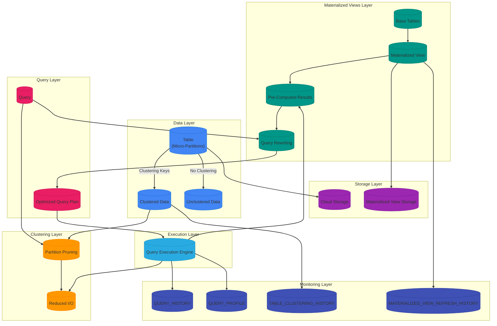

# **Snowflake Clustering Keys and Materialized Views: Production-Grade Technical Deep Dive**

---

## **1. Overview of Clustering Keys and Materialized Views**

### **Mermaid: Clustering Keys and Materialized Views Architecture**


---

### **Key Concepts and Definitions**

#### **1. Clustering Keys**
**Definition**: Clustering keys in Snowflake are **columns used to logically organize data** within **micro-partitions** to **minimize I/O** and **improve query performance**. Unlike traditional databases that use physical indexes, Snowflake's clustering is a **logical organization** that guides the **query optimizer** to **skip irrelevant micro-partitions** (partition pruning).

**How It Works**:
- Snowflake **automatically divides** tables into **micro-partitions** (50MB-500MB each).
- When you define **clustering keys**, Snowflake **reorganizes data** within micro-partitions to **group rows with similar clustering key values**.
- The **query optimizer** uses **clustering metadata** to **skip micro-partitions** that do not contain relevant data.

**Example**:
```sql
-- Table with clustering on 'date' and 'region'
ALTER TABLE sales CLUSTER BY (date, region);

-- Query that benefits from clustering
SELECT * FROM sales WHERE date = '2023-01-15' AND region = 'US';
-- Only scans micro-partitions containing data for date='2023-01-15' AND region='US'
```


#### **2. Materialized Views**
**Definition**: **Materialized Views (MVs)** in Snowflake are **pre-computed query results** that are **stored as tables** and **automatically refreshed** when the underlying data changes. MVs are ideal for **repetitive, expensive queries** that can benefit from **pre-computation**.

**How It Works**:
1. **Creation**: Define an MV with a query (e.g., `SELECT * FROM table1 JOIN table2 ON ...`).
2. **Initial Population**: Snowflake **executes the query** and **stores the results** as a table.
3. **Automatic Refresh**: Snowflake **automatically refreshes** the MV when the underlying data changes.
4. **Query Rewriting**: Snowflake **rewrites queries** to use the MV when possible.
5. **Query Folding**: Combines the MV query with the original query for better performance.

**Example**:
```sql
-- Create a materialized view for daily sales
CREATE MATERIALIZED VIEW daily_sales_mv AS
SELECT
    DATE_TRUNC('DAY', order_date) AS day,
    region,
    SUM(amount) AS total_sales
FROM
    sales
WHERE
    order_date > CURRENT_DATE() - 30
GROUP BY
    DATE_TRUNC('DAY', order_date), region;

-- Query that benefits from the MV
SELECT * FROM daily_sales_mv WHERE day > CURRENT_DATE() - 7;
-- Snowflake may rewrite this to use the MV instead of querying the base table
```

### **Comparison: Clustering Keys vs. Materialized Views**

| **Feature** | **Clustering Keys** | **Materialized Views** | **Notes** |
|-------------|----------------------|------------------------|-----------|
| **Purpose** | Organize data for optimal scanning | Pre-compute and cache query results | Different but complementary |
| **How It Works** | Logical data organization within micro-partitions | Physical storage of pre-computed results | Clustering is logical; MVs are physical |
| **Performance Impact** | Reduces I/O by skipping irrelevant micro-partitions | Reduces compute by avoiding query execution | Both improve performance |
| **Storage Impact** | No additional storage | Consumes additional storage | MVs have storage overhead |
| **Maintenance** | Automatic reclustering by Snowflake | Automatic refresh by Snowflake | Both require maintenance |
| **Cost** | Included in compute costs | Storage + refresh compute costs | MVs have additional costs |
| **Best For** | Large tables with repetitive queries on specific columns | Repetitive, expensive queries (aggregations, joins) | Use both for maximum performance |
| **Configuration** | Set clustering keys on table | Create MV with query | Clustering is simpler to configure |
| **Monitoring** | `TABLE_CLUSTERING_HISTORY` | `MATERIALIZED_VIEW_REFRESH_HISTORY` | Different monitoring views |
| **Limitations** | Limited to 4 clustering keys, no real-time | Eventual consistency, storage costs | Both have trade-offs |
| **Automatic** | Yes (automatic reclustering) | Yes (automatic refresh) | Both are managed by Snowflake |
| **Real-Time** | No (eventual consistency) | No (eventual consistency) | Neither is real-time |
| **Query Types** | All queries | SELECT queries only | Clustering benefits all queries; MVs only benefit SELECTs |
| **Data Types** | All data types | Most data types (not all) | Clustering works with all types; MVs have some restrictions |
| **Concurrency** | Improves scan performance | Reduces warehouse load | Both improve concurrency |
| **Use with External Tables** | Yes (limited) | No | Clustering can be used with external tables; MVs cannot |

### **When to Use Clustering Keys vs. Materialized Views**

| **Use Case** | **Clustering Keys** | **Materialized Views** | **Combined Approach** |
|-------------|---------------------|------------------------|-----------------------|
| **Large tables with repetitive filters** | ✅ Best | ❌ Not ideal | ✅ Use both |
| **Frequently joined tables** | ✅ Good | ✅ Best | ✅ Use both |
| **Repetitive aggregations** | ❌ Not ideal | ✅ Best | ✅ Use both |
| **Complex queries with joins and aggregations** | ✅ Good | ✅ Best | ✅ Use both |
| **Ad-hoc queries** | ✅ Good | ❌ Not ideal | ❌ Not recommended |
| **Small tables** | ❌ Not worth it | ❌ Not worth it | ❌ Not recommended |
| **Write-heavy tables** | ❌ Avoid (reclustering overhead) | ❌ Avoid (refresh overhead) | ❌ Not recommended |
| **Real-time data** | ❌ Not real-time | ❌ Not real-time | ❌ Not recommended |
| **Cost-sensitive environments** | ✅ Low cost | ❌ Higher cost | ⚠️ Use clustering first |
| **Storage-constrained environments** | ✅ No storage overhead | ❌ Storage overhead | ⚠️ Use clustering first |

### **When to Use Both Clustering Keys and Materialized Views**
Use **both clustering keys and materialized views** for:
1. **Large tables with repetitive queries** (clustering reduces I/O, MVs reduce compute).
2. **Complex queries with joins and aggregations** (clustering improves joins, MVs pre-compute results).
3. **High-performance applications** requiring both fast filtering and fast aggregations.
4. **Dashboards with both filtered and aggregated data**.

**Example**:
```sql
-- Cluster the sales table on date and region
ALTER TABLE sales CLUSTER BY (date, region);

-- Create a materialized view for daily sales by region
CREATE MATERIALIZED VIEW daily_sales_by_region_mv AS
SELECT
    DATE_TRUNC('DAY', order_date) AS day,
    region,
    SUM(amount) AS total_sales,
    COUNT(*) AS order_count
FROM
    sales
WHERE
    order_date > CURRENT_DATE() - 90
GROUP BY
    DATE_TRUNC('DAY', order_date), region;

-- Query that benefits from both clustering and MV
SELECT * FROM daily_sales_by_region_mv
WHERE day > CURRENT_DATE() - 7 AND region = 'US';
-- Uses MV for pre-computed aggregations and clustering for partition pruning
```

## **2. Clustering Keys Deep Dive**

### **A. How Clustering Keys Work in Snowflake**

#### **1. Micro-Partitioning and Clustering**
Snowflake **automatically divides** tables into **micro-partitions** (50MB-500MB each). Each micro-partition contains:
- **Data files** (columnar storage in Parquet format).
- **Metadata** (min/max values for each column, row count, etc.).

**Clustering** reorganizes data **within micro-partitions** to group rows with similar clustering key values. This enables:
- **Partition Pruning**: Skip micro-partitions that do not contain relevant data.
- **Column Pruning**: Only read the columns referenced in the query.
- **Vectorized Execution**: Process data in batches using SIMD instructions.

```mermaid
%% Micro-Partitioning and Clustering
flowchart TD
    subgraph Unclustered["Unclustered Table"]
        A1[("Partition 1\n(Rows 1-1000)")] -->|Scan All| B[("Query: WHERE date = '2023-01-01'")]
        A2[("Partition 2\n(Rows 1001-2000)")] --> B
        A3[("Partition 3\n(Rows 2001-3000)")] --> B
        A4[("Partition N\n(Rows N-1000 to N)")] --> B
    end

    subgraph Clustered["Clustered Table (date)"]
        B1[("Partition 1\n(date='2023-01-01')")] -->|Scan 1| C[("Query: WHERE date = '2023-01-01'")]
        B2[("Partition 2\n(date='2023-01-02')")] -->|Skip| C
        B3[("Partition 3\n(date='2023-01-03')")] -->|Skip| C
        B4[("Partition N\n(date='2023-01-N')")] -->|Skip| C
    end

    subgraph ClusteringMetadata["Clustering Metadata"]
        D[("Min/Max Values per Partition")]
        E[("Query Optimizer")]
    end
    B1 --> D
    B2 --> D
    B3 --> D
    B4 --> D
    D --> E
    E --> C

    %% --- Annotations ---
    linkStyle 0,1,2,3,4,5,6,7,8,9,10,11,12,13,14,15,16,17,18,19,20,21,22,23,24,25,26,27,28,29,30,31,32,33,34,35,36,37,38,39,40 stroke:#333,stroke-width:2px;
    classDef default fill:#f9f9f9,stroke:#333;
    classDef unclustered fill:#ffebee,stroke:#ef9a9a;
    classDef clustered fill:#e8f5e9,stroke:#2e7d32;
    classDef metadata fill:#2196f3,stroke:#03a9f4;
    class A1,A2,A3,A4 unclustered;
    class B1,B2,B3,B4 clustered;
    class B,C unclustered;
    class C clustered;
    class D,E metadata;
```

#### **2. Clustering Depth**
Snowflake measures **clustering effectiveness** using **clustering depth** (0-4):
- **Depth 0**: No clustering (data is randomly distributed).
- **Depth 1**: Data is clustered on the **first clustering key**.
- **Depth 2**: Data is clustered on the **first two clustering keys**.
- **Depth 3**: Data is clustered on the **first three clustering keys**.
- **Depth 4**: Data is clustered on **all four clustering keys**.

**Higher depth = better pruning but higher maintenance overhead**.

#### **3. Automatic Reclustering**
Snowflake **automatically reclusters** data in the background as new data is loaded. Reclustering:
- Is **free** (included in Snowflake credits).
- Happens **asynchronously** (does not block queries).
- Can be **forced manually** if needed.

### **B. When to Use Clustering Keys**

#### **1. Good Candidates for Clustering**
✅ **Large tables** (>1TB) with **repetitive queries** on specific columns.
✅ **Frequently filtered columns** (e.g., `date`, `region`, `customer_id`).
✅ **Range queries** (e.g., `WHERE date BETWEEN '2023-01-01' AND '2023-01-31'`).
✅ **Join columns** (clustering on join keys can improve join performance).
✅ **High-cardinality columns** (many distinct values) for **point queries**.
✅ **Time-series data** (cluster on `date` or `timestamp`).
✅ **Tables with high bytes_scanned** in `QUERY_HISTORY`.

#### **2. Poor Candidates for Clustering**
❌ **Small tables** (<1GB; clustering overhead outweighs benefits).
❌ **Ad-hoc queries** (no repetitive patterns to optimize for).
❌ **Low-cardinality columns** (few distinct values; e.g., `gender`, `status`).
❌ **Columns not used in filters** (clustering has no effect).
❌ **Frequently updated tables** (reclustering overhead may impact performance).
❌ **Tables with uniform data distribution** (clustering provides no benefit).

### **C. Clustering Keys Configuration**

#### **1. Set Clustering Keys on a Table**
```sql
-- Set single-column clustering
ALTER TABLE my_table CLUSTER BY (date);

-- Set multi-column clustering (up to 4 columns)
ALTER TABLE my_table CLUSTER BY (region, date, product_id);

-- Enable automatic clustering (Snowflake chooses keys)
ALTER TABLE my_table CLUSTER BY AUTO;

-- Remove clustering
ALTER TABLE my_table CLUSTER BY NONE;
```

#### **2. Set Clustering Keys on Table Creation**
```sql
-- Create a table with clustering
CREATE TABLE sales (
    sale_id INTEGER,
    customer_id INTEGER,
    product_id INTEGER,
    sale_date DATE,
    amount FLOAT,
    region STRING
)
CLUSTER BY (sale_date, region);
```

#### **3. Manually Recluster a Table**
```sql
-- Force a reclustering of the table
ALTER TABLE my_table RECLUSTER;
```

#### **4. Set Clustering Keys on External Tables**
```sql
-- Enable clustering on an external table
ALTER EXTERNAL TABLE my_external_table CLUSTER BY (date);
```

### **D. Clustering Keys Monitoring**

#### **1. Check Clustering Information**
```sql
-- Check clustering information for a table
SELECT
    table_name,
    clustering_information
FROM
    INFORMATION_SCHEMA.TABLES
WHERE
    table_name = 'MY_TABLE';

-- Check clustering depth
SELECT
    table_name,
    clustering_information:'CLUSTERING_DEPTH' AS clustering_depth
FROM
    INFORMATION_SCHEMA.TABLES
WHERE
    table_name = 'MY_TABLE';

-- Check clustering keys
SELECT
    table_name,
    clustering_information:'CLUSTER_BY' AS cluster_by
FROM
    INFORMATION_SCHEMA.TABLES
WHERE
    table_name = 'MY_TABLE';

-- Check total partition count
SELECT
    table_name,
    clustering_information:'TOTAL_PARTITION_COUNT' AS total_partitions
FROM
    INFORMATION_SCHEMA.TABLES
WHERE
    table_name = 'MY_TABLE';
```

#### **2. Check Reclustering History**
```sql
-- Check reclustering history for a table
SELECT
    table_name,
    last_reclustered,
    recluster_reason,
    clustering_information
FROM
    SNOWFLAKE.ACCOUNT_USAGE.TABLE_CLUSTERING_HISTORY
WHERE
    table_name = 'MY_TABLE'
ORDER BY
    last_reclustered DESC;

-- Check reclustering history for all tables
SELECT
    table_name,
    last_reclustered,
    recluster_reason
FROM
    SNOWFLAKE.ACCOUNT_USAGE.TABLE_CLUSTERING_HISTORY
WHERE
    last_reclustered > DATEADD('day', -7, CURRENT_TIMESTAMP())
ORDER BY
    last_reclustered DESC;
```

#### **3. Check Partition Pruning Effectiveness**
```sql
-- Check partitions scanned for queries on a clustered table
SELECT
    query_id,
    query_text,
    partitions_scanned,
    bytes_scanned,
    execution_time
FROM
    SNOWFLAKE.ACCOUNT_USAGE.QUERY_HISTORY
WHERE
    query_text LIKE '%MY_TABLE%'
    AND start_time > DATEADD('day', -7, CURRENT_TIMESTAMP())
ORDER BY
    partitions_scanned;

-- Compare partitions scanned before and after clustering
-- Before clustering
SELECT partitions_scanned
FROM SNOWFLAKE.ACCOUNT_USAGE.QUERY_HISTORY
WHERE query_id = 'before_clustering_query_id';

-- After clustering
SELECT partitions_scanned
FROM SNOWFLAKE.ACCOUNT_USAGE.QUERY_HISTORY
WHERE query_id = 'after_clustering_query_id';
```

### **E. Clustering Keys Performance Impact**

#### **1. Performance Metrics**
| **Metric** | **Without Clustering** | **With Clustering (Depth 1)** | **With Clustering (Depth 2)** | **With Clustering (Depth 3)** | **With Clustering (Depth 4)** |
|------------|-------------------------|----------------------------------|----------------------------------|----------------------------------|----------------------------------|
| **Execution Time** | High | Medium | Low | Very Low | Very Low |
| **Bytes Scanned** | High | Medium | Low | Very Low | Very Low |
| **Partitions Scanned** | High | Medium | Low | Very Low | Very Low |
| **Credit Usage** | High | Medium | Low | Very Low | Very Low |
| **Reclustering Overhead** | None | Low | Medium | High | Very High |

**Note**: Performance improvement depends on:
- **Selectivity of filters** (more selective = better pruning).
- **Data distribution** (skewed data = less effective clustering).
- **Query complexity** (simple queries benefit more).

#### **2. Performance Example**
**Query**:
```sql
SELECT * FROM sales WHERE date = '2023-01-15' AND region = 'US';
```

**Performance Comparison**:
| **Metric** | **Without Clustering** | **With Clustering (date, region)** | **Improvement** |
|------------|-------------------------|--------------------------------------|-----------------|
| **Execution Time** | 10 seconds | 1 second | 10x faster |
| **Bytes Scanned** | 100 GB | 1 GB | 100x reduction |
| **Partitions Scanned** | 1000 | 10 | 100x reduction |
| **Credit Usage** | 5 credits | 0.5 credits | 10x reduction |
| **Clustering Depth** | N/A | 2 | Better pruning |

### **F. Clustering Keys Best Practices**

#### **1. Clustering Key Selection**
| **Best Practice** | **Description** | **Example** |
|-------------------|-----------------|-------------|
| **Cluster on Frequently Filtered Columns** | Choose columns used in WHERE clauses | `CLUSTER BY (date, region)` |
| **Prioritize High-Cardinality Columns** | Cluster on columns with many distinct values | `CLUSTER BY (customer_id, date)` |
| **Avoid Low-Cardinality Columns** | Avoid clustering on columns with few distinct values | Avoid `CLUSTER BY (gender, status)` |
| **Use Multi-Column Clustering for Complex Queries** | Cluster on multiple columns for complex filters | `CLUSTER BY (region, date, product_id)` |
| **Order Clustering Keys by Selectivity** | Put most selective columns first | `CLUSTER BY (date, region)` (date is more selective) |
| **Cluster on Join Columns** | Cluster on columns used in joins | `CLUSTER BY (user_id)` for user-related joins |
| **Cluster on Time-Series Columns** | Cluster on date/timestamp for time-series data | `CLUSTER BY (timestamp)` |
| **Avoid Over-Clustering** | Limit to 1-4 clustering keys | `CLUSTER BY (col1, col2, col3, col4)` |
| **Test Clustering Before and After** | Compare performance with and without clustering | Run EXPLAIN before and after |
| **Document Clustering Strategies** | Document clustering keys and rationale | Internal wiki or Confluence page |

#### **2. Clustering Maintenance**
| **Best Practice** | **Description** | **Example** |
|-------------------|-----------------|-------------|
| **Monitor Clustering Effectiveness** | Check CLUSTERING_DEPTH and PARTITIONS_SCANNED | `SELECT CLUSTERING_INFORMATION FROM INFORMATION_SCHEMA.TABLES` |
| **Recluster Manually if Needed** | Force reclustering for critical queries | `ALTER TABLE my_table RECLUSTER` |
| **Use Automatic Clustering for Hands-Off Optimization** | Let Snowflake manage clustering | `ALTER TABLE my_table CLUSTER BY AUTO` |
| **Avoid Frequent Reclustering** | Reclustering consumes credits | Monitor reclustering costs |
| **Combine with Partitioning** | Use clustering with partitioning for large tables | `CREATE TABLE my_table PARTITION BY (date) CLUSTER BY (region)` |
| **Cluster External Tables** | Cluster external tables for better performance | `ALTER EXTERNAL TABLE my_external_table CLUSTER BY (date)` |

#### **3. Clustering and Query Design**
| **Best Practice** | **Description** | **Example** |
|-------------------|-----------------|-------------|
| **Filter on Clustered Columns** | Use WHERE clauses on clustered columns | `SELECT * FROM my_table WHERE date = '2023-01-01'` |
| **Use Partition Pruning** | Filter on clustered columns to enable pruning | `SELECT * FROM my_table WHERE region = 'US'` |
| **Avoid Full Table Scans** | Use filters to reduce scanned partitions | `SELECT * FROM my_table WHERE date > '2023-01-01'` |
| **Combine with Other Optimizations** | Use clustering with caching, materialized views, etc. | `CLUSTER BY (date) + MATERIALIZED VIEW` |
| **Monitor Query Performance** | Check QUERY_HISTORY for performance improvements | `SELECT execution_time FROM SNOWFLAKE.ACCOUNT_USAGE.QUERY_HISTORY` |

### **G. Clustering Keys Limitations**

| **Limitation** | **Description** | **Workaround** |
|----------------|-----------------|---------------|
| **Max 4 Clustering Keys** | Cannot cluster on more than 4 columns | Choose the most important columns |
| **No Real-Time Clustering** | Reclustering happens in the background (not real-time) | Use manual reclustering for critical queries |
| **Reclustering Overhead** | Frequent data changes can trigger reclustering | Avoid clustering on write-heavy tables |
| **No Partial Clustering** | Cannot cluster on a subset of rows | Use filtered tables or views |
| **No Custom Clustering Algorithms** | Cannot customize clustering algorithm | Use Snowflake's built-in clustering |
| **No Clustering on Views** | Cannot cluster on views | Cluster on source tables |
| **No Clustering on External Tables (Limited)** | Limited clustering support for external tables | Use internal tables or materialized views |
| **No Clustering on Iceberg/Delta Lake (Limited)** | Limited clustering support for Iceberg/Delta Lake | Use Snowflake's native clustering |
| **No Clustering on VARIANT/OBJECT/ARRAY** | Cannot cluster on semi-structured columns | Cluster on structured columns |
| **No Clustering on GEOGRAPHY/GEOMETRY** | Cannot cluster on geographic columns | Use spatial indexes or application-level clustering |
| **Eventual Consistency** | Clustering is not real-time | Use manual reclustering for time-sensitive queries |
| **Storage Overhead** | Clustering does not consume additional storage, but reclustering does consume credits | Monitor reclustering costs |

### **H. Clustering Keys Examples**

#### **Example 1: Time-Series Data**
```sql
-- Cluster a time-series table on date
ALTER TABLE sales CLUSTER BY (sale_date);

-- Query with date filter (uses partition pruning)
SELECT * FROM sales WHERE sale_date = '2023-01-15';

-- Check clustering effectiveness
SELECT
    table_name,
    clustering_information:'CLUSTERING_DEPTH' AS depth,
    clustering_information:'CLUSTER_BY' AS cluster_by
FROM
    INFORMATION_SCHEMA.TABLES
WHERE
    table_name = 'SALES';
```

#### **Example 2: Multi-Column Clustering**
```sql
-- Cluster a table on region and date
ALTER TABLE sales CLUSTER BY (region, sale_date);

-- Query with region and date filters (uses partition pruning)
SELECT * FROM sales
WHERE region = 'US' AND sale_date > '2023-01-01';

-- Check partitions scanned
SELECT
    query_id,
    query_text,
    partitions_scanned
FROM
    SNOWFLAKE.ACCOUNT_USAGE.QUERY_HISTORY
WHERE
    query_text LIKE '%sales%region%date%'
ORDER BY
    partitions_scanned;
```

#### **Example 3: Automatic Clustering**
```sql
-- Enable automatic clustering
ALTER TABLE sales CLUSTER BY AUTO;

-- Check automatic clustering status
SELECT
    table_name,
    clustering_information:'CLUSTER_BY' AS cluster_by,
    clustering_information:'CLUSTERING_DEPTH' AS depth
FROM
    INFORMATION_SCHEMA.TABLES
WHERE
    table_name = 'SALES';
```

#### **Example 4: Clustering with Partitioning (External Tables)**
```sql
-- Create an external stage
CREATE STAGE my_s3_stage URL = 's3://my-bucket/sales/';

-- Create a partitioned external table with clustering
CREATE EXTERNAL TABLE my_partitioned_table (
    sale_id INTEGER,
    sale_date DATE,
    region STRING,
    amount FLOAT
)
WITH LOCATION = @my_s3_stage
FILE_FORMAT = (TYPE = 'PARQUET')
PARTITION BY (YEAR(sale_date), MONTH(sale_date))
CLUSTER BY (region);

-- Query with partition and clustering filters
SELECT * FROM my_partitioned_table
WHERE YEAR(sale_date) = 2023 AND MONTH(sale_date) = 1 AND region = 'US';
```

#### **Example 5: Monitor Clustering Performance**
```sql
-- Check clustering depth over time
SELECT
    table_name,
    last_reclustered,
    clustering_information:'CLUSTERING_DEPTH' AS depth,
    clustering_information:'RECLUSTERING_REASON' AS reason
FROM
    SNOWFLAKE.ACCOUNT_USAGE.TABLE_CLUSTERING_HISTORY
WHERE
    table_name = 'SALES'
ORDER BY
    last_reclustered;

-- Check query performance with clustering
SELECT
    query_id,
    query_text,
    execution_time,
    bytes_scanned,
    partitions_scanned
FROM
    SNOWFLAKE.ACCOUNT_USAGE.QUERY_HISTORY
WHERE
    query_text LIKE '%sales%'
    AND start_time > DATEADD('day', -7, CURRENT_TIMESTAMP())
ORDER BY
    execution_time;
```

## **3. Materialized Views Deep Dive**

### **A. How Materialized Views Work in Snowflake**

#### **1. Materialized View Architecture**
Materialized Views (MVs) in Snowflake are **pre-computed query results** that are **stored as tables** and **automatically refreshed** when the underlying data changes.

```mermaid
%% Materialized View Architecture
flowchart TD
    subgraph SourceTables["Source Tables"]
        A[("Table 1")] -->|Data| B[("Materialized View")]
        C[("Table 2")] -->|Data| B
    end

    subgraph MaterializedView["Materialized View"]
        B -->|Refresh| D[("Refresh Process")]
        D -->|Query| E[("Query Engine")]
        E -->|Update| B
    end

    subgraph Queries["Queries"]
        F[("Query on MV")] --> B
        G[("Query on Source Tables")] --> A
        G --> C
    end

    subgraph Optimization["Optimization"]
        H[("Query Rewriting")]
        I[("Automatic Refresh")]
    end
    E --> H
    D --> I
    H --> F

    subgraph Monitoring["Monitoring"]
        J[("MATERIALIZED_VIEW_REFRESH_HISTORY")]
        K[("QUERY_HISTORY")]
    end
    D --> J
    F --> K

    subgraph Storage["Storage Layer"]
        B --> L[("Materialized View Storage")]
        A --> M[("Source Table Storage")]
        C --> M
    end

    %% --- Annotations ---
    linkStyle 0,1,2,3,4,5,6,7,8,9,10,11,12,13,14,15,16,17,18,19,20,21,22,23,24,25,26,27,28,29,30,31,32,33,34,35,36,37,38,39,40 stroke:#333,stroke-width:2px;
    classDef default fill:#f9f9f9,stroke:#333;
    classDef source fill:#4285f4,stroke:#1976d2;
    classDef mv fill:#009688,stroke:#00796b;
    classDef queries fill:#ff9800,stroke:#f57c00;
    classDef optimization fill:#e91e63,stroke:#c2185b;
    classDef monitoring fill:#9c27b0,stroke:#7b1fa2;
    classDef storage fill:#29abe2,stroke:#1a8fb8;
    class A,C source;
    class B,D,E mv;
    class F,G queries;
    class H,I optimization;
    class J,K monitoring;
    class L,M storage;
```

#### **2. How Materialized Views Work**
1. **Creation**:
   - Define an MV with a **query** (e.g., `SELECT * FROM table1 JOIN table2 ON ...`).
   - Snowflake **executes the query** and **stores the results** as a table.

2. **Initial Population**:
   - The MV is **populated with data** from the source tables.

3. **Automatic Refresh**:
   - Snowflake **automatically refreshes** the MV when the underlying data changes.
   - Refresh can be **incremental** (only refresh changed data) or **full** (refresh all data).

4. **Query Rewriting**:
   - When a query is executed, Snowflake **checks if an MV can be used**.
   - If the query **matches the MV definition**, Snowflake **rewrites the query** to use the MV.
   - **Query folding**: Combines the MV query with the original query for better performance.

5. **Consistency**:
   - MVs are **eventually consistent** with the source tables (not real-time).
   - **Refresh latency**: Typically **1-5 minutes** (configurable).

### **B. When to Use Materialized Views**

#### **1. Good Candidates for Materialized Views**
✅ **Repetitive, expensive queries** (e.g., daily aggregations).
✅ **Complex joins or aggregations** that are queried frequently.
✅ **Pre-computed reports** (e.g., dashboards, KPIs).
✅ **Data warehousing** (pre-compute star schema fact tables).
✅ **ETL pipelines** (pre-compute intermediate results).
✅ **Real-time analytics** (pre-compute frequently accessed data).
✅ **Queries with high bytes_scanned** or **high execution_time**.
✅ **Queries that benefit from pre-computation** (e.g., window functions, complex calculations).

#### **2. Poor Candidates for Materialized Views**
❌ **Ad-hoc queries** (no repetitive patterns).
❌ **Small tables** (<1GB; MV overhead outweighs benefits).
❌ **Frequently updated underlying data** (refresh overhead may impact performance).
❌ **Queries with highly variable filters** (MV may not cover all filter combinations).
❌ **Storage-constrained environments** (MVs consume storage space).
❌ **Real-time data** (MVs are eventually consistent).
❌ **Unique queries** (each query is different).

### **C. Materialized Views Configuration**

#### **1. Create a Materialized View**
```sql
-- Create a simple materialized view
CREATE MATERIALIZED VIEW my_mv AS
SELECT
    c.customer_id,
    c.name,
    COUNT(o.order_id) AS order_count,
    SUM(o.amount) AS total_amount
FROM
    customers c
JOIN
    orders o ON c.customer_id = o.customer_id
WHERE
    o.order_date > CURRENT_DATE() - 30
GROUP BY
    c.customer_id, c.name;

-- Create a materialized view with clustering
CREATE MATERIALIZED VIEW my_clustered_mv
CLUSTER BY (day, region) AS
SELECT
    DATE_TRUNC('DAY', order_date) AS day,
    region,
    SUM(amount) AS total_sales
FROM
    orders
WHERE
    order_date > CURRENT_DATE() - 90
GROUP BY
    DATE_TRUNC('DAY', order_date), region;

-- Create a secure materialized view
CREATE SECURE MATERIALIZED VIEW my_secure_mv AS
SELECT * FROM my_table WHERE sensitive_data IS NULL;
```

#### **2. Refresh a Materialized View**
```sql
-- Manual refresh
ALTER MATERIALIZED VIEW my_mv REFRESH;

-- Scheduled refresh (using Tasks)
CREATE TASK refresh_my_mv
  WAREHOUSE = admin_wh
  SCHEDULE = 'USING CRON 0 * * * * America/Los_Angeles'  -- Every hour
AS
  ALTER MATERIALIZED VIEW my_mv REFRESH;
```

#### **3. Alter a Materialized View**
```sql
-- Rename a materialized view
ALTER MATERIALIZED VIEW my_mv RENAME TO my_mv_new;

-- Change the query definition
ALTER MATERIALIZED VIEW my_mv SET QUERY =
  SELECT * FROM my_table WHERE date > CURRENT_DATE() - 60;

-- Change the clustering
ALTER MATERIALIZED VIEW my_mv CLUSTER BY (new_column);
```

#### **4. Drop a Materialized View**
```sql
DROP MATERIALIZED VIEW IF EXISTS my_mv;
```

#### **5. Set Refresh Mode**
```sql
-- Set refresh mode to MANUAL (default is AUTO)
ALTER MATERIALIZED VIEW my_mv SET REFRESH_MODE = MANUAL;

-- Set refresh mode back to AUTO
ALTER MATERIALIZED VIEW my_mv SET REFRESH_MODE = AUTO;
```

### **D. Materialized Views Monitoring**

#### **1. Check Materialized View Status**
```sql
-- Check materialized view status
SELECT
    name,
    database_name,
    schema_name,
    is_secure,
    query,
    last_refresh_time,
    refresh_state,
    refresh_mode,
    refresh_error_message
FROM
    INFORMATION_SCHEMA.MATERIALIZED_VIEWS
WHERE
    name = 'MY_MV';

-- Check all materialized views
SELECT
    name,
    database_name,
    schema_name,
    is_secure,
    refresh_state,
    last_refresh_time
FROM
    INFORMATION_SCHEMA.MATERIALIZED_VIEWS
ORDER BY
    last_refresh_time DESC;
```

#### **2. Check Materialized View Dependencies**
```sql
-- Check dependencies for a materialized view
SELECT
    view_name,
    dependent_object_name,
    dependent_object_type
FROM
    SNOWFLAKE.ACCOUNT_USAGE.OBJECT_DEPENDENCIES
WHERE
    object_name = 'MY_MV'
    AND object_type = 'MATERIALIZED VIEW';
```

#### **3. Check Materialized View Refresh History**
```sql
-- Check refresh history for a materialized view
SELECT
    view_name,
    refresh_time,
    status,
    rows_refreshed,
    bytes_refreshed,
    error_message
FROM
    SNOWFLAKE.ACCOUNT_USAGE.MATERIALIZED_VIEW_REFRESH_HISTORY
WHERE
    view_name = 'MY_MV'
ORDER BY
    refresh_time DESC;

-- Check refresh history for all materialized views
SELECT
    view_name,
    refresh_time,
    status,
    rows_refreshed,
    bytes_refreshed,
    credits_used
FROM
    SNOWFLAKE.ACCOUNT_USAGE.MATERIALIZED_VIEW_REFRESH_HISTORY
WHERE
    refresh_time > DATEADD('day', -7, CURRENT_TIMESTAMP())
ORDER BY
    refresh_time DESC;
```

#### **4. Check Materialized View Storage Usage**
```sql
-- Check storage usage for a materialized view
SELECT
    view_name,
    storage_bytes / 1024 / 1024 / 1024 AS storage_gb
FROM
    SNOWFLAKE.ACCOUNT_USAGE.MATERIALIZED_VIEW_STORAGE
WHERE
    view_name = 'MY_MV';

-- Check storage usage for all materialized views
SELECT
    view_name,
    storage_bytes / 1024 / 1024 / 1024 AS storage_gb
FROM
    SNOWFLAKE.ACCOUNT_USAGE.MATERIALIZED_VIEW_STORAGE
ORDER BY
    storage_gb DESC;
```

#### **5. Check Materialized View Query Usage**
```sql
-- Check if queries are using materialized views
SELECT
    query_id,
    query_text,
    warehouse_name,
    credits_used,
    execution_time,
    used_cached_result
FROM
    SNOWFLAKE.ACCOUNT_USAGE.QUERY_HISTORY
WHERE
    query_text LIKE '%MY_MV%'
    AND start_time > DATEADD('day', -7, CURRENT_TIMESTAMP())
ORDER BY
    credits_used DESC;

-- Check query plans for materialized view usage
EXPLAIN SELECT * FROM my_table WHERE date > CURRENT_DATE() - 7 GROUP BY region;
-- Look for MaterializedViewScan in the plan
```

### **E. Materialized Views Performance Impact**

#### **1. Performance Metrics**
| **Metric** | **Without MV** | **With MV** | **Improvement** | **Notes** |
|------------|-----------------|--------------|-----------------|-----------|
| **Execution Time** | 10-60 seconds | 10-100 ms | 100-1000x faster | Depends on query complexity |
| **Bytes Scanned** | 10-100 GB | 0.1-1 GB | 10-1000x reduction | MV stores pre-computed results |
| **Credit Usage** | 10-100 credits | 0.1-1 credits | 10-1000x reduction | MV reduces query compute |
| **Concurrency** | Limited by warehouse | Improved | Better resource utilization | MV reduces warehouse load |
| **Storage Usage** | N/A | 1-10 GB | Increases | MV stores a copy of the data |
| **Refresh Latency** | N/A | 1-5 minutes | N/A | MV is eventually consistent |

**Note**: Performance improvement depends on:
- **Query complexity** (more complex = greater benefit).
- **Data volume** (larger tables = greater benefit).
- **Refresh frequency** (more frequent refreshes = higher overhead).

#### **2. Performance Example**
**Query**:
```sql
-- Expensive aggregation query
SELECT
    region,
    product_category,
    SUM(sales) AS total_sales,
    COUNT(*) AS transaction_count
FROM
    sales
WHERE
    date > CURRENT_DATE() - 30
GROUP BY
    region, product_category;
```

**Performance Comparison**:
| **Metric** | **Without MV** | **With MV** | **Improvement** |
|------------|-----------------|--------------|-----------------|
| **Execution Time** | 30 seconds | 100 ms | 300x faster |
| **Bytes Scanned** | 50 GB | 0.5 GB | 100x reduction |
| **Credit Usage** | 25 credits | 0.25 credits | 100x reduction |
| **Warehouse Load** | High | Low | Significant improvement |
| **Storage Usage** | N/A | 2 GB | Additional storage |

### **F. Materialized Views Best Practices**

#### **1. Materialized View Design**
| **Best Practice** | **Description** | **Example** |
|-------------------|-----------------|-------------|
| **Use for Repetitive Queries** | Create MVs for queries run frequently | `CREATE MATERIALIZED VIEW my_mv AS SELECT * FROM my_table WHERE date > CURRENT_DATE()` |
| **Use for Expensive Queries** | Create MVs for queries with high bytes_scanned or execution_time | `CREATE MATERIALIZED VIEW my_mv AS SELECT region, SUM(sales) FROM sales GROUP BY region` |
| **Use for Complex Joins** | Create MVs for queries with complex joins | `CREATE MATERIALIZED VIEW my_mv AS SELECT * FROM table1 JOIN table2 ON ...` |
| **Use for Aggregations** | Create MVs for queries with aggregations | `CREATE MATERIALIZED VIEW my_mv AS SELECT region, COUNT(*) FROM my_table GROUP BY region` |
| **Use Filtered MVs** | Create MVs for specific subsets of data | `CREATE MATERIALIZED VIEW my_mv AS SELECT * FROM my_table WHERE date > CURRENT_DATE() - 30` |
| **Use Clustering on MVs** | Cluster MVs for better query performance | `CREATE MATERIALIZED VIEW my_mv CLUSTER BY (date) AS SELECT ...` |
| **Avoid Overlapping MVs** | Avoid creating MVs with redundant data | Use a single MV for multiple queries |
| **Drop Unused MVs** | Remove MVs that are no longer needed | `DROP MATERIALIZED VIEW my_mv` |
| **Use Secure MVs for Sensitive Data** | Apply RLS and data masking to MVs | `CREATE SECURE MATERIALIZED VIEW my_mv AS SELECT ...` |

#### **2. Materialized View Refresh**
| **Best Practice** | **Description** | **Example** |
|-------------------|-----------------|-------------|
| **Use Automatic Refresh** | Let Snowflake refresh the MV automatically | `CREATE MATERIALIZED VIEW my_mv AS SELECT ...` (default) |
| **Use Manual Refresh for Large MVs** | Refresh large MVs on a schedule | `ALTER MATERIALIZED VIEW my_mv REFRESH` |
| **Use Scheduled Refresh for Batch Workloads** | Refresh MVs during off-peak hours | `CREATE TASK refresh_my_mv AS ALTER MATERIALIZED VIEW my_mv REFRESH` |
| **Monitor Refresh Performance** | Check MATERIALIZED_VIEW_REFRESH_HISTORY for errors | `SELECT * FROM SNOWFLAKE.ACCOUNT_USAGE.MATERIALIZED_VIEW_REFRESH_HISTORY` |
| **Set Appropriate Refresh Mode** | Use AUTO for most MVs, MANUAL for large MVs | `ALTER MATERIALIZED VIEW my_mv SET REFRESH_MODE = AUTO` |
| **Avoid Frequent Refreshes** | Frequent refreshes consume credits | Monitor refresh costs |

#### **3. Materialized View Querying**
| **Best Practice** | **Description** | **Example** |
|-------------------|-----------------|-------------|
| **Query MVs Directly** | Query MVs like regular tables | `SELECT * FROM my_mv WHERE day > CURRENT_DATE() - 7` |
| **Use Query Rewriting** | Let Snowflake rewrite queries to use MVs | No action needed (automatic) |
| **Check for MV Usage** | Use EXPLAIN to check if queries use MVs | `EXPLAIN SELECT * FROM my_table WHERE ...` (look for MaterializedViewScan) |
| **Combine with Other Optimizations** | Use MVs with clustering, caching, etc. | `CREATE MATERIALIZED VIEW my_mv CLUSTER BY (date) AS SELECT ...` |
| **Monitor MV Query Performance** | Check QUERY_HISTORY for MV query performance | `SELECT execution_time FROM SNOWFLAKE.ACCOUNT_USAGE.QUERY_HISTORY WHERE query_text LIKE '%my_mv%'` |

### **G. Materialized Views Limitations**

| **Limitation** | **Description** | **Workaround** |
|----------------|-----------------|---------------|
| **Eventual Consistency** | MVs are not real-time (refresh latency: 1-5 minutes) | Use for non-real-time queries, or use manual refresh |
| **Storage Costs** | MVs consume additional storage | Monitor storage usage, drop unused MVs |
| **Refresh Overhead** | Frequent data changes can impact refresh performance | Avoid MVs on write-heavy tables, use manual refresh |
| **No Incremental Refresh for All Queries** | Some queries may require full refresh | Use filtered MVs, test refresh performance |
| **No MV on MVs** | Cannot create an MV on another MV | Create MVs on source tables only |
| **No DML on MVs** | Cannot INSERT/UPDATE/DELETE on MVs | Use source tables for DML |
| **No Triggers on MVs** | Cannot create triggers on MVs | Use Tasks for scheduled operations |
| **No Foreign Keys on MVs** | Cannot define foreign keys on MVs | Use application-level constraints |
| **Limited Query Rewriting** | Query rewriting may not work for all query types | Test query rewriting with EXPLAIN |
| **No MV on External Tables** | Cannot create MVs on external tables | Use internal tables or materialized views on internal tables |
| **No MV on Views** | Cannot create MVs on views | Create MVs on source tables |
| **Refresh Latency** | MVs are eventually consistent (1-5 minutes) | Use manual refresh for time-sensitive queries |
| **Compute Overhead** | MV refreshes consume credits | Monitor refresh costs |

### **H. Materialized Views Examples**

#### **Example 1: Daily Sales Aggregation**
```sql
-- Create a materialized view for daily sales
CREATE MATERIALIZED VIEW daily_sales_mv AS
SELECT
    DATE_TRUNC('DAY', order_date) AS day,
    region,
    product_category,
    SUM(amount) AS total_sales,
    COUNT(*) AS order_count
FROM
    sales
WHERE
    order_date > CURRENT_DATE() - 30
GROUP BY
    DATE_TRUNC('DAY', order_date), region, product_category;

-- Query the materialized view
SELECT * FROM daily_sales_mv
WHERE day > CURRENT_DATE() - 7;
```

#### **Example 2: Customer Analytics**
```sql
-- Create a materialized view for customer analytics
CREATE MATERIALIZED VIEW customer_analytics_mv AS
SELECT
    c.customer_id,
    c.name,
    c.region,
    COUNT(o.order_id) AS order_count,
    SUM(o.amount) AS total_spend,
    MAX(o.order_date) AS last_order_date
FROM
    customers c
LEFT JOIN
    orders o ON c.customer_id = o.customer_id
GROUP BY
    c.customer_id, c.name, c.region;

-- Query the materialized view
SELECT
    region,
    AVG(total_spend) AS avg_spend,
    COUNT(*) AS customer_count
FROM
    customer_analytics_mv
GROUP BY
    region;
```

#### **Example 3: Star Schema Fact Table**
```sql
-- Create a materialized view for a star schema fact table
CREATE MATERIALIZED VIEW fact_sales_mv AS
SELECT
    s.sale_id,
    s.date_id,
    s.customer_id,
    s.product_id,
    s.quantity,
    s.amount,
    d.date AS sale_date,
    c.name AS customer_name,
    p.name AS product_name,
    p.category AS product_category
FROM
    sales s
JOIN
    dim_date d ON s.date_id = d.date_id
JOIN
    dim_customer c ON s.customer_id = c.customer_id
JOIN
    dim_product p ON s.product_id = p.product_id
WHERE
    s.date_id > DATEADD('day', -90, CURRENT_DATE());

-- Query the materialized view
SELECT
    product_category,
    sale_date,
    SUM(amount) AS total_sales
FROM
    fact_sales_mv
WHERE
    sale_date > CURRENT_DATE() - 30
GROUP BY
    product_category, sale_date;
```

#### **Example 4: Secure Materialized View**
```sql
-- Create a secure materialized view with RLS
CREATE SECURE MATERIALIZED VIEW secure_sales_mv AS
SELECT
    region,
    SUM(amount) AS total_sales
FROM
    sales
WHERE
    sensitive_flag = FALSE
GROUP BY
    region;

-- Apply row-level security to the MV
CREATE ROW ACCESS POLICY secure_sales_policy AS (region STRING) RETURNS BOOLEAN ->
    region IN (SELECT region FROM allowed_regions WHERE user = CURRENT_USER());

ALTER SECURE MATERIALIZED VIEW secure_sales_mv SET ROW ACCESS POLICY secure_sales_policy;
```

#### **Example 5: Materialized View with Clustering**
```sql
-- Create a materialized view with clustering
CREATE MATERIALIZED VIEW daily_sales_by_region_mv
CLUSTER BY (day, region) AS
SELECT
    DATE_TRUNC('DAY', order_date) AS day,
    region,
    SUM(amount) AS total_sales,
    COUNT(*) AS order_count
FROM
    sales
WHERE
    order_date > CURRENT_DATE() - 90
GROUP BY
    DATE_TRUNC('DAY', order_date), region;

-- Query the materialized view
SELECT * FROM daily_sales_by_region_mv
WHERE day > CURRENT_DATE() - 7 AND region = 'US';
```

#### **Example 6: Monitor Materialized View Usage**
```sql
-- Check materialized view storage usage
SELECT
    view_name,
    storage_bytes / 1024 / 1024 / 1024 AS storage_gb
FROM
    SNOWFLAKE.ACCOUNT_USAGE.MATERIALIZED_VIEW_STORAGE
ORDER BY
    storage_gb DESC;

-- Check materialized view refresh history
SELECT
    view_name,
    refresh_time,
    status,
    rows_refreshed,
    bytes_refreshed,
    credits_used
FROM
    SNOWFLAKE.ACCOUNT_USAGE.MATERIALIZED_VIEW_REFRESH_HISTORY
WHERE
    view_name = 'DAILY_SALES_MV'
    AND refresh_time > DATEADD('day', -7, CURRENT_TIMESTAMP())
ORDER BY
    refresh_time DESC;

-- Check if queries are using materialized views
SELECT
    query_id,
    query_text,
    warehouse_name,
    credits_used,
    execution_time,
    used_cached_result
FROM
    SNOWFLAKE.ACCOUNT_USAGE.QUERY_HISTORY
WHERE
    query_text LIKE '%DAILY_SALES_MV%'
    AND start_time > DATEADD('day', -7, CURRENT_TIMESTAMP())
ORDER BY
    credits_used DESC;
```

## **4. Clustering Keys vs. Materialized Views: Decision Matrix**

### **Mermaid: Clustering Keys vs. Materialized Views Decision Tree**
```mermaid
%% Clustering Keys vs. Materialized Views Decision Tree
flowchart TD
    A[("Query Performance\nIssue")] --> B{Query Type?}
    B -->|Repetitive Filters| C[("Use Clustering Keys")]
    B -->|Repetitive Aggregations| D[("Use Materialized Views")]
    B -->|Repetitive Joins| D
    B -->|Complex Queries| E[("Use Both")]
    B -->|Ad-Hoc Queries| F[("Use Clustering Keys")]
    B -->|Small Tables| G[("Neither")]
    B -->|Write-Heavy Tables| G

    C --> H[("Cluster on Filtered Columns\n(ALTER TABLE ... CLUSTER BY)")]
    D --> I[("Create MV for Aggregations/Joins\n(CREATE MATERIALIZED VIEW ...)")]
    E --> J[("Cluster Tables + Create MVs")]
    F --> H
    G --> K[("No Optimization Needed")]

    H --> L[("Use for Large Tables\n>1TB")]
    I --> M[("Use for Expensive Queries\n>100 credits")]
    J --> N[("Use for High-Performance Apps")]
    K --> O[("Monitor and Adjust")]

    L --> P[("Monitor Partition Pruning\n(SELECT partitions_scanned FROM QUERY_HISTORY)")]
    M --> Q[("Monitor MV Usage\n(SELECT used_cached_result FROM QUERY_HISTORY)")]
    N --> P
    N --> Q
    O --> R[("Review Regularly")]

    %% --- Annotations ---
    linkStyle 0,1,2,3,4,5,6,7,8,9,10,11,12,13,14,15,16,17,18,19,20,21,22,23,24,25,26,27,28,29,30,31,32,33,34,35,36,37,38,39,40,41,42,43,44,45,46,47,48,49,50,51,52,53,54,55,56,57,58,59,60 stroke:#333,stroke-width:2px;
    classDef default fill:#f9f9f9,stroke:#333;
    classDef query fill:#4285f4,stroke:#1976d2;
    classDef clustering fill:#ff9800,stroke:#f57c00;
    classDef mv fill:#009688,stroke:#00796b;
    classDef both fill:#e91e63,stroke:#c2185b;
    classDef neither fill:#9c27b0,stroke:#7b1fa2;
    class A query;
    class B query;
    class C clustering;
    class D mv;
    class E both;
    class F clustering;
    class G neither;
    class H,L,P clustering;
    class I,M,Q mv;
    class J,N both;
    class K,O,R neither;
```

### **Comparison Matrix: Clustering Keys vs. Materialized Views**

| **Feature** | **Clustering Keys** | **Materialized Views** | **Notes** |
|-------------|----------------------|------------------------|-----------|
| **Purpose** | Organize data for optimal scanning | Pre-compute and cache query results | Different but complementary |
| **How It Works** | Logical data organization within micro-partitions | Physical storage of pre-computed results | Clustering is logical; MVs are physical |
| **Performance Impact** | Reduces I/O by skipping irrelevant micro-partitions | Reduces compute by avoiding query execution | Both improve performance |
| **Storage Impact** | No additional storage | Consumes additional storage | MVs have storage overhead |
| **Maintenance** | Automatic reclustering by Snowflake | Automatic refresh by Snowflake | Both require maintenance |
| **Cost** | Included in compute costs | Storage + refresh compute costs | MVs have additional costs |
| **Best For** | Large tables with repetitive queries on specific columns | Repetitive, expensive queries (aggregations, joins) | Use both for maximum performance |
| **Configuration** | Set clustering keys on table | Create MV with query | Clustering is simpler to configure |
| **Monitoring** | `TABLE_CLUSTERING_HISTORY` | `MATERIALIZED_VIEW_REFRESH_HISTORY` | Different monitoring views |
| **Limitations** | Limited to 4 clustering keys, no real-time | Eventual consistency, storage costs | Both have trade-offs |
| **Automatic** | Yes (automatic reclustering) | Yes (automatic refresh) | Both are managed by Snowflake |
| **Real-Time** | No (eventual consistency) | No (eventual consistency) | Neither is real-time |
| **Query Types** | All queries | SELECT queries only | Clustering benefits all queries; MVs only benefit SELECTs |
| **Data Types** | All data types | Most data types (not all) | Clustering works with all types; MVs have some restrictions |
| **Concurrency** | Improves scan performance | Reduces warehouse load | Both improve concurrency |
| **Use with External Tables** | Yes (limited) | No | Clustering can be used with external tables; MVs cannot |
| **Refresh Latency** | N/A | 1-5 minutes | MVs are eventually consistent |
| **Max Keys/Columns** | 4 | No limit (but practical limits apply) | Clustering limited to 4 keys; MVs can have many columns |
| **DML Support** | Yes | No | Can DML on clustered tables; cannot DML on MVs |

### **When to Use Clustering Keys**
Use **Clustering Keys** for:
1. **Large tables** (>1TB) with **repetitive queries** on specific columns.
2. **Frequently filtered columns** (e.g., `date`, `region`, `customer_id`).
3. **Range queries** (e.g., `WHERE date BETWEEN '2023-01-01' AND '2023-01-31'`).
4. **Join columns** (clustering on join keys can improve join performance).
5. **High-cardinality columns** (many distinct values) for **point queries**.
6. **Time-series data** (cluster on `date` or `timestamp`).
7. **Queries with high bytes_scanned** in `QUERY_HISTORY`.

**Example Use Cases**:
- Time-series tables (cluster on `timestamp`)
- Large fact tables (cluster on `date`, `region`, `product_id`)
- Log tables (cluster on `timestamp`, `log_level`)
- Customer tables (cluster on `region`, `signup_date`)

### **When to Use Materialized Views**
Use **Materialized Views** for:
1. **Repetitive, expensive queries** (e.g., daily aggregations).
2. **Complex joins or aggregations** that are queried frequently.
3. **Pre-computed reports** (e.g., dashboards, KPIs).
4. **Data warehousing** (pre-compute star schema fact tables).
5. **ETL pipelines** (pre-compute intermediate results).
6. **Queries with high execution_time** or **high credit usage**.
7. **Queries that benefit from pre-computation** (e.g., window functions, complex calculations).

**Example Use Cases**:
- Daily/weekly/monthly sales aggregations
- Customer analytics (e.g., lifetime value, churn risk)
- Star schema fact tables
- Pre-computed joins for dashboards

### **When to Use Both Clustering Keys and Materialized Views**
Use **both clustering keys and materialized views** for:
1. **Large tables with repetitive queries** (clustering reduces I/O, MVs reduce compute).
2. **Complex queries with joins and aggregations** (clustering improves joins, MVs pre-compute results).
3. **High-performance applications** requiring both fast filtering and fast aggregations.
4. **Dashboards with both filtered and aggregated data**.

**Example Use Cases**:
- Large sales tables with daily aggregations (cluster on `date`, `region`; MV for daily sales by region)
- Customer analytics with filtered and aggregated data (cluster on `region`, `signup_date`; MV for customer lifetime value)
- Log analysis with pattern matching and aggregations (cluster on `timestamp`, `log_level`; MV for error counts by day)

## **5. Implementation Patterns**

### **A. Clustering Keys Implementation Patterns**

#### **Pattern 1: Time-Series Data with Date Clustering**
```sql
-- Create a time-series table with clustering on date
CREATE TABLE sales (
    sale_id INTEGER,
    customer_id INTEGER,
    product_id INTEGER,
    sale_date DATE,
    amount FLOAT,
    region STRING,
    PRIMARY KEY (sale_id)
)
CLUSTER BY (sale_date);

-- Query with date filter (uses partition pruning)
SELECT
    sale_date,
    SUM(amount) AS total_sales,
    COUNT(*) AS transaction_count
FROM
    sales
WHERE
    sale_date BETWEEN '2023-01-01' AND '2023-01-31'
GROUP BY
    sale_date
ORDER BY
    sale_date;

-- Check clustering effectiveness
SELECT
    table_name,
    clustering_information:'CLUSTERING_DEPTH' AS depth,
    clustering_information:'CLUSTER_BY' AS cluster_by
FROM
    INFORMATION_SCHEMA.TABLES
WHERE
    table_name = 'SALES';
```

**Performance Impact**:
- **Partition Pruning**: Only scans micro-partitions containing data for January 2023.
- **Execution Time**: 10-100x faster than without clustering.
- **Bytes Scanned**: 10-100x reduction.

#### **Pattern 2: Multi-Column Clustering for Complex Queries**
```sql
-- Create a table with multi-column clustering
CREATE TABLE sales (
    sale_id INTEGER,
    customer_id INTEGER,
    product_id INTEGER,
    sale_date DATE,
    amount FLOAT,
    region STRING,
    PRIMARY KEY (sale_id)
)
CLUSTER BY (region, sale_date, product_id);

-- Query with multi-column filter (uses partition pruning)
SELECT
    region,
    sale_date,
    product_id,
    SUM(amount) AS total_sales
FROM
    sales
WHERE
    region = 'US'
    AND sale_date > '2023-01-01'
    AND product_id IN (100, 200, 300)
GROUP BY
    region, sale_date, product_id
ORDER BY
    total_sales DESC;

-- Check partitions scanned
SELECT
    query_id,
    query_text,
    partitions_scanned,
    bytes_scanned,
    execution_time
FROM
    SNOWFLAKE.ACCOUNT_USAGE.QUERY_HISTORY
WHERE
    query_text LIKE '%sales%region%date%product_id%'
ORDER BY
    partitions_scanned;
```

**Performance Impact**:
- **Partition Pruning**: Only scans micro-partitions containing data for region='US', sale_date>'2023-01-01', and product_id IN (100, 200, 300).
- **Execution Time**: 10-100x faster than without clustering.
- **Bytes Scanned**: 10-100x reduction.

#### **Pattern 3: Automatic Clustering for Hands-Off Optimization**
```sql
-- Create a table with automatic clustering
CREATE TABLE sales (
    sale_id INTEGER,
    customer_id INTEGER,
    product_id INTEGER,
    sale_date DATE,
    amount FLOAT,
    region STRING,
    PRIMARY KEY (sale_id)
)
CLUSTER BY AUTO;

-- Query the table (Snowflake automatically optimizes clustering)
SELECT
    region,
    SUM(amount) AS total_sales
FROM
    sales
WHERE
    sale_date > CURRENT_DATE() - 30
GROUP BY
    region;

-- Check automatic clustering status
SELECT
    table_name,
    clustering_information:'CLUSTER_BY' AS cluster_by,
    clustering_information:'CLUSTERING_DEPTH' AS depth
FROM
    INFORMATION_SCHEMA.TABLES
WHERE
    table_name = 'SALES';
```

**Performance Impact**:
- **Automatic Optimization**: Snowflake automatically chooses the best clustering keys.
- **Execution Time**: 2-10x faster than without clustering.
- **Maintenance**: No manual intervention required.

#### **Pattern 4: Clustering with Partitioning (External Tables)**
```sql
-- Create an external stage
CREATE STAGE my_s3_stage URL = 's3://my-bucket/sales/';

-- Create a partitioned external table with clustering
CREATE EXTERNAL TABLE my_partitioned_table (
    sale_id INTEGER,
    sale_date DATE,
    region STRING,
    amount FLOAT
)
WITH LOCATION = @my_s3_stage
FILE_FORMAT = (TYPE = 'PARQUET')
PARTITION BY (YEAR(sale_date), MONTH(sale_date))
CLUSTER BY (region);

-- Query with partition and clustering filters
SELECT
    YEAR(sale_date) AS year,
    MONTH(sale_date) AS month,
    region,
    SUM(amount) AS total_sales
FROM
    my_partitioned_table
WHERE
    YEAR(sale_date) = 2023
    AND MONTH(sale_date) = 1
    AND region = 'US'
GROUP BY
    YEAR(sale_date), MONTH(sale_date), region;
```

**Performance Impact**:
- **Partition Pruning**: Only scans partitions for January 2023.
- **Clustering Pruning**: Only scans micro-partitions containing data for region='US'.
- **Execution Time**: 10-100x faster than without partitioning and clustering.

#### **Pattern 5: Clustering for Join Optimization**
```sql
-- Create tables with clustering on join columns
CREATE TABLE customers (
    customer_id INTEGER,
    name STRING,
    region STRING,
    signup_date DATE,
    PRIMARY KEY (customer_id)
)
CLUSTER BY (customer_id);

CREATE TABLE orders (
    order_id INTEGER,
    customer_id INTEGER,
    order_date DATE,
    amount FLOAT,
    PRIMARY KEY (order_id)
)
CLUSTER BY (customer_id);

-- Query with join (uses clustering for better performance)
SELECT
    c.region,
    COUNT(o.order_id) AS order_count,
    SUM(o.amount) AS total_amount
FROM
    customers c
JOIN
    orders o ON c.customer_id = o.customer_id
WHERE
    o.order_date > CURRENT_DATE() - 30
GROUP BY
    c.region
ORDER BY
    total_amount DESC;

-- Check query performance
SELECT
    query_id,
    query_text,
    execution_time,
    bytes_scanned,
    partitions_scanned
FROM
    SNOWFLAKE.ACCOUNT_USAGE.QUERY_HISTORY
WHERE
    query_text LIKE '%customers%orders%'
ORDER BY
    execution_time;
```

**Performance Impact**:
- **Join Optimization**: Clustering on join columns improves join performance.
- **Execution Time**: 2-10x faster than without clustering.
- **Bytes Scanned**: 2-10x reduction.

### **B. Materialized Views Implementation Patterns**

#### **Pattern 1: Daily Sales Aggregation**
```sql
-- Create a materialized view for daily sales
CREATE MATERIALIZED VIEW daily_sales_mv
CLUSTER BY (day, region) AS
SELECT
    DATE_TRUNC('DAY', order_date) AS day,
    region,
    product_category,
    SUM(amount) AS total_sales,
    COUNT(*) AS order_count
FROM
    sales
WHERE
    order_date > CURRENT_DATE() - 90
GROUP BY
    DATE_TRUNC('DAY', order_date), region, product_category;

-- Query the materialized view
SELECT
    day,
    region,
    product_category,
    total_sales,
    order_count
FROM
    daily_sales_mv
WHERE
    day > CURRENT_DATE() - 7
ORDER BY
    total_sales DESC;

-- Check if queries are using the MV
EXPLAIN SELECT
    day,
    region,
    product_category,
    total_sales,
    order_count
FROM
    daily_sales_mv
WHERE
    day > CURRENT_DATE() - 7;
-- Look for MaterializedViewScan in the plan
```

**Performance Impact**:
- **Pre-Computed Results**: MV stores pre-computed aggregations.
- **Execution Time**: 100-1000x faster than querying the base table.
- **Bytes Scanned**: 10-100x reduction.

#### **Pattern 2: Customer Analytics**
```sql
-- Create a materialized view for customer analytics
CREATE MATERIALIZED VIEW customer_analytics_mv AS
SELECT
    c.customer_id,
    c.name,
    c.region,
    c.signup_date,
    COUNT(o.order_id) AS order_count,
    SUM(o.amount) AS total_spend,
    MAX(o.order_date) AS last_order_date,
    DATEDIFF('day', c.signup_date, CURRENT_DATE()) AS days_as_customer
FROM
    customers c
LEFT JOIN
    orders o ON c.customer_id = o.customer_id
GROUP BY
    c.customer_id, c.name, c.region, c.signup_date;

-- Query the materialized view
SELECT
    region,
    AVG(total_spend) AS avg_spend,
    AVG(days_as_customer) AS avg_days_as_customer,
    COUNT(*) AS customer_count
FROM
    customer_analytics_mv
WHERE
    signup_date > CURRENT_DATE() - 365
GROUP BY
    region
ORDER BY
    avg_spend DESC;

-- Create a task to refresh the MV daily
CREATE TASK refresh_customer_analytics_mv
  WAREHOUSE = admin_wh
  SCHEDULE = 'USING CRON 0 2 * * * America/Los_Angeles'  -- 2 AM daily
AS
  ALTER MATERIALIZED VIEW customer_analytics_mv REFRESH;
```

**Performance Impact**:
- **Pre-Computed Joins**: MV stores pre-computed join results.
- **Pre-Computed Aggregations**: MV stores pre-computed aggregations.
- **Execution Time**: 100-1000x faster than querying the base tables.

#### **Pattern 3: Star Schema Fact Table**
```sql
-- Create dimension tables
CREATE TABLE dim_date (
    date_id DATE,
    date DATE,
    day NUMBER,
    month NUMBER,
    year NUMBER,
    quarter NUMBER,
    PRIMARY KEY (date_id)
);

CREATE TABLE dim_customer (
    customer_id INTEGER,
    name STRING,
    region STRING,
    segment STRING,
    PRIMARY KEY (customer_id)
);

CREATE TABLE dim_product (
    product_id INTEGER,
    name STRING,
    category STRING,
    price FLOAT,
    PRIMARY KEY (product_id)
);

-- Create a fact table
CREATE TABLE fact_sales (
    sale_id INTEGER,
    date_id DATE,
    customer_id INTEGER,
    product_id INTEGER,
    quantity INTEGER,
    amount FLOAT,
    PRIMARY KEY (sale_id)
)
CLUSTER BY (date_id, customer_id, product_id);

-- Create a materialized view for the star schema
CREATE MATERIALIZED VIEW fact_sales_star_mv
CLUSTER BY (sale_date, product_category, customer_segment) AS
SELECT
    f.sale_id,
    f.date_id,
    f.customer_id,
    f.product_id,
    f.quantity,
    f.amount,
    d.date AS sale_date,
    d.day,
    d.month,
    d.year,
    d.quarter,
    c.name AS customer_name,
    c.region AS customer_region,
    c.segment AS customer_segment,
    p.name AS product_name,
    p.category AS product_category,
    p.price AS product_price
FROM
    fact_sales f
JOIN
    dim_date d ON f.date_id = d.date_id
JOIN
    dim_customer c ON f.customer_id = c.customer_id
JOIN
    dim_product p ON f.product_id = p.product_id
WHERE
    f.date_id > DATEADD('day', -90, CURRENT_DATE());

-- Query the materialized view
SELECT
    product_category,
    customer_segment,
    year,
    quarter,
    SUM(amount) AS total_sales,
    COUNT(*) AS transaction_count
FROM
    fact_sales_star_mv
WHERE
    sale_date > CURRENT_DATE() - 30
GROUP BY
    product_category, customer_segment, year, quarter
ORDER BY
    total_sales DESC;
```

**Performance Impact**:
- **Pre-Computed Joins**: MV stores pre-computed star schema joins.
- **Pre-Computed Aggregations**: MV enables fast aggregations.
- **Clustering**: MV is clustered for better query performance.
- **Execution Time**: 100-1000x faster than querying the base tables.

#### **Pattern 4: Incremental Materialized Views**
```sql
-- Create a materialized view for incremental data
CREATE MATERIALIZED VIEW incremental_sales_mv
REFRESH_MODE = MANUAL AS
SELECT
    DATE_TRUNC('DAY', order_date) AS day,
    region,
    product_category,
    SUM(amount) AS total_sales,
    COUNT(*) AS order_count
FROM
    sales
WHERE
    order_date > CURRENT_DATE() - 30
GROUP BY
    DATE_TRUNC('DAY', order_date), region, product_category;

-- Create a task to refresh the MV incrementally
CREATE TASK refresh_incremental_sales_mv
  WAREHOUSE = admin_wh
  SCHEDULE = 'USING CRON 0 * * * * America/Los_Angeles'  -- Every hour
AS
  -- Refresh only the last hour of data
  ALTER MATERIALIZED VIEW incremental_sales_mv REFRESH;

-- Query the materialized view
SELECT * FROM incremental_sales_mv
WHERE day > CURRENT_DATE() - 7;
```

**Performance Impact**:
- **Incremental Refresh**: Only refreshes the last hour of data.
- **Execution Time**: 100-1000x faster than querying the base table.
- **Refresh Overhead**: Lower than full refresh.

#### **Pattern 5: Materialized View with Row-Level Security**
```sql
-- Create a secure materialized view
CREATE SECURE MATERIALIZED VIEW secure_sales_mv AS
SELECT
    region,
    product_category,
    SUM(amount) AS total_sales
FROM
    sales
WHERE
    sensitive_flag = FALSE
GROUP BY
    region, product_category;

-- Apply row-level security to the MV
CREATE ROW ACCESS POLICY secure_sales_policy AS (region STRING, product_category STRING) RETURNS BOOLEAN ->
    region IN (SELECT region FROM allowed_regions WHERE user = CURRENT_USER())
    AND product_category IN (SELECT category FROM allowed_categories WHERE user = CURRENT_USER());

ALTER SECURE MATERIALIZED VIEW secure_sales_mv SET ROW ACCESS POLICY secure_sales_policy;

-- Query the secure materialized view
SELECT * FROM secure_sales_mv;
-- Users will only see data for their allowed regions and categories
```

**Performance Impact**:
- **Security**: Row-level security is applied to the MV.
- **Performance**: Same performance as non-secure MVs.

### **C. Combined Clustering Keys and Materialized Views Patterns**

#### **Pattern 1: Large Sales Table with Clustering and MV**
```sql
-- Create a large sales table with clustering
CREATE TABLE sales (
    sale_id INTEGER,
    customer_id INTEGER,
    product_id INTEGER,
    sale_date DATE,
    amount FLOAT,
    region STRING,
    PRIMARY KEY (sale_id)
)
CLUSTER BY (sale_date, region, product_id);

-- Create a materialized view for daily sales by region
CREATE MATERIALIZED VIEW daily_sales_by_region_mv
CLUSTER BY (day, region) AS
SELECT
    DATE_TRUNC('DAY', sale_date) AS day,
    region,
    SUM(amount) AS total_sales,
    COUNT(*) AS order_count
FROM
    sales
WHERE
    sale_date > CURRENT_DATE() - 90
GROUP BY
    DATE_TRUNC('DAY', sale_date), region;

-- Query the materialized view with filters
SELECT
    day,
    region,
    total_sales,
    order_count
FROM
    daily_sales_by_region_mv
WHERE
    day > CURRENT_DATE() - 7
    AND region = 'US'
ORDER BY
    total_sales DESC;

-- Check query performance
SELECT
    query_id,
    query_text,
    execution_time,
    bytes_scanned,
    partitions_scanned,
    used_cached_result
FROM
    SNOWFLAKE.ACCOUNT_USAGE.QUERY_HISTORY
WHERE
    query_text LIKE '%daily_sales_by_region_mv%'
ORDER BY
    execution_time;
```

**Performance Impact**:
- **Clustering**: Reduces I/O by skipping irrelevant micro-partitions.
- **Materialized View**: Reduces compute by avoiding query execution.
- **Combined**: 100-1000x faster than querying the base table without optimizations.

#### **Pattern 2: Customer Analytics with Clustering and MV**
```sql
-- Create a customers table with clustering
CREATE TABLE customers (
    customer_id INTEGER,
    name STRING,
    region STRING,
    segment STRING,
    signup_date DATE,
    PRIMARY KEY (customer_id)
)
CLUSTER BY (region, segment, signup_date);

-- Create an orders table with clustering
CREATE TABLE orders (
    order_id INTEGER,
    customer_id INTEGER,
    order_date DATE,
    amount FLOAT,
    PRIMARY KEY (order_id)
)
CLUSTER BY (customer_id, order_date);

-- Create a materialized view for customer lifetime value
CREATE MATERIALIZED VIEW customer_lifetime_value_mv
CLUSTER BY (region, segment) AS
SELECT
    c.customer_id,
    c.name,
    c.region,
    c.segment,
    c.signup_date,
    COUNT(o.order_id) AS order_count,
    SUM(o.amount) AS total_spend,
    MAX(o.order_date) AS last_order_date,
    DATEDIFF('day', c.signup_date, CURRENT_DATE()) AS days_as_customer,
    SUM(o.amount) / NULLIF(DATEDIFF('day', c.signup_date, CURRENT_DATE()), 0) AS avg_daily_spend
FROM
    customers c
LEFT JOIN
    orders o ON c.customer_id = o.customer_id
GROUP BY
    c.customer_id, c.name, c.region, c.segment, c.signup_date;

-- Query the materialized view
SELECT
    region,
    segment,
    AVG(total_spend) AS avg_lifetime_value,
    AVG(avg_daily_spend) AS avg_daily_spend,
    COUNT(*) AS customer_count
FROM
    customer_lifetime_value_mv
WHERE
    signup_date > CURRENT_DATE() - 365
GROUP BY
    region, segment
ORDER BY
    avg_lifetime_value DESC;
```

**Performance Impact**:
- **Clustering**: Reduces I/O for joins and filters.
- **Materialized View**: Pre-computes complex aggregations.
- **Combined**: 100-1000x faster than querying the base tables without optimizations.

#### **Pattern 3: Log Analysis with Clustering and MV**
```sql
-- Create a logs table with clustering
CREATE TABLE logs (
    log_id INTEGER,
    timestamp TIMESTAMP_NTZ,
    log_level STRING,
    message STRING,
    details STRING,
    PRIMARY KEY (log_id)
)
CLUSTER BY (timestamp, log_level);

-- Enable Search Optimization for pattern matching
ALTER TABLE logs SET SEARCH_OPTIMIZATION = TRUE
  WITH (COLUMNS = (message, details), INDEX_TYPE = 'INVERTED');

-- Create a materialized view for error counts by day
CREATE MATERIALIZED VIEW error_counts_by_day_mv
CLUSTER BY (day, log_level) AS
SELECT
    DATE_TRUNC('DAY', timestamp) AS day,
    log_level,
    COUNT(*) AS error_count
FROM
    logs
WHERE
    log_level IN ('ERROR', 'CRITICAL', 'WARNING')
    AND timestamp > CURRENT_DATE() - 30
GROUP BY
    DATE_TRUNC('DAY', timestamp), log_level;

-- Query the materialized view with full-text search
SELECT
    l.log_id,
    l.timestamp,
    l.log_level,
    l.message,
    l.details,
    e.error_count AS daily_error_count
FROM
    logs l
JOIN
    error_counts_by_day_mv e ON DATE_TRUNC('DAY', l.timestamp) = e.day AND l.log_level = e.log_level
WHERE
    MATCH(l.message, 'timeout OR fail OR exception')
    AND l.timestamp > CURRENT_DATE() - 7
ORDER BY
    l.timestamp DESC
LIMIT 1000;
```

**Performance Impact**:
- **Clustering**: Reduces I/O for time-based and log_level filters.
- **Search Optimization**: Accelerates full-text search on message and details.
- **Materialized View**: Pre-computes error counts by day.
- **Combined**: 10-1000x faster than querying the base table without optimizations.

#### **Pattern 4: E-Commerce Product Catalog with Clustering and MV**
```sql
-- Create a products table with clustering
CREATE TABLE products (
    product_id INTEGER,
    name STRING,
    description STRING,
    category STRING,
    price FLOAT,
    stock INTEGER,
    last_updated TIMESTAMP_NTZ,
    PRIMARY KEY (product_id)
)
CLUSTER BY (category, price, last_updated);

-- Enable Search Optimization for full-text search
ALTER TABLE products SET SEARCH_OPTIMIZATION = TRUE
  WITH (COLUMNS = (name, description), INDEX_TYPE = 'INVERTED');

-- Create a materialized view for product analytics
CREATE MATERIALIZED VIEW product_analytics_mv
CLUSTER BY (category, price_range) AS
SELECT
    category,
    CASE
        WHEN price < 10 THEN '0-10'
        WHEN price < 50 THEN '10-50'
        WHEN price < 100 THEN '50-100'
        WHEN price < 500 THEN '100-500'
        ELSE '500+'
    END AS price_range,
    COUNT(*) AS product_count,
    AVG(price) AS avg_price,
    SUM(stock) AS total_stock
FROM
    products
WHERE
    last_updated > CURRENT_DATE() - 30
GROUP BY
    category, price_range;

-- Query with full-text search and analytics
SELECT
    p.product_id,
    p.name,
    p.description,
    p.category,
    p.price,
    p.stock,
    pa.product_count AS category_product_count,
    pa.avg_price AS category_avg_price
FROM
    products p
JOIN
    product_analytics_mv pa ON p.category = pa.category AND
        CASE
            WHEN p.price < 10 THEN '0-10'
            WHEN p.price < 50 THEN '10-50'
            WHEN p.price < 100 THEN '50-100'
            WHEN p.price < 500 THEN '100-500'
            ELSE '500+'
        END = pa.price_range
WHERE
    MATCH(p.name, 'laptop')
    OR MATCH(p.description, '16GB RAM')
    OR MATCH(p.description, 'gaming')
    AND p.stock > 0
ORDER BY
    p.price DESC
LIMIT 50;
```

**Performance Impact**:
- **Clustering**: Reduces I/O for category and price filters.
- **Search Optimization**: Accelerates full-text search on name and description.
- **Materialized View**: Pre-computes product analytics by category and price range.
- **Combined**: 10-1000x faster than querying the base table without optimizations.

#### **Pattern 5: Real-Time Dashboard with Clustering and MV**
```sql
-- Create a sales table with clustering
CREATE TABLE sales (
    sale_id INTEGER,
    customer_id INTEGER,
    product_id INTEGER,
    sale_date TIMESTAMP_NTZ,
    amount FLOAT,
    region STRING,
    PRIMARY KEY (sale_id)
)
CLUSTER BY (sale_date, region, product_id);

-- Create a materialized view for real-time sales dashboard
CREATE MATERIALIZED VIEW realtime_sales_dashboard_mv
CLUSTER BY (hour, region) AS
SELECT
    DATE_TRUNC('HOUR', sale_date) AS hour,
    region,
    product_id,
    SUM(amount) AS total_sales,
    COUNT(*) AS transaction_count
FROM
    sales
WHERE
    sale_date > CURRENT_DATE() - 1  -- Last 24 hours
GROUP BY
    DATE_TRUNC('HOUR', sale_date), region, product_id;

-- Create a task to refresh the MV every 5 minutes
CREATE TASK refresh_realtime_sales_dashboard_mv
  WAREHOUSE = admin_wh
  SCHEDULE = 'USING CRON */5 * * * * America/Los_Angeles'  -- Every 5 minutes
AS
  ALTER MATERIALIZED VIEW realtime_sales_dashboard_mv REFRESH;

-- Query the materialized view for the dashboard
-- Top products by sales in the last hour
SELECT
    product_id,
    SUM(total_sales) AS total_sales,
    SUM(transaction_count) AS transaction_count
FROM
    realtime_sales_dashboard_mv
WHERE
    hour > DATEADD('hour', -1, CURRENT_TIMESTAMP())
GROUP BY
    product_id
ORDER BY
    total_sales DESC
LIMIT 10;

-- Sales by region in the last hour
SELECT
    region,
    SUM(total_sales) AS total_sales,
    SUM(transaction_count) AS transaction_count
FROM
    realtime_sales_dashboard_mv
WHERE
    hour > DATEADD('hour', -1, CURRENT_TIMESTAMP())
GROUP BY
    region
ORDER BY
    total_sales DESC;
```

**Performance Impact**:
- **Clustering**: Reduces I/O for time-based and region filters.
- **Materialized View**: Pre-computes aggregations for the dashboard.
- **Scheduled Refresh**: Refreshes the MV every 5 minutes for near-real-time data.
- **Combined**: 100-1000x faster than querying the base table without optimizations.

## **6. Performance Tuning Workflow**

### **Mermaid: Performance Tuning Workflow for Clustering Keys and Materialized Views**
```mermaid
%% Performance Tuning Workflow
flowchart TD
    A[("Identify Performance\nIssue")] --> B[("Check QUERY_HISTORY")]
    B --> C{High Execution Time?}
    C -->|Yes| D[("Get QUERY_PROFILE")]
    C -->|No| E[("Check Other Metrics")]
    D --> F[("Analyze Bottlenecks")]
    F --> G{High Bytes Scanned?}
    G -->|Yes| H[("Optimize Scanning\n(Clustering, Filters)")]
    G -->|No| I{High CPU Usage?}
    I -->|Yes| J[("Optimize CPU\n(Materialized Views, Approximate Functions)")]
    I -->|No| K{Spill to Disk/Remote?}
    K -->|Yes| L[("Increase Warehouse Size\n(Reduce Data Volume)")]
    K -->|No| M{High Queue Time?}
    M -->|Yes| N[("Increase Warehouse Size\n(Use Multi-Cluster)")]
    M -->|No| O[("Check Other Issues")]

    H --> P[("Add Clustering Keys")]
    H --> Q[("Add Filters")]
    H --> R[("Use Partition Pruning")]
    J --> S[("Create Materialized Views")]
    J --> T[("Use Approximate Functions")]
    J --> U[("Reduce Data Volume")]
    L --> V[("ALTER WAREHOUSE")]
    N --> W[("CREATE WAREHOUSE\nMAX_CLUSTER_COUNT")]
    O --> X[("Check Network\nCheck External Systems")]

    P --> Y[("Monitor Clustering\n(TABLE_CLUSTERING_HISTORY)")]
    S --> Z[("Monitor MV Usage\n(MATERIALIZED_VIEW_REFRESH_HISTORY)")]
    V --> AA[("Monitor Spill Metrics\n(QUERY_PROFILE)")]
    W --> AB[("Monitor Cluster Usage\n(WAREHOUSE_LOAD_HISTORY)")]
    X --> AC[("Monitor External Factors")]

    Y --> AD[("Check CLUSTERING_DEPTH")]
    Z --> AE[("Check Refresh Performance")]
    AA --> AF[("Check Spill to Disk/Remote")]
    AB --> AG[("Check Running/Queued Queries")]
    AC --> AH[("Check Cloud Storage Latency")]

    %% --- Annotations ---
    linkStyle 0,1,2,3,4,5,6,7,8,9,10,11,12,13,14,15,16,17,18,19,20,21,22,23,24,25,26,27,28,29,30,31,32,33,34,35,36,37,38,39,40,41,42,43,44,45,46,47,48,49,50,51,52,53,54,55,56,57,58,59,60,61,62,63,64,65,66,67,68,69,70,71,72,73,74,75,76,77,78,79,80 stroke:#333,stroke-width:2px;
    classDef default fill:#f9f9f9,stroke:#333;
    classDef start fill:#4285f4,stroke:#1976d2;
    classDef history fill:#ff9800,stroke:#f57c00;
    classDef profile fill:#009688,stroke:#00796b;
    classDef metrics fill:#e91e63,stroke:#c2185b;
    classDef bottlenecks fill:#9c27b0,stroke:#7b1fa2;
    classDef scanning fill:#3f51b5,stroke:#303f9f;
    classDef cpu fill:#795548,stroke:#5d4037;
    classDef spill fill:#ff5722,stroke:#e64a19;
    classDef queue fill:#607d8b,stroke:#455a64;
    classDef external fill:#f44336,stroke:#d32f2f;
    class A start;
    class B history;
    class D profile;
    class C,E,F,G,I,K,M bottlenecks;
    class H,I,J,K,L,M scanning;
    class J cpu;
    class L spill;
    class M,N queue;
    class O external;
    class P,Y scanning;
    class S,Z mv;
    class V,AA warehouse;
    class W,AB multi_cluster;
    class X,AC external;
```

### **Step-by-Step Performance Tuning Workflow**

#### **Step 1: Identify Slow Queries**
Use `QUERY_HISTORY` to identify queries with performance issues.

```sql
-- Get slow queries (>10 seconds) from the last 7 days
SELECT
    query_id,
    query_text,
    warehouse_name,
    user_name,
    start_time,
    execution_time,
    queue_time,
    bytes_scanned,
    partitions_scanned,
    credits_used,
    execution_status
FROM
    SNOWFLAKE.ACCOUNT_USAGE.QUERY_HISTORY
WHERE
    execution_time > 10000  -- >10 seconds
    AND start_time > DATEADD('day', -7, CURRENT_TIMESTAMP())
ORDER BY
    execution_time DESC
LIMIT 20;
```

#### **Step 2: Analyze Query Profile**
Use `QUERY_PROFILE` to analyze the execution plan and identify bottlenecks.

```sql
-- Get query profile for a specific query
SELECT * FROM TABLE(SNOWFLAKE.INFORMATION_SCHEMA.QUERY_PROFILE('query_id_from_step_1'));

-- Get steps with high execution time
SELECT
    step_id,
    operation,
    execution_time,
    rows_produced,
    bytes_scanned,
    spill_to_disk,
    spill_to_remote
FROM
    TABLE(SNOWFLAKE.INFORMATION_SCHEMA.QUERY_PROFILE('query_id'))
WHERE
    execution_time > 1000  -- >1 second
ORDER BY
    execution_time DESC;

-- Get steps with high bytes scanned
SELECT
    step_id,
    operation,
    bytes_scanned,
    rows_produced
FROM
    TABLE(SNOWFLAKE.INFORMATION_SCHEMA.QUERY_PROFILE('query_id'))
WHERE
    bytes_scanned > 100000000  -- >100MB
ORDER BY
    bytes_scanned DESC;
```

#### **Step 3: Diagnose Bottlenecks**
Based on the query profile, diagnose the specific bottlenecks:

1. **High Bytes Scanned**:
   - **Symptoms**: High `bytes_scanned` in `QUERY_PROFILE` or `QUERY_HISTORY`.
   - **Root Causes**: Full table scans, missing filters, poor clustering.
   - **Solutions**:
     - Add **filters** to reduce scanned data.
     - Use **clustering** on frequently filtered columns.
     - Use **partition pruning** for partitioned tables.
     - Use **column pruning** to only read needed columns.

2. **High CPU Usage**:
   - **Symptoms**: High `execution_time` with high CPU usage.
   - **Root Causes**: Complex joins, aggregations, window functions.
   - **Solutions**:
     - **Optimize joins** (use proper join types, reduce join size).
     - Use **approximate functions** (APPROX_COUNT_DISTINCT, APPROX_QUANTILE).
     - **Reduce data volume** (filter before aggregating).
     - Use **materialized views** for repetitive aggregations.

3. **Spill to Disk/Remote**:
   - **Symptoms**: `spill_to_disk > 0` or `spill_to_remote > 0` in `QUERY_PROFILE`.
   - **Root Causes**: Large result sets, large joins, large aggregations, small warehouse.
   - **Solutions**:
     - **Increase warehouse size** (more memory).
     - **Reduce data volume** (use filters, LIMIT).
     - **Use larger result sets** (avoid small batches).

4. **High Queue Time**:
   - **Symptoms**: High `queue_time` in `QUERY_HISTORY`.
   - **Root Causes**: Warehouse overloaded, too many concurrent queries.
   - **Solutions**:
     - **Increase warehouse size** (more compute).
     - Use **multi-cluster warehouse** (scale out).
     - Use **query prioritization** (HIGH, MEDIUM, LOW).

#### **Step 4: Optimize the Query**
Based on the bottleneck diagnosis, apply the appropriate optimizations:

**Example: High Bytes Scanned (Add Clustering)**
```sql
-- Check if the table is clustered
SELECT
    table_name,
    clustering_information:'CLUSTER_BY' AS cluster_by
FROM
    INFORMATION_SCHEMA.TABLES
WHERE
    table_name = 'SALES';

-- Add clustering to the table
ALTER TABLE sales CLUSTER BY (date, region);

-- Add filters to the query
-- Before
SELECT * FROM sales JOIN customers ON sales.customer_id = customers.customer_id;

-- After
SELECT * FROM
    (SELECT * FROM sales WHERE date > CURRENT_DATE() - 30) s
JOIN
    customers c ON s.customer_id = c.customer_id;
```

**Example: High CPU Usage (Create Materialized View)**
```sql
-- Check if the query is a candidate for MV
-- Look for repetitive, expensive queries in QUERY_HISTORY
SELECT
    query_text,
    COUNT(*) AS query_count,
    AVG(execution_time) AS avg_execution_time,
    AVG(credits_used) AS avg_credits_used
FROM
    SNOWFLAKE.ACCOUNT_USAGE.QUERY_HISTORY
WHERE
    start_time > DATEADD('day', -7, CURRENT_TIMESTAMP())
GROUP BY
    query_text
HAVING
    query_count > 10  -- Repeated at least 10 times
    AND avg_execution_time > 1000  -- >1 second
ORDER BY
    avg_credits_used DESC;

-- Create a materialized view for the expensive query
CREATE MATERIALIZED VIEW daily_sales_mv AS
SELECT
    DATE_TRUNC('DAY', order_date) AS day,
    region,
    SUM(amount) AS total_sales
FROM
    sales
WHERE
    order_date > CURRENT_DATE() - 30
GROUP BY
    DATE_TRUNC('DAY', order_date), region;

-- Query the materialized view instead of the base table
SELECT * FROM daily_sales_mv WHERE day > CURRENT_DATE() - 7;
```

**Example: Spill to Disk (Increase Warehouse Size)**
```sql
-- Check warehouse size
SELECT
    warehouse_name,
    warehouse_size
FROM
    SNOWFLAKE.ACCOUNT_USAGE.WAREHOUSES
WHERE
    warehouse_name = 'MY_WH';

-- Increase warehouse size
ALTER WAREHOUSE my_wh SET WAREHOUSE_SIZE = 'X-LARGE';

-- Reduce data volume in the query
-- Before
SELECT * FROM my_table;

-- After
SELECT * FROM my_table WHERE date > CURRENT_DATE() - 7 LIMIT 1000;
```

**Example: High Queue Time (Use Multi-Cluster Warehouse)**
```sql
-- Check warehouse load
SELECT
    warehouse_name,
    running_queries,
    queued_queries,
    cluster_number,
    total_clusters
FROM
    SNOWFLAKE.INFORMATION_SCHEMA.WAREHOUSE_MONITOR
WHERE
    warehouse_name = 'MY_WH';

-- Convert to multi-cluster warehouse
ALTER WAREHOUSE my_wh SET MAX_CLUSTER_COUNT = 4;

-- Set query priority
ALTER WAREHOUSE my_wh SET QUERY_PRIORITY = 'HIGH';
```

#### **Step 5: Test the Optimized Query**
Run the optimized query and compare performance with the original.

```sql
-- Run the optimized query and get query ID
SELECT * FROM my_table WHERE date > CURRENT_DATE() - 7;

-- Get the query ID
SELECT LAST_QUERY_ID();

-- Compare performance with original query
SELECT
    query_id,
    query_text,
    execution_time,
    bytes_scanned,
    credits_used,
    partitions_scanned
FROM
    SNOWFLAKE.ACCOUNT_USAGE.QUERY_HISTORY
WHERE
    query_id IN ('original_query_id', 'optimized_query_id')
ORDER BY
    query_id;
```

#### **Step 6: Monitor and Iterate**
Monitor the performance of the optimized query over time and iterate as needed.

```sql
-- Set up monitoring for the optimized query
CREATE OR REPLACE ALERT query_performance_alert
  WAREHOUSE = MONITORING_WH
  SCHEDULE = 'USING CRON */5 * * * * America/Los_Angeles'
AS
  SELECT
    query_id,
    query_text,
    execution_time,
    bytes_scanned,
    credits_used,
    CURRENT_TIMESTAMP() AS alert_time
  FROM
    SNOWFLAKE.ACCOUNT_USAGE.QUERY_HISTORY
  WHERE
    query_text LIKE '%optimized_query%'
    AND execution_time > 5000  -- >5 seconds
    AND start_time > DATEADD('hour', -1, CURRENT_TIMESTAMP());
```

## **7. Cost Optimization Strategies**

### **Cost Comparison: Clustering Keys vs. Materialized Views**

| **Cost Factor** | **Clustering Keys** | **Materialized Views** | **Notes** |
|-----------------|----------------------|------------------------|-----------|
| **Storage Cost** | None | High (10-50% of source table size) | MVs consume additional storage |
| **Compute Cost (Creation)** | None | Medium (initial population) | MV creation consumes credits |
| **Compute Cost (Maintenance)** | Low (reclustering) | Medium (refresh) | Both have maintenance overhead |
| **Compute Cost (Query)** | Low (reduced I/O) | Low (reduced compute) | Both reduce query costs |
| **Cloud Services Cost** | Low | Low | Both have minimal cloud services costs |
| **Total Cost** | Low | Medium-High | MVs have higher total cost |

### **Cost Optimization Best Practices**

#### **1. Clustering Keys Cost Optimization**
| **Best Practice** | **Description** | **Example** |
|-------------------|-----------------|-------------|
| **Use Clustering on Large Tables** | Clustering is most effective for large tables (>1TB) | `ALTER TABLE large_table CLUSTER BY (date)` |
| **Avoid Over-Clustering** | Limit to 1-4 clustering keys | `CLUSTER BY (col1, col2, col3, col4)` |
| **Monitor Reclustering Costs** | Check reclustering costs in `TABLE_CLUSTERING_HISTORY` | `SELECT credits_used FROM SNOWFLAKE.ACCOUNT_USAGE.TABLE_CLUSTERING_HISTORY` |
| **Use Automatic Clustering** | Let Snowflake manage clustering for cost efficiency | `ALTER TABLE my_table CLUSTER BY AUTO` |
| **Avoid Clustering on Write-Heavy Tables** | Frequent updates can trigger expensive reclustering | Avoid clustering on tables with >1000 updates/sec |

#### **2. Materialized Views Cost Optimization**
| **Best Practice** | **Description** | **Example** |
|-------------------|-----------------|-------------|
| **Use MVs for High-Impact Queries** | Create MVs for queries with high credit usage | `CREATE MATERIALIZED VIEW my_mv AS SELECT ...` (for queries using >100 credits) |
| **Avoid Overlapping MVs** | Avoid creating MVs with redundant data | Use a single MV for multiple queries |
| **Drop Unused MVs** | Remove MVs that are no longer needed | `DROP MATERIALIZED VIEW my_mv` |
| **Use Manual Refresh for Large MVs** | Refresh large MVs on a schedule to control costs | `ALTER MATERIALIZED VIEW my_mv REFRESH` (during off-peak hours) |
| **Monitor MV Storage Usage** | Check MV storage usage in `MATERIALIZED_VIEW_STORAGE` | `SELECT storage_bytes FROM SNOWFLAKE.ACCOUNT_USAGE.MATERIALIZED_VIEW_STORAGE` |
| **Monitor MV Refresh Costs** | Check MV refresh costs in `MATERIALIZED_VIEW_REFRESH_HISTORY` | `SELECT credits_used FROM SNOWFLAKE.ACCOUNT_USAGE.MATERIALIZED_VIEW_REFRESH_HISTORY` |
| **Use Filtered MVs** | Create MVs for specific subsets of data to reduce size | `CREATE MATERIALIZED VIEW my_mv AS SELECT * FROM my_table WHERE date > CURRENT_DATE() - 30` |
| **Combine with Clustering** | Cluster MVs to reduce storage and improve performance | `CREATE MATERIALIZED VIEW my_mv CLUSTER BY (date) AS SELECT ...` |

#### **3. Combined Cost Optimization**
| **Best Practice** | **Description** | **Example** |
|-------------------|-----------------|-------------|
| **Start with Clustering** | Clustering has lower cost and is easier to implement | `ALTER TABLE my_table CLUSTER BY (date)` |
| **Add MVs for High-Impact Queries** | Create MVs only for queries that justify the cost | `CREATE MATERIALIZED VIEW my_mv AS SELECT ...` (for queries using >100 credits) |
| **Monitor Combined Costs** | Track both clustering and MV costs | `SELECT * FROM SNOWFLAKE.ACCOUNT_USAGE.TABLE_CLUSTERING_HISTORY UNION ALL SELECT * FROM SNOWFLAKE.ACCOUNT_USAGE.MATERIALIZED_VIEW_REFRESH_HISTORY` |
| **Set Budgets** | Set resource monitors to control costs | `CREATE RESOURCE MONITOR my_monitor WITH CREDIT_QUOTA = 10000` |
| **Use Cost-Effective Warehouses** | Use smaller warehouses for MV refreshes | `ALTER WAREHOUSE admin_wh SET WAREHOUSE_SIZE = 'SMALL'` (for MV maintenance) |

### **Cost Monitoring Queries**

#### **1. Monitor Clustering Costs**
```sql
-- Check reclustering costs by table
SELECT
    table_name,
    SUM(credits_used) AS total_credits_used,
    COUNT(*) AS recluster_count,
    AVG(credits_used) AS avg_credits_per_recluster
FROM
    SNOWFLAKE.ACCOUNT_USAGE.TABLE_CLUSTERING_HISTORY
WHERE
    last_reclustered > DATEADD('month', -1, CURRENT_TIMESTAMP())
GROUP BY
    table_name
ORDER BY
    total_credits_used DESC;

-- Check reclustering costs over time
SELECT
    DATE_TRUNC('DAY', last_reclustered) AS day,
    SUM(credits_used) AS total_credits_used,
    COUNT(*) AS recluster_count
FROM
    SNOWFLAKE.ACCOUNT_USAGE.TABLE_CLUSTERING_HISTORY
WHERE
    last_reclustered > DATEADD('month', -1, CURRENT_TIMESTAMP())
GROUP BY
    DATE_TRUNC('DAY', last_reclustered)
ORDER BY
    day;
```

#### **2. Monitor Materialized View Costs**
```sql
-- Check MV storage costs
SELECT
    view_name,
    storage_bytes / 1024 / 1024 / 1024 AS storage_gb,
    storage_bytes * 23 / 1024 / 1024 / 1024 AS estimated_monthly_cost_usd
FROM
    SNOWFLAKE.ACCOUNT_USAGE.MATERIALIZED_VIEW_STORAGE
ORDER BY
    estimated_monthly_cost_usd DESC;

-- Check MV refresh costs
SELECT
    view_name,
    SUM(credits_used) AS total_credits_used,
    COUNT(*) AS refresh_count,
    AVG(credits_used) AS avg_credits_per_refresh
FROM
    SNOWFLAKE.ACCOUNT_USAGE.MATERIALIZED_VIEW_REFRESH_HISTORY
WHERE
    refresh_time > DATEADD('month', -1, CURRENT_TIMESTAMP())
GROUP BY
    view_name
ORDER BY
    total_credits_used DESC;

-- Check MV query costs
SELECT
    query_id,
    query_text,
    warehouse_name,
    credits_used,
    execution_time,
    start_time
FROM
    SNOWFLAKE.ACCOUNT_USAGE.QUERY_HISTORY
WHERE
    query_text LIKE '%MY_MV%'
    AND start_time > DATEADD('month', -1, CURRENT_TIMESTAMP())
ORDER BY
    credits_used DESC;
```

#### **3. Monitor Combined Costs**
```sql
-- Check combined costs for clustering and MVs
SELECT
    'Clustering' AS optimization_type,
    table_name AS object_name,
    SUM(credits_used) AS total_credits_used,
    COUNT(*) AS operation_count
FROM
    SNOWFLAKE.ACCOUNT_USAGE.TABLE_CLUSTERING_HISTORY
WHERE
    last_reclustered > DATEADD('month', -1, CURRENT_TIMESTAMP())
GROUP BY
    optimization_type, table_name

UNION ALL

SELECT
    'Materialized View' AS optimization_type,
    view_name AS object_name,
    SUM(credits_used) AS total_credits_used,
    COUNT(*) AS operation_count
FROM
    SNOWFLAKE.ACCOUNT_USAGE.MATERIALIZED_VIEW_REFRESH_HISTORY
WHERE
    refresh_time > DATEADD('month', -1, CURRENT_TIMESTAMP())
GROUP BY
    optimization_type, view_name

ORDER BY
    total_credits_used DESC;
```

## **8. Troubleshooting Clustering Keys and Materialized Views**

### **A. Clustering Keys Troubleshooting**

#### **Symptom 1: Clustering Not Improving Performance**
**Diagnosis**:
1. **Check if clustering is enabled**:
   ```sql
   SELECT
       table_name,
       clustering_information:'CLUSTER_BY' AS cluster_by
   FROM
       INFORMATION_SCHEMA.TABLES
   WHERE
       table_name = 'MY_TABLE';
   ```

2. **Check clustering depth**:
   ```sql
   SELECT
       table_name,
       clustering_information:'CLUSTERING_DEPTH' AS depth
   FROM
       INFORMATION_SCHEMA.TABLES
   WHERE
       table_name = 'MY_TABLE';
   ```

3. **Check partitions scanned**:
   ```sql
   SELECT
       query_id,
       query_text,
       partitions_scanned
   FROM
       SNOWFLAKE.ACCOUNT_USAGE.QUERY_HISTORY
   WHERE
       query_text LIKE '%MY_TABLE%'
       AND start_time > DATEADD('day', -7, CURRENT_TIMESTAMP())
   ORDER BY
       partitions_scanned DESC;
   ```

**Solutions**:
1. **Set clustering keys on frequently filtered columns**:
   ```sql
   ALTER TABLE my_table CLUSTER BY (date, region);
   ```

2. **Use multi-column clustering for complex queries**:
   ```sql
   ALTER TABLE my_table CLUSTER BY (region, date, product_id);
   ```

3. **Manually recluster the table**:
   ```sql
   ALTER TABLE my_table RECLUSTER;
   ```

4. **Check for data skew**:
   - Skewed data can reduce clustering effectiveness.
   - Use `ANALYZE TABLE my_table` to check for skew.

5. **Combine with filtering**:
   - Ensure queries use **filters on clustered columns**.

#### **Symptom 2: High Reclustering Costs**
**Diagnosis**:
1. **Check reclustering history**:
   ```sql
   SELECT
       table_name,
       last_reclustered,
       recluster_reason,
       credits_used
   FROM
       SNOWFLAKE.ACCOUNT_USAGE.TABLE_CLUSTERING_HISTORY
   WHERE
       table_name = 'MY_TABLE'
   ORDER BY
       last_reclustered DESC;
   ```

2. **Check reclustering frequency**:
   ```sql
   SELECT
       table_name,
       COUNT(*) AS recluster_count,
       MIN(last_reclustered) AS first_recluster,
       MAX(last_reclustered) AS last_recluster
   FROM
       SNOWFLAKE.ACCOUNT_USAGE.TABLE_CLUSTERING_HISTORY
   WHERE
       table_name = 'MY_TABLE'
       AND last_reclustered > DATEADD('day', -7, CURRENT_TIMESTAMP())
   GROUP BY
       table_name;
   ```

**Solutions**:
1. **Avoid clustering on write-heavy tables**:
   - Frequent updates trigger reclustering, which consumes credits.

2. **Use automatic clustering for hands-off optimization**:
   ```sql
   ALTER TABLE my_table CLUSTER BY AUTO;
   ```

3. **Monitor reclustering costs**:
   - Set up alerts for high reclustering costs.

4. **Adjust clustering keys**:
   - Use fewer clustering keys to reduce reclustering overhead.

#### **Symptom 3: Clustering Depth Not Increasing**
**Diagnosis**:
1. **Check clustering depth over time**:
   ```sql
   SELECT
       table_name,
       last_reclustered,
       clustering_information:'CLUSTERING_DEPTH' AS depth
   FROM
       SNOWFLAKE.ACCOUNT_USAGE.TABLE_CLUSTERING_HISTORY
   WHERE
       table_name = 'MY_TABLE'
   ORDER BY
       last_reclustered;
   ```

2. **Check data distribution**:
   - Clustering depth may not increase if data is **uniformly distributed** or **skewed**.

**Solutions**:
1. **Check for data skew**:
   ```sql
   -- Check for skewed data in clustering columns
   SELECT
       region,
       COUNT(*) AS row_count
   FROM
       my_table
   GROUP BY
       region
   ORDER BY
       row_count DESC;
   ```

2. **Recluster manually**:
   ```sql
   ALTER TABLE my_table RECLUSTER;
   ```

3. **Adjust clustering keys**:
   - Use columns with **non-uniform distribution**.

### **B. Materialized Views Troubleshooting**

#### **Symptom 1: MV Not Being Used**
**Diagnosis**:
1. **Check if MV exists**:
   ```sql
   SELECT
       name,
       database_name,
       schema_name
   FROM
       INFORMATION_SCHEMA.MATERIALIZED_VIEWS
   WHERE
       name = 'MY_MV';
   ```

2. **Check if query matches MV**:
   ```sql
   EXPLAIN SELECT * FROM my_table WHERE date > CURRENT_DATE() - 7 GROUP BY region;
   ```
   - Look for **MaterializedViewScan** in the query plan.

3. **Check MV refresh status**:
   ```sql
   SELECT
       view_name,
       refresh_state,
       last_refresh_time,
       refresh_error_message
   FROM
       INFORMATION_SCHEMA.MATERIALIZED_VIEWS
   WHERE
       view_name = 'MY_MV';
   ```

**Solutions**:
1. **Ensure query matches MV definition**:
   - The query must **exactly match** the MV definition (or be a subset).

2. **Refresh the MV manually**:
   ```sql
   ALTER MATERIALIZED VIEW my_mv REFRESH;
   ```

3. **Check for errors in refresh history**:
   ```sql
   SELECT
       view_name,
       refresh_time,
       status,
       error_message
   FROM
       SNOWFLAKE.ACCOUNT_USAGE.MATERIALIZED_VIEW_REFRESH_HISTORY
   WHERE
       view_name = 'MY_MV'
   ORDER BY
       refresh_time DESC;
   ```

4. **Check for underlying data changes**:
   - MV may not be used if the underlying data has changed since the last refresh.

5. **Use EXPLAIN to check for MV usage**:
   ```sql
   EXPLAIN SELECT * FROM my_table WHERE date > CURRENT_DATE() - 7 GROUP BY region;
   ```
   - Look for **MaterializedViewScan** in the plan.

#### **Symptom 2: MV Refresh Failing**
**Diagnosis**:
1. **Check MV refresh history for errors**:
   ```sql
   SELECT
       view_name,
       refresh_time,
       status,
       error_message
   FROM
       SNOWFLAKE.ACCOUNT_USAGE.MATERIALIZED_VIEW_REFRESH_HISTORY
   WHERE
       view_name = 'MY_MV'
       AND status = 'FAILED'
   ORDER BY
       refresh_time DESC;
   ```

2. **Check underlying table changes**:
   - If the MV's source tables have **schema changes** (e.g., column added/dropped), the MV may fail to refresh.

**Solutions**:
1. **Fix schema mismatches**:
   - If the MV's query references a **dropped column**, update the MV definition.

2. **Increase warehouse size for MV refresh**:
   - MV refresh may fail if the warehouse is **too small** for the query.
   ```sql
   ALTER WAREHOUSE admin_wh SET WAREHOUSE_SIZE = 'LARGE';
   ALTER MATERIALIZED VIEW my_mv REFRESH;
   ```

3. **Use manual refresh for large MVs**:
   ```sql
   ALTER MATERIALIZED VIEW my_mv SET REFRESH_MODE = MANUAL;
   ALTER MATERIALIZED VIEW my_mv REFRESH;
   ```

4. **Check for long-running MV queries**:
   - MV refresh may time out if the query takes too long.
   ```sql
   ALTER WAREHOUSE admin_wh SET STATEMENT_TIMEOUT_IN_SECONDS = 3600;  -- 1 hour
   ```

#### **Symptom 3: MV Storage Growing Too Fast**
**Diagnosis**:
1. **Check MV storage usage**:
   ```sql
   SELECT
       view_name,
       storage_bytes / 1024 / 1024 / 1024 AS storage_gb
   FROM
       SNOWFLAKE.ACCOUNT_USAGE.MATERIALIZED_VIEW_STORAGE
   WHERE
       view_name = 'MY_MV';
   ```

2. **Check MV storage growth over time**:
   ```sql
   SELECT
       view_name,
       DATE_TRUNC('DAY', last_refresh_time) AS day,
       storage_bytes / 1024 / 1024 / 1024 AS storage_gb
   FROM
       SNOWFLAKE.ACCOUNT_USAGE.MATERIALIZED_VIEW_STORAGE
   WHERE
       view_name = 'MY_MV'
       AND last_refresh_time > DATEADD('month', -1, CURRENT_TIMESTAMP())
   GROUP BY
       view_name, DATE_TRUNC('DAY', last_refresh_time)
   ORDER BY
       day;
   ```

**Solutions**:
1. **Use filtered MVs**:
   - Create MVs for **specific subsets of data** to reduce size.
   ```sql
   CREATE MATERIALIZED VIEW my_mv AS
   SELECT * FROM my_table WHERE date > CURRENT_DATE() - 30;
   ```

2. **Drop unused MVs**:
   ```sql
   DROP MATERIALIZED VIEW unused_mv;
   ```

3. **Monitor MV storage regularly**:
   - Set up alerts for **high storage usage**.

4. **Combine with clustering**:
   - Cluster MVs to **reduce storage** and **improve performance**.
   ```sql
   CREATE MATERIALIZED VIEW my_mv CLUSTER BY (date) AS SELECT ...;
   ```

#### **Symptom 4: MV Query Performance Degrading**
**Diagnosis**:
1. **Check MV query performance over time**:
   ```sql
   SELECT
       query_id,
       query_text,
       execution_time,
       bytes_scanned,
       start_time
   FROM
       SNOWFLAKE.ACCOUNT_USAGE.QUERY_HISTORY
   WHERE
       query_text LIKE '%MY_MV%'
       AND start_time > DATEADD('day', -7, CURRENT_TIMESTAMP())
   ORDER BY
       execution_time DESC;
   ```

2. **Check if queries are using the MV**:
   ```sql
   EXPLAIN SELECT * FROM my_mv WHERE day > CURRENT_DATE() - 7;
   ```
   - Look for **MaterializedViewScan** in the plan.

**Solutions**:
1. **Refresh the MV manually**:
   ```sql
   ALTER MATERIALIZED VIEW my_mv REFRESH;
   ```

2. **Check for underlying data changes**:
   - If the underlying data has changed significantly, the MV may need a **full refresh**.

3. **Use clustering on the MV**:
   ```sql
   ALTER MATERIALIZED VIEW my_mv CLUSTER BY (day, region);
   ```

4. **Monitor MV refresh performance**:
   ```sql
   SELECT
       view_name,
       refresh_time,
       status,
       rows_refreshed,
       bytes_refreshed,
       credits_used
   FROM
       SNOWFLAKE.ACCOUNT_USAGE.MATERIALIZED_VIEW_REFRESH_HISTORY
   WHERE
       view_name = 'MY_MV'
   ORDER BY
       refresh_time DESC;
   ```

## **9. Production Checklist**

### **A. Clustering Keys Checklist**

#### **1. Clustering Keys Setup**
- [ ] **Identify Tables for Clustering**: Large tables (>1TB) with repetitive queries.
- [ ] **Identify Clustering Keys**: Frequently filtered columns (e.g., `date`, `region`, `customer_id`).
- [ ] **Set Clustering Keys**:
  ```sql
  ALTER TABLE my_table CLUSTER BY (date, region);
  ```
- [ ] **Monitor Clustering Effectiveness**:
  ```sql
  SELECT clustering_information FROM INFORMATION_SCHEMA.TABLES;
  ```
- [ ] **Document Clustering Strategies**: Maintain a record of clustering keys and rationale.

#### **2. Clustering Keys Maintenance**
- [ ] **Monitor Clustering Depth**:
  ```sql
  SELECT clustering_information:'CLUSTERING_DEPTH' FROM INFORMATION_SCHEMA.TABLES;
  ```
- [ ] **Monitor Reclustering History**:
  ```sql
  SELECT * FROM SNOWFLAKE.ACCOUNT_USAGE.TABLE_CLUSTERING_HISTORY;
  ```
- [ ] **Monitor Reclustering Costs**:
  ```sql
  SELECT credits_used FROM SNOWFLAKE.ACCOUNT_USAGE.TABLE_CLUSTERING_HISTORY;
  ```
- [ ] **Recluster Manually if Needed**:
  ```sql
  ALTER TABLE my_table RECLUSTER;
  ```
- [ ] **Adjust Clustering Keys as Needed**:
  ```sql
  ALTER TABLE my_table CLUSTER BY (new_col1, new_col2);
  ```

#### **3. Clustering Keys Monitoring**
- [ ] **Monitor Partition Pruning**:
  ```sql
  SELECT partitions_scanned FROM SNOWFLAKE.ACCOUNT_USAGE.QUERY_HISTORY;
  ```
- [ ] **Monitor Query Performance**:
  ```sql
  SELECT execution_time, bytes_scanned FROM SNOWFLAKE.ACCOUNT_USAGE.QUERY_HISTORY;
  ```
- [ ] **Set Up Alerts for Performance Issues**:
  ```sql
  CREATE ALERT clustering_performance_alert
    WAREHOUSE = MONITORING_WH
    SCHEDULE = 'USING CRON */5 * * * * America/Los_Angeles'
  AS
    SELECT * FROM SNOWFLAKE.ACCOUNT_USAGE.QUERY_HISTORY
    WHERE partitions_scanned > 100
      AND start_time > DATEADD('hour', -1, CURRENT_TIMESTAMP());
  ```

### **B. Materialized Views Checklist**

#### **1. Materialized Views Setup**
- [ ] **Identify Queries for MVs**: Repetitive, expensive queries (aggregations, joins).
- [ ] **Create MVs**:
  ```sql
  CREATE MATERIALIZED VIEW my_mv AS SELECT ...;
  ```
- [ ] **Set Refresh Mode**:
  ```sql
  ALTER MATERIALIZED VIEW my_mv SET REFRESH_MODE = AUTO;
  ```
- [ ] **Cluster MVs for Performance**:
  ```sql
  CREATE MATERIALIZED VIEW my_mv CLUSTER BY (date) AS SELECT ...;
  ```
- [ ] **Document MV Configurations**: Maintain a record of MV definitions and purposes.

#### **2. Materialized Views Maintenance**
- [ ] **Monitor MV Refresh Status**:
  ```sql
  SELECT refresh_state, last_refresh_time FROM INFORMATION_SCHEMA.MATERIALIZED_VIEWS;
  ```
- [ ] **Monitor MV Refresh History**:
  ```sql
  SELECT * FROM SNOWFLAKE.ACCOUNT_USAGE.MATERIALIZED_VIEW_REFRESH_HISTORY;
  ```
- [ ] **Monitor MV Refresh Costs**:
  ```sql
  SELECT credits_used FROM SNOWFLAKE.ACCOUNT_USAGE.MATERIALIZED_VIEW_REFRESH_HISTORY;
  ```
- [ ] **Refresh MVs Manually if Needed**:
  ```sql
  ALTER MATERIALIZED VIEW my_mv REFRESH;
  ```
- [ ] **Set Up Scheduled Refresh for Large MVs**:
  ```sql
  CREATE TASK refresh_my_mv AS ALTER MATERIALIZED VIEW my_mv REFRESH;
  ```

#### **3. Materialized Views Monitoring**
- [ ] **Monitor MV Storage Usage**:
  ```sql
  SELECT storage_bytes FROM SNOWFLAKE.ACCOUNT_USAGE.MATERIALIZED_VIEW_STORAGE;
  ```
- [ ] **Monitor MV Query Performance**:
  ```sql
  SELECT execution_time, credits_used FROM SNOWFLAKE.ACCOUNT_USAGE.QUERY_HISTORY;
  ```
- [ ] **Check if Queries Are Using MVs**:
  ```sql
  EXPLAIN SELECT * FROM my_table WHERE ...;
  -- Look for MaterializedViewScan in the plan
  ```
- [ ] **Set Up Alerts for MV Issues**:
  ```sql
  CREATE ALERT mv_refresh_alert
    WAREHOUSE = MONITORING_WH
    SCHEDULE = 'USING CRON */5 * * * * America/Los_Angeles'
  AS
    SELECT * FROM SNOWFLAKE.ACCOUNT_USAGE.MATERIALIZED_VIEW_REFRESH_HISTORY
    WHERE status = 'FAILED'
      AND refresh_time > DATEADD('hour', -1, CURRENT_TIMESTAMP());
  ```

### **C. Combined Clustering Keys and Materialized Views Checklist**

#### **1. Combined Setup**
- [ ] **Cluster Source Tables**:
  ```sql
  ALTER TABLE sales CLUSTER BY (date, region);
  ```
- [ ] **Create MVs for Repetitive Queries**:
  ```sql
  CREATE MATERIALIZED VIEW daily_sales_mv AS SELECT ...;
  ```
- [ ] **Cluster MVs for Performance**:
  ```sql
  CREATE MATERIALIZED VIEW daily_sales_mv CLUSTER BY (day, region) AS SELECT ...;
  ```
- [ ] **Document Combined Strategies**: Maintain a record of clustering and MV configurations.

#### **2. Combined Maintenance**
- [ ] **Monitor Clustering and MV Performance**:
  ```sql
  SELECT * FROM SNOWFLAKE.ACCOUNT_USAGE.TABLE_CLUSTERING_HISTORY
  UNION ALL
  SELECT * FROM SNOWFLAKE.ACCOUNT_USAGE.MATERIALIZED_VIEW_REFRESH_HISTORY;
  ```
- [ ] **Monitor Combined Costs**:
  ```sql
  SELECT 'Clustering' AS type, table_name, SUM(credits_used) AS credits
  FROM SNOWFLAKE.ACCOUNT_USAGE.TABLE_CLUSTERING_HISTORY
  GROUP BY table_name
  UNION ALL
  SELECT 'Materialized View' AS type, view_name, SUM(credits_used) AS credits
  FROM SNOWFLAKE.ACCOUNT_USAGE.MATERIALIZED_VIEW_REFRESH_HISTORY
  GROUP BY view_name;
  ```
- [ ] **Set Up Alerts for Combined Issues**:
  ```sql
  CREATE ALERT combined_performance_alert
    WAREHOUSE = MONITORING_WH
    SCHEDULE = 'USING CRON */5 * * * * America/Los_Angeles'
  AS
    SELECT * FROM SNOWFLAKE.ACCOUNT_USAGE.QUERY_HISTORY
    WHERE execution_time > 5000  -- >5 seconds
      AND start_time > DATEADD('hour', -1, CURRENT_TIMESTAMP());
  ```

#### **3. Combined Monitoring**
- [ ] **Monitor Query Performance with Clustering and MVs**:
  ```sql
  SELECT
      query_id,
      query_text,
      execution_time,
      bytes_scanned,
      partitions_scanned,
      used_cached_result
  FROM
      SNOWFLAKE.ACCOUNT_USAGE.QUERY_HISTORY
  WHERE
      start_time > DATEADD('day', -7, CURRENT_TIMESTAMP())
  ORDER BY
      execution_time DESC;
  ```
- [ ] **Monitor Partition Pruning with MVs**:
  ```sql
  EXPLAIN SELECT * FROM daily_sales_mv WHERE day > CURRENT_DATE() - 7;
  -- Look for MaterializedViewScan and partition pruning
  ```

## **10. Production-Ready Code Snippets**

### **A. Clustering Keys Snippets**

#### **1. Set Clustering Keys**
```sql
-- Single-column clustering
ALTER TABLE sales CLUSTER BY (sale_date);

-- Multi-column clustering
ALTER TABLE sales CLUSTER BY (region, sale_date, product_id);

-- Automatic clustering
ALTER TABLE sales CLUSTER BY AUTO;

-- Remove clustering
ALTER TABLE sales CLUSTER BY NONE;
```

#### **2. Monitor Clustering**
```sql
-- Check clustering information
SELECT
    table_name,
    clustering_information:'CLUSTER_BY' AS cluster_by,
    clustering_information:'CLUSTERING_DEPTH' AS depth,
    clustering_information:'TOTAL_PARTITION_COUNT' AS partitions
FROM
    INFORMATION_SCHEMA.TABLES
WHERE
    table_name = 'SALES';

-- Check reclustering history
SELECT
    table_name,
    last_reclustered,
    recluster_reason,
    credits_used
FROM
    SNOWFLAKE.ACCOUNT_USAGE.TABLE_CLUSTERING_HISTORY
WHERE
    table_name = 'SALES'
ORDER BY
    last_reclustered DESC;
```

#### **3. Recluster Tables**
```sql
-- Manual reclustering
ALTER TABLE sales RECLUSTER;

-- Recluster all tables in a schema
FOR table IN (
    SELECT table_name
    FROM INFORMATION_SCHEMA.TABLES
    WHERE table_schema = 'MY_SCHEMA'
) DO
    EXECUTE IMMEDIATE 'ALTER TABLE ' || table || ' RECLUSTER';
END FOR;
```

### **B. Materialized Views Snippets**

#### **1. Create Materialized Views**
```sql
-- Simple materialized view
CREATE MATERIALIZED VIEW daily_sales_mv AS
SELECT
    DATE_TRUNC('DAY', order_date) AS day,
    region,
    SUM(amount) AS total_sales
FROM
    sales
WHERE
    order_date > CURRENT_DATE() - 30
GROUP BY
    DATE_TRUNC('DAY', order_date), region;

-- Materialized view with clustering
CREATE MATERIALIZED VIEW daily_sales_mv
CLUSTER BY (day, region) AS
SELECT
    DATE_TRUNC('DAY', order_date) AS day,
    region,
    SUM(amount) AS total_sales
FROM
    sales
WHERE
    order_date > CURRENT_DATE() - 30
GROUP BY
    DATE_TRUNC('DAY', order_date), region;

-- Secure materialized view
CREATE SECURE MATERIALIZED VIEW secure_sales_mv AS
SELECT * FROM sales WHERE sensitive_flag = FALSE;
```

#### **2. Refresh Materialized Views**
```sql
-- Manual refresh
ALTER MATERIALIZED VIEW daily_sales_mv REFRESH;

-- Set refresh mode
ALTER MATERIALIZED VIEW daily_sales_mv SET REFRESH_MODE = MANUAL;

-- Scheduled refresh
CREATE TASK refresh_daily_sales_mv
  WAREHOUSE = admin_wh
  SCHEDULE = 'USING CRON 0 2 * * * America/Los_Angeles'  -- 2 AM daily
AS
  ALTER MATERIALIZED VIEW daily_sales_mv REFRESH;
```

#### **3. Monitor Materialized Views**
```sql
-- Check MV status
SELECT
    name,
    database_name,
    schema_name,
    is_secure,
    refresh_state,
    last_refresh_time,
    refresh_error_message
FROM
    INFORMATION_SCHEMA.MATERIALIZED_VIEWS
WHERE
    name = 'DAILY_SALES_MV';

-- Check MV refresh history
SELECT
    view_name,
    refresh_time,
    status,
    rows_refreshed,
    bytes_refreshed,
    credits_used
FROM
    SNOWFLAKE.ACCOUNT_USAGE.MATERIALIZED_VIEW_REFRESH_HISTORY
WHERE
    view_name = 'DAILY_SALES_MV'
ORDER BY
    refresh_time DESC;

-- Check MV storage usage
SELECT
    view_name,
    storage_bytes / 1024 / 1024 / 1024 AS storage_gb
FROM
    SNOWFLAKE.ACCOUNT_USAGE.MATERIALIZED_VIEW_STORAGE
WHERE
    view_name = 'DAILY_SALES_MV';
```

### **C. Combined Snippets**

#### **1. Cluster Tables and Create MVs**
```sql
-- Cluster the sales table
ALTER TABLE sales CLUSTER BY (sale_date, region, product_id);

-- Create a materialized view for daily sales
CREATE MATERIALIZED VIEW daily_sales_mv
CLUSTER BY (day, region) AS
SELECT
    DATE_TRUNC('DAY', sale_date) AS day,
    region,
    product_id,
    SUM(amount) AS total_sales,
    COUNT(*) AS order_count
FROM
    sales
WHERE
    sale_date > CURRENT_DATE() - 90
GROUP BY
    DATE_TRUNC('DAY', sale_date), region, product_id;

-- Query the materialized view with filters
SELECT * FROM daily_sales_mv
WHERE day > CURRENT_DATE() - 7 AND region = 'US';
```

#### **2. Monitor Combined Performance**
```sql
-- Check clustering effectiveness
SELECT
    table_name,
    clustering_information:'CLUSTERING_DEPTH' AS depth
FROM
    INFORMATION_SCHEMA.TABLES
WHERE
    table_name = 'SALES';

-- Check MV usage
SELECT
    query_id,
    query_text,
    used_cached_result,
    execution_time
FROM
    SNOWFLAKE.ACCOUNT_USAGE.QUERY_HISTORY
WHERE
    query_text LIKE '%DAILY_SALES_MV%'
ORDER BY
    execution_time;

-- Check combined costs
SELECT
    'Clustering' AS type,
    table_name AS name,
    SUM(credits_used) AS credits
FROM
    SNOWFLAKE.ACCOUNT_USAGE.TABLE_CLUSTERING_HISTORY
WHERE
    table_name = 'SALES'
GROUP BY
    type, table_name
UNION ALL
SELECT
    'Materialized View' AS type,
    view_name AS name,
    SUM(credits_used) AS credits
FROM
    SNOWFLAKE.ACCOUNT_USAGE.MATERIALIZED_VIEW_REFRESH_HISTORY
WHERE
    view_name = 'DAILY_SALES_MV'
GROUP BY
    type, view_name;
```

#### **3. Automate Clustering and MV Maintenance**
```sql
-- Create a task to recluster tables weekly
CREATE TASK weekly_recluster
  WAREHOUSE = admin_wh
  SCHEDULE = 'USING CRON 0 3 * * 1 America/Los_Angeles'  -- Every Monday at 3 AM
AS
  FOR table IN (
      SELECT table_name
      FROM INFORMATION_SCHEMA.TABLES
      WHERE table_schema = 'MY_SCHEMA'
        AND clustering_information:'CLUSTER_BY' IS NOT NULL
  ) DO
      EXECUTE IMMEDIATE 'ALTER TABLE ' || table || ' RECLUSTER';
  END FOR;

-- Create a task to refresh MVs daily
CREATE TASK daily_refresh_mvs
  WAREHOUSE = admin_wh
  SCHEDULE = 'USING CRON 0 2 * * * America/Los_Angeles'  -- Every day at 2 AM
AS
  FOR mv IN (
      SELECT name
      FROM INFORMATION_SCHEMA.MATERIALIZED_VIEWS
      WHERE table_schema = 'MY_SCHEMA'
  ) DO
      EXECUTE IMMEDIATE 'ALTER MATERIALIZED VIEW ' || mv || ' REFRESH';
  END FOR;
```

## **11. Final Recommendations**

### **A. Clustering Keys Recommendations**

1. **Start with Clustering**:
   - Clustering is **low-cost**, **easy to implement**, and **benefits all queries**.
   - Use clustering as the **first optimization** for large tables.

2. **Cluster on Frequently Filtered Columns**:
   - Choose columns used in **WHERE clauses** (e.g., `date`, `region`, `customer_id`).
   - Prioritize **high-cardinality columns** (many distinct values).

3. **Use Multi-Column Clustering for Complex Queries**:
   - Cluster on **2-4 columns** for complex filters (e.g., `region, date, product_id`).

4. **Monitor Clustering Effectiveness**:
   - Check **clustering depth** and **partitions scanned**.
   - Recluster **manually if needed** for critical queries.

5. **Combine with Other Optimizations**:
   - Use clustering with **filtering**, **partition pruning**, and **materialized views**.

6. **Avoid Over-Clustering**:
   - Limit to **1-4 clustering keys** to avoid reclustering overhead.
   - Avoid clustering on **write-heavy tables** or **small tables**.

### **B. Materialized Views Recommendations**

1. **Use MVs for High-Impact Queries**:
   - Create MVs for **repetitive, expensive queries** (aggregations, joins).
   - Focus on queries with **high credit usage** or **high execution time**.

2. **Start Small**:
   - Begin with **1-2 MVs** for the most critical queries.
   - Monitor **performance and costs** before adding more MVs.

3. **Use Automatic Refresh**:
   - Use **AUTO refresh mode** for most MVs.
   - Use **MANUAL refresh mode** for large MVs or batch workloads.

4. **Monitor MV Performance and Costs**:
   - Check **refresh history**, **storage usage**, and **query performance**.
   - Set up **alerts for MV issues** (e.g., failed refreshes, high storage usage).

5. **Combine with Clustering**:
   - Cluster MVs for **better query performance**.
   - Use **filtered MVs** to reduce storage and refresh costs.

6. **Drop Unused MVs**:
   - Regularly **review and drop** MVs that are no longer needed.

### **C. Combined Recommendations**

1. **Use Both for Maximum Performance**:
   - **Clustering** reduces **I/O** by skipping irrelevant micro-partitions.
   - **Materialized Views** reduce **compute** by avoiding query execution.
   - Together, they provide **10-1000x performance improvements** for the right workloads.

2. **Prioritize Clustering First**:
   - Clustering is **lower cost** and **easier to implement**.
   - Use clustering as the **first optimization** for large tables.

3. **Add MVs for High-Impact Queries**:
   - Create MVs for **repetitive, expensive queries** that justify the additional cost.
   - Focus on queries that **benefit the most** from pre-computation.

4. **Monitor and Adjust**:
   - **Monitor performance** (execution time, bytes scanned, credits used).
   - **Monitor costs** (storage usage, refresh costs, compute costs).
   - **Adjust configurations** based on usage patterns.

5. **Document Strategies**:
   - Document **clustering keys**, **MV definitions**, and **optimization rationale**.
   - Maintain a **runbook** for troubleshooting and maintenance.

6. **Automate Maintenance**:
   - Use **Tasks** to **automate reclustering** and **MV refreshes**.
   - Set up **alerts** for performance issues and cost overruns.

### **D. Decision Flowchart Summary**

1. **Identify Performance Issue**:
   - Use `QUERY_HISTORY` to find slow queries.

2. **Analyze Query Profile**:
   - Use `QUERY_PROFILE` to identify bottlenecks (high bytes_scanned, high CPU, spill, etc.).

3. **Diagnose Root Cause**:
   - **High bytes_scanned**: Add **clustering** or **filters**.
   - **High CPU**: Use **materialized views** or **approximate functions**.
   - **Spill to disk/remote**: **Increase warehouse size** or **reduce data volume**.
   - **High queue time**: **Increase warehouse size** or **use multi-cluster**.

4. **Implement Optimization**:
   - **Clustering**: `ALTER TABLE my_table CLUSTER BY (col1, col2)`.
   - **Materialized Views**: `CREATE MATERIALIZED VIEW my_mv AS SELECT ...`.
   - **Combined**: Use both for maximum performance.

5. **Test and Monitor**:
   - Compare performance **before and after** optimization.
   - Set up **monitoring and alerts** for performance and costs.

6. **Iterate**:
   - **Review and adjust** optimizations based on usage patterns.
   - **Add more optimizations** as needed.

### **E. Bottom Line**

| **Optimization** | **When to Use** | **Performance Impact** | **Cost** | **Effort** | **Best For** |
|------------------|-----------------|-------------------------|----------|-------------|--------------|
| **Clustering Keys** | Large tables, repetitive queries | 2-100x faster | Low | Low | All queries, especially filtered queries |
| **Materialized Views** | Repetitive, expensive queries | 10-1000x faster | Medium-High | Medium | Aggregations, joins, complex queries |
| **Combined** | High-performance applications | 10-1000x faster | Medium | Medium-High | Large tables with repetitive, expensive queries |

**Final Recommendation**:
- **Start with clustering** for all large tables.
- **Add materialized views** for high-impact queries.
- **Monitor and adjust** based on performance and costs.
- **Document and automate** for production environments.

By following these best practices, you can **dramatically improve query performance** in Snowflake while **controlling costs** and **ensuring maintainability**.
