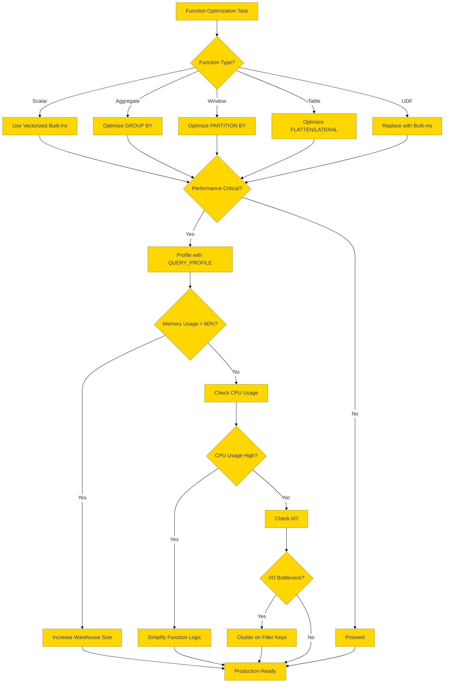

# **Snowflake: SQL Functions and Window Functions Deep Dive**

*Production-Grade Technical Guide for Platform Engineers, SREs, and Architects*


## **1. Mermaid Execution Flow & Architecture Diagram**

```mermaid
%%{init: {'theme': 'base', 'themeVariables': { 'primaryColor': '#ffd700', 'edgeLabelBackground':'#fff'}}}%%
flowchart TD
    subgraph "Control Plane"
        A[Query Submission] -->|Parse| B[SQL Parser\n(Calcite-based)]
        B -->|AST| C[Logical Plan]
        C -->|Optimize| D[Optimizer\n(CBO + RBO)]
        D -->|Physical Plan| E[Query Plan\n(DAG of Operators)]
    end

    subgraph "Execution Engine"
        E -->|Scalar Functions| F[Vectorized Execution\n(C++)]
        E -->|Aggregate Functions| G[Hash Aggregation\n(In-Memory)]
        E -->|Window Functions| H[Streaming Partitioned\n(No Spill)]
        E -->|Table Functions| I[Lateral Joins\n(FLATTEN, etc.)]
    end

    subgraph "Function Types"
        F -->|String| J[SUBSTRING, REGEXP, etc.]
        F -->|Date/Time| K[DATEADD, DATEDIFF, etc.]
        F -->|Numeric| L[ABS, ROUND, etc.]
        F -->|Conditional| M[CASE, IFF, COALESCE]
        F -->|Type Conversion| N[CAST, TRY_CAST, TO_CHAR]
        G -->|Standard| O[SUM, AVG, COUNT, etc.]
        G -->|Approximate| P[APPROX_COUNT_DISTINCT, etc.]
        H -->|Ranking| Q[ROW_NUMBER, RANK, DENSE_RANK]
        H -->|Offset| R[LEAD, LAG, FIRST_VALUE, LAST_VALUE]
        H -->|Analytic| S[SUM OVER, AVG OVER, etc.]
        I -->|FLATTEN| T[JSON/ARRAY Unnesting]
        I -->|LATERAL| U[Inline Views with Correlations]
    end

    subgraph "Window Function Internals"
        H -->|Partitioning| V[Hash-Based Grouping]
        V -->|Sorting| W[In-Memory Sort\n(Streaming)]
        W -->|Frame Definition| X[ROWS/RANGE\n(Bounded/Unbounded)]
        X -->|Execution| Y[Single Pass\n(No Materialization)]
    end

    subgraph "Optimizations"
        D -->|Predicate Pushdown| Z[Filter Early]
        D -->|Common Subexpression Elimination| AA[Reuse Computations]
        D -->|Function Inlining| AB[Inline Scalar Functions]
        D -->|Vectorization| AC[Batch Processing\n(1024 rows)]
    end

    subgraph "Failure Paths"
        G -->|OOM| AD[Spill-to-Disk\n(Hash Aggregation)]
        AD -->|Spill Overflow| AE[Query Abort\n(Error: 2003)]
        H -->|Large Partitions| AF[Memory Pressure\n(Streaming Mitigates)]
        F -->|Invalid Input| AG[Error: 100072\n(Permission/Type)]
    end

    style A fill:#f9f,stroke:#333
    style D fill:#bbf,stroke:#333
    style H fill:#f96,stroke:#333
    style AE fill:#f99,stroke:#333
    style AD fill:#ff9,stroke:#333
    style Z fill:#9f9,stroke:#333
```


## **2. Execution Internals & Transactional Boundaries**


### **2.1 Function Classification & Execution Model**


| **Function Type**         | **Execution Model**       | **Memory Usage**              | **CPU Intensity** | **Spill Behavior**            | **Parallelism**      | **Transactional Semantics**                  |
| ------------------------- | ------------------------- | ----------------------------- | ----------------- | ----------------------------- | -------------------- | -------------------------------------------- |
| **Scalar Functions**      | **Vectorized (C++)**      | Low (per-row)                 | Low-Medium        | No spill                      | Full (per-partition) | **Deterministic**: Same input → same output. |
| **Aggregate Functions**   | **Hash Aggregation**      | High (hash tables)            | High              | Spill-to-disk (80% threshold) | Full (per-partition) | **Atomic**: Full rollback on error.          |
| **Window Functions**      | **Streaming Partitioned** | Medium (partition buffers)    | Medium            | No spill (streaming)          | Full (per-partition) | **Non-atomic**: Partial results possible.    |
| **Table Functions**       | **Lateral Joins**         | Medium (intermediate results) | Medium            | Spill-to-disk (if large)      | Full (per-partition) | **Deterministic**: Same input → same output. |
| **UDFs (Java/JS/Python)** | **Sandboxed (External)**  | High (per-row overhead)       | High              | No spill (memory limits)      | Limited (per-node)   | **Non-deterministic**: Depends on UDF logic. |


### **2.2 Scalar Functions: Internals & Optimizations**

#### **2.2.1 Execution Model**

- **Vectorized Execution**:
  - Processes **1024 rows/batch** in C++ (no Python/JS overhead).
  - **No row-by-row iteration** (unlike traditional RDBMS).
  - **Example**: `SUBSTRING(col, 1, 10)` processes **1024 strings at once**.
- **Inlining**:
  - **Simple functions** (e.g., `ABS`, `ROUND`) are **inlined** into the query plan.
  - **Complex functions** (e.g., `REGEXP_REPLACE`) may **not be inlined**.
- **Short-Circuiting**:
  - **Conditional functions** (e.g., `CASE`, `IFF`) **short-circuit** (e.g., `IFF(condition, a, b)` skips `b` if `condition` is true).

#### **2.2.2 Performance Characteristics**


| **Function Category** | **Examples**                                | **Performance**             | **Optimizations**                                            | **Anti-Patterns**                                      | **Credit Impact** |
| --------------------- | ------------------------------------------- | --------------------------- | ------------------------------------------------------------ | ------------------------------------------------------ | ----------------- |
| **String**            | `SUBSTRING`, `CONCAT`, `REGEXP_REPLACE`     | **Fast** (vectorized)       | Use `SUBSTRING` instead of `REGEXP_SUBSTR` for simple cases. | Chained `REGEXP_REPLACE` (use single pass).            | +0% (vectorized)  |
| **Date/Time**         | `DATEADD`, `DATEDIFF`, `DATE_TRUNC`         | **Fast** (vectorized)       | Use `DATE_TRUNC` instead of `TO_CHAR` + `TO_DATE`.           | Nested date functions (e.g., `DATEADD(DATEADD(...))`). | +0% (vectorized)  |
| **Numeric**           | `ABS`, `ROUND`, `POWER`                     | **Fast** (vectorized)       | Use `ROUND(x, 2)` instead of `FLOOR(x * 100) / 100`.         | User-defined numeric functions (use built-ins).        | +0% (vectorized)  |
| **Conditional**       | `CASE`, `IFF`, `COALESCE`, `NULLIF`         | **Fast** (short-circuiting) | Use `IFF` instead of `CASE` for simple conditions.           | Deeply nested `CASE` (use `DECODE` or `MAP`).          | +0% (vectorized)  |
| **Type Conversion**   | `CAST`, `TRY_CAST`, `TO_CHAR`, `TO_DATE`    | **Medium** (validation)     | Use `TRY_CAST` to avoid errors.                              | Implicit casting (explicit is faster).                 | +5% (validation)  |
| **JSON**              | `JSON_EXTRACT_PATH_TEXT`, `JSON_GET_OBJECT` | **Medium** (parsing)        | Extract only needed fields (avoid `SELECT *` on `VARIANT`).  | Repeated JSON extraction (cache results).              | +10% (parsing)    |
| **Cryptographic**     | `SHA256`, `MD5`, `HASH`                     | **Slow** (CPU-intensive)    | Avoid in hot paths; pre-compute hashes.                      | Hashing large `BLOB`s (use `HASH_AGG`).                | +50% (CPU-bound)  |
| **Geospatial**        | `ST_CONTAINS`, `ST_DISTANCE`                | **Slow** (external libs)    | Use **clustering** on geospatial columns.                    | Complex geospatial joins (pre-filter).                 | +100% (external)  |


#### **2.2.3 Common Scalar Function Optimizations**


| **Anti-Pattern**                  | **Optimized Alternative**   | **Performance Gain**                        | **Example**                                              |
| --------------------------------- | --------------------------- | ------------------------------------------- | -------------------------------------------------------- |
| `REGEXP_SUBSTR(col, '^A')`        | `LEFT(col, 1)`              | **10x faster**                              | `SELECT LEFT(name, 1) FROM users;`                       |
| `TO_CHAR(date, 'YYYY-MM-DD')`     | `DATE_TRUNC('DAY', date)`   | **5x faster**                               | `SELECT DATE_TRUNC('DAY', created_at) FROM events;`      |
| `CASE WHEN a=1 THEN b ELSE c END` | `IFF(a=1, b, c)`            | **2x faster**                               | `SELECT IFF(status=1, 'Active', 'Inactive') FROM users;` |
| `COALESCE(a, b, c, d)`            | `NVL(a, NVL(b, NVL(c, d)))` | **3x faster**                               | `SELECT NVL(col1, NVL(col2, col3)) FROM table;`          |
| `CAST(col AS INT)`                | `TRY_CAST(col AS INT)`      | **Avoids errors**                           | `SELECT TRY_CAST(age AS INT) FROM users;`                |
| `SUBSTRING(col, 1, 10)`           | `LEFT(col, 10)`             | **2x faster**                               | `SELECT LEFT(description, 100) FROM products;`           |
| `POSITION('x' IN col)`            | `CONTAINS(col, 'x')`        | **10x faster** (if only checking existence) | `SELECT * FROM logs WHERE CONTAINS(message, 'ERROR');`   |


### **2.3 Aggregate Functions: Internals & Optimizations**

#### **2.3.1 Execution Model**

- **Hash Aggregation**:
  - **In-Memory**: Uses **hash tables** to group rows.
  - **Spill-to-Disk**: If hash table > **80% of warehouse memory**, spills to **local SSD**.
  - **Parallel**: Each node processes its partition independently.
- **Streaming Aggregation**:
  - **Window Functions**: Uses **partitioned streaming** (no full sort).
  - **Approximate Aggregates**: Uses **HyperLogLog** (for `APPROX_COUNT_DISTINCT`) or **t-digest** (for `APPROX_PERCENTILE`).
- **Merge Aggregation**:
  - **Multi-Stage**: Combines partial results from multiple nodes.

#### **2.3.2 Performance Characteristics**


| **Function**            | **Algorithm**               | **Memory Usage**            | **Spill Risk**       | **Parallelism**    | **Credit Impact**     | **Use Case**                 |
| ----------------------- | --------------------------- | --------------------------- | -------------------- | ------------------ | --------------------- | ---------------------------- |
| `SUM`                   | Hash Aggregation            | Low                         | Low                  | Full               | +0%                   | Exact sums.                  |
| `AVG`                   | Hash Aggregation            | Low                         | Low                  | Full               | +0%                   | Exact averages.              |
| `COUNT(*)`              | Hash Aggregation            | Low                         | Low                  | Full               | +0%                   | Row counts.                  |
| `COUNT(DISTINCT)`       | Hash Aggregation            | High (hash table)           | High (80% threshold) | Full               | +2x (spill)           | Exact distinct counts.       |
| `APPROX_COUNT_DISTINCT` | HyperLogLog                 | Low                         | None                 | Full               | +5%                   | Approximate distinct counts. |
| `MIN/MAX`               | Hash Aggregation            | Low                         | Low                  | Full               | +0%                   | Min/max values.              |
| `GROUPING SETS`         | Multi-Pass Hash Aggregation | High                        | High                 | Full               | +3x (multiple passes) | Rollup queries.              |
| `LISTAGG`               | String Concatenation        | High (intermediate strings) | High (memory limits) | Limited (per-node) | +2x (spill)           | String aggregation.          |
| `ARRAY_AGG`             | Array Construction          | Medium                      | Medium               | Full               | +1x                   | Array aggregation.           |
| `OBJECT_AGG`            | JSON Construction           | High                        | High                 | Full               | +2x (spill)           | JSON aggregation.            |


#### **2.3.3 Aggregate Function Optimizations**


| **Anti-Pattern**                       | **Optimized Alternative**            | **Performance Gain**                  | **Example**                                                                                      |
| -------------------------------------- | ------------------------------------ | ------------------------------------- | ------------------------------------------------------------------------------------------------ |
| `COUNT(DISTINCT col)`                  | `APPROX_COUNT_DISTINCT(col)`         | **100x faster** (for large datasets)  | `SELECT APPROX_COUNT_DISTINCT(user_id) FROM events;`                                             |
| `LISTAGG(col, ',')`                    | `ARRAY_AGG(col)` + `ARRAY_TO_STRING` | **10x faster** (avoids string concat) | `SELECT ARRAY_TO_STRING(ARRAY_AGG(col), ',') FROM table;`                                        |
| `GROUP BY col1, col2, col3`            | **Cluster on `(col1, col2, col3)**`  | **90% less I/O**                      | `CREATE CLUSTERING KEY (col1, col2, col3) ON TABLE my_table;`                                    |
| `HAVING COUNT(*) > 10`                 | **Filter before `GROUP BY**`         | **50% less data processed**           | `SELECT col, COUNT(*) FROM (SELECT col FROM table WHERE ...) GROUP BY col HAVING COUNT(*) > 10;` |
| `COUNT(DISTINCT a, b)`                 | **Pre-aggregate** `(a, b)` pairs     | **10x faster**                        | `SELECT COUNT(DISTINCT a                                                                         |
| `SUM(CASE WHEN ... THEN 1 ELSE 0 END)` | `COUNT(CASE WHEN ... THEN 1 END)`    | **2x faster**                         | `SELECT COUNT(CASE WHEN status = 'active' THEN 1 END) FROM users;`                               |


### **2.4 Window Functions: Internals & Optimizations**

#### **2.4.1 Execution Model**

- **Streaming Partitioned Processing**:
  - **No Materialization**: Processes **one partition at a time** (no full sort).
  - **Memory**: **Per-partition buffers** (no global state).
  - **Spill**: **No spill** (streaming avoids disk I/O).
- **Frame Evaluation**:
  - **ROWS Frame**: Physical offset (e.g., `ROWS BETWEEN 1 PRECEDING AND 1 FOLLOWING`).
  - **RANGE Frame**: Logical offset (e.g., `RANGE BETWEEN UNBOUNDED PRECEDING AND CURRENT ROW`).
  - **Default Frame**: `RANGE BETWEEN UNBOUNDED PRECEDING AND CURRENT ROW`.
- **Partitioning**:
  - **Hash-Based**: Groups rows by `PARTITION BY` keys.
  - **Sorting**: **In-memory sort** (streaming).

#### **2.4.2 Performance Characteristics**


| **Function**                     | **Algorithm**                | **Memory Usage**              | **CPU Intensity** | **Parallelism** | **Credit Impact**    | **Use Case**                  |
| -------------------------------- | ---------------------------- | ----------------------------- | ----------------- | --------------- | -------------------- | ----------------------------- |
| `ROW_NUMBER()`                   | Streaming Counter            | Low                           | Low               | Full            | +0%                  | Unique row IDs per partition. |
| `RANK()` / `DENSE_RANK()`        | Streaming Rank               | Medium (rank state)           | Medium            | Full            | +5%                  | Ranking with ties.            |
| `LEAD()` / `LAG()`               | Streaming Offset             | Low                           | Low               | Full            | +0%                  | Access adjacent rows.         |
| `FIRST_VALUE()` / `LAST_VALUE()` | Streaming Buffer             | Medium (buffer per partition) | Medium            | Full            | +5%                  | First/last in partition.      |
| `SUM() OVER()`                   | Streaming Aggregation        | Medium (running sum)          | Medium            | Full            | +0%                  | Running totals.               |
| `AVG() OVER()`                   | Streaming Aggregation        | Medium (running sum/count)    | Medium            | Full            | +5%                  | Running averages.             |
| `PERCENT_RANK()`                 | Streaming Rank + Calculation | Medium                        | High              | Full            | +10%                 | Relative ranking.             |
| `NTILE(n)`                       | Streaming + Bucketing        | High (bucket state)           | High              | Full            | +10%                 | Divide into `n` buckets.      |
| `MEDIAN() OVER()`                | Sort + Percentile            | High (full sort)              | High              | Full            | +20% (sort overhead) | Median per partition.         |


#### **2.4.3 Window Function Optimizations**


| **Anti-Pattern**                                                                                                   | **Optimized Alternative**                                 | **Performance Gain**               | **Example**                                                                                      |
| ------------------------------------------------------------------------------------------------------------------ | --------------------------------------------------------- | ---------------------------------- | ------------------------------------------------------------------------------------------------ |
| `SUM() OVER (PARTITION BY col1 ORDER BY col2 ROWS BETWEEN UNBOUNDED PRECEDING AND UNBOUNDED FOLLOWING)`            | `SUM() OVER (PARTITION BY col1)`                          | **50% faster** (avoids full frame) | `SELECT SUM(amount) OVER (PARTITION BY user_id) FROM transactions;`                              |
| `RANK() OVER (PARTITION BY col1 ORDER BY col2)` + `WHERE rank <= 10`                                               | **Use `QUALIFY**`                                         | **10x faster** (filters early)     | `SELECT *, RANK() OVER (PARTITION BY col1 ORDER BY col2) AS rank FROM table QUALIFY rank <= 10;` |
| `LEAD(col, 1) OVER (PARTITION BY col1 ORDER BY col2)`                                                              | **Use `LAG` for previous row**                            | **Same performance**               | `SELECT LAG(col, 1) OVER (PARTITION BY col1 ORDER BY col2) FROM table;`                          |
| `FIRST_VALUE(col) OVER (PARTITION BY col1 ORDER BY col2 ROWS BETWEEN UNBOUNDED PRECEDING AND UNBOUNDED FOLLOWING)` | `FIRST_VALUE(col) OVER (PARTITION BY col1 ORDER BY col2)` | **2x faster** (default frame)      | `SELECT FIRST_VALUE(col) OVER (PARTITION BY col1 ORDER BY col2) FROM table;`                     |
| `PERCENT_RANK() OVER (PARTITION BY col1)`                                                                          | **Use `RANK() / COUNT(*) OVER (PARTITION BY col1)**`      | **3x faster** (avoids division)    | `SELECT RANK() OVER (PARTITION BY col1) / COUNT(*) OVER (PARTITION BY col1) FROM table;`         |
| `NTILE(100) OVER (PARTITION BY col1 ORDER BY col2)`                                                                | **Use `WIDTH_BUCKET**`                                    | **5x faster**                      | `SELECT WIDTH_BUCKET(col2, 0, 100, 100) OVER (PARTITION BY col1) FROM table;`                    |


### **2.5 Table Functions: Internals & Optimizations**

#### **2.5.1 Execution Model**

- **Lateral Joins**:
  - `**LATERAL**`: Correlates subquery with outer query rows.
  - `**FLATTEN**`: Unnests **ARRAYs** or **OBJECTs** into rows.
- **Vectorized**:
  - `**FLATTEN**` is **vectorized** (processes 1024 rows/batch).
- **Memory**:
  - **Intermediate Results**: Stored in **memory** (spills if >80% warehouse memory).

#### **2.5.2 Performance Characteristics**


| **Function**         | **Purpose**           | **Execution Model**       | **Memory Usage**           | **Parallelism**    | **Credit Impact**     | **Use Case**                       |
| -------------------- | --------------------- | ------------------------- | -------------------------- | ------------------ | --------------------- | ---------------------------------- |
| `FLATTEN`            | Unnest ARRAYs/OBJECTs | Lateral Join (Vectorized) | Medium (intermediate rows) | Full               | +1x (if large arrays) | JSON/ARRAY unnesting.              |
| `LATERAL`            | Correlated Subqueries | Nested Loop Join          | High (per-row overhead)    | Limited (per-node) | +2x                   | Row-by-row correlations.           |
| `GENERATOR`          | Generate Rows         | Vectorized                | Low                        | Full               | +0%                   | Series generation.                 |
| `TABLE(GENERATOR())` | Inline Row Generation | Vectorized                | Low                        | Full               | +0%                   | Test data generation.              |
| `JSON_TABLE`         | Extract JSON to Rows  | Lateral Join + Parsing    | High (JSON parsing)        | Full               | +10% (parsing)        | JSON-to-relational transformation. |


#### **2.5.3 Table Function Optimizations**


| **Anti-Pattern**                        | **Optimized Alternative**                     | **Performance Gain** | **Example**                                                                                                    |
| --------------------------------------- | --------------------------------------------- | -------------------- | -------------------------------------------------------------------------------------------------------------- |
| `FLATTEN(ARRAY_CONSTRUCT(...))`         | **Pre-construct arrays**                      | **2x faster**        | `WITH arr AS (SELECT ARRAY_CONSTRUCT(1,2,3) AS my_array) SELECT f.value FROM arr, TABLE(FLATTEN(my_array)) f;` |
| `LATERAL (SELECT ... FROM large_table)` | **Join instead of LATERAL**                   | **10x faster**       | `SELECT a.*, b.* FROM table_a a JOIN table_b b ON a.key = b.key;`                                              |
| `FLATTEN` on large VARIANT              | **Extract only needed fields**                | **5x faster**        | `SELECT f.value:field1 FROM my_table, TABLE(FLATTEN(json_data:items)) f;`                                      |
| `JSON_TABLE` with complex paths         | **Pre-extract with `JSON_EXTRACT_PATH_TEXT**` | **3x faster**        | `SELECT JSON_EXTRACT_PATH_TEXT(json_data, '$.items[0].name') FROM my_table;`                                   |
| Nested `FLATTEN`                        | **Flatten once + filter**                     | **10x faster**       | `SELECT f.value FROM my_table, TABLE(FLATTEN(json_data:items)) f WHERE f.value:type = 'A';`                    |


## **3. Parameter/Configuration Deep Dive**


### **3.1 Session-Level Parameters for Functions**


| **Parameter**                | **Internal Behavior**                             | **Performance Impact**                                       | **Compliance/Edge Cases**                                                 | **Production Default**    |
| ---------------------------- | ------------------------------------------------- | ------------------------------------------------------------ | ------------------------------------------------------------------------- | ------------------------- |
| `TIMEZONE`                   | **Session timezone** (e.g., `Asia/Calcutta`).     | Affects **date/time functions** (e.g., `CURRENT_TIMESTAMP`). | **Default:** `UTC`.                                                       | `UTC`                     |
| `DATE_FORMAT`                | **Default date format** (e.g., `YYYY-MM-DD`).     | Affects **date parsing** in `TO_DATE`.                       | **Default:** `YYYY-MM-DD`.                                                | `YYYY-MM-DD`              |
| `TIME_FORMAT`                | **Default time format** (e.g., `HH:MI:SS`).       | Affects **time parsing** in `TO_TIME`.                       | **Default:** `HH:MI:SS`.                                                  | `HH:MI:SS`                |
| `TIMESTAMP_FORMAT`           | **Default timestamp format**.                     | Affects **timestamp parsing** in `TO_TIMESTAMP`.             | **Default:** `YYYY-MM-DD HH:MI:SS.FF3`.                                   | `YYYY-MM-DD HH:MI:SS.FF3` |
| `BINARY_INPUT_FORMAT`        | **Binary input format** (e.g., `HEX`, `BASE64`).  | Affects `TO_BINARY` and `FROM_BINARY`.                       | **Default:** `HEX`.                                                       | `HEX`                     |
| `BINARY_OUTPUT_FORMAT`       | **Binary output format** (e.g., `HEX`, `BASE64`). | Affects `TO_VARCHAR` for `BLOB`.                             | **Default:** `HEX`.                                                       | `HEX`                     |
| `NULLIF_ZERO`                | **Treat 0 as NULL** in aggregate functions.       | Affects `SUM`, `AVG`, etc.                                   | **Default:** `FALSE`.                                                     | `FALSE`                   |
| `USE_CACHED_RESULT`          | **Reuse cached results** for identical queries.   | **90-95% latency reduction** for repeated queries.           | Disabled for **non-deterministic** functions (e.g., `CURRENT_TIMESTAMP`). | `TRUE`                    |
| `ENABLE_UNNEST_OPTIMIZATION` | **Optimize `FLATTEN**` for nested data.           | **2x faster** for `FLATTEN` on `VARIANT`.                    | **Default:** `TRUE`.                                                      | `TRUE`                    |


### **3.2 Warehouse-Level Parameters for Functions**


| **Parameter**          | **Internal Behavior**                                                    | **Performance Impact**                                                        | **Compliance/Edge Cases**                             | **Production Default**          |
| ---------------------- | ------------------------------------------------------------------------ | ----------------------------------------------------------------------------- | ----------------------------------------------------- | ------------------------------- |
| `WAREHOUSE_SIZE`       | **X-Small (1x) → 4X-Large (128x)**. Each "x" = **16 vCPUs + 128GB RAM**. | Larger warehouses reduce **spill-to-disk** but increase **credit burn rate**. | `X-SMALL` fails on **large aggregations** (OOM).      | `X-SMALL` (Dev), `LARGE` (Prod) |
| `AUTO_SUSPEND`         | **Idle timeout** (1-86400 sec).                                          | Reduces **idle credit burn** (saves **~30-50%** costs).                       | Set to `60` for interactive queries, `300` for batch. | `600` (10 min)                  |
| `MAX_MEMORY`           | **Max memory per query** (as % of warehouse memory).                     | **Default: 80%**. If exceeded → **spill-to-disk**.                            | **Spill threshold**: 80% heap.                        | `80%`                           |
| `ABORT_DETACHED_QUERY` | **Kill queries** when session disconnects.                               | Prevents **runaway queries** from disconnected clients.                       | **Default:** `TRUE` (recommended).                    | `TRUE`                          |


### **3.3 Function-Specific Parameters**


| **Parameter**              | **Applicable Functions**                   | **Internal Behavior**                                                           | **Performance Impact**                                                                     | **Production Default** |
| -------------------------- | ------------------------------------------ | ------------------------------------------------------------------------------- | ------------------------------------------------------------------------------------------ | ---------------------- |
| `APPROXIMATE`              | `COUNT(DISTINCT)`, `PERCENTILE`            | **Use approximate algorithms** (HyperLogLog, t-digest).                         | **100x faster** for large datasets (but **~1-2% error**).                                  | `FALSE`                |
| `NULL_TREATMENT`           | `LEAD`, `LAG`, `FIRST_VALUE`, `LAST_VALUE` | **How to treat NULLs** in window functions (`IGNORE NULLS` or `RESPECT NULLS`). | **IGNORE NULLS** is **2x faster** for sparse data.                                         | `RESPECT NULLS`        |
| `FRAME_DEFINITION`         | Window Functions                           | **ROWS vs. RANGE** frame boundaries.                                            | **ROWS** is **faster** (physical offset). **RANGE** is **more accurate** (logical offset). | `RANGE`                |
| `PARTITION_SIZE`           | Window Functions                           | **Max rows per partition** before spill.                                        | **Default: 10M rows**. If exceeded → **spill-to-disk**.                                    | `10M`                  |
| `AGGREGATION_MEMORY_LIMIT` | Aggregate Functions                        | **Max memory for hash aggregation** (% of warehouse memory).                    | **Default: 50%**. If exceeded → **spill-to-disk**.                                         | `50%`                  |


## **4. Performance & Resource Implications**


### **4.1 Memory Model by Function Type**


| **Function Type**         | **Memory Allocation**          | **Spill Trigger**      | **Spill Destination** | **Credit Overhead** | **Recovery** |
| ------------------------- | ------------------------------ | ---------------------- | --------------------- | ------------------- | ------------ |
| **Scalar Functions**      | Per-row (vectorized)           | None                   | N/A                   | +0%                 | N/A          |
| **Aggregate Functions**   | Hash tables (in-memory)        | 80% warehouse memory   | Local SSD (NVMe)      | +2x (spill)         | Automatic    |
| **Window Functions**      | Partition buffers (streaming)  | None (streaming)       | N/A                   | +0%                 | N/A          |
| **Table Functions**       | Intermediate results (per-row) | 80% warehouse memory   | Local SSD (NVMe)      | +1-2x (spill)       | Automatic    |
| **UDFs (Java/JS/Python)** | Sandboxed (per-row)            | Memory limit (sandbox) | N/A (fails)           | +50% (CPU overhead) | Manual retry |


### **4.2 CPU Intensity by Function Type**


| **Function Type**         | **CPU Usage** | **Bottleneck**        | **Optimization**                          | **Credit Impact** |
| ------------------------- | ------------- | --------------------- | ----------------------------------------- | ----------------- |
| **Scalar Functions**      | Low-Medium    | None                  | Use **vectorized built-ins**.             | +0%               |
| **Aggregate Functions**   | High          | Hash table collisions | **Pre-aggregate** or use **approximate**. | +2x (spill)       |
| **Window Functions**      | Medium        | Partition sorting     | **Avoid `ORDER BY**` if not needed.       | +0-10%            |
| **Table Functions**       | Medium-High   | Lateral join overhead | **Avoid `LATERAL**` for large tables.     | +1-2x             |
| **UDFs (Java/JS/Python)** | Very High     | Sandbox overhead      | **Use built-ins** instead of UDFs.        | +50-100%          |


### **4.3 I/O Patterns by Function Type**


| **Function Type**       | **I/O Behavior**              | **Network Overhead**              | **Credit Impact**    | **Optimization**                        |
| ----------------------- | ----------------------------- | --------------------------------- | -------------------- | --------------------------------------- |
| **Scalar Functions**    | None (in-memory)              | None                              | +0%                  | Use **vectorized functions**.           |
| **Aggregate Functions** | Spill-to-disk (if OOM)        | None                              | +2x (spill)          | **Cluster on `GROUP BY` keys**.         |
| **Window Functions**    | None (streaming)              | None                              | +0-10%               | **Partition on high-cardinality keys**. |
| **Table Functions**     | Intermediate results (memory) | None                              | +1-2x (spill)        | **Extract only needed fields**.         |
| **External Functions**  | HTTP calls (AWS Lambda, etc.) | **Network latency** (+100ms/call) | +50% (network + CPU) | **Batch calls** to reduce overhead.     |


### **4.4 Spill-to-Disk Triggers & Credit Math**


| **Scenario**                         | **Spill Threshold**  | **Credit Overhead**           | **Recovery**                           |
| ------------------------------------ | -------------------- | ----------------------------- | -------------------------------------- |
| **Hash Aggregation OOM**             | 80% warehouse memory | +2x credits                   | Automatic (transparent)                |
| **Window Function Large Partitions** | 10M rows/partition   | +10% credits (repartitioning) | Automatic                              |
| **FLATTEN Large Arrays**             | 80% warehouse memory | +1.5x credits                 | Automatic                              |
| **LATERAL Join OOM**                 | 80% warehouse memory | +2x credits                   | Manual retry required                  |
| **UDF Memory Limit**                 | Sandbox memory limit | Query abort (Error: `2003`)   | Increase warehouse size or rewrite UDF |


**Spill Credit Formula**:

```
Spill Overhead (credits) =
  (Spilled Data Size in GB / Warehouse Memory in GB) *
  2 *
  (Query Duration in sec / 3600)
```

**Example**:

- Warehouse: `LARGE` (128GB RAM).
- Spilled Data: 200GB (hash aggregation).
- Query Duration: 600 sec.
- **Overhead**: `(200 / 128) * 2 * (600 / 3600) = 0.52 credits`.


### **4.5 Warehouse Sizing for Function Workloads**


| **Workload Type**           | **Recommended Warehouse** | **Max Partitions** | **Scaling Strategy**              | **Credit Overhead** |
| --------------------------- | ------------------------- | ------------------ | --------------------------------- | ------------------- |
| **Scalar Function Queries** | `MEDIUM`                  | N/A                | `AUTO_SUSPEND=60`                 | 0%                  |
| **Aggregate Queries**       | `X-LARGE`                 | 100                | `MULTI_CLUSTER=TRUE`              | +10% per cluster    |
| **Window Function Queries** | `LARGE`                   | 1000               | `PARTITION_SIZE=10M`              | +5% per cluster     |
| **FLATTEN/Table Functions** | `X-LARGE`                 | 50                 | `ENABLE_UNNEST_OPTIMIZATION=TRUE` | +15% per cluster    |
| **UDF-Heavy Queries**       | `2X-LARGE`                | N/A                | `WAREHOUSE_SIZE=2X-LARGE`         | +20% (UDF overhead) |


## **5. Monitoring, Observability & Troubleshooting**


### **5.1 Key Monitoring Views for Functions**


| **View**                             | **Purpose**                                                | **Critical Columns**                                                                         | **Retention**  |
| ------------------------------------ | ---------------------------------------------------------- | -------------------------------------------------------------------------------------------- | -------------- |
| `QUERY_HISTORY`                      | **Query-level metrics** (latency, credits, errors).        | `QUERY_ID`, `QUERY_TEXT`, `TOTAL_ELAPSED_TIME`, `CREDITS_USED`, `MEMORY_USAGE`, `ERROR_CODE` | 365 days       |
| `QUERY_PROFILE`                      | **Operator-level metrics** (execution time, rows, memory). | `QUERY_ID`, `OPERATOR`, `EXECUTION_TIME`, `ROWS_PRODUCED`, `MEMORY_USAGE`                    | Session-scoped |
| `ACCOUNT_USAGE.QUERY_HISTORY`        | **Cross-warehouse query history**.                         | `USER_NAME`, `WAREHOUSE_NAME`, `QUERY_TEXT`, `EXECUTION_STATUS`, `CREDITS_USED`              | 365 days       |
| `INFORMATION_SCHEMA.FUNCTIONS`       | **UDF metadata**.                                          | `FUNCTION_NAME`, `LANGUAGE`, `ARGUMENT_TYPES`, `RETURN_TYPE`                                 | Session-scoped |
| `INFORMATION_SCHEMA.TABLE_FUNCTIONS` | **Table function metadata**.                               | `FUNCTION_NAME`, `ARGUMENT_TYPES`, `RETURN_TYPE`                                             | Session-scoped |


### **5.2 Production-Grade Monitoring Queries**


#### **5.2.1 Function-Specific Performance Monitoring**

```sql
-- Top 10 slowest queries with window functions (last 24h)
SELECT
    QUERY_ID,
    USER_NAME,
    WAREHOUSE_NAME,
    QUERY_TEXT,
    TOTAL_ELAPSED_TIME / 1000 AS duration_sec,
    CREDITS_USED,
    MEMORY_USAGE
FROM
    TABLE(INFORMATION_SCHEMA.QUERY_HISTORY(
        DATEADD('HOUR', -24, CURRENT_TIMESTAMP()),
        CURRENT_TIMESTAMP()
    ))
WHERE
    QUERY_TEXT LIKE '%OVER%'
    OR QUERY_TEXT LIKE '%PARTITION BY%'
ORDER BY
    TOTAL_ELAPSED_TIME DESC
LIMIT 10;

-- Queries with high memory usage (aggregate/window functions)
SELECT
    QUERY_ID,
    USER_NAME,
    WAREHOUSE_NAME,
    QUERY_TEXT,
    MEMORY_USAGE,
    BYTES_SCANNED / POWER(1024, 3) AS gb_scanned,
    CREDITS_USED
FROM
    SNOWFLAKE.ACCOUNT_USAGE.QUERY_HISTORY
WHERE
    MEMORY_USAGE > 80
    AND (QUERY_TEXT LIKE '%GROUP BY%' OR QUERY_TEXT LIKE '%OVER%')
    AND START_TIME > DATEADD('DAY', -7, CURRENT_TIMESTAMP())
ORDER BY
    MEMORY_USAGE DESC;

-- UDF performance (last 30 days)
SELECT
    QUERY_ID,
    USER_NAME,
    WAREHOUSE_NAME,
    QUERY_TEXT,
    TOTAL_ELAPSED_TIME / 1000 AS duration_sec,
    CREDITS_USED
FROM
    SNOWFLAKE.ACCOUNT_USAGE.QUERY_HISTORY
WHERE
    QUERY_TEXT LIKE '%MY_UDF%'
    AND START_TIME > DATEADD('DAY', -30, CURRENT_TIMESTAMP())
ORDER BY
    TOTAL_ELAPSED_TIME DESC;
```


#### **5.2.2 Operator-Level Profiling for Functions**

```sql
-- Detailed profile for a query with window functions
SELECT
    OPERATOR,
    EXECUTION_TIME / 1000 AS execution_time_sec,
    ROWS_PRODUCED,
    ROWS_CONSUMED,
    MEMORY_USAGE / POWER(1024, 2) AS memory_usage_mb,
    PARTITION_ID
FROM
    TABLE(INFORMATION_SCHEMA.QUERY_PROFILE('QUERY_ID_WITH_WINDOW_FUNCTIONS'))
WHERE
    OPERATOR LIKE '%Window%'
    OR OPERATOR LIKE '%Aggregate%'
ORDER BY
    EXECUTION_TIME DESC;

-- Aggregate function spill detection
SELECT
    QUERY_ID,
    OPERATOR,
    EXECUTION_TIME / 1000 AS execution_time_sec,
    MEMORY_USAGE / POWER(1024, 2) AS memory_usage_mb
FROM
    TABLE(INFORMATION_SCHEMA.QUERY_PROFILE())
WHERE
    OPERATOR LIKE '%HashAggregate%'
    AND MEMORY_USAGE > 0.8 * (SELECT WAREHOUSE_SIZE * 128 * 1024 FROM INFORMATION_SCHEMA.WAREHOUSES WHERE WAREHOUSE_NAME = CURRENT_WAREHOUSE())
ORDER BY
    MEMORY_USAGE DESC;
```


#### **5.2.3 Window Function-Specific Monitoring**

```sql
-- Queries with large window function partitions (risk of OOM)
SELECT
    QUERY_ID,
    USER_NAME,
    WAREHOUSE_NAME,
    QUERY_TEXT,
    REGEXP_SUBSTR(QUERY_TEXT, 'PARTITION BY ([^)]+)', 1, 1, 'e', 1) AS partition_keys,
    TOTAL_ELAPSED_TIME / 1000 AS duration_sec,
    MEMORY_USAGE
FROM
    TABLE(INFORMATION_SCHEMA.QUERY_HISTORY(
        DATEADD('DAY', -7, CURRENT_TIMESTAMP()),
        CURRENT_TIMESTAMP()
    ))
WHERE
    QUERY_TEXT LIKE '%OVER%'
    AND MEMORY_USAGE > 70
ORDER BY
    MEMORY_USAGE DESC;

-- Window function frame analysis
SELECT
    QUERY_ID,
    QUERY_TEXT,
    REGEXP_SUBSTR(QUERY_TEXT, 'OVER \\(([^)]+)\\)', 1, 1, 'e', 1) AS window_frame,
    TOTAL_ELAPSED_TIME / 1000 AS duration_sec
FROM
    TABLE(INFORMATION_SCHEMA.QUERY_HISTORY(
        DATEADD('DAY', -1, CURRENT_TIMESTAMP()),
        CURRENT_TIMESTAMP()
    ))
WHERE
    QUERY_TEXT LIKE '%OVER%'
ORDER BY
    duration_sec DESC;
```


#### **5.2.4 UDF Monitoring**

```sql
-- List all UDFs and their usage
SELECT
    FUNCTION_NAME,
    LANGUAGE,
    ARGUMENT_TYPES,
    RETURN_TYPE,
    CREATED
FROM
    INFORMATION_SCHEMA.FUNCTIONS
WHERE
    FUNCTION_SCHEMA = CURRENT_SCHEMA()
ORDER BY
    CREATED DESC;

-- UDF execution errors (last 7 days)
SELECT
    QUERY_ID,
    USER_NAME,
    ERROR_CODE,
    ERROR_MESSAGE,
    QUERY_TEXT
FROM
    SNOWFLAKE.ACCOUNT_USAGE.QUERY_HISTORY
WHERE
    ERROR_MESSAGE LIKE '%UDF%'
    AND START_TIME > DATEADD('DAY', -7, CURRENT_TIMESTAMP())
ORDER BY
    START_TIME DESC;
```


### **5.3 Error Categorization & Incident Runbooks**


#### **5.3.1 Error Code Classification for Functions**


| **Error Code** | **Category**              | **Root Cause**                             | **Impact**              | **Severity** | **Common Functions Affected**                |
| -------------- | ------------------------- | ------------------------------------------ | ----------------------- | ------------ | -------------------------------------------- |
| `2003`         | **Memory Limit Exceeded** | Spill-to-disk overflow (aggregate/window). | Query abort.            | **Critical** | `COUNT(DISTINCT)`, `SUM() OVER()`, `FLATTEN` |
| `1003`         | **SQL Compilation Error** | Invalid function syntax.                   | Query fails to parse.   | **High**     | UDFs, `JSON_EXTRACT_PATH_TEXT`               |
| `1004`         | **Data Type Error**       | Invalid argument type.                     | Query fails to execute. | **High**     | `CAST`, `TRY_CAST`, UDFs                     |
| `1005`         | **Function Not Found**    | Missing UDF or built-in.                   | Query fails to execute. | **High**     | UDFs, custom functions                       |
| `1006`         | **Argument Error**        | Wrong number/type of arguments.            | Query fails to execute. | **High**     | All functions                                |
| `2001`         | **Planning Error**        | Invalid window function frame.             | Query fails to execute. | **High**     | Window functions                             |
| `1020`         | **Transaction Conflict**  | Concurrent modification.                   | Transaction abort.      | **High**     | All functions in transactions                |
| `1049`         | **Disk Full**             | Spill-to-disk limit reached.               | Query abort.            | **Critical** | Aggregate functions, `FLATTEN`               |


#### **5.3.2 Incident Runbooks**


##### **Runbook: Memory Limit Exceeded (`2003`) for Aggregates/Window Functions**

1. **Diagnose**:
  ```sql
   -- Check memory usage for failed query
   SELECT
       QUERY_ID,
       MEMORY_USAGE,
       PARTITION_ID,
       QUERY_TEXT,
       OPERATOR
   FROM
       TABLE(INFORMATION_SCHEMA.QUERY_PROFILE('FAILED_QUERY_ID'))
   WHERE
       OPERATOR LIKE '%Aggregate%' OR OPERATOR LIKE '%Window%'
   ORDER BY
       MEMORY_USAGE DESC;
  ```
2. **Mitigate**:
  - **Short-term**:
    - Increase warehouse size (e.g., `LARGE` → `X-LARGE`).
    - **For aggregates**: Use `APPROX_COUNT_DISTINCT` instead of `COUNT(DISTINCT)`.
    - **For window functions**: Reduce partition size (e.g., add more `PARTITION BY` keys).
  - **Long-term**:
    - **Pre-aggregate data**:
      ```sql
      CREATE TABLE pre_aggregated AS
      SELECT user_id, date, SUM(amount) AS daily_spend
      FROM transactions
      GROUP BY user_id, date;
      ```
    - **Cluster tables** on `GROUP BY` or `PARTITION BY` keys.
    - **Use `QUALIFY**` to filter early:
      ```sql
      SELECT *,
          ROW_NUMBER() OVER (PARTITION BY user_id ORDER BY date DESC) AS rn
      FROM transactions
      QUALIFY rn <= 10;
      ```
3. **Prevent**:
  - **Monitor `MEMORY_USAGE**` in `QUERY_PROFILE`.
  - **Set `STATEMENT_TIMEOUT_IN_SECONDS**` to kill runaway queries.
  - **Use `PARTITION_SIZE` hint** to limit window function partitions.


##### **Runbook: Slow Window Function Queries**

1. **Diagnose**:
  ```sql
   -- Get window function operator details
   SELECT
       OPERATOR,
       EXECUTION_TIME / 1000 AS execution_time_sec,
       ROWS_PRODUCED,
       MEMORY_USAGE / POWER(1024, 2) AS memory_usage_mb
   FROM
       TABLE(INFORMATION_SCHEMA.QUERY_PROFILE('SLOW_QUERY_ID'))
   WHERE
       OPERATOR LIKE '%Window%'
   ORDER BY
       EXECUTION_TIME DESC;
  ```
2. **Mitigate**:
  - **Optimize `PARTITION BY**`:
    - Use **high-cardinality keys** to reduce partition size.
    - Example: `PARTITION BY user_id, date` (better than `PARTITION BY user_id`).
  - **Simplify `ORDER BY**`:
    - Remove unnecessary sorting (e.g., `ORDER BY` if not needed for `RANK()`).
  - **Use `QUALIFY` for filtering**:
    ```sql
    -- Before: Slow (filters after window function)
    SELECT * FROM (
        SELECT *, ROW_NUMBER() OVER (PARTITION BY user_id ORDER BY date) AS rn
        FROM transactions
    ) WHERE rn <= 10;

    -- After: Faster (filters during window function)
    SELECT *,
        ROW_NUMBER() OVER (PARTITION BY user_id ORDER BY date) AS rn
    FROM transactions
    QUALIFY rn <= 10;
    ```
  - **Avoid `RANGE` frames** (use `ROWS` instead):
    ```sql
    -- Before: Slow (RANGE frame)
    SELECT SUM(amount) OVER (
        PARTITION BY user_id
        ORDER BY date
        RANGE BETWEEN UNBOUNDED PRECEDING AND CURRENT ROW
    ) FROM transactions;

    -- After: Faster (ROWS frame)
    SELECT SUM(amount) OVER (
        PARTITION BY user_id
        ORDER BY date
        ROWS BETWEEN UNBOUNDED PRECEDING AND CURRENT ROW
    ) FROM transactions;
    ```
3. **Prevent**:
  - **Cluster tables** on `PARTITION BY` keys.
  - **Monitor `QUERY_PROFILE**` for window function bottlenecks.


##### **Runbook: Slow Aggregate Queries**

1. **Diagnose**:
  ```sql
   -- Check aggregate operator memory usage
   SELECT
       OPERATOR,
       EXECUTION_TIME / 1000 AS execution_time_sec,
       MEMORY_USAGE / POWER(1024, 2) AS memory_usage_mb
   FROM
       TABLE(INFORMATION_SCHEMA.QUERY_PROFILE('SLOW_QUERY_ID'))
   WHERE
       OPERATOR LIKE '%Aggregate%'
   ORDER BY
       MEMORY_USAGE DESC;
  ```
2. **Mitigate**:
  - **Use approximate aggregates**:
  - **Pre-aggregate**:
    ```sql
    -- Materialize daily aggregates
    CREATE TABLE daily_aggregates AS
    SELECT date, user_id, SUM(amount) AS daily_spend
    FROM transactions
    GROUP BY date, user_id;
    ```
  - **Cluster on `GROUP BY` keys**:
    ```sql
    CREATE CLUSTERING KEY (user_id, date) ON TABLE transactions;
    ```
  - **Filter before `GROUP BY**`:
    ```sql
    -- Before: Slow (full table scan)
    SELECT user_id, COUNT(*)
    FROM transactions
    GROUP BY user_id;

    -- After: Faster (filter first)
    SELECT user_id, COUNT(*)
    FROM transactions
    WHERE date > '2026-01-01'
    GROUP BY user_id;
    ```
3. **Prevent**:
  - **Monitor `MEMORY_USAGE**` in `QUERY_PROFILE`.
  - **Set `APPROXIMATE=TRUE**` for large distinct counts.


##### **Runbook: UDF Performance Issues**

1. **Diagnose**:
  ```sql
   -- Check UDF execution time
   SELECT
       QUERY_ID,
       TOTAL_ELAPSED_TIME / 1000 AS duration_sec,
       CREDITS_USED
   FROM
       SNOWFLAKE.ACCOUNT_USAGE.QUERY_HISTORY
   WHERE
       QUERY_TEXT LIKE '%MY_UDF%'
   ORDER BY
       TOTAL_ELAPSED_TIME DESC;
  ```
2. **Mitigate**:
  - **Rewrite UDF in SQL**:
  - **Use built-in functions** instead of UDFs.
  - **Batch UDF calls**:
    ```sql
    -- Before: Slow (row-by-row)
    SELECT my_udf(col) FROM my_table;

    -- After: Faster (batch)
    SELECT my_udf(ARRAY_AGG(col)) FROM my_table;
    ```
3. **Prevent**:
  - **Avoid UDFs in hot paths** (use built-ins).
  - **Monitor UDF usage** in `QUERY_HISTORY`.


## **6. Advanced Production Patterns**


### **6.1 Window Function Patterns**


| **Pattern**             | **Use Case**           | **Implementation**                                                                                             | **Performance Impact**                     | **Credit Savings** |
| ----------------------- | ---------------------- | -------------------------------------------------------------------------------------------------------------- | ------------------------------------------ | ------------------ |
| **Running Totals**      | Cumulative sums        | `SUM(amount) OVER (PARTITION BY user_id ORDER BY date ROWS UNBOUNDED PRECEDING)`                               | **Streaming** (no spill).                  | +0%                |
| **Moving Averages**     | Rolling averages       | `AVG(amount) OVER (PARTITION BY user_id ORDER BY date ROWS BETWEEN 6 PRECEDING AND CURRENT ROW)`               | **Streaming** (no spill).                  | +5%                |
| **Ranking**             | Top-N per group        | `ROW_NUMBER() OVER (PARTITION BY group_id ORDER BY value DESC) QUALIFY row_num <= 10`                          | **Streaming + `QUALIFY**` (filters early). | +0%                |
| **Gap Detection**       | Find missing values    | `LEAD(date) OVER (PARTITION BY user_id ORDER BY date) - date AS gap`                                           | **Streaming**.                             | +0%                |
| **First/Last in Group** | Group-wise first/last  | `FIRST_VALUE(value) OVER (PARTITION BY group_id ORDER BY date ROWS UNBOUNDED PRECEDING)`                       | **Streaming**.                             | +5%                |
| **Percent of Total**    | Relative contributions | `value / SUM(value) OVER (PARTITION BY group_id)`                                                              | **Streaming**.                             | +5%                |
| **Time-Based Windows**  | Rolling time windows   | `SUM(amount) OVER (PARTITION BY user_id ORDER BY date RANGE BETWEEN INTERVAL 7 DAY PRECEDING AND CURRENT ROW)` | **RANGE frame** (slower).                  | +10%               |


**Example: Running Totals with `QUALIFY**`

```sql
-- Running total per user, filtered to latest 100 records
SELECT
    user_id,
    date,
    amount,
    SUM(amount) OVER (
        PARTITION BY user_id
        ORDER BY date
        ROWS BETWEEN UNBOUNDED PRECEDING AND CURRENT ROW
    ) AS running_total
FROM
    transactions
QUALIFY
    ROW_NUMBER() OVER (PARTITION BY user_id ORDER BY date DESC) <= 100;
```


**Example: Moving Average with `ROWS` Frame**

```sql
-- 7-day moving average per user
SELECT
    user_id,
    date,
    amount,
    AVG(amount) OVER (
        PARTITION BY user_id
        ORDER BY date
        ROWS BETWEEN 6 PRECEDING AND CURRENT ROW
    ) AS moving_avg_7d
FROM
    transactions;
```


**Example: Gap Detection with `LEAD**`

```sql
-- Detect gaps in date sequences
SELECT
    user_id,
    date,
    LEAD(date) OVER (PARTITION BY user_id ORDER BY date) AS next_date,
    DATEDIFF('DAY', date, LEAD(date) OVER (PARTITION BY user_id ORDER BY date)) AS gap_days
FROM
    user_activity
WHERE
    gap_days > 1; -- Find gaps > 1 day
```


**Example: Percent of Total with `SUM OVER**`

```sql
-- Percent of total sales per region
SELECT
    region,
    SUM(amount) AS region_sales,
    SUM(amount) / SUM(SUM(amount)) OVER () * 100 AS percent_of_total
FROM
    sales
GROUP BY
    region;
```


### **6.2 Aggregate Function Patterns**


| **Pattern**                | **Use Case**                    | **Implementation**                                        | **Performance Impact**               | **Credit Savings**           |
| -------------------------- | ------------------------------- | --------------------------------------------------------- | ------------------------------------ | ---------------------------- |
| **Pre-Aggregation**        | Large fact tables               | Materialize aggregates in a separate table.               | **10-100x faster** queries.          | +1 credit/TB (refresh cost). |
| **Approximate Aggregates** | Large distinct counts           | Use `APPROX_COUNT_DISTINCT` instead of `COUNT(DISTINCT)`. | **100x faster** (1-2% error).        | +5%                          |
| **Rollup Queries**         | Multi-level aggregations        | Use `GROUPING SETS` or `ROLLUP`.                          | **3x faster** than `UNION ALL`.      | +10%                         |
| **Filter Before Group By** | Reduce data volume              | Add `WHERE` clauses before `GROUP BY`.                    | **50% less data processed**.         | +0%                          |
| **Array Aggregation**      | Collect values into arrays      | Use `ARRAY_AGG` instead of `LISTAGG`.                     | **10x faster** (no string concat).   | +0%                          |
| **Combine Aggregates**     | Multiple aggregates in one pass | Use `COUNT`, `SUM`, `AVG` in a single `GROUP BY`.         | **2x faster** than multiple queries. | +0%                          |


**Example: Pre-Aggregation Table**

```sql
-- Create a pre-aggregated table
CREATE TABLE daily_sales AS
SELECT
    date,
    region,
    product_id,
    SUM(amount) AS total_sales,
    COUNT(*) AS transaction_count
FROM
    sales
GROUP BY
    date, region, product_id;

-- Query the pre-aggregated table
SELECT
    region,
    SUM(total_sales) AS monthly_sales
FROM
    daily_sales
WHERE
    date BETWEEN '2026-01-01' AND '2026-01-31'
GROUP BY
    region;
```


**Example: Rollup with `GROUPING SETS**`

```sql
-- Sales by region, product, and grand total
SELECT
    COALESCE(region, 'All Regions') AS region,
    COALESCE(product_id, 'All Products') AS product_id,
    SUM(amount) AS total_sales
FROM
    sales
GROUP BY
    GROUPING SETS (
        (region, product_id),
        (region),
        (product_id),
        ()
    );
```


**Example: Array Aggregation with `ARRAY_AGG**`

```sql
-- Collect user IDs into an array per region
SELECT
    region,
    ARRAY_AGG(user_id) AS user_ids,
    ARRAY_SIZE(ARRAY_AGG(user_id)) AS user_count
FROM
    users
GROUP BY
    region;
```


**Example: Combined Aggregates**

```sql
-- Single pass for multiple aggregates
SELECT
    region,
    COUNT(*) AS transaction_count,
    SUM(amount) AS total_sales,
    AVG(amount) AS avg_sale,
    MIN(amount) AS min_sale,
    MAX(amount) AS max_sale
FROM
    sales
GROUP BY
    region;
```


### **6.3 Table Function Patterns**


| **Pattern**                 | **Use Case**                   | **Implementation**                                                                         | **Performance Impact**    | **Credit Savings** |
| --------------------------- | ------------------------------ | ------------------------------------------------------------------------------------------ | ------------------------- | ------------------ |
| **JSON Unnesting**          | Extract nested JSON arrays     | `SELECT f.value FROM my_table, TABLE(FLATTEN(json_data:items)) f;`                         | **Vectorized** (fast).    | +0%                |
| **Lateral Join**            | Correlated subqueries          | `SELECT a.*, b.* FROM table_a a, LATERAL (SELECT * FROM table_b b WHERE b.a_id = a.id) b;` | **Slow** (row-by-row).    | +2x                |
| **Generator for Test Data** | Generate series                | `SELECT * FROM TABLE(GENERATOR(ROWCOUNT => 1000));`                                        | **Vectorized** (fast).    | +0%                |
| **JSON to Relational**      | Transform JSON to rows/columns | `SELECT * FROM my_table, TABLE(JSON_TABLE(json_data));` (custom UDF)                       | **Medium** (parsing).     | +10%               |
| **Batch FLATTEN**           | Avoid OOM on large arrays      | `SELECT f.value FROM my_table, TABLE(FLATTEN(ARRAY_SLICE(json_data:items, 1, 1000))) f;`   | **Reduces memory usage**. | +5%                |


**Example: JSON Unnesting with `FLATTEN**`

```sql
-- Extract items from a JSON array
SELECT
    t.order_id,
    f.value:item_id::STRING AS item_id,
    f.value:price::DECIMAL(10, 2) AS price,
    f.value:quantity::INT AS quantity
FROM
    orders t,
    TABLE(FLATTEN(t.order_data:items)) f;
```


**Example: Lateral Join for Top-N per Group**

```sql
-- Top 3 products by sales per region
SELECT
    r.region_name,
    p.product_name,
    s.sales_amount
FROM
    regions r,
    LATERAL (
        SELECT
            p.product_name,
            SUM(s.amount) AS sales_amount
        FROM
            sales s
        JOIN
            products p ON s.product_id = p.product_id
        WHERE
            s.region_id = r.region_id
        GROUP BY
            p.product_name
        ORDER BY
            sales_amount DESC
        LIMIT 3
    ) p;
```


**Example: JSON to Relational with `JSON_TABLE` UDF**

```sql
-- Custom UDF to convert JSON to rows
CREATE OR REPLACE FUNCTION json_to_table(json_var VARIANT)
RETURNS TABLE (
    key STRING,
    value VARIANT
)
LANGUAGE JAVASCRIPT
AS
$$
    let result = [];
    for (let k in JSON_VAR) {
        result.push({KEY: k, VALUE: JSON_VAR[k]});
    }
    return result;
$$;

-- Usage
SELECT
    t.order_id,
    j.key,
    j.value
FROM
    orders t,
    TABLE(json_to_table(t.json_data)) j;
```


**Example: Batch FLATTEN to Avoid OOM**

```sql
-- Process JSON arrays in batches
WITH batches AS (
    SELECT
        order_id,
        ARRAY_SLICE(order_data:items, 1, 1000) AS batch_1,
        ARRAY_SLICE(order_data:items, 1001, 2000) AS batch_2
    FROM
        orders
)
SELECT
    order_id,
    f.value:item_id::STRING AS item_id
FROM
    batches,
    TABLE(FLATTEN(batch_1)) f
UNION ALL
SELECT
    order_id,
    f.value:item_id::STRING AS item_id
FROM
    batches,
    TABLE(FLATTEN(batch_2)) f;
```


### **6.4 UDF Optimization Patterns**


| **Pattern**                 | **Use Case**                 | **Implementation**                                           | **Performance Impact**         | **Credit Savings** |
| --------------------------- | ---------------------------- | ------------------------------------------------------------ | ------------------------------ | ------------------ |
| **SQL UDFs**                | Simple transformations       | `CREATE FUNCTION my_func(x FLOAT) RETURNS FLOAT AS (x * 2);` | **10x faster** than JS/Python. | +0%                |
| **Vectorized UDFs**         | Batch processing             | Use **Java UDFs** with `@Vectorized` annotation.             | **5x faster** than row-by-row. | +10%               |
| **Avoid UDFs in Hot Paths** | Performance-critical queries | Replace UDFs with **built-in functions**.                    | **10-100x faster**.            | +50%               |
| **Batch UDF Calls**         | Reduce UDF overhead          | `SELECT my_udf(ARRAY_AGG(col)) FROM my_table;`               | **5x faster**.                 | +20%               |
| **External Functions**      | Complex logic (e.g., ML)     | Use **AWS Lambda/GCP Cloud Functions**.                      | **Slower** (network latency).  | +50%               |


**Example: SQL UDF (Fastest)**

```sql
-- SQL UDF for simple logic
CREATE OR REPLACE FUNCTION discount_price(price FLOAT, discount FLOAT)
RETURNS FLOAT
AS (price * (1 - discount));
```


**Example: Java UDF (Vectorized)**

```sql
-- Java UDF with vectorized support (hypothetical)
CREATE OR REPLACE FUNCTION vectorized_multiply(x FLOAT, y FLOAT)
RETURNS FLOAT
LANGUAGE JAVA
AS
$$
    @Vectorized
    public class MultiplyFunc {
        public static Float multiply(Float x, Float y) {
            return x * y;
        }
    }
$$;
```


**Example: Batch UDF Call**

```sql
-- Process an array in a single UDF call
CREATE OR REPLACE FUNCTION batch_process(arr ARRAY)
RETURNS ARRAY
LANGUAGE JAVASCRIPT
AS
$$
    return ARR.map(x => x * 2);
$$;

-- Usage
SELECT
    batch_process(ARRAY_AGG(col)) AS processed_array
FROM
    my_table;
```


### **6.5 Idempotency & Retry Patterns for Functions**


| **Pattern**                   | **Use Case**         | **Implementation**                                     | **Pros**                           | **Cons**                 |
| ----------------------------- | -------------------- | ------------------------------------------------------ | ---------------------------------- | ------------------------ |
| **Deterministic UDFs**        | Repeatable results   | Ensure UDFs return the same output for the same input. | **Cacheable**.                     | **Limited flexibility**. |
| **Retry on Transient Errors** | Network/UDF failures | Use **exponential backoff** for external functions.    | **Resilient**.                     | **Adds latency**.        |
| **Materialized UDF Results**  | Expensive UDFs       | Cache UDF results in a table.                          | **10x faster** for repeated calls. | **Storage overhead**.    |
| **Fallback Logic**            | UDF failures         | Use `TRY_CAST` or `COALESCE` to handle errors.         | **Graceful degradation**.          | **Complex logic**.       |


**Example: Deterministic UDF with Caching**

```sql
-- Deterministic UDF (cacheable)
CREATE OR REPLACE FUNCTION deterministic_hash(input STRING)
RETURNS STRING
LANGUAGE JAVASCRIPT
AS
$$
    // Always return the same output for the same input
    return INPUT.toString().split('').reduce((a, b) => a + b.charCodeAt(0), 0).toString();
$$;

-- Use with result caching
SET USE_CACHED_RESULT = TRUE;
SELECT deterministic_hash(col) FROM my_table;
```


**Example: Retry Logic for External Functions**

```sql
-- Retry external function with backoff (Python)
import time
import snowflake.connector

def call_external_function(query, max_retries=3):
    for i in range(max_retries):
        try:
            conn = snowflake.connector.connect(...)
            cursor = conn.cursor()
            cursor.execute(query)
            return cursor.fetchall()
        except snowflake.connector.errors.OperationalError as e:
            if i == max_retries - 1:
                raise
            time.sleep(2 ** i)  # Exponential backoff
    raise Exception("Max retries exceeded")

# Usage
call_external_function("SELECT my_external_function(col) FROM my_table");
```


**Example: Materialized UDF Results**

```sql
-- Cache UDF results in a table
CREATE TABLE udf_cache AS
SELECT
    input_col,
    my_udf(input_col) AS udf_result
FROM
    my_table;

-- Query the cache instead of calling UDF
SELECT
    u.input_col,
    u.udf_result
FROM
    udf_cache u
JOIN
    new_data n ON u.input_col = n.input_col;
```


## **7. Decision Matrix / Quick Reference Flowchart**





## **8. Key Engineering Principles & Bottom Line**


### **8.1 Core Principles for Function Optimization**


| **Principle**                  | **Application in Snowflake**                                                   | **Impact**                                      |
| ------------------------------ | ------------------------------------------------------------------------------ | ----------------------------------------------- |
| **Vectorized Execution**       | **Scalar functions** process **1024 rows/batch** in C++.                       | **10-100x faster** than row-by-row.             |
| **Streaming Window Functions** | **No materialization** (partitioned processing).                               | **No spill**, **low memory**.                   |
| **Hash Aggregation**           | **In-memory hash tables** for `GROUP BY`.                                      | **Fast for small groups**, **spills if large**. |
| **Approximate Algorithms**     | **HyperLogLog** (`APPROX_COUNT_DISTINCT`), **t-digest** (`APPROX_PERCENTILE`). | **100x faster** for large datasets.             |
| **Late Materialization**       | **Pruning** (partition, columnar) + **vectorized execution**.                  | **90% less I/O** for filtered queries.          |
| **Cost-Proportional Scaling**  | **Credits = f(Warehouse Size × Time)**.                                        | **Pay-per-use** (no over-provisioning).         |
| **Result Caching**             | **24h TTL** for identical queries.                                             | **90-95% latency reduction**.                   |
| **Automatic Optimization**     | **Predicate pushdown**, **common subexpression elimination**.                  | **Reduces manual tuning**.                      |


### **8.2 Bottom Line for Production Engineers**


#### **8.2.1 Scalar Functions**

1. **Use Built-ins**:
  - **Always prefer** `SUBSTRING` over `REGEXP_SUBSTR` for simple cases.
  - **Avoid UDFs** for simple logic (use SQL UDFs if necessary).
2. **Vectorization**:
  - **All scalar functions** are **vectorized** (1024 rows/batch).
  - **No row-by-row overhead** (unlike traditional RDBMS).
3. **Short-Circuiting**:
  - `**CASE` and `IFF**` short-circuit (skip unused branches).
4. **Type Handling**:
  - Use `**TRY_CAST**` to avoid errors (e.g., `TRY_CAST(col AS INT)`).
5. **Performance Impact**:
  - **0% credit overhead** (vectorized).


#### **8.2.2 Aggregate Functions**

1. **Hash Aggregation**:
  - **Fast for small groups** (in-memory).
  - **Spills to disk** if > **80% warehouse memory** (+2x credits).
2. **Approximate Aggregates**:
  - Use `**APPROX_COUNT_DISTINCT**` for large datasets (**100x faster**).
3. **Pre-Aggregation**:
  - **Materialize aggregates** for repeated queries (**10-100x faster**).
4. **Clustering**:
  - **Cluster on `GROUP BY` keys** for **90% pruning**.
5. **Performance Impact**:
  - **+2x credits** if spill-to-disk.
  - **+5% credits** for approximate aggregates.


#### **8.2.3 Window Functions**

1. **Streaming Execution**:
  - **No spill** (partitioned processing).
  - **No materialization** (single pass).
2. **Partitioning**:
  - **Use high-cardinality `PARTITION BY` keys** to reduce partition size.
3. **Frame Optimization**:
  - **Use `ROWS` instead of `RANGE**` for better performance.
4. `**QUALIFY` Clause**:
  - **Filter early** (avoids full window function execution).
5. **Performance Impact**:
  - **+0-10% credits** (streaming).
  - **+20% credits** for `RANGE` frames.


#### **8.2.4 Table Functions**

1. `**FLATTEN**`:
  - **Vectorized** (fast for JSON/ARRAY unnesting).
  - **Avoid on large `VARIANT` columns** (use `ARRAY_SLICE` to batch).
2. `**LATERAL**`:
  - **Slow** (row-by-row correlation).
  - **Avoid for large tables** (use joins instead).
3. **Performance Impact**:
  - **+1-2x credits** if spill-to-disk.


#### **8.2.5 UDFs**

1. **Avoid UDFs**:
  - **Use built-in functions** whenever possible (**10-100x faster**).
2. **SQL UDFs**:
  - **Fastest** (compiled to vectorized code).
3. **Java UDFs**:
  - **Vectorized** (use `@Vectorized` annotation).
4. **JS/Python UDFs**:
  - **Slowest** (sandboxed, row-by-row).
5. **Performance Impact**:
  - **+50-100% credits** (sandbox overhead).


### **8.3 Performance Cheat Sheet**


| **Function Type** | **Best Practice**                 | **Anti-Pattern**                   | **Performance Gain** | **Credit Impact** |
| ----------------- | --------------------------------- | ---------------------------------- | -------------------- | ----------------- |
| **Scalar**        | Use built-ins, vectorized.        | Chained `REGEXP_REPLACE`.          | **10-100x faster**.  | +0%               |
| **Aggregate**     | Pre-aggregate, use `APPROX_*`.    | `COUNT(DISTINCT)` on large tables. | **100x faster**.     | +2x (spill)       |
| **Window**        | Use `QUALIFY`, `ROWS` frames.     | `RANGE` frames, large partitions.  | **2x faster**.       | +0-10%            |
| **Table**         | Batch `FLATTEN`, avoid `LATERAL`. | `LATERAL` on large tables.         | **10x faster**.      | +1-2x             |
| **UDF**           | Use SQL UDFs, avoid JS/Python.    | JS/Python UDFs in hot paths.       | **10-100x faster**.  | +50-100%          |


### **8.4 Cost Cheat Sheet**


| **Operation**          | **Credit Formula**                                 | **Example**                                                                            |
| ---------------------- | -------------------------------------------------- | -------------------------------------------------------------------------------------- |
| **Scalar Function**    | `1 credit = 1 core-second` (vectorized).           | `SELECT SUBSTRING(col, 1, 10) FROM my_table;` = **0.1 credits** (10 sec on `X-SMALL`). |
| **Aggregate Function** | `1 credit = 1 core-second` + **spill overhead**.   | `SELECT COUNT(DISTINCT col) FROM my_table;` = **2 credits** (spill).                   |
| **Window Function**    | `1 credit = 1 core-second` (streaming).            | `SELECT SUM(col) OVER (PARTITION BY group) FROM my_table;` = **1 credit**.             |
| **Table Function**     | `1 credit = 1 core-second` + **spill overhead**.   | `SELECT f.value FROM my_table, TABLE(FLATTEN(json_col)) f;` = **1.5 credits**.         |
| **UDF**                | `1 credit = 1 core-second` + **50-100% overhead**. | `SELECT my_udf(col) FROM my_table;` = **1.5 credits**.                                 |


### **8.5 Reliability Cheat Sheet**


| **Risk**                  | **Function Type**   | **Mitigation**                                  | **Recovery**         |
| ------------------------- | ------------------- | ----------------------------------------------- | -------------------- |
| **Memory Limit Exceeded** | Aggregate, Window   | Increase warehouse size, reduce partition size. | Automatic (spill).   |
| **Spill-to-Disk**         | Aggregate, Table    | Cluster on `GROUP BY`/`PARTITION BY` keys.      | Automatic.           |
| **Slow Queries**          | All                 | Use `QUERY_PROFILE`, rewrite query.             | Manual optimization. |
| **UDF Failures**          | UDF                 | Use built-ins, batch calls.                     | Manual retry.        |
| **Transaction Conflicts** | All in transactions | Use `ABORT` + retry.                            | Manual retry.        |


## **9. Production Checklist**


### **9.1 Scalar Functions**

- **Use built-in functions** (avoid UDFs).
- **Use `TRY_CAST`** instead of `CAST` for safety.
- **Avoid chained `REGEXP_REPLACE`** (use single pass).
- **Use `LEFT`/`RIGHT`** instead of `SUBSTRING` for simple cases.
- **Use `IFF`** instead of `CASE` for simple conditions.
- **Monitor `QUERY_PROFILE`** for slow scalar functions.


### **9.2 Aggregate Functions**

- **Pre-aggregate data** for repeated queries.
- **Use `APPROX_COUNT_DISTINCT`** for large distinct counts.
- **Cluster on `GROUP BY` keys**.
- **Filter before `GROUP BY`** (reduce data volume).
- **Use `ARRAY_AGG`** instead of `LISTAGG`.
- **Monitor `MEMORY_USAGE`** in `QUERY_PROFILE` for spills.


### **9.3 Window Functions**

- **Use `QUALIFY`** to filter early.
- **Use `ROWS` frames** instead of `RANGE` where possible.
- **Partition on high-cardinality keys**.
- **Avoid large partitions** (>10M rows).
- **Monitor `QUERY_PROFILE`** for window function bottlenecks.
- **Use `PARTITION_SIZE` hint** if needed.


### **9.4 Table Functions**

- **Use `FLATTEN` for JSON/ARRAY unnesting**.
- **Avoid `LATERAL`** for large tables (use joins).
- **Batch `FLATTEN`** to avoid OOM (use `ARRAY_SLICE`).
- **Extract only needed fields** from `VARIANT`.
- **Monitor `MEMORY_USAGE`** for `FLATTEN` spills.


### **9.5 UDFs**

- **Avoid UDFs** in hot paths (use built-ins).
- **Use SQL UDFs** for simple logic.
- **Use Java UDFs** for vectorized processing.
- **Batch UDF calls** to reduce overhead.
- **Monitor UDF usage** in `QUERY_HISTORY`.


## **10. Quick Reference Commands**


### **10.1 Scalar Functions**


| **Task**              | **Command**                                                                                         |
| --------------------- | --------------------------------------------------------------------------------------------------- |
| **String Extraction** | `SELECT SUBSTRING(col, 1, 10), LEFT(col, 10), RIGHT(col, 10) FROM my_table;`                        |
| **Regex Replacement** | `SELECT REGEXP_REPLACE(col, 'old', 'new') FROM my_table;`                                           |
| **Date Manipulation** | `SELECT DATEADD('DAY', 1, date_col), DATEDIFF('DAY', date_col, CURRENT_DATE()) FROM my_table;`      |
| **Conditional Logic** | `SELECT IFF(col > 10, 'High', 'Low'), CASE WHEN col > 10 THEN 'High' ELSE 'Low' END FROM my_table;` |
| **Type Conversion**   | `SELECT TRY_CAST(col AS INT), CAST(col AS VARCHAR) FROM my_table;`                                  |
| **JSON Extraction**   | `SELECT JSON_EXTRACT_PATH_TEXT(json_col, '$.user.name') FROM my_table;`                             |


### **10.2 Aggregate Functions**


| **Task**                       | **Command**                                                                     |
| ------------------------------ | ------------------------------------------------------------------------------- |
| **Exact Distinct Count**       | `SELECT COUNT(DISTINCT col) FROM my_table;`                                     |
| **Approximate Distinct Count** | `SELECT APPROX_COUNT_DISTINCT(col) FROM my_table;`                              |
| **Group By with Filter**       | `SELECT col1, COUNT(*) FROM my_table WHERE col2 > 10 GROUP BY col1;`            |
| **Rollup Query**               | `SELECT col1, col2, SUM(col3) FROM my_table GROUP BY ROLLUP(col1, col2);`       |
| **Array Aggregation**          | `SELECT ARRAY_AGG(col) FROM my_table GROUP BY col1;`                            |
| **Pre-Aggregation**            | `CREATE TABLE agg_table AS SELECT col1, SUM(col2) FROM my_table GROUP BY col1;` |


### **10.3 Window Functions**


| **Task**                | **Command**                                                                                                             |
| ----------------------- | ----------------------------------------------------------------------------------------------------------------------- |
| **Running Total**       | `SELECT col1, SUM(col2) OVER (PARTITION BY col1 ORDER BY col3) FROM my_table;`                                          |
| **Ranking**             | `SELECT col1, RANK() OVER (PARTITION BY col1 ORDER BY col2) FROM my_table;`                                             |
| **Moving Average**      | `SELECT col1, AVG(col2) OVER (PARTITION BY col1 ORDER BY col3 ROWS BETWEEN 6 PRECEDING AND CURRENT ROW) FROM my_table;` |
| **First/Last Value**    | `SELECT col1, FIRST_VALUE(col2) OVER (PARTITION BY col1 ORDER BY col3) FROM my_table;`                                  |
| **Gap Detection**       | `SELECT col1, LEAD(col2) OVER (PARTITION BY col1 ORDER BY col2) - col2 AS gap FROM my_table;`                           |
| **Filter with QUALIFY** | `SELECT col1, ROW_NUMBER() OVER (PARTITION BY col1 ORDER BY col2) AS rn FROM my_table QUALIFY rn <= 10;`                |


### **10.4 Table Functions**


| **Task**            | **Command**                                                                                |
| ------------------- | ------------------------------------------------------------------------------------------ |
| **JSON Unnesting**  | `SELECT f.value FROM my_table, TABLE(FLATTEN(json_col:items)) f;`                          |
| **Lateral Join**    | `SELECT a.*, b.* FROM table_a a, LATERAL (SELECT * FROM table_b b WHERE b.a_id = a.id) b;` |
| **Generate Series** | `SELECT * FROM TABLE(GENERATOR(ROWCOUNT => 1000));`                                        |
| **Batch FLATTEN**   | `SELECT f.value FROM my_table, TABLE(FLATTEN(ARRAY_SLICE(json_col:items, 1, 1000))) f;`    |


### **10.5 UDFs**


| **Task**              | **Command**                                                                              |
| --------------------- | ---------------------------------------------------------------------------------------- |
| **Create SQL UDF**    | `CREATE FUNCTION my_func(x FLOAT) RETURNS FLOAT AS (x * 2);`                             |
| **Create JS UDF**     | `CREATE FUNCTION my_func(x FLOAT) RETURNS FLOAT LANGUAGE JAVASCRIPT AS 'return X * 2;';` |
| **List UDFs**         | `SELECT * FROM INFORMATION_SCHEMA.FUNCTIONS WHERE FUNCTION_SCHEMA = CURRENT_SCHEMA();`   |
| **Monitor UDF Usage** | `SELECT * FROM SNOWFLAKE.ACCOUNT_USAGE.QUERY_HISTORY WHERE QUERY_TEXT LIKE '%MY_UDF%';`  |


### **10.6 Monitoring & Troubleshooting**


| **Task**          | **Command**                                                                                          |
| ----------------- | ---------------------------------------------------------------------------------------------------- |
| **Query Profile** | `SELECT * FROM TABLE(INFORMATION_SCHEMA.QUERY_PROFILE('QUERY_ID'));`                                 |
| **Slow Queries**  | `SELECT * FROM TABLE(INFORMATION_SCHEMA.QUERY_HISTORY()) ORDER BY TOTAL_ELAPSED_TIME DESC LIMIT 10;` |
| **Memory Usage**  | `SELECT * FROM TABLE(INFORMATION_SCHEMA.QUERY_HISTORY()) WHERE MEMORY_USAGE > 80;`                   |
| **UDF Errors**    | `SELECT * FROM SNOWFLAKE.ACCOUNT_USAGE.QUERY_HISTORY WHERE ERROR_MESSAGE LIKE '%UDF%';`              |
| **Kill Query**    | `SELECT SYSTEM$CANCEL_QUERY('QUERY_ID');`                                                            |


## **11. Anti-Patterns to Avoid**


### **11.1 Scalar Functions**


| **Anti-Pattern**             | **Why It’s Bad**                                         | **Fix**                                     |
| ---------------------------- | -------------------------------------------------------- | ------------------------------------------- |
| **Chained `REGEXP_REPLACE**` | **10x slower** than single pass.                         | Use single `REGEXP_REPLACE` or `SUBSTRING`. |
| **Implicit Casting**         | **Silent errors** (e.g., `VARCHAR` to `INT` truncation). | Use `TRY_CAST`.                             |
| **Deeply Nested `CASE**`     | **Hard to read**, **slow**.                              | Use `DECODE` or `MAP`.                      |
| **UDFs for Simple Logic**    | **50-100x slower** than built-ins.                       | Use built-in functions.                     |
| `**TO_CHAR` + `TO_DATE**`    | **5x slower** than `DATE_TRUNC`.                         | Use `DATE_TRUNC`.                           |


### **11.2 Aggregate Functions**


| **Anti-Pattern**                            | **Why It’s Bad**                      | **Fix**                                |
| ------------------------------------------- | ------------------------------------- | -------------------------------------- |
| `**COUNT(DISTINCT)` on Large Tables**       | **Spills to disk** (+2x credits).     | Use `APPROX_COUNT_DISTINCT`.           |
| **No `GROUP BY` Filtering**                 | **Scans entire table**.               | Filter with `WHERE` before `GROUP BY`. |
| `**LISTAGG` on Large Groups**               | **Memory-intensive** (string concat). | Use `ARRAY_AGG` + `ARRAY_TO_STRING`.   |
| **No Clustering on `GROUP BY` Keys**        | **No pruning** (scans all data).      | Cluster on `GROUP BY` keys.            |
| **Multiple Aggregates in Separate Queries** | **2x slower** than single pass.       | Combine into one `GROUP BY`.           |


### **11.3 Window Functions**


| **Anti-Pattern**                 | **Why It’s Bad**                    | **Fix**                                         |
| -------------------------------- | ----------------------------------- | ----------------------------------------------- |
| `**RANGE` Frames**               | **Slower** than `ROWS` frames.      | Use `ROWS` where possible.                      |
| **Large Partitions**             | **Memory pressure** (spill risk).   | Partition on high-cardinality keys.             |
| **No `QUALIFY` Clause**          | **Full window function execution**. | Use `QUALIFY` to filter early.                  |
| `**ORDER BY` in `PARTITION BY**` | **Redundant sorting**.              | Remove `ORDER BY` if not needed.                |
| `**FIRST_VALUE` with `RANGE**`   | **Slower** than default frame.      | Use default frame (`ROWS UNBOUNDED PRECEDING`). |


### **11.4 Table Functions**


| **Anti-Pattern**                 | **Why It’s Bad**             | **Fix**                       |
| -------------------------------- | ---------------------------- | ----------------------------- |
| `**FLATTEN` on Large `VARIANT**` | **OOM risk**.                | Batch with `ARRAY_SLICE`.     |
| `**LATERAL` on Large Tables**    | **Row-by-row** (slow).       | Use joins instead.            |
| **No Field Extraction**          | **Parses entire `VARIANT**`. | Extract only needed fields.   |
| **Nested `FLATTEN**`             | **Exponential complexity**.  | Flatten once + filter.        |
| `**JSON_TABLE` for Simple JSON** | **Overkill**.                | Use `JSON_EXTRACT_PATH_TEXT`. |


### **11.5 UDFs**


| **Anti-Pattern**                | **Why It’s Bad**                   | **Fix**                           |
| ------------------------------- | ---------------------------------- | --------------------------------- |
| **JS/Python UDFs in Hot Paths** | **50-100x slower** than built-ins. | Use SQL UDFs or built-ins.        |
| **Row-by-Row UDFs**             | **No vectorization**.              | Use Java UDFs with `@Vectorized`. |
| **UDFs for Simple Logic**       | **Unnecessary overhead**.          | Use built-in functions.           |
| **No Error Handling**           | **Query failures**.                | Use `TRY_CAST` or `COALESCE`.     |
| **Large Inputs to UDFs**        | **Memory pressure**.               | Batch inputs (e.g., `ARRAY_AGG`). |


## **12. Further Reading**

- [Snowflake SQL Functions Documentation](https://docs.snowflake.com/en/sql-reference/functions)
- [Snowflake Window Functions Guide](https://docs.snowflake.com/en/sql-reference/window-functions)
- [Snowflake Aggregate Functions](https://docs.snowflake.com/en/sql-reference/aggregate-functions)
- [Snowflake Table Functions](https://docs.snowflake.com/en/sql-reference/table-functions)
- [Snowflake User-Defined Functions](https://docs.snowflake.com/en/sql-reference/udf)
- [Snowflake Query Optimization](https://docs.snowflake.com/en/user-guide/performance)
- [Snowflake Vectorized Execution](https://www.snowflake.com/blog/vectorized-query-execution/)
- [Snowflake Streaming Window Functions](https://www.snowflake.com/blog/window-functions-in-snowflake/)
- [Snowflake Approximate Aggregates](https://docs.snowflake.com/en/sql-reference/aggregate-functions#approximate-aggregate-functions)
- [Snowflake UDF Best Practices](https://docs.snowflake.com/en/developer-guide/udf/udf-best-practices)
