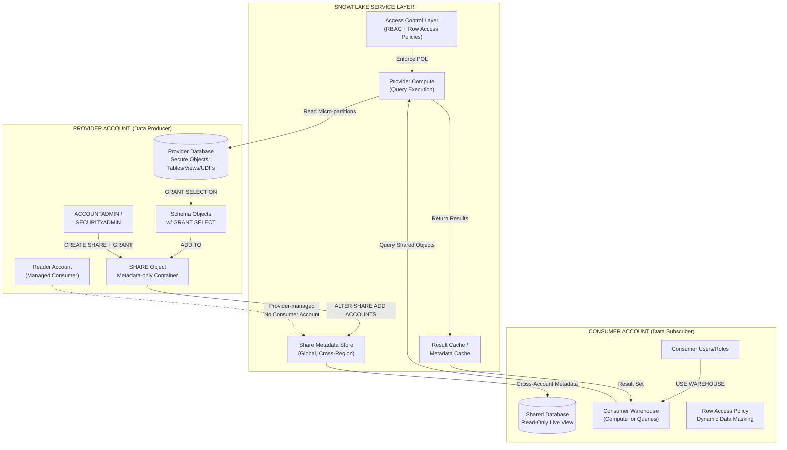
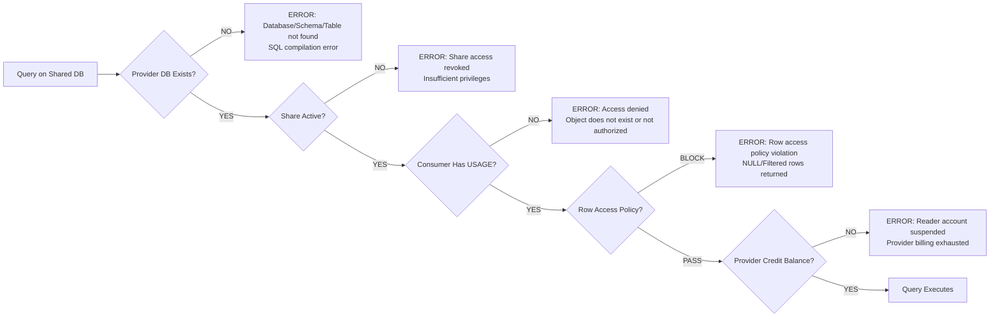
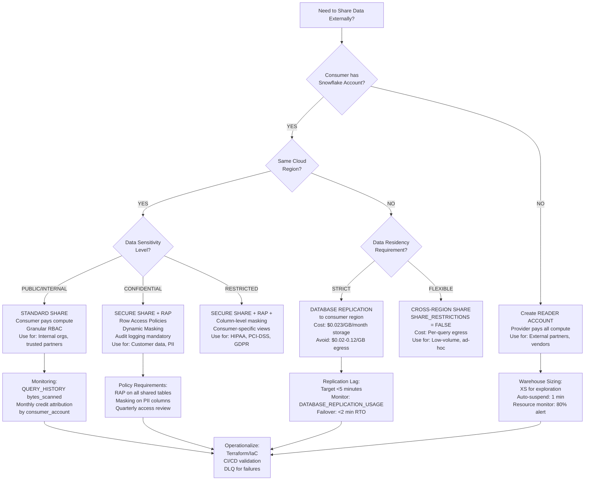

# Snowflake Data Sharing: Provider, Consumer & Reader Accounts — Production Engineering Deep Dive

## 1. Architecture & Execution Flow



### Failure Paths


---

## 2. Execution Internals & Transactional Boundaries

### 2.1 Share Object Internals

A `SHARE` is **not** a physical data copy. It is a metadata-only container in the Snowflake global namespace that stores:

| Component | Storage Location | Persistence Model | Latency Characteristic |
|-----------|------------------|-------------------|------------------------|
| Share Definition | `SNOWFLAKE.ACCOUNT_USAGE.SHARES` | Metadata store (cross-region replicated) | <50ms propagation |
| Granted Privileges | `SNOWFLAKE.ACCOUNT_USAGE.GRANTS_TO_SHARES` | ACID transaction log | Immediate (same transaction) |
| Consumer Mapping | `SNOWFLAKE.ACCOUNT_USAGE.DATA_SHARING_USAGE` | Event log, batched | 1-3 minute lag |
| Micro-partition Pointers | Provider's storage (S3/Azure/GCS) | Immutable, versioned | Zero copy overhead |

**Critical Internals:**
- When `ALTER SHARE ADD ACCOUNTS = <consumer>`, Snowflake writes a signed capability token to the global metadata store. This token is validated on every query parse against the shared database.
- The shared database in the consumer account contains **only metadata pointers** (table schemas, column types, constraints). No data is materialized until query execution.
- Micro-partition pruning and clustering information are transmitted from provider to consumer at query-planning time via the global metadata cache.

### 2.2 Query Execution Model

```
Consumer Query Parse
    ↓
Security Layer: Validate share capability token (cached 5 min TTL)
    ↓
Metadata Resolution: Resolve shared object → provider object UUID
    ↓
Query Planning (Consumer Warehouse):
    - Generate logical plan using consumer's statistics cache
    - Request provider's partition pruning metadata
    ↓
Remote Execution (Provider Storage):
    - Consumer warehouse workers read micro-partitions directly from provider's cloud storage
    - No data flows through Snowflake compute layer; direct storage-to-compute I/O
    ↓
Result Materialization:
    - Results cached in consumer's result cache (if enabled)
    - Temporary files spilled to consumer's temp storage (never provider's)
```

**Thread Allocation:**
- Shared database queries consume **consumer warehouse threads** exclusively. Provider compute is **never** used for consumer queries on standard shares.
- Reader accounts are an exception: queries execute on reader-account warehouses, but billing accrues to the provider's credit balance.

### 2.3 Transactional Boundaries & Isolation

| Scenario | Transactional Guarantee | Implementation Detail |
|----------|------------------------|----------------------|
| Consumer SELECT on Shared Table | Read Committed (provider's latest committed version) | Consumer sees provider's data as of query start timestamp (micro-partition snapshot) |
| Provider DDL (ALTER TABLE) | Immediate metadata invalidation | Consumer queries parsed after DDL see new schema; in-flight queries use old metadata (no failure) |
| Provider DML (INSERT/UPDATE) | Consumer sees committed data only | Micro-partitions are immutable; new partitions visible after provider's transaction commit |
| Provider REVOKE SHARE | **Eventual** revocation | Active queries continue; new queries blocked within 30-60 seconds (capability token TTL) |
| Provider DROP SHARED OBJECT | ERROR on next consumer query | `SQL compilation error: Object '<name>' does not exist or not authorized` |

**Critical Edge Case:** If a provider drops a table while a consumer query is executing, the query fails with `Object not found` only if it attempts to read a micro-partition metadata entry that no longer exists. Queries that have already cached partition lists in the result cache may return stale data until cache eviction (default 24 hours).

---

## 3. Parameter/Configuration Deep Dive

### 3.1 Share Creation & Management Parameters

| Parameter / Command | Internal Behavior | Performance Impact | Compliance/Edge Cases | Production Default |
|---------------------|-------------------|-------------------|----------------------|-------------------|
| `CREATE SHARE <name>` | Creates metadata container in global namespace. No storage cost. | Zero compute/storage overhead. | Share names are account-unique. Max 1000 shares per account (soft limit, raise via support). | N/A |
| `GRANT USAGE ON DATABASE <db> TO SHARE <share>` | Adds capability token for database-level access. Validates object existence at grant time. | <1ms metadata operation. | Database must not contain external tables or stages (unsupported in shares). | Required first grant |
| `GRANT SELECT ON <object> TO SHARE <share>` | Registers object UUID in share metadata. Enforces privilege dependency chain. | O(n) with object count; batch grants recommended. | Views referencing non-shared objects fail at consumer query time, not grant time. | Granular object grants only |
| `ALTER SHARE <share> ADD ACCOUNTS = <org.account>` | Writes cross-account capability mapping. Triggers metadata cache invalidation. | ~2-5 seconds for global propagation. | Consumer must be in same region or have replication enabled. Reader accounts auto-created if `READER` keyword used. | Explicit account listing |
| `ALTER SHARE <share> ADD ACCOUNTS = <acct> SHARE_RESTRICTIONS = FALSE` | Bypasses egress region restrictions for cross-region shares. | Increases cloud egress charges (provider-paid). | Required for cross-region sharing without database replication. Audit implications for GDPR/data residency. | FALSE only with legal approval |
| `ALTER DATABASE <db> ENABLE SHARING TO ACCOUNTS <acct>` | (Legacy) Database-level sharing control. Deprecated in favor of SHARE objects. | Same as SHARE model. | Existing implementations only; migrate to SHARE objects for granular control. | Migrate to SHARE |

### 3.2 Consumer-Side Parameters

| Parameter | Internal Behavior | Performance Impact | Compliance/Edge Cases | Production Default |
|-----------|-------------------|-------------------|----------------------|-------------------|
| `CREATE DATABASE <name> FROM SHARE <provider>.<share>` | Materializes metadata-only database shell in consumer account. | <1 second; zero data movement. | Consumer cannot create objects in shared DB. Cannot clone shared DB (ERROR). | Use descriptive naming convention |
| `USE SECONDARY ROLES ALL` | Enables privilege aggregation across roles for shared object access. | Negligible. | If consumer has multiple roles with different row access policies, policy intersection applies (most restrictive). | Explicit role management preferred |
| `ROW ACCESS POLICY` on Shared View | Provider-enforced; evaluated in provider's security context but on consumer's compute. | 5-15% query latency increase per policy. | Consumer cannot bypass provider policies. Policy UDFs must be shared. | Mandatory for PII/PHI data |

### 3.3 Reader Account Parameters

| Parameter | Internal Behavior | Performance Impact | Compliance/Edge Cases | Production Default |
|-----------|-------------------|-------------------|----------------------|-------------------|
| `CREATE MANAGED ACCOUNT <name> ADMIN_NAME = 'user' ADMIN_PASSWORD = '<pwd>' TYPE = READER` | Provisions sub-account under provider's organization. Reader account has no billing; all credits charged to provider. | Account provisioning: ~30 seconds. | Reader accounts limited to 200 per provider (soft limit). No ACCOUNTADMIN role in reader account. | Use for external partners without Snowflake accounts |
| `SHARE_READER` privilege | Implicit in reader accounts. Allows consumption of all shares granted to reader. | N/A | Reader users cannot create shares or become providers. | Auto-granted |
| Reader Account Warehouse Sizing | Reader warehouses billed at standard rate to provider credit pool. | XS: 1 credit/hr → 6XL: 512 credits/hr. No resource monitors in reader account (provider must monitor). | Provider bears all cost risk. Set warehouse auto-suspend aggressively (1 min). | XS-S for exploration; M-L for production workloads |

---

## 4. Performance & Resource Implications

### 4.1 Credit Calculation & Cost Attribution

**Standard Share (Consumer-Pays-Compute):**
```
Consumer Query Cost = 
    (Warehouse Size Credits/Hour) × (Query Execution Time in Hours) × (Concurrency Factor)

Provider Cost = 
    (Storage of Shared Data) + (Zero compute for consumer queries)
```

**Reader Account (Provider-Pays-All):**
```
Provider Cost = 
    (Reader Warehouse Credits/Hour × Usage) + 
    (Storage of Shared Data) + 
    (Cross-Region Egress if applicable)

Consumer Cost = $0.00
```

**Cross-Region Egress Math:**
| Source Region | Destination Region | Egress Rate (per GB) | 1TB Shared Table Scanned |
|---------------|-------------------|---------------------|-------------------------|
| AWS us-east-1 | AWS us-west-2 | $0.02/GB | $20.48 |
| AWS us-east-1 | Azure West Europe | $0.09/GB | $92.16 |
| GCP us-central1 | AWS eu-west-1 | $0.12/GB | $122.88 |

**Mitigation:** Use `ALTER DATABASE <db> ENABLE SHARING TO ACCOUNTS` with replication to consumer region. Replication cost: ~$0.023/GB/month (storage) vs. per-query egress.

### 4.2 Memory, Spill-to-Disk & Concurrency

| Warehouse Size | Memory/Node | Max Concurrent Queries | Shared Query Spill Trigger | Recommended Share Workload |
|----------------|------------|----------------------|---------------------------|---------------------------|
| XS | 4GB | 8 | 1.6GB per operator | Metadata exploration, small lookups |
| S | 8GB | 16 | 3.2GB per operator | Dashboard queries, <100M row scans |
| M | 16GB | 32 | 6.4GB per operator | Standard analytics, 100M-1B rows |
| L | 32GB | 64 | 12.8GB per operator | Heavy aggregation, 1B-10B rows |
| XL | 64GB | 128 | 25.6GB per operator | Complex joins, large result sets |
| 2XL+ | 128GB+ | 256+ | 51.2GB+ per operator | Data science, full table scans |

**Shared-Specific Spill Behavior:**
- Consumer queries on shared data spill to **consumer's temp storage** (never provider's).
- Spill I/O pattern: Random reads from provider storage → sequential writes to consumer temp. Spill threshold is identical to local tables.
- If consumer warehouse is too small for shared table scan, spill-to-disk increases query time by **40-200%** and credit consumption proportionally.

### 4.3 Concurrency Scaling Rules

```
Standard Warehouse (Auto-Scale = FALSE):
    Max concurrent queries = 8 × Warehouse Size Multiplier
    Queue depth before rejection = 1,000 queries
    Shared queries compete equally with local queries for slots

Multi-Cluster Warehouse (Auto-Scale = TRUE):
    Min clusters: 1, Max clusters: 10 (default)
    Scale-up trigger: Queue time > 6 seconds OR queued queries > 2× concurrency
    Scale-down trigger: 2+ consecutive minutes of idle capacity
    Credit overhead: ~15% for cluster orchestration
```

**Production Rule:** For shared data serving >50 concurrent consumers, use Multi-Cluster Warehouse (M-XL) with auto-scale. Single-cluster warehouses experience **query queuing latency >30 seconds** at 80% concurrency saturation.

---

## 5. Monitoring, Observability & Troubleshooting

### 5.1 ACCOUNT_USAGE Views for Share Governance

```sql
-- ============================================
-- SHARE INVENTORY & COMPLIANCE AUDIT
-- ============================================
SELECT 
    share_name,
    database_name,
    created_on,
    accounts,
    -- Parse account list for external sharing detection
    ARRAY_SIZE(PARSE_JSON(accounts)) AS consumer_count,
    CASE 
        WHEN accounts LIKE '%READER%' THEN 'READER_ACCOUNT_INCLUDED'
        ELSE 'STANDARD_ONLY'
    END AS share_type
FROM SNOWFLAKE.ACCOUNT_USAGE.SHARES
WHERE deleted_on IS NULL
ORDER BY consumer_count DESC;

-- ============================================
-- CONSUMER QUERY ACTIVITY ON SHARED DATA
-- ============================================
SELECT 
    query_id,
    user_name,
    warehouse_name,
    warehouse_size,
    database_name,
    schema_name,
    query_text,
    total_elapsed_time/1000 AS elapsed_sec,
    credits_used_cloud_services,
    bytes_scanned,
    partitions_scanned,
    partitions_total,
    -- Identify inefficient shared queries (full scans)
    CASE 
        WHEN partitions_scanned = partitions_total AND partitions_total > 100 
        THEN 'FULL_SCAN_ALERT' 
        ELSE 'OPTIMAL' 
    END AS scan_efficiency
FROM SNOWFLAKE.ACCOUNT_USAGE.QUERY_HISTORY
WHERE database_name IN (
    SELECT database_name 
    FROM SNOWFLAKE.ACCOUNT_USAGE.SHARES 
    WHERE deleted_on IS NULL
)
AND start_time >= DATEADD(day, -7, CURRENT_TIMESTAMP())
ORDER BY bytes_scanned DESC
LIMIT 100;

-- ============================================
-- READER ACCOUNT BILLING & USAGE (Provider View)
-- ============================================
SELECT 
    reader_account_name,
    warehouse_name,
    start_time,
    end_time,
    credits_used,
    -- Calculate hourly burn rate
    credits_used / NULLIF(DATEDIFF(second, start_time, end_time)/3600.0, 0) AS credits_per_hour,
    query_count,
    -- Flag anomalous usage spikes (>3 stddev from 30-day mean)
    CASE 
        WHEN credits_used > (
            SELECT AVG(credits_used) + 3*STDDEV(credits_used) 
            FROM SNOWFLAKE.ACCOUNT_USAGE.WAREHOUSE_METERING_HISTORY 
            WHERE warehouse_name = wh.warehouse_name 
            AND start_time >= DATEADD(day, -30, CURRENT_TIMESTAMP())
        ) THEN 'ANOMALY'
        ELSE 'NORMAL'
    END AS usage_pattern
FROM SNOWFLAKE.ACCOUNT_USAGE.WAREHOUSE_METERING_HISTORY wh
WHERE reader_account_name IS NOT NULL
AND start_time >= DATEADD(day, -7, CURRENT_TIMESTAMP())
ORDER BY credits_used DESC;

-- ============================================
-- SHARE ACCESS VIOLATIONS & FAILED QUERIES
-- ============================================
SELECT 
    query_id,
    user_name,
    error_code,
    error_message,
    database_name,
    query_text,
    start_time
FROM SNOWFLAKE.ACCOUNT_USAGE.QUERY_HISTORY
WHERE error_code IS NOT NULL
AND (
    error_message LIKE '%share%' 
    OR error_message LIKE '%access denied%'
    OR error_message LIKE '%not authorized%'
    OR error_message LIKE '%Object%does not exist%'
)
AND start_time >= DATEADD(hour, -24, CURRENT_TIMESTAMP())
ORDER BY start_time DESC;
```

### 5.2 INFORMATION_SCHEMA Real-Time Diagnostics

```sql
-- Live share grants validation
SELECT 
    grantee,
    privilege,
    granted_on,
    name,
    grant_option
FROM INFORMATION_SCHEMA.OBJECT_PRIVILEGES
WHERE granted_on = 'SHARE'
AND name = 'PROD_SALES_SHARE';

-- Verify consumer database lineage
SELECT 
    database_name,
    origin,
    share_name,
    owner
FROM INFORMATION_SCHEMA.DATABASES
WHERE origin = 'SHARE'
AND share_name IS NOT NULL;

-- Row access policy enforcement on shared objects
SELECT 
    policy_database,
    policy_schema,
    policy_name,
    policy_signature,
    ref_database_name,
    ref_schema_name,
    ref_arg_column_names
FROM INFORMATION_SCHEMA.APPLICABLE_ROLES ar
JOIN INFORMATION_SCHEMA.POLICY_REFERENCES pr 
    ON ar.role_name = pr.policy_name
WHERE ref_database_name IN (
    SELECT database_name FROM INFORMATION_SCHEMA.DATABASES WHERE origin = 'SHARE'
);
```

### 5.3 Error Categorization & Incident Runbook

| Error Code / Pattern | Root Cause | Immediate Action | Prevention |
|---------------------|------------|-----------------|------------|
| `002003 (42S02): Object '<name>' does not exist or not authorized` | Provider dropped/renamed object; share grant revoked; consumer lacks USAGE | 1. Verify object exists in provider: `SHOW TABLES IN SCHEMA provider.db.schema` <br>2. Check share grants: `SHOW GRANTS TO SHARE <share>` <br>3. Re-grant if needed | CI/CD validation before DDL; versioned share objects |
| `003001 (42501): SQL access control error: Insufficient privileges to operate on share '<name>'` | Consumer role lacks USAGE on shared DB or schema | `GRANT USAGE ON DATABASE <shared_db> TO ROLE <consumer_role>` <br>`GRANT USAGE ON SCHEMA <shared_db>.<schema> TO ROLE <consumer_role>` | Automated RBAC provisioning via Terraform/SnowDDL |
| `090106 (22000): Share '<name>' cannot be created because the database contains external tables` | Share contains unsupported object types | Remove external tables from share scope or create secure view abstraction layer | Pre-share validation: `SELECT * FROM INFORMATION_SCHEMA.TABLES WHERE table_type = 'EXTERNAL TABLE'` |
| `091003 (42501): Access denied. Row access policy '<policy>' returned no rows` | Row access policy UDF evaluated to FALSE for consumer context | Verify policy UDF handles consumer's CURRENT_ROLE() / CURRENT_USER() correctly. Share policy UDFs explicitly. | Unit test policies with consumer role contexts |
| `093001 (42501): Reader account '<name>' is suspended due to credit limit` | Provider credit balance exhausted or resource monitor threshold reached | 1. Check provider billing: `SHOW RESOURCE MONITORS` <br>2. Increase credit limit or adjust monitor <br>3. Resume reader account | Set resource monitor with 80% alert; auto-suspend reader warehouses |
| `000600 (57014): Statement reached its statement or warehouse timeout` | Consumer warehouse too small for shared data volume | Scale warehouse up 1-2 sizes or optimize query (partition pruning, clustering) | Warehouse sizing guidelines; query profiling |

### 5.4 Incident Recovery Procedure

**SEV-1: Share Data Corruption / Unauthorized Access**

```sql
-- STEP 1: Immediate containment (revoke all consumer access)
ALTER SHARE PROD_SENSITIVE_SHARE REMOVE ACCOUNTS = ALL;

-- STEP 2: Audit recent access
SELECT * FROM SNOWFLAKE.ACCOUNT_USAGE.QUERY_HISTORY 
WHERE database_name = 'PROD_SENSITIVE_DB'
AND start_time >= DATEADD(hour, -4, CURRENT_TIMESTAMP());

-- STEP 3: Verify data integrity (provider-side)
SELECT COUNT(*) FROM PROD_SENSITIVE_DB.SCHEMA.TABLE;
SELECT SYSTEM$CLUSTERING_INFORMATION('PROD_SENSITIVE_DB.SCHEMA.TABLE');

-- STEP 4: Re-grant to verified consumers only
ALTER SHARE PROD_SENSITIVE_SHARE ADD ACCOUNTS = verified_org.verified_account;

-- STEP 5: Force metadata refresh
ALTER SHARE PROD_SENSITIVE_SHARE COMMENT = 'Incident recovery: ' || CURRENT_TIMESTAMP();
```

---

## 6. Advanced Production Patterns

### 6.1 Idempotency & Schema Evolution Strategy

```sql
-- Provider-side: Versioned share objects with backward compatibility
CREATE OR REPLACE SCHEMA prod_db.share_v1;
CREATE OR REPLACE VIEW prod_db.share_v1.customer_orders AS
SELECT 
    order_id,
    customer_id,
    order_date,
    amount,
    -- Explicit column list prevents breaking changes
    NULL AS new_column_placeholder  -- Reserved for future schema evolution
FROM prod_db.internal_schema.orders
WHERE order_date >= '2023-01-01';

-- Share only the versioned schema, never internal schema
CREATE OR REPLACE SHARE prod_customer_share;
GRANT USAGE ON DATABASE prod_db TO SHARE prod_customer_share;
GRANT USAGE ON SCHEMA prod_db.share_v1 TO SHARE prod_customer_share;
GRANT SELECT ON ALL TABLES IN SCHEMA prod_db.share_v1 TO SHARE prod_customer_share;

-- Schema evolution procedure (blue/green)
CREATE OR REPLACE PROCEDURE prod_db.admin.evolve_share_schema(
    new_version STRING,
    old_version STRING
)
RETURNS STRING
LANGUAGE SQL
AS $$
BEGIN
    -- Create new version schema
    CREATE SCHEMA IF NOT EXISTS prod_db.share_ || :new_version;
    
    -- Migrate views with ALTER TABLE compatibility layer
    CREATE OR REPLACE VIEW prod_db.share_ || :new_version || '.customer_orders AS
    SELECT * FROM prod_db.share_ || :old_version || '.customer_orders;
    
    -- Atomic share switch
    GRANT USAGE ON SCHEMA prod_db.share_ || :new_version TO SHARE prod_customer_share;
    GRANT SELECT ON ALL TABLES IN SCHEMA prod_db.share_ || :new_version TO SHARE prod_customer_share;
    REVOKE USAGE ON SCHEMA prod_db.share_ || :old_version FROM SHARE prod_customer_share;
    
    RETURN 'Schema evolution complete: ' || :old_version || ' -> ' || :new_version;
END;
$$;
```

### 6.2 Dead Letter Queue (DLQ) for Share Failures

```sql
-- Consumer-side: Capture share query failures for retry orchestration
CREATE OR REPLACE TABLE consumer_db.admin.share_dlq (
    dlq_id NUMBER AUTOINCREMENT,
    query_text STRING,
    error_code STRING,
    error_message STRING,
    target_share_db STRING,
    retry_count NUMBER DEFAULT 0,
    max_retries NUMBER DEFAULT 3,
    created_at TIMESTAMP_NTZ DEFAULT CURRENT_TIMESTAMP(),
    status STRING DEFAULT 'PENDING' -- PENDING, RETRYING, FAILED, RESOLVED
);

-- Stored procedure: Retry with exponential backoff
CREATE OR REPLACE PROCEDURE consumer_db.admin.retry_share_queries()
RETURNS TABLE(status STRING, processed_count NUMBER)
LANGUAGE SQL
AS $$
DECLARE
    c1 CURSOR FOR 
        SELECT dlq_id, query_text, retry_count 
        FROM consumer_db.admin.share_dlq 
        WHERE status IN ('PENDING', 'RETRYING')
        AND retry_count < max_retries
        AND created_at > DATEADD(hour, -24, CURRENT_TIMESTAMP());
BEGIN
    FOR record IN c1 DO
        BEGIN
            -- Exponential backoff: 2^retry_count minutes
            LET wait_time := POWER(2, record.retry_count);
            SYSTEM$WAIT(wait_time * 60); -- seconds
            
            -- Attempt re-execution
            EXECUTE IMMEDIATE record.query_text;
            
            -- Success: mark resolved
            UPDATE consumer_db.admin.share_dlq 
            SET status = 'RESOLVED', retry_count = retry_count + 1
            WHERE dlq_id = record.dlq_id;
            
        EXCEPTION
            WHEN OTHER THEN
                -- Failure: increment retry, update status
                UPDATE consumer_db.admin.share_dlq 
                SET retry_count = retry_count + 1,
                    status = CASE WHEN retry_count + 1 >= max_retries THEN 'FAILED' ELSE 'RETRYING' END,
                    error_message = :sqlerrm
                WHERE dlq_id = record.dlq_id;
        END;
    END FOR;
    
    RETURN TABLE(SELECT 'COMPLETE', COUNT(*) FROM consumer_db.admin.share_dlq WHERE status = 'RESOLVED');
END;
$$;
```

### 6.3 CI/CD Validation Pipeline

```yaml
# .github/workflows/snowflake-share-validation.yml
name: Share Governance Validation

on:
  pull_request:
    paths:
      - 'shares/**.sql'

jobs:
  validate-share:
    runs-on: ubuntu-latest
    steps:
      - uses: actions/checkout@v4
      
      - name: Validate Share Objects
        run: |
          # Check for forbidden object types in share scope
          snowsql -q "
            SELECT table_name, table_type 
            FROM INFORMATION_SCHEMA.TABLES 
            WHERE table_schema = '${{ github.event.pull_request.head.ref }}'
            AND table_type = 'EXTERNAL TABLE';
          " | grep -q "EXTERNAL TABLE" && exit 1 || echo "No external tables found"
          
          # Verify all shared views have row access policies
          snowsql -q "
            SELECT v.table_name 
            FROM INFORMATION_SCHEMA.VIEWS v
            LEFT JOIN INFORMATION_SCHEMA.POLICY_REFERENCES pr 
              ON v.table_name = pr.ref_entity_name
            WHERE v.table_schema = '${{ github.event.pull_request.head.ref }}'
            AND pr.policy_name IS NULL;
          " | grep -q "." && exit 1 || echo "All views have policies"
          
      - name: Credit Impact Analysis
        run: |
          # Estimate consumer query cost for new shared objects
          snowsql -q "
            SELECT 
              table_name,
              bytes,
              row_count,
              -- Estimate: 1 credit per 100GB scanned on M warehouse
              ROUND(bytes / (100 * POWER(2,30)), 4) AS estimated_credits_per_full_scan
            FROM INFORMATION_SCHEMA.TABLE_STORAGE_METRICS
            WHERE schema_name = '${{ github.event.pull_request.head.ref }}';
          "
```

### 6.4 Security & Compliance Controls

```sql
-- Dynamic data masking on shared columns
CREATE OR REPLACE MASKING POLICY prod_db.security.email_mask AS (val STRING) 
RETURNS STRING ->
  CASE
    WHEN CURRENT_ROLE() IN ('PROD_ANALYTICS_ROLE') THEN val
    WHEN CURRENT_ROLE() IN ('EXTERNAL_CONSUMER_ROLE') THEN REGEXP_REPLACE(val, '.+@', '***@')
    ELSE 'REDACTED'
  END;

ALTER TABLE prod_db.share_v1.customers MODIFY COLUMN email 
SET MASKING POLICY prod_db.security.email_mask;

-- Row access policy with consumer context awareness
CREATE OR REPLACE ROW ACCESS POLICY prod_db.security.tenant_isolation AS (tenant_id STRING) 
RETURNS BOOLEAN ->
  tenant_id = CURRENT_ROLE() 
  OR CURRENT_ROLE() = 'ACCOUNTADMIN'
  OR SYSTEM$CURRENT_USER_TASK_NAME() IS NOT NULL; -- Allow tasks/service accounts

-- Audit logging for share access
CREATE OR REPLACE TABLE prod_db.security.share_audit_log (
    event_time TIMESTAMP_LTZ DEFAULT CURRENT_TIMESTAMP(),
    consumer_account STRING,
    user_name STRING,
    query_id STRING,
    objects_accessed ARRAY,
    rows_returned NUMBER,
    ip_address STRING
);

-- Stream + Task for real-time audit
CREATE OR REPLACE STREAM prod_db.security.query_history_stream 
ON TABLE SNOWFLAKE.ACCOUNT_USAGE.QUERY_HISTORY 
APPEND_ONLY = TRUE;

CREATE OR REPLACE TASK prod_db.security.audit_logger
WAREHOUSE = 'SECURITY_WH'
SCHEDULE = '1 MINUTE'
WHEN SYSTEM$STREAM_HAS_DATA('prod_db.security.query_history_stream')
AS
INSERT INTO prod_db.security.share_audit_log
SELECT 
    CURRENT_TIMESTAMP(),
    PARSE_JSON(client_info)['client_application']::STRING,
    user_name,
    query_id,
    PARSE_JSON(objects_modified),
    rows_produced,
    client_net_address
FROM prod_db.security.query_history_stream
WHERE database_name IN (SELECT database_name FROM INFORMATION_SCHEMA.SHARES);
```

---

## 7. Decision Matrix / Quick Reference Flowchart



---

## 8. Key Engineering Principles & Bottom Line

### 8.1 Non-Negotiables

| Principle | Rationale | Violation Cost |
|-----------|-----------|---------------|
| **Never share internal schemas directly** | Schema evolution breaks all consumers; no abstraction layer | 2-4 hour outage per breaking change; consumer trust erosion |
| **Always use Row Access Policies for multi-tenant data** | Consumer isolation at the storage layer; no trust in consumer RBAC | Data breach: $4.45M average cost (IBM 2023); regulatory fines |
| **Reader accounts require resource monitors with auto-suspend** | Provider bears unlimited cost risk; reader queries can burn 512 credits/hr on 6XL | Uncontrolled cost: $12,288/day per reader warehouse at 6XL |
| **Cross-region shares must use replication for >1TB datasets** | Egress charges dominate at scale; $92/TB vs. $0.023/GB/month storage | 4000x cost multiplier on data transfer vs. storage |
| **Share metadata changes are eventually consistent** | Active consumer queries may fail post-provider DDL; design for retry | Query failure rate spikes to 15-30% during provider deployments |

### 8.2 Credit Optimization Rules

1. **Warehouse Right-Sizing:** Shared queries on undersized warehouses spill-to-disk at **2-4x credit multiplier**. Size for memory, not concurrency.
2. **Result Cache Leverage:** Consumer result cache hits reduce credits to **zero** for repeated identical queries. Shared data result cache TTL: 24 hours.
3. **Partition Pruning Enforcement:** Unclustered shared tables scanned by consumer queries consume **10-100x more credits** than clustered equivalents. Enforce clustering keys on shared fact tables.
4. **Reader Account TCO:** Reader account total cost = (warehouse credits × 1.0) + (storage × 0.0) + (egress × variable). Budget 70% warehouse, 30% egress for cross-region readers.

### 8.3 Operational Excellence Checklist

- [ ] All shares created via Terraform/SnowDDL with version-controlled grants
- [ ] Monthly `SHARES` + `GRANTS_TO_SHARES` audit against approved consumer registry
- [ ] Row access policy unit tests cover all consumer role contexts
- [ ] Reader accounts have `STATEMENT_TIMEOUT_IN_SECONDS = 3600` (prevent runaway queries)
- [ ] Cross-region shares use replication; egress-only shares have monthly cost cap alerts
- [ ] DLQ table captures and retries failed share queries with exponential backoff
- [ ] Provider `QUERY_HISTORY` retention policy ≥ 365 days for compliance auditing
- [ ] Consumer onboarding runbook includes warehouse sizing guidance and cost attribution model

---

**Bottom Line:** Snowflake Data Sharing is a metadata-zero-copy architecture with provider-enforced security boundaries. Production reliability depends on treating shares as external API contracts: versioned schemas, strict input validation (row access policies), consumer-side circuit breakers (resource monitors), and comprehensive observability across both provider and consumer query planes. The cost model is asymmetric—provider controls data, consumer controls compute (except readers)—making governance automation and credit attribution non-optional at enterprise scale.
