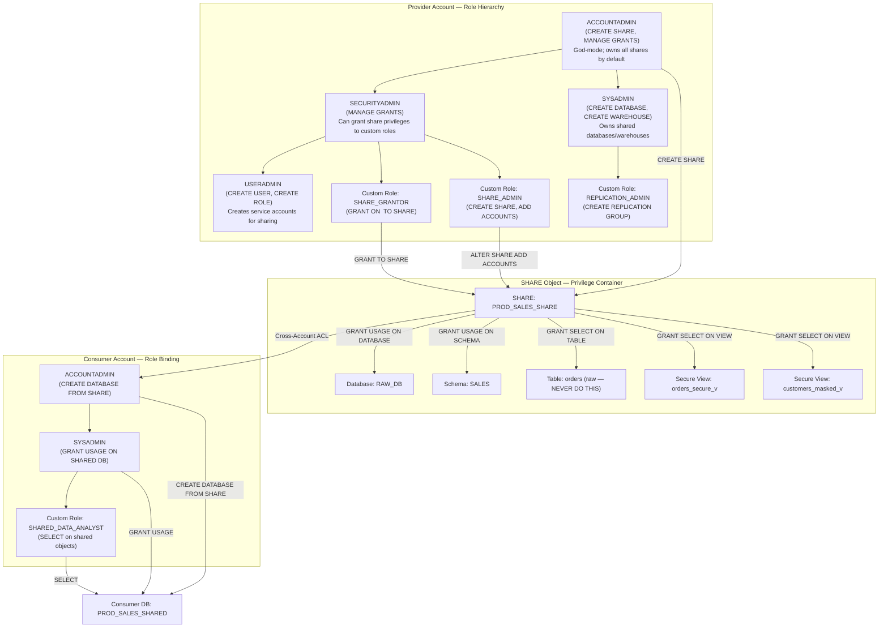
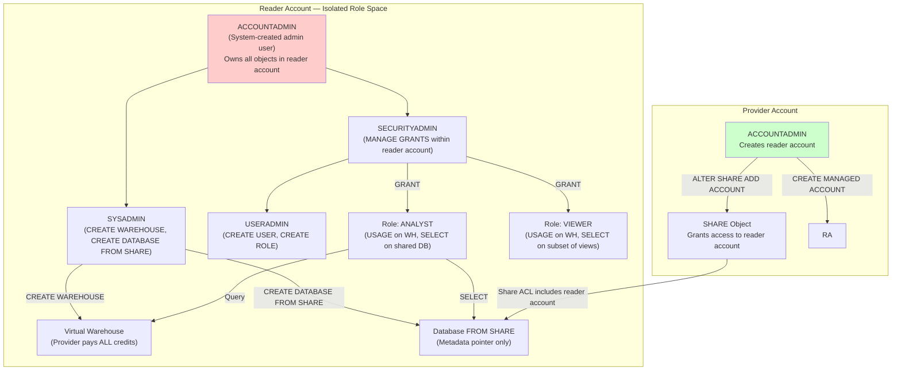

# Snowflake Data Sharing: Account Roles — Production-Grade Technical Deep Dive

## Domain 5.0 Data Collaboration / 5.2 Snowflake Data Sharing Capabilities / Account Roles


## 1. ROLE ARCHITECTURE IN DATA SHARING CONTEXT

### 1.1 Mermaid Diagram: Role Hierarchy & Privilege Flow in Provider Account



### 1.2 Mermaid Diagram: Reader Account Role Isolation




## 2. SYSTEM ROLE PRIVILEGES FOR DATA SHARING

### 2.1 Provider-Side System Roles & Share Operations

| System Role | Share-Related Privileges | Inherits From | Production Usage Pattern |
|------------|------------------------|---------------|------------------------|
| **ACCOUNTADMIN** | `CREATE SHARE`, `MANAGE GRANTS`, `CREATE REPLICATION GROUP`, `CREATE FAILOVER GROUP`, `CREATE MANAGED ACCOUNT` | None (top of hierarchy)  | Creates shares, reader accounts, replication groups. **Never** use for day-to-day grant operations — delegate to custom roles. |
| **SECURITYADMIN** | `MANAGE GRANTS` (can grant share privileges to other roles) | Inherits USERADMIN  | Delegates share administration to custom roles via `GRANT CREATE SHARE ON ACCOUNT TO ROLE share_admin`. |
| **USERADMIN** | `CREATE USER`, `CREATE ROLE` | None  | Creates service users/roles for automated share management pipelines. |
| **SYSADMIN** | `CREATE DATABASE`, `CREATE WAREHOUSE`, `CREATE SCHEMA`, `CREATE TABLE`, `CREATE VIEW` | None  | Owns the databases/schemas being shared. All shared objects should be created under SYSADMIN or custom descendants. |
| **PUBLIC** | None by default | None  | **Never** grant share privileges to PUBLIC. All users get PUBLIC by default — would expose shares to entire organization. |

### 2.2 Consumer-Side System Roles & Share Consumption

| System Role | Share Consumption Privileges | Production Usage Pattern |
|------------|----------------------------|------------------------|
| **ACCOUNTADMIN** | `CREATE DATABASE FROM SHARE`, `IMPORT SHARE`, `MANAGE GRANTS` | Imports shares, creates consumer databases. Can grant imported privileges to other roles. |
| **SYSADMIN** | Can be granted `USAGE` on shared database, `CREATE SCHEMA` (but not on shared DB — read-only) | Manages warehouses for querying shared data. Cannot create objects in shared database. |
| **SECURITYADMIN** | Can grant `USAGE`/`SELECT` on shared database objects to custom roles | Delegates shared data access to team roles. |
| **USERADMIN** | Creates users who will query shared data | Service account creation for BI tools. |

### 2.3 Reader Account System Roles — Special Constraints

Reader accounts inherit the standard system role hierarchy but with **critical restrictions** :

| System Role | Available in Reader Account | Restrictions |
|------------|---------------------------|-------------|
| **ACCOUNTADMIN** | ✅ Yes | Cannot create shares, stages, pipes, masking policies, row access policies, streams, or tasks. Cannot perform DML. |
| **SECURITYADMIN** | ✅ Yes | Can only manage grants within the reader account; cannot grant cross-account privileges. |
| **SYSADMIN** | ✅ Yes | Can create warehouses (provider pays), databases from shares, schemas (in non-shared DBs). |
| **USERADMIN** | ✅ Yes | Can create users/roles within reader account only. |
| **PUBLIC** | ✅ Yes | Same as full account — default role for all users. |

**Critical Reader Account Role Limitation:** Reader account roles **cannot** create `SHARE`, `STAGE`, `PIPE`, `MASKING POLICY`, `ROW ACCESS POLICY`, `STREAM`, `TASK`, `SERVICE`, `STREAMLIT`, or `IMAGE REPOSITORY` objects . The `ACCOUNTADMIN` role in a reader account is fundamentally a "query administrator," not a platform administrator.


## 3. CUSTOM ROLE DESIGN PATTERNS FOR DATA SHARING

### 3.1 Provider-Side Custom Roles

**Pattern A: Segregated Share Administration (Least Privilege)**

```sql
-- Step 1: SECURITYADMIN creates custom share administration roles
USE ROLE SECURITYADMIN;

CREATE ROLE IF NOT EXISTS share_admin;
CREATE ROLE IF NOT EXISTS share_grantor;
CREATE ROLE IF NOT EXISTS share_consumer_manager;

-- Step 2: Grant minimum privileges for share creation
GRANT CREATE SHARE ON ACCOUNT TO ROLE share_admin;
GRANT ADD ACCOUNT ON ACCOUNT TO ROLE share_admin;  -- Required for ALTER SHARE ADD ACCOUNTS

-- Step 3: Grant privileges for adding objects to shares
-- Note: share_grantor needs USAGE on the database/schema AND SELECT on the objects
GRANT USAGE ON DATABASE raw_db TO ROLE share_grantor;
GRANT USAGE ON SCHEMA raw_db.sales TO ROLE share_grantor;
GRANT SELECT ON ALL TABLES IN SCHEMA raw_db.sales TO ROLE share_grantor;
GRANT SELECT ON FUTURE TABLES IN SCHEMA raw_db.sales TO ROLE share_grantor;

-- Step 4: Grant privileges for managing consumer accounts
GRANT CREATE MANAGED ACCOUNT ON ACCOUNT TO ROLE share_consumer_manager;

-- Step 5: Build role hierarchy under SYSADMIN
GRANT ROLE share_admin TO ROLE SYSADMIN;
GRANT ROLE share_grantor TO ROLE SYSADMIN;
GRANT ROLE share_consumer_manager TO ROLE SYSADMIN;

-- Step 6: Assign roles to human service accounts
GRANT ROLE share_admin TO USER data_sharing_admin;
GRANT ROLE share_grantor TO USER data_sharing_engineer;
```

**Pattern B: Database Role Delegation (Share-Specific)**

```sql
-- Create database roles within the shared database for granular control
USE ROLE SYSADMIN;

-- Database roles are scoped to a single database and can be granted to shares
CREATE DATABASE ROLE raw_db.sales_share_role;
CREATE DATABASE ROLE raw_db.finance_share_role;

-- Grant privileges to database roles
GRANT USAGE ON SCHEMA raw_db.sales TO DATABASE ROLE raw_db.sales_share_role;
GRANT SELECT ON TABLE raw_db.sales.orders TO DATABASE ROLE raw_db.sales_share_role;
GRANT SELECT ON VIEW raw_db.sales.orders_secure_v TO DATABASE ROLE raw_db.sales_share_role;

-- Grant database role to share (Snowflake handles cross-account propagation)
GRANT DATABASE ROLE raw_db.sales_share_role TO SHARE prod_sales_share;

-- Critical constraint: If a database role is granted to a share, 
-- no OTHER database roles can be granted to that same share 
-- This is a hard Snowflake limitation — plan share granularity accordingly.
```

### 3.2 Consumer-Side Custom Roles

**Pattern A: Shared Data Access Tiering**

```sql
-- Consumer ACCOUNTADMIN imports share and creates database
USE ROLE ACCOUNTADMIN;

CREATE DATABASE prod_sales_shared FROM SHARE provider_org.prod_sales_share;

-- SECURITYADMIN creates access tiers
USE ROLE SECURITYADMIN;

CREATE ROLE shared_data_analyst;
CREATE ROLE shared_data_viewer;
CREATE ROLE shared_data_admin;  -- Can grant access further

-- Grant database-level usage
GRANT USAGE ON DATABASE prod_sales_shared TO ROLE shared_data_analyst;
GRANT USAGE ON DATABASE prod_sales_shared TO ROLE shared_data_viewer;
GRANT USAGE ON DATABASE prod_sales_shared TO ROLE shared_data_admin;

-- Grant schema-level usage
GRANT USAGE ON SCHEMA prod_sales_shared.public TO ROLE shared_data_analyst;
GRANT USAGE ON SCHEMA prod_sales_shared.public TO ROLE shared_data_viewer;
GRANT USAGE ON SCHEMA prod_sales_shared.public TO ROLE shared_data_admin;

-- Granular object grants
GRANT SELECT ON ALL TABLES IN SCHEMA prod_sales_shared.public TO ROLE shared_data_analyst;
GRANT SELECT ON ALL VIEWS IN SCHEMA prod_sales_shared.public TO ROLE shared_data_viewer;

-- Admin role can delegate
GRANT MANAGE GRANTS ON SCHEMA prod_sales_shared.public TO ROLE shared_data_admin;

-- Role hierarchy
GRANT ROLE shared_data_viewer TO ROLE shared_data_analyst;
GRANT ROLE shared_data_analyst TO ROLE shared_data_admin;
GRANT ROLE shared_data_admin TO ROLE SYSADMIN;
```

### 3.3 Reader Account Custom Roles

```sql
-- Reader account ACCOUNTADMIN configures the account
USE ROLE ACCOUNTADMIN;

-- Create custom roles for different consumer personas
CREATE ROLE sales_analyst;
CREATE ROLE finance_controller;
CREATE ROLE executive_viewer;

-- Create warehouse (provider pays for ALL compute)
CREATE WAREHOUSE shared_query_wh 
    WITH WAREHOUSE_SIZE = SMALL 
    AUTO_SUSPEND = 300 
    AUTO_RESUME = TRUE;

-- SECURITYADMIN grants warehouse usage
USE ROLE SECURITYADMIN;

GRANT USAGE ON WAREHOUSE shared_query_wh TO ROLE sales_analyst;
GRANT USAGE ON WAREHOUSE shared_query_wh TO ROLE finance_controller;
GRANT USAGE ON WAREHOUSE shared_query_wh TO ROLE executive_viewer;

-- Grant shared database access (database already exists from share)
GRANT USAGE ON DATABASE shared_prod_db TO ROLE sales_analyst;
GRANT USAGE ON SCHEMA shared_prod_db.sales TO ROLE sales_analyst;
GRANT SELECT ON ALL TABLES IN SCHEMA shared_prod_db.sales TO ROLE sales_analyst;

-- Executive gets only aggregated views
GRANT USAGE ON SCHEMA shared_prod_db.executive TO ROLE executive_viewer;
GRANT SELECT ON VIEW shared_prod_db.executive.kpi_dashboard_v TO ROLE executive_viewer;

-- Resource monitor is MANDATORY for reader accounts
USE ROLE ACCOUNTADMIN;
CREATE RESOURCE MONITOR reader_account_rm 
    WITH CREDIT_QUOTA = 5000  -- Hard monthly cap
    FREQUENCY = MONTHLY
    START_TIMESTAMP = IMMEDIATELY
    TRIGGERS 
        ON 75 PERCENT DO NOTIFY
        ON 90 PERCENT DO SUSPEND
        ON 100 PERCENT DO SUSPEND_IMMEDIATE;

ALTER WAREHOUSE shared_query_wh SET RESOURCE_MONITOR = reader_account_rm;
```


## 4. PRIVILEGE REQUIREMENTS MATRIX

### 4.1 Provider-Side SQL Actions & Minimum Privileges

| SQL Action | Minimum Role/Privilege | Can Be Delegated? | Production Notes |
|-----------|------------------------|------------------|----------------|
| `CREATE SHARE <name>` | `CREATE SHARE` on ACCOUNT | Yes — grant to custom role  | Only ACCOUNTADMIN has this by default. Grant to custom role for CI/CD pipelines. |
| `GRANT USAGE ON DATABASE <db> TO SHARE <share>` | `OWNERSHIP` on database OR `MANAGE GRANTS` | No — must own object or have MANAGE GRANTS | Database owner (typically SYSADMIN) must execute or delegate via MANAGE GRANTS. |
| `GRANT USAGE ON SCHEMA <sch> TO SHARE <share>` | `OWNERSHIP` on schema OR `MANAGE GRANTS` | No | Schema owner must execute. |
| `GRANT SELECT ON TABLE <tbl> TO SHARE <share>` | `OWNERSHIP` on table OR `MANAGE GRANTS` | No | **Never grant raw tables.** Always grant secure views. |
| `GRANT SELECT ON VIEW <view> TO SHARE <share>` | `OWNERSHIP` on view OR `MANAGE GRANTS` | No | Secure views only. Non-secure views cannot be added to shares. |
| `ALTER SHARE <share> ADD ACCOUNTS = (<locator>)` | `OWNERSHIP` on share | No | Share creator (role) owns the share. Only owner can modify ACL. |
| `ALTER SHARE <share> REMOVE ACCOUNTS = (<locator>)` | `OWNERSHIP` on share | No | Instant revocation — all consumer queries fail immediately. |
| `DROP SHARE <share>` | `OWNERSHIP` on share | No | **Destructive.** All consumer databases from this share become invalid. |
| `CREATE REPLICATION GROUP <rg>` | `CREATE REPLICATION GROUP` on ACCOUNT | Yes  | Business Critical edition required. |
| `CREATE MANAGED ACCOUNT <acct>` | `CREATE MANAGED ACCOUNT` on ACCOUNT | Yes  | Creates reader account. Provider assumes all credit liability. |
| `GRANT DATABASE ROLE <db_role> TO SHARE <share>` | `OWNERSHIP` on database role | No | Database role must be in same database as shared objects . |

### 4.2 Consumer-Side SQL Actions & Minimum Privileges

| SQL Action | Minimum Role/Privilege | Can Be Delegated? | Production Notes |
|-----------|------------------------|------------------|----------------|
| `SHOW SHARES` | `IMPORT SHARE` on ACCOUNT | Yes — granted to all roles by default in consumer account | Consumers see inbound shares automatically. |
| `CREATE DATABASE <db> FROM SHARE <share>` | `CREATE DATABASE` on ACCOUNT | Yes — typically granted to SYSADMIN/custom roles | ACCOUNTADMIN usually executes, but can delegate. |
| `GRANT IMPORTED PRIVILEGES ON DATABASE <db>` | `MANAGE GRANTS` on ACCOUNT | Yes — SECURITYADMIN has this by default | Required to let other roles access shared database objects. |
| `GRANT USAGE ON DATABASE <db> TO ROLE <role>` | `MANAGE GRANTS` or `OWNERSHIP` on database | Yes | Standard RBAC — same as local databases. |
| `SELECT FROM <shared_db>.<schema>.<table>` | `USAGE` on DB + schema, `SELECT` on table | Yes | Consumer pays compute credits for query execution. |
| `CREATE VIEW <local_db>.<view> AS SELECT FROM <shared_db>...` | `CREATE VIEW` on local schema, `SELECT` on shared object | Yes | Common pattern — create local abstractions over shared data. |


## 5. ROLE OWNERSHIP & SHARE LIFECYCLE GOVERNANCE

### 5.1 Share Ownership Transfer

```sql
-- Transfer share ownership from one role to another
-- Required when re-organizing teams or offboarding personnel

-- Step 1: Current owner (old role) grants ownership to new role
USE ROLE old_share_admin;
GRANT OWNERSHIP ON SHARE prod_sales_share TO ROLE new_share_admin;

-- Step 2: Verify transfer
USE ROLE new_share_admin;
SHOW SHARES LIKE 'PROD_SALES_SHARE';
-- Check: "owner" column should show NEW_SHARE_ADMIN

-- Step 3: Update consumer-facing documentation with new contact
```

### 5.2 Role-Based Share Deprecation Workflow

```sql
-- Controlled deprecation without breaking consumer queries

-- Phase 1: Create deprecation role with limited access
USE ROLE SECURITYADMIN;
CREATE ROLE share_deprecation;
GRANT USAGE ON DATABASE raw_db TO ROLE share_deprecation;
GRANT SELECT ON VIEW raw_db.public.orders_legacy_v TO ROLE share_deprecation;

-- Phase 2: Create new share with updated objects
USE ROLE share_admin;
CREATE SHARE prod_sales_share_v2;
GRANT USAGE ON DATABASE raw_db TO SHARE prod_sales_share_v2;
GRANT USAGE ON SCHEMA raw_db.public TO SHARE prod_sales_share_v2;
GRANT SELECT ON VIEW raw_db.public.orders_v2 TO SHARE prod_sales_share_v2;
ALTER SHARE prod_sales_share_v2 ADD ACCOUNTS = ('CONSUMER1', 'CONSUMER2');

-- Phase 3: Notify consumers (30-day SLA)
-- Consumers create new database from v2 share
-- Consumer: CREATE DATABASE prod_sales_v2 FROM SHARE provider.prod_sales_share_v2;

-- Phase 4: After migration window, revoke old share
USE ROLE share_admin;
ALTER SHARE prod_sales_share REMOVE ACCOUNTS = ('CONSUMER1', 'CONSUMER2');
-- Wait 7 days for stragglers

-- Phase 5: Drop old share
USE ROLE share_admin;
DROP SHARE prod_sales_share;
```


## 6. MONITORING & AUDITING ROLE ACTIVITY ON SHARES

### 6.1 Audit Queries for Share Privilege Changes

```sql
-- Query 1: Track all share creation events by role
SELECT 
    QUERY_ID,
    USER_NAME,
    ROLE_NAME,
    QUERY_TEXT,
    START_TIME,
    EXECUTION_STATUS
FROM SNOWFLAKE.ACCOUNT_USAGE.QUERY_HISTORY
WHERE QUERY_TEXT ILIKE '%CREATE SHARE%'
   OR QUERY_TEXT ILIKE '%DROP SHARE%'
   OR QUERY_TEXT ILIKE '%ALTER SHARE%'
    AND START_TIME >= DATEADD(day, -30, CURRENT_TIMESTAMP())
ORDER BY START_TIME DESC;

-- Query 2: Identify who granted objects to shares
SELECT 
    QUERY_ID,
    USER_NAME,
    ROLE_NAME,
    QUERY_TEXT,
    START_TIME
FROM SNOWFLAKE.ACCOUNT_USAGE.QUERY_HISTORY
WHERE QUERY_TEXT ILIKE '%GRANT%TO SHARE%'
    AND START_TIME >= DATEADD(day, -30, CURRENT_TIMESTAMP())
ORDER BY START_TIME DESC;

-- Query 3: Track role changes that affect share access
SELECT 
    QUERY_ID,
    USER_NAME,
    ROLE_NAME,
    QUERY_TEXT,
    START_TIME
FROM SNOWFLAKE.ACCOUNT_USAGE.QUERY_HISTORY
WHERE QUERY_TEXT ILIKE '%GRANT ROLE%'
   OR QUERY_TEXT ILIKE '%REVOKE ROLE%'
   OR QUERY_TEXT ILIKE '%GRANT CREATE SHARE%'
    AND START_TIME >= DATEADD(day, -30, CURRENT_TIMESTAMP())
ORDER BY START_TIME DESC;
```

### 6.2 Reader Account Role Activity Monitoring (Provider View)

```sql
-- Monitor which roles in reader accounts are consuming credits
SELECT 
    READER_ACCOUNT_NAME,
    USER_NAME,
    ROLE_NAME,
    WAREHOUSE_NAME,
    SUM(CREDITS_USED) AS total_credits,
    COUNT(DISTINCT QUERY_ID) AS query_count,
    AVG(EXECUTION_TIME / 1000) AS avg_exec_seconds
FROM SNOWFLAKE.READER_ACCOUNT_USAGE.QUERY_HISTORY
WHERE START_TIME >= DATEADD(day, -7, CURRENT_TIMESTAMP())
GROUP BY 1, 2, 3, 4
ORDER BY total_credits DESC;

-- Detect anomalous role behavior (e.g., ACCOUNTADMIN doing ad-hoc queries)
SELECT 
    READER_ACCOUNT_NAME,
    ROLE_NAME,
    COUNT(*) AS query_count,
    SUM(BYTES_SCANNED) / POWER(1024, 3) AS gb_scanned,
    CASE 
        WHEN ROLE_NAME = 'ACCOUNTADMIN' AND COUNT(*) > 100 THEN 'ALERT: ADMIN_ROLE_OVERUSE'
        WHEN SUM(BYTES_SCANNED) > 1e12 THEN 'ALERT: HIGH_VOLUME_SCAN'
        ELSE 'NORMAL'
    END AS alert_status
FROM SNOWFLAKE.READER_ACCOUNT_USAGE.QUERY_HISTORY
WHERE START_TIME >= DATEADD(hour, -1, CURRENT_TIMESTAMP())
GROUP BY 1, 2
ORDER BY gb_scanned DESC;
```


## 7. ADVANCED PRODUCTION PATTERNS

### 7.1 CI/CD Role for Automated Share Management

```sql
-- Create a service role for Terraform/Snowflake-CLI pipelines
USE ROLE SECURITYADMIN;

CREATE ROLE cicd_share_manager;

-- Grant minimum share privileges
GRANT CREATE SHARE ON ACCOUNT TO ROLE cicd_share_manager;
GRANT CREATE MANAGED ACCOUNT ON ACCOUNT TO ROLE cicd_share_manager;
GRANT ADD ACCOUNT ON ACCOUNT TO ROLE cicd_share_manager;  -- For ALTER SHARE ADD ACCOUNTS

-- Grant USAGE on databases that will be shared
GRANT USAGE ON DATABASE raw_db TO ROLE cicd_share_manager;
GRANT USAGE ON ALL SCHEMAS IN DATABASE raw_db TO ROLE cicd_share_manager;

-- Grant SELECT on secure views only (never raw tables)
GRANT SELECT ON ALL VIEWS IN DATABASE raw_db TO ROLE cicd_share_manager;

-- Grant FUTURE SELECT for new views
GRANT SELECT ON FUTURE VIEWS IN DATABASE raw_db TO ROLE cicd_share_manager;

-- Grant MANAGE GRANTS so it can delegate within its scope
GRANT MANAGE GRANTS ON ACCOUNT TO ROLE cicd_share_manager;

-- Add to hierarchy
GRANT ROLE cicd_share_manager TO ROLE SYSADMIN;

-- Create service user
CREATE USER cicd_service 
    PASSWORD = '...' 
    DEFAULT_ROLE = cicd_share_manager
    MUST_CHANGE_PASSWORD = FALSE;

GRANT ROLE cicd_share_manager TO USER cicd_service;
```

### 7.2 Multi-Tenant Share Isolation with Database Roles

```sql
-- Pattern: One database, multiple consumer segments, isolated via database roles

USE ROLE SYSADMIN;

-- Create segment-specific database roles
CREATE DATABASE ROLE raw_db.segment_enterprise;
CREATE DATABASE ROLE raw_db.segment_smb;
CREATE DATABASE ROLE raw_db.segment_trial;

-- Enterprise gets full data
GRANT USAGE ON SCHEMA raw_db.public TO DATABASE ROLE raw_db.segment_enterprise;
GRANT SELECT ON VIEW raw_db.public.orders_full_v TO DATABASE ROLE raw_db.segment_enterprise;
GRANT SELECT ON VIEW raw_db.public.customers_full_v TO DATABASE ROLE raw_db.segment_enterprise;

-- SMB gets aggregated, masked data
GRANT USAGE ON SCHEMA raw_db.public TO DATABASE ROLE raw_db.segment_smb;
GRANT SELECT ON VIEW raw_db.public.orders_smb_v TO DATABASE ROLE raw_db.segment_smb;

-- Trial gets sample data only
GRANT USAGE ON SCHEMA raw_db.public TO DATABASE ROLE raw_db.segment_trial;
GRANT SELECT ON VIEW raw_db.public.orders_sample_v TO DATABASE ROLE raw_db.segment_trial;

-- Create segment-specific shares
USE ROLE share_admin;

CREATE SHARE enterprise_share;
CREATE SHARE smb_share;
CREATE SHARE trial_share;

-- Grant database roles to shares
GRANT DATABASE ROLE raw_db.segment_enterprise TO SHARE enterprise_share;
GRANT DATABASE ROLE raw_db.segment_smb TO SHARE smb_share;
GRANT DATABASE ROLE raw_db.segment_trial TO SHARE trial_share;

-- Add consumer accounts
ALTER SHARE enterprise_share ADD ACCOUNTS = ('ENT_ACCT1', 'ENT_ACCT2');
ALTER SHARE smb_share ADD ACCOUNTS = ('SMB_ACCT1');
ALTER SHARE trial_share ADD ACCOUNTS = ('TRIAL_ACCT1');

-- CRITICAL: Each share can only have ONE database role granted 
-- If you need multiple roles per consumer, create multiple shares.
```

### 7.3 Emergency Share Revocation Runbook

```sql
-- Emergency: Suspected data breach or unauthorized access

-- Step 1: Immediately remove ALL accounts from share
USE ROLE share_admin;
ALTER SHARE prod_sales_share REMOVE ACCOUNTS = ALL;
-- This instantly severs all consumer access. Queries in flight fail immediately.

-- Step 2: Audit who had access
SELECT 
    QUERY_TEXT,
    USER_NAME,
    ROLE_NAME,
    START_TIME
FROM SNOWFLAKE.ACCOUNT_USAGE.QUERY_HISTORY
WHERE QUERY_TEXT ILIKE '%ALTER SHARE%PROD_SALES_SHARE%ADD%'
    AND START_TIME >= DATEADD(day, -90, CURRENT_TIMESTAMP())
ORDER BY START_TIME DESC;

-- Step 3: Investigate consumer query patterns for exfiltration
SELECT 
    CONSUMER_ACCOUNT_LOCATOR,
    COUNT(*) AS query_count,
    SUM(BYTES_SCANNED) / POWER(1024, 3) AS gb_scanned,
    MAX(START_TIME) AS last_query_time
FROM SNOWFLAKE.ACCOUNT_USAGE.QUERY_HISTORY
WHERE DATABASE_NAME = 'PROD_SALES_SHARE'  -- or shared database name
    AND START_TIME >= DATEADD(day, -7, CURRENT_TIMESTAMP())
GROUP BY 1
ORDER BY gb_scanned DESC;

-- Step 4: After investigation, selectively re-add authorized accounts
ALTER SHARE prod_sales_share ADD ACCOUNTS = ('AUTH_ACCT1', 'AUTH_ACCT2');

-- Step 5: Force consumers to refresh their database connections
-- Consumers must execute: USE DATABASE prod_sales_shared; -- reconnects
```


## 8. DECISION MATRIX: ROLE SELECTION FOR SHARE SCENARIOS

| Scenario | Recommended Role | Why | Risk if Wrong |
|---------|-----------------|-----|--------------|
| **Creating first share in account** | ACCOUNTADMIN | Only role with `CREATE SHARE` by default | Cannot create share |
| **Day-to-day share management** | Custom role with `CREATE SHARE` + `ADD ACCOUNT` | Least privilege; auditable | ACCOUNTADMIN overuse leads to accidental `DROP SHARE` |
| **Adding tables to share** | Role that OWNS the table (typically SYSADMIN descendant) | Ownership required for `GRANT ... TO SHARE` | MANAGE GRANTS can bypass but breaks ownership chain |
| **Creating secure views for sharing** | SYSADMIN or custom descendant | Views should be owned by operational role, not ACCOUNTADMIN | ACCOUNTADMIN-owned views create governance debt |
| **Managing reader accounts** | Custom role with `CREATE MANAGED ACCOUNT` | Isolates credit liability | ACCOUNTADMIN creates reader accounts but can't track costs |
| **Consumer importing share** | ACCOUNTADMIN or SYSADMIN | `CREATE DATABASE FROM SHARE` requires `CREATE DATABASE` | SYSADMIN cannot import if `CREATE DATABASE` not granted |
| **Consumer delegating shared data access** | SECURITYADMIN or custom with `MANAGE GRANTS` | Standard RBAC delegation | Direct grants by ACCOUNTADMIN create unmaintainable ACLs |
| **Reader account user management** | USERADMIN in reader account | Principle of least privilege | ACCOUNTADMIN in reader account doing user mgmt = over-privilege |


## 9. KEY ENGINEERING PRINCIPLES & BOTTOM LINE

### 9.1 Role Design Non-Negotiables

1. **Never create shares as ACCOUNTADMIN.** Create a custom `share_admin` role, grant it `CREATE SHARE` and `ADD ACCOUNT` on the account, and nest it under SYSADMIN. ACCOUNTADMIN should only bootstrap the custom role and then step back .

2. **Never grant raw table privileges to shares.** The role that owns the secure view should be the same role that grants it to the share. This maintains a clean ownership chain: `SYSADMIN → custom_role → secure_view → share → consumer`.

3. **Reader account ACCOUNTADMIN is not your ACCOUNTADMIN.** The reader account's ACCOUNTADMIN role cannot create shares, stages, pipes, or masking policies. It is a glorified warehouse and user manager. Do not expect it to behave like a full account's ACCOUNTADMIN .

4. **Database roles and shares have a 1:1 constraint.** If you grant a database role to a share, you cannot grant any other database role to that same share . Plan your share granularity around this limitation — one share per database role.

5. **Role changes on shared objects are NOT retroactive.** If you revoke `SELECT` on a view from the role that granted it to a share, the share loses that object immediately. Consumer queries fail on next execution. There is no grace period.

6. **OWNERSHIP on a share determines who can modify it.** The role that executes `CREATE SHARE` owns it. Only the owner (or ACCOUNTADMIN via `MANAGE GRANTS`) can `ALTER SHARE` or `DROP SHARE`. Document share ownership in your data catalog.

### 9.2 Bottom Line

Role design in Snowflake Data Sharing is the **governance foundation** of your entire data collaboration strategy. A poorly designed role hierarchy leads to:

- **Security gaps:** ACCOUNTADMIN doing everything means no audit trail and no separation of duties.
- **Operational fragility:** Share ownership tied to a human's role means share breakage during personnel changes.
- **Cost overruns:** Reader accounts without resource monitors and without role-based warehouse sizing burn unlimited provider credits.
- **Compliance failures:** Database roles are the only way to enforce segment-specific data access within a single database. Ignoring them forces you into multi-database sprawl.

**The correct pattern:** `ACCOUNTADMIN` bootstraps `SECURITYADMIN`, which creates `share_admin` and `share_grantor` custom roles under `SYSADMIN`. `SYSADMIN` owns the databases and secure views. `share_grantor` grants views to shares. `share_admin` manages consumer account ACLs. Consumer-side `SECURITYADMIN` creates tiered custom roles (`shared_data_viewer`, `shared_data_analyst`) and delegates access. Reader accounts get `USERADMIN`-created roles with `RESOURCE_MONITOR`-protected warehouses.

**Final Verdict:** Treat share roles as infrastructure-as-code. Define them in Terraform/Snowflake-CLI, version control the grants, and audit every `GRANT ... TO SHARE` via `ACCOUNT_USAGE.QUERY_HISTORY`. The role that owns the share owns the data contract — make sure that role is a service role, not a human.


*Document Version: 2026.05.02*
*Classification: Production Engineering Reference — Account Roles Subdomain*
*Applicable Editions: Standard, Enterprise, Business Critical*


**[Download Complete Technical Deep Dive](sandbox:///mnt/agents/output/snowflake_data_sharing_account_roles.md)**
