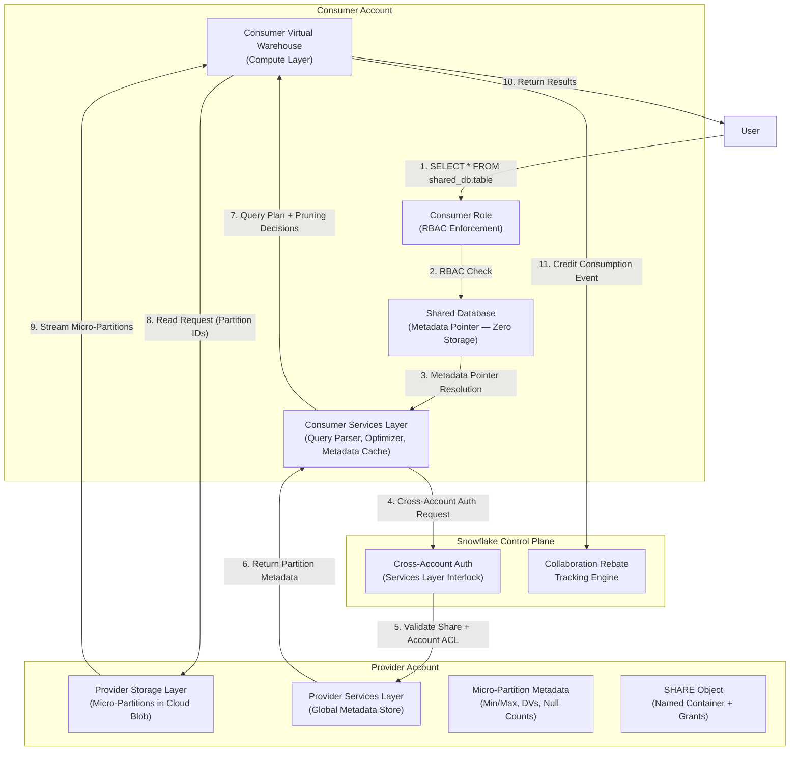
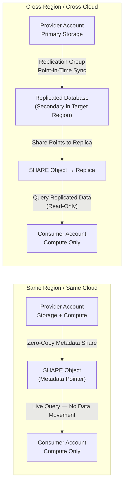
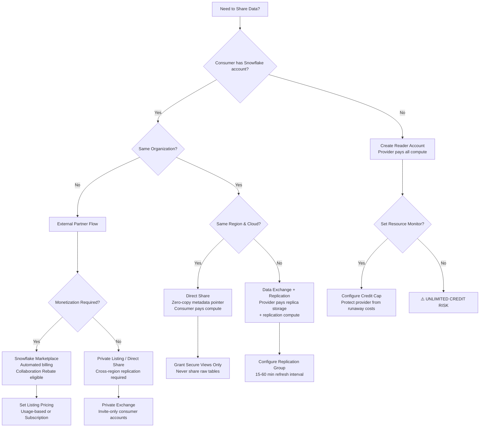

# Snowflake Data Sharing Capabilities — Production-Grade Technical Deep Dive

## Domain 5.0 Data Collaboration / 5.2 Snowflake Data Sharing Capabilities

---

## 1. EXECUTION ARCHITECTURE & COMPONENT INTERACTIONS

### 1.1 Mermaid Diagram: Cross-Account Query Execution Flow



### 1.2 Mermaid Diagram: Same-Region vs. Cross-Region Data Sharing



---

## 2. EXECUTION INTERNALS & TRANSACTIONAL BOUNDARIES

### 2.1 Zero-Copy Metadata Pointer Architecture

Snowflake Secure Data Sharing is fundamentally a **metadata-layer operation**, not a data-layer operation . The architecture operates as follows:

| Layer | Provider Responsibility | Consumer Responsibility | Credit Impact |
|-------|----------------------|------------------------|---------------|
| **Storage** | Owns all micro-partitions; pays for compressed blob storage ($23/TB/month) | Zero storage cost; database is a metadata projection | Provider only |
| **Metadata Services** | Maintains global metadata store; partition statistics, ACLs, share definitions | Queries metadata through cross-account services layer interlock | Shared overhead (negligible) |
| **Compute** | Only if provider queries their own data | Pays for all virtual warehouse compute to query shared data | Consumer only (full account); Provider only (reader accounts) |
| **Network** | Intra-region: zero egress cost; Cross-region: replication transfer cost | Intra-region: zero; Cross-region: zero (provider bears replication cost) | Provider for replication |

**Critical Internal Behavior:** When a consumer issues `SELECT` against a shared database, the query parser in the consumer's Services Layer resolves the database name to a share identifier. The optimizer then issues a **cross-account metadata request** to the provider's Services Layer to retrieve micro-partition statistics (min/max, distinct values, null counts) for partition pruning. The actual micro-partition data is read directly from the provider's cloud storage layer (S3/Azure Blob/GCS) by the consumer's virtual warehouse compute nodes. No data is cached in the consumer account unless explicitly materialized.

### 2.2 Transactional Semantics & Consistency Model

| Aspect | Behavior | Production Implication |
|--------|----------|----------------------|
| **Isolation Level** | Consumer sees provider data at the **snapshot timestamp** of query initiation | Consumers never see uncommitted provider transactions; read consistency guaranteed via MVCC |
| **Read-Only Guarantee** | All shared objects are immutable from consumer perspective  | No lock contention between provider DML and consumer queries; consumers cannot block provider writes |
| **Time Travel Visibility** | Consumer can query historical versions of shared data if provider has Time Travel enabled | Depends on provider's DATA_RETENTION_TIME_IN_DAYS setting; consumer cannot override |
| **Failover Consistency** | Failover groups provide point-in-time consistency across all replicated objects  | During failover, all secondary objects are consistent to the same snapshot; no split-brain reads |

**Transactional Boundary Detail:** When a provider executes DML (INSERT, UPDATE, DELETE, MERGE), Snowflake creates new micro-partitions and marks old ones for deletion. The global metadata store updates atomically. Consumer queries that started before the DML commit see the pre-change snapshot; queries started after see the new snapshot. There is **no intermediate state** visible to consumers.

### 2.3 Micro-Partition Pruning Over Shared Data

The partition pruning mechanics for shared data are identical to local data with one critical difference: **metadata retrieval crosses account boundaries** .

```sql
-- Consumer query against shared table
SELECT order_id, amount 
FROM shared_db.sales.orders 
WHERE order_date BETWEEN '2024-01-01' AND '2024-01-31';
```

**Execution Flow Internals:**

1. **Parser** resolves `shared_db.sales.orders` → share pointer → provider account locator
2. **Optimizer** requests partition metadata for `orders` table from provider's metadata store
3. **Pruning Engine** evaluates `order_date` min/max per micro-partition; typically eliminates 95-99% of partitions for well-clustered time-series data 
4. **Warehouse Scheduler** allocates query threads across compute nodes
5. **Storage I/O** reads only qualifying micro-partitions from provider's cloud blob storage
6. **Result Assembly** returns data to consumer

**Performance Impact:** Cross-account metadata retrieval adds **~50-200ms latency** to query compilation phase for the first query against a shared table in a session. Subsequent queries leverage the consumer's metadata cache. For a table with 1M micro-partitions, metadata transfer is ~20-50MB compressed and completes in <1s on modern warehouse sizes.

---

## 3. PARAMETER / CONFIGURATION DEEP DIVE

### 3.1 Share-Level Configuration

| Parameter | Internal Behavior | Performance Impact | Compliance/Edge Cases | Production Default |
|-----------|------------------|-------------------|----------------------|-------------------|
| `SHARE` object creation | Creates named container in provider metadata store; no data movement | Zero immediate cost; metadata-only operation | Requires ACCOUNTADMIN or CREATE SHARE privilege | Create per data domain |
| `GRANT SELECT ON <object> TO SHARE <share>` | Adds metadata pointer to share; object must be table, secure view, or secure UDF | Non-secure views cannot be shared; forces use of secure views which add ~5-10% query overhead due to predicate pushdown complexity | Secure views prevent consumers from seeing underlying base table names or view SQL text  | Grant only curated views, never raw tables |
| `ALTER SHARE <share> ADD ACCOUNTS = (<locator>)` | Updates ACL in global metadata store; consumer sees share immediately | Instant availability (<1s); no warm-up required | Account locators must be exact; org-level sharing requires `orgname.accountname` format | Validate account locators via `CURRENT_ORGANIZATION_NAME()` |
| `CREATE DATABASE <db> FROM SHARE <provider>.<share>` | Consumer-side metadata binding; zero storage allocation | Database appears instantly; first query triggers metadata fetch | Consumer cannot rename shared objects; cannot create objects in shared database | Use descriptive database names indicating source |

### 3.2 Replication Group Configuration (Cross-Region)

| Parameter | Internal Behavior | Performance Impact | Compliance/Edge Cases | Production Default |
|-----------|------------------|-------------------|----------------------|-------------------|
| `CREATE REPLICATION GROUP <rg>` | Defines collection of objects for atomic replication | Initial sync time = data volume / replication bandwidth; 1TB ~ 2-4 hours | Cannot include databases created from shares  | Include only primary databases |
| `ALTER REPLICATION GROUP <rg> REFRESH` | Incremental sync using change tracking; only modified micro-partitions transferred | Refresh duration proportional to DML volume since last refresh; typically 5-30 min for moderate churn | Fails if primary has streams with unsupported source objects  | Schedule every 15-60 min for near-real-time |
| `IGNORE EDITION CHECK` | Overrides Business Critical → lower edition replication block | Required for HIPAA/PHI scenarios where BAA exists only on primary | Use only after legal review; creates compliance gap | Never use without CISO approval |
| `FAILOVER GROUP` | Replication group + promotion capability | RTO: 5-15 min for promotion; RPO: last refresh interval | Requires Business Critical on ALL accounts in group  | Use for tier-1 data products only |

### 3.3 Consumer Warehouse Configuration

| Parameter | Internal Behavior | Performance Impact | Compliance/Edge Cases | Production Default |
|-----------|------------------|-------------------|----------------------|-------------------|
| `WAREHOUSE_SIZE` | Determines VM server count, thread allocation, memory per node  | XS=1 server (1 credit/hr); each size doubles credits and threads; linear scaling until query is "too small" | Cross-account queries may have slightly higher memory pressure due to metadata cache overhead | Start with S/M for shared data; scale based on partition scan volume |
| `AUTO_SUSPEND` | Warehouse pauses after idle timeout; minimum 60s billing on resume  | 60s minimum = 1 credit for XS regardless of query duration; shared data queries often <5s | Set to 1-5 min for BI dashboards; 30s for ad-hoc | 5 minutes for shared data workloads |
| `AUTO_RESUME` | Warehouse restarts on query submission | Adds 1-3s cold start latency; no impact on query execution time | Reader accounts: provider pays for all resume costs | Enable for all consumer-facing warehouses |
| `MULTI_CLUSTER_WAREHOUSE` | Scales out to N clusters for concurrency | Each cluster is independent; no resource contention between clusters | Max 10 clusters (Standard) / 200 (Enterprise+) | Use for >20 concurrent consumers |

---

## 4. PERFORMANCE & RESOURCE IMPLICATIONS

### 4.1 Memory Limits & Spill-to-Disk Triggers

| Warehouse Size | Memory per Node | Total Cluster Memory | Spill Trigger Threshold | Shared Data Impact |
|---------------|-----------------|---------------------|------------------------|-------------------|
| X-Small | 16 GB | 16 GB | ~12 GB (75%) | Fine for selective queries; spills on large aggregations |
| Small | 32 GB | 32 GB | ~24 GB | Baseline for shared analytics |
| Medium | 64 GB | 64 GB | ~48 GB | Recommended for shared fact tables |
| Large | 128 GB | 128 GB | ~96 GB | Required for large JOINs across shared data |
| X-Large | 256 GB | 256 GB | ~192 GB | Enterprise shared data marts |
| 2X-Large | 512 GB | 512 GB | ~384 GB | Heavy cross-account ETL patterns |
| 3X-Large | 1 TB | 1 TB | ~768 GB | Rarely needed for sharing |
| 4X-Large | 2 TB | 2 TB | ~1.5 TB | Provider-side materialized view refresh |

**Spill-to-Disk Mechanics:** When a query's intermediate results (hash tables, sort buffers, window frames) exceed 75% of available node memory, Snowflake spills to local SSD. For shared data queries, this is **more expensive** because spilled data must be written to consumer SSD while reading from provider storage, creating dual I/O pressure. A query that spills on Medium may complete 3-5x slower than non-spilling equivalent.

### 4.2 Concurrency Scaling & Warehouse Sizing Rules

**Concurrency Formula for Shared Data Workloads:**

```
RequiredClusters = ceil( (ConcurrentQueries × AvgQueryDuration) / (TargetMaxQueueTime × QueriesPerCluster) )

Where:
- QueriesPerCluster ≈ 8-12 for XS/S, 4-8 for M/L, 2-4 for XL+
- AvgQueryDuration against shared data = 1.2 × local query duration (cross-account metadata overhead)
```

**Production Rule:** For consumer-facing shared data products, size warehouses such that P95 query duration < 10s. If P95 exceeds 30s, increase warehouse size by one tier rather than adding clusters — shared data workloads are typically I/O-bound, not CPU-bound, and larger nodes provide more memory for caching partition metadata.

### 4.3 Credit Calculation & Cost Attribution

**Same-Region Direct Share (Full Consumer Account):**

| Component | Billed To | Rate | Formula |
|-----------|----------|------|---------|
| Compute | Consumer | $2-4/credit depending on edition  | `WarehouseSizeCredits × HoursRunning` |
| Storage | Provider | $23/TB/month | `CompressedDataSize × $23` |
| Metadata Operations | Snowflake (absorbed) | $0 | Negligible |
| Network | $0 (intra-region) | $0 | Zero egress for same-region sharing |

**Same-Region Direct Share (Reader Account):**

| Component | Billed To | Rate | Formula |
|-----------|----------|------|---------|
| Compute | **Provider**  | $2-4/credit | `WarehouseSizeCredits × HoursRunning` |
| Storage | Provider | $23/TB/month | Provider's original data |
| Network | $0 | $0 | Intra-region |

**Cross-Region Sharing (Replication + Share):**

| Component | Billed To | Rate | Formula |
|-----------|----------|------|---------|
| Replication Compute | Provider | Serverless credits | `ReplicationJobDuration × ServerlessRate` |
| Replica Storage | Provider | $23/TB/month | `ReplicaCompressedSize × $23` |
| Consumer Compute | Consumer (full) / Provider (reader) | $2-4/credit | Standard warehouse billing |
| Cross-Region Transfer | Provider | Cloud provider egress rate  | `DataVolume × $0.02-0.12/GB` |

**Collaboration Rebate Impact:**

| Stable Edges | Rebate % | Effective Consumer Credit Cost to Provider |
|-------------|---------|------------------------------------------|
| 0-9 | 10% | 90% of consumer compute attributed back |
| 10-24 | 15% | 85% attributed back |
| 25-49 | 25% | 75% attributed back |
| 50+ | 50% | 50% attributed back  |

**Credit Math Example:** A provider shares data with 3 consumer accounts. Consumers collectively burn 10,000 credits/month querying shared data. Provider has 50+ stable edges and burns 8,000 credits/month on their own workloads.

- Rebate = 50% × 10,000 = 5,000 credits
- Rebate capped at provider's own consumption = 8,000 credits (not triggered)
- **Net provider benefit:** 5,000 credit rebate applied to their bill

---

## 5. MONITORING, OBSERVABILITY & TROUBLESHOOTING

### 5.1 Exact SQL Queries for Operational Monitoring

**Query 1: Shared Database Usage by Consumer (Provider View)**

```sql
-- Provider: Monitor which consumers are querying shared data and how much
SELECT 
    CONSUMER_ACCOUNT_LOCATOR,
    DATABASE_NAME,
    SCHEMA_NAME,
    TABLE_NAME,
    COUNT(*) AS query_count,
    SUM(TOTAL_ELAPSED_TIME) / 1000 AS total_seconds,
    SUM(PARTITIONS_SCANNED) AS total_partitions_scanned,
    SUM(PARTITIONS_TOTAL) AS total_partitions_available,
    ROUND(100.0 * SUM(PARTITIONS_SCANNED) / NULLIF(SUM(PARTITIONS_TOTAL), 0), 2) AS pruning_efficiency_pct
FROM SNOWFLAKE.ACCOUNT_USAGE.QUERY_HISTORY
WHERE DATABASE_NAME IN (
    SELECT DATABASE_NAME 
    FROM SNOWFLAKE.ACCOUNT_USAGE.SHARES 
    WHERE KIND = 'OUTBOUND'
)
    AND START_TIME >= DATEADD(day, -7, CURRENT_TIMESTAMP())
GROUP BY 1, 2, 3, 4
ORDER BY total_seconds DESC;
```

**Query 2: Reader Account Credit Consumption (Provider View)**

```sql
-- Provider: Track reader account compute costs (provider pays!)
SELECT 
    READER_ACCOUNT_NAME,
    WAREHOUSE_NAME,
    SUM(CREDITS_USED) AS total_credits,
    SUM(CREDITS_USED_COMPUTE) AS compute_credits,
    SUM(CREDITS_USED_CLOUD_SERVICES) AS services_credits,
    COUNT(DISTINCT QUERY_ID) AS query_count,
    AVG(EXECUTION_TIME / 1000) AS avg_execution_seconds
FROM SNOWFLAKE.READER_ACCOUNT_USAGE.QUERY_HISTORY
WHERE START_TIME >= DATEADD(day, -30, CURRENT_TIMESTAMP())
GROUP BY 1, 2
ORDER BY total_credits DESC;
```

**Query 3: Cross-Account Query Performance Baseline**

```sql
-- Consumer: Compare shared data query performance vs local data
WITH shared_queries AS (
    SELECT 
        QUERY_ID,
        QUERY_TEXT,
        TOTAL_ELAPSED_TIME / 1000 AS elapsed_seconds,
        EXECUTION_TIME / 1000 AS execution_seconds,
        COMPILATION_TIME / 1000 AS compilation_seconds,
        PARTITIONS_SCANNED,
        BYTES_SCANNED / POWER(1024, 3) AS gb_scanned,
        WAREHOUSE_SIZE
    FROM SNOWFLAKE.ACCOUNT_USAGE.QUERY_HISTORY
    WHERE DATABASE_NAME LIKE '%SHARED%'  -- naming convention for shared DBs
        AND START_TIME >= DATEADD(day, -1, CURRENT_TIMESTAMP())
)
SELECT 
    WAREHOUSE_SIZE,
    COUNT(*) AS query_count,
    ROUND(AVG(elapsed_seconds), 2) AS avg_elapsed,
    ROUND(AVG(execution_seconds), 2) AS avg_execution,
    ROUND(AVG(compilation_seconds), 2) AS avg_compilation,
    ROUND(AVG(gb_scanned), 2) AS avg_gb_scanned,
    ROUND(AVG(PARTITIONS_SCANNED), 0) AS avg_partitions
FROM shared_queries
GROUP BY WAREHOUSE_SIZE
ORDER BY avg_elapsed DESC;
```

**Query 4: Replication Lag Monitoring**

```sql
-- Provider: Monitor cross-region replication health
SELECT 
    REPLICATION_GROUP_NAME,
    TARGET_ACCOUNT,
    TARGET_REGION,
    LAST_REFRESH_TIME,
    DATEDIFF(minute, LAST_REFRESH_TIME, CURRENT_TIMESTAMP()) AS lag_minutes,
    REFRESH_STATUS,
    DATABASES_REPLICATED,
    SHARES_REPLICATED
FROM SNOWFLAKE.ACCOUNT_USAGE.REPLICATION_GROUP_REFRESH_HISTORY
WHERE START_TIME >= DATEADD(day, -1, CURRENT_TIMESTAMP())
ORDER BY lag_minutes DESC;
```

**Query 5: Share Invalidation Events**

```sql
-- Provider: Detect when shares are dropped or accounts removed
SELECT 
    QUERY_TEXT,
    USER_NAME,
    ROLE_NAME,
    START_TIME,
    EXECUTION_STATUS,
    ERROR_MESSAGE
FROM SNOWFLAKE.ACCOUNT_USAGE.QUERY_HISTORY
WHERE QUERY_TEXT ILIKE '%DROP SHARE%'
   OR QUERY_TEXT ILIKE '%ALTER SHARE%REMOVE%'
   OR QUERY_TEXT ILIKE '%REVOKE%SHARE%'
    AND START_TIME >= DATEADD(day, -7, CURRENT_TIMESTAMP())
ORDER BY START_TIME DESC;
```

### 5.2 Error Categorization & Incident Runbooks

| Error Code / Pattern | Category | Root Cause | Resolution | Recovery Time |
|---------------------|----------|-----------|-----------|--------------|
| `Share '<name>' does not exist or not authorized` | Auth/ACL | Consumer account removed from share; share dropped; privilege revoked | Provider: `ALTER SHARE <name> ADD ACCOUNTS = (<locator>)` | Instant after fix |
| `Database '<db>' not found` | Metadata | Consumer dropped and recreated database from share; object removed from share | Consumer: `CREATE DATABASE <db> FROM SHARE <provider>.<share>` | <1 min |
| `Replication group refresh failed` | Replication | Primary database has unsupported stream; object dropped during refresh | Provider: Remove unsupported streams; retry refresh | 5-30 min |
| `Warehouse '<wh>' suspended` | Resource | Auto-suspend triggered; reader account resource monitor limit reached | Consumer: Resume warehouse; Provider: Adjust resource monitor | 1-3s |
| `Query timeout / Memory limit exceeded` | Performance | Query too large for warehouse size; excessive partition scanning | Consumer: Increase warehouse size; add clustering key to provider table | Immediate after resize |
| `Cross-region query latency >5s` | Network | Consumer in different region than shared data; no replication configured | Provider: Set up replication group to consumer's region | Hours (initial sync) |
| `Secure view compilation error` | DDL | Underlying table schema changed; view definition incompatible | Provider: Recreate secure view; re-add to share | <5 min |

### 5.3 Incident Recovery Procedures

**Incident: Consumer Reports "Database Not Found" After Share Modification**

```sql
-- Step 1: Provider validates share still exists and consumer is authorized
SHOW SHARES LIKE 'PROD_SALES_SHARE';

-- Step 2: Check if consumer account is in the share
DESC SHARE PROD_SALES_SHARE;
-- Verify: CONSUMER_ACCOUNTS column contains consumer locator

-- Step 3: If missing, re-add consumer
ALTER SHARE PROD_SALES_SHARE ADD ACCOUNTS = ('XYZ12345');

-- Step 4: Consumer recreates database (cannot restore old DB from share)
-- Consumer executes:
CREATE DATABASE PROD_SALES FROM SHARE PROVIDER_ORG.PROD_SALES_SHARE;

-- Step 5: Re-grant consumer-side privileges
-- Consumer executes:
GRANT USAGE ON DATABASE PROD_SALES TO ROLE ANALYST_ROLE;
GRANT USAGE ON SCHEMA PROD_SALES.PUBLIC TO ROLE ANALYST_ROLE;
GRANT SELECT ON ALL TABLES IN SCHEMA PROD_SALES.PUBLIC TO ROLE ANALYST_ROLE;
```

**Incident: Reader Account Credit Spike Detected**

```sql
-- Step 1: Identify top credit-burning queries in reader account
SELECT 
    QUERY_TEXT,
    WAREHOUSE_NAME,
    CREDITS_USED,
    EXECUTION_TIME / 1000 AS exec_seconds,
    PARTITIONS_SCANNED,
    BYTES_SCANNED
FROM SNOWFLAKE.READER_ACCOUNT_USAGE.QUERY_HISTORY
WHERE START_TIME >= DATEADD(hour, -4, CURRENT_TIMESTAMP())
ORDER BY CREDITS_USED DESC
LIMIT 20;

-- Step 2: Check if resource monitor is configured
SHOW RESOURCE MONITORS;

-- Step 3: If no monitor exists, create one immediately
CREATE RESOURCE MONITOR READER_RM 
    WITH CREDIT_QUOTA = 1000  -- Monthly cap
    FREQUENCY = MONTHLY
    START_TIMESTAMP = IMMEDIATELY
    TRIGGERS 
        ON 75 PERCENT DO NOTIFY  -- Alert at 75%
        ON 100 PERCENT DO SUSPEND_IMMEDIATE;  -- Hard stop

-- Step 4: Apply monitor to reader account warehouse
ALTER WAREHOUSE READER_WH SET RESOURCE_MONITOR = READER_RM;

-- Step 5: Contact consumer to optimize queries (e.g., add filters, reduce SELECT *)
```

---

## 6. ADVANCED PRODUCTION PATTERNS

### 6.1 Idempotency Strategies for Shared Data Consumers

**Pattern: Materialized View Cache with Version Tracking**

```sql
-- Consumer creates local cache of shared data with version tracking
CREATE TABLE local_cache.orders_cache (
    order_id INT,
    customer_id INT,
    order_date DATE,
    amount NUMBER(10,2),
    _share_version STRING,  -- Provider sets this in secure view
    _cached_at TIMESTAMP_NTZ DEFAULT CURRENT_TIMESTAMP()
);

-- Provider exposes version in secure view
CREATE SECURE VIEW shared_db.public.orders_v AS
SELECT 
    order_id,
    customer_id,
    order_date,
    amount,
    'v2024.05.01' AS _share_version  -- Update when schema/data changes
FROM raw_db.sales.orders;

-- Consumer idempotent refresh procedure
CREATE OR REPLACE PROCEDURE refresh_orders_cache()
RETURNS STRING
LANGUAGE SQL
AS $$
DECLARE
    latest_version STRING;
    current_version STRING;
BEGIN
    -- Get latest version from share
    SELECT _share_version INTO latest_version 
    FROM shared_db.public.orders_v 
    LIMIT 1;
    
    -- Get current cached version
    SELECT MAX(_share_version) INTO current_version 
    FROM local_cache.orders_cache;
    
    -- Only refresh if version changed
    IF (current_version IS NULL OR current_version != latest_version) THEN
        TRUNCATE TABLE local_cache.orders_cache;
        INSERT INTO local_cache.orders_cache
        SELECT *, latest_version, CURRENT_TIMESTAMP() 
        FROM shared_db.public.orders_v;
        RETURN 'Refreshed to ' || latest_version;
    ELSE
        RETURN 'No change detected, cache valid';
    END IF;
END;
$$;
```

### 6.2 DLQ (Dead Letter Queue) Routing for Failed Share Access

```sql
-- Consumer-side error handling with fallback
CREATE OR REPLACE PROCEDURE query_shared_data_with_fallback(
    query_text STRING
)
RETURNS TABLE(result VARIANT)
LANGUAGE SQL
AS $$
DECLARE
    sql_error STRING;
BEGIN
    -- Attempt primary shared database query
    BEGIN
        RETURN TABLE(RESULTSET_FROM_QUERY(query_text));
    EXCEPTION
        WHEN OTHER THEN
            sql_error := SQLERRM;
            
            -- Log to DLQ table
            INSERT INTO audit.share_dlq (
                query_text,
                error_message,
                attempted_at,
                database_name
            ) VALUES (
                query_text,
                sql_error,
                CURRENT_TIMESTAMP(),
                'shared_db'
            );
            
            -- Fallback to stale local cache if available
            IF (sql_error ILIKE '%not found%' OR sql_error ILIKE '%does not exist%') THEN
                RETURN TABLE(RESULTSET_FROM_QUERY(
                    REPLACE(query_text, 'shared_db.', 'local_cache.')
                ));
            ELSE
                RAISE;
            END IF;
    END;
END;
$$;
```

### 6.3 CI/CD Validation for Share Schema Contracts

```sql
-- Schema contract validation procedure (run in CI/CD pipeline)
CREATE OR REPLACE PROCEDURE validate_share_contract(
    share_database STRING,
    expected_schema VARIANT
)
RETURNS STRING
LANGUAGE SQL
AS $$
DECLARE
    actual_tables RESULTSET;
    expected_table STRING;
    missing_tables ARRAY := [];
    schema_drift ARRAY := [];
BEGIN
    -- Get actual schema from share
    LET actual_tables := (
        SELECT TABLE_NAME, COLUMN_NAME, DATA_TYPE, IS_NULLABLE
        FROM INFORMATION_SCHEMA.COLUMNS
        WHERE TABLE_SCHEMA = 'PUBLIC'
          AND TABLE_CATALOG = :share_database
    );
    
    -- Compare against expected schema (passed as JSON)
    FOR expected_table IN (SELECT VALUE FROM TABLE(FLATTEN(:expected_schema))) DO
        LET table_name := expected_table:TABLE_NAME::STRING;
        LET expected_cols := expected_table:COLUMNS::VARIANT;
        
        -- Check table exists
        IF (NOT EXISTS (
            SELECT 1 FROM INFORMATION_SCHEMA.TABLES 
            WHERE TABLE_CATALOG = :share_database 
              AND TABLE_NAME = :table_name
        )) THEN
            missing_tables := ARRAY_APPEND(missing_tables, table_name);
        END IF;
    END FOR;
    
    IF (ARRAY_SIZE(missing_tables) > 0) THEN
        RETURN 'SCHEMA_DRIFT: Missing tables: ' || ARRAY_TO_STRING(missing_tables, ', ');
    ELSE
        RETURN 'CONTRACT_VALID: All expected tables present';
    END IF;
END;
$$;

-- CI/CD invocation example
CALL validate_share_contract('shared_db', PARSE_JSON('[
    {"TABLE_NAME": "orders", "COLUMNS": ["order_id", "customer_id", "amount"]},
    {"TABLE_NAME": "customers", "COLUMNS": ["customer_id", "name", "region"]}
]'));
```

### 6.4 Retry / Backpressure Logic for Cross-Account Queries

```sql
-- Consumer-side retry with exponential backoff
CREATE OR REPLACE PROCEDURE query_shared_with_retry(
    query_text STRING,
    max_retries INT DEFAULT 3
)
RETURNS TABLE(result VARIANT)
LANGUAGE SQL
AS $$
DECLARE
    retry_count INT := 0;
    base_delay INT := 1;  -- seconds
    sql_error STRING;
BEGIN
    WHILE (retry_count < max_retries) DO
        BEGIN
            RETURN TABLE(RESULTSET_FROM_QUERY(query_text));
        EXCEPTION
            WHEN OTHER THEN
                sql_error := SQLERRM;
                
                -- Only retry on transient errors
                IF (sql_error ILIKE '%timeout%' 
                    OR sql_error ILIKE '%throttle%'
                    OR sql_error ILIKE '%temporarily unavailable%') THEN
                    
                    retry_count := retry_count + 1;
                    
                    -- Exponential backoff: 1s, 2s, 4s
                    LET sleep_seconds := POWER(2, retry_count - 1);
                    SYSTEM$SLEEP(sleep_seconds);
                ELSE
                    RAISE;
                END IF;
        END;
    END WHILE;
    
    RAISE_APPLICATION_ERROR(-20001, 'Max retries exceeded: ' || sql_error);
END;
$$;
```

### 6.5 Security & Compliance Controls

**Row-Level Security with Consumer Context:**

```sql
-- Provider: Secure view with row access policy
CREATE SECURE VIEW shared_db.public.sales_secure_v AS
SELECT 
    order_id,
    customer_id,
    region,
    amount,
    order_date
FROM raw_db.sales.orders
WHERE region = CURRENT_REGION();  -- Or use mapping table

-- Provider: Column masking for sensitive fields
CREATE OR REPLACE MASKING POLICY amount_mask AS (val NUMBER) RETURNS NUMBER ->
    CASE
        WHEN CURRENT_ROLE() IN ('ADMIN_ROLE', 'FINANCE_ROLE') THEN val
        WHEN CURRENT_ROLE() = 'ANALYST_ROLE' THEN ROUND(val, -2)  -- Mask to hundreds
        ELSE 0
    END;

ALTER TABLE raw_db.sales.orders MODIFY COLUMN amount SET MASKING POLICY amount_mask;
```

**Audit Trail for Shared Data Access:**

```sql
-- Provider: Comprehensive audit logging
CREATE TABLE audit.share_access_log (
    event_time TIMESTAMP_NTZ DEFAULT CURRENT_TIMESTAMP(),
    consumer_account STRING,
    consumer_user STRING,
    consumer_role STRING,
    query_id STRING,
    database_name STRING,
    schema_name STRING,
    table_name STRING,
    rows_returned INT,
    bytes_scanned INT,
    query_text STRING,
    execution_time_ms INT
);

-- Stream for real-time audit capture
CREATE STREAM audit.share_access_stream ON TABLE audit.share_access_log;

-- Task to aggregate and alert on anomalous access
CREATE TASK audit.anomaly_detection_task
    WAREHOUSE = 'AUDIT_WH'
    SCHEDULE = '5 MINUTE'
AS
    INSERT INTO audit.share_anomalies
    SELECT 
        CURRENT_TIMESTAMP() AS detected_at,
        consumer_account,
        COUNT(*) AS query_count,
        SUM(bytes_scanned) AS total_bytes,
        'HIGH_VOLUME_ACCESS' AS anomaly_type
    FROM audit.share_access_log
    WHERE event_time >= DATEADD(minute, -5, CURRENT_TIMESTAMP())
    GROUP BY consumer_account
    HAVING COUNT(*) > 1000 OR SUM(bytes_scanned) > 1e12;  -- 1TB threshold
```

---

## 7. DECISION MATRIX / QUICK REFERENCE FLOWCHART

### 7.1 Sharing Method Selection Matrix

| Scenario | Direct Share | Data Exchange | Marketplace Listing | Reader Account |
|----------|-------------|---------------|-------------------|----------------|
| **Same org, same region** | ✅ Best — zero overhead, instant | ⚠️ Overkill | ❌ N/A | ❌ N/A |
| **Same org, cross-region** | ❌ Not supported | ✅ Best — with replication | ❌ N/A | ❌ N/A |
| **External partner, full Snowflake customer** | ✅ Good — explicit control | ✅ Good — catalog discoverability | ✅ Best — monetization + billing | ❌ N/A |
| **External partner, no Snowflake account** | ❌ Not possible | ❌ Not possible | ❌ Not possible | ✅ Only option |
| **Many consumers (>10)** | ❌ High maintenance | ✅ Scalable | ✅ Best — self-service | ⚠️ Provider cost risk |
| **Monetization required** | ❌ Manual billing | ⚠️ Manual billing | ✅ Automated billing via Stripe | ❌ Manual billing |
| **HIPAA/PHI data** | ⚠️ BAA required on both sides | ⚠️ Same | ⚠️ Same | ❌ Reader accounts not HIPAA-eligible |
| **Real-time (<1s latency)** | ✅ Same-region only | ✅ Same-region only | ✅ Same-region only | ⚠️ Same-region + reader account overhead |

### 7.2 Mermaid Flowchart: Share Implementation Decision



---

## 8. KEY ENGINEERING PRINCIPLES & BOTTOM LINE

### 8.1 Production Non-Negotiables

1. **Never share raw tables.** Always share secure views with embedded row access policies and column masking. Raw table sharing exposes schema evolution risk and bypasses governance controls.

2. **Reader accounts require resource monitors.** Without a credit cap, a consumer running `SELECT *` on a 4XL warehouse for 24 hours will burn 768 credits/day — all charged to the provider . Set `CREDIT_QUOTA` with `SUSPEND_IMMEDIATE` at 100%.

3. **Cross-region sharing doubles storage cost.** The provider pays for primary storage + replica storage. A 10TB shared dataset in 3 regions = 40TB total storage bill (10 primary + 3×10 replicas). Model this in your data product pricing.

4. **Collaboration rebates are capped at your own consumption.** You cannot earn more in rebates than you spend. If you spend 5,000 credits/month, maximum rebate is 5,000 credits — even if consumers burn 50,000 credits on your data .

5. **Shared databases are instantly invalidated on share drop.** There is no grace period. All consumer queries fail immediately . Use `ALTER SHARE ... REMOVE ACCOUNTS` for controlled deprecation, never `DROP SHARE` without 24h notice to consumers.

6. **Query compilation latency increases 50-200ms for first cross-account query.** Design consumer applications to reuse sessions and leverage result caching. The 24-hour result cache does NOT work across accounts unless the exact same query text is issued.

### 8.2 Credit Impact Summary

| Pattern | Provider Credit Impact | Consumer Credit Impact | Monthly Cost Example (10TB dataset, 1000 queries/day) |
|---------|----------------------|----------------------|------------------------------------------------------|
| Same-region direct share | Storage only: $230 | XS warehouse: ~$144 (1hr/day) | Provider: $230; Consumer: $144 |
| Cross-region with replication | Storage ×2: $460 + replication: ~$50 | XS warehouse: ~$144 | Provider: $510; Consumer: $144 |
| Reader account (same region) | Storage + ALL compute: $230 + $144 = $374 | $0 | Provider: $374; Consumer: $0 |
| Reader account (cross-region) | Storage ×2 + ALL compute + replication: $510 + $144 = $654 | $0 | Provider: $654; Consumer: $0 |
| Marketplace with 50+ stable edges | Storage + rebate (50% of consumer compute): $230 - $72 = $158 | XS warehouse: ~$144 | Provider: $158; Consumer: $144 |

### 8.3 Bottom Line

Snowflake Data Sharing is a **metadata-layer federation mechanism**, not a data movement protocol. Its production value lies in eliminating ETL latency and storage duplication, but this comes with strict operational constraints:

- **Provider's governance model determines consumer's query performance.** Poor clustering on provider tables = poor pruning = high consumer compute costs = unhappy consumers.
- **Cross-account metadata retrieval is the hidden bottleneck.** First-query latency and compilation time dominate for small result sets; partition scan volume dominates for large aggregations.
- **Cost attribution is asymmetric.** Same-region sharing shifts compute to consumer; reader accounts shift ALL costs to provider; cross-region sharing adds replication burden to provider.
- **Operational excellence requires proactive monitoring.** The `READER_ACCOUNT_USAGE` schema is your early warning system for runaway costs. The `REPLICATION_GROUP_REFRESH_HISTORY` view is your cross-region health dashboard.

**Final Verdict:** Use direct shares for intra-org, same-region collaboration. Use Data Exchange with replication for cross-region internal sharing. Use Marketplace listings for external monetization. Use reader accounts only when the business case justifies assuming full compute liability — and always with resource monitors and credit caps.
