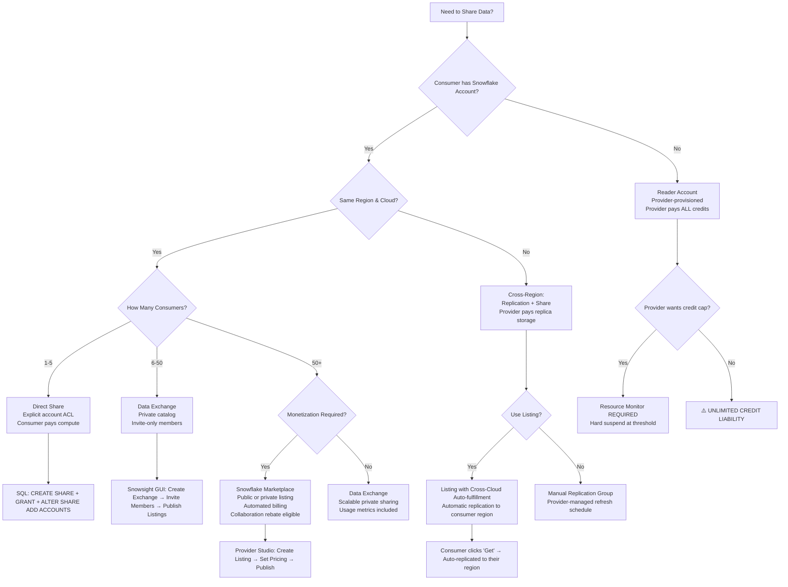
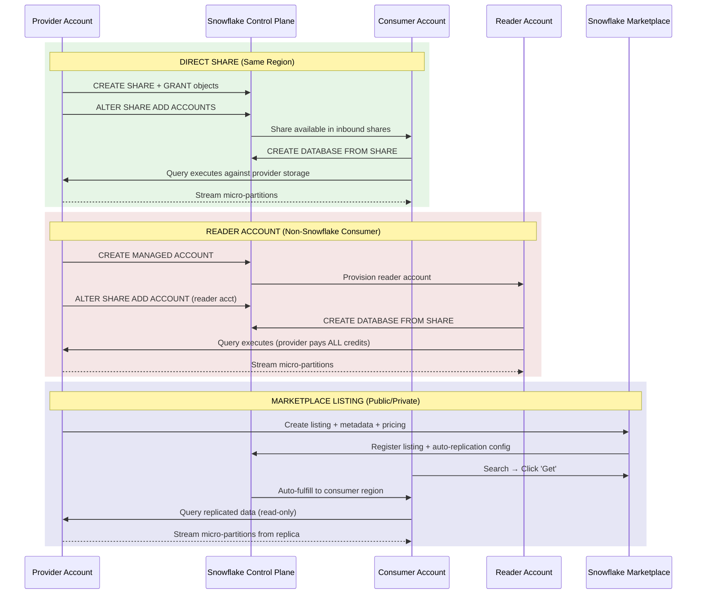
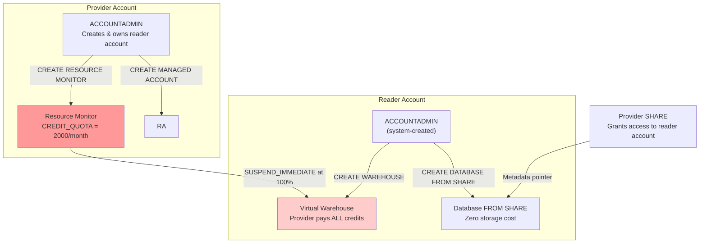
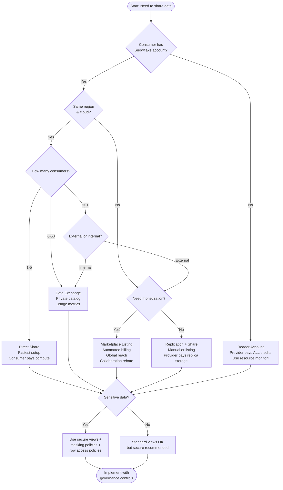

# Snowflake Data Sharing: Sharing Methods — Production-Grade Technical Deep Dive

## Domain 5.0 Data Collaboration / 5.2 Snowflake Data Sharing Capabilities / Sharing Methods

---

## 1. SHARING METHODS ARCHITECTURE OVERVIEW

Snowflake offers four distinct sharing methods, all built on the same zero-copy metadata pointer architecture but differentiated by audience scope, operational overhead, monetization capability, and cross-region support .

### 1.1 Mermaid Diagram: Sharing Methods Taxonomy & Decision Flow



### 1.2 Mermaid Sequence Diagram: Cross-Method Data Flow Internals



---

## 2. METHOD 1: DIRECT SHARE

### 2.1 Technical Internals

Direct shares are the foundational sharing primitive. They operate entirely within Snowflake's Services Layer metadata store and require **zero data movement** .

| Attribute | Direct Share Behavior |
|-----------|----------------------|
| **Scope** | Same cloud provider + same region ONLY  |
| **Data Movement** | Zero — metadata pointers only |
| **Storage Cost** | Provider pays 100%; consumer pays $0 |
| **Compute Cost** | Consumer pays for their warehouse compute (unless reader account) |
| **Latency** | Near-real-time — consumer sees provider DML within seconds |
| **Setup Time** | <1 minute after `ALTER SHARE ADD ACCOUNTS` |
| **Consumer Discovery** | Consumer runs `SHOW SHARES` — no search/catalog capability |

**Critical Constraint:** Direct shares cannot span regions or cloud platforms. If your provider account is in `AWS us-east-1` and your consumer is in `AWS us-west-2`, direct share will fail. You must use replication + share, or a listing with auto-fulfillment .

### 2.2 SQL Implementation & Role Requirements

```sql
-- === PROVIDER SIDE ===
-- Step 1: Create share (requires CREATE SHARE on account)
USE ROLE share_admin;
CREATE SHARE IF NOT EXISTS prod_sales_share;

-- Step 2: Grant database-level privileges
GRANT USAGE ON DATABASE raw_db TO SHARE prod_sales_share;
GRANT USAGE ON SCHEMA raw_db.sales TO SHARE prod_sales_share;

-- Step 3: Grant object-level privileges — ONLY secure views
GRANT SELECT ON VIEW raw_db.sales.orders_secure_v TO SHARE prod_sales_share;
GRANT SELECT ON VIEW raw_db.sales.customers_masked_v TO SHARE prod_sales_share;

-- Step 4: Add consumer accounts to share ACL
-- Account locators can be found via CURRENT_ORGANIZATION_NAME() + account name
ALTER SHARE prod_sales_share ADD ACCOUNTS = (
    'consumer_org.consumer_account_1',
    'consumer_org.consumer_account_2'
);

-- Step 5: Verify share configuration
DESC SHARE prod_sales_share;

-- === CONSUMER SIDE ===
-- Step 1: View inbound shares
SHOW SHARES;

-- Step 2: Create database from share
USE ROLE ACCOUNTADMIN;
CREATE DATABASE prod_sales_shared FROM SHARE provider_org.prod_sales_share;

-- Step 3: Grant access to team roles
USE ROLE SECURITYADMIN;
GRANT IMPORTED PRIVILEGES ON DATABASE prod_sales_shared TO ROLE shared_data_analyst;
GRANT USAGE ON SCHEMA prod_sales_shared.sales TO ROLE shared_data_analyst;
GRANT SELECT ON ALL VIEWS IN SCHEMA prod_sales_shared.sales TO ROLE shared_data_analyst;
```

### 2.3 Production Parameters & Performance Impact

| Parameter | Default | Production Setting | Impact |
|-----------|---------|-------------------|--------|
| `AUTO_SUSPEND` on consumer warehouse | 600s | 300s (5 min) | Reduces idle credit burn by ~40% for intermittent shared data access |
| `WAREHOUSE_SIZE` for shared queries | X-Small | Small-Medium | XS adds 50-200ms compilation overhead for first cross-account query; S provides adequate memory for partition metadata cache |
| `MAX_CONCURRENCY_LEVEL` | 8 | 8 (default) | Direct shares don't affect this — consumer warehouse handles concurrency independently |
| `STATEMENT_TIMEOUT_IN_SECONDS` | 172800 | 3600 (1 hour) | Prevents runaway queries from burning credits on shared data scans |


## 3. METHOD 2: DATA EXCHANGE

### 3.1 Technical Internals

Data Exchange is a **private marketplace** provisioned for your organization. It functions as a searchable catalog where invited members can discover and subscribe to listings .

| Attribute | Data Exchange Behavior |
|-----------|----------------------|
| **Scope** | Cross-region supported via replication + listing mechanism  |
| **Audience** | Invite-only members (internal org, partners, franchisees) |
| **Discovery** | Searchable catalog within the exchange |
| **Publishing Control** | Exchange admin controls who can publish vs. consume |
| **Monetization** | Not supported — no financial transactions |
| **Usage Metrics** | Provider gets consumption analytics via DATA_SHARING_USAGE schema  |
| **Setup** | Requires Snowflake support to provision exchange |

**Key Distinction from Direct Share:** Data Exchange is a **governance wrapper** around shares. Under the hood, it still creates shares and listings, but adds member management, catalog discoverability, and usage tracking .

### 3.2 Implementation Workflow

```sql
-- === EXCHANGE SETUP (Provider Organization) ===
-- Step 1: Request exchange provisioning from Snowflake support
-- (Cannot be self-provisioned via SQL)

-- Step 2: Once provisioned, invite members via Snowsight
-- Navigate to: Data Sharing → Private Exchanges → [Your Exchange] → Members
-- Invite accounts by account locator

-- Step 3: Create a listing within the exchange
-- SQL approach (alternative to Snowsight GUI):
USE ROLE ACCOUNTADMIN;

-- Create the underlying share first
CREATE SHARE exchange_sales_share;
GRANT USAGE ON DATABASE raw_db TO SHARE exchange_sales_share;
GRANT USAGE ON SCHEMA raw_db.public TO SHARE exchange_sales_share;
GRANT SELECT ON VIEW raw_db.public.sales_kpi_v TO SHARE exchange_sales_share;

-- Step 4: Publish as a listing in the exchange
-- (Done via Snowsight Provider Studio or SQL API)
-- Listing includes: title, description, sample queries, data dictionary

-- === CONSUMER SIDE (Exchange Member) ===
-- Step 1: Browse exchange catalog in Snowsight
-- Step 2: Click 'Get' on desired listing
-- Step 3: Database auto-created from listing share
-- Step 4: Grant access to local roles as needed
GRANT IMPORTED PRIVILEGES ON DATABASE exchange_sales_shared TO ROLE analyst_role;
```

### 3.3 Data Exchange vs. Direct Share Decision Matrix

| Factor | Direct Share | Data Exchange |
|--------|-------------|---------------|
| **Number of consumers** | 1-10 accounts | 10-100+ accounts |
| **Consumer discovery** | Manual (`SHOW SHARES`) | Searchable catalog |
| **Cross-region support** | ❌ No | ✅ Yes (via replication) |
| **Usage analytics** | ❌ None (manual QUERY_HISTORY only) | ✅ Built-in metrics |
| **Member governance** | ❌ None | ✅ Admin-controlled publish/consume roles |
| **Setup complexity** | Low (pure SQL) | Medium (requires support + GUI) |
| **Operational overhead** | High per-consumer | Low (self-service catalog) |
| **Cost** | Consumer pays compute | Consumer pays compute |


## 4. METHOD 3: SNOWFLAKE MARKETPLACE LISTING

### 4.1 Technical Internals

Marketplace listings are **public or private data products** published to the Snowflake Marketplace, with optional monetization via usage-based or subscription pricing .

| Attribute | Marketplace Listing Behavior |
|-----------|-----------------------------|
| **Scope** | Cross-region, cross-cloud via Cross-Cloud Auto-fulfillment  |
| **Audience** | Public (any Snowflake customer) or Private (selected accounts) |
| **Discovery** | Global searchable catalog on Snowflake Marketplace |
| **Monetization** | Free, usage-based, or subscription pricing  |
| **Billing** | Snowflake handles via Stripe; supports Capacity Drawdown for eligible accounts  |
| **Provider Analytics** | Listing views, consumer interest, query volume, revenue |
| **Collaboration Rebate** | Eligible for 10-50% rebate based on stable edges  |

**Auto-fulfillment Internals:** When a consumer clicks "Get" on a listing, Snowflake automatically:
1. Creates a replication group if cross-region
2. Replicates data to the consumer's region
3. Creates a share pointing to the replicated database
4. Creates a consumer database from the share
5. Handles billing setup (for paid listings)

This entire workflow is **serverless** from the provider's perspective after initial listing publication.

### 4.2 Listing Types & Implementation

```sql
-- === PROVIDER: CREATE LISTING (via Snowsight Provider Studio) ===
-- SQL cannot create listings directly — must use GUI or REST API
-- However, the underlying share is created via SQL:

USE ROLE ACCOUNTADMIN;

-- Step 1: Create optimized share for marketplace
CREATE SHARE marketplace_sales_share COMMENT = 'Marketplace listing: Global sales analytics';

-- Step 2: Grant only curated, production-ready views
GRANT USAGE ON DATABASE analytics_mart TO SHARE marketplace_sales_share;
GRANT USAGE ON SCHEMA analytics_mart.public TO SHARE marketplace_sales_share;
GRANT SELECT ON VIEW analytics_mart.public.daily_sales_summary_v TO SHARE marketplace_sales_share;
GRANT SELECT ON VIEW analytics_mart.public.customer_segments_v TO SHARE marketplace_sales_share;

-- Step 3: In Provider Studio, create listing:
-- - Title: "Global Sales Analytics Dataset"
-- - Description: "Daily aggregated sales metrics by region, product, customer segment"
-- - Sample queries: Pre-built SQL for common use cases
-- - Pricing: Free / $0.10 per query / $500/month subscription
-- - Regions: Auto-fulfill to all regions

-- === CONSUMER: ACCESS LISTING ===
-- Step 1: Search Snowflake Marketplace in Snowsight
-- Step 2: Click 'Get' (free) or 'Buy' (paid)
-- Step 3: For paid listings, requires:
--   - ACCOUNTADMIN or role with IMPORT SHARE + PURCHASE DATA EXCHANGE LISTING 
--   - Organization admin must accept Provider and Consumer Terms
--   - Payment method configured (credit card, invoice, or Capacity Drawdown)
-- Step 4: Database auto-created in consumer account
-- Step 5: Grant to roles
GRANT IMPORTED PRIVILEGES ON DATABASE marketplace_sales TO ROLE data_science_role;
```

### 4.3 Monetization Pricing Models

| Model | Billing Mechanism | Provider Revenue | Snowflake Fee | Best For |
|-------|------------------|-----------------|---------------|----------|
| **Free** | $0 | $0 | $0 | Lead generation, data network effects |
| **Usage-based** | Per-query or per-GB-scanned | 70-85% of gross | 15-30% | Variable consumption patterns |
| **Subscription** | Monthly/annual fixed fee | 70-85% of gross | 15-30% | Predictable, high-volume datasets |
| **Capacity Drawdown** | Deducted from consumer's Snowflake contract | Provider paid by Snowflake | N/A | Enterprise consumers with committed capacity |


## 5. METHOD 4: READER ACCOUNT

### 5.1 Technical Internals

Reader accounts are **provider-provisioned, provider-managed Snowflake accounts** for consumers who do not have (or do not want) their own Snowflake subscription .

| Attribute | Reader Account Behavior |
|-----------|------------------------|
| **Scope** | Same region as provider (can be extended via replication) |
| **Ownership** | Provider owns and manages the account |
| **Credit Liability** | **Provider pays 100%** of all compute, storage, and services credits  |
| **Data Access** | Read-only from provider's shares only — cannot consume from other providers |
| **DML Capability** | ❌ No INSERT, UPDATE, DELETE, MERGE |
| **Object Creation** | Can create warehouses, databases from shares, schemas (in non-shared DBs), views, materialized views |
| **Forbidden Objects** | SHARE, STAGE, PIPE, MASKING POLICY, ROW ACCESS POLICY, STREAM, TASK, SERVICE, STREAMLIT, IMAGE REPOSITORY  |
| **User/Role Management** | Full RBAC within the reader account |

**Critical Credit Risk:** A reader account consumer can create a 4X-Large warehouse and run 24/7, burning 512 credits/hour × 24 = 12,288 credits/day. At $4/credit, that's **$49,152/day** charged to the provider. Resource monitors are **mandatory**, not optional.

### 5.2 SQL Implementation

```sql
-- === PROVIDER: CREATE READER ACCOUNT ===
USE ROLE ACCOUNTADMIN;

-- Step 1: Create managed (reader) account
CREATE MANAGED ACCOUNT reader_acct_for_partner
    ADMIN_NAME = 'partner_admin'
    ADMIN_PASSWORD = 'TempPass123!'
    COMMENT = 'Reader account for external partner XYZ Corp';

-- Step 2: Capture reader account locator
SHOW MANAGED ACCOUNTS;
-- Note the account_locator (e.g., 'READER12345')

-- Step 3: Create share and add reader account
CREATE SHARE partner_share;
GRANT USAGE ON DATABASE raw_db TO SHARE partner_share;
GRANT USAGE ON SCHEMA raw_db.partner_facing TO SHARE partner_share;
GRANT SELECT ON VIEW raw_db.partner_facing.orders_summary_v TO SHARE partner_share;

ALTER SHARE partner_share ADD ACCOUNTS = ('READER12345');

-- Step 4: Configure resource monitor (MANDATORY)
CREATE RESOURCE MONITOR partner_reader_rm
    WITH CREDIT_QUOTA = 2000  -- Monthly hard cap
    FREQUENCY = MONTHLY
    START_TIMESTAMP = IMMEDIATELY
    TRIGGERS
        ON 75 PERCENT DO NOTIFY
        ON 90 PERCENT DO SUSPEND
        ON 100 PERCENT DO SUSPEND_IMMEDIATE;

-- Apply monitor to all warehouses in reader account
-- (Must be done from within reader account or via ACCOUNTADMIN with cross-account access)

-- === READER ACCOUNT: INITIAL SETUP ===
-- Log in as partner_admin (system-created ACCOUNTADMIN)

-- Step 1: Create warehouse
USE ROLE SYSADMIN;
CREATE WAREHOUSE partner_query_wh
    WITH WAREHOUSE_SIZE = SMALL
    AUTO_SUSPEND = 300
    AUTO_RESUME = TRUE;

-- Step 2: Apply resource monitor
USE ROLE ACCOUNTADMIN;
ALTER WAREHOUSE partner_query_wh SET RESOURCE_MONITOR = partner_reader_rm;

-- Step 3: Create database from share
USE ROLE SYSADMIN;
CREATE DATABASE partner_data FROM SHARE provider_org.partner_share;

-- Step 4: Create roles and grant access
USE ROLE SECURITYADMIN;
CREATE ROLE partner_analyst;
GRANT USAGE ON WAREHOUSE partner_query_wh TO ROLE partner_analyst;
GRANT USAGE ON DATABASE partner_data TO ROLE partner_analyst;
GRANT USAGE ON SCHEMA partner_data.partner_facing TO ROLE partner_analyst;
GRANT SELECT ON ALL VIEWS IN SCHEMA partner_data.partner_facing TO ROLE partner_analyst;

-- Step 5: Create users
CREATE USER analyst_1 PASSWORD = '...' DEFAULT_ROLE = partner_analyst;
GRANT ROLE partner_analyst TO USER analyst_1;
```

### 5.3 Reader Account Cost Control Architecture




## 6. CROSS-REGION SHARING: REPLICATION + SHARE

### 6.1 Technical Internals

Cross-region sharing requires **database replication** because direct shares are region-locked . The provider replicates data to a secondary account in the consumer's region, then shares from that replica.

| Attribute | Cross-Region Replication + Share |
|-----------|-------------------------------|
| **Mechanism** | Replication group → Secondary database → Share from secondary |
| **Consistency** | Point-in-time (last refresh timestamp) |
| **RPO** | Refresh interval (15 min — 24 hours depending on schedule) |
| **RTO** | N/A for sharing (read-only); 5-15 min for failover groups |
| **Storage Cost** | Provider pays primary + replica storage |
| **Replication Compute** | Provider pays serverless credits for refresh jobs |
| **Network Cost** | Provider pays cloud egress for initial sync + incremental deltas |
| **Consumer Compute** | Consumer pays for warehouse (or provider pays if reader account) |

### 6.2 SQL Implementation

```sql
-- === PROVIDER: SET UP CROSS-REGION REPLICATION ===
-- Prerequisites:
-- 1. Target account exists in consumer's region
-- 2. Both accounts in same organization
-- 3. Enterprise Edition or higher

USE ROLE ACCOUNTADMIN;

-- Step 1: Create replication group in source account
CREATE REPLICATION GROUP cross_region_sales_rg;

-- Step 2: Add databases to replication group
ALTER REPLICATION GROUP cross_region_sales_rg ADD DATABASE raw_db;

-- Step 3: Add target account (consumer's region)
ALTER REPLICATION GROUP cross_region_sales_rg 
    ADD ACCOUNTS = ('consumer_org.consumer_account_west');

-- Step 4: Initial replication (one-time, can take hours for large datasets)
ALTER REPLICATION GROUP cross_region_sales_rg REFRESH;

-- Step 5: Schedule incremental refresh (every 15 minutes)
CREATE TASK refresh_sales_rg
    WAREHOUSE = 'REPLICATION_WH'
    SCHEDULE = '15 MINUTE'
AS
    ALTER REPLICATION GROUP cross_region_sales_rg REFRESH;

ALTER TASK refresh_sales_rg RESUME;

-- === TARGET ACCOUNT (CONSUMER REGION): CREATE SHARE FROM REPLICA ===
-- Log in to target account

USE ROLE ACCOUNTADMIN;

-- Step 1: Create share from replicated database
CREATE SHARE west_region_sales_share;

-- Step 2: Grant privileges on replicated database
GRANT USAGE ON DATABASE raw_db TO SHARE west_region_sales_share;
GRANT USAGE ON SCHEMA raw_db.sales TO SHARE west_region_sales_share;
GRANT SELECT ON VIEW raw_db.sales.orders_secure_v TO SHARE west_region_sales_share;

-- Step 3: Add consumer account in this region
ALTER SHARE west_region_sales_share 
    ADD ACCOUNTS = ('consumer_org.final_consumer_account');

-- === CONSUMER: ACCESS SHARED DATA ===
CREATE DATABASE sales_west FROM SHARE provider_org.west_region_sales_share;
```

### 6.3 Cross-Region vs. Listing Auto-fulfillment Comparison

| Aspect | Manual Replication + Share | Marketplace Listing with Auto-fulfillment |
|--------|---------------------------|------------------------------------------|
| **Setup complexity** | High (SQL + monitoring) | Low (GUI + one-time config) |
| **Ongoing maintenance** | Requires refresh scheduling, lag monitoring | Fully automated by Snowflake |
| **Multi-consumer scaling** | One replica per region, shared by all consumers in that region | One replica per consumer account |
| **Cost efficiency** | High (one replica serves many consumers in region) | Lower (per-consumer replication) |
| **Control** | Full control over refresh schedule, objects replicated | Limited — Snowflake-managed |
| **Failover capability** | Yes (if using failover groups) | No |
| **Best for** | Internal org sharing, predictable consumer base | External monetization, unknown consumer geography |


## 7. SHARING METHODS COMPREHENSIVE COMPARISON MATRIX

| Dimension | Direct Share | Data Exchange | Marketplace Listing | Reader Account |
|-----------|-------------|---------------|-------------------|----------------|
| **Audience** | Specific accounts (1:1 or 1:few) | Invite-only private group | Public or private (any Snowflake customer) | Non-Snowflake consumers |
| **Region Support** | Same region only  | Cross-region via replication | Cross-region via auto-fulfillment  | Same region (provider can replicate) |
| **Discovery** | `SHOW SHARES` (manual) | Searchable private catalog | Global Marketplace search | Provider-managed invitation |
| **Setup Time** | <5 minutes | Hours (requires support provisioning) | 1-2 hours (listing review process) | 10 minutes |
| **Operational Overhead** | High per-consumer | Low (self-service catalog) | Very low (fully automated) | High (provider manages account) |
| **Monetization** | ❌ No | ❌ No | ✅ Yes (usage-based or subscription)  | ❌ No |
| **Usage Analytics** | Manual (QUERY_HISTORY) | Built-in (DATA_SHARING_USAGE) | Rich (views, clicks, queries, revenue) | Manual (READER_ACCOUNT_USAGE) |
| **Credit Liability** | Consumer pays compute | Consumer pays compute | Consumer pays compute | **Provider pays ALL credits**  |
| **Storage Cost** | Provider only | Provider only | Provider only | Provider only |
| **Collaboration Rebate** | ✅ Eligible | ✅ Eligible | ✅ Eligible | ❌ Not eligible  |
| **Consumer Account Type** | Full Snowflake account | Full Snowflake account | Full Snowflake account | Provider-managed reader account |
| **DML on Shared Data** | ❌ Read-only | ❌ Read-only | ❌ Read-only | ❌ Read-only |
| **Max Consumers** | Unlimited (but manual ACL mgmt) | Unlimited (within exchange) | Unlimited (global scale) | Unlimited (but credit risk) |
| **RBAC Granularity** | Object-level (tables, views, UDFs) | Object-level via listings | Object-level via listings | Object-level |
| **Cross-Cloud** | ❌ No | ✅ Yes (with replication) | ✅ Yes (auto-fulfillment) | ❌ No (same cloud as provider) |
| **Data Clean Room** | ❌ No | ❌ No | ❌ No | ❌ No |
| **Best Use Case** | Internal same-region sharing, trusted partners | Large org with many internal consumers | External monetization, public data products | Third-party access without Snowflake subscription |


## 8. MONITORING & OBSERVABILITY BY METHOD

### 8.1 Direct Share Monitoring

```sql
-- Provider: Monitor direct share usage by consumer account
SELECT 
    CONSUMER_ACCOUNT_LOCATOR,
    SHARE_NAME,
    COUNT(*) AS query_count,
    SUM(TOTAL_ELAPSED_TIME) / 1000 AS total_seconds,
    SUM(CREDITS_USED) AS total_credits,
    SUM(BYTES_SCANNED) / POWER(1024, 3) AS gb_scanned,
    MAX(START_TIME) AS last_query_time
FROM SNOWFLAKE.ACCOUNT_USAGE.QUERY_HISTORY
WHERE DATABASE_NAME IN (
    SELECT DATABASE_NAME FROM SNOWFLAKE.ACCOUNT_USAGE.SHARES WHERE KIND = 'OUTBOUND'
)
    AND START_TIME >= DATEADD(day, -7, CURRENT_TIMESTAMP())
GROUP BY 1, 2
ORDER BY total_credits DESC;

-- Provider: Track share configuration changes
SELECT 
    QUERY_TEXT,
    USER_NAME,
    ROLE_NAME,
    START_TIME,
    EXECUTION_STATUS
FROM SNOWFLAKE.ACCOUNT_USAGE.QUERY_HISTORY
WHERE QUERY_TEXT ILIKE '%ALTER SHARE%'
   OR QUERY_TEXT ILIKE '%GRANT%TO SHARE%'
   OR QUERY_TEXT ILIKE '%CREATE SHARE%'
    AND START_TIME >= DATEADD(day, -30, CURRENT_TIMESTAMP())
ORDER BY START_TIME DESC;
```

### 8.2 Data Exchange Monitoring

```sql
-- Provider: Monitor exchange listing consumption
SELECT 
    LISTING_NAME,
    CONSUMER_ACCOUNT_LOCATOR,
    CONSUMER_ORGANIZATION_NAME,
    QUERY_COUNT,
    TOTAL_CREDITS_USED,
    TOTAL_BYTES_SCANNED,
    LAST_QUERY_TIMESTAMP
FROM SNOWFLAKE.DATA_SHARING_USAGE.LISTING_CONSUMPTION_DAILY
WHERE DATE >= DATEADD(day, -30, CURRENT_DATE())
ORDER BY TOTAL_CREDITS_USED DESC;

-- Provider: Track listing events (views, requests, grants)
SELECT 
    EVENT_TYPE,
    LISTING_NAME,
    CONSUMER_ACCOUNT_LOCATOR,
    EVENT_TIMESTAMP
FROM SNOWFLAKE.DATA_SHARING_USAGE.LISTING_EVENTS
WHERE EVENT_TIMESTAMP >= DATEADD(day, -7, CURRENT_TIMESTAMP())
ORDER BY EVENT_TIMESTAMP DESC;
```

### 8.3 Marketplace Listing Monitoring

```sql
-- Provider: Marketplace-specific metrics
SELECT 
    LISTING_NAME,
    LISTING_STATUS,
    CONSUMER_ACCOUNT_LOCATOR,
    CONSUMER_REGION,
    QUERY_COUNT,
    CREDITS_CONSUMED,
    REVENUE_EARNED,
    LISTING_TYPE  -- 'FREE', 'USAGE_BASED', 'SUBSCRIPTION'
FROM SNOWFLAKE.DATA_SHARING_USAGE.MARKETPLACE_LISTING_CONSUMPTION
WHERE DATE >= DATEADD(day, -30, CURRENT_DATE())
ORDER BY REVENUE_EARNED DESC NULLS LAST;

-- Provider: Track consumer interest (pre-purchase)
SELECT 
    LISTING_NAME,
    CONSUMER_ACCOUNT_LOCATOR,
    EVENT_TYPE,  -- 'VIEW', 'REQUEST_ACCESS', 'TRIAL_STARTED'
    EVENT_TIMESTAMP
FROM SNOWFLAKE.DATA_SHARING_USAGE.LISTING_INTEREST
WHERE EVENT_TIMESTAMP >= DATEADD(day, -30, CURRENT_TIMESTAMP())
ORDER BY EVENT_TIMESTAMP DESC;
```

### 8.4 Reader Account Monitoring

```sql
-- Provider: Reader account credit consumption (CRITICAL — provider pays!)
SELECT 
    READER_ACCOUNT_NAME,
    WAREHOUSE_NAME,
    USER_NAME,
    ROLE_NAME,
    SUM(CREDITS_USED) AS total_credits,
    SUM(CREDITS_USED_COMPUTE) AS compute_credits,
    COUNT(DISTINCT QUERY_ID) AS query_count,
    AVG(EXECUTION_TIME / 1000) AS avg_exec_seconds,
    MAX(START_TIME) AS last_activity
FROM SNOWFLAKE.READER_ACCOUNT_USAGE.QUERY_HISTORY
WHERE START_TIME >= DATEADD(day, -30, CURRENT_TIMESTAMP())
GROUP BY 1, 2, 3, 4
ORDER BY total_credits DESC;

-- Provider: Reader account warehouse sizing (credit burn predictor)
SELECT 
    READER_ACCOUNT_NAME,
    WAREHOUSE_NAME,
    WAREHOUSE_SIZE,
    COUNT(*) AS query_count,
    SUM(CREDITS_USED) AS total_credits,
    -- Calculate daily burn rate if running 24/7
    CASE WAREHOUSE_SIZE
        WHEN 'X-Small' THEN 1 * 24
        WHEN 'Small' THEN 2 * 24
        WHEN 'Medium' THEN 4 * 24
        WHEN 'Large' THEN 8 * 24
        WHEN 'X-Large' THEN 16 * 24
        WHEN '2X-Large' THEN 32 * 24
        WHEN '3X-Large' THEN 64 * 24
        WHEN '4X-Large' THEN 128 * 24
    END AS max_daily_credits
FROM SNOWFLAKE.READER_ACCOUNT_USAGE.WAREHOUSE_METERING_HISTORY
WHERE START_TIME >= DATEADD(day, -7, CURRENT_TIMESTAMP())
GROUP BY 1, 2, 3
ORDER BY max_daily_credits DESC;
```

### 8.5 Cross-Region Replication Monitoring

```sql
-- Provider: Replication lag and health
SELECT 
    REPLICATION_GROUP_NAME,
    TARGET_ACCOUNT,
    TARGET_REGION,
    SOURCE_DATABASE,
    SECONDARY_DATABASE,
    LAST_REFRESH_TIME,
    DATEDIFF(minute, LAST_REFRESH_TIME, CURRENT_TIMESTAMP()) AS lag_minutes,
    REFRESH_STATUS,
    BYTES_REPLICATED / POWER(1024, 3) AS gb_replicated,
    CREDITS_USED AS replication_credits
FROM SNOWFLAKE.ACCOUNT_USAGE.REPLICATION_GROUP_REFRESH_HISTORY
WHERE START_TIME >= DATEADD(day, -7, CURRENT_TIMESTAMP())
ORDER BY lag_minutes DESC;

-- Alert: Replication lag > 60 minutes
SELECT 
    REPLICATION_GROUP_NAME,
    TARGET_REGION,
    lag_minutes,
    'REPLICATION_LAG_ALERT' AS alert_type
FROM (
    SELECT 
        REPLICATION_GROUP_NAME,
        TARGET_REGION,
        DATEDIFF(minute, LAST_REFRESH_TIME, CURRENT_TIMESTAMP()) AS lag_minutes
    FROM SNOWFLAKE.ACCOUNT_USAGE.REPLICATION_GROUP_REFRESH_HISTORY
    WHERE REFRESH_STATUS = 'SUCCESS'
    QUALIFY ROW_NUMBER() OVER (PARTITION BY REPLICATION_GROUP_NAME, TARGET_REGION ORDER BY LAST_REFRESH_TIME DESC) = 1
)
WHERE lag_minutes > 60;
```


## 9. ADVANCED PRODUCTION PATTERNS

### 9.1 Hybrid Sharing: Direct Share + Listing for Same Dataset

```sql
-- Pattern: Use direct share for internal consumers, marketplace listing for external

-- Step 1: Create base share (internal)
USE ROLE share_admin;
CREATE SHARE internal_sales_share;
GRANT USAGE ON DATABASE analytics_mart TO SHARE internal_sales_share;
GRANT SELECT ON VIEW analytics_mart.public.sales_summary_v TO SHARE internal_sales_share;
ALTER SHARE internal_sales_share ADD ACCOUNTS = (
    'my_org.team_a',
    'my_org.team_b'
);

-- Step 2: Create marketplace listing (external) from same share
-- In Provider Studio:
-- - Create new listing
-- - Select existing share: internal_sales_share
-- - Set availability: Public
-- - Set pricing: Usage-based, $0.05/query
-- - Enable auto-fulfillment to all regions
-- - Add metadata, sample queries, documentation

-- Step 3: Monitor both channels separately
-- Internal: Query SNOWFLAKE.ACCOUNT_USAGE.QUERY_HISTORY for internal account locators
-- External: Query SNOWFLAKE.DATA_SHARING_USAGE.MARKETPLACE_LISTING_CONSUMPTION
```

### 9.2 Reader Account Factory Pattern

```sql
-- Automated reader account provisioning for multiple partners

CREATE OR REPLACE PROCEDURE provision_reader_account(
    partner_name STRING,
    partner_admin_email STRING,
    credit_quota INT,
    warehouse_size STRING
)
RETURNS STRING
LANGUAGE SQL
AS $$
DECLARE
    reader_account_locator STRING;
    share_name STRING := partner_name || '_share';
    rm_name STRING := partner_name || '_rm';
    wh_name STRING := partner_name || '_wh';
BEGIN
    -- Step 1: Create reader account
    CREATE MANAGED ACCOUNT reader_acct_for_ || partner_name
        ADMIN_NAME = 'admin'
        ADMIN_PASSWORD = 'TempPass_' || UUID_STRING()
        COMMENT = 'Reader account for ' || partner_name;
    
    -- Step 2: Get account locator
    SELECT account_locator INTO reader_account_locator
    FROM TABLE(SHOW MANAGED ACCOUNTS())
    WHERE comment LIKE '%' || partner_name || '%'
    ORDER BY created_on DESC
    LIMIT 1;
    
    -- Step 3: Create share and add reader account
    CREATE SHARE IF NOT EXISTS share_name;
    -- (Grant objects to share — omitted for brevity)
    ALTER SHARE share_name ADD ACCOUNTS = (reader_account_locator);
    
    -- Step 4: Create resource monitor
    CREATE RESOURCE MONITOR rm_name
        WITH CREDIT_QUOTA = credit_quota
        FREQUENCY = MONTHLY
        START_TIMESTAMP = IMMEDIATELY
        TRIGGERS
            ON 75 PERCENT DO NOTIFY
            ON 100 PERCENT DO SUSPEND_IMMEDIATE;
    
    RETURN 'Provisioned reader account: ' || reader_account_locator || 
           ' with credit quota: ' || credit_quota;
END;
$$;

-- Usage
CALL provision_reader_account('partner_xyz', 'admin@xyz.com', 1000, 'SMALL');
```

### 9.3 Cross-Region Share with Failover Group for DR

```sql
-- Pattern: Share data globally with disaster recovery capability

-- Step 1: Create failover group (Business Critical required)
USE ROLE ACCOUNTADMIN;

CREATE FAILOVER GROUP global_sales_fg;

-- Step 2: Add databases and shares to failover group
ALTER FAILOVER GROUP global_sales_fg ADD DATABASE analytics_mart;
ALTER FAILOVER GROUP global_sales_fg ADD SHARE marketplace_sales_share;

-- Step 3: Add target accounts in multiple regions
ALTER FAILOVER GROUP global_sales_fg 
    ADD ACCOUNTS = (
        'my_org.us_west',
        'my_org.eu_central',
        'my_org.ap_south'
    );

-- Step 4: Initial replication
ALTER FAILOVER GROUP global_sales_fg REFRESH;

-- Step 5: Schedule refresh
CREATE TASK refresh_global_fg
    WAREHOUSE = 'REPLICATION_WH'
    SCHEDULE = '15 MINUTE'
AS
    ALTER FAILOVER GROUP global_sales_fg REFRESH;

-- Step 6: In each target region, create shares from secondary databases
-- (Automated via replication group — shares are replicated as part of the group)

-- Step 7: Failover procedure (if primary region fails)
-- In target account:
ALTER FAILOVER GROUP global_sales_fg PROMOTE;
-- Secondary becomes primary. Read-write access enabled.
-- Share continues to function from new primary.
```


## 10. DECISION MATRIX / QUICK REFERENCE

### 10.1 Method Selection Flowchart



### 10.2 Cost Attribution Matrix by Method

| Method | Provider Storage | Provider Compute | Provider Network | Consumer Compute | Consumer Storage |
|--------|-----------------|-----------------|-----------------|-----------------|-----------------|
| **Direct Share (same region)** | $23/TB/month | Own queries only | $0 | All shared queries | $0 |
| **Direct Share + Replication** | $23/TB × (1 + regions) | Replication jobs + own queries | Egress for replication | All shared queries | $0 |
| **Data Exchange** | Same as direct/replication | Same as direct/replication | Same as direct/replication | All shared queries | $0 |
| **Marketplace Listing** | Same as direct/replication | Same as direct/replication | Same as direct/replication | All shared queries | $0 |
| **Reader Account** | $23/TB/month | **ALL consumer queries** | $0 | **$0** | $0 |
| **Reader Account + Replication** | $23/TB × (1 + regions) | **ALL consumer queries + replication** | Egress for replication | **$0** | $0 |

### 10.3 Edition Requirements by Method

| Method | Standard | Enterprise | Business Critical | Notes |
|--------|----------|-----------|-------------------|-------|
| **Direct Share** | ✅ | ✅ | ✅ | Available on all editions |
| **Data Exchange** | ❌ | ✅ | ✅ | Requires Enterprise+ |
| **Marketplace Listing** | ❌ | ✅ | ✅ | Requires Enterprise+ |
| **Reader Account** | ✅ | ✅ | ✅ | Available on all editions |
| **Cross-Region Replication** | ❌ | ✅ | ✅ | Requires Enterprise+ |
| **Failover Group** | ❌ | ❌ | ✅ | Business Critical only  |
| **Database Role to Share** | ✅ | ✅ | ✅ | Available on all editions  |


## 11. KEY ENGINEERING PRINCIPLES & BOTTOM LINE

### 11.1 Method Selection Non-Negotiables

1. **Same region + internal → Direct Share.** No reason to use Data Exchange or Marketplace for 3 internal accounts in the same region. Direct share has zero overhead, zero discovery latency, and zero operational complexity .

2. **Cross-region + internal → Replication + Direct Share or Data Exchange.** Use manual replication groups for predictable consumer bases (one replica per region serves many consumers). Use Data Exchange if you need catalog discoverability across business units .

3. **External + monetization → Marketplace Listing.** Do not attempt to bill external consumers manually via direct share. Marketplace handles billing, tax, currency conversion, and Capacity Drawdown. The 15-30% Snowflake fee is cheaper than building your own billing infrastructure .

4. **Non-Snowflake consumer → Reader Account with resource monitor.** Never create a reader account without a `CREDIT_QUOTA` and `SUSPEND_IMMEDIATE` at 100%. A single runaway query on a 4XL warehouse can burn $50K/day .

5. **Never mix methods for the same dataset without tracking.** If you share `sales_summary_v` via direct share to internal teams AND via marketplace listing to external customers, you cannot distinguish internal vs. external query costs in standard views. Tag queries or use separate warehouses.

6. **Cross-region sharing without replication is impossible.** Direct shares are region-locked by architecture. Any claim of "cross-region direct share" is wrong — it's either replication + share, or a listing with auto-fulfillment .

### 11.2 Performance Impact by Method

| Method | Query Compilation Latency | Data Freshness | Metadata Cache Efficiency |
|--------|---------------------------|---------------|--------------------------|
| **Direct Share (same region)** | +50-200ms first query | Real-time | High (same metadata store) |
| **Replication + Share** | +50-200ms | RPO = refresh interval | High (local replica metadata) |
| **Marketplace (auto-fulfilled)** | +50-200ms | RPO = refresh interval | High (local replica metadata) |
| **Reader Account** | +50-200ms + warehouse cold start | Real-time | High |

### 11.3 Bottom Line

Snowflake's four sharing methods are **not alternatives** — they are **complementary tools** for different collaboration patterns:

- **Direct Share** is the scalpel: precise, fast, zero overhead. Use it for same-region, trusted, small-scale sharing where you control every consumer account.
- **Data Exchange** is the private club: searchable, governable, metrics-rich. Use it for large organizations with many internal consumers who need self-service discovery.
- **Marketplace Listing** is the storefront: global, monetizable, automated. Use it when you want to sell data to unknown external consumers without operational burden.
- **Reader Account** is the guest pass: accessible to non-customers, but provider-assumes-all-liability. Use it only when the business value exceeds the credit risk, and always with hard resource monitor caps.

**The critical architectural decision is not "which method?" but "which combination?"** Most production data platforms use all four methods simultaneously: direct shares for internal ETL, Data Exchange for cross-department analytics, Marketplace listings for external data monetization, and reader accounts for specific third-party partnerships.

**Final Verdict:** Start with direct shares for proof-of-concept. Graduate to Data Exchange when internal consumers exceed 10 accounts. Launch Marketplace listings when you have production-grade, documented, monetizable datasets. Create reader accounts only after legal and finance have signed off on unlimited credit liability — and only with resource monitors that suspend at 100% with zero exceptions.


*Document Version: 2026.05.02*
*Classification: Production Engineering Reference — Sharing Methods Subdomain*
*Applicable Editions: Standard, Enterprise, Business Critical*


**[Download Complete Technical Deep Dive](sandbox:///mnt/agents/output/snowflake_data_sharing_methods.md)**
