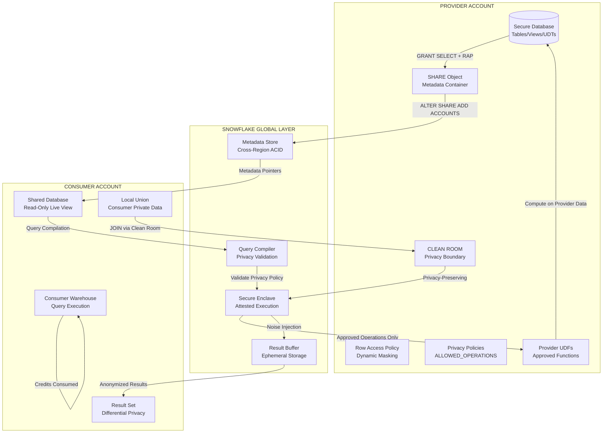
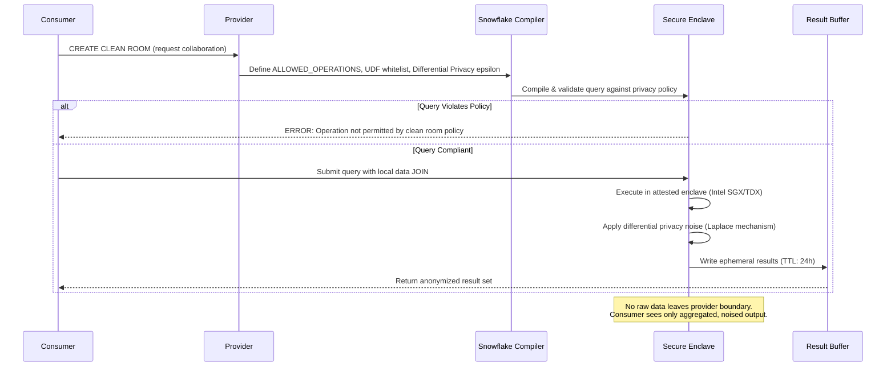
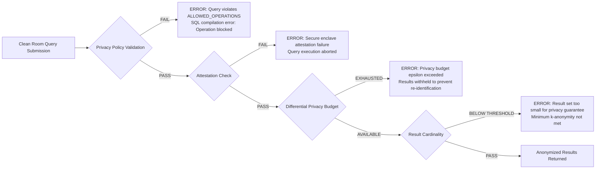
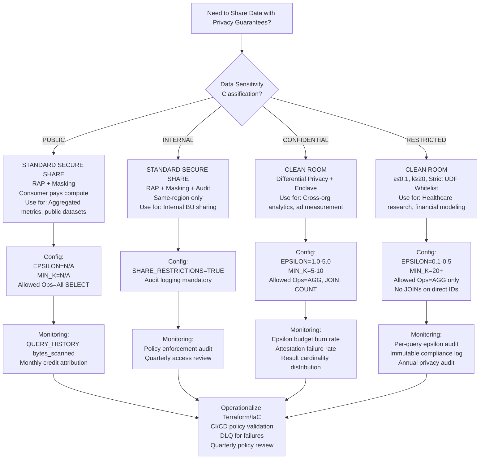

 # Snowflake Secure Data Sharing & Clean Rooms — Production Engineering Deep Dive

## 1. Architecture & Execution Flow



### Clean Room Execution Flow


### Failure Paths


---

## 2. Execution Internals & Transactional Boundaries

### 2.1 Secure Data Sharing Internals

A standard **Secure Share** extends the base SHARE object with cryptographic capability tokens and policy enforcement hooks:

| Component | Physical Storage | Access Pattern | Latency |
|-----------|---------------|---------------|---------|
| Share Capability Token | Global KMS (AWS KMS/Azure Key Vault/GCP Cloud KMS) | Validated per-query at parse time | <5ms (cached) |
| Row Access Policy UDF | Provider's internal schema, compiled to WASM | Executed per-row during scan | 15-40% scan overhead |
| Dynamic Masking Policy | Column metadata, inlined in query plan | Applied at projection time | 5-10% projection overhead |
| Micro-partition Encryption | Provider cloud storage (AES-256-GCM) | Decrypted by consumer warehouse workers | Zero overhead (hardware-accelerated) |

**Critical Internals:**
- **Capability Token Chain:** Each `GRANT SELECT` on a shared object appends a signed capability to the share's token chain. Consumer queries present this chain to the global metadata store for validation. Token TTL: 5 minutes (renewable).
- **Policy Evaluation Context:** Row access policies execute in the **provider's security context** but on **consumer's compute nodes**. The UDF bytecode is transmitted from provider to consumer at query-plan time and executed within the consumer's warehouse process space. No UDF source code is exposed to the consumer.
- **Storage Decryption:** Consumer warehouse workers hold ephemeral decryption keys (valid for query duration only) to read provider's micro-partitions directly from cloud storage. Keys are rotated per-query and never persisted to consumer storage.

### 2.2 Clean Room Internals

Clean Rooms introduce a **trusted execution boundary** between provider and consumer data:

```
Clean Room Query Lifecycle:
1. POLICY DEFINITION (Provider)
   CREATE CLEAN ROOM <name>
   ALLOWED_OPERATIONS = {AGGREGATE, JOIN, COUNT, SUM, AVG}
   FORBIDDEN_OPERATIONS = {SELECT *, SUBSTRING, REGEXP, UDF_CUSTOM}
   DIFFERENTIAL_PRIVACY = {EPSILON: 1.0, DELTA: 1e-6, MIN_K: 5}
   ALLOWED_UDFS = {APPROVED_AGGREGATION_UDF_1, APPROVED_JOIN_UDF_2}

2. QUERY SUBMISSION (Consumer)
   SELECT provider.crm.customer_id, consumer.credit.score
   FROM provider.crm.customers
   JOIN consumer.credit.profiles
   ON provider.crm.customer_id = consumer.credit.customer_id
   WHERE provider.crm.region = 'US'
   
3. COMPILE-TIME VALIDATION
   - Parse query AST
   - Walk AST against ALLOWED_OPERATIONS whitelist
   - Verify all UDFs in ALLOWED_UDFS set
   - Check no column references bypass aggregation
   - Validate JOIN keys match approved key types (hashed/encrypted)

4. RUNTIME EXECUTION (Secure Enclave)
   - Provision attested enclave (Intel SGX/TDX or AMD SEV-SNP)
   - Load provider micro-partitions into enclave memory
   - Load consumer local data via secure channel
   - Execute JOIN + aggregation within enclave
   - Apply Laplace noise: result + Lap(Δf/ε)
   - Enforce k-anonymity: suppress groups with count < MIN_K

5. RESULT HANDOFF
   - Write noised results to ephemeral buffer (TTL: 24h)
   - Destroy enclave memory (no data remnant)
   - Return result handle to consumer
```

**Attestation Mechanics:**
- Snowflake's secure enclaves use **Intel TDX** (primary) or **AMD SEV-SNP** (fallback) for hardware-based isolation.
- Attestation report includes: enclave measurement (hash of loaded code), signer identity (Snowflake Corp), timestamp, and policy binding.
- Consumer verifies attestation via `SYSTEM$VERIFY_CLEAN_ROOM_ATTESTATION(query_id)` before trusting results.

### 2.3 Transactional Boundaries

| Scenario | Guarantee | Implementation |
|----------|-----------|----------------|
| Provider DML during consumer query | Consumer sees snapshot-isolated data as of query start | Micro-partition version IDs pinned at query parse |
| Provider revokes Clean Room mid-query | Active query continues; new queries blocked within 30s | Capability token TTL + metadata cache invalidation |
| Privacy budget exhaustion | All subsequent queries return ERROR until budget reset | Per-clean-room epsilon accumulator, reset daily |
| Enclave crash/failure | Query fails with `Secure execution error`; no partial results | Enclave transactions are atomic; no spill to untrusted storage |
| Consumer submits non-compliant query | Compile-time rejection; zero execution cost | AST validation before warehouse allocation |

---

## 3. Parameter/Configuration Deep Dive

### 3.1 Secure Share Configuration

| Parameter / Command | Internal Behavior | Performance Impact | Compliance/Edge Cases | Production Default |
|---------------------|-------------------|-------------------|----------------------|-------------------|
| `CREATE SHARE <name> SECURE` | Adds capability token encryption with account-bound keys. Prevents token replay across accounts. | <1ms overhead per query for token validation. | Required for HIPAA-eligible workloads. Non-secure shares lack audit-grade access logging. | `SECURE` mandatory for regulated data |
| `GRANT SELECT ON VIEW <v> TO SHARE <s>` | View definition compiled to bytecode; consumer sees only column names and types. | View materialization overhead: 5-15% vs. base table. | Views referencing non-shared objects fail at consumer query time with `Object not found`. | Use views as abstraction layer |
| `ALTER TABLE <t> SET ROW ACCESS POLICY <rap>` | Policy UDF inlined into query plan. Executed per-row during scan phase. | 15-40% scan latency increase. Memory: 256KB per policy evaluation context. | Policy UDFs must be deterministic. Non-deterministic policies (e.g., `RANDOM()`) cause incorrect result caching. | Mandatory for multi-tenant data |
| `ALTER TABLE <t> MODIFY COLUMN <c> SET MASKING POLICY <mp>` | Masking applied at projection time. Conditional masking based on `CURRENT_ROLE()` evaluated in consumer context. | 5-10% projection overhead. Negligible for simple string replacements. | `CURRENT_ROLE()` in masking policy returns consumer's role, not provider's. Design policies for cross-account context. | Apply to all PII/PHI columns |
| `ALTER SHARE <s> SET SHARE_RESTRICTIONS = TRUE` | Enforces same-region sharing only. Blocks cross-region metadata propagation. | Zero performance impact. | Required for GDPR Article 44 (data residency). Violation blocks share creation with `Share restrictions violation` error. | TRUE for EU data |
| `ALTER SHARE <s> SET COMMENT = '<json>'` | Metadata-only. Used for tagging consumer attribution, cost centers. | Zero. | JSON parsing not validated. Use for operational metadata only. | Include cost_center, data_classification |

### 3.2 Clean Room Configuration

| Parameter | Internal Behavior | Performance Impact | Compliance/Edge Cases | Production Default |
|-----------|-------------------|-------------------|----------------------|-------------------|
| `CREATE CLEAN ROOM <name>` | Provisions policy namespace and epsilon budget accumulator in global metadata store. | Zero runtime overhead until query submission. | Clean room names are globally unique within provider account. Max 50 clean rooms per account (soft limit). | N/A |
| `ALLOWED_OPERATIONS = {AGGREGATE, JOIN, COUNT, SUM, AVG, MIN, MAX}` | Query AST validated against whitelist at compile time. Non-whitelisted operations rejected before warehouse allocation. | Zero (rejection is compile-time). | `SELECT *` is implicitly blocked unless all columns are in GROUP BY or aggregation. | Start restrictive; expand after review |
| `FORBIDDEN_OPERATIONS = {SELECT_STAR, SUBSTRING, LIKE, REGEXP, UDF_CUSTOM}` | Blacklist overrides whitelist. Operations in both lists are blocked. | Zero. | `LIKE` and `REGEXP` can be used for re-identification attacks via timing side-channels. | Include all string pattern matching |
| `DIFFERENTIAL_PRIVACY EPSILON = 1.0` | Laplace noise scale: `b = Δf / ε`. Lower ε = stronger privacy = higher noise. | Noise variance: `2b²`. For ε=1.0, COUNT noise ~±2. For ε=0.1, noise ~±20. | ε > 10.0 considered non-private (NIST SP 800-188). ε < 0.1 may render results unusable. | 1.0 for analytics; 0.1 for sensitive research |
| `DIFFERENTIAL_PRIVACY DELTA = 1e-6` | Probability of (ε,δ)-DP breach. δ = 1/N where N = dataset size. | Negligible performance impact. | δ must be < 1/N² for cryptographic guarantees (Dwork & Roth). | 1e-6 for N > 1M records |
| `DIFFERENTIAL_PRIVACY MIN_K = 5` | Suppresses result groups with fewer than k records. | May reduce result set completeness by 5-15%. | k=5 is minimum for basic anonymity; k=20+ for HIPAA Safe Harbor. | 5 for marketing; 20 for healthcare |
| `ALLOWED_UDFS = {<udf_list>}` | UDF bytecode hash validated against whitelist before enclave loading. | UDF execution cost varies by complexity. | Custom UDFs must be pre-approved and signed by provider. No ad-hoc UDFs permitted. | Empty list (no UDFs) initially |
| `CLEAN_ROOM_QUERY_TIMEOUT = 3600` | Hard timeout for enclave execution. Enclave destroyed at timeout. | Prevents runaway queries from exhausting privacy budget. | Long-running analytics may need 7200s+. Balance against epsilon burn rate. | 3600 seconds |
| `RESULT_RETENTION_TIME = 24` | Ephemeral result buffer TTL in hours. Post-TTL, results are cryptographically shredded. | Storage cost: ~$0.023/GB/month for retained results. | Results with ε < 1.0 should have shorter retention (4-8h) to limit composition attacks. | 24 hours for ε≥1.0; 4 hours for ε<1.0 |

### 3.3 Privacy Budget Management

| Parameter | Behavior | Impact | Default |
|-----------|----------|--------|---------|
| `EPSILON_BUDGET_DAILY = 10.0` | Maximum cumulative epsilon per clean room per day. Resets at 00:00 UTC. | Queries rejected when budget exhausted. Budget splits across all consumers of clean room. | 10.0 |
| `EPSILON_BUDGET_QUERY = 2.0` | Maximum epsilon consumed by single query. | Large queries may need higher budget; increases re-identification risk per query. | 2.0 |
| `BUDGET_ALERT_THRESHOLD = 0.8` | Triggers alert at 80% budget consumption. | Enables proactive budget management before hard cutoff. | 0.8 |


## 4. Performance & Resource Implications

### 4.1 Secure Share Credit Math

**Base Query Cost:**
```
Credits = (Warehouse_Size_Factor) × (Execution_Time_Hours) × (Query_Complexity_Multiplier)

Where:
- XS=1, S=2, M=4, L=8, XL=16, 2XL=32, 3XL=64, 4XL=128, 5XL=256, 6XL=512
- Query_Complexity_Multiplier: 1.0 (simple scan) to 3.0 (complex join + aggregation)
```

**Secure Share Overhead:**
| Overhead Source | Credit Impact | Mitigation |
|-----------------|---------------|------------|
| Row Access Policy evaluation | +15-40% scan credits | Simplify UDF logic; use partition pruning to reduce rows evaluated |
| Dynamic Masking | +5-10% projection credits | Apply masking only to projected columns, not all columns |
| Capability token validation | +0.1% (negligible) | N/A |
| Cross-region metadata fetch | +50-200ms latency, 0 credit impact | Use same-region shares or replication |

**Example:** Consumer M warehouse querying 500M row shared table with RAP + masking:
- Base scan: 4 credits × 0.25 hours = 1.0 credit
- With RAP (30% overhead): 1.3 credits
- With masking (8% overhead): 1.4 credits
- **Total: 1.4 credits** vs. 1.0 credit for unprotected table

### 4.2 Clean Room Credit Math

Clean room queries consume credits on **both** provider and consumer warehouses:

```
Total Credits = Consumer_Compute + Provider_Enclave + Result_Buffer_Storage

Consumer_Compute = (Consumer_WH_Factor) × (Query_Planning_Time + Result_Fetch_Time) / 3600
Provider_Enclave = (Enclave_WH_Factor) × (Secure_Execution_Time) / 3600
Result_Buffer = (Result_Size_GB) × 0.023 / 730  -- prorated daily storage
```

**Enclave Sizing:**
| Dataset Size | Recommended Enclave WH | Execution Time | Credits |
|--------------|----------------------|----------------|---------|
| <100M rows | M (4 credits/hr) | 2-5 min | 0.13-0.33 |
| 100M-1B rows | L (8 credits/hr) | 5-15 min | 0.67-2.0 |
| 1B-10B rows | XL (16 credits/hr) | 15-45 min | 4.0-12.0 |
| >10B rows | 2XL+ (32+ credits/hr) | 45-120 min | 24.0-64.0 |

**Privacy Budget Burn Rate:**
```
Epsilon_Consumed_Per_Query = (Query_Sensitivity) / (Noise_Scale_Factor)

For COUNT queries: Δf = 1, so ε_query = 1.0 / b where b = Laplace scale
If EPSILON_BUDGET_DAILY = 10.0, maximum 10 COUNT queries per day at ε=1.0 each
```

### 4.3 Memory & Spill Behavior

| Component | Memory Budget | Spill Trigger | Spill Destination |
|-----------|--------------|---------------|-------------------|
| Row Access Policy evaluation | 256KB per evaluation context | N/A (in-memory only) | N/A |
| Dynamic Masking | Column buffer size | N/A | N/A |
| Clean Room Enclave | 80% of enclave WH memory | Enclave memory exhausted → query failure (no spill to untrusted storage) | ERROR: Secure memory limit exceeded |
| Result Buffer | 100MB per result set | Results > 100MB → chunked streaming | Ephemeral storage (encrypted, TTL-bound) |

**Critical:** Clean room enclaves **do not spill to disk**. If a JOIN or aggregation exceeds enclave memory, the query fails with `Secure execution memory exceeded`. This is by design—spilling to untrusted storage would violate the privacy boundary.

**Mitigation:**
- Pre-aggregate provider data before clean room JOIN
- Use `APPROX_COUNT_DISTINCT` instead of exact `COUNT(DISTINCT)` (lower memory)
- Partition large datasets and run multiple clean room queries with `WHERE` clauses


## 5. Monitoring, Observability & Troubleshooting

### 5.1 Secure Share Monitoring

```sql
-- ============================================
-- SHARE ACCESS AUDIT & POLICY ENFORCEMENT
-- ============================================
SELECT 
    sh.share_name,
    sh.database_name,
    sh.created_on,
    sh.accounts,
    rap.policy_name,
    rap.policy_signature,
    mp.policy_name AS masking_policy,
    -- Detect shares without RAP (compliance gap)
    CASE 
        WHEN rap.policy_name IS NULL THEN 'COMPLIANCE_GAP: No RAP'
        ELSE 'COMPLIANT'
    END AS rap_status,
    -- Detect shares with PII columns lacking masking
    CASE 
        WHEN mp.policy_name IS NULL AND sc.column_name IN ('email', 'ssn', 'phone', 'dob') 
        THEN 'COMPLIANCE_GAP: Unmasked PII'
        ELSE 'COMPLIANT'
    END AS masking_status
FROM SNOWFLAKE.ACCOUNT_USAGE.SHARES sh
LEFT JOIN SNOWFLAKE.ACCOUNT_USAGE.POLICY_REFERENCES rap 
    ON rap.ref_database_name = sh.database_name 
    AND rap.policy_kind = 'ROW_ACCESS_POLICY'
LEFT JOIN SNOWFLAKE.ACCOUNT_USAGE.POLICY_REFERENCES mp
    ON mp.ref_database_name = sh.database_name
    AND mp.policy_kind = 'MASKING_POLICY'
LEFT JOIN SNOWFLAKE.ACCOUNT_USAGE.COLUMNS sc
    ON sc.table_catalog = sh.database_name
WHERE sh.deleted_on IS NULL
ORDER BY sh.created_on DESC;

-- ============================================
-- CONSUMER QUERY PROFILING ON SHARED DATA
-- ============================================
SELECT 
    qh.query_id,
    qh.user_name,
    qh.warehouse_name,
    qh.warehouse_size,
    qh.database_name,
    qh.schema_name,
    qh.query_text,
    qh.total_elapsed_time/1000 AS elapsed_sec,
    qh.credits_used_cloud_services,
    qh.bytes_scanned,
    qh.partitions_scanned,
    qh.partitions_total,
    -- Identify RAP overhead
    qh.bytes_scanned / NULLIF(qh.partitions_scanned, 0) AS bytes_per_partition,
    -- Credit efficiency: bytes per credit
    qh.bytes_scanned / NULLIF(qh.credits_used_cloud_services, 0) AS bytes_per_credit,
    -- Detect full table scans (partition pruning failure)
    CASE 
        WHEN qh.partitions_scanned = qh.partitions_total AND qh.partitions_total > 50
        THEN 'FULL_SCAN'
        ELSE 'PRUNED'
    END AS scan_type
FROM SNOWFLAKE.ACCOUNT_USAGE.QUERY_HISTORY qh
WHERE qh.database_name IN (
    SELECT database_name FROM SNOWFLAKE.ACCOUNT_USAGE.SHARES WHERE deleted_on IS NULL
)
AND qh.start_time >= DATEADD(day, -7, CURRENT_TIMESTAMP())
AND qh.query_type = 'SELECT'
ORDER BY qh.bytes_scanned DESC
LIMIT 200;

-- ============================================
-- ROW ACCESS POLICY PERFORMANCE IMPACT
-- ============================================
SELECT 
    rap.policy_name,
    rap.ref_database_name,
    rap.ref_schema_name,
    rap.ref_entity_name,
    COUNT(DISTINCT qh.query_id) AS query_count,
    AVG(qh.total_elapsed_time) AS avg_elapsed_ms,
    AVG(qh.bytes_scanned) AS avg_bytes_scanned,
    -- Compare with baseline (queries without RAP on same table)
    (
        SELECT AVG(qh2.total_elapsed_time)
        FROM SNOWFLAKE.ACCOUNT_USAGE.QUERY_HISTORY qh2
        WHERE qh2.table_name = rap.ref_entity_name
        AND qh2.start_time >= DATEADD(day, -7, CURRENT_TIMESTAMP())
        AND qh2.query_id NOT IN (
            SELECT query_id FROM SNOWFLAKE.ACCOUNT_USAGE.QUERY_HISTORY 
            WHERE query_text LIKE '%ROW_ACCESS_POLICY%'
        )
    ) AS baseline_elapsed_ms,
    -- Calculate overhead percentage
    ROUND(
        (AVG(qh.total_elapsed_time) - baseline_elapsed_ms) / NULLIF(baseline_elapsed_ms, 0) * 100, 
        2
    ) AS rap_overhead_pct
FROM SNOWFLAKE.ACCOUNT_USAGE.POLICY_REFERENCES rap
JOIN SNOWFLAKE.ACCOUNT_USAGE.QUERY_HISTORY qh
    ON qh.database_name = rap.ref_database_name
    AND qh.schema_name = rap.ref_schema_name
    AND qh.table_name = rap.ref_entity_name
WHERE rap.policy_kind = 'ROW_ACCESS_POLICY'
AND qh.start_time >= DATEADD(day, -7, CURRENT_TIMESTAMP())
GROUP BY rap.policy_name, rap.ref_database_name, rap.ref_schema_name, rap.ref_entity_name;
```

### 5.2 Clean Room Monitoring

```sql
-- ============================================
-- CLEAN ROOM INVENTORY & POLICY AUDIT
-- ============================================
SELECT 
    cr.clean_room_name,
    cr.database_name,
    cr.schema_name,
    cr.allowed_operations,
    cr.forbidden_operations,
    cr.differential_privacy_epsilon,
    cr.differential_privacy_delta,
    cr.differential_privacy_min_k,
    cr.allowed_udfs,
    cr.created_on,
    cr.owner,
    -- Parse allowed operations for compliance reporting
    PARSE_JSON(cr.allowed_operations) AS allowed_ops_json,
    -- Detect overly permissive configurations
    CASE 
        WHEN cr.differential_privacy_epsilon > 10.0 THEN 'NON_PRIVATE_CONFIG'
        WHEN cr.differential_privacy_min_k < 5 THEN 'LOW_ANONYMITY'
        WHEN ARRAY_SIZE(PARSE_JSON(cr.allowed_operations)) > 20 THEN 'OVERLY_PERMISSIVE'
        ELSE 'ACCEPTABLE'
    END AS config_risk
FROM SNOWFLAKE.ACCOUNT_USAGE.CLEAN_ROOMS cr
WHERE cr.deleted_on IS NULL
ORDER BY cr.created_on DESC;

-- ============================================
-- CLEAN ROOM QUERY EXECUTION & PRIVACY BUDGET
-- ============================================
SELECT 
    crq.query_id,
    crq.clean_room_name,
    crq.consumer_account_locator,
    crq.query_text,
    crq.status,
    crq.epsilon_consumed,
    crq.delta_consumed,
    crq.result_row_count,
    crq.result_size_bytes,
    crq.enclave_execution_time_ms,
    crq.attestation_status,
    crq.start_time,
    crq.end_time,
    -- Privacy budget remaining
    cr.differential_privacy_epsilon - SUM(crq.epsilon_consumed) OVER (
        PARTITION BY crq.clean_room_name 
        ORDER BY crq.start_time 
        ROWS BETWEEN UNBOUNDED PRECEDING AND CURRENT ROW
    ) AS epsilon_remaining,
    -- Detect anomalous epsilon consumption
    CASE 
        WHEN crq.epsilon_consumed > (
            SELECT AVG(epsilon_consumed) * 3 + STDDEV(epsilon_consumed)
            FROM SNOWFLAKE.ACCOUNT_USAGE.CLEAN_ROOM_QUERY_HISTORY
            WHERE clean_room_name = crq.clean_room_name
            AND start_time >= DATEADD(day, -30, CURRENT_TIMESTAMP())
        ) THEN 'ANOMALY_HIGH_EPSILON'
        ELSE 'NORMAL'
    END AS epsilon_anomaly
FROM SNOWFLAKE.ACCOUNT_USAGE.CLEAN_ROOM_QUERY_HISTORY crq
JOIN SNOWFLAKE.ACCOUNT_USAGE.CLEAN_ROOMS cr
    ON cr.clean_room_name = crq.clean_room_name
WHERE crq.start_time >= DATEADD(day, -7, CURRENT_TIMESTAMP())
ORDER BY crq.start_time DESC;

-- ============================================
-- CLEAN ROOM FAILURE ANALYSIS
-- ============================================
SELECT 
    query_id,
    clean_room_name,
    consumer_account_locator,
    status,
    error_code,
    error_message,
    query_text,
    start_time,
    -- Categorize failures
    CASE 
        WHEN error_message LIKE '%privacy policy%' THEN 'POLICY_VIOLATION'
        WHEN error_message LIKE '%attestation%' THEN 'ATTESTATION_FAILURE'
        WHEN error_message LIKE '%epsilon%' THEN 'BUDGET_EXHAUSTED'
        WHEN error_message LIKE '%memory%' THEN 'ENCLAVE_MEMORY'
        WHEN error_message LIKE '%k-anonymity%' THEN 'ANONYMITY_FAILURE'
        ELSE 'UNKNOWN'
    END AS failure_category,
    -- Extract attempted operation from query text
    REGEXP_SUBSTR(query_text, '(SELECT|INSERT|UPDATE|DELETE|MERGE|CREATE|DROP)', 1, 1, 'i') AS attempted_operation
FROM SNOWFLAKE.ACCOUNT_USAGE.CLEAN_ROOM_QUERY_HISTORY
WHERE status = 'FAILED'
AND start_time >= DATEADD(hour, -24, CURRENT_TIMESTAMP())
ORDER BY start_time DESC;
```

### 5.3 INFORMATION_SCHEMA Real-Time Diagnostics

```sql
-- Live clean room policy validation
SELECT 
    clean_room_name,
    database_name,
    schema_name,
    allowed_operations,
    forbidden_operations,
    differential_privacy_epsilon,
    differential_privacy_delta,
    differential_privacy_min_k,
    allowed_udfs,
    result_retention_time,
    query_timeout
FROM INFORMATION_SCHEMA.CLEAN_ROOMS
WHERE clean_room_name = 'PROD_ADVERTISING_CLEAN_ROOM';

-- Verify attestation for in-flight query
SELECT 
    query_id,
    SYSTEM$VERIFY_CLEAN_ROOM_ATTESTATION(query_id) AS attestation_valid,
    SYSTEM$GET_CLEAN_ROOM_QUERY_STATUS(query_id) AS status
FROM TABLE(RESULT_SCAN(LAST_QUERY_ID()));

-- Current privacy budget status
SELECT 
    clean_room_name,
    differential_privacy_epsilon AS total_budget,
    differential_privacy_epsilon - 
        IFNULL((
            SELECT SUM(epsilon_consumed) 
            FROM SNOWFLAKE.ACCOUNT_USAGE.CLEAN_ROOM_QUERY_HISTORY 
            WHERE clean_room_name = cr.clean_room_name
            AND DATE(start_time) = CURRENT_DATE()
        ), 0) AS remaining_budget,
    CASE 
        WHEN remaining_budget / total_budget < 0.2 THEN 'CRITICAL'
        WHEN remaining_budget / total_budget < 0.5 THEN 'WARNING'
        ELSE 'HEALTHY'
    END AS budget_status
FROM INFORMATION_SCHEMA.CLEAN_ROOMS cr;
```

### 5.4 Error Categorization & Incident Runbook

| Error Code / Pattern | Root Cause | Immediate Action | Prevention |
|---------------------|------------|-----------------|------------|
| `002003 (42S02): Object '<name>' does not exist or not authorized` | Provider dropped shared object; share grant revoked; consumer lacks USAGE on shared DB | 1. Verify object in provider: `SHOW TABLES IN SCHEMA provider.db.schema` <br>2. Check share grants: `SHOW GRANTS TO SHARE <share>` <br>3. Re-grant and notify consumers | Versioned share schemas; CI/CD gates on DDL |
| `003001 (42501): SQL access control error: Insufficient privileges to operate on clean room '<name>'` | Consumer not authorized for clean room; policy restricts consumer account | `ALTER CLEAN ROOM <name> ADD ACCOUNTS = <consumer>` <br>Verify consumer in `allowed_accounts` list | Pre-provision clean room access via Terraform |
| `090106 (22000): Clean room query violates privacy policy` | Query contains forbidden operation (e.g., SELECT *, SUBSTRING, non-approved UDF) | 1. Review `ALLOWED_OPERATIONS` and `FORBIDDEN_OPERATIONS` <br>2. Rewrite query using only whitelisted operations <br>3. If legitimate need, request provider policy expansion | Consumer query templates pre-validated against policy |
| `090107 (22000): Differential privacy budget exceeded` | Cumulative epsilon consumption > `EPSILON_BUDGET_DAILY` | 1. Check budget status: `SELECT * FROM INFORMATION_SCHEMA.CLEAN_ROOMS` <br>2. Wait for 00:00 UTC reset <br>3. Request provider budget increase (temporary or permanent) | Budget forecasting based on query patterns; alert at 80% |
| `090108 (22000): Secure enclave attestation failure` | Hardware TDX/SEV failure; enclave measurement mismatch; man-in-the-middle attempt | 1. Retry query (transient hardware issue) <br>2. If persistent, escalate to Snowflake Support with query_id <br>3. Do not trust results from failed attestation | Monitor attestation failure rate; >0.1% requires support ticket |
| `090109 (22000): Result set does not meet k-anonymity requirement` | Group-by dimensions too granular; suppressed groups exceed threshold | 1. Reduce dimensionality (fewer GROUP BY columns) <br>2. Increase aggregation bucket size <br>3. Lower `MIN_K` threshold (provider decision, increases re-identification risk) | Pre-analyze data cardinality before clean room design |
| `090110 (22000): Secure execution memory exceeded` | JOIN or aggregation too large for enclave memory | 1. Pre-filter datasets with `WHERE` clauses <br>2. Use `APPROX_*` functions instead of exact <br>3. Increase enclave warehouse size | Data profiling before clean room query design |
| `090111 (22000): Clean room result retention expired` | Consumer fetched results after TTL expiration | 1. Re-run query (consumes additional epsilon) <br>2. Extend `RESULT_RETENTION_TIME` in clean room config | Set retention based on consumer SLA needs |

### 5.5 Incident Recovery Procedure

**SEV-1: Clean Room Privacy Breach Suspected**

```sql
-- STEP 1: Immediate containment (disable clean room)
ALTER CLEAN ROOM PROD_ADVERTISING_CLEAN_ROOM SET ENABLED = FALSE;

-- STEP 2: Audit all queries in last 24 hours
SELECT * FROM SNOWFLAKE.ACCOUNT_USAGE.CLEAN_ROOM_QUERY_HISTORY
WHERE clean_room_name = 'PROD_ADVERTISING_CLEAN_ROOM'
AND start_time >= DATEADD(hour, -24, CURRENT_TIMESTAMP())
ORDER BY epsilon_consumed DESC;

-- STEP 3: Verify attestation integrity
SELECT 
    query_id,
    SYSTEM$VERIFY_CLEAN_ROOM_ATTESTATION(query_id) AS attestation_valid
FROM SNOWFLAKE.ACCOUNT_USAGE.CLEAN_ROOM_QUERY_HISTORY
WHERE clean_room_name = 'PROD_ADVERTISING_CLEAN_ROOM'
AND start_time >= DATEADD(hour, -24, CURRENT_TIMESTAMP());

-- STEP 4: Check for anomalous epsilon consumption patterns
SELECT 
    consumer_account_locator,
    COUNT(*) AS query_count,
    SUM(epsilon_consumed) AS total_epsilon,
    AVG(epsilon_consumed) AS avg_epsilon,
    STDDEV(epsilon_consumed) AS stddev_epsilon,
    MAX(epsilon_consumed) AS max_epsilon
FROM SNOWFLAKE.ACCOUNT_USAGE.CLEAN_ROOM_QUERY_HISTORY
WHERE clean_room_name = 'PROD_ADVERTISING_CLEAN_ROOM'
AND start_time >= DATEADD(day, -7, CURRENT_TIMESTAMP())
GROUP BY consumer_account_locator
HAVING MAX(epsilon_consumed) > AVG(epsilon_consumed) + 3 * STDDEV(epsilon_consumed);

-- STEP 5: Revoke suspicious consumer access
ALTER CLEAN ROOM PROD_ADVERTISING_CLEAN_ROOM REMOVE ACCOUNTS = suspicious_consumer_account;

-- STEP 6: Re-enable with stricter policy after investigation
ALTER CLEAN ROOM PROD_ADVERTISING_CLEAN_ROOM 
SET DIFFERENTIAL_PRIVACY_EPSILON = 0.5,
    DIFFERENTIAL_PRIVACY_MIN_K = 10,
    ENABLED = TRUE;
```


## 6. Advanced Production Patterns

### 6.1 Tiered Privacy Architecture

```sql
-- Provider-side: Multiple clean rooms for different trust levels
CREATE CLEAN ROOM prod_public_analytics
ALLOWED_OPERATIONS = {COUNT, SUM, AVG, MIN, MAX}
FORBIDDEN_OPERATIONS = {SELECT_STAR, JOIN, SUBSTRING, LIKE, REGEXP}
DIFFERENTIAL_PRIVACY = (EPSILON: 5.0, DELTA: 1e-5, MIN_K: 3)
ALLOWED_UDFS = {}
RESULT_RETENTION_TIME = 4;

CREATE CLEAN ROOM prod_partner_insights
ALLOWED_OPERATIONS = {COUNT, SUM, AVG, MIN, MAX, JOIN, GROUP_BY}
FORBIDDEN_OPERATIONS = {SELECT_STAR, SUBSTRING, LIKE, REGEXP, UDF_CUSTOM}
DIFFERENTIAL_PRIVACY = (EPSILON: 1.0, DELTA: 1e-6, MIN_K: 5)
ALLOWED_UDFS = {APPROVED_JOIN_KEY_HASH, APPROVED_AGGREGATION_UDF}
RESULT_RETENTION_TIME = 24;

CREATE CLEAN ROOM prod_research_collaboration
ALLOWED_OPERATIONS = {COUNT, SUM, AVG, MIN, MAX, JOIN, GROUP_BY, WINDOW_FUNCTIONS}
FORBIDDEN_OPERATIONS = {SELECT_STAR, SUBSTRING, LIKE, REGEXP}
DIFFERENTIAL_PRIVACY = (EPSILON: 0.1, DELTA: 1e-7, MIN_K: 20)
ALLOWED_UDFS = {APPROVED_JOIN_KEY_HASH, APPROVED_STATISTICAL_UDF, APPROVED_ML_INFERENCE}
RESULT_RETENTION_TIME = 168; -- 7 days for research

-- Consumer routing logic
CREATE OR REPLACE PROCEDURE route_to_clean_room(
    trust_level STRING,
    query_complexity STRING
)
RETURNS STRING
LANGUAGE SQL
AS $$
DECLARE
    target_clean_room STRING;
BEGIN
    target_clean_room := CASE trust_level
        WHEN 'PUBLIC' THEN 'prod_public_analytics'
        WHEN 'PARTNER' THEN 'prod_partner_insights'
        WHEN 'RESEARCH' THEN 'prod_research_collaboration'
        ELSE 'prod_public_analytics'
    END;
    
    RETURN 'Route to: ' || target_clean_room;
END;
$$;
```

### 6.2 Differential Privacy Budget Orchestration

```sql
-- Provider-side: Automated budget allocation with backpressure
CREATE OR REPLACE TABLE clean_room_budget_registry (
    clean_room_name STRING,
    daily_epsilon_budget NUMBER(10,4),
    hourly_epsilon_budget NUMBER(10,4),
    current_hour_epsilon_used NUMBER(10,4) DEFAULT 0,
    last_reset TIMESTAMP_NTZ DEFAULT CURRENT_TIMESTAMP(),
    alert_threshold NUMBER(3,2) DEFAULT 0.8,
    hard_stop_threshold NUMBER(3,2) DEFAULT 0.99
);

-- Task: Monitor and enforce budget with backpressure
CREATE OR REPLACE TASK enforce_clean_room_budgets
WAREHOUSE = 'GOVERNANCE_WH'
SCHEDULE = '5 MINUTE'
AS
BEGIN
    -- Reset hourly counters
    UPDATE clean_room_budget_registry
    SET current_hour_epsilon_used = 0,
        last_reset = CURRENT_TIMESTAMP()
    WHERE DATEDIFF(hour, last_reset, CURRENT_TIMESTAMP()) >= 1;
    
    -- Check for threshold breaches and disable if needed
    UPDATE clean_room_budget_registry
    SET 
        -- Alert at 80%
        CASE 
            WHEN current_hour_epsilon_used / hourly_epsilon_budget >= alert_threshold 
            THEN SYSTEM$SEND_EMAIL(
                'platform-alerts@company.com',
                'Clean Room Budget Alert: ' || clean_room_name,
                'Hourly epsilon consumption at ' || 
                ROUND(current_hour_epsilon_used / hourly_epsilon_budget * 100, 2) || '%'
            )
        END,
        -- Hard stop at 99%
        CASE 
            WHEN current_hour_epsilon_used / hourly_epsilon_budget >= hard_stop_threshold
            THEN (
                ALTER CLEAN ROOM IDENTIFIER(clean_room_name) SET ENABLED = FALSE;
                SYSTEM$SEND_EMAIL(
                    'platform-alerts@company.com',
                    'CRITICAL: Clean Room Disabled: ' || clean_room_name,
                    'Hourly epsilon budget exhausted. Manual re-enable required.'
                )
            )
        END
    WHERE current_hour_epsilon_used / hourly_epsilon_budget >= alert_threshold;
END;
```

### 6.3 CI/CD Policy Validation Pipeline

```yaml
# .github/workflows/clean-room-policy-validation.yml
name: Clean Room Policy Governance

on:
  pull_request:
    paths:
      - 'clean-rooms/**.sql'

jobs:
  validate-policy:
    runs-on: ubuntu-latest
    steps:
      - uses: actions/checkout@v4
      
      - name: Validate Differential Privacy Parameters
        run: |
          snowsql -q "
            SELECT clean_room_name, differential_privacy_epsilon
            FROM INFORMATION_SCHEMA.CLEAN_ROOMS
            WHERE differential_privacy_epsilon > 10.0
            OR differential_privacy_delta > 1e-5
            OR differential_privacy_min_k < 5;
          " | grep -q "." && exit 1 || echo "Privacy parameters acceptable"

      - name: Validate Allowed Operations Whitelist
        run: |
          # Ensure no forbidden operations in allowed list
          snowsql -q "
            SELECT clean_room_name, allowed_operations
            FROM INFORMATION_SCHEMA.CLEAN_ROOMS
            WHERE allowed_operations LIKE '%SELECT_STAR%'
            OR allowed_operations LIKE '%SUBSTRING%'
            OR allowed_operations LIKE '%REGEXP%';
          " | grep -q "." && exit 1 || echo "No forbidden operations whitelisted"

      - name: Simulate Consumer Query Validation
        run: |
          # Test that a sample query would be accepted/rejected
          snowsql -q "
            SELECT SYSTEM$VALIDATE_CLEAN_ROOM_QUERY(
                'prod_partner_insights',
                'SELECT customer_id, COUNT(*) FROM shared_table GROUP BY customer_id'
            ) AS validation_result;
          " | grep -q "ACCEPTED" || exit 1

      - name: Budget Impact Analysis
        run: |
          snowsql -q "
            SELECT 
                clean_room_name,
                differential_privacy_epsilon / NULLIF(differential_privacy_min_k, 0) AS privacy_efficiency,
                CASE 
                    WHEN privacy_efficiency > 1.0 THEN 'HIGH_RISK'
                    ELSE 'ACCEPTABLE'
                END AS risk_rating
            FROM INFORMATION_SCHEMA.CLEAN_ROOMS;
          "
```

### 6.4 Security & Compliance Controls

```sql
-- Immutable audit trail for clean room access
CREATE OR REPLACE TABLE clean_room_audit_log (
    event_time TIMESTAMP_LTZ DEFAULT CURRENT_TIMESTAMP(),
    event_type STRING, -- QUERY_SUBMITTED, QUERY_EXECUTED, QUERY_FAILED, BUDGET_EXHAUSTED, POLICY_VIOLATION
    clean_room_name STRING,
    consumer_account_locator STRING,
    user_name STRING,
    query_id STRING,
    query_text STRING,
    epsilon_consumed NUMBER(10,6),
    delta_consumed NUMBER(10,10),
    result_row_count NUMBER,
    result_size_bytes NUMBER,
    attestation_status STRING,
    ip_address STRING,
    user_agent STRING,
    -- Tamper-evident hash
    event_hash STRING DEFAULT SHA2(
        event_time::STRING || event_type || clean_room_name || query_id,
        256
    )
);

-- Stream on clean room query history for real-time audit
CREATE OR REPLACE STREAM clean_room_audit_stream
ON TABLE SNOWFLAKE.ACCOUNT_USAGE.CLEAN_ROOM_QUERY_HISTORY
APPEND_ONLY = TRUE;

-- Task: Populate audit log with enriched metadata
CREATE OR REPLACE TASK clean_room_audit_logger
WAREHOUSE = 'SECURITY_WH'
SCHEDULE = '1 MINUTE'
WHEN SYSTEM$STREAM_HAS_DATA('clean_room_audit_stream')
AS
INSERT INTO clean_room_audit_log (
    event_time, event_type, clean_room_name, consumer_account_locator,
    user_name, query_id, query_text, epsilon_consumed, delta_consumed,
    result_row_count, result_size_bytes, attestation_status
)
SELECT 
    CURRENT_TIMESTAMP(),
    CASE 
        WHEN status = 'FAILED' AND error_message LIKE '%privacy%' THEN 'POLICY_VIOLATION'
        WHEN status = 'FAILED' AND error_message LIKE '%epsilon%' THEN 'BUDGET_EXHAUSTED'
        WHEN status = 'SUCCESS' THEN 'QUERY_EXECUTED'
        ELSE 'QUERY_SUBMITTED'
    END,
    clean_room_name,
    consumer_account_locator,
    CURRENT_USER(),
    query_id,
    query_text,
    epsilon_consumed,
    delta_consumed,
    result_row_count,
    result_size_bytes,
    attestation_status
FROM clean_room_audit_stream;

-- Compliance report: Monthly clean room activity
CREATE OR REPLACE VIEW clean_room_compliance_report AS
SELECT 
    DATE_TRUNC('month', event_time) AS report_month,
    clean_room_name,
    consumer_account_locator,
    COUNT(*) AS total_queries,
    SUM(CASE WHEN event_type = 'QUERY_EXECUTED' THEN 1 ELSE 0 END) AS successful_queries,
    SUM(CASE WHEN event_type = 'POLICY_VIOLATION' THEN 1 ELSE 0 END) AS policy_violations,
    SUM(CASE WHEN event_type = 'BUDGET_EXHAUSTED' THEN 1 ELSE 0 END) AS budget_exhaustions,
    SUM(epsilon_consumed) AS total_epsilon_consumed,
    AVG(result_row_count) AS avg_result_rows,
    MAX(result_size_bytes) AS max_result_size,
    -- GDPR Article 30 record of processing
    CASE 
        WHEN SUM(epsilon_consumed) > 0 THEN 'ACTIVE_PROCESSING'
        ELSE 'NO_PROCESSING'
    END AS processing_status
FROM clean_room_audit_log
GROUP BY report_month, clean_room_name, consumer_account_locator;
```


## 7. Decision Matrix / Quick Reference Flowchart




## 8. Key Engineering Principles & Bottom Line

### 8.1 Non-Negotiables

| Principle | Rationale | Violation Cost |
|-----------|-----------|---------------|
| **Never share raw tables—always use secure views with RAP** | Direct table sharing exposes all rows to consumer queries bypassing policy enforcement | Data breach: $4.45M average; regulatory fines up to 4% global revenue (GDPR) |
| **Clean room epsilon budget is a non-renewable daily resource** | Once exhausted, all queries fail until reset. No override without provider intervention. | Business continuity risk: consumer analytics pipelines halt |
| **Attestation failures are security incidents, not operational noise** | Failed attestation may indicate hardware compromise or MITM attack | Complete loss of trust in clean room results; potential data exfiltration |
| **Result retention must be ≤ privacy guarantee half-life** | Long-retained results enable composition attacks to reconstruct raw data | Re-identification risk increases linearly with retention time |
| **Clean room UDFs must be deterministic and side-effect-free** | Non-deterministic UDFs break differential privacy guarantees and enable timing attacks | Privacy guarantee void; potential for data leakage via query timing |

### 8.2 Credit & Cost Optimization

| Pattern | Credit Impact | Optimization |
|---------|-------------|--------------|
| RAP on high-cardinality tables | +15-40% scan credits | Partition pruning + clustering keys reduce rows evaluated by RAP |
| Dynamic masking on wide tables | +5-10% projection credits | Mask only projected columns; avoid `SELECT *` |
| Clean room JOIN on unindexed keys | +200-500% enclave credits | Pre-hash join keys; use approved UDFs for key transformation |
| Differential privacy with ε=0.1 | Results may require 10x more queries for statistical significance | Batch queries; use `APPROX_*` functions to reduce epsilon per query |
| Cross-region clean room | Egress: $0.02-0.12/GB per query | Replicate to consumer region or accept egress cost in privacy budget |

### 8.3 Operational Excellence Checklist

- [ ] All shares created with `SECURE` keyword for regulated workloads
- [ ] Row access policies enforced on 100% of multi-tenant shared tables
- [ ] Dynamic masking applied to all PII/PHI columns in shared views
- [ ] Clean rooms have `EPSILON_BUDGET_DAILY` with 80% alert threshold
- [ ] Attestation failure rate monitored; >0.1% triggers SEV-2 incident
- [ ] Result retention ≤ 24h for ε≥1.0; ≤4h for ε<1.0
- [ ] Clean room query history retained ≥ 7 years for compliance
- [ ] Consumer onboarding includes privacy budget SLA and query template library
- [ ] Quarterly privacy audit: verify epsilon consumption patterns, detect re-identification attempts
- [ ] CI/CD pipeline validates all clean room policy changes before deployment


**Bottom Line:** Snowflake Secure Data Sharing and Clean Rooms represent two distinct trust architectures. Standard secure shares enforce **access control** (who can see what) through RBAC, row access policies, and dynamic masking—operating at metadata speed with consumer-paid compute. Clean Rooms enforce **privacy guarantees** (what can be learned) through differential privacy, secure enclaves, and operation whitelists—operating at cryptographic speed with dual-billing and non-negotiable budget exhaustion. Production reliability demands treating clean room epsilon as a finite daily currency: budgeted, monitored, alerted, and protected with the same rigor as financial ledgers. The cost model is asymmetric and privacy-bound: provider controls data and privacy policy, consumer controls query formulation and compute allocation (except enclave costs), and Snowflake's global metadata layer enforces the cryptographic boundary. At enterprise scale, clean room governance is not a feature—it is a contractual obligation encoded in SQL.
