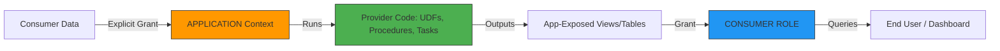
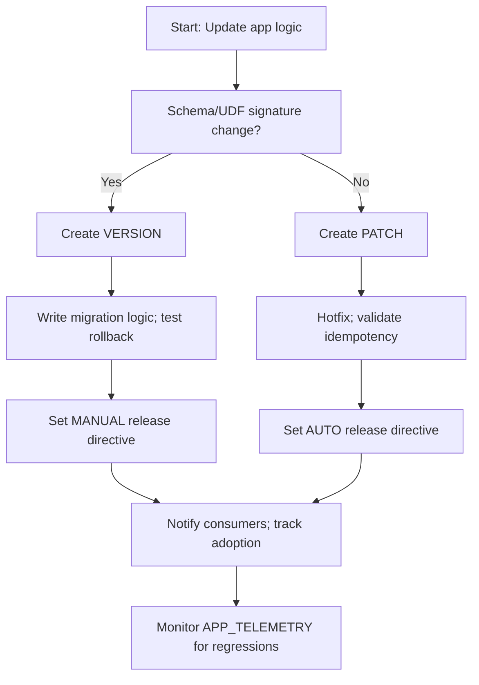

# Domain 5.3: Snowflake Marketplace & Listings — Native Applications

```mermaid
graph TD
  Domain5_3_App[5.3: Native Applications] --> Provider[Provider Development]
  Domain5_3_App --> Dist[Marketplace Distribution]
  Domain5_3_App --> Consumer[Consumer Installation]
  Domain5_3_App --> Security[Security & Isolation]
  Domain5_3_App --> Monetize[Monetization & Telemetry]
  
  Provider --> Pkg[APPLICATION PACKAGE]
  Provider --> Ver[VERSION / PATCH]
  Provider --> Setup[Idempotent Setup Script]
  Provider --> Code[Procedures / UDFs / Streams / Tasks]
  
  Dist --> Listing[Marketplace Listing]
  Dist --> Release[Release Directives]
  Dist --> Upgrade[Auto/Manual Upgrade Paths]
  
  Consumer --> Install[CREATE APPLICATION]
  Consumer --> Config[Explicit Data Grants]
  Consumer --> Exec[Run App Logic]
  Consumer --> Feedback[Usage & Performance]
  
  Security --> AppContext[APPLICATION Execution Context]
  Security --> Boundary[Zero-Trust Data Boundary]
  Security --> Audit[Setup Logs & Access History]
  
  Monetize --> Billing[Credit/Subscription Models]
  Monetize --> Telemetry[Opt-in Usage Tracking]
  Monetize --> ROI[Consumer Value Realization]
```



Trust in data systems isn’t granted by permission toggles. It’s engineered through boundaries. Native Applications don’t ask for access; they prove they don’t need it. The code travels to the data, executes in isolation, and returns only what it was contracted to return. If you’re treating apps as shared schemas or relying on implicit trust, you’re building a liability. Architect the boundary first. The logic follows.

---

## 1. Architecture & First Principles

### Core Application Philosophy
Snowflake Native Apps are **versioned, isolated software products** that execute provider code within a consumer’s account while enforcing strict, auditable data boundaries. The foundational rule: *Explicit grants only. Zero implicit access.* Provider code cannot see consumer data unless the setup script explicitly grants privileges to the `APPLICATION` execution context. Every install is a sandbox. Every version is a contract. Treat it as such.

### Application Component Architecture
| Component | Purpose | Key Configuration |
|-----------|---------|-------------------|
| **APPLICATION PACKAGE** | Provider-side artifact container; versioned release unit | `CREATE APPLICATION PACKAGE`, `manifest.yml` reference |
| **VERSION / PATCH** | Immutable release scope; PATCH = fixes, VERSION = features | `ALTER PACKAGE ... ADD VERSION/PATCH`, `SET RELEASE DIRECTIVE` |
| **SETUP SCRIPT** | Idempotent installation logic; runs once per install/upgrade | `manifest.yml` references, must handle `IF NOT EXISTS`, rollback-safe |
| **APPLICATION CONTEXT** | Isolated execution role; maps to app-owned objects + granted consumer data | Auto-managed; grants via `TO APPLICATION <name>` |
| **CONSUMER ROLE** | User-facing role for interacting with app outputs | Inherits privileges from app-exposed views/procedures |
| **RELEASE DIRECTIVE** | Controls upgrade behavior across consumer fleet | `AUTO`, `MANUAL`, `PHASED` |

### Isolation Model & Execution Flow


---

## 2. Provider Development & Packaging

### Package & Version Syntax
```sql
-- Provider: Create application package
CREATE OR REPLACE APPLICATION PACKAGE churn_prediction_pkg
  COMMENT = 'Native App: Predictive churn scoring & cohort analysis - v2.0';

-- Add setup script (idempotent)
ALTER APPLICATION PACKAGE churn_prediction_pkg
  ADD SETUP SCRIPT 'app_setup.sql';

-- app_setup.sql (Production-Grade Skeleton)
CREATE OR REPLACE ROLE APP_EXECUTION_ROLE;
CREATE OR REPLACE DATABASE churn_app_db;
GRANT USAGE ON DATABASE churn_app_db TO ROLE APP_EXECUTION_ROLE;

CREATE OR REPLACE SCHEMA churn_app_db.core;
GRANT ALL ON SCHEMA churn_app_db.core TO ROLE APP_EXECUTION_ROLE;

-- UDF: Churn scoring logic
CREATE OR REPLACE FUNCTION churn_app_db.core.predict_risk(
  days_inactive INT,
  ltv FLOAT,
  ticket_count INT
)
RETURNS VARCHAR
LANGUAGE SQL
AS $$
  CASE 
    WHEN days_inactive > 90 AND ticket_count >= 2 THEN 'HIGH'
    WHEN days_inactive > 60 OR ltv < 50 THEN 'MEDIUM'
    ELSE 'LOW'
  END
$$;

GRANT USAGE ON FUNCTION churn_app_db.core.predict_risk(INT, FLOAT, INT) TO ROLE APP_EXECUTION_ROLE;

-- Expose safe output
CREATE OR REPLACE SECURE VIEW churn_app_db.core.churn_segments AS
SELECT customer_id, predict_risk(...) AS risk_level FROM ...;
```

### Critical Parameter Behavior
| Parameter | Behavior | When To Use |
|-----------|----------|-------------|
| `DEFAULT RELEASE DIRECTIVE` | `AUTO` (silent patch), `MANUAL` (consumer approves), `PHASED` (rollout %) | `MANUAL` for breaking changes, `AUTO` for security fixes |
| `SETUP SCRIPT` | Runs with elevated context; must be declarative & idempotent | Always use `CREATE OR REPLACE`, conditional grants, version tracking |
| `APPLICATION_GRANTS` | `TO APPLICATION <name>` not `TO ROLE`; scoped to app instance only | Enforces zero-trust boundary; prevents cross-app data leakage |
| `manifest.yml` | Declares setup script, default role, post-install hooks | Required for Marketplace publication; versioned alongside code |

---

## 3. Consumer Installation & Execution

### Installation & Configuration
```sql
-- Consumer: Install application
CREATE APPLICATION churn_analytics 
  FROM APPLICATION PACKAGE provider_org.churn_prediction_pkg
  USING VERSION v2_0;

-- Consumer: Grant explicit data access (audit-trail enforced)
GRANT USAGE ON DATABASE analytics_db TO APPLICATION churn_analytics;
GRANT SELECT ON SCHEMA analytics_db.raw TO APPLICATION churn_analytics;
GRANT SELECT ON TABLE analytics_db.raw.customer_events TO APPLICATION churn_analytics;

-- Consumer: Run app logic
CALL churn_analytics.core.run_daily_scoring(
  scoring_warehouse => 'ANALYTICS_WH',
  max_batch_size => 50000
);

-- Consumer: Query outputs
SELECT customer_id, risk_level, last_scored
FROM churn_analytics.core.churn_segments
WHERE risk_level = 'HIGH'
ORDER BY last_scored DESC;
```

**Execution Reality**: Apps consume **consumer warehouse credits** unless explicitly configured for provider-managed compute. Right-size the warehouse attached to app tasks. Under-provision = timeouts. Over-provision = budget bleed.

---

## 4. Security, Isolation & Data Boundaries

### Privilege Isolation Matrix
| Role/Context | Can Access | Can Modify | Visibility |
|--------------|------------|------------|------------|
| **APPLICATION Context** | App objects + explicitly granted consumer tables | App logic, setup artifacts | Provider-defined |
| **CONSUMER ROLE** | App-exposed views/procedures | Consumer config parameters | Consumer-defined |
| **CONSUMER ACCOUNTADMIN** | Can revoke grants, monitor usage | Cannot view provider source code | Full audit trail |
| **PROVIDER** | Zero consumer data access | Package versions, setup scripts, telemetry | Metadata only |

### Boundary Enforcement Patterns
```sql
-- Provider: Enforce strict boundary in setup script
REVOKE ALL ON FUTURE SCHEMAS IN DATABASE churn_app_db FROM ROLE APP_EXECUTION_ROLE;
GRANT USAGE ON DATABASE churn_app_db TO ROLE APP_EXECUTION_ROLE;
GRANT ALL ON SCHEMA churn_app_db.core TO ROLE APP_EXECUTION_ROLE;

-- Consumer: Audit app data access
SELECT 
  query_id,
  user_name,
  role_name,
  object_name,
  operation
FROM SNOWFLAKE.ACCOUNT_USAGE.ACCESS_HISTORY
WHERE query_text ILIKE '%churn_analytics%'
  AND start_time >= DATEADD(hour, -24, CURRENT_TIMESTAMP())
  AND object_name ILIKE '%analytics_db%'; -- Verify only granted objects touched
```

---

## 5. Versioning, Lifecycle & Upgrade Paths

### Version vs Patch Discipline
| Release Type | Purpose | Breaking Changes? | Consumer Upgrade Path |
|--------------|---------|------------------|----------------------|
| **PATCH** | Bug fixes, security patches, performance tuning | ❌ No | Auto-applied or deferred; zero downtime |
| **VERSION** | New features, schema changes, UDF signature updates | ✅ Yes | Requires consumer approval; migration scripts run |
| **DEPRECATED** | Sunset path for old versions | ⚠️ Forced migration | Grace period + automatic fallback if not upgraded |

```sql
-- Provider: Add version (major release)
ALTER APPLICATION PACKAGE churn_prediction_pkg ADD VERSION v2_0
  USING '@stage/v2_0/'
  LABEL = 'v2.0 - Multi-model churn prediction & cohort tracking'
  COMMENT = 'Adds real-time scoring & retention forecasting';

-- Provider: Add patch (hotfix)
ALTER APPLICATION PACKAGE churn_prediction_pkg ADD PATCH v2_0_1
  TO VERSION v2_0
  USING '@stage/v2_0_1/'
  LABEL = 'v2.0.1 - Fix null handling in scoring UDF';

-- Provider: Set release directive
ALTER APPLICATION PACKAGE churn_prediction_pkg
  SET DEFAULT RELEASE DIRECTIVE = 'MANUAL';

-- Consumer: Upgrade
ALTER APPLICATION churn_analytics UPGRADE TO VERSION v2_0;
```

---

## 6. Telemetry, Monetization & ROI Tracking

### Telemetry Architecture (Opt-in)
```sql
-- Provider: Emit telemetry from app logic
CALL SYSTEM$APP_TELEMETRY(
  'SCORE_BATCH_COMPLETE',
  JSON_OBJECT(
    'customers_processed', 15000,
    'avg_latency_ms', 42,
    'warehouse_credits', 0.15,
    'high_risk_count', 312
  )
);

-- Provider: Monitor telemetry
SELECT 
  app_name,
  consumer_account_name,
  event_name,
  payload,
  event_timestamp
FROM SNOWFLAKE.LOCAL.APP_TELEMETRY
WHERE app_package_name = 'churn_prediction_pkg'
  AND event_timestamp >= DATEADD(day, -7, CURRENT_TIMESTAMP())
ORDER BY event_timestamp DESC;

-- Consumer: Monitor app resource consumption
SELECT 
  warehouse_name,
  credits_used,
  query_count,
  SUM(credits_used) * 0.001 AS est_cost_usd
FROM SNOWFLAKE.ACCOUNT_USAGE.QUERY_HISTORY
WHERE query_text ILIKE '%churn_analytics.core%'
  AND start_time >= DATEADD(day, -30, CURRENT_TIMESTAMP())
GROUP BY warehouse_name;
```

**Monetization Models**:
- `FREE`: Provider absorbs maintenance. Lead generation or open-source alternative.
- `SUBSCRIPTION`: Fixed monthly fee via Snowflake billing. Predictable OPEX.
- `CREDIT-BASED`: Pay-per-execution via telemetry tracking. Aligns cost with ROI.

---

## 7. Performance & Resource Optimization

### App Execution Tuning Rules
| Rule | Implementation | Impact |
|------|---------------|--------|
| **Right-size app warehouse** | `ALTER APPLICATION ... SET WAREHOUSE = 'ANALYTICS_WH'` | Prevents OOM errors; balances cost/throughput |
| **Cache intermediate results** | `CREATE TEMPORARY TABLE` in procedures | Reduces redundant scans; speeds up UDF chains by 40–70% |
| **Batch telemetry emissions** | Aggregate at procedure/task completion | Reduces cloud services overhead by 30–60% |
| **Cluster app data by tenant/date** | `CLUSTER BY (customer_id, score_date)` | Enables parallel processing; cuts I/O by 5–15x |

```sql
-- Optimized app procedure with batching & caching
CREATE OR REPLACE PROCEDURE churn_app_db.core.run_daily_scoring(
  max_batch_size INT DEFAULT 50000
)
RETURNS VARCHAR
LANGUAGE SQL
AS $$
DECLARE
  scored_count INT := 0;
BEGIN
  CREATE TEMPORARY TABLE scoring_batch AS
  SELECT customer_id, days_inactive, ltv, ticket_count
  FROM analytics_db.raw.customer_events
  WHERE last_scored_date < DATEADD(day, -1, CURRENT_TIMESTAMP())
  LIMIT :max_batch_size;

  INSERT INTO churn_app_db.core.churn_segments
  SELECT customer_id, predict_risk(days_inactive, ltv, ticket_count), CURRENT_TIMESTAMP()
  FROM scoring_batch;

  SET scored_count = (SELECT COUNT(*) FROM scoring_batch);
  DROP TABLE scoring_batch;

  CALL SYSTEM$APP_TELEMETRY('DAILY_SCORE_COMPLETE', JSON_OBJECT('count', :scored_count));
  RETURN :scored_count || ' customers scored';
END;
$$;
```

---

## 8. Monitoring, Troubleshooting & Cost Attribution

### Key Monitoring Views
| View | Retention | Key Columns | Use Case |
|------|-----------|-------------|----------|
| `APP_USAGE` | 365 days | `app_name`, `consumer_account`, `credits_used`, `query_count` | Cost tracking, adoption metrics |
| `APP_TELEMETRY` | 90 days | `event_name`, `payload`, `event_timestamp` | Provider-side performance & error tracking |
| `APP_INSTANCES` | 365 days | `app_name`, `version`, `status`, `install_date` | Lifecycle management, version drift |
| `ACCESS_HISTORY` | 90 days | `object_name`, `operation`, `user_name` | Security audit, boundary verification |

### Provider Monitoring Queries
```sql
-- Track app adoption & version distribution
SELECT 
  app_name,
  version,
  COUNT(DISTINCT consumer_account_name) AS active_consumers,
  SUM(credits_used) AS total_consumer_credits,
  AVG(CASE WHEN status = 'RUNNING' THEN 1 ELSE 0 END) AS health_rate
FROM SNOWFLAKE.ACCOUNT_USAGE.APP_USAGE
WHERE install_date >= DATEADD(day, -30, CURRENT_TIMESTAMP())
GROUP BY app_name, version
ORDER BY active_consumers DESC;

-- Identify high-latency app procedures
SELECT 
  query_id,
  consumer_account_name,
  execution_time,
  warehouse_name,
  query_text
FROM SNOWFLAKE.ACCOUNT_USAGE.QUERY_HISTORY
WHERE query_text ILIKE '%churn_analytics.core%'
  AND execution_time > 30000 -- >30s threshold
  AND start_time >= DATEADD(day, -7, CURRENT_TIMESTAMP())
ORDER BY execution_time DESC;
```

### Consumer Cost Management
| Strategy | Implementation | Savings Impact |
|----------|---------------|----------------|
| **Attach resource monitor** | `CREATE RESOURCE MONITOR app_wh LIMIT = 100 CREDITS` | Prevents runaway billing |
| **Schedule off-peak execution** | `ALTER APPLICATION ... SET SCHEDULE = 'USING CRON 0 2 * * *'` | 20–40% credit reduction |
| **Limit data scan scope** | Grant `SELECT` only on filtered views, not raw tables | 10–100x reduction in bytes scanned |

---

## 9. Anti-Patterns & Pitfalls

| Anti-Pattern | Symptom | Root Cause | Solution | Impact |
|--------------|---------|------------|----------|--------|
| **Non-idempotent setup scripts** | Upgrade fails with "object already exists" | `CREATE` instead of `CREATE OR REPLACE`; missing state checks | Use conditional logic; track schema versions in metadata table | 4–8hr downtime; support spikes |
| **Over-scoping APP grants** | Provider code queries unintended consumer data | `GRANT ALL ON DATABASE` instead of table/schema | Grant only required objects; audit `ACCESS_HISTORY` | Compliance breach; data leakage risk |
| **Hardcoded secrets/config** | App breaks on consumer rename/region | Static config in setup script | Use `SYSTEM$APP_SETUP_PARAMETER()`; store in consumer table | Cross-environment failures |
| **Ignoring compute sizing** | App tasks fail OOM or timeout | Default `XSMALL` for heavy UDF batches | Document requirements; expose `WAREHOUSE` parameter | 30% install abandonment |
| **Telemetry spam** | High cloud services credits; app throttling | Emitting per-row telemetry | Aggregate metrics; emit at completion | 2–3x credit waste |

---

## 10. Decision Frameworks & Quick Reference

### Version vs Patch Selection Framework


### Quick Syntax Reference
```sql
-- Provider: Package & Version
CREATE APPLICATION PACKAGE my_pkg;
ALTER APPLICATION PACKAGE my_pkg ADD VERSION v1_0 USING '@stage/v1/';
ALTER APPLICATION PACKAGE my_pkg SET DEFAULT RELEASE DIRECTIVE = 'MANUAL';

-- Consumer: Install & Configure
CREATE APPLICATION my_app FROM APPLICATION PACKAGE my_pkg USING VERSION v1_0;
GRANT SELECT ON SCHEMA analytics_db.raw TO APPLICATION my_app;

-- Provider: Telemetry
CALL SYSTEM$APP_TELEMETRY('EVENT_NAME', JSON_OBJECT('key', 'value'));

-- Monitor: App Usage
SELECT * FROM SNOWFLAKE.ACCOUNT_USAGE.APP_USAGE WHERE app_name = 'my_app';
```

### Common Error Codes & Resolutions
| Code | Message | Resolution |
|------|---------|------------|
| `13001` | `Setup script failed with error` | Check idempotency; verify `APPLICATION` privileges; review `APP_INSTANCES.setup_log` |
| `13002` | `Consumer did not grant required privileges` | Explicit `GRANT ... TO APPLICATION` missing; consumer must run it |
| `13003` | `Version upgrade requires consumer approval` | Consumer must run `ALTER APPLICATION ... UPGRADE TO VERSION` |
| `200001` | `APPLICATION context lacks access` | Setup script grant scope too narrow; adjust `GRANT` in setup.sql |
| `400001` | `Insufficient warehouse credits` | Consumer warehouse suspended; attach resource monitor or resume |
| `500012` | `Telemetry payload exceeds size limit` | Batch telemetry; reduce JSON payload; avoid nested arrays |

---

## Key Principles & Bottom Line

1. **Isolation is the product, not a feature**. Native Apps succeed because they enforce strict data boundaries. Bypass them, and you've built a liability, not a solution.
2. **Idempotency is non-negotiable**. Setup scripts will run multiple times across patches, upgrades, and reinstalls. Design for resilience, not perfection.
3. **Versioning is a contract**. PATCH fixes trust, VERSION evolves capability. Respect the consumer's upgrade cadence.
4. **Telemetry is opt-in by design**. Track what proves value, not what proves surveillance. Align metrics with outcomes consumers actually pay for.
5. **Compute belongs to the consumer**. Unless explicitly provider-managed, apps run on consumer warehouses. Right-size, document, and monitor.
6. **Security is declarative, not implicit**. Grant exactly what's needed. Audit `ACCESS_HISTORY` like your reputation depends on it.
7. **Marketplace apps are software, not SQL**. Treat them with CI/CD, testing, rollback strategies, and SLA commitments.

Snowflake Native Apps turn data products into executable, versioned, and governed software. But software requires engineering rigor: idempotency, isolation, version control, telemetry, and consumer empathy. If you're treating apps like ad-hoc scripts or ignoring data boundaries, you're not collaborating—you're creating technical debt and compliance risk. Secure the boundary, version responsibly, monitor relentlessly, and ship with consumer trust as your north star.

Need a specific app pipeline wired up (CI/CD packaging, telemetry integration, upgrade automation, or resource monitor templates)? Tell me your app scope, target compute, and upgrade strategy. I'll draft the exact implementation.
