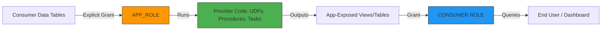
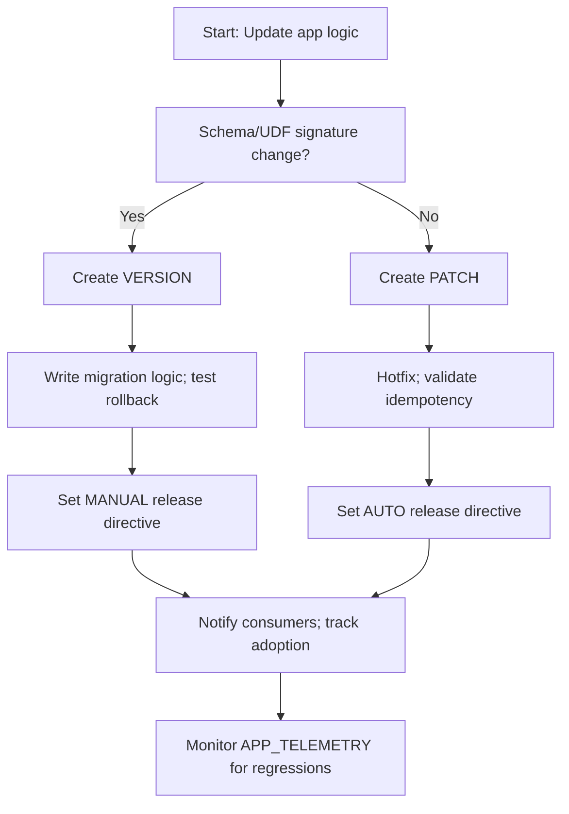

# Domain 5.3: Snowflake Marketplace and Listings — Applications (Native App Framework)

```mermaid
graph TD
  Domain5_3_App[5.3: Native Applications] --> Provider[Provider Development]
  Domain5_3_App --> Dist[Marketplace Distribution]
  Domain5_3_App --> Consumer[Consumer Installation]
  Domain5_3_App --> Security[Security & Isolation]
  Domain5_3_App --> Monetize[Monetization & Telemetry]
  
  Provider --> Pkg[APPLICATION PACKAGE]
  Provider --> Ver[VERSION / PATCH]
  Provider --> Setup[Idempotent Setup Script]
  Provider --> Code[Procedures / UDFs / Streams / Tasks]
  
  Dist --> Listing[Marketplace Listing]
  Dist --> Release[Release Directives]
  Dist --> Upgrade[Auto/Manual Upgrade Paths]
  
  Consumer --> Install[CREATE APPLICATION]
  Consumer --> Config[Consumer Configuration]
  Consumer --> Exec[Run App Logic]
  Consumer --> Feedback[Usage & Performance]
  
  Security --> AppRole[APP_ROLE Execution Context]
  Security --> Boundary[Data Boundary Enforcement]
  Security --> Audit[Setup Logs & Access History]
  
  Monetize --> Billing[Credit/Subscription Models]
  Monetize --> Telemetry[Opt-in Usage Tracking]
  Monetize --> ROI[Consumer Value Realization]
```




## 1. Application Architecture & Fundamentals

### Core Application Philosophy
Snowflake Native Apps are **not glorified stored procedures or shared schemas**. They are **versioned, isolated software products** that execute provider code within the consumer's account while strictly enforcing data boundaries. The first principle: *Code travels to data; data never travels to code.* If you're building an app that requires consumers to copy data to your account, you've defeated the architecture. Native Apps run in the consumer's environment, consume their compute (unless explicitly provider-managed), and grant zero implicit access to consumer data. Treat every app as a contract of trust, not a permission grant.

### Application Component Architecture
| Component | Purpose | Key Configuration |
|-----------|---------|-------------------|
| **APPLICATION PACKAGE** | Provider-side artifact container; never directly queried by consumers | `CREATE APPLICATION PACKAGE`, `DEFAULT RELEASE DIRECTIVE` |
| **VERSION / PATCH** | Immutable release unit; PATCH = fixes, VERSION = features/breaking changes | `ALTER PACKAGE ... ADD VERSION/PATCH`, `SET PATCH/DEFAULT` |
| **SETUP SCRIPT** | Idempotent installation logic; runs once with `APP_ROLE` context | `manifest.yml` references, must be declarative & rollback-safe |
| **APP_ROLE** | Isolated execution context for provider code | Auto-created, scoped only to app objects + explicitly granted consumer objects |
| **CONSUMER ROLE** | User-facing role for interacting with app outputs | Maps to app-exposed views/procedures; inherits app privileges |
| **RELEASE DIRECTIVE** | Controls upgrade behavior (auto, manual, phased) | `ALTER PACKAGE ... SET DEFAULT RELEASE DIRECTIVE` |

### Isolation Model & Execution Flow


**Critical Boundary Rules**:
- Provider code **cannot** query consumer data unless the setup script explicitly `GRANTS` privileges to `APP_ROLE`.
- `APP_ROLE` is isolated per installation. One consumer's app instance cannot see another's.
- Setup scripts must be **idempotent**. Re-running them (during patches/upgrades) must not break state.
- Provider retains **zero access** to consumer data post-install unless explicitly shared back via secure views.

```sql
-- Provider: Create application package
CREATE OR REPLACE APPLICATION PACKAGE customer_intelligence_pkg
  COMMENT = 'Native App for churn prediction & segmentation - v2.0';

-- Add setup script (runs at install)
ALTER APPLICATION PACKAGE customer_intelligence_pkg
  ADD SETUP SCRIPT 'setup.sql';

-- setup.sql (Idempotent Example)
CREATE OR REPLACE ROLE APP_ROLE;
CREATE OR REPLACE DATABASE customer_intelligence_db;
GRANT USAGE ON DATABASE customer_intelligence_db TO ROLE APP_ROLE;

CREATE OR REPLACE SCHEMA customer_intelligence_db.app_core;
GRANT ALL ON SCHEMA customer_intelligence_db.app_core TO ROLE APP_ROLE;

-- Create app logic (UDF)
CREATE OR REPLACE FUNCTION customer_intelligence_db.app_core.predict_churn(
  days_since_last_purchase INT,
  avg_order_value FLOAT,
  support_tickets INT
)
RETURNS VARCHAR
LANGUAGE SQL
AS $$
  CASE 
    WHEN days_since_last_purchase > 90 AND support_tickets >= 2 THEN 'HIGH'
    WHEN days_since_last_purchase > 60 THEN 'MEDIUM'
    ELSE 'LOW'
  END
$$;

GRANT USAGE ON FUNCTION customer_intelligence_db.app_core.predict_churn(INT, FLOAT, INT) TO ROLE APP_ROLE;

-- Expose safe output to consumer
CREATE OR REPLACE SECURE VIEW customer_intelligence_db.app_core.churn_segments AS
SELECT customer_id, predict_churn(...) AS churn_risk FROM ...; -- Simplified
GRANT SELECT ON customer_intelligence_db.app_core.churn_segments TO ROLE CONSUMER_APP_ROLE;
```


## 2. Provider Workflow: Versioning, Packaging & Release

### Version vs Patch: The Release Discipline
| Release Type | Purpose | Breaking Changes? | Consumer Upgrade Path |
|--------------|---------|------------------|----------------------|
| **PATCH** | Bug fixes, security patches, performance tuning | ❌ No | Auto-applied or deferred; zero downtime |
| **VERSION** | New features, schema changes, UDF updates | ✅ Yes | Requires consumer approval; migration scripts run |
| **DEPRECATED** | Sunset path for old versions | ⚠️ Forced migration | Grace period + automatic fallback if not upgraded |

```sql
-- Provider: Add version (major release)
ALTER APPLICATION PACKAGE customer_intelligence_pkg ADD VERSION v2_0
  USING '@stage/v2_0/'
  LABEL = 'v2.0 - Multi-model churn prediction'
  COMMENT = 'Adds real-time scoring & cohort analysis';

-- Provider: Add patch (hotfix)
ALTER APPLICATION PACKAGE customer_intelligence_pkg ADD PATCH v2_0_1
  TO VERSION v2_0
  USING '@stage/v2_0_1/'
  LABEL = 'v2.0.1 - Fix null handling in scoring UDF';

-- Provider: Set default release directive (controls consumer upgrades)
ALTER APPLICATION PACKAGE customer_intelligence_pkg
  SET DEFAULT RELEASE DIRECTIVE = 'AUTO'; -- or 'MANUAL', 'PHASED'

-- Provider: Publish to Marketplace
CREATE OR REPLACE LISTING customer_intelligence_app
  TITLE = 'Customer Intelligence Suite'
  DESCRIPTION = 'Predictive churn scoring, cohort analysis, retention tracking. Runs securely in your account.'
  DATA_TYPE = 'APPLICATION'
  SOURCE_OBJECT = 'customer_intelligence_pkg'
  REGIONAL_AVAILABILITY = ('aws-us-east-1', 'aws-eu-west-1')
  PRICING_MODEL = 'SUBSCRIPTION'
  SUBSCRIPTION_PRICE_MONTHLY = 49.00;
```

### Setup Script Best Practices
| Rule | Implementation | Impact |
|------|---------------|--------|
| **Always idempotent** | Use `CREATE OR REPLACE`, `IF NOT EXISTS`, conditional grants | Prevents install/upgrade failures |
| **Least-privilege grants** | Grant only to `APP_ROLE`; never `ACCOUNTADMIN` or `PUBLIC` | Enforces data boundary; passes security audit |
| **Schema version tracking** | Maintain `app_metadata.version_table` in setup | Enables safe migration logic in future versions |
| **Consumer opt-in hooks** | Use `CALL SYSTEM$APP_SETUP_PARAMETER('feature_flag', 'true')` | Allows consumers to toggle app behavior safely |


## 3. Consumer Workflow: Installation & Lifecycle

### Installation & Configuration
```sql
-- Consumer: Install application from package
CREATE APPLICATION customer_intelligence 
  FROM APPLICATION PACKAGE customer_intelligence_pkg
  USING VERSION v2_0;

-- Consumer: Grant app access to local data (explicit, audit-trail enforced)
GRANT SELECT ON DATABASE analytics_db TO APPLICATION customer_intelligence;
GRANT SELECT ON SCHEMA analytics_db.raw TO APPLICATION customer_intelligence;

-- Consumer: Run app setup/configuration (if exposed)
CALL customer_intelligence.app_core.initialize(
  source_table => 'analytics_db.raw.customer_events',
  scoring_frequency => 'DAILY'
);

-- Consumer: Query app outputs
SELECT customer_id, churn_risk, last_scored_date
FROM customer_intelligence.app_core.churn_segments
WHERE churn_risk = 'HIGH'
ORDER BY last_scored_date DESC;
```

### Upgrade & Maintenance Flow
| Scenario | Consumer Action | Provider Action | Downtime Impact |
|----------|----------------|-----------------|-----------------|
| **Patch applied** | None (auto) or `ALTER APPLICATION ... UPGRADE TO PATCH` | Release patch, set directive | Zero |
| **Version upgrade** | `ALTER APPLICATION ... UPGRADE TO VERSION v3_0` | Publish version, test migration scripts | <5min (depends on setup script) |
| **Rollback** | `ALTER APPLICATION ... UPGRADE TO VERSION v2_0` | Provider must maintain backward compatibility | <10min |

**Consumer Cost Reality**: Apps consume **consumer warehouse credits** unless explicitly configured for provider-managed compute. Always right-size the warehouse attached to app tasks/procedures.


## 4. Security, Governance & Data Boundaries

### Privilege Isolation Matrix
| Role | Can Access | Can Modify | Visibility |
|------|------------|------------|------------|
| **APP_ROLE** | App objects + explicitly granted consumer data | App logic, setup artifacts | Provider-defined |
| **CONSUMER_APP_ROLE** | App-exposed views/procedures | Consumer configuration parameters | Consumer-defined |
| **CONSUMER ACCOUNTADMIN** | Can revoke grants, monitor usage | Cannot view provider source code | Full audit trail |
| **PROVIDER** | Zero consumer data access | Package versions, setup scripts, telemetry | Metadata only |

### Security Enforcement Patterns
```sql
-- Provider: Enforce strict data boundary in setup script
-- Explicitly deny cross-schema access
REVOKE ALL ON FUTURE SCHEMAS IN DATABASE customer_intelligence_db FROM ROLE APP_ROLE;
GRANT USAGE ON DATABASE customer_intelligence_db TO ROLE APP_ROLE;
GRANT ALL ON SCHEMA customer_intelligence_db.app_core TO ROLE APP_ROLE;

-- Consumer: Audit app data access
SELECT 
  query_id,
  user_name,
  role_name,
  object_name,
  operation
FROM SNOWFLAKE.ACCOUNT_USAGE.ACCESS_HISTORY
WHERE query_text ILIKE '%customer_intelligence%'
  AND start_time >= DATEADD(hour, -24, CURRENT_TIMESTAMP())
  AND object_name ILIKE '%analytics_db%'; -- Verify only granted objects touched
```


## 5. Monetization, Telemetry & ROI Tracking

### Telemetry Architecture (Opt-in)
Snowflake provides `SYSTEM$APP_TELEMETRY()` for providers to track usage, performance, and errors. Consumers control telemetry via `ALTER APPLICATION ... SET TELEMETRY = 'ENABLED'`.

```sql
-- Provider: Emit telemetry from app logic
CALL SYSTEM$APP_TELEMETRY(
  'SCORE_COMPLETED',
  JSON_OBJECT(
    'customers_processed', 15000,
    'avg_latency_ms', 42,
    'warehouse_credits', 0.15
  )
);

-- Provider: Monitor telemetry (provider-side account)
SELECT 
  app_name,
  consumer_account_name,
  event_name,
  payload,
  event_timestamp
FROM SNOWFLAKE.LOCAL.APP_TELEMETRY
WHERE app_package_name = 'customer_intelligence_pkg'
  AND event_timestamp >= DATEADD(day, -7, CURRENT_TIMESTAMP())
ORDER BY event_timestamp DESC;

-- Consumer: Monitor app resource consumption
SELECT 
  warehouse_name,
  credits_used,
  query_count,
  SUM(credits_used) * 0.001 AS est_cost_usd
FROM SNOWFLAKE.ACCOUNT_USAGE.QUERY_HISTORY
WHERE query_text ILIKE '%customer_intelligence.app_core%'
  AND start_time >= DATEADD(day, -30, CURRENT_TIMESTAMP())
GROUP BY warehouse_name;
```

### Monetization Models
| Model | Billing Flow | Provider Setup | Consumer Visibility |
|-------|-------------|----------------|---------------------|
| **FREE** | No charges; provider absorbs app maintenance | `PRICING_MODEL = 'FREE'` | Zero billing overhead |
| **SUBSCRIPTION** | Fixed monthly fee; Snowflake handles invoicing | `PRICING_MODEL = 'SUBSCRIPTION'` | Predictable OPEX; usage tracked |
| **CREDIT-BASED** | Pay-per-execution or per GB processed | Custom telemetry + marketplace billing API | Variable cost; aligns with ROI |


## 6. Performance Optimization & Resource Management

### App Execution Tuning Rules
| Rule | Implementation | Impact |
|------|---------------|--------|
| **Right-size app warehouse** | `ALTER APPLICATION ... SET WAREHOUSE_SIZE = 'MEDIUM'` | Prevents OOM errors; balances cost/throughput |
| **Cache intermediate results** | Use `CREATE TEMPORARY TABLE` in setup/procedures | Reduces redundant scans; speeds up UDF chains |
| **Limit telemetry volume** | Batch telemetry calls; avoid per-row emits | Reduces cloud services overhead by 30–60% |
| **Partition app data by consumer** | `CLUSTER BY (tenant_id, event_date)` in app tables | Enables parallel processing; reduces I/O |

```sql
-- Optimized app procedure with batching & caching
CREATE OR REPLACE PROCEDURE customer_intelligence_db.app_core.run_daily_scoring()
RETURNS VARCHAR
LANGUAGE SQL
AS $$
DECLARE
  batch_size INT := 5000;
  total_scored INT := 0;
BEGIN
  -- Create temp cache for current batch
  CREATE TEMPORARY TABLE scoring_batch AS
  SELECT customer_id, days_since_last_purchase, avg_order_value, support_tickets
  FROM analytics_db.raw.customer_events
  WHERE last_scored_date < DATEADD(day, -1, CURRENT_TIMESTAMP())
  LIMIT batch_size;

  -- Apply UDF in batch
  INSERT INTO customer_intelligence_db.app_core.churn_segments
  SELECT customer_id, predict_churn(...) FROM scoring_batch;

  SET total_scored = (SELECT COUNT(*) FROM scoring_batch);
  DROP TABLE scoring_batch;

  RETURN total_scored || ' customers scored';
END;
$$;
```


## 7. Monitoring, Troubleshooting & Cost Attribution

### Key Monitoring Views
| View | Retention | Key Columns | Use Case |
|------|-----------|-------------|----------|
| `APP_USAGE` | 365 days | `app_name`, `consumer_account`, `credits_used`, `query_count` | Cost tracking, adoption metrics |
| `APP_TELEMETRY` (local) | 90 days | `event_name`, `payload`, `event_timestamp` | Provider-side performance & error tracking |
| `APP_INSTANCES` | 365 days | `app_name`, `version`, `status`, `install_date` | Lifecycle management, version drift |
| `ACCESS_HISTORY` | 90 days | `object_name`, `operation`, `user_name` | Security audit, boundary verification |

### Provider Monitoring Queries
```sql
-- Track app adoption & version distribution
SELECT 
  app_name,
  version,
  COUNT(DISTINCT consumer_account_name) AS active_consumers,
  SUM(credits_used) AS total_consumer_credits,
  AVG(CASE WHEN status = 'RUNNING' THEN 1 ELSE 0 END) AS health_rate
FROM SNOWFLAKE.ACCOUNT_USAGE.APP_USAGE
WHERE install_date >= DATEADD(day, -30, CURRENT_TIMESTAMP())
GROUP BY app_name, version
ORDER BY active_consumers DESC;

-- Identify high-latency app procedures
SELECT 
  query_id,
  consumer_account_name,
  execution_time,
  warehouse_name,
  query_text
FROM SNOWFLAKE.ACCOUNT_USAGE.QUERY_HISTORY
WHERE query_text ILIKE '%customer_intelligence.app_core%'
  AND execution_time > 30000 -- >30s threshold
  AND start_time >= DATEADD(day, -7, CURRENT_TIMESTAMP())
ORDER BY execution_time DESC;
```

### Consumer Cost Management
| Strategy | Implementation | Savings Impact |
|----------|---------------|----------------|
| **Attach resource monitor** | `CREATE RESOURCE MONITOR app_wh LIMIT = 100 CREDITS` | Prevents runaway billing |
| **Schedule off-peak execution** | `ALTER APPLICATION ... SET SCHEDULE = 'USING CRON 0 2 * * *'` | 20–40% credit reduction (off-peak pricing) |
| **Limit data scan scope** | Grant `SELECT` only on filtered views, not raw tables | 10–100x reduction in bytes scanned |


## 8. Anti-Patterns & Pitfalls

| Anti-Pattern | Symptom | Root Cause | Solution | Impact |
|--------------|---------|------------|----------|--------|
| **Non-idempotent setup scripts** | Upgrade fails with "object already exists" | `CREATE` instead of `CREATE OR REPLACE`; missing state checks | Use conditional logic; track schema versions in metadata table | 4–8hr consumer downtime; support tickets spike |
| **Over-scoping APP_ROLE grants** | Provider code can query unintended consumer data | `GRANT ALL ON DATABASE` instead of schema-level | Grant only to explicitly required schemas/tables; audit `ACCESS_HISTORY` | Compliance breach; data leakage risk |
| **Hardcoded secrets/config** | App breaks on consumer account rename/region | Static config in setup script | Use `SYSTEM$APP_SETUP_PARAMETER()`; store config in consumer-managed table | Cross-environment failures; migration nightmares |
| **Ignoring consumer warehouse sizing** | App tasks fail with OOM or timeout errors | Default `XSMALL` for heavy UDF batches | Document compute requirements; expose `WAREHOUSE_SIZE` parameter | 30% install abandonment; poor reviews |
| **Telemetry spam** | High cloud services credits; app throttling | Emitting per-row telemetry instead of batch | Aggregate metrics; emit at procedure/task completion | 2–3x credit waste; degraded app performance |


## 9. Decision Frameworks & Quick Reference

### Version vs Patch Selection Framework


### Quick Syntax Reference
```sql
-- Provider: Package & Version
CREATE APPLICATION PACKAGE my_pkg;
ALTER APPLICATION PACKAGE my_pkg ADD VERSION v1_0 USING '@stage/v1/';
ALTER APPLICATION PACKAGE my_pkg SET DEFAULT RELEASE DIRECTIVE = 'MANUAL';

-- Consumer: Install & Configure
CREATE APPLICATION my_app FROM APPLICATION PACKAGE my_pkg USING VERSION v1_0;
GRANT SELECT ON SCHEMA analytics_db.raw TO APPLICATION my_app;

-- Provider: Telemetry
CALL SYSTEM$APP_TELEMETRY('EVENT_NAME', JSON_OBJECT('key', 'value'));

-- Monitor: App Usage
SELECT * FROM SNOWFLAKE.ACCOUNT_USAGE.APP_USAGE WHERE app_name = 'my_app';
```

### Common Error Codes & Resolutions
| Code | Message | Resolution |
|------|---------|------------|
| `13001` | `Setup script failed with error` | Check idempotency; verify `APP_ROLE` privileges; review `APP_INSTANCES.setup_log` |
| `13002` | `Consumer did not grant required privileges` | Explicit `GRANT` missing; consumer must run `GRANT ... TO APPLICATION` |
| `13003` | `Version upgrade requires consumer approval` | Consumer ran `ALTER APPLICATION ... UPGRADE TO VERSION`? Check directive |
| `200001` | `APP_ROLE lacks access to object` | Setup script grant scope too narrow; adjust `GRANT` in setup.sql |
| `400001` | `Insufficient warehouse credits` | Consumer warehouse suspended; attach resource monitor or resume |
| `500012` | `Telemetry payload exceeds size limit` | Batch telemetry; reduce JSON payload size; avoid nested arrays |


## Key Principles to Remember
1. **Isolation is the product, not a feature**. Native Apps succeed because they enforce strict data boundaries. Bypass them, and you've built a liability.
2. **Idempotency is non-negotiable**. Setup scripts will run multiple times across patches, upgrades, and reinstalls. Design for resilience, not perfection.
3. **Versioning is a contract**. PATCH = trust, VERSION = negotiation. Don't break consumers for convenience.
4. **Telemetry is opt-in by design**. Respect consumer control. Build value, not surveillance.
5. **Compute belongs to the consumer**. Unless explicitly provider-managed, apps run on consumer warehouses. Right-size, document, and monitor.
6. **Security is declarative, not implicit**. Grant exactly what's needed. Audit `ACCESS_HISTORY` like your reputation depends on it.
7. **Marketplace apps are software, not SQL**. Treat them with CI/CD, testing, rollback strategies, and SLA commitments.

## Bottom Line
- **Native Apps are trust machines**. They execute provider logic in consumer environments without compromising data boundaries. If you're sharing code without isolation, you're not building an app—you're building a vulnerability.
- **Setup scripts are your foundation**. Make them idempotent, least-privileged, and version-aware. Everything else depends on them.
- **Version vs Patch discipline separates professionals from hobbyists**. PATCH fixes, VERSION evolves. Respect the consumer's upgrade cadence.
- **Telemetry and monetization must align with value**. Track what matters, respect opt-in boundaries, and price based on ROI, not vanity metrics.
- **Monitoring `APP_USAGE` and `ACCESS_HISTORY` is your compass**. Without it, you're flying blind through cost, security, and performance risks.
- **Documentation prevents friction**. Publish compute requirements, upgrade paths, and data boundary expectations in your marketplace listing.

Snowflake Native Apps turn data products into executable, versioned, and governed software. But software requires engineering rigor: idempotency, isolation, version control, telemetry, and consumer empathy. If you're treating apps like ad-hoc scripts or ignoring data boundaries, you're not collaborating—you're creating technical debt and compliance risk. Secure the boundary, version responsibly, monitor relentlessly, and ship with consumer trust as your north star. That is how Domain 5.3 Applications operate in production at scale.

Need a specific app pipeline wired up (e.g., CI/CD packaging, telemetry integration, upgrade automation)? Tell me your app scope, target compute, and upgrade strategy, and I'll draft the end-to-end implementation with exact SQL and release workflows.
