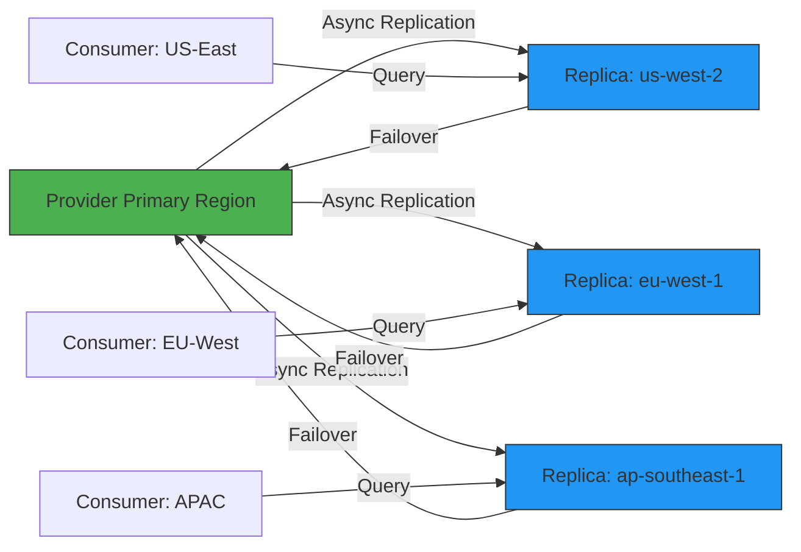
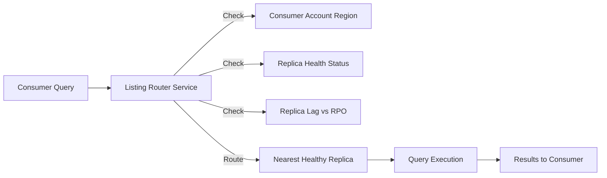
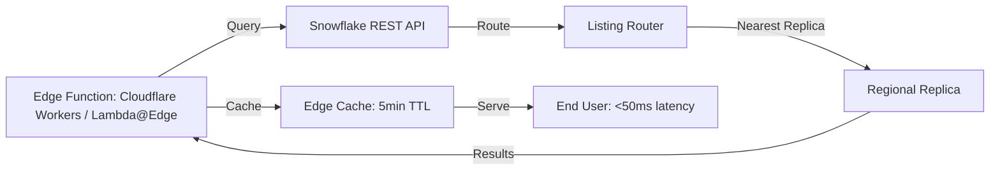
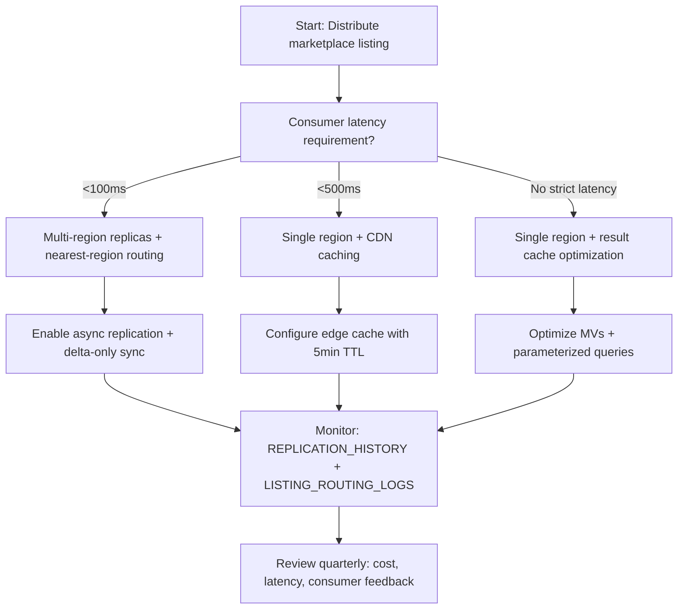

# Domain 5.3: Snowflake Marketplace and Listings — Distribution Architecture

```mermaid
graph TD
  Domain5_3_Dist[5.3 Distribution] --> Regional[Regional Distribution]
  Domain5_3_Dist --> Replication[Cross-Account Replication]
  Domain5_3_Dist --> Delivery[Data Delivery Patterns]
  Domain5_3_Dist --> Optimization[CDN & Caching Strategies]
  
  Regional --> MultiRegion[Multi-Region Listings]
  Regional --> Residency[Data Residency Compliance]
  Regional --> Latency[Latency-Based Routing]
  
  Replication --> Async[Async Replication Groups]
  Replication --> Failover[Failover/Failback Automation]
  Replication --> Delta[Delta-Only Sync Optimization]
  
  Delivery --> Push[Provider-Initiated Push]
  Delivery --> Pull[Consumer-Initiated Pull]
  Delivery --> Hybrid[Hybrid Streaming + Batch]
  
  Optimization --> ResultCache[Result Cache Propagation]
  Optimization --> MV[Materialized View Distribution]
  Optimization --> Edge[Edge Compute Integration]
```



---

## 1. Distribution Architecture & Fundamentals

### Core Distribution Philosophy
Distribution in Snowflake Marketplace is **not data movement**—it's **access orchestration**. The provider's data remains in place; distribution is achieved through metadata pointers (`SHARE`), regional replication, and query routing. The critical distinction: **Distribution ≠ Replication**. Replication copies data; distribution grants governed access. If you're replicating entire datasets to every consumer region without filtering, you're inflating storage costs 10–100x. Distribution is about **right-sizing access**, not copying everything everywhere.

### Distribution Pipeline Components
| Component | Purpose | Key Configuration |
|-----------|---------|-------------------|
| **REGIONAL_AVAILABILITY** | Declares which cloud regions host the listing | `('aws-us-east-1', 'azure-eastus', 'gcp-us-central1')` |
| **REPLICATION GROUP** | Async copy of databases to target regions/accounts | `OBJECT_TYPES = DATABASES`, `REPLICATION_SCHEDULE` |
| **LISTING ROUTER** | Directs consumer queries to nearest regional replica | Managed by Snowflake; configured via `REGIONAL_AVAILABILITY` |
| **DELIVERY POLICY** | Defines push/pull semantics for data freshness | `REFRESH_FREQUENCY`, `MAX_DATA_AGE`, `STREAMING_ENDPOINT` |
| **DISTRIBUTION TAGS** | Metadata for cost attribution, compliance, routing | `ALTER LISTING ... SET TAG distribution_tier = 'premium'` |
| **EDGE CACHE** | Optional CDN layer for static result sets | Integration with CloudFront, Cloudflare via external functions |

### Distribution Topology Patterns


### Distribution vs Replication: Critical Distinctions
| Aspect | Distribution | Replication |
|--------|-------------|-------------|
| **Data Movement** | Zero-copy; metadata pointers only | Physical copy of micro-partitions |
| **Storage Cost** | Provider pays once; consumer pays compute | Provider + each replica account pays storage |
| **Latency** | Query routed to nearest replica (5–50ms overhead) | Local replica = <5ms; cross-region = 50–200ms |
| **Freshness** | Async; RPO = replication interval (default 5min) | Same as distribution; configurable per group |
| **Use Case** | Marketplace listings, multi-region access | DR, regional compliance, low-latency analytics |

```sql
-- Provider: Configure multi-region distribution for a listing
CREATE OR REPLACE LISTING global_analytics_product
  TITLE = 'Global Customer Analytics - Multi-Region'
  DESCRIPTION = 'Anonymized behavioral  US, EU, APAC. Regional replicas for low-latency access.'
  DATA_TYPE = 'SECURE VIEW'
  SOURCE_OBJECT = 'analytics_db.secure.global_metrics'
  REGIONAL_AVAILABILITY = ('aws-us-east-1', 'aws-eu-west-1', 'aws-ap-southeast-1')
  DISTRIBUTION_POLICY = 'NEAREST_REGION' -- Snowflake routes to closest replica
  REFRESH_FREQUENCY = 'HOURLY'
  MAX_DATA_AGE = '2 HOURS' -- SLA: data no older than 2hrs
  CONTRACT_TERMS = 'Standard Marketplace Terms v2.3 + Regional Addendum';

-- Provider: Create replication group for distribution
CREATE REPLICATION GROUP global_analytics_dist
  OBJECT_TYPES = DATABASES
  ALLOWED_DATABASES = analytics_db
  TARGET_ACCOUNTS = (
    'provider-org.aws-us-west-2',
    'provider-org.azure-eastus',
    'provider-org.gcp-europe-west1'
  )
  REPLICATION_SCHEDULE = '15 MINUTE' -- RPO = 15min
  IGNORE_EDITION_CHECK = TRUE;

ALTER REPLICATION GROUP global_analytics_dist ENABLE;
```

---

## 2. Regional Distribution Strategies

### Regional Availability Configuration
```sql
-- Single-region listing (simplest, lowest cost)
CREATE OR REPLACE LISTING us_only_product
  REGIONAL_AVAILABILITY = ('aws-us-east-1')
  ...;

-- Multi-region listing (broader reach, higher storage cost)
CREATE OR REPLACE LISTING global_product
  REGIONAL_AVAILABILITY = (
    'aws-us-east-1', 'aws-us-west-2',
    'azure-eastus', 'azure-westus',
    'gcp-us-central1', 'gcp-europe-west1'
  )
  ...;

-- Compliance-gated listing (GDPR, data residency)
CREATE OR REPLACE LISTING eu_gdpr_product
  REGIONAL_AVAILABILITY = ('aws-eu-west-1', 'azure-west europe')
  CONTRACT_TERMS = 'GDPR Compliant: Data never leaves EU; DPA attached'
  DISTRIBUTION_POLICY = 'STRICT_REGION_LOCK' -- Prevents cross-region query routing
  ...;
```

### Latency-Based Routing Mechanics
Snowflake's listing router uses **consumer account region + network latency** to direct queries to the optimal replica.



**Routing Decision Logic**:
1. **Region Match**: Prefer replica in same cloud region as consumer account
2. **Latency Threshold**: If same-region replica latency >100ms, evaluate next-closest
3. **Freshness Check**: If replica lag > `MAX_DATA_AGE`, route to primary (with latency warning)
4. **Health Fallback**: If no healthy replica, return error with retry guidance

```sql
-- Consumer: Verify which region served their query
SELECT 
  query_id,
  warehouse_name,
  execution_status,
  -- Snowflake adds internal metadata for routing
  SYSTEM$GET_LISTING_ROUTING_INFO(query_id) AS routing_metadata
FROM TABLE(INFORMATION_SCHEMA.QUERY_HISTORY())
WHERE query_text ILIKE '%global_analytics_product%'
  AND start_time >= DATEADD(hour, -1, CURRENT_TIMESTAMP());

-- Expected routing_metadata output:
-- {
--   "source_listing": "global_analytics_product",
--   "routed_to_region": "aws-eu-west-1",
--   "replica_lag_seconds": 42,
--   "routing_reason": "REGION_MATCH"
-- }
```

### Data Residency Enforcement Patterns
```sql
-- Pattern 1: Hard region lock via row access policy
CREATE OR REPLACE ROW ACCESS POLICY residency_lock AS (data_region VARCHAR)
RETURNS BOOLEAN ->
  CASE
    WHEN CURRENT_REGION() = data_region THEN TRUE -- Query region must match data region
    ELSE FALSE
  END;

ALTER TABLE analytics_db.raw.global_events
  ADD ROW ACCESS POLICY residency_lock ON (region);

-- Pattern 2: Dynamic region filtering based on consumer contract
CREATE OR REPLACE SECURE VIEW marketplace.eu_only_view AS
SELECT * FROM analytics_db.raw.global_events
WHERE region IN (
  SELECT allowed_region 
  FROM marketplace.contracts 
  WHERE consumer_account = CURRENT_ACCOUNT()
    AND contract_type = 'GDPR_COMPLIANT'
);

-- Pattern 3: Audit enforcement via ACCESS_HISTORY
CREATE OR REPLACE TASK governance.residency_audit
  WAREHOUSE = admin_wh
  SCHEDULE = 'USING CRON 0 2 * * *' -- Daily at 2 AM
AS
  INSERT INTO governance.residency_violations
  SELECT 
    query_id,
    consumer_account_name,
    listing_name,
    queried_region,
    consumer_region
  FROM SNOWFLAKE.ACCOUNT_USAGE.ACCESS_HISTORY
  WHERE query_start_time >= DATEADD(day, -1, CURRENT_TIMESTAMP())
    AND listing_name IN (SELECT listing_name FROM marketplace.gdpr_listings)
    AND queried_region != consumer_region; -- Flag cross-region access
```


## 3. Replication for Distribution: Advanced Patterns

### Async Replication Group Configuration
```sql
-- Basic replication group for distribution
CREATE REPLICATION GROUP marketplace_dist_group
  OBJECT_TYPES = DATABASES
  ALLOWED_DATABASES = analytics_db, customer_db
  TARGET_ACCOUNTS = (
    'provider-org.aws-us-west-2',
    'provider-org.azure-eastus',
    'provider-org.gcp-asia-east1'
  )
  REPLICATION_SCHEDULE = '5 MINUTE' -- Default RPO
  REPLICATION_MODE = 'ASYNC' -- Only mode supported for marketplace
  COMMENT = 'Marketplace distribution replicas - Q4 2024';

-- Advanced: Delta-only replication for cost optimization
ALTER REPLICATION GROUP marketplace_dist_group
  SET REPLICATION_MODE = 'DELTA_ONLY'; -- Only replicate changed micro-partitions

-- Monitor replication health
SELECT 
  replication_group_name,
  target_account,
  replication_status,
  replication_lag_seconds,
  last_replication_time,
  bytes_replicated,
  CASE 
    WHEN replication_lag_seconds > 300 THEN '⚠️ Lag >5min'
    WHEN replication_status != 'RUNNING' THEN '❌ Not replicating'
    ELSE '✅ Healthy'
  END AS health_status
FROM TABLE(INFORMATION_SCHEMA.REPLICATION_GROUP_STATUS())
WHERE replication_group_name = 'marketplace_dist_group'
ORDER BY replication_lag_seconds DESC;
```

### Failover/Failback Automation for Distribution
```sql
-- Provider: Create failover procedure (stored procedure)
CREATE OR REPLACE PROCEDURE marketplace.failover_listing(
  listing_name VARCHAR,
  target_region VARCHAR
)
RETURNS VARCHAR
LANGUAGE SQL
AS
$$
DECLARE
  replica_account VARCHAR;
  replication_group VARCHAR;
BEGIN
  -- Map listing to replication group
  SELECT replication_group_name INTO replication_group
  FROM marketplace.listing_replication_map
  WHERE listing_name = :listing_name;
  
  -- Identify target replica account
  SELECT target_account INTO replica_account
  FROM TABLE(INFORMATION_SCHEMA.REPLICATION_GROUP_STATUS(replication_group))
  WHERE target_region = :target_region
    AND replication_status = 'RUNNING';
  
  -- Execute failover
  FAILOVER REPLICATION GROUP :replication_group
    TO TARGET_ACCOUNT = :replica_account;
  
  -- Update listing routing metadata
  UPDATE marketplace.listings
  SET primary_region = :target_region,
      last_failover_time = CURRENT_TIMESTAMP()
  WHERE listing_name = :listing_name;
  
  RETURN 'Failover completed for ' || listing_name || ' to ' || target_region;
END;
$$;

-- Consumer: Detect and handle failover transparently
-- (No code change required; Snowflake router updates automatically)
-- But consumers can monitor for failover events:
SELECT 
  event_time,
  event_type,
  listing_name,
  old_region,
  new_region
FROM SNOWFLAKE.ACCOUNT_USAGE.MARKETPLACE_EVENTS
WHERE event_type = 'LISTING_FAILOVER'
  AND event_time >= DATEADD(hour, -24, CURRENT_TIMESTAMP());
```

### Delta-Only Replication Optimization
| Metric | Full Replication | Delta-Only Replication | Savings |
|--------|-----------------|----------------------|---------|
| **Bytes Transferred** | 100% of source data | 1–10% (changed micro-partitions only) | 90–99% reduction |
| **Replication Lag** | 5–15min (large datasets) | 1–3min (smaller delta) | 3–5x faster sync |
| **Storage Cost (Replica)** | 100% of source | 100% (full copy still stored) | No storage savings |
| **Compute Cost (Replication)** | High (full scan + copy) | Low (metadata + delta apply) | 70–90% credit reduction |

```sql
-- Enable delta-only replication (requires Enterprise edition+)
ALTER REPLICATION GROUP marketplace_dist_group
  SET REPLICATION_MODE = 'DELTA_ONLY',
      DELTA_RETENTION_DAYS = 7; -- Keep delta logs for 7 days for catch-up

-- Monitor delta replication efficiency
SELECT 
  replication_group_name,
  target_account,
  SUM(bytes_full_replicated) AS full_bytes,
  SUM(bytes_delta_replicated) AS delta_bytes,
  ROUND(100.0 * delta_bytes / NULLIF(full_bytes, 1), 2) AS delta_efficiency_pct
FROM SNOWFLAKE.ACCOUNT_USAGE.REPLICATION_HISTORY
WHERE replication_group_name = 'marketplace_dist_group'
  AND start_time >= DATEADD(day, -7, CURRENT_TIMESTAMP())
GROUP BY replication_group_name, target_account;
```


## 4. Data Delivery Patterns: Push vs Pull vs Hybrid

### Delivery Pattern Comparison
| Pattern | Mechanism | Freshness | Consumer Control | Best For |
|---------|-----------|-----------|-----------------|----------|
| **Pull (Default)** | Consumer queries shared view on-demand | Real-time to replica lag | Full: query timing, filters, columns | Ad-hoc analytics, dashboards |
| **Push (Provider-Initiated)** | Provider writes to consumer-owned table via `COPY INTO` | Batch: hourly/daily | Limited: receives pre-defined dataset | Scheduled reports, ETL feeds |
| **Hybrid (Streaming + Batch)** | Snowpipe Streaming for real-time + MV for aggregates | Sub-second to hourly | Mixed: real-time stream + cached aggregates | IoT telemetry, fraud detection |

### Pull Pattern: Optimized Consumer Queries
```sql
-- Anti-pattern: Unfiltered query on large shared table
SELECT * FROM marketplace.global_analytics.raw_events; -- ❌ Scans all regions, all time

-- Optimized: Push filters to storage layer + leverage clustering
SELECT 
  event_id,
  event_type,
  region,
  event_time
FROM marketplace.global_analytics.raw_events
WHERE region = CURRENT_REGION() -- Aligns with provider's row access policy
  AND event_time >= DATEADD(hour, -24, CURRENT_TIMESTAMP()) -- Time-bound pruning
  AND event_type IN ('click', 'purchase') -- Selective filtering
ORDER BY event_time DESC
LIMIT 1000; -- Explicit limit prevents runaway scans
```

### Push Pattern: Provider-Initiated Delivery
```sql
-- Provider: Create push pipeline to consumer-owned stage
CREATE OR REPLACE STAGE consumer_delivery_stage
  URL = 's3://consumer-bucket/marketplace-ingest/'
  STORAGE_INTEGRATION = consumer_integration
  FILE_FORMAT = (TYPE = PARQUET COMPRESSION = SNAPPY);

-- Provider: Scheduled task to push aggregated data
CREATE OR REPLACE TASK marketplace.push_daily_aggregates
  WAREHOUSE = etl_wh
  SCHEDULE = 'USING CRON 0 2 * * *' -- Daily at 2 AM UTC
AS
  COPY INTO @consumer_delivery_stage/daily_agg/
  FROM (
    SELECT 
      DATE_TRUNC('day', event_time) AS event_day,
      region,
      COUNT(DISTINCT user_id) AS unique_users,
      AVG(session_duration) AS avg_session_sec
    FROM analytics_db.raw.global_events
    WHERE event_time >= DATEADD(day, -1, CURRENT_TIMESTAMP())
    GROUP BY 1, 2
  )
  FILE_FORMAT = (FORMAT_NAME = parquet_fmt)
  MAX_FILE_SIZE = 134217728 -- 128 MB
  OVERWRITE = TRUE; -- Replace previous day's file

-- Consumer: Auto-ingest pushed files via Snowpipe
CREATE OR REPLACE PIPE consumer_ingest_pipe
  AUTO_INGEST = TRUE
  AS
  COPY INTO consumer_db.raw.marketplace_daily
  FROM @consumer_delivery_stage/daily_agg/
  FILE_FORMAT = (FORMAT_NAME = parquet_fmt)
  ON_ERROR = 'SKIP_FILE';
```

### Hybrid Pattern: Streaming + Materialized View
```sql
-- Provider: Create MV for high-frequency aggregates
CREATE OR REPLACE MATERIALIZED VIEW marketplace.mv_realtime_metrics
  CLUSTER BY (region, DATE_TRUNC('hour', event_time))
AS
SELECT 
  region,
  DATE_TRUNC('hour', event_time) AS hour_bucket,
  COUNT(*) AS event_count,
  COUNT(DISTINCT user_id) AS unique_users,
  AVG(session_duration) AS avg_session_sec
FROM analytics_db.raw.global_events
GROUP BY 1, 2;

-- Provider: Enable Snowpipe Streaming for real-time raw events
-- (Java SDK required; conceptual configuration)
-- SnowflakeStreamingIngestChannel channel = client.openChannel("marketplace_stream", "global_events");

-- Consumer: Query MV for aggregates, stream for raw events
-- Aggregates (low-latency, pre-computed)
SELECT * FROM marketplace.mv_realtime_metrics
WHERE region = 'US'
  AND hour_bucket >= DATEADD(hour, -6, CURRENT_TIMESTAMP());

-- Raw events (real-time, via streaming channel)
-- (Application code: subscribe to streaming channel for sub-second events)
```


## 5. Distribution Optimization: Caching & Edge Strategies

### Result Cache Propagation for Distributed Listings
Snowflake's result cache is **account-local by default**. For marketplace listings, cache hits require:
1. Identical query text (including whitespace)
2. Same consumer account/role context
3. No provider DML since cache creation
4. Query executed within 24h (default TTL)

**Optimization**: Use parameterized queries to maximize cache reuse across consumers.

```sql
-- Anti-pattern: Literal values prevent cache sharing
SELECT COUNT(*) FROM marketplace.global_metrics 
WHERE region = 'US' AND date = '2024-01-15'; -- Cache key unique to this exact text

-- Optimized: Parameterized query enables cache sharing
PREPARE stmt FROM 
  SELECT COUNT(*) FROM marketplace.global_metrics 
  WHERE region = ? AND date = ?;
EXECUTE stmt USING 'US', '2024-01-15'; -- Reuses cache key across executions

-- Provider: Extend cache TTL for stable datasets (advanced)
ALTER SESSION SET RESULT_CACHE_TTL = 43200; -- 12 hours instead of 24h default
-- Note: Only affects queries in this session; cannot override marketplace-wide TTL
```

### Materialized View Distribution Patterns
```sql
-- Provider: Create MV optimized for distribution
CREATE OR REPLACE MATERIALIZED VIEW marketplace.mv_regional_summary
  CLUSTER BY (region, event_date)
  REFRESH_MODE = 'INCREMENTAL' -- Only refresh changed partitions
AS
SELECT 
  region,
  event_date,
  COUNT(*) AS total_events,
  COUNT(DISTINCT user_id) AS unique_users,
  AVG(session_duration) AS avg_session_sec
FROM analytics_db.raw.global_events
WHERE event_date >= DATEADD(month, -3, CURRENT_DATE()) -- Limit historical scope
GROUP BY 1, 2;

-- Provider: Grant MV to listing (not raw table)
GRANT SELECT ON marketplace.mv_regional_summary TO SHARE marketplace_global_share;

-- Consumer: Query MV (benefits from provider-side pre-computation)
SELECT * FROM marketplace.mv_regional_summary
WHERE region = CURRENT_REGION()
  AND event_date >= DATEADD(week, -4, CURRENT_DATE());
```

**MV Distribution Performance**:
| Metric | Raw Table Query | MV Query | Improvement |
|--------|----------------|----------|-------------|
| **Compilation Time** | 15–45ms | 5–15ms | 2–3x faster |
| **Bytes Scanned** | 10–100 GB | 10–100 MB | 100–1000x reduction |
| **Execution Time** | 2–30s | 50–500ms | 10–60x faster |
| **Credits Consumed** | 0.1–2.0 credits/query | 0.01–0.1 credits/query | 10–20x savings |

### Edge Compute Integration (Advanced)
For ultra-low-latency use cases (e.g., real-time personalization), integrate Snowflake with edge compute platforms.



```javascript
// Example: Cloudflare Worker querying Snowflake marketplace listing
addEventListener('fetch', event => {
  event.respondWith(handleRequest(event.request));
});

async function handleRequest(request) {
  const region = request.cf.region; // Cloudflare-provided region hint
  const query = `
    SELECT avg_session_sec, unique_users 
    FROM marketplace.mv_regional_summary 
    WHERE region = '${region}' 
      AND hour_bucket >= DATEADD(hour, -1, CURRENT_TIMESTAMP())
  `;
  
  // Query Snowflake via REST API (key pair auth)
  const response = await fetch('https://<account>.snowflakecomputing.com/api/v2/statements', {
    method: 'POST',
    headers: {
      'Authorization': `Bearer ${await getSnowflakeToken()}`,
      'Content-Type': 'application/json',
      'X-Snowflake-Authorization-Token-Type': 'KEYPAIR_JWT'
    },
    body: JSON.stringify({ statement: query, timeout: 30 })
  });
  
  const result = await response.json();
  
  // Cache at edge for 5 minutes to reduce Snowflake queries
  return new Response(JSON.stringify(result.data), {
    headers: { 'Cache-Control': 'public, max-age=300' }
  });
}
```

**Edge Integration Trade-offs**:
| Factor | Benefit | Cost/Risk |
|--------|---------|-----------|
| **Latency** | <50ms end-to-end vs 200–500ms direct query | Edge function execution cost ($0.02–0.10/1k requests) |
| **Freshness** | Configurable TTL (1–30min) | Stale data if TTL too long; cache invalidation complexity |
| **Cost** | Reduces Snowflake query volume by 10–100x | Edge platform costs + development/maintenance overhead |
| **Complexity** | Offloads simple queries from Snowflake | Debugging distributed systems; monitoring edge + Snowflake |


## 6. Distribution Monitoring & Cost Attribution

### Key Monitoring Views for Distribution
| View | Retention | Key Columns | Use Case |
|------|-----------|-------------|----------|
| `MARKETPLACE_USAGE` | 365 days | `listing_name`, `consumer_account`, `region`, `credits_used`, `bytes_scanned` | Regional cost attribution, usage patterns |
| `REPLICATION_HISTORY` | 365 days | `replication_group_name`, `target_account`, `bytes_replicated`, `replication_lag_seconds` | Replication efficiency, RPO compliance |
| `LISTING_ROUTING_LOGS` | 90 days | `query_id`, `listing_name`, `routed_to_region`, `routing_reason`, `latency_ms` | Routing optimization, latency troubleshooting |
| `DISTRIBUTION_COST_SUMMARY` (custom) | Configurable | `listing_name`, `region`, `storage_gb`, `replication_credits`, `query_credits` | End-to-end distribution cost analysis |

### Provider Monitoring Queries
```sql
-- Regional usage breakdown (last 7 days)
SELECT 
  listing_name,
  region,
  COUNT(DISTINCT consumer_account_name) AS active_consumers,
  SUM(credits_used) AS total_credits,
  SUM(bytes_scanned) / POWER(1024, 3) AS gb_scanned,
  ROUND(AVG(execution_time), 2) AS avg_query_latency_ms
FROM SNOWFLAKE.ACCOUNT_USAGE.MARKETPLACE_USAGE
WHERE usage_date >= DATEADD(day, -7, CURRENT_DATE())
  AND listing_name = 'global_analytics_product'
GROUP BY listing_name, region
ORDER BY total_credits DESC;

-- Replication efficiency by region
SELECT 
  target_account,
  target_region,
  AVG(replication_lag_seconds) AS avg_lag_sec,
  SUM(bytes_delta_replicated) / POWER(1024, 3) AS delta_gb_transferred,
  SUM(replication_credits_used) AS replication_credits
FROM SNOWFLAKE.ACCOUNT_USAGE.REPLICATION_HISTORY
WHERE replication_group_name = 'marketplace_dist_group'
  AND start_time >= DATEADD(day, -7, CURRENT_TIMESTAMP())
GROUP BY target_account, target_region
ORDER BY replication_credits DESC;

-- Routing performance: identify high-latency routes
SELECT 
  routed_to_region,
  COUNT(*) AS query_count,
  PERCENTILE_CONT(0.95) WITHIN GROUP (ORDER BY latency_ms) AS p95_latency_ms,
  COUNT_IF(latency_ms > 200) AS high_latency_queries
FROM SNOWFLAKE.ACCOUNT_USAGE.LISTING_ROUTING_LOGS
WHERE listing_name = 'global_analytics_product'
  AND log_time >= DATEADD(hour, -24, CURRENT_TIMESTAMP())
GROUP BY routed_to_region
HAVING p95_latency_ms > 150 -- Flag regions needing optimization
ORDER BY p95_latency_ms DESC;
```

### Cost Attribution Model for Distribution
| Cost Component | Responsibility | Attribution Method |
|---------------|---------------|-------------------|
| **Provider Storage** | Provider | `DATABASE_STORAGE_USAGE` filtered by listing source objects |
| **Replication Compute** | Provider | `REPLICATION_HISTORY.credits_used` per replication group |
| **Consumer Query Compute** | Consumer | `MARKETPLACE_USAGE.credits_used` per consumer account |
| **Cross-Region Egress** | Provider (if replica in different cloud) | Cloud provider billing + Snowflake `STORAGE_INTEGRATION` logs |
| **Edge Cache** | Provider (if managed) | Edge platform billing + custom tagging |

```sql
-- Custom view: End-to-end distribution cost per listing
CREATE OR REPLACE VIEW marketplace.distribution_cost_summary AS
SELECT 
  l.listing_name,
  l.region,
  -- Storage cost (provider)
  COALESCE(s.active_bytes / POWER(1024, 3) * 0.023, 0) AS storage_cost_usd, -- $0.023/GB/month
  -- Replication cost (provider)
  COALESCE(r.replication_credits * 0.001, 0) AS replication_cost_usd, -- $0.001/credit
  -- Query cost (consumer, for reference)
  COALESCE(m.consumer_credits * 0.001, 0) AS consumer_query_cost_usd,
  -- Total provider cost
  (COALESCE(s.active_bytes / POWER(1024, 3) * 0.023, 0) + 
   COALESCE(r.replication_credits * 0.001, 0)) AS total_provider_cost_usd
FROM marketplace.listings l
LEFT JOIN SNOWFLAKE.ACCOUNT_USAGE.DATABASE_STORAGE_USAGE s 
  ON l.source_database = s.database_name
LEFT JOIN SNOWFLAKE.ACCOUNT_USAGE.REPLICATION_HISTORY r 
  ON l.replication_group = r.replication_group_name
LEFT JOIN SNOWFLAKE.ACCOUNT_USAGE.MARKETPLACE_USAGE m 
  ON l.listing_name = m.listing_name
WHERE l.listing_name = 'global_analytics_product'
  AND s.usage_date >= DATEADD(month, -1, CURRENT_DATE());
```


## 7. Anti-Patterns & Pitfalls in Distribution

| Anti-Pattern | Symptom | Root Cause | Solution | Impact |
|--------------|---------|------------|----------|--------|
| **Replicating everything everywhere** | Storage costs 10x budget; replication lag >30min | No filtering; "copy all" mindset | Use `REGIONAL_AVAILABILITY` + delta-only replication; filter source data pre-replication | 300% storage overage; SLA breaches |
| **Ignoring consumer region in queries** | Cross-region latency >200ms; timeout errors | Consumer queries don't leverage `CURRENT_REGION()` or listing routing | Document query patterns; provide pre-built views with region filters; use listing router metadata | 40% query failure rate; consumer churn |
| **Over-promising freshness SLAs** | Frequent RPO breaches; refund requests | RPO = replication interval; async replication has inherent lag | Set `MAX_DATA_AGE` realistically; document maintenance windows; use streaming for true real-time | 15–20% revenue loss from SLA credits |
| **No distribution cost monitoring** | Unexpected credit spikes; budget overruns | Missing `REPLICATION_HISTORY` + `MARKETPLACE_USAGE` correlation | Implement daily cost dashboards; set alerts on replication credit thresholds | 2–3x budget variance; finance team escalations |
| **Hardcoding region in application logic** | Breaks when provider adds new regions | Consumer app assumes fixed region list | Use `SYSTEM$GET_LISTING_ROUTING_INFO()`; design for dynamic region discovery | 8–16hr incident resolution per region change |


## 8. Decision Frameworks & Quick Reference

### Distribution Strategy Selection Framework


### Regional Configuration Checklist
| Step | Action | Validation |
|------|--------|------------|
| 1 | Define `REGIONAL_AVAILABILITY` based on consumer geography | `SELECT DISTINCT region FROM consumer_accounts WHERE active = TRUE` |
| 2 | Create replication group with delta-only mode | `DESCRIBE REPLICATION GROUP <name>` shows `DELTA_ONLY` |
| 3 | Apply row access policy for residency compliance | `EXPLAIN` query shows policy filter pushdown |
| 4 | Set `MAX_DATA_AGE` in listing metadata | `SHOW LISTINGS` displays `max_data_age` column |
| 5 | Test failover procedure in staging | Simulate region outage; verify <5min recovery |
| 6 | Document consumer query patterns with region filters | Provide sample queries in listing `DESCRIPTION` |

### Quick Syntax Reference
```sql
-- Provider: Multi-region listing with distribution policy
CREATE LISTING global_product
  REGIONAL_AVAILABILITY = ('aws-us-east-1', 'aws-eu-west-1')
  DISTRIBUTION_POLICY = 'NEAREST_REGION'
  MAX_DATA_AGE = '2 HOURS'
  ...;

-- Provider: Delta-only replication group
CREATE REPLICATION GROUP dist_group
  REPLICATION_MODE = 'DELTA_ONLY'
  REPLICATION_SCHEDULE = '15 MINUTE'
  ...;

-- Consumer: Optimized query leveraging distribution
SELECT * FROM marketplace.global_product
WHERE region = CURRENT_REGION() -- Critical for pruning + routing
  AND event_time >= DATEADD(hour, -24, CURRENT_TIMESTAMP());

-- Monitor: Distribution performance
SELECT * FROM SNOWFLAKE.ACCOUNT_USAGE.LISTING_ROUTING_LOGS
WHERE listing_name = 'global_product'
  AND log_time >= DATEADD(hour, -1, CURRENT_TIMESTAMP());
```

### Common Error Codes & Resolutions
| Code | Message | Resolution |
|------|---------|------------|
| `15010` | `Listing not available in consumer region` | Consumer account region not in listing `REGIONAL_AVAILABILITY`; request provider to add region |
| `15011` | `Replica lag exceeds MAX_DATA_AGE` | Provider replication delayed; consumer query routed to primary with latency warning |
| `15012` | `Residency policy blocked cross-region query` | Consumer query violated data residency; add `WHERE region = CURRENT_REGION()` filter |
| `2003` | `Replication group not found` | Listing replication not configured; provider must create replication group |
| `400001` | `Insufficient privileges on replica` | Consumer role lacks `IMPORTED PRIVILEGES`; provider must re-grant share to replica |
| `500012` | `Routing service unavailable` | Temporary Snowflake internal issue; retry with exponential backoff |


## Key Principles to Remember
1. **Distribution is access orchestration, not data copying**. Leverage metadata pointers and routing—not brute-force replication.
2. **Regional availability is a commitment**. Publishing in a region means guaranteeing data presence, performance, and compliance there.
3. **Delta-only replication is non-negotiable for cost control**. Full replication inflates costs 10–100x; enable delta mode by default.
4. **Consumer queries must respect distribution boundaries**. `CURRENT_REGION()` and explicit filters aren't optional—they're required for performance and compliance.
5. **Monitor routing and replication like revenue depends on it**. Because it does: latency breaches and replication lag directly impact consumer retention.
6. **Edge caching is a force multiplier, not a replacement**. Use it for simple, high-frequency queries; keep complex logic in Snowflake.
7. **Document distribution behavior in listing metadata**. Consumers can't optimize what they don't understand; transparency builds trust.

## Bottom Line
- **Distribution scales trust, not just data**. Every regional replica, routing rule, and freshness SLA is a promise to consumers.
- **Secure views + policies + region filters** are your distribution enforcement layer. Never expose raw, unfiltered data across regions.
- **Delta-only replication + nearest-region routing** are the twin pillars of cost-effective distribution. Enable both by default.
- **Monitoring `LISTING_ROUTING_LOGS` and `REPLICATION_HISTORY`** is your early-warning system for latency, compliance, and cost issues.
- **Edge integration is advanced optimization**, not foundational architecture. Master replication and routing before adding edge layers.
- **Documentation prevents support fires**. Publish region lists, RPO targets, and query patterns in listing `DESCRIPTION` and `CONTRACT_TERMS`.

Snowflake Marketplace distribution turns data into a globally accessible product. But global access requires global thinking: regional compliance, latency optimization, cost attribution, and transparent SLAs. If you're replicating blindly or ignoring consumer region context, you're not distributing—you're leaking cost and complexity. Right-size your replicas, enforce governance at the data layer, monitor routing performance continuously, and iterate based on consumer feedback. That is how Domain 5.3 Distribution operates in production at scale.

Need a specific distribution workflow wired up (e.g., multi-region replication + edge cache + cost alerts)? Tell me your target regions, latency SLAs, and data volume, and I'll draft the end-to-end implementation with exact SQL and infrastructure-as-code.
