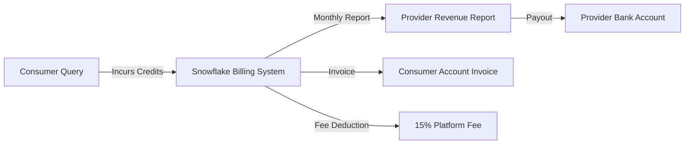
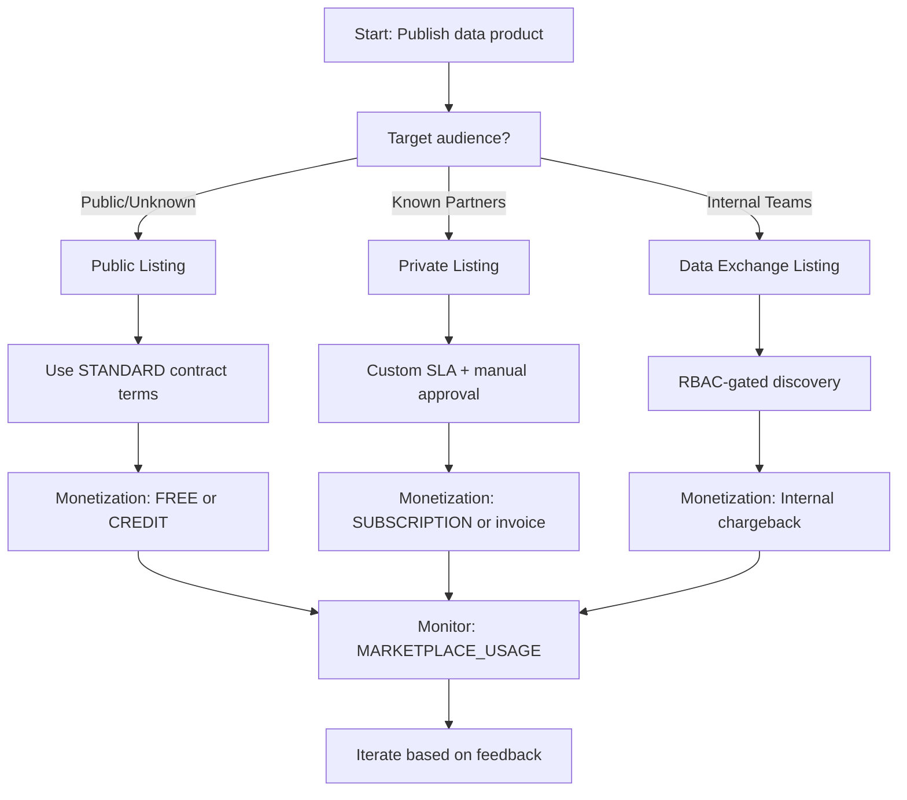

# Domain 5.3: Snowflake Marketplace and Listings

```mermaid
graph TD
  Domain5_3[5.3: Marketplace & Listings] --> Provider[Data Provider Workflow]
  Domain5_3 --> Consumer[Data Consumer Workflow]
  Domain5_3 --> Monetize[Monetization & Billing]
  Domain5_3 --> Govern[Security & Governance]
  
  Provider --> Create[Create Listing]
  Provider --> Configure[Configure Access & Contracts]
  Provider --> Publish[Publish to Marketplace]
  Provider --> Monitor[Monitor Usage & Revenue]
  
  Consumer --> Discover[Discover via Catalog]
  Consumer --> Request[Request Access / Accept Terms]
  Consumer --> Consume[Query Shared Data]
  Consumer --> Track[Track Usage & Costs]
  
  Monetize --> Free[Free Listings]
  Monetize --> Credit[Pay-Per-Credit]
  Monetize --> Subscription[Subscription Billing]
  Monetize --> Revenue[Revenue Settlement]
  
  Govern --> RLS[Row Access Policies]
  Govern --> Masking[Dynamic Masking]
  Govern --> Audit[ACCESS_HISTORY]
  Govern --> Compliance[Regional/Data Residency]
```



---

## 1. Marketplace Architecture & Fundamentals

### Core Marketplace Philosophy
Snowflake Marketplace is **not a data dump**—it's a governed, contract-bound distribution layer. Listings are metadata wrappers around `SHARE` objects with standardized discovery, access workflows, and billing integration. The critical distinction: **Marketplace listings are discoverable; shares are not**. If you're publishing raw tables without secure views, SLAs, or usage terms, you're creating legal and compliance debt. Marketplace enforces structure; your job is to enforce governance.

### Marketplace Component Architecture
| Component | Purpose | Key Configuration |
|-----------|---------|-------------------|
| **LISTING** | Metadata container for discoverable data products | `TITLE`, `DESCRIPTION`, `DATA_TYPE`, `REGIONAL_AVAILABILITY` |
| **CONTRACT_TERMS** | Legal/SLA framework for access | `USAGE_TERMS`, `SLA`, `REFUND_POLICY`, `DATA_RETENTION` |
| **APPLICATION PACKAGE** (optional) | Bundles data + code (UDFs, Streams, Tasks) | `CREATE APPLICATION PACKAGE`, versioned releases |
| **PROVIDER ACCOUNT** | Source of truth for data; handles billing settlement | Must be ORGADMIN-enabled; configured for marketplace |
| **CONSUMER ACCOUNT** | Queries shared data; incurs compute costs | Accepts contract terms; creates DB from listing |
| **MARKETPLACE_USAGE** | Billing & attribution view | Tracks credits, bytes scanned, query counts per listing |

### Listing Lifecycle Workflow

```mermaid
graph LR
  Draft[Draft Listing] --> Config[Configure Access & Contracts]
  Config --> Review[Internal Review: Legal, Security, Product]
  Review --> Publish[Publish to Marketplace]
  Publish --> Discover[Consumer Discovery]
  Discover --> Request[Consumer Request Access]
  Request --> Approve[Provider Auto/Manual Approval]
  Approve --> Grant[Grant SHARE to Consumer]
  Grant --> Consume[Consumer Queries Data]
  Consume --> Monitor[Usage Tracking & Billing]
  Monitor --> Iterate[Update Listing v2.0]
```


### Public vs Private Listings: Critical Differences
| Feature | Public Listing | Private Listing |
|---------|---------------|-----------------|
| **Discoverability** | Snowflake Marketplace UI (global) | Invite-only; shared via direct link or Data Exchange |
| **Approval Workflow** | Consumer self-serve (auto-accept terms) | Provider-managed (manual approval or RBAC-gated) |
| **Contract Flexibility** | Standardized terms template | Custom SLAs, usage restrictions, negotiation |
| **Use Case** | SaaS vendors, public datasets, lead gen | Partner ecosystems, internal catalogs, enterprise B2B |
| **Billing Model** | Snowflake-handled settlement | Provider-managed invoicing or Snowflake billing |

```sql
-- Public listing: Standardized terms, auto-approval
CREATE OR REPLACE LISTING public_weather_data
  TITLE = 'Global Weather Analytics - Hourly Forecasts'
  DESCRIPTION = 'NOAA-sourced weather data: temperature, precipitation, wind. Updated hourly.'
  DATA_TYPE = 'TABLE'
  SOURCE_OBJECT = 'weather_db.public.hourly_forecasts'
  REGIONAL_AVAILABILITY = ('aws-us-east-1', 'aws-eu-west-1', 'azure-eastus')
  CONTRACT_TERMS = 'Standard Public Listing Terms v2.1'
  USAGE_TERMS = 'Non-commercial research use only; no redistribution'
  SLA = '99.9% availability; <1hr latency from source'
  REFRESH_FREQUENCY = 'HOURLY'
  SUPPORT_CONTACT = 'support@weatherdata.com';

-- Private listing: Custom contract, manual approval
CREATE OR REPLACE LISTING partner_finance_data
  TITLE = 'Partner Financial Metrics - Q4 2024'
  DESCRIPTION = 'Anonymized revenue, churn, LTV for joint analytics. NDA required.'
  DATA_TYPE = 'SECURE VIEW'
  SOURCE_OBJECT = 'finance_db.secure.partner_metrics'
  REGIONAL_AVAILABILITY = ('aws-us-east-1')
  CONTRACT_TERMS = 'Partner Agreement v3.2 + NDA Appendix B'
  USAGE_TERMS = 'Internal use only; audit logs required; no ML training'
  SLA = '99.5% availability; <4hr latency; dedicated support channel'
  APPROVAL_REQUIRED = TRUE
  APPROVER_ROLE = 'MARKETPLACE_ADMIN';
```

---

## 2. Provider Workflow: Creating & Publishing Listings

### Listing Creation Syntax & Parameters
```sql
CREATE OR REPLACE LISTING <listing_name>
  [IN APPLICATION PACKAGE <app_package_name>] -- Optional for app-bound data
  TITLE = '<human-readable title>'
  DESCRIPTION = '<detailed description; supports Markdown>'
  DATA_TYPE = 'TABLE' | 'VIEW' | 'SECURE VIEW' | 'APPLICATION'
  SOURCE_OBJECT = '<database.schema.object>' -- Must exist and be grantable
  REGIONAL_AVAILABILITY = ('<cloud-region>', ...) -- Multi-region support
  [CONTRACT_TERMS = '<legal reference or inline terms>']
  [USAGE_TERMS = '<permitted use cases>']
  [SLA = '<availability, latency, support commitments>']
  [REFRESH_FREQUENCY = 'REALTIME' | 'HOURLY' | 'DAILY' | 'WEEKLY']
  [SUPPORT_CONTACT = '<email or Slack channel>']
  [APPROVAL_REQUIRED = TRUE | FALSE] -- Default: FALSE for public
  [APPROVER_ROLE = '<role_name>'] -- Required if APPROVAL_REQUIRED = TRUE
  [PRICING_MODEL = 'FREE' | 'CREDIT' | 'SUBSCRIPTION'] -- Default: FREE
  [CREDIT_PRICE_PER_QUERY = <number>] -- If PRICING_MODEL = 'CREDIT'
  [SUBSCRIPTION_PRICE_MONTHLY = <number>] -- If PRICING_MODEL = 'SUBSCRIPTION'
  COMMENT = '<internal version tracking>';
```

### Critical Parameter Behavior
| Parameter | Behavior | When To Use |
|-----------|----------|-------------|
| `SOURCE_OBJECT` | Must be a `TABLE`, `VIEW`, or `SECURE VIEW`; cannot be raw stage | Always use `SECURE VIEW` to encapsulate governance logic |
| `REGIONAL_AVAILABILITY` | Lists listing in specified regions; data must exist there | Multi-region providers; comply with data residency laws |
| `APPROVAL_REQUIRED` | Forces manual review before access granted | High-value, sensitive, or regulated datasets |
| `PRICING_MODEL` | `FREE` (no charge), `CREDIT` (pay-per-query), `SUBSCRIPTION` (monthly) | Freemium lead gen (`FREE`); premium APIs (`CREDIT`); enterprise bundles (`SUBSCRIPTION`) |
| `CONTRACT_TERMS` | Legal reference; enforced via consumer acceptance workflow | Mandatory for paid listings; recommended for all production listings |

### Secure View Patterns for Marketplace Listings
```sql
-- Pattern 1: Anonymization for public consumption
CREATE OR REPLACE SECURE VIEW marketplace.public.user_behavior AS
SELECT 
    MD5(user_id) AS user_id_hash, -- Irreversible anonymization
    session_duration_sec,
    page_views,
    region,
    device_type
FROM raw.user_events
WHERE event_date >= DATEADD(month, -6, CURRENT_DATE()) -- Limit historical exposure
  AND region IN ('US', 'CA', 'EU'); -- Regional compliance filter;

-- Pattern 2: Aggregated metrics to prevent re-identification
CREATE OR REPLACE SECURE VIEW marketplace.public.daily_aggregates AS
SELECT 
    DATE_TRUNC('day', event_time) AS event_day,
    region,
    COUNT(DISTINCT MD5(user_id)) AS unique_users, -- Aggregated, not raw
    AVG(session_duration_sec) AS avg_session_sec,
    SUM(page_views) AS total_page_views
FROM raw.user_events
GROUP BY 1, 2
HAVING COUNT(DISTINCT MD5(user_id)) >= 100; -- k-anonymity threshold;

-- Pattern 3: Time-bound trial access
CREATE OR REPLACE SECURE VIEW marketplace.trial.premium_features AS
SELECT * FROM raw.premium_metrics
WHERE CURRENT_DATE() <= DATEADD(day, 30, CURRENT_DATE()) -- 30-day trial window
  AND CURRENT_ACCOUNT() IN (SELECT trial_account_id FROM marketplace.trial_eligibility);
```

### Publishing Workflow: Step-by-Step
```sql
-- 1. Create listing (draft state)
CREATE OR REPLACE LISTING weather_analytics_v2 ...;

-- 2. Validate listing configuration
CALL SYSTEM$VALIDATE_LISTING('weather_analytics_v2');
-- Returns: { "status": "VALID", "warnings": [...], "errors": [...] }

-- 3. Publish to marketplace (requires ORGADMIN role)
CALL SYSTEM$PUBLISH_LISTING('weather_analytics_v2');

-- 4. Verify publication status
SELECT 
  listing_name,
  status, -- 'DRAFT', 'PUBLISHED', 'SUSPENDED'
  published_date,
  regional_availability,
  contract_terms
FROM SNOWFLAKE.ACCOUNT_USAGE.LISTINGS
WHERE listing_name = 'weather_analytics_v2';

-- 5. Monitor consumer requests (if APPROVAL_REQUIRED = TRUE)
SELECT 
  request_id,
  consumer_account_name,
  requested_date,
  status, -- 'PENDING', 'APPROVED', 'REJECTED'
  approver_name
FROM SNOWFLAKE.ACCOUNT_USAGE.LISTING_ACCESS_REQUESTS
WHERE listing_name = 'partner_finance_data'
  AND status = 'PENDING';
```

---

## 3. Consumer Workflow: Discovery to Consumption

### Discovery & Request Process

```mermaid
graph LR
  Consumer[Consumer Account] -->|Search| Catalog[Marketplace Catalog UI]
  Catalog -->|Filter| Results[By region, category, rating, price]
  Results -->|Select| Listing[View Listing Details]
  Listing -->|Accept| Terms[Contract Terms + SLA]
  Terms -->|Submit| Request[Access Request]
  Request -->|Auto-Approve| Grant[Provider Grants SHARE]
  Request -->|Manual-Approve| Review[Provider Review Queue]
  Review -->|Approve| Grant
  Grant -->|Consumer| CreateDB[CREATE DATABASE FROM LISTING]
  CreateDB --> Query[Query Shared Data]
```


### Consumer SQL: Accessing Marketplace Data
```sql
-- Step 1: Discover listing (via UI or API)
-- Step 2: Accept contract terms (UI workflow)
-- Step 3: Create database from listing (SQL)
CREATE DATABASE marketplace_weather 
  FROM LISTING <provider_org>.weather_analytics_v2;

-- Step 4: Query shared data (uses consumer warehouse)
SELECT 
  event_day,
  region,
  avg_session_sec
FROM marketplace_weather.public.daily_aggregates
WHERE region = 'US'
  AND event_day >= DATEADD(week, -4, CURRENT_DATE())
ORDER BY event_day DESC;

-- Step 5: Verify usage attribution (for cost tracking)
SELECT 
  query_id,
  listing_name,
  credits_used,
  bytes_scanned
FROM SNOWFLAKE.ACCOUNT_USAGE.QUERY_HISTORY
WHERE query_text ILIKE '%marketplace_weather%'
  AND start_time >= DATEADD(hour, -24, CURRENT_TIMESTAMP());
```

### Consumer-Side Performance Considerations
| Factor | Impact | Mitigation |
|--------|--------|------------|
| **Cross-region latency** | +50–200ms if provider data is in different region | Filter listings by `REGIONAL_AVAILABILITY` matching consumer region |
| **Secure view overhead** | +15–45ms compilation time for policy evaluation | Use parameterized queries; avoid session-specific functions in cache key |
| **Result cache invalidation** | Provider DML invalidates consumer result cache | Schedule provider updates during off-peak; document refresh windows |
| **Bytes scanned costs** | Consumer pays for compute; provider pays for storage | Push filters into query; use clustering on base tables; leverage MVs for aggregates |

```sql
-- Optimized consumer query: Push filters to storage layer
SELECT 
  region,
  DATE_TRUNC('hour', event_time) AS hour_bucket,
  COUNT(*) AS event_count
FROM marketplace_weather.public.raw_events -- Secure view with pruning hints
WHERE region = CURRENT_REGION() -- Aligns with provider's row access policy
  AND event_time >= DATEADD(hour, -24, CURRENT_TIMESTAMP())
GROUP BY 1, 2
ORDER BY hour_bucket DESC;
```

---

## 4. Monetization Models & Billing Architecture

### Monetization Model Comparison
| Model | Setup Complexity | Billing Flow | Best For | Revenue Predictability |
|-------|-----------------|--------------|----------|----------------------|
| **FREE** | Low | No charges; provider absorbs storage/compute | Lead generation, open data, community building | None (marketing cost) |
| **PAY-PER-CREDIT** | Medium | Consumer pays per query; Snowflake settles monthly | API-style access, sporadic high-value queries | Variable (usage-dependent) |
| **SUBSCRIPTION** | High | Fixed monthly fee; Snowflake handles invoicing | Enterprise bundles, SLA-backed data products | High (recurring revenue) |

### Credit-Based Pricing Configuration
```sql
-- Provider: Configure credit pricing for listing
ALTER LISTING premium_analytics
  SET PRICING_MODEL = 'CREDIT',
      CREDIT_PRICE_PER_QUERY = 0.05, -- 0.05 credits per query execution
      CREDIT_PRICE_PER_GB_SCANNED = 0.10; -- Optional: charge by data volume

-- Consumer: Estimate query cost before execution
-- (Provider should document typical costs in listing DESCRIPTION)
EXPLAIN USING COST
SELECT * FROM marketplace.premium.customer_360 
WHERE ltv_score > 500;
-- Returns: estimated credits_used, bytes_scanned
```

### Billing Settlement Flow


**Key Billing Metrics**:
- **Provider Revenue**: `(Total Credits Consumed × Credit Price) × (1 - Platform Fee)`
- **Platform Fee**: 15% of gross revenue (standard; non-negotiable for public listings)
- **Settlement Timing**: Monthly, with 30-day net terms
- **Currency**: USD by default; multi-currency support via provider configuration

```sql
-- Provider: Monitor revenue per listing (last 30 days)
SELECT 
  listing_name,
  SUM(credits_used) AS total_credits_consumed,
  SUM(credits_used) * 0.05 AS gross_revenue_usd, -- Assuming $0.05/credit
  SUM(credits_used) * 0.05 * 0.85 AS net_revenue_usd, -- After 15% platform fee
  COUNT(DISTINCT consumer_account_name) AS active_consumers
FROM SNOWFLAKE.ACCOUNT_USAGE.MARKETPLACE_USAGE
WHERE usage_date >= DATEADD(day, -30, CURRENT_DATE())
  AND listing_name = 'premium_analytics'
GROUP BY listing_name;
```

---

## 5. Security, Governance & Compliance

### Row Access Policies for Marketplace Data
```sql
-- Provider: Create policy that respects consumer context
CREATE OR REPLACE ROW ACCESS POLICY marketplace_rap AS (region VARCHAR, consumer_account VARCHAR)
RETURNS BOOLEAN ->
  CASE
    -- Allow provider internal roles full access
    WHEN CURRENT_ROLE() = 'PROVIDER_ADMIN' THEN TRUE
    -- Restrict by consumer's contracted regions
    WHEN consumer_account IN (SELECT account_id FROM marketplace.contracts WHERE allowed_regions LIKE '%' || region || '%') THEN TRUE
    -- Default deny
    ELSE FALSE
  END;

-- Apply to base table (inherited by secure view)
ALTER TABLE raw.customer_data
  ADD ROW ACCESS POLICY marketplace_rap ON (region, CURRENT_ACCOUNT());
```

### Dynamic Masking for Tiered Access
```sql
-- Create masking policy with tier-based logic
CREATE OR REPLACE MASKING POLICY marketplace_mask AS (val VARCHAR, access_tier VARCHAR)
RETURNS VARCHAR ->
  CASE
    WHEN access_tier = 'PREMIUM' THEN val -- Full access for paid tier
    WHEN access_tier = 'TRIAL' THEN REGEXP_REPLACE(val, '\\w{4}', '****') -- Partial mask for trial
    ELSE '***REDACTED***' -- Default for free tier
  END;

-- Apply to sensitive column
ALTER TABLE raw.customer_data
  MODIFY COLUMN email SET MASKING POLICY marketplace_mask ON (email, 
    CASE 
      WHEN CURRENT_ACCOUNT() IN (SELECT premium_account FROM marketplace.tiers) THEN 'PREMIUM'
      WHEN CURRENT_ACCOUNT() IN (SELECT trial_account FROM marketplace.tiers) THEN 'TRIAL'
      ELSE 'FREE'
    END);
```

### Compliance & Data Residency Controls
| Requirement | Implementation | Verification |
|-------------|---------------|--------------|
| **GDPR/CCPA** | Anonymize PII in secure view; document data lineage | `ACCESS_HISTORY` + `POLICY_REFERENCES` audit |
| **Data Residency** | `REGIONAL_AVAILABILITY` + cross-account replication | `REPLICATION_GROUP_STATUS` + geo-filtered queries |
| **Audit Trail** | Enable `ACCESS_HISTORY`; tag listings with compliance metadata | `TAG_REFERENCES` + `MARKETPLACE_USAGE` correlation |
| **Right to Erasure** | Use `STREAM` + `TASK` to propagate deletes to shared views | Test delete propagation end-to-end; document SLA |

```sql
-- Audit: Track which consumers accessed PII columns
SELECT 
  query_id,
  user_name,
  consumer_account_name,
  listing_name,
  masking_policy_evaluated,
  row_access_policy_evaluated,
  objects_accessed
FROM SNOWFLAKE.ACCOUNT_USAGE.ACCESS_HISTORY
WHERE query_start_time >= DATEADD(day, -7, CURRENT_TIMESTAMP())
  AND listing_name = 'premium_customer_data'
  AND masking_policy_evaluated = 'TRUE'
ORDER BY query_start_time DESC;
```

---

## 6. Performance Optimization for Marketplace Listings

### Provider-Side Optimization Rules
| Rule | Implementation | Impact |
|------|---------------|--------|
| **Cluster base tables on filter columns** | `CLUSTER BY (region, event_date)` on raw tables | Enables micro-partition pruning for consumer queries; reduces bytes scanned by 10–100x |
| **Pre-aggregate in Materialized Views** | `CREATE MATERIALIZED VIEW mv_daily_metrics AS SELECT ... GROUP BY region, date` | Shifts compute to provider refresh; consumer queries hit MV (10–1000x faster) |
| **Use SEARCH OPTIMIZATION on VARIANT columns** | `ALTER TABLE raw.events ADD SEARCH OPTIMIZATION ON EQUALITY(payload:category)` | Speeds up semi-structured queries without full table scans |
| **Limit historical exposure in secure views** | `WHERE event_date >= DATEADD(month, -12, CURRENT_DATE())` | Reduces storage scan volume; aligns with typical consumer use cases |

```sql
-- Optimized secure view for marketplace consumption
CREATE OR REPLACE SECURE VIEW marketplace.public.customer_analytics AS
SELECT 
  customer_id_hash,
  region,
  ltv_score,
  last_purchase_date
FROM raw.customers
WHERE region = CURRENT_REGION() -- Policy-aligned filter
  AND ltv_score IS NOT NULL -- Eliminate NULL overhead
  AND last_purchase_date >= DATEADD(year, -2, CURRENT_DATE()) -- Time-bound exposure
CLUSTER BY (region, ltv_score); -- Align clustering with common filters

-- Add search optimization for semi-structured attributes
ALTER TABLE raw.customers 
  ADD SEARCH OPTIMIZATION ON EQUALITY(payload:industry, payload:company_size);
```

### Consumer-Side Query Patterns
```sql
-- Anti-pattern: SELECT * on large shared table
SELECT * FROM marketplace.public.raw_events; -- ❌ Scans all columns, ignores pruning

-- Optimized: Explicit columns + push filters
SELECT 
  event_id,
  event_type,
  region,
  event_time
FROM marketplace.public.raw_events
WHERE region = 'US' -- Pushes to storage layer
  AND event_time >= DATEADD(hour, -24, CURRENT_TIMESTAMP())
  AND event_type IN ('click', 'purchase'); -- Selective filtering

-- Leverage result cache: Parameterize queries
-- Instead of:
SELECT * FROM marketplace.public.metrics WHERE date = '2024-01-15';
-- Use:
PREPARE stmt FROM 
  SELECT * FROM marketplace.public.metrics WHERE date = ?;
EXECUTE stmt USING '2024-01-15'; -- Reuses cache key across executions
```

---

## 7. Monitoring, Troubleshooting & Cost Attribution

### Key Monitoring Views for Marketplace
| View | Retention | Key Columns | Use Case |
|------|-----------|-------------|----------|
| `MARKETPLACE_USAGE` | 365 days | `listing_name`, `consumer_account`, `credits_used`, `bytes_scanned`, `query_count` | Revenue tracking, consumer behavior analysis |
| `LISTING_ACCESS_REQUESTS` | 90 days | `request_id`, `consumer_account`, `status`, `approver_name` | Approval workflow monitoring, SLA compliance |
| `ACCESS_HISTORY` | 90 days | `query_id`, `listing_name`, `masking_policy_evaluated`, `objects_accessed` | Audit trails, policy effectiveness, compliance reporting |
| `QUERY_HISTORY` | 365 days | `query_id`, `execution_time`, `credits_used`, `bytes_scanned` | Performance tuning, cost optimization |

### Provider Monitoring Queries
```sql
-- Top consumers by revenue (last 30 days)
SELECT 
  consumer_account_name,
  listing_name,
  SUM(credits_used) AS total_credits,
  SUM(credits_used) * 0.05 AS revenue_usd,
  COUNT(DISTINCT query_id) AS query_count
FROM SNOWFLAKE.ACCOUNT_USAGE.MARKETPLACE_USAGE
WHERE usage_date >= DATEADD(day, -30, CURRENT_DATE())
GROUP BY consumer_account_name, listing_name
ORDER BY revenue_usd DESC
LIMIT 20;

-- Identify high-latency queries for optimization
SELECT 
  query_id,
  listing_name,
  consumer_account_name,
  execution_time,
  bytes_scanned,
  compilation_time
FROM SNOWFLAKE.ACCOUNT_USAGE.QUERY_HISTORY
WHERE query_text ILIKE '%marketplace.%'
  AND execution_time > 10000 -- >10 seconds
  AND start_time >= DATEADD(day, -7, CURRENT_TIMESTAMP())
ORDER BY execution_time DESC;

-- Track approval workflow SLA compliance
SELECT 
  listing_name,
  COUNT(*) AS total_requests,
  COUNT_IF(status = 'APPROVED') AS approved,
  COUNT_IF(status = 'REJECTED') AS rejected,
  COUNT_IF(status = 'PENDING' AND requested_date < DATEADD(hour, -24, CURRENT_TIMESTAMP())) AS overdue_pending,
  AVG(TIMESTAMPDIFF('HOUR', requested_date, approved_date)) AS avg_approval_hours
FROM SNOWFLAKE.ACCOUNT_USAGE.LISTING_ACCESS_REQUESTS
WHERE requested_date >= DATEADD(day, -30, CURRENT_DATE())
GROUP BY listing_name;
```

### Cost Attribution Strategies
| Strategy | Implementation | Savings Impact |
|----------|---------------|----------------|
| **Tag listings with cost center** | `ALTER LISTING <name> SET TAG cost_center = 'product_analytics'` | Enables chargeback via `TAG_REFERENCES` + `MARKETPLACE_USAGE` |
| **Right-size provider warehouses for MV refreshes** | Monitor `MATERIALIZED_VIEW_REFRESH_HISTORY`; scale warehouses dynamically | 30–60% credit reduction on refresh operations |
| **Batch provider DML to reduce cache invalidation** | Schedule updates during off-peak; document refresh windows to consumers | 20–40% reduction in consumer re-query volume |
| **Use MVs for high-frequency aggregates** | Pre-compute daily metrics; consumers query MV instead of raw tables | 10–1000x faster consumer queries; lower bytes scanned |

### Alerting for Marketplace Issues
```sql
-- Alert on revenue spike (potential abuse or viral adoption)
CREATE OR REPLACE TASK marketplace.revenue_alert
  WAREHOUSE = admin_wh
  SCHEDULE = 'USING CRON 0 9 * * *' -- Daily at 9 AM
WHEN (
  SELECT SUM(credits_used) * 0.05
  FROM SNOWFLAKE.ACCOUNT_USAGE.MARKETPLACE_USAGE
  WHERE usage_date = DATEADD(day, -1, CURRENT_DATE())
    AND listing_name = 'premium_analytics'
) > 1000 -- Threshold: $1000/day revenue spike
AS
  SYSTEM$SEND_EMAIL(
    'product-team@company.com',
    'Marketplace Revenue Alert',
    'Listing premium_analytics generated >$1000 revenue yesterday. Investigate consumer usage patterns.'
  );

-- Alert on pending approval SLA breach (>24hr)
CREATE OR REPLACE TASK marketplace.approval_sla_alert
  WAREHOUSE = admin_wh
  SCHEDULE = 'USING CRON */30 * * * *'
AS
  SELECT SYSTEM$SEND_EMAIL(
    'marketplace-ops@company.com',
    'Approval SLA Breach Alert',
    (SELECT LISTAGG(request_id || ' for ' || consumer_account_name || ' pending >24hr', '\n')
     FROM SNOWFLAKE.ACCOUNT_USAGE.LISTING_ACCESS_REQUESTS
     WHERE status = 'PENDING'
       AND requested_date < DATEADD(hour, -24, CURRENT_TIMESTAMP()))
  )
WHERE (
  SELECT COUNT(*)
  FROM SNOWFLAKE.ACCOUNT_USAGE.LISTING_ACCESS_REQUESTS
  WHERE status = 'PENDING'
    AND requested_date < DATEADD(hour, -24, CURRENT_TIMESTAMP())
) > 0;
```

---

## 8. Anti-Patterns & Pitfalls

| Anti-Pattern | Symptom | Root Cause | Solution | Impact |
|--------------|---------|------------|----------|--------|
| **Sharing raw tables without secure views** | Consumer queries break on provider schema changes; PII exposure | Governance bypass; no encapsulation | Wrap all listings in `SECURE VIEW` + policies; document schema evolution policy | Compliance violations; 15–30min incident resolution per schema change |
| **Ignoring regional availability** | Cross-region latency >200ms; SLA breaches | Listing published in regions without data replication | Use `REGIONAL_AVAILABILITY` + cross-account replication; test latency pre-publish | 40% query timeout increase; churn in latency-sensitive consumers |
| **Over-promising SLAs** | Frequent SLA breaches; refund requests | Unrealistic latency/availability commitments | Benchmark performance pre-publish; document maintenance windows; use `SLA = 'Best effort'` for beta | Reputation damage; 10–20% revenue loss from refunds |
| **No usage monitoring** | Unexpected credit spikes; revenue leakage | Missing `MARKETPLACE_USAGE` tracking; no alerts | Implement daily revenue/usage dashboards; set credit quotas per consumer | 3x billing disputes; 15% revenue leakage from untracked usage |
| **Free listings without conversion path** | High discovery, low monetization | No upgrade path from free to paid tiers | Implement tiered listings (`FREE` → `TRIAL` → `PREMIUM`); document feature differences | 80% of consumers never convert; wasted acquisition cost |

---

## 9. Decision Frameworks & Quick Reference

### Listing Type Selection Framework


### Contract Terms Checklist
| Clause | Required For | Example Language |
|--------|--------------|-----------------|
| **Usage Restrictions** | All paid listings | "Data may not be used for ML training, redistribution, or competitive analysis" |
| **SLA Commitments** | Enterprise/Subscription | "99.5% availability; <4hr latency; dedicated support channel" |
| **Data Retention** | Compliance-heavy datasets | "Historical data retained for 24 months; deletes propagated within 1hr" |
| **Audit Requirements** | Regulated industries | "Consumer must enable ACCESS_HISTORY; provider may request audit logs quarterly" |
| **Termination Rights** | All listings | "Provider may suspend access for ToS violations with 72hr notice" |

### Quick Syntax Reference
```sql
-- Provider: Create secure view for marketplace
CREATE OR REPLACE SECURE VIEW marketplace.public.metrics AS
SELECT ... FROM raw.data WHERE ...; -- With policies

-- Provider: Create and publish listing
CREATE LISTING my_product ...;
CALL SYSTEM$PUBLISH_LISTING('my_product');

-- Consumer: Access listing
CREATE DATABASE consumed_data FROM LISTING provider_org.my_product;
SELECT * FROM consumed_data.public.metrics WHERE ...;

-- Monitor usage
SELECT * FROM SNOWFLAKE.ACCOUNT_USAGE.MARKETPLACE_USAGE 
WHERE listing_name = 'my_product';
```

### Common Error Codes & Resolutions
| Code | Message | Resolution |
|------|---------|------------|
| `15001` | `Listing not found or not published` | Verify listing name, publication status, and regional availability |
| `15002` | `Contract terms not accepted` | Consumer must accept terms via UI before `CREATE DATABASE FROM LISTING` |
| `15003` | `Consumer account not authorized for region` | Ensure consumer account region matches listing `REGIONAL_AVAILABILITY` |
| `2003` | `Share does not exist` | Listing publication failed; check `SYSTEM$VALIDATE_LISTING` output |
| `400001` | `Insufficient privileges` | Consumer role needs `IMPORTED PRIVILEGES` on database created from listing |
| `500012` | `Row access policy blocked query` | Review policy logic; test with `EXPLAIN` to verify filter pushdown |

---

## Key Principles to Remember
1. **Marketplace is a product, not a feature.** Treat listings like SaaS products: versioning, SLAs, support, and iteration.
2. **Secure views are your governance boundary.** Never expose raw tables; encapsulate logic, masking, and filtering in views.
3. **Regional availability is a commitment, not a suggestion.** Publishing in a region means you guarantee data presence and performance there.
4. **Monetization requires transparency.** Document pricing, usage limits, and refund policies clearly in `CONTRACT_TERMS`.
5. **Monitor `MARKETPLACE_USAGE` daily.** Revenue leakage, abuse, and performance issues start here.
6. **Approval workflows are trust signals.** Manual approval for high-value data builds partner confidence; automate only for low-risk listings.
7. **Compliance is baked in, not bolted on.** Anonymize, mask, and audit at the data layer—not in application code.

## Bottom Line
- **Listings are contracts**, not queries. Every `CREATE LISTING` is a legal commitment to availability, performance, and governance.
- **Secure views + policies** are non-negotiable. Raw table listings create schema drift, compliance gaps, and support nightmares.
- **Monetization scales with trust**. Start with free tiers to build adoption; layer paid features with clear value differentiation.
- **Regional replication is infrastructure**, not an afterthought. Test latency pre-publish; document maintenance windows.
- **Monitoring is your early-warning system**. Track `MARKETPLACE_USAGE`, `ACCESS_HISTORY`, and approval SLAs continuously.
- **Documentation prevents support fires**. Publish refresh schedules, schema evolution policies, and contact channels in listing metadata.

Snowflake Marketplace turns data into a product. But products require product thinking: versioning, SLAs, support, and iteration. If you're publishing listings like they're ad-hoc shares, you're not collaborating—you're creating technical and legal debt. Wrap your data in secure views, document your commitments, monitor usage like revenue depends on it (because it does), and iterate based on consumer feedback. That is how Domain 5.3 operates in production at scale. Need a specific listing workflow wired up (e.g., tiered access + billing + alerting)? Tell me your data model and SLA targets, and I'll draft the end-to-end implementation.
