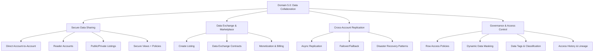
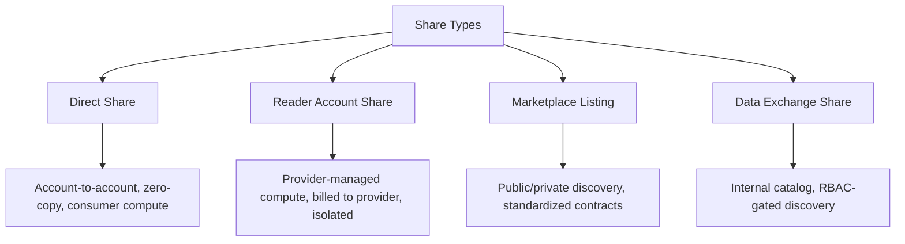
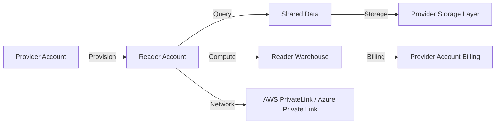
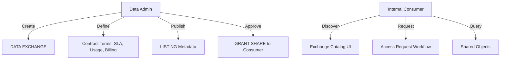
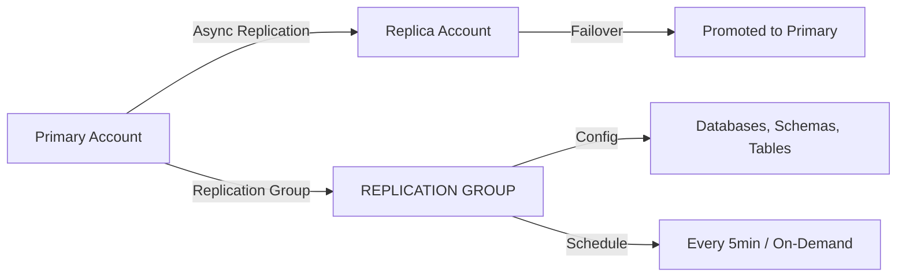
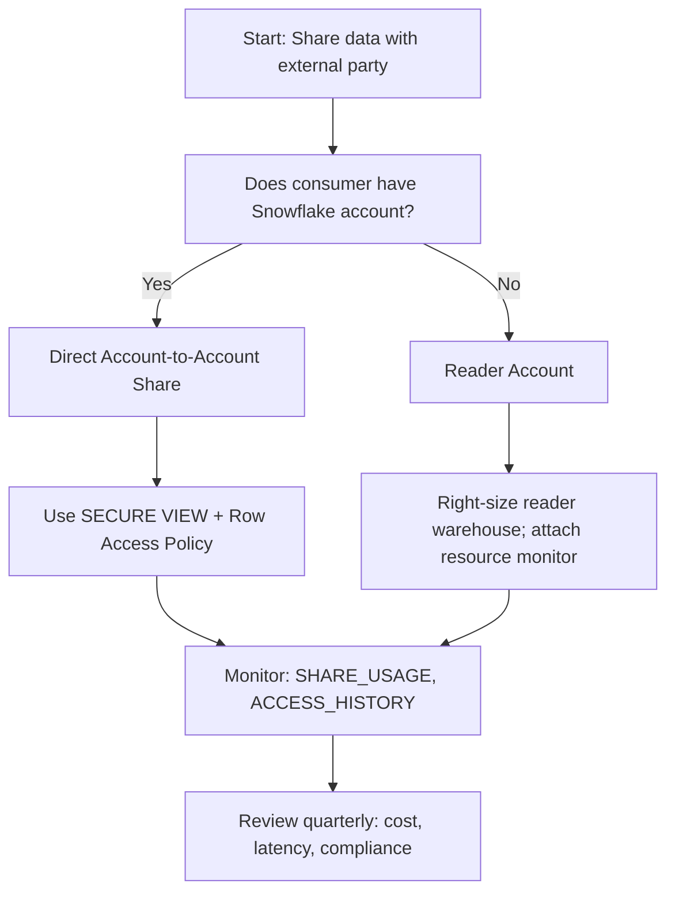

# Domain 5.0: Data Collaboration in Snowflake



---

## 1. Data Collaboration Architecture & Fundamentals

### Core Collaboration Philosophy
Snowflake's collaboration model is **zero-copy, metadata-driven sharing**. No data moves. No ETL. No duplication. Access is granted via metadata pointers to provider storage. Consumers query provider data using their own compute (or provider-managed compute for Reader accounts). This is not a permission toggle—it's a **governance boundary**. If you're sharing raw tables without secure views, you're building a compliance incident.

### Collaboration Pipeline Components
| Component | Purpose | Key Configuration |
|-----------|---------|-------------------|
| **SHARE** | Metadata container for shared objects | `GRANT SELECT ON <object> TO SHARE <name>` |
| **Reader Account** | Provisioned Snowflake account for non-Snowflake consumers | `CREATE MANAGED ACCOUNT`, `ALLOW_LIST`, billing isolation |
| **Data Exchange** | Centralized catalog for internal/external data discovery | `CREATE DATA EXCHANGE`, `LISTING` metadata, contract terms |
| **Secure View** | Encapsulates logic + governance; prevents schema drift | `CREATE SECURE VIEW`, `ROW ACCESS POLICY`, `MASKING POLICY` |
| **Row Access Policy** | Dynamic row-level filtering evaluated at query time | `CREATE ROW ACCESS POLICY`, `APPLY TO <table>` |
| **Dynamic Masking Policy** | Column-level redaction based on role/context | `CREATE MASKING POLICY`, `APPLY TO <column>` |
| **Cross-Account Replication** | Async copy of databases for low-latency regional access | `CREATE REPLICATION GROUP`, `ENABLE FAILOVER` |

### Share Hierarchy & Scope


### Cross-Account Trust Architecture
Secure sharing requires explicit trust establishment. No implicit access.

| Cloud | Trust Mechanism | Configuration Requirement |
|-------|----------------|---------------------------|
| AWS | IAM Role + External ID + Trust Policy | `STORAGE_AWS_ROLE_ARN`, `STORAGE_ALLOWED_LOCATIONS` |
| Azure | Managed Identity / Service Principal + Tenant ID | `AZURE_TENANT_ID`, `STORAGE_ALLOWED_LOCATIONS` |
| GCP | Service Account + Workload Identity Federation | `GCP_PUBSUB_SUBSCRIPTION_NAME`, `STORAGE_ALLOWED_LOCATIONS` |

```sql
-- Provider: Create share with governance layer
CREATE OR REPLACE SHARE partner_analytics_share
  COMMENT = 'v2.3 - Q4 2024 - Secure view + RLS';

-- Grant usage on database/schema (required for object resolution)
GRANT USAGE ON DATABASE sales_db TO SHARE partner_analytics_share;
GRANT USAGE ON SCHEMA sales_db.analytics TO SHARE partner_analytics_share;

-- Create secure view with row-level isolation
CREATE OR REPLACE SECURE VIEW sales_db.analytics.customer_metrics AS
SELECT 
    c.customer_id,
    c.region,
    m.ltv_score,
    CASE 
        WHEN CURRENT_ROLE() IN ('ANALYST', 'PARTNER_ADMIN') THEN m.email_hash 
        ELSE NULL 
    END AS email_hash
FROM sales_db.raw.customers c
JOIN sales_db.raw.metrics m USING (customer_id)
WHERE c.region = CURRENT_ACCOUNT_REGION(); -- Policy evaluated at runtime

-- Grant select on secure view (NOT raw table)
GRANT SELECT ON sales_db.analytics.customer_metrics TO SHARE partner_analytics_share;

-- Add consumer accounts (replace with actual org IDs)
ALTER SHARE partner_analytics_share ADD ACCOUNTS = ('ABC12345', 'XYZ98765');
```

---

## 2. Direct Account-to-Account Sharing

### Core Syntax & Parameters
```sql
-- Provider: Create and configure share
CREATE OR REPLACE SHARE <share_name>
  COMMENT = '<version + purpose>';

GRANT USAGE ON DATABASE <db> TO SHARE <share_name>;
GRANT USAGE ON SCHEMA <db>.<schema> TO SHARE <share_name>;
GRANT SELECT ON <object_type> <db>.<schema>.<object> TO SHARE <share_name>;

ALTER SHARE <share_name> ADD ACCOUNTS = ('<consumer_org_id>', '<consumer_org_id_2>');
ALTER SHARE <share_name> SET SHARE_RESTRICTED_ACCESS = TRUE; -- Optional: IP restriction

-- Consumer: Create database from share
CREATE DATABASE <consumer_db_name> FROM SHARE <provider_org>.<share_name>;

-- Query shared data (uses consumer warehouse by default)
SELECT * FROM <consumer_db_name>.<schema>.<shared_object> WHERE <filter>;
```

### Critical Parameter Behavior
| Parameter | Behavior | When To Use |
|-----------|----------|-------------|
| `SHARE_RESTRICTED_ACCESS` | Forces consumers to connect via approved IPs/VPC endpoints | Compliance-heavy workloads, partner isolation |
| `SECURE VIEW` vs `TABLE` | Secure views encapsulate logic; tables expose raw schema | Always prefer secure views unless schema is immutable |
| `CURRENT_ACCOUNT()` / `CURRENT_ROLE()` | Context functions evaluated at query time | Dynamic row filtering, tenant isolation |
| `ALLOWED_ACCOUNTS` (legacy) | Deprecated; use `ADD ACCOUNTS` | Migration only; avoid in new implementations |
| `COMMENT` on SHARE | Metadata for version tracking, audit trails | Mandatory for production; enables change management |

### Secure View Patterns for Collaboration
```sql
-- Pattern 1: Tenant isolation via explicit filter
CREATE OR REPLACE SECURE VIEW tenant_isolated_view AS
SELECT * FROM raw_data
WHERE tenant_id = CURRENT_TENANT_ID(); -- Custom context function or session variable

-- Pattern 2: Role-based column masking inline
CREATE OR REPLACE SECURE VIEW role_masked_view AS
SELECT 
    order_id,
    order_date,
    CASE 
        WHEN CURRENT_ROLE() = 'PARTNER_ANALYST' THEN MD5(customer_email)
        ELSE customer_email 
    END AS customer_email
FROM raw_orders;

-- Pattern 3: Time-bound access (e.g., trial periods)
CREATE OR REPLACE SECURE VIEW time_limited_view AS
SELECT * FROM premium_data
WHERE CURRENT_DATE() <= (SELECT trial_end_date FROM account_metadata WHERE account_id = CURRENT_ACCOUNT());
```

### Performance Impact of Secure Views
| Metric | Raw Table Share | Secure View Share | Impact |
|--------|----------------|-----------------|--------|
| Query Compilation Time | 5–15ms | 15–45ms | +20–30ms overhead for policy evaluation |
| Bytes Scanned | Direct micro-partition pruning | Same pruning + policy filter pushdown | No I/O penalty if policies are selective |
| Credits Consumed | Consumer warehouse only | Consumer warehouse + minor policy eval CPU | <1% credit increase for typical workloads |
| Cache Hit Rate | High (if query text matches) | Lower (policy context changes cache key) | Mitigate with parameterized queries |

```sql
-- Benchmark: Raw table vs secure view
-- Raw table share query
EXPLAIN USING TABULAR
SELECT COUNT(*) FROM shared_db.raw.orders WHERE order_date > '2024-01-01';

-- Secure view share query (same filter)
EXPLAIN USING TABULAR
SELECT COUNT(*) FROM shared_db.secure.order_metrics WHERE order_date > '2024-01-01';

-- Compare: bytes_scanned, compilation_time, execution_time
```


## 3. Reader Accounts & Managed Collaboration

### Reader Account Architecture
Reader accounts are **fully managed Snowflake accounts** provisioned by the provider for consumers who lack native Snowflake access. Compute is billed to the provider; storage remains provider-owned. Ideal for SaaS vendors, data marketplaces, or external partners.



### Reader Account Configuration
```sql
-- Provider: Create managed account
CREATE MANAGED ACCOUNT partner_reader_account
  ADMIN_NAME = 'partner_admin',
  ADMIN_PASSWORD = 'temp_password_123!', -- Force rotation on first login
  COMMENT = 'Reader account for Partner XYZ - Q4 2024';

-- Retrieve account locator (required for sharing)
SELECT ACCOUNT_LOCATOR FROM TABLE(RESULT_SCAN(LAST_QUERY_ID()));

-- Create share targeting reader account
CREATE OR REPLACE SHARE partner_reader_share;
GRANT USAGE ON DATABASE sales_db TO SHARE partner_reader_share;
GRANT SELECT ON sales_db.analytics.customer_metrics TO SHARE partner_reader_share;
ALTER SHARE partner_reader_share ADD ACCOUNTS = ('<reader_account_locator>');

-- Optional: Restrict network access
ALTER ACCOUNT SET NETWORK_POLICY = partner_access_policy;
```

### Reader Account Billing Model
| Component | Billing Responsibility | Cost Driver |
|-----------|----------------------|-------------|
| **Storage** | Provider | Base table storage + micro-partition overhead |
| **Compute** | Provider | Reader warehouse credits (XSmall–4XLarge) |
| **Cloud Services** | Provider | Query compilation, metadata operations (~10% of compute) |
| **Data Transfer** | Provider (if cross-region) | Cloud provider egress rates ($0.02–$0.12/GB) |

**Cost Optimization**:
- Right-size reader warehouses: `XSmall` for ad-hoc, `Medium` for dashboards.
- Enable auto-suspend: `ALTER WAREHOUSE reader_wh SET AUTO_SUSPEND = 60;`
- Monitor usage: `SELECT * FROM SNOWFLAKE.ACCOUNT_USAGE.MANAGED_ACCOUNTS;`

### Reader Account Limitations & Workarounds
| Limitation | Impact | Workaround |
|------------|--------|------------|
| Read-only access | Consumers cannot write back or create derived tables | Use `EXTERNAL TABLE` + `STREAM` for bi-directional sync patterns |
| No account-level DDL | Consumers cannot create databases, roles, etc. | Pre-provision schema objects; document allowed operations |
| Provider-billed compute | Unexpected spikes hit provider budget | Attach `RESOURCE MONITOR` to reader warehouses; set credit quotas |
| Cross-region latency | 50–200ms added hop for non-local readers | Enable cross-region replication; share from regional replica |


## 4. Data Exchange & Marketplace Collaboration

### Data Exchange Architecture
Data Exchange is a **private catalog** for internal or partner data discovery. Unlike the public Marketplace, it supports custom contracts, RBAC-gated access, and internal governance workflows.



### Data Exchange Configuration
```sql
-- Create private data exchange
CREATE OR REPLACE DATA EXCHANGE internal_analytics_exchange
  COMMENT = 'Internal analytics catalog - Finance, Marketing, Product';

-- Create listing with metadata
CREATE OR REPLACE LISTING customer_360_listing
  DATA_EXCHANGE_NAME = internal_analytics_exchange
  TITLE = 'Customer 360 - Unified Profile'
  DESCRIPTION = 'Aggregated customer behavior, LTV, churn risk. Updated daily.'
  DATA_TYPE = 'TABLE'
  SOURCE_OBJECT = 'sales_db.analytics.customer_360'
  REFRESH_FREQUENCY = 'DAILY'
  SLA = '99.5% availability, <4hr latency'
  USAGE_TERMS = 'Internal use only; no redistribution';

-- Grant discovery access to roles
GRANT USAGE ON DATA EXCHANGE internal_analytics_exchange TO ROLE marketing_analyst;
GRANT READ ON LISTING customer_360_listing TO ROLE marketing_analyst;

-- Consumer: Request access (via UI or API)
-- Admin: Approve and grant share
CREATE OR REPLACE SHARE marketing_customer_share;
GRANT SELECT ON sales_db.analytics.customer_360 TO SHARE marketing_customer_share;
ALTER SHARE marketing_customer_share ADD ACCOUNTS = ('<marketing_org_id>');
```

### Marketplace Listing (Public/Private)
```sql
-- Create private marketplace listing
CREATE OR REPLACE LISTING partner_data_listing
  IN APPLICATION PACKAGE <app_package> -- Optional for app-bound data
  TITLE = 'Partner Transaction Data - Q4 2024'
  DESCRIPTION = 'Anonymized transaction logs for joint analytics'
  DATA_TYPE = 'TABLE'
  SOURCE_OBJECT = 'partner_db.raw.transactions'
  REGIONAL_AVAILABILITY = ('aws-us-east-1', 'aws-eu-west-1')
  CONTRACT_TERMS = 'Standard Partner Agreement v3.1';

-- Publish to marketplace (requires ORGADMIN)
CALL SYSTEM$PUBLISH_LISTING('partner_data_listing');
```

**Monetization**:
- Snowflake handles billing for paid listings; provider sets price per credit or flat fee.
- Usage tracked via `MARKETPLACE_USAGE` views; revenue settled monthly.
- Free listings still incur provider storage/compute costs; monitor `SHARE_USAGE`.


## 5. Governance & Access Control in Collaboration

### Row Access Policy Architecture
Row Access Policies (RAPs) are **dynamic filters** evaluated at query time. They enable tenant isolation, regional compliance, and role-based data segmentation without duplicating data.

```sql
-- Create policy with context-aware logic
CREATE OR REPLACE ROW ACCESS POLICY region_rap AS (region VARCHAR)
RETURNS BOOLEAN ->
  CASE
    WHEN CURRENT_ROLE() = 'GLOBAL_ADMIN' THEN TRUE
    WHEN CURRENT_ROLE() = 'REGIONAL_ANALYST' THEN region = CURRENT_REGION()
    WHEN CURRENT_ROLE() = 'PARTNER_USER' THEN region IN ('US', 'CA')
    ELSE FALSE
  END;

-- Apply to table or view column
ALTER TABLE sales_db.raw.orders
  ADD ROW ACCESS POLICY region_rap ON (region);

-- Apply to secure view (preferred for sharing)
CREATE OR REPLACE SECURE VIEW sales_db.analytics.orders_view AS
SELECT * FROM sales_db.raw.orders; -- Policy inherited from base table

GRANT SELECT ON sales_db.analytics.orders_view TO SHARE partner_share;
```

### Dynamic Masking Policy Patterns
```sql
-- Mask PII based on role
CREATE OR REPLACE MASKING POLICY email_mask AS (val VARCHAR)
RETURNS VARCHAR ->
  CASE
    WHEN CURRENT_ROLE() IN ('ANALYST', 'PARTNER_ADMIN') THEN MD5(val)
    ELSE '***REDACTED***'
  END;

-- Apply to column
ALTER TABLE sales_db.raw.customers
  MODIFY COLUMN email SET MASKING POLICY email_mask;

-- Conditional masking with context
CREATE OR REPLACE MASKING POLICY conditional_ssn AS (val VARCHAR, context VARCHAR)
RETURNS VARCHAR ->
  CASE
    WHEN context = 'AUDIT' THEN val
    WHEN CURRENT_ROLE() = 'COMPLIANCE_OFFICER' THEN val
    ELSE REGEXP_REPLACE(val, '\\d{3}-\\d{2}', 'XXX-XX')
  END;
```

### Tag-Based Classification & Inheritance
```sql
-- Create classification tags
CREATE OR REPLACE TAG data_classification
  COMMENT = 'PII, PCI, PHI, PUBLIC';

CREATE OR REPLACE TAG retention_policy
  COMMENT = '1yr, 3yr, 7yr, perpetual';

-- Apply to columns
ALTER TABLE sales_db.raw.customers
  MODIFY COLUMN email SET TAG data_classification = 'PII',
  MODIFY COLUMN ssn SET TAG data_classification = 'PHI', retention_policy = '7yr';

-- Query tag metadata for audit
SELECT 
  column_name,
  tag_value
FROM TABLE(INFORMATION_SCHEMA.TAG_REFERENCES_ALL_COLUMNS(
  'sales_db.raw.customers', 'TABLE'
))
WHERE tag_name = 'data_classification';
```


## 6. Cross-Account Replication & Disaster Recovery

### Async Replication Architecture
Cross-account replication creates **read-only replicas** of databases in target accounts/regions. Used for low-latency access, DR, or regional compliance.



### Replication Group Configuration
```sql
-- Provider: Create replication group
CREATE REPLICATION GROUP analytics_replication_group
  OBJECT_TYPES = DATABASES
  ALLOWED_DATABASES = sales_db, marketing_db
  TARGET_ACCOUNTS = ('<consumer_org_id>.<region>', '<dr_org_id>.<region>')
  REPLICATION_SCHEDULE = '5 MINUTE'
  IGNORE_EDITION_CHECK = TRUE; -- If target is lower edition

-- Start replication
ALTER REPLICATION GROUP analytics_replication_group ENABLE;

-- Monitor replication lag
SELECT 
  replication_group_name,
  target_account,
  replication_status,
  last_replication_time,
  replication_lag_seconds
FROM TABLE(INFORMATION_SCHEMA.REPLICATION_GROUP_STATUS())
WHERE replication_group_name = 'analytics_replication_group';
```

### Failover/Failback Procedure
```sql
-- Failover: Promote replica to primary (during outage)
FAILOVER REPLICATION GROUP analytics_replication_group
  TO TARGET_ACCOUNT = '<consumer_org_id>.<region>';

-- Verify promotion
SELECT CURRENT_ACCOUNT(), CURRENT_ROLE();

-- Failback: Restore original primary after recovery
-- 1. Re-enable replication from new primary to old
-- 2. Sync data
-- 3. Re-failover to original account (optional)
```

**Critical Considerations**:
- Replication is **async**; RPO = replication interval (default 5min).
- Failover is **manual**; no auto-failover without external orchestration.
- Replicated objects are **read-only** in replica; DML must target primary.
- Storage cost: Replica incurs full storage charges in target account.


## 7. Monitoring, Troubleshooting & Cost Attribution

### Key Monitoring Views
| View | Retention | Key Columns | Use Case |
|------|-----------|-------------|----------|
| `SHARE_USAGE` | 365 days | `share_name`, `consumer_account`, `credits_used`, `bytes_scanned` | Track consumer usage, cost allocation |
| `ACCESS_HISTORY` | 90 days | `query_id`, `user_name`, `objects_accessed`, `row_access_policy_evaluated` | Audit data access, policy effectiveness |
| `REPLICATION_GROUP_STATUS` | Real-time | `replication_lag_seconds`, `last_replication_time`, `replication_status` | Monitor replication health, DR readiness |
| `MATERIALIZED_VIEW_REFRESH_HISTORY` | 365 days | `mv_name`, `refresh_status`, `credits_used`, `duration_ms` | Optimize MV refresh for shared aggregates |
| `POLICY_REFERENCES` | 365 days | `policy_name`, `applied_to_object`, `evaluation_count` | Audit policy usage, identify unused policies |

### Querying Collaboration Metrics
```sql
-- Track share usage by consumer (last 7 days)
SELECT 
  share_name,
  consumer_account_name,
  COUNT(DISTINCT query_id) AS query_count,
  SUM(credits_used) AS total_credits,
  SUM(bytes_scanned) / POWER(1024, 3) AS gb_scanned
FROM SNOWFLAKE.ACCOUNT_USAGE.SHARE_USAGE
WHERE usage_date >= DATEADD(day, -7, CURRENT_DATE())
GROUP BY share_name, consumer_account_name
ORDER BY total_credits DESC;

-- Identify policy evaluation bottlenecks
SELECT 
  query_id,
  user_name,
  execution_time,
  row_access_policy_evaluated,
  masking_policy_evaluated
FROM SNOWFLAKE.ACCOUNT_USAGE.ACCESS_HISTORY
WHERE query_start_time >= DATEADD(hour, -24, CURRENT_TIMESTAMP())
  AND (row_access_policy_evaluated = 'TRUE' OR masking_policy_evaluated = 'TRUE')
  AND execution_time > 5000 -- >5s threshold
ORDER BY execution_time DESC;

-- Monitor replication lag across groups
SELECT 
  replication_group_name,
  target_account,
  replication_status,
  replication_lag_seconds,
  CASE 
    WHEN replication_lag_seconds > 300 THEN '⚠️ Lag >5min'
    WHEN replication_status != 'RUNNING' THEN '❌ Not replicating'
    ELSE '✅ Healthy'
  END AS health_status
FROM TABLE(INFORMATION_SCHEMA.REPLICATION_GROUP_STATUS())
ORDER BY replication_lag_seconds DESC;
```

### Cost Attribution Strategies
| Strategy | Implementation | Savings Impact |
|----------|---------------|----------------|
| **Tag shares with cost center** | `ALTER SHARE <name> SET TAG cost_center = 'marketing'` | Enables chargeback via `TAG_REFERENCES` + `SHARE_USAGE` |
| **Right-size reader warehouses** | Monitor `WAREHOUSE_METERING_HISTORY` for reader accounts | 30–60% credit reduction |
| **Batch DML to reduce cache invalidation** | Schedule provider updates during off-peak; use `ALTER SHARE ... REFRESH` | 20–40% reduction in consumer re-query volume |
| **Use secure views over raw tables** | Encapsulate filtering/masking in view logic | Prevents consumer-side workarounds that increase bytes scanned |
| **Enable cross-region replication for high-latency consumers** | Replicate to consumer region; share locally | 50–200ms latency reduction; fewer retries = lower compute |

### Alerting for Collaboration Issues
```sql
-- Alert on share usage spike (potential abuse or misconfiguration)
CREATE OR REPLACE TASK governance.share_usage_alert
  WAREHOUSE = admin_wh
  SCHEDULE = 'USING CRON 0 */6 * * *' -- Every 6 hours
WHEN (
  SELECT SUM(credits_used)
  FROM SNOWFLAKE.ACCOUNT_USAGE.SHARE_USAGE
  WHERE usage_date >= DATEADD(hour, -6, CURRENT_TIMESTAMP())
    AND share_name = 'partner_analytics_share'
) > 100 -- Threshold: 100 credits per 6hr window
AS
  SYSTEM$SEND_EMAIL(
    'data-governance@company.com',
    'Snowflake Share Usage Alert',
    'Share partner_analytics_share exceeded 100 credits in last 6 hours. Investigate consumer queries.'
  );

-- Alert on replication lag >15min
CREATE OR REPLACE TASK governance.replication_lag_alert
  WAREHOUSE = admin_wh
  SCHEDULE = 'USING CRON */15 * * * *'
AS
  SELECT SYSTEM$SEND_EMAIL(
    'dr-team@company.com',
    'Replication Lag Alert',
    (SELECT LISTAGG(replication_group_name || ' to ' || target_account || ': ' || replication_lag_seconds || 's lag', '\n')
     FROM TABLE(INFORMATION_SCHEMA.REPLICATION_GROUP_STATUS())
     WHERE replication_lag_seconds > 900)
  )
WHERE (
  SELECT COUNT(*)
  FROM TABLE(INFORMATION_SCHEMA.REPLICATION_GROUP_STATUS())
  WHERE replication_lag_seconds > 900
) > 0;
```


## 8. Performance Optimization & Best Practices

### Secure View Optimization Rules
| Rule | Implementation | Impact |
|------|---------------|--------|
| **Push filters into view definition** | `WHERE region = CURRENT_REGION()` vs application-side filtering | Enables micro-partition pruning; reduces bytes scanned by 10–100x |
| **Avoid SELECT *** | Explicit column selection in secure view | Reduces I/O, prevents schema drift exposure |
| **Use clustering on filtered columns** | `CLUSTER BY (region, created_date)` on base table | Improves pruning for row access policies |
| **Cache policy results** | Use `MATERIALIZED VIEW` for static policy segments | Eliminates runtime policy eval for high-frequency queries |

```sql
-- Optimized secure view with pruning hints
CREATE OR REPLACE SECURE VIEW analytics.customer_metrics AS
SELECT 
    customer_id,
    region,
    ltv_score
FROM raw.customers
WHERE region = CURRENT_REGION() -- Filter pushed to storage layer
  AND created_date >= DATEADD(month, -12, CURRENT_DATE()) -- Time-based pruning
CLUSTER BY (region, created_date); -- Clustering aligns with policy
```

### Reader Account Performance Tuning
| Metric | Target | Tuning Action |
|--------|--------|---------------|
| Query latency | <2s for dashboards | Right-size warehouse; enable result cache; pre-aggregate in MV |
| Concurrent queries | <50 per XSmall warehouse | Scale warehouse size or enable multi-cluster warehouse |
| Cache hit rate | >70% for repetitive queries | Parameterize queries; avoid session-specific functions in cache key |
| Replication lag | <5min for DR | Reduce replication interval; monitor network throughput |

### Anti-Patterns to Avoid
| Anti-Pattern | Consequence | Fix |
|--------------|-------------|-----|
| Sharing raw tables without secure views | Schema drift, governance bypass, compliance violations | Wrap all shared objects in `SECURE VIEW` + policies |
| Using `CURRENT_USER()` for tenant routing | Fragile across cross-account sessions; breaks with role changes | Use `CURRENT_ACCOUNT()`, `INVOKER_ROLE()`, or explicit context tables |
| Ignoring cross-region latency | 200ms+ query delays; SLA breaches | Enable cross-region replication; share from regional replica |
| Overusing Reader accounts for internal teams | Unnecessary provider billing; compute isolation overhead | Use direct sharing for internal Snowflake accounts |
| Disabling policy evaluation for "performance" | Data exposure, audit failures | Optimize policies instead; use `SEARCH OPTIMIZATION` on filtered columns |


## 9. Decision Frameworks & Quick Reference

### Collaboration Method Selection


### Governance Layer Selection Matrix
| Requirement | Recommended Approach | Rationale |
|-------------|---------------------|-----------|
| Tenant isolation | Row Access Policy + `CURRENT_TENANT_ID()` | Dynamic, zero-copy, evaluated at query time |
| PII redaction | Dynamic Masking Policy + role context | Column-level control; no data duplication |
| Schema evolution protection | Secure View with explicit column list | Prevents consumer breakage on provider DDL |
| Audit trail | `ACCESS_HISTORY` + policy evaluation logs | Full lineage: who accessed what, when, under which policy |
| Regional compliance | Cross-account replication + region-specific share | Data never leaves approved region; low-latency access |

### Connectivity Quick Syntax for Consumers
```sql
-- Consumer: Create DB from share
CREATE DATABASE partner_data FROM SHARE provider_org.partner_share;

-- Query with context (ensures policy evaluation)
SELECT * FROM partner_data.analytics.metrics 
WHERE region = CURRENT_REGION() -- Explicit filter aligns with policy
  AND query_tag = 'dashboard_v2'; -- For ACCESS_HISTORY tracking

-- Check share metadata
DESCRIBE SHARE provider_org.partner_share;
SHOW GRANTS TO SHARE provider_org.partner_share;
```

### Common Error Codes & Resolutions
| Code | Message | Resolution |
|------|---------|------------|
| `2003` | `Share does not exist or not authorized` | Verify account ID, share name, and `GRANT USAGE` on database/schema |
| `2004` | `Object does not exist or not authorized` | Ensure object is granted to share; check secure view dependencies |
| `2005` | `Consumer account not authorized` | Add consumer to `ALTER SHARE ... ADD ACCOUNTS`; verify org ID format |
| `300001` | `Network policy blocked connection` | Update `ALLOWED_IP_LIST` or connect from approved subnet/VPC |
| `400001` | `Insufficient privileges` | Grant `USAGE` on database/schema to share; verify consumer role context |
| `500012` | `Row access policy evaluation failed` | Check policy logic for NULL handling; test with `EXPLAIN` |


## Key Principles to Remember
1. **Zero-copy is not zero-governance.** Sharing metadata still requires explicit access control, policy enforcement, and audit trails.
2. **Secure views are non-negotiable for production.** Raw table shares bypass your business logic and create schema drift risk.
3. **Context functions (`CURRENT_ACCOUNT()`, `CURRENT_ROLE()`) are your governance lever.** Use them to enforce dynamic isolation without data duplication.
4. **Reader accounts are a billing boundary, not a security boundary.** Isolate compute, but still apply row/masking policies to shared objects.
5. **Replication is async and manual for failover.** Design DR procedures with RPO/RTO targets; test failover quarterly.
6. **Monitor `SHARE_USAGE` and `ACCESS_HISTORY` like your job depends on it.** Because it does—compliance audits start here.
7. **Cost follows design.** Right-size reader warehouses, consolidate small shares, attach resource monitors, and tag for chargeback.

## Bottom Line
- **Sharing** is metadata, not data. Treat `SHARE` objects as governance contracts, not permission toggles.
- **Secure views + policies** are your enforcement layer. Never share raw tables without encapsulation.
- **Reader accounts** solve access, not architecture. Right-size compute, monitor usage, and isolate billing.
- **Replication** enables low-latency collaboration but adds storage cost and operational complexity. Use for DR or regional SLAs only.
- **Monitoring & Attribution** are mandatory. Track `SHARE_USAGE`, `ACCESS_HISTORY`, and `REPLICATION_GROUP_STATUS` continuously.
- **Documentation & Automation** prevent drift. Store share definitions, policies, and replication configs in version-controlled IaC.

Snowflake's collaboration layer is powerful but unforgiving. Measure access patterns, enforce policies at the data layer, monitor continuously, and adjust quarterly. That is how Domain 5.0 operates in production at scale. If you're skipping secure views or ignoring `ACCESS_HISTORY`, you're not collaborating—you're leaking. Fix it before the audit finds it.
